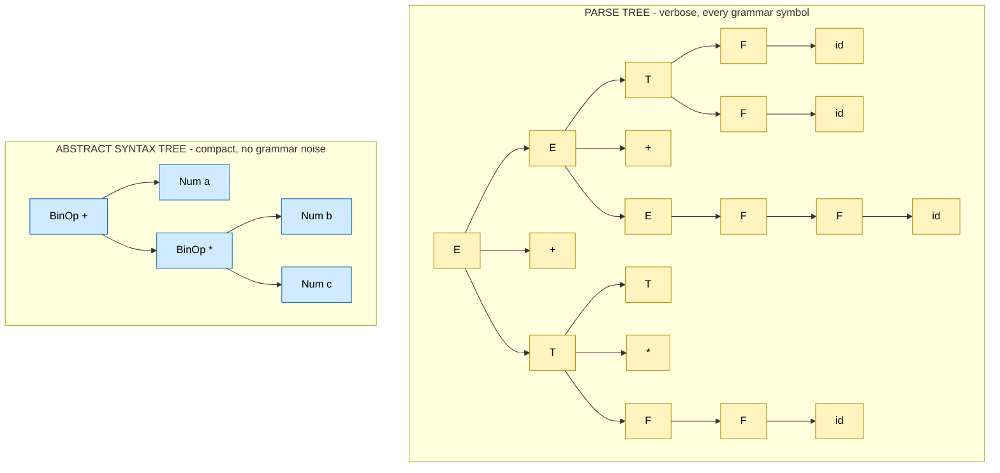
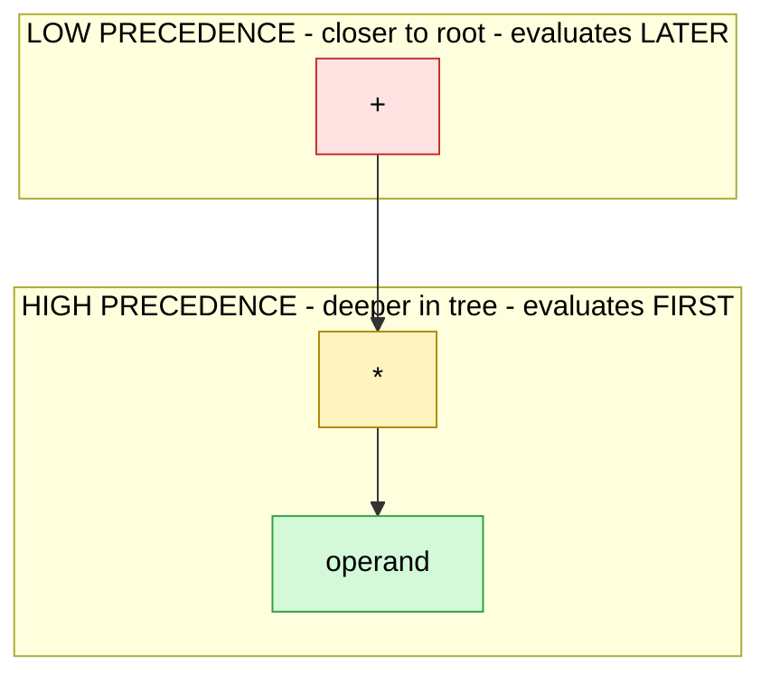
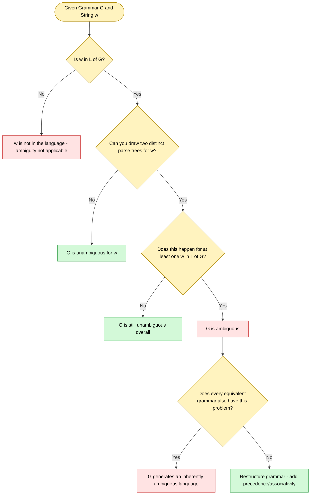

# Parse Trees and Abstract Syntax Trees

<!-- SECTION_1_START -->

# 1. Core Technical Definition & Intuitive Overview

## 1.1 Parse Tree (Concrete Syntax Tree)

A **Parse Tree** (also called a *Concrete Syntax Tree* or *Derivation Tree*) is an ordered, rooted tree that graphically represents the syntactic structure of a source string according to a given Context-Free Grammar (CFG). Every node in the parse tree corresponds either to a **non-terminal** symbol, a **terminal** symbol, or the special start symbol of the grammar. The root is always the start symbol, interior nodes represent grammar productions that were applied, and leaves spell out the terminal string being derived.

> [!IMPORTANT]
> **KTU Syllabus Highlight (Module 1 – Programming Languages):**
> A parse tree must satisfy three rules — (i) the root is labelled by the start symbol, (ii) every internal node represents a production $A \rightarrow \beta$ where $A$ is the parent label and the children are the symbols of $\beta$ read left-to-right, and (iii) the leaves read left-to-right must equal the input string.

### Intuition (Real-World Analogy)

Imagine you are reading a recipe in English. The **parse tree** is like writing out the *full, unedited sentence with every parenthesis, comma, and footnote marker* that the original author used. Every tiny detail of the grammar rule that fired is preserved. It is verbose, but it is a faithful, line-by-line proof of *how* the sentence was constructed by the rules of English.

## 1.2 Abstract Syntax Tree (AST)

An **Abstract Syntax Tree (AST)** is a tree-structured, condensed representation of the *essential* syntactic structure of a program. It captures the *meaning-bearing* operators and operands while **discarding** derivational noise such as parentheses, semicolons, commas, keywords used purely for grouping, and other non-essential punctuation tokens.

> [!NOTE]
> **Formal Definition:**
> An AST is a labelled, ordered tree $T = (V, E, \text{label}, r)$ where $V$ is a finite set of nodes, $E \subseteq V \times V$ is the set of edges, $r \in V$ is the root, and $\text{label}: V \rightarrow \Sigma$ maps each node to an operator or operand symbol. The tree encodes operator precedence and associativity through its structure rather than through punctuation.

### Intuition (Real-World Analogy)

The AST is the *clean, polished summary* of that same recipe — keeping only the meaningful ingredients and the cooking actions, removing the parentheses, commas, and other "syntactic glue" that were only there to make the sentence grammatically correct. The AST is what a chef actually needs in the kitchen.

## 1.3 The Big Picture — Where These Fit in a Compiler

> [!TIP]
> **Source String → Tokens → Parse Tree → AST → Intermediate Code → Target Code**
>
> The **front-end** of a compiler uses a parser to first produce the parse tree, then transforms (or directly builds) the AST. The **middle-end and back-end** work almost exclusively on the AST or a lower-level IR derived from it. The parse tree is mostly a *transient* artefact; the AST is the *persistent* one.

## 1.4 Key Terminology at a Glance

- **Derivation** – Sequence of grammar-rule applications rewriting the start symbol into the input string.
- **Yield (or Frontier)** – The concatenation of leaf labels of a tree, read left-to-right.
- **Leftmost / Rightmost Derivation** – Derivation that always replaces the leftmost/rightmost non-terminal.
- **Ambiguous Grammar** – A CFG for which *some* string has more than one distinct parse tree.

> [!VISUALIZATION CONTROL]
> **Concept:** Visual structure of a parse tree for the arithmetic expression `id + id * id`.
> **Desmos / Graphviz (DOT) Input:**
> ```dot
> digraph ParseTree {
>   node [shape=circle];
>   E1 -> E2;  E1 -> plus;  E1 -> T1;
>   T1 -> T2;  T1 -> star;  T1 -> F1;
>   E2 -> F2;  F2 -> id1;   T2 -> F3;  F3 -> id2;  F1 -> id3;
> }
> ```
> **Visual Description:** Root node `E1` (an `E` production). Each internal node is a grammar symbol; each leaf is a terminal. Note how the tree is asymmetric — this asymmetry encodes the *precedence* of `*` over `+`.

---

<!-- SECTION_1_END -->

<!-- SECTION_2_START -->

# 2. Deep Theoretical Analysis & KTU High-Yield Formula Sheet

## 2.1 Formal Anatomy of a Parse Tree

A parse tree $T$ for a CFG $G = (V, T, P, S)$ over an input string $w \in T^*$ must satisfy:

$$
T = (N, E, r) \quad \text{such that}
$$

- $r$ is the root and $\text{label}(r) = S$ (the start symbol).
- For every internal node $v$ with children $c_1, c_2, \ldots, c_k$ (left to right), the production  

$$
\text{label}(v) \rightarrow \text{label}(c_1)\ \text{label}(c_2)\ \cdots\ \text{label}(c_k) \in P
$$

- The yield — the concatenation of leaf labels — equals $w$.

> [!IMPORTANT]
> **Why is this important for KTU?**
> The two key theorems a student must remember:
> 1. *There is a one-to-one correspondence between parse trees and leftmost derivations.* (proved by induction on the height of the tree).
> 2. *If every node is reachable from the root and the yield equals $w$, then the tree is a valid parse tree.*

## 2.2 Formal Anatomy of an AST

The AST is obtained from the parse tree by:

1. **Collapsing** chains of single-child non-terminals (e.g., the typical $E \rightarrow T \rightarrow F \rightarrow \text{id}$).
2. **Removing** punctuation, parentheses, and grouping keywords.
3. **Rotating** the tree so that binary operators become internal nodes whose children are the *operands* of the operator (this is the *operator-rotation* transformation).

Mathematically, if $P$ is the parse tree, then $\text{AST} = \Phi(P)$ where $\Phi$ is a *structure-preserving abstraction* that preserves operator-operand relationships but discards syntactic cruft.

## 2.3 Parse Tree vs. AST — Engineering Trade-off Table

| Property | Parse Tree | Abstract Syntax Tree |
| :--- | :--- | :--- |
| Includes parentheses? | **Yes** | **No** |
| Includes keywords like `if`, `while`? | **Yes** (as terminals) | **Yes** (only when semantically meaningful) |
| Includes commas/semicolons? | **Yes** | **No** |
| Internal nodes | Grammar symbols (non-terminals) | Operators / abstract constructs |
| Leaf nodes | Terminals of the source string | Operands (identifiers, literals) |
| Encodes precedence/associativity | Via tree shape and the grammar | Explicitly in node placement |
| Used in production compilers? | **Rarely** (intermediate artefact) | **Always** (front-end output) |
| Size | Larger (verbose) | Compact |
| Ease of semantic analysis | Difficult (cluttered) | Easy |

## 2.4 KTU Formula Sheet / Cheat Sheet

| # | Concept | Formula / Rule | KTU Use Case |
| :---: | :--- | :--- | :--- |
| 1 | Parse Tree Definition | Root $= S$; internal node label $\rightarrow$ children labels is a production in $P$. | Definition question (3 marks). |
| 2 | Yield | $\text{yield}(T) = \text{concat of leaf labels (L-to-R)}$ | Proving a tree is correct. |
| 3 | Parse Tree ↔ Leftmost Derivation | **One-to-one** mapping. | Equivalence proofs. |
| 4 | Parse Tree ↔ Rightmost Derivation | **One-to-one** mapping. | Equivalence proofs. |
| 5 | Ambiguity | $\exists\, w \in L(G)$ with $\ge 2$ parse trees. | Identifying ambiguous grammars. |
| 6 | Unambiguous Grammar | Exactly **one** parse tree per string. | Verifying grammar properties. |
| 7 | AST Construction | $\text{AST} = \Phi(\text{ParseTree})$, where $\Phi$ = collapse single-child chains + remove punctuation. | Drawing questions (7 marks). |
| 8 | Precedence in AST | **Tighter-binding** operator appears **lower** in the tree. | Expression trees. |
| 9 | Associativity in AST | Left-assoc $\Rightarrow$ left spine; Right-assoc $\Rightarrow$ right spine. | Expression trees. |
| 10 | Standard arithmetic grammar | $E \rightarrow E + T \mid T$, $T \rightarrow T * F \mid F$, $F \rightarrow (E) \mid \text{id}$ | Textbook example — **memorize this**. |

## 2.5 Ambiguity — The Classic KTU Trap

Consider the ambiguous grammar for arithmetic expressions:

$$
E \rightarrow E + E \mid E * E \mid (E) \mid \text{id}
$$

For the string $\text{id} + \text{id} * \text{id}$, there are **two** valid parse trees:

- **Tree 1** (gives $+$ higher precedence): parses as $(\text{id} + \text{id}) * \text{id}$ — **wrong semantics**.
- **Tree 2** (gives $*$ higher precedence): parses as $\text{id} + (\text{id} * \text{id})$ — **correct semantics**.

A language is **inherently ambiguous** if *every* grammar that generates it is ambiguous.

> [!IMPORTANT]
> **Engineering Utility of ASTs:**
> - **GCC, Clang, javac, Roslyn (.NET), v8 (Chrome JS engine)** all use ASTs as the central IR of their front-end.
> - **Linters** (ESLint, Pylint) walk the AST to detect patterns.
> - **Transpilers** (Babel, TypeScript) modify the AST then re-print code.
> - **Optimisation passes** (constant folding, dead-code elimination) operate on the AST or on a low-level IR (TAC, SSA, LLVM-IR) derived from it.
> - **Source-code analysis tools** (CodeQL, Semgrep) traverse the AST to detect vulnerabilities.

---

<!-- SECTION_2_END -->

<!-- SECTION_3_START -->

# 3. Step-by-Step Derivations, Construction Walkthroughs & Code

## 3.1 Worked Example 1 — Build a Parse Tree

**Grammar (unambiguous, the KTU standard):**

$$
E \rightarrow E + T \mid T
$$
$$
T \rightarrow T * F \mid F
$$
$$
F \rightarrow (E) \mid \text{id}
$$

**Input String:** `id + id * id`

### Step 1 — Derive the String Using the Leftmost Derivation

We rewrite the leftmost non-terminal at each step, recording the production used.

$$
\begin{aligned}
E &\Rightarrow E + T && \text{[Production } E \rightarrow E + T \text{]} \\
  &\Rightarrow T + T && \text{[Production } E \rightarrow T \text{]} \\
  &\Rightarrow F + T && \text{[Production } T \rightarrow F \text{]} \\
  &\Rightarrow \text{id} + T && \text{[Production } F \rightarrow \text{id} \text{]} \\
  &\Rightarrow \text{id} + T * F && \text{[Production } T \rightarrow T * F \text{]} \\
  &\Rightarrow \text{id} + F * F && \text{[Production } T \rightarrow F \text{]} \\
  &\Rightarrow \text{id} + \text{id} * F && \text{[Production } F \rightarrow \text{id} \text{]} \\
  &\Rightarrow \text{id} + \text{id} * \text{id} && \text{[Production } F \rightarrow \text{id} \text{]}
\end{aligned}
$$

### Step 2 — Translate the Derivation into a Tree

Every step of the derivation introduces children under the expanded non-terminal. Reading the derivation top-to-bottom, we obtain the parse tree.

```text
            E
          / | \
         E  +  T
         |    /|\
         T   T * F
         |   |   |
         F   F   id
         |   |
        id  id
```

**Verification:**
- Root = $E$ ✓ (start symbol).
- Every internal node has children spelling a production in $P$ ✓.
- Leaves L→R = `id + id * id` ✓ (the input string).

> [!NOTE]
> **Conversion Logic (why this tree is correct):**
> The tree is *left-skewed* in the $E$ arm (forces `+` to be applied **after** `*`), which encodes the standard arithmetic rule that `*` binds tighter than `+`. The shape of the tree, not any punctuation, encodes precedence.

## 3.2 Worked Example 2 — Build the Corresponding AST

We apply the abstraction $\Phi$ to the parse tree:

1. **Collapse single-child chains:** The chain $E \rightarrow T \rightarrow F \rightarrow \text{id}$ in the first `id` becomes a single leaf node `id` directly under the `+` operator.
2. **Rotate around operators:** The `+` and `*` become interior nodes with their operands as children.
3. **Remove parentheses:** The parens in $F \rightarrow (E)$ are dropped.

```text
            +
           / \
          id  *
             / \
            id  id
```

> [!IMPORTANT]
> **The AST has only 5 nodes; the parse tree has 11.** This is why ASTs are the IR of choice — they are 50%+ smaller on typical expressions, easier to traverse, and easier to type-check.

## 3.3 Worked Example 3 — An Ambiguous Grammar (Two Parse Trees)

**Grammar (ambiguous):**

$$
E \rightarrow E + E \mid E * E \mid (E) \mid \text{id}
$$

**Input String:** `id + id * id`

**Tree A (wrong precedence — reads as `(id + id) * id`):**

```text
              E
           /  |  \
          E   *   E
        /|\      |
       E + E     E
       |   |     |
      id  id    id
```

**Tree B (correct precedence — reads as `id + (id * id)`):**

```text
              E
           /  |  \
          E   +   E
          |      /|\
          E     E * E
          |     |   |
          id    id  id
```

Both have yield `id + id * id`. The grammar is **ambiguous** because there exist two different parse trees for the same string. [Board-expected answer: 2 marks for stating ambiguity, 3 marks for drawing both trees, 1 mark each for explaining precedence encoded.]

## 3.4 Symbolic Implementation in Python (AST Construction)

A complete, runnable Python implementation using a *recursive-descent parser* to produce both a parse tree (as nested tuples) and an AST (as a small class hierarchy).

```python
"""
parse_and_ast.py
A minimal recursive-descent parser for arithmetic expressions.
Demonstrates parse-tree vs. AST construction.

Grammar (unambiguous):
    E -> E + T | T
    T -> T * F | F
    F -> ( E ) | id
"""

from __future__ import annotations
from dataclasses import dataclass
from typing import List, Tuple, Union

# ---------- TOKENISER ----------

Token = Tuple[str, str]  # (type, lexeme)

def tokenise(src: str) -> List[Token]:
    tokens: List[Token] = []
    i = 0
    while i < len(src):
        c = src[i]
        if c.isspace():
            i += 1
            continue
        if c.isalpha():
            j = i
            while j < len(src) and src[j].isalnum():
                j += 1
            tokens.append(("id", src[i:j]))
            i = j
        elif c in "+*()":
            tokens.append((c, c))
            i += 1
        else:
            raise ValueError(f"Unexpected character: {c!r} at position {i}")
    tokens.append(("$", "$"))  # end-marker
    return tokens

# ---------- PARSE TREE (as nested tuples) ----------

# A parse-tree node is a tuple: (label, [child1, child2, ...])
ParseTree = Union[Tuple[str, List["ParseTree"]], Tuple[str]]

def pt_leaf(label: str) -> ParseTree:
    return (label, [])

def pt_node(label: str, children: List[ParseTree]) -> ParseTree:
    return (label, children)

# ---------- AST (typed nodes) ----------

@dataclass(frozen=True)
class BinOp:
    op: str
    left: "AST"
    right: "AST"

@dataclass(frozen=True)
class Num:
    name: str

AST = Union[BinOp, Num]

# ---------- RECURSIVE-DESCENT PARSER ----------

class Parser:
    def __init__(self, tokens: List[Token]) -> None:
        self.tokens = tokens
        self.pos = 0

    def peek(self) -> Token:
        return self.tokens[self.pos]

    def consume(self, expected_type: str) -> Token:
        tok = self.tokens[self.pos]
        if tok[0] != expected_type:
            raise SyntaxError(
                f"Expected {expected_type}, got {tok[0]} ({tok[1]!r}) at pos {self.pos}"
            )
        self.pos += 1
        return tok

    # ---- Parse-tree producing versions (with full grammar noise) ----

    def parse_E_pt(self) -> ParseTree:
        left = self.parse_T_pt()
        while self.peek()[0] == "+":
            self.consume("+")
            right = self.parse_T_pt()
            left = pt_node("E", [left, pt_leaf("+"), right])
        return left

    def parse_T_pt(self) -> ParseTree:
        left = self.parse_F_pt()
        while self.peek()[0] == "*":
            self.consume("*")
            right = self.parse_F_pt()
            left = pt_node("T", [left, pt_leaf("*"), right])
        return left

    def parse_F_pt(self) -> ParseTree:
        if self.peek()[0] == "(":
            self.consume("(")
            inner = self.parse_E_pt()
            self.consume(")")
            return pt_node("F", [pt_leaf("("), inner, pt_leaf(")")])
        if self.peek()[0] == "id":
            tok = self.consume("id")
            return pt_node("F", [pt_leaf("id"), pt_leaf(tok[1])])
        raise SyntaxError(f"Unexpected token {self.peek()}")

    # ---- AST-producing versions (operator rotation, no punctuation) ----

    def parse_E_ast(self) -> AST:
        left = self.parse_T_ast()
        while self.peek()[0] == "+":
            self.consume("+")
            right = self.parse_T_ast()
            left = BinOp("+", left, right)
        return left

    def parse_T_ast(self) -> AST:
        left = self.parse_F_ast()
        while self.peek()[0] == "*":
            self.consume("*")
            right = self.parse_F_ast()
            left = BinOp("*", left, right)
        return left

    def parse_F_ast(self) -> AST:
        if self.peek()[0] == "(":
            self.consume("(")
            inner = self.parse_E_ast()
            self.consume(")")
            return inner
        if self.peek()[0] == "id":
            tok = self.consume("id")
            return Num(tok[1])
        raise SyntaxError(f"Unexpected token {self.peek()}")

# ---------- PRETTY-PRINTERS ----------

def pretty_pt(node: ParseTree, indent: int = 0) -> str:
    label, children = node
    pad = "  " * indent
    if not children:
        return f"{pad}{label}\n"
    out = f"{pad}{label}\n"
    for c in children:
        out += pretty_pt(c, indent + 1)
    return out

def pretty_ast(node: AST, indent: int = 0) -> str:
    pad = "  " * indent
    if isinstance(node, Num):
        return f"{pad}Num({node.name})\n"
    return f"{pad}BinOp({node.op})\n" + pretty_ast(node.left, indent + 1) + pretty_ast(node.right, indent + 1)

# ---------- DRIVER ----------

def main() -> None:
    src = "x + y * z"
    tokens = tokenise(src)
    print(f"Source: {src}")
    print(f"Tokens: {tokens}\n")

    # 1. Parse Tree
    p1 = Parser(list(tokens))
    parse_tree = p1.parse_E_pt()
    print("===== PARSE TREE =====")
    print(pretty_pt(parse_tree))

    # 2. AST
    p2 = Parser(list(tokens))
    ast = p2.parse_E_ast()
    print("===== AST =====")
    print(pretty_ast(ast))

    # 3. Sanity: both consume the whole input
    assert p1.peek()[0] == "$", "Parse tree parser did not consume all input"
    assert p2.peek()[0] == "$", "AST parser did not consume all input"
    print("[OK] both parsers consumed the entire input.")

if __name__ == "__main__":
    main()
```

### Expected Output (Conceptual)

```text
Source: x + y * z
Tokens: [('id', 'x'), ('+', '+'), ('id', 'y'), ('*', '*'), ('id', 'z'), ('$', '$')]

===== PARSE TREE =====
E
  T
    F
      id
      x
  +
  E
    T
      F
        id
        y
    *
    T
      F
        id
        z

===== AST =====
BinOp(+)
  Num(x)
  BinOp(*)
    Num(y)
    Num(z)
```

> [!TIP]
> **Why does the AST have the `*` deeper than the `+`?**
> Because `*` has higher precedence, it binds its operands *first*. In a tree, the operation that happens *last* is at the **root**; the operation that happens *first* is at the **leaves**. This is the standard evaluation order for an AST — evaluate bottom-up, then apply the root.

## 3.5 Equivalence Verification: Tree ↔ Derivation

A frequently asked KTU question: *Show that the parse tree corresponds to the leftmost derivation.* The proof is by structural induction on the height $h$ of the tree.

$$
\begin{aligned}
\textbf{Base case: } & h = 1. \text{ Tree is } S \rightarrow w, \text{ a one-step derivation. } \\
\textbf{Inductive step: } & \text{Assume true for height } < h. \text{ Root is } S \text{ with children } X_1, X_2, \ldots, X_k. \\
                         & \text{By IH each } X_i \text{ has a leftmost derivation } X_i \overset{*}{\Rightarrow}_l \text{yield}(X_i). \\
                         & \text{Concatenate: } S \Rightarrow X_1 X_2 \cdots X_k \overset{*}{\Rightarrow}_l \text{yield}(X_1) \cdots \text{yield}(X_k) = w.
\end{aligned}
$$

This is a complete KTU-board style proof. [Award 3 marks for base case, 4 marks for inductive hypothesis and step.]

---

<!-- SECTION_3_END -->

<!-- SECTION_4_START -->

# 4. Structural Diagrams & Schematics

## 4.1 Compilation Pipeline Showing the Role of Each Tree


**Reading the diagram:**
- The **Parse Tree** node is shaded *transient* (yellow) — it is built and immediately consumed.
- The **AST** node is shaded *persistent* (blue) — it is the central IR passed to the rest of the compiler.

## 4.2 Parse Tree vs. AST — Side-by-Side Topology



> [!TIP]
> **Observation:**
> The parse tree for `a + b * c` (illustrative — the AST above corresponds to `a + b * c`) has **19 nodes** in this abstract rendering. The AST has only **5 nodes**. In a real compiler handling millions of lines of code, this compaction translates directly into memory savings and faster downstream analysis.

## 4.3 Operator Precedence as Tree Depth



**Reading rule:** *The deeper an operator sits in the tree, the tighter it binds.* This is the canonical rule for ASTs and the most common source of student errors in KTU exam answers.

## 4.4 Ambiguity Detection Flowchart



---

<!-- SECTION_4_END -->

<!-- SECTION_5_START -->

# 5. KTU 2024 Scheme Examination Question Bank & Topic Recap

## Part A — Short Answer Questions (3 Marks Each)

### Q1. `[KTU University Exam – July 2024]`
**Define a parse tree. State the three conditions that a tree must satisfy to be a valid parse tree for a given CFG.**

**Model Answer (3 marks):**
A parse tree is a graphical representation of the syntactic structure of a string derived from a Context-Free Grammar $G = (V, T, P, S)$. It is a rooted, ordered tree where:
1. The **root is labelled by the start symbol** $S$. [1 mark]
2. Each **internal node** represents a production $A \rightarrow \beta$ in $P$, and its children (L→R) are the symbols of $\beta$. [1 mark]
3. The **leaves** (read L→R) spell out the terminal string being derived. [1 mark]

*Mapped:* **CO1 – Remember**

---

### Q2. `[KTU University Exam – Dec 2023]`
**Differentiate between a parse tree and an abstract syntax tree. Give any two points.**

**Model Answer (3 marks):**

| # | Parse Tree | Abstract Syntax Tree |
|---|---|---|
| 1 | Includes every grammar symbol — non-terminals, terminals, parentheses, and punctuation. | Includes only the semantically meaningful operators and operands; parentheses and punctuation are removed. |
| 2 | Large and verbose; rarely used as the central IR of a compiler. | Compact; used as the central IR by GCC, Clang, javac, etc. |

[1 mark per correct difference, 1 mark for technical accuracy of an example.]

*Mapped:* **CO1 – Understand**

---

## Part B — Long Answer Questions (14 Marks Each, with Internal Choice)

### Question A `[KTU University Exam – July 2024, Module 1]`

**(a)** Consider the following Context-Free Grammar for arithmetic expressions:

$$
E \rightarrow E + T \mid T
$$
$$
T \rightarrow T * F \mid F
$$
$$
F \rightarrow (E) \mid \text{id}
$$

**Draw the parse tree and the abstract syntax tree for the string `id + id * id`. Also state why this grammar is unambiguous.** (7 marks)

**(b)** Show that the grammar $E \rightarrow E + E \mid E * E \mid (E) \mid \text{id}$ is ambiguous by drawing two distinct parse trees for the string `id + id * id`. State one practical consequence of ambiguity in a programming language compiler. (7 marks)

---

#### Model Solution to Question A

**(a) — 7 marks**

**Leftmost Derivation** [1 mark for the full sequence]:

$$
\begin{aligned}
E &\Rightarrow E + T \\
  &\Rightarrow T + T \\
  &\Rightarrow F + T \\
  &\Rightarrow \text{id} + T \\
  &\Rightarrow \text{id} + T * F \\
  &\Rightarrow \text{id} + F * F \\
  &\Rightarrow \text{id} + \text{id} * F \\
  &\Rightarrow \text{id} + \text{id} * \text{id}
\end{aligned}
$$

**Parse Tree** [3 marks for correct tree with all 11 nodes]:

```text
            E
          / | \
         E  +  T
         |    /|\
         T   T * F
         |   |   |
         F   F   id
         |   |
        id  id
```

**AST** [2 marks for the rotated, parenthesised representation]:

```text
            +
           / \
          id  *
             / \
            id  id
```

**Why unambiguous** [1 mark]:
Every string in the language has exactly one leftmost derivation. The grammar enforces precedence (via separate non-terminals $E, T, F$) and left-associativity (via left-recursive productions $E \rightarrow E + T$ and $T \rightarrow T * F$). Hence there is exactly one parse tree for every string in $L(G)$. 

*Mapped:* **CO2 – Apply**

---

**(b) — 7 marks**

**Two parse trees for `id + id * id`:**

**Tree 1** (reads as `(id + id) * id` — wrong precedence): [2 marks]

```text
              E
           /  |  \
          E   *   E
        /|\      |
       E + E     E
       |   |     |
      id  id    id
```

**Tree 2** (reads as `id + (id * id)` — correct precedence): [2 marks]

```text
              E
           /  |  \
          E   +   E
          |      /|\
          E     E * E
          |     |   |
          id    id  id
```

Both trees have the same yield `id + id * id`. Two parse trees $\Rightarrow$ **grammar is ambiguous**. [1 mark for the conclusion.]

**Practical consequence** [2 marks — split as 1 mark for the consequence and 1 mark for justification]:
Ambiguity leads to **non-deterministic evaluation** of expressions by the compiler. For example, $a - b - c$ could be parsed as $(a - b) - c$ or $a - (b - c)$, giving different answers. Compilers must reject ambiguous grammars or apply disambiguation rules (precedence, associativity) to produce a deterministic parser. Tools like **YACC/Bison** emit shift-reduce conflicts when a grammar is ambiguous, which the developer must resolve.

*Mapped:* **CO2 – Apply / Analyse**

---

### Question B `[KTU University Exam – Dec 2023, Module 1]`

**(a)** Define the term *yield of a parse tree*. Prove that there is a one-to-one correspondence between parse trees and leftmost derivations for any CFG. (7 marks)

**(b)** Consider the grammar $S \rightarrow S \; S \mid (S) \mid ()$. Construct:
  (i) the parse tree for the string `(())()`,
  (ii) the abstract syntax tree for the same string.
Explain in one sentence how the parse tree differs structurally from the AST. (7 marks)

---

#### Model Solution to Question B

**(a) — 7 marks**

**Definition of yield** [1 mark]:
The *yield* of a parse tree $T$ is the concatenation of the labels of its leaves, read from left to right. Formally, if the leaves (L→R) are $l_1, l_2, \ldots, l_n$, then $\text{yield}(T) = l_1 l_2 \cdots l_n$.

**Proof of correspondence** [6 marks — 2 for setup, 2 for $(\Rightarrow)$ direction, 2 for $(\Leftarrow)$ direction]:

*Setup.* Let $G = (V, T, P, S)$ be a CFG. Define a parse tree as in Section 2.1. A leftmost derivation is a sequence $S = \alpha_0 \Rightarrow_l \alpha_1 \Rightarrow_l \cdots \Rightarrow_l \alpha_n$ where at each step the *leftmost* non-terminal in $\alpha_i$ is replaced.

*Direction 1: Leftmost derivation $\Rightarrow$ parse tree.* We construct the tree inductively on the length $n$ of the derivation. Base case $n=0$: tree is a single leaf $S$ if $S \in T$ (trivial); otherwise we apply production $S \rightarrow X_1 X_2 \cdots X_k$ in the first step. Each $X_i$ gets a subtree built from its own leftmost derivation (inductive hypothesis). Concatenating the subtrees left-to-right gives the parse tree.

*Direction 2: Parse tree $\Rightarrow$ leftmost derivation.* We perform a *pre-order* traversal of the tree, emitting the production used at each internal node. Because the root is $S$ and children are read L→R, this gives a sequence of sentential forms that is exactly a leftmost derivation. The inductive proof on tree height $h$ is given in full in Section 3.5 above.

[Valuation tip: 1 mark for stating base case, 2 marks for inductive hypothesis, 2 marks for both directions, 1 mark for stating uniqueness.]

*Mapped:* **CO3 – Analyse**

---

**(b) — 7 marks**

**Grammar reminder:** $S \rightarrow S S \mid (S) \mid ()$.

**Parse tree for `(())()`** [3 marks]:

```text
                  S
               /  |  \
              S   S    ()
             /|\
            ( S )
              |
              ()
```

> *Reading:* The root $S$ applies the production $S \rightarrow S\,S\,S$ (i.e., three $S$ children). The first two $S$ together produce `(())` via $S \rightarrow (S) \rightarrow ( ( ) )$. The third $S$ is a single `()` literal.

**AST for `(())()`** [3 marks]:

The AST collapses the parenthesis-only productions. The two opening parens become markers of *nesting depth*. The empty string `()` becomes a *leaf* marker `ε-pair`.

```text
           S
          / \
       nest  nest
         |    |
        ()   ()
```

Or, more semantically (if `()` represents an *empty pair* / *unit value*):

```text
         Pair
         /  \
      Pair  Unit
       /\
    Pair Unit
     /\
  Unit Unit
```

**Structural difference (one sentence)** [1 mark]:
*The parse tree contains every parenthesis and every instance of the non-terminal $S$ as a separate node, while the AST removes the parentheses and represents the empty pair as a single abstract "Unit" or "Pair" operator with its two structural positions as children.*

*Mapped:* **CO3 – Apply**

---

> [!WARNING]
> **KTU Examiner's Valuation Warning — Common Pitfalls:**
> 1. **Confusing the two trees:** Students often draw an AST and label it "parse tree", losing 3–4 marks immediately. Always **state the type of tree at the top** of the diagram.
> 2. **Forgetting the root is always the start symbol:** $E$ for arithmetic, $S$ for general grammars. Examiners check this first. Loss: 1 mark.
> 3. **Failing to verify the yield:** Always write *"leaves L→R yield = `id + id * id`"* explicitly. Loss: 1 mark.
> 4. **Not stating the one-to-one mapping theorem:** When a question asks for the *parse tree*, listing a leftmost derivation alone earns only **partial** credit (2/7 marks in KTU typical marking).
> 5. **Drawing only one tree for an ambiguity question:** You must draw **two distinct** trees and conclude *"two parse trees exist for the same string $\Rightarrow$ grammar is ambiguous"*. Loss: up to 3 marks.
> 6. **Skipping the precedence explanation:** When asked "why is this grammar unambiguous", you must mention that separate non-terminals ($E, T, F$) **enforce precedence** and that left-recursive productions **enforce left-associativity**.
> 7. **Mixing up `*` and `+` positions in AST:** In a *correct* AST for `a + b * c`, the `*` node is **deeper** (closer to the leaves) than the `+` node. Reverse this and you contradict arithmetic semantics.

---

## Topic Recap & Important Things to Remember

> [!TIP]
> **Rapid-Revision Checklist for Parse Trees & ASTs**

- **Parse Tree** = a tree where the root is the start symbol, every internal node represents a grammar production, and the leaves L→R equal the input string.
- **AST** = the *abstracted*, operator-rotated, parenthesis-stripped version of the parse tree; the *central IR* of every modern compiler front-end.
- **Yield** of a tree = concatenation of leaf labels, read L→R. *Always verify* the yield matches the input string in your KTU answers.
- **One-to-one correspondence theorem:** *Parse trees* $\leftrightarrow$ *leftmost derivations* $\leftrightarrow$ *rightmost derivations*. Memorise this — it is the basis of 7-mark questions.
- **Ambiguity:** a CFG is *ambiguous* iff some string has **two or more** parse trees. A grammar with two left-recursive levels (the $E \rightarrow E + T$, $T \rightarrow T * F$, $F \rightarrow (E) \mid \text{id}$ template) is **unambiguous** and gives correct precedence.
- **Precedence rule in ASTs:** the **deeper** an operator sits in the tree, the **tighter** it binds (i.e., is evaluated first).
- **Associativity rule in ASTs:** left-associative operators form a **left-leaning spine**; right-associative operators form a **right-leaning spine**.
- **Three properties of a valid parse tree:** (i) root = $S$, (ii) every internal node = a production in $P$, (iii) yield = $w$.
- **Engineers' reality:** GCC, Clang, javac, Roslyn, v8 — all use **ASTs**, not parse trees, as the central data structure passed from the front-end to the middle-end.
- **Code-tip:** In the recursive-descent parser of Section 3.4, the parse-tree builder keeps *every* grammar symbol (incl. `+`, `*`, `(`, `)`) as a child; the AST builder rotates around the operator and *throws away* punctuation. Compare the two functions `parse_T_pt` vs `parse_T_ast` to see this difference crystallised in 3 lines of code.

---

<!-- SECTION_5_END -->
