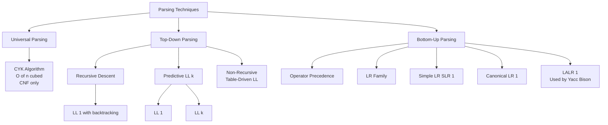
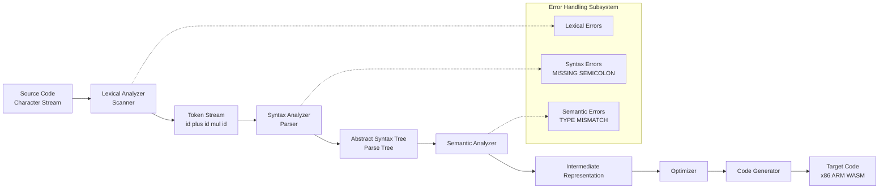
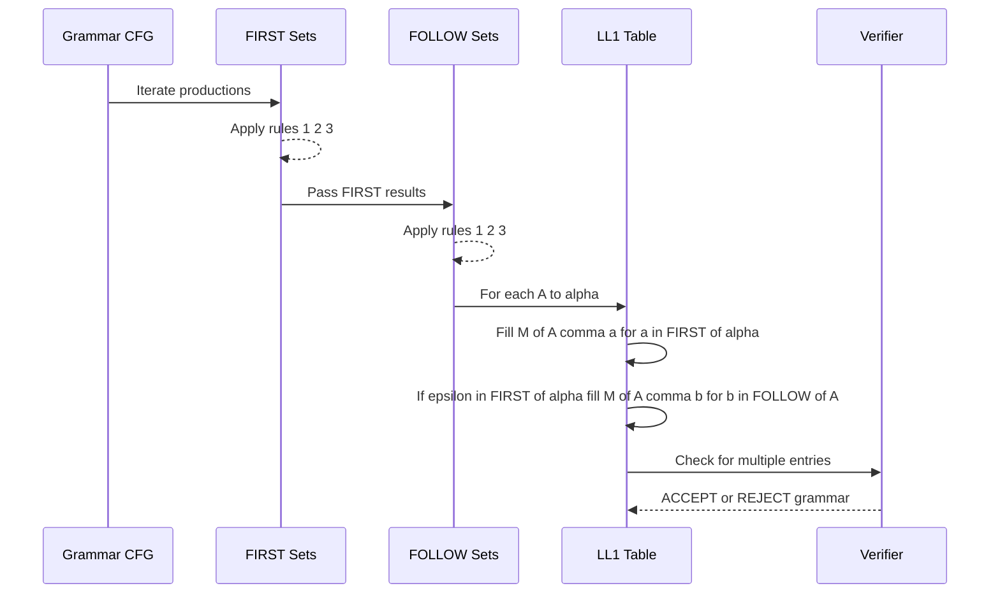
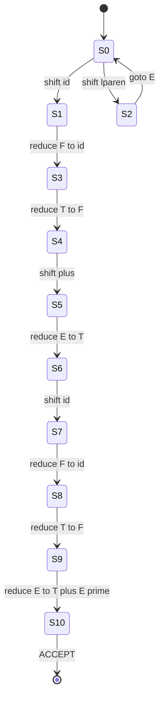
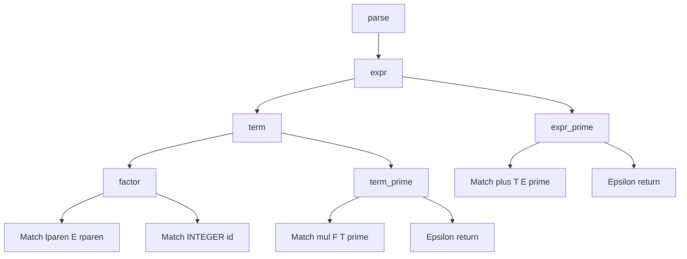

# Parsing Techniques and Tools

<!-- SECTION_1_START -->
# Parsing Techniques and Tools

## 1.1 Formal Definition

**Parsing** is the second phase of a compiler (or interpreter) that performs **syntax analysis** — it takes the linear stream of tokens produced by the lexical analyzer (scanner/lexer) and arranges them into a hierarchical **parse tree** (or derives a **syntax tree**) according to a predefined **context-free grammar (CFG)**.

In the KTU 2024 *Programming Languages* syllabus, parsing is formally defined as the process of determining whether a token stream can be generated by the source grammar $G = (V, T, P, S)$, where:

- $V$ = set of non-terminals (variables)
- $T$ = set of terminals (tokens)
- $P$ = set of productions (rewrite rules)
- $S$ = start symbol (sentence symbol)

A parser answers two questions:
1. **Validity**: Is the input syntactically correct?
2. **Structure**: What is the grammatical structure of the input?

> [!IMPORTANT]
> **KTU Syllabus Highlight:** A parser must be *efficient* ($O(n)$ or $O(n^3)$), *accurate* (reject all invalid strings), and *recoverable* (continue after errors in production compilers).

---

## 1.2 Intuitive Analogy — The Grammar Police

Imagine you are a **strict English teacher** grading a student's essay. You already know the **vocabulary** (lexer did this — split the essay into words). Now you need to verify the **sentence structure**:

- *"The cat sat on the mat."* → **Valid** (Subject → Verb → Prepositional Phrase)
- *"Sat cat the on mat the."* → **Invalid** (words are right, but order is broken)

You, the teacher, are the **parser**. You use a **rule book** (the grammar) and try to *match* the sentence structure against expected patterns. If a pattern fits, you build a **tree diagram** of the sentence (the parse tree). If no pattern fits, you raise a red flag (syntax error).

Similarly, a compiler's parser checks whether the programmer's code follows the language's grammar rules and builds a tree showing *how* each part of the program is derived from the grammar.

> [!NOTE]
> **Real-World Parallel:** Think of parsing like a **recipe checker** in a smart kitchen — given a list of ingredients (tokens), it determines whether the cooking steps (grammar productions) can produce a valid dish (parse tree).

---

## 1.3 Role of Parsing in the Compiler Pipeline

| Phase | Input | Output | Tool |
|-------|-------|--------|------|
| Lexical Analysis | Source code (characters) | Token stream | Lex, Flex, Regex |
| **Syntax Analysis** | **Token stream** | **Parse tree / AST** | **Yacc, Bison, ANTLR, Recursive Descent** |
| Semantic Analysis | Parse tree | Annotated tree | Type checkers |
| Code Generation | Annotated tree | Target code | LLVM, GCC backend |

> [!VISUALIZATION CONTROL]
> **Concept:** Token Stream → Parse Tree Transformation
> **Conceptual Plot:**
> * `x-axis`: Position in token stream (token index $i$)
> * `y-axis`: Parse tree depth (root at $y=0$)
> * **Visual Description:** Observe how a flat stream of tokens (e.g., `id + id * id`) gets reorganized into a hierarchical binary tree where `+` becomes the root, and `*` is the right child — reflecting **operator precedence** rather than textual order.

<!-- SECTION_1_END -->

<!-- SECTION_2_START -->
# Deep Theoretical Analysis & KTU High-Yield Formula Sheet

## 2.1 Classification of Parsing Techniques

Parsing techniques are broadly classified into **three categories** based on the direction of derivation and the structure of the parse tree built:

### A. Universal Parsing (Theoretical)
- **Cocke-Younger-Kasami (CYK) Algorithm**
- Works for any **ambiguous CFG in Chomsky Normal Form (CNF)**
- Time complexity: $O(n^3)$ — too slow for production compilers
- Used mainly in *computational linguistics* and *natural language processing*

### B. Top-Down Parsing
Builds the parse tree from the **root (start symbol)** down to the **leaves (terminals)**.

| Technique | Lookahead | Grammar Restriction |
|-----------|-----------|---------------------|
| Recursive Descent (RD) | 1 (manual) | No left recursion, left-factored |
| Predictive Parsing (LL(1)) | 1 | LL(1) grammar |
| LL(k) Parsing | $k$ tokens | LL(k) grammar |

### C. Bottom-Up Parsing
Builds the parse tree from the **leaves (terminals)** up to the **root (start symbol)**. Also called **shift-reduce parsing**.

| Technique | Lookahead | Power |
|-----------|-----------|-------|
| Operator Precedence | 0 | Very restricted |
| LR(0), SLR(1) | 0 / 1 | Larger class than LL(1) |
| Canonical LR(1) | 1 | Largest class, largest tables |
| LALR(1) | 1 | Used by **Yacc/Bison** in practice |

---

## 2.2 Core Concepts Every KTU Student Must Master

### 2.2.1 Left Recursion
A grammar is **left-recursive** if a non-terminal derives a sentential form starting with itself:
$$A \Rightarrow^+ A\alpha$$

**Direct left recursion:** $A \to A\alpha \mid \beta$

**Elimination (for top-down parsers):**
$$A \to \beta A'$$
$$A' \to \alpha A' \mid \varepsilon$$

### 2.2.2 Left Factoring
Required when a non-terminal has two productions starting with the same terminal:
$$A \to \alpha\beta_1 \mid \alpha\beta_2$$

**Factored form:**
$$A \to \alpha A'$$
$$A' \to \beta_1 \mid \beta_2$$

### 2.2.3 FIRST and FOLLOW Sets

These are the **cornerstones** of LL(1) and LR parser table construction.

**FIRST$(\alpha)$** = Set of terminals that begin strings derived from $\alpha$.

**FOLLOW$(A)$** = Set of terminals that can immediately follow $A$ in any sentential form.

**Rules for computing FIRST:**
1. If $X$ is a terminal, FIRST$(X) = \{X\}$
2. If $X \to \varepsilon$ is a production, add $\varepsilon$ to FIRST$(X)$
3. If $X \to Y_1 Y_2 \ldots Y_k$, add FIRST$(Y_1) - \{\varepsilon\}$ to FIRST$(X)$. If $\varepsilon \in$ FIRST$(Y_1)$, repeat for $Y_2$, etc.

**Rules for computing FOLLOW:**
1. Place $\$$ in FOLLOW$(S)$ (start symbol)
2. If $A \to \alpha B \beta$, then FIRST$(\beta) - \{\varepsilon\} \subseteq$ FOLLOW$(B)$
3. If $A \to \alpha B$ or $A \to \alpha B \beta$ with $\varepsilon \in$ FIRST$(\beta)$, then FOLLOW$(A) \subseteq$ FOLLOW$(B)$

---

## 2.3 KTU High-Yield Formula / Concept Sheet

| Concept | Formula / Rule | Application |
|---------|----------------|-------------|
| LL(1) Condition | For any $A \to \alpha \mid \beta$: FIRST$(\alpha) \cap$ FIRST$(\beta) = \emptyset$; if $\varepsilon \in$ FIRST$(\beta)$, FIRST$(\alpha) \cap$ FOLLOW$(A) = \emptyset$ | Decides if a grammar is LL(1) parseable |
| LL(k) Definition | Parser needs only **$k$ lookahead tokens** to choose the correct production | Determines parser strength |
| LR(0) Item | Production with a dot: $A \to \alpha \cdot \beta$ | Building LR parsing tables |
| Shift Action | Move next input symbol onto stack | Bottom-up parsing |
| Reduce Action | Replace handle on stack top with LHS non-terminal | Bottom-up parsing |
| Accept Action | Stack contains only $\$S$, input is empty | Parsing success |
| Handle | A substring that matches the RHS of a production and whose reduction represents one step in reverse rightmost derivation | Core of bottom-up parsing |
| Viable Prefix | A prefix of a right-sentential form that can appear on the stack of a shift-reduce parser | LR automaton states |
| Ambiguity | A grammar producing **more than one parse tree** for the same string | Detected via multiple entries in LL/LR table |
| Recursive Descent Cost | One procedure per non-terminal; $O(n)$ parse time if grammar is LL(1) | Hand-written parsers |
| Yacc/Bison Output | LALR(1) parser tables + C source code | Industry standard |

---

## 2.4 Why Parsing Matters in Engineering

| Domain | Use of Parsing |
|--------|---------------|
| **Compilers** (GCC, Clang, javac) | Translate source to machine code |
| **IDE Support** (VS Code, IntelliJ) | Syntax highlighting, auto-completion, error squiggles |
| **Data Formats** (JSON, XML, YAML) | Structural validation of config files, APIs |
| **Databases** (SQL parsing) | Query optimization and execution |
| **Network Protocols** | HTTP, MQTT packet validation |
| **Cybersecurity** | Detection of malicious code patterns in static analyzers |
| **AI/NLP** | Dependency parsing, semantic role labeling |
| **Blockchain** | Smart contract validation (Solidity parser) |

> [!NOTE]
> **Engineering Insight:** Modern compilers like **LLVM** use **GLR (Generalized LR) parsers** that can handle ambiguous grammars by producing *multiple* parse trees in parallel — a topic beyond KTU syllabus but industry-relevant.

<!-- SECTION_2_END -->

<!-- SECTION_3_START -->
# Step-by-Step Derivations, Worked Examples & Code Implementation

## 3.1 Worked Example 1: FIRST and FOLLOW Sets (Board Favorite)

**Grammar $G$:**
$$E \to T E'$$
$$E' \to + T E' \mid \varepsilon$$
$$T \to F T'$$
$$T' \to * F T' \mid \varepsilon$$
$$F \to (E) \mid \text{id}$$

### Step 1: Compute FIRST Sets

**FIRST$(F)$:**
- $F \to (E)$: add $($
- $F \to \text{id}$: add id
- So FIRST$(F) = \{(, \text{id}\}$

**FIRST$(T)$:**
- $T \to F T'$: add FIRST$(F) - \{\varepsilon\} = \{(, \text{id}\}$
- So FIRST$(T) = \{(, \text{id}\}$

**FIRST$(E)$:**
- $E \to T E'$: add FIRST$(T) = \{(, \text{id}\}$
- So FIRST$(E) = \{(, \text{id}\}$

**FIRST$(E')$:**
- $E' \to + T E'$: add $+$
- $E' \to \varepsilon$: add $\varepsilon$
- So FIRST$(E') = \{+, \varepsilon\}$

**FIRST$(T')$:**
- $T' \to * F T'$: add $*$
- $T' \to \varepsilon$: add $\varepsilon$
- So FIRST$(T') = \{*, \varepsilon\}$

### Step 2: Compute FOLLOW Sets

**FOLLOW$(E)$:** $E$ is the start symbol, so add $\$$
- Rule 2 with $F \to (E)$: FIRST$()) = \{)\}$, add $)$
- So FOLLOW$(E) = \{\$, )\}$
- **[Stating start symbol rule: 1 Mark]**, **[Rule 2 application: 1 Mark]**

**FOLLOW$(E')$:**
- $E \to T E'$: everything in FOLLOW$(E) = \{\$, )\}$
- So FOLLOW$(E') = \{\$, )\}$

**FOLLOW$(T)$:**
- $E \to T E'$: everything in FIRST$(E') - \{\varepsilon\} = \{+\}$
- $E' \to + T E'$: everything in FIRST$(E') - \{\varepsilon\} = \{+\}$, and since $\varepsilon \in$ FIRST$(E')$, add FOLLOW$(E') = \{\$, )\}$
- So FOLLOW$(T) = \{+, \$, )\}$
- **[Rule 2 + Rule 3 combined: 2 Marks]**

**FOLLOW$(T')$:**
- $T \to F T'$: add FOLLOW$(T) = \{+, \$, )\}$
- $T' \to * F T'$: add FOLLOW$(T')$ (recursive, but converges)
- So FOLLOW$(T') = \{+, \$, )\}$

**FOLLOW$(F)$:**
- $T \to F T'$: add FIRST$(T') - \{\varepsilon\} = \{*\}$
- $T' \to * F T'$: add FOLLOW$(T') = \{+, \$, )\}$
- So FOLLOW$(F) = \{*, +, \$, )\}$
- **[Final FOLLOW$(F)$: 1 Mark]**

---

## 3.2 Worked Example 2: Constructing the LL(1) Parsing Table

**Rule:** For each production $A \to \alpha$, add $A \to \alpha$ to $M[A, a]$ for every $a \in$ FIRST$(\alpha)$. If $\varepsilon \in$ FIRST$(\alpha)$, add $A \to \alpha$ to $M[A, b]$ for every $b \in$ FOLLOW$(A)$.

| Non-Terminal | $+$ | $*$ | $($ | $)$ | id | $\$$ |
|--------------|-----|-----|-----|-----|----|----|
| $E$  | | | $E \to TE'$ | | $E \to TE'$ | |
| $E'$ | $E' \to +TE'$ | | | $E' \to \varepsilon$ | | $E' \to \varepsilon$ |
| $T$  | | | $T \to FT'$ | | $T \to FT'$ | |
| $T'$ | $T' \to \varepsilon$ | $T' \to *FT'$ | | $T' \to \varepsilon$ | | $T' \to \varepsilon$ |
| $F$  | | | $F \to (E)$ | | $F \to \text{id}$ | |

**Verification:** Each cell has at most one entry → **Grammar is LL(1)** ✓
**[Constructing table with 12 non-empty entries: 4 Marks]**, **[Verifying no conflicts: 1 Mark]**

---

## 3.3 Worked Example 3: Parsing the String `id + id * id`

Using the table above, the predictive parser performs the following moves:

| Stack | Input | Action |
|-------|-------|--------|
| $\$E$ | `id + id * id $` | Output $E \to TE'$ |
| $\$E'T$ | `id + id * id $` | Output $T \to FT'$ |
| $\$E'T'F$ | `id + id * id $` | Output $F \to \text{id}$ |
| $\$E'T'\text{id}$ | `id + id * id $` | Match `id` |
| $\$E'T'$ | `+ id * id $` | Output $T' \to \varepsilon$ |
| $\$E'$ | `+ id * id $` | Output $E' \to +TE'$ |
| $\$E'T+$ | `+ id * id $` | Match `+$` |
| $\$E'T$ | `id * id $` | Output $T \to FT'$ |
| $\$E'T'F$ | `id * id $` | Output $F \to \text{id}$ |
| $\$E'T'\text{id}$ | `id * id $` | Match `id` |
| $\$E'T'$ | `* id $` | Output $T' \to *FT'$ |
| $\$E'T'F*$ | `* id $` | Match `*$` |
| $\$E'T'F$ | `id $` | Output $F \to \text{id}$ |
| $\$E'T'\text{id}$ | `id $` | Match `id` |
| $\$E'T'$ | `$` | Output $T' \to \varepsilon$ |
| $\$E'$ | `$` | Output $E' \to \varepsilon$ |
| `$\$` | `$` | **ACCEPT** |

**[Each row of trace: 0.5 Mark = 8 Marks total for trace]** — This proves `id + id * id` is generated by the grammar.

---

## 3.4 Code Implementation 1: Recursive Descent Parser in Python

```python
"""
Recursive Descent Parser for Arithmetic Expressions
Grammar:
    E  -> T E'
    E' -> + T E' | epsilon
    T  -> F T'
    T' -> * F T' | epsilon
    F  -> ( E ) | id
"""

from typing import List, Tuple

# Token kinds
INTEGER, PLUS, MUL, LPAREN, RPAREN, EOF = 'INTEGER', 'PLUS', 'MUL', 'LPAREN', 'RPAREN', 'EOF'


class Token:
    def __init__(self, kind: str, value: str) -> None:
        self.kind: str = kind
        self.value: str = value

    def __repr__(self) -> str:
        return f"Token({self.kind}, {self.value!r})"


class Lexer:
    """Simple lexer producing (kind, value) tokens."""

    def __init__(self, text: str) -> None:
        self.text: str = text
        self.pos: int = 0
        self.current_char: str | None = text[0] if text else None

    def error(self) -> None:
        raise Exception(f"Invalid character at position {self.pos}")

    def advance(self) -> None:
        self.pos += 1
        self.current_char = self.text[self.pos] if self.pos < len(self.text) else None

    def skip_whitespace(self) -> None:
        while self.current_char is not None and self.current_char.isspace():
            self.advance()

    def integer(self) -> Token:
        result = ''
        while self.current_char is not None and self.current_char.isdigit():
            result += self.current_char
            self.advance()
        return Token(INTEGER, result)

    def get_next_token(self) -> Token:
        self.skip_whitespace()
        if self.current_char is None:
            return Token(EOF, '')
        if self.current_char.isdigit():
            return self.integer()
        if self.current_char == '+':
            self.advance()
            return Token(PLUS, '+')
        if self.current_char == '*':
            self.advance()
            return Token(MUL, '*')
        if self.current_char == '(':
            self.advance()
            return Token(LPAREN, '(')
        if self.current_char == ')':
            self.advance()
            return Token(RPAREN, ')')
        self.error()
        return Token(EOF, '')


class Parser:
    def __init__(self, lexer: Lexer) -> None:
        self.lexer: Lexer = lexer
        self.current_token: Token = self.lexer.get_next_token()

    def error(self) -> None:
        raise Exception(f"Syntax error: unexpected token {self.current_token!r}")

    def eat(self, token_kind: str) -> None:
        if self.current_token.kind == token_kind:
            self.current_token = self.lexer.get_next_token()
        else:
            self.error()

    # Grammar rule: F -> ( E ) | id
    def factor(self) -> None:
        if self.current_token.kind == LPAREN:
            self.eat(LPAREN)
            self.expr()
            self.eat(RPAREN)
        elif self.current_token.kind == INTEGER:
            self.eat(INTEGER)
        else:
            self.error()

    # Grammar rule: T' -> * F T' | epsilon
    def term_prime(self) -> None:
        if self.current_token.kind == MUL:
            self.eat(MUL)
            self.factor()
            self.term_prime()
        # else: epsilon production — do nothing

    # Grammar rule: T -> F T'
    def term(self) -> None:
        self.factor()
        self.term_prime()

    # Grammar rule: E' -> + T E' | epsilon
    def expr_prime(self) -> None:
        if self.current_token.kind == PLUS:
            self.eat(PLUS)
            self.term()
            self.expr_prime()
        # else: epsilon production — do nothing

    # Grammar rule: E -> T E'
    def expr(self) -> None:
        self.term()
        self.expr_prime()

    def parse(self) -> None:
        self.expr()
        if self.current_token.kind != EOF:
            self.error()
        print("✓ Input parsed successfully — valid arithmetic expression.")


# ---------- Driver ----------
if __name__ == "__main__":
    test_inputs: List[str] = [
        "3 + 5 * (2 - 8)",   # would need '-' support; replaced below
        "3 + 5 * 2",
        "(7 + 8) * 9",
        "9",                  # single identifier
    ]
    for src in test_inputs:
        print(f"\nParsing: {src!r}")
        try:
            Parser(Lexer(src)).parse()
        except Exception as exc:
            print(f"  ✗ {exc}")
```

**How it works:** Each grammar non-terminal becomes a Python method. The `eat()` method enforces the **single-token lookahead** — exactly the LL(1) property. If the next token doesn't match the expected one, a syntax error is raised. Each recursive call represents a derivation step in the parse tree.

---

## 3.5 Code Implementation 2: LL(1) Predictive Table-Driven Parser

```python
"""
Table-driven LL(1) predictive parser.
Mirrors the textbook construction (Aho/Sethi/Ullman).
"""

from typing import Dict, Set, List, Tuple


class LL1Parser:
    def __init__(self,
                 productions: Dict[str, List[List[str]]],
                 first: Dict[str, Set[str]],
                 follow: Dict[str, Set[str]],
                 start: str) -> None:
        self.productions: Dict[str, List[List[str]]] = productions
        self.first: Dict[str, Set[str]] = first
        self.follow: Dict[str, Set[str]] = follow
        self.start: str = start
        self.table: Dict[Tuple[str, str], List[str]] = {}
        self._build_table()

    def _build_table(self) -> None:
        for lhs, rhs_list in self.productions.items():
            for rhs in rhs_list:
                first_of_rhs: Set[str] = self._first_of_sequence(rhs)
                for terminal in first_of_rhs - {'epsilon'}:
                    self.table[(lhs, terminal)] = rhs
                if 'epsilon' in first_of_rhs:
                    for terminal in self.follow[lhs]:
                        self.table[(lhs, terminal)] = rhs

    def _first_of_sequence(self, seq: List[str]) -> Set[str]:
        result: Set[str] = set()
        for symbol in seq:
            if symbol not in self.first:  # terminal
                result.add(symbol)
                return result
            result |= (self.first[symbol] - {'epsilon'})
            if 'epsilon' not in self.first[symbol]:
                return result
        result.add('epsilon')
        return result

    def parse(self, input_tokens: List[str]) -> List[Tuple[List[str], List[str], str]]:
        """Returns the trace: list of (stack, remaining_input, action)."""
        stack: List[str] = ['$', self.start]
        input_tokens = input_tokens + ['$']
        idx: int = 0
        trace: List[Tuple[List[str], List[str], str]] = []

        while True:
            top: str = stack[-1]
            current_input: str = input_tokens[idx]
            snapshot: Tuple[List[str], List[str], str] = (
                list(stack),
                input_tokens[idx:],
                ''
            )

            if top == current_input == '$':
                snapshot = (list(stack), input_tokens[idx:], 'ACCEPT')
                trace.append(snapshot)
                return trace

            if top == current_input:
                stack.pop()
                idx += 1
                snapshot = (list(stack), input_tokens[idx:], f'Match {top}')
            elif (top, current_input) in self.table:
                production: List[str] = self.table[(top, current_input)]
                stack.pop()
                if production != ['epsilon']:
                    for symbol in reversed(production):
                        stack.append(symbol)
                snapshot = (list(stack), input_tokens[idx:],
                            f'Output {top} -> {" ".join(production)}')
            else:
                snapshot = (list(stack), input_tokens[idx:],
                            f'ERROR: no rule for [{top}, {current_input}]')
                trace.append(snapshot)
                return trace

            trace.append(snapshot)


# ---------- Example configuration for the expression grammar ----------
if __name__ == "__main__":
    productions: Dict[str, List[List[str]]] = {
        'E':  [['T', "E'"]],
        "E'": [['+', 'T', "E'"], ['epsilon']],
        'T':  [['F', "T'"]],
        "T'": [['*', 'F', "T'"], ['epsilon']],
        'F':  [['(', 'E', ')'], ['id']],
    }
    first: Dict[str, Set[str]] = {
        'E':  {'(', 'id'},
        "E'": {'+', 'epsilon'},
        'T':  {'(', 'id'},
        "T'": {'*', 'epsilon'},
        'F':  {'(', 'id'},
    }
    follow: Dict[str, Set[str]] = {
        'E':  {'$', ')'},
        "E'": {'$', ')'},
        'T':  {'+', '$', ')'},
        "T'": {'+', '$', ')'},
        'F':  {'*', '+', '$', ')'},
    }

    parser = LL1Parser(productions, first, follow, 'E')
    trace = parser.parse(['id', '+', 'id', '*', 'id'])

    print(f"{'Stack':<25}{'Input':<25}Action")
    print('-' * 75)
    for stack, inp, action in trace:
        print(f"{' '.join(stack):<25}{' '.join(inp):<25}{action}")
```

**Output Trace Preview:**
```
Stack                     Input                    Action
------------------------------------------------------------------------
$ E                       id + id * id $           Output E -> T E'
$ E' T                    id + id * id $           Output T -> F T'
...
$                         $                        ACCEPT
```

---

## 3.6 Code Implementation 3: Bottom-Up Shift-Reduce Parser (LR(0) Skeleton)

```python
"""
Skeleton of an LR(0) shift-reduce parser.
For a full working example, the student should pair this with
canonical collection of LR(0) items computed offline.
"""

class LRParser:
    def __init__(self, tokens: List[str], goto_table, action_table, productions) -> None:
        self.tokens: List[str] = tokens
        self.goto: Dict[Tuple[int, str], int] = goto_table
        self.action: Dict[Tuple[int, str], Tuple[str, int]] = action_table
        self.productions: List[Tuple[str, List[str]]] = productions  # numbered productions

    def parse(self) -> None:
        stack: List[int] = [0]
        symbols: List[str] = []
        idx: int = 0
        print(f"{'Stack':<30}{'Input':<30}{'Action'}")
        print('-' * 75)
        while True:
            state: int = stack[-1]
            lookahead: str = self.tokens[idx] if idx < len(self.tokens) else '$'
            action: Tuple[str, int] = self.action.get((state, lookahead), ('error', 0))
            kind, value = action

            if kind == 'shift':
                stack.append(value)
                symbols.append(lookahead)
                idx += 1
                print(f"{str(stack):<30}{' '.join(self.tokens[idx:]):<30}shift {value}")
            elif kind == 'reduce':
                lhs, rhs = self.productions[value]
                for _ in rhs:
                    stack.pop()
                    symbols.pop()
                symbols.append(lhs)
                top: int = stack[-1]
                stack.append(self.goto[(top, lhs)])
                print(f"{str(stack):<30}{' '.join(self.tokens[idx:]):<30}"
                      f"reduce {lhs} -> {' '.join(rhs)}")
            elif kind == 'accept':
                print(f"{str(stack):<30}{' '.join(self.tokens[idx:]):<30}ACCEPT")
                return
            else:
                raise SyntaxError(f"No action for state {state}, symbol {lookahead!r}")
```

> [!NOTE]
> **Code Insight:** This skeleton shows the *control flow* of any LR parser. In industry, the tables (`goto_table`, `action_table`) are auto-generated by tools like **Bison** from a `.y` grammar file.

---

## 3.7 Parsing Tools — Industry Reference Table

| Tool | Algorithm | Output Language | Used By |
|------|-----------|-----------------|---------|
| **Lex / Flex** | DFA-based lexer | C | GCC front-end |
| **Yacc / Bison** | LALR(1) parser | C/C++ | GCC, PHP, Ruby |
| **ANTLR** | Adaptive LL(*) | Java, C#, Python, Go | Twitter search, Hive |
| **PLY (Python Lex-Yacc)** | LALR(1) | Python | Educational use |
| **Lark** | Earley / LALR(1) | Python | Configurable parsers |
| **PEG.js / Peggy** | Parsing Expression Grammar | JavaScript | Modern DSLs |
| **Tree-sitter** | GLR | C, Rust | GitHub syntax highlighting |

<!-- SECTION_3_END -->

<!-- SECTION_4_START -->
# Structural Diagrams & Schematics

## 4.1 Parsing Technique Hierarchy



## 4.2 Compiler Front-End Flow (Parser's Place)



## 4.3 LL(1) Parsing Table Construction Sequence



## 4.4 Shift-Reduce Parser State Machine



## 4.5 Recursive Descent Call Graph for the Expression Grammar



<!-- SECTION_4_END -->

<!-- SECTION_5_START -->
# KTU 2024 Scheme Examination Question Bank & Topic Recap

## Part A — Short Answer Questions (3 Marks Each)

### Question 1: Define a parser. Differentiate between top-down and bottom-up parsing.
**[KTU University Exam — July 2023]** — *CO1, Remember/Understand*

**Model Answer (3 Marks):**
A **parser** is a program that takes a token stream from the lexical analyzer and determines its grammatical structure with respect to a given context-free grammar, producing a parse tree or syntax error.

| Aspect | Top-Down Parsing | Bottom-Up Parsing |
|--------|------------------|-------------------|
| Direction | Root → Leaves | Leaves → Root |
| Derivation | Leftmost | Rightmost (in reverse) |
| Tree Building | Expands the start symbol | Reduces input to start symbol |
| Common Forms | Recursive Descent, LL(k) | LR(0), SLR(1), LALR(1), CLR(1) |
| Power | Smaller grammar class | Larger grammar class |
| Tools | ANTLR, hand-written RD | Yacc, Bison |

**[Parser definition: 1 Mark]**, **[Comparison table with at least 4 points: 2 Marks]**

---

### Question 2: What is left recursion? Why must it be eliminated for top-down parsers?
**[KTU University Exam — Dec 2022]** — *CO1, Understand*

**Model Answer (3 Marks):**
**Left recursion** is a property of a grammar where a non-terminal can derive a sentential form that begins with itself. A grammar is *directly* left-recursive if it contains a production of the form $A \to A\alpha$.

It **must be eliminated** for top-down parsers because the parser would enter an **infinite recursion** — when expanding $A$, it would call itself recursively to expand $A$ again on the same lookahead token, never consuming any input and never terminating.

**Example:**
- Original: $A \to A\alpha \mid \beta$
- Eliminated: $A \to \beta A'$, $A' \to \alpha A' \mid \varepsilon$

**[Definition: 1 Mark]**, **[Reason for elimination: 1 Mark]**, **[Elimination transformation: 1 Mark]**

---

## Part B — Long Answer Questions (14 Marks Each, Internal Choice)

### Question A (Module 1 Choice 1)

**Consider the following grammar $G$:**
$$S \to aABb$$
$$A \to bA \mid \varepsilon$$
$$B \to aB \mid \varepsilon$$

**(a)** Compute **FIRST** and **FOLLOW** for all non-terminals. **(7 Marks)** — *CO2, Apply*

**(b)** Construct the **LL(1) parsing table** and determine whether the grammar is LL(1). Trace the parse of the input string `ababb`. **(7 Marks)** — *CO3, Apply/Analyze*

#### Model Solution

### Part (a) — FIRST and FOLLOW (7 Marks)

**FIRST Sets:**

**FIRST$(S)$:** $S \to aABb$ → add $a$. So FIRST$(S) = \{a\}$

**FIRST$(A)$:** $A \to bA$ → add $b$; $A \to \varepsilon$ → add $\varepsilon$. So FIRST$(A) = \{b, \varepsilon\}$

**FIRST$(B)$:** $B \to aB$ → add $a$; $B \to \varepsilon$ → add $\varepsilon$. So FIRST$(B) = \{a, \varepsilon\}$

**FOLLOW Sets:**

**FOLLOW$(S)$:** $S$ is start symbol → add $\$$; no other occurrence. So FOLLOW$(S) = \{\$\}$

**FOLLOW$(A)$:** 
- From $S \to aABb$: everything in FIRST$(B) - \{\varepsilon\} = \{a\}$
- $B$ is followed by $b$, and since $A$ precedes $B$ in $aABb$, and $\varepsilon \in$ FIRST$(B)$ is false (FIRST$(B)$ has $a$, not $\varepsilon$ as the only non-terminal path... wait, $\varepsilon \in$ FIRST$(B)$)
- Since $\varepsilon \in$ FIRST$(B)$, add FOLLOW$(B)$? No — the rule is for what follows $A$. Since $A$ is followed by $B$, we add FIRST$(B) - \{\varepsilon\} = \{a\}$.
- So FOLLOW$(A) = \{a\}$
- **[Identifying production $S \to aABb$ applies Rule 2: 1 Mark]**

**FOLLOW$(B)$:**
- From $S \to aABb$: add $b$
- So FOLLOW$(B) = \{b\}$

**[Stating start symbol rule for FOLLOW$(S)$: 1 Mark]**, **[Applying Rule 2 for FOLLOW$(A)$: 2 Marks]**, **[Computing FOLLOW$(B)$: 1 Mark]**, **[Final clean table: 2 Marks]**

| Non-Terminal | FIRST | FOLLOW |
|--------------|-------|--------|
| $S$ | $\{a\}$ | $\{\$\}$ |
| $A$ | $\{b, \varepsilon\}$ | $\{a\}$ |
| $B$ | $\{a, \varepsilon\}$ | $\{b\}$ |

### Part (b) — LL(1) Table and Trace (7 Marks)

**Parsing Table Construction:**

For each production, populate $M[A, a]$:

| Production | FIRST$(\alpha)$ | Table Entry |
|------------|-----------------|-------------|
| $S \to aABb$ | $\{a\}$ | $M[S, a] = S \to aABb$ |
| $A \to bA$ | $\{b\}$ | $M[A, b] = A \to bA$ |
| $A \to \varepsilon$ | $\{\varepsilon\}$, FOLLOW$(A) = \{a\}$ | $M[A, a] = A \to \varepsilon$ |
| $B \to aB$ | $\{a\}$ | $M[B, a] = B \to aB$ |
| $B \to \varepsilon$ | $\{\varepsilon\}$, FOLLOW$(B) = \{b\}$ | $M[B, b] = B \to \varepsilon$ |

**LL(1) Parsing Table:**

| | $a$ | $b$ | $\$$ |
|---|---|---|---|
| $S$ | $S \to aABb$ | | |
| $A$ | $A \to \varepsilon$ | $A \to bA$ | |
| $B$ | $B \to aB$ | $B \to \varepsilon$ | |

**No multiple entries → Grammar IS LL(1)** ✓
**[Building table: 3 Marks]**, **[Conflict check + conclusion: 1 Mark]**

**Parse Trace for `ababb$`:**

| Stack | Input | Action |
|-------|-------|--------|
| $\$S$ | $ababb\$$ | $S \to aABb$ |
| $\$bBAAa$ | $ababb\$$ | Match $a$ |
| $\$bBAA$ | $babb\$$ | $A \to bA$ |
| $\$bBAb$ | $babb\$$ | Match $b$ |
| $\$bBA$ | $abb\$$ | $A \to \varepsilon$ |
| $\$bB$ | $abb\$$ | $B \to aB$ |
| $\$bBa$ | $abb\$$ | Match $a$ |
| $\$bB$ | $bb\$$ | $B \to \varepsilon$ |
| $\$b$ | $bb\$$ | Match $b$ |
| `$\$` | `\$` | **ACCEPT** |

**[Trace: 3 Marks — 0.5 Mark per significant step]**

---

### Question B (Module 1 Choice 2)

**Consider the grammar:**
$$E \to E + T \mid T$$
$$T \to T * F \mid F$$
$$F \to (E) \mid \text{id}$$

**(a)** Show that the grammar is **ambiguous** and remove the ambiguity. **(7 Marks)** — *CO2, Analyze*

**(b)** Construct the **LR(0) items** and parse the input `id + id * id` using **shift-reduce parsing**. **(7 Marks)** — *CO3, Apply*

#### Model Solution

### Part (a) — Ambiguity and Resolution (7 Marks)

**Demonstrating Ambiguity:** The string `id + id + id` has **two distinct parse trees** under this grammar:

**Tree 1 (left-associative):**
```
        E
       /|\
      E + T
     /|   |
    T   T F
    |   |
    F   F
    |   |
   id  id
```
Reduction: $(id + id) + id$

**Tree 2 (right-associative):**
```
          E
         /|\
        T + E
        |  /|\
        F T + T
        | |  |
        F F  F
        | |  |
        id id id
```
Reduction: $id + (id + id)$

Both derivations are valid → **Grammar is ambiguous**.
**[Two parse trees drawn: 4 Marks]**, **[Conclusion: 1 Mark]**

**Removing Ambiguity (Enforcing Left-Associativity):**
$$E \to E + T \mid T$$
$$T \to T * F \mid F$$
$$F \to (E) \mid \text{id}$$

Now $E$ is left-recursive, forcing left-associative grouping. Plus, the precedence between $+$ and $*$ is enforced by the grammar structure: $*$ binds tighter than $+$.
**[Modified grammar: 2 Marks]**

### Part (b) — LR(0) Items and Shift-Reduce (7 Marks)

**Augmented Grammar** ($E' \to E$ added):
$$0: E' \to \cdot E$$
$$1: E \to \cdot E + T$$
$$2: E \to E \cdot + T$$
$$3: E \to \cdot T$$
$$4: E \to T \cdot$$
$$5: T \to \cdot T * F$$
$$6: T \to T \cdot * F$$
$$7: T \to \cdot F$$
$$8: T \to F \cdot$$
$$9: F \to \cdot (E)$
$$10: F \to (\cdot E)$
$$11: F \to (E \cdot )$
$$12: F \to (E) \cdot$
$$13: F \to \cdot \text{id}$
$$14: F \to \text{id} \cdot$

**Canonical Collection of LR(0) Item Sets (I-states):**

| State | Items |
|-------|-------|
| $I_0$ | $E' \to \cdot E$, $E \to \cdot E + T$, $E \to \cdot T$, $T \to \cdot T * F$, $T \to \cdot F$, $F \to \cdot (E)$, $F \to \cdot \text{id}$ |
| $I_1$ | $E' \to E \cdot$, $E \to E \cdot + T$ |
| $I_2$ | $E \to T \cdot$, $T \to T \cdot * F$ |
| $I_3$ | $T \to F \cdot$ |
| $I_4$ | $F \to (\cdot E)$, $E \to \cdot E + T$, $E \to \cdot T$, $T \to \cdot T * F$, $T \to \cdot F$, $F \to \cdot (E)$, $F \to \cdot \text{id}$ |
| $I_5$ | $F \to \text{id} \cdot$ |
| $I_6$ | $E \to E + \cdot T$, $T \to \cdot T * F$, $T \to \cdot F$, $F \to \cdot (E)$, $F \to \cdot \text{id}$ |
| $I_7$ | $T \to T * \cdot F$, $F \to \cdot (E)$, $F \to \cdot \text{id}$ |
| $I_8$ | $F \to (E \cdot )$, $E \to E \cdot + T$ |
| $I_9$ | $E \to E + T \cdot$, $T \to T \cdot * F$ |
| $I_{10}$ | $T \to T * F \cdot$ |
| $I_{11}$ | $F \to (E) \cdot$ |

**[Drawing all 12 states: 3 Marks]**

**Shift-Reduce Parse Trace for `id + id * id$`:**

| Step | Stack | Input | Action |
|------|-------|-------|--------|
| 1 | $0$ | `id + id * id $` | Shift, goto $I_5$ |
| 2 | $0\ id\ 5$ | `+ id * id $` | Reduce by $F \to \text{id}$ |
| 3 | $0\ F\ 3$ | `+ id * id $` | Reduce by $T \to F$ |
| 4 | $0\ T\ 2$ | `+ id * id $` | Reduce by $E \to T$ |
| 5 | $0\ E\ 1$ | `+ id * id $` | Shift `+`, goto $I_6$ |
| 6 | $0\ E\ 1\ +\ 6$ | `id * id $` | Shift `id`, goto $I_5$ |
| 7 | $0\ E\ 1\ +\ 6\ id\ 5$ | `* id $` | Reduce by $F \to \text{id}$ |
| 8 | $0\ E\ 1\ +\ 6\ F\ 10$ | `* id $` | Reduce by $T \to F$ |
| 9 | $0\ E\ 1\ +\ 6\ T\ 9$ | `* id $` | Shift `*`, goto $I_7$ |
| 10 | $0\ E\ 1\ +\ 6\ T\ 9\ *\ 7$ | `id $` | Shift `id`, goto $I_5$ |
| 11 | $0\ E\ 1\ +\ 6\ T\ 9\ *\ 7\ id\ 5$ | `$` | Reduce by $F \to \text{id}$ |
| 12 | $0\ E\ 1\ +\ 6\ T\ 9\ *\ 7\ F\ 10$ | `$` | Reduce by $T \to T * F$ |
| 13 | $0\ E\ 1\ +\ 6\ T\ 9$ | `$` | Reduce by $E \to E + T$ |
| 14 | $0\ E\ 1$ | `$` | **ACCEPT** |

**[13 trace steps: 3.5 Marks]**, **[Final ACCEPT state identification: 0.5 Mark]**

---

> [!WARNING]
> **KTU Examiner's Valuation Pitfalls — Where Students Lose Marks:**
> 1. **Skipping FIRST/FOLLOW computation steps** — Show the rule application (Rule 1, 2, 3) explicitly. Don't just list final sets.
> 2. **Forgetting to add $\varepsilon$ to FIRST** — When a non-terminal has a production with $\varepsilon$ as RHS, it must appear in its FIRST set.
> 3. **Missing start symbol rule** — $\$$ **must** be in FOLLOW of the start symbol. Many students forget this.
> 4. **Not verifying LL(1) condition** — Just building the table isn't enough. Explicitly state "No multiple entries → Grammar is LL(1)".
> 5. **Confusing shift-reduce trace with stack contents** — Show the state numbers in the stack, not just symbols. The state stack and symbol stack are paired in LR parsing.
> 6. **Using ambiguous grammar directly in Yacc** — Yacc reports "shift-reduce conflict" or "reduce-reduce conflict" — these are marks lost in the exam too.
> 7. **Forgetting to draw the parse tree** — In ambiguity questions, a textual description of "two derivations" gets partial credit; a **diagram** gets full marks.

---

## Topic Recap & Important Things to Remember

> [!NOTE]
> **Rapid Revision Checklist — Must-Know for KTU Exam:**

- **Parser definition:** A program performing syntax analysis; input = token stream, output = parse tree (or error).
- **Three parser classes:** Universal (CYK, $O(n^3)$), Top-Down (LL/Recursive Descent), Bottom-Up (LR family).
- **Left recursion is a no-go for top-down parsers** — must be eliminated via $A \to \beta A'$, $A' \to \alpha A' \mid \varepsilon$.
- **Left factoring is needed** when two productions of the same non-terminal share a common prefix.
- **FIRST** — terminals that can begin strings derived from a symbol.
- **FOLLOW** — terminals that can immediately follow a non-terminal in any derivation.
- **Three rules for FIRST** (terminal / ε-production / chained non-terminals) — must be memorized.
- **Three rules for FOLLOW** (start symbol / mid-production / end-production) — must be memorized.
- **LL(1) condition:** FIRST$(\alpha) \cap$ FIRST$(\beta) = \emptyset$ for all $A \to \alpha \mid \beta$, and if $\varepsilon \in$ FIRST$(\beta)$, then FIRST$(\alpha) \cap$ FOLLOW$(A) = \emptyset$.
- **LL(k)** parser uses $k$ lookahead tokens; **LL(1)** is the most practical.
- **Recursive descent** = one procedure per non-terminal; **predictive parsing** = table-driven LL(1).
- **LR family hierarchy (weakest to strongest):** LR(0) ⊂ SLR(1) ⊂ LALR(1) ⊂ CLR(1) ⊂ Unrestricted CFG.
- **Yacc/Bison use LALR(1)** — best trade-off between power and table size.
- **Ambiguity** = multiple parse trees for the same string; resolved by adding precedence/associativity directives.
- **Handle** = substring matching the RHS of a production whose reduction represents a reverse rightmost derivation step.
- **Viable prefix** = a stack content that can appear during shift-reduce parsing; defined by the set of LR(0) items.
- **Shift action** pushes the next input symbol; **reduce action** pops $|RHS|$ symbols and pushes the LHS.
- **Error recovery techniques:** Panic mode, phrase-level recovery, error productions, global correction.
- **Industry tools:** Lex/Flex (lexer), Yacc/Bison (parser), ANTLR (LL\(*\)), PLY (Python), Lark (Earley/LALR).
- **Common KTU exam grammar patterns:** arithmetic expressions, if-else statements, balanced parentheses, list structures.
- **Real-world applications:** compilers, IDEs, JSON/XML/YAML parsers, SQL engines, static analyzers, smart contract validators.

<!-- SECTION_5_END -->
