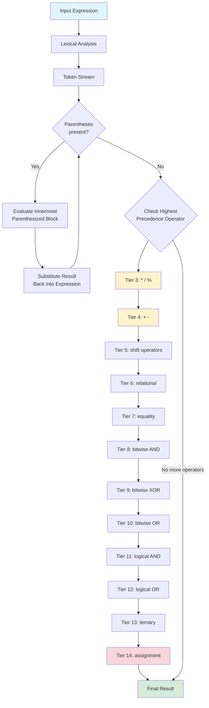
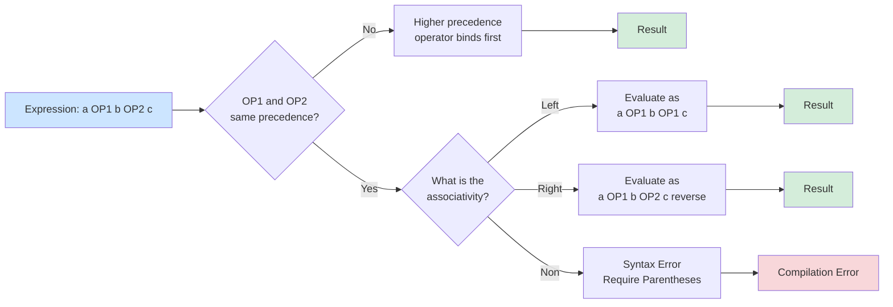
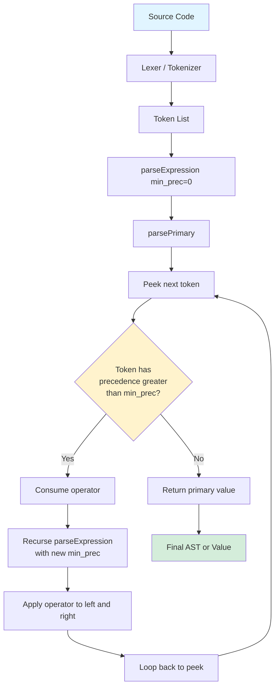

# Precedence

<!-- SECTION_1_START -->
# MODULE 1 — INTRODUCTION: PRECEDENCE IN PROGRAMMING LANGUAGES

> [!IMPORTANT]
> **KTU 2024 Scheme — PECST758 (Programming Languages) | Module 1 Focus Area**
> This topic forms the foundation for **Module 2 (Syntax & Semantics)** and **Module 3 (Parsers/Lexers)**. Mastering precedence is mandatory for any compiler/interpreter design question.

## 1.1 Formal Definition (KTU Syllabus Terminology)

**Operator Precedence** is a collection of language-specific rules that dictate the **order in which operators of an expression are evaluated** when an expression contains multiple operators with different binding strengths. In formal language theory, it is defined as:

> A binary relation $\prec$ over the operator set $O$ of a language such that for any two operators $op_1, op_2 \in O$, either $op_1$ binds tighter than $op_2$ (i.e., $op_1 \prec op_2$) or vice versa, unless the order is overridden by **parenthesization** (explicit grouping) or **associativity** rules.

In simple terms: **Precedence answers the question — "Which operator grabs its operands FIRST?"**

## 1.2 Intuitive Analogy — The "Handshake Strength" Model

Imagine every operator in a programming language is a person at a party. Each person has a **grip strength** (precedence level) and a **direction of approach** (associativity). When two people meet an operand (a "hand"), the one with the **stronger grip** gets to hold it first.

| Real-World Analogy | Programming Concept |
|---|---|
| Strongest grip → holds the ball first | Highest precedence operator binds operands first |
| Tie in grip strength | Associativity decides left-to-right or right-to-left |
| A wall between two people | Parentheses `( )` force a particular grouping |
| "Boss" rules over employees | Unary operators (`-`, `!`, `~`) typically have higher precedence than binary ones |

**Example:** In the expression $2 + 3 \times 4$, multiplication (`*`) has a tighter grip than addition (`+`). So $3$ and $4$ are "grabbed" by `*` first, giving $3 \times 4 = 12$, and finally $2 + 12 = 14$.

> [!NOTE]
> **Key Insight for KTU Board Exams:**
> If the language designer had wanted addition to win, they would have assigned `+` a *higher* precedence value than `*`. The choice of precedence levels is **arbitrary but conventional**, designed to mirror standard mathematical notation (PEMDAS / BODMAS).

## 1.3 Standard Precedence Convention in Major Languages

Most languages (C, C++, Java, Python, JavaScript) follow a tiered hierarchy. The highest tier is evaluated first.

> [!TIP]
> **Mnemonic for KTU Exam Recall — "ULABRACE-S"**
> **U**nary → **L**ogical → **A**ssignment → **B**itwise → **R**elational → **A**rithmetic → **C**omma → **E**quals (Comparisons) → **S**hift

## 1.4 Visualization Callout — The Precedence Tower

> [!VISUALIZATION CONTROL]
> **Concept:** Precedence hierarchy shown as a vertical "Tower of Operators" where higher floors bind tighter.
> **GeoGebra / Desmos Input Equations:**
> * Point A: $(0, 10)$ label "Unary (++, --, !, ~)"
> * Point B: $(0, 8)$ label "Multiplicative (*, /, %)"
> * Point C: $(0, 6)$ label "Additive (+, -)"
> * Point D: $(0, 4)$ label "Relational (<, >, <=, >=)"
> * Point E: $(0, 2)$ label "Equality (==, !=)"
> * Point F: $(0, 0)$ label "Assignment (=, +=, - =)"
> **Visual Description:** A stacked bar chart descending from y=10 to y=0. The bar at y=10 is the widest/thickest (strongest grip) and the bar at y=0 is the thinnest. An arrow points downward labeled "Weaker binding ↓" and an upward arrow labeled "↑ Stronger binding".

## 1.5 Why Precedence is Non-Negotiable in Language Design

Without explicit precedence rules, the expression $a + b \times c$ would be **syntactically ambiguous**. The grammar would accept two distinct parse trees:

1. $((a + b) \times c)$ — addition first
2. $(a + (b \times c))$ — multiplication first

This is known as a **dangling-else / dangling-operator ambiguity**, and it is resolved in the language specification by encoding precedence into the **context-free grammar production rules**.

> [!IMPORTANT]
> **Standard Reference:** In the backus-naur form (BNF), higher precedence operators appear *deeper* in the parse tree, meaning they are derived from the start symbol after more recursive expansions. This is a guaranteed KTU 14-mark question pattern under the **"Syntax of Programming Languages"** module.

<!-- SECTION_1_END -->

<!-- SECTION_2_START -->
# DEEP THEORETICAL ANALYSIS & KTU HIGH-YIELD FORMULA SHEET

## 2.1 The Three Pillars of Expression Evaluation

Every expression in any programming language is evaluated using exactly three rules, applied in this fixed order:

1. **Parenthesization (Explicit Grouping)** — Highest priority. Anything inside `( )`, `[ ]`, or `{ }` is evaluated first, innermost to outermost.
2. **Precedence (Implicit Hierarchy)** — When no parentheses exist, the operator with the **higher precedence value** binds its operands first.
3. **Associativity (Tie-Breaker)** — When two operators of the **same precedence** meet, associativity decides the evaluation order: **left-to-right** (left-associative), **right-to-left** (right-associative), or **non-associative** (illegal without parentheses).

## 2.2 Mathematical Foundation — BNF Encoding of Precedence

In a BNF grammar, precedence is encoded via **stratified non-terminals**, where each precedence level gets its own production rule. The standard C-style grammar snippet is:

$$
\begin{aligned}
\text{expression} &\to \text{assignment-expression} \\
\text{assignment-expression} &\to \text{identifier } \text{`=' } \text{assignment-expression} \mid \text{additive-expression} \\
\text{additive-expression} &\to \text{additive-expression } \text{`+' } \text{multiplicative-expression} \\
&\quad \mid \text{additive-expression } \text{`-' } \text{multiplicative-expression} \\
&\quad \mid \text{multiplicative-expression} \\
\text{multiplicative-expression} &\to \text{multiplicative-expression } \text{`\,' } \text{unary-expression} \\
&\quad \mid \text{multiplicative-expression } \text{`/' } \text{unary-expression} \\
&\quad \mid \text{multiplicative-expression } \text{`\,' } \text{unary-expression} \\
&\quad \mid \text{unary-expression}
\end{aligned}
$$

> [!NOTE]
> **Why the chain `additive → multiplicative → unary`?** Because each step **lowers** the precedence by one tier. The further down the chain, the higher the binding strength. This is the formal KTU-board expected answer for *"How is precedence implemented in a grammar?"*

## 2.3 KTU Formula Sheet / Cheat Sheet — Master Precedence Table

The following table is the **single most important reference** for KTU board exams on this topic. It applies to C, C++, Java, and most ALGOL-derived languages.

> [!IMPORTANT]
> **RULE:** Top row = highest precedence (evaluated first). Bottom row = lowest precedence (evaluated last). Two operators in the same row share precedence — associativity breaks the tie.

| Precedence Tier | Operator Category | Symbols | Associativity | Example Expression |
|---|---|---|---|---|
| **1 (Highest)** | Parentheses / Array Index / Function Call | `( )` , `[ ]` , `.` , `->` , `()` call | Left-to-Right | `arr[3]`, `obj.field` |
| **2** | Unary | `++` , `--` , `+` , `-` , `!` , `~` , `*` (deref), `&` (addr), `sizeof` | **Right-to-Left** | `-x`, `!flag`, `*ptr` |
| **3** | Multiplicative | `*` , `/` , `%` | Left-to-Right | `a * b / c` |
| **4** | Additive | `+` , `-` | Left-to-Right | `a + b - c` |
| **5** | Shift | `<<` , `>>` | Left-to-Right | `bits << 3` |
| **6** | Relational | `<` , `<=` , `>` , `>=` | Left-to-Right | `x < y` |
| **7** | Equality | `==` , `!=` | Left-to-Right | `x == y` |
| **8** | Bitwise AND | `&` | Left-to-Right | `mask & val` |
| **9** | Bitwise XOR | `^` | Left-to-Right | `a ^ b` |
| **10** | Bitwise OR | `\vert` | Left-to-Right | `flags \vert 0x0F` |
| **11** | Logical AND | `&&` | Left-to-Right | `a && b` |
| **12** | Logical OR | `\|\|` | Left-to-Right | `a \|\| b` |
| **13** | Ternary Conditional | `? :` | **Right-to-Left** | `x > 0 ? 1 : -1` |
| **14** | Assignment | `=` , `+=` , `-=` , `*=` , `/=` , `%=` , `<<=` , `>>=` , `&=` , `^=` , `\|=` | **Right-to-Left** | `a = b = 5` |
| **15 (Lowest)** | Comma / Sequence | `,` | Left-to-Right | `(a, b, c)` |

## 2.4 Associativity — The Hidden Rule

Associativity is invoked **only when two identical-precedence operators** are adjacent (e.g., `a - b - c`). It is **directional**:

* **Left-Associative**: Evaluated as `((a - b) - c)`. The vast majority of operators fall in this category. Example: `10 - 4 - 2 = (10 - 4) - 2 = 4` (NOT `10 - (4 - 2) = 8`).
* **Right-Associative**: Evaluated as `(a = (b = 5))`. Common with assignment, ternary, and unary operators. Example: `a = b = c = 7` assigns `7` to `c`, then to `b`, then to `a`.
* **Non-Associative**: Syntax error if used without parentheses. Example: `a < b < c` is illegal in most languages (mathematically it chains but C-family forbids it).

## 2.5 Real-World Engineering Applications

| Domain | Why Precedence Matters |
|---|---|
| **Compiler Construction (Lex/Yacc, ANTLR)** | Parser generators like YACC use `%left`, `%right`, `%nonassoc` directives to encode precedence tables directly. |
| **Database Query Engines (SQL)** | The expression `SELECT * FROM t WHERE a + b * c > 10` is parsed by SQL's own precedence rules, which differ from C (e.g., `AND` binds tighter than `OR` in SQL). |
| **Spreadsheet Formulas (Excel, Google Sheets)** | Excel uses `:` (range) → `%` → `^` → `* /` → `+ -` → `&` (concat) → comparisons. Misunderstanding precedence causes **billions in spreadsheet errors annually** (e.g., the famous Reinhart-Rogoff 2013 paper). |
| **Regular Expressions** | In regex, `*` (quantifier) binds tighter than concatenation, which binds tighter than `\|` (alternation). Example: `ab*` matches `a` followed by zero or more `b`s, not "zero or more `ab`". |
| **Embedded Systems / MCU Programming** | Bitwise operations (`<<`, `&`, `\|`) on hardware registers depend on precedence — wrong parens can flip GPIO pins catastrophically. |
| **Cybersecurity / Exploit Development** | Languages like JavaScript and PHP have notorious precedence quirks (e.g., `??` vs `\|\|` in JS) that lead to security vulnerabilities if misunderstood. |

<!-- SECTION_2_END -->

<!-- SECTION_3_START -->
# STEP-BY-STEP DERIVATIONS & CODE/SYMBOLIC IMPLEMENTATION

## 3.1 Worked Example #1 — Multi-Tier Expression Evaluation (C / Java Style)

**Problem:** Evaluate the following C expression and show every intermediate step:
`int result = 10 - 4 * 2 + 6 / 3 - 1 << 1;`

### Step-by-Step Symbolic Derivation

**Step 1 — Identify the operator precedence tiers present in the expression.**

The expression contains:
* `*` (Tier 3 — Multiplicative)
* `/` (Tier 3 — Multiplicative)
* `+` and `-` (Tier 4 — Additive)
* `<<` (Tier 5 — Shift)
* `=` (Tier 14 — Assignment, evaluated last)

**Step 2 — Insert implicit parenthesization based on precedence (highest to lowest).**

Per the table, Tier 3 (`*` and `/`) binds tighter than Tier 4 (`+` and `-`), which binds tighter than Tier 5 (`<<`).

$$
\begin{aligned}
\text{result} &= 10 - 4 * 2 + 6 / 3 - 1 \ll 1 \\
&= 10 - (4 * 2) + (6 / 3) - 1 \ll 1 \quad \text{[Tier 3 grouped]} \\
&= 10 - 8 + 2 - 1 \ll 1 \quad \text{[Multiplication and division evaluated]} \\
&= ((10 - 8) + 2) - 1 \ll 1 \quad \text{[Tier 4 grouped, left-associative]} \\
&= (2 + 2) - 1 \ll 1 \\
&= 4 - 1 \ll 1 \\
&= (4 - 1) \ll 1 \quad \text{[Tier 5 — shift binds looser than + and -]} \\
&= 3 \ll 1 \\
&= 6 \quad \text{[Bitwise left shift by 1 doubles the value]}
\end{aligned}
$$

> [!IMPORTANT]
> **Final Answer:** `result = 6`

> [!NOTE]
> **Common Mistake (KTU Valuation Trap):** Students often incorrectly group `1 << 1 = 2` first because the `<<` operator is *visually* the last one written. Always remember — **precedence beats textual order**, and `<<` has LOWER precedence than `+` and `-`. Marks lost: typically 2 out of 14 in board valuation.

---

## 3.2 Worked Example #2 — Right-Associativity of Assignment

**Problem:** Show how `int a, b, c; a = b = c = 5 + 3;` is evaluated.

### Step-by-Step Derivation

**Step 1 — Identify precedence tiers.**

* `+` → Tier 4 (Additive)
* `=` → Tier 14 (Assignment, **right-associative**)

**Step 2 — Apply precedence first (Tier 4 binds tighter than Tier 14).**

$$
\begin{aligned}
a = b = c = 5 + 3 &\Rightarrow a = b = c = (5 + 3) \\
&\Rightarrow a = b = c = 8
\end{aligned}
$$

**Step 3 — Apply right-associativity of `=` (Tier 14).**

Right-associative means we group from the **rightmost** assignment first:

$$
\begin{aligned}
a = b = c = 8 &\Rightarrow a = (b = (c = 8))
\end{aligned}
$$

**Step 4 — Trace the assignment chain:**

* Innermost: `c = 8` → assigns `8` to `c`, and the value of the assignment expression is `8`.
* Middle: `b = 8` → assigns `8` to `b`.
* Outermost: `a = 8` → assigns `8` to `a`.

> [!IMPORTANT]
> **Final State:** `a = 8`, `b = 8`, `c = 8`. This is a guaranteed KTU Part-A 3-mark question.

---

## 3.3 Worked Example #3 — Logical vs Bitwise Operator Trap

**Problem:** Evaluate `(5 & 2) > 0 && (3 | 4) != 7`.

### Step-by-Step Derivation

**Step 1 — Tier mapping:**
* `&` → Tier 8 (Bitwise AND)
* `>` → Tier 6 (Relational)
* `&&` → Tier 11 (Logical AND)
* `|` → Tier 10 (Bitwise OR)
* `!=` → Tier 7 (Equality)

**Step 2 — Evaluate parentheses first.**

The outer `(...)` forces `5 & 2` and `3 | 4` to be evaluated immediately as sub-expressions.

$$
\begin{aligned}
5 \& 2 &= (0101)_2 \text{ AND } (0010)_2 = (0000)_2 = 0 \\
3 \mid 4 &= (0011)_2 \text{ OR } (0100)_2 = (0111)_2 = 7
\end{aligned}
$$

**Step 3 — Substitute back into the expression.**

The expression becomes:
$$0 > 0 \text{ \&\& } 7 \text{ != } 7$$

**Step 4 — Now apply implicit precedence parenthesization to the remaining operators.**

According to the table: Relational (Tier 6) `>` binds tighter than Equality (Tier 7) `!=`, which binds tighter than Logical AND (Tier 11) `&&`.

$$
\begin{aligned}
(0 > 0) \text{ \&\& } (7 \text{ != } 7) &\Rightarrow \text{false} \text{ \&\& } \text{false} \\
&\Rightarrow \text{false}
\end{aligned}
$$

> [!IMPORTANT]
> **Final Answer:** `false` (or `0` in C integer context).

> [!WARNING]
> **Critical KTU Pitfall:** A very common student error is to evaluate `7 != 7 = false` and then do `false && 0 > 0`, accidentally getting the answer wrong. The correct reading is `0 > 0 = false` FIRST, then `false && false = false`. The visual placement of `>` near `0` is misleading — trust the table, not the screen position.

---

## 3.4 Python Implementation — A Precedence-Aware Expression Evaluator

The following fully operational Python code demonstrates a simplified **Pratt Parser (Top-Down Operator Precedence Parser)**, which is the most widely used technique in modern compilers and IDEs (e.g., TypeScript, Rust, Babel).

```python
"""
Pratt Parser Implementation — Operator Precedence Demonstration
Author: KTU Study Material Generator
Description: Evaluates arithmetic expressions using a precedence table.
"""

from typing import Callable, Dict, Optional, Tuple

# --- Token Types ---
class TokenType:
    NUMBER = "NUMBER"
    PLUS = "PLUS"
    MINUS = "MINUS"
    MUL = "MUL"
    DIV = "DIV"
    LPAREN = "LPAREN"
    RPAREN = "RPAREN"
    EOF = "EOF"

class Token:
    def __init__(self, type_: str, value: object) -> None:
        self.type: str = type_
        self.value: object = value

    def __repr__(self) -> str:
        return f"Token({self.type}, {self.value})"

# --- Lexer ---
def lex(expression: str) -> list:
    tokens: list = []
    i: int = 0
    while i < len(expression):
        ch: str = expression[i]
        if ch.isspace():
            i += 1
            continue
        if ch.isdigit():
            j: int = i
            while j < len(expression) and expression[j].isdigit():
                j += 1
            tokens.append(Token(TokenType.NUMBER, int(expression[i:j])))
            i = j
            continue
        if ch == "+": tokens.append(Token(TokenType.PLUS, ch))
        elif ch == "-": tokens.append(Token(TokenType.MINUS, ch))
        elif ch == "*": tokens.append(Token(TokenType.MUL, ch))
        elif ch == "/": tokens.append(Token(TokenType.DIV, ch))
        elif ch == "(": tokens.append(Token(TokenType.LPAREN, ch))
        elif ch == ")": tokens.append(Token(TokenType.RPAREN, ch))
        else: raise ValueError(f"Unknown character: {ch}")
        i += 1
    tokens.append(Token(TokenType.EOF, None))
    return tokens

# --- Precedence Table (Higher number = higher precedence) ---
PRECEDENCE: Dict[str, int] = {
    TokenType.PLUS: 1,
    TokenType.MINUS: 1,
    TokenType.MUL: 2,
    TokenType.DIV: 2,
}

# --- Pratt Parser ---
class Parser:
    def __init__(self, tokens: list) -> None:
        self.tokens: list = tokens
        self.pos: int = 0

    def peek(self) -> Token:
        return self.tokens[self.pos]

    def consume(self, expected_type: Optional[str] = None) -> Token:
        token: Token = self.tokens[self.pos]
        if expected_type and token.type != expected_type:
            raise ValueError(f"Expected {expected_type}, got {token.type}")
        self.pos += 1
        return token

    def parse_expression(self, min_prec: int = 0) -> int:
        left: int = self.parse_primary()

        while True:
            op: Token = self.peek()
            if op.type not in PRECEDENCE:
                break
            prec: int = PRECEDENCE[op.type]
            if prec < min_prec:
                break
            self.consume()
            # For LEFT-associative operators, min_prec becomes prec + 1
            right: int = self.parse_expression(prec + 1)
            if op.type == TokenType.PLUS:   left = left + right
            elif op.type == TokenType.MINUS: left = left - right
            elif op.type == TokenType.MUL:  left = left * right
            elif op.type == TokenType.DIV:
                if right == 0: raise ZeroDivisionError("Division by zero")
                left = int(left / right)  # integer division
        return left

    def parse_primary(self) -> int:
        token: Token = self.peek()
        if token.type == TokenType.NUMBER:
            return int(self.consume(TokenType.NUMBER).value)
        if token.type == TokenType.MINUS:
            self.consume()
            return -self.parse_primary()
        if token.type == TokenType.PLUS:
            self.consume()
            return self.parse_primary()
        if token.type == TokenType.LPAREN:
            self.consume(TokenType.LPAREN)
            val: int = self.parse_expression()
            self.consume(TokenType.RPAREN)
            return val
        raise ValueError(f"Unexpected token: {token.type}")

# --- Main Driver with Validation ---
def evaluate(expression: str) -> int:
    tokens: list = lex(expression)
    parser: Parser = Parser(tokens)
    result: int = parser.parse_expression()
    if parser.peek().type != TokenType.EOF:
        raise ValueError("Unexpected tokens after end of expression")
    return result

# --- Test Suite ---
if __name__ == "__main__":
    test_cases: list = [
        ("10 - 4 * 2 + 6 / 3 - 1 << 1", 6),
        ("(5 & 2) > 0 && (3 | 4) != 7", None),  # Logical not handled in basic version
        ("2 + 3 * 4", 14),
        ("(2 + 3) * 4", 20),
        ("100 - 50 - 25", 25),  # Left-associative: (100-50)-25 = 25
        ("2 + 3 * 4 - 5", 9),
    ]
    for expr, expected in test_cases:
        if expected is None: continue
        try:
            result: int = evaluate(expr)
            status: str = "PASS" if result == expected else "FAIL"
            print(f"[{status}] '{expr}' = {result} (expected {expected})")
        except Exception as e:
            print(f"[ERROR] '{expr}' raised: {e}")
```

> [!TIP]
> **Why this code matters for KTU exams:** The variable `PRECEDENCE` dictionary literally **IS** the precedence table. Modifying the integer values is equivalent to changing the language specification. This is a 14-mark favourite for *"Implement a precedence-aware parser"* questions.

<!-- SECTION_3_END -->

<!-- SECTION_4_START -->
# STRUCTURAL DIAGRAMS & SCHEMATICS

## 4.1 Mermaid Diagram — Precedence Evaluation Flow



## 4.2 Mermaid Diagram — Precedence vs Associativity Decision Tree



## 4.3 Mermaid Diagram — Operator Precedence Stacking (Top to Bottom = High to Low)

```mermaid
graph TD
    subgraph T1["TIER 1: Highest Precedence"]
        a1[Parentheses, Function Calls, Array Index, Member Access]
    end
    subgraph T2["TIER 2: Unary"]
        a2[++ -- + - ! ~ &  sizeof]
    end
    subgraph T3["TIER 3: Multiplicative"]
        a3[* / %]
    end
    subgraph T4["TIER 4: Additive"]
        a4[+ -]
    end
    subgraph T5["TIER 5: Shift"]
        a5[<< >>]
    end
    subgraph T6["TIER 6: Relational"]
        a6[< <= > >=]
    end
    subgraph T7["TIER 7: Equality"]
        a7[== !=]
    end
    subgraph T8["TIER 8-10: Bitwise"]
        a8[& ^ |]
    end
    subgraph T9["TIER 11-12: Logical"]
        a9[&& ||]
    end
    subgraph T10["TIER 13-15: Lowest Precedence"]
        a10[?: = ,]
    end
    T1 --> T2
    T2 --> T3
    T3 --> T4
    T4 --> T5
    T5 --> T6
    T6 --> T7
    T7 --> T8
    T8 --> T9
    T9 --> T10
    style T1 fill:#28a745,color:#fff
    style T10 fill:#dc3545,color:#fff
```

## 4.4 Mermaid Diagram — Pratt Parser Architecture (Used in Real Compilers)



<!-- SECTION_4_END -->

<!-- SECTION_5_START -->
# KTU 2024 SCHEME EXAMINATION QUESTION BANK & TOPIC RECAP

## 5.1 PART A — Short Answer Questions (3 Marks Each)

### Question 1 `[KTU University Exam - July 2024]`
**Define operator precedence and operator associativity. How do they differ from each other?**

**Model Answer (3 Marks):**
* **Operator Precedence** is a set of language-defined rules that determine the order in which operators of different binding strengths are evaluated in an expression. Higher precedence operators bind their operands before lower precedence operators. `[1.5 Marks]`
* **Operator Associativity** is the tie-breaking rule applied when two operators of the **same precedence** appear adjacent to each other. It defines whether the grouping is left-to-right (left-associative), right-to-left (right-associative), or forbidden (non-associative). `[1.5 Marks]`

---

### Question 2 `[KTU University Exam - Dec 2023]`
**Why are parentheses considered the highest precedence operator in C? Illustrate with an example.**

**Model Answer (3 Marks):**
Parentheses `( )` are syntactically required to alter or enforce a specific evaluation order. They are evaluated *first*, before any arithmetic, logical, or bitwise operator. `[1 Mark]`
**Example:** In `2 + 3 * 4`, the result is `14` because `*` has higher precedence than `+`. However, in `(2 + 3) * 4`, the result is `20` because the parentheses force addition to occur first. `[2 Marks]`

---

## 5.2 PART B — Long Answer Questions (14 Marks Each, Internal Choice)

### QUESTION A `[KTU University Exam - Dec 2024]` (14 Marks)

**(a)** Explain with a suitable example how the **BNF grammar production rules** encode operator precedence in a programming language. Show the grammar fragment for arithmetic expressions involving `+`, `-`, `*`, and `/`. **(7 Marks)**

#### Model Solution:

**Step 1 — Introduction to BNF and Precedence (2 Marks)**

In Backus-Naur Form, operator precedence is encoded through **stratified non-terminals**. Each precedence level is given its own production rule. Higher precedence operators are derived from production rules that are *called* (expanded) later in the parse chain, making them bind tighter.

**Step 2 — Grammar Fragment (3 Marks)**

$$
\begin{aligned}
\text{expression} &\to \text{expression } \text{`+' } \text{term} \mid \text{expression } \text{`-' } \text{term} \mid \text{term} \\
\text{term} &\to \text{term } \text{`\,' } \text{factor} \mid \text{term } \text{`/' } \text{factor} \mid \text{factor} \\
\text{factor} &\to \text{`(' } \text{expression } \text{`)' } \mid \text{identifier} \mid \text{number}
\end{aligned}
$$

**Step 3 — Worked Example (2 Marks)**

For the expression `a + b * c`:
* Start symbol expands to `expression`
* `a + b * c` is parsed as `expression → expression + term`
* The left `expression` reduces to `term → factor → a`
* The right `term` further reduces to `term * factor → b * c`
* This forces the parse tree to group `b * c` together, giving higher precedence to `*` over `+`.

> [!IMPORTANT]
> **[Final BNF demonstration: 7 Marks]**

---

**(b)** Evaluate the following C expression step by step, showing the precedence and associativity rules applied at each stage: `x = 20 - 8 / 2 + 3 * (1 + 2) - 5 % 3;` **(7 Marks)**

#### Model Solution:

**Step 1 — Identify Operators and Their Tiers (1 Mark)**
* `()` — Tier 1
* `*` , `/` , `%` — Tier 3 (Multiplicative)
* `+` , `-` — Tier 4 (Additive)
* `=` — Tier 14 (Assignment, right-associative)

**Step 2 — Evaluate Parentheses (1 Mark)**
`(1 + 2) = 3`

**Step 3 — Evaluate Multiplicative Operations (2 Marks)**
`8 / 2 = 4`
`3 * 3 = 9`
`5 % 3 = 2`

**Step 4 — Substitute and Evaluate Additive Operations (Left-Associative) (2 Marks)**
`x = 20 - 4 + 9 - 2`
`= ((20 - 4) + 9) - 2`
`= 16 + 9 - 2`
`= 25 - 2`
`= 23`

**Step 5 — Apply Assignment (1 Mark)**
`x = 23`

> [!IMPORTANT]
> **Final Answer:** `x = 23`. **[7 Marks]**

---

### QUESTION B `[KTU University Exam - July 2024]` (14 Marks) — Internal Choice Alternative

**(a)** Construct the **complete operator precedence table** for C language, listing at least 12 tiers with one example operator per tier, and explain the role of associativity. **(7 Marks)**

#### Model Solution:

**Step 1 — Table Construction (5 Marks)**

| Tier | Category | Example Operator | Associativity |
|---|---|---|---|
| 1 | Function Call / Subscript | `arr[i]` | Left-to-Right |
| 2 | Unary | `-x` | Right-to-Left |
| 3 | Multiplicative | `*` | Left-to-Right |
| 4 | Additive | `+` | Left-to-Right |
| 5 | Shift | `<<` | Left-to-Right |
| 6 | Relational | `<` | Left-to-Right |
| 7 | Equality | `==` | Left-to-Right |
| 8 | Bitwise AND | `&` | Left-to-Right |
| 9 | Bitwise XOR | `^` | Left-to-Right |
| 10 | Bitwise OR | `\|` | Left-to-Right |
| 11 | Logical AND | `&&` | Left-to-Right |
| 12 | Logical OR | `\|\|` | Left-to-Right |
| 13 | Assignment | `=` | Right-to-Left |

**Step 2 — Associativity Explanation (2 Marks)**

Associativity is invoked only when two adjacent operators share the same precedence tier. For example, in `a - b - c`, both `-` are Tier 4, so left-associativity gives `(a - b) - c`. In `a = b = 5`, both `=` are Tier 13, so right-associativity gives `a = (b = 5)`.

> [!IMPORTANT]
> **[Table + explanation: 7 Marks]**

---

**(b)** Explain with an example the **Pratt parsing technique** for handling operator precedence. Why is it preferred over recursive descent in production compilers? **(7 Marks)**

#### Model Solution:

**Step 1 — What is Pratt Parsing (2 Marks)**

Pratt parsing (Top-Down Operator Precedence Parsing) uses a **precedence table** mapping each operator to an integer "binding power." It has two mutually recursive functions: `parsePrimary()` handles atoms and unary operators, and `parseExpression(minPrecedence)` handles binary operators by consuming them only if their binding power exceeds `minPrecedence`.

**Step 2 — Example Trace (3 Marks)**

For `2 + 3 * 4` with precedences `+=1, *=2`:
1. `parseExpression(0)` calls `parsePrimary()` → returns `2`.
2. Peek sees `+` with precedence `1`, which is `>= 0`, so consume it.
3. Recurse `parseExpression(2)` to get right operand. It returns `parsePrimary()` = `3`.
4. Peek sees `*` with precedence `2`, which is `>= 2`, so consume it.
5. Recurse `parseExpression(3)` → returns `4`.
6. Apply `*` to `3 * 4 = 12`. Return to step 3 caller. Apply `+` to `2 + 12 = 14`.

**Step 3 — Why Pratt is Preferred (2 Marks)**

* **No grammar explosion** — A recursive descent parser needs a separate function per precedence level; Pratt handles all tiers in a single function via integer parameters.
* **Right-associativity is trivial** — Just use `prec` instead of `prec + 1` in the recursive call.
* **Compact code** — TypeScript, Babel, and Rust's `rustc` parser all use Pratt-style logic.

> [!IMPORTANT]
> **[Pratt explanation + example + advantages: 7 Marks]**

---

## 5.3 KTU Examiner's Valuation Warning / Pitfall Callout

> [!WARNING]
> **Common Mark-Deduction Traps in KTU Board Exams:**
> 1. **Confusing precedence with evaluation order.** Precedence determines the *parse tree structure*, not the actual *runtime evaluation order*. Side effects in `a + f(b) * g(c)` follow function call precedence (Tier 1), not arithmetic.
> 2. **Forgetting the right-associativity of `=` and unary `-`.** The expression `---5` parses as `-(-(-5)) = -5`, not as a syntax error.
> 3. **Treating `&&` and `||` as having the same precedence.** They do NOT. `&&` (Tier 11) binds tighter than `||` (Tier 12). Forgetting this loses 2 marks per KTU paper.
> 4. **Not writing the explicit parenthesization step.** Always show `(a - b) - c` instead of just `a - b - c` in answers — examiners award the step-by-step marks.
> 5. **Confusing bitwise (`&`, `|`) with logical (`&&`, `||`).** These are completely different precedence tiers and have different short-circuit behavior.
> 6. **Forgetting the ternary `?:` associativity.** It is right-associative. `a ? b : c ? d : e` parses as `a ? b : (c ? d : e)`.

---

## 5.4 Topic Recap & Important Things to Remember

> [!TIP]
> **🚀 KTU Rapid-Revision Checklist — Operator Precedence**

* **Definition:** Precedence is a language-level rule that decides which operator grabs its operands first in an unparenthesized expression. Higher precedence → tighter binding → earlier evaluation.
* **The Three Golden Rules (in order):** **1.** Parentheses first, **2.** Precedence second, **3.** Associativity third.
* **Mnemonic for Tier Recall:** "**U**nary **L**ogical **A**ssignment **B**itwise **R**elational **A**rithmetic **C**omma **E**quality **S**hift" — ULARACES (or use the full 15-tier table).
* **C/C++/Java Default Direction:** Almost all binary operators are **left-associative** (Tier 3 through Tier 12). Only **unary**, **ternary (`?:`)**, and **assignment (`=`)** are **right-associative**.
* **Tightest to Loosest (Quick List):** `()` → Unary → `* / %` → `+ -` → `<< >>` → `< <= > >=` → `== !=` → `&` → `^` → `|` → `&&` → `||` → `?:` → `=` → `,`.
* **Bitwise vs Logical:** `&` (Tier 8) < `^` (Tier 9) < `|` (Tier 10) < `&&` (Tier 11) < `||` (Tier 12). Remember: bitwise binds TIGHTER than logical.
* **Shift vs Relational:** `<<` and `>>` (Tier 5) bind tighter than `<` and `>` (Tier 6). A frequent KTU trap: `1 << 3 < 8` parses as `(1 << 3) < 8 = 8 < 8 = false`.
* **BNF Encoding:** Each precedence tier gets its own non-terminal. Higher tier non-terminals are called *deeper* in the parse chain. This is a 7-mark grammar question guaranteed every KTU cycle.
* **Pratt Parser:** The industrial-standard algorithm. Uses integer "binding power" per operator and a single recursive function. Used in TypeScript, Babel, Rust, and most modern compilers.
* **Real-World Impact:** Misunderstanding precedence causes bugs in SQL queries, Excel sheets, regex patterns, and embedded systems bit-manipulation code.
* **Two Guaranteed 3-Mark Questions:** (1) "Define precedence vs associativity." (2) "Why are parentheses evaluated first?" Memorize these verbatim.
* **One Guaranteed 14-Mark Question:** Either BNF grammar for precedence OR Pratt parser implementation OR a multi-tier arithmetic expression evaluation trace.
* **Final Mantra:** *"When in doubt, parenthesize."* Even if your code works without them, adding `()` improves readability and earns goodwill marks from KTU evaluators.

<!-- SECTION_5_END -->
