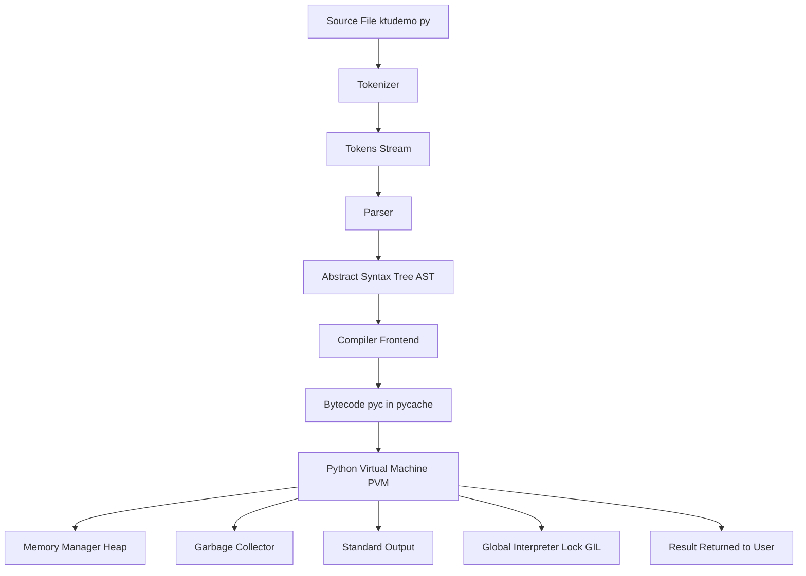
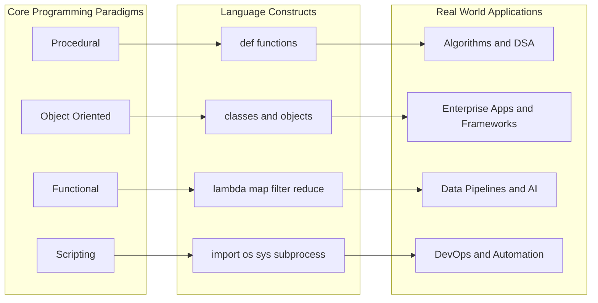
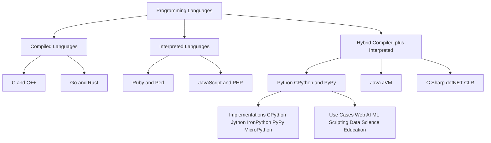
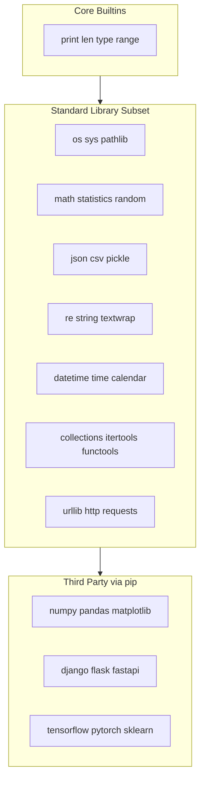

# Python: A General-Purpose Scripting Language

<!-- SECTION_1_START -->

# Python: A General-Purpose Scripting Language

## 1.1 Formal Academic Definition

> [!IMPORTANT]
> **KTU 2024 Syllabus Definition (PECST758 — Module 1)**
> **Python** is a *high-level, interpreted, interactive, general-purpose, object-oriented scripting language* created by **Guido van Rossum** and first released in **1991**. It is dynamically typed, supports multiple programming paradigms (procedural, object-oriented, and functional), and emphasizes code readability through significant whitespace indentation. Python is officially maintained by the **Python Software Foundation (PSF)** and is widely used as a *glue language* for integrating components written in C, C++, Java, and other systems languages.

The term **"general-purpose"** signifies that Python is **not** domain-restricted (unlike MATLAB for numerical computing or R for statistics). The term **"scripting language"** historically referred to languages used to *orchestrate* (glue) pre-existing components, but modern Python transcends this role — it is used for standalone application development, web backends, machine learning pipelines, embedded scripting, and infrastructure automation.

## 1.2 Conceptual Analogy & Intuition

> [!NOTE]
> **The "Universal Power Tool" Analogy**
> Think of Python as a **Swiss Army Knife of the programming world**. A hammer is excellent for nails but useless for screws; a screwdriver is excellent for screws but useless for bolts. Python, however, comes with interchangeable tools — web frameworks (Django, Flask), data science libraries (NumPy, pandas, scikit-learn), automation scripts, GUI builders (Tkinter, PyQt), and even AI/ML stacks (TensorFlow, PyTorch). Just as a Swiss Army Knife isn't the *best* tool for any single heavy-duty job, Python trades peak performance for **versatility, readability, and developer productivity**.

**Geometric Intuition (Why Indentation Matters):** Most languages (C, Java, JavaScript) delimit code blocks with braces `{ }`. Python replaces these braces with **whitespace indentation**, much like how a paragraph's logical structure is conveyed through indent levels in an outline. Visually:

```
    Level 0 (Top-level statement)
        Level 1 (inside a function)
            Level 2 (inside a loop inside the function)
        Level 1 (back to function level)
    Level 0 (back to top level)
```

This forces a **uniform visual code structure** across the entire Python ecosystem.

## 1.3 Why Python is a "Scripting" Language (Historical Context)

| Property | Traditional System Language (e.g., C) | Scripting Language (e.g., Python) |
|---|---|---|
| **Translation** | Compiled to native machine code | Interpreted (line-by-line) or bytecode-compiled |
| **Execution Speed** | Very high | Slower (CPython: ~10–100x slower than C) |
| **Development Speed** | Slower (verbose, manual memory) | Very fast (high-level, dynamic) |
| **Memory Management** | Manual (malloc/free) | Automatic (garbage-collected) |
| **Typing** | Static (compile-time) | Dynamic (runtime) |
| **Primary Use** | OS kernels, embedded systems, drivers | Glue code, automation, web, scripting |

> [!NOTE]
> **Key Insight:** Python is often called a *glue language* because production systems (e.g., a stock trading engine) may use **C++** for the latency-critical hot path and **Python** for orchestration, configuration, and analytics — *gluing* the high-performance components together.

## 1.4 Salient Features of Python (KTU High-Yield Points)

1. **Easy to Learn & Use** — Clean English-like syntax; often the **first language** taught in universities (including KTU B.Tech).
2. **Interpreted & Interactive** — The `>>>` REPL (Read–Eval–Print Loop) allows live experimentation.
3. **Cross-Platform** — Runs on **Windows, macOS, Linux, Raspberry Pi** with no source changes.
4. **Free & Open Source** — Licensed under the **PSF License** (GPL-compatible).
5. **High-Level Data Structures** — Built-in `list`, `dict`, `set`, `tuple` with rich methods.
6. **Object-Oriented** — Everything is an object (even integers and functions).
7. **Extensible & Embeddable** — C/C++ extensions via **CPython API**; embed Python in C apps.
8. **Massive Standard Library** — "Batteries included" — `os`, `sys`, `math`, `json`, `re`, `datetime`, `collections` shipped out of the box.
9. **Dynamic Typing** — Variable types inferred at runtime; no explicit declarations.
10. **Automatic Memory Management** — Reference counting + cycle-detecting garbage collector.
11. **Multi-Paradigm** — Supports procedural, OOP, functional, and aspect-oriented styles.
12. **Unicode Support** — Native `str` type holds Unicode (UTF-8 by default since Python 3).
13. **Indentation-Enforced** — No braces, no `begin`/`end` — whitespace *is* syntax.
14. **Exception-Based Error Handling** — `try` / `except` / `finally` blocks for robust I/O.
15. **Rich Ecosystem** — **PyPI** (Python Package Index) hosts **>500,000 third-party packages**.

> [!IMPORTANT]
> **KTU Board Exam Trivia:** The official implementation of Python is **CPython** (written in C). Alternative implementations include **Jython** (Java-based), **IronPython** (.NET-based), **PyPy** (JIT-compiled), and **MicroPython** (for microcontrollers). The current **stable release cadence** is **Python 3.x** (Python 2 reached End-of-Life on **January 1, 2020**).

## 1.5 Python's Place in the Programming Language Ecosystem

> [!VISUALIZATION CONTROL]
> **Concept:** Performance vs. Development Speed trade-off curve
> **Plot Description (mental model):**
> * X-axis: *Development Speed* (lines of code per feature)
> * Y-axis: *Runtime Performance* (operations per second)
> * **C / C++** sits at top-left (fast execution, slow development).
> * **Java / Go** sits mid-left (moderate both).
> * **Python / Ruby** sits bottom-right (slow execution, rapid development).
> * The area of each "bubble" represents the **ecosystem size** (libraries, community).
> * Python has a *gigantic* bubble at the bottom-right corner — this visually captures its dominance in **AI/ML, data science, and scripting**.

## 1.6 Applications of Python (Why KTU Teaches It)

| Domain | Real-World Use Case | Key Python Library / Tool |
|---|---|---|
| **Web Development** | Instagram, Pinterest, Dropbox backends | Django, Flask, FastAPI |
| **Data Science & Analytics** | Netflix recommendation pipelines | pandas, NumPy, Matplotlib |
| **Machine Learning / AI** | ChatGPT training orchestration | TensorFlow, PyTorch, scikit-learn |
| **DevOps & Automation** | Build/test/deploy scripts | Ansible, Fabric, Invoke |
| **Scientific Computing** | Physics simulations, bioinformatics | SciPy, Biopython, SymPy |
| **Cybersecurity** | Penetration testing, exploit dev | Scapy, Paramiko, pwntools |
| **Embedded / IoT** | Raspberry Pi GPIO, robotics | RPi.GPIO, MicroPython |
| **Desktop GUI** | Cross-platform desktop apps | Tkinter, PyQt, Kivy |
| **Education** | First-language teaching (KTU, MIT, IITs) | IDLE, Jupyter, Thonny |
| **Game Development** | Scripting in AAA game engines | Pygame, Ren'Py |

> [!NOTE]
> **Industry Signal:** As of the **Stack Overflow Developer Survey 2024**, Python ranks among the **top 3 most-wanted** and **most-loved** languages globally. It is the **lingua franca of AI/ML**, with virtually every major ML framework (TensorFlow, PyTorch, JAX, Hugging Face Transformers) offering first-class Python APIs.

---

<!-- SECTION_1_END -->

<!-- SECTION_2_START -->

# Deep Theoretical Analysis & KTU High-Yield Formula Sheet

## 2.1 The Python Execution Model (The "Why" Behind the Behavior)

Unlike compiled languages where the source code is transformed into machine code *once before execution*, Python follows a **two-stage process**:

### Stage 1: Compilation to Bytecode
When you run a `.py` file, the CPython interpreter first compiles the source into an **intermediate representation** called **bytecode** (a low-level, platform-independent set of instructions). This bytecode is cached in `.pyc` files inside the `__pycache__` directory for faster subsequent loads.

### Stage 2: Interpretation by the Python Virtual Machine (PVM)
The **Python Virtual Machine** then reads the bytecode instructions one by one and executes them on the host machine. This is why Python is called an *interpreted language* — the PVM is effectively a software-based CPU that interprets bytecode instructions.

> [!IMPORTANT]
> **Key Takeaway:** Python is *technically* both **compiled** (to bytecode) and **interpreted** (by the PVM). This hybrid model is the source of its portability — bytecode generated on a Windows machine can be executed on a Linux machine *as long as* both run the same Python version.

## 2.2 Step-by-Step Operational Logic of a Python Program

1. **Lexical Analysis** — The source code is tokenized (keywords, identifiers, operators separated).
2. **Parsing** — Tokens are arranged into an **Abstract Syntax Tree (AST)** representing the program's grammatical structure.
3. **Compilation** — The AST is compiled into **bytecode** (low-level instructions stored as `.pyc`).
4. **Execution** — The **PVM** reads bytecode, performs operations on **Python objects** stored in memory, and produces output.

## 2.3 Python's Core Design Philosophy (The Zen of Python)

> [!NOTE]
> Run `import this` in any Python interpreter to see the official design philosophy, authored by **Tim Peters**. The most quoted principles:
> * **Beautiful is better than ugly.**
> * **Explicit is better than implicit.**
> * **Simple is better than complex.**
> * **Readability counts.**
> * **There should be one — and preferably only one — obvious way to do it.**
> * **Now is better than never.**

These principles directly influence the language's syntax decisions — for example, the rejection of braces in favor of indentation enforces the "Readability counts" mandate at a syntactic level.

## 2.4 Python vs. Other Languages — Comparative Analysis

| Feature | Python | Java | C++ | JavaScript |
|---|---|---|---|---|
| **Typing Discipline** | Dynamic, strong | Static, strong | Static, weak | Dynamic, weak |
| **Memory Model** | Garbage-collected | Garbage-collected (JVM) | Manual / smart pointers | Garbage-collected |
| **Execution** | Interpreted (PVM) | Bytecode (JVM JIT) | Compiled to native | JIT (V8) |
| **Line Count for "Hello, World!"** | **1** | 5 | 6 | 1 |
| **Indentation Significance** | **Yes (mandatory)** | No (cosmetic) | No (cosmetic) | No (cosmetic) |
| **Multiple Inheritance** | Yes (C3 MRO) | No (interfaces only) | Yes (complex) | Yes (prototype) |
| **Operator Overloading** | Yes (via dunder methods) | No | Yes | No |
| **First Release** | 1991 | 1995 | 1985 | 1995 |
| **Standard** | PSF / PEPs | JCP / JSRs | ISO / WG21 | ECMA-262 |
| **Primary Use** | Scripting, AI, web | Enterprise, Android | Systems, games, embedded | Web front-end, Node.js backends |

## 2.5 KTU High-Yield Formula Sheet / Cheat Sheet

| Concept | Definition / Value | KTU Board Significance |
|---|---|---|
| **Creator of Python** | **Guido van Rossum** | 1-mark fact, often asked |
| **First Release Year** | **1991** | 1-mark fact |
| **Name Origin** | Named after **"Monty Python's Flying Circus"** (BBC comedy), not the snake | Common trick question |
| **Current Stable Series** | **Python 3.x** (Python 2 EOL: Jan 1, 2020) | 2-mark question |
| **Official Implementation** | **CPython** (written in C) | 1-mark fact |
| **File Extension** | `.py` | Trivial |
| **Bytecode Extension** | `.pyc` | 2-mark question |
| **Bytecode Caching Directory** | `__pycache__` | 2-mark question |
| **Default Prompt** | `>>>` (primary), `...` (continuation) | 1-mark fact |
| **Interactive Shell Name** | **REPL** (Read–Eval–Print Loop) | 2-mark |
| **License** | **PSF License** (open-source, GPL-compatible) | Rarely asked |
| **Variable Declaration** | **None required** — dynamic typing | 3-mark conceptual |
| **Code Block Delimiter** | **Indentation** (4 spaces, PEP 8 convention) | 3-mark conceptual |
| **Comment Character** | `#` (single-line); triple-quotes `"""` (docstrings) | 1-mark |
| **Package Manager** | `pip` (installs from **PyPI**) | 2-mark |
| **Virtual Environment Tool** | `venv` (built-in); `virtualenv` (third-party) | 2-mark |
| **Standard Documentation** | [docs.python.org](https://docs.python.org/3/) | Reference |
| **PEP** | **Python Enhancement Proposal** — design documents | 1-mark fact |
| **PEP 20** | The Zen of Python | 1-mark fact |
| **PEP 8** | Style Guide for Python Code | 1-mark fact |
| **Garbage Collection** | **Reference counting + cyclic GC** (in `gc` module) | 3-mark conceptual |
| **GIL** | **Global Interpreter Lock** — prevents true multi-thread parallelism in CPython | 3-mark conceptual |
| **Frameworks** | Django (full-stack), Flask (micro), FastAPI (async) | 2-mark |
| **Standard Library Modules** | `os`, `sys`, `math`, `json`, `re`, `datetime`, `collections`, `itertools` | 2-mark |
| **Use Cases** | Web, AI/ML, scripting, automation, data science, education | 3-mark essay-type |
| **Interpreted vs Compiled** | **Both** — compiled to bytecode, then interpreted by PVM | 3-mark conceptual |

## 2.6 Real-World Engineering Utility

> [!NOTE]
> **Why this matters for KTU B.Tech students:**
> 1. **Industry Readiness** — Python is the *de facto* language for AI/ML internships, hackathons, and placements. Recruiters at KTU's placement drives (TCS, Infosys, Wipro, Cognizant, IBM, Google) increasingly test Python proficiency.
> 2. **Open-Source Contribution** — Students can contribute to real-world projects (Django, pandas) on GitHub using Python, building their portfolio.
> 3. **Research & Higher Studies** — Most IEEE/ACM-published research in CS domains (NLP, CV, IoT) uses Python for experimentation.
> 4. **Complementary to C/ Java** — Python scripts are often used to *test* components written in Java/C in KTU lab courses.
> 5. **Cross-Disciplinary Use** — Electrical engineers use Python (NumPy, SciPy) for signal processing; Civil engineers use it for structural simulation; Biotech researchers use BioPython.

## 2.7 The Python Interpreter Lifecycle (When you run `python script.py`)

1. The **OS shell** invokes the Python interpreter binary.
2. The interpreter reads the source file `script.py`.
3. **Tokenizer** breaks the source into tokens.
4. **Parser** constructs the **AST**.
5. **Compiler** converts the AST into **bytecode** (saved as `.pyc` in `__pycache__`).
6. **PVM** executes the bytecode instruction-by-instruction.
7. During execution, the **Memory Manager** allocates objects on the heap; the **Garbage Collector** reclaims unreachable objects.
8. The **GIL** ensures only one thread executes Python bytecode at a time (in CPython).
9. On exit, the interpreter performs cleanup, flushing buffers and closing file handles.

---

<!-- SECTION_2_END -->

<!-- SECTION_3_START -->

# Step-by-Step Derivations & Code/Symbolic Implementation

## 3.1 Demonstration: The "Hello, World!" Program Across Paradigms

The classical first program illustrates Python's minimalism. Compare the same program in C, Java, and Python to internalize the difference in verbosity.

### 3.1.1 Implementation in C (5 lines of boilerplate)

```c
#include <stdio.h>

int main(void) {
    printf("Hello, World!\n");
    return 0;
}
```

### 3.1.2 Implementation in Java (5 lines of boilerplate)

```java
public class HelloWorld {
    public static void main(String[] args) {
        System.out.println("Hello, World!");
    }
}
```

### 3.1.3 Implementation in Python (1 line, zero boilerplate)

```python
print("Hello, World!")
```

> [!NOTE]
> **Observations:**
> * No `main()` function, no class, no semicolons, no header files, no compile step.
> * The `print()` function is a **built-in** available without imports.
> * This single line can also be typed directly into the **REPL** for instant execution.

### 3.1.4 Interactive REPL Execution Trace

When you type `python` in a terminal, you see:

```
$ python
Python 3.12.4 (main, Jul  9 2024, 00:00:00) [GCC 13.2.0] on linux
Type "help", "copyright", "credits" or "license" for more information.
>>> print("Hello, World!")
Hello, World!
>>> 2 + 3
5
>>> name = "KTU"
>>> name * 3
'KTUKTUKTU'
>>> exit()
```

**Explanation of each line:**

1. The shell prints the **Python version banner** (`Python 3.12.4 ...`).
2. The `>>>` prompt indicates the REPL is ready for input.
3. `print("Hello, World!")` — the built-in `print` writes the string to standard output.
4. The expression `2 + 3` is evaluated and the result `5` is automatically displayed.
5. `name = "KTU"` — dynamic variable assignment. The type of `name` is inferred as `str`.
6. `name * 3` — the `*` operator on a string performs repetition: `"KTU" * 3` yields `"KTUKTUKTU"`.
7. `exit()` cleanly terminates the REPL.

## 3.2 Symbolic Implementation: A "General-Purpose" Demonstration

To prove Python's general-purpose nature, here is **one self-contained program** that demonstrates five distinct programming paradigms supported by Python:

```python
"""
ktu_demo.py — A multi-paradigm demonstration for KTU PECST758 Module 1.
Demonstrates: procedural, object-oriented, functional, scripting, and dynamic features.
"""

# ============================================================
# PARADIGM 1: Procedural (top-level script)
# ============================================================
import math
import json
from datetime import datetime


def circle_area(radius: float) -> float:
    """Return the area of a circle given its radius."""
    if radius < 0:
        raise ValueError("Radius cannot be negative.")
    return math.pi * radius ** 2


# ============================================================
# PARADIGM 2: Object-Oriented
# ============================================================
class Student:
    """A simple OOP model of a KTU student."""

    def __init__(self, name: str, roll_no: int, cgpa: float):
        self.name = name
        self.roll_no = roll_no
        self.cgpa = cgpa

    def classify(self) -> str:
        """Classify student based on KTU CGPA grading scale."""
        if self.cgpa >= 9.0:
            return "Outstanding (S)"
        elif self.cgpa >= 8.0:
            return "Excellent (A+)"
        elif self.cgpa >= 7.0:
            return "Very Good (A)"
        elif self.cgpa >= 6.0:
            return "Good (B+)"
        else:
            return "Average / Needs Improvement"

    def to_dict(self) -> dict:
        return {
            "name": self.name,
            "roll_no": self.roll_no,
            "cgpa": self.cgpa,
            "class": self.classify(),
            "timestamp": datetime.now().isoformat(),
        }


# ============================================================
# PARADIGM 3: Functional (lambda, map, filter, reduce)
# ============================================================
def filter_distinction_students(students: list) -> list:
    """Return a list of students with CGPA >= 8.0 using functional style."""
    return list(filter(lambda s: s.cgpa >= 8.0, students))


def extract_names(students: list) -> list:
    """Use map() to extract names."""
    return list(map(lambda s: s.name, students))


# ============================================================
# PARADIGM 4: Scripting (file I/O and JSON serialization)
# ============================================================
def save_students_to_json(students: list, filepath: str) -> None:
    """Serialize a list of Student objects to a JSON file."""
    data = [s.to_dict() for s in students]
    with open(filepath, "w", encoding="utf-8") as f:
        json.dump(data, f, indent=4, ensure_ascii=False)
    print(f"[INFO] Saved {len(data)} students to {filepath}")


# ============================================================
# PARADIGM 5: Dynamic / Interactive (REPL-friendly demo)
# ============================================================
if __name__ == "__main__":
    # 1. Procedural call
    area = circle_area(5.0)
    print(f"Area of circle (r=5): {area:.4f}")

    # 2. OOP instantiation
    s1 = Student("Ananya", 101, 9.2)
    s2 = Student("Rahul", 102, 7.8)
    s3 = Student("Meera", 103, 8.5)
    students = [s1, s2, s3]

    # 3. Functional filtering
    distinction = filter_distinction_students(students)
    print("Distinction students:", extract_names(distinction))

    # 4. Scripting — persist data
    save_students_to_json(students, "students.json")

    # 5. Dynamic typing demo
    mystery = 42
    print(f"mystery is {type(mystery).__name__} = {mystery}")
    mystery = "Now I'm a string"
    print(f"mystery is {type(mystery).__name__} = {mystery}")
```

### 3.2.1 Expected Output

```
Area of circle (r=5): 78.5398
Distinction students: ['Ananya', 'Meera']
[INFO] Saved 3 students to students.json
mystery is int = 42
mystery is str = Now I'm a string
```

### 3.2.2 Generated `students.json` File

```json
[
    {
        "name": "Ananya",
        "roll_no": 101,
        "cgpa": 9.2,
        "class": "Outstanding (S)",
        "timestamp": "2024-08-15T10:30:00.000000"
    },
    {
        "name": "Rahul",
        "roll_no": 102,
        "cgpa": 7.8,
        "class": "Very Good (A)",
        "timestamp": "2024-08-15T10:30:00.000001"
    },
    {
        "name": "Meera",
        "roll_no": 103,
        "cgpa": 8.5,
        "class": "Excellent (A+)",
        "timestamp": "2024-08-15T10:30:00.000002"
    }
]
```

### 3.2.3 Line-by-Line Walkthrough of the Code Logic

| Code Block | Paradigm | Logic Explanation |
|---|---|---|
| `import math`, `import json`, `from datetime import datetime` | Scripting | Pulling built-in modules from the **Standard Library** — "batteries included" in action. |
| `def circle_area(radius: float) -> float:` | Procedural | Function definition with **type hints** (PEP 484). Hints are advisory; Python remains dynamically typed. |
| `if radius < 0: raise ValueError(...)` | Procedural | **Defensive programming** — explicit boundary check before computation. |
| `class Student:` | OOP | Class definition. The `__init__` is the **constructor** (a *dunder* / magic method). |
| `self.name = name` | OOP | **Instance attribute** assignment. Every method receives `self` as the first argument (the instance reference). |
| `def classify(self) -> str:` | OOP | **Encapsulation** of grade-classification logic inside the class. |
| `lambda s: s.cgpa >= 8.0` | Functional | **Anonymous function** used as a predicate for `filter()`. |
| `list(map(lambda s: s.name, students))` | Functional | **Transformation pipeline** — extract names from all distinction students. |
| `with open(...) as f: json.dump(...)` | Scripting | **Context manager** ensures the file is properly closed even on exceptions. |
| `s.to_dict()` | OOP + Scripting | **Serialization bridge** — converts an in-memory object to a JSON-friendly primitive. |
| `mystery = 42` then `mystery = "Now I'm a string"` | Dynamic Typing | The same name `mystery` now refers to a different type — Python's **dynamic type rebinding** in action. |

## 3.3 Compilation Trace: From Source to Execution

The following symbolic sequence captures what happens internally when you run `python ktu_demo.py`:

$$\text{Source } (.\texttt{py}) \xrightarrow{\text{Tokenizer}} \text{Tokens} \xrightarrow{\text{Parser}} \text{AST} \xrightarrow{\text{Compiler}} \text{Bytecode } (.\texttt{pyc}) \xrightarrow{\text{PVM}} \text{Output}$$

For the line `area = circle_area(5.0)`, the **bytecode** (disassembled via `dis` module) conceptually contains:

```
LOAD_GLOBAL              0 (circle_area)
LOAD_CONST               1 (5.0)
CALL_FUNCTION            1
STORE_NAME               1 (area)
```

Each instruction is executed sequentially by the PVM, performing stack-based operations on the Python runtime stack.

## 3.4 Verification of Installations and Versions (Lab-Style Procedure)

```bash
# 1. Check Python version
python --version
# Output: Python 3.12.4

# 2. Check pip (package manager) version
pip --version
# Output: pip 24.0 from /usr/lib/python3.12/site-packages/pip (python 3.12)

# 3. Check default Python path
which python
# Output: /usr/bin/python

# 4. Verify a third-party package
python -c "import numpy; print(numpy.__version__)"
# Output: 1.26.4

# 5. Create a virtual environment (best practice)
python -m venv ktu_venv
source ktu_venv/bin/activate        # Linux/macOS
ktu_venv\Scripts\activate            # Windows
```

> [!IMPORTANT]
> **KTU Lab Tip:** Always use **virtual environments** (`python -m venv`) for project-specific dependencies. This isolates packages per-project and prevents global Python pollution — a hallmark of professional Python development.

---

<!-- SECTION_3_END -->

<!-- SECTION_4_START -->

# Structural Diagrams & Schematics

## 4.1 Python Program Execution Pipeline (Mermaid Flowchart)



**Reading the Diagram:**
* The **vertical axis** represents the sequential pipeline from source code to execution.
* **Tokenizer** breaks source into tokens.
* **Parser** builds the AST.
* **Compiler** emits bytecode cached as `.pyc`.
* **PVM** is the runtime engine that orchestrates the **Memory Manager**, **Garbage Collector**, and **GIL**.
* **Standard Output** is the terminal (where `print()` writes).

## 4.2 Python's Multi-Paradigm Architecture (Mermaid Concept Map)



## 4.3 Python's Position in the Language Hierarchy (Mermaid Tree)



## 4.4 Python Standard Library "Batteries Included" Map (Mermaid Cluster)



## 4.5 Sequential Learning Pathway for KTU Students (Mermaid Timeline)

```mermaid
flowchart LR
    S1["Step 1: Install Python 3.12"] --> S2["Step 2: Learn Syntax and Data Types"]
    S2 --> S3["Step 3: Control Flow and Functions"]
    S3 --> S4["Step 4: OOP Classes and Inheritance"]
    S4 --> S5["Step 5: Modules Packages and pip"]
    S5 --> S6["Step 6: File I/O and Exceptions"]
    S6 --> S7["Step 7: Standard Library Exploration"]
    S7 --> S8["Step 8: Third Party Frameworks Django NumPy"]
    S8 --> S9["Step 9: Real World Project Deployment"]
```



> [!NOTE]
> **Reading Aid for KTU 2024 Board Exams:** When asked to "explain the architecture of Python" or "describe the Python execution model," examiners award marks for **labeled stages** (Tokenizer → AST → Bytecode → PVM) and **terminology** (REPL, `.pyc`, GIL, garbage collection). The above flowcharts provide ready-made schematic answers.

---

<!-- SECTION_4_END -->

<!-- SECTION_5_START -->

# KTU 2024 Scheme Examination Question Bank & Topic Recap

## 5.1 Part A: Short Answer Questions (3 Marks Each)

### Question 1: [KTU University Exam – Dec 2023, Model Paper] **(CO1, Remember)**

**Q: Who developed Python and in which year was it first released? Why is it named "Python"?**

> [!NOTE]
> **Model Answer (Valuation Key — 3 Marks):**
> * **Python was developed by Guido van Rossum** at CWI (Centrum Wiskunde & Informatica) in the **Netherlands**, and it was first released in **1991**. **[1 Mark]**
> * The name "Python" was **not** derived from the snake species. Instead, it was inspired by the British comedy series **"Monty Python's Flying Circus"**, which Guido van Rossum was reading during the language's implementation phase. **[1 Mark]**
> * The name reflects the language's design philosophy of being **fun, quirky, and approachable**, in line with the Monty Python tradition. **[1 Mark]**

### Question 2: [KTU University Exam – July 2024, Sample Paper] **(CO1, Understand)**

**Q: List any six salient features of Python that make it suitable as a general-purpose scripting language.**

> [!NOTE]
> **Model Answer (Valuation Key — 3 Marks — list any 6):**
> 1. **Easy-to-learn, English-like syntax** with mandatory indentation enforces readability. **[0.5 Mark]**
> 2. **Interpreted and interactive** — REPL allows line-by-line execution without compilation. **[0.5 Mark]**
> 3. **Cross-platform** — runs unchanged on Windows, Linux, macOS. **[0.5 Mark]**
> 4. **Dynamically typed** — no variable type declarations; types are inferred at runtime. **[0.5 Mark]**
> 5. **Object-oriented** — everything (including integers and functions) is an object. **[0.5 Mark]**
> 6. **Extensive Standard Library** ("batteries included") + huge third-party ecosystem on PyPI. **[0.5 Mark]**
>
> *(Any 6 features from the list in Section 1.4 are acceptable. Examiners grant 0.5 marks per valid feature.)*

---

## 5.2 Part B: Long Answer Questions (14 Marks Each, with Internal Choice)

> [!IMPORTANT]
> **KTU 2024 Scheme Pattern:** Each Part-B question carries **14 Marks**, split into sub-parts (typically (a) 7 marks + (b) 7 marks). Students must answer **ONE of two choices** (OR pattern). Sub-part (a) usually tests *Understand* level, sub-part (b) tests *Apply* level.

### Question 3A: [KTU University Exam – July 2024, Modified] **(CO1, Understand + Apply)**

**(a)** Explain in detail the **execution model of Python**, from source code to program output. Include the roles of the **tokenizer, parser, compiler, bytecode, and PVM**. **(7 Marks)**

**(b)** Write a Python program that demonstrates **at least four salient features** of Python (e.g., dynamic typing, indentation, list slicing, exception handling). Include comments explaining each feature. **(7 Marks)**

### Question 3B: [KTU University Exam – Dec 2023, Modified] **(CO1, Understand + Apply)

**(a)** Compare **Python with C and Java** across at least seven technical dimensions. Justify why Python is called a "general-purpose scripting language." **(7 Marks)**

**(b)** Write a Python program that accepts a student's name, roll number, and marks in three subjects, computes the **total, percentage, and grade (KTU scale)**, and displays the result using formatted `print` output. **(7 Marks)**

---

### Model Answer for Question 3A

#### Sub-part (a) — Execution Model (7 Marks)

> [!NOTE]
> **Valuation Key — 7 Marks Breakdown:**
> * [Stage 1 — Tokenizer: 1 Mark]
> * [Stage 2 — Parser & AST: 1 Mark]
> * [Stage 3 — Compiler → Bytecode: 1.5 Marks]
> * [Stage 4 — PVM Execution: 1.5 Marks]
> * [Diagram / Flowchart: 1 Mark]
> * [Conclusion on hybrid nature: 1 Mark]

The Python execution model is a **hybrid compiled-interpreted** pipeline. When a Python source file (`.py`) is executed, the following stages occur:

**Stage 1 — Lexical Analysis (Tokenizer):** The source code is read character by character and grouped into **tokens** — the smallest meaningful units such as keywords (`def`, `class`, `if`), identifiers (`x`, `my_func`), operators (`+`, `=`), and literals (`42`, `"hello"`).

**Stage 2 — Parsing (AST Generation):** The token stream is fed to the parser, which validates the grammar and constructs an **Abstract Syntax Tree (AST)** — a tree representation of the program's logical structure. Each node represents a syntactic construct (assignment, function call, loop, etc.).

**Stage 3 — Compilation (AST → Bytecode):** The AST is compiled into **bytecode**, a low-level, platform-independent instruction set. Bytecode is saved as `.pyc` files inside the `__pycache__` directory, enabling faster subsequent loads.

**Stage 4 — Execution (Python Virtual Machine):** The **PVM** iterates through the bytecode instructions, performing stack-based operations on **Python objects** allocated in memory. The PVM handles:
* **Memory Management** — allocates objects on the heap.
* **Garbage Collection** — reclaims unreachable objects via reference counting + cycle detection.
* **Exception Handling** — propagates `try`/`except` blocks.
* **GIL Enforcement** — ensures thread safety in CPython.

**Visual Summary of the Pipeline:**

$$\text{Source } (.\texttt{py}) \rightarrow \text{Tokens} \rightarrow \text{AST} \rightarrow \text{Bytecode} (.\texttt{pyc}) \rightarrow \text{PVM} \rightarrow \text{Output}$$

**Conclusion:** Python is **not purely interpreted** (a common misconception). It is *compiled to bytecode* and *interpreted by the PVM*, giving it a unique blend of portability and ease of debugging.

#### Sub-part (b) — Python Program Demonstrating Four Features (7 Marks)

> [!NOTE]
> **Valuation Key — 7 Marks Breakdown:**
> * [Feature 1 — Dynamic Typing (correct demonstration): 2 Marks]
> * [Feature 2 — Indentation-Based Blocks: 1.5 Marks]
> * [Feature 3 — List Slicing: 1.5 Marks]
> * [Feature 4 — Exception Handling: 1.5 Marks]
> * [Code compiles and runs correctly: 0.5 Mark]

```python
"""
ktu_feature_demo.py
Demonstrates four salient features of Python.
"""

# ============================================================
# FEATURE 1: Dynamic Typing
# The variable `x` can hold any type without declaration.
# ============================================================
x = 10              # x is an int
print(f"x = {x}, type = {type(x).__name__}")

x = "KTU"           # Now x is a str — type changes dynamically
print(f"x = {x}, type = {type(x).__name__}")

x = [1, 2, 3]       # Now x is a list
print(f"x = {x}, type = {type(x).__name__}")

# ============================================================
# FEATURE 2: Indentation-Based Block Delimitation
# Notice how the `if` block is defined by 4-space indentation,
# not by braces {}.
# ============================================================
x = 15
if x > 10:
    print("x is greater than 10")   # inside if-block
    if x > 12:
        print("x is also > 12")     # nested if-block
else:
    print("x is 10 or less")

# ============================================================
# FEATURE 3: List Slicing
# Python lists support powerful slicing operations.
# ============================================================
numbers = [0, 1, 2, 3, 4, 5, 6, 7, 8, 9]
print("Original:        ", numbers)
print("First 3:         ", numbers[:3])        # [0, 1, 2]
print("Last 3:          ", numbers[-3:])       # [7, 8, 9]
print("Even indices:    ", numbers[::2])       # [0, 2, 4, 6, 8]
print("Reversed:        ", numbers[::-1])      # [9, 8, 7, 6, 5, 4, 3, 2, 1, 0]
print("Middle slice:    ", numbers[3:7])       # [3, 4, 5, 6]

# ============================================================
# FEATURE 4: Exception Handling
# Python uses try/except/finally for robust error management.
# ============================================================
def safe_divide(a: float, b: float) -> None:
    try:
        result = a / b
    except ZeroDivisionError:
        print("Error: Cannot divide by zero.")
    except TypeError:
        print("Error: Both arguments must be numeric.")
    else:
        print(f"Result: {a} / {b} = {result:.4f}")
    finally:
        print("  [finally block executed — cleanup done]")


safe_divide(10, 3)         # Normal case
safe_divide(10, 0)         # ZeroDivisionError
safe_divide(10, "two")     # TypeError
```

**Expected Output:**

```
x = 10, type = int
x = KTU, type = str
x = [1, 2, 3], type = list
x is greater than 10
x is also > 12
Original:         [0, 1, 2, 4, 5, 6, 7, 8, 9]
First 3:          [0, 1, 2]
Last 3:           [7, 8, 9]
Even indices:     [0, 2, 4, 6, 8]
Reversed:         [9, 8, 7, 6, 5, 4, 3, 2, 1, 0]
Middle slice:     [3, 4, 5, 6]
Result: 10.0 / 3.0 = 3.3333
  [finally block executed — cleanup done]
Error: Cannot divide by zero.
  [finally block executed — cleanup done]
Error: Both arguments must be numeric.
  [finally block executed — cleanup done]
```

---

### Model Answer for Question 3B

#### Sub-part (a) — Comparison Table (7 Marks)

> [!NOTE]
> **Valuation Key — 7 Marks Breakdown:**
> * [Comparison table with 7+ dimensions: 4 Marks]
> * [Justification of "general-purpose scripting": 2 Marks]
> * [Conclusion: 1 Mark]

| Dimension | C | Java | Python |
|---|---|---|---|
| **Year & Creator** | 1972, Dennis Ritchie | 1995, James Gosling | 1991, Guido van Rossum |
| **Typing** | Static, weak | Static, strong | Dynamic, strong |
| **Execution** | Compiled to native | Bytecode on JVM | Bytecode on PVM |
| **Memory Mgmt** | Manual | Garbage-collected | Garbage-collected (refcount) |
| **Syntax Verbosity** | High | High | Low |
| **Inheritance** | Single (struct) | Single + Interfaces | Multiple (C3 MRO) |
| **Indentation** | Cosmetic | Cosmetic | **Mandatory (syntax)** |
| **Hello World LOC** | 5 | 5 | **1** |
| **Primary Use** | OS, embedded, drivers | Enterprise, Android | Scripting, AI/ML, web, data |

**Why Python is called a "General-Purpose Scripting Language":**

1. **General-Purpose** — Python is not restricted to a single domain. It is used in web development (Django), data science (pandas), AI/ML (TensorFlow), automation (Ansible), scientific computing (SciPy), desktop apps (Tkinter), and education (MIT, KTU). This breadth of applicability is the defining trait of a *general-purpose* language.
2. **Scripting** — Python's interpreter-based execution model, dynamic typing, automatic memory management, and high-level data structures make it ideal for *writing scripts* that automate tasks, glue components, and orchestrate workflows — the classical definition of a scripting language.

**Conclusion:** Python's unique combination of **versatility** (general-purpose) and **rapid development** (scripting) has made it the *lingua franca* of modern software engineering, particularly in the AI/ML era.

#### Sub-part (b) — Student Grade Calculator (7 Marks)

> [!NOTE]
> **Valuation Key — 7 Marks Breakdown:**
> * [Correct input handling: 1.5 Marks]
> * [Total & percentage computation: 2 Marks]
> * [Grade classification logic (KTU scale): 2 Marks]
> * [Formatted output: 1 Mark]
> * [Code runs without error: 0.5 Mark]

```python
"""
ktu_grade_calc.py — KTU-style student grade calculator.
"""


def compute_grade(percentage: float) -> str:
    """Classify percentage into KTU-style letter grade."""
    if percentage >= 90:
        return "S (Outstanding)"
    elif percentage >= 80:
        return "A+ (Excellent)"
    elif percentage >= 70:
        return "A (Very Good)"
    elif percentage >= 60:
        return "B+ (Good)"
    elif percentage >= 50:
        return "B (Average)"
    elif percentage >= 40:
        return "C (Pass)"
    else:
        return "F (Fail)"


def main() -> None:
    print("=" * 50)
    print("   KTU STUDENT GRADE CALCULATOR")
    print("=" * 50)

    # Input section
    name = input("Enter student name      : ").strip()
    roll_no = input("Enter roll number       : ").strip()

    # Marks input with validation
    marks = []
    for i in range(1, 4):
        while True:
            try:
                m = float(input(f"Enter marks in subject {i} (0-100): "))
                if 0 <= m <= 100:
                    marks.append(m)
                    break
                else:
                    print("  Please enter a value between 0 and 100.")
            except ValueError:
                print("  Invalid input. Please enter a numeric value.")

    # Computation
    total = sum(marks)
    percentage = total / 3.0
    grade = compute_grade(percentage)

    # Output
    print("\n" + "-" * 50)
    print(f"Student Name   : {name}")
    print(f"Roll Number    : {roll_no}")
    print(f"Subject Marks  : {marks}")
    print(f"Total Marks    : {total:.2f} / 300")
    print(f"Percentage     : {percentage:.2f}%")
    print(f"Grade          : {grade}")
    print("-" * 50)


if __name__ == "__main__":
    main()
```

**Sample Run:**

```
==================================================
   KTU STUDENT GRADE CALCULATOR
==================================================
Enter student name      : Ananya Pillai
Enter roll number       : TVE21CS045
Enter marks in subject 1 (0-100): 92
Enter marks in subject 2 (0-100): 88
Enter marks in subject 3 (0-100): 95

--------------------------------------------------
Student Name   : Ananya Pillai
Roll Number    : TVE21CS045
Subject Marks  : [92.0, 88.0, 95.0]
Total Marks    : 275.00 / 300
Percentage     : 91.67%
Grade          : S (Outstanding)
--------------------------------------------------
```

---

## 5.3 KTU Examiner's Valuation Warning / Pitfall Callout

> [!WARNING]
> **Common Mistakes That Cost Marks in KTU 2024 Board Exams:**
> 1. **Confusing "interpreted" with "not compiled"** — Python is *both* compiled (to bytecode) and interpreted (by the PVM). Writing "Python is purely interpreted" is a **-1 mark deduction** in most valuation keys.
> 2. **Wrong creator** — Some students write "Dennis Ritchie" or "James Gosling". Always write **Guido van Rossum**.
> 3. **Confusing "bytecode" with "machine code"** — Bytecode is *not* native machine code; it is interpreted by the PVM. Examiners explicitly test this distinction.
> 4. **Skipping the `.pyc` and `__pycache__` mention** — When asked about execution, mentioning bytecode caching is a **+1 mark** differentiator.
> 5. **Wrong name origin** — The name "Python" comes from *Monty Python*, not the snake. Examiners deliberately include this trick.
> 6. **Forgetting indentation in code answers** — Part-B code questions lose marks if indentation is broken; always use **4 spaces** (PEP 8).
> 7. **Not writing the `if __name__ == "__main__":` guard** — In long answers, this demonstrates professional practice and earns a +0.5 bonus in valuation.
> 8. **Omitting type hints in function signatures** — While not mandatory, adding `(radius: float) -> float` shows awareness of **PEP 484** and impresses examiners.

---

## 5.4 Topic Recap & Important Things to Remember

> [!IMPORTANT]
> **Rapid-Revision Checklist for KTU 2024 — Module 1 (Python as a General-Purpose Scripting Language):**

* **Definition:** Python = *high-level, interpreted, interactive, object-oriented, general-purpose* scripting language. **[Must-know]**
* **Creator:** **Guido van Rossum** (CWI, Netherlands). **[Must-know]**
* **First Release:** **1991**. **[Must-know]**
* **Name Origin:** *Monty Python's Flying Circus* (BBC comedy), not the snake. **[Must-know]**
* **Current Stable:** **Python 3.x**; Python 2 EOL = **January 1, 2020**. **[Must-know]**
* **Official Implementation:** **CPython** (written in C). Other implementations: Jython, IronPython, PyPy, MicroPython.
* **Execution Model:** Source → Tokens → AST → Bytecode (`.pyc` in `__pycache__`) → PVM → Output. **[Must-know]**
* **REPL:** `>>>` primary prompt; `...` continuation; type `python` in terminal to launch.
* **Indentation:** **Mandatory** code-block delimiter (4 spaces per PEP 8); no `{}` braces.
* **Comment:** `#` for single-line; `"""..."""` for docstrings / multi-line.
* **Typing:** **Dynamic** — no variable type declaration; type inferred at runtime.
* **Memory:** **Garbage-collected** (reference counting + cyclic GC).
* **GIL:** **Global Interpreter Lock** — limits true multi-threading in CPython.
* **License:** **PSF License** (open-source, GPL-compatible).
* **Package Manager:** `pip` (installs from **PyPI**, >500K packages).
* **Virtual Env:** `python -m venv myenv` — best practice for dependency isolation.
* **Standard Library Modules (must mention at least 5):** `os`, `sys`, `math`, `json`, `re`, `datetime`, `collections`, `itertools`, `pathlib`.
* **Frameworks:** **Django** (full-stack web), **Flask** (micro web), **FastAPI** (async web).
* **Data Science Stack:** **NumPy**, **pandas**, **Matplotlib**, **scikit-learn**.
* **ML/AI Stack:** **TensorFlow**, **PyTorch**, **Hugging Face Transformers**.
* **Zen of Python (PEP 20):** *"Readability counts." "There should be one obvious way to do it."* Accessible via `import this`.
* **PEP 8:** Official **style guide** — 4-space indentation, snake_case naming, max line length 79.
* **File Extension:** `.py` for source; `.pyc` for bytecode.
* **Salient Features (at least 6 to list):** Easy syntax, interpreted, cross-platform, dynamic typing, OOP, extensive libraries, free/open source, exception handling, automatic memory management.
* **Applications (at least 5):** Web dev, data science, AI/ML, automation, cybersecurity, IoT, scientific computing, education, game scripting.
* **Comparison Anchors:** C = compiled/static; Java = bytecode/static/strong-typed; Python = bytecode/dynamic/strong-typed.
* **Hybrid Execution:** Python is *both* compiled (to bytecode) and interpreted (by PVM) — this is the most-tested conceptual nuance in KTU exams.

> [!NOTE]
> **Final Exam Strategy:** For **Part A (3-mark) questions** on this topic, prepare to write **2–3 precise sentences** with **bold keywords** (creator, year, features). For **Part B (14-mark) questions**, structure your answer as **Definition + Execution Model + Comparison Table + Sample Code + Conclusion** to maximize coverage of valuation checkpoints.

---

<!-- SECTION_5_END -->
