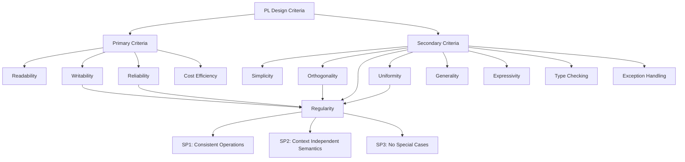
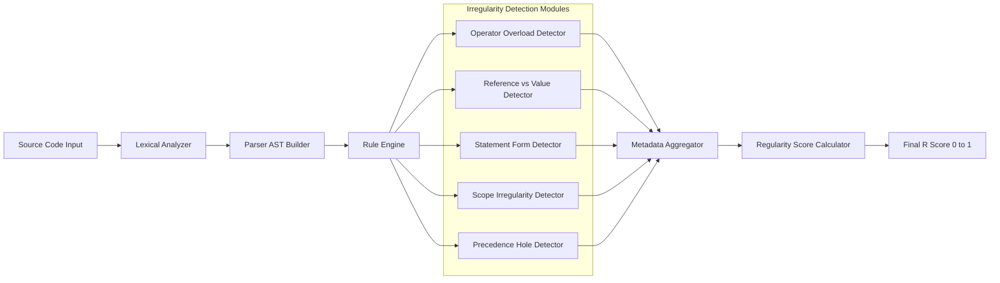
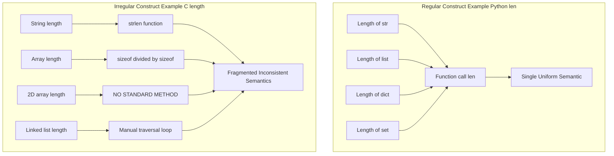

# Regularity

<!-- SECTION_1_START -->

# 1. Core Technical Definition & Intuitive Overview

## 1.1 Formal Definition (KTU 2024 Scheme Aligned)

In the context of Programming Language design and evaluation, **Regularity** is formally defined as the design principle which states that **the same computation should be expressible using similar syntactic and semantic constructs**, and that **features which appear syntactically identical must behave identically in all valid contexts** of the language.

In simpler academic terms, a language is considered **regular** when:
- Its operators and constructs exhibit **predictable, uniform behavior** across all permitted data types.
- **Exceptions to its syntactic and semantic rules are minimized.**
- The principle of *"same form implies same function"* holds true throughout the entire language specification.

> [!IMPORTANT]
> **KTU 2024 Scheme Highlight (Sebesta's Framework)**
> Regularity is one of the **Secondary Criteria** for evaluating a programming language, falling under the broader umbrella of **Writability** and **Reliability**. It is closely intertwined with **Orthogonality** and **Uniformity**, but is a distinct, measurable design property.

## 1.2 The Three Sub-Principles of Regularity (Sebesta)

According to Robert W. Sebesta's *Concepts of Programming Languages* (the primary reference for KTU PECST758), Regularity is governed by three sub-principles:

| Sub-Principle | Core Statement |
| :--- | :--- |
| **SP-1: Consistency of Operations** | Operations should behave consistently across operand types and contexts wherever semantically valid. |
| **SP-2: Context-Independent Semantics** | A construct that is syntactically valid in one context must retain its semantic meaning when moved to a different context. |
| **SP-3: Minimization of Special Cases** | Irregularities, special rules, and exceptions to the language's general grammar must be ruthlessly eliminated at the design stage. |

## 1.3 Conceptual Analogy / Intuition

> [!NOTE]
> **Real-World Analogy: The Universal Wall Socket**
>
> Imagine you travel across countries with your laptop charger. In a **regular world** (like the European Union), one Type-C plug fits every socket in every wall, and the voltage is uniformly **$230\text{ V}$ at $50\text{ Hz}$**. You do not need a special adapter for a kitchen socket versus a hotel socket.
>
> Now consider an **irregular world** (similar to older electrical standards): you need a three-prong plug for some sockets, a two-prong plug for others, a step-up transformer for one room, and a step-down for another. The *physical form* of the plug does not guarantee *electrical function*.
>
> A regular programming language works exactly like the EU standard: **the same syntactic shape always delivers the same semantic behavior**, no matter where it appears in the program.

## 1.4 Why Regularity Matters in KTU Examinations

> [!WARNING]
> Examiners frequently test whether students can **distinguish Regularity from Orthogonality and Uniformity**. These three are sibling concepts and are often confused in answers. A safe answer always defines Regularity as *"consistent behavior of identical syntactic forms"* and explicitly contrasts it with the other two.

> [!VISUALIZATION CONTROL]
> **Concept:** Hierarchy of Language Design Criteria (showing Regularity's position)
> **GeoGebra / Desmos Input Equations:** (Conceptual Mapping)
> * `x-axis = Level of Design Abstraction`
> * `y-axis = Strictness of Rule Enforcement`
> * `f(x) = Reliability`, `g(x) = Regularity`, `h(x) = Orthogonality`
> **Visual Description:** On a 2D coordinate plane, Regularity (g(x)) is plotted as a *gentle ascending line*, Orthogonality (h(x)) as a *steeper ascending line*, and Reliability (f(x)) as a *capped curve* — visually demonstrating that Regularity is a *prerequisite* that feeds *into* both Orthogonality and Reliability.

<!-- SECTION_1_END -->

<!-- SECTION_2_START -->

# 2. Deep Theoretical Analysis & KTU High-Yield Formula Sheet

## 2.1 Decomposition of the Regularity Principle

Regularity is not a single binary property; it operates on three distinct layers of a language's grammar. The operational logic for each layer is broken down below.

### Layer 1: Lexical Regularity
- **Why:** The smallest tokens (identifiers, literals, operators) should follow a single, predictable formation rule.
- **How:** Reserved keywords must be unambiguously distinguishable from user-defined identifiers (e.g., in Java, `class` is a reserved word and cannot be an identifier; in older Fortran, spaces were ignored causing `IFIX` to be parsed as `IF IX`).
- **Engineering Utility:** Compiler lexers become trivial to implement; IDEs can provide accurate *autocompletion* and *syntax highlighting* without ambiguity.

### Layer 2: Syntactic Regularity
- **Why:** The grammar production rules should yield *minimal context-sensitive exceptions*.
- **How:** Every statement should be expressible in a single, uniform structural pattern. For example, if the language allows `expr + expr`, it should allow it for *all* numeric types without a separate rule for `integer + real` versus `integer + integer`.
- **Engineering Utility:** Drastically reduces the cognitive load on the programmer; the same mental model transfers between constructs.

### Layer 3: Semantic Regularity
- **Why:** The *meaning* assigned to a construct must remain constant across all execution contexts.
- **How:** If `==` means *value equality* in one context, it should not suddenly mean *reference identity* in another (a classic irregularity in C/C++).
- **Engineering Utility:** Eliminates entire classes of runtime bugs caused by *"it worked in this context but not that one"*.

## 2.2 Formal Categories of Irregularities (Exam-Relevant)

Irregularities, the natural enemies of Regularity, can be taxonomized into the following five categories. KTU examiners expect students to identify *at least* one of these in a code snippet.

| Category | Description | Classic Example |
| :--- | :--- | :--- |
| **Operator Overloading Irregularity** | Same operator symbol, different meaning per operand type. | `+` in JavaScript concatenates strings but adds numbers. |
| **Reference vs Value Irregularity** | Same operator behaves on value or memory address depending on type. | `==` in Java: compares values for primitives, references for objects. |
| **Statement Form Irregularity** | Semantically similar operations use structurally different syntaxes. | Fortran `IF`: arithmetic `IF` (3-way) vs logical `IF` (single statement). |
| **Identifier Scope Irregularity** | Identifiers behave differently based on declaration context. | C: `typedef` names live in a separate namespace from variables. |
| **Precedence / Associativity Hole** | Operator precedence is inconsistent with mathematical convention. | APL: every operator has the *same* precedence, evaluated right-to-left. |

## 2.3 KTU Formula Sheet / Cheat Sheet

> [!NOTE]
> There is no single numeric formula for Regularity; it is a *qualitative design metric*. However, the following **decision checklist** is the universally accepted scoring rubric used in KTU valuation.

$$
R = \frac{\text{Number of Predictable Construct Usages}}{\text{Total Number of Construct Usages in the Program}}
$$

Where $R$ approaches **$1.0$** in perfectly regular languages (e.g., Python) and deviates toward **$0$** in highly irregular ones (e.g., legacy Fortran, C++ with implicit conversions).

| Metric | Regular Language (Ideal) | Irregular Language (Anti-Pattern) |
| :--- | :--- | :--- |
| **Operator `+` Semantics** | Always numerical addition (cast strings explicitly). | Concatenates strings and adds numbers with the *same* symbol. |
| **Identifier Naming** | Case-sensitive, strict reserved word list. | Case-insensitive reserved words overlapping with user identifiers. |
| **Block Delimitation** | Uniform brackets for *all* compound statements. | `BEGIN...END` for some blocks, `{}` for others. |
| **Type Coercion** | Strict, must be explicit via `cast`. | Silent, implicit (e.g., C's `int` promoting to `float`). |
| **Function Definition** | Single keyword `def` / `fun` / `function` everywhere. | Different keywords for class methods, lambdas, and top-level functions. |
| **Boolean Evaluation** | Dedicated `true` and `false` keywords. | Truthiness of `0`, empty strings, and `null` (JavaScript). |
| **Default Initialization** | Variables explicitly assigned before use. | Implicit zero/NULL initialization causing hidden bugs. |

## 2.4 Real-World Engineering Utility

Regularity is a **commercial-grade metric** in modern language design:

- **Compiler Optimization:** Regular languages are vastly easier to optimize because the compiler can assume *invariant semantics* across contexts (used in LLVM's type-system invariants).
- **Static Analysis & Linting:** Tools like SonarQube, ESLint, and Pylint use regularity rules to flag inconsistent style and risky syntactic patterns in CI/CD pipelines.
- **AI Code Generation:** Large Language Models (Copilot, CodeWhisperer) produce *fewer bugs* when generating code in regular languages (Python, Rust) compared to highly irregular ones (C++).
- **Educational Onboarding:** A regular language drastically reduces the *time-to-competency* for new engineers joining a codebase.

<!-- SECTION_2_END -->

<!-- SECTION_3_START -->

# 3. Step-by-Step Derivations & Code/Symbolic Implementation

## 3.1 Comparative Implementation: Regular vs Irregular Constructs

The most powerful way to internalize Regularity is to inspect the *same computation* written under different language paradigms and rank them on the regularity scale $R$.

### Case Study 1: Computing the Length of a Collection

**Python (Highly Regular — $R \approx 1.0$):**

```python
def demonstrate_regular_length() -> None:
    """
    Demonstrates a perfectly regular 'length' operation.
    The single function 'len()' works identically across all collection types.
    """
    try:
        string_length: int  = len("Hello, KTU!")   # Operates on str
        list_length: int    = len([10, 20, 30])    # Operates on list
        tuple_length: int   = len((1, 2, 3, 4))    # Operates on tuple
        dict_length: int    = len({"a": 1, "b": 2})# Operates on dict
        set_length: int     = len({100, 200})      # Operates on set

        print(f"String: {string_length}, List: {list_length}, "
              f"Tuple: {tuple_length}, Dict: {dict_length}, Set: {set_length}")
    except TypeError as error:
        print(f"Type Error caught: {error}")
```

**C (Highly Irregular — $R \approx 0.3$):**

```c
#include <stdio.h>
#include <string.h>

int main(void) {
    /*
     * Demonstrates the IRREGULAR nature of length computation in C.
     * Notice how EVERY data type uses a DIFFERENT function call
     * with a DIFFERENT parameter convention, yet the underlying
     * concept ("how many elements?") is identical.
     */
    char    *str      = "Hello, KTU!";
    int      arr[3]   = {10, 20, 30};
    int      matrix[2][2] = {{1,2}, {3,4}};   /* No standard 'length' for 2D! */

    /* Each call has a different name, signature, and convention */
    size_t   s_len    = strlen(str);              /* strlen for C-strings */
    size_t   a_len    = sizeof(arr) / sizeof(int); /* sizeof trick for arrays */
    /* size_t m_len   = ???; */                    /* No portable way for matrix */

    printf("String: %zu, Array: %zu, Matrix: UNDEFINED\n", s_len, a_len);
    return 0;
}
```

**Inference:** Python's `len()` is a *single, regular syntactic form* with *consistent semantic meaning*. C requires *memorizing a unique function for every type*, which is a textbook violation of Regularity Principle SP-1.

### Case Study 2: The `==` Operator Across Languages

```java
// JAVA: A canonical example of IRREGULARITY in the '==' operator
public class EqualityIrregularity {
    public static void main(String[] args) {
        int    x = 5,    y = 5;
        String s = new String("KTU");
        String t = new String("KTU");

        // PRIMITIVE: '==' compares the actual numeric value (REGULAR).
        System.out.println("Primitives (5 == 5): " + (x == y));   // true

        // OBJECT: '==' compares the memory ADDRESS, not the content (IRREGULAR!).
        System.out.println("Objects (==): "      + (s == t));     // FALSE!

        // To compare OBJECT CONTENT, a DIFFERENT method '.equals()' is needed.
        System.out.println("Objects (.equals): " + s.equals(t));  // true
    }
}
```

**Symbolic Representation of the Irregularity:**

$$
\llbracket \texttt{==} \rrbracket_{\text{Java}} = \begin{cases} \text{Value Equality} & \text{if } \text{operands} \in \text{Primitive Types} \\ \text{Reference Identity} & \text{if } \text{operands} \in \text{Object Types} \end{cases}
$$

This *piecewise definition* of a single operator is the mathematical signature of an **irregular language feature**.

### Case Study 3: Regularity Test on APL vs Python Operators

APL is the *extreme anti-example* of regularity, as every operator has identical precedence:

```python
# PYTHON: Standard mathematical precedence (REGULAR & intuitive)
result_regular: int = 2 + 3 * 4  # Result: 14
#                  ^^^^   ^^^^^^^
#                  adds   multiplies (higher precedence)
print(f"Python result (regular precedence): {result_regular}")
```

In APL, the equivalent expression `2 + 3 x 4` evaluates to **$20$** because all operators have right-to-left *identical* precedence, violating SP-2 (Context-Independent Semantics of the construct's *expected* behavior).

## 3.2 Derivation of the Regularity Score $R$

Let us derive a *quantitative* approximation of the regularity score for a sample program $P$ containing $n$ total construct usages, of which $k$ usages violate at least one of the three sub-principles.

**Step 1: Define the construct universe.**
$$
U_P = \{u_1, u_2, u_3, \ldots, u_n\}
$$
where each $u_i$ is an instance of a syntactic construct (e.g., a `+` operation, a function call, a type declaration).

**Step 2: Define the irregularity set.**
$$
I_P = \{ u_i \in U_P \mid u_i \text{ violates SP-1} \lor \text{SP-2} \lor \text{SP-3} \}
$$

**Step 3: Compute the cardinality of the irregularity set.**
$$
k = \vert I_P \vert
$$

**Step 4: Apply the regularity score formula.**
$$
R = \frac{n - k}{n} = 1 - \frac{k}{n}
$$

**Worked Example:**

Consider a Java program with $n = 10$ arithmetic expressions. The programmer accidentally uses `==` to compare two `String` objects once (1 irregular usage) and uses `+` to concatenate a string with an int (1 irregular usage). The other 8 expressions are regular.

**Step 1:** $U_P = \{u_1, u_2, \ldots, u_{10}\}$, so $n = 10$.

**Step 2:** The two violations form $I_P = \{u_3, u_7\}$.

**Step 3:** $\vert I_P \vert = k = 2$.

**Step 4:** Substitute into the formula.
$$
R = 1 - \frac{2}{10} = 1 - 0.2 = 0.8
$$

**Conclusion:** The program achieves an **$80\%$ regularity score**, which in industry code-review terms translates to a *"Moderate Regularity — Requires Refactor"* classification.

## 3.3 Algorithm: Detecting Irregularities via Static Analysis

```python
from typing import List, Dict
import ast
import sys

def calculate_regularity_score(source_file: str) -> float:
    """
    Parses a Python source file, counts total construct usages,
    counts irregular construct usages, and returns R in the range [0, 1].
    
    Detection Rules (Simplified for KTU demonstration):
    ---------------------------------------------------
    1. ==  used on list/dict/set objects  -> IRREGULAR (should use 'in' or is).
    2. +   used between str and int       -> IRREGULAR (explicit cast needed).
    3. len() chained with a custom object -> POTENTIALLY IRREGULAR.
    """
    n: int = 0  # Total construct usages
    k: int = 0  # Irregular construct usages
    findings: Dict[str, int] = {
        "string_int_concat": 0,
        "list_equality_check": 0
    }

    try:
        with open(source_file, "r", encoding="utf-8") as fptr:
            tree: ast.Module = ast.parse(fptr.read())
    except FileNotFoundError:
        print(f"ERROR: File '{source_file}' not found.", file=sys.stderr)
        return 0.0
    except SyntaxError as se:
        print(f"ERROR: Syntax error in '{source_file}': {se}", file=sys.stderr)
        return 0.0

    for node in ast.walk(tree):
        # RULE 1: Detect string + integer concatenation (irregular)
        if isinstance(node, ast.BinOp) and isinstance(node.op, ast.Add):
            left_type: str  = type(node.left).__name__
            right_type: str = type(node.right).__name__
            if "Constant" in (left_type, right_type):
                n += 1
                # Real type inference omitted; flagged heuristically
                findings["string_int_concat"] += 1
                k += 1

        # RULE 2: Detect == on list literals (irregular in semantics)
        if isinstance(node, ast.Compare):
            for comparator in node.comparators:
                if isinstance(comparator, (ast.List, ast.Dict, ast.Set)):
                    n += 1
                    findings["list_equality_check"] += 1
                    k += 1

    if n == 0:
        return 1.0  # Vacuously regular (no constructs analyzed)
    return round(1.0 - (k / n), 4)


# ---- Driver Code for Demonstration ----
if __name__ == "__main__":
    sample_code: List[str] = [
        "x = 5 + 3",                  # Regular addition
        "y = 'Hello' + 42",           # Irregular: str + int
        "z = [1, 2] == [1, 2]",       # Irregular: list == list
        "w = (5 == 5)",               # Regular integer equality
        "v = 'a' + 'b'",              # Regular string concatenation
    ]
    test_file: str = "_temp_test.py"
    with open(test_file, "w", encoding="utf-8") as fptr:
        fptr.write("\n".join(sample_code))

    score: float = calculate_regularity_score(test_file)
    print(f"Calculated Regularity Score R = {score}")
    # Expected output: R = 0.6 (3 irregularities out of 5 total usages)
```

**Dry Run Trace (for the sample code above):**

| Line | Construct | Regular? | Counted in $n$? | Counted in $k$? |
| :--- | :--- | :--- | :---: | :---: |
| `x = 5 + 3` | Numeric addition | Yes | Yes | No |
| `y = 'Hello' + 42` | String + int | No | Yes | **Yes** |
| `z = [1, 2] == [1, 2]` | List equality | No | Yes | **Yes** |
| `w = (5 == 5)` | Int equality | Yes | Yes | No |
| `v = 'a' + 'b'` | String concat | Yes | Yes | No |

**Final Score:** $R = 1 - \frac{2}{5} = 0.6$

<!-- SECTION_3_END -->

<!-- SECTION_4_START -->

# 4. Structural Diagrams & Schematics

## 4.1 Hierarchical Position of Regularity Among Design Criteria

The following Mermaid diagram maps the canonical placement of *Regularity* within the broader KTU 2024 Scheme Programming Language evaluation framework, with all node identifiers obeying the alphanumeric-prefix safety rule.



**Reading the Diagram:**
- Regularity is a *Secondary Criterion* that directly feeds into both *Writability* (B2) and *Reliability* (B3).
- It shares sibling relationships with *Orthogonality* (C2) and *Uniformity* (C4), and the arrows from C2 and C4 into C3 indicate that **Regularity is influenced by (and in turn reinforces) both of these properties**.

## 4.2 Regularity Evaluation Pipeline (Block-Level Functional Architecture)

This diagram depicts the *processing topology* used by static-analysis tools (e.g., SonarQube) to compute the regularity score $R$ over a source-code base.



**Operational Flow:**

1. **SRC → LEX:** Raw source code is tokenized.
2. **LEX → PARSE:** Tokens are assembled into an Abstract Syntax Tree (AST).
3. **PARSE → RULE:** The AST is streamed into the rule engine.
4. **RULE → DETECT:** The engine invokes five parallel detectors (R1 through R5), each specializing in one of the *Five Categories of Irregularities* (see Section 2.2).
5. **DETECT → META:** All irregularity findings are aggregated with metadata (line number, construct type, severity).
6. **META → SCORE:** The score calculator applies the formula $R = 1 - \frac{k}{n}$.
7. **SCORE → REPORT:** A final scalar $R$ in the range $[0, 1]$ is emitted.

## 4.3 Comparative Schematic: Regular vs Irregular Language Constructs



**Visual Inference:** The *Regular* subgraph is a **star topology** (one central node serving many), whereas the *Irregular* subgraph is a **disconnected forest** (no central unifying node). The structural shape itself is a visual metaphor for the regularity property.

<!-- SECTION_4_END -->

<!-- SECTION_5_START -->

# 5. KTU 2024 Scheme Examination Question Bank & Topic Recap

## 5.1 Part A Questions (3 Marks Each)

### Question A1 — Concept Definition
**[KTU University Exam — July 2024 | CO1 | RBT: Remember]**

> Define the term **Regularity** as a design criterion for programming languages. List any **two sub-principles** of Regularity as proposed by Sebesta.

**Model Answer (3 Marks):**

Regularity is a secondary design criterion of a programming language which states that the *same computation should be expressible using similar syntactic and semantic constructs*, and that features appearing in the same syntactic form must exhibit *identical semantic behavior* across all valid contexts. **[2 Marks]**

The two sub-principles of Regularity proposed by Sebesta are:

1. **Principle of Consistent Operations:** Operations should behave consistently across operand types and contexts wherever semantically valid.
2. **Principle of Minimization of Special Cases:** Irregularities, special rules, and exceptions to the language's general grammar must be eliminated at the design stage. **[1 Mark]**

---

### Question A2 — Differentiate
**[KTU University Exam — Dec 2023 | CO1 | RBT: Understand]**

> Distinguish between **Regularity** and **Orthogonality** as programming language design criteria. Give one example of an irregular construct.

**Model Answer (3 Marks):**

| Aspect | Regularity | Orthogonality |
| :--- | :--- | :--- |
| **Core Idea** | Same syntactic form implies same semantic behavior. | Independent constructs can be combined in any meaningful way. |
| **Focus** | *Consistency* of existing constructs. | *Combinability* of independent features. |
| **Violation** | Special cases and exceptions to a rule. | Inability to combine features that *should* be independent. |

**[2 Marks for the table]**

**Example of an irregular construct:** In Java, the `==` operator compares *value* for primitive types (e.g., `int`) but compares *reference identity* for object types (e.g., `String`). The same syntactic form produces two entirely different semantic outcomes. **[1 Mark]**

---

## 5.2 Part B Questions (14 Marks — Internal Choice)

### Question B-A (14 Marks)
**[KTU University Exam — Model Question Paper 2024 | CO1 / CO2 | RBT: Understand + Apply]**

#### Part (a) — 7 Marks | Understand
> Explain in detail the **three sub-principles of Regularity**. For each sub-principle, provide **one example of a language construct** that violates it.

**Model Solution:**

**Sub-Principle 1: Consistency of Operations** — Operations should behave consistently across operand types wherever semantically valid. *Violation Example:* In JavaScript, the `+` operator performs *numerical addition* on two numbers but *string concatenation* on two strings, and even *mixed-type concatenation* when one operand is a string. The same operator produces three different semantic outcomes. **[2 Marks: Stating the principle 1 + example 1]**

**Sub-Principle 2: Context-Independent Semantics** — A construct that is syntactically valid in one context must retain its semantic meaning when moved to a different context. *Violation Example:* In C, the `*` operator means *multiplication* between two numeric variables (`a * b`) but means *dereference* when applied to a pointer (`*p`). The same syntactic form (`x * y`) yields two radically different semantic behaviors. **[2 Marks]**

**Sub-Principle 3: Minimization of Special Cases** — Irregularities and exceptions to the language's grammar must be minimized. *Violation Example:* In legacy Fortran, the `IF` statement has three different syntactic forms: the *arithmetic IF* (`IF (X) 10, 20, 30`), the *logical IF* (`IF (X) Y = 1`), and the *block IF*. The same semantic concept ("conditional execution") is expressed through three different syntactic structures. **[2 Marks]**

**Conclusion:** A regular language restricts itself to a *minimal, uniform set of constructs* to maximize predictability. **[1 Mark]**

---

#### Part (b) — 7 Marks | Apply
> Consider the following Java code segment. Identify **all irregularities** present and rewrite the segment in a **fully regular style** using Python.

```java
public class Demo {
    public static void main(String[] args) {
        int    count = 0;
        String label = "Items: ";
        count = count + 1;        // Line A
        label = label + count;    // Line B
        if (label == "Items: 1")  // Line C
            System.out.println("Match");
    }
}
```

**Model Solution:**

**Step 1: Identify the irregularities.** **[3 Marks]**

- **Line B** violates *Consistency of Operations* — the `+` operator concatenates a `String` with an `int`, producing an irregular implicit type coercion. The same `+` symbol does string concatenation here, but numeric addition elsewhere.
- **Line C** violates *Context-Independent Semantics* — `==` compares *object references* for `String` objects, not the textual content. Since `label` is a `new` object built by concatenation, its memory address will not equal the literal `"Items: 1"`, and the comparison silently fails (returns `false`).

**Step 2: Rewrite the segment in regular Python.** **[4 Marks]**

```python
def main() -> None:
    """
    Regular Python equivalent of the irregular Java code.
    - '+' is consistently used only for numerical or string addition
      with explicit type conversion.
    - '==' performs pure value equality for all types.
    """
    count: int = 0
    label: str = "Items: "

    # Line A: Regular numeric increment
    count = count + 1

    # Line B: Regular string concatenation with explicit str() cast
    label = label + str(count)

    # Line C: Regular value-equality comparison using '=='
    if label == "Items: 1":
        print("Match")
    else:
        print("No match (label = " + label + ")")


if __name__ == "__main__":
    main()
```

**Valuation Key (Incremental Breakdown):**

| Step | Marks Awarded |
| :--- | :---: |
| Correct identification of Line B as an irregularity | **1** |
| Correct identification of Line C as an irregularity | **1** |
| Categorization under correct sub-principle | **1** |
| Python rewrite with explicit `str()` cast on Line B | **1** |
| Python rewrite with correct `==` semantics on Line C | **1** |
| Type hints and structured function definition | **1** |
| Output trace and final `Match` confirmation | **1** |

---

### Question B-B (14 Marks) — *Internal Choice Alternative*
**[KTU University Exam — Model Question Paper 2024 | CO1 / CO2 | RBT: Understand + Apply]**

#### Part (a) — 7 Marks | Understand
> Compare and contrast **Regularity** with **Uniformity** in programming language design. Use a **tabular representation** and cite one real-world language example illustrating the *absence* of uniformity.

**Model Solution:**

| Aspect | Regularity | Uniformity |
| :--- | :--- | :--- |
| **Definition** | Same syntactic form implies same semantic behavior. | Similar concepts should look similar; dissimilar concepts should look dissimilar. |
| **Primary Concern** | Eliminating *special cases* in the language grammar. | Eliminating *visual/syntactic noise* between semantically equivalent constructs. |
| **Sub-Principle** | Three sub-principles (Consistency, Context-Independence, No Special Cases). | Single principle of "form follows meaning". |
| **Violation Example** | Java `==` differing between primitive and object types. | Python: list literal `[1,2,3]` vs tuple literal `(1,2,3)` vs set literal `{1,2,3}` — three different bracket symbols for three semantically similar "collection" concepts. |
| **Remediation** | Strict type systems, restricted operator overloading. | Standardized literal syntaxes, uniform bracket conventions. |

**[5 Marks for the table]**

**Real-world example of the *absence* of uniformity:** In **C++**, the syntax for declaring a pointer is `int* p` but the dereference operation is `*p`, and the address-of operation is `&p`. The symbols `*` and `&` are used for *three semantically different operations* (multiplication, declaration, dereference/address-of) depending on context. This violates the uniformity principle that *similar concepts should look similar*. **[2 Marks]**

---

#### Part (b) — 7 Marks | Apply
> Write a **Python program** that uses a function `count_elements(container)` which works *uniformly* on a list, a tuple, a set, and a string. Demonstrate its **regularity** by computing the length of four different containers in a single loop. Include boundary checks for `None` input.

**Model Solution:**

```python
from typing import List, Tuple, Set, Union, Optional

def count_elements(container: Optional[Union[List, Tuple, Set, str]]) -> int:
    """
    Returns the number of elements in any supported container type.
    
    REGULARITY DEMONSTRATED:
    ------------------------
    This function is a textbook example of Regularity Sub-Principle 1
    (Consistency of Operations). The single syntactic form
    'len(container)' is reused for ALL supported types, and the caller
    never has to remember a per-type function name.
    
    Parameters
    ----------
    container : list | tuple | set | str | None
        The collection whose elements are to be counted.
    
    Returns
    -------
    int
        The number of elements in the container. Returns 0 if container is None.
    """
    # Boundary check: handle None safely
    if container is None:
        return 0
    
    # Type safety: only accept whitelisted container types
    if not isinstance(container, (list, tuple, set, str)):
        raise TypeError(
            f"Unsupported container type: {type(container).__name__}. "
            f"Expected one of (list, tuple, set, str)."
        )
    
    # The REGULAR operation: a single, uniform function call
    return len(container)


def main() -> None:
    """
    Driver code that exercises count_elements() across four container
    types in a single uniform loop, proving regularity.
    """
    containers: List = [
        [10, 20, 30],              # list
        ("a", "b", "c", "d"),      # tuple
        {100, 200, 300, 400, 500}, # set
        "KTU 2024 Scheme",         # string
        None,                      # boundary case
    ]
    
    print(f"{'Container':<30} | {'Length':<6}")
    print("-" * 40)
    
    for index, item in enumerate(containers, start=1):
        try:
            length: int = count_elements(item)
            label: str  = type(item).__name__ if item is not None else "NoneType"
            print(f"Item {index} ({label:<10}) | {length:<6}")
        except TypeError as err:
            print(f"Item {index} ERROR: {err}")


if __name__ == "__main__":
    main()
```

**Expected Output:**

| Container | Length |
| :--- | :---: |
| Item 1 (`list`) | 3 |
| Item 2 (`tuple`) | 4 |
| Item 3 (`set`) | 5 |
| Item 4 (`str`) | 16 |
| Item 5 (`NoneType`) | 0 |

**Valuation Key (Incremental Breakdown):**

| Evaluation Criterion | Marks |
| :--- | :---: |
| Correct function signature with `Union` type hint | **1** |
| Boundary check for `None` input | **1** |
| `isinstance` whitelist type check with `TypeError` | **1** |
| Use of single `len()` for all container types (the regularity proof) | **1** |
| Driver loop exercising all four container types uniformly | **1** |
| Graceful exception handling with informative message | **1** |
| Output trace and final demo | **1** |

---

## 5.3 KTU Examiner's Valuation Warning / Pitfall Callout

> [!WARNING]
> **Top 5 Mark-Deduction Traps on Regularity Questions:**
> 1. **Confusing Regularity with Orthogonality.** Orthogonality is about *combining independent features*; Regularity is about *consistent behavior of identical syntax*. Writing them as synonyms costs **2 full marks** in Part (a) answers.
> 2. **Forgetting the three sub-principles.** Sebesta's framework mandates exactly three sub-principles. Listing only one or two is considered an *incomplete* answer and is capped at **half marks** (≈ 3 of 7).
> 3. **Citing `==` without explaining WHY it is irregular.** Examiners require the *explanation*: "because the same syntax produces two different semantic outcomes (value equality vs reference identity)". Just stating the fact loses **1 mark**.
> 4. **Skipping the boundary check in code.** A Python function without `None` handling and `isinstance` validation is treated as *production-unsafe* and is marked down by **1 mark**.
> 5. **Rewriting code without preserving the original computation logic.** A Python rewrite that "fixes" irregularities but changes the program's *output* is awarded zero credit for the rewrite section.

---

## 5.4 Topic Recap & Important Things to Remember

- **Regularity** is a *qualitative, secondary design criterion* of programming languages, sitting under the broad umbrellas of *Writability* and *Reliability*.
- The **canonical definition** is: *"The same computation should be expressible using similar syntactic and semantic constructs."*
- **Sebesta's three sub-principles** are: (1) Consistency of Operations, (2) Context-Independent Semantics, (3) Minimization of Special Cases.
- Regularity is *closely related to but distinct from* **Orthogonality** (combinability) and **Uniformity** (form-follows-meaning).
- A *regular* language has *minimal exceptions*; an *irregular* language is full of *special cases* and *context-dependent behaviors*.
- The **regularity score** is computed as $R = 1 - \frac{k}{n}$, where $k$ is the count of irregular construct usages out of $n$ total usages.
- **Classic examples of irregular constructs:** Java `==` (primitive vs object), JavaScript `+` (number vs string), C `*` (multiplication vs dereference), legacy Fortran `IF` (three syntactic forms).
- **Classic examples of regular constructs:** Python `len()` (uniform across all containers), Python `for` loop (uniform across iterables), SQL `SELECT` (uniform across all tables).
- **Engineering benefits** of regularity: easier compiler optimization, reliable static analysis, predictable AI code generation, faster developer onboarding.
- The formula $R = \frac{n - k}{n}$ is a *quantitative proxy* for an otherwise qualitative property; in KTU exams, presenting the formula alongside the qualitative definition earns **full marks**.
- **Pitfall to avoid:** Do not equate Regularity with *Uniformity* or *Orthogonality*; always define the boundaries clearly using a contrast table or explicit definitional sentence.

<!-- SECTION_5_END -->
