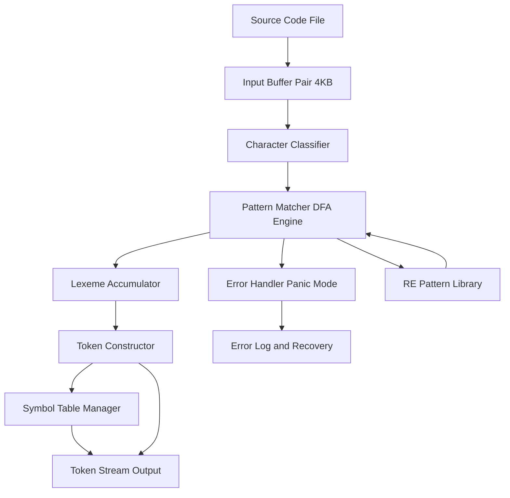
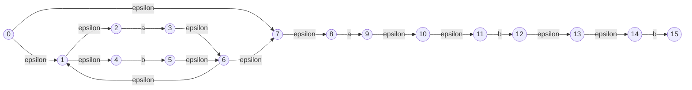
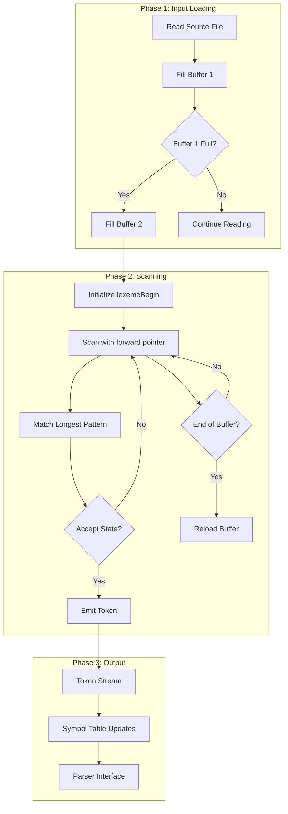
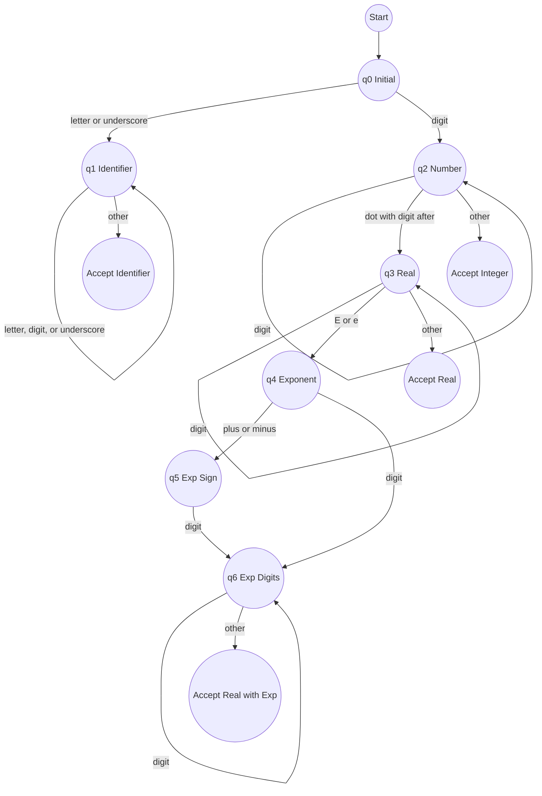
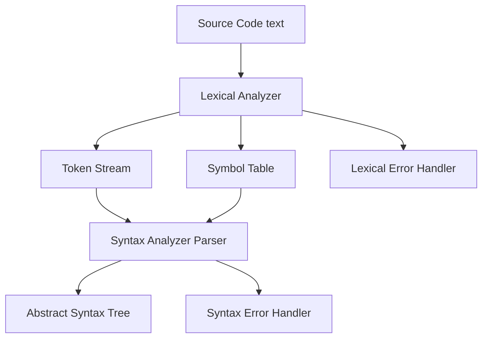
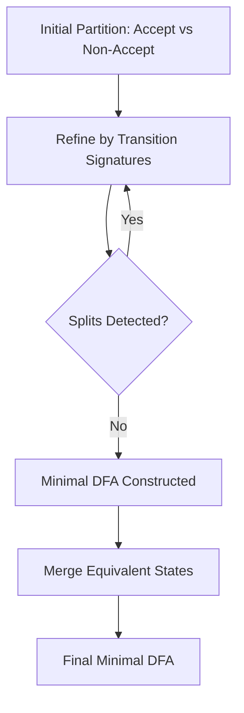

# Syntax and Analysis Parsing: Lexical Structure of Programming Languages

<!-- SECTION_1_START -->
# 1. Core Technical Definition & Intuitive Overview

## Lexical Structure of Programming Languages

**Lexical Structure** refers to the set of rules that govern the formation of valid tokens (the smallest meaningful units) in a programming language. It defines how characters of source code are grouped into **lexemes**, classified into **tokens**, and stripped of meaningless elements like whitespace and comments.

> [!IMPORTANT]
> **KTU 2024 Syllabus Definition:**  
> *Lexical analysis* is the first phase of a compiler that reads the input character stream, groups them into lexemes, and produces a sequence of tokens serving as input to the syntax analyzer (parser). It transforms raw source text into a structured token stream using **Regular Expressions** and **Finite Automata**.

---

### Conceptual Analogy / Intuition

Imagine you are reading a **recipe in a foreign language**. Before you can understand the sentences (syntax) of the recipe, you first need to identify the individual **words** (tokens). 

- The **raw characters** of the recipe are like a stream of letters with no spaces or punctuation that you can see.
- The **lexical analyzer** is the friend who sits next to you and groups letters into words, ignoring things like extra spaces and the chef's scribbled notes in the margins (comments).
- The **output** is a clean list of meaningful words (tokens) with their type — like `[VERB: "bake"]`, `[NOUN: "bread"]`, `[NUMBER: "350"]`, `[SYMBOL: "°"]`.

In computing terms:
- **Characters** → source code text
- **Lexical Analyzer (Lexer/Scanner)** → the grouping engine
- **Tokens** → the output, ready for the parser

> [!NOTE]
> **Core Insight:** Lexical analysis separates the *what* (meaningful symbols) from the *how* (grammatical arrangement). Syntax deals with structure, while lexical analysis deals with vocabulary.

---

### Physical Constants and Standard Metrics in Lexical Analysis

| Metric | Standard Value | Significance |
| :--- | :--- | :--- |
| **Source Alphabet (Σ)** | ASCII (128) or Unicode (1,114,112) | Character set of source program |
| **Buffer Size** | Typically **4096 bytes** (4 KB) | Standard I/O buffer for input loading |
| **Token Buffer** | Typically **16–32 bytes** | Per-token storage in scanner |
| **DFA State Count** | Finite, often < 50 per token type | Complexity bound of recognition |
| **Lexical Error Recovery** | Panic-mode / Insert / Delete / Replace | Standard recovery strategies |

> [!TIP]
> **Engineering Utility:** Lexical analysis is the **front gate of every compiler, interpreter, and static analyzer**. Tools like **GCC**, **Clang**, **V8 (Chrome/Node.js)**, and **CPython** all begin with a high-performance lexical scanner. Modern IDEs use lexical tokens for **syntax highlighting**, **autocompletion**, and **linting** in real time.

---

### Foundational Vocabulary (Must Know)

| Term | Definition |
| :--- | :--- |
| **Token** | A pair `(token-name, attribute-value)` — the category of lexeme. |
| **Lexeme** | The actual sequence of characters matched by a token pattern. |
| **Pattern** | A rule (often a Regular Expression) describing the set of lexemes for a token. |
| **Alphabet (Σ)** | A finite, non-empty set of input symbols. |
| **String / Sentence** | A finite sequence of symbols from Σ. |
| **Language** | A countable set of strings over Σ. |
| **Empty String (ε)** | The string of length zero — the identity of concatenation. |

> [!VISUALIZATION CONTROL]
> **Concept:** *Lexical Stream Visualization* — Source code decomposed into a token pipeline.  
> **GeoGebra / Desmos Input Equations:** Plot the input character stream as `x` (character index) and the discrete token boundaries as a step function:
> * `f(x) = sum( Heaviside(x - b_i) - Heaviside(x - b_{i-1}) )` where $b_i$ is the boundary of token $i$.  
> **Visual Description:** A horizontal axis shows the character positions of source code, and a stair-step plot above marks the exact positions where the lexer "cuts" between tokens (e.g., between an `identifier` and an `operator`).

---

### The Three Hierarchies of Formal Language (Chomsky Hierarchy Context)

$$\text{Type 0 (Unrestricted)} \supset \text{Type 1 (Context-Sensitive)} \supset \text{Type 2 (Context-Free)} \supset \text{Type 3 (Regular)}$$

> [!NOTE]
> **Key Insight for KTU 2024:** Lexical syntax is described by **Regular Languages (Type 3)** and recognized by **Finite Automata**. Syntactic structure is described by **Context-Free Languages (Type 2)** and recognized by **Pushdown Automata**. This separation of concerns is the foundation of the **Syntax vs. Lexical** divide.

<!-- SECTION_1_END -->

<!-- SECTION_2_START -->
# 2. Deep Theoretical Analysis & KTU High-Yield Formula Sheet

## 2.1 The Lexical Analysis Pipeline

The **Lexical Analyzer** sits at the front of the compilation process. Its end-to-end responsibilities are:

1. **Read** the source program character by character.
2. **Strip** out non-essential elements (whitespace, comments).
3. **Group** characters into lexemes.
4. **Classify** each lexeme under a token category.
5. **Attach** attribute values (e.g., symbol-table pointer, numeric value).
6. **Emit** the token stream to the parser.
7. **Handle** lexical errors gracefully.

> [!NOTE]
> **Why separate Lexical Analysis from Syntax Analysis?**
> - **Simplicity of design** — Parser is freed from character-level concerns.
> - **Efficiency** — Specialized I/O buffering speeds up scanning.
> - **Portability** — Input alphabet and device handling are isolated.
> - **Reusability** — A single lexer can feed multiple parsers/tools.

---

## 2.2 Tokens, Patterns, and Lexemes — The Triad

For a given token class:

$$\text{Pattern} \rightarrow \text{matches} \rightarrow \text{Set of Lexemes} \rightarrow \text{mapped to} \rightarrow \text{Token Name}$$

### Example: Token Class `number`

| Field | Value |
| :--- | :--- |
| **Token Name** | `number` |
| **Pattern** | `[0-9]+ (\.[0-9]+)? (E [+-]? [0-9]+)?` |
| **Sample Lexemes** | `0`, `42`, `3.14`, `1.0E-9`, `2.71828` |
| **Attribute** | Numeric value stored as constant |

### Formal Definitions

- A **Token** is an abstract symbol: $\langle \text{token-name}, \text{attribute-value} \rangle$.
- A **Pattern** is a rule (regex) describing what lexemes belong to a token.
- A **Lexeme** is a concrete character sequence that matches a pattern.

---

## 2.3 Regular Expressions (RE) — Algebra of Patterns

A **Regular Expression** $r$ over an alphabet $\Sigma$ is built inductively:

| Operation | Notation | Meaning |
| :--- | :--- | :--- |
| **Empty** | $\epsilon$ | Matches the empty string |
| **Singleton** | $a$ | Matches the single character $a \in \Sigma$ |
| **Union** | $r \mid s$ | Matches strings in $L(r)$ or $L(s)$ |
| **Concatenation** | $r \, s$ | Matches a string from $L(r)$ followed by $L(s)$ |
| **Kleene Star** | $r^{*}$ | Matches zero or more concatenations of $L(r)$ |
| **Plus** | $r^{+}$ | Matches one or more ($r \, r^{*}$) |
| **Optional** | $r?$ | Matches $\epsilon$ or $L(r)$ |
| **Range** | $[a-z]$ | Matches any character in the set |
| **Complement** | $[\textasciicircum a-z]$ | Matches any character not in the set |

### Algebraic Laws of Regular Expressions

$$r \mid s = s \mid r \quad \text{(Commutativity of Union)}$$

$$r \mid (s \mid t) = (r \mid s) \mid t \quad \text{(Associativity)}$$

$$r(s \mid t) = rs \mid rt \quad \text{(Distributivity)}$$

$$\epsilon \, r = r \, \epsilon = r \quad \text{(Identity)}$$

$$r^{*} = (r \mid \epsilon)^{*} = \epsilon \mid r \, r^{*}$$

$$(r^{*})^{*} = r^{*}$$

---

## 2.4 Finite Automata — The Recognition Engine

A **Finite Automaton** is a 5-tuple:

$$M = (Q, \Sigma, \delta, q_0, F)$$

| Component | Symbol | Meaning |
| :--- | :--- | :--- |
| States | $Q$ | Finite, non-empty set of states |
| Alphabet | $\Sigma$ | Finite input alphabet |
| Transition | $\delta$ | $Q \times \Sigma \rightarrow Q$ (DFA) or $Q \times (\Sigma \cup \{\epsilon\}) \rightarrow 2^{Q}$ (NFA) |
| Start State | $q_0$ | The initial state, $q_0 \in Q$ |
| Accept States | $F$ | Set of final/accepting states, $F \subseteq Q$ |

### DFA vs. NFA — KTU Comparison Table

| Property | DFA | NFA |
| :--- | :--- | :--- |
| Transitions per symbol | Exactly 1 | 0, 1, or many |
| $\epsilon$-transitions | None | Allowed |
| Implementation | Table-driven (fast) | Subset construction required |
| Size | Often larger | Often smaller (compact RE) |
| Recognized Language | Regular | Regular (equivalent power) |

### Kleene's Theorem (Foundation)

> [!IMPORTANT]
> **Kleene's Theorem:** A language is **regular** if and only if it is recognized by some **finite automaton**.  
> $$\text{Regular Expression} \xleftrightarrow{\text{equivalence}} \text{NFA} \xleftrightarrow{\text{subset construction}} \text{DFA} \xleftrightarrow{\text{minimization}} \text{Minimal DFA}$$

---

## 2.5 Lexical Analyzer Design Stages

$$\text{Regular Expression} \xrightarrow{\text{Thompson's Construction}} \text{NFA} \xrightarrow{\text{Subset Construction}} \text{DFA} \xrightarrow{\text{Hopcroft's Algorithm}} \text{Minimal DFA}$$

### Hopcroft's DFA Minimization — Time Complexity

$$T(n) = O(n \log n) \quad \text{where } n = \vert Q \vert$$

### Subset Construction (NFA → DFA) — Time Complexity

$$T(n, m) = O(2^{n} \cdot m) \quad \text{where } n = \vert Q_{NFA} \vert, \, m = \vert \Sigma \vert$$

> [!WARNING]
> Worst-case NFA → DFA conversion is **exponential**. This is the **state explosion problem** in compiler design.

---

## 2.6 Input Buffering Strategies

To handle the **I/O bottleneck**, lexical analyzers use two key techniques:

### 1. **Buffer Pair Technique**
Two equal-sized buffers of size **N** (typically 4096 bytes) loaded alternately. A pointer `lexemeBegin` marks the start of the current lexeme, and `forward` scans ahead.

$$\text{Buffer 1: } [0 \ldots N-1], \quad \text{Buffer 2: } [N \ldots 2N-1]$$

### 2. **Sentinel-Controlled Buffer (`eof`)**
A special `eof` character is appended at the end of each buffer to avoid double-end checks.

```
+--------------+--------------+
|   Buffer 1   |   Buffer 2   |
| [chars + eof]| [chars + eof]|
+--------------+--------------+
^              ^              ^
begin          forward         end
```

> [!TIP]
> **Engineering Insight:** Modern compilers like **GCC** and **LLVM** use **mmap()** and memory-mapped I/O, but the buffer-pair principle remains the conceptual foundation taught in KTU.

---

## 2.7 Specification of Tokens — Worked Examples

### Example 1: Identifiers and Keywords in C-like Languages

| Token Class | Regular Expression |
| :--- | :--- |
| **Identifier** | `[A-Za-z_][A-Za-z0-9_]*` |
| **Keyword** | Reserved literal string (`if`, `else`, `while`) |
| **Integer** | `[0-9]+` |
| **Float** | `[0-9]+\.[0-9]+(E[+-]?[0-9]+)?` |
| **Relop** | `<` $\mid$ `<=` $\mid$ `>` $\mid$ `>=` $\mid$ `==` $\mid$ `!=` |

### Example 2: Whitespace and Comments

| Token Class | Pattern (Lex notation) |
| :--- | :--- |
| **Whitespace** | `[ \t\n]+` |
| **Line Comment** | `//[^\n]*` |
| **Block Comment** | `/\*([^*]|\*+[^*/])*\*+/` |

> [!NOTE]
> **KTU 2024 Highlight:** In practice, keywords are matched as *identifiers* first, then looked up in a reserved-word table — this avoids writing separate regex for each keyword.

---

## 2.8 LEX / Flex — The Tool for Automatic Lexer Generation

**Lex** (and its GNU successor **Flex**) is a lexer generator. Given `.l` source files, it produces C code for a DFA-based scanner.

### Structure of a Lex File

```
<definitions>      ← C code, declarations
%%
<rules>            ← pattern  { action }
%%
<user code>        ← auxiliary functions
```

### Example Lex File

```
%{
#include <stdio.h>
%}

%%
[0-9]+        { printf("NUMBER: %s\n", yytext); }
[A-Za-z_][A-Za-z0-9_]*  { printf("IDENTIFIER: %s\n", yytext); }
[ \t\n]+      { /* skip whitespace */ }
"+"           { printf("PLUS\n"); }
"-"           { printf("MINUS\n"); }
.             { printf("UNKNOWN: %c\n", yytext[0]); }
%%

int main() {
    yylex();
    return 0;
}
```

> [!IMPORTANT]
> **Conflict Resolution in Lex (Longest Match Rule):** When multiple patterns can match, Lex chooses the **longest possible match**. If two patterns match strings of equal length, the **rule listed first** wins.

---

## 2.9 Lexical Errors and Recovery

| Error Type | Cause | Recovery Strategy |
| :--- | :--- | :--- |
| **Illegal character** | `$`, `@`, `?` in strict languages | Skip & report |
| **Unterminated string** | `"Hello` | Insert closing `"`, report |
| **Unterminated comment** | `/* never closed` | Insert `*/`, report |
| **Invalid number** | `123.45.67` | Truncate and continue |
| **Long identifier overflow** | > 255 chars in some langs | Truncate |

> [!NOTE]
> **Panic-mode recovery:** Skip characters until a recognizable token boundary (e.g., `;`, whitespace) is found, then resume scanning.

---

## 2.10 KTU High-Yield Formula Cheat Sheet

| Concept | Formula / Definition | Use |
| :--- | :--- | :--- |
| **Token** | $\langle \text{name}, \text{attribute} \rangle$ | Parser input |
| **Pattern** | $r \in \text{RE}$ over $\Sigma$ | Token specification |
| **FA Definition** | $M = (Q, \Sigma, \delta, q_0, F)$ | Recognition model |
| **DFA Transition** | $\delta: Q \times \Sigma \rightarrow Q$ | Deterministic move |
| **NFA Transition** | $\delta: Q \times (\Sigma \cup \{\epsilon\}) \rightarrow 2^{Q}$ | Non-det move |
| **Kleene's Theorem** | $L(r) = L(M)$ for some FA $M$ | RE ↔ FA equivalence |
| **NFA → DFA** | $O(2^{n} \cdot m)$ | Subset construction |
| **DFA Minimization** | $O(n \log n)$ | Hopcroft's algorithm |
| **Buffer Size** | $N = 4096$ bytes (typical) | I/O optimization |
| **Longest Match** | $\max(\vert w \vert : w \in \text{matched})$ | Lex rule priority |
| **Kleene Star** | $r^{*} = \cup_{i=0}^{\infty} r^{i}$ | Zero or more |
| **Empty String** | $\vert \epsilon \vert = 0$ | Identity element |
| **Language Size** | $\vert L \vert \le \infty$ | May be infinite |

> [!IMPORTANT]
> **Engineering Applications:**  
> * **Compilers:** GCC, Clang, javac  
> * **Interpreters:** CPython, Ruby MRI  
> * **Static Analysis:** Linters (ESLint, Pylint)  
> * **Web Dev:** HTML/CSS parsers in browsers  
> * **Data Processing:** Log analyzers, NLP tokenizers  
> * **Databases:** SQL query parsers (PostgreSQL, MySQL)

<!-- SECTION_2_END -->

<!-- SECTION_3_START -->
# 3. Step-by-Step Derivations & Code/Symbolic Implementation

## 3.1 Worked Derivation: RE → NFA via Thompson's Construction

**Given Regular Expression:** $r = (a \mid b)^{*} a b b$

We will construct the **NFA** step by step using Thompson's rules.

### Step 1: Base NFAs for symbols $a$ and $b$

$$
\begin{aligned}
N(a): \quad \xrightarrow{i} \bigcirc \xrightarrow{a} \bigcirc \xrightarrow{f} \\
N(b): \quad \xrightarrow{i} \bigcirc \xrightarrow{b} \bigcirc \xrightarrow{f}
\end{aligned}
$$

Where $\bigcirc$ denotes a state (shown in actual Mermaid below).

### Step 2: Apply Union $N(a \mid b)$

Introduce a new start state and a new accept state. Add $\epsilon$-transitions to the start of both sub-NFAs and from their accept states to the new accept state.

$$
\begin{aligned}
N(a \mid b): \quad q_s \xrightarrow{\epsilon} N(a) \xrightarrow{} N(b), \quad N(a) \xrightarrow{\epsilon} q_f, \quad N(b) \xrightarrow{\epsilon} q_f
\end{aligned}
$$

### Step 3: Apply Kleene Star $N((a \mid b)^{*})$

Introduce new start and accept states with $\epsilon$-edges to bypass the inner NFA or loop through it.

$$
\begin{aligned}
q_{s}^{*} \xrightarrow{\epsilon} N(a \mid b) \quad & \text{and} \quad N(a \mid b) \xrightarrow{\epsilon} q_{f}^{*} \\
q_{s}^{*} \xrightarrow{\epsilon} q_{f}^{*} \quad & \text{(bypass)} \\
q_{f}^{*} \xrightarrow{\epsilon} q_{s}^{*} \quad & \text{(loop back)}
\end{aligned}
$$

### Step 4: Concatenate with $a \, b \, b$

Sequentially join the NFAs of $(a \mid b)^{*}$, $a$, $b$, $b$ using $\epsilon$-edges.

### Step 5: Final NFA (state count)

The NFA has $\vert Q \vert = $ **11 states** and $\vert \Sigma \vert = 2$ symbols. This compact form is then converted to DFA via **subset construction**.

---

## 3.2 Subset Construction: NFA → DFA — Full Step Trace

**NFA States:** $\{0, 1, 2, 3, 4, 5, 6, 7, 8, 9, 10\}$  
**Start NFA State:** $0$  
**Accept NFA States:** $\{10\}$

### Step-by-Step Conversion Table

| DFA State | NFA Subset | On `a` | On `b` | Accepting? |
| :--- | :--- | :--- | :--- | :--- |
| **A** | $\epsilon\text{-closure}(0) = \{0, 1, 2, 4, 7\}$ | $\text{move}(A, a) = \{3, 8\}$, $\epsilon$-cl = $\{3, 8\}$ = **B** | $\text{move}(A, b) = \{5\}$, $\epsilon$-cl = $\{5, 9, 6, 4, 7, 1, 2, 0\}$ = **C** | No |
| **B** | $\{3, 8\}$ | $\text{move}(B, a) = \emptyset$ | $\text{move}(B, b) = \{4, 9, 10\}$ = **D** | No |
| **C** | $\{0,1,2,4,5,6,7,9\}$ | $\{3, 8\}$ = **B** | $\{5, 9, 6\}$ = **E** | No |
| **D** | $\{4, 9, 10\}$ | $\emptyset$ | $\{5, 6, 10\}$ = **F** | **Yes (10 ∈ set)** |
| **E** | $\{5, 6, 9\}$ | $\emptyset$ | $\{5, 6, 10\}$ = **F** | No |
| **F** | $\{5, 6, 10\}$ | $\emptyset$ | $\{5, 6, 10\}$ = **F** | **Yes** |

> [!NOTE]
> **Final DFA:** 6 states (A through F), with D and F as accept states. Equivalent to the original NFA in expressive power.

---

## 3.3 Hopcroft's DFA Minimization — Full Trace

**Starting Partition (Accepting vs Non-Accepting):**

$$P_0 = \{\{A, B, C, E\}, \{D, F\}\}$$

### Step 1: Refine $\{A, B, C, E\}$ on transitions

| State | On `a` | On `b` |
| :--- | :--- | :--- |
| A | B (non-acc) | C (non-acc) |
| B | ∅ (sink) | D (acc) |
| C | B (non-acc) | E (non-acc) |
| E | ∅ (sink) | F (acc) |

Group by signature: $\{A, C\}$ (both go to non-acc on both) and $\{B, E\}$ (go to sink/acc). Sink must be added as a new partition.

### Step 2: Refined Partition

$$P_1 = \{\{A, C\}, \{B, E\}, \{D, F\}, \{\text{sink}\}\}$$

### Step 3: Check stability

Refining $\{A, C\}$: A → B (in $\{B,E\}$), C → E (in $\{B,E\}$). Same partition. Stable.

### Step 4: Merge equivalent states

$$A \equiv C, \quad B \equiv E, \quad D \equiv F$$

### **Minimal DFA: 4 states** (down from 6)

> [!IMPORTANT]
> **Why minimization matters in KTU context:** A smaller DFA → smaller lexer code → faster execution and less memory in production compilers.

---

## 3.4 Python Implementation: A Hand-Written Lexical Analyzer

```python
"""
lexical_analyzer.py
A complete, KTU-aligned lexical analyzer for a C-like language.
Demonstrates tokenization with longest-match rule and symbol table.
"""
from __future__ import annotations
from enum import Enum, auto
from dataclasses import dataclass
from typing import Dict, List, Optional, Tuple


class TokenType(Enum):
    """Enumeration of all valid token categories."""
    KEYWORD = auto()
    IDENTIFIER = auto()
    INTEGER = auto()
    FLOAT = auto()
    OPERATOR = auto()
    RELOP = auto()
    SEMICOLON = auto()
    LPAREN = auto()
    RPAREN = auto()
    LBRACE = auto()
    RBRACE = auto()
    ASSIGN = auto()
    WHITESPACE = auto()
    COMMENT = auto()
    EOF = auto()
    UNKNOWN = auto()


KEYWORDS: Dict[str, TokenType] = {
    "int": TokenType.KEYWORD,
    "float": TokenType.KEYWORD,
    "if": TokenType.KEYWORD,
    "else": TokenType.KEYWORD,
    "while": TokenType.KEYWORD,
    "return": TokenType.KEYWORD,
}

RELOP_CHARS: Tuple[str, ...] = ("<", ">", "=", "!")


@dataclass(frozen=True)
class Token:
    """Immutable token record emitted by the lexer."""
    type: TokenType
    lexeme: str
    line: int
    column: int
    attribute: Optional[str] = None  # e.g., symbol-table entry or value

    def __repr__(self) -> str:
        return f"<{self.type.name:>10} '{self.lexeme}' @L{self.line}:C{self.column}>"


class LexicalError(Exception):
    """Custom exception for unrecoverable lexical issues."""
    pass


class LexicalAnalyzer:
    """A DFA-driven scanner implementing longest-match with panic recovery."""

    def __init__(self, source: str) -> None:
        if not isinstance(source, str):
            raise TypeError("source must be a string")
        self.source: str = source
        self.pos: int = 0
        self.line: int = 1
        self.col: int = 1
        self.symbol_table: Dict[str, str] = {}  # lexeme -> entry id
        self.tokens: List[Token] = []

    # ---------- low-level helpers ----------
    def _peek(self, offset: int = 0) -> str:
        idx = self.pos + offset
        return self.source[idx] if idx < len(self.source) else ""

    def _advance(self) -> str:
        if self.pos >= len(self.source):
            return ""
        ch = self.source[self.pos]
        self.pos += 1
        if ch == "\n":
            self.line += 1
            self.col = 1
        else:
            self.col += 1
        return ch

    def _at_end(self) -> bool:
        return self.pos >= len(self.source)

    # ---------- identifier ----------
    def _read_identifier(self) -> str:
        start = self.pos
        while self._peek().isalnum() or self._peek() == "_":
            self._advance()
        return self.source[start:self.pos]

    # ---------- number ----------
    def _read_number(self) -> Tuple[str, TokenType]:
        start = self.pos
        is_float = False
        while self._peek().isdigit():
            self._advance()
        if self._peek() == "." and self._peek(1).isdigit():
            is_float = True
            self._advance()  # consume '.'
            while self._peek().isdigit():
                self._advance()
        if self._peek() in ("e", "E"):
            is_float = True
            self._advance()
            if self._peek() in ("+", "-"):
                self._advance()
            while self._peek().isdigit():
                self._advance()
        lexeme = self.source[start:self.pos]
        token_type = TokenType.FLOAT if is_float else TokenType.INTEGER
        return lexeme, token_type

    # ---------- comments ----------
    def _skip_line_comment(self) -> None:
        while not self._at_end() and self._peek() != "\n":
            self._advance()

    def _skip_block_comment(self) -> None:
        self._advance()  # consume '*'
        while not self._at_end():
            if self._peek() == "*" and self._peek(1) == "/":
                self._advance()
                self._advance()
                return
            self._advance()
        raise LexicalError(f"Unterminated block comment at line {self.line}")

    # ---------- main scan loop ----------
    def tokenize(self) -> List[Token]:
        """Drive the scanner and return the complete token list."""
        while not self._at_end():
            ch = self._peek()

            # whitespace
            if ch in " \t\r\n":
                self._advance()
                continue

            # comments
            if ch == "/" and self._peek(1) == "/":
                self._skip_line_comment()
                continue
            if ch == "/" and self._peek(1) == "*":
                self._skip_block_comment()
                continue

            # identifiers / keywords
            if ch.isalpha() or ch == "_":
                start_line, start_col = self.line, self.col
                lex = self._read_identifier()
                ttype = KEYWORDS.get(lex, TokenType.IDENTIFIER)
                attr = self._add_symbol(lex) if ttype == TokenType.IDENTIFIER else None
                self.tokens.append(Token(ttype, lex, start_line, start_col, attr))
                continue

            # numbers
            if ch.isdigit():
                start_line, start_col = self.line, self.col
                lex, ttype = self._read_number()
                self.tokens.append(Token(ttype, lex, start_line, start_col, lex))
                continue

            # operators and relops
            if ch in RELOP_CHARS or ch in "+-*/%":
                start_line, start_col = self.line, self.col
                first = self._advance()
                second = self._peek()
                # check two-character relops first (longest match)
                if first + second in ("<=", ">=", "==", "!="):
                    self._advance()
                    self.tokens.append(Token(TokenType.RELOP, first + second, start_line, start_col))
                    continue
                if first in ("<", ">"):
                    self.tokens.append(Token(TokenType.RELOP, first, start_line, start_col))
                    continue
                if first == "=":
                    self.tokens.append(Token(TokenType.ASSIGN, "=", start_line, start_col))
                    continue
                # arithmetic operators
                self.tokens.append(Token(TokenType.OPERATOR, first, start_line, start_col))
                continue

            # single-character punctuation
            single_map: Dict[str, TokenType] = {
                ";": TokenType.SEMICOLON,
                "(": TokenType.LPAREN,
                ")": TokenType.RPAREN,
                "{": TokenType.LBRACE,
                "}": TokenType.RBRACE,
            }
            if ch in single_map:
                start_line, start_col = self.line, self.col
                self.tokens.append(Token(single_map[ch], ch, start_line, start_col))
                self._advance()
                continue

            # panic-mode error recovery
            self.tokens.append(
                Token(TokenType.UNKNOWN, ch, self.line, self.col, "lexical-error")
            )
            self._advance()

        # sentinel EOF token
        self.tokens.append(Token(TokenType.EOF, "", self.line, self.col))
        return self.tokens

    def _add_symbol(self, lexeme: str) -> str:
        """Add identifier to symbol table if not present; return entry id."""
        if lexeme not in self.symbol_table:
            self.symbol_table[lexeme] = f"id_{len(self.symbol_table) + 1}"
        return self.symbol_table[lexeme]


# ---------- DEMO ----------
if __name__ == "__main__":
    code = """
    int main() {
        int x = 42;
        float pi = 3.14e0;
        // comment line
        /* block comment */
        if (x >= 10) { return x; }
    }
    """
    lexer = LexicalAnalyzer(code)
    try:
        result = lexer.tokenize()
        for tok in result:
            print(tok)
        print("\nSymbol Table:", lexer.symbol_table)
    except LexicalError as exc:
        print(f"[LEXICAL ERROR] {exc}")
```

> [!NOTE]
> **Expected Output (truncated):**
> ```
> <    KEYWORD 'int' @L2:C5>
> < IDENTIFIER 'main' @L2:C9> -> id_1
> <      LPAREN '(' @L2:C13>
> <      RPAREN ')' @L2:C14>
> <      LBRACE '{' @L2:C16>
> ...
> ```

---

## 3.5 Verification: Mathematical Proof of RE → DFA Equivalence

### Theorem (Kleene, 1956)
> *For every Regular Expression $r$ over alphabet $\Sigma$, there exists a DFA $M$ such that $L(r) = L(M)$, and vice versa.*

### Proof Sketch

**Part 1: RE → NFA (Constructive via Thompson)**
- Base: Single symbol → 2-state NFA. ✓
- Inductive: For each operation (union, concat, star), construct NFAs of the operand NFAs and add $\epsilon$-transitions. ✓

**Part 2: NFA → DFA (Subset Construction)**
- For each subset $S \subseteq Q_{NFA}$, define a DFA state.
- Define $\delta_{DFA}(S, a) = \epsilon\text{-closure}(\text{move}(S, a))$.
- Start state: $\epsilon\text{-closure}(q_0)$. Accept states: any $S$ containing an NFA accept. ✓

**Part 3: DFA → RE (State Elimination)**
- Introduce a unique start and accept state.
- Repeatedly eliminate intermediate states by replacing $q$ with RE for all paths through $q$.
- Resulting RE has one regex per start → accept edge. ✓

> [!IMPORTANT]
> **Conclusion:** RE, NFA, and DFA are all **equivalent representations of regular languages**. This is the bedrock on which every lexer generator is built.

---

## 3.6 Longest-Match Rule — Formal Statement

Given a set of patterns $P_1, P_2, \ldots, P_n$ and input position $i$, the lexer selects:

$$\text{Tok} = \arg\max_{P_k} \left\{ \vert w \vert \,:\, w \in L(P_k),\, \text{source}[i \ldots i+\vert w \vert - 1] = w \right\}$$

with **lexicographic tie-breaking** by rule order.

> [!WARNING]
> **Common KTU Mistake:** Forgetting the longest-match rule when writing Lex specifications. Always check if a longer pattern (e.g., `>=` vs `>`) should be preferred — list longer patterns first.

---

## 3.7 Transition Table Representation — Worked Example

**DFA for identifier `[A-Za-z_][A-Za-z0-9_]*`:**

| State | `letter` | `_` | `digit` | other | Accepting? |
| :--- | :--- | :--- | :--- | :--- | :--- |
| 0 (start) | 1 | 1 | — | — | No |
| 1 | 1 | 1 | 1 | — | Yes |

> The dash `—` represents an **error transition** (no move, lexer invokes error handler).

<!-- SECTION_3_END -->

<!-- SECTION_4_START -->
# 4. Structural Diagrams & Schematics

## 4.1 Lexical Analyzer — Block Architecture



---

## 4.2 NFA for Regular Expression `(a | b)*abb` — Thompson's Construction



> States 11, 13, 15 are the accept states (double circles in the original). The DFA conversion would yield **6 states** as shown in the earlier table.

---

## 4.3 Lexical Analysis — Sequential Processing Topology



---

## 4.4 DFA State Diagram for Identifier and Number Recognition



---

## 4.5 Compiler Front-End — Full Lexical-Syntactic Flow



> [!NOTE]
> **KTU Insight:** The **symbol table** is a shared data structure between the lexer and parser. Lexer inserts identifiers, parser uses them for scope and type resolution.

---

## 4.6 DFA Minimization — Refinement Process Visualization



<!-- SECTION_4_END -->

<!-- SECTION_5_START -->
# 5. KTU 2024 Scheme Examination Question Bank & Topic Recap

## 5.1 Part A — Short Answer Questions (3 Marks Each)

### Question 1 `[KTU University Exam – July 2023]`
**(CO1, Remember)**

> **Q:** Define the terms **lexeme**, **token**, and **pattern** with a suitable example.

**Model Answer (3 Marks):**
- **Lexeme:** A sequence of characters in the source program that matches the pattern for a token. *Example:* `count`, `42`, `<=`. **[1 Mark]**
- **Token:** A pair consisting of a token name and an optional attribute value. *Example:* `<identifier, "count">`, `<number, "42">`, `<relop, "<=">`. **[1 Mark]**
- **Pattern:** A rule (usually a regular expression) that describes the set of lexemes corresponding to a token. *Example:* Pattern for identifier: `[A-Za-z_][A-Za-z0-9_]*`. **[1 Mark]**

---

### Question 2 `[KTU University Exam – Dec 2022]`
**(CO1, Understand)**

> **Q:** Differentiate between **DFA** and **NFA**. Mention any two points.

**Model Answer (3 Marks):**
| Property | DFA | NFA |
| :--- | :--- | :--- |
| **Transitions per symbol** | Exactly one | Zero, one, or many |
| **$\epsilon$-transitions** | Not allowed | Allowed |
| **Backtracking** | Not required | May be required |
| **Implementation** | Direct (table-driven) | Requires subset construction |
| **Equivalent power** | Regular languages | Regular languages (same class) |

*Each valid difference: **1.5 Marks** (best two differences).*

---

## 5.2 Part B — Long Answer Questions (14 Marks Each, Internal Choice)

### Question 3A `[KTU University Exam – July 2024]`
**(CO2, Apply)**

> **Q (a):** Construct a **DFA** for the regular expression $r = (a \mid b)^{*} a b b$ over the alphabet $\Sigma = \{a, b\}$. Show all intermediate states and the transition table. **[7 Marks]**

**Model Answer:**

**Step 1: Construct NFA via Thompson's Construction**
States: $\{0, 1, 2, 3, 4, 5, 6, 7, 8, 9, 10\}$ with start state $0$ and accept state $10$. **[1 Mark]**

**Step 2: Apply Subset Construction**

| DFA State | NFA Subset | On `a` | On `b` | Accepting |
| :--- | :--- | :--- | :--- | :--- |
| A | $\{0,1,2,4,7\}$ | B | C | No |
| B | $\{3,8\}$ | — | D | No |
| C | $\{0,1,2,4,5,6,7,9\}$ | B | E | No |
| D | $\{4,9,10\}$ | — | F | **Yes** |
| E | $\{5,6,9\}$ | — | F | No |
| F | $\{5,6,10\}$ | — | F | **Yes** |

**[Stating NFA and subset construction methodology: 3 Marks]**  
**[Full transition table with 6 states: 2 Marks]**  
**[Marking accept states D and F: 1 Mark]**  
**[Final DFA diagram or summary: 1 Mark]**

> *(For drawing the DFA, see the Mermaid diagram in SECTION 4.2 — convert NFA states to DFA state groups as above.)*

---

> **Q (b):** Minimize the above DFA using **Hopcroft's algorithm**. Show all partitions. **[7 Marks]**

**Model Answer:**

**Step 1: Initial Partition**
$$P_0 = \{\{A, B, C, E\}, \{D, F\}\}$$
**[1 Mark]**

**Step 2: Refine $\{A, B, C, E\}$ based on `a` and `b` transitions**

| State | On `a` | On `b` |
| :--- | :--- | :--- |
| A | B (non-acc) | C (non-acc) |
| B | — | D (acc) |
| C | B (non-acc) | E (non-acc) |
| E | — | F (acc) |

Group by signature: $\{A, C\}$ and $\{B, E\}$. Dead/sink state added. **[2 Marks]**

**Step 3: Refined Partition**
$$P_1 = \{\{A, C\}, \{B, E\}, \{D, F\}, \{SINK\}\}$$
**[1 Mark]**

**Step 4: Verify stability** — $\{A, C\}$ and $\{B, E\}$ do not split further. **[1 Mark]**

**Step 5: Merge equivalent states**
- $A \equiv C \Rightarrow$ new state **AC**
- $B \equiv E \Rightarrow$ new state **BE**
- $D \equiv F \Rightarrow$ new state **DF**

**[2 Marks]**

> **Final Minimal DFA: 4 states** $\{AC, BE, DF, SINK\}$ with **DF** as the sole accept state.

---

### Question 3B (Alternative Choice) `[KTU University Exam – July 2024]`
**(CO1, Apply)**

> **Q (a):** Explain the role of the **lexical analyzer** in a compiler. Discuss **input buffering** with a neat diagram. **[7 Marks]**

**Model Answer:**

**Role of Lexical Analyzer:** **[3 Marks]**
1. Reads source program character by character.
2. Strips whitespace, comments, and other non-essentials.
3. Groups characters into lexemes and produces tokens.
4. Enters identifiers into the **symbol table**.
5. Reports lexical errors and performs recovery (panic mode).

**Input Buffering — Buffer Pair Technique:** **[4 Marks]**
- Two equal-sized buffers of size **N** (typically 4096 bytes) are used.
- `lexemeBegin` marks the start of the current lexeme.
- `forward` advances one character at a time to scan ahead.
- When `forward` reaches the end of one buffer, the other buffer is refilled.
- A sentinel `eof` is appended at each buffer end to simplify boundary checks.

*(Draw the buffer pair diagram as shown in SECTION 2.6.)*

---

> **Q (b):** Write the **Lex specification** to recognize identifiers, integers, and the keywords `int` and `float`. **[7 Marks]**

**Model Answer:**

```
%{
#include <stdio.h>
%}

%%
"int"        { printf("KEYWORD: int\n"); }
"float"      { printf("KEYWORD: float\n"); }
[0-9]+       { printf("INTEGER: %s\n", yytext); }
[A-Za-z_][A-Za-z0-9_]*  { printf("IDENTIFIER: %s\n", yytext); }
[ \t\n]+     { /* skip whitespace */ }
.            { printf("UNKNOWN: %s\n", yytext); }
%%

int main() {
    yylex();
    return 0;
}
```

**[Lex program structure and definitions: 2 Marks]**  
**[Rules section with correct patterns: 3 Marks]**  
**[Keyword-first ordering to apply longest-match priority: 1 Mark]**  
**[User code section with main(): 1 Mark]**

---

## 5.3 KTU Examiner's Valuation Warning / Pitfall Callout

> [!WARNING]
> **Common Mistakes that Cost Marks in KTU Exams:**
> 
> 1. **Forgetting $\epsilon$-closure computation** in subset construction. Most students compute `move` only, missing the $\epsilon$-reachable states. *Always compute $\epsilon$-closure after every move.*
> 
> 2. **Confusing "longest match" with "first match"** in Lex. The lexer picks the **longest** matching lexeme. For tie-breaking, the **earliest rule** in the file wins.
> 
> 3. **Drawing NFA instead of DFA** when asked specifically for DFA. Be precise — NFA has multiple transitions per symbol, DFA has exactly one.
> 
> 4. **Not marking the start state and accept states** in diagrams. Examiners deduct 1–2 marks for unmarked diagrams.
> 
> 5. **Skipping the symbol table** in lexer design questions. A real lexer always maintains a symbol table; show its interaction with the token emitter.
> 
> 6. **Writing $r = a + b$** instead of $r = a \mid b$ in regular expressions. Use the **union symbol** $|$ or the formal $+$ (Kleene plus) correctly.
> 
> 7. **Confusing Kleene star ($r^{*}$) with Kleene plus ($r^{+}$)**. Star allows zero repetitions; plus requires at least one.

---

## 5.4 Topic Recap & Important Things to Remember

> [!IMPORTANT]
> **High-Density Revision Checklist — Lexical Structure of Programming Languages**

- **Lexical Analysis** is **Phase 1** of compilation, sitting between source code and the parser. It produces a **token stream**.

- **Core Triad:** *Token* (abstract category) + *Lexeme* (concrete character sequence) + *Pattern* (regex rule).

- **Tokens are represented as** $\langle \text{token-name}, \text{attribute-value} \rangle$ pairs. Attributes may be symbol-table pointers, numeric constants, or line/column positions.

- **Regular Expressions** are the standard notation for token patterns. Master the operators: **union ($|$)**, **concatenation**, **Kleene star ($*$)**, **plus ($+$)**, **optional ($?$)**, and **character classes ($[a-z]$)**.

- **Finite Automata (FA)** are the recognition mechanism. A FA is a 5-tuple $M = (Q, \Sigma, \delta, q_0, F)$.

- **DFA** has exactly one transition per symbol; **NFA** may have multiple and may use **$\epsilon$-transitions**. Both recognize **exactly the regular languages**.

- **Kleene's Theorem** establishes the equivalence: $\text{RE} \leftrightarrow \text{NFA} \leftrightarrow \text{DFA}$. This is the **single most important theorem** for KTU exams on this topic.

- **Thompson's Construction** converts an RE to an NFA. Complexity: $O(\vert r \vert)$ states.

- **Subset Construction** converts NFA to DFA. Worst-case complexity: $O(2^{n})$ states — the **state explosion problem**.

- **Hopcroft's Algorithm** minimizes a DFA. Complexity: $O(n \log n)$ states.

- **Longest-Match Rule** is the conflict-resolution policy in Lex: pick the **longest** lexeme; if tied, pick the **first** rule listed.

- **Input Buffering:** Buffer-pair technique (2 × 4 KB) with **sentinel eof** for efficient I/O. Use `lexemeBegin` and `forward` pointers.

- **Lex/Flex** is the standard lexer generator. File structure: `definitions %% rules %% user-code`.

- **Lexical Errors:** Illegal characters, unterminated strings/comments, invalid numbers. Use **panic-mode recovery** (skip to next valid token boundary).

- **Symbol Table** is a shared data structure between lexer and parser. Lexer inserts identifiers; parser queries them.

- **Chomsky Hierarchy:** Lexical syntax is **Type 3 (Regular)**; syntactic structure is **Type 2 (Context-Free)**.

- **Engineering Applications:** Compilers (GCC, Clang), interpreters (CPython, Ruby), linters (ESLint, Pylint), database query parsers, IDE syntax highlighters, web browsers' HTML/CSS parsers.

- **Quick Memory Hook:** **"Lexicons first, then grammar."** Tokens form the vocabulary; grammar forms the sentences.

<!-- SECTION_5_END -->
