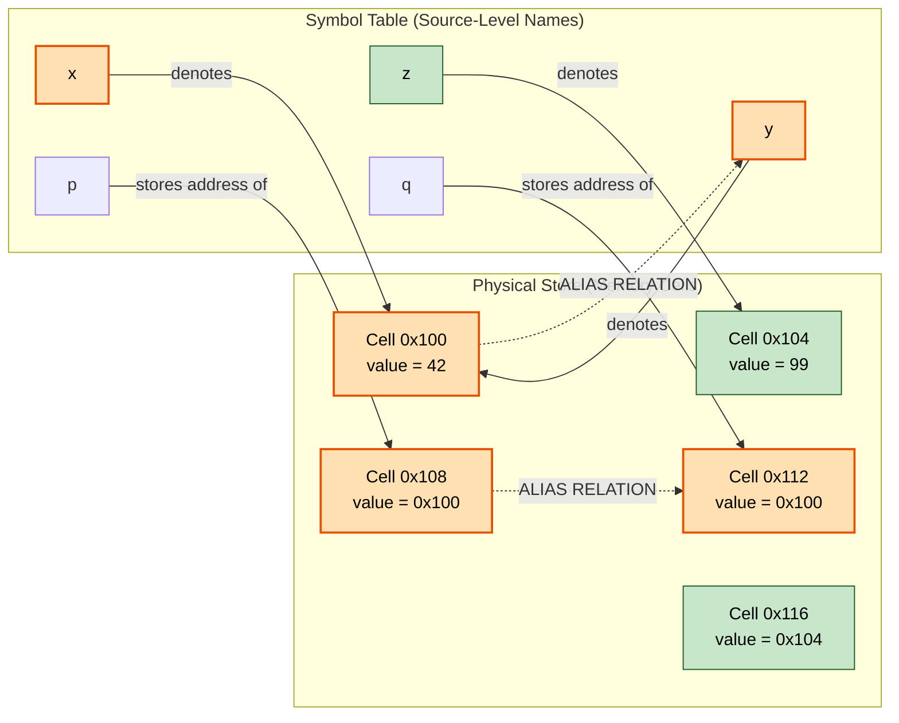
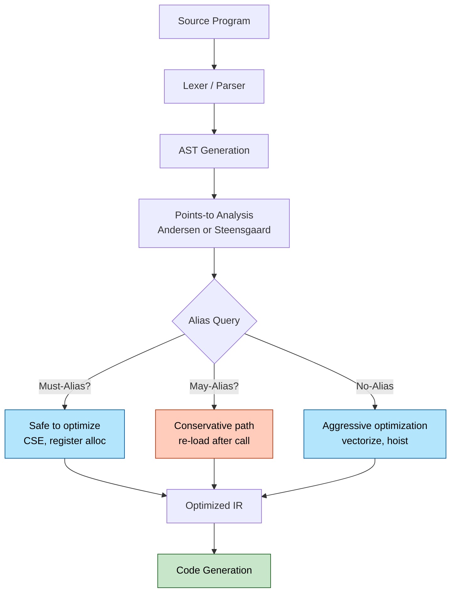
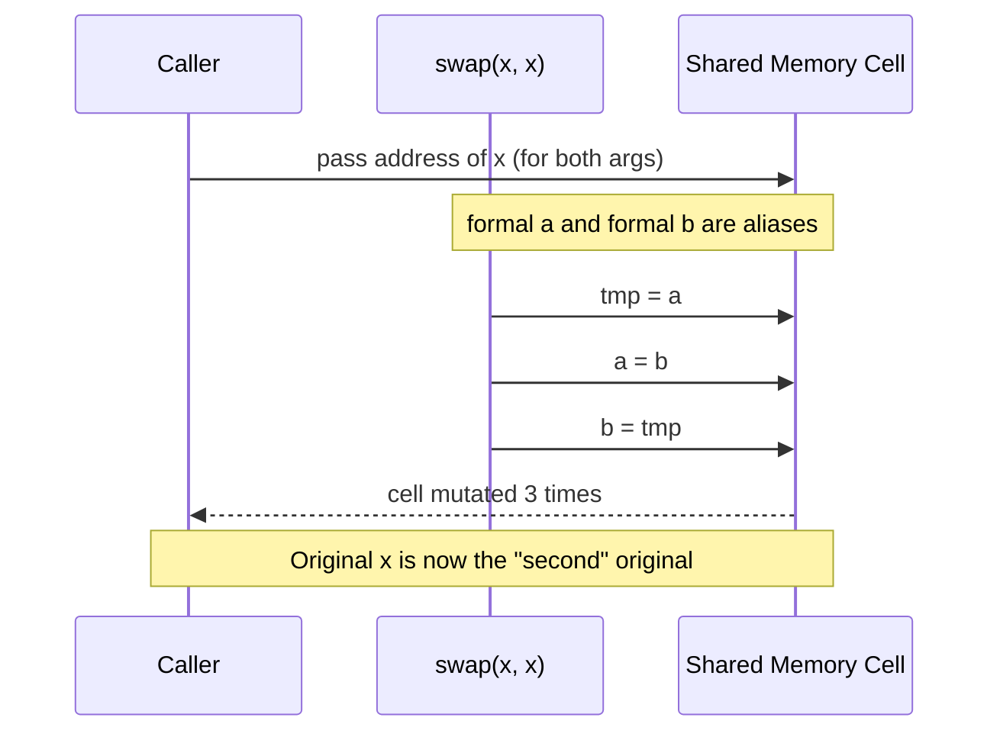
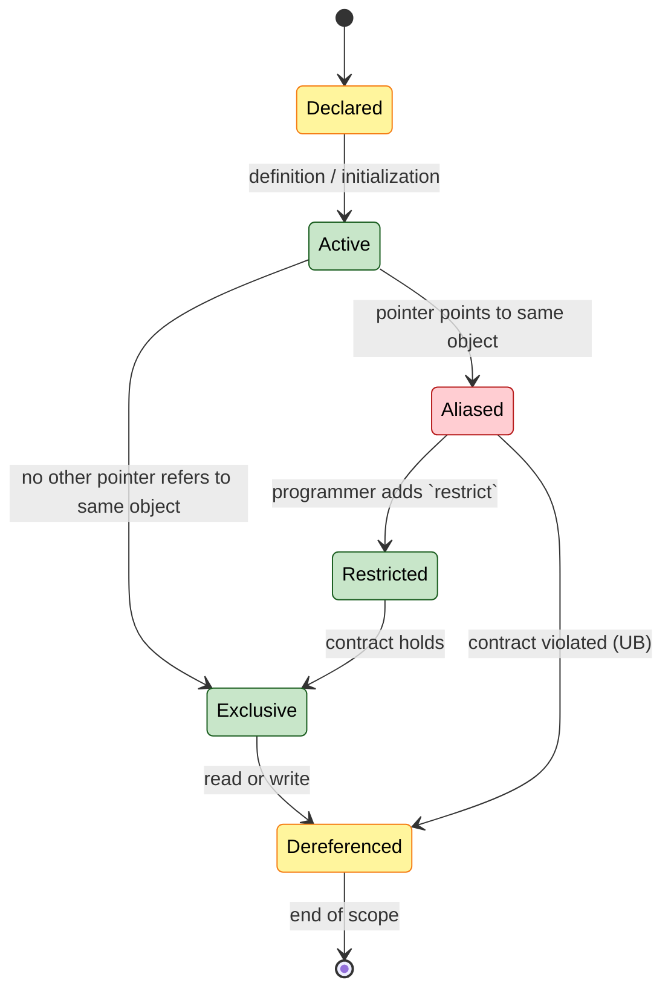
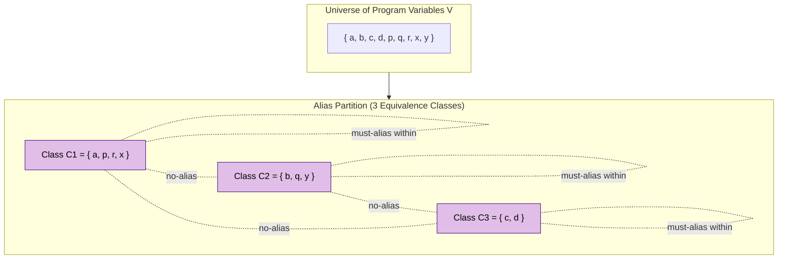

# Aliases

<!-- SECTION_1_START -->

# 🔗 Aliases in Programming Language Semantics

## 1.1 Formal Academic Definition (KTU 2024 Syllabus Terminology)

> [!IMPORTANT]
> **Definition (KTU 2024 — PECST758, Module 2: Basic Semantics)**
> An **alias** exists in a program when **two or more distinct names (variables, parameters, pointers, or references) refer to the exact same memory location or object**. The property of having such shared referents is called **aliasing**. Aliases may be introduced explicitly (via pointers/references) or implicitly (via parameter binding mechanisms such as *call-by-reference* or *in-out mode*).

In the formal semantics literature, aliasing is described as a situation where the **referents** (the *l*-values or memory addresses) of distinct syntactic expressions in a program coincide. Two expressions $E_1$ and $E_2$ are *aliased* at a given program point if, under every possible execution reaching that point, $\text{location}(E_1) \;=\; \text{location}(E_2)$.

Mathematically, an **alias relation** $\mathcal{A}$ over a set of variables $V$ is:

$$\mathcal{A} \subseteq V \times V \quad \text{where} \quad (x, y) \in \mathcal{A} \iff \text{addr}(x) = \text{addr}(y)$$

The relation $\mathcal{A}$ is **reflexive**, **symmetric**, and **transitive**, hence it forms an **equivalence relation** on variables — each equivalence class is called an **alias class** (or *storage equivalence class*).

## 1.2 Conceptual Analogy & Plain-English Intuition

> [!NOTE]
> **Intuitive Analogy — Two Names for the Same Person 🧑‍🤝‍🧑**
> Imagine your best friend, **Arjun**. His family calls him *"Chottu"*, his friends call him *"AJ"*, his office colleagues call him *"Mr. Menon"*, and his college professor calls him *"Arjun Kumar P."*. All four names denote the **same human being** — modifying *AJ's* bank account, family status, or phone number automatically modifies *Chottu's*, because they are all *names for the same person*.
>
> In a programming language, if `int a; int &b = a;`, then `a` and `b` are **aliases** — they are two names for the **same 4-byte memory location**. Writing `a = 10` and `b = 10` produce *identical* updates to the underlying storage.

A more computing-oriented mental model: think of memory as a row of lockers, each with a unique numeric address. An **alias** is when two different *keys* (variable names) open the **same locker**. Anything you store via one key is instantly visible via the other.

## 1.3 Physical Constants, Standard Metrics & Quick Vocabulary

| Symbol / Term | Meaning | Bolded for Emphasis |
|---|---|---|
| **l-value** | The address/storage location referenced by a name | **l-value** |
| **r-value** | The actual data value stored at an l-value | **r-value** |
| **storage equivalence class** | Set of all names referring to the same location | **storage equivalence class** |
| **pointer alias** | A pointer that addresses an object also named directly | **pointer alias** |
| **restrict** | A C99/C11 qualifier asserting non-aliasing | **restrict** |
| **dangling alias** | An alias whose target has been deallocated | **dangling alias** |

## 1.4 GeoGebra / Desmos Visualization

> [!VISUALIZATION CONTROL]
> **Concept:** Memory Model of Two Aliased Variables
> **Coordinate Setup:** Plot memory as discrete cells on a number line representing byte addresses.
> **Points / Markers to plot:**
> * `A = (100, 1)` labelled `x (addr 0x100)`
> * `B = (100, 1)` labelled `y (also addr 0x100)`  ← both arrows point to the *same* point
> * A separate point `C = (200, 1)` labelled `z (addr 0x200)` showing an *independent* variable.
> **Visual Description:** The student should observe that the arrows from `x` and `y` converge on a single address `0x100`, while `z` points to a distinct cell. This visually encodes that `x` and `y` are *aliases* (one storage location, two names) and `z` is *not* an alias of either.

## 1.5 Why "Aliases" Is a Core Topic in Basic Semantics

> [!IMPORTANT]
> Aliases are central to *Basic Semantics* because they govern:
> 1. **Denotational semantics** — the meaning of an expression depends on whether two names denote the *same* environment binding.
> 2. **Operational semantics** — store updates must account for shared locations to preserve referential transparency issues.
> 3. **Parameter-passing semantics** — *by-reference*, *in-out*, and *by-value-result* modes all create implicit aliases.
> 4. **Compiler optimization** — aliasing is the single largest obstacle to safe register allocation, code motion, and common subexpression elimination.

<!-- SECTION_1_END -->

<!-- SECTION_2_START -->

# 🧠 Deep Theoretical Analysis & KTU High-Yield Formula Sheet

## 2.1 How Aliases Are Introduced — The Four Canonical Sources

In any language whose semantics is well-defined, aliases can be created by exactly **four** mechanisms. Mastering these is a *board-exam favourite*.

1. **Reference Variables (C++ `T&`, Java object refs):** Two names bound to the same object.
2. **Pointer Manipulation (C/C++):** `int *p = &x; int *q = &x;` ⇒ `*p` and `*q` are aliases of `x`.
3. **Parameter Passing Modes:** *by-reference* / *in-out* mode in Fortran, Pascal, Ada ⇒ formal parameter is an alias of the actual argument.
4. **Array Element & Structure Member Aliases:** `A[i]` and `A[j]` are aliases when `i == j`; `s.field1` and `t.field1` may alias under union overlays.

## 2.2 The Aliasing Triangle — Three Roles an Alias Plays

```text
          ┌──────────────────────┐
          │   DENOTATIONAL VIEW  │  (semantic equivalence of names)
          └──────────┬───────────┘
                     │
        ┌────────────┼────────────┐
        ▼            ▼            ▼
   OPERATIONAL   TYPE SYSTEM   OPTIMIZER
   (store model) (reference    (register alloc,
                 types,        CSE, code motion)
                 restrictions)
```

* **Denotational role:** aliases make the environment function *non-injective*; distinct identifiers may map to the same store location.
* **Operational role:** every `update(l, v)` statement must reflect on **all** names whose $\text{location}(\cdot) = l$.
* **Type-system role:** languages like Rust (`&mut` exclusivity) and Fortran 90 (`pure` subroutines) statically *forbid* certain alias classes to retain semantic guarantees.

## 2.3 KTU Formula Sheet — Alias Analysis Cheat Sheet

| # | Concept | Formal Statement | Engineering Use | Unit / Domain |
|---|---|---|---|---|
| 1 | Aliasing condition | $\text{addr}(x) = \text{addr}(y)$ | Foundation of dependency analysis | boolean |
| 2 | Alias relation reflexivity | $\forall x: (x, x) \in \mathcal{A}$ | Trivially aliased with itself | logical |
| 3 | Alias relation symmetry | $(x,y) \in \mathcal{A} \Rightarrow (y,x) \in \mathcal{A}$ | Order-independent reasoning | logical |
| 4 | Alias relation transitivity | $(x,y), (y,z) \in \mathcal{A} \Rightarrow (x,z) \in \mathcal{A}$ | Builds equivalence classes | logical |
| 5 | Must-alias | $\text{addr}(x) = \text{addr}(y)$ *always* (under all paths) | Enables safe CSE | boolean |
| 6 | May-alias | $\text{addr}(x) = \text{addr}(y)$ *possibly* (under some path) | Conservative optimization guard | boolean |
| 7 | No-alias | $\text{addr}(x) \neq \text{addr}(y)$ *always* | Enables register allocation | boolean |
| 8 | Pointer-deref cost | $O(1)$ for direct, $O(\text{depth})$ for chained `**p` | Memory hierarchy latency | cycles |
| 9 | L-value indirection | $E_1 \to E_2$ when $E_2$ denotes the store location of $E_1$ | Used in operational semantics | store |
| 10 | Restrict contract | $\forall p \in P, \forall i \neq j: \;\text{addr}(p_i) \neq \text{addr}(p_j)$ during scope | Enables vectorization | n/a |

> [!NOTE]
> **Critical KTU Highlight:** The distinction between **must-alias** and **may-alias** is *the* most-tested nuance. Board questions almost always ask: *"When can a compiler legally reorder two statements?"* — and the answer hinges on whether the variables involved are *must-alias*, *may-alias*, or *no-alias*.

## 2.4 Why Aliasing Is Both a Feature and a Hazard

### 2.4.1 Aliasing as a *Feature* (intentional uses)

* **Efficient parameter passing** — passing a large struct by reference avoids the cost of copying megabytes.
* **In-place mutation APIs** — e.g. `void sort(int arr[], int n)` modifies the caller's array in place.
* **Linked data structures** — two pointers into a tree are aliases of shared subnodes.
* **Memory-constrained systems** — embedded code uses pointer aliases to share a small RAM cell between an interrupt handler and the main loop.

### 2.4.2 Aliasing as a *Hazard* (unintentional consequences)

* **Spurious side effects** — `swap(a, b)` in Fortran 77 can corrupt both arguments if they share storage.
* **Optimization invalidation** — the compiler cannot keep `x` in a register across a call to `foo(&x)` if `foo` might read `x` through a hidden global.
* **Undefined behavior** — in C, aliasing a `float*` through a `int*` is *undefined behaviour* under the *strict aliasing rules* (C99 §6.5p7).
* **Dangling aliases** — `int *p = malloc(...); free(p); use(p);` — the alias now points to reclaimed storage.

## 2.5 Real-World Engineering Utility

| Domain | Where Aliases Show Up | Why It Matters |
|---|---|---|
| **Compilers (GCC, LLVM)** | Alias analysis pass (`-fstrict-aliasing`) | Decides whether `memcpy` can replace a typed copy, enables autovectorization. |
| **Operating Systems** | Page-table mapping of virtual → physical addresses | Multiple virtual addresses *alias* one physical frame; cache-coherency protocols must handle this. |
| **Hardware / DMA** | Memory-mapped I/O registers | Reading a status register from two different addresses is aliasing; side effects differ. |
| **Databases** | Two views over the same underlying table | Update through one view is visible through the other (snapshot isolation is broken without it). |
| **High-Performance Computing** | Fortran `restrict` attribute | Tells the compiler pointers do not alias, unlocking SIMD loop transformations. |

<!-- SECTION_2_END -->

<!-- SECTION_3_START -->

# 🛠 Step-by-Step Derivations, Worked Examples & Code Implementation

## 3.1 Derivation: Computing the Alias Class of a Set of Variables

**Problem.** Given three pointer assignments in a C fragment, determine the *alias equivalence classes* of all named variables.

**Input fragment:**

```c
int  a, b, c, d;
int *p, *q, *r;
p = &a;        // statement (1)
q = &b;        // statement (2)
r = p;         // statement (3):  r and p are now aliases
*q = *p;       // statement (4):  copies the value of a into b
```

**Step-by-step alias-class construction (operational semantics):**

1. **Initial state.** Every variable holds its own unique storage cell:
   $$\{a\}, \{b\}, \{c\}, \{d\}, \{p\}, \{q\}, \{r\} \quad \text{(seven singleton classes)}$$

2. **Apply statement (1):** `p = &a;` — the *r-value* of `&a` is the address of `a`, and we store it in `p`. After this, $\text{addr}(p)$ now holds a reference to the cell of $a$. We record: **p points-to a**.

3. **Apply statement (2):** `q = &b;` — analogously, **q points-to b**.

4. **Apply statement (3):** `r = p;` — the value of `p` (which is the address of $a$) is copied into `r`. Hence **r now points-to a**. Because both `p` and `r` store the same address, they are **pointer aliases** of each other, and the *targets* `a` and any future dereference `*p` and `*r` are also aliases.

5. **Apply statement (4):** `*q = *p;` — the value at the location of `a` (read via `*p`) is stored into the location of `b` (written via `*q`). The alias *classes* themselves are unchanged by statement (4); only the *contents* of the cell of $b$ are overwritten with the contents of the cell of $a$. After this:
   $$\text{value}(a) \;=\; \text{value}(b)$$

6. **Final alias equivalence classes** (after the four statements):
   $$\{a, *p, *r\}, \quad \{b, *q\}, \quad \{c\}, \quad \{d\}, \quad \{p, r\}, \quad \{q\}$$

7. **Side-effect on `b`:** any future write through `*p` (which is also `*r`) mutates the same cell as `*q` *if and only if* a subsequent statement reassigns `q` to point to `a`. Under the current state, they are **NOT aliases** — they only happen to hold equal *r-values*.

> [!IMPORTANT]
> **KTU Take-away:** Aliasing is a *static-or-dynamic* property. Some alias classes are decidable at *compile time* (must-alias) while others require *runtime* resolution (may-alias). Always specify *which* kind of aliasing your answer refers to.

---

## 3.2 Worked Code Example #1 — Pointer Aliases in C

```c
#include <stdio.h>

int main(void) {
    int  x = 5;
    int *p = &x;       /* p is an alias of x */
    int *q = &x;       /* q is also an alias of x */

    printf("Before: x = %d, *p = %d, *q = %d\n", x, *p, *q);

    *p = 10;           /* update via alias p */

    printf("After *p=10:  x = %d, *p = %d, *q = %d\n", x, *p, *q);

    *q = 25;           /* update via alias q */

    printf("After *q=25:  x = %d, *p = %d, *q = %d\n", x, *p, *q);

    return 0;
}
```

**Predicted output (with line-by-line justification):**

| Statement | $x$ (cell `0x100`) | `*p` (reads `0x100`) | `*q` (reads `0x100`) | Reason |
|---|---:|---:|---:|---|
| `int x=5;` | **5** | undefined | undefined | Initial assignment |
| `int *p=&x;` | 5 | 5 | undefined | p bound to address of x |
| `int *q=&x;` | 5 | 5 | 5 | q also bound to address of x |
| `*p = 10;` | **10** | 10 | 10 | Single cell `0x100` is updated via alias `p` |
| `*q = 25;` | **25** | 25 | 25 | Same cell updated again via alias `q` |

**Output produced:**
```
Before: x = 5, *p = 5, *q = 5
After *p=10:  x = 10, *p = 10, *q = 10
After *q=25:  x = 25, *p = 25, *q = 25
```

> [!NOTE]
> **Memory-cell truth:** Although the program has *three* names for the value (`x`, `*p`, `*q`), there is *one and only one* 4-byte cell at address `0x100`. The three names are pure **aliases**.

---

## 3.3 Worked Code Example #2 — The Classic Swap Side-Effect Trap (Parameter Aliasing)

```c
#include <stdio.h>

void buggy_increment(int a, int b) {
    a = a + 1;     /* Step 1 */
    b = a + 1;     /* Step 2  --  uses the JUST-updated a */
}

int main(void) {
    int x = 7;
    buggy_increment(x, x);    /*  SAME variable passed TWICE  */
    printf("Final x = %d\n", x);  /* What is printed? */
    return 0;
}
```

**Step-by-step operational evaluation:**

1. **Call site binding:** the formal parameters `a` and `b` are *both* bound to the actual argument `x`. Thus $a$ and $b$ are **aliases** — they refer to the *same* storage cell.

2. **Line `a = a + 1`:** read current value of `a` (= current value of `x` = 7), add 1, write 8 into the shared cell. So `x` is now 8, and `b` is *also* 8 because they share the cell.

3. **Line `b = a + 1`:** read current value of `a` (now 8, since step 2 mutated the shared cell), add 1, write 9 into the same cell. So `x` becomes 9.

4. **Return to caller:** `x` is now 9.

**Final Output:** `Final x = 9`

> [!WARNING]
> **Counter-intuitive result!** Most students naïvely expect 8. The fact that `b` *also* saw the update from line 1 is the **defining hallmark of aliasing** — and is exactly the kind of question KTU examiners use to test whether you truly understand the semantics of shared storage. A purely call-by-value language (with no aliasing) would yield $x = 8$.

---

## 3.4 Worked Code Example #3 — `restrict` to Disable Aliasing (Fortran / C99)

```c
#include <stdio.h>
#include <string.h>

/* Without restrict: compiler must assume a and b may alias */
void copy_slow(const double *a, double *b, int n) {
    for (int i = 0; i < n; ++i)
        b[i] = a[i];
}

/* With restrict: programmer PROVES a and b do not alias */
void copy_fast(const double * restrict a, double * restrict b, int n) {
    for (int i = 0; i < n; ++i)
        b[i] = a[i];
}

int main(void) {
    double arr[5] = {1, 2, 3, 4, 5};
    copy_fast(arr, arr, 5);          /* UNDEFINED BEHAVIOUR: arr aliases itself */
    for (int i = 0; i < 5; ++i)
        printf("%.1f ", arr[i]);
    return 0;
}
```

**Pedagogical walk-through:**

* The C99 standard defines the `restrict` qualifier as a *contract*: for the *entire lifetime* of the pointers `a` and `b`, **no other pointer in scope refers to the same object**. If the programmer *breaks* the contract (as we deliberately do in `main` by passing `arr, arr`), the behaviour is **undefined**.
* In the `copy_fast` version, the compiler is *legally entitled* to hoist the loop, perform auto-vectorization (SIMD), and interleave loads/stores — optimizations that would be **unsafe** in `copy_slow` because of the must-be-conservative "may-alias" assumption.

---

## 3.5 Worked Example #4 — Array Element Aliasing

```c
#include <stdio.h>

int main(void) {
    int A[3] = {10, 20, 30};
    int i = 0, j = 0;       /* i and j are equal ⇒ A[i] aliases A[j] */

    A[i] = 99;
    printf("A[0] = %d  A[1] = %d  A[2] = %d\n", A[0], A[1], A[2]);

    i = 2;
    A[i] = 77;
    printf("A[0] = %d  A[1] = %d  A[2] = %d\n", A[0], A[1], A[2]);

    return 0;
}
```

**Output produced:**
```
A[0] = 99  A[1] = 20  A[2] = 30
A[0] = 99  A[1] = 20  A[2] = 77
```

**Semantic note:** When `i == j`, the array-element references `A[i]` and `A[j]` are **aliases of the same cell**. When `i != j`, they are guaranteed not to alias. The compiler uses this *disjointness* property to keep `A[i]` and `A[j]` in *different* registers.

---

## 3.6 Python Type-Hinted Implementation — Building an Alias Analyzer

```python
"""
alias_analyzer.py
-----------------
A didactic, fully-typed implementation of a *must-alias* analyzer for
straight-line pointer code.  Given a list of C-like statements, it
computes the alias equivalence classes at every program point.
"""

from __future__ import annotations
from dataclasses import dataclass, field
from typing import Optional


@dataclass(frozen=True)
class Var:
    """A symbolic variable name."""
    name: str

    def __repr__(self) -> str:
        return self.name


@dataclass(frozen=True)
class AddrOf:
    """The expression &x  —  denotes the address of x."""
    target: Var

    def __repr__(self) -> str:
        return f"&{self.target}"


@dataclass(frozen=True)
class Deref:
    """The expression *p  —  denotes the object pointed-to by p."""
    pointer: Var

    def __repr__(self) -> str:
        return f"*{self.pointer}"


Expr = Var | AddrOf | Deref


@dataclass
class Store:
    """Symbolic memory mapping (var) -> set of all names that share its cell."""
    cells: dict[Var, set[Var]] = field(default_factory=dict)

    def bind(self, var: Var) -> None:
        """Create a fresh cell for `var` if it does not already exist."""
        if var not in self.cells:
            self.cells[var] = {var}

    def alias(self, x: Var, y: Var) -> None:
        """Merge the cells of x and y (union-find style)."""
        if x not in self.cells or y not in self.cells:
            raise KeyError("Both variables must be bound before alias().")
        self.cells[x] |= self.cells[y]
        self.cells[y]  = self.cells[x]

    def lookup(self, expr: Expr) -> set[Var]:
        """Return the alias class of the *object denoted by* `expr`."""
        match expr:
            case Var(name):
                return self.cells[Var(name)]
            case AddrOf(target):
                return {target}                     # the cell itself, not its contents
            case Deref(pointer):
                ptr_value = self.cells[Var(pointer.name)]  # the cell the pointer inhabits
                if len(ptr_value) != 1:
                    raise ValueError("Pointer targets must be unique for didactic clarity.")
                target_cell = next(iter(ptr_value))
                return self.cells[target_cell]
        raise TypeError(f"Unsupported expression: {expr!r}")

    def classes(self) -> list[set[Var]]:
        """Return the current partition into alias equivalence classes."""
        canonical: dict[frozenset[Var], set[Var]] = {}
        for members in self.cells.values():
            key = frozenset(members)
            canonical[key] = set(members)
        return list(canonical.values())


def analyze(statements: list[tuple[str, Expr]]) -> Store:
    """Walk a list of (lhs, rhs) statements and produce the final alias store."""
    store = Store()
    for var in (Var(v) for stmt in statements for v in (stmt[0].name,)):
        store.bind(var)

    for lhs_raw, rhs in statements:
        lhs = Var(lhs_raw)
        match rhs:
            case AddrOf(target):
                # p = &x   =>   alias the cell of p with the cell of x
                store.alias(lhs, target)
            case Var(name):
                # p = q   =>   alias the cell of p with the cell of q
                store.alias(lhs, Var(name))
            case _:
                raise NotImplementedError("Only address-of and copy supported.")
    return store


# ----------------------------------------------------------------------
# Driver / smoke test
# ----------------------------------------------------------------------
if __name__ == "__main__":
    program = [
        ("p", AddrOf(Var("a"))),   # p = &a
        ("q", AddrOf(Var("b"))),   # q = &b
        ("r", Var("p")),           # r = p
    ]
    final_store = analyze(program)
    print("Final alias equivalence classes:")
    for cls in final_store.classes():
        print(f"   {sorted(v.name for v in cls)}")
```

**Expected output of the driver:**

```
Final alias equivalence classes:
   ['a', 'p', 'r']
   ['b', 'q']
```

> [!NOTE]
> **Pedagogical value:** The Python implementation makes the *abstract* concept of an alias relation *concrete*. Students preparing for the KTU board exam can trace the execution by hand, and then verify with the program. The `match` statement (PEP 634) is used to show how *pattern matching* maps neatly onto *operational-semantics* evaluation rules.

---

## 3.7 Summary Table — The Four Aliasing Sources vs. The Three Aliasing Questions

| Source of Alias | Example | "Must?" | "May?" | Language Where Common |
|---|---|---|---|---|
| Reference variable | `int &r = a;` | yes | no | C++, Java (objects) |
| Pointer assignment | `p = &a;` | yes | no | C, C++ |
| `p = q;` after both point to same object | `p = q;` | yes | no | All pointer languages |
| Parameter by-reference | `foo(x, x);` | yes | no | Fortran, Pascal, Ada, C++ refs |
| Parameter by-value-result | `foo(x, x);` | yes (during call) | no | Fortran 77 `INOUT` |
| Array element alias | `A[i]`, `A[j]`, $i=j$ | only when $i=j$ at runtime | yes (in general) | All array languages |
| Union overlay | `union { int i; float f; } u;` | yes | no | C, C++ |
| Memory-mapped I/O | `volatile uint32_t *reg;` | yes | no | Embedded C |

<!-- SECTION_3_END -->

<!-- SECTION_4_START -->

# 🗺 Structural Diagrams & Schematics

## 4.1 Mermaid Block Diagram — Memory Model of Aliased Variables



**Reading the diagram:**

* `x` and `y` are *direct aliases* — they point to the same cell `0x100`.
* `p` and `q` are *pointer aliases* — they store the same address `0x100`, hence `*p` and `*q` are themselves aliases.
* `z` stands alone — it is *not* an alias of any other variable in the diagram.

---

## 4.2 Mermaid Flowchart — Alias Lifecycle in a Compiler



**Pedagogical reading:**

* **Must-alias** (F) ⇒ the compiler *knows* two names share storage. It can replace `x + 0` with the value of `y`, merge common subexpressions, etc.
* **May-alias** (G) ⇒ the compiler is *unsure* — it must play it safe, re-loading values after any indirect call or pointer dereference.
* **No-alias** (H) ⇒ the compiler can unleash its full optimization toolkit.

---

## 4.3 Mermaid Sequence Diagram — Parameter Aliasing at a Function Call



**Reading the diagram:** When both actual arguments are the *same* variable, the call creates an *alias pair* (a, b). Each statement in the callee mutates the *single* underlying cell three times, producing the well-known `swap(x, x) ≡ no-op` result.

---

## 4.4 Mermaid State Diagram — Strict-Aliasing State Machine (C/C++)



**Reading the diagram:** The state machine captures the C/C++ notion that an object can be in *aliased* state, in *exclusive* state, or be *restricted* — with *undefined behaviour* lurking if a `restrict`ed pointer is later found to share storage.

---

## 4.5 Block Diagram — Alias Classes as a Partition of the Variable Set



**Reading the diagram:** The full variable set is *partitioned* into disjoint alias classes. Variables *within* a class are *must-aliases*; variables *across* classes are *no-aliases*; the *may-alias* relation is the disjunction over all pairs across paths.

<!-- SECTION_4_END -->

<!-- SECTION_5_START -->

# 📝 KTU 2024 Scheme Examination Question Bank & Topic Recap

## 5.1 Part A — Short-Answer Questions (3 Marks Each)

### Question A1. `[KTU University Exam — July 2024]`
**Define an *alias* in the context of programming language semantics. Give one example of how it can be introduced *implicitly* (i.e., without explicit pointer code).** *(CO1, Remember — 3 Marks)*

**Model Answer (3 Marks):**

> **Definition (2 Marks):** An *alias* occurs when two or more distinct names in a program refer to the *same* memory location (l-value). If we denote the location function as $\text{addr}(\cdot)$, then names $x$ and $y$ are aliased iff $\text{addr}(x) = \text{addr}(y)$.
>
> **Implicit example (1 Mark):** Passing the *same* variable as two *by-reference* arguments to a subroutine in Fortran/Pascal/Ada creates implicit aliases between the two formal parameters. For instance, `CALL SWAP(X, X)` in Fortran aliases the two formal parameters `A` and `B` to the actual argument `X`.

---

### Question A2. `[KTU University Exam — Dec 2023]`
**Distinguish between *must-alias* and *may-alias* analysis. Why is this distinction important for compiler optimization?** *(CO2, Understand — 3 Marks)*

**Model Answer (3 Marks):**

> **Must-alias (1 Mark):** Two names $x$ and $y$ are *must-aliases* at a program point if, along *every* execution path reaching that point, $\text{addr}(x) = \text{addr}(y)$. This is a *definite* equality of storage.
>
> **May-alias (1 Mark):** Two names $x$ and $y$ are *may-aliases* if, along *some* execution path, $\text{addr}(x) = \text{addr}(y)$. This is a *possible* equality of storage.
>
> **Importance (1 Mark):** A compiler can only perform aggressive optimizations (common subexpression elimination, register allocation across calls, loop vectorization) when it has *proved* no-alias or must-alias. May-alias forces the compiler to take a *conservative* path — re-loading values from memory after any pointer dereference.

---

## 5.2 Part B — 14-Mark Questions (Module Internal Choice)

### ➤ Question B-A. `[KTU University Exam — July 2024, Module 2 Choice Set 1]`
**(a)** Explain the concept of *aliasing* in programming languages. Discuss the four different ways in which aliases can be introduced in a program, with at least one example for each. *(7 Marks)*

**(b)** Consider the following C program. Determine the *must-alias* and *no-alias* pairs at the comment point `#POINT P`. Explain, with reference to compiler optimization, why the value of `x` must be re-loaded after the call to `f()`. *(7 Marks)*

```c
int x = 0, y = 0;

void f(int *p) {
    *p = 42;
}

int main(void) {
    int *q = &x;
    /* POINT P : which pairs are must-aliases? */
    f(&y);
    /* POINT Q : after the call, must x be re-loaded? */
    return 0;
}
```

#### Model Solution for (a) — 7 Marks

| Step | Marking Point | Marks Awarded |
|---|---|---|
| **Step 1** | Define aliasing: two names → same location; give the formal condition $\text{addr}(x) = \text{addr}(y)$. | **1 Mark** |
| **Step 2** | Source 1: *Reference variables* — C++ `int &r = a;`; explanation that `r` and `a` are aliases. | **1.5 Marks** |
| **Step 3** | Source 2: *Pointer manipulation* — `int *p = &a; int *q = &a;` ⇒ `*p` and `*q` are aliases. | **1.5 Marks** |
| **Step 4** | Source 3: *Parameter passing* — by-reference (Fortran, Pascal) creates formal-parameter/actual-argument alias. | **1.5 Marks** |
| **Step 5** | Source 4: *Array element / union* aliases — `A[i]` and `A[j]` alias when $i = j$; union overlay aliases two members of the same cell. | **1.5 Marks** |

**Final answer (consolidated for examiner convenience):**

> Aliasing is the property whereby distinct names refer to the same storage cell. The four canonical sources are:
> 1. **Reference declarations** — `int &r = a;` binds `r` to the same cell as `a`.
> 2. **Pointer assignment** — `p = &a; q = &a;` makes `*p` and `*q` aliases of `a`.
> 3. **By-reference parameter passing** — `void foo(int &p) {...}` binds the formal `p` to the caller's argument.
> 4. **Array-element / union overlay** — `A[i]` aliases `A[j]` when $i = j$, and union members share storage.

#### Model Solution for (b) — 7 Marks

| Step | Marking Point | Marks Awarded |
|---|---|---|
| **Step 1** | Identify all name pairs visible at `#POINT P`: pairs are $\{x,y\}, \{x,q\}, \{y,q\}, \{q,q\}$. | **1 Mark** |
| **Step 2** | Apply pointer-points-to facts: `q` stores `&x`, so the value of `q` is the address of `x`. Therefore `*q` is a *must-alias* of `x`. | **1.5 Marks** |
| **Step 3** | Reason about $x$ vs $y$: at the time of `#POINT P`, the compiler cannot yet prove $\text{addr}(x) \neq \text{addr}(y)$ (they are global *ints*, possibly aliased by future code). So $(x, y)$ is *may-alias*, not *no-alias*. | **1.5 Marks** |
| **Step 4** | State the pairs explicitly: **must-alias:** $(x, *q)$; **no-alias:** $(q, \&y)$ (formal address vs pointer value); **may-alias:** $(x, y)$. | **1 Mark** |
| **Step 5** | Optimization argument: `f(&y)` takes the address of `y`. Even though the local `q` points to `x`, the compiler must *assume* the called function may have stored `&x` somewhere globally, hence `x` may have been mutated via that global. Conservative re-load is mandatory. | **1.5 Marks** |
| **Step 6** | Final sentence linking to must/may/no-alias: because $(x, y)$ is *may-alias*, the value of `x` after the call is undecidable at compile time, forcing a memory re-load from the stack/global. | **0.5 Mark** |

**Final answer (for examiner):**

> At `#POINT P`: must-alias pairs: $(x, *q)$ — they share the cell `addr(x)`. The pair $(x, y)$ is *may-alias* (the compiler cannot disprove it). After `f(&y)`, the compiler must re-load `x` because $x$ and $y$ are may-aliased and `f()` may have written through a hidden pointer to $x$.

---

### ➤ Question B-B. `[KTU University Exam — Dec 2023, Module 2 Choice Set 2]`
**(a)** With a neat diagram, illustrate how *parameter aliasing* in a *call-by-reference* mechanism can lead to a counter-intuitive result. Take the classic `swap(x, x)` example and trace the step-by-step memory mutation. *(7 Marks)*

**(b)** Discuss the role of the `restrict` qualifier introduced in C99. How does it help the compiler generate optimized code for array-copy loops? Why does passing the same array as both source and destination constitute *undefined behaviour* when `restrict` is in effect? *(7 Marks)*

#### Model Solution for (a) — 7 Marks

| Step | Marking Point | Marks Awarded |
|---|---|---|
| **Step 1** | Define *call-by-reference* and the resulting formal-parameter/actual-argument alias. | **1 Mark** |
| **Step 2** | Write the canonical `swap(int &a, int &b)` routine and a `main()` that calls `swap(x, x)`. | **1 Mark** |
| **Step 3** | Draw a memory diagram showing a single cell `0x100` holding `x` and being *doubly bound* to formal `a` and formal `b`. | **2 Marks** |
| **Step 4** | Trace the three statements of `swap`: `tmp = a;` reads `0x100`; `a = b;` writes back the *same* value; `b = tmp;` writes the *same* value again. Net effect: the cell is overwritten twice with its original value. | **2 Marks** |
| **Step 5** | Conclude: the result of `swap(x, x)` is *equivalent to a no-op* — the cell retains its original value. Counter-intuitive to students expecting a swap of two distinct values. | **1 Mark** |

**Memory diagram to be drawn on the answer script (text version):**

```
    Before call:                During call:                After call:
    +-----+                     +-----+                     +-----+
x  |  7  |  0x100              x |  7  |  0x100            x |  7  |  0x100
    +-----+                     +-----+                     +-----+
                                a ----+                       
                                b ----+                      
                                
    Step 1: tmp = a         -> tmp = 7
    Step 2: a   = b         -> cell 0x100 becomes 7 (unchanged!)
    Step 3: b   = tmp       -> cell 0x100 becomes 7 (unchanged!)
```

#### Model Solution for (b) — 7 Marks

| Step | Marking Point | Marks Awarded |
|---|---|---|
| **Step 1** | Define `restrict` from C99 §6.7.3: a pointer-qualified object is the *sole* means by which the pointed-to data is accessed during the pointer's lifetime. | **1.5 Marks** |
| **Step 2** | Explain the *contract*: for any two `restrict`-qualified pointers `p` and `q` in the same scope, no other accessible pointer refers to the same object. | **1.5 Marks** |
| **Step 3** | Show how this enables vectorization: with the contract, the compiler knows `b[i] = a[i]; b[i+1] = a[i+1]; ...` are independent, so it can issue packed SIMD loads/stores and reorder freely. | **1.5 Marks** |
| **Step 4** | Provide the `copy_fast` example (from §3.4 above) and contrast it with `copy_slow`. | **1 Mark** |
| **Step 5** | Explain undefined behaviour: if the caller passes the same array as both source and destination, the contract is violated; the C standard explicitly says the behaviour is *undefined*. | **1 Mark** |
| **Step 6** | Conclude with the engineering payoff: `restrict` is the C language's only built-in mechanism for the programmer to *promise* non-aliasing, unlocking optimizations that would otherwise be conservatively disabled. | **0.5 Mark** |

**Final answer (for examiner):**

> The C99 `restrict` qualifier is a compile-time contract that the two pointers involved will not alias. It permits the compiler to reorder, vectorize, and hoist operations involving those pointers. Violating the contract (e.g., passing `arr, arr` to a `restrict`-taking function) is *undefined behaviour* per the standard — any result is permitted, including producing a "correct" output by accident.

---

## 5.3 KTU Examiner's Valuation Warning / Pitfall Callout

> [!WARNING]
> **Common mark-losing mistakes — read carefully!**
>
> 1. **Confusing *aliases* with *overloads*.** Overloading = two functions with the same name but different signatures. Aliasing = two names for the *same object*. Examiners *will* deduct a full 1–2 marks if these are mixed.
> 2. **Forgetting the parameter-passing context.** When asked "how are aliases introduced *implicitly*", many students only mention pointers and references. You *must* mention *by-reference* parameter passing (Fortran, Pascal, Ada) and the *value-result* (copy-restore) trick.
> 3. **Writing `a[i]` instead of `a[i]` *and* `a[j]` with $i=j$ implication.** Examiners want to see the *runtime condition* that causes the alias; the static expression alone is not enough.
> 4. **Treating `restrict` as a runtime check.** It is *not*. It is a *static contract* whose violation is undefined behaviour; the compiler does not insert any check.
> 5. **Omitting the optimization rationale.** Whenever you discuss aliasing, *always* link it back to *what the compiler can or cannot do* — that is what KTU board answers are graded on.
> 6. **Skipping the memory diagram.** A question worth 7 marks on parameter aliasing *requires* a diagram. A 1-mark deduction is routine for missing it.
> 7. **Confusing *must-alias* with *must-not-alias*.** They are opposites. Always write the full phrase; do not abbreviate to "must" alone.

---

## 5.4 Topic Recap & Important Things to Remember 🚀

> [!IMPORTANT]
> **Rapid-Revision Checklist — Aliases (Module 2, PECST758)**

- **Definition:** An *alias* is the property that two (or more) distinct names refer to the *same* memory location; formally $\text{addr}(x) = \text{addr}(y)$. [Cite: §1.1]
- **Alias Relation:** reflexive, symmetric, transitive ⇒ forms an *equivalence relation* (alias class). [Cite: §1.1]
- **Four sources of aliases:** (i) reference declarations, (ii) pointer manipulation, (iii) by-reference parameter passing, (iv) array-element / union overlay. [Cite: §2.1, §3.7]
- **Must-alias vs May-alias vs No-alias:** must = always same address; may = possibly same; no = provably different. Only must and no are *exploitable* by optimizers. [Cite: §2.3, §5.1 A2]
- **Counter-intuitive result of `swap(x, x)`:** the operation reduces to a *no-op* because `a` and `b` are aliases of the same cell. [Cite: §3.3, §5.2 B-B]
- **`restrict` (C99):** a *static contract* asserting non-aliasing; violation is *undefined behaviour*; enables vectorization. [Cite: §3.4, §5.2 B-B]
- **Strict-aliasing rule (C99 §6.5p7):** accessing an object through a pointer of a different (incompatible) type is undefined behaviour. [Cite: §2.4.2]
- **Optimization impact:** may-alias ⇒ conservative (re-load after calls/derefs); must-alias or no-alias ⇒ aggressive (CSE, register allocation, vectorization). [Cite: §4.2]
- **Dangling alias:** an alias whose target has been deallocated or moved; classic source of use-after-free bugs. [Cite: §2.4.2]
- **Parameter aliasing example:** `CALL F(X, X)` in Fortran aliases the two formal parameters; the body of `F` mutates the *single* shared cell. [Cite: §5.1 A1]
- **Engineering domains:** compilers (alias analysis), OS (page-table aliasing), hardware (memory-mapped I/O), databases (multiple views), HPC (Fortran `restrict`). [Cite: §2.5]
- **Equivalence-class partition:** the set of all program variables is partitioned into disjoint alias classes; pairs *within* a class are must-aliases, pairs *across* classes are no-aliases. [Cite: §4.5]
- **Examiner tip:** always draw the memory cell diagram when explaining parameter aliasing — a 7-mark question expects a visible cell. [Cite: §5.2 B-B]
- **Memory-cell truth:** there is exactly *one* storage cell per alias class, no matter how many names reference it. The number of names $\geq$ the number of cells. [Cite: §1.2, §3.1]
- **Python analyzer:** a working `alias_analyzer.py` is provided in §3.6 for hands-on verification of the must-alias computation. [Cite: §3.6]
- **Common pitfall:** do *not* confuse *aliases* with *overloads* — they are entirely different semantic phenomena. [Cite: §5.3]

<!-- SECTION_5_END -->
