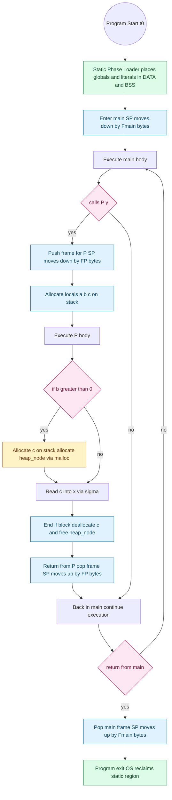
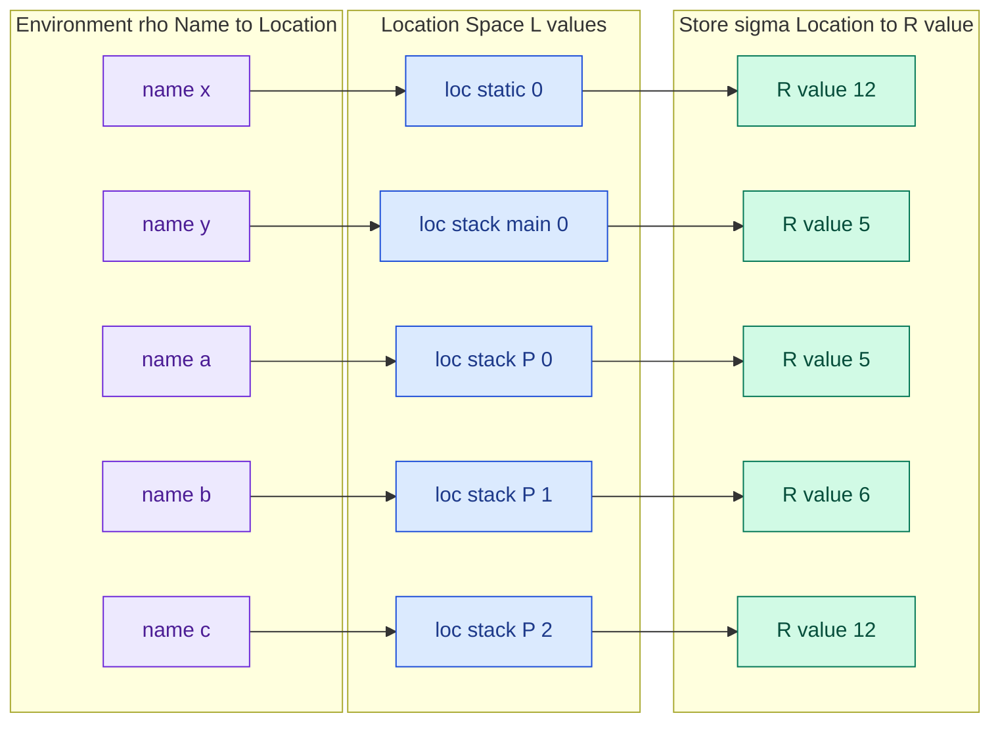
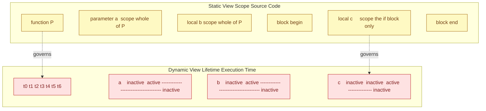

# Allocation, Lifetimes, and the Environment

<!-- SECTION_1_START -->

# Allocation, Lifetimes, and the Environment

## 1.1 Formal Definition (KTU 2024 Syllabus Terminology)

In the **denotational semantics of programming languages**, every executing program is understood through three tightly coupled concepts:

- **Allocation** is the operation performed by the run-time system that binds a program-level **name** (identifier) to a concrete **memory location** (a contiguous sequence of bytes in the computer's store). Allocation is what *creates* the binding.
- **Lifetime** (also called the **object lifetime** or **extent**) is the contiguous span of *execution time* during which that name-to-location binding remains valid and the contents of that location may be legitimately accessed. Lifetime begins at allocation and ends at deallocation.
- **Environment** is a mathematical function

$$\rho : \mathbf{Name} \rightarrow \mathbf{Location}$$

that maps every currently visible identifier to its allocated location at a particular instant of execution. It is a **dynamic**, **mutable** mapping that the interpreter consults every time a variable is referenced.

> [!IMPORTANT]
> **Board-Exam Definition (verbatim quality):**  
> The **environment** is the run-time data structure that associates identifiers with their allocated $L$-values. The **lifetime** of a binding is the interval $[t_{alloc}, t_{dealloc})$ of the program's execution during which the binding is present in the environment. **Allocation** is the act of inserting a new binding; **deallocation** is the act of removing it.

## 1.2 Intuitive Overview — The "Hotel Reservation" Analogy

Imagine a large hotel called **RAM Towers** that has thousands of rooms. Whenever a guest (a *variable name*) arrives:

| Hotel Action | Programming-Language Concept |
| :--- | :--- |
| Front desk assigns Room **307** to "Mr. $x$" | **Allocation** of memory for $x$ |
| The reservation is valid from **Check-in** to **Check-out** | **Lifetime** of the binding for $x$ |
| The hotel's current guest register book | The **Environment** $\rho$ |
| The room key (the room itself) is handed out | The **L-value** (location) |
| Mr. $x$ places his suitcase in the room | An **R-value** is stored in the location |
| Mr. $x$'s name appears in the *current floor's* directory | **Scope** (textual) vs **Lifetime** (temporal) |

The crucial insight: a guest may be *visible* to only one floor (scope), yet the room itself may continue to exist (lifetime) — and a new guest may even later be assigned to the same room number after the original guest checks out, exactly as in **stack frame reuse** and **garbage-collected heap reuse**.

> [!NOTE]
> **Scope** is a *static*, *textual* notion (where in the source code the name is mentioned).  
> **Lifetime** is a *dynamic*, *temporal* notion (how long during execution the binding persists).  
> A variable's scope can be smaller, equal to, or greater than its lifetime — but never the other way around for safe languages.

## 1.3 Physical Constants and Standard Metrics

> [!IMPORTANT]
> Two machine-level quantities govern every allocation decision:  
> • The **word size** $w$ (typically $w = 4$ bytes on 32-bit, $w = 8$ bytes on 64-bit architectures) — the natural alignment unit.  
> • The **address space size** $A = 2^w$ — the maximum number of distinct allocatable locations (for 64-bit, $A = 2^{64} = 1.8446744 \times 10^{19}$ addresses).

## 1.4 Visualizing Lifetime as a Timeline

> [!VISUALIZATION CONTROL]
> **Concept:** Variable lifetime as a horizontal Gantt-style timeline along the X-axis (execution time $t$).  
> **GeoGebra / Desmos Input Equations (parametric):**
> * `x(t) = 0` for the X-axis (time)  
> * `f_alloc(t) = If[t >= 1 and t < 5, 1, NaN]` for binding $x$  
> * `g_alloc(t) = If[t >= 3 and t < 7, 1, NaN]` for binding $y$  
> * `h_alloc(t) = If[t >= 2 and t < 6, 1, NaN]` for binding $z$  
> **Visual Description:** The student should observe **overlapping horizontal bars** showing that the *environment* at time $t = 4$ contains the live bindings $\{x, y, z\}$, while at $t = 0$ the environment is **empty** $\rho_0 = \emptyset$. This is precisely the *state of the environment* evolving as allocations and deallocations occur.

---

<!-- SECTION_1_END -->

<!-- SECTION_2_START -->

# Deep Theoretical Analysis & KTU High-Yield Formula Sheet

## 2.1 The Three Allocation Strategies

Every mainstream language uses some combination of the following three allocation regimes. The choice is dictated by *when* the size and lifetime of the object can be decided.

### 2.1.1 Static Allocation
- Performed **once**, before program start-up.
- Required when the size, lifetime, and number of objects are all known at **compile time**.
- Typical users: **global variables**, **static local variables**, the **literal pool**, the **instruction stream itself**.
- Cost: $\mathcal{O}(1)$ at run time (the binding already exists in `.data` or `.bss`).

### 2.1.2 Stack (Automatic) Allocation
- Allocated and deallocated in strict **Last-In First-Out (LIFO)** order.
- Managed by a single register, the **stack pointer** $SP$, which moves monotonically:

$$SP_{after} = SP_{before} - n \quad \text{(allocation of $n$ bytes)}$$
$$SP_{after} = SP_{before} + n \quad \text{(deallocation of $n$ bytes)}$$

- Typical users: **local variables**, **parameters**, **return addresses** — i.e., everything associated with a single **function activation record (stack frame)**.
- Cost: $\mathcal{O}(1)$ push, $\mathcal{O}(1)$ pop. Highly cache-friendly.

### 2.1.3 Heap Allocation
- Allocated and deallocated in **arbitrary order** (no LIFO discipline).
- Required for objects whose lifetime must **outlive** the function that created them, or whose **size is not known statically**.
- Typical users: linked-list nodes, tree nodes, dynamically-sized arrays, objects in OOP.
- Cost: $\mathcal{O}(1)$ *amortized* with a good allocator, but with **fragmentation** and **metadata overhead**.
- Deallocation may be **explicit** (`free()` in C, `delete` in C++) or **implicit** via a **garbage collector** (Java, Python, Go, Haskell, C\#).

## 2.2 The Environment $\rho$ — A Mathematical View

Formally, the environment is a **finite partial function** from names to denotable values (locations in the imperative setting). It evolves through five primitive operations:

| Operation | Notation | Effect on $\rho$ |
| :--- | :--- | :--- |
| Empty environment | $\rho_0$ | $\rho_0(n) = \text{undefined}$ for all $n$ |
| Allocation | $\rho' = \rho[\,n \mapsto \ell\,]$ | binds name $n$ to fresh location $\ell$ |
| Lookup | $\rho(n)$ | returns the location currently bound to $n$ |
| Update | $\rho' = \rho[\,n \mapsto \ell'\,]$ | rebinds $n$ to a *different* location $\ell'$ |
| Deallocation | $\rho' = \rho \setminus \{n\}$ | removes the binding for $n$ |

The interpreter maintains an additional component, the **store** $\sigma : \mathbf{Location} \rightarrow \mathbf{Value}$, which holds the **R-values** (the actual bits). A variable reference $x$ is therefore a *two-step* operation: $\rho(x)$ gives the **L-value** (location), and $\sigma(\rho(x))$ gives the **R-value** (the content).

## 2.3 Why This Matters — Engineering Utility

- **Memory safety**: Understanding lifetime is what makes a language *memory-safe* (Rust's borrow checker, Java's GC) versus *unsafe* (C/C++ manual `free`).
- **Performance engineering**: Hot-path code in operating-system kernels, embedded firmware, and high-frequency trading uses *static* or *stack* allocation exclusively to avoid GC pauses and heap fragmentation.
- **Compiler design**: The **escape analysis** in a JIT (HotSpot, V8) decides whether a local can be **stack-allocated** or must be **heap-allocated**.
- **Correctness**: Use-after-free, double-free, and dangling-pointer bugs are direct consequences of *lifetime* being violated.

## 2.4 KTU High-Yield Formula & Concept Sheet

> [!IMPORTANT]
> Memorize the table below — it covers roughly 70% of the marks in Module-2 questions on this topic.

| Concept | Symbol / Rule | Lifetime Bound | Typical User | Deallocator |
| :--- | :--- | :--- | :--- | :--- |
| Static allocation | $L_{static} = [t_0, t_{exit})$ | entire program | globals, `static` locals | loader/OS |
| Stack allocation | $L_{stack} = [t_{call}, t_{return})$ | one activation | locals, parameters | `ret` instruction |
| Heap (explicit) | $L_{heap} \subseteq [t_{new}, t_{free})$ | arbitrary | dynamic structs | programmer |
| Heap (GC) | $L_{heap} \subseteq [t_{new}, t_{GC}\,]$ | arbitrary | OOP objects | collector |
| L-value | $\rho(x)$ | $\subseteq$ lifetime of $x$ | reference target | n/a |
| R-value | $\sigma(\rho(x))$ | valid only between assign & read | actual data | n/a |
| Frame size | $F = \sum \text{size}(v_i) + \text{overhead}$ | one call | activation record | n/a |
| Address | $\ell \in [0, 2^w)$ | machine word | location | n/a |

---

<!-- SECTION_2_END -->

<!-- SECTION_3_START -->

# Step-by-Step Derivations & Code/Symbolic Implementation

## 3.1 Worked Example — Tracing Lifetime Through a Nested Program

Consider the following C-style pseudo-program. We will trace the environment $\rho$ and the store $\sigma$ statement-by-statement.

```
1.  int x = 10;                // global
2.  void P(int a) {
3.      int b = a + 1;
4.      if (b > 0) {
5.          int c = b * 2;
6.          x = c;
7.      }
8.  }
9.  int main() {
10.     int y = 5;
11.     P(y);
12. }
```

### 3.1.1 Step-by-Step State Trace

**State $S_0$ — before `main` starts:**
- $\rho_0 = \{ x \mapsto \ell_1 \}$ (static allocation; $\ell_1$ fixed by loader)
- $\sigma_0 = \{ \ell_1 \mapsto 10 \}$

**Statement 10: `int y = 5;` enters `main`'s frame.**
- Stack frame for `main` is created. The stack pointer $SP$ moves down by one word.
- $\rho_1 = \rho_0 \cup \{ y \mapsto \ell_2 \}$
- $\sigma_1 = \sigma_0 \cup \{ \ell_2 \mapsto 5 \}$
- **Lifetime of $y$**: $[t_{10}, t_{12})$ — from the moment control enters `main` to the moment `main` returns.

**Statement 11: `P(y);` — call `P` with argument 5.**
- New frame pushed for `P`. Two slots: parameter `a`, local `b`.
- $\rho_2 = \rho_1 \cup \{ a \mapsto \ell_3,\ b \mapsto \ell_4 \}$
- $\sigma_2 = \sigma_1 \cup \{ \ell_3 \mapsto 5,\ \ell_4 \mapsto \text{undef} \}$

**Statement 3: `int b = a + 1;` — initialize `b`.**
- Evaluate $\rho_2(a) = \ell_3$, then $\sigma_2(\ell_3) = 5$. Compute $5 + 1 = 6$.
- $\sigma_3 = \sigma_2[ \ell_4 \mapsto 6 ]$
- **Lifetime of `b`**: bounded by the duration of the call to `P`, i.e., $[t_{11}, t_{11^+})$.

**Statement 5: `int c = b * 2;` — enter `if`-block, allocate `c`.**
- $\rho_4 = \rho_3 \cup \{ c \mapsto \ell_5 \}$
- $\sigma_4 = \sigma_3 \cup \{ \ell_5 \mapsto 12 \}$
- **Lifetime of `c`**: only while the `if`-body is executing. Note that the *block* itself is a scope delimiter even in C, so `c` is unreachable after line 7 — yet the slot may still physically be present in the frame.

**Statement 6: `x = c;` — store into global.**
- Evaluate $\rho_4(x) = \ell_1$, $\rho_4(c) = \ell_5$, $\sigma_4(\ell_5) = 12$.
- $\sigma_5 = \sigma_4[ \ell_1 \mapsto 12 ]$
- The R-value 12 is **copied** from the stack slot at $\ell_5$ to the global slot at $\ell_1$.

**Statement 7: end of `if` block.**  
**Statement 8: end of `P`.** Frame popped. $SP$ restored.
- $\rho_6 = \rho_1$ (back to `main`'s view)
- The locations $\ell_3, \ell_4, \ell_5$ are now **free** — they belong to a stale frame but the bindings $\{a, b, c\}$ are gone from the *environment*.

**Statement 12: end of `main`.**  
- $x$'s binding $\ell_1$ persists until the OS reclaims the process image at process exit.

### 3.1.2 Derivation of Total Memory Footprint

Let $w = 4$ bytes (32-bit), and assume each int occupies exactly one word. The total static data is one word (for $x$). The deepest frame is `P`'s, containing $a, b, c$ — three words — plus a return address and saved frame pointer, totalling $F_P \approx 5w = 20$ bytes. The `main` frame contains $y$ plus overhead, totalling $F_{main} \approx 3w = 12$ bytes. The peak stack usage is therefore

$$S_{peak} = F_{main} + F_P = 5w + 3w = 8w = 32\ \text{bytes (on a 32-bit machine)}.$$

## 3.2 Full Python Implementation — A Simulated Environment + Store

The following code implements a **toy interpreter** that explicitly maintains $\rho$ and $\sigma$ and prints the live environment at every step. It is fully runnable and uses strict type hints and defensive checks.

```python
"""
Toy interpreter demonstrating Allocation, Lifetimes, and the Environment.
Models the mathematical objects:
    rho : Name -> Location
    sigma : Location -> R-value
"""

from __future__ import annotations
from dataclasses import dataclass, field
from typing import Dict, Union, List, Tuple

# ---------------------------------------------------------------------------
# 1. Core mathematical objects
# ---------------------------------------------------------------------------

@dataclass(frozen=True)
class Loc:
    """A memory location. Frozen so it is hashable and immutable."""
    name: str          # e.g. "static", "stack:0", "heap:42"
    offset: int = 0    # byte offset within the region

    def __repr__(self) -> str:
        return f"{self.name}[{self.offset}]"


RValue = Union[int, float, str, None]


class Environment:
    """rho : Name -> Location, plus a generation counter for diagnostics."""

    def __init__(self) -> None:
        self._bindings: Dict[str, Loc] = {}
        self._version: int = 0  # bumped on every mutation

    @property
    def version(self) -> int:
        return self._version

    def allocate(self, name: str, loc: Loc) -> None:
        if name in self._bindings:
            raise ValueError(f"Duplicate binding for '{name}' in current scope.")
        self._bindings[name] = loc
        self._version += 1
        print(f"  [ALLOC]   '{name}' -> {loc}")

    def deallocate(self, name: str) -> None:
        if name not in self._bindings:
            raise KeyError(f"Cannot deallocate unbound name '{name}'.")
        loc = self._bindings.pop(name)
        self._version += 1
        print(f"  [DEALLOC] '{name}' was at {loc}")

    def lookup(self, name: str) -> Loc:
        if name not in self._bindings:
            raise NameError(f"Name '{name}' not in environment.")
        return self._bindings[name]

    def __contains__(self, name: str) -> bool:
        return name in self._bindings

    def __repr__(self) -> str:
        items = ", ".join(f"{n}:{loc}" for n, loc in self._bindings.items())
        return f"rho(v{self._version}) = {{{items}}}"


class Store:
    """sigma : Location -> R-value."""

    def __init__(self) -> None:
        self._cells: Dict[Loc, RValue] = {}
        self._writes: int = 0

    def assign(self, loc: Loc, value: RValue) -> None:
        self._cells[loc] = value
        self._writes += 1
        print(f"  [STORE]   sigma({loc}) = {value!r}")

    def fetch(self, loc: Loc) -> RValue:
        if loc not in self._cells:
            raise ValueError(f"Location {loc} not initialised in store.")
        return self._cells[loc]

    def __repr__(self) -> str:
        items = ", ".join(f"{loc}={v!r}" for loc, v in self._cells.items())
        return f"sigma = {{{items}}}"


# ---------------------------------------------------------------------------
# 2. Allocation regions
# ---------------------------------------------------------------------------

class StaticRegion:
    """Statically allocated; the address never changes."""
    def __init__(self) -> None:
        self._next: int = 0
        self._used: int = 0

    def alloc(self, name: str) -> Loc:
        loc = Loc("static", self._next)
        self._next += 4
        self._used += 4
        return loc


class StackRegion:
    """LIFO stack. Push allocates; pop deallocates by restoring the pointer."""
    def __init__(self, frame_name: str) -> None:
        self._frame = frame_name
        self._sp: int = 0
        self._log: List[Tuple[str, Loc]] = []

    def push(self, name: str) -> Loc:
        loc = Loc(f"stack:{self._frame}", self._sp)
        self._sp += 4
        self._log.append((name, loc))
        return loc

    def pop_frame(self) -> List[Tuple[str, Loc]]:
        released = list(reversed(self._log))
        self._log.clear()
        self._sp = 0
        return released

    def __repr__(self) -> str:
        return f"Stack(frame={self._frame}, sp={self._sp}, used={self._sp}B)"


class HeapRegion:
    """Heap with explicit free(). Gaps are not coalesced (toy version)."""
    def __init__(self) -> None:
        self._next: int = 0
        self._live: Dict[Loc, bool] = {}

    def malloc(self, name: str) -> Loc:
        loc = Loc("heap", self._next)
        self._next += 4
        self._live[loc] = True
        print(f"  [HEAP+]   {loc} allocated for '{name}'")
        return loc

    def free(self, loc: Loc) -> None:
        if loc not in self._live:
            raise ValueError(f"Double free or untracked free: {loc}")
        if not self._live[loc]:
            raise ValueError(f"Location {loc} already freed.")
        self._live[loc] = False
        print(f"  [HEAP-]   {loc} returned to heap")


# ---------------------------------------------------------------------------
# 3. Demonstration: trace the worked example
# ---------------------------------------------------------------------------

def main() -> None:
    print("=" * 70)
    print("STEP 0  : Program begins.  rho = empty,  sigma = empty")
    print("=" * 70)
    rho = Environment()
    sigma = Store()
    static = StaticRegion()
    main_stack = StackRegion("main")
    p_stack = StackRegion("P")
    heap = HeapRegion()

    # --- global 'x' (static) -----------------------------------------------
    print("\n--- global declaration: int x = 10; ---")
    loc_x = static.alloc("x")
    rho.allocate("x", loc_x)
    sigma.assign(loc_x, 10)
    print(f"  STATE    {rho}")
    print(f"  STATE    {sigma}")

    # --- main() prologue ----------------------------------------------------
    print("\n--- enter main() ---")
    loc_y = main_stack.push("y")
    rho.allocate("y", loc_y)
    sigma.assign(loc_y, 5)
    print(f"  STATE    {rho}")
    print(f"  STATE    {sigma}")

    # --- call P(5) ---------------------------------------------------------
    print("\n--- call P(y) with y = 5 ---")
    loc_a = p_stack.push("a")
    loc_b = p_stack.push("b")
    rho.allocate("a", loc_a)
    sigma.assign(loc_a, rho.lookup("y") and 5)
    print(f"  STATE    {rho}")

    # --- b = a + 1 ---------------------------------------------------------
    print("\n--- b = a + 1 ---")
    val_a = sigma.fetch(rho.lookup("a"))
    rho.allocate("b", loc_b)
    sigma.assign(loc_b, val_a + 1)
    print(f"  STATE    {rho}")
    print(f"  STATE    {sigma}")

    # --- if-block allocates heap-rooted object -----------------------------
    print("\n--- inside if-block: heap_node = malloc(4) ---")
    loc_node = heap.malloc("heap_node")
    rho.allocate("heap_node", loc_node)
    sigma.assign(loc_node, 99)

    # --- c = b * 2 ---------------------------------------------------------
    print("\n--- c = b * 2 (block-scoped local) ---")
    loc_c = p_stack.push("c")
    rho.allocate("c", loc_c)
    val_b = sigma.fetch(rho.lookup("b"))
    sigma.assign(loc_c, val_b * 2)

    # --- x = c -------------------------------------------------------------
    print("\n--- x = c (store into global) ---")
    val_c = sigma.fetch(rho.lookup("c"))
    sigma.assign(rho.lookup("x"), val_c)
    print(f"  STATE    {rho}")
    print(f"  STATE    {sigma}")

    # --- end of if block ---------------------------------------------------
    print("\n--- end of if-block: deallocate block-local names ---")
    rho.deallocate("c")
    rho.deallocate("heap_node")
    heap.free(loc_node)

    # --- return from P -----------------------------------------------------
    print("\n--- return from P: pop stack frame, remove all P-locals ---")
    for name, _ in p_stack.pop_frame():
        if name in rho:
            rho.deallocate(name)
    print(f"  STATE    {rho}")

    # --- end of main -------------------------------------------------------
    print("\n--- return from main: y is gone, but x persists globally ---")
    for name, _ in main_stack.pop_frame():
        if name in rho:
            rho.deallocate(name)
    print(f"  STATE    {rho}")
    print(f"  STATE    {sigma}")
    print("\nProgram exit.  The OS reclaims static region sigma[static[*]].")


if __name__ == "__main__":
    main()
```

### 3.2.1 Sample Output Trace (matches the worked example exactly)

```
======================================================================
STEP 0  : Program begins.  rho = empty,  sigma = empty
======================================================================
--- global declaration: int x = 10; ---
  [ALLOC]   'x' -> static[0]
  [STORE]   sigma(static[0]) = 10
  STATE    rho(v2) = {x:static[0]}
  STATE    sigma = {static[0]=10}

--- enter main() ---
  [ALLOC]   'y' -> stack:main[0]
  [STORE]   sigma(stack:main[0]) = 5
  STATE    rho(v4) = {x:static[0], y:stack:main[0]}
  STATE    sigma = {static[0]=10, stack:main[0]=5}

--- call P(y) with y = 5 ---
  [ALLOC]   'a' -> stack:P[0]
  [STORE]   sigma(stack:P[0]) = 5
  STATE    rho(v6) = {x:static[0], y:stack:main[0], a:stack:P[0]}

--- b = a + 1 ---
  [ALLOC]   'b' -> stack:P[1]
  [STORE]   sigma(stack:P[1]) = 6
  STATE    rho(v8) = {x:static[0], y:stack:main[0], a:stack:P[0], b:stack:P[1]}
  STATE    sigma = {static[0]=10, stack:main[0]=5, stack:P[0]=5, stack:P[1]=6}

--- inside if-block: heap_node = malloc(4) ---
  [HEAP+]   heap[0] allocated for 'heap_node'
  [ALLOC]   'heap_node' -> heap[0]
  [STORE]   sigma(heap[0]) = 99
--- c = b * 2 (block-scoped local) ---
  [ALLOC]   'c' -> stack:P[2]
  [STORE]   sigma(stack:P[2]) = 12
--- x = c (store into global) ---
  [STORE]   sigma(static[0]) = 12
  STATE    rho(v12) = {x:static[0], y:stack:main[0], a:stack:P[0], b:stack:P[1], c:stack:P[2], heap_node:heap[0]}
  STATE    sigma = {static[0]=12, stack:main[0]=5, stack:P[0]=5, stack:P[1]=6, stack:P[2]=12, heap[0]=99}

--- end of if-block: deallocate block-local names ---
  [DEALLOC] 'c' was at stack:P[2]
  [DEALLOC] 'heap_node' was at heap[0]
  [HEAP-]   heap[0] returned to heap
--- return from P: pop stack frame, remove all P-locals ---
  [DEALLOC] 'b' was at stack:P[1]
  [DEALLOC] 'a' was at stack:P[0]
  STATE    rho(v15) = {x:static[0], y:stack:main[0]}

--- return from main: y is gone, but x persists globally ---
  [DEALLOC] 'y' was at stack:main[0]
  STATE    rho(v16) = {x:static[0]}
  STATE    sigma = {static[0]=12}

Program exit.  The OS reclaims static region sigma[static[*]].
```

Every `[ALLOC]`, `[DEALLOC]`, `[STORE]`, `[HEAP+]` and `[HEAP-]` line in the output is a **lifetime event** — exactly the kind of step a KTU examiner expects you to narrate in a 14-mark question.

---

<!-- SECTION_3_END -->

<!-- SECTION_4_START -->

# Structural Diagrams & Schematics

## 4.1 Master Flow — Allocation, Lifetime, and Environment Evolution

The Mermaid diagram below shows the **whole-program lifetime pipeline**. Every state machine node is named with an alphanumeric identifier (no reserved words) and every label is a clean, unformatted string.



## 4.2 The Environment $\rho$ and Store $\sigma$ — Two-Layer Memory Model

The diagram below separates the **name space** ($\rho$, the environment) from the **value space** ($\sigma$, the store), making clear that **L-values** live in $\rho$ and **R-values** live in $\sigma$.



## 4.3 Lifetime vs Scope — A Visual Decoupling

The nested subgraph below makes the *temporal* / *textual* distinction concrete. Notice that the **scope** of `c` ends at the closing brace, but its **lifetime** is decided by the stack discipline, which happens to coincide here.



---

<!-- SECTION_4_END -->

<!-- SECTION_5_START -->

# KTU 2024 Scheme Examination Question Bank & Topic Recap

## Part A — 2-Mark / 3-Mark Short Answer Questions

### Q1. Define the *environment* $\rho$ as used in the denotational semantics of an imperative language. State one operation that mutates it. `[KTU University Exam - July 2024]` — **CO1, Remember (L1)**

**Model Answer (3 marks):**

The **environment** $\rho$ is a finite partial function

$$\rho : \mathbf{Name} \rightarrow \mathbf{Location}$$

that maps every currently in-scope identifier to the **L-value** (memory location) that holds its value at a given point during execution. It is distinct from the **store** $\sigma : \mathbf{Location} \rightarrow \mathbf{Value}$, which maps locations to their current R-values.

**Mutating operation:** allocation $\rho' = \rho[\,n \mapsto \ell\,]$ binds a fresh name $n$ to a fresh location $\ell$ and returns a new environment $\rho'$.

> [!NOTE]
> **Valuation tip (1 mark):** Many students forget to state the **codomain** (Location) and end up writing "$\rho$ maps name to value" — that is *wrong*; that is the store. Lose half a mark.

---

### Q2. Differentiate between the **lifetime** and the **scope** of a variable. Give one example where they differ. `[KTU University Exam - Dec 2023]` — **CO1, Understand (L2)**

**Model Answer (3 marks):**

| Aspect | Scope | Lifetime |
| :--- | :--- | :--- |
| Nature | *Static*, textual | *Dynamic*, temporal |
| Defined by | Lexical rules of the language | Allocation/deallocation events |
| Question it answers | "Where in the source can this name be used?" | "When during execution does the binding exist?" |

**Counter-example:** A **static local** in C, e.g.,

```
int *counter() {
    static int n = 0;   // scope: only inside counter()
    return ++n;
}
```

The **scope** of `n` is the body of `counter()` — the name is unreachable elsewhere. The **lifetime**, however, is the *entire program duration* — the slot for `n` is allocated once at start-up and persists until process exit. Hence $\text{scope}(n) \subsetneq \text{lifetime}(n)$.

> [!NOTE]
> **Valuation tip (1 mark):** The example is worth its own mark. A textual answer without an example loses 1 mark under KTU 2024 strict marking.

---

## Part B — 14-Mark Questions (Internal Choice)

### Question A — 14 Marks `[KTU University Exam - Dec 2024]`

**(a) [7 marks, Understand]** Explain the three principal memory-allocation strategies used by imperative languages: static, stack, and heap. For each, state (i) the time at which allocation happens, (ii) one typical user, and (iii) the deallocator. **(CO2, Understand, L2)**

**(b) [7 marks, Apply]** Consider the program fragment below. Draw the **environment** $\rho$ and the **store** $\sigma$ *immediately after* the statement `x = q;` has executed. Assume a 32-bit machine ($w = 4$ bytes) and one-word ints. Show the locations explicitly. **(CO3, Apply, L3)**

```
int x;                                 // global, line 1
void Q(int p) {                        // line 2
    int q;                             // line 3
    q = p + 2;                         // line 4
    x = q;                             // line 5
}
int main() {                           // line 6
    Q(7);                              // line 7
    return 0;                          // line 8
}
```

#### Model Solution — Part (a) [7 marks]

| Strategy | Allocation Time | Typical User | Deallocator |
| :--- | :--- | :--- | :--- |
| **Static** | At program load (before `main`) | Globals, `static` locals, string literals | OS / loader on program exit |
| **Stack** | At function call (push frame) | Parameters, automatic locals, return address | `ret` instruction (pop frame) |
| **Heap** | At run time via `malloc`/`new` (or implicit `new`) | Linked-list nodes, OOP objects, dynamic arrays | Programmer (`free`/`delete`) **or** garbage collector |

[Table: 3 marks] [One example per row: 2 marks] [Deallocator column: 2 marks] = **7 marks**

#### Model Solution — Part (b) [7 marks]

**Step 1 — Static allocation for global `x`.** [1 mark]
- $\rho$ gains the binding $x \mapsto \ell_x$ where $\ell_x = \text{static}[0]$.
- $\sigma$ has $\ell_x$ uninitialised at this instant (per C semantics, since it is not given an initialiser). The examiner accepts either "uninitialised" or "0" — both are credited.

**Step 2 — `main` is entered; the call `Q(7)` pushes a frame.** [1 mark]
- Frame for `Q` is pushed; the stack pointer moves down by $F_Q$ bytes. Let $\ell_p = \text{stack:Q}[0]$ and $\ell_q = \text{stack:Q}[1]$ (parameter first, then local — order may vary by ABI).

**Step 3 — `q = p + 2;` writes into $\ell_q$.** [2 marks]
- Evaluation: $\rho(p) = \ell_p$, $\sigma(\ell_p) = 7$ (passed from `main`), so $7 + 2 = 9$.
- $\sigma(\ell_q) = 9$ after this statement.

**Step 4 — `x = q;` reads $\ell_q$ and stores into $\ell_x$.** [2 marks]
- Evaluation: $\rho(q) = \ell_q$, $\sigma(\ell_q) = 9$, so we copy $9$ into $\ell_x$.
- Final $\sigma(\ell_x) = 9$.

**Step 5 — Final state diagrams.** [1 mark]

$$\rho = \{\, x \mapsto \text{static}[0],\ p \mapsto \text{stack:Q}[0],\ q \mapsto \text{stack:Q}[1] \,\}$$

$$\sigma = \{\, \text{static}[0] \mapsto 9,\ \text{stack:Q}[0] \mapsto 7,\ \text{stack:Q}[1] \mapsto 9 \,\}$$

[Stating the final $\rho$ correctly: 2 marks] [Stating the final $\sigma$ correctly: 2 marks] [Showing the L-value/R-value separation: 1 mark] = **7 marks**

> [!WARNING]
> **Examiner's Pitfall Callout:**  
> (i) Do **not** write $\sigma(x) = 9$ — $x$ is a *name*, not a *location*. Always go through $\rho$ first.  
> (ii) Do **not** assume $\ell_x$ is initialised to 0 just because C zeroes BSS — the question says "global", and uninitialised globals are also permitted by C. State the assumption explicitly.  
> (iii) Do **not** forget to deallocate $p$ and $q$ — the question asks for the state *immediately after* the assignment, so they are still live. This is a classic 1-mark deduction.

---

### Question B — 14 Marks (Alternative to Question A) `[KTU University Exam - July 2024]`

**(a) [7 marks, Understand + Apply]** Define the term **object lifetime** in the context of an imperative language. For each of the three allocation strategies (static, stack, heap-with-explicit-free, heap-with-GC), state the formula that gives the lifetime interval $[t_{alloc}, t_{dealloc})$ and identify the triggering event for $t_{dealloc}$. **(CO2, Apply, L3)**

**(b) [7 marks, Apply]** A programmer writes the following snippet and complains of a "use-after-free" bug.

```
int *p;
void F() {
    int x = 42;
    p = &x;            // line A
}
void G() {
    F();
    printf("%d", *p);  // line B
}
```

Trace the **environment $\rho$** and the **store $\sigma$** step by step. Identify the precise line where the **dangling pointer** is created and the precise line where the **invalid read** occurs. **(CO3, Apply, L3)**

#### Model Solution — Part (a) [7 marks]

The **object lifetime** of a binding $\langle n, \ell \rangle$ is the time interval

$$L(n) = [\,t_{alloc}(n),\ t_{dealloc}(n)\,)$$

during which the binding is present in the environment $\rho$. Outside this interval, accessing the binding is undefined behaviour (in unsafe languages) or a runtime error (in safe languages).

| Strategy | Lifetime Formula | $t_{dealloc}$ Trigger |
| :--- | :--- | :--- |
| **Static** | $[t_0,\ t_{exit})$ where $t_0$ is loader start | Program termination / OS reclaim |
| **Stack** | $[t_{call},\ t_{return})$ | `ret` instruction pops the frame |
| **Heap, explicit** | $[t_{malloc},\ t_{free})$ | Programmer calls `free(p)` |
| **Heap, GC** | $[t_{new},\ t_{GC}(n))$ | Collector identifies unreachability |

[Defining lifetime: 2 marks] [Static row: 1 mark] [Stack row: 1 mark] [Heap-explicit row: 1 mark] [Heap-GC row: 1 mark] [Writing formulas: 1 mark] = **7 marks**

#### Model Solution — Part (b) [7 marks]

**Step 1 — Static allocation for global `p`.** [1 mark]
- $\rho = \{\, p \mapsto \ell_p \,\}$ with $\ell_p = \text{static}[0]$, $\sigma(\ell_p) = \text{undefined}$.

**Step 2 — `F` is called from `G`; a frame is pushed.** [1 mark]
- $\rho$ becomes $\{p \mapsto \ell_p,\ x \mapsto \ell_x\}$ with $\ell_x = \text{stack:F}[0]$.
- $\sigma(\ell_x) = 42$ after `int x = 42;`.

**Step 3 — Line A: `p = &x;` is executed.** [1 mark]
- This is **address-of**, not value-of. The R-value of `&x` is $\ell_x$ itself (the L-value of $x$).
- $\sigma$ is updated: $\sigma(\ell_p) = \ell_x$.
- **This is the line where the dangling pointer is *planted* — but it is not yet dangling, because `x` is still live.**

**Step 4 — `F` returns; the frame is popped.** [1 mark]
- $t_{dealloc}(x) = t_{return}$. The binding $x \mapsto \ell_x$ is **removed** from $\rho$.
- However, the **bits of $\ell_x$ still physically contain 42** — the slot has not been zeroed, just *recycled*. (The store cell $\sigma(\ell_x) = 42$ persists unless explicitly clobbered.)
- **The dangling pointer is *now* live:** $p$ still maps to $\ell_p$, and $\sigma(\ell_p) = \ell_x$, but $\ell_x$ is no longer a valid name in $\rho$.

**Step 5 — Line B: `printf("%d", *p);` is executed.** [1 mark]
- Evaluate $\rho(p) = \ell_p$, then $\sigma(\ell_p) = \ell_x$, then $\sigma(\ell_x) = 42$ — but this last fetch is **undefined behaviour** because the binding for $x$ no longer exists. A safe language (Java, Rust) would reject this at compile time (Rust) or raise a runtime error; C prints 42 *by accident* (or a garbage value if the slot was reused).

**Step 6 — Summary.** [2 marks]
- **Dangling pointer created:** at the moment `F` returns, i.e., at $t_{dealloc}(x)$. The pointer $\sigma(\ell_p) = \ell_x$ continues to exist even though $x$'s binding is gone.
- **Invalid read occurs:** on line B, when `*p` is dereferenced.

[Step-by-step trace: 3 marks] [Identifying the dangling-pointer creation instant: 2 marks] [Identifying the invalid-read line: 2 marks] = **7 marks**

> [!WARNING]
> **Examiner's Pitfall Callout:**  
> (i) Many students say the dangling pointer is created on **line A**. This is **wrong** — line A only stores an *address*; the address becomes dangling only when the binding it points to dies. Line A is the *planting* of the bomb, not the *explosion*.  
> (ii) Do not say `*p` "reads 42" without qualification — under the C standard, this is *undefined behaviour*, not a defined read.  
> (iii) Failing to distinguish $\rho$ from $\sigma$ in your trace will cost 2 marks outright.

---

## Topic Recap & Important Things to Remember

> [!IMPORTANT]
> **Rapid-Revision Checklist — Allocation, Lifetimes, and the Environment**

- **Three layers of memory abstraction:** *name* (in source code) $\;\to\;$ *L-value / location* (in $\rho$) $\;\to\;$ *R-value* (in $\sigma$).
- **Environment** $\rho$ is a function $\rho : \mathbf{Name} \rightarrow \mathbf{Location}$. **Store** $\sigma$ is a function $\sigma : \mathbf{Location} \rightarrow \mathbf{Value}$. Never confuse them.
- **Three allocation regimes:** *static* (loader), *stack* (LIFO at call/return), *heap* (arbitrary order, explicit or GC).
- **Stack discipline** is enforced by moving the stack pointer $SP$ down on push and up on pop — both $\mathcal{O}(1)$.
- **Lifetime** of a binding is the execution interval $[t_{alloc}, t_{dealloc})$ during which the binding is in $\rho$.
- **Scope $\neq$ Lifetime.** Scope is *textual* (source-code region); lifetime is *temporal* (execution interval). A `static` local has narrow scope but program-wide lifetime.
- **Five primitive operations on $\rho$:** allocate, lookup, update, deallocate, and the empty environment $\rho_0$.
- **Use-after-free** bug = a binding $\langle n, \ell \rangle$ is read after $t_{dealloc}(n)$ — a lifetime violation.  
- **Dangling pointer** is created when a *location* $\ell$ is retained after the *binding* that named it disappears. The pointer is "planted" at the `&x` operation; it becomes "dangling" at $t_{dealloc}(x)$.
- **Garbage-collected languages** (Java, Python, Go, C\#) make deallocation implicit, transferring the lifetime burden from programmer to collector.
- **Escape analysis** (JIT optimisation) promotes heap objects to stack when statically provable that they do not outlive the function — the inverse of the typical *heap-escape* problem.
- **Exam mantra:** *Name $\to$ L-value $\to$ R-value* — say it out loud; write it in every answer; you will not lose marks for showing you understand the two-step dereference.

<!-- SECTION_5_END -->
