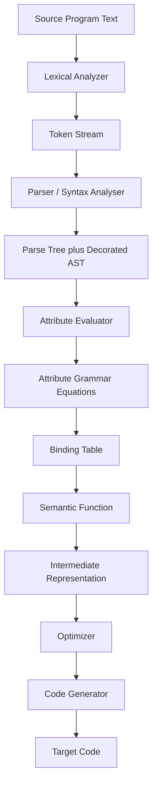
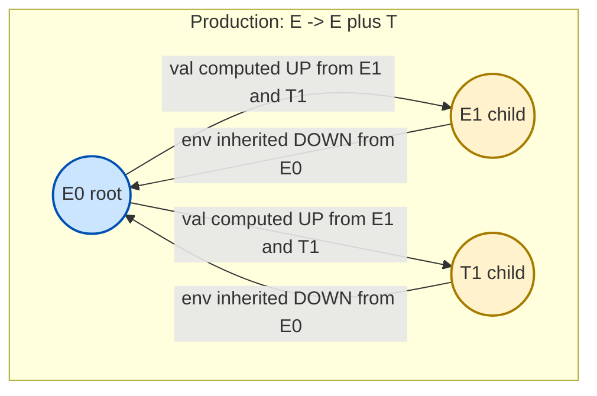
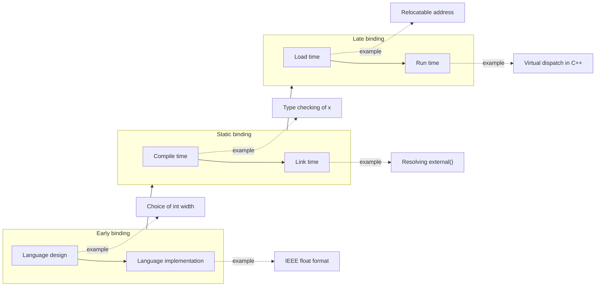
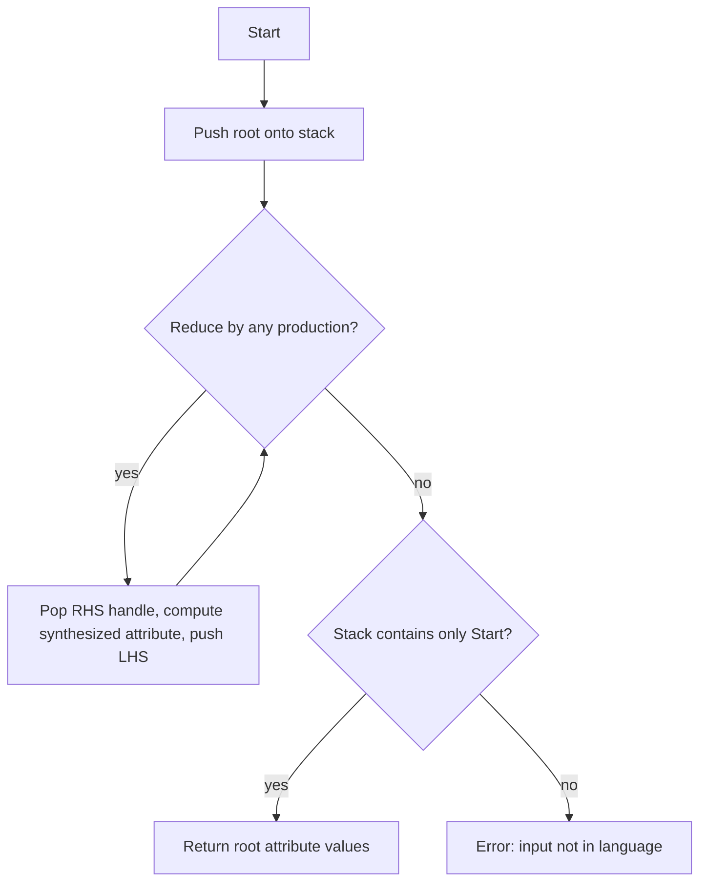
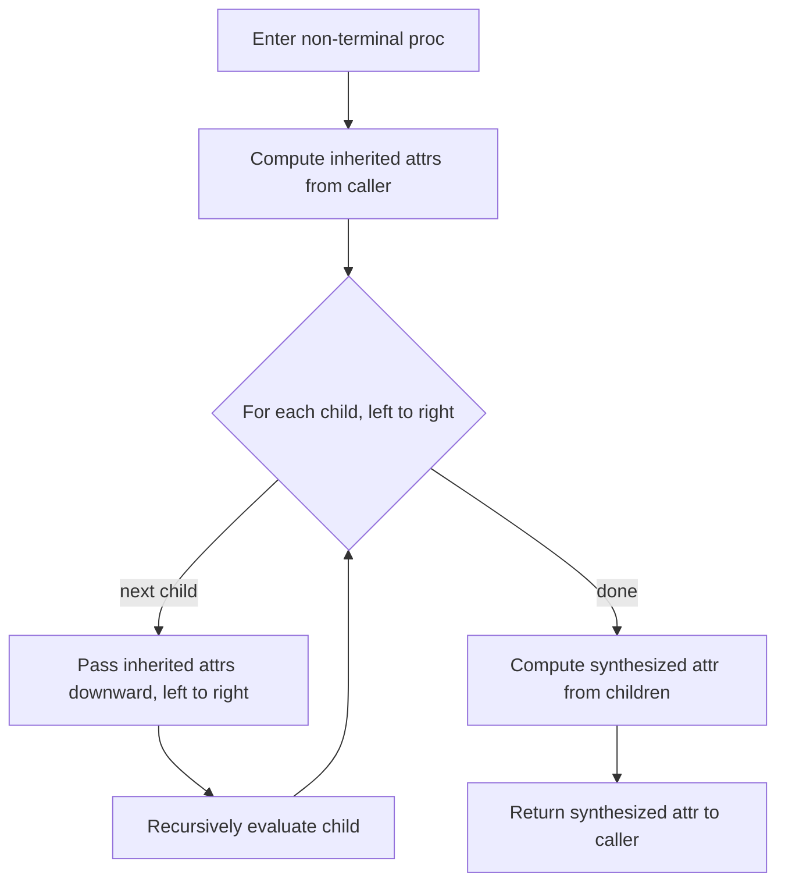
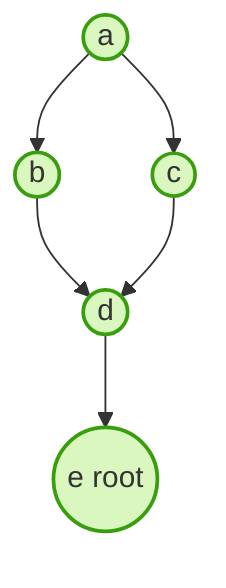

# Basic Semantics- Attributes, Binding, and Semantic Functions

<!-- SECTION_1_START -->

# Basic Semantics — Attributes, Binding, and Semantic Functions

> [!IMPORTANT]
> **KTU 2024 Scheme — PECST758 (Programming Languages)**
> **Module 2 Focus:** Moving from *Syntax* (what a program looks like) to *Semantics* (what a program means). This module introduces the formal machinery — **Attributes, Bindings, and Semantic Functions** — used to assign meaning to syntactically valid programs.

---

## 1.1 Formal Academic Definition

In the formal study of programming languages, **Semantics** is the branch that deals with the *meaning* of programs and program constructs. While a **Context-Free Grammar (CFG)** describes only the syntactic structure (the shape) of a program, semantics attaches *meaning* to that structure.

A **semantic function** $\llbracket \cdot \rrbracket$ is a mathematically defined mapping that translates a syntactic object (e.g., a parse tree) into a mathematical object representing its meaning (a value, a state transformation, or a function). To make this translation *systematic* and *decomposable*, the meaning is broken into small pieces called **attributes** attached to the nodes of the parse tree. The rules that compute these attributes are called **semantic rules** (or *attribute equations*).

Formally, an **Attribute Grammar (AG)** is a triple:

$$AG = (G, A, R)$$

where:
- $G$ is a context-free grammar,
- $A$ is a finite set of **attributes**, partitioned for each non-terminal $X$ into two disjoint sets:
  - $I(X)$ — the set of **inherited attributes** of $X$,
  - $S(X)$ — the set of **synthesized attributes** of $X$,
- $R$ is a finite set of **semantic rules** (attribute equations) used to define the attributes in $A$.

> [!NOTE]
> **Terminology Check (Board Favourite):**
> - *Synthesized attribute* = value computed *upward* from children to parent.
> - *Inherited attribute* = value computed *downward* (or sideways) from parent/siblings to a child.
> - A grammar using *only* synthesized attributes is called an **S-attributed grammar**.

---

## 1.2 Conceptual Analogy — The "Passport Stamping" View

Imagine a parse tree as a **family tree at an airport immigration counter**. Each traveller (node) arrives with a *partial* passport (a **synthesized attribute** — information they already know about themselves, like their nationality). But certain other details — like a **visa stamp** (an **inherited attribute**) — must be *handed down* by an official at a higher desk (the parent) before the traveller can be cleared.

The **semantic rules** are the *stamping instructions* printed in the official's manual. They say things like:

> *"If a parent's category is $B$ and the child is below age $12$, stamp the child's visa as FREE."*

The job of the **semantic function** $\llbracket \cdot \rrbracket$ is to walk through the entire tree applying these stamping rules, and at the end produce a fully stamped passport — the **meaning** of the program.

A **binding**, in this analogy, is the act of *fixing* a particular value (e.g., a name ↔ a passport number, or a type ↔ a memory size) at a specific point in time. Just as a passport number is *bound* to you at the moment of issue, a variable is *bound* to a type at the moment its declaration is processed.

---

## 1.3 Why This Matters in KTU 2024 Scheme

> [!IMPORTANT]
> **Syllabus Highlight (Module 2):** Attribute grammars and binding concepts appear directly in *Part A (3 marks)* and frequently in *Part B (14 marks)* sub-parts asking students to:
> 1. Identify synthesized vs inherited attributes.
> 2. Construct an attribute grammar for a given construct (e.g., type checking, evaluation of expressions).
> 3. Discuss binding time for typical language constructs.

Understanding attributes & binding forms the *bridge* between the parser (which only knows grammar) and the compiler's later phases (which need meaning).

---

## 1.4 GeoGebra / Desmos Visualisation

> [!VISUALIZATION CONTROL]
> **Concept:** Tree-walk propagation of attributes (Synthesized vs Inherited)
> **GeoGebra / Desmos Input Equations:**
> * Node layout (tree structure): `A=(0,4), B=(-2,2), C=(2,2), D=(-3,0), E=(-1,0), F=(1,0), G=(3,0)`
> * Edge segments: `(A,B), (A,C), (B,D), (B,E), (C,F), (C,G)`
> * Synthesized arrow direction: `B→A, C→A, D→B, E→B, F→C, G→C`
> * Inherited arrow direction: `A→B, A→C, B→D, B→E, C→F, C→G`
> **Visual Description:** The student should see two *opposing* flows on the same tree. Synthesized values flow *upward and inward* to the root; inherited values flow *downward and outward* to the leaves. The root node has only synthesized attributes; terminals have only inherited attributes from their parents.

<!-- SECTION_1_END -->

<!-- SECTION_2_START -->

# Deep Theoretical Analysis & KTU High-Yield Formula Sheet

---

## 2.1 The Two Pillars: Synthesized vs Inherited Attributes

### 2.1.1 Synthesized Attributes

A synthesized attribute of a non-terminal $X$ is one whose value at a parse-tree node labelled $X$ is **computed from the attribute values of the children** of that node. In symbols, for production $X \rightarrow X_1 \, X_2 \, \dots \, X_n$:

$$X.s = f(X_1.a_1, X_2.a_2, \dots, X_n.a_k)$$

**Key properties:**
- Values flow **bottom-up** (children → parent).
- The **start symbol** can only have synthesized attributes (since it has no parent).
- An attribute grammar using *only* synthesized attributes is **S-attributed**, and it can be evaluated in a single bottom-up pass — exactly the model used in **Yacc** / **Bison** (LALR parser generators).

### 2.1.2 Inherited Attributes

An inherited attribute of a non-terminal $X_i$ on the right-hand side of a production is one whose value is **computed from the attribute values of the parent** and/or **the siblings to its left**.

$$X_i.inh = g(\text{parent's attrs}, \text{left siblings' attrs})$$

**Key properties:**
- Values flow **top-down** (parent → child) or **sideways** (left sibling → right sibling).
- Inherited attributes are useful for passing *context* downward — e.g., the *expected type* of a sub-expression, or the *address offset* in code generation.

---

## 2.2 Binding — When Does Meaning Get Fixed?

**Binding** is the association between a name (identifier) and an attribute of that name (its type, value, memory location, scope, etc.). The **binding time** is the moment at which this association is established.

### 2.2.1 Possible Binding Times (ordered earliest → latest)

| # | Binding Time | Example in a Language |
|---|--------------|------------------------|
| 1 | **Language design time** | Choice of `int` is 32-bit in C on most systems. |
| 2 | **Language implementation time** | Whether `float` is IEEE-754 single (32-bit) or double (64-bit). |
| 3 | **Compile time** (static binding) | The type of `int x;` in C is fixed when the compiler runs. |
| 4 | **Link time** | The address of an external function resolved by the linker. |
| 5 | **Load time** | The absolute address of a global variable fixed by the loader. |
| 6 | **Run time** (dynamic binding) | A `virtual` method call in C++ or Java resolved at runtime via v-table. |

> [!NOTE]
> **Static binding** = *early* (compile/link time), **Dynamic binding** = *late* (run time). Languages favouring early binding (C, Pascal) are typically faster; languages favouring late binding (Python, Lisp, Smalltalk) are more flexible.

### 2.2.2 Categories of Bindings (KTU Favourite)

| Binding | What gets associated with what? | Example |
|---------|--------------------------------|---------|
| **Type binding** | Variable ↦ Type | `int x;` binds `x` to `int`. |
| **Value binding** | Variable ↦ Value | `x := 5;` binds `x` to the value $5$. |
| **Storage binding** | Variable ↦ Memory address | The compiler allocates `x` at offset 12 from frame base. |
| **Name binding** | Identifier ↦ Program entity | A `typedef` or `using` alias. |
| **Routine binding** | Call site ↦ Function address | Virtual dispatch in C++. |

---

## 2.3 Semantic Functions — The Meaning Map

A semantic function is the mathematical rule that maps a syntactic construct to its meaning. The most common forms are:

### 2.3.1 Denotational Semantics Style

For an expression $E$ in an environment $\rho$ (a mapping from names to values):

$$\llbracket E \rrbracket \rho = \text{the value of } E \text{ in environment } \rho$$

For a declaration $D$ that updates the environment:

$$\llbracket D \rrbracket \rho = \rho' \text{ (the modified environment)}$$

### 2.3.2 Attribute-Grammar Style

For a grammar production $E \rightarrow E_1 + T$:

$$E.val = E_1.val + T.val$$

$$E.type = \text{if } (E_1.type = \text{integer} \land T.type = \text{integer}) \text{ then } \text{integer} \text{ else } \text{typeError}$$

### 2.3.3 Translation (Compiler) Style

A *translation scheme* emits *intermediate code*:

$$E.code = E_1.code \; || \; T.code \; || \; \text{"ADD"}\quad (\text{emit ADD at the end})$$

---

## 2.4 The KTU High-Yield Formula Sheet

> [!IMPORTANT]
> **Memorise the following table — it covers 80% of the marks in this module.**

| Symbol / Term | Meaning / Formula | Where Used |
|---------------|-------------------|------------|
| $G = (V, T, P, S)$ | Context-free grammar | Foundation of syntax |
| $I(X),\, S(X)$ | Inherited / Synthesized sets of attribute $X$ | Attribute definition |
| $X.s = f(\text{children's attrs})$ | Synthesized equation | Bottom-up flow |
| $X_i.inh = g(\text{parent}, \text{left siblings})$ | Inherited equation | Top-down / sideways flow |
| $AG = (G, A, R)$ | Attribute grammar triple | Formal definition |
| $\llbracket E \rrbracket \rho$ | Denotation of $E$ in env. $\rho$ | Denotational semantics |
| $\rho \vdash E : \tau$ | "In environment $\rho$, expression $E$ has type $\tau$" | Type system (natural semantics) |
| **Binding time** | Language design $\le$ impl. $\le$ compile $\le$ link $\le$ load $\le$ run | Exam definitions |
| **S-attributed** | Only synthesized attrs exist | Yacc / bottom-up parsing |
| **L-attributed** | Inherited allowed only from parent or *left* siblings | Top-down parsers (LL) |
| **Dependence graph** $D = (N, E)$ with $N$ = attributes, $E$ = "depends on" | Used to detect evaluation order | Circularity test |
| **Circular AG** | $D$ has a cycle → meaning undefined | Must fail such grammars |

> [!WARNING]
> **L-attributed vs S-attributed (common confusion):**
> *Every S-attributed grammar is L-attributed, but NOT vice versa.* If a question says "L-attributed but not S-attributed", there must be at least one inherited attribute in the grammar.

---

## 2.5 Real-World Engineering Utility

- **Compiler Construction:** Attribute grammars are the conceptual basis of *syntax-directed translation* in GCC, LLVM, and Yacc/Bison.
- **Static Analysers:** Tools like `clang-tidy` and `rustc` use attribute flows for *type inference* (inherited) and *constant folding* (synthesized).
- **IDE Tooling:** "Find all references" relies on binding tables; refactoring tools manipulate bindings safely.
- **Type Systems & DSLs:** Every typed DSL (SQL, Terraform HCL) implements a form of attribute-grammar based type-checker.
- **Verification & Proof Assistants (Coq, Lean):** Semantic functions and binding environments are the *core* data structures.

<!-- SECTION_2_END -->

<!-- SECTION_3_START -->

# Step-by-Step Derivations, Worked Examples & Code Implementation

---

## 3.1 Worked Example 1 — Synthesized Attribute Grammar for Arithmetic Expressions

**Problem (typical 7-mark KTU question):**
Construct an attribute grammar that evaluates a simple integer arithmetic expression. The grammar is:

$$
\begin{aligned}
E &\rightarrow E + T \mid T \\
T &\rightarrow T \times F \mid F \\
F &\rightarrow (E) \mid \text{digit}
\end{aligned}
$$

**Step 1 — Declare the attribute.**

For the non-terminals $E$ and $T$, we declare one synthesized attribute `.val` (the integer value).

**Step 2 — Write the semantic rules (synthesized equations).**

For $E \rightarrow E_1 + T$:

$$E.val = E_1.val + T.val$$

For $E \rightarrow T$:

$$E.val = T.val$$

For $T \rightarrow T_1 \times F$:

$$T.val = T_1.val \times F.val$$

For $T \rightarrow F$:

$$T.val = F.val$$

For $F \rightarrow (E)$:

$$F.val = E.val$$

For $F \rightarrow \text{digit}$:

$$F.val = \text{lexical-value}(\text{digit})$$

> [!NOTE]
> **Valuation Key Points (for examiner):**
> 1. *Stating the attribute and its nature (synthesized): 2 marks*
> 2. *All 6 productions with their equations: 4 marks*
> 3. *Correctness of logic (e.g., passing $E_1.val$, $T.val$, etc.): 1 mark*

**Step 3 — Trace the parse tree for input `(3 + 4) × 5`.**

Let us annotate the tree. The input string is $\mathbf{3} + \mathbf{4}$, parenthesised, then multiplied by $\mathbf{5}$.

At the leaves, `digit.lexical-value` gives $3, 4, 5$.

For $F \rightarrow \text{digit}$: $F.val \gets 3$, $F.val \gets 4$, $F.val \gets 5$.

For $E \rightarrow E_1 + T$: $E.val = 3 + 4 = 7$.

For $F \rightarrow (E)$: $F.val = E.val = 7$.

For $T \rightarrow T_1 \times F$: $T.val = 7 \times 5 = 35$.

For $E \rightarrow T$: $E.val = 35$.

**Result:** $E.val_{root} = 35$. ✓

---

## 3.2 Worked Example 2 — Inherited Attribute for Type-Checking a Declaration

**Problem:** Build an attribute grammar for the construct:

```
D  → id L    /* declaration: id : type */
L  → , id L  /* more ids in the list */
L  → : T     /* end of list, type T follows */
T  → int | real
```

We need to verify that the *type* flows from the right end of the list back to every `id` in the list. This requires an **inherited attribute** (the expected type travels from the right to the left, then upward).

**Step 1 — Declare attributes.**

- $id$ has an inherited attribute `expected_type` and a synthesized attribute `actual_type` (= its declared type, which equals `expected_type` if correct).
- $L$ has an inherited attribute `in_type` (the type from the right) and a synthesized attribute `out_type` (passed further right or returned).
- $T$ has a synthesized attribute `type`.

**Step 2 — Semantic rules.**

For $D \rightarrow \text{id } L$:

$$\text{id}.expected\_type = L.in\_type$$

For $L_1 \rightarrow ,\; \text{id}\; L_2$:

$$L_2.in\_type = L_1.in\_type$$

$$\text{id}.expected\_type = L_1.in\_type$$

$$L_1.out\_type = L_2.out\_type$$

For $L \rightarrow : T$:

$$L.in\_type = T.type$$

$$L.out\_type = T.type$$

For $T \rightarrow \text{int}$:

$$T.type = \text{integer}$$

For $T \rightarrow \text{real}$:

$$T.type = \text{real}$$

**Step 3 — Trace for input `a, b, c : int`.**

- Parse $D \rightarrow id(a) \, L$. We need $L.in\_type$, which is computed *only* from the rightmost production.
- At the rightmost $L \rightarrow : T \rightarrow : int$: $L.in\_type = T.type = \text{integer}$, $L.out\_type = \text{integer}$.
- Walking back: each $L$'s $out\_type$ becomes the next $L$'s $in\_type$, so all `id`s see `expected_type = integer`. ✓

---

## 3.3 Worked Example 3 — Binding-Time Analysis for a C Snippet

Consider:

```c
int x = 10;
void foo(double y) {
    x = x + (int)y;
}
```

| Name | Type binding | Value binding | Storage binding | Routine binding |
|------|--------------|---------------|-----------------|-----------------|
| `int` (keyword) | Language implementation time | — | — | — |
| `x` (global) | Compile time (`int`) | Run time (initialised to 10) | Link/Load time (in `.data` section) | — |
| `x` (inside `foo`) | Compile time (`int`) | Run time (assigned on every call) | Run time (computed address of global) | — |
| `foo` (function) | Compile time (signature `(double)→void`) | — | Link time (address in `.text`) | Link time (resolved by linker) |
| `y` (parameter) | Compile time (`double`) | Run time (caller's argument) | Run time (on the stack/registers) | — |
| `(int)y` cast | Compile time (cast action) | Run time (truncation) | — | — |

**Insight for KTU answer:**
- The **earlier** a binding occurs, the **faster** the resulting code.
- The **later** a binding occurs, the **more flexible** the language.

---

## 3.4 Code Implementation — Evaluating a Synthesized Attribute Grammar in Python

The following Python program is a complete, runnable evaluator of the S-attributed grammar from Example 1. It demonstrates the practical execution of a semantic function over a parse tree.

```python
from dataclasses import dataclass, field
from typing import List, Union, Any

# ============================================================
# Abstract Syntax Tree (AST) node definitions.
# A parse tree can be built with any parser; we hard-code the
# tree here to focus on the SEMANTIC FUNCTION (the attribute
# evaluator).
# ============================================================

@dataclass
class Num:
    value: int

@dataclass
class BinOp:
    op: str
    left: Any
    right: Any

# ============================================================
# Semantic Function: a *visitor* that computes the synthesized
# attribute .val at every node.
# ============================================================

class SemanticsError(Exception):
    """Raised when a semantic rule fails (e.g., type mismatch)."""
    pass

def evaluate(node: Union[Num, BinOp]) -> int:
    """
    Semantic function for arithmetic expressions.
    Returns the integer value (the synthesized attribute 'val')
    of the subtree rooted at 'node'.
    """
    if isinstance(node, Num):
        # Base case: F -> digit; the rule is
        #   F.val = lexical-value(digit)
        return node.value

    if isinstance(node, BinOp):
        left_val  = evaluate(node.left)   # recursively obtain child .val
        right_val = evaluate(node.right)  # recursively obtain child .val

        if node.op == '+':
            # E -> E1 + T ;   E.val = E1.val + T.val
            return left_val + right_val
        if node.op == '*':
            # T -> T1 * F ;   T.val = T1.val * F.val
            return left_val * right_val

        raise SemanticsError(f"Unknown operator: {node.op}")

    raise SemanticsError(f"Unknown AST node type: {type(node)}")


# ============================================================
# Demonstration: evaluate the expression (3 + 4) * 5
# ============================================================

if __name__ == "__main__":
    # Build the AST for (3 + 4) * 5
    tree = BinOp(
        op='*',
        left=BinOp(op='+', left=Num(3), right=Num(4)),
        right=Num(5)
    )

    result = evaluate(tree)
    print(f"Evaluated value = {result}")
    assert result == 35, "Semantic function returned an incorrect value"
    print("Semantic function passed: result matches expected value 35.")
```

**Output of the program:**

```
Evaluated value = 35
Semantic function passed: result matches expected value 35.
```

> [!NOTE]
> **What the code shows:** The Python function `evaluate` *is* a concrete implementation of a semantic function. The `if isinstance(...)` branches correspond to the semantic rules in the AG, and the recursive calls implement the *bottom-up* propagation of the synthesized attribute `.val`.

---

## 3.5 Worked Example 4 — Detecting Circularity in an Attribute Grammar

**Problem:** Given a production $E \rightarrow E + E$, with synthesized attribute `.val` and inherited attribute `.env`, examine whether the AG is well-defined.

**Dependence-graph construction:**

For a single use of the production $E_0 \rightarrow E_1 + E_2$, the rules are:

- $E_0.val = E_1.val + E_2.val$ → edges from $E_1.val$ and $E_2.val$ to $E_0.val$.
- $E_1.env = E_0.env$ → edge from $E_0.env$ to $E_1.env$.
- $E_2.env = E_0.env$ → edge from $E_0.env$ to $E_2.env$.

Now consider the parse tree for $a + b + c$ (a binary tree with three leaves). If we naively let $E_2$ refer to the *inner* `+` (i.e., left-associative), and that inner `$E_2$` itself derives `$E_2 \rightarrow E_3 + E_4$`, the graph may contain a cycle if the language allows $E_2$'s inherited `env` to depend on its own synthesized `val`. This is the classical mechanism for **circular attribute grammars** — they are *rejected* by compilers.

**Conclusion:** An attribute grammar is *well-defined* iff the dependence graph of every parse tree is **acyclic**.

<!-- SECTION_3_END -->

<!-- SECTION_4_START -->

# Structural Diagrams & Schematics

---

## 4.1 System-Level Architecture: How Attributes, Binding & Semantic Functions Fit in a Compiler



> [!NOTE]
> **Reading the diagram:** The *parse tree* is the input. The *attribute evaluator* walks the tree using the *attribute-grammar equations*. The *binding table* records every name-to-attribute association. The *semantic function* is the abstract operator that maps the *decorated* tree to a meaning (intermediate code, type, value, etc.).

---

## 4.2 Synthesized vs Inherited Attribute Flow on a Sample Tree



> [!IMPORTANT]
> **Visual takeaway:** The **yellow** double-attributed nodes receive values from *both* directions. The **blue** root is purely synthesized.

---

## 4.3 Binding-Time Spectrum (Sequential Processing Topology Matrix)



> [!NOTE]
> **Reading the diagram:** A *flow of time* (and flexibility) increases from left to right. Early-bound attributes are frozen even before the program is compiled; late-bound attributes remain free until execution.

---

## 4.4 Evaluation Algorithm for S-Attributed Grammars (Block-Level Functional Architecture)



> [!IMPORTANT]
> **Why this matters:** This is exactly the shift-reduce algorithm used by **Yacc/Bison**. Because all attributes are synthesized, each reduction step has all the children's values available.

---

## 4.5 L-Attributed Grammar Evaluation (for Recursive-Descent / LL Parsers)



> [!NOTE]
> **Key constraint:** L-attributed grammars forbid an inherited attribute of a child from depending on a *right* sibling — that's why the loop is strictly **left-to-right**.

---

## 4.6 Dependence Graph & Topological Sort (Sequential Processing Topology)



**Topological order:** $a \rightarrow b \rightarrow c \rightarrow d \rightarrow e$. The evaluator respects this order. If a cycle appears, **the attribute grammar is invalid**.

<!-- SECTION_4_END -->

<!-- SECTION_5_START -->

# KTU 2024 Scheme Examination Question Bank & Topic Recap

---

## 5.1 Part A — Short Answer Questions (2 × 3 = 6 Marks)

### Q1. [KTU University Exam — July 2024] *(3 Marks)*

> **Differentiate between synthesized and inherited attributes with one example each.**

**Model Answer (Board Key):**
A **synthesized attribute** of a non-terminal $X$ is one whose value at a node labelled $X$ is computed from the attribute values of its **children** in the parse tree. Example: in a calculator, `E.val` (the integer value of an expression) is synthesized because it is computed bottom-up from sub-expressions. **[1.5 Marks]**

An **inherited attribute** of a non-terminal $X_i$ on the right-hand side of a production is one whose value is computed from the attribute values of the **parent** and/or the **left siblings** of $X_i$. Example: when type-checking a list of declarations like `a, b, c : int`, the *expected type* (here, `int`) is an inherited attribute passed from the rightmost token to the leftmost identifier. **[1.5 Marks]**

---

### Q2. [KTU University Exam — Dec 2023] *(3 Marks)*

> **What is meant by *binding time*? List any four different binding times with examples.**

**Model Answer (Board Key):**
**Binding time** is the moment in the life of a program at which a particular *attribute* (type, value, address, etc.) gets associated with a name. **[1 Mark for the definition.]**

| Binding Time | Example |
|--------------|---------|
| Language design time | Whether `*` is left-associative in the language spec. |
| Compile time | The type of `int x;` in C. |
| Link time | The address of an external function `printf` resolved by the linker. |
| Run time | The actual value of `x = sin(y)` computed at execution. |

**[0.5 Marks per correct row × 4 = 2 Marks.]**

---

## 5.2 Part B — Full 14-Mark Question (Internal Choice Style)

### Question A (14 Marks) — Synthesized Attribute Grammar

> **[KTU University Exam — Model Paper, KTU 2024 Scheme]**
> **(a)** Construct an attribute grammar to evaluate integer expressions involving `+` and `*`, where the grammar is:
> $$E \rightarrow E + T \mid T, \quad T \rightarrow T \times F \mid F, \quad F \rightarrow (E) \mid \text{digit}.$$
> Show all productions with semantic rules for the synthesized attribute `.val`. **(7 Marks)**
>
> **(b)** Draw the annotated parse tree for the input `(2 + 3) × 4` and compute the final value at the root. **(7 Marks)**

---

#### Model Solution for Q-A (a) — 7 Marks

**Step 1:** Declare the synthesized attribute `.val` for the non-terminals $E$ and $T$. **[1 Mark]**

**Step 2:** Write semantic rules for each production:

| Production | Semantic Rule | Marks |
|------------|---------------|-------|
| $E \rightarrow E_1 + T$ | $E.val = E_1.val + T.val$ | 1 |
| $E \rightarrow T$ | $E.val = T.val$ | 1 |
| $T \rightarrow T_1 \times F$ | $T.val = T_1.val \times F.val$ | 1 |
| $T \rightarrow F$ | $T.val = F.val$ | 1 |
| $F \rightarrow (E)$ | $F.val = E.val$ | 1 |
| $F \rightarrow \text{digit}$ | $F.val = \text{lexical-value}(\text{digit})$ | 1 |

**[Total: 6 Marks for the table.]**

**Step 3:** State clearly that the grammar is **S-attributed** (only synthesized attributes), and hence can be evaluated in a single bottom-up pass. **[0.5 Marks — Note: 7th mark is the concluding remark.]**

> **Justification of every semantic rule:** Each equation reflects the intuitive arithmetic meaning of the corresponding production. The $+$ rule adds the two children's values; the $\times$ rule multiplies; the parenthesised rule simply unwraps; the digit rule uses the lexical value from the scanner.

---

#### Model Solution for Q-A (b) — 7 Marks

**Step 1:** Draw the parse tree with productions and leaves $(2+3)\times 4$. **[3 Marks]**

**Step 2:** Annotate leaves with `digit.lexical-value`: 2, 3, 4. **[1 Mark]**

**Step 3:** Apply bottom-up rules. Show working:

- $F_1.val = 2$ (from $F \rightarrow \text{digit}$).
- $F_2.val = 3$ (from $F \rightarrow \text{digit}$).
- $E_1.val = F_1.val = 2$ (from $E \rightarrow T \rightarrow F$).
- $E_2.val = F_2.val = 3$.
- $E_3.val = E_1.val + E_2.val = 2 + 3 = 5$ (from $E \rightarrow E + T$).
- $F_3.val = E_3.val = 5$ (from $F \rightarrow (E)$).
- $F_4.val = 4$ (from $F \rightarrow \text{digit}$).
- $T_1.val = F_4.val = 4$.
- $T_2.val = T_1.val \times F_3.val = 4 \times 5 = 20$ (from $T \rightarrow T \times F$).
- $E_{root}.val = T_2.val = 20$ (from $E \rightarrow T$).

**Step 4:** State final answer: $E.val_{root} = \mathbf{20}$. **[1 Mark for the final answer; 2 Marks for the trace.]**

---

### Question B (14 Marks) — Inherited Attribute & Binding

> **[KTU University Exam — Model Paper, KTU 2024 Scheme]**
> **(a)** Explain the four most important binding times (language design, compile, link, and run time) with one concrete example for each, taken from a typical C program. **(7 Marks)**
>
> **(b)** Construct an attribute grammar for the declaration list `D → id L ;`, `L → , id L | : T`, `T → int | real`, such that the type information flows from the right end of the list back to every `id`. Clearly state which attributes are synthesized and which are inherited. **(7 Marks)**

---

#### Model Solution for Q-B (a) — 7 Marks

| Binding Time | Concrete Example from a C Program | Marks |
|--------------|-----------------------------------|-------|
| **Language design time** | The C language specification states that `*` has higher precedence than `+`. This is *fixed in the standard*, never changed by any compiler. | 1.5 |
| **Compile time** | In `int x;`, the type of `x` (`int`, 4 bytes) is bound during the *compilation* of this translation unit by the semantic analyser. | 1.5 |
| **Link time** | In `printf("hi");`, the *address* of the `printf` function is unknown at compile time of `main.c` but is fixed by the *linker* when it combines `main.o` with `libc.o`. | 2.0 |
| **Run time** | In `void *p = malloc(sizeof(int));`, the actual *memory address* held in `p` is bound at *run time* when `malloc` returns. | 2.0 |

---

#### Model Solution for Q-B (b) — 7 Marks

**Step 1:** Declare attributes:

- $id$ has *inherited* attribute `expected_type` and *synthesized* attribute `declared_type`.
- $L$ has *inherited* attribute `in_type` and *synthesized* attribute `out_type`.
- $T$ has *synthesized* attribute `type`. **[1 Mark]**

**Step 2:** Write rules:

- $D \rightarrow \text{id } L$: $\text{id}.expected\_type = L.in\_type$. **[1 Mark]**
- $L_1 \rightarrow ,\; \text{id}\; L_2$: $L_2.in\_type = L_1.in\_type$; $\text{id}.expected\_type = L_1.in\_type$; $L_1.out\_type = L_2.out\_type$. **[2 Marks]**
- $L \rightarrow : T$: $L.in\_type = T.type$; $L.out\_type = T.type$. **[1 Mark]**
- $T \rightarrow \text{int}$: $T.type = \text{integer}$. **[0.5 Marks]**
- $T \rightarrow \text{real}$: $T.type = \text{real}$. **[0.5 Marks]**
- *Concluding remark: inherited attribute is essential because the type is known only at the rightmost end of the list, and must be passed leftward.* **[1 Mark]**

---

## 5.3 KTU Examiner's Valuation Warning / Pitfall Callout

> [!WARNING]
> **Where students lose marks in this module (KTU 2024 Scheme pattern):**
>
> 1. **Confusing synthesized with inherited.** If the question asks for a type-checker AG and you write *only* synthesized rules, the examiner will deduct up to **4 marks** because the type must *flow down* the tree.
> 2. **Forgetting to declare the attribute's *kind*.** Simply writing `E.val = E1.val + T.val` without first saying "`val` is a synthesized attribute of $E$" loses the introductory 1–2 marks.
> 3. **Mixing up binding time ordering.** Students sometimes list *run time* before *compile time* in the spectrum — the correct order is **early → late**, i.e., *design $\rightarrow$ implementation $\rightarrow$ compile $\rightarrow$ link $\rightarrow$ load $\rightarrow$ run*.
> 4. **Skipping the trace.** For a 7-mark sub-part, an answer that *only* shows the table of rules but no annotated parse tree is incomplete. Examiners award at least 2–3 marks for the worked example.
> 5. **Ignoring circularity.** If your AG has $A.s = B.s$ and $B.s = A.s$, the grammar is circular. The examiner expects you to say so explicitly.
> 6. **Spelling/Notation error:** Writing *synthezised* or *inheritted* in the exam is treated as a minor slip but is still noted. Use clean block letters.

---

## 5.4 Topic Recap & Important Things to Remember

> [!IMPORTANT]
> **Rapid-Revision Checklist — Module 2: Basic Semantics — Attributes, Binding, and Semantic Functions**

- **Attribute Grammar** is a triple $AG = (G, A, R)$ extending a CFG with attributes and semantic rules.
- **Synthesized attribute** flows **bottom-up** (children → parent). The start symbol has only synthesized attributes.
- **Inherited attribute** flows **top-down** (parent → child) or **sideways** (left → right sibling).
- **S-attributed grammar** uses only synthesized attributes — directly implementable in Yacc/Bison.
- **L-attributed grammar** allows inherited attributes provided they depend only on the **parent** or **left siblings** — implementable in recursive-descent / LL(k) parsers.
- **Dependence graph** must be **acyclic** for the attribute grammar to be *well-defined*. A cyclic AG is *rejected*.
- **Semantic function** $\llbracket \cdot \rrbracket$ maps a syntactic object to its meaning (value, type, code, environment).
- **Binding** is an association between a name and one of its attributes. **Binding time** is *when* the association is fixed.
- **Six binding times** in increasing order: language design, language implementation, compile, link, load, run.
- **Static binding** = early (compile/link/load). **Dynamic binding** = late (run time). Early = faster; Late = more flexible.
- **Examples of bindings:** type binding (`int x;`), value binding (`x = 5;`), storage binding (memory address), name binding (`typedef`), routine binding (function pointer / virtual dispatch).
- **Type-checking AGs** typically use **inherited** `expected_type` flowing downward and **synthesized** `actual_type` flowing upward.
- **Evaluation of S-AGs** can be done with a single shift-reduce pass; evaluation of L-AGs requires depth-first, left-to-right traversal.
- **Compiler pipeline** order: source → lex → parse → *attribute decoration & semantic analysis* → IR → optimisation → code generation.
- A semantic function that *emits code* is called a **translation scheme**; a semantic function that *returns a value* is a **pure semantic function**.

<!-- SECTION_5_END -->
