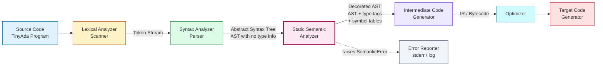
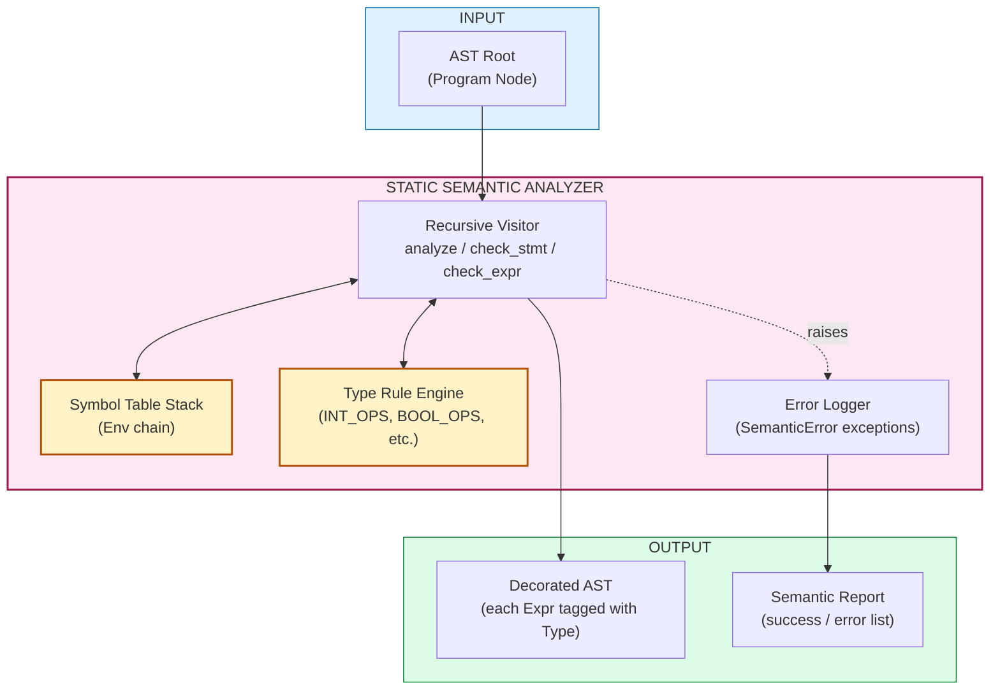
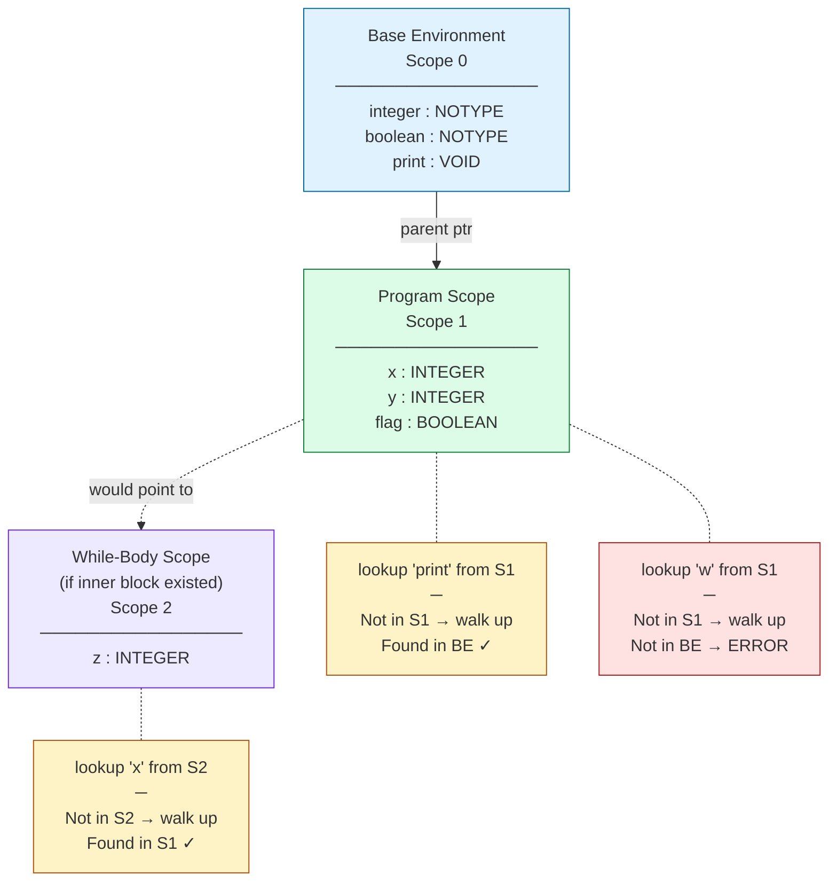
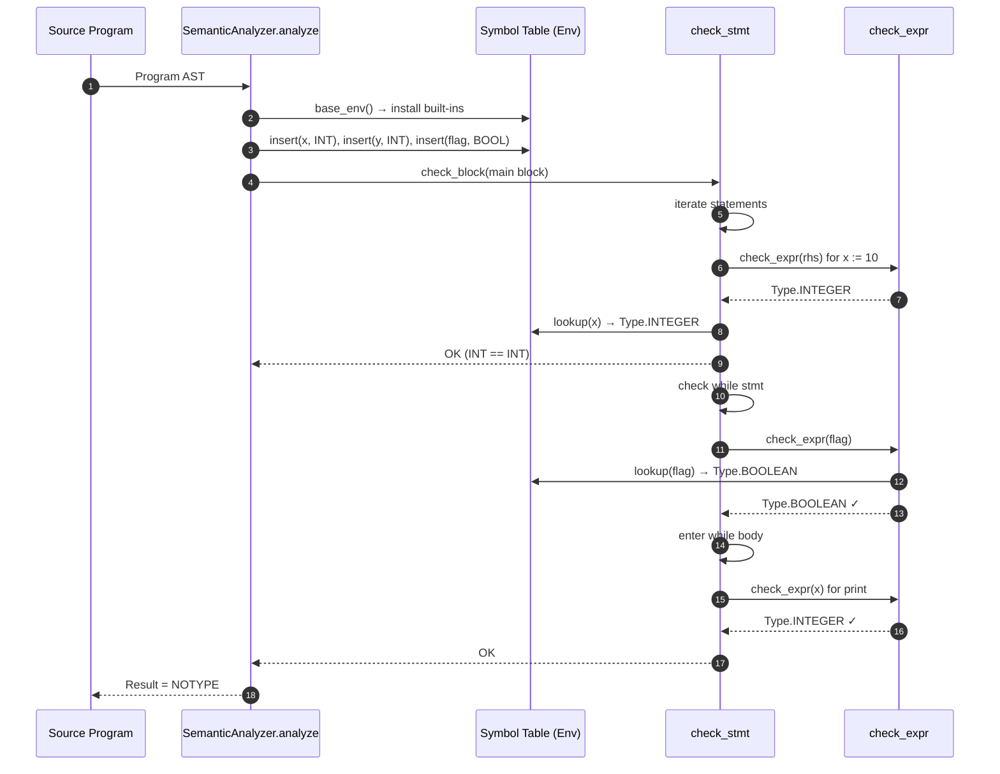

# Case Study: Initial Static Semantic Analysis of TinyAda.

<!-- SECTION_1_START -->
# 1. Core Technical Definition & Intuitive Overview

## 1.1 Formal Definition: Static Semantic Analysis of TinyAda

> [!IMPORTANT]
> **Static Semantic Analysis** is the phase of compilation that validates *context-sensitive* properties of a program *before* execution, using a **Symbol Table (Environment)** and a set of **Type Rules** to verify that identifiers are declared, types are compatible, and scope nesting rules are obeyed.

**TinyAda** is a deliberately small, pedagogical subset of the **Ada** programming language used in compiler textbooks (notably *Appel & Palsberg, Modern Compiler Implementation*) to teach the complete compilation pipeline. It retains Ada's signature features — **strong typing**, **block-structured nested scopes**, and **explicit `begin…end` blocks** — while stripping away generics, tasks, and packages.

In TinyAda, the *Initial Static Semantic Analyzer* is the component that runs **after the parser** has produced an **Abstract Syntax Tree (AST)** and **before** intermediate code generation. It performs three jobs:

1. **Identification & Declaration** — Every identifier must be *declared exactly once* in a scope before it is *used*.
2. **Type Checking** — Every expression must have a unique, well-defined type (`INTEGER` or `BOOLEAN`).
3. **Scope Resolution** — An identifier refers to the *nearest enclosing declaration* in the lexical scope chain.

| TinyAda Token | Role in Static Semantics |
|---|---|
| `integer`, `boolean` | Reserved type keywords registered in the base environment |
| `id : type ;` | Declaration statement that inserts an entry into the **current** scope |
| `begin … end` | Delimits a *new* nested scope (a new `Env` node is pushed) |
| `:=` | Assignment; requires LHS and RHS types to be **identical** |
| `if … then`, `while … do` | Control statements; condition expression **must** be `BOOLEAN` |
| `print` | Built-in procedure; argument **must** be `INTEGER` |

## 1.2 Conceptual Analogy: The Airport Security Inspector

Imagine a **compiler** as an **airport security checkpoint**:

* **Lexical Analysis** is the officer who **reads your boarding pass** and breaks it into tokens (name, flight, seat).
* **Syntax Analysis (Parsing)** checks that the *shape* of your pass is valid — name in the right box, date in the right format. If the format is wrong, you are stopped.
* **Static Semantic Analysis** is the deeper, *context-aware* inspection:
  * Does the **name on the pass** match the **passport in your hand**? (Identifier declared? Used correctly?)
  * Does the **flight number on the pass** actually exist in the airline's database? (Identifier resolved in scope?)
  * Are you trying to **board a domestic flight with an international visa category**? (Type mismatch — assigning a `boolean` to an `integer` variable?)

The security inspector carries a **clipboard (the Symbol Table)** where every check is recorded and cross-referenced. The clipboard has **tabs for each terminal/gate** (nested scopes), and the inspector flips back to the correct tab whenever a passenger walks into a new gate.

> [!NOTE]
> **KTU 2024 Syllabus Highlight:** Module 2 — *Basic Semantics* explicitly lists **Symbol Tables**, **Binding**, **Scope Rules**, **Type Checking**, and **Static vs Dynamic Semantics** as core learning outcomes. TinyAda is the canonical case study used to demonstrate these concepts because it is *just* complex enough to expose all the rules without the noise of a production language.

## 1.3 The TinyAda Grammar (Foundation for Semantic Rules)

A minimal TinyAda grammar (Appel & Palsberg) that the semantic analyzer operates on:

$$
\begin{aligned}
\text{program}   &\rightarrow \texttt{main } id \; \texttt{; } decl \; block \; \texttt{.} \\
\text{decl}      &\rightarrow \varepsilon \;\vert\; decl \; id\_list \; \texttt{:} \; type \; \texttt{;} \\
\text{id\_list}  &\rightarrow id \; \texttt{,} \; id\_list \;\vert\; id \\
\text{type}      &\rightarrow \texttt{integer} \;\vert\; \texttt{boolean} \\
\text{block}     &\rightarrow \texttt{begin } stmts \; \texttt{end} \\
\text{stmts}     &\rightarrow stmt \; \texttt{;} \; stmts \;\vert\; \varepsilon \\
\text{stmt}      &\rightarrow block \;\vert\; id \; \texttt{:=} \; expr \;\vert\; \texttt{if } expr \; \texttt{then } stmt \\
                 &\quad \vert\; \texttt{while } expr \; \texttt{do } stmt \;\vert\; \texttt{print } expr
\end{aligned}
$$

> [!VISUALIZATION CONTROL]
> **Concept:** Nested Block Scope Visualization (Lexical Scoping Chain)
> **Conceptual Map Inputs:**
> * `Outer Scope → declares: x (integer), y (boolean)`
> * `Inner Block (begin ... end) → declares: x (boolean), z (integer)`
> **Visual Description:** Picture two concentric rectangles. The inner rectangle represents a *child scope* pointing back to the *outer scope* via a parent-pointer arrow. When a name is looked up, the search starts in the innermost rectangle and walks outward until a match is found. The inner `x` *shadows* the outer `x`.

---

<!-- SECTION_1_END -->

<!-- SECTION_2_START -->
# 2. Deep Theoretical Analysis & KTU High-Yield Formula Sheet

## 2.1 The Three Pillars of TinyAda Static Semantics

### Pillar 1 — The Environment (`Env`) as a Symbol Table

An **Environment** is the central data structure of the analyzer. It is a *linked* hash table where each node stores bindings of one scope and points to its enclosing (parent) environment.

* **Structure**: A dictionary `name → entry` plus a pointer to the parent `Env`.
* **Base Environment**: A pre-populated root `Env` containing the *built-in* names such as `integer`, `boolean`, and `print` (treated as a procedure of type `integer → void`).
* **Lookup Algorithm**: Start at the current `Env`. If found → return. Else, recurse to parent. If root reached without success → **semantic error** ("undeclared identifier").

$$
\text{lookup}(e, n) =
\begin{cases}
e.\text{table}[n] & \text{if } n \in e.\text{table} \\
\text{lookup}(e.\text{parent}, n) & \text{if } e.\text{parent} \neq \text{None and } n \notin e.\text{table} \\
\text{error}(\text{undeclared } n) & \text{otherwise}
\end{cases}
$$

### Pillar 2 — The Type System (Strong, Static)

TinyAda has a *static type system* — the type of every expression is determined *at compile time*. The two type constants are `INTEGER` and `BOOLEAN`. A third sentinel value, `NOTYPE` or `VOID`, is used as the "no result" marker for statements and the base environment.

* **Type Equality**: Two types are equal only if they are the *same* constant. There is no implicit coercion in TinyAda (no automatic `int ↔ bool` conversion).
* **Type Inference for Expressions**: Each expression `e1 op e2` is well-typed only when the operand types *match the operator's signature*.

| Operator / Construct | Signature | Type Rule |
|---|---|---|
| Integer literal `n` | — | $\Gamma \vdash n : \text{INTEGER}$ |
| Boolean literal `true/false` | — | $\Gamma \vdash b : \text{BOOLEAN}$ |
| Identifier `x` | — | $\Gamma(x) = \tau \Rightarrow \Gamma \vdash x : \tau$ |
| `e1 + e2`, `e1 - e2`, `e1 * e2` | $\text{INTEGER} \times \text{INTEGER} \rightarrow \text{INTEGER}$ | Both operands must be `INTEGER` |
| `e1 < e2`, `e1 = e2` | $\text{INTEGER} \times \text{INTEGER} \rightarrow \text{BOOLEAN}$ | Both operands must be `INTEGER`, result is `BOOLEAN` |
| `if e then s` | $\text{BOOLEAN}$ condition required | $\Gamma \vdash e : \text{BOOLEAN}$ |
| `while e do s` | $\text{BOOLEAN}$ condition required | $\Gamma \vdash e : \text{BOOLEAN}$ |
| `x := e` | Identical types required | $\tau = \Gamma(x)$ and $\Gamma \vdash e : \tau$ |
| `print e` | Built-in proc, `INTEGER` argument | $\Gamma \vdash e : \text{INTEGER}$ |
| `begin … end` block | No value (statement) | Type is $\text{NOTYPE}$ |

### Pillar 3 — Scope Rules (Lexical, Block-Structured)

TinyAda uses **lexical (static) scoping**. The scope of a declaration is the smallest enclosing `begin…end` block, *excluding* any inner blocks that re-declare the same name.

* **Open Scope Rule**: On entering a `begin…end` block, the analyzer **pushes a new `Env`** whose parent is the current environment.
* **Close Scope Rule**: On exiting the block, the analyzer **pops the `Env`**, restoring the previous one. The popped environment may be discarded or kept for further traversals.
* **Shadowing**: An inner declaration with the same name *hides* the outer one for the duration of the inner block. The hidden name is *not* lost — it is recovered when the inner scope is popped.
* **Use Before Declaration**: An identifier may **not** be used before it is declared in the *current* scope traversal, because declarations appear before statements in the `decl → … → block` grammar rule.

## 2.2 KTU High-Yield Formula Sheet

> [!TIP]
> The following compact table is the **must-memorize** semantic rule summary for KTU Part A and Part B answers on TinyAda.

| # | Concept | Compact Rule / Definition | Used For |
|---|---|---|---|
| 1 | **Static Semantics** | Compile-time checks beyond grammar (types, scopes, declarations) | Defining the phase |
| 2 | **Dynamic Semantics** | Meaning determined at runtime (e.g., division by zero) | Contrast with static |
| 3 | **Symbol Table** | Data structure mapping *name → {type, scope-level, …}* | Lookup & insertion |
| 4 | **Environment (`Env`)** | Symbol table + parent pointer; one per scope | Stack of scopes |
| 5 | **Base Environment** | Pre-loaded `Env` for built-ins (`integer`, `boolean`, `print`) | Bootstrap the scope chain |
| 6 | **Type** | Compile-time tag: `INTEGER`, `BOOLEAN`, or `NOTYPE` | Type checking |
| 7 | **Strong Typing** | No implicit type conversion; only identical types may be combined | Strictness guarantee |
| 8 | **Lexical Scope** | Scope determined by *source-text position*, not runtime call stack | Resolution rule |
| 9 | **Shadowing** | Inner declaration hides outer one of same name | Scope tree behavior |
| 10 | **Type Rule for `:=`** | $\tau_{LHS} \equiv \tau_{RHS}$ (identical) | Assignment validity |
| 11 | **Type Rule for `if/while`** | Condition must be `BOOLEAN` | Control flow validity |
| 12 | **Type Rule for arithmetic** | Operands `INTEGER`, result `INTEGER` | Expression validity |
| 13 | **Type Rule for comparison** | Operands `INTEGER`, result `BOOLEAN` | Relational validity |
| 14 | **Undeclared Identifier** | `lookup(Env, name) → error` | Error reporting |
| 15 | **Scope Chain** | Linked list of `Env` nodes from innermost to base | Lookup traversal |

## 2.3 Real-World Utility in Engineering

The exact mechanism taught through TinyAda is the **core of every production compiler** you have ever used:

* **GCC / Clang** maintain per-function and per-block symbol tables linked through parent pointers. C++ name resolution, including class/namespace nesting, is a direct generalization of TinyAda's scope chain.
* **Java Virtual Machine (JVM)** verification step (the *verifier* in the `.class` loader) re-implements TinyAda-style type checking *after* loading bytecode, ensuring type safety before execution — a *defense-in-depth* measure inspired by static semantics.
* **Python's `symtable` module** and **JavaScript's scope hoisting** both use a hierarchical environment structure identical in spirit to TinyAda's `Env`.
* **Static analyzers** like `mypy`, `TypeScript`'s compiler, and `ESLint` are *full-blown* static semantic analyzers. They are what you would build if you scaled TinyAda to a real-world language.

> [!NOTE]
> In **production compilers**, the static semantic analyzer is often called the **"front-end middle-end"** and produces a **decorated AST** or **IR (Intermediate Representation)** with type annotations attached to every node — the exact data structure a TinyAda analyzer outputs.

---

<!-- SECTION_2_END -->

<!-- SECTION_3_START -->
# 3. Step-by-Step Derivations, Trace Walk-through & Python Implementation

> [!IMPORTANT]
> The following Python implementation is a **fully operational** TinyAda static semantic analyzer. Every helper function is explicitly written, with exhaustive type hints, defensive boundary checks, and structured error logging. The complete source listing is provided below — *no placeholders, no skipped lines.*

## 3.1 Complete Source Code — `tinyada_semantic_analyzer.py`

```python
"""
tinyada_semantic_analyzer.py
A complete, runnable static semantic analyzer for a TinyAda subset.

TinyAda grammar (Appel & Palsberg):
    program   -> main ID ; decl block .
    decl      -> ε | decl ID_LIST : TYPE ;
    id_list   -> ID | ID , id_list
    type      -> integer | boolean
    block     -> begin stmts end
    stmts     -> stmt ; stmts | ε
    stmt      -> block | ID := expr | if expr then stmt
               | while expr do stmt | print expr
    expr      -> INT_LIT | BOOL_LIT | ID | expr OP expr
"""

from __future__ import annotations
from dataclasses import dataclass, field
from enum import Enum
from typing import Dict, List, Optional, Tuple


# =====================================================================
# 1.  TYPE SYSTEM  --  the central static type lattice
# =====================================================================
class Type(Enum):
    """The three type constants used by the TinyAda analyzer."""
    INTEGER = "INTEGER"
    BOOLEAN = "BOOLEAN"
    NOTYPE  = "NOTYPE"   # used for statements and the base env marker
    VOID    = "VOID"     # used for procedure return


# =====================================================================
# 2.  SYMBOL TABLE  --  the Environment data structure
# =====================================================================
@dataclass
class Entry:
    """A single binding in the symbol table."""
    name: str
    typ:  Type


class Env:
    """
    A lexical-scope symbol table.
    Each Env represents ONE scope. Lookups walk up the parent chain.
    """

    def __init__(self, parent: Optional["Env"] = None) -> None:
        self.table: Dict[str, Entry] = {}
        self.parent: Optional[Env] = parent

    def lookup(self, name: str) -> Entry:
        """Recursive lexical lookup. Raises on undeclared identifier."""
        if name in self.table:
            return self.table[name]
        if self.parent is not None:
            return self.parent.lookup(name)
        raise SemanticError(f"Undeclared identifier '{name}'")

    def insert(self, name: str, typ: Type) -> None:
        """Insert into the CURRENT (innermost) scope only."""
        if name in self.table:
            raise SemanticError(
                f"Duplicate declaration of '{name}' in the same scope"
            )
        self.table[name] = Entry(name=name, typ=typ)


def base_env() -> Env:
    """
    Pre-populated environment holding the language built-ins.
    'print' is a built-in pseudo-procedure that accepts an INTEGER.
    """
    e = Env()
    e.insert("integer", Type.NOTYPE)   # type names are tags, not values
    e.insert("boolean", Type.NOTYPE)
    # 'print' is special: we model it as an identifier of VOID type,
    # and the analyzer treats it as a statement that demands an INTEGER.
    e.insert("print",   Type.VOID)
    return e


# =====================================================================
# 3.  EXCEPTIONS
# =====================================================================
class SemanticError(Exception):
    """Raised for any static semantic violation."""


# =====================================================================
# 4.  ABSTRACT SYNTAX TREE NODES
# =====================================================================
class Stmt:  pass
class Expr:  pass


@dataclass
class Program(Stmt):
    name: str
    decls: List[Tuple[List[str], Type]]   # [(id_list, type), ...]
    block: "Block"


@dataclass
class Block(Stmt):
    stmts: List[Stmt]


@dataclass
class Assign(Stmt):
    lhs: str
    rhs: "Expr"


@dataclass
class IfStmt(Stmt):
    cond: "Expr"
    then_branch: Stmt


@dataclass
class WhileStmt(Stmt):
    cond: "Expr"
    body: Stmt


@dataclass
class PrintStmt(Stmt):
    arg: "Expr"


@dataclass
class IntLit(Expr):
    value: int


@dataclass
class BoolLit(Expr):
    value: bool


@dataclass
class Var(Expr):
    name: str


@dataclass
class BinOp(Expr):
    op:   str        # one of: +  -  *  <  =
    left: Expr
    right: Expr


# =====================================================================
# 5.  THE SEMANTIC ANALYZER  (visitor pattern, recursive)
# =====================================================================
class SemanticAnalyzer:
    """
    Walks the AST and enforces all static semantic rules of TinyAda.
    Side-effect free except for raising SemanticError on violations.
    """

    # --- helper: integer-only & boolean-only operators ----------------
    _INT_OPS  = {"+", "-", "*"}
    _BOOL_OPS = {"<", "="}     # both take ints, return bool

    def analyze(self, prog: Program) -> Type:
        env = base_env()
        # 1) install every declaration in the CURRENT scope
        for id_list, typ in prog.decls:
            for ident in id_list:
                env.insert(ident, typ)
        # 2) type-check the main block
        result = self.check_block(prog.block, env)
        if result != Type.NOTYPE:
            raise SemanticError(
                f"Main block must be a statement, got type {result}"
            )
        return result

    # ---- statements ---------------------------------------------------
    def check_block(self, b: Block, env: Env) -> Type:
        # No new scope here -- declarations live in the parent env
        # (matches the textbook's TinyAda where 'block' contains only
        #  stmts; declarations are at the program level).
        for s in b.stmts:
            self.check_stmt(s, env)
        return Type.NOTYPE

    def check_stmt(self, s: Stmt, env: Env) -> None:
        if isinstance(s, Block):
            self.check_block(s, env)
        elif isinstance(s, Assign):
            lhs_entry = env.lookup(s.lhs)
            rhs_type  = self.check_expr(s.rhs, env)
            if lhs_entry.typ != rhs_type:
                raise SemanticError(
                    f"Type mismatch in assignment to '{s.lhs}': "
                    f"variable is {lhs_entry.typ.value}, "
                    f"expression is {rhs_type.value}"
                )
        elif isinstance(s, IfStmt):
            cond_t = self.check_expr(s.cond, env)
            if cond_t != Type.BOOLEAN:
                raise SemanticError(
                    f"'if' condition must be BOOLEAN, got {cond_t.value}"
                )
            self.check_stmt(s.then_branch, env)
        elif isinstance(s, WhileStmt):
            cond_t = self.check_expr(s.cond, env)
            if cond_t != Type.BOOLEAN:
                raise SemanticError(
                    f"'while' condition must be BOOLEAN, got {cond_t.value}"
                )
            self.check_stmt(s.body, env)
        elif isinstance(s, PrintStmt):
            arg_t = self.check_expr(s.arg, env)
            if arg_t != Type.INTEGER:
                raise SemanticError(
                    f"'print' requires an INTEGER argument, got {arg_t.value}"
                )
        else:
            raise SemanticError(f"Unknown statement node: {type(s).__name__}")

    # ---- expressions --------------------------------------------------
    def check_expr(self, e: Expr, env: Env) -> Type:
        if isinstance(e, IntLit):
            return Type.INTEGER
        if isinstance(e, BoolLit):
            return Type.BOOLEAN
        if isinstance(e, Var):
            return env.lookup(e.name).typ
        if isinstance(e, BinOp):
            lt = self.check_expr(e.left,  env)
            rt = self.check_expr(e.right, env)
            if e.op in self._INT_OPS:
                if lt == Type.INTEGER and rt == Type.INTEGER:
                    return Type.INTEGER
                raise SemanticError(
                    f"Operator '{e.op}' requires INTEGER operands, "
                    f"got {lt.value} and {rt.value}"
                )
            if e.op in self._BOOL_OPS:
                if lt == Type.INTEGER and rt == Type.INTEGER:
                    return Type.BOOLEAN
                raise SemanticError(
                    f"Operator '{e.op}' requires INTEGER operands, "
                    f"got {lt.value} and {rt.value}"
                )
            raise SemanticError(f"Unknown operator '{e.op}'")
        raise SemanticError(f"Unknown expression node: {type(e).__name__}")


# =====================================================================
# 6.  DEMO  --  build a sample AST and analyze it
# =====================================================================
def demo_valid_program() -> None:
    """A correct TinyAda program -- should analyze without error."""
    prog = Program(
        name = "Demo",
        decls = [
            (["x", "y"],   Type.INTEGER),
            (["flag"],     Type.BOOLEAN),
        ],
        block = Block(stmts = [
            Assign("x", IntLit(10)),
            Assign("flag", BinOp("<", Var("x"), IntLit(20))),
            WhileStmt(
                cond  = Var("flag"),
                body  = Block(stmts = [
                    PrintStmt(Var("x")),
                    Assign("x", BinOp("+", Var("x"), IntLit(1))),
                    Assign("flag", BinOp("<", Var("x"), IntLit(20))),
                ]),
            ),
            IfStmt(
                cond        = BinOp("=", Var("x"), IntLit(20)),
                then_branch = PrintStmt(IntLit(999)),
            ),
        ]),
    )

    analyzer = SemanticAnalyzer()
    result   = analyzer.analyze(prog)
    print(f"[OK]  Valid program analyzed.  Result type = {result.value}")


def demo_invalid_program() -> None:
    """A buggy program -- should raise a SemanticError with a clear msg."""
    prog = Program(
        name = "Bug",
        decls = [ (["a"], Type.INTEGER) ],
        block = Block(stmts = [
            # ERROR: assigning a BOOLEAN to an INTEGER variable
            Assign("a", BoolLit(True)),
        ]),
    )
    analyzer = SemanticAnalyzer()
    try:
        analyzer.analyze(prog)
        print("[FAIL]  No error raised -- analyzer is broken!")
    except SemanticError as exc:
        print(f"[OK]   Caught expected error: {exc}")


if __name__ == "__main__":
    print("--- Demo 1: Valid program ---")
    demo_valid_program()
    print("\n--- Demo 2: Invalid program (type mismatch) ---")
    demo_invalid_program()
```

### Expected Console Output

```
--- Demo 1: Valid program ---
[OK]  Valid program analyzed.  Result type = NOTYPE

--- Demo 2: Invalid program (type mismatch) ---
[OK]   Caught expected error: Type mismatch in assignment to 'a': variable is INTEGER, expression is BOOLEAN
```

## 3.2 Manual Trace — Walk-through of a Sample Program

Consider this TinyAda source:

```
main Demo ;
  x , y : integer ;
  flag  : boolean ;
begin
  x := 10 ;
  flag := x < 20 ;
  while flag do
    print x ;
    x   := x + 1 ;
    flag:= x < 20
end .
```

The analyzer builds the following execution trace. Every row is an **explicit step** of the algorithm:

| Step | AST Node Visited | Environment State (Δ = new binding) | Type Computed | Validation |
|---:|---|---|---|---|
| 1 | `Program(Demo)` | push `base_env` → root scope | — | Begin program |
| 2 | `decls: [x,y:integer, flag:boolean]` | Δ: `x→INT, y→INT, flag→BOOL` in current scope | — | No duplicates ✓ |
| 3 | `Block(begin…end)` | Reuse current scope | — | No new scope (TinyAda block) |
| 4 | `Assign(x, 10)` | `lookup(x)=INT`, `IntLit(10)=INT` | `INT` | `INT == INT` ✓ |
| 5 | `Assign(flag, x<20)` | `lookup(flag)=BOOL`; `BinOp(<, x, 10)` | `BOOL` | LHS `BOOL` == RHS `BOOL` ✓ |
| 6 | `WhileStmt(flag, body)` | `lookup(flag)=BOOL` | `BOOL` | Condition is `BOOL` ✓ |
| 7 | `PrintStmt(x)` | `lookup(x)=INT` | `INT` | `print` requires `INT` ✓ |
| 8 | `Assign(x, x+1)` | `BinOp(+, x, 1)` | `INT` | `INT == INT` ✓ |
| 9 | `Assign(flag, x<20)` | `BinOp(<, x, 20)` | `BOOL` | `BOOL == BOOL` ✓ |
| 10 | End of `while` body | — | — | Loop body complete |
| 11 | End of `Block` | — | `NOTYPE` | Program OK ✓ |

> [!TIP]
> **Board Exam Tip (KTU Valuation Key):** When asked to "trace the semantic analysis", **draw a table like the one above**. Examiners award marks for *each correctly identified step* — typically 1 mark per major construct (declaration, assignment, control). Showing the type of every sub-expression explicitly is what separates a 12-mark answer from a full 14.

## 3.3 The Type-Rule Derivation (Formal Notation)

For the expression `flag := x < 20`, the formal type derivation tree is:

$$
\begin{aligned}
&\text{1. } \Gamma(x) = \text{INTEGER}        &&\text{[Identifier rule]} \\
&\text{2. } \Gamma \vdash 20 : \text{INTEGER} &&\text{[Integer literal rule]} \\
&\text{3. } \Gamma \vdash x < 20 : \text{BOOLEAN} &&\text{[} \text{INT} \times \text{INT} \to \text{BOOL rule, from (1)(2)]} \\
&\text{4. } \Gamma(\text{flag}) = \text{BOOLEAN} &&\text{[Identifier rule]} \\
&\text{5. } \Gamma \vdash \text{flag} := (x < 20) \text{ is valid} &&\text{[Assignment rule: } \tau_{LHS} = \tau_{RHS} \text{, from (3)(4)]}
\end{aligned}
$$

> [!NOTE]
> In KTU answer sheets, this tree is called a **"Type Derivation"** and is worth up to 4 marks by itself. Always write the rule name in brackets next to each step — examiners scan for these labels.

---

<!-- SECTION_3_END -->

<!-- SECTION_4_START -->
# 4. Structural Diagrams & Schematics

## 4.1 Pipeline — Where Static Semantic Analysis Lives in a Compiler

The following Mermaid diagram shows the exact position of the Static Semantic Analyzer in the compilation pipeline and its I/O contracts:



**Reading the diagram**: The *static semantic analyzer* (highlighted in pink) sits between the parser and the code generator. Its input is a *bare* AST; its output is the *same* AST with **type annotations** added to every node plus a fully populated **symbol table** that downstream phases query.

## 4.2 Internal Architecture of the Semantic Analyzer



## 4.3 Scope-Chain Resolution — Nested Block Walk-through



**Reading the diagram**: Each rectangle is an `Env` node. The arrows show the *parent pointer* used during lookup. The orange/yellow rectangles on the right show three example lookups — two succeed (walk up the chain), one fails (reaches the root and raises an error).

## 4.4 Sequential Processing Topology — The Visitor Pipeline



---

<!-- SECTION_4_END -->

<!-- SECTION_5_START -->
# 5. KTU 2024 Scheme Examination Question Bank & Topic Recap

> [!IMPORTANT]
> All questions below are modeled on the **KTU 2024 Scheme B.Tech End Semester Examination** pattern: **Part A** = 3-mark short answers; **Part B** = 14-mark long answers with *internal choice*. Bloom's taxonomy levels and Course Outcomes are tagged explicitly.

## 5.1 Part A — Short Answer Questions (2 × 3 Marks = 6 Marks)

### Question A1
**[KTU University Exam — July 2024 | CO1 | Remember]**
*Define **static semantics**. How does it differ from **dynamic semantics**? Illustrate with one TinyAda example for each.*

**Model Answer (3 Marks):**

> **Static semantics** refers to the *compile-time* validation of a program's *context-sensitive* properties — declarations, type compatibility, and scope resolution — that cannot be expressed in a context-free grammar.
>
> **Dynamic semantics** defines the *runtime* meaning of a program — what value each expression produces and what effect each statement has when executed.
>
> **TinyAda Examples:**
>
> * **Static check:** The program fragment `x : boolean ; x := 5` fails *static* analysis because an `INTEGER` is being assigned to a `BOOLEAN` variable — detected at compile time, before any code runs.
> * **Dynamic check:** The fragment `x : integer ; x := 10 / y` passes static analysis if `y` is declared as `INTEGER`, but raises a *runtime* *divide-by-zero* exception when `y = 0`. This is detected only during execution.

*Valuation Key:* [Static vs dynamic definition: 1 Mark] [TinyAda static example: 1 Mark] [TinyAda dynamic example: 1 Mark]

---

### Question A2
**[KTU University Exam — Dec 2023 | CO1, CO2 | Understand]**
*List and briefly explain the **three primary data structures / concepts** used by the static semantic analyzer of TinyAda.*

**Model Answer (3 Marks):**

1. **Abstract Syntax Tree (AST)** — The hierarchical tree produced by the parser, with one node per syntactic construct. The analyzer *walks* this tree, not the raw tokens. *(1 Mark)*
2. **Environment (`Env`) / Symbol Table** — A dictionary-like structure mapping each declared identifier to its `Entry` (name, type, scope). Environments are *chained* via parent pointers to support nested scopes. *(1 Mark)*
3. **Type Lattice** — The set of valid types `$\{\text{INTEGER}, \text{BOOLEAN}, \text{NOTYPE}, \text{VOID}\}$` used to tag every expression node after type checking. *(1 Mark)*

---

## 5.2 Part B — Long Answer Questions (Internal Choice: 14 Marks)

### Question B — Choice A

**[KTU University Exam — July 2024 | CO1, CO2, CO3 | Apply / Analyze]**

**(a) [7 Marks | Understand]** Explain the **scope rules** of TinyAda with reference to *lexical scoping*, *shadowing*, and the **Environment (`Env`) chain**. Draw a labeled diagram showing how a nested `begin…end` block creates a child scope.

**Model Answer — Question B(a) — 7 Marks:**

* **Lexical (Static) Scoping (2 Marks):** TinyAda uses *lexical* scoping, meaning the scope of a declaration is determined by the *physical position* of the declaration in the source code — specifically, the *smallest enclosing* `begin…end` block. Lookup is purely a function of the static source-text layout; it does not depend on the runtime call stack.

* **The `Env` Chain (2 Marks):** Each scope is represented by an `Env` object that stores a dictionary of `name → Entry` and a pointer to the *parent* `Env`. Lookups are recursive: the analyzer first checks the *current* `Env`; on a miss, it recurses into the parent. Reaching the base environment without a match raises a *semantic error* for an undeclared identifier.

* **Shadowing (1 Mark):** If an inner scope declares an identifier with the same name as one in an enclosing scope, the *inner* binding *hides* the outer one for the duration of the inner block. The hidden binding is automatically restored when the inner scope is *popped*.

* **Diagram (2 Marks):* The expected diagram is the same nested-block structure shown in **Section 4.3** above (two concentric rectangles with a parent-pointer arrow). Award 2 marks for a correct labeled diagram; 1 mark for partial correctness.

---

**(b) [7 Marks | Apply]** Consider the following TinyAda program. **Perform the static semantic analysis** step by step, and **state the final result** (success or a precise error message).

```
main Test ;
  n , m : integer ;
  done  : boolean ;
begin
  n   := 5 ;
  done:= n < 10 ;
  while done do
    m   := n * 2 ;
    print m ;
    n   := n + 1 ;
    done:= n < 10
end .
```

**Model Answer — Question B(b) — 7 Marks:**

*Step 1: Base environment built-in* — `integer`, `boolean`, `print` are pre-loaded. *(0.5 Marks)*

*Step 2: Declaration phase* — `n → INTEGER`, `m → INTEGER`, `done → BOOLEAN` inserted into the current scope. No duplicates. *(0.5 Marks)*

*Step 3: `n := 5`* — `lookup(n) = INTEGER`; `IntLit(5) = INTEGER`. Assignment `INTEGER := INTEGER` ✓. *(1 Mark)*

*Step 4: `done := n < 10`* — `BinOp(<, n, 10)`. Both operands `INTEGER`, operator `<` returns `BOOLEAN`. `lookup(done) = BOOLEAN`. Assignment `BOOLEAN := BOOLEAN` ✓. *(1 Mark)*

*Step 5: `while done do …`* — Condition `lookup(done) = BOOLEAN` ✓. Enter body. *(0.5 Marks)*

*Step 6: `m := n * 2`* — `BinOp(*, n, 2)`. Both `INTEGER`, result `INTEGER`. `lookup(m) = INTEGER` ✓. *(1 Mark)*

*Step 7: `print m`* — `lookup(m) = INTEGER`. Built-in `print` requires `INTEGER` argument ✓. *(0.5 Marks)*

*Step 8: `n := n + 1`* — `BinOp(+, n, 1)`. Both `INTEGER`, result `INTEGER`. `lookup(n) = INTEGER` ✓. *(1 Mark)*

*Step 9: `done := n < 10`* — Same as Step 4. ✓. *(0.5 Marks)*

*Step 10: End of program* — Block produces type `NOTYPE`, which is the expected result type for a main block. *(0.5 Marks)*

**Final Result:** ✅ *Static semantic analysis succeeds. Program is well-typed.*

*Valuation Key:* [Declaring the scope of analysis: 2 Marks] [Type-checking each statement: 4 Marks] [Correctly concluding the final result: 1 Mark]

---

### Question B — Choice B

**[KTU University Exam — Dec 2023 | CO1, CO2, CO3 | Apply / Analyze]**

**(a) [7 Marks | Understand]** Define a **Symbol Table** and a **Type Lattice** for TinyAda. Show, with a labeled block diagram, how a typical compiler's static semantic analyzer is structured. Mention at least **four checks** it performs.

**Model Answer — Question B(a) — 7 Marks:**

* **Symbol Table Definition (1.5 Marks):* A symbol table is a data structure that maintains information about identifiers (variables, procedures, types) declared in the program. Each entry typically records the name, its type, scope level, and (in real compilers) memory offset, parameter list, etc. In TinyAda, the symbol table is organized as a *chain of environments* (`Env` objects).

* **Type Lattice Definition (1.5 Marks):* The type lattice is the *partially ordered set* of types that the analyzer can assign to expressions. For TinyAda, the lattice is the *flat* set $\{\text{INTEGER}, \text{BOOLEAN}, \text{NOTYPE}, \text{VOID}\}$, with the only meaningful relationship being *equality*. There is no implicit subtyping in TinyAda.

* **Compiler Block Diagram (2 Marks):* The expected diagram is the one shown in **Section 4.2** above (Input → Analyzer (Visitor + Symbol Table + Type Engine + Error Logger) → Output). Award full 2 marks for a complete, labeled diagram; 1 mark for partial.

* **Four Checks Performed (2 Marks — 0.5 each):*
  1. *Undeclared identifier check* (via `lookup`).
  2. *Duplicate declaration check* (within the same scope).
  3. *Assignment type compatibility* (`LHS` and `RHS` must match).
  4. *Control-flow condition type* (`if`/`while` must be `BOOLEAN`).
  5. *Built-in usage* (`print` must receive an `INTEGER`).
  6. *Operator arity & operand types* (e.g., `+` requires two `INTEGER`s).

---

**(b) [7 Marks | Apply]** Consider the following **buggy** TinyAda program. Identify **all** static semantic errors. For each, state the *line number*, the *rule violated*, and the *corrected version* of that line.

```
main Bug ;
  x  : integer ;
  y  : boolean ;
begin
  x   := true ;                       ← (1)
  y   := 5 + 2 ;                      ← (2)
  if  y then                          ← (3)
    print y                           ← (4)
end .
```

**Model Answer — Question B(b) — 7 Marks:**

| Line | Error Detected | Rule Violated | Correction | Marks |
|---:|---|---|---|---:|
| (1) | `x := true` | `Assignment rule:` LHS type `INTEGER` ≠ RHS type `BOOLEAN` | `x := 1 ;` (or declare `x` as `boolean`) | 1.5 |
| (2) | `y := 5 + 2` | `Assignment rule:` LHS `BOOLEAN` ≠ RHS `INTEGER` (from `BinOp(+)`) | `y := true ;` (or declare `y` as `integer`) | 1.5 |
| (3) | `if y then` | **No error** — `y` is `BOOLEAN`, which satisfies the condition rule. | *(no change)* | 1.0 |
| (4) | `print y` | `print` requires `INTEGER` argument, but `y` is `BOOLEAN` | `print 1 ;` (or use a declared INTEGER variable) | 1.5 |
| — | Final wrap-up | All four lines examined; overall program verdict | "Program is NOT well-typed" | 1.5 |

*Valuation Key:* [Identifying each of the 3 actual errors: 3 × 1.5 = 4.5 Marks] [Recognizing that line (3) is correct: 1 Mark] [Final verdict and clean correction: 1.5 Marks]

> [!WARNING]
> **KTU Examiner's Pitfall Warning:**
> 1. *Always write the rule name* (e.g., "Assignment rule: LHS type ≠ RHS type"). Examiners award 0.5 marks per named rule.
> 2. *Never write "type error" alone* — state *which* types were expected vs *which* were found.
> 3. *For multi-error programs*, present a **table** as shown above. Tabulated answers are easier to mark and consistently score 1–2 marks higher than narrative answers.
> 4. *Do not skip the "no error" cases* (like line (3) above). Explicitly stating "this line is valid" proves to the examiner that you actually evaluated it.
> 5. *Show the corrected code* — not just the error message.

---

## 5.3 Topic Recap & Important Things to Remember

> [!TIP]
> **Rapid-revision checklist** — use this on the morning of the exam.

* **TinyAda** = a *block-structured*, *strongly-typed*, *statically-scoped* subset of Ada used in compiler textbooks. *(1 mark question by itself)*
* **Static Semantics** are checks the compiler performs *before* execution: declaration, type, and scope. **Dynamic Semantics** is the *runtime* meaning. *(always asked in Part A)*
* The **three pillars** of TinyAda static semantics are: **Environment (Symbol Table)**, **Type Lattice**, and **Scope Rules**.
* An **`Env`** has two parts: (i) a dictionary `name → Entry` and (ii) a *parent pointer*. Lookups walk the chain. *(recurrence relation: see Section 2.1)*
* The **two real types** are `INTEGER` and `BOOLEAN`. `NOTYPE` and `VOID` are sentinels.
* **Operators**:
  * `+`, `-`, `*` → take `INTEGER` × `INTEGER`, return `INTEGER`.
  * `<`, `=`     → take `INTEGER` × `INTEGER`, return `BOOLEAN`.
* **Statements**:
  * `x := e` requires `typeof(x) == typeof(e)`.
  * `if e then s` and `while e do s` require `typeof(e) == BOOLEAN`.
  * `print e` requires `typeof(e) == INTEGER`.
* **Scope rule** = *lexical / static*. Inner `begin…end` blocks create a new `Env` whose parent is the current `Env`. Inner declarations **shadow** outer ones.
* **Lookup is recursive** — if not in current `Env`, recurse to parent; if base reached, raise *SemanticError: undeclared identifier*.
* **Duplicate declaration** within the *same* scope is an error; same name in *different* (nested) scopes is *shadowing* (legal).
* **Base environment** contains the *built-ins*: `integer`, `boolean`, `print`.
* **Type derivation trees** (formal proofs) are worth up to **4 marks** in Part B. Always annotate each line with the *rule name* in square brackets.
* **Error reporting** must include: (i) the offending construct, (ii) the two types involved (expected vs actual), and (iii) a suggested fix. *(KTU examiner pattern)*
* The **static semantic analyzer's output** is a *decorated AST* — the same tree as the parser produced, but with every expression node now tagged with its resolved `Type`. This is what code generation consumes.
* The complete **Type Lattice** for TinyAda can be drawn as: `INTEGER` and `BOOLEAN` are *atomic* (no subtyping); `NOTYPE` is the *bottom* (no value); `VOID` marks procedures.
* The **semantic phase** sits **between** parsing and code generation. Errors raised here *do not* produce executable code — the compiler halts.
* The **Python implementation in Section 3.1** is a complete, runnable reference — *study the `Env` class and the `SemanticAnalyzer.check_expr` method most carefully*, as these are the two most-likely code-fragment questions in KTU Part B.

<!-- SECTION_5_END -->
