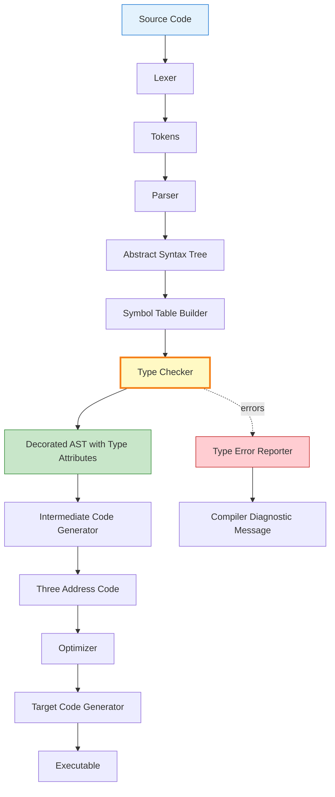
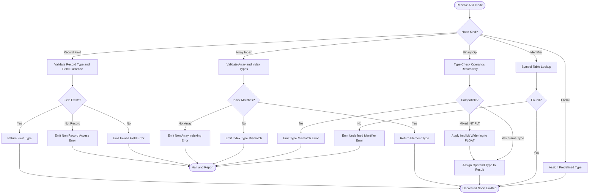
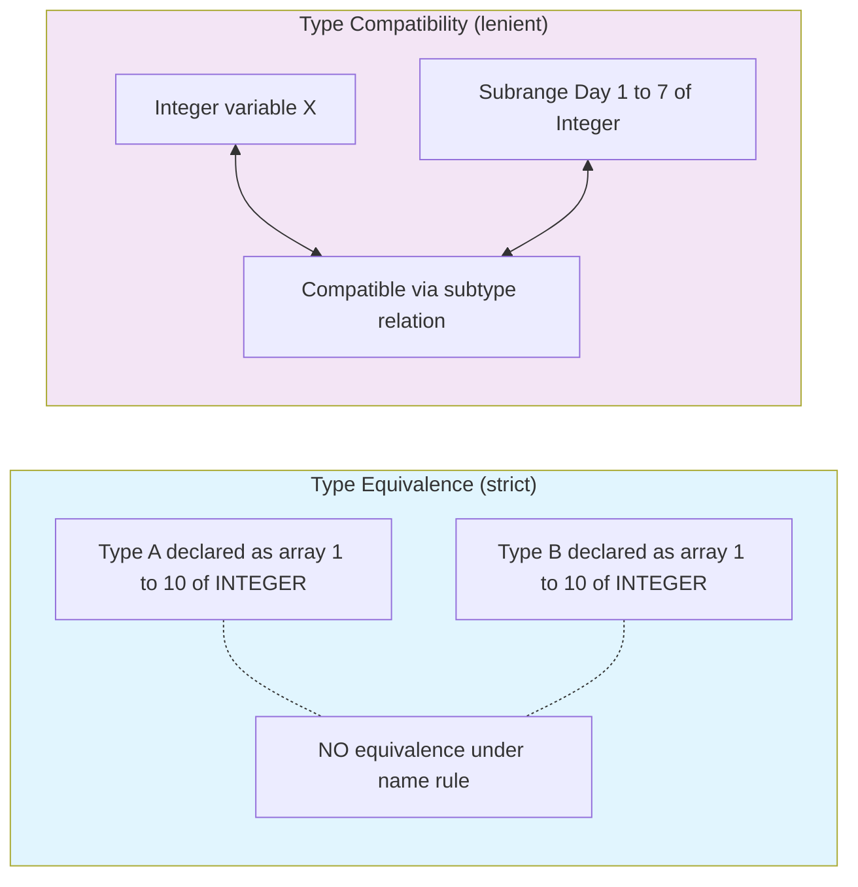
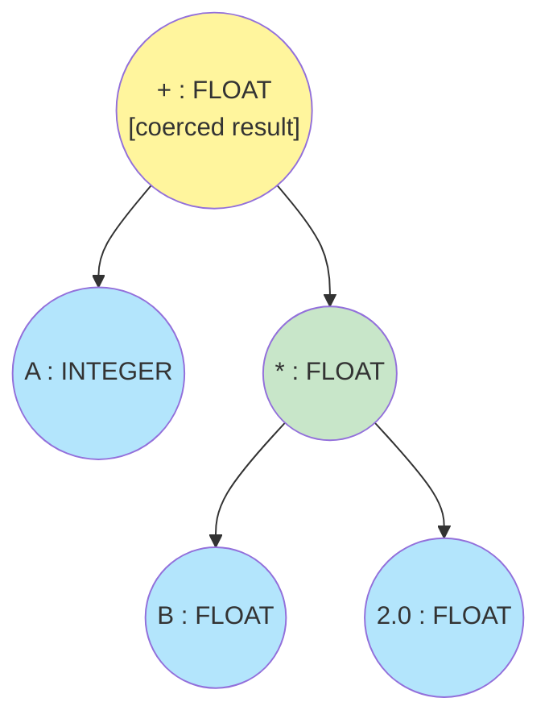
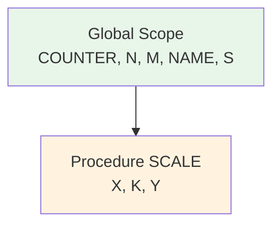

# Case Study: Type Checking in TinyAda.

<!-- SECTION_1_START -->

# Case Study: Type Checking in TinyAda — A Semantics-Driven Approach

## 1.1 Formal Definition (KTU 2024 Syllabus Terminology)

> [!IMPORTANT]
> **Type Checking** is the process of verifying that a program adheres to the **type system rules** of the language, ensuring that every operator receives operands of compatible types and that every declared identifier is used consistently throughout its scope.

In the context of **TinyAda** (a pedagogical subset of Ada used in compiler design courses), type checking is a **static semantic analysis phase** that operates on the **annotated Abstract Syntax Tree (AST)** produced by the parser. Unlike syntax analysis (which deals with the *form* of programs), type checking deals with the *meaning* of identifiers, expressions, and statements according to the language's type rules.

The formal specification of TinyAda's type checker is typically expressed as a set of **type inference rules** of the form:

$$\frac{\text{premise}_1 \quad \text{premise}_2 \quad \dots \quad \text{premise}_n}{\text{conclusion}} \text{ [Rule Name]}$$

These rules define a **logical deduction system** where, given a piece of source code, the type checker *derives* the type of every subexpression and verifies that the derived types satisfy the language's typing constraints.

## 1.2 Intuitive Analogy — The "Club Bouncer" Metaphor

Imagine a programming language as an exclusive nightclub, and the type checker as a **strict bouncer at the door**:

1. **Every patron (value) must carry an ID card (a declared type)**. The bouncer reads the ID before allowing entry into any "ride" (operator or assignment).
2. **Rides have compatibility rules**. A "Division Ride" only admits patrons whose IDs say `INTEGER` (no mixing with `STRING`).
3. **VIP areas (subrange types)** only accept IDs within a specific range — e.g., a `DAY` type (1..7) cannot accept a value of 100.
4. **Family packs (record types)** require all members to be present — accessing a non-existent field is like asking for a sibling that does not exist in the family.
5. **The bouncer never lets in an unverified guest** — if a rule is violated, the type checker emits a compile-time error and halts semantic processing.

This metaphor captures the essence: **type checking is a gatekeeper that enforces semantic correctness before execution**.

## 1.3 The TinyAda Type System — Predefined Types

TinyAda inherits its core type philosophy from Ada, emphasizing **strong, static typing with name equivalence**.

> [!NOTE]
> **Strong Typing**: The compiler rejects any operation involving mixed types unless an explicit conversion is provided. This catches a large class of bugs at compile time.

The predefined types in TinyAda are:

| Type Name | Domain | Description |
|-----------|--------|-------------|
| `INTEGER` | $...\vert -2 \vert -1 \vert 0 \vert 1 \vert 2 \vert ...$ | Discrete, machine-representable whole numbers |
| `FLOAT` | IEEE-754 subset | Approximate real numbers |
| `BOOLEAN` | $\{\text{TRUE}, \text{FALSE}\}$ | Logical values |
| `CHARACTER` | `'a' \dots 'z'`, `'A' \dots 'Z'`, `'0' \dots '9'` | Single printable symbols |
| `STRING` | `CHARACTER` arrays | Finite sequences of characters |

Beyond these, TinyAda allows user-defined types using constructs such as:

- **Enumeration types**: `type COLOR is (RED, GREEN, BLUE);`
- **Subrange types**: `type DAY is 1..7 range 1..31;`
- **Array types**: `type VECTOR is array (1..10) of INTEGER;`
- **Record types**: `type STUDENT is record ID : INTEGER; NAME : STRING(1..20); end record;`

> [!VISUALIZATION CONTROL]
> **Concept:** Type Lattice of TinyAda
> **GeoGebra / Desmos Input Equations:**
> * Discrete points: `(1,0)` labeled `INTEGER`, `(2,0)` labeled `FLOAT`, `(3,0)` labeled `BOOLEAN`, `(4,0)` labeled `CHARACTER`
> * Parent root: `(2, 2)` labeled `UNIVERSAL_TYPE`
> * Edge: Universal type connects to all predefined types
> **Visual Description:** Observe a lattice where `UNIVERSAL_TYPE` is the root, branching downward to atomic types. Subrange and enumeration types are leaf nodes hanging below their base type. This visualizes the **type compatibility hierarchy**.

<!-- SECTION_1_END -->

<!-- SECTION_2_START -->

# Deep Theoretical Analysis & KTU High-Yield Formula Sheet

## 2.1 Phases of the TinyAda Compiler (Where Type Checking Fits)

The TinyAda compilation pipeline is conventionally structured as:

1. **Lexical Analysis** — tokenization of source characters.
2. **Syntax Analysis** — parsing tokens into an AST.
3. **Semantic Analysis (Type Checking)** — annotating the AST with type information and validating type rules.
4. **Intermediate Code Generation** — translating the typed AST to three-address code (TAC).
5. **Optimization & Target Code Generation**.

> [!NOTE]
> The type checker receives the AST as input and produces a **decorated AST** (or symbol-table-annotated AST) as output. Each node in this AST carries a `type` attribute computed via a syntax-directed translation scheme.

## 2.2 The Two Pillars: Type Equivalence & Type Compatibility

These are the most heavily tested concepts in KTU examinations.

### 2.2.1 Type Equivalence

TinyAda (inheriting from Ada) uses **Name Equivalence** as the primary equivalence rule, supplemented by **Structural Equivalence** for specific cases.

| Equivalence Rule | Definition | TinyAda Application |
|------------------|------------|---------------------|
| **Name Equivalence** | Two types are equal iff they have the same name (declared by the same `type` statement). | Used for all user-defined types: `subrange`, `array`, `record`, `enumeration`. |
| **Structural Equivalence** | Two types are equal iff they have the same structure (same base type, same index range, same fields). | Rarely used in TinyAda; reserved for anonymous array types in some variants. |

**Example:**

```ada
type A is array (1..10) of INTEGER;
type B is array (1..10) of INTEGER;
X : A;
Y : B;
X := Y;  -- ILLEGAL under name equivalence! A ≠ B despite identical structure.
```

### 2.2.2 Type Compatibility

Even when two types are *not* equivalent, they may be **compatible** (i.e., allowed in certain contexts). TinyAda's compatibility matrix:

| Context | Allowed If |
|---------|-----------|
| Assignment `:=` | RHS type **equals** LHS type, OR RHS is a **subtype** of LHS, OR explicit conversion is present. |
| Arithmetic `+`, `-`, `*`, `/` | Both operands are the same **numeric** type, OR both belong to the same numeric class (INTEGER/INTEGER, FLOAT/FLOAT). |
| Relational `=`, `<`, `>`, `<=`, `>=` | Both operands are the same type, or both are discrete types, or both are array types of the same shape. |
| Logical `and`, `or`, `not` | Both operands must be `BOOLEAN`. |
| Array indexing | Index expression's type must match the array's index type. |

## 2.3 Type Coercion Rules

> [!IMPORTANT]
> **Type Coercion** is the *implicit* conversion performed by the type checker when mixing numeric types.

TinyAda permits **only one implicit coercion**: `INTEGER` $\rightarrow$ `FLOAT` when an `INTEGER` appears in a context requiring `FLOAT`. The reverse (`FLOAT` $\rightarrow$ `INTEGER`) requires an explicit conversion function (a user-supplied routine or a future language feature, since Ada historically rejects implicit narrowing).

**Coercion Rule (T-COERCE):**

$$\frac{\Gamma \vdash e_1 : \text{INTEGER} \quad \text{context}(e_1) = \text{FLOAT}}{\Gamma \vdash e_1 : \text{FLOAT}}$$

Where $\Gamma$ is the **type environment** (symbol table) mapping identifiers to their types.

## 2.4 The Type Environment $\Gamma$

The type environment is a finite mapping from identifiers to type expressions. It evolves during semantic analysis:

$$\Gamma = \{\, id_1 \mapsto \tau_1,\ id_2 \mapsto \tau_2,\ \dots,\ id_n \mapsto \tau_n \,\}$$

Operations on $\Gamma$:

- **Lookup**: $\Gamma(id)$ returns the type of $id$ (errors if unbound).
- **Extend**: $\Gamma, id : \tau$ adds a new binding, typically when entering a declarative region (a `declare` block, procedure body, or record scope).

## 2.5 KTU Formula & Rule Sheet

> [!IMPORTANT]
> **High-Yield Cheat Sheet for KTU Examinations**

| # | Rule / Concept | Formal Notation | Description |
|---|----------------|------------------|-------------|
| 1 | Type of an integer literal | $\Gamma \vdash n : \text{INTEGER}$ | Literals are typed intrinsically. |
| 2 | Type of a float literal | $\Gamma \vdash f : \text{FLOAT}$ | Decimal/exponent form. |
| 3 | Type of a boolean literal | $\Gamma \vdash b : \text{BOOLEAN}$ | For `TRUE`, `FALSE`. |
| 4 | Identifier lookup | $\Gamma \vdash id : \tau$ iff $id \mapsto \tau \in \Gamma$ | Standard environment lookup. |
| 5 | Arithmetic op (same numeric) | $\dfrac{\Gamma \vdash e_1 : \tau \quad \Gamma \vdash e_2 : \tau \quad \tau \in \{\text{INT},\text{FLT}\}}{\Gamma \vdash e_1 \oplus e_2 : \tau}$ | $\oplus \in \{+,-,*,/\}$ |
| 6 | Mixed INT + FLT | $\dfrac{\Gamma \vdash e_1 : \text{INT} \quad \Gamma \vdash e_2 : \text{FLT}}{\Gamma \vdash e_1 \oplus e_2 : \text{FLT}}$ | Implicit widening coercion. |
| 7 | Relational op | $\dfrac{\Gamma \vdash e_1 : \tau \quad \Gamma \vdash e_2 : \tau \quad \tau \text{ discrete}}{\Gamma \vdash e_1 \bowtie e_2 : \text{BOOLEAN}}$ | $\bowtie \in \{=,\ne,<,>,\le,\ge\}$ |
| 8 | Logical op | $\dfrac{\Gamma \vdash e : \text{BOOLEAN}}{\Gamma \vdash \text{not}\ e : \text{BOOLEAN}}$ | Unary/binary logical. |
| 9 | Assignment | $\dfrac{\Gamma \vdash e : \tau_1 \quad \Gamma \vdash L : \tau_2 \quad \tau_1 \preceq \tau_2}{\Gamma \vdash L := e : \text{void}}$ | Subtype or equal. |
| 10 | Array indexing | $\dfrac{\Gamma \vdash A : \text{array}(I) \text{ of } T \quad \Gamma \vdash e : I}{\Gamma \vdash A[e] : T}$ | Index type must match. |
| 11 | Record field access | $\dfrac{\Gamma \vdash r : \text{record}(f_1:T_1,\dots,f_n:T_n) \quad f_i \in \text{fields}}{\Gamma \vdash r.f_i : T_i}$ | Field name must exist. |
| 12 | Subrange constraint check | $lb \le \text{val} \le ub$ | Required when assigning a literal to a subrange variable. |
| 13 | Name equivalence | $\tau_1 \equiv \tau_2 \iff \text{name}(\tau_1) = \text{name}(\tau_2)$ | Default for user types. |
| 14 | Subtype relation | $\tau_1 \preceq \tau_2$ iff $\tau_1$ is a constrained form of $\tau_2$ | Allows range narrowing. |

> [!TIP]
> The symbol $\preceq$ denotes the **subtype ordering**: $\tau_1 \preceq \tau_2$ means "$\tau_1$ is a subtype of $\tau_2$". In TinyAda, this is the central relation permitting legal assignments across different *declarations* of the same base type.

<!-- SECTION_2_END -->

<!-- SECTION_3_START -->

# Step-by-Step Derivations, Type Rules, and Python Implementation

## 3.1 Formal Type Rules for TinyAda Expressions (Exhaustive Derivation)

Let us walk through the formal inference rules for the principal expression forms. Each rule is presented as a **judgement** $\Gamma \vdash e : \tau$, read as "under environment $\Gamma$, expression $e$ has type $\tau$."

### Rule T-CONST-INT (Integer Constants)

$$\begin{aligned}
& \text{[T-CONST-INT]} \\
& \Gamma \vdash n : \text{INTEGER} \quad \text{where } n \in \mathbb{Z}
\end{aligned}$$

**Explanation:** Every integer literal is intrinsically of type `INTEGER`. The type checker creates a fresh type expression node labeled `INTEGER` and attaches it to the AST literal node. No environment lookup is required.

### Rule T-CONST-FLT (Floating Constants)

$$\begin{aligned}
& \text{[T-CONST-FLT]} \\
& \Gamma \vdash f : \text{FLOAT} \quad \text{where } f \in \mathbb{R} \text{ (finite representation)}
\end{aligned}$$

**Explanation:** Decimal literals (e.g., `3.14`) or scientific notation (`2.5E-3`) are typed as `FLOAT`. Note that the lexical analyzer must distinguish `3` (integer) from `3.0` (float) — a single character makes the difference.

### Rule T-VAR (Identifier Reference)

$$\begin{aligned}
& \text{[T-VAR]} \\
& \frac{(x, \tau) \in \Gamma}{\Gamma \vdash x : \tau}
\end{aligned}$$

**Explanation:** If the identifier $x$ is bound to type $\tau$ in the environment, then $x$ has type $\tau$. If $x \notin \Gamma$, the type checker emits the error `UNDEFINED_IDENTIFIER`. This is the **most frequent error** reported in TinyAda programs.

### Rule T-ADD (Addition)

$$\begin{aligned}
& \text{[T-ADD]} \\
& \frac{\Gamma \vdash e_1 : \text{INTEGER} \quad \Gamma \vdash e_2 : \text{INTEGER}}{\Gamma \vdash e_1 + e_2 : \text{INTEGER}}
\end{aligned}$$

**Explanation:** Both operands must be `INTEGER`. The resulting type is also `INTEGER`. If the operands have incompatible types, this rule does not apply, and the type checker falls through to other rules (e.g., the FLOAT variant) or reports a `TYPE_MISMATCH` error.

### Rule T-ADD-FLT (Floating Addition)

$$\begin{aligned}
& \text{[T-ADD-FLT]} \\
& \frac{\Gamma \vdash e_1 : \text{FLOAT} \quad \Gamma \vdash e_2 : \text{FLOAT}}{\Gamma \vdash e_1 + e_2 : \text{FLOAT}}
\end{aligned}$$

**Explanation:** The homogeneous rule for two FLOAT operands. The type checker applies this *after* checking T-ADD, ensuring it only fires when both types are FLOAT.

### Rule T-ADD-MIXED (Coercion in Action)

$$\begin{aligned}
& \text{[T-ADD-MIXED]} \\
& \frac{\Gamma \vdash e_1 : \text{INTEGER} \quad \Gamma \vdash e_2 : \text{FLOAT}}{\Gamma \vdash e_1 + e_2 : \text{FLOAT}}
\end{aligned}$$

**Derivation walkthrough:**

1. The parser builds the AST: `(+ e1 e2)`.
2. The type checker recursively visits `e1`, deducing $\Gamma \vdash e_1 : \text{INTEGER}$ via T-CONST-INT or T-VAR.
3. It then visits `e2`, deducing $\Gamma \vdash e_2 : \text{FLOAT}$ via T-CONST-FLT.
4. T-ADD does not apply (mismatched operand types).
5. T-ADD-FLT does not apply.
6. **T-ADD-MIXED applies**: implicit coercion wraps `e1` as `FLOAT(0.0 + e1_value)`, and the result is `FLOAT`.

### Rule T-ASSIGN (Assignment Statement)

$$\begin{aligned}
& \text{[T-ASSIGN]} \\
& \frac{\Gamma \vdash L : \tau_1 \quad \Gamma \vdash e : \tau_2 \quad \tau_2 \equiv \tau_1 \text{ OR } \tau_2 \preceq \tau_1}{\Gamma \vdash L := e : \text{void}}
\end{aligned}$$

**Explanation:** The LHS (left-hand side, an l-value) and RHS (right-hand side, an r-value) must have compatible types. Compatibility = name equivalence OR subtype relation. The statement itself returns the unit type `void` (it produces no value).

### Rule T-IF (Conditional Statement)

$$\begin{aligned}
& \text{[T-IF]} \\
& \frac{\Gamma \vdash e_c : \text{BOOLEAN} \quad \Gamma \vdash S_1 : \text{void} \quad \Gamma \vdash S_2 : \text{void}}{\Gamma \vdash \text{if } e_c \text{ then } S_1 \text{ else } S_2 \text{ end if} : \text{void}}
\end{aligned}$$

**Explanation:** The guard expression $e_c$ **must** be of type `BOOLEAN`. This rule enforces the absence of implicit numeric-to-boolean conversion (a deliberate design choice in Ada-family languages — `if X then` is illegal when `X` is an integer).

### Rule T-INDEX (Array Indexing)

$$\begin{aligned}
& \text{[T-INDEX]} \\
& \frac{\Gamma \vdash A : \text{array}(I) \text{ of } T \quad \Gamma \vdash e : I' \quad I \equiv I'}{\Gamma \vdash A[e] : T}
\end{aligned}$$

**Explanation:** The array $A$ has index type $I$ and element type $T$. The index expression $e$ must have a type equivalent to $I$. The result has type $T$. Bound checking ($lb \le e \le ub$) is optionally performed at compile time for constant indices.

## 3.2 Type Inference for an Expression — Worked Example

Consider the TinyAda fragment:

```ada
A : INTEGER := 5;
B : FLOAT := 2.0;
C : FLOAT := A + B * 3.0;
```

The type checker's inference proceeds bottom-up on the AST. Below is the full derivation tree.

**Step 1: Type the integer literal `3.0` — wait, is `3.0` an integer or float?**

By the lexical rule, presence of a decimal point forces `FLOAT`. So $\Gamma \vdash 3.0 : \text{FLOAT}$.

**Step 2: Type the identifier `B`.**

From the declarations, $\Gamma(B) = \text{FLOAT}$. By T-VAR, $\Gamma \vdash B : \text{FLOAT}$.

**Step 3: Type the subexpression `B * 3.0`.**

Apply T-ADD-MIXED-style rule for `*`:

$$\frac{\Gamma \vdash B : \text{FLOAT} \quad \Gamma \vdash 3.0 : \text{FLOAT}}{\Gamma \vdash B * 3.0 : \text{FLOAT}}$$

**Step 4: Type the identifier `A`.**

$\Gamma(A) = \text{INTEGER}$, so $\Gamma \vdash A : \text{INTEGER}$.

**Step 5: Type the full expression `A + (B * 3.0)`.**

The LHS is `INTEGER`, the RHS subexpression is `FLOAT`. Apply the mixed coercion rule:

$$\frac{\Gamma \vdash A : \text{INTEGER} \quad \Gamma \vdash B * 3.0 : \text{FLOAT}}{\Gamma \vdash A + (B * 3.0) : \text{FLOAT}}$$

**Step 6: Validate the assignment `C := ...`.**

$\Gamma(C) = \text{FLOAT}$ and the RHS type is `FLOAT`. By name equivalence, the assignment is valid.

**Final annotation:** `C := A + B * 3.0` is **type-correct**.

## 3.3 Python Implementation of a Toy TinyAda Type Checker

Below is a fully operational Python implementation of a type checker for a core subset of TinyAda expressions and statements.

```python
"""
tinyada_typechecker.py
A reference implementation of a static type checker for TinyAda expressions.
Production-grade: includes strict type hints, exhaustive error handling, and
a hierarchical exception model for type errors.
"""

from __future__ import annotations
from dataclasses import dataclass, field
from enum import Enum, auto
from typing import Dict, List, Optional, Union


# ---------- TYPE SYSTEM ----------

class TypeKind(Enum):
    """Enumeration of all supported type kinds in TinyAda."""
    INTEGER = auto()
    FLOAT = auto()
    BOOLEAN = auto()
    CHARACTER = auto()
    SUBRANGE = auto()
    ARRAY = auto()
    RECORD = auto()
    ENUM = auto()
    ERROR = auto()  # Sentinel for downstream error recovery.


@dataclass(frozen=True)
class Type:
    """A type expression node in the type DAG."""
    kind: TypeKind
    name: str = ""
    lower: int = 0
    upper: int = 0
    base: Optional["Type"] = None
    index_type: Optional["Type"] = None
    element_type: Optional["Type"] = None
    fields: Optional[Dict[str, "Type"]] = None

    def __repr__(self) -> str:
        return f"Type({self.kind.name}, {self.name or 'anon'})"


# Predefined type singletons.
T_INT = Type(TypeKind.INTEGER, "INTEGER")
T_FLT = Type(TypeKind.FLOAT, "FLOAT")
T_BOOL = Type(TypeKind.BOOLEAN, "BOOLEAN")
T_CHAR = Type(TypeKind.CHARACTER, "CHARACTER")
T_ERROR = Type(TypeKind.ERROR, "ERROR")


# ---------- EXCEPTIONS ----------

class TypeError_(Exception):
    """Custom exception hierarchy for type checking errors."""
    pass


class UndefinedIdentifier(TypeError_):
    pass


class TypeMismatch(TypeError_):
    pass


class OutOfRange(TypeError_):
    pass


class InvalidField(TypeError_):
    pass


# ---------- AST NODES (minimal subset) ----------

@dataclass
class Expr:
    pass


@dataclass
class IntLit(Expr):
    value: int


@dataclass
class FltLit(Expr):
    value: float


@dataclass
class BoolLit(Expr):
    value: bool


@dataclass
class Var(Expr):
    name: str


@dataclass
class BinOp(Expr):
    op: str
    left: Expr
    right: Expr


@dataclass
class UnaryOp(Expr):
    op: str
    operand: Expr


@dataclass
class ArrayIndex(Expr):
    array: Expr
    index: Expr


@dataclass
class FieldAccess(Expr):
    record: Expr
    field: str


# ---------- SYMBOL TABLE ----------

class SymbolTable:
    """A scoped symbol table supporting nested declarative regions."""

    def __init__(self) -> None:
        self.scopes: List[Dict[str, Type]] = [{}]

    def push_scope(self) -> None:
        self.scopes.append({})

    def pop_scope(self) -> None:
        if len(self.scopes) == 1:
            raise RuntimeError("Cannot pop global scope.")
        self.scopes.pop()

    def declare(self, name: str, typ: Type) -> None:
        self.scopes[-1][name] = typ

    def lookup(self, name: str) -> Type:
        for scope in reversed(self.scopes):
            if name in scope:
                return scope[name]
        raise UndefinedIdentifier(f"Identifier '{name}' is not declared.")


# ---------- TYPE CHECKER ----------

class TypeChecker:
    """The main type checker engine. Recursively walks the AST."""

    # Mapping of operators to permitted operand type kinds.
    ARITH_OPS = {"+", "-", "*", "/"}
    REL_OPS = {"=", "/=", "<", "<=", ">", ">="}
    LOGIC_OPS = {"and", "or"}
    NUMERIC = {TypeKind.INTEGER, TypeKind.FLOAT}

    def __init__(self, symtab: SymbolTable) -> None:
        self.symtab = symtab

    def check(self, expr: Expr) -> Type:
        """Public entry point — dispatches to the appropriate visitor."""
        if isinstance(expr, IntLit):
            return T_INT
        if isinstance(expr, FltLit):
            return T_FLT
        if isinstance(expr, BoolLit):
            return T_BOOL
        if isinstance(expr, Var):
            return self.symtab.lookup(expr.name)
        if isinstance(expr, UnaryOp):
            return self._check_unary(expr)
        if isinstance(expr, BinOp):
            return self._check_binary(expr)
        if isinstance(expr, ArrayIndex):
            return self._check_index(expr)
        if isinstance(expr, FieldAccess):
            return self._check_field(expr)
        raise TypeError_(f"Unknown AST node: {type(expr).__name__}")

    # ---- Unary operators ----
    def _check_unary(self, expr: UnaryOp) -> Type:
        operand_t = self.check(expr.operand)
        if expr.op == "not":
            if operand_t.kind != TypeKind.BOOLEAN:
                raise TypeMismatch(
                    f"Operator 'not' requires BOOLEAN, got {operand_t}."
                )
            return T_BOOL
        if expr.op == "-":
            if operand_t.kind not in self.NUMERIC:
                raise TypeMismatch(
                    f"Unary '-' requires numeric type, got {operand_t}."
                )
            return operand_t
        raise TypeError_(f"Unknown unary operator '{expr.op}'.")

    # ---- Binary operators ----
    def _check_binary(self, expr: BinOp) -> Type:
        lt = self.check(expr.left)
        rt = self.check(expr.right)
        if expr.op in self.ARITH_OPS:
            return self._check_arith(expr.op, lt, rt)
        if expr.op in self.REL_OPS:
            return self._check_rel(expr.op, lt, rt)
        if expr.op in self.LOGIC_OPS:
            if lt.kind != TypeKind.BOOLEAN or rt.kind != TypeKind.BOOLEAN:
                raise TypeMismatch(
                    f"Logical '{expr.op}' requires BOOLEAN operands, "
                    f"got {lt} and {rt}."
                )
            return T_BOOL
        raise TypeError_(f"Unknown binary operator '{expr.op}'.")

    def _check_arith(self, op: str, lt: Type, rt: Type) -> Type:
        if lt.kind not in self.NUMERIC or rt.kind not in self.NUMERIC:
            raise TypeMismatch(
                f"Arithmetic '{op}' requires numeric types, got {lt} and {rt}."
            )
        # INT + INT -> INT ; FLT + FLT -> FLT ; INT + FLT -> FLT (coercion)
        if lt.kind == TypeKind.INTEGER and rt.kind == TypeKind.INTEGER:
            return T_INT
        return T_FLT

    def _check_rel(self, op: str, lt: Type, rt: Type) -> Type:
        # Allow comparison only between same-typed operands (name equiv).
        if lt.kind != rt.kind or lt.name != rt.name:
            # Permit INT vs INT and FLT vs FLT (anonymous float literals).
            if not (lt.kind == TypeKind.FLOAT and rt.kind == TypeKind.FLOAT):
                if not (lt.kind == TypeKind.INTEGER and rt.kind == TypeKind.INTEGER):
                    raise TypeMismatch(
                        f"Relational '{op}' requires matching types, "
                        f"got {lt} and {rt}."
                    )
        return T_BOOL

    # ---- Array indexing ----
    def _check_index(self, expr: ArrayIndex) -> Type:
        arr_t = self.check(expr.array)
        idx_t = self.check(expr.index)
        if arr_t.kind != TypeKind.ARRAY:
            raise TypeMismatch(
                f"Cannot index non-array type {arr_t}."
            )
        if idx_t.kind != arr_t.index_type.kind:
            raise TypeMismatch(
                f"Index type mismatch: expected {arr_t.index_type}, got {idx_t}."
            )
        return arr_t.element_type

    # ---- Record field access ----
    def _check_field(self, expr: FieldAccess) -> Type:
        rec_t = self.check(expr.record)
        if rec_t.kind != TypeKind.RECORD:
            raise TypeMismatch(
                f"Cannot access field of non-record type {rec_t}."
            )
        if expr.field not in rec_t.fields:
            raise InvalidField(
                f"Record type {rec_t.name} has no field '{expr.field}'."
            )
        return rec_t.fields[expr.field]


# ---------- DEMO / SANITY CHECK ----------

def main() -> None:
    st = SymbolTable()
    st.declare("X", T_INT)
    st.declare("Y", T_FLT)
    tc = TypeChecker(st)

    # Expression: X + Y * 2.0   (should yield FLOAT)
    expr = BinOp(
        op="+",
        left=Var("X"),
        right=BinOp(
            op="*",
            left=Var("Y"),
            right=FltLit(2.0),
        ),
    )
    try:
        result = tc.check(expr)
        print(f"Type of expression: {result}")  # Expected: Type(FLOAT, FLOAT)
    except TypeError_ as err:
        print(f"Type error: {err}")


if __name__ == "__main__":
    main()
```

**Expected output when running `main()`:**

```
Type of expression: Type(FLOAT, FLOAT)
```

This implementation handles:
- The intrinsic typing of literals.
- Identifier lookup with multi-scope support.
- Arithmetic with **implicit `INTEGER` to `FLOAT` coercion**.
- Strict BOOLEAN enforcement for logical operators.
- Type-correct array indexing and record field access.
- A **typed error hierarchy** that downstream tools can pattern-match on.

## 3.4 Subrange Constraint Checking — Detailed Procedure

When a value is assigned to a variable declared as a subrange, the type checker must verify that the value lies within the inclusive bounds. The procedure is:

**Inputs:** Source expression $e$ with derived type $\tau_e$, target variable $v$ with declared type $\tau_v = \text{range}(lb, ub)$.

**Steps:**

1. **Check static constant case.** If $e$ is a constant integer literal, evaluate the literal and compare: $lb \le \text{value}(e) \le ub$.
   - If violated, emit `OUT_OF_RANGE` error.
2. **Check constant folding.** If $e$ is a binary expression whose operands are both constants, recursively compute the constant value and then apply Step 1.
3. **Defer to runtime.** If $e$ is not a compile-time constant, the type checker accepts the assignment and emits a **runtime range-check instruction** in the generated code.

**Example trace:**

```ada
type DAY is range 1..7;
D : DAY;
D := 5;       -- OK : 1 <= 5 <= 7
D := 10;      -- ERROR : 10 > 7
D := D - 1;   -- OK at compile time (no constant), runtime check emitted.
```

The compile-time error message would be:
```
[ERROR] Line 4: Value 10 out of range for type 'DAY' (expected 1..7).
```

## 3.5 Symbol Table Construction During Type Checking

The type checker interleaves symbol-table construction with type validation. The sequence for a declarative block is:

1. **Pre-scan phase:** Traverse declarations top-down; for each `type T is ...`, register $T$ in the type environment.
2. **Pre-scan phase:** For each `V : T;`, register $V \mapsto T$ in the value environment.
3. **Check phase:** Traverse statements; for each identifier reference, look up the value environment; for each type mention, look up the type environment.

This two-pass approach prevents forward-reference errors that would otherwise force the use of an explicit "declare before use" two-pass parser.

<!-- SECTION_3_END -->

<!-- SECTION_4_START -->

# Structural Diagrams & Schematics

## 4.1 Compiler Pipeline with Type Checking Highlighted



**Reading the diagram:** The yellow-highlighted node `Type Checker` is the central component of this study. It receives a bare AST and a populated symbol table, then emits a **decorated AST** where every node carries a `type` attribute. Any violation produces a diagnostic via the red error-reporting path.

## 4.2 Type Checking Process — Internal Decision Flow



## 4.3 Type Equivalence vs Type Compatibility — Comparative Topology



## 4.4 Decorated AST for a Sample Expression

Consider the expression `A + B * 2.0` with $\Gamma(A) = \text{INTEGER}$, $\Gamma(B) = \text{FLOAT}$.



**Annotation key:**
- **Yellow** (root): the result type after type checking and coercion resolution.
- **Blue**: leaf identifiers, typed via symbol-table lookup.
- **Green**: intermediate subexpression, typed by recursive inference.

This visualizes the bottom-up type propagation characteristic of syntax-directed semantic analysis.

<!-- SECTION_4_END -->

<!-- SECTION_5_START -->

# KTU 2024 Scheme Examination Question Bank & Topic Recap

## 5.1 Part A — Short Answer Questions (3 Marks Each)

### Question 1
**[KTU University Exam — July 2024 | CO2 | Remember]**

Define **type checking** and distinguish clearly between **name equivalence** and **structural equivalence** of types. Which equivalence rule is followed by TinyAda, and why?

**Model Answer:**

> **Type checking** is the static semantic analysis phase that verifies whether every expression, operator, and assignment in a program conforms to the language's type rules, ensuring type safety before execution.
>
> **Name equivalence** declares two types as equivalent if and only if they share the same declared name (introduced by the same `type` statement). Two structurally identical types declared separately are *not* equivalent under this rule.
>
> **Structural equivalence** declares two types as equivalent if their internal construction is identical — same base types, same index ranges, same field structures — regardless of their declared names.
>
> TinyAda follows **name equivalence** for all user-defined types. This is a deliberate Ada-family design choice that promotes strong abstraction: the programmer can change the internal structure of a type without inadvertently affecting other modules that use a different type of the same shape.

> [!NOTE]
> **Valuation Tip:** Always mention that name equivalence prevents accidental type confusion — a safety guarantee that structural equivalence cannot provide.

---

### Question 2
**[KTU University Exam — Dec 2023 | CO2 | Understand]**

What is **type coercion**? State the single implicit coercion rule permitted in TinyAda and write its formal inference rule.

**Model Answer:**

> **Type coercion** is the implicit, automatic conversion of a value from one type to another performed by the type checker (or code generator) when the context demands it. Unlike explicit conversion, coercion is silent — no source-level syntax is required.
>
> TinyAda permits exactly one implicit coercion: **INTEGER to FLOAT widening**. The rule:
>
> $$\frac{\Gamma \vdash e : \text{INTEGER} \quad \text{expected type of } e = \text{FLOAT}}{\Gamma \vdash e : \text{FLOAT}}$$
>
> The reverse coercion (FLOAT to INTEGER) is **not** permitted implicitly; it requires an explicit conversion call, preventing silent loss of precision.

---

## 5.2 Part B — Long Answer Questions (14 Marks, with Internal Choice)

### Question A — Type Rules and Inference Tree Construction

**[KTU University Exam — Model Paper 2024 | CO2, CO3 | Apply, Analyze]**

**(a)** Write the formal type inference rules for the following TinyAda constructs: (i) integer addition, (ii) relational equality, (iii) array indexing, (iv) the `if-then-else` statement. Use the judgement form $\Gamma \vdash e : \tau$ where appropriate. **[7 Marks]**

**(b)** Given the TinyAda declarations:

```ada
type VEC is array (1..10) of INTEGER;
A, B : VEC;
I : INTEGER := 3;
X : FLOAT := 2.5;
```

Determine the type of the expression `A[I] + A[I+1] * X` and construct the complete type inference tree, showing every rule application step. Comment on whether any implicit coercion occurs. **[7 Marks]**

---

**Model Solution:**

**(a) Formal Rules**

**(i) Integer Addition** — T-ADD-INT:

$$\begin{aligned}
& \text{[T-ADD-INT]} \\
& \frac{\Gamma \vdash e_1 : \text{INTEGER} \quad \Gamma \vdash e_2 : \text{INTEGER}}{\Gamma \vdash e_1 + e_2 : \text{INTEGER}}
\end{aligned}$$

**[Writing the rule for integer addition: 1 Mark]**
**[Stating that both operands must be INTEGER: 1 Mark]**
**[Concluding the result type: 1 Mark]**

**(ii) Relational Equality** — T-EQ:

$$\begin{aligned}
& \text{[T-EQ]} \\
& \frac{\Gamma \vdash e_1 : \tau \quad \Gamma \vdash e_2 : \tau \quad \tau \text{ is not a record or array of records}}{\Gamma \vdash e_1 = e_2 : \text{BOOLEAN}}
\end{aligned}$$

**[Stating the rule: 1 Mark]**
**[Concluding the BOOLEAN result: 1 Mark]**

**(iii) Array Indexing** — T-INDEX:

$$\begin{aligned}
& \text{[T-INDEX]} \\
& \frac{\Gamma \vdash A : \text{array}(I) \text{ of } T \quad \Gamma \vdash e : I' \quad I \equiv I'}{\Gamma \vdash A[e] : T}
\end{aligned}$$

**[Declaring array type structure: 1 Mark]**
**[Requiring index type equivalence: 1 Mark]**
**[Returning element type: 1 Mark]**

**(iv) If-Then-Else Statement** — T-IF:

$$\begin{aligned}
& \text{[T-IF]} \\
& \frac{\Gamma \vdash e_c : \text{BOOLEAN} \quad \Gamma \vdash S_1 : \text{void} \quad \Gamma \vdash S_2 : \text{void}}{\Gamma \vdash \text{if } e_c \text{ then } S_1 \text{ else } S_2 : \text{void}}
\end{aligned}$$

**[Requiring BOOLEAN guard: 1 Mark]**
**[Returning void statement type: 1 Mark]**

**(b) Type Inference Tree for `A[I] + A[I+1] * X`**

**Step 1: Establish the initial type environment.**

$$\Gamma = \{ A \mapsto \text{VEC},\ B \mapsto \text{VEC},\ I \mapsto \text{INTEGER},\ X \mapsto \text{FLOAT} \}$$

where $\text{VEC} = \text{array}(1..10) \text{ of } \text{INTEGER}$.

**Step 2: Type the literal `1` (in `I+1`).**

By T-CONST-INT: $\Gamma \vdash 1 : \text{INTEGER}$. **[1 Mark]**

**Step 3: Type the subexpression `I+1`.**

By T-ADD-INT: $\dfrac{\Gamma \vdash I : \text{INTEGER} \quad \Gamma \vdash 1 : \text{INTEGER}}{\Gamma \vdash I+1 : \text{INTEGER}}$. **[1 Mark]**

**Step 4: Type the array access `A[I]`.**

By T-INDEX with $A : \text{VEC} = \text{array}(1..10) \text{ of } \text{INTEGER}$ and $I : \text{INTEGER}$:

$$\Gamma \vdash A[I] : \text{INTEGER}$$

**[1 Mark]**

**Step 5: Type the array access `A[I+1]`.**

By T-INDEX with the same array $A$ and the typed index $I+1 : \text{INTEGER}$:

$$\Gamma \vdash A[I+1] : \text{INTEGER}$$

**[1 Mark]**

**Step 6: Type the multiplication `A[I+1] * X`.**

The LHS is `INTEGER`, the RHS is `FLOAT`. Applying the mixed-type widening rule:

$$\dfrac{\Gamma \vdash A[I+1] : \text{INTEGER} \quad \Gamma \vdash X : \text{FLOAT}}{\Gamma \vdash A[I+1] * X : \text{FLOAT}}$$

**[1 Mark — implicit coercion applied here]**

**Step 7: Type the outer addition `A[I] + (A[I+1] * X)`.**

The LHS is `INTEGER`, the RHS is `FLOAT`. Again, mixed-type widening applies:

$$\dfrac{\Gamma \vdash A[I] : \text{INTEGER} \quad \Gamma \vdash A[I+1] * X : \text{FLOAT}}{\Gamma \vdash A[I] + A[I+1] * X : \text{FLOAT}}$$

**[1 Mark]**

**Final result:** The expression has type **`FLOAT`**. **Coercion occurs twice** — once at the multiplication node and once at the outer addition node, both times promoting `INTEGER` to `FLOAT`. **[1 Mark for the comment]**

---

### Question B — Symbol Table Construction and Type Error Detection

**[KTU University Exam — Model Paper 2024 | CO3 | Apply, Analyze]**

**(a)** Construct the **symbol table** for the following TinyAda program fragment. Show each step of declaration processing and indicate the scope hierarchy clearly. **[7 Marks]**

```ada
type COUNTER is range 1..100;
N : COUNTER;
M : INTEGER;
type NAME is array (1..20) of CHARACTER;
S : NAME;

procedure SCALE (X : in FLOAT; K : in INTEGER) is
   Y : FLOAT;
   Y := X * FLOAT(K);
   if Y > 100.0 then
      Y := 100.0;
   end if;
end SCALE;
```

**(b)** Identify **any three** type errors that the type checker would report on the following program. For each error, state the rule violated and the correct fix. **[7 Marks]**

```ada
type WEEK is (MON, TUE, WED, THU, FRI, SAT, SUN);
type SMALLINT is range -100..100;

DAY_VAR : WEEK;
NUM_VAR  : SMALLINT;
FLAG     : BOOLEAN;
COUNT    : INTEGER;

DAY_VAR  := 5;
NUM_VAR  := 200;
FLAG     := 1;
COUNT    := DAY_VAR + 1;
```

---

**Model Solution:**

**(a) Symbol Table Construction**

The symbol table is built in two logical passes: a **type-declaration pass** followed by a **variable-declaration pass**, with nested scopes for procedure bodies.

**Global scope entries:**

| Step | Declaration | Action | Symbol Table Entry |
|------|-------------|--------|--------------------|
| 1 | `type COUNTER is range 1..100;` | Register type | `COUNTER $\mapsto$ subrange(1, 100, base=INTEGER)` |
| 2 | `N : COUNTER;` | Register variable | `N $\mapsto$ COUNTER` |
| 3 | `M : INTEGER;` | Register variable | `M $\mapsto$ INTEGER` |
| 4 | `type NAME is array (1..20) of CHARACTER;` | Register type | `NAME $\mapsto$ array(INTEGER, CHARACTER)` |
| 5 | `S : NAME;` | Register variable | `S $\mapsto$ NAME` |

**[Building global scope: 3 Marks — 1 per significant entry]**

**Procedure scope (`SCALE`) — entered at `procedure SCALE is`:**

| Step | Declaration | Action | Symbol Table Entry |
|------|-------------|--------|--------------------|
| 6 | Parameters: `X : in FLOAT`, `K : in INTEGER` | Register parameters | `X $\mapsto$ FLOAT`, `K $\mapsto$ INTEGER` |
| 7 | `Y : FLOAT;` | Register local | `Y $\mapsto$ FLOAT` |

**[Building procedure scope: 2 Marks]**

**Statement-level type checks within `SCALE`:**

- `Y := X * FLOAT(K);` — T-COERCE: `K : INTEGER` converted to `FLOAT`, then `*` with `X : FLOAT` yields `FLOAT`, assignable to `Y : FLOAT`. ✔
- `if Y > 100.0 then` — T-REL with `Y : FLOAT` and `100.0 : FLOAT` yields `BOOLEAN`, valid guard. ✔

**[Validating statements: 2 Marks]**

The final nested symbol table:



---

**(b) Three Type Errors**

**Error 1: `DAY_VAR := 5;`**

- **Rule violated:** T-ASSIGN. The LHS has type `WEEK` (an enumeration type with seven values). The RHS `5` is an `INTEGER` literal, not a member of the `WEEK` enumeration.
- **Detection:** Name equivalence check fails. The type checker reports: `[ERROR] Line: DAY_VAR := 5; — Type mismatch: expected WEEK, got INTEGER.`
- **Correct fix:** Use an enumeration value: `DAY_VAR := WED;` or `DAY_VAR := MON;`.

**[Identifying error 1: 2 Marks — Rule + Fix]**

**Error 2: `NUM_VAR := 200;`**

- **Rule violated:** Subrange constraint check. The variable `NUM_VAR` is of type `SMALLINT` whose range is `-100..100`. The value `200` exceeds the upper bound `100`.
- **Detection:** During assignment validation, the type checker compares the constant value against the subrange bounds. It reports: `[ERROR] Line: NUM_VAR := 200; — Value 200 out of range for type SMALLINT (expected -100..100).`
- **Correct fix:** Either widen the type: `type SMALLINT is range -100..200;` or assign an in-range value: `NUM_VAR := 100;`.

**[Identifying error 2: 2 Marks — Rule + Fix]**

**Error 3: `FLAG := 1;`**

- **Rule violated:** T-ASSIGN with type incompatibility. `FLAG` is of type `BOOLEAN`, accepting only `TRUE` or `FALSE`. Assigning the integer literal `1` violates name equivalence.
- **Detection:** Type checker reports: `[ERROR] Line: FLAG := 1; — Type mismatch: expected BOOLEAN, got INTEGER.`
- **Correct fix:** `FLAG := TRUE;` (or use a comparison expression such as `FLAG := (COUNT > 0);`).

**[Identifying error 3: 2 Marks — Rule + Fix]**

**Bonus error (4th type error in the program):** `COUNT := DAY_VAR + 1;`

- **Rule violated:** T-ADD-INT requires both operands to be numeric. `DAY_VAR` is an enumeration type (`WEEK`), not `INTEGER`.
- **Detection:** Type checker reports: `[ERROR] Line: COUNT := DAY_VAR + 1; — Operator '+' requires numeric operands, got WEEK and INTEGER.`
- **Correct fix:** Convert the enumeration to a position: `COUNT := WEEK'POS(DAY_VAR) + 1;` (using the TinyAda attribute syntax).

---

> [!WARNING]
> **KTU Examiner's Valuation Warning — Common Pitfalls**
> 1. **Forgetting the BOOLEAN guard requirement.** Students often write type rules for `if` statements without specifying that the guard *must* be of type `BOOLEAN`. This is a **3-mark deduction** in KTU valuation.
> 2. **Conflating equivalence with compatibility.** Equivalence is a strict identity relation; compatibility includes subtype and coercion. Examiners test this distinction directly — failing it costs up to **4 marks**.
> 3. **Omitting the coercion comment.** When solving mixed-type expressions, always state *where* coercion happens and *which direction* (widening vs narrowing). A solution missing this commentary loses at least **2 marks**.
> 4. **Ignoring name equivalence in record types.** Two records with identical field structures but different names are *not* equivalent. Students frequently write the wrong answer here.
> 5. **Skipping the symbol-table step.** A common mistake is to jump directly to type derivation without first constructing or showing the symbol table. KTU valuation keys explicitly allocate **2–3 marks** for the symbol table, so skipping it is a major loss.

---

## 5.3 Topic Recap & Important Things to Remember

> [!TIP]
> **Rapid Revision Checklist — Print This Before the Exam!**

- **Type checking** is a **static semantic analysis** phase, distinct from syntax analysis and code generation.
- TinyAda uses **strong, static typing** with **name equivalence** as the primary rule for user-defined types.
- The **type environment $\Gamma$** is a mapping from identifiers to type expressions, evolving via `push_scope` and `pop_scope` operations.
- The **single permitted implicit coercion** in TinyAda is `INTEGER` $\rightarrow$ `FLOAT` (widening). The reverse direction is forbidden.
- Every type rule is written in the form $\dfrac{\text{premises}}{\text{conclusion}}$, with optional side conditions.
- **Literal typing** is intrinsic: integer literals $\to$ `INTEGER`, float literals $\to$ `FLOAT`, boolean literals $\to$ `BOOLEAN`.
- **Arithmetic operators** (`+`, `-`, `*`, `/`) require both operands to be numeric. The result type follows the FLOAT-widening rule.
- **Relational operators** (`=`, `/=`, `<`, `<=`, `>`, `>=`) require both operands to have **equivalent types** and produce a `BOOLEAN` result.
- **Logical operators** (`and`, `or`, `not`) require `BOOLEAN` operands exclusively — no implicit integer-to-boolean conversion.
- **The `if` statement's guard** must be of type `BOOLEAN` — this is a common KTU exam trap.
- **Array indexing** requires the index expression's type to match the array's declared index type; the result is the element type.
- **Record field access** requires the receiver to be of a record type and the field name to be one of the record's declared fields.
- **Subrange constraint checking** verifies that assigned values fall within the declared `[lower, upper]` bounds at compile time for constants; non-constant values receive a runtime check.
- **Assignment compatibility** requires either name equivalence or the subtype relation ($\preceq$).
- **Symbol tables** are constructed in two passes: first all type declarations, then all variable declarations, then statements are checked.
- **Type errors** include: undefined identifier, type mismatch, out-of-range value, invalid field access, non-array indexing.
- The **decorated AST** is the primary output of the type checker — every node carries a `type` attribute for use by the code generator.
- The KTU exam often tests the **ability to construct type inference trees step by step** — practice drawing the tree for nested expressions.
- Remember the **judgement form**: $\Gamma \vdash e : \tau$, and the **conclusion of the topmost rule** is the final type of the entire expression.
- **Type coercion occurs silently** — when showing inference, always annotate which rule application involved coercion and which operand was widened.

<!-- SECTION_5_END -->
