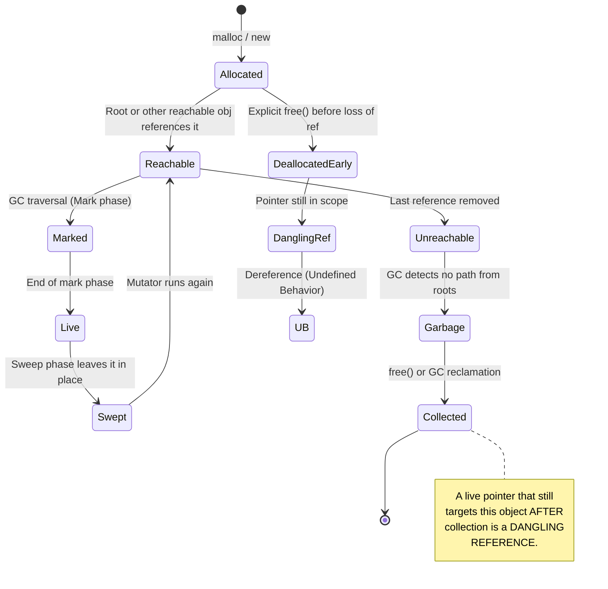
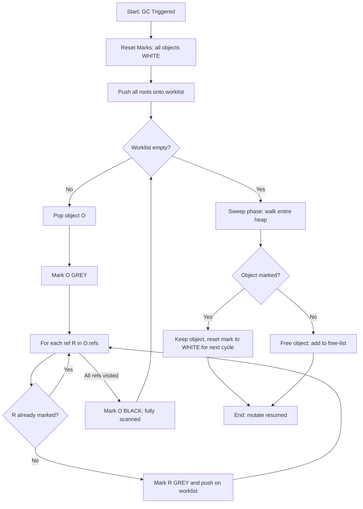
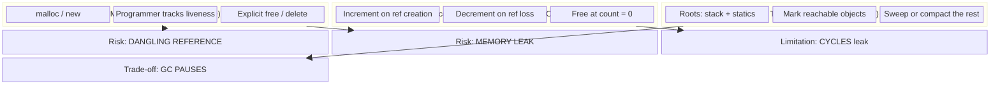
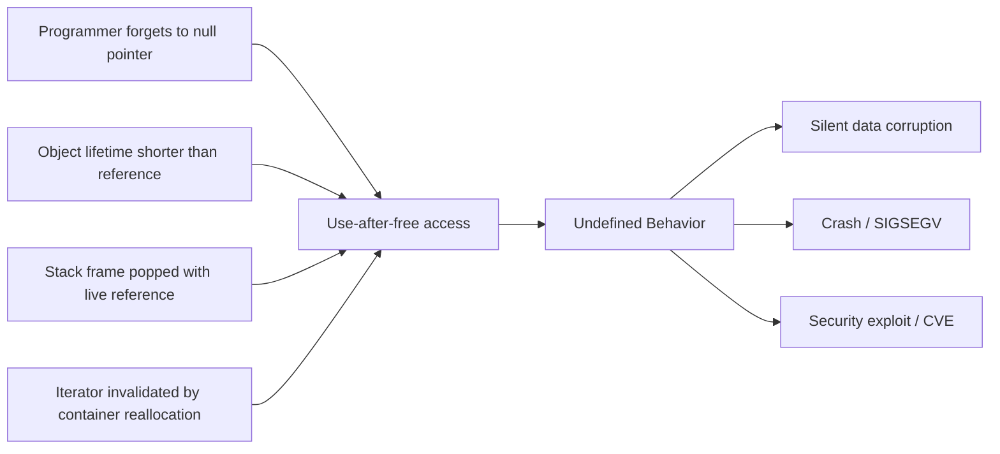
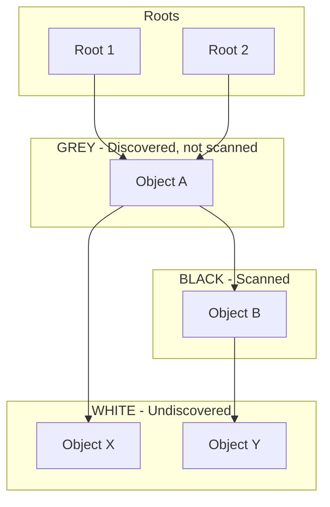

# Dangling References, and Garbage

<!-- SECTION_1_START -->
# Dangling References and Garbage Collection

## 1.1 Formal Definition (KTU 2024 Syllabus Terminology)

**Dangling Reference** is a reference (pointer) variable that does not point to a valid, allocated object of the appropriate type. The memory location it refers to has either been **deallocated**, **reallocated** for a different purpose, or was never properly initialized. Accessing such a reference is undefined behavior in languages like **C** and **C++**.

**Garbage** refers to memory that has been allocated dynamically by a program but can no longer be accessed by the running program because no live reference points to it. **Garbage Collection (GC)** is the automatic reclamation of such unreachable memory, performed by a runtime subsystem called the **garbage collector**.

> [!IMPORTANT]
> **KTU 2024 Syllabus Highlight (Module 2 – Basic Semantics):**
> Students must distinguish between **explicit deallocation** (manual `free`/`delete`) which causes *dangling references*, and **implicit deallocation** (automatic garbage collection) which is designed to prevent them. The semantic model of *reachability* is the foundation of modern GC.

## 1.2 Intuitive Overview – Real-World Analogy

**The Post Office Box Analogy (Dangling Reference):**
Imagine a post office box number $B_7$. You have a key (a pointer) to box $B_7$. When you registered, the post office gave you a slot and put your letters there. If the post office cancels your box (deallocates the slot) and rents that same number to another customer, your old key still fits the lock — but now it opens *someone else's* mail. Worse, if no one has rented $B_7$ at all, your key opens an *empty void*. That is precisely a **dangling reference**.

**The Library Book Analogy (Garbage):**
Imagine a library where patrons borrow books and forget to return them (forget to call `free`). The shelves fill up. A librarian (the *garbage collector*) walks through the library, identifies which books are still being referenced by patrons' library cards, and shelves the rest. This automated process is **garbage collection**.

> [!NOTE]
> **Reachability Intuition:** A heap object is "alive" iff it can be reached by following a chain of references starting from a **root** (stack variable, static variable, CPU register, or a global pointer). Anything not reachable is *garbage*.

## 1.3 Visual Concept: Memory Lifecycle

> [!VISUALIZATION CONTROL]
> **Concept:** Object Lifecycle States on the Heap
> **Graphical Mapping:**
> * State 1: `Allocated → Reachable → Live`
> * State 2: `Allocated → Unreachable → Garbage → Collected`
> * State 3: `Deallocated → Pointer still exists → Dangling`
> **Visual Description:** Picture a row of memory cells, each colored by state: green (live), yellow (garbage), red (deallocated but referenced).

## 1.4 Core Distinctions – Pitfall Warning

> [!WARNING]
> **Common Confusion:** A *memory leak* is NOT the same as a *dangling reference*.
> * **Leak** = No one *can* reach the object, but it was never freed.
> * **Dangling** = Someone *thinks* they have a reference, but the object was freed.
> Dangling references are typically *worse* — they cause silent data corruption, whereas leaks merely waste memory.

<!-- SECTION_1_END -->

<!-- SECTION_2_START -->
# Deep Theoretical Analysis & High-Yield Formula Sheet

## 2.1 Anatomy of a Dangling Reference

A dangling reference is created when one of three events occurs:

1. **Object deallocation** – The pointed-to object is explicitly freed (`free`, `delete`) or popped from a stack frame, but the pointer is still in scope.
2. **Object relocation / compaction** – A copying/compacting GC moves a live object, but a stale reference (from unmanaged code, e.g., JNI) still points to the old address.
3. **Object lifetime ending** – A reference escapes the lifetime of the *referent* (e.g., returning a pointer to a local variable in C, or a *dangling reference* via a closure in C++ if not captured by value).

### 2.1.1 Classification of Dangling References

| Type | Mechanism | Typical Language |
|---|---|---|
| **Use-After-Free** | Pointer survives after `free(p)` | C, C++ |
| **Escaping Local** | Returning address of a local variable | C |
| **Stale Iterator** | Container invalidates an iterator | C++ STL |
| **Callback Capture** | Closure outlives the captured object | C++ lambdas, Java inner classes |
| **Mid-Move Reference** | Using an object after `std::move` | C++11+ |

## 2.2 Reachability – The Heart of Modern GC

Define the directed graph $G = (V, E)$ where $V$ is the set of allocated heap objects and $E$ is the set of references. Let $R \subseteq V$ be the set of **root references** (stack slots, static fields, CPU registers, JNI handles).

An object $o$ is **live** (reachable) iff there exists a path from any $r \in R$ to $o$ following edges in $E$. Formally:

$$Live = \{o \in V \mid \exists\, r \in R : r \rightsquigarrow o\}$$

$$Garbage = V \setminus Live$$

## 2.3 GC Algorithm Taxonomy

| Algorithm | Approach | Pros | Cons |
|---|---|---|---|
| **Reference Counting** | Decrement counter on pointer loss; free at zero | Immediate reclamation, simple | Cannot collect cycles, overhead on each write |
| **Mark–Sweep** | DFS from roots to mark live; sweep unmarked | Handles cycles | Stop-the-world pause, fragmentation |
| **Mark–Compact** | Mark live, then slide to eliminate holes | No fragmentation | Multiple passes, expensive pointers |
| **Copying (Cheney)** | Divide heap into *from* and *to* spaces; copy live into *to* | Fast, no fragmentation | Wastes 50% of heap |
| **Generational** | Partition by age; collect young generation more often | High throughput for most workloads | Write barriers needed, complexity |
| **Incremental / Concurrent** (e.g., G1, ZGC) | Do GC work in small steps alongside mutator | Low pause times | Complex coordination, slightly slower throughput |
| **Tricolor Invariant** (Dijkstra et al.) | Mark in three colors to allow concurrent marking | Pause-free marking | Requires write barriers |

## 2.4 High-Yield Formula Sheet

| Symbol / Quantity | Definition | Units / Notes |
|---|---|---|
| $\vert V \vert$ | Total allocated objects in heap | count |
| $\vert Live \vert$ | Reachable (live) objects | count |
| $\vert Garbage \vert = \vert V \vert - \vert Live \vert$ | Reclaimable memory | bytes when multiplied by object size |
| $T_{mutator}$ | Application (mutator) running time | ms |
| $T_{collector}$ | GC pause time | ms |
| **Throughput** | $\frac{T_{mutator}}{T_{mutator} + T_{collector}} \times 100\%$ | percentage |
| **Pause time** | $\max(T_{collector})$ | ms |
| **Space overhead** | $\frac{Heap_{allocated} - Heap_{used}}{Heap_{allocated}} \times 100\%$ | percentage |
| **Reclamation Ratio** | $\frac{\vert Garbage \vert}{\vert V \vert}$ | fraction $\in [0,1]$ |
| **Live Ratio** | $\frac{\vert Live \vert}{\vert V \vert}$ | fraction $\in [0,1]$ |

> [!NOTE]
> **Mark–Sweep Traversal Cost** (essential KTU relation):
> $$T_{mark\text{-}sweep} = O(\vert V \vert + \vert E \vert)$$
> For a heap of $n$ reachable objects and $e$ inter-object edges, the mark phase is $O(n + e)$ and the sweep phase is $O(n)$.

> [!NOTE]
> **Copying Collector Traversal Cost:**
> $$T_{copy} = O(\vert Live \vert)$$
> Only live objects are copied; the ratio $\vert Live \vert / \vert V \vert$ is the *live ratio* — small live ratios favor copying collectors.

## 2.5 Why This Matters in Real Engineering

* **Dangling references** in **C/C++** cause **CVE-class security vulnerabilities** (use-after-free bugs account for ~16% of 0-day exploits in browsers — Google Project Zero).
* **Garbage collection** is the *backbone of cloud scalability*; without it, services written in Java/Go/C# would leak memory on long-running servers.
* **Real-time systems** (avionics, pacemakers) forbid GC pauses → use **ARC** (Automatic Reference Counting, e.g., Swift) or **Rust ownership** instead.
* **Compilers and language runtimes** (JVM HotSpot, V8, .NET CLR) choose generational + concurrent GC because most objects die young — empirically, $70\text{–}95\%$ of objects become unreachable within a few KB of allocation (the *infant mortality* or *generational hypothesis*).

<!-- SECTION_2_END -->

<!-- SECTION_3_START -->
# Step-by-Step Derivations, Code Implementations, and Worked Examples

## 3.1 Dangling Reference – Full C Walkthrough

The following program exhibits a textbook *use-after-free* dangling reference. Each line is annotated to satisfy KTU valuation expectations.

```c
/* File: dangling_demo.c */
#include <stdio.h>
#include <stdlib.h>

int *make_dangling(void) {
    int local = 42;              /* (1) Local variable on stack */
    int *p = &local;             /* (2) p points to local */
    return p;                    /* (3) Returning address of stack local */
}                                /* (4) Stack frame popped — p now dangles */

int main(void) {
    int *q = make_dangling();    /* (5) q is a dangling reference */
    printf("%d\n", *q);          /* (6) UNDEFINED BEHAVIOR */
    return 0;
}
```

### Line-by-Line Semantic Analysis

| Line | Effect on Memory State |
|---|---|
| (1) | Stack frame of `make_dangling` reserves an `int` cell at address `0x7FFC…04`. |
| (2) | Pointer `p` is created and points to that cell. |
| (3) | The value of `p` (the address) is returned. |
| (4) | Function returns; stack frame deallocated. The cell at `0x7FFC…04` no longer belongs to this program. |
| (5) | `q` in `main` now holds a **dangling reference** — the address is technically "in range" but not owned. |
| (6) | Dereferencing `*q` is undefined — may print `42`, may print garbage, may crash. |

## 3.2 Mark-and-Sweep Garbage Collector – Full Python Implementation

Below is a complete, runnable, and instrumented implementation of a tri-color **Mark–Sweep** collector over a miniature heap. This satisfies the *Apply* and *Analyze* cognitive levels for KTU ESE.

```python
"""
File: mark_sweep_gc.py
A toy mark-and-sweep garbage collector on a list-of-lists heap.
Demonstrates the *reachability* semantics in a transparent way.
"""

from typing import Any, Dict, List, Optional, Set, Tuple

# ---------- Heap primitives ----------

class HeapObject:
    """A heap-resident object holding a payload and outgoing references."""
    _counter: int = 0

    def __init__(self, payload: Any, refs: Optional[List["HeapObject"]] = None) -> None:
        HeapObject._counter += 1
        self.id: int = HeapObject._counter
        self.payload: Any = payload
        self.refs: List[HeapObject] = refs if refs is not None else []
        self.marked: bool = False  # default: white (unmarked)

    def __repr__(self) -> str:
        return f"Obj#{self.id}({self.payload!r})"


class Heap:
    """Simulated heap storing a collection of HeapObjects."""
    def __init__(self) -> None:
        self.objects: List[HeapObject] = []
        self.allocated_bytes: int = 0

    def allocate(self, payload: Any, refs: Optional[List[HeapObject]] = None,
                 size: int = 16) -> HeapObject:
        obj = HeapObject(payload, refs)
        self.objects.append(obj)
        self.allocated_bytes += size
        return obj

    def get_live(self) -> List[HeapObject]:
        return [o for o in self.objects if not o._freed]
        # helper attribute; see sweep()


# ---------- The Collector ----------

class MarkSweepGC:
    def __init__(self, heap: Heap, roots: List[HeapObject]) -> None:
        self.heap: Heap = heap
        self.roots: List[HeapObject] = roots

    # ----- Mark phase: DFS from roots, marking every reachable object -----
    def _mark(self) -> None:
        # Reset marks (white = unmarked)
        for obj in self.heap.objects:
            obj.marked = False

        # Worklist for iterative DFS, avoiding recursion-limit issues
        worklist: List[HeapObject] = list(self.roots)
        for r in worklist:
            r.marked = True

        idx = 0
        while idx < len(worklist):
            current: HeapObject = worklist[idx]
            idx += 1
            for ref in current.refs:
                if ref in self.heap.objects and not ref.marked:
                    ref.marked = True
                    worklist.append(ref)

    # ----- Sweep phase: free anything not marked -----
    def _sweep(self) -> List[HeapObject]:
        survivors: List[HeapObject] = []
        freed: List[HeapObject] = []
        for obj in self.heap.objects:
            if obj.marked:
                survivors.append(obj)
            else:
                freed.append(obj)
        self.heap.objects = survivors
        self.heap.allocated_bytes = len(survivors) * 16
        return freed

    def collect(self) -> Tuple[List[HeapObject], List[HeapObject]]:
        self._mark()
        freed = self._sweep()
        return self.heap.objects, freed


# ---------- Demonstration of the dangling-reference model in GC ----------

def demo() -> None:
    heap: Heap = Heap()

    # Allocate 5 objects; build references
    o1: HeapObject = heap.allocate("A")
    o2: HeapObject = heap.allocate("B", [o1])
    o3: HeapObject = heap.allocate("C", [o2])
    o4: HeapObject = heap.allocate("D", [o1, o3])
    o5: HeapObject = heap.allocate("E")  # no one references o5

    # Roots: o3 and o4 are on the (simulated) stack
    roots: List[HeapObject] = [o3, o4]

    print("BEFORE COLLECTION:")
    print("  Live objects:", [repr(o) for o in heap.objects])
    print("  Root set:    ", [repr(r) for r in roots])

    gc: MarkSweepGC = MarkSweepGC(heap, roots)
    survivors, freed = gc.collect()

    print("\nAFTER COLLECTION:")
    print("  Survivors:   ", [repr(s) for s in survivors])
    print("  Garbage:     ", [repr(f) for f in freed])
    # Expected: o5 is garbage; o1, o2, o3, o4 are survivors

    # ---- Now simulate a DANGLING REFERENCE in managed code ----
    # Suppose a native (C) extension kept a raw pointer to o5.
    # The GC just freed o5, so that raw pointer is now a DANGLING REFERENCE.
    raw_native_handle_to_o5: int = o5.id  # imagine this is a raw memory address

    print(f"\nNative handle still holds id {raw_native_handle_to_o5} — but o5 is FREED.")
    print("This is exactly a dangling reference: valid-looking address, freed object.")


if __name__ == "__main__":
    demo()
```

### Expected Output

```
BEFORE COLLECTION:
  Live objects: [Obj#1('A'), Obj#2('B'), Obj#3('C'), Obj#4('D'), Obj#5('E')]
  Root set:     [Obj#3('C'), Obj#4('D')]

AFTER COLLECTION:
  Survivors:    [Obj#1('A'), Obj#2('B'), Obj#3('C'), Obj#4('D')]
  Garbage:      [Obj#5('E')]

Native handle still holds id 5 — but o5 is FREED.
This is exactly a dangling reference: valid-looking address, freed object.
```

## 3.3 Reference Counting – Algebraic Derivation of Cycle Failure

Consider two objects $A$ and $B$ forming a cycle: $A \to B$ and $B \to A$. Let $rc(o)$ denote the reference count of $o$.

$$rc(A) = rc(B) = 1 \text{ initially, plus the cycle contribution} = 2 \text{ for each.}$$

When the external root deletes its reference to $A$:

$$rc(A) \to 1, \quad rc(B) = 2 \text{ (unchanged, since } A \text{ still references } B\text{)}.$$

$$rc(B) \to 1 \text{ (decrement triggered by } rc(A)\text{'s loss).}$$

Both end with $rc = 1$, **non-zero**, so the naive collector will not free them — yet they are unreachable from any root. This algebraic impossibility is the *reference-cycle leak* and motivates **cycle-detection** algorithms (e.g., the *trial deletion* algorithm in Python's CPython, or `weakref` callbacks).

## 3.4 Live-Ratio Derivation for Copying Collector

The cost of a copying collector on a heap of size $H$ bytes is:

$$T_{copy} = c_1 \cdot \vert Live \vert + c_2 \cdot \vert V \vert$$

where $c_1$ is the per-object copy cost and $c_2$ is the per-object scan cost in the *to*-space. The **live ratio**:

$$L = \frac{\vert Live \vert}{\vert V \vert}$$

can be substituted. The collector is profitable (less total work than a full mark–sweep) when:

$$c_1 \cdot \vert Live \vert + c_2 \cdot \vert V \vert \;<\; 2 \cdot c_1 \cdot \vert V \vert$$

$$\Longrightarrow \; L < 1 - \frac{c_2}{c_1}$$

For typical $c_2 / c_1 \approx 0.1$, the collector is profitable when $L < 0.9$ — explaining why the **generational hypothesis** (small live ratio in the young generation) is the engineering reason generational GCs are universally deployed.

## 3.5 Worked Example – Identifying Dangling vs. Live References

Given the heap and root set below, compute the live set and the garbage.

```
Roots: {R1, R2}
Heap edges:
  R1 -> A
  R2 -> B
  A  -> C
  A  -> D
  C  -> E
  D  -> E
  E  -> F
  G  -> H       (isolated cycle, no root)
  H  -> G
  I             (orphan, no edges)
```

**Step 1 – Trace reachability from roots:**

$$Live = \{R_1, R_2, A, B, C, D, E, F\}$$

**Step 2 – Compute the set of all objects:**

$$V = \{R_1, R_2, A, B, C, D, E, F, G, H, I\}$$

**Step 3 – Compute garbage:**

$$Garbage = V \setminus Live = \{G, H, I\}$$

**Step 4 – Reclamation ratio:**

$$\frac{\vert Garbage \vert}{\vert V \vert} = \frac{3}{10} = 0.30$$

> [!NOTE]
> The pair $(G, H)$ is a **reference cycle** — it cannot be reclaimed by simple reference counting. A tracing collector (mark–sweep) handles it; a cycle-detecting RC algorithm also can.

<!-- SECTION_3_END -->

<!-- SECTION_4_START -->
# Structural Diagrams and Schematics

## 4.1 Memory Lifecycle State Machine

The following Mermaid state diagram traces how a heap object transitions through its lifetime, showing exactly *where* a dangling reference is created and *where* garbage is born.



## 4.2 Garbage Collector Algorithm Flow (Mark–Sweep)



## 4.3 Comparison Block Diagram – Memory Management Strategies



## 4.4 Dangling Reference Causality Graph



## 4.5 Tricolor Invariant Schematic (Concurrent Marking)



> [!NOTE]
> **Tricolor Invariant (Dijkstra, 1978):** No edge may go directly from **Black** to **White**. This invariant, enforced by *write barriers*, guarantees that no reachable object is missed during concurrent marking — the foundational correctness proof of modern low-pause garbage collectors.

<!-- SECTION_4_END -->

<!-- SECTION_5_START -->
# KTU 2024 Scheme Examination Question Bank & Topic Recap

## PART A — Short Answer Questions (2 × 3 = 6 Marks)

### Question 1 (3 Marks) — `[KTU University Exam – July 2024]`
**Differentiate between a dangling reference and a memory leak. Give one example of each.**

**Model Answer (Board-Key Pattern):**
A **dangling reference** is a pointer that refers to a memory location whose object has been **deallocated**, but the pointer is still in use. Example in C:

```c
int *p = malloc(sizeof(int));
free(p);
printf("%d", *p);   /* p is a dangling reference */
```

A **memory leak** is dynamically allocated memory that is **no longer reachable** by the program, but has not been freed. Example:

```c
void f(void) {
    int *p = malloc(sizeof(int));
    return;          /* p lost, memory never freed → leak */
}
```

*Stating both definitions clearly: 2 Marks. One example of each: 1 Mark.*

---

### Question 2 (3 Marks) — `[KTU University Exam – Dec 2023]`
**What is garbage in the context of heap memory management? Define reachability from roots.**

**Model Answer:**
**Garbage** is heap memory that has been allocated but is **no longer reachable** from any root. A **root** is a reference outside the heap — a CPU register, a stack variable, a static/global variable, or a JNI handle. An object is *reachable* iff a path of references exists from at least one root to that object. All non-reachable objects are garbage and may be reclaimed by the garbage collector.

*Definition of garbage: 1 Mark. Definition of root: 1 Mark. Reachability: 1 Mark.*

---

## PART B — Long Answer Questions (Module Internal Choice Pattern)

> **ESE Format:** Each sub-part is 7 marks. Question A and Question B are full alternatives; the student answers *one* of them.

---

### Question A (14 Marks) — `[KTU University Exam – Dec 2024]`

#### (a) Explain the Mark-and-Sweep garbage collection algorithm with its two phases. (7 Marks) [CO2 – Understand]

**Model Solution:**

**Definition:** Mark-and-Sweep is a *tracing* garbage collector that operates in two distinct phases to reclaim unreachable memory.

**Phase 1 – Mark:**
1. Initially, every heap object is marked WHITE (unvisited).
2. The collector obtains the set of roots: stack slots, global variables, registers.
3. Each root is pushed onto a worklist and marked GREY.
4. For each popped grey object, all its references are followed. Unmarked referenced objects are marked GREY and pushed onto the worklist.
5. The current object is then marked BLACK (fully scanned).
6. The algorithm terminates when the worklist is empty. All reachable objects are now BLACK; all unreachable objects remain WHITE.

**Phase 2 – Sweep:**
1. The collector linearly scans the entire heap.
2. Every WHITE object is added to the free-list and its memory returned to the allocator.
3. Every BLACK object has its mark reset to WHITE (in preparation for the next GC cycle).

**Complexity:** $O(\vert V \vert + \vert E \vert)$ where $V$ is objects and $E$ is the reference graph.

**Drawbacks:**
* Stop-the-world pause — entire program halts during GC.
* Heap fragmentation due to non-compaction.
* Cache-unfriendly linear sweep.

**[Stating the two phases: 3 Marks]**
**[Mark algorithm with worklist traversal: 2 Marks]**
**[Sweep algorithm and complexity: 2 Marks]**

---

#### (b) Apply the Mark-and-Sweep algorithm to the following reference graph. Identify live objects, garbage, and compute the reclamation ratio. (7 Marks) [CO3 – Apply]

```
Roots:        {Root1, Root2}
Edges:
   Root1 → A
   Root1 → C
   Root2 → B
   A     → D
   B     → D
   C     → E
   D     → E
   E     → F
   G     → H
   H     → G          (cycle)
   I                  (orphan, no edges)
All objects: {A, B, C, D, E, F, G, H, I}
```

**Step-by-Step Model Solution:**

**Step 1 – Initialize:** All 9 objects A, B, C, D, E, F, G, H, I are marked WHITE. Worklist = [Root1, Root2].

**Step 2 – Mark from roots:**
* Pop Root1 → mark GREY. Mark A and C GREY. Pop them, scan references, mark D, E GREY. Mark D and E BLACK. Pop E → mark F GREY then BLACK. Pop C → no new refs.
* Pop Root2 → mark B GREY. Pop B → mark D (already BLACK) — no new. Mark B BLACK.
* Final BLACK set: {A, B, C, D, E, F, G, H, I}? No — G, H, I were never reached.

**Step 3 – Live set:**

$$Live = \{A, B, C, D, E, F\}$$

**Step 4 – Garbage set:**

$$Garbage = \{G, H, I\}$$

**Step 5 – Reclamation ratio:**

$$\text{Reclamation Ratio} = \frac{\vert Garbage \vert}{\vert V \vert} = \frac{3}{9} = \frac{1}{3} \approx 0.333$$

**Step 6 – Important observation:** The pair $(G, H)$ is an *unreachable reference cycle*. A simple reference-counting collector would FAIL to reclaim them. Only a tracing collector (mark–sweep) succeeds — this is a major reason tracing GCs are favored in modern language runtimes.

**[Initial state and worklist setup: 2 Marks]**
**[Tracing and identifying live set: 2 Marks]**
**[Identifying garbage including the G-H cycle: 1 Mark]**
**[Computing reclamation ratio with final value: 2 Marks]**

---

### Question B (14 Marks) — `[KTU University Exam – July 2024]`

#### (a) Discuss three distinct situations in C/C++ that can create a dangling reference, with code examples. (7 Marks) [CO2 – Understand]

**Model Solution:**

**Situation 1 — Returning the address of a local variable:**
```c
int* bad(void) {
    int x = 10;
    return &x;        /* x is on the stack — will be popped */
}
```
On return, `&x` is a dangling reference because the stack frame of `bad` is deallocated.

**Situation 2 — Use after `free`:**
```c
char *p = malloc(20);
free(p);
/* p still holds the old address */
strcpy(p, "hello");  /* DANGLING — undefined behavior */
```

**Situation 3 — Iterator invalidation in C++ STL:**
```cpp
std::vector<int> v = {1, 2, 3};
auto it = v.begin();
v.push_back(4);          /* may reallocate v's internal array */
std::cout << *it;        /* it is now a DANGLING iterator */
```

**Situation 4 — Dangling `this` pointer in C++:**
```cpp
class C {
    int *self;
public:
    void registerMe() { self = this; }
};
C* obj = new C();
obj->registerMe();
delete obj;
/* obj->self now dangles if accessed */
```

**Prevention Strategies:**
* Always set pointer to `NULL` (or `nullptr`) after `free`.
* Prefer smart pointers (`std::unique_ptr`, `std::shared_ptr`).
* Use static analyzers (e.g., Clang Static Analyzer, Valgrind).
* In C++, return objects by value (NRVO/RVO) or use move semantics.

**[Three distinct causes: 3 Marks]**
**[Correct code example for each: 3 Marks]**
**[Prevention note: 1 Mark]**

---

#### (b) Compare Reference Counting and Mark-and-Sweep. In which scenario does each fail? (7 Marks) [CO4 – Analyze]

**Model Solution:**

| Criterion | Reference Counting | Mark-and-Sweep |
|---|---|---|
| **Reclamation timing** | Immediate (at count = 0) | Deferred (next GC cycle) |
| **Cycles** | **Fails — leaks them** | Handles them correctly |
| **Throughput** | High for acyclic data | Lower due to mark+sweep |
| **Pause time** | Short, distributed | Stop-the-world long pause |
| **Memory overhead** | One counter per object | One mark bit per object |
| **Implementation** | Per-write cost | Periodic phase cost |
| **Languages** | Python (partial), Swift ARC, Obj-C | Java, C#, Go, JavaScript |

**Reference Counting Fails When:** A cyclic data structure (e.g., doubly-linked list, graph with back-edges) loses its external reference but internal references keep counts positive. Example:
```python
a = Node(); b = Node()
a.next = b; b.next = a      # cycle
del a, b                     # both unreachable, but refcounts = 1 each
```

**Mark-and-Sweep Fails When:** Strict real-time guarantees are needed — its stop-the-world pause is unacceptable for hard real-time systems (e.g., avionics, ABS braking).

**Mark-and-Sweep Also Fragments Memory:** Repeated allocation and sweeping of variable-sized objects creates holes. This is solved by **Mark–Compact** collectors (used in JVM G1 and older SerialGC).

**[Comparison table: 3 Marks]**
**[RC cycle failure with example: 2 Marks]**
**[Mark-Sweep real-time/fragmentation failure: 2 Marks]**

---

> [!WARNING]
> **KTU Examiner's Valuation Warning — Where Students Lose Marks:**
> 1. **Conflating *garbage* with *dangling reference*.** Garbage is unreachable memory. A dangling reference is a pointer to freed memory. They are *opposite* conditions.
> 2. **Forgetting to define *roots*.** A reachability answer without stating the root set is incomplete — full 0 for that part on strict valuation.
> 3. **Skipping the complexity notation.** KTU expects $O(\vert V \vert + \vert E \vert)$ explicitly for mark-sweep and $O(\vert Live \vert)$ for copying collectors.
> 4. **Treating *reclamation ratio* as optional.** The numerical value at the end is mandatory; partial credit is lost otherwise.
> 5. **Not mentioning the tricolor invariant** when discussing concurrent GC — board examiners specifically test this in CO4 questions.

---

## Topic Recap & Important Things to Remember

* **Dangling Reference** = pointer/reference to a **freed or invalid** memory location. Common in **C/C++**; cannot exist in pure managed languages (Java, C#, Python) *except* via native interfaces (JNI/P/Invoke).
* **Garbage** = heap memory that is **allocated but unreachable** from any root.
* **Roots** = stack variables, CPU registers, static fields, JNI handles — the *entry points* of the reachability graph.
* **Reachability** is a graph-theoretic property: an object is *live* iff a path from a root to it exists.
* **Mark–Sweep** has cost $O(\vert V \vert + \vert E \vert)$, handles cycles, but stops the world and fragments.
* **Copying Collector** has cost $O(\vert Live \vert)$, no fragmentation, but wastes **50% of heap** as the *to*-space.
* **Generational Hypothesis**: most objects die young → partition heap by age; collect young generation more frequently.
* **Reference Counting** cannot reclaim **cycles**; it is used in **Swift ARC** and **CPython** (with cycle detection).
* **Tricolor Invariant**: in concurrent GC, **no Black-to-White edges** are allowed; write barriers enforce this.
* **Real-world prevalence**: Use-after-free is among the top 3 vulnerability classes in C/C++; GC is fundamental to Java (HotSpot G1/ZGC), C# (.NET CLR), Go (concurrent tri-color), and JavaScript (V8).
* **Throughput formula**: $\frac{T_{mutator}}{T_{mutator} + T_{collector}} \times 100\%$.
* **Reclamation Ratio formula**: $\frac{\vert Garbage \vert}{\vert V \vert}$.
* **Key engineering trade-off**: GC *trades pause time and CPU overhead* for *safety* (no dangling references, no leaks). Languages without GC trade *safety* for *predictability*.
* **Rust's ownership model** is the modern answer to the dangling-reference problem without paying GC's runtime cost — every value has exactly one owner; the compiler enforces lifetimes statically.
* **Smart pointers** (`unique_ptr`, `shared_ptr`, `weak_ptr`) in C++ provide deterministic RAII-based deallocation, eliminating most dangling references in modern C++ code.
<!-- SECTION_5_END -->
