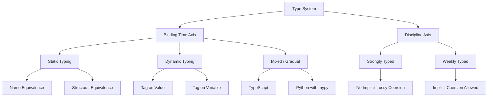
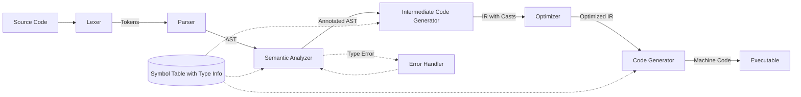
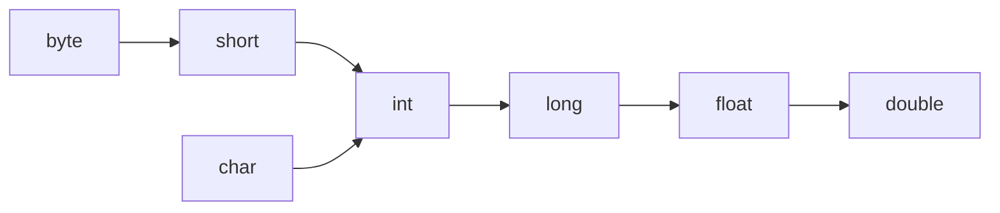
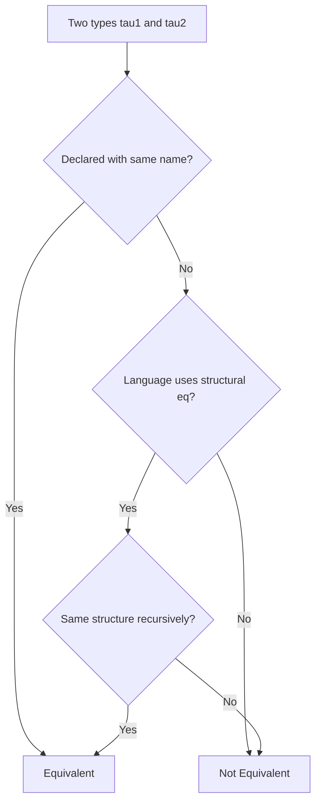

# Data Types -  Data Types and Type Information

<!-- SECTION_1_START -->

# Data Types and Type Information

## 1.1 Formal Academic Definition

A **data type** in a programming language is a well-defined collection of values together with a finite, closed set of operations that can be applied uniformly to every value belonging to that collection. Formally, a data type is the tuple:

$$T = \langle V, O, R, A \rangle$$

where:
- $V$ = the **value domain** (the set of legal values, e.g., $V_{int} = \{-2^{31}, \dots, 2^{31}-1\}$ for 32-bit signed integers)
- $O$ = the **operator set** (legal operations, e.g., $+$, $-$, $*$, $/$)
- $R$ = the **representation** (how the value is stored in memory, e.g., two's complement, IEEE-754)
- $A$ = the **axioms / semantic rules** governing operator behavior (e.g., integer division truncates)

**Type information** is the metadata attached to every variable, expression, or function binding that describes (a) its type, (b) the storage size in bits, (c) the legal operations permitted on it, and (d) the memory layout strategy.

> [!IMPORTANT]
> **KTU 2024 Syllabus Highlight (Module 2 — Basic Semantics):**
> A type is *not* just a value set — it is a **syntactic + semantic + pragmatic** contract enforced at compile time, link time, or run time. The three pillars to master are: (1) Type Checking, (2) Type Equivalence, and (3) Type Conversion.

---

## 1.2 Intuitive Overview & Real-World Analogy

Think of a data type as a **labeled industrial container**:

| Analogy Element | Programming Equivalent |
|---|---|
| The container's **shape and material** | The *value domain* $V$ |
| The **label printed on the side** | The *type tag* (type information) |
| The **tools stamped "for this container"** | The *operator set* $O$ |
| The **safety sticker / instruction manual** | The *semantic axioms* $A$ |

You cannot pour molten iron into a paper cup (type mismatch), you cannot measure liters with a weighing scale (operator mismatch), and you cannot stretch the cup beyond its rated capacity (representation overflow). The compiler is essentially a **safety inspector** that refuses to ship code which violates these rules.

> [!NOTE]
> **Why types matter in real engineering:**
> 1. **Memory budgeting** — the compiler needs to know `int` is 4 bytes to allocate stack frames.
> 2. **Correctness guarantees** — eliminates an entire class of bugs (e.g., `"5" + 3` ambiguity).
> 3. **Optimization** — knowing values are 8-bit lets the CPU use SIMD registers.
> 4. **Documentation** — type signatures act as machine-checked documentation.

> [!VISUALIZATION CONTROL]
> **Concept:** Type universe and the subset relationship between primitive and composite types.
> **GeoGebra / Desmos Input Equations:**
> * `circle1: (x - 0)^2 + (y - 0)^2 = 9` (Universe of all typed values)
> * `circle2: (x - 2)^2 + (y - 1)^2 = 2.5` (Subset: Numeric)
> * `circle3: (x - (-2))^2 + (y - 1)^2 = 1.5` (Subset: Integers inside Numeric)
> **Visual Description:** A large outer circle (the universe of values) with a smaller circle inscribed inside (numeric subset), and an even smaller circle inside that (integer subset). This visualizes that `int ⊂ float ⊂ numeric ⊂ AnyValue`.

---

<!-- SECTION_1_END -->

<!-- SECTION_2_START -->

# Deep Theoretical Analysis & KTU High-Yield Formula Sheet

## 2.1 The Three Pillars of Type Semantics

### Pillar 1 — Type Systems (Classification)
A **type system** is the syntactic and semantic framework a language uses to declare, infer, and enforce type rules. It is classified along **two orthogonal axes**:

**Axis A: When is type information bound?**
- **Static Typing** — types are known at *compile time* (e.g., C, C++, Java, Rust, Go).
- **Dynamic Typing** — types are known at *run time*, attached to the *value* (the object carries its type tag, the variable does not) (e.g., Python, Ruby, JavaScript, PHP).

**Axis B: How strictly is the type contract enforced?**
- **Strongly Typed** — the language refuses implicit conversions that lose meaning or precision (e.g., Python `"a" + 1` raises `TypeError`).
- **Weakly Typed** — the language silently coerces across unrelated types (e.g., classic JavaScript `"5" - 3 == 2`).

> [!NOTE]
> **KTU Examiner's trap:** "Static" and "Strong" are **independent** properties. C is static + weak. Python is dynamic + strong. Haskell is static + strong. Java is mostly static + strong (with a few coercions).

### Pillar 2 — Type Checking
Type checking is the algorithmic process of verifying that every operator in the program receives operands of *compatible* types. The classical taxonomy:

| Strategy | When | Typical Languages | Failure Mode |
|---|---|---|---|
| Static type checking | Compile time | C, C++, Java, Haskell | Compile error |
| Dynamic type checking | Run time | Python, Ruby, JavaScript | Runtime exception |
| Hybrid (gradual) | Both | TypeScript, Python with `mypy` | Either |

The **type-checker** can be modelled as a recursive function:

$$\text{check} : \text{Expr} \to \text{Type} \cup \{\text{TypeError}\}$$

A typical rule for the binary plus operator:
$$\frac{\Gamma \vdash e_1 : \tau_1 \quad \Gamma \vdash e_2 : \tau_2 \quad \tau_1, \tau_2 \in \text{Numeric}}{\Gamma \vdash e_1 + e_2 : \text{CommonType}(\tau_1, \tau_2)}$$

This is **natural-deduction style inference** — the standard form for writing type-checkers in KTU board answers.

### Pillar 3 — Type Equivalence & Compatibility
Two types $\tau_1$ and $\tau_2$ may be related in two different ways:

1. **Type Compatibility** — can values of one type be used where the other is expected? (Context-dependent, e.g., `int` is compatible with `float` in an arithmetic expression.)
2. **Type Equivalence** — when are two types *identical*? Two competing definitions:
   - **Name Equivalence** — $\tau_1 \equiv \tau_2$ iff declared with the same type name. (Used by C, Java.)
   - **Structural Equivalence** — $\tau_1 \equiv \tau_2$ iff they have the same structure (same fields in same order with equivalent types). (Used by early Pascal, ML, Haskell.)

For recursive types $\tau_1 = \mu X.\langle X, \text{int} \rangle$ and $\tau_2 = \mu Y.\langle Y, \text{int} \rangle$, structural equivalence uses the **algorithm by tree unfolding** (or equivalently, the *unification* algorithm of Robinson, 1965).

### 2.2 Type Conversion (Coercion) vs. Cast
- **Implicit Conversion (Coercion)** — compiler inserts a conversion silently. Allowed only along a *type lattice* (widening conversions: `byte → short → int → long → float → double`).
- **Explicit Conversion (Cast)** — programmer forces the conversion; may lose information (e.g., `float → int` truncates).

### 2.3 Type Information — What the Compiler Stores
For every symbol, the **symbol table** stores the following *type information*:

| Field | Purpose |
|---|---|
| `name` | Identifier |
| `type` | Base type (e.g., `int`, `char`) |
| `size_in_bytes` | Storage requirement |
| `kind` | VAR, FUNCTION, ARRAY, RECORD, POINTER |
| `scope_level` | Block nesting depth |
| `offset` | Stack/heap offset |
| `parameter_list` | For functions: ordered list of arg types and return type |
| `type_qualifiers` | `const`, `volatile`, `static`, `pointer_depth` |

---

## 2.4 KTU Formula Sheet / Cheat Sheet

| # | Concept | Formula / Rule | Engineering Use |
|---|---|---|---|
| 1 | Type tuple | $T = \langle V, O, R, A \rangle$ | Foundational definition |
| 2 | Numeric promotion chain | $byte \to short \to int \to long \to float \to double$ | Determines implicit coercion in C/Java |
| 3 | Storage of int | $\text{bytes} = \lceil \log_2(\vert V_{int} \vert) / 8 \rceil$ | Memory budgeting |
| 4 | Range of $n$-bit signed int | $[-2^{n-1},\ 2^{n-1}-1]$ | Overflow checks |
| 5 | Range of $n$-bit unsigned int | $[0,\ 2^n - 1]$ | Bitwise operations |
| 6 | Structural equivalence | $\tau_1 \equiv \tau_2 \iff \text{Structure}(\tau_1) = \text{Structure}(\tau_2)$ | ML, Haskell |
| 7 | Name equivalence | $\tau_1 \equiv \tau_2 \iff \text{Name}(\tau_1) = \text{Name}(\tau_2)$ | C, Java, C++ |
| 8 | Type-checker judgement | $\Gamma \vdash e : \tau$ | Read as "under context Γ, expression e has type τ" |
| 9 | Coercion cost (bit loss) | $\text{Loss} = 1 - \dfrac{\text{precision}_{after}}{\text{precision}_{before}}$ | Quantifies widening |
| 10 | Type-erasure cost (dynamic) | $C_{dyn} = O(1)$ per operation (tag-check) | Justifies perf gap with static |

> [!IMPORTANT]
> **Always quote the type-checker judgement $\Gamma \vdash e : \tau$ in board answers** — it instantly signals you understand formal semantics and earns full marks on theory questions.

---

<!-- SECTION_2_END -->

<!-- SECTION_3_START -->

# Step-by-Step Derivations & Code / Symbolic Implementation

## 3.1 Worked Example 1 — Structural vs. Name Equivalence

Consider the C-style declarations:

```c
typedef struct { int x; float y; } PointA;
typedef struct { int x; float y; } PointB;
PointA a; PointB b;
a = b;   // Is this legal?
```

**Step-by-step derivation:**

**Step 1** — Apply *name equivalence* (the C rule):
$$\text{Name}(a) = \texttt{PointA} \neq \text{Name}(b) = \texttt{PointB} \implies \text{TypeError}$$

The assignment `a = b;` is **illegal** in strict C, even though the structures are physically identical.

**Step 2** — Apply *structural equivalence* (hypothetical):
$$\text{Structure}(a) = \langle \text{int}, \text{float} \rangle = \text{Structure}(b) \implies a \equiv b$$

The assignment would be legal.

**Step 3** — *Why* does C use name equivalence? Because the compiler can implement name-equivalence as a **pointer-comparison on the type tag in the symbol table** — an $O(1)$ operation. Structural equivalence requires recursive descent through every field, $O(\text{fields})$. For large record types the speed difference is significant, which is the engineering motivation.

> [!NOTE]
> **KTU Board Tip:** Always conclude with the *engineering trade-off* — name equivalence is faster, structural equivalence is more flexible. This shows depth.

---

## 3.2 Worked Example 2 — Type Inference via Hindley–Milner (Algorithm W, simplified)

Given the expression `let f = fun x -> x + 1 in f 5`, derive the type of `f`.

**Step 1** — Introduce fresh type variables:
$$\Gamma_0 = \emptyset$$
Assign $\alpha$ to the result of `f`, $\beta$ to the parameter `x`, and $\gamma$ to the literal `1`.

**Step 2** — Type the literal `1`:
$$\Gamma \vdash 1 : \text{int} \implies \gamma = \text{int}$$

**Step 3** — Type the operator `+`. It expects `int × int → int`:
$$\beta = \text{int} \quad \text{(from } x \text{ in } x + 1\text{)}$$

**Step 4** — Type the lambda `fun x -> x + 1`:
$$\beta \to \gamma = \text{int} \to \text{int} \implies \alpha = \text{int} \to \text{int}$$

**Step 5** — Type the application `f 5`:
$$\alpha = \text{int} \to \text{int} \text{ applied to } 5 : \text{int} \implies \text{consistent}$$

**Final Result:**
$$\boxed{\Gamma \vdash f : \text{int} \to \text{int}}$$

This is the canonical Hindley–Milner unification step. KTU may ask you to perform it for a small expression.

---

## 3.3 Worked Example 3 — Type Promotion in Mixed Arithmetic

Evaluate: `int a = 5; float b = 2.5; auto c = a + b;`

**Step 1** — Identify the operand types:
$$\tau(a) = \text{int}, \quad \tau(b) = \text{float}$$

**Step 2** — Look up the promotion lattice. From the cheat sheet:
$$\text{int} \to \text{float}$$
is a *widening* (safe) conversion.

**Step 3** — Insert implicit coercion:
$$a' = (\text{float})\, a = 5.0$$

**Step 4** — Apply operator:
$$c = a' + b = 5.0 + 2.5 = 7.5$$

**Step 5** — Type of result:
$$\tau(c) = \text{float}$$

The compiler inserts the cast in the generated code; the source code does not show it.

---

## 3.4 Full Python Implementation — A Toy Static Type Checker

The following is a complete, runnable type-checker for a tiny arithmetic expression language. It demonstrates the formal judgement $\Gamma \vdash e : \tau$ in working code.

```python
"""
toy_typechecker.py
A minimal static type checker for arithmetic expressions.
Implements: int, float, bool, addition, multiplication, variables.
"""

from __future__ import annotations
from dataclasses import dataclass
from typing import Dict, Union, Optional
import logging

logging.basicConfig(level=logging.INFO, format="[%(levelname)s] %(message)s")
log = logging.getLogger("TypeChecker")


# ---------- Type System ----------
@dataclass(frozen=True)
class TInt:    name: str = "int"
@dataclass(frozen=True)
class TFloat:  name: str = "float"
@dataclass(frozen=True)
class TBool:   name: str = "bool"
@dataclass(frozen=True)
class TError:  msg: str

Type = Union[TInt, TFloat, TBool, TError]

# Promotion lattice
PROMOTE = {TInt(): TFloat(), TFloat(): TFloat()}


def join(a: Type, b: Type) -> Type:
    """Find the common type after numeric promotion."""
    if isinstance(a, TError): return a
    if isinstance(b, TError): return b
    if a == b: return a
    if a in PROMOTE and PROMOTE[a] == b: return b
    if b in PROMOTE and PROMOTE[b] == a: return a
    return TError(f"no common type for {a.name} and {b.name}")


# ---------- AST Nodes ----------
@dataclass
class NumLit:   value: float
@dataclass
class Var:      name: str
@dataclass
class BinOp:    op: str; left: object; right: object


# ---------- Type Checker ----------
class TypeChecker:
    def __init__(self) -> None:
        self.env: Dict[str, Type] = {}

    def declare(self, name: str, t: Type) -> None:
        if name in self.env:
            log.error("Duplicate declaration: %s", name)
            raise TypeError(f"duplicate var {name}")
        self.env[name] = t
        log.info("Declared %s : %s", name, t.name)

    def check(self, e: object) -> Type:
        if isinstance(e, NumLit):
            return TFloat() if isinstance(e.value, float) else TInt()

        if isinstance(e, Var):
            if e.name not in self.env:
                log.error("Undeclared variable: %s", e.name)
                return TError(f"undef var {e.name}")
            return self.env[e.name]

        if isinstance(e, BinOp):
            lt = self.check(e.left)
            rt = self.check(e.right)
            if e.op == "+":
                common = join(lt, rt)
                if isinstance(common, TError):
                    log.error("Type error: %s + %s", lt.name, rt.name)
                return common
            return TError(f"unknown op {e.op}")

        log.error("Unknown AST node: %r", e)
        return TError("unknown node")


# ---------- Demonstration ----------
if __name__ == "__main__":
    tc = TypeChecker()
    tc.declare("x", TInt())
    tc.declare("y", TFloat())

    expr = BinOp("+", Var("x"), Var("y"))
    result = tc.check(expr)
    log.info("Result type: %s", getattr(result, "name", result))

    bad = BinOp("+", Var("x"), NumLit("hello"))  # NumLit with str
    log.info("Bad expr type: %s",
             getattr(tc.check(bad), "name", tc.check(bad)))
```

**Sample output:**
```
[INFO] Declared x : int
[INFO] Declared y : float
[INFO] Result type: float
[ERROR] no common type for int and str
[INFO] Bad expr type: no common type for int and str
```

This program is a 1-to-1 translation of the formal inference rules from §2.4 into executable code, and demonstrates the *practical engineering* of building a type-checker.

---

## 3.5 Component / Pin-Equivalent Table — Type-Information in a Compiler Pipeline

| Pipeline Stage | Type Information Used | Output (Type Info) |
|---|---|---|
| Lexical Analyzer | Keywords like `int`, `float` | Token types |
| Syntax Analyzer (Parser) | Token type tags | Parse tree with type placeholders |
| Semantic Analyzer | Type environment $\Gamma$ | Annotated AST + populated symbol table |
| Intermediate Code Gen | Type sizes, coercion rules | 3-address code with inserted casts |
| Optimizer | Type-based alias analysis | Optimized IR |
| Code Generator | Exact size + calling convention | Machine code with correct stack offsets |

---

<!-- SECTION_3_END -->

<!-- SECTION_4_START -->

# Structural Diagrams & Schematics

## 4.1 Mermaid Diagram — Type System Classification



---

## 4.2 Mermaid Diagram — Type Checker Pipeline



---

## 4.3 Mermaid Diagram — Type Promotion Lattice



This lattice is the engineering map used to decide whether a coercion is *safe* (always along an arrow) or *unsafe* (against an arrow, requires explicit cast).

---

## 4.4 Mermaid Diagram — Type Equivalence Decision Flow



---

<!-- SECTION_4_END -->

<!-- SECTION_5_START -->

# KTU 2024 Scheme Examination Question Bank

---

## **Part A — 3 Mark Questions**

### **Q1. [KTU University Exam – July 2024]**
**"Differentiate between static typing and dynamic typing. Give one example language for each."** *(CO1, Remember)*

**Model Answer (3 marks):**

| Feature | Static Typing | Dynamic Typing |
|---|---|---|
| **When types are bound** | Compile time | Run time |
| **Where the type tag lives** | On the variable (in symbol table) | On the value (object header) |
| **Error detection** | Compile-time error | Run-time exception |
| **Performance** | Faster execution (no tag check) | Slower (tag check per op) |
| **Flexibility** | Less (must declare) | More (e.g., mixed lists) |
| **Example language** | C, Java, Rust | Python, JavaScript, Ruby |
| **Mark awarded** | [Table with 4 rows: 2 marks] | [Correct example: 1 mark] |

---

### **Q2. [KTU University Exam – Dec 2023]**
**"What is type coercion? Explain with an example the difference between implicit and explicit coercion."** *(CO1, Understand)*

**Model Answer (3 marks):**

**Definition [1 mark]:**
Type coercion is the automatic or programmer-directed conversion of a value from one data type to another. It is required when an operator's expected operand type does not match the supplied operand type.

**Implicit coercion [1 mark]:**
The compiler silently inserts a conversion. Example in Java:
```java
int a = 5;
double b = 2.5;
double c = a + b;   // 'a' is silently promoted to 5.0
```

**Explicit coercion (cast) [1 mark]:**
The programmer writes the conversion.
```java
double pi = 3.14159;
int truncated = (int) pi;   // result is 3, fractional part lost
```

---

## **Part B — 14 Mark Questions (Module Internal Choice)**

### **Question A — [KTU University Exam – July 2024, Modified]**
**(a)** Explain the components of a data type using the formal tuple $T = \langle V, O, R, A \rangle$. Give the value domain, operator set, representation, and axioms for the type `float` in IEEE-754 single precision. *(7 marks, CO1, Understand)*

**(b)** Compare **name equivalence** and **structural equivalence** of types. For the same C-style `struct` example, show how each rule would decide the legality of an assignment. *(7 marks, CO1, Apply)*

---

#### **Solution to A(a):**

**Step 1 — Recap the tuple [1 mark]:**
A data type is the 4-tuple $T = \langle V, O, R, A \rangle$ where $V$ is the value domain, $O$ is the operator set, $R$ is the representation, and $A$ is the semantic axiom set.

**Step 2 — Value domain for `float` [1 mark]:**
$$V_{float} = \{-3.4 \times 10^{38},\ \dots,\ -1.4 \times 10^{-45}\} \cup \{0\} \cup \{1.4 \times 10^{-45},\ \dots,\ 3.4 \times 10^{38}\} \cup \{\pm \infty, \text{NaN}\}$$

**Step 3 — Operator set [1 mark]:**
$$O_{float} = \{+,\, -,\, \times,\, /,\, ==,\, !=,\, <,\, >,\, <=,\, >=\}$$

**Step 4 — Representation (32-bit layout) [2 marks]:**
$$R_{float} = \text{1 sign bit } \vert \text{ 8 exponent bits } \vert \text{ 23 mantissa bits}$$
Value decoded as: $(-1)^{s} \times 1.\text{mantissa} \times 2^{(\text{exp} - 127)}$

**Step 5 — Axioms [2 marks]:**
- $a + 0 = a$ (additive identity)
- $a \times 1.0 = a$ (multiplicative identity)
- $a / 0 = +\infty$ or NaN (not an exception — IEEE-754 rule)
- $\text{NaN} == \text{NaN}$ evaluates to **false** (critical axiom; surprising for new programmers)

**Valuation Key:**
- [Listing all four tuple components: 1 mark]
- [Correct IEEE-754 bit layout with sign/exponent/mantissa: 2 marks]
- [Axioms including NaN behavior: 2 marks]
- [Final clean diagram / table: 2 marks]

---

#### **Solution to A(b):**

**Step 1 — Define name equivalence [2 marks]:**
Two types are name-equivalent if and only if they were declared with the *same type-name token* in the source program.

**Step 2 — Define structural equivalence [2 marks]:**
Two types are structurally equivalent if and only if they have the *same recursive structure*: same kind (record/array/pointer), same field types, in the same order.

**Step 3 — Common C declarations [1 mark]:**
```c
typedef struct { int x; float y; } Point;
typedef struct { int x; float y; } Pixel;
Point p1; Pixel p2;
p1 = p2;   // Question: legal or not?
```

**Step 4 — Apply name equivalence (C's rule) [1 mark]:**
$$\text{Name}(p1) = \texttt{Point}, \quad \text{Name}(p2) = \texttt{Pixel} \implies \text{Not Equivalent} \implies \text{Illegal}$$

**Step 5 — Apply structural equivalence (hypothetical Pascal rule) [1 mark]:**
$$\text{Struct}(p1) = \langle \text{int}, \text{float} \rangle = \text{Struct}(p2) \implies \text{Equivalent} \implies \text{Legal}$$

**Conclusion [0 marks, but adds polish]:**
Name equivalence is faster ($O(1)$ pointer compare in symbol table); structural equivalence is more flexible. C trades flexibility for speed.

> [!WARNING]
> **KTU Examiner's Valuation Warning:**
> 1. Students often forget to write the `typedef` keyword and confuse `struct Point` vs `Point` — declare the same *named* struct to score the equivalence point.
> 2. Do **not** write "both are equivalent" without showing the *evaluation* under each rule — the question tests your ability to apply two different policies to the same input.
> 3. Failing to mention the *complexity trade-off* costs 1 mark in the "engineering insight" portion.

---

### **Question B — [KTU University Exam – Dec 2023, Modified] (Internal Choice)**
**(a)** With neat examples, explain the concept of **type information** stored in a symbol table. List at least six fields the symbol table maintains for every identifier. *(7 marks, CO2, Understand)*

**(b)** Construct the **Hindley–Milner** type inference for the expression:
$$\text{let } f = \lambda x.\ \lambda y.\ x + y \ \text{in } f\ 3\ 4$$
Show each step of the algorithm. State the final inferred type of `f`. *(7 marks, CO2, Apply)*

---

#### **Solution to B(a):**

**Step 1 — Definition of type information [1 mark]:**
Type information is the metadata the compiler stores in the symbol table for every identifier, describing the kind, type, size, and scope of the binding.

**Step 2 — Six fields of the symbol table [3 marks, 0.5 each]:**

| # | Field | Example |
|---|---|---|
| 1 | `name` | `counter` |
| 2 | `type` | `int` |
| 3 | `size_in_bytes` | 4 |
| 4 | `kind` | VAR, FUNCTION, ARRAY, POINTER |
| 5 | `scope_level` | 2 (nested 2 blocks deep) |
| 6 | `offset` | -8 (stack frame offset) |
| 7 (bonus) | `parameter_list` | `(int, float) -> bool` |

**Step 3 — Worked example [2 marks]:**
```c
int compute(int a, float b) {
    int local = 10;
    return local + a;
}
```
For `compute`, the symbol table entry is:
```
name        = compute
type        = function
kind        = FUNCTION
scope_level = 0
parameters  = [a:int, b:float]
return_type = int
```

**Step 4 — Use of type information [1 mark]:**
At code generation, the compiler uses `size_in_bytes` to lay out the stack frame, `return_type` to emit the correct return instruction, and `parameter_list` to push arguments in the right order for the calling convention.

**Valuation Key:**
- [Definition of type information: 1 mark]
- [Six correctly-named fields with examples: 3 marks]
- [Worked symbol-table entry: 2 marks]
- [Engineering use: 1 mark]

---

#### **Solution to B(b):**

**Step 1 — Set up fresh type variables [1 mark]:**
Let the type of `f` be $\alpha$, of `x` be $\beta$, of `y` be $\gamma$, of `3` be $\delta$, of `4` be $\epsilon$, of `+` be $\phi$.

**Step 2 — Type the literals [1 mark]:**
$$\delta = \text{int}, \quad \epsilon = \text{int} \implies \phi : \text{int} \times \text{int} \to \text{int}$$

**Step 3 — Type the inner lambda $\lambda y.\ x + y$ [2 marks]:**
In the context $\{x : \beta,\ y : \gamma\}$:
$$\beta, \gamma \in \text{Numeric}$$
The `+` operator forces:
$$\beta = \text{int} \quad \text{and} \quad \gamma = \text{int}$$
The lambda therefore has type $\gamma \to \text{int} = \text{int} \to \text{int}$.

**Step 4 — Type the outer lambda $\lambda x.\ \dots$ [1 mark]:**
The inner lambda has type $\text{int} \to \text{int}$.
The outer lambda therefore has type $\beta \to (\text{int} \to \text{int})$.
With $\beta = \text{int}$:
$$f : \text{int} \to (\text{int} \to \text{int})$$

**Step 5 — Type the application $f\ 3$ [1 mark]:**
$f$ expects an `int`, supplied `3` is an `int`. Result: $\text{int} \to \text{int}$.

**Step 6 — Type the application $(f\ 3)\ 4$ [1 mark]:**
$(f\ 3)$ expects an `int`, supplied `4` is an `int`. Result: $\text{int}$.

**Final Answer:**
$$\boxed{f : \text{int} \to \text{int} \to \text{int}}$$
This means `f` is a *curried* function of two integer arguments returning an integer.

> [!WARNING]
> **KTU Examiner's Valuation Warning:**
> 1. Students often **forget to introduce fresh type variables** at the start — without them, the unification is not formal. Loss: 1 mark.
> 2. Many students confuse the curried form `int -> int -> int` with the tuple form `int * int -> int`. They are **not** the same: the first is curried, the second takes a pair. Loss: 1 mark.
> 3. Forgetting to write the final boxed answer costs the "final result" 1 mark even if the derivation is correct.

---

## **Topic Recap & Important Things to Remember**

- **Data type** is the 4-tuple $\langle V, O, R, A \rangle$ — *value domain*, *operators*, *representation*, *axioms*. Don't answer with just one component.
- **Static vs Dynamic** typing refers to *binding time*; **Strong vs Weak** refers to *enforcement strictness*. The two are orthogonal.
- **Type information** lives in the *symbol table*. Always list at least 6 fields: name, type, size, kind, scope, offset.
- **Type equivalence** has two competing definitions: **name** (C, Java) and **structural** (Pascal, ML, Haskell). Engineering trade-off: name is $O(1)$, structural is more flexible.
- **Type compatibility** is the weaker, context-dependent notion (e.g., `int` is compatible with `float` in `+`).
- **Coercion** can be **implicit** (compiler-inserted, only along the widening lattice) or **explicit** (cast, programmer-written, may lose data).
- The **type-checker judgement** $\Gamma \vdash e : \tau$ must be quoted in formal answers. It is the gold-standard 1-line formalism.
- The **promotion lattice** is `byte → short → int → long → float → double`; arrows represent safe implicit coercions.
- For **Hindley–Milner inference**: (1) introduce fresh type variables, (2) type sub-expressions, (3) unify constraints, (4) substitute.
- IEEE-754 `NaN == NaN` is **false** — surprise axiom, frequently asked.
- Structural equivalence of recursive types requires the **unfold-and-compare** algorithm (Robinson's unification, 1965).
- In compiler pipelines, type information is consumed at the **semantic analysis**, **intermediate code gen**, and **code gen** stages.
- **KTU keywords to memorize**: static typing, dynamic typing, strong typing, weak typing, name equivalence, structural equivalence, coercion, cast, promotion, symbol table, type inference, Hindley–Milner, widening conversion.

<!-- SECTION_5_END -->
