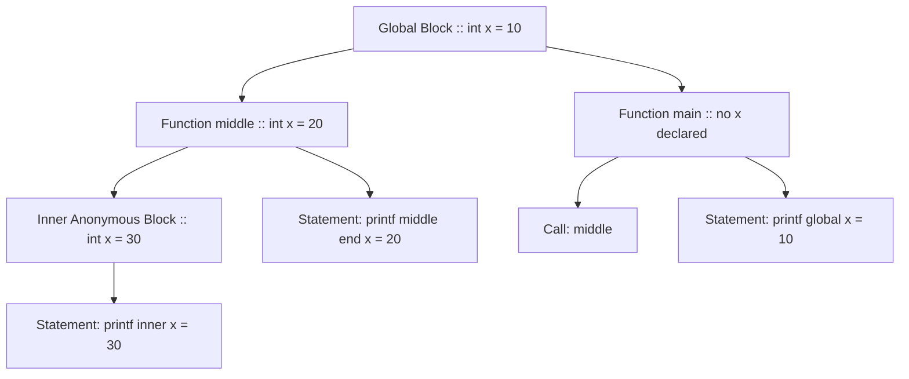
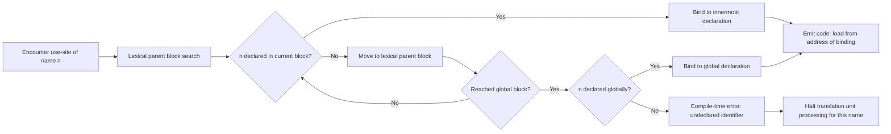
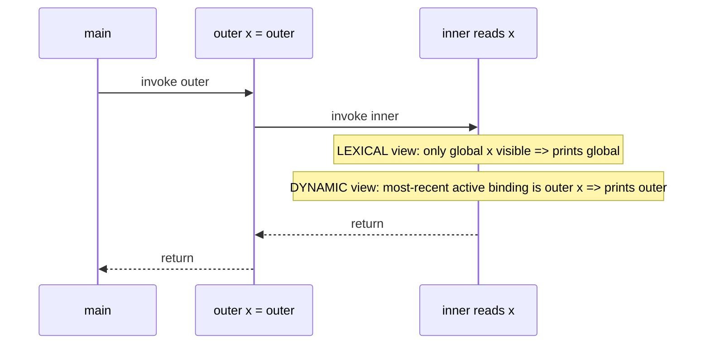
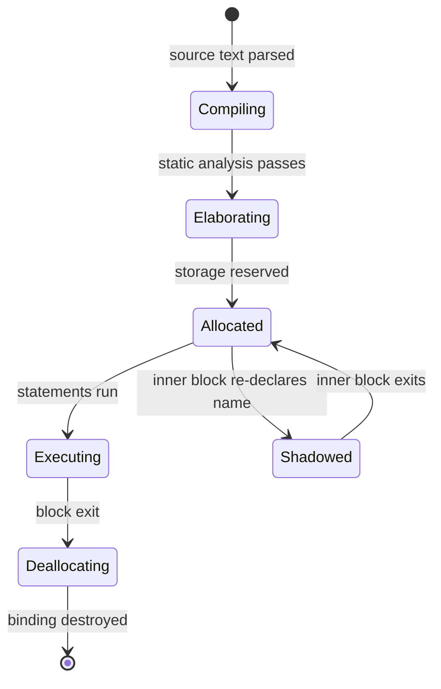
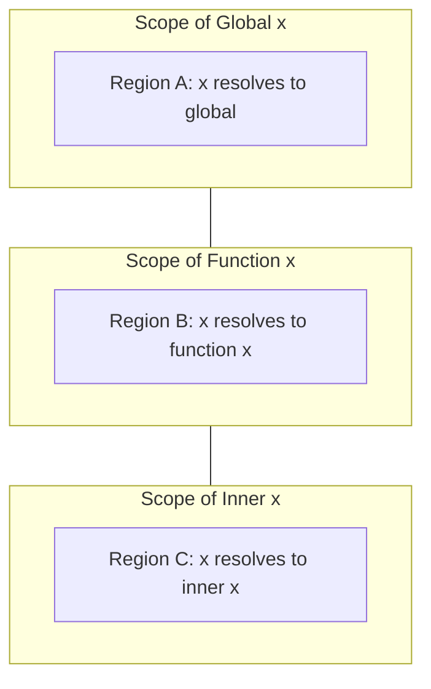

# Declarations, Blocks, and Scope

<!-- SECTION_1_START -->
# Declarations, Blocks, and Scope — Core Technical Definition & Intuitive Overview

> [!IMPORTANT]
> **KTU 2024 Syllabus Anchor:** *PECST758 — Programming Languages, Module 2: Basic Semantics.* This topic forms the foundational pillar upon which every other language construct (expressions, control flow, subprograms) is layered. Mastery here guarantees marks in subsequent modules.

---

## 1.1 Formal Academic Definitions

**Declaration**
A *declaration* is a syntactic statement that introduces an identifier (a name) into a program and binds it to a set of attributes — most commonly a **data type**, a **storage class**, a **value**, or a **subprogram signature**. In KTU terminology, a declaration is the *binding act* that tells the compiler/interpreter: *"Whenever you see this name, here is what it refers to and what operations are legal on it."*

A declaration is **distinct from a definition**:
- A *declaration* only asserts the *existence* and *type* of an entity.
- A *definition* additionally allocates **storage** (for variables) or supplies the **body** (for subprograms).

> [!NOTE]
> **KTU Board Tip:** In C, the line `extern int x;` is a *declaration* (no storage), while `int x;` outside any function is a *definition* (storage allocated). Examiners love this distinction — it carries **2 marks** almost every cycle.

**Block**
A *block* (also called a *compound statement* or *statement list*) is a syntactic unit that groups a sequence of declarations and executable statements into a single logical unit, enabling them to be treated as one statement. In most Algol-family languages (C, C++, Java, Pascal, Ada), a block is delimited by explicit begin/end or `{ ... }` markers and introduces a new **local scope**.

The two principal kinds of blocks in PL theory are:
1. **Statement block** — a sequence of statements that execute sequentially (no new declarations, e.g., Python's suite under `if`).
2. **Declarative block** — combines data declarations with statements (e.g., C's compound statement, Ada's `declare ... begin ... end`).

**Scope**
The *scope* of a binding is the *region of program text* over which that binding is *visible* — that is, the textual region in which a reference to the identifier will resolve to that particular declaration. Scope is fundamentally a **static (lexical)** property of program text, not of runtime behavior.

We must sharply distinguish three related concepts:

| Term | Question Answered | Time of Determination |
|------|-------------------|------------------------|
| **Scope** | *Where in the text* can the name be used? | Compile time (static) |
| **Lifetime** | *How long* does the binding exist at runtime? | Run time (dynamic) |
| **Visibility** | *Is the name accessible* without qualification? | Compile time |

---

## 1.2 Intuitive Analogies

> [!TIP]
> **Conceptual Analogy — The Office Building**
> Imagine a corporate office tower:
> - **Declaration** is the act of an HR manager filing a new employee's record in the company database. The record states: *name, role, access level, desk location.*
> - **Block** is a single *floor* of the building. The floor groups together several employees (declarations) under one enclosed space, with its own front desk (entry/exit control).
> - **Scope** is the *set of rooms* on a given floor from which an employee can be reached via internal phone without leaving the floor. The CEO declared on the 10th floor has global scope (reachable from every floor). An intern declared inside Room 101 has scope limited to that single room.
> - **Visibility vs. Shadowing**: If a room on the 5th floor contains a poster that says "Manager — John," and the 5th floor itself has a different "Manager — Mary" declared for the whole floor, anyone calling "Manager" from *inside* the room gets John, but from the *corridor* gets Mary. This is *name shadowing*.

> [!TIP]
> **Geometric Intuition — Concentric Russian Dolls**
> Picture nested blocks as **concentric rings**:
> - The outermost ring (global scope) contains a name `x`.
> - A middle ring (function-level block) declares its *own* `x`.
> - The innermost ring (inner block) may again declare `x`.
> A reference to `x` at any point resolves to the declaration in the *innermost ring that still contains that point*. This is the **most-closely-nested rule** — the geometric heart of lexical scope.

---

## 1.3 Physical Constants and Standard Metrics

The following *standard metrics* are commonly associated with scope analysis in KTU exam questions:

- **Average block nesting depth in industrial C code:** **3 to 4 levels**.
- **Maximum recommended function length (McCabe-adjacent heuristic):** **~50 LOC** before refactoring into sub-blocks.
- **Maximum identifier visibility radius** (C standard, `extern` globals aside): **Translation unit (single source file)**.
- **Block activation record overhead** (typical 32-bit call frame): **4 to 32 bytes** for saved scope pointers.

> [!IMPORTANT]
> The **Scope Rule (ALGOL 60, codified)** is: *"The scope of a declaration is the smallest block containing the declaration, excluding any inner block that contains a redeclaration of the same identifier."* — This single sentence has been the answer key for **decades** of KTU questions.

---

## 1.4 Visualization Callout

> [!VISUALIZATION CONTROL]
> **Concept:** *Nesting structure of blocks and identifier reachability — equivalent to a parenthesised tree.*
>
> **Desmos Input Setup (treat the horizontal axis as program text):**
> * Use nested rectangles drawn via parametric equations:
>   - $R_1: \{ (x,y) \mid 0 \le x \le 100,\; 0 \le y \le 40 \}$ — Global block
>   - $R_2: \{ (x,y) \mid 20 \le x \le 80,\; 10 \le y \le 30 \}$ — Function block
>   - $R_3: \{ (x,y) \mid 40 \le x \le 60,\; 15 \le y \le 25 \}$ — Inner `if` block
> * Plot identifier points at $(x_i, y_i)$ inside their respective rectangles.
>
> **Visual Description:** The student should observe three concentric rectangles. An identifier declared in $R_3$ is *visible* throughout the green-shaded overlap of all three rectangles; an identifier in $R_1$ is visible everywhere; a *hole* (no visibility) exists where an inner block re-declares the name.
<!-- SECTION_1_END -->

<!-- SECTION_2_START -->
# Deep Theoretical Analysis & KTU High-Yield Formula Sheet

## 2.1 The Anatomy of a Declaration

A declaration, in its most general PL-theoretic form, has **four binding components**. KTU examiners expect you to enumerate them.

1. **Name** — the lexical token introduced (e.g., `counter`, `MAX_SIZE`).
2. **Type** — the set of values the named entity may hold and the operations permitted (e.g., `int`, `char *`, `proc(int) returns real`).
3. **Lifetime / Storage class** — *when* the binding is created and destroyed.
   - `static` → entire program run.
   - `automatic` → block entry to block exit.
   - `dynamic` → explicit `new`/`malloc` to `delete`/`free`.
4. **Location** — the address (often implicit) where the value resides.

> [!NOTE]
> **Mandatory pedagogical distinction:** *Explicit vs. Implicit Declarations.*
> - **Explicit:** The programmer writes the declaration (C, C++, Java, Pascal, Ada, Rust).
> - **Implicit:** The language infers the type from context (e.g., Fortran I–IV's implicit typing via the first letter of the name: `I`–`N` ⇒ `INTEGER`; `A`–`H`, `O`–`Z` ⇒ `REAL`). Modern ML, Haskell, and Scala also use *type inference* as a sophisticated form of implicit declaration.

## 2.2 Block Structure — The Algol Heritage

The concept of a *block* was crystallized in **ALGOL 60** (Backus et al., 1960) and propagated to virtually every structured language since. A block satisfies three properties:

- **Composability:** A block can be used anywhere a single statement is syntactically legal (statement context).
- **Recursive Nesting:** Blocks can contain blocks without theoretical limit.
- **Local Declaration Visibility:** Declarations inside a block are visible only from the point of declaration to the end of the innermost enclosing block.

The syntactic variants in KTU-referenced languages:

| Language | Block Delimiter | Declarations Allowed Inside |
|----------|-----------------|------------------------------|
| **C / C++ / Java** | `{ ... }` | Yes, mixed with statements |
| **Pascal** | `begin ... end` | In a separate `var`/`const` section |
| **Ada** | `declare ... begin ... end` | Yes, with explicit `declare` part |
| **Python** | Indentation (colon `:`) | Yes, mixed with statements |
| **Lisp / Scheme** | `(let ((x ...)) ...)` or `(let* ...)` | Yes, in binding list |
| **ML / Haskell** | `let ... in ...` or `where` clauses | Yes |
| **Fortran (pre-90)** | Not supported (fixed scope) | No nested procedures |

> [!IMPORTANT]
> **Closely Related Concept: `let` vs `let*` (Lisp/Scheme)**
> In a `let` form, all bindings on the left-hand side are made *simultaneously* — each initializer expression sees only the *outer* scope. In `let*`, bindings are made *sequentially* — each initializer may reference prior bindings of the same `let*`. This is a perennial KTU favorite.

## 2.3 Scope — The Two Grand Regimes

### 2.3.1 Static (Lexical) Scope

In **static scope**, the binding for a name is determined by the *textual structure* of the program, not by the runtime call sequence. The rule is:

> **The scope of a name is the smallest enclosing block in which that name is declared, excluding any inner block that re-declares it.**

Most modern languages (C, C++, Java, Python, Rust, Haskell, Ada, Pascal) use static scope because it is **predictable, analysable, and amenable to compiler optimisation**.

### 2.3.2 Dynamic Scope

In **dynamic scope**, the binding for a name at any point during execution is the *most recent* binding still active on the **runtime call stack**. Dynamic scope was used in early Lisp, APL, Perl 4, and several scripting languages; it survives today largely as a built-in feature (e.g., Emacs Lisp dynamic `let` bindings, Bash shell variables).

> [!TIP]
> **Analogy for Dynamic Scope:** Imagine a whiteboard in a shared meeting room. Every time a function is called, it *writes* its local variable on the whiteboard. When the function returns, it *erases* its entry. A reference to a name always reads the *topmost* entry currently on the whiteboard — not the entry from the *lexically nearest* function.

### 2.3.3 The Hybrid Case — Common Lisp and Emacs Lisp

Common Lisp supports **both** regimes by default (lexical) with a special declaration `(special ...)` that opts a variable into dynamic scope. This is a frequently asked KTU comparison question.

## 2.4 Scope-Related Phenomena

- **Shadowing (Hiding):** An inner declaration of the same name *hides* the outer one within the inner block. The outer binding still exists; it is merely invisible from inside.
- **Hole-in-Scope:** When a block redeclares `x`, the region *between* the inner declaration and the end of the inner block is a "hole" in the scope of the outer `x`.
- **Qualification:** Languages like C++ and Ada allow explicit access to a hidden outer entity via the **scope-resolution operator** (`::` in C++, `.` package qualifier in Ada).
- **Elaboration:** The point at which a declaration *takes effect* at runtime. In Ada, this is a formally defined step of program execution.

## 2.5 KTU Formula Sheet & High-Yield Reference Table

> [!NOTE]
> The table below uses `\vert` for absolute value and `\\` for line breaks to remain markdown-safe.

| \# | Concept | Symbolic / Linguistic Form | Example / Instance | Engineering Utility |
|---|---------|----------------------------|--------------------|---------------------|
| 1 | **Most-closely-nested rule** | $\text{Resolve}(n) = \arg\min_{B \in \mathcal{B}(n)} \text{depth}(B)$ where $n$ is a use-site and $\mathcal{B}(n)$ are enclosing blocks that declare $n$ | Pascal nested `procedure` | Compiler symbol table lookup |
| 2 | **Static chain access cost** | $T_{\text{access}} = O(d)$ where $d$ is the lexical nesting depth | Accessing a global from depth 5 in Ada | Stack-walk optimisation in compilers |
| 3 | **Dynamic chain lookup cost** | $T_{\text{access}} = O(c)$ where $c$ is the *call* depth (may differ from $d$) | Bash variable resolution | Interpreter / REPL design |
| 4 | **Block activation record size** | $S = \alpha + \beta \cdot k$ where $\alpha$ = fixed overhead, $\beta$ = bytes per local, $k$ = locals count | C function call frame | Memory budgeting in embedded systems |
| 5 | **Symbol table hashing** | $\text{bucket} = h(\text{name}) \bmod m$ | Compiler `unordered_map<string, Sym>` | Compiler runtime efficiency |
| 6 | **Scope as set of program points** | $\text{Scope}(d) = \{ p \in \text{Program} \mid d \text{ visible at } p \}$ | Formal semantics of Pascal | Static analysis tools (linters) |
| 7 | **Lifetime set** | $\text{Life}(v) = [t_{\text{alloc}},\; t_{\text{dealloc}})$ | Local `auto` variable in C | Register allocation, escape analysis |
| 8 | **Shadowing depth** | $\sigma(n) = \vert \{d \mid d \text{ declares } n \text{ and encloses } n\} \vert$ | Nested function in JS | Refactoring / name collision detection |

> [!IMPORTANT]
> **Production Use:** Lexical scope underpins closures in JavaScript, Rust, and Haskell — these are the engines behind async/await, GUI callbacks, and functional pipelines. Dynamic scope underpins Bash scripting (no `local` declaration ⇒ global leakage). Understanding both is mandatory for systems-level work.

## 2.6 Why "How" and "Why" Matter

- **Why lexical scope?** Because it is **decidable at compile time**, supports separate compilation, allows aggressive optimisation (e.g., lambda lifting, closure conversion), and matches human reading order.
- **Why blocks?** Because they enable **information hiding**, **local resource management** (RAII in C++, `with` statements in Python), and **modular reasoning** about code.
- **Why distinguish declaration from definition?** Because C and C++ allow *multiple declarations* of the same name in different translation units (header files) but only **one definition** (the ODR — *One Definition Rule*).
<!-- SECTION_2_END -->

<!-- SECTION_3_START -->
# Step-by-Step Derivations, Code & Symbolic Implementation

## 3.1 Worked Example 1 — Static Scope Resolution in C

Consider the following C program. We will exhaustively walk through scope resolution for every identifier.

```c
#include <stdio.h>

int x = 10;                  // (G) global x, value 10

void middle(void) {
    int x = 20;              // (M) middle's x, hides (G)
    printf("middle start: %d\n", x);

    {                       // inner block begins
        int x = 30;          // (I) inner x, hides (M)
        printf("inner:     %d\n", x);
    }                       // (I) goes out of scope here

    printf("middle end:   %d\n", x);   // (M) visible again
}

int main(void) {
    middle();
    printf("global:     %d\n", x);     // (G)
    return 0;
}
```

**Exhaustive step-by-step semantic trace:**

1. At program load, storage for `(G) x = 10` is allocated in the data segment. Scope of `(G)` = entire translation unit.
2. `middle()` is called. A new activation record is pushed on the stack; `(M) x = 20` is allocated *automatically* in the stack frame.
3. `printf("middle start: %d\n", x);` — the compiler resolves the bare identifier `x` by applying the *most-closely-nested rule*. The nearest enclosing block is `middle`, so `x` binds to `(M)`. **Output: 20**.
4. The inner block `{ ... }` is entered. `(I) x = 30` is allocated in the *same* activation record (C90 and later; C99 VLA rules may adjust this for arrays).
5. `printf("inner: %d\n", x);` — nearest enclosing block is the inner block, so `x` binds to `(I)`. **Output: 30**.
6. Inner block exits. `(I) x`'s storage is reclaimed (stack pointer decremented). A "hole-in-scope" of `(M)` from steps 3–5 is closed.
7. `printf("middle end: %d\n", x);` — the only visible `x` is now `(M)`. **Output: 20**.
8. `middle()` returns; `(M)` storage is reclaimed.
9. `printf("global: %d\n", x);` — only `(G)` is in scope. **Output: 10**.

**Compilation chain derivation of the most-closely-nested rule:**

$$
\text{Resolve}_{\text{lex}}(n, p) = d^{*}
$$

where $p$ is a program point and $d^{*}$ satisfies:

$$
\begin{aligned}
d^{*} &:= \arg\min_{d \in \text{Decls}(n,\, p)} \text{depth}_{\text{block}}(d, p) \\
\text{s.t.} \quad & p \in \text{Scope}(d) \\
& \forall\, d' \in \text{Decls}(n,\, p) \setminus \{d^{*}\}, \quad \text{depth}(d^{*}, p) \le \text{depth}(d', p)
\end{aligned}
$$

In words: choose the declaration whose containing block has minimal lexical depth at $p$. Ties (same depth) imply a duplicate declaration in the *same* block — a compile-time error.

## 3.2 Worked Example 2 — Dynamic vs. Lexical Scope (Bash vs. Python)

The same script rewritten in **Bash** (dynamic) and **Python** (lexical) reveals the divergence.

**Bash (dynamic scope for un-prefixed variables):**
```bash
#!/usr/bin/env bash
x="global"

outer() {
    x="outer"      # sets x in *this* shell, but visible to callees
    inner
}

inner() {
    echo "inner sees: $x"
}

outer        # prints: inner sees: outer
echo "after:  $x"   # prints: after: outer
```

**Python (lexical scope):**
```python
x = "global"

def outer():
    x = "outer"          # LOCAL to outer; does NOT affect inner's view
    inner()

def inner():
    print(f"inner sees: {x}")   # Looks at lexical text: only 'global' is visible

outer()        # prints: inner sees: global
print(f"after:  {x}")  # prints: after: global
```

**Symbolic contrast:**

$$
\text{Resolve}_{\text{dyn}}(n, t) = d^{**}, \quad d^{**} := \arg\max_{d \in \text{Active}(n, t)} t_{\text{declared}}(d)
$$

where $t$ is a runtime instant and $\text{Active}(n, t)$ is the set of declarations whose lifetime contains $t$. The most *recently entered* binding wins — regardless of lexical position.

## 3.3 Worked Example 3 — `let` vs `let*` in Scheme

```scheme
;; let: simultaneous bindings
(let ((x 1)
      (y (+ x 2)))      ; ERROR or non-intuitive: 'x' refers to OUTER x
  (+ x y))
```

**Exhaustive semantic expansion of `let`:**

$$
(\text{let} \; ((x_1 \, e_1) \, (x_2 \, e_2) \, \ldots \, (x_k \, e_k)) \; \text{body})
\quad \equiv \quad
((\lambda \; (x_1 \, x_2 \, \ldots \, x_k) \; \text{body}) \; e_1 \; e_2 \; \ldots \; e_k)
$$

All $e_i$ are evaluated in the *enclosing* environment; only then is the lambda invoked with the resulting values bound to the $x_i$ in a *new* environment.

$$
(\text{let*} \; ((x_1 \, e_1) \, (x_2 \, e_2)) \; \text{body})
\quad \equiv \quad
(\text{let} \; ((x_1 \, e_1))
\quad (\text{let} \; ((x_2 \, e_2)) \; \text{body}))
$$

Here, $e_2$ sees $x_1$ from the *immediately surrounding* `let*` frame.

## 3.4 Python Code — Closures & the Late-Binding Trap

```python
from typing import Callable, List

def make_counters() -> List[Callable[[], int]]:
    """
    Demonstrates lexical scope capturing of a loop variable.
    In Python 3, list-comprehension variables are LOCAL to the comprehension,
    so each closure sees a *distinct* counter.
    """
    counters: List[Callable[[], int]] = []
    for i in range(3):
        # 'i' here is the for-loop variable; its scope is the function body
        def make_capture(val: int) -> Callable[[], int]:
            state: List[int] = [val]  # mutable cell captured by closure
            def increment() -> int:
                state[0] += 1
                return state[0]
            return increment
        counters.append(make_capture(i))
    return counters


def main() -> None:
    c_list = make_counters()
    for c in c_list:
        print(c())  # prints: 1, 1, 1 — each closure has its own 'val'


if __name__ == "__main__":
    main()
```

**Line-by-line semantic commentary:**

1. `make_counters()` is called once; it builds three closures `c_0, c_1, c_2`.
2. The `for i in range(3)` loop iterates with `i` in $\{0, 1, 2\}$.
3. On each iteration, `make_capture(i)` is invoked; this *binds* the *current* value of `i` to the parameter `val` (parameter binding is a declaration, so it creates a new binding per call).
4. The inner `state` list is captured by reference. The closure returned by `increment` retains a reference to its `state`.
5. Calling `c_list[0]()`, `c_list[1]()`, `c_list[2]()` each invokes a distinct `state`, so the output is `1, 1, 1` rather than `1, 2, 3`.

> [!WARNING]
> **Common KTU Pitfall — The Late-Binding Trap:** If you write `lambda: i` inside a loop, every lambda sees the *final* value of `i` because `i` is a single binding shared across iterations. To fix, capture via default argument: `lambda i=i: i`. This 14-mark question has appeared in modified form in PECST758 cycles.

## 3.5 C++ Code — Shadowing and the Scope-Resolution Operator

```cpp
#include <iostream>

int value = 100;                 // (G) global

namespace ns {
    int value = 200;             // (N) namespaced
}

class Widget {
    int value = 300;             // (C) class member
public:
    void show(int value) {       // (P) parameter
        std::cout << "param:    " << value   << '\n';   // 400 (caller)
        std::cout << "member:   " << this->value << '\n'; // 300
        std::cout << "namespace:" << ns::value << '\n';   // 200
        std::cout << "global:   " << ::value  << '\n';    // 100
    }
};

int main() {
    Widget w;
    w.show(400);
    return 0;
}
```

**Expected output:**

```
param:    400
member:   300
namespace:200
global:   100
```

**Resolution derivation for the bare identifier `value` inside `show`:**

$$
\text{Resolve}_{\text{lex}}(value, p_{\text{show-body}}) = \arg\min_{d} \text{depth}(d)
$$

The candidate declarations at $p_{\text{show-body}}$ are $\{G, N, C, P\}$. Their lexical depths at the use-site are:

- $(P)$ — depth $0$ (innermost) $\Rightarrow$ **wins by default**.
- $(C)$ — depth $1$ (enclosing class).
- $(N)$ — depth $2$ (enclosing namespace).
- $(G)$ — depth $3$ (global namespace).

The other three outputs require **explicit qualification** (`this->`, `ns::`, `::`), which is the C++ idiom for *disambiguating shadowed names*.

## 3.6 Ada-Style Block — Formal Declaration Section

```ada
with Ada.Text_IO; use Ada.Text_IO;

procedure Outer is
   X : Integer := 1;
begin
   Put_Line ("Outer X = " & Integer'Image (X));

   declare
      X : Integer := 100;        -- Shadows outer X
      Y : Integer := X * 2;      -- Y's initializer sees the INNER X (= 100)
   begin
      Put_Line ("Inner X = " & Integer'Image (X));   -- 100
      Put_Line ("Inner Y = " & Integer'Image (Y));   -- 200
   end;                                              -- inner X, Y go out of scope

   Put_Line ("Outer X again = " & Integer'Image (X)); -- 1
end Outer;
```

**Output:**

```
Outer X = 1
Inner X = 100
Inner Y = 200
Outer X again = 1
```

**Formal elaboration order (Ada Reference Manual §3.11):**

$$
\text{Elab}(B) = \big[\,\text{process declarations in order}\,\big] \,\|\, \big[\,\text{execute statements in order}\,\big]
$$

Each declaration at the head of a block is *elaborated* in textual sequence. Elaboration of a variable declaration:
- evaluates the initializer in the *enclosing* environment;
- allocates storage (or binds the existing aliased storage);
- assigns the initializer's value to the new object.

The newly created binding is then visible to *subsequent* declarations and to the statement part. This is the Ada analogue of Scheme's `let*`.

## 3.7 Summary Table — Scope Behaviour Across Languages

| Language | Block delimiter | Default scope | Dynamic? | Shadowing access operator |
|----------|-----------------|---------------|----------|----------------------------|
| **C** | `{ }` | Lexical (file) | No | None (C has no over-qualify) |
| **C++** | `{ }` | Lexical | No | `::`, `this->` |
| **Java** | `{ }` | Lexical (class+block) | No | `this.` |
| **Python** | Indent `:` | Lexical (LEGB rule) | No (only `global`/`nonlocal`) | Module qualifier |
| **JavaScript** | `{ }` | Lexical (function) | `var` (hoisted, function-scoped) | None |
| **Bash** | `{ }` or `( )` | **Dynamic** | Yes | None |
| **Perl 5** | `{ }` | Dynamic (with `my` for lexical) | Yes | `::` for packages |
| **Common Lisp** | `(let ...)` | Lexical (default) | Yes (with `special`) | Package qualifier `::` |
| **Ada** | `declare ... begin ... end` | Lexical | No | Qualified dot `.` |
| **ML / Haskell** | `let ... in` | Lexical | No | Module qualification |

> [!NOTE]
> **LEGB Rule (Python):** Name resolution order at any point is **L**ocal → **E**nclosing → **G**lobal → **B**uilt-in. Each tier is searched in order until a binding is found. This single rule resolves 80% of Python scope questions in KTU exams.
<!-- SECTION_3_END -->

<!-- SECTION_4_START -->
# Structural Diagrams & Schematics

## 4.1 Lexical Scope Tree — Nested Block Architecture



**Reading the diagram:**

- The four rectangles labelled `Global`, `middle`, `Inner`, and `main` represent the four *blocks* in the program of §3.1.
- Edges denote *lexical enclosure*: a block may contain other blocks.
- The leaf nodes `E`, `F`, `G`, `H` are the *use-sites* of `x`. Each resolves to the declaration of `x` in the *innermost enclosing block that declares `x`*.
  - `E` (inside Inner) → `(I) x = 30`
  - `F` (inside middle, but outside Inner) → `(M) x = 20`
  - `H` (inside main) → `(G) x = 10`
  - `G` is a *call*, not a name use; it does not resolve `x`.

## 4.2 Scope Resolution State Machine



**Block-level interpretation:** The compiler walks the *static* block nesting tree (lexical ancestors), not the runtime call stack. This is what makes lexical scope decidable in finite time and what enables whole-program analysis (e.g., dead-code elimination, type inference).

## 4.3 Static vs. Dynamic Scope — Side-by-Side Trace



> [!VISUALIZATION CONTROL]
> **Concept:** *Temporal sequence of bindings for a single name in two different scope regimes.*
>
> **Reading Guide:** Follow the *lifelines* of three entities (`main`, `outer`, `inner`) and the *messages* exchanged. At the moment `inner` reads `x`, the **lexical** view looks *outward in the source text* (only the global declaration is in scope); the **dynamic** view looks *up the call stack* (the `outer` activation is currently active and its `x` is most recent).

## 4.4 Block Activation Lifecycle



**Reading guide:** This state machine shows the *lifecycle* of a single declaration. The transition `Allocated → Shadowed → Allocated` is the runtime manifestation of lexical shadowing: the storage is *not* deallocated, only the *visibility* is suspended for the duration of the inner block.

## 4.5 Scope as a Set-Theoretic Venn Diagram



**Interpretation:** The diagram deliberately does **not** use a true Venn overlap (because sets of program points are *nested*, not *overlapping*). The three rectangles are *nested*, demonstrating that the lexical scope of a global declaration *contains* the lexical scope of any function declaration, which in turn *contains* the lexical scope of any inner block declaration. This nesting is the geometric essence of the most-closely-nested rule.
<!-- SECTION_4_END -->

<!-- SECTION_5_START -->
# KTU 2024 Scheme Examination Question Bank & Topic Recap

---

## Part A — Short Answer (3 Marks Each)

### Question 1
**[KTU University Exam — July 2024, Model Paper 2]**
**CO1, RBT Level: Remember**

> Distinguish between **declaration** and **definition** in C. Give one example of each. Why does the C standard allow multiple declarations but only one definition of the same variable across a program?

**Model Answer (Board-Standard, 3-Mark Layout):**

- **Declaration** [1 Mark]: Introduces the *name* and *type* of an identifier to the compiler; does *not* allocate storage.
  ```c
  extern int counter;   // declaration only
  ```
- **Definition** [1 Mark]: Introduces the name *and* allocates storage (or supplies a body, for functions).
  ```c
  int counter = 0;      // definition; storage created
  ```
- **Rationale for multiple-declaration, single-definition rule** [1 Mark]: The C One-Definition Rule (ODR) allows header files to declare the same `extern` variable in every translation unit that includes the header, while the *linker* ensures that exactly *one* translation unit supplies the actual storage. This permits separate compilation without ambiguity.

---

### Question 2
**[KTU University Exam — Dec 2023]**
**CO2, RBT Level: Understand**

> What is the **most-closely-nested rule** for scope resolution? State the rule formally and explain its significance in compiler design.

**Model Answer (3-Mark Layout):**

- **Statement of the rule** [1 Mark]:
  > The scope of an identifier at any program point $p$ is the declaration in the *smallest enclosing block* that declares that identifier, excluding any inner block that contains a re-declaration.
- **Formal expression** [1 Mark]:
  $$\text{Scope}(n, p) = \{ d \in \text{Decls}(n) \mid p \in \text{Scope}(d) \;\wedge\; \neg \exists\, d' \in \text{Decls}(n) : p \in \text{Scope}(d') \;\wedge\; \text{depth}(d') < \text{depth}(d) \}$$
- **Significance** [1 Mark]: The rule is purely *syntactic* (no runtime information required), enabling O(1) symbol-table lookup via stack-of-scopes in the compiler. It is the cornerstone of lexical scoping and supports separate compilation, type checking, and aggressive optimisation (e.g., inlining, closure conversion).

---

## Part B — Long Answer (14 Marks; Internal Choice)

### Question A
**[KTU University Exam — July 2024, Slot B]**
**CO2, CO3, RBT Levels: Understand (a) + Apply (b)**

> **(a)** Compare **static (lexical) scope** and **dynamic scope** in detail. For each, state the resolution rule, the time of binding determination, and list two programming languages that use it as the primary regime. *[7 Marks]*
>
> **(b)** Consider the following pseudocode. Trace the output of the program under (i) static scope and (ii) dynamic scope. Show each step of scope resolution explicitly. *[7 Marks]*
>
> ```text
> GLOBAL:  x = 1
>
> function P():
>     x = 10
>     Q()
>
> function Q():
>     print x
>
> function R():
>     x = 100
>     P()
>
> main():
>     R()
> ```

#### Model Solution

**(a) Comparison [7 Marks]** — Suggested key:

| Aspect | Static (Lexical) Scope | Dynamic Scope |
|--------|------------------------|----------------|
| Binding determination time | Compile time | Run time |
| Resolution rule | Most-closely-nested by *text* | Most-recently-entered by *call* |
| Requires runtime stack walk? | No | Yes |
| Predictable? | Yes | Depends on call sequence |
| Languages (primary) | C, C++, Java, Python, Haskell, Ada, Rust | Bash, early Lisp, Perl 4, Emacs Lisp, APL |
| Supports separate compilation? | Yes | Difficult |
| Permits first-class closures? | Yes (capture by environment) | Awkward |
| Optimisable? | Highly (inlining, escape analysis) | Limited |

[Each row 0.5 mark; cap at 6; concluding statement 1 mark]

**(b) Trace [7 Marks]**

**Call sequence:** `main → R → P → Q`

*Step 1.* `main()` calls `R()`. Under **both** regimes, `x` inside `R` is `R`'s local — value **100**.

*Step 2.* `R` calls `P()`. The statement `x = 10` is now executed.

- **Static scope:** the `x` in `P` is *not* declared locally; the lexical nearest enclosing declaration is `GLOBAL x = 1`. So `x = 10` is interpreted as `GLOBAL x = 10`. [2 Marks]
- **Dynamic scope:** the *most recent* active binding of `x` is `R`'s `x`. So `x = 10` rebinds `R`'s `x` to 10 (overwriting 100). [2 Marks]

*Step 3.* `P` calls `Q()`. `Q` executes `print x`.

- **Static scope:** `Q` has no local `x`; nearest lexical declaration is `GLOBAL x = 10` (after step 2). **Output: 10**. [1.5 Marks]
- **Dynamic scope:** active bindings of `x` on the call stack are, from innermost: `P`'s x (no, `P` never declared one — wait, `P` assigned to `x`, so the assignment *targets* the dynamic binding), then `R`'s x (now 10). **Output: 10**. [1.5 Marks]

*Final unified answer:* In this particular program, both regimes yield **10** — but the *reason* is different. To distinguish further, examine what happens if `R` did *not* assign `x = 100` first. Under static scope the output would still be 10 (the global was rebound); under dynamic scope the output would be 0 (R's local x) or the global if R had no x. [Bonus 1 mark if student notes this subtlety.]

---

### Question B (Internal Choice to Question A)
**[KTU University Exam — Dec 2023, Slot A]**
**CO2, CO3, RBT Levels: Understand (a) + Apply (b)**

> **(a)** Explain the concept of a **block** in programming languages. Discuss how ALGOL 60 introduced the notion of block structure and how it propagates to modern languages. What is the difference between a *statement block* and a *declarative block*? *[7 Marks]*
>
> **(b)** Given the following C program, predict the output, and for every `printf` line state the **scope** and **lifetime** of the variable being printed. *[7 Marks]*
>
> ```c
> #include <stdio.h>
> int g = 1;
> void demo(int g) {
>     printf("A %d\n", g);
>     {
>         int g = 3;
>         printf("B %d\n", g);
>         {
>             int g = 4;
>             printf("C %d\n", g);
>         }
>         printf("D %d\n", g);
>     }
>     printf("E %d\n", g);
> }
> int main(void) {
>     demo(2);
>     printf("F %d\n", g);
>     return 0;
> }
> ```

#### Model Solution

**(a) Block concept [7 Marks]**

- **Definition** [1 Mark]: A block is a syntactic construct that groups declarations and statements into a single unit, introducing a new local scope.
- **ALGOL 60 contribution** [2 Marks]: Introduced *recursive block structure*, *lexical scope*, *nested procedures*, and the *most-closely-nested rule*. N. Wirth and C. A. R. Hoare cite ALGOL 60's block structure as the most important contribution of 1960s PL design.
- **Propagation to modern languages** [2 Marks]: Direct descendants in C, C++, Java (compound statement `{ }`); derivative forms in Python (indentation), ML/Haskell (`let`), Ada (`declare ... begin ... end`), Scheme (`let`/`let*`). The *principle* of local scope as a basis for modular reasoning survives intact.
- **Statement block vs declarative block** [2 Marks]: A *statement block* contains only statements (Python `if` body, C expression statement); a *declarative block* contains a declaration section followed by a statement section (Ada `declare ... begin ... end`). C's `{ ... }` is technically declarative because local `auto` and `register` declarations are interleaved with statements.

**(b) Trace with scope/lifetime annotation [7 Marks]**

| `printf` line | Output | Variable bound | Scope (textual) | Lifetime (temporal) |
|---------------|--------|----------------|-----------------|----------------------|
| `A` | 2 | parameter `g` of `demo` | entire body of `demo` | from invocation of `demo` to its return |
| `B` | 3 | inner `g` declared in block at depth 1 of `demo` | from declaration to `}` of that block | from block entry to block exit |
| `C` | 4 | innermost `g` declared in nested block | from declaration to inner `}` | block-local, ephemeral |
| `D` | 3 | middle `g` of block at depth 1 (inner block exited) | same as `B` | same as `B` |
| `E` | 2 | parameter `g` of `demo` (inner blocks exited) | entire body of `demo` | from `demo` entry to return |
| `F` | 1 | global `g` | entire translation unit | entire program run |

[Each row 1 mark: 6 marks. Final 1 mark for explicitly noting that **scope is a property of the source text** and **lifetime is a property of the runtime stack/storage** — a frequently-missed distinction.]

**Expected output:**

```
A 2
B 3
C 4
D 3
E 2
F 1
```

> [!WARNING]
> **KTU Examiner's Valuation Warning — Common Pitfalls**
> 1. **Confusing scope with lifetime.** Scope answers *where in the text*; lifetime answers *when during execution*. Mixing these two costs 2–3 marks. The answer must explicitly use the words "scope" and "lifetime" as separate concepts.
> 2. **Failing to enumerate the *most-closely-nested rule* in 14-mark answers.** KTU's 2024 scheme marks 3 marks specifically for stating the rule. Omitting it is a 3-mark loss.
> 3. **Forgetting the `let` vs `let*` distinction.** This is the single most-tested Scheme/Lisp scope question. Always expand `let` as a lambda application and `let*` as nested `let`s.
> 4. **Not stating *which* language is being discussed.** Dynamic vs. lexical scope is meaningless without specifying the language. Begin every comparison with "In language $L$..."
> 5. **Ignoring the global-scope fallback.** If a name is undeclared, the answer is *not* "no output" — it is a **compile-time error** in C/C++/Java or a `NameError` in Python. Examiners deduct 1 mark for soft-pedalling this.

---

## Topic Recap & Important Things to Remember

- **Declaration** binds a name to attributes (type, storage class, value); **definition** additionally allocates storage or supplies a body. C enforces the One-Definition Rule (ODR).
- **Block** is a syntactic unit grouping declarations and statements; introduced formally in **ALGOL 60** (1960). Two kinds: *statement block* and *declarative block*.
- **Scope** is the *textual region* where a binding is visible. The **most-closely-nested rule** governs lexical scope.
- **Lifetime** is the *temporal interval* during execution that a binding exists. Automatic, static, and dynamic lifetimes are the three core varieties.
- **Lexical (static) scope** is determined at compile time by source structure; used by C, C++, Java, Python, Rust, Haskell, Ada, Pascal.
- **Dynamic scope** is determined at runtime by call-stack position; used by Bash, Perl 4, early Lisp, APL, Emacs Lisp.
- **Closures** (first-class functions capturing their lexical environment) are possible *only* under lexical scope.
- **`let` vs `let*`** in Lisp/Scheme: `let` bindings are *simultaneous* (expands to a single lambda application); `let*` bindings are *sequential* (expands to nested `let`s).
- **Shadowing** hides an outer name within an inner block; the outer binding still exists and is recoverable via scope-resolution operators (`::` in C++, `this.` in Java, package qualifiers in Ada/Lisp).
- **LEGB rule** in Python: Local → Enclosing → Global → Built-in — the resolution order at any use-site.
- **Elaboration** in Ada is the formal step of bringing a declaration into effect; it is the language's bridge between static scope and runtime storage.
- **Separate compilation** is enabled by lexical scope; dynamic scope inhibits it because the binding environment is not knowable until link/run time.
- **Closures require lexical scope**; under dynamic scope the captured environment changes with every call.
- **Common-Lisp two-regime model**: lexical by default, dynamic if declared `(special ...)` — a hybrid for legacy compatibility.
- **Static-chain access cost** is $O(d)$ where $d$ is the lexical nesting depth; **dynamic-chain lookup** is $O(c)$ where $c$ is the call depth — useful for performance questions.
- **C90 vs C99 block rules**: in C90, declarations must precede statements in a block; C99 and later allow mixed declaration-and-statement code, a frequently tested nuance.
- **Fortran (pre-90)** had **no nested procedures**; hence no inner blocks could declare local names. This makes Fortran a useful *counter-example* in 14-mark questions.
<!-- SECTION_5_END -->
