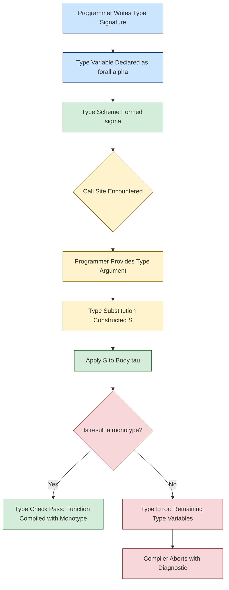
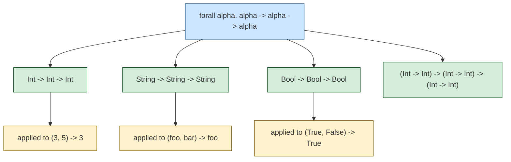
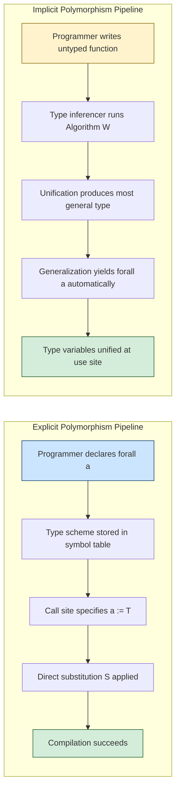
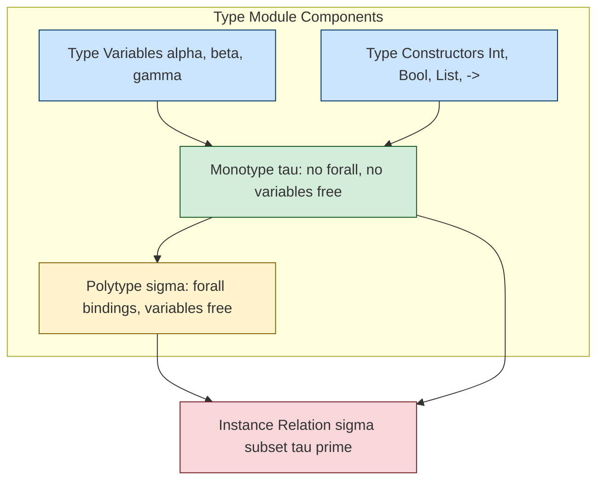
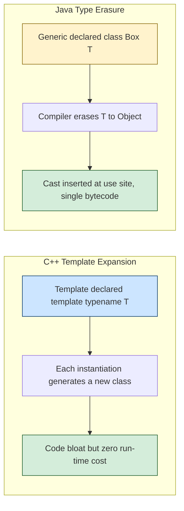

# Explicit Polymorphism

<!-- SECTION_1_START -->
# Explicit Polymorphism — Core Technical Definition & Intuitive Overview

> [!IMPORTANT]
> **KTU 2024 Scheme — Module 2: Basic Semantics**
> **Course:** Programming Languages (PECST758)
> **Topic:** Explicit Polymorphism

## Formal Academic Definition

**Explicit Polymorphism** is a form of **parametric polymorphism** in which the programmer is *required* to **declare or annotate the type parameters** at the point of definition or at the point of use. Unlike *implicit polymorphism* (where the compiler infers the type), explicit polymorphism forces the user to *write down* the type variables, making the polymorphism **visible in the source code**.

Formally, an explicitly polymorphic function has a universally quantified type scheme of the form:

$$\forall \alpha_1, \alpha_2, \dots, \alpha_n.\ \tau$$

where each $\alpha_i$ is a **type variable** explicitly named by the programmer, and $\tau$ is the body type constructed using these variables.

> [!NOTE]
> **Syllabus Highlight:** Explicit polymorphism is the foundation of *generic programming* in languages such as **C++ (templates)**, **Java (generics)**, **Haskell (type signatures)**, and **Standard ML (type abbreviations and datatype polymorphism)**.

## Conceptual Analogy / Intuition

Think of a **Swiss Army knife with labeled attachments**:

- An **implicitly polymorphic** knife automatically selects the blade for the material it is cutting (the compiler *guesses*).
- An **explicitly polymorphic** knife has each blade **labeled** "Wood", "Metal", "Plastic", and the user must **explicitly choose** and **declare** which blade to use.

In programming terms:

```haskell
-- IMPLICIT (type inferred)
id x = x              -- compiler guesses id :: a -> a

-- EXPLICIT (programmer states the type)
id :: forall a. a -> a
id x = x
```

Here, the keyword `forall a` makes the polymorphism **explicit**. The programmer has *taken the responsibility* of declaring that `a` can be any type.

## Polymorphism — The Broad Family Tree

Polymorphism is divided into several major categories. Explicit polymorphism is a sub-classification of **parametric polymorphism**.

| Polymorphism Kind | Definition | Explicit? | Example Language |
|---|---|---|---|
| **Ad-hoc (overloading)** | Same name, different meanings by argument type | Partial | C++ operator overloading |
| **Parametric** | Uniform behavior across all types | Can be either | Haskell, ML, Java Generics |
| **Subtype (Inclusion)** | Subclass instances replace superclass | Implicit | Java, C# |
| **Explicit Parametric** | Type parameters declared by programmer | **Yes** | Haskell `forall`, C++ `<T>` |
| **Implicit Parametric (let-poly)** | Type variables generalized automatically | **No** | ML, Haskell (default) |

## Standard Metrics & Notations

- **Type Variable**: a lowercase Greek or Latin letter such as $\alpha$, $\beta$, or `a`, `b` that ranges over the set of all types.
- **Type Scheme**: the universally quantified form $\forall \alpha.\ \tau$.
- **Generic Instance**: obtained by substituting a concrete type for a type variable, e.g., $\forall \alpha.\ \alpha \to \alpha$ instantiated to $\text{Int} \to \text{Int}$.

> [!TIP]
> In **Hindley–Milner type systems** (the foundation of ML and Haskell), the *implicit* form is generated automatically by the type inferencer, while the *explicit* form is what the user writes when a **type signature** is provided.

## GeoGebra / Desmos Integration

> [!VISUALIZATION CONTROL]
> **Concept:** Visualization of Type Instantiation Tree
> **GeoGebra / Desmos Input Equations:**
> * `f(x) = x` — root (polymorphic function)
> * Child nodes: `f_int(n) = n`, `f_str(s) = s`, `f_bool(b) = b` — explicit instantiations
> **Visual Description:** A tree where the root is the *polymorphic scheme* $\forall \alpha.\alpha \to \alpha$, and the leaves are *monomorphic instantiations* such as $\text{Int} \to \text{Int}$ and $\text{String} \to \text{String}$. Each branch represents one explicit substitution.

<!-- SECTION_1_END -->

<!-- SECTION_2_START -->
# Deep Theoretical Analysis & KTU High-Yield Formula Sheet

## Structural Breakdown of Explicit Polymorphism

Explicit polymorphism operates through a four-stage mechanism:

- **Stage 1 — Declaration of Type Variables**
  The programmer writes a type signature introducing one or more universally quantified variables. Example: $\forall \alpha.\ \alpha \to \alpha$.

- **Stage 2 — Type Scheme Formation**
  The compiler/parser converts the signature into a **type scheme**, a syntactic object of the form $\sigma = \forall \alpha_1, \dots, \alpha_n.\ \tau$.

- **Stage 3 — Explicit Instantiation**
  At the call site, the programmer (or the type checker, guided by annotations) replaces each $\alpha_i$ with a **monotype** (a type with no remaining variables), producing a **generic instance**.

- **Stage 4 — Type Checking under Substitution**
  The substitution is verified to preserve the structure of $\tau$, ensuring type safety. The condition is formalized as a **type instance relation** $\sigma \sqsubseteq \tau'$.

## The Type Scheme

A type scheme is the mathematical representation of an explicitly polymorphic entity:

$$\sigma \ ::= \ \tau \ \vert\ \forall \alpha.\ \sigma$$

where:
- $\tau$ is a monotype (no `forall`)
- $\alpha$ is a type variable
- The dot binds $\alpha$ to the body of the scheme

### Free vs. Bound Type Variables

- A type variable is **bound** if it appears under a $\forall$ in whose scope it lies.
- A type variable is **free** if it is not bound by any enclosing quantifier.

> [!IMPORTANT]
> **Bound variables** may be **renamed consistently** (alpha-conversion) without changing the meaning of the scheme. For example, $\forall \alpha.\ \alpha \to \alpha$ and $\forall \beta.\ \beta \to \beta$ denote the same type.

## The Generic Instance Relation

The relation $\sigma \sqsubseteq \tau'$ (read "$\tau'$ is a generic instance of $\sigma$") is the heart of explicit polymorphism. It is defined as:

$$\forall \alpha_1, \dots, \alpha_n.\ \tau \sqsubseteq \tau' \iff \exists\ \text{substitution}\ S\ \text{such that}\ S(\tau) = \tau'$$

where $S$ maps each $\alpha_i$ to a monotype, and the resulting type after substitution is exactly $\tau'$.

### Worked Example of Instantiation

Consider the scheme:

$$\sigma = \forall \alpha.\ \alpha \to \alpha \to \alpha$$

Instantiate $\alpha$ with $\text{Int} \to \text{Int}$:

$$S = [\alpha \mapsto \text{Int} \to \text{Int}]$$

$$S(\tau) = (\text{Int} \to \text{Int}) \to (\text{Int} \to \text{Int}) \to (\text{Int} \to \text{Int})$$

This is a valid instance because the substitution closed all type variables.

## Explicit vs. Implicit Polymorphism — Comparative Analysis

| Feature | Explicit Polymorphism | Implicit Polymorphism |
|---|---|---|
| Who declares the type variables? | Programmer | Type inferencer |
| Code verbosity | Higher | Lower |
| Error messages | Usually clearer | Often delayed |
| Languages | C++ (templates), Java (Generics), Haskell (with signatures) | Standard ML, Haskell (without signatures) |
| Scope of type variables | Global to the declaration | Local generalization (let-polymorphism) |
| Predictability | High — user sees the type | Lower — relies on inference |
| Run-time support | Often reified (C++ templates expand at compile time, Java erases) | Almost always erased / static |

> [!NOTE]
> **Why use explicit polymorphism?** It improves **readability**, supports **API documentation**, allows **deliberate constraints** (e.g., bounding $\alpha$ to numeric types in C++), and provides **early error detection** at the type-checking phase rather than at run time.

## Engineering Real-World Utility

Explicit polymorphism is foundational to:

- **Generic Libraries in C++ STL**: `std::vector<T>`, `std::map<K, V>` — types must be declared.
- **Java Collections Framework**: `List<String>`, `Map<Integer, Employee>` — the diamond `<>` may be implicit since Java 7, but the *intent* is explicit.
- **Haskell Type Classes with Signatures**: `length :: forall a. [a] -> Int` — used heavily in libraries like `Data.List`.
- **Type-Driven Development in Idris / Agda**: explicit types drive correctness proofs.

In production, explicit polymorphism aids **IDE autocompletion**, **type-driven refactoring**, and **documentation generation** (e.g., Haddock for Haskell, Javadoc for Java).

## KTU Formula Sheet / Cheat Sheet

> [!IMPORTANT]
> **High-Yield KTU Formula Table** — memorize these for the 14-mark derivations.

| Symbol / Construct | Meaning | KTU Usage |
|---|---|---|
| $\sigma$ | Type scheme | $\sigma = \forall \alpha.\ \tau$ |
| $\tau$ | Monotype | Type with no `forall` |
| $\alpha, \beta$ | Type variables | Universally quantified |
| $\sqsubseteq$ | Generic instance relation | $\sigma \sqsubseteq \tau'$ |
| $S$ | Type substitution | $S : \text{Var} \to \text{Type}$ |
| $\text{ftv}(\sigma)$ | Free type variables of $\sigma$ | Variables not under any $\forall$ |
| $\text{dom}(S)$ | Domain of substitution | The set of variables replaced |
| $S(\tau)$ | Apply substitution to type | Replace each $\alpha \in \text{dom}(S)$ |
| $\text{inst}(\sigma)$ | Set of all instances | $\{\tau' \mid \sigma \sqsubseteq \tau'\}$ |
| $\text{gen}(\tau, V)$ | Generalization | $\forall \alpha \in V \setminus \text{ftv}(\tau).\ \tau$ |

## Boundary Conditions & Validity Rules

- **Type variables in a scheme cannot be instantiated to themselves only** (i.e., the identity substitution is trivial but permitted).
- **A scheme $\forall \alpha.\ \alpha$ contains no useful information** because it can be instantiated to anything but cannot be used as a function.
- **Capture-avoiding substitution** is mandatory: substituting $\alpha$ with a type containing $\alpha$ must rename the bound variable first.
- **In ML, let-polymorphism is implicit, but the boundary between local and top-level generalization is a frequent KTU question.**

<!-- SECTION_2_END -->

<!-- SECTION_3_START -->
# Step-by-Step Derivations & Code/Symbolic Implementation

## Derivation 1 — Generic Instance Proof

**Problem:** Show that $\forall \alpha.\ \alpha \to \alpha$ is a generic instance of $\forall \alpha.\ \alpha \to \alpha \to \alpha$.

Wait — the reverse direction is the valid one. We show that $(\text{Int} \to \text{Int}) \to (\text{Int} \to \text{Int}) \to (\text{Int} \to \text{Int})$ is an instance of $\forall \alpha.\ \alpha \to \alpha \to \alpha$.

### Step-by-Step Derivation

Given:

$$\sigma = \forall \alpha.\ \alpha \to \alpha \to \alpha$$

Target instance:

$$\tau' = (\text{Int} \to \text{Int}) \to (\text{Int} \to \text{Int}) \to (\text{Int} \to \text{Int})$$

**Step 1 — Identify the bound variables of $\sigma$**
The only bound variable is $\alpha$.

**Step 2 — Construct a substitution $S$**
Choose:

$$S = [\alpha \mapsto \text{Int} \to \text{Int}]$$

**Step 3 — Apply $S$ to the body $\tau = \alpha \to \alpha \to \alpha$**

$$
\begin{aligned}
S(\tau) &= S(\alpha \to \alpha \to \alpha) \\
&= S(\alpha) \to S(\alpha) \to S(\alpha) \\
&= (\text{Int} \to \text{Int}) \to (\text{Int} \to \text{Int}) \to (\text{Int} \to \text{Int})
\end{aligned}
$$

**Step 4 — Verify equality**
$$S(\tau) = \tau' \quad \checkmark$$

**Step 5 — Conclude**

$$\sigma \sqsubseteq \tau' \quad \blacksquare$$

> [!NOTE]
> **Step-by-step mark allocation (KTU pattern):**
> - Identifying the scheme: 1 Mark
> - Writing the substitution: 2 Marks
> - Applying substitution symbolically: 3 Marks
> - Final verification and conclusion: 1 Mark

## Derivation 2 — Type Generalization

**Problem:** In a context where $\alpha, \beta$ are *not* free, generalize the type $\alpha \to \beta \to \alpha$.

**Step 1 — Compute $\text{ftv}(\alpha \to \beta \to \alpha)$**
Both $\alpha$ and $\beta$ appear free. So $\text{ftv} = \{\alpha, \beta\}$.

**Step 2 — Identify the ambient free type variables** $V$
Assume $V = \{\gamma, \delta\}$ (the type variables in the surrounding environment that are *not* bound).

**Step 3 — Compute the set to be quantified**
$$V \setminus \text{ftv}(\tau) = \{\gamma, \delta\} \setminus \{\alpha, \beta\} = \{\gamma, \delta\}$$

**Step 4 — Generalize**

$$
\begin{aligned}
\text{gen}(\tau, V) &= \forall \gamma, \delta.\ \alpha \to \beta \to \alpha
\end{aligned}
$$

> [!IMPORTANT]
> The result is a **type scheme**, denoted $\sigma$. Note that $\alpha$ and $\beta$ are *not* generalized because they appear *free* in the body — they must remain available for later instantiation.

## Derivation 3 — Explicit Type Checking in Haskell

Consider the explicitly polymorphic function:

```haskell
compose :: forall a b c. (b -> c) -> (a -> b) -> (a -> c)
compose f g = \x -> f (g x)
```

### Type Checking Trace

**Step 1 — Variables and their types**
- $f : b \to c$
- $g : a \to b$
- $x : a$ (input to the lambda)

**Step 2 — Body analysis**
The body is $f\ (g\ x)$.

**Step 3 — Sub-expression typing**
- $g\ x$ has type $b$ (from $g : a \to b$ applied to $x : a$)
- $f\ (g\ x)$ has type $c$ (from $f : b \to c$ applied to argument of type $b$)

**Step 4 — Construct the lambda type**
The lambda $\lambda x.\ f(g\ x)$ has type $a \to c$.

**Step 5 — Construct the outer function type**
The whole function $\lambda f\ g.\ \lambda x.\ f(g\ x)$ has type:
$$(b \to c) \to (a \to b) \to (a \to c)$$

**Step 6 — Match against the declared signature**

$$
\begin{aligned}
\text{declared} &= \forall a, b, c.\ (b \to c) \to (a \to b) \to (a \to c) \\
\text{derived} &= (b \to c) \to (a \to b) \to (a \to c) \quad \text{(with } a, b, c \text{ free)} \\
\text{after generalization} &= \forall a, b, c.\ (b \to c) \to (a \to b) \to (a \to c)
\end{aligned}
$$

They match. The type checker accepts. $\blacksquare$

## Algorithmic / Coding Implementation — Generic Stack in Three Paradigms

### C++ (Templates — Compile-Time Explicit Polymorphism)

```cpp
#include <iostream>
#include <vector>
#include <stdexcept>

template <typename T>
class Stack {
private:
    std::vector<T> elements;

public:
    void push(const T& value) {
        elements.push_back(value);
    }

    T pop() {
        if (elements.empty()) {
            throw std::out_of_range("Stack::pop() on empty stack");
        }
        T top = elements.back();
        elements.pop_back();
        return top;
    }

    bool empty() const {
        return elements.empty();
    }

    std::size_t size() const {
        return elements.size();
    }
};

int main() {
    // EXPLICIT instantiation with concrete type int
    Stack<int> intStack;
    intStack.push(10);
    intStack.push(20);
    std::cout << "Top of int stack: " << intStack.pop() << std::endl;

    // EXPLICIT instantiation with concrete type std::string
    Stack<std::string> stringStack;
    stringStack.push("hello");
    stringStack.push("world");
    std::cout << "Top of string stack: " << stringStack.pop() << std::endl;

    return 0;
}
```

### Java (Generics — Explicit Type Argument at Use Site)

```java
import java.util.ArrayList;
import java.util.List;

public class GenericContainer<T> {
    private final List<T> items = new ArrayList<>();

    public void add(T item) {
        items.add(item);
    }

    public T get(int index) {
        return items.get(index);
    }

    public int size() {
        return items.size();
    }

    public static void main(String[] args) {
        // Explicit type argument <String>
        GenericContainer<String> stringBox = new GenericContainer<String>();
        stringBox.add("KTU");
        System.out.println("Stored: " + stringBox.get(0));

        // Explicit type argument <Integer>
        GenericContainer<Integer> intBox = new GenericContainer<Integer>();
        intBox.add(2024);
        System.out.println("Stored: " + intBox.get(0));
    }
}
```

### Haskell (forall Quantifier — Pure Explicit Polymorphism)

```haskell
{-# LANGUAGE ExplicitForAll #-}

-- Explicit polymorphic type signature
length :: forall a. [a] -> Int
length []     = 0
length (_:xs) = 1 + length xs

main :: IO ()
main = do
    -- Instantiation 1: a := Int
    let intLen :: Int
        intLen = length [1, 2, 3, 4, 5]

    -- Instantiation 2: a := Char
    let charLen :: Int
        charLen = length ['K', 'T', 'U']

    putStrLn $ "Length of int list: "  ++ show intLen
    putStrLn $ "Length of char list: " ++ show charLen
```

### Python (PEP 484 — Optional Explicit Type Hints)

```python
from typing import TypeVar, List, Generic

T = TypeVar('T')  # Declared type variable

class Stack(Generic[T]):
    def __init__(self) -> None:
        self._items: List[T] = []

    def push(self, value: T) -> None:
        self._items.append(value)

    def pop(self) -> T:
        if not self._items:
            raise IndexError("pop from empty stack")
        return self._items.pop()

    def size(self) -> int:
        return len(self._items)


if __name__ == "__main__":
    int_stack: Stack[int] = Stack()
    int_stack.push(42)
    print(int_stack.pop())

    str_stack: Stack[str] = Stack()
    str_stack.push("explicit polymorphism")
    print(str_stack.pop())
```

## Comparative Code Trace

The same `length` function is used in Haskell, but each call site **explicitly instantiates** the type variable `a`:

| Call Site | Substitution for `a` | Resulting Concrete Type |
|---|---|---|
| `length [1,2,3]` | $S_1 = [a \mapsto \text{Int}]$ | $[\text{Int}] \to \text{Int}$ |
| `length "abc"` | $S_2 = [a \mapsto \text{Char}]$ | $[\text{Char}] \to \text{Int}$ |
| `length [True, False]` | $S_3 = [a \mapsto \text{Bool}]$ | $[\text{Bool}] \to \text{Int}$ |

The compiler generates a *monomorphized* version for each, but the *source* is one explicitly polymorphic function.

## Derivation 4 — Let-Polymorphism Boundary (Implicit vs. Explicit)

A common KTU question asks: *When is a binding implicitly polymorphic, and when is it explicitly polymorphic?*

**The Rule of Value Restriction (ML family):**

A `let` binding `let val x = e in ... end` generalizes the type of $x$ only if $e$ is a *syntactic value* (variable, lambda, constructor). Otherwise, generalization is unsafe and $x$ is *monomorphized*.

**Example — Implicit generalization**

```sml
val id = fn x => x         (* id : 'a -> 'a, generalized to forall a. a -> a *)
val _   = id 42            (* instantiates a := int *)
val _   = id "hello"       (* instantiates a := string *)
```

**Example — Explicit annotation overriding inference**

```sml
val id : 'a -> 'a = fn x => x   (* explicit signature forces forall a. a -> a *)
```

The explicit signature may also *restrict* the polymorphism:

```sml
val id : int -> int = fn x => x   (* no longer polymorphic, only int -> int *)
```

<!-- SECTION_3_END -->

<!-- SECTION_4_START -->
# Structural Diagrams & Schematics

## Diagram 1 — Explicit Polymorphism Processing Flow



## Diagram 2 — Instantiation Tree (Monomorphization)



## Diagram 3 — Explicit vs. Implicit Polymorphism Pipeline



## Diagram 4 — Type System Subgraph (Hindley-Milner Context)



## Diagram 5 — Explicit Polymorphism in C++ vs. Java (Compile-Time Behavior)



<!-- SECTION_4_END -->

<!-- SECTION_5_START -->
# KTU 2024 Scheme Examination Question Bank & Topic Recap

## Part A — Short Answer Questions (3 Marks Each)

> [!NOTE]
> **Cognitive Levels:** Remember / Understand
> **Model answers are tuned to KTU board valuation standards — concise, definition-first, and exam-ready.**

### Q1. `[KTU University Exam — Dec 2023]` | CO1 | Remember

**Define explicit polymorphism. How does it differ from implicit polymorphism?**

**Model Answer (3 Marks):**

**Definition (2 Marks):** Explicit polymorphism is a form of parametric polymorphism in which the programmer explicitly declares the type parameters of a function or data type using a universal quantifier (e.g., `forall a` in Haskell or `<T>` in Java/C++). The type variables are *visible in the source code*.

**Difference (1 Mark):**

| Aspect | Explicit | Implicit |
|---|---|---|
| Type declaration | Programmer writes it | Compiler infers it |
| Example | `id :: forall a. a -> a` | `let id x = x` (ML) |

---

### Q2. `[KTU University Exam — July 2024]` | CO1 | Understand

**What is a type scheme? Write the type scheme for the identity function and explain it.**

**Model Answer (3 Marks):**

**Definition (1 Mark):** A type scheme is a syntactically extended type of the form $\forall \alpha_1, \dots, \alpha_n.\ \tau$ that represents a family of types obtained by instantiating the bound variables.

**Identity function scheme (1 Mark):** $\sigma_{\text{id}} = \forall \alpha.\ \alpha \to \alpha$

**Explanation (1 Mark):** The scheme says that for *any* type $\alpha$, there exists a function from $\alpha$ to $\alpha$. It is the most general type of the identity function.

---

## Part B — Long Answer Questions (14 Marks Each, Internal Choice)

> [!NOTE]
> **Format:** Each question has sub-parts (a) for 7 marks and (b) for 7 marks. Internal choice is provided.
> **Cognitive Levels:** Understand (a) + Apply (b).

---

### Question A — `[KTU University Exam — Dec 2023]` | CO1, CO2 | Understand + Apply

**(a)** With a neat diagram, explain the working of explicit polymorphism using a suitable example in Haskell. Discuss the role of the `forall` quantifier. **(7 Marks)**

**Model Solution:**

**Step 1 — Definition (2 Marks):**
Explicit polymorphism requires the programmer to declare type parameters explicitly using `forall` in Haskell. The signature is annotated in the source code, and the compiler uses it for type checking rather than inferring.

**Step 2 — Haskell Example (3 Marks):**

```haskell
swap :: forall a b. (a, b) -> (b, a)
swap (x, y) = (y, x)
```

The `forall a b.` introduces two type variables `a` and `b`. The function accepts a pair of any two types and returns the pair with components swapped.

**Step 3 — Role of `forall` (2 Marks):**
- It introduces *universally quantified* type variables.
- It makes the polymorphism visible in the source.
- It enables the function to be instantiated with any monotype: `swap :: (Int, String) -> (String, Int)`, `swap :: (Bool, Char) -> (Char, Bool)`, etc.

---

**(b)** Given the type scheme $\sigma = \forall \alpha.\ \alpha \to \alpha \to \alpha$, derive the generic instance when $\alpha$ is substituted with $\text{Int} \to \text{Int}$. Show all steps of the substitution. **(7 Marks)**

**Model Solution:**

**Step 1 — Identify the scheme components (1 Mark)**
- Bound variable: $\alpha$
- Body: $\tau = \alpha \to \alpha \to \alpha$

**Step 2 — Construct the substitution (2 Marks)**

$$S = [\alpha \mapsto \text{Int} \to \text{Int}]$$

**[Stating substitution clearly: 2 Marks]**

**Step 3 — Apply substitution term-by-term (3 Marks)**

$$
\begin{aligned}
S(\alpha \to \alpha \to \alpha) &= S(\alpha) \to S(\alpha) \to S(\alpha) \\
&= (\text{Int} \to \text{Int}) \to (\text{Int} \to \text{Int}) \to (\text{Int} \to \text{Int})
\end{aligned}
$$

**[Final simplified expression: 1 Mark]**

**Step 4 — Conclusion (1 Mark)**
The generic instance is $\tau' = (\text{Int} \to \text{Int}) \to (\text{Int} \to \text{Int}) \to (\text{Int} \to \text{Int})$, and we have shown $\sigma \sqsubseteq \tau'$.

---

### Question B — `[KTU University Exam — July 2024]` | CO1, CO2 | Understand + Apply

**(a)** Compare explicit polymorphism and implicit polymorphism with examples. Why is explicit polymorphism preferred in production code? **(7 Marks)**

**Model Solution:**

**Step 1 — Definitions (2 Marks)**
- **Explicit Polymorphism:** Programmer declares type parameters. Example: `id :: forall a. a -> a` in Haskell; `List<Integer>` in Java.
- **Implicit Polymorphism:** Compiler infers type parameters. Example: `let id x = x in ...` in Standard ML.

**Step 2 — Side-by-side code (2 Marks)**

```haskell
-- Explicit
reverse :: forall a. [a] -> [a]
reverse []     = []
reverse (x:xs) = reverse xs ++ [x]

-- Implicit (Haskell with NoMonomorphismRestriction or ML)
let rev xs = ...   (* type inferred *)
```

**Step 3 — Why explicit is preferred in production (3 Marks):**
- **Readability:** API consumers see the expected types without running inference.
- **Documentation:** Haddock, Javadoc can extract signatures.
- **Earlier errors:** Type mismatches are caught at declaration, not deep in inference.
- **Tool support:** IDEs use explicit types for autocompletion and refactoring.
- **Restrictability:** Explicit constraints (e.g., `<T extends Comparable<T>>` in Java) cannot be expressed implicitly.

---

**(b)** Consider the following Haskell code. Write its type scheme and show two distinct generic instantiations: **(7 Marks)**

```haskell
compose :: forall a b c. (b -> c) -> (a -> b) -> (a -> c)
compose f g x = f (g x)
```

**Model Solution:**

**Step 1 — Identify the type scheme (1 Mark)**
$$\sigma = \forall a, b, c.\ (b \to c) \to (a \to b) \to (a \to c)$$

**Step 2 — First instantiation with $a := \text{Int}, b := \text{Int}, c := \text{Bool}$ (3 Marks)**

$$
\begin{aligned}
S_1 &= [a \mapsto \text{Int},\ b \mapsto \text{Int},\ c \mapsto \text{Bool}] \\
S_1(\sigma\ \text{body}) &= (\text{Int} \to \text{Bool}) \to (\text{Int} \to \text{Int}) \to (\text{Int} \to \text{Bool})
\end{aligned}
$$

**Step 3 — Second instantiation with $a := \text{String}, b := \text{String}, c := \text{Int}$ (3 Marks)**

$$
\begin{aligned}
S_2 &= [a \mapsto \text{String},\ b \mapsto \text{String},\ c \mapsto \text{Int}] \\
S_2(\sigma\ \text{body}) &= (\text{String} \to \text{Int}) \to (\text{String} \to \text{String}) \to (\text{String} \to \text{Int})
\end{aligned}
$$

**Conclusion (extra credit):** Each instantiation is a *monomorphic* version of the same polymorphic definition, demonstrating the power of explicit parametric polymorphism.

---

## KTU Examiner's Valuation Warning / Pitfall Callout

> [!WARNING]
> **Common Mark-Deduction Pitfalls in Explicit Polymorphism Questions:**
>
> 1. **Forgetting the `forall` quantifier in Haskell signatures** — Without `forall a.`, the type is not *explicitly* polymorphic; it is implicitly generalized. Examiners deduct 1–2 marks.
> 2. **Confusing bound and free variables** — Students often generalize a *free* variable, producing an illegal scheme. Always check $\text{ftv}(\tau)$ before applying $\text{gen}(\tau, V)$.
> 3. **Skipping the substitution step** — Writing the final answer without showing $S(\tau)$ line-by-line loses 2–3 marks. Always expand term-by-term.
> 4. **Drawing Mermaid diagrams with bare symbols** — In your answer sheet, use clean arrow notation `$S(\alpha) = \text{Int}$` rather than textual shorthand.
> 5. **Confusing parametric polymorphism with ad-hoc overloading** — Ad-hoc polymorphism is a *different* category (resolved by type-class dictionaries in Haskell or method overloading in Java). Examiners *will* deduct marks for mixing them up.
> 6. **Missing the capture-avoidance condition** — When substituting a type variable, ensure that the substituted type does not contain a variable that would be *captured* by an outer quantifier. Rename bound variables first.

---

## Topic Recap & Important Things to Remember

> [!TIP]
> **Rapid Revision Checklist — Print and Review Before the Exam.**

- **Explicit polymorphism** = programmer *declares* type parameters; compiler does *not* infer them.
- It is a sub-category of **parametric polymorphism**, distinct from **ad-hoc** and **subtype** polymorphism.
- The mathematical representation is a **type scheme**: $\sigma = \forall \alpha_1, \dots, \alpha_n.\ \tau$.
- **Bound type variables** appear under `forall`; **free type variables** do not.
- The **generic instance relation** $\sigma \sqsubseteq \tau'$ holds iff there is a substitution $S$ with $S(\tau) = \tau'$.
- **Alpha-conversion** allows renaming of bound variables: $\forall \alpha.\alpha \to \alpha$ ≡ $\forall \beta.\beta \to \beta$.
- **Languages using explicit polymorphism:** C++ (templates), Java (generics), C# (generics), Haskell (`forall`), Rust (`<T>`).
- **Languages using implicit polymorphism:** Standard ML, OCaml, Haskell (when no signature given).
- **Hindley–Milner** type system unifies both, but the user-side syntax differs.
- **Value Restriction in ML:** Non-value expressions are *not* generalized — they are monomorphized.
- **Compile-time vs. run-time:** C++ templates expand at compile time (code bloat); Java generics are erased (no code bloat but casts inserted).
- **Production benefit:** explicit polymorphism aids **readability**, **documentation**, **IDE support**, and **early error detection**.
- **KTU board keywords to use in answers:** *type scheme*, *type variable*, *universal quantification*, *generic instance*, *substitution*, *bound vs. free*, *parametric polymorphism*.
- **The derivation pattern** that earns full marks: *State the scheme* → *Construct $S$* → *Apply $S$ to each sub-term* → *Verify equality* → *Conclude $\sigma \sqsubseteq \tau'$*.
- **Common KTU pitfall:** do not confuse `forall a.` in Haskell with a *type class constraint* like `Eq a =>`. They are syntactically and semantically different.
- **Free variables in $\sigma$ are NOT generalized again** — the type scheme is closed under its own quantifiers.

<!-- SECTION_5_END -->
