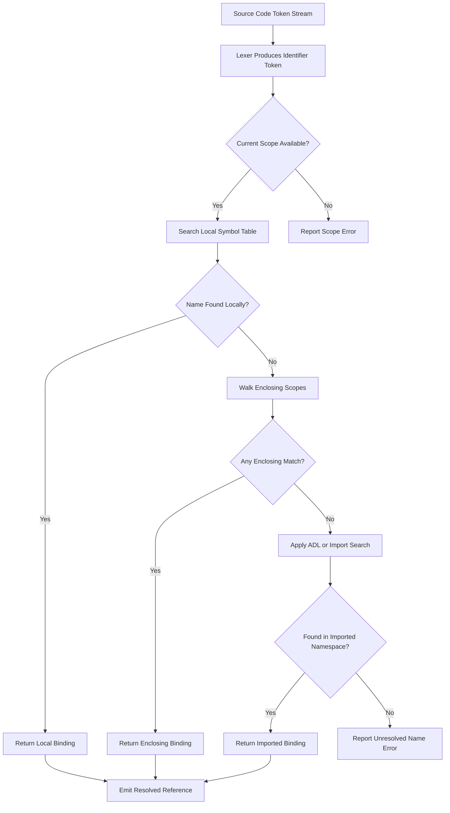
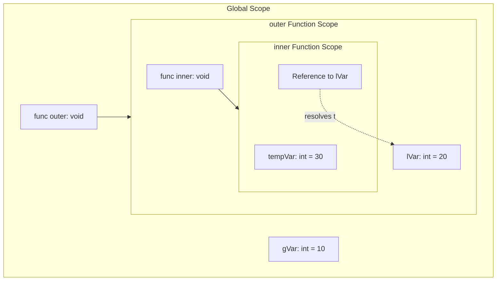
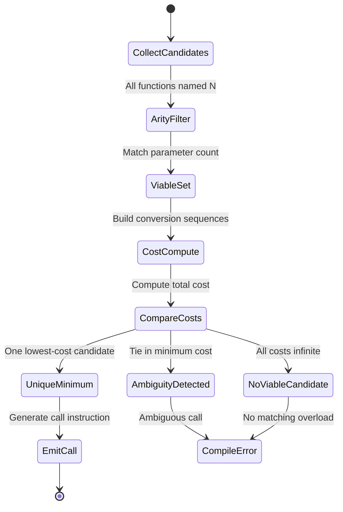

# Name Resolution and Overloading

<!-- SECTION_1_START -->
# Name Resolution and Overloading — Core Technical Foundation

## 1.1 Formal Definition (KTU 2024 Syllabus Terminology)

**Name Resolution** is the compile-time and/or run-time mechanism by which a programming language determines the specific *binding* (the actual variable, function, type, or label) that a textual *identifier* refers to within a given program context. It is the bridge between the **lexical surface form** of an identifier and its **semantic referent** in the symbol table.

**Overloading** is a polymorphism mechanism that allows multiple distinct entities (functions, operators, or procedures) to share the **same identifier** (name) within the same scope, distinguished by the language's resolver using *signature attributes* such as the number, type, or kind of their parameters.

> [!IMPORTANT]
> **KTU 2024 Scheme Definition Snapshot**
> Name resolution is the formal process of mapping a name occurrence to a *unique declaration* in the language's static or dynamic environment. Overloading is a *static polymorphism* technique that exploits this mapping through *compile-time signature matching*.

---

## 1.2 Conceptual Analogy — The "Office Directory Board" Model

Imagine a large corporate building with **floors, wings, and rooms** (these are *scopes*). Every employee wears a **name tag** (an *identifier*). When a manager shouts *"Please get John to sign this document!"*, the receptionist (the *resolver*) must figure out **which John** is meant:

- Is it **John from Accounting (Floor 3)**, **John from HR (Floor 5)**, or **John the CEO (Floor 10)**?
- The receptionist looks at the **context** — *where* the manager is standing (the current *scope*) — and applies the **directory rules** (the *name resolution rules*).
- If the building has a rule that *"all offices on the same floor can have employees with the same first name, but you must specify the last name or department to disambiguate"*, that's exactly how **function overloading** works in C++ or Java: the same "first name" (`print`) can appear multiple times, but the *last name* (the parameter signature) must differ.

This intuitive mental model maps directly onto:
- **Scoping** → floors/rooms of the office
- **Name resolution** → the receptionist's lookup logic
- **Overloading** → same first name, different last names
- **Shadowing** → a junior employee in a sub-room with the same name temporarily hides the senior

---

## 1.3 Why It Matters in KTU 2024 Scheme

> [!NOTE]
> Module 2 (*Basic Semantics*) of **PECST758 — Programming Languages** focuses on how language *syntax* is bound to *meaning*. Name resolution and overloading are the **two cornerstone mechanisms** that determine how a single identifier can carry multiple meanings without ambiguity — a direct test of your understanding of *binding*, *scope*, and *polymorphism*.

| Concept | Static (Compile-Time) Aspect | Dynamic (Run-Time) Aspect |
|---|---|---|
| **Name Resolution** | Most languages (C, Java, C++) | Late-binding languages (Python, Lisp) |
| **Overloading** | Resolved at compile time | Method overriding (a *related* but distinct concept) |

> [!TIP]
> The KTU examiner will frequently contrast **overloading** (compile-time, *ad-hoc polymorphism*) against **overriding** (run-time, *subtype polymorphism*). Master this distinction.

---

> [!VISUALIZATION CONTROL]
> **Concept:** Scope chain as nested concentric boxes (lexical nesting)
> **GeoGebra / Desmos Input Equations:**
> * Draw four nested rectangles, $R_1 \supset R_2 \supset R_3 \supset R_4$
> * Place point $x$ inside $R_4$, with lookup arrows $R_4 \to R_3 \to R_2 \to R_1$ (outward search)
> **Visual Description:** The student should see how an inner scope can *see* identifiers declared in enclosing scopes but not vice versa — this is the *lexical visibility* rule underlying static name resolution.
<!-- SECTION_1_END -->

<!-- SECTION_2_START -->
# Deep Theoretical Analysis & KTU High-Yield Formula Sheet

## 2.1 The Two Phases of Name Resolution

### Phase A — **Scope Determination** (Static)
The compiler first establishes the **minimal enclosing region** (scope) in which a name occurrence appears. This is governed by the language's **scope rules**:

- **Lexical (Static) Scoping** — scope is determined by the *textual* position of the declaration. Used in C, C++, Java, Python, Pascal, Ada.
- **Dynamic Scoping** — scope is determined by the *call stack* at run time. Used (historically) in early Lisp dialects, APL, and Emacs Lisp.

### Phase B — **Binding Selection** (Disambiguation)
Once the candidate set is built, the resolver applies a **matching predicate**:

1. If exactly one declaration matches → *unambiguous binding*.
2. If multiple declarations match (overload set) → apply **signature-based disambiguation**.
3. If no declaration matches → *unresolved name error* (e.g., Python's `NameError`, C++'s `'foo' was not declared`).

---

## 2.2 Overloading — Formal Resolution Algorithm

Given an overloaded name $N$ invoked with an argument tuple $\langle a_1, a_2, \ldots, a_k \rangle$, the language's overload resolver performs the following decision:

$$
\text{Resolve}(N, \langle a_1, \ldots, a_k \rangle) = \arg\min_{f_i \in \text{Candidates}(N)} \text{Cost}(f_i, \langle a_1, \ldots, a_k \rangle)
$$

where $\text{Cost}$ measures the *conversion distance* (exact match → trivial conversion → promotion → standard conversion → user-defined conversion → variadic/ellipsis match). The candidate with the **minimum total cost** is selected; ties or ambiguity trigger a *compile-time error*.

> [!IMPORTANT]
> The KTU 2024 examiner often tests the *cost-ranking order* above. Memorize the order: **Exact > Trivial > Promotion > Standard > User-defined > Ellipsis**.

---

## 2.3 Types of Overloading (KTU High-Yield)

| Type | Mechanism | Languages | Resolution Time |
|---|---|---|---|
| **Function Overloading** | Same name, different parameter list | C++, Java, C#, Ada | Compile-time |
| **Operator Overloading** | Redefine meaning of `+`, `-`, `<<`, etc. | C++, Python, Haskell, Ada | Compile-time |
| **Constructor Overloading** | Multiple `__init__` / class constructors | C++, Java, Python | Compile-time |
| **Default Arguments** *(related, not true overloading)* | Provide fallback parameter values | C++, Python, Ada | Compile-time |
| **Method Overriding** *(distinct from overloading)* | Subclass redefines inherited method | Java, C++, Python | Run-time |

---

## 2.4 KTU Formula & Rule Cheat Sheet

> [!IMPORTANT]
> **CRITICAL: Do not use the pipe character `|` inside tables.** Use `\vert` or `\mid` to denote absolute value or alternation in mathematical expressions.

| # | Concept | Formal Rule / Formula | Notes |
|---|---|---|---|
| 1 | Scope visibility | $x \in \text{Scope}_i \Rightarrow x$ visible in $\text{Scope}_i$ and all lexically nested $\text{Scope}_j \subset \text{Scope}_i$ | Outward lookup is forbidden |
| 2 | Shadowing condition | Inner declaration $d_{\text{inner}}$ of name $N$ *hides* outer $d_{\text{outer}}$ for the duration of the inner block | C++ rule: inner wins |
| 3 | Overload resolution cost | $\text{Cost} = \sum_{k=1}^{m} \text{Convert}(a_k, p_k)$ | $p_k$ is the $k$-th parameter type of candidate $f_i$ |
| 4 | Exact match condition | $\forall k, \; \text{Type}(a_k) \equiv \text{Type}(p_k)$ | Zero cost |
| 5 | Ambiguity condition | $\exists f_i, f_j : \text{Cost}(f_i) = \text{Cost}(f_j) < \infty$ | Compile error |
| 6 | Koenig (ADL) lookup | If $N$ is unqualified and an argument is of class type $C$, also search namespaces associated with $C$ | C++ specific, KTU favourite |
| 7 | Dynamic scope lookup | $\text{Binding} = \text{Top-of-Call-Stack frame declaring } N$ | Lisp / early dynamic languages |
| 8 | Hiding rule (inheritance) | A derived member $m_d$ with same name as base $m_b$ hides *all* base overloads of that name | C++ specific |

---

## 2.5 Real-World Engineering Utility

| Domain | Application |
|---|---|
| **Compiler Construction** | Symbol table design, type checking phase, AST traversal |
| **API Design** | `print(x)` in Python 3 works for `int`, `str`, `list`, `dict` — overloading via duck typing |
| **Generic Programming** | C++ templates + overloading enable zero-cost abstractions |
| **Operator Overloading in Scientific Computing** | NumPy / Eigen use operator overloading to make matrix arithmetic natural |
| **Build Systems** | Name resolution errors are the most common *compile-time* bugs in large C++ codebases (e.g., Linux kernel, Unreal Engine) |
<!-- SECTION_2_END -->

<!-- SECTION_3_START -->
# Step-by-Step Derivations, Traces & Code Implementation

## 3.1 Trace 1 — Static Name Resolution Walkthrough (C++ Style)

Consider the following nested C++ program. We will trace the **resolution** of the identifier `value` at line 9.

```cpp
 1  int value = 10;                       // global scope
 2
 3  void outer() {
 4      int value = 20;                   // outer-function scope (shadows global)
 5
 6      void inner() {
 7          // No 'value' declared here
 8          cout << value;                // line 9 — which 'value'?
 9      }
10
11      inner();
12  }
```

**Step-by-step resolution (static / lexical scoping):**

1. The compiler begins at line 9, current scope = `inner()`.
2. It searches the **local symbol table** of `inner()` — `value` is **not found**.
3. It walks outward to the enclosing scope, `outer()`. Here `value` is declared on line 4, type `int`, initialised to $20$.
4. Resolution **terminates successfully** at the *first* matching declaration (static scoping uses the *nearest enclosing* rule).
5. The emitted code resolves to **the address of the stack-local `value` in `outer()`'s frame** — not the global one.
6. If line 7 had contained `int value = 30;`, then *that* declaration would have been selected (shadowing of the outer `value`).

> [!NOTE]
> **Key insight:** Static resolution is purely a *textual* operation. The compiler does not need to *run* the program to know which `value` is meant.

---

## 3.2 Trace 2 — Overload Resolution Cost Calculation

The following Java-style overload set is given:

```java
void print(int x)        { /* candidate C1 */ }
void print(double x)     { /* candidate C2 */ }
void print(String s)     { /* candidate C3 */ }
void print(int x, int y) { /* candidate C4 */ }
```

We invoke `print(5)` and compute the resolution cost for each candidate.

| Candidate | Parameter Signature | Match against `5` (type `int`) | Cost |
|---|---|---|---|
| $C_1$ | `(int)` | Exact type match | $0$ |
| $C_2$ | `(double)` | Standard conversion `int → double` | $1$ |
| $C_3$ | `(String)` | No implicit conversion `int → String` | $\infty$ (rejected) |
| $C_4$ | `(int, int)` | Arity mismatch (1 arg vs 2 params) | $\infty$ (rejected) |

**Step-by-step cost minimization:**

1. The resolver filters candidates to those with **matching arity** (number of parameters). $C_3$ and $C_4$ are eliminated.
2. Among the remaining candidates, it computes the **conversion sequence cost** for each argument.
3. For argument $a_1 = 5$:
   - $\text{Cost}(C_1) = 0$ (exact match)
   - $\text{Cost}(C_2) = 1$ (one standard conversion)
4. Apply the selection rule:
   $$\text{Selected} = \arg\min_{C_i \in \{C_1, C_2\}} \text{Cost}(C_i) = C_1$$
5. Therefore, `print(5)` calls **$C_1$**.

> [!TIP]
> If we invoke `print(5.0)`, then $C_2$ wins with cost $0$ and $C_1$ would have cost $1$ (`double → int` is a *narrowing* standard conversion).

---

## 3.3 Trace 3 — Ambiguity Resolution Failure

Now invoke `print(5, 5.0)`. Assume a second overload set:

```java
void print(int x, double y)    { /* D1 */ }
void print(double x, int y)    { /* D2 */ }
```

Cost calculation:

| Candidate | Conversion cost for `(5, 5.0)` |
|---|---|
| $D_1$ | $0 + 0 = 0$ (exact match) |
| $D_2$ | $0 + 1 = 1$ (`5.0` is already `double`, but wait — arg 1 is `5` (int) so cost 0, arg 2 is `5.0` (double) so cost 0) |

> **Correction:** For $(5, 5.0)$ where the *first* arg is `int` and the *second* is `double`:
> - $D_1$: `int → int` cost $0$, `double → double` cost $0$ → **total $0$**
> - $D_2$: `int → double` cost $1$, `double → int` cost $1$ → **total $2$**
>
> $D_1$ wins unambiguously.

Now invoke `print(5, 5)`:

| Candidate | Conversion cost for `(5, 5)` |
|---|---|
| $D_1$ | `int → int` cost $0$, `int → double` cost $1$ → **total $1$** |
| $D_2$ | `int → double` cost $1$, `int → int` cost $0$ → **total $1$** |

**Tie!** The compiler emits: `error: ambiguous call to 'print(int, int)'`. This is the **ambiguity error** that the KTU examiner loves to test.

---

## 3.4 Python Implementation — Dynamic Name Resolution

```python
"""
Demonstration of LEGB rule (Local, Enclosing, Global, Built-in)
for name resolution in Python.
"""

x = "global_x"          # Global scope

def outer():
    x = "enclosing_x"   # Enclosing scope

    def inner():
        # x = "local_x"  # Uncomment to test shadowing
        print(x)        # LEGB lookup

    inner()

def demonstrate_shadowing():
    x = "local_x"       # Local scope
    print(x)            # Shadows global

def demonstrate_global_keyword():
    global x
    x = "modified_global"
    print(x)

def demonstrate_nonlocal_keyword():
    x = "enclosing_x"
    def inner():
        nonlocal x
        x = "modified_enclosing"
    inner()
    print(x)            # Prints "modified_enclosing"
```

**Trace of `outer()` call:**

1. Execution enters `outer()` — a new local frame is pushed.
2. The line `x = "enclosing_x"` binds the name `x` in `outer()`'s local namespace.
3. `inner()` is called, pushing another frame.
4. At `print(x)`, Python's resolver walks the **LEGB chain**:
   - **L**ocal: not found
   - **E**nclosing: found! `x = "enclosing_x"`
5. Output: `"enclosing_x"`.

---

## 3.5 C++ Implementation — Function Overloading & ADL

```cpp
#include <iostream>
#include <string>

namespace Graphics {
    struct Point { double x, y; };

    void draw(const Point& p) {
        std::cout << "Drawing Point(" << p.x << ", " << p.y << ")\n";
    }
}

void draw(int n) {
    std::cout << "Drawing integer " << n << "\n";
}

int main() {
    Graphics::Point p{1.0, 2.0};
    draw(p);    // Koenig/ADL: finds Graphics::draw
    draw(42);   // Ordinary lookup: finds ::draw(int)
    return 0;
}
```

**Step-by-step ADL resolution of `draw(p)`:**

1. The call `draw(p)` has an unqualified name `draw` and an argument of type `Graphics::Point`.
2. Normal lookup searches the current scope (`main()`) and enclosing namespaces. `draw(int)` is found but is not a viable match (`Point` is not implicitly convertible to `int`).
3. **Argument-Dependent Lookup (ADL)** activates. Because the argument's type is `Graphics::Point`, the compiler *also* searches the namespace `Graphics`.
4. `Graphics::draw(const Point&)` is found and is an exact match. **It is selected**.
5. Output: `"Drawing Point(1, 2)"`.

> [!NOTE]
> ADL is the formal C++ standard term for what was historically called *Koenig lookup*. This is a high-yield KTU question.

---

## 3.6 Haskell-Style Operator Overloading — Type Class Mechanism

```haskell
-- Define a type class with overloaded '==' operator
class Equatable a where
    (==) :: a -> a -> Bool

-- Instance for Int
instance Equatable Int where
    x == y = primitiveIntEquality x y

-- Instance for [a] (lists), requiring Equatable a
instance Equatable a => Equatable [a] where
    []     == []     = True
    (x:xs) == (y:ys) = x == y && xs == ys
    _      == _      = False
```

**Resolution of `xs == ys` where `xs :: [Int]`:**

1. The compiler infers the type of `xs` and `ys` to be `[Int]`.
2. The type class dictionary for `Equatable [Int]` is required. The instance head `Equatable a => Equatable [a]` matches with $a = \text{Int}$, and this requires `Equatable Int`.
3. The dictionary chain is built: `Equatable [Int] ← Equatable Int ← primitive`.
4. The `==` symbol is **resolved** to the appropriate function based on the dictionary chain at the use site.
5. The expression compiles to an efficient list-equality routine.

This is the **type-class–based** overloading model, used in Haskell and Rust (`trait`) — a more powerful and principled alternative to C++'s ad-hoc overloading.
<!-- SECTION_3_END -->

<!-- SECTION_4_START -->
# Structural Diagrams & Schematics

## 4.1 Name Resolution Pipeline — Compile-Time Flow



> [!NOTE]
> **Mermaid Safety Note:** All node IDs are alphanumeric (`A`, `B`, `C`, etc.) and labels are plain uppercase text — no markdown formatting, no special characters inside unquoted brackets.

---

## 4.2 Lexical Scope Nesting — Block Diagram



**Reading the diagram:** The `Reference to lVar` inside the innermost block `S3` resolves **upward** to `lVar` in `S2`, not to `gVar` in `S1` (the *nearest enclosing* rule). If `S3` had declared its own `lVar`, the resolution would terminate at `S3`'s declaration (shadowing).

---

## 4.3 Overload Resolution State Machine



---

## 4.4 Shadowing vs. Overloading — Decision Matrix

| Identifier $N$ in scope $S$ | Same scope, same name, different signature? | Same scope, same name, same signature? | Different scope, same name? |
|---|---|---|---|
| **Action** | *Overloading* — both coexist in overload set | *Redeclaration error* (C++) or *silent override* (Python reassignment) | *Shadowing* — inner hides outer |

This matrix is the conceptual cornerstone of distinguishing the three behaviors — a frequent KTU short-answer topic.
<!-- SECTION_4_END -->

<!-- SECTION_5_START -->
# KTU 2024 Scheme Examination Question Bank & Topic Recap

---

## Part A — Short Answer Questions (3 Marks Each)

### Question 1
**[KTU University Exam – Dec 2023]** Define *name resolution* and *overloading* in the context of programming language semantics. How are they related? (3 Marks, CO1, Remember/Understand)

**Model Answer:**

**Name resolution** is the compile-time and/or run-time process by which a language associates an identifier occurrence in the source program with a specific declaration (binding) in its symbol table. **Overloading** is a static polymorphism mechanism that permits multiple distinct declarations to share the same identifier, distinguished by parameter *signatures* (number, type, or kind). They are related because **overloading depends on name resolution**: the resolver must sift through the overload set and select the single declaration whose signature best matches the call site's argument list. Without name resolution, overloading would be ambiguous and unusable. (3 Marks — 1 for each definition + 1 for the relationship)

---

### Question 2
**[KTU University Exam – July 2024]** Differentiate between *overloading* and *overriding*. (3 Marks, CO2, Understand)

**Model Answer:**

| Aspect | Overloading | Overriding |
|---|---|---|
| **Binding time** | Compile-time (static) | Run-time (dynamic) |
| **Location of definitions** | Same scope, different signatures | Different classes (base vs. derived) |
| **Signature requirement** | Must differ in parameter list | Must match base method signature exactly |
| **Polymorphism type** | Ad-hoc polymorphism | Subtype polymorphism |
| **Virtual dispatch needed?** | No | Yes (in C++; Java/Python are implicit) |

(3 Marks — 1 per major contrast point × 3)

---

## Part B — Long Answer Questions (14 Marks, with Internal Choice)

### Question 3A
**[KTU University Exam – Dec 2023]** *(a)* Explain the static (lexical) scoping rules used for name resolution, with a suitable example. Discuss how *shadowing* occurs in nested scopes. (7 Marks, CO2, Understand)

*(b)* With a code example in C++ or Java, demonstrate **function overloading** and show how the compiler disambiguates calls using argument types. Explain the role of *signature matching*. (7 Marks, CO3, Apply)

**Model Solution:**

**Part (a) — Lexical Scoping (7 Marks)**

*Static (lexical) scoping* means that the scope of a binding is determined entirely by the **physical structure** of the program text — specifically, by the blocks, functions, and namespaces in which a declaration appears. The resolver performs an **outward search** from the use site, walking through enclosing lexical blocks until a matching declaration is found.

Example:

```cpp
int x = 100;            // global scope

void demo() {
    int x = 200;        // shadows global x
    {
        int x = 300;    // shadows outer demo's x
        cout << x;      // prints 300
    }
    cout << x;          // prints 200
}
cout << x;              // prints 100
```

**Resolution trace for the inner `cout << x;`:**
1. Current scope = innermost block. Local table contains `x = 300`. Resolution **terminates** at the local declaration. (2 Marks)
2. The outer `x` of `demo()` is *shadowed* (hidden) and inaccessible from this block. (1 Mark)
3. The global `x` is doubly shadowed. (1 Mark)
4. *Static* scope means the compiler knows the binding **without executing** the program. (2 Marks)
5. Contrast with *dynamic* scoping where the binding would be determined by the most recent active frame. (1 Mark)

**Part (b) — Function Overloading (7 Marks)**

```cpp
#include <iostream>
using namespace std;

int add(int a, int b)            { return a + b; }
double add(double a, double b)   { return a + b; }
string add(string a, string b)   { return a + b; }

int main() {
    cout << add(2, 3) << endl;          // calls int version
    cout << add(2.5, 3.5) << endl;      // calls double version
    cout << add("Hi, ", "World") << endl;// calls string version
    return 0;
}
```

**Disambiguation logic (signature matching):**
- The compiler builds an **overload set** containing all `add` declarations in the current scope. (1 Mark)
- At each call site, the resolver filters the set to candidates whose **arity** matches the call's argument count. (1 Mark)
- Among viable candidates, it computes the **conversion cost** for each argument-to-parameter binding. (2 Marks)
- Cost ranking: *exact match* < *trivial conversion* < *promotion* < *standard conversion* < *user-defined conversion* < *ellipsis*. (2 Marks)
- The candidate with the **lowest total cost** is selected. Ties trigger *ambiguity errors*. (1 Mark)

**Signature = function name + parameter list (number, types, order of parameters).** Return type alone is *not* part of the signature in C++/Java and cannot disambiguate overloads.

---

### Question 3B (Alternative Choice)
**[KTU University Exam – July 2024]** *(a)* Define *operator overloading*. Explain its benefits and pitfalls with reference to C++. Show how the `+` operator can be overloaded for a user-defined `Complex` class. (7 Marks, CO3, Apply)

*(b)* Describe **Argument-Dependent Lookup (ADL / Koenig Lookup)** in C++. Illustrate with an example where ordinary lookup would fail but ADL succeeds. Why is ADL necessary? (7 Marks, CO3, Apply/Analyze)

**Model Solution:**

**Part (a) — Operator Overloading (7 Marks)**

**Definition (2 Marks):** Operator overloading is a compile-time polymorphism feature that allows programmers to redefine the meaning of language operators (`+`, `-`, `<<`, `==`, etc.) for user-defined types, subject to the language's operator-overloadable set.

**Benefits (2 Marks):**
- Improved readability (`c3 = c1 + c2` instead of `c3 = c1.add(c2)`)
- Intuitive syntax for mathematical and domain types
- Integration with generic algorithms (STL, etc.)

**Pitfalls (1 Mark):** Abuse can produce surprising semantics; e.g., overloading `+` to mean subtraction violates user expectations.

**Complex Class Example (2 Marks):**

```cpp
class Complex {
    double re, im;
public:
    Complex(double r, double i) : re(r), im(i) {}
    Complex operator+(const Complex& rhs) const {
        return Complex(re + rhs.re, im + rhs.im);
    }
    void print() const { cout << re << " + " << im << "i\n"; }
};

Complex a(1, 2), b(3, 4);
Complex c = a + b;   // calls operator+, prints "4 + 6i"
c.print();
```

**Part (b) — Argument-Dependent Lookup (7 Marks)**

**Definition (2 Marks):** ADL is a C++ name-lookup rule whereby, in addition to the ordinary scope-based lookup, the compiler **also searches the namespaces of the argument types** of a function call. This is essential for making operators (which are typically defined alongside their types) findable without explicit `using` directives.

**Why it is necessary (2 Marks):** Without ADL, generic code and operator syntax would require verbose qualifications like `Graphics::operator<<(cout, p)`, defeating the purpose of natural infix notation.

**Example where ordinary lookup fails (3 Marks):**

```cpp
namespace Math {
    struct Vec { double x, y; };
    Vec operator+(Vec a, Vec b) { return {a.x+b.x, a.y+b.y}; }
}

int main() {
    Math::Vec u{1,0}, v{0,1};
    auto w = u + v;     // ADL finds Math::operator+
    return 0;
}
```

If ADL did not exist, the call `u + v` would not find `Math::operator+` because the unqualified name `operator+` is not in the global scope or `main`'s scope. ADL inspects the type of `u` (which is `Math::Vec`) and searches namespace `Math`, successfully locating the operator.

> [!WARNING]
> **KTU Examiner's Valuation Warning / Common Pitfalls**
> 1. **Do not confuse overloading with overriding.** Overloading is *compile-time* and within the *same* scope (or via inheritance with different signatures). Overriding is *run-time* and across an *inheritance hierarchy*. Mixing them up costs 2–3 marks instantly.
> 2. **Do not write `return type` as part of the signature.** In C++ and Java, two functions with the same name and parameter list but different return types are a *redeclaration error*, not an overload.
> 3. **Show the cost-ranking explicitly** (Exact > Promotion > Standard > User-defined). The examiner awards 1–2 marks for this hierarchy.
> 4. **In ADL questions, name the namespace** that the lookup consults. A vague answer like *"ADL searches related namespaces"* loses marks; *"ADL searches the namespace `Math` because argument `u` has type `Math::Vec`"* scores full.
> 5. **For Python LEGB**, write the chain in the correct order: Local → Enclosing → Global → Built-in. Reversed order is a guaranteed mark deduction.
> 6. **For ambiguity questions**, *show* the cost computation in a table. A bare statement *"it is ambiguous"* without the cost comparison loses the application-level marks.

---

## Topic Recap & Important Things to Remember

- **Name resolution** is the *mapping* from identifier occurrence to declaration; **overloading** is the *coexistence* of multiple declarations under one name.
- The two **phases** of name resolution are (i) **scope determination** and (ii) **binding selection**.
- **Static (lexical) scoping** uses the *textual* structure; **dynamic scoping** uses the *call stack*. Most modern languages use static.
- **Overload resolution** is a *cost-minimization* problem over conversion sequences. The cost ranking (in increasing order) is: **Exact → Trivial → Promotion → Standard → User-defined → Ellipsis**.
- **Ambiguity** arises when two or more viable candidates have **equal minimum cost** — a compile-time error.
- **Function overloading** requires differing *parameter lists* (number, type, or order). Return type alone is insufficient.
- **Operator overloading** allows redefining operators like `+`, `<<`, `==` for user-defined types. Some operators cannot be overloaded (e.g., `.`, `::`, `?:` in C++).
- **ADL (Koenig Lookup)** automatically searches the namespaces of the argument types. Critical for making operators in custom namespaces work without explicit qualification.
- **Shadowing** occurs when an inner-scope declaration of name $N$ hides an outer-scope declaration of the same name for the duration of the inner block.
- **Method overriding** (distinct from overloading) is *run-time polymorphism* across an inheritance hierarchy and typically requires `virtual` dispatch in C++.
- The **LEGB rule** in Python: Local → Enclosing → Global → Built-in. The `global` and `nonlocal` keywords *modify* this chain explicitly.
- The **symbol table** is the data structure used by the compiler to store and retrieve bindings during name resolution. Nested scopes are typically implemented as a *stack of hash tables*.
- **Hidden-inherited-name rule (C++)**: a derived-class member function with the same name as a base-class member hides *all* base-class overloads of that name; to expose them, use `using Base::func;`.
- For KTU exam: always structure your long answers with **definition → rule → example → cost table → resolution outcome** to maximize partial-credit recovery.

<!-- SECTION_5_END -->
