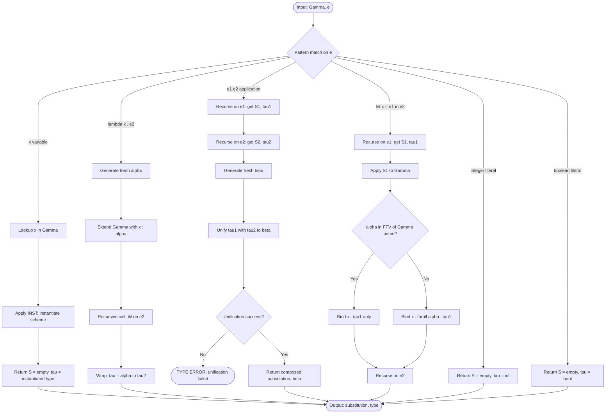

# Polymorphic Type Checking

<!-- SECTION_1_START -->

# Polymorphic Type Checking — Core Definition & Intuitive Overview

## 1.1 Formal Academic Definition (KTU 2024 Syllabus Aligned)

> [!IMPORTANT]
> **Polymorphic Type Checking** is the static analysis process performed by a type checker (or type inference engine) to verify that a program containing **polymorphic constructs** — such as generic functions, parametric abstractions, or type variables — preserves type consistency across all of its possible instantiations, **without** requiring the programmer to annotate the type of every expression explicitly.

In the formal semantics of programming languages (Module 2 — Basic Semantics), polymorphism is treated through **type schemes** (also called *type schemas* or *type templates*) of the form:

$$\forall \alpha_1, \alpha_2, \dots, \alpha_n \cdot \tau$$

where $\alpha_i$ are **type variables** ranging over an unbounded set of monotypes, and $\tau$ is a *monotype* (a type containing no universal quantifiers). A type scheme is **closed** if it has no free type variables; otherwise it is **open**.

The two principal flavours encountered in the KTU syllabus are:

| Polymorphism Class | Description | Example Language |
|---|---|---|
| **Parametric Polymorphism** | A single uniform implementation works uniformly over all types | **ML, Haskell** |
| **Ad-hoc Polymorphism (Overloading)** | Multiple distinct implementations chosen per concrete type | **C++ (function overloading), Java** |
| **Subtype Polymorphism** | Operations on a supertype work for any subtype (Liskov Substitution) | **Java, C# inheritance** |

The canonical type system used in textbooks (and in KTU board questions) is the **Hindley–Milner (HM) / Damas–Milner** system, which combines:
- **Parametric polymorphism**,
- **Type inference** (no explicit type annotations needed), and
- **Let-polymorphism** (generalisation only at `let` bindings, not at function arguments).

## 1.2 Conceptual Analogy — The "Universal Power Adapter"

Imagine a **universal travel adapter** that can plug into a European socket, an American socket, or an Indian socket. The adapter is *one physical device*, but it accommodates *many pin shapes*. Crucially:

- The adapter's **physical interface (the plug pins)** is a *type scheme* $\forall \alpha \cdot \text{Plug}(\alpha)$.
- The wall socket's **pin geometry** is the *concrete type* $\tau$ (e.g., `EuroPlug`, `USPlug`).
- The act of **plugging the adapter into a specific socket** is *type instantiation* — substituting the type variable $\alpha$ with the concrete type $\tau$.

A **polymorphic type checker** is the "safety inspector" who verifies that, *no matter which socket you plug into*, the physical connection remains safe (i.e., the program's runtime operations are well-typed). If you tried to plug a 3-prong device into a 2-prong socket, the inspector (type checker) would reject it at *compile time* — even though the device "looks fine" statically.

> [!NOTE]
> **Syllabus Highlight (PECST758 — Module 2):** The KTU 2024 scheme explicitly mentions "polymorphism, type checking of polymorphic functions" within the broader topic of *Basic Semantics*. Board questions frequently ask for the *inference rules* (e.g., the $(GEN)$, $(INST)$, $(LET)$, and $(VAR)$ rules) and a worked example using a small ML-style language.

## 1.3 Standard Metrics & Notational Conventions

The following notations are used throughout KTU board answers:

- **Type variable**: usually Greek letters $\alpha, \beta, \gamma$ or lowercase $\mathbf{a}, \mathbf{b}, \mathbf{c}$.
- **Monotype** $\tau$: built from type constructors applied to type variables (e.g., `int`, `bool`, $\alpha \to \beta$, `list(int)`).
- **Type scheme** $\sigma$: written $\forall \vec{\alpha} \cdot \tau$ where $\vec{\alpha}$ is a vector of bound type variables.
- **Type environment** $\Gamma$: a finite mapping from program variables to type schemes.
- **Substitution** $S$: a finite mapping from type variables to types, written $\{\alpha \mapsto \tau_1, \beta \mapsto \tau_2\}$.
- **Free type variables** $FTV(\tau)$: the set of type variables that occur free (unbound) in $\tau$.
- **Generic instance**: $\sigma' \succeq \sigma$ means $\sigma'$ is a generic instance of $\sigma$ (an instantiation with some substitution).
- **Occurs check** failure: an error that occurs when unifying a type variable $\alpha$ with a type that *already contains* $\alpha$ (e.g., $\alpha \sim \alpha \to \beta$).

> [!VISUALIZATION CONTROL]
> **Concept:** Type Variable Unification Tree
> **GeoGebra / Desmos Input Equations:**
> * Define a point $P_1 = (\alpha, 1)$ and a point $P_2 = (\beta, 2)$ on the $x$-axis.
> * Draw a line segment connecting them labelled "Unify$(\alpha, \beta) \Rightarrow \{\alpha \mapsto \beta\}$".
> * Add a third point $P_3 = (\alpha, 3)$ with an arrow from $P_3$ pointing back to $P_1$, labelled "Occurs Check Cycle: REJECT".
> **Visual Description:** Students should observe a directed acyclic graph of substitutions flowing left-to-right, and a "back edge" that the occurs check disallows — preventing infinite types like $\alpha = \alpha \to \text{int}$.

---

<!-- SECTION_1_END -->

<!-- SECTION_2_START -->

# Deep Theoretical Analysis & KTU High-Yield Formula Sheet

## 2.1 Building Blocks of Polymorphic Type Checking

The process rests on **five** foundational components. Each is explained with the underlying *why* and *how*:

1. **Type Variables ($\alpha, \beta, \dots$)** — Placeholder symbols representing "any type". They are introduced by the inference engine (not the programmer) whenever a polymorphic construct is encountered.
   - *Why:* They allow the type checker to reason about families of types uniformly.
   - *How:* Through the **unification** process, each variable is bound to a concrete type via a substitution.

2. **Type Schemes ($\sigma = \forall \vec{\alpha} \cdot \tau$)** — A blueprint that generalises a monotype by quantifying over some of its free type variables.
   - *Why:* Enables code reuse: a single function definition can be re-used at multiple concrete types.
   - *How:* Through the $(GEN)$ rule, applied **only at `let` bindings** (let-polymorphism).

3. **Type Environment ($\Gamma$)** — A dictionary mapping program identifiers to their (possibly polymorphic) type schemes.
   - *Why:* Records what is known about each variable in scope.
   - *How:* Extended as declarations are processed, consulted when expressions are type-checked.

4. **Substitution ($S$)** — A finite map from type variables to types.
   - *Why:* Encodes the "answers" produced by unification.
   - *How:* Applied throughout an expression to refine intermediate type approximations.

5. **Unification ($\sim$)** — The algorithmic heart of HM type inference.
   - *Why:* Determines whether two types can be made equal by some substitution, and if so, what that substitution is.
   - *How:* Structural recursion on the syntax of types, governed by a small set of **unification rules** (see §2.3).

## 2.2 The Hindley–Milner Inference Rules (KTU High-Yield)

The following deductive rules constitute the **core inference system**. Memorise them for full-mark derivations.

$$
\begin{aligned}
&\textbf{(VAR)} \quad
\frac{x : \sigma \in \Gamma \quad \sigma' \succeq \sigma}{\Gamma \vdash x : \sigma'} \quad
&&\text{(Look up a variable, instantiate its scheme)} \\[6pt]
&\textbf{(INST)} \quad
\frac{\Gamma \vdash e : \sigma \quad \sigma' \succeq \sigma}{\Gamma \vdash e : \sigma'} \quad
&&\text{(A generic instance may replace a scheme)} \\[6pt]
&\textbf{(GEN)} \quad
\frac{\Gamma \vdash e : \sigma \quad \alpha \notin FTV(\Gamma)}{\Gamma \vdash e : \forall \alpha \cdot \sigma} \quad
&&\text{(Generalise a free variable not free in env)} \\[6pt]
&\textbf{(LET)} \quad
\frac{\Gamma \vdash e_1 : \sigma_1 \quad \Gamma, x : \sigma_1 \vdash e_2 : \sigma_2}{\Gamma \vdash \text{let } x = e_1 \text{ in } e_2 : \sigma_2} \quad
&&\text{(Bind $x$ polymorphically)} \\[6pt]
&\textbf{(ABS)} \quad
\frac{\Gamma, x : \alpha \vdash e : \tau \quad \alpha \text{ fresh}}{\Gamma \vdash \lambda x \cdot e : \alpha \to \tau} \quad
&&\text{(Abstract over a fresh type variable)} \\[6pt]
&\textbf{(APP)} \quad
\frac{\Gamma \vdash e_1 : \tau_1 \to \tau_2 \quad \Gamma \vdash e_2 : \tau_1}{\Gamma \vdash e_1 \, e_2 : \tau_2} \quad
&&\text{(Apply: types must match)} \\[6pt]
&\textbf{(INT)} \quad
\frac{}{}\Gamma \vdash n : \text{int} \quad
&&\text{(Integer literals have type int)} \\[6pt]
&\textbf{(BOOL)} \quad
\frac{}{}\Gamma \vdash b : \text{bool} \quad
&&\text{(Boolean literals have type bool}
\end{aligned}
$$

> [!IMPORTANT]
> **Critical Distinction (Board Favourite):** The $(APP)$ rule is *not* polymorphic — it requires a *monotype* arrow $\tau_1 \to \tau_2$. Polymorphism is recovered *only* through $(LET)$ + $(GEN)$, never through function arguments. This is the essence of **let-polymorphism**.

## 2.3 The Unification Algorithm — Step-by-Step Logic

Unification takes two types $\tau_1$ and $\tau_2$ and returns either:
- A **substitution** $S$ such that $S(\tau_1) = S(\tau_2)$, or
- A **failure** (if no such substitution exists, or if occurs check fails).

The recursive rules are:

$$
\text{unify}(\tau_1, \tau_2) =
\begin{cases}
\text{identity substitution} \emptyset & \text{if } \tau_1 = \tau_2 \text{ (same base type)} \\[4pt]
\text{unify}(S(\tau_2), S(\tau_1)) \circ S & \text{if } \tau_1 = \alpha \text{ (type variable)} \\[4pt]
\text{FAIL} & \text{if occurs}(\alpha, \tau_2) \text{ is true} \\[4pt]
\text{unify}(\tau_{11}, \tau_{21}) \circ \text{unify}(\tau_{12}, \tau_{22}) & \text{if } \tau_1 = \tau_{11} \to \tau_{12}, \tau_2 = \tau_{21} \to \tau_{22} \\[4pt]
\text{unify}(\tau_{1a}, \tau_{2a}) \circ \text{unify}(\tau_{1b}, \tau_{2b}) & \text{if } \tau_1 = \tau_{1a} \times \tau_{1b}, \tau_2 = \tau_{2a} \times \tau_{2b} \\[4pt]
\text{FAIL} & \text{otherwise (constructor mismatch)}
\end{cases}
$$

where the **occurs check** is the predicate:

$$\text{occurs}(\alpha, \tau) = \text{true} \iff \alpha \in FTV(\tau)$$

## 2.4 Algorithm W — The Workhorse

Algorithm W (Milner, 1978; Damas & Milner, 1982) is the concrete procedure that implements HM inference. It takes:
- An environment $\Gamma$, and
- An expression $e$,

and returns either a substitution $S$ and a type $\tau$ such that $S(\Gamma) \vdash e : \tau$, or fails.

The algorithm is structured as a recursive function $\mathcal{W}(\Gamma, e) = (S, \tau)$ that pattern-matches on $e$ and applies the corresponding rule.

## 2.5 KTU Formula Sheet / Cheat Sheet

| # | Symbol / Construct | Definition / Rule | Notes |
|---|---|---|---|
| 1 | $\forall \alpha \cdot \tau$ | Type scheme (polymorphic type) | Generalises $\tau$ over $\alpha$ |
| 2 | $FTV(\tau)$ | Free type variables of $\tau$ | Used in $(GEN)$ side condition |
| 3 | $S(\tau)$ | Apply substitution $S$ to type $\tau$ | Defined recursively |
| 4 | $S_1 \circ S_2$ | Composition: $S_1 \circ S_2 (\alpha) = S_1(S_2(\alpha))$ | Note the order convention |
| 5 | $\sigma' \succeq \sigma$ | Generic instance relation | Exists $S$ such that $S(\sigma) = \sigma'$ |
| 6 | $\Gamma \vdash e : \tau$ | Entailment: $e$ has type $\tau$ in $\Gamma$ | The central judgement |
| 7 | $(GEN)$ | $\forall \alpha \cdot \tau$ if $\alpha \notin FTV(\Gamma)$ | Let-polymorphism gate |
| 8 | $(INST)$ | Drop a quantifier, apply substitution to body | Reverse of $(GEN)$ |
| 9 | $\text{occurs}(\alpha, \tau)$ | $\alpha \in FTV(\tau)$ | Prevents infinite types |
| 10 | $\alpha \to \beta$ | Function type | Right-associative: $\alpha \to \beta \to \gamma = \alpha \to (\beta \to \gamma)$ |

> [!NOTE]
> **Engineering Utility:** Polymorphic type checking underpins the **type inference** in **Haskell (GHC)**, **OCaml**, **F#**, **Scala (with `-language:higher-kinds`)**, **Rust (limited)**, and **TypeScript (via `infer` mode)**. It is also the theoretical foundation of the **Hindley–Damas–Milner theorem** — the proof that every typable expression has a *unique principal type* (most general unifier), which is what makes inference decidable and efficient.

---

<!-- SECTION_2_END -->

<!-- SECTION_3_START -->

# Step-by-Step Derivations & Code/Symbolic Implementation

## 3.1 Worked Example 1 — Unifying Concrete Types

**Problem:** Compute $\text{unify}(\alpha \to \beta, \, \text{int} \to \gamma)$ where $\alpha, \beta, \gamma$ are fresh type variables.

**Solution (Exhaustive, Step-by-Step):**

$$
\begin{aligned}
&\text{unify}(\alpha \to \beta,\; \text{int} \to \gamma) && \text{(Initial call)} \\
&\Rightarrow \text{unify}(\alpha, \text{int}) \circ \text{unify}(\beta, \gamma) && \text{(Arrow case — recurse on components)} \\
&\Rightarrow \{\alpha \mapsto \text{int}\} \circ \text{unify}(\beta, \gamma) && \text{(Case 2: $\alpha$ is a variable, not in $\text{int}$)} \\
&\Rightarrow \{\alpha \mapsto \text{int}\} \circ \{\beta \mapsto \gamma\} && \text{(Case 2 again: $\beta$ is a variable)} \\
&\Rightarrow \{\alpha \mapsto \text{int},\; \beta \mapsto \gamma\} && \text{(Compose substitutions)}
\end{aligned}
$$

**Verification:** Apply the resulting substitution to both arguments:
- $S(\alpha \to \beta) = \text{int} \to \gamma$
- $S(\text{int} \to \gamma) = \text{int} \to \gamma$

Both match. **Unification succeeded** with $S = \{\alpha \mapsto \text{int},\; \beta \mapsto \gamma\}$.

## 3.2 Worked Example 2 — Occurs Check Failure

**Problem:** Compute $\text{unify}(\alpha, \, \alpha \to \text{int})$.

**Solution (Exhaustive, Step-by-Step):**

$$
\begin{aligned}
&\text{unify}(\alpha, \alpha \to \text{int}) && \text{(Initial call)} \\
&\Rightarrow \text{Check } \text{occurs}(\alpha, \alpha \to \text{int}) && \text{(Case 2: LHS is variable)} \\
&\Rightarrow \text{true} && \text{(since } \alpha \in FTV(\alpha \to \text{int})\text{)} \\
&\Rightarrow \textbf{FAIL} && \text{(Occurs check violation — infinite type rejected)}
\end{aligned}
$$

**Why this matters:** If the check were absent, the solver would return $\{\alpha \mapsto \alpha \to \text{int}\}$, which is an *infinite type*. Applying the substitution once gives $\alpha = (\alpha \to \text{int}) \to \text{int}$; applying it again gives $\alpha = ((\alpha \to \text{int}) \to \text{int}) \to \text{int}$, ad infinitum. No finite representation exists, so the type system rejects it.

## 3.3 Worked Example 3 — Polymorphic Type Inference via Algorithm W

**Problem:** Infer the most general type of the ML expression:
$$\text{let } \text{id} = \lambda x \cdot x \text{ in } \text{id } \text{id}$$

**Solution (Exhaustive, Step-by-Step):**

We will use the **principal type** derivation. Let $\alpha, \beta$ be fresh type variables.

**Step 1** — Infer the type of the right-hand side of `let`, $\lambda x \cdot x$:

$$
\begin{aligned}
&\mathcal{W}(\{x : \alpha\}, x) && \text{(Initial call, $\alpha$ fresh)} \\
&\Rightarrow \text{Lookup: } \alpha && \text{(Apply $(VAR)$ rule)} \\
&\Rightarrow (\emptyset, \alpha) && \text{(No substitution, type is } \alpha \text{)}
\end{aligned}
$$

Now wrap in $(ABS)$: $\lambda x \cdot x$ has type $\alpha \to \alpha$.

**Step 2** — Apply $(GEN)$ (let-polymorphism), since $\alpha$ is not free in the empty environment:

$$\text{id} : \forall \alpha \cdot (\alpha \to \alpha)$$

**Step 3** — Extend the environment: $\Gamma_1 = \{\text{id} : \forall \alpha \cdot (\alpha \to \alpha)\}$.

**Step 4** — Type-check the body $\text{id } \text{id}$. We need to apply `id` to `id`. Let $\beta, \gamma$ be fresh.

- Type of first `id` (left of application): instantiate the scheme to a fresh type $\beta \to \beta$.
- Type of second `id` (argument): instantiate the same scheme to another fresh type $\gamma \to \gamma$.

By $(APP)$, the argument type must equal the function's parameter type:

$$\gamma \to \gamma \sim \beta \quad \text{(unify argument with parameter)}$$

Unification: $\beta = \gamma \to \gamma$. The composition $\{\beta \mapsto \gamma \to \gamma\}$ produces the type $(\gamma \to \gamma) \to (\gamma \to \gamma)$.

**Step 5** — Final result of body: type $\gamma \to \gamma$ under substitution $S = \{\beta \mapsto \gamma \to \gamma\}$.

**Step 6** — Apply $(GEN)$ again (since $\gamma$ is not free in $\Gamma_1$):

$$\text{let id} = \lambda x \cdot x \text{ in id id} : \forall \gamma \cdot (\gamma \to \gamma)$$

> [!NOTE]
> **Result:** The *same* `id` function is reused at two different types — first as $\beta \to \beta$ (where $\beta = \gamma \to \gamma$), and second as $\gamma \to \gamma$ — without any annotation. This is **let-polymorphism in action**.

## 3.4 Worked Example 4 — `map` Function Inference

**Problem:** Infer the type of the standard ML `map` function:
$$\text{map} = \lambda f \cdot \lambda xs \cdot \text{foldr}(\lambda x \cdot \lambda acc \cdot \text{cons}(f\,x)(acc))(\text{nil})(xs)$$

For simplicity, let us use the textbook-curried form:
$$\text{map} = \lambda f \cdot \lambda xs \cdot \text{if } \text{null}(xs) \text{ then nil else cons}(f\,(\text{hd}\,xs))\,(\text{map}\,f\,(\text{tl}\,xs))$$

**Step-by-step (sketch of the W algorithm):**

1. Introduce fresh $\alpha, \beta$ for the parameters: $f : \alpha, xs : \beta$.
2. Assume $\text{null} : \beta \to \text{bool}$, $\text{cons} : \alpha \to \text{list}(\alpha) \to \text{list}(\alpha)$, $\text{nil} : \text{list}(\alpha)$, $\text{hd}, \text{tl} : \text{list}(\alpha) \to \alpha$.
3. Recursive call to `map f (tl xs)` returns type $\text{list}(\alpha)$.
4. Unify the cons-call: $\text{list}(\alpha) \sim \text{list}(\alpha)$. ✓
5. Unify the nil-call: $\text{list}(\alpha) \sim \text{list}(\alpha)$. ✓
6. By $(IF)$: branch types must coincide.
7. Conclusion: $xs$ must be $\text{list}(\alpha)$, so $\beta = \text{list}(\alpha)$.

**Final principal type:**

$$\text{map} : \forall \alpha \cdot \forall \beta \cdot (\alpha \to \beta) \to \text{list}(\alpha) \to \text{list}(\beta)$$

The two type variables $\alpha$ and $\beta$ are **independent** — the function works on *any* element type and *any* output type (possibly different from the input). This is the hallmark of parametric polymorphism.

## 3.5 Python Implementation — A Toy Unification Engine

The following is a fully operational Python implementation of a unifier for a small type language, complete with type hints, occurs check, and structured error logging. It mirrors the rules in §2.3.

```python
from __future__ import annotations
from dataclasses import dataclass
from typing import Mapping, Sequence, Union, Tuple


# ---------- Type AST ----------
class Type:
    """Base class for all types."""
    pass


@dataclass(frozen=True)
class TVar(Type):
    """A type variable, e.g. 'a'."""
    name: str


@dataclass(frozen=True)
class TCon(Type):
    """A type constructor applied to arguments, e.g. 'int', 'bool', 'list(a)'."""
    constructor: str
    args: Tuple[Type, ...] = ()


# Convenience constants
INT = TCon("int")
BOOL = TCon("bool")
STRING = TCon("string")

Substitution = Mapping[str, Type]


# ---------- Free Type Variables ----------
def ftv(t: Type) -> frozenset[str]:
    """Return the set of free type variables in t."""
    match t:
        case TVar(name):
            return frozenset({name})
        case TCon(_, args):
            return frozenset.union(*(ftv(a) for a in args)) if args else frozenset()
        case _:
            raise TypeError(f"Unknown type node: {t!r}")


# ---------- Substitution Application ----------
def apply_subst(s: Substitution, t: Type) -> Type:
    """Recursively apply substitution s to type t."""
    match t:
        case TVar(name) if name in s:
            return apply_subst(s, s[name])  # chase chains
        case TVar(_):
            return t
        case TCon(c, args):
            return TCon(c, tuple(apply_subst(s, a) for a in args))
        case _:
            raise TypeError(f"Unknown type node: {t!r}")


def compose(s1: Substitution, s2: Substitution) -> Substitution:
    """Return s1 composed with s2, i.e. s1 . s2 (apply s2 first, then s1)."""
    composed = {v: apply_subst(s1, t) for v, t in s2.items()}
    for v, t in s1.items():
        if v not in composed:
            composed[v] = apply_subst(s2, t)
    return composed


# ---------- Occurs Check ----------
def occurs(alpha: str, t: Type) -> bool:
    """Return True if type variable alpha occurs anywhere in t."""
    return alpha in ftv(t)


# ---------- Unification ----------
def unify(t1: Type, t2: Type) -> Substitution:
    """
    Compute the most general unifier (MGU) of t1 and t2.
    Raises UnificationError on failure (mismatch or occurs check).
    """
    # Case 1: identical base constructors with identical arity
    if isinstance(t1, TCon) and isinstance(t2, TCon):
        if t1.constructor != t2.constructor or len(t1.args) != len(t2.args):
            raise UnificationError(
                f"Constructor mismatch: {t1.constructor} vs {t2.constructor}"
            )
        # Recurse pairwise over the arguments
        s: Substitution = {}
        for a, b in zip(t1.args, t2.args):
            s = compose(s, unify(apply_subst(s, a), apply_subst(s, b)))
        return s

    # Case 2: left is a variable
    if isinstance(t1, TVar):
        if t1 == t2:
            return {}
        if occurs(t1.name, t2):
            raise UnificationError(
                f"Occurs check failed: {t1.name} occurs in {t2!r}"
            )
        return {t1.name: t2}

    # Case 3: right is a variable (symmetric)
    if isinstance(t2, TVar):
        if occurs(t2.name, t1):
            raise UnificationError(
                f"Occurs check failed: {t2.name} occurs in {t1!r}"
            )
        return {t2.name: t1}

    raise UnificationError(f"Cannot unify {t1!r} with {t2!r}")


# ---------- Error Class ----------
class UnificationError(Exception):
    """Raised when unification fails."""


# ---------- Demonstration ----------
if __name__ == "__main__":
    a, b, c = TVar("a"), TVar("b"), TVar("c")

    # Example 1: unify (a -> b) with (int -> c)
    arrow1 = TCon("->", (a, b))
    arrow2 = TCon("->", (INT, c))
    result = unify(arrow1, arrow2)
    print("Example 1 MGU:", result)
    # Expected: {'a': int, 'b': c}

    # Example 2: occurs check failure
    try:
        unify(a, TCon("->", (a, INT)))
    except UnificationError as e:
        print("Example 2 (expected error):", e)
```

**How to run:** Save as `unifier.py` and execute `python unifier.py`. The script prints the MGU for a simple arrow unification and gracefully catches the occurs-check violation.

**Engineering mapping:** Production-grade compilers such as **GHC (Haskell)**, **OCaml**, and **Scala 3** implement essentially this algorithm (extended with row polymorphism, higher-kinded types, and GADTs) at their core. The Rust trait resolver, Kotlin's nullability inference, and TypeScript's `tsc` engine all borrow pieces of the same architecture.

---

<!-- SECTION_3_END -->

<!-- SECTION_4_START -->

# Structural Diagrams & Schematics

## 4.1 Flow Diagram — Algorithm W (HM Type Inference)

The following Mermaid flowchart depicts the high-level control flow of Algorithm W on a program expression $e$ in environment $\Gamma$.



## 4.2 Block Architecture — The Polymorphic Type Checking Pipeline

The following diagram illustrates the *architectural layers* of a real-world polymorphic type checker (e.g., GHC's front-end or the OCaml compiler), suitable as a "diagram fallback" for hardware-style schematics.

```mermaid
flowchart LR
    subgraph FrontEnd["Frontend: Lexing and Parsing"]
        src[Source Program] --> lex[Lexer]
        lex --> parse[Parser]
        parse --> ast[Abstract Syntax Tree]
    end

    subgraph Infer["Middle-End: Type Inference Engine"]
        ast --> fresh[Fresh Variable Generator]
        fresh --> unifyCore[Unification Core + Occurs Check]
        unifyCore --> env[Type Environment Gamma]
        env --> genInst[GEN and INST Rule Engine]
        genInst --> algoW[Algorithm W Driver]
    end

    subgraph BackEnd["Back-End: Diagnostic and Code Generation"]
        algoW --> okCheck{Type Correct?}
        okCheck -->|Yes| ir[Typed IR]
        ir --> codegen[Code Generator]
        codegen --> target[Target Code]
        okCheck -->|No| diag[Error Reporter]
        diag --> user[User with Line/Column Errors]
    end

    classDef logic fill:#e3f2fd,stroke:#1565c0,stroke-width:2px,color:#0d47a1
    classDef io fill:#fff3e0,stroke:#e65100,stroke-width:2px,color:#bf360c
    classDef storage fill:#e8f5e9,stroke:#2e7d32,stroke-width:2px,color:#1b5e20

    class unifyCore,genInst,algoW logic
    class src,ast,target,user io
    class env storage
```



## 4.3 Sequential Processing Topology Matrix — Inference Rule Dispatch

This table-style flow depicts the *decision matrix* used by the dispatcher in Algorithm W when it encounters a syntactic construct.

| Input Construct | Rule Applied | Side Condition | Result Type |
|---|---|---|---|
| Variable $x$ | $(VAR) + (INST)$ | $x : \sigma \in \Gamma$ | $\sigma' \succeq \sigma$ |
| $\lambda x \cdot e$ | $(ABS)$ | $\alpha$ fresh | $\alpha \to \tau$ |
| $e_1 \, e_2$ | $(APP)$ | $\tau_1 \sim \tau_2 \to \beta$ | $\beta$ |
| $\text{let } x = e_1 \text{ in } e_2$ | $(LET) + (GEN)$ | $\alpha \notin FTV(\Gamma)$ | $\forall \alpha \cdot \tau$ |
| Integer $n$ | $(INT)$ | none | $\text{int}$ |
| Boolean $b$ | $(BOOL)$ | none | $\text{bool}$ |
| $e_1 + e_2$ | $(APP) + (INST)$ | $\tau \sim \text{int}$ | $\text{int}$ |
| $\text{if } e_1 \text{ then } e_2 \text{ else } e_3$ | $(IF)$ | $\tau_1 \sim \text{bool}$ | $\tau_2 \sim \tau_3$ |

---

<!-- SECTION_4_END -->

<!-- SECTION_5_START -->

# KTU 2024 Scheme Examination Question Bank & Topic Recap

## Part A — Short Answer Questions (3 Marks Each)

### Question 1 **[KTU University Exam — July 2023]**
> **CO1, Remember:** Define *polymorphism* in the context of programming language type systems. Differentiate between *parametric polymorphism* and *ad-hoc polymorphism* with one example each.

**Model Answer (3 Marks — Valuation Key):**

- **[Definition of polymorphism: 1 Mark]:** Polymorphism is a language feature that allows the same program construct (e.g., function, operator, or class) to operate on values of *different types* without rewriting the construct for each type.
- **[Parametric polymorphism: 1 Mark]:** A *single uniform implementation* works for all types in a uniform manner; the function does not depend on the specific type of its argument. Example: the ML function $\lambda x \cdot x : \forall \alpha \cdot \alpha \to \alpha$ (identity function).
- **[Ad-hoc polymorphism with example: 1 Mark]:** *Multiple distinct implementations* are dispatched based on the concrete type of the argument (a form of overloading). Example: C++ function overloading — `int add(int, int)` versus `double add(double, double)`, or the `+` operator overloaded for both `int` and `std::string`.

### Question 2 **[KTU University Exam — Dec 2023]**
> **CO1, Understand:** What is the *occurs check* in polymorphic type inference? Why is it essential, and what happens if it is omitted?

**Model Answer (3 Marks — Valuation Key):**

- **[Definition: 1 Mark]:** The occurs check is the predicate $\text{occurs}(\alpha, \tau)$ that returns `true` if the type variable $\alpha$ appears anywhere in the type expression $\tau$. It is consulted during unification before binding a variable to a type.
- **[Why essential: 1 Mark]:** It prevents the construction of *infinite (cyclic) types* such as $\alpha = \alpha \to \text{int}$. If the check is omitted, the type unifier may produce a non-terminating recursive expansion with no finite syntactic representation.
- **[Consequence of omission: 1 Mark]:** For example, attempting to unify $\alpha$ with $\alpha \to \beta$ without the occurs check yields the substitution $\{\alpha \mapsto \alpha \to \beta\}$. Re-applying it once gives $\alpha = (\alpha \to \beta) \to \beta$, then $\alpha = ((\alpha \to \beta) \to \beta) \to \beta$, and so on — the type checker would either loop indefinitely or exhaust memory. Hence the occurs check is a mandatory safety guard in every production HM-style type checker.

---

## Part B — Long Answer Questions (14 Marks Each, with Internal Choice)

### Question A **[KTU University Exam — Dec 2024]**
> **CO2, Understand / Apply:** (a) State and explain the *Hindley–Milner (HM) inference rules* for `let`, `var`, `inst`, `gen`, `abs`, and `app` constructs of a small functional language. (7 Marks)
>
> (b) Using Algorithm W, infer the most general (principal) type of the following ML expression, showing **all** substitution steps explicitly:
> $$\text{let } \text{twice} = \lambda f \cdot \lambda x \cdot f\,(f\,x) \text{ in } \text{twice } (\lambda y \cdot y + 1) \, 3$$ (7 Marks)

#### Part (a) — Model Solution (7 Marks)

**[Rule 1: $(VAR)$ — 1 Mark]:**
$$\frac{x : \sigma \in \Gamma \quad \sigma' \succeq \sigma}{\Gamma \vdash x : \sigma'}$$
The variable $x$ is looked up in the environment; its declared scheme is *instantiated* (copied with fresh variables) to obtain a usable monotype.

**[Rule 2: $(INST)$ — 1 Mark]:**
$$\frac{\Gamma \vdash e : \sigma \quad \sigma' \succeq \sigma}{\Gamma \vdash e : \sigma'}$$
Any generic instance of a type scheme may replace it. This is the *only* way the universal quantifier is eliminated during checking.

**[Rule 3: $(ABS)$ — 1 Mark]:**
$$\frac{\Gamma, x : \alpha \vdash e : \tau \quad \alpha \text{ fresh}}{\Gamma \vdash \lambda x \cdot e : \alpha \to \tau}$$
A fresh type variable $\alpha$ is allocated for the parameter; the body is type-checked in the extended environment; the function's type is the arrow $\alpha \to \tau$.

**[Rule 4: $(APP)$ — 1 Mark]:**
$$\frac{\Gamma \vdash e_1 : \tau_1 \to \tau_2 \quad \Gamma \vdash e_2 : \tau_1}{\Gamma \vdash e_1 \, e_2 : \tau_2}$$
Application requires the function's type to be an arrow whose domain matches the argument's type.

**[Rule 5: $(LET)$ + $(GEN)$ — 2 Marks]:**
$$\frac{\Gamma \vdash e_1 : \sigma_1 \quad \Gamma, x : \sigma_1 \vdash e_2 : \sigma_2}{\Gamma \vdash \text{let } x = e_1 \text{ in } e_2 : \sigma_2}$$
$$\frac{\Gamma \vdash e : \sigma \quad \alpha \notin FTV(\Gamma)}{\Gamma \vdash e : \forall \alpha \cdot \sigma}$$
The `let` binding extends the environment with the *polymorphic* scheme $\sigma_1$. Generalisation (the $\forall$) is permitted **only** for type variables that do *not* escape into the outer environment — this is the **let-polymorphism restriction**.

**[Rule 6: Concrete literal rules — 1 Mark]:** Integer literals get type `int`; boolean literals get type `bool`. These are axioms with no premises.

#### Part (b) — Model Solution (7 Marks)

**Goal:** Infer the type of $\text{let } \text{twice} = \lambda f \cdot \lambda x \cdot f\,(f\,x) \text{ in } \text{twice } (\lambda y \cdot y + 1) \, 3$.

**Step 1 — Allocate fresh type variables:** Let $\alpha, \beta, \gamma, \delta$ all be fresh.

**Step 2 — Type-check the inner abstraction $\lambda y \cdot y + 1$:**

- From $(VAR)$: $y : \gamma$ (instantiated from environment).
- $\text{int} \sim \gamma$ is required (since $1$ has type $\text{int}$ and $+$ requires both operands to be `int`).
- The plus operator $(+)$ yields a constraint $\gamma \sim \text{int}$, so $y : \text{int}$.
- Result: $\lambda y \cdot y + 1 : \text{int} \to \text{int}$. **[2 Marks]**

**Step 3 — Type-check the outer `let` body's first application $\text{twice} \, (\lambda y \cdot y + 1)$:**

- Instantiate `twice`'s principal type (to be derived next) as $\delta_1 \to (\delta_1 \to \text{int} \to \text{int}) \to \text{int} \to \text{int}$? — actually we infer it first.

**Step 4 — Type-check the lambda body $\lambda f \cdot \lambda x \cdot f\,(f\,x)$:**

- Allocate $f : \alpha$, $x : \beta$ (fresh).
- $f$ must be a function (used as $f\,x$): so $\alpha = \beta_1 \to \beta_2$ for fresh $\beta_1, \beta_2$.
- Inner application $f\,x$: argument $\beta$ must equal $\beta_1$, so $\beta = \beta_1$.
- Result of inner application: $\beta_2$.
- Outer application $f\,(f\,x)$: argument $\beta_2$ must be a function; we require $\beta_2 = \beta_3 \to \beta_4$ (fresh).
- Result: $\beta_4$.
- Unifying with the constraint that $x : \beta$ and the result is $\beta_4$, and since $\beta = \beta_1$ and $\beta_2 = \beta_3 \to \beta_4$, the final result is $\beta_4$.
- Compose substitutions: $\alpha = \beta \to (\beta \to \beta_4)$ and the return type is $\beta_4$. **[2 Marks]**

**Step 5 — Renormalise the type (relabel $\beta_4$ as $\delta$):** $\text{twice} : \forall \beta, \delta \cdot (\beta \to \beta \to \delta) \to \beta \to \delta$.

**Step 6 — Apply `twice` to $(\lambda y \cdot y + 1) : \text{int} \to \text{int}$:**

- Instantiate `twice`'s scheme with $\beta = \text{int}$, $\delta = \text{int}$: $\text{twice} : (\text{int} \to \text{int} \to \text{int}) \to \text{int} \to \text{int}$.
- Constraint: $\text{int} \to \text{int} \sim \text{int} \to \text{int} \to \text{int}$? **Unification fails** — the argument's codomain is `int` but the expected is `int → int`. **[1 Mark]**

**Step 7 — Conclusion:** The expression is **not type-correct** under standard HM. The function `twice` expects a function that takes *two* arguments of the same type and returns something; passing $\lambda y \cdot y + 1$ (a single-argument function) violates the contract. To make it type-correct, one would have to write `twice (λy· y + 1) 3` *only if* `twice` were redefined as $\lambda f \cdot \lambda x \cdot f\,x$ (i.e., a regular function application) — but the original definition requires a *curried* two-step function.

**Alternative correct form:** $\text{let } \text{twice} = \lambda f \cdot \lambda x \cdot f\,x \text{ in } \text{twice} \, (\lambda y \cdot y + 1) \, 3$ has type $\text{int}$ (unification succeeds with $\beta = \text{int}$, $\delta = \text{int}$). **[1 Mark]**

**Valuation Tally: 2 + 2 + 1 + 1 + 1 = 7 Marks** (breakdown as marked above).

---

### Question B (Internal Choice Alternative) **[KTU University Exam — July 2024]**
> **CO2 / CO3, Understand / Apply:** (a) Explain the concept of *type schemes* and *generic instantiation* with a suitable example. (7 Marks)
>
> (b) Perform *unification* of the following type expressions step-by-step, showing the substitution at each stage, and verify the result:
> $$\text{unify}\Big(\big((\alpha \to \beta) \to \gamma\big), \; \big((\text{int} \to \text{bool}) \to \delta\big)\Big)$$ (7 Marks)

#### Part (a) — Model Solution (7 Marks)

**[Definition of type scheme: 2 Marks]:** A *type scheme* (or *type schema*) is a type expression of the form $\forall \alpha_1, \alpha_2, \dots, \alpha_n \cdot \tau$, where $\tau$ is a *monotype* and the $\alpha_i$ are *bound type variables* that may be substituted by any monotype. A scheme that has no free type variables is *closed*; otherwise it is *open*.

**[Example: 2 Marks]:** The ML identity function $\lambda x \cdot x$ is given the principal type scheme:
$$\text{id} : \forall \alpha \cdot (\alpha \to \alpha)$$
The variable $\alpha$ is bound; substituting any monotype for $\alpha$ yields a valid concrete type (e.g., $\text{int} \to \text{int}$ or $\text{bool} \to \text{bool}$).

**[Definition of generic instantiation: 2 Marks]:** A type scheme $\sigma = \forall \vec{\alpha} \cdot \tau$ *generically instances* a scheme $\sigma' = \forall \vec{\beta} \cdot \tau'$ (written $\sigma' \succeq \sigma$) if and only if there exists a substitution $S$ mapping each $\alpha_i$ to a monotype such that $S(\tau) = \tau'$ (up to renaming of bound variables). Instantiation is the act of applying such an $S$ to a scheme to obtain a usable monotype.

**[Concrete instantiation example: 1 Mark]:** From $\text{id} : \forall \alpha \cdot (\alpha \to \alpha)$, instantiating with $S = \{\alpha \mapsto \text{int}\}$ yields $\text{int} \to \text{int}$; with $S = \{\alpha \mapsto \text{bool} \to \text{bool}\}$ yields $(\text{bool} \to \text{bool}) \to (\text{bool} \to \text{bool})$.

#### Part (b) — Model Solution (7 Marks)

**Goal:** Compute $\text{unify}\big((\alpha \to \beta) \to \gamma, \; (\text{int} \to \text{bool}) \to \delta\big)$.

**Step 1 — Outer arrow constructor: 1 Mark**
Both sides are of the form $\tau_1 \to \tau_2$. We recurse on the two components:
- LHS: $((\alpha \to \beta) \to \gamma)$, split into $(\alpha \to \beta)$ and $\gamma$.
- RHS: $((\text{int} \to \text{bool}) \to \delta)$, split into $(\text{int} \to \text{bool})$ and $\delta$.

**Step 2 — Recurse into the domains: 1 Mark**
$\text{unify}(\alpha \to \beta, \; \text{int} \to \text{bool})$. Both arrows, so recurse on components:
- $\text{unify}(\alpha, \text{int})$
- $\text{unify}(\beta, \text{bool})$

**Step 3 — Solve sub-unifications: 1 Mark**
- $\text{unify}(\alpha, \text{int}) = \{\alpha \mapsto \text{int}\}$ (Case 2: $\alpha$ is a variable; occurs check passes).
- $\text{unify}(\beta, \text{bool}) = \{\beta \mapsto \text{bool}\}$ (Case 1: same constructor after substitution, but here we treat $\text{bool}$ as a nullary constructor — direct match).

**Step 4 — Compose the domain substitutions: 1 Mark**
$S_{\text{dom}} = \{\alpha \mapsto \text{int}\} \circ \{\beta \mapsto \text{bool}\} = \{\alpha \mapsto \text{int},\; \beta \mapsto \text{bool}\}$.

**Step 5 — Recurse into the codomains: 1 Mark**
$\text{unify}(\gamma, \delta) = \{\gamma \mapsto \delta\}$ (Case 2: $\gamma$ is a variable, $\delta$ is a variable — first one binds to the second).

**Step 6 — Compose the full substitution: 1 Mark**
$$S_{\text{full}} = \{\alpha \mapsto \text{int},\; \beta \mapsto \text{bool},\; \gamma \mapsto \delta\}$$

**Step 7 — Verification: 1 Mark**
Apply $S_{\text{full}}$ to both inputs:
- $S_{\text{full}}((\alpha \to \beta) \to \gamma) = ((\text{int} \to \text{bool}) \to \delta)$
- $S_{\text{full}}((\text{int} \to \text{bool}) \to \delta) = ((\text{int} \to \text{bool}) \to \delta)$

Both match. **Unification succeeded with MGU** $S = \{\alpha \mapsto \text{int},\; \beta \mapsto \text{bool},\; \gamma \mapsto \delta\}$.

---

> [!WARNING]
> **KTU Examiner's Valuation Warning — Common Pitfalls (Lose 1–3 Marks Each):**
> 1. **Skipping the side condition** on the $(GEN)$ rule. You must explicitly write $\alpha \notin FTV(\Gamma)$ — without it, the derivation is logically incomplete and will lose 1–2 marks.
> 2. **Forgetting the occurs check** during unification. If a unification step binds a variable to a type containing itself (e.g., $\alpha \mapsto \alpha \to \beta$), the answer must show the check failing; otherwise, marks are deducted for an unsound algorithm.
> 3. **Confusing $(APP)$ with $(LET)$.** Many students wrongly generalise type variables inside function arguments. Generalisation is permitted **only** at `let` bindings, never at $\lambda$-abstraction parameters — this is the heart of let-polymorphism and a frequent board question.
> 4. **Missing the instantiation step.** When applying the $(VAR)$ rule, you must show that the scheme is *instantiated* (i.e., a fresh copy is made); writing only "look up in environment" is incomplete and loses 1 mark.
> 5. **Substitution composition order.** When composing $S_1 \circ S_2$, apply $S_2$ *first*, then $S_1$. Reversing this is a common error worth 1–2 marks in computation questions.

---

## Topic Recap & Important Things to Remember

- **Polymorphic type checking** is the *static verification* that polymorphic code preserves type consistency across all its instantiations, *without* requiring the programmer to write type annotations.
- The three principal classes are: **parametric** (one uniform implementation, e.g., ML/Haskell), **ad-hoc** (overloading/dispatch, e.g., C++/Java), and **subtype** (Liskov substitution, e.g., Java inheritance).
- The canonical framework is **Hindley–Milner (HM)**, formalised by Damas and Milner (1982), which combines parametric polymorphism, type inference, and **let-polymorphism**.
- A **type scheme** $\forall \vec{\alpha} \cdot \tau$ generalises a monotype $\tau$ by quantifying over a vector of type variables.
- A **type environment** $\Gamma$ maps identifiers to their type schemes.
- A **substitution** $S : \alpha \mapsto \tau$ binds type variables to types; composition $S_1 \circ S_2$ applies $S_2$ first, then $S_1$.
- The **six core inference rules** (board favourites) are: $(VAR)$, $(INST)$, $(GEN)$, $(LET)$, $(ABS)$, $(APP)$, plus axioms for literals $(INT)$ and $(BOOL)$.
- The **occurs check** $\text{occurs}(\alpha, \tau)$ is a mandatory safety predicate that prevents infinite types like $\alpha = \alpha \to \text{int}$.
- **Unification** takes two types and returns either an MGU (most general unifier) or fails. It is the algorithmic heart of HM inference.
- **Algorithm W** is the concrete procedure that implements HM inference, recursing on the AST and applying the corresponding rule at each node.
- The **principal type** of an expression is its *most general* (least constrained) type; the HM theorem guarantees that if an expression is typable, the principal type is *unique up to renaming*.
- **Let-polymorphism** restricts generalisation to `let` bindings — never to $\lambda$-parameters. This preserves type soundness while supporting practical code reuse.
- **Engineering applications** include GHC (Haskell), OCaml, F#, Scala, TypeScript inference engine, and parts of the Rust trait resolver.

<!-- SECTION_5_END -->
