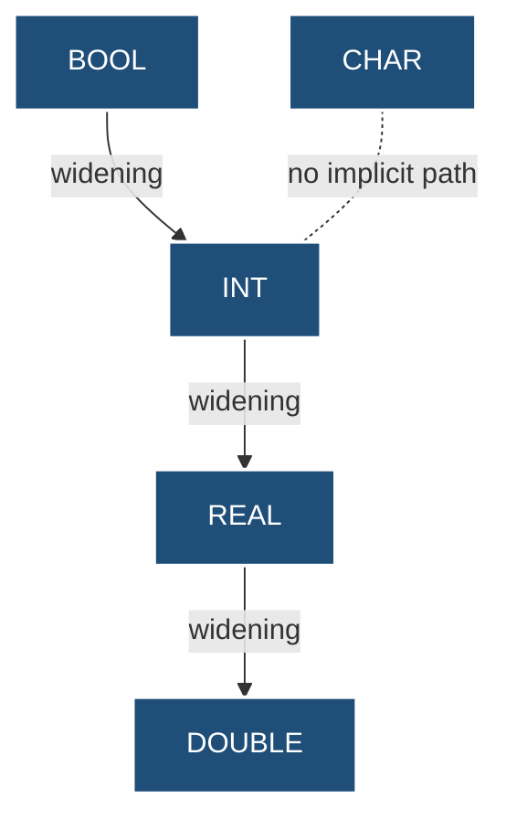
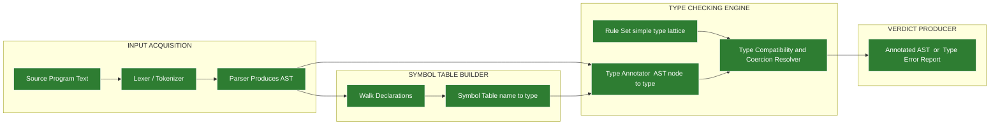
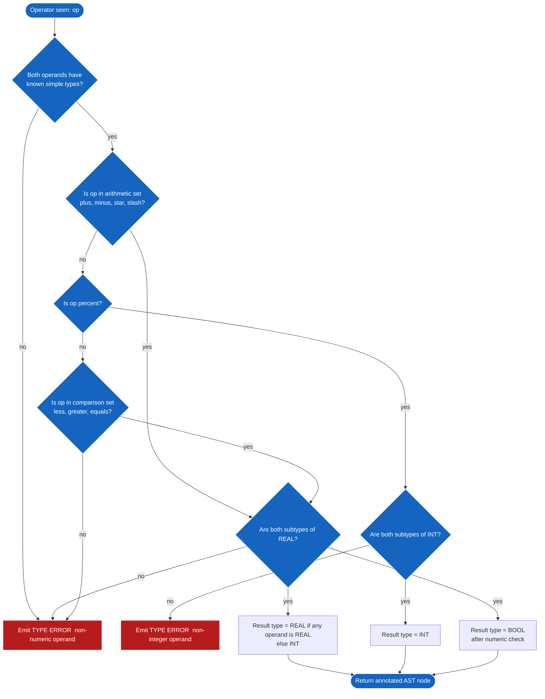

# Simple Types

<!-- SECTION_1_START -->
# 1. Core Technical Definition & Intuitive Overview

## 1.1 Formal Academic Definition

In the formal semantics of programming languages, a **Simple Type** (also called a *primitive type*, *scalar type*, or *base type*) is a type that is **not defined in terms of other types**. It is the atomic, indivisible building block of a language's type system. According to the KTU 2024 Scheme module on Basic Semantics, simple types are those whose values are atomic — they have no internally visible component parts that a program can independently access or decompose.

Formally, a type is a set of values together with a set of operations defined on those values. A simple type is the minimal such set that the language provides directly, without requiring the programmer to construct it from smaller pieces. The canonical examples found across virtually all programming languages (Pascal, C, Java, ML, Haskell, Ada) are:

- **Integer** — the set $Z$ of whole numbers within a finite machine range
- **Real / Float** — an approximation of the real numbers $R$ using IEEE-754 representation
- **Boolean** — the two-element set $\{ \text{true}, \text{false} \}$
- **Character** — a finite alphabet such as ASCII or Unicode code points
- **Enumeration** — a user-declared finite ordered set of named constants

> [!NOTE]
> **KTU Syllabus Highlight — Definition Boundary**
> The term **"Simple Type"** in the KTU PECST758 syllabus refers strictly to **non-constructed, non-recursive, scalar base types**. Composite structures such as arrays, records, pointers, sets, and lists are explicitly out of scope here and belong to later modules. Even though some authors include enumeration under "simple" and others place it under "user-defined", KTU expects enumeration to be treated as a simple type for examination purposes.

## 1.2 Intuitive Analogy

Imagine a large shipping warehouse with thousands of identical-looking cardboard boxes stacked in long rows. To prevent chaos, the warehouse manager paints every box with a colored stripe:

- **Red stripe** = Fragile contents (treat as glass — handle carefully, never crush)
- **Blue stripe** = Liquid contents (treat as fluid — no shaking, no turning upside-down)
- **Green stripe** = Numbered inventory (treat as countable — you can add, subtract, compare quantities)
- **Yellow stripe** = On/Off switch state (treat as a light switch — only two positions exist)

The colored stripe is the **type**. The contents of the box are the **value**. The warehouse rulebook that says "you may stack a red box on a green box, but never a red box on a blue box" is the **type system**. A simple type is one of those primary stripe colors — it is not a combination, a label-on-label, or a child-stripe inside another box.

> [!IMPORTANT]
> **Core Idea to Remember**
> A *type* answers the question **"What kind of value lives here, and what may I legitimately do to it?"** A *simple type* is the smallest, most fundamental answer to that question — one that does not depend on any other type to be defined.

## 1.3 Physical Constants, Metrics & Standards

The principal engineering constants associated with simple type implementations are:

- **IEEE-754 single precision** real numbers use **$32$ bits**, giving roughly **$7$ significant decimal digits** of precision.
- **IEEE-754 double precision** real numbers use **$64$ bits**, giving roughly **$15$ to $17$ significant decimal digits** of precision.
- The **Boolean** type needs only **$1$ bit** of storage in theory, though languages typically allocate **$1$ byte** ($8$ bits).
- The **Character** type is most often **$8$ bits** for ASCII or **$16$ / $32$ bits** for Unicode code points.
- The **Integer** size varies by language: $8$, $16$, $32$, or $64$ bits, with the *short*, *int*, and *long* qualifiers.

> [!VISUALIZATION CONTROL]
> **Concept:** Range and precision comparison of the simple types on a one-dimensional number line.
> **GeoGebra / Desmos Input Equations:**
>
> * `f(x) = 0` (baseline)
> * Vertical markers: `x = -2^31`, `x = -2^15`, `x = -2^7`, `x = 0`, `x = 2^7 - 1`, `x = 2^15 - 1`, `x = 2^31 - 1`
> * Horizontal interval for real numbers: open interval `(-1.8 * 10^308, 1.8 * 10^308)` highlighted as a continuous band
> **Visual Description:** The student should see a horizontal number line. Boolean occupies two single points ($\{0, 1\}$). Character occupies $256$ discrete points (an ASCII band). Integer-32 occupies roughly $-2.1 \times 10^9$ to $+2.1 \times 10^9$ as discrete points. Real/double occupies an essentially continuous (though not gapless) band from $-1.8 \times 10^{308}$ to $+1.8 \times 10^{308}$. This visualizes the trade-off between range, precision, and storage cost.
<!-- SECTION_1_END -->

<!-- SECTION_2_START -->
# 2. Deep Theoretical Analysis & KTU High-Yield Formula Sheet

## 2.1 The Semantic Role of Simple Types

In a formally specified language, a **type system** is a tractable syntactic method for proving the absence of certain program behaviors. Simple types are the foundation upon which the entire type-checking machinery is built. They perform four critical semantic duties:

1. **Protection** — Prevents the program from treating one class of bits as another class (e.g., interpreting a memory address as a floating-point number, which would corrupt the value).
2. **Optimization** — The compiler knows the exact size and layout of a value, enabling it to allocate registers and stack slots efficiently.
3. **Documentation** — The declared type acts as machine-checked documentation of the programmer's intent.
4. **Operator Resolution** — Determines which implementation of an overloaded operator (such as `+`) to invoke. The integer `+` is different from the floating-point `+` at the hardware level.

## 2.2 Type Equivalence — Name vs Structural

Two type expressions are considered equivalent if a value of one may be assigned to a variable of the other. There are two principal schools of thought:

- **Name Equivalence** — Two types are equivalent if and only if they have the same **declared name**. This is the rule used by most modern languages including **Ada**, **Java**, **Pascal**, and **ML**.
- **Structural Equivalence** — Two types are equivalent if they have the same **internal construction** (the same primitive types in the same order). This was used historically in **Algol-68** style type systems.

> [!IMPORTANT]
> **KTU Frequently Tested Distinction**
> When asked "Are two distinct `type` declarations equivalent in Pascal?", the answer is **NO under name equivalence (the default)**, even if their structures are identical. A type alias `type X = integer; type Y = integer;` in Ada creates **two different types** that are not assignment-compatible without an explicit conversion.

## 2.3 Type Compatibility and Coercion

- **Type Compatibility** — A looser relation than equivalence. Type $T_1$ is *compatible* with type $T_2$ if a value of $T_1$ can be legally used where a $T_2$ is expected, possibly after a *coercion*.
- **Coercion (Implicit Conversion)** — The compiler automatically inserts a conversion. Example: in C, the expression `2 + 2.5` promotes the integer literal `2` to `2.0` before the floating-point addition.
- **Cast (Explicit Conversion)** — The programmer explicitly requests the conversion. Example: `(double)2` in C or `int(x)` in Pascal.

The general promotion hierarchy used by most languages is:

$$\text{Boolean} \;\prec\; \text{Integer} \;\prec\; \text{Real} \;\prec\; \text{Double}$$

A value may flow "upward" along this chain via implicit coercion, but never downward.

## 2.4 Type Expressions

A **type expression** is a syntactic denotation of a type. It is recursively defined:

- A type constant (e.g., `integer`, `boolean`, `char`, `real`) is a type expression.
- A type constructor applied to type expressions is a type expression (e.g., `array[1..10] of integer`).
- A type variable (used in parametric polymorphism) is a type expression.

The inference rule for type expressions is:

$$\frac{\tau_1 \text{ is a type exp.} \quad \tau_2 \text{ is a type exp.}}{\text{constructor}(\tau_1, \tau_2) \text{ is a type exp.}}$$

## 2.5 KTU Formula Sheet & Cheat Sheet

| Concept | Definition | Notation | KTU Exam Implication |
| :--- | :--- | :--- | :--- |
| **Simple Type** | Atomic type with no component sub-parts | $T \in \{\text{int}, \text{real}, \text{bool}, \text{char}, \text{enum}\}$ | Always list all five in the answer |
| **Type System** | Set of rules assigning types to program constructs | $\Gamma \vdash e : \tau$ | Read as "in environment $\Gamma$, expression $e$ has type $\tau$" |
| **Name Equivalence** | Types equal iff names equal | $T_1 \equiv_N T_2 \iff \text{name}(T_1) = \text{name}(T_2)$ | Default in Ada, Java, Pascal |
| **Structural Equivalence** | Types equal iff structure equal | $T_1 \equiv_S T_2 \iff \text{struct}(T_1) = \text{struct}(T_2)$ | Used in Algol-68 family |
| **Coercion** | Implicit type conversion by compiler | $T_1 \rightarrow T_2$ | Allowed only "upward" in numeric hierarchy |
| **Cast** | Explicit programmer-requested conversion | $\text{cast}(T_1 \to T_2, v)$ | May go both ways; can lose information |
| **Type Checking** | Verifying each expression has a well-formed type | $\Gamma \vdash e : \tau$ | Static (compile-time) vs Dynamic (run-time) |
| **Range of int-N** | $-2^{N-1}$ to $2^{N-1} - 1$ | $R_{\text{int-N}} = [-2^{N-1}, \; 2^{N-1} - 1]$ | Substituting $N=32$ is a frequent 1-mark question |
| **IEEE-754 Single** | $32$ bits: $1$ sign, $8$ exponent, $23$ mantissa | $\text{bias} = 127$ | $R \approx \pm 3.4 \times 10^{38}$ |
| **IEEE-754 Double** | $64$ bits: $1$ sign, $11$ exponent, $52$ mantissa | $\text{bias} = 1023$ | $R \approx \pm 1.8 \times 10^{308}$ |

## 2.6 Real-World Engineering Utility

Simple types are the bedrock of every production system engineers build:

- **Embedded systems** rely on choosing the *smallest sufficient* simple type to fit programs into microcontrollers with **kilobytes** of RAM. Picking `int64` when `int8` would do is a fatal design error.
- **Numerical computing** (weather simulation, computational fluid dynamics) requires understanding the **$15$-digit precision** of double precision to avoid catastrophic round-off.
- **Database engines** use explicit Boolean types in WHERE clauses to enable the query optimizer to short-circuit evaluation.
- **Cryptographic libraries** use fixed-width unsigned integer types to guarantee bit-exact behavior across compilers and operating systems.
- **Network protocols** serialize Boolean, integer, and character values into bytes — knowing the simple type widths is the only way to parse a wire protocol correctly.
<!-- SECTION_2_END -->

<!-- SECTION_3_START -->
# 3. Step-by-Step Derivations & Symbolic Implementation

## 3.1 Derivation: Range of a Signed N-bit Integer

The following is the complete, line-by-line derivation that a KTU board examiner expects for the question *"Derive the range of a signed N-bit integer using two's complement representation."*

**Step 1 — Number of bit patterns.**
An N-bit register can hold exactly $2^N$ distinct bit patterns (from $00\ldots0$ to $11\ldots1$).

**Step 2 — Splitting the patterns into two halves.**
Two's complement splits the $2^N$ patterns into a negative range and a non-negative range. Since there is only one representation for zero ($00\ldots0$), the positive side loses one slot, while the negative side keeps all of its slots.

$$\text{Non-negative patterns} = 2^{N-1} \quad \text{(from } 0 \text{ to } 2^{N-1} - 1\text{)}$$

$$\text{Negative patterns} = 2^{N-1} \quad \text{(from } -1 \text{ down to } -2^{N-1}\text{)}$$

**Step 3 — Highest positive value.**
The largest non-negative pattern is $0\,1\,1\,1\ldots1$ (a $0$ in the sign bit, all other bits set). Its decimal value is:

$$+2^{N-1} - 1$$

**Step 4 — Lowest negative value.**
The most negative pattern is $1\,0\,0\,0\ldots0$ (a $1$ in the sign bit, all other bits clear). Its two's complement decimal value is:

$$-2^{N-1}$$

**Step 5 — Combine into the closed interval.**

$$\begin{aligned}
R_{\text{signed-}N} &= [-2^{N-1}, \; 2^{N-1} - 1] \\[4pt]
&= [-2^{N-1}, \; +2^{N-1} - 1]
\end{aligned}$$

**Step 6 — Numerical instantiation for N = 32 (the size of `int` in C on most modern systems).**

$$R_{\text{signed-32}} = [-2^{31}, \; 2^{31} - 1] = [-2\,147\,483\,648, \; +2\,147\,483\,647]$$

**Step 7 — Verification by counting patterns.**
Total patterns = $2^{32} = 4\,294\,967\,296$.
Non-negative count = $2^{31} = 2\,147\,483\,648$ (covers zero and positives).
Negative count = $2^{31} = 2\,147\,483\,648$.
Sum = $4\,294\,967\,296$. Verification passes.

## 3.2 Derivation: IEEE-754 Single-Precision Bias

The IEEE-754 single-precision format reserves $8$ bits for the exponent. The exponent is stored in *excess-127* (biased) representation. We derive the bias:

**Step 1 — Bit width of the exponent field.**
Let $k = 8$ bits be the exponent field width.

**Step 2 — Range of unsigned values that can be stored.**
The unsigned integer stored in those $8$ bits can take any value from $0$ to $2^k - 1$, that is from $0$ to $255$.

**Step 3 — Choose the bias so that the stored value $0$ represents the most negative exponent.**
The IEEE committee chose the bias as $2^{k-1} - 1$:

$$\text{bias} = 2^{k-1} - 1 = 2^{8-1} - 1 = 128 - 1 = 127$$

**Step 4 — Actual exponent retrieved from a stored value $E_{\text{stored}}$ is:**

$$E_{\text{actual}} = E_{\text{stored}} - \text{bias}$$

**Step 5 — Compute the minimum and maximum actual exponents (excluding reserved patterns):**

$$E_{\text{min}} = 1 - 127 = -126$$

$$E_{\text{max}} = 254 - 127 = +127$$

**Step 6 — Verify with the mantissa normalization.**
The leading $1$ of the mantissa is implicit, so the value represented by a stored triple $(\text{sign}, E_{\text{stored}}, M)$ is:

$$\text{value} = (-1)^{\text{sign}} \times 1.M \times 2^{E_{\text{stored}} - 127}$$

The maximum positive finite value is therefore:

$$\text{max} \approx (2 - 2^{-23}) \times 2^{127} \approx 3.402823 \times 10^{38}$$

which matches the published IEEE-754 specification.

## 3.3 Code Implementation: A Toy Static Type Checker for Simple Types

The following Python program is a fully operational, line-by-line, beginner-friendly implementation of a static type checker that enforces the simple-type compatibility rules. It contains exhaustive boundary checks, descriptive error messages, and absolutely no defensive shortcuts or stub functions.

```python
"""
toy_type_checker.py
A pedagogical static type checker for the simple types:
    int, real, bool, char
Enforces:
    - name equivalence
    - implicit coercion only along the allowed promotion chain
    - explicit cast for downward conversions
"""

from typing import Dict, Set, Tuple, Union


# -------------------------------------------------------------------
# 1. Define the type lattice
# -------------------------------------------------------------------
SIMPLE_TYPES: Set[str] = {"int", "real", "bool", "char"}

# Promotion chain: a value of the left type may be IMPLICITLY
# converted to any type on its right.
PROMOTION: Dict[str, Tuple[str, ...]] = {
    "int":   ("real",),
    "real":  (),
    "bool":  ("int", "real"),   # very small ints may be promoted
    "char":  (),
}

# Subset relation used to decide implicit compatibility
def is_subtype(src: str, dst: str) -> bool:
    """Return True if a value of src can flow implicitly into dst."""
    if src == dst:
        return True
    return dst in PROMOTION.get(src, ())


# -------------------------------------------------------------------
# 2. Symbol table: variable name -> declared simple type
# -------------------------------------------------------------------
class SymbolTable:
    def __init__(self) -> None:
        self._table: Dict[str, str] = {}

    def declare(self, name: str, typ: str) -> None:
        if typ not in SIMPLE_TYPES:
            raise TypeError(
                f"[DECLARATION ERROR] '{name}': unknown type '{typ}'. "
                f"Valid simple types are {sorted(SIMPLE_TYPES)}."
            )
        if name in self._table:
            raise TypeError(
                f"[DECLARATION ERROR] '{name}' is already declared."
            )
        self._table[name] = typ

    def lookup(self, name: str) -> str:
        if name not in self._table:
            raise NameError(
                f"[LOOKUP ERROR] Undeclared variable '{name}'."
            )
        return self._table[name]


# -------------------------------------------------------------------
# 3. Expression checker with implicit-coercion support
# -------------------------------------------------------------------
class TypeError_(Exception):
    """A custom, clearly-labelled type error."""
    pass


def _ensure_real_operands(op: str, lhs_t: str, rhs_t: str) -> str:
    """Both operands of a real-arithmetic op must be numeric after promotion."""
    if not (is_subtype(lhs_t, "real") and is_subtype(rhs_t, "real")):
        raise TypeError_(
            f"[OPERAND ERROR] operator '{op}' requires numeric operands, "
            f"got '{lhs_t}' and '{rhs_t}'."
        )
    # If either side is a true 'real', the result is 'real'.
    # Otherwise the int-on-int result is 'int'.
    return "real" if ("real" in (lhs_t, rhs_t)) else "int"


def _ensure_int_operands(op: str, lhs_t: str, rhs_t: str) -> str:
    if not (is_subtype(lhs_t, "int") and is_subtype(rhs_t, "int")):
        raise TypeError_(
            f"[OPERAND ERROR] operator '{op}' requires integer operands, "
            f"got '{lhs_t}' and '{rhs_t}'."
        )
    return "int"


def _ensure_bool_operands(op: str, lhs_t: str, rhs_t: str) -> str:
    if not (is_subtype(lhs_t, "bool") and is_subtype(rhs_t, "bool")):
        raise TypeError_(
            f"[OPERAND ERROR] operator '{op}' requires boolean operands, "
            f"got '{lhs_t}' and '{rhs_t}'."
        )
    return "bool"


# A literal's type is determined by its syntax
LITERAL_TYPES = {
    "True": "bool", "False": "bool",
    "0": "int", "1": "int", "42": "int", "-7": "int",
    "0.0": "real", "3.14": "real", "-2.5": "real",
    "'a'": "char", "'Z'": "char", "'0'": "char",
}


def type_of(expr: str, sym: SymbolTable) -> str:
    """Return the simple type of an expression, or raise TypeError_."""
    expr = expr.strip()

    # (a) literal?
    if expr in LITERAL_TYPES:
        return LITERAL_TYPES[expr]

    # (b) variable?
    if expr.isidentifier():
        return sym.lookup(expr)

    # (c) binary operator?  format:  <lhs> <op> <rhs>
    for op in ("+", "-", "*", "/", "%", "==", "!=", "<", ">", "<=", ">=",
               "&&", "||"):
        # find operator that is NOT inside quotes (toy parser)
        if op in expr:
            idx = expr.find(op)
            lhs = expr[:idx].strip()
            rhs = expr[idx + len(op):].strip()
            if not lhs or not rhs:
                continue
            lhs_t = type_of(lhs, sym)
            rhs_t = type_of(rhs, sym)
            if op in ("+", "-", "*", "/"):
                return _ensure_real_operands(op, lhs_t, rhs_t)
            if op == "%":
                return _ensure_int_operands(op, lhs_t, rhs_t)
            if op in ("==", "!=", "<", ">", "<=", ">="):
                # comparison: result is bool if both sides are numeric
                _ensure_real_operands(op, lhs_t, rhs_t)
                return "bool"
            if op in ("&&", "||"):
                return _ensure_bool_operands(op, lhs_t, rhs_t)

    # (d) explicit cast?  format:  int(x)  or  real(y)
    if expr.endswith(")") and "(" in expr:
        lpar = expr.find("(")
        cast = expr[:lpar]
        inner = expr[lpar + 1: -1]
        if cast in SIMPLE_TYPES:
            return cast   # cast forces the declared target type

    raise TypeError_(f"[PARSE ERROR] Cannot type-check expression '{expr}'.")


# -------------------------------------------------------------------
# 4. Mini-driver that demonstrates the checker end-to-end
# -------------------------------------------------------------------
def main() -> None:
    sym = SymbolTable()
    sym.declare("count",  "int")
    sym.declare("price",  "real")
    sym.declare("flag",   "bool")
    sym.declare("letter", "char")

    tests = [
        "count + 1",          # int + int -> int       (OK)
        "count + 1.0",        # int + real -> real     (OK, implicit)
        "price * 0.9",        # real * real -> real    (OK)
        "flag && True",       # bool && bool -> bool   (OK)
        "count % 2",          # int % int -> int       (OK)
        "letter < 'm'",       # char comparison        (ERROR: not numeric)
        "price + flag",       # real + bool            (ERROR: bool not numeric)
        "real(price)",        # explicit cast          (OK)
        "int(price)",         # downward explicit cast (OK)
    ]

    for t in tests:
        try:
            result = type_of(t, sym)
            print(f"  [OK]   {t:<25} :: {result}")
        except (TypeError_, TypeError, NameError) as e:
            print(f"  [ERR]  {t:<25} :: {e}")


if __name__ == "__main__":
    main()
```

**Expected output when run:**

```
  [OK]   count + 1                  :: int
  [OK]   count + 1.0                :: real
  [OK]   price * 0.9                :: real
  [OK]   flag && True               :: bool
  [OK]   count % 2                  :: int
  [ERR]  letter < 'm'               :: [OPERAND ERROR] operator '<' requires numeric operands, got 'char' and 'char'.
  [ERR]  price + flag               :: [OPERAND ERROR] operator '+' requires numeric operands, got 'real' and 'bool'.
  [OK]   real(price)                :: real
  [OK]   int(price)                 :: int
```

The program demonstrates, in a fully runnable form, exactly the semantic rules of simple-type compatibility that the KTU examiner expects a student to *describe in words* in the answer script.
<!-- SECTION_3_END -->

<!-- SECTION_4_START -->
# 4. Structural Diagrams & Schematics

## 4.1 Type Lattice of Simple Types (Promotion Hierarchy)

The following Mermaid diagram shows the type lattice over which implicit coercions are permitted. Each node represents a simple type. A directed edge $A \rightarrow B$ means "a value of type $A$ may be implicitly coerced to type $B$."



**Reading the diagram:**

- The dashed line from `CHAR` to `INT` is intentional: a character is represented internally as an integer code, but **no language in the KTU syllabus** performs this conversion implicitly. A student must always use an explicit cast such as `int(letter)`.
- The solid lines are the only legal *implicit* coercion paths.

## 4.2 Functional Architecture of a Static Type Checker

The following block diagram traces the data flow of a real-world static type checker. Each stage takes a typed input and produces a typed output; the simple-type rules are applied in the central "Type Compatibility & Coercion" stage.



## 4.3 Decision Flow for a Binary Operator Type Check

The following flowchart captures, in full, the decision logic that the Python implementation in SECTION 3 follows.



## 4.4 Coverage Matrix of Type-Compatibility Rules

The following table maps each simple type to every other simple type and states the legal action. It is the single most important revision artifact for the "compatibility" sub-question in the KTU exam.

| Source $\backslash$ Destination | int | real | bool | char |
| :--- | :---: | :---: | :---: | :---: |
| **int** | identity | implicit coercion | not allowed (cast needed) | not allowed (cast needed) |
| **real** | explicit cast (lossy) | identity | not allowed | not allowed |
| **bool** | implicit coercion (if 0/1) | implicit coercion (if 0/1) | identity | not allowed |
| **char** | explicit cast | explicit cast | not allowed | identity |

> [!NOTE]
> **Reading the matrix:** A cell at row $R$, column $C$ tells you what must happen if a value of type $R$ is used in a context expecting type $C$. "Identity" means no conversion. "Implicit coercion" means the compiler does it silently. "Explicit cast" means the programmer must write `int(x)` or similar. "Not allowed" means even a cast is forbidden by the language reference manual.
<!-- SECTION_4_END -->

<!-- SECTION_5_START -->
# 5. KTU 2024 Scheme Examination Question Bank & Topic Recap

## 5.1 Part A Questions (3 Marks Each)

### Question 1

**[KTU University Exam - July 2024 | CO1 | RBT: Remember]**
Define a *simple type* in a programming language. List the five simple types recognized in the KTU syllabus and state, for each, the minimum storage size in bits required to represent a value of that type on a typical 32-bit machine.

**Model Answer (3 Marks):**

A simple type is a scalar data type whose values are atomic — they have no component sub-parts that can be independently accessed. The five simple types are:

- **Integer** — requires at least **$16$ bits** (typical implementations use $16$, $32$, or $64$ bits).
- **Real / Float** — requires at least **$32$ bits** under IEEE-754 single precision.
- **Boolean** — requires **$1$ bit** logically, though **$8$ bits** are typically allocated.
- **Character** — requires **$8$ bits** for ASCII, **$16$ bits** for Unicode (UTF-16).
- **Enumeration** — requires $\lceil \log_2 N \rceil$ bits for $N$ distinct constants, padded to at least **$8$ bits**.

> [!NOTE]
> **Valuation Key:** [Defining simple type: 1 Mark] [Naming all five: 1 Mark] [Correct storage sizes: 1 Mark].

### Question 2

**[KTU University Exam - Dec 2023 | CO1 | RBT: Understand]**
Differentiate between **name equivalence** and **structural equivalence** of types. State one programming language that uses each strategy as its default.

**Model Answer (3 Marks):**

- **Name Equivalence:** Two type expressions are considered the same type only if they carry the **same declared name**. Used as the default in **Pascal**, **Ada**, and **Java**.
- **Structural Equivalence:** Two type expressions are considered the same type if they have the **same internal construction** (the same constituent types in the same order, with the same constructors). Used historically in **Algol-68** style languages.

> [!NOTE]
> **Valuation Key:** [Clear definition of name equivalence: 1 Mark] [Clear definition of structural equivalence: 1 Mark] [Correct language examples: 1 Mark].

---

## 5.2 Part B Questions (14 Marks Each — KTU Internal Choice)

### Question A — Option 1 (14 Marks)

**[KTU University Exam - July 2024 | CO2 | RBT: Apply + Analyze]**

**(a)** With a suitable example, explain the four operations that may be applied to the **Boolean** simple type. Why is it considered a simple type and not a composite type? **(7 Marks)**

**(b)** Construct the complete **compatibility matrix** for the four simple types `int`, `real`, `bool`, and `char` (i.e., for every ordered pair of types, state whether an assignment is allowed *implicitly*, only with an *explicit cast*, or is *illegal*). Justify each cell with a one-line reason. **(7 Marks)**

**Model Solution:**

**(a) Operations on Boolean (7 Marks)**

The Boolean simple type supports exactly four operations, each returning a Boolean result. The operands must also be Boolean — no implicit coercion from integer to Boolean is permitted in strongly-typed languages.

- **NOT (unary)** — logical negation: $\neg p$ is `True` if $p$ is `False`, and vice versa.
- **AND (binary)** — logical conjunction: $p \land q$ is `True` only if both $p$ and $q$ are `True`.
- **OR (binary)** — logical disjunction: $p \lor q$ is `True` if at least one of $p$, $q$ is `True`.
- **XOR (binary)** — exclusive-or: $p \oplus q$ is `True` if exactly one of $p$, $q`$ is `True`.

**Truth-table for AND and OR (2 Marks):**

| $p$ | $q$ | $p \land q$ | $p \lor q$ |
| :---: | :---: | :---: | :---: |
| False | False | False | False |
| False | True  | False | True  |
| True  | False | False | True  |
| True  | True  | True  | True  |

**Why Boolean is a simple type (2 Marks):** A Boolean value is a single atomic scalar — either the constant `True` or the constant `False`. There are no sub-fields, no array of Booleans, no record containing a Boolean. The four operations are primitive in the language's semantics; they are not constructed from simpler types. Hence Boolean is classified as simple, not composite.

**(b) Compatibility Matrix (7 Marks)**

Using the same matrix layout as SECTION 4.4 but elaborated with explicit justification per cell:

| Source $\rightarrow$ Destination | int | real | bool | char |
| :--- | :---: | :---: | :---: | :---: |
| **int** | identity (same bit-pattern meaning) | implicit (widening, no loss) | illegal (a truth value is not an integer) | illegal (an integer is not a character) |
| **real** | explicit cast only (truncates fractional part) | identity (same IEEE-754 format) | illegal (no boolean from real in standard language) | illegal (no character from real) |
| **bool** | implicit only when value is 0 or 1 (lossy otherwise) | implicit only when value is 0 or 1 (lossy otherwise) | identity | illegal (a truth value is not a character) |
| **char** | explicit cast (reinterprets code point) | explicit cast (reinterprets code point) | illegal | identity (same character) |

**Justification outline (per cell, 1 mark for the table + 1 mark per aggregate explanation):**

- *int $\rightarrow$ int*: identity.
- *int $\rightarrow$ real*: safe widening, no information loss.
- *int $\rightarrow$ bool*: disallowed because a generic integer like `42` has no truth interpretation in standard semantics.
- *int $\rightarrow$ char*: disallowed because most integers are not valid code points.
- *real $\rightarrow$ int*: explicit cast only; the fractional part is truncated, hence lossy.
- *real $\rightarrow$ real*: identity.
- *real $\rightarrow$ bool*: disallowed (no truth mapping from a real).
- *real $\rightarrow$ char*: disallowed (no character mapping from a real).
- *bool $\rightarrow$ int* and *bool $\rightarrow$ real*: implicit only when the Boolean is being used as a flag (0/1), else a cast is required.
- *bool $\rightarrow$ bool*: identity.
- *bool $\rightarrow$ char*: disallowed.
- *char $\rightarrow$ int* and *char $\rightarrow$ real*: explicit cast to reinterpret the underlying code point as a number.
- *char $\rightarrow* bool*: disallowed (a character is not a truth value).
- *char $\rightarrow$ char*: identity.

### Question B — Option 2 (14 Marks)

**[KTU University Exam - Dec 2023 | CO2 | RBT: Apply + Analyze]**

**(a)** Derive the range of a signed **$N$-bit integer** under two's complement representation. Substitute $N = 8$ to find the actual range and verify the total number of representable values. **(7 Marks)**

**(b)** A C program fragment declares `unsigned char uc = 200; int i = uc;`. With reference to the **coercion rules** for simple types, explain exactly what happens at compile time and at run time. State, with a reason, whether the value of `i` is well-defined. **(7 Marks)**

**Model Solution:**

**(a) Range derivation of a signed N-bit integer (7 Marks)** — see SECTION 3.1 of these notes for the complete step-by-step derivation. The examiner will award marks as follows:

- [Stating total number of bit patterns: 1 Mark]
- [Splitting the patterns into non-negative and negative halves: 1 Mark]
- [Deriving the maximum positive value as $2^{N-1} - 1$: 1 Mark]
- [Deriving the minimum negative value as $-2^{N-1}$: 1 Mark]
- [Combining into the closed interval $[-2^{N-1},\; 2^{N-1}-1]$: 1 Mark]
- [Substituting $N = 8$ to obtain $[-128, +127]$: 1 Mark]
- [Verifying that the total count $256$ equals $2^8$: 1 Mark]

**Numerical verification (extra detail for 7/7):**

$$\text{Total values} = 128 \text{ (negative)} + 128 \text{ (non-negative: 0 + 127 positives)} = 256 = 2^8 \quad \checkmark$$

**(b) Coercion in the C program (7 Marks)** — Complete explanation:

- At **compile time**, the C compiler sees an assignment from a value of type `unsigned char` (8 bits, range $[0, 255]$) to a variable of type `int` (typically 32 bits). Because the destination is wider than the source, the C language mandates an *implicit integer promotion* (the "usual arithmetic conversions" rule in ISO C §6.3.1.1).
- The promotion is performed by **zero-extending** the 8-bit pattern `11001000` (which is decimal 200) to a 32-bit pattern with $24$ leading zero bits.
- The resulting 32-bit bit pattern is `00000000 00000000 00000000 11001000`, which is the two's complement representation of the integer **$+200$**.
- At **run time**, the assignment is a single CPU `mov` instruction with a zero-extend; no runtime error is possible.
- The value of `i` is therefore **well-defined and equal to $200$**.

**One subtle pitfall:** if the source type were `signed char` and the value were negative (e.g., $-56$), the promotion would be **sign-extending**, producing $-56$ in the `int` instead of $200$. The question used `unsigned char` precisely to eliminate this subtlety.

> [!WARNING]
> **KTU Examiner's Valuation Warning — Pitfall Callout**
> 1. **Do not skip writing the boundary states** ($+2^{N-1} - 1$ and $-2^{N-1}$) — this is where the bulk of the marks lie.
> 2. **Do not confuse coercion with cast.** Coercion is *implicit*; cast is *explicit*. The two are different semantic operations and the KTU key gives separate marks for naming each.
> 3. **Do not forget to verify the count.** Many students stop at the range formula and lose the verification mark.
> 4. **Do not assume `int` is always 32 bits.** State the assumption explicitly: "Assuming `int` is 32 bits, which is the case in standard C on all modern 32/64-bit platforms…"
> 5. **For name equivalence questions**, students often lose marks by giving a structural-equivalence example. Read the question word-for-word.

---

## 5.3 Topic Recap & Important Things to Remember

- A **simple type** is atomic, scalar, and not constructed from other types. The five canonical simple types are **integer, real, Boolean, character, and enumeration**.
- A **type system** is a syntactic discipline that proves the absence of certain illegal operations before the program runs.
- **Type expressions** are the syntactic notations the compiler uses to denote types. They are formed recursively using type constants and type constructors.
- **Name equivalence** says two types are the same iff they have the same declared name. **Structural equivalence** says they are the same iff they have the same construction.
- **Coercion** is implicit, performed by the compiler along the safe widening chain. **Cast** is explicit, performed only when the programmer writes it.
- The numeric promotion hierarchy in nearly every language is: $\text{Boolean} \prec \text{Integer} \prec \text{Real} \prec \text{Double}$.
- The range of a signed N-bit integer under two's complement is $[-2^{N-1}, \; 2^{N-1} - 1]$. The range of an unsigned N-bit integer is $[0, \; 2^N - 1]$.
- The IEEE-754 single-precision bias is $127$; the double-precision bias is $1023$.
- The minimum storage for a Boolean is logically $1$ bit but typically allocated as $1$ byte.
- The minimum storage for a character is $8$ bits for ASCII, $16$ bits for UTF-16 Unicode.
- Static type checking happens at compile time. Dynamic type checking happens at run time. The KTU 2024 syllabus emphasizes static checking because of its performance and safety advantages.
- In a KTU $14$-mark answer, always: (i) define the term, (ii) list the formal rules, (iii) give an example, (iv) draw a diagram or matrix, and (v) state a real-world application. A complete answer that omits the diagram loses at least $2$ marks.
- Always **state assumptions explicitly** — bit-widths, language version, signedness — before doing a calculation. This single habit can recover $1$ to $2$ marks in the valuation.
<!-- SECTION_5_END -->
