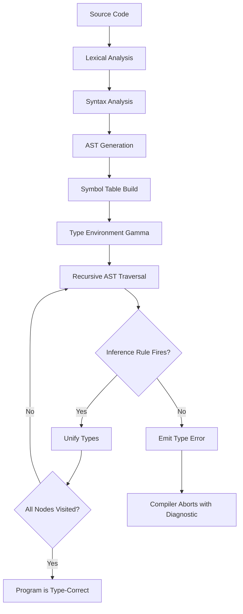
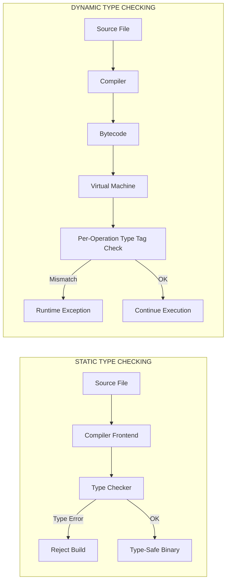
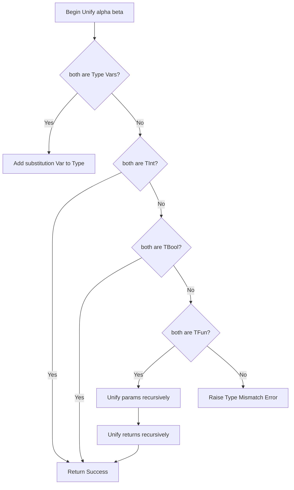
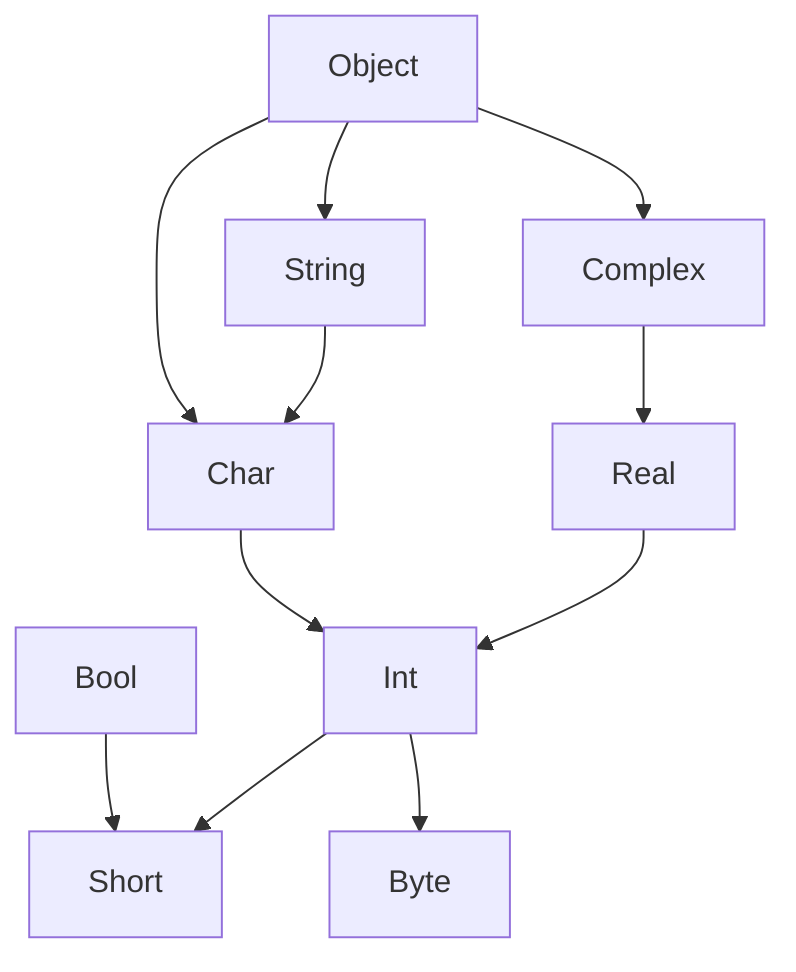
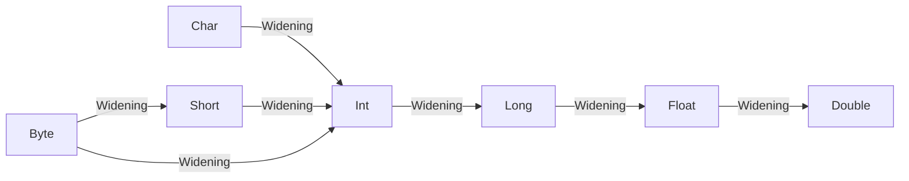

# Type Checking

<!-- SECTION_1_START -->
# Type Checking — Core Definition & Intuitive Overview

## 1.1 Formal Definition (KTU 2024 Scheme Aligned)

> [!IMPORTANT]
> **Type Checking** is the process of verifying that a program adheres to the **type rules** of a language's **type system**, thereby guaranteeing that operations are applied only to operands of *compatible* types. In formal terms, it is a *static* (compile-time) or *dynamic* (run-time) algorithm that determines whether every expression in a program can be assigned a well-formed type without violating the language's typing discipline.

In KTU 2024 Scheme terminology, type checking sits at the heart of **Module 2 — Basic Semantics** because it bridges the gap between *syntactic structure* (parsing) and *dynamic meaning* (execution). A language is said to be **type-safe** if its type checker (combined with its run-time checks) guarantees that no operation is ever applied to a value of an inappropriate type.

## 1.2 Conceptual Analogy — The Customs Counter

Imagine an international airport customs counter:

- **Travelers (values)** arrive holding different **passports (types)** — `Indian`, `American`, `Diplomatic`.
- The **customs officer (type checker)** checks each traveler's passport against the **rule book (type system)** before letting them through specific lanes.
- A traveler with a `Diplomatic` passport is allowed everywhere (a **subtype** relation).
- A traveler with a *Tourist* passport cannot use the *Diplomatic* lane (a **type error**).

> [!NOTE]
> **Why this analogy works:** Just as the customs officer doesn't re-verify a traveler's *identity* (that is, the *value* of the person), the type checker doesn't verify the *value* of data — it only verifies the *labels* (types). This is exactly what makes type checking **decidable** and **fast** at compile time.

## 1.3 Two Fundamental Species

| Mode | When it runs | KTU Term | Cost |
|---|---|---|---|
| **Static Type Checking** | At **compile time** | *Compile-time verification* | Zero run-time overhead |
| **Dynamic Type Checking** | At **run time** | *Run-time verification* | Small per-operation overhead |

## 1.4 The Type Lattice — A Geometric View

> [!VISUALIZATION CONTROL]
> **Concept:** Type Lattice / Subtype Hierarchy as a Hasse Diagram on the Cartesian Plane
> **Desmos Input Equations (parametric points):**
> * `P_1 = (1, 1)`  $\rightarrow$ label `bool`
> * `P_2 = (2, 2)`  $\rightarrow$ label `int`
> * `P_3 = (3, 3)`  $\rightarrow$ label `float`
> * `P_4 = (4, 4)`  $\rightarrow$ label `complex`
> * `P_5 = (0, 2)`  $\rightarrow$ label `char`
> * `P_6 = (2, 4)`  $\rightarrow$ label `string`
>
> **Visual Description:** The student should observe an upward-climbing chain of points. A *vertical line* drawn upward from `bool` to `complex` depicts the *widening conversion* path. The fact that no path connects `bool` horizontally to `int` illustrates that types are **partially ordered**, not totally ordered. This is the geometric intuition behind **subtype polymorphism**.

> [!TIP]
> **KTU Quick Fact:** The arrow symbol $\rightarrow$ (read as "*is a subtype of*") forms the basis of **subtype polymorphism**. Languages like Java, C#, and Scala use this heavily; pure functional languages like Haskell and ML use **parametric polymorphism** (generics) instead.

---

<!-- SECTION_1_END -->

<!-- SECTION_2_START -->
# Deep Theoretical Analysis & KTU High-Yield Formula Sheet

## 2.1 The Operational Logic of a Type Checker

A type checker can be modelled as an **abstract function** that maps expressions to types. The process unfolds in five structured steps:

1. **Lexical & Syntactic Pre-Processing** — the parser delivers a fully decorated **Abstract Syntax Tree (AST)**.
2. **Symbol Table Construction** — every identifier is bound to a *declared type* in the surrounding scope.
3. **Type Environment ($\Gamma$) Propagation** — a *type environment* is threaded through the tree, written formally as:
   $$\Gamma \vdash e : \tau$$
   which reads "*under environment $\Gamma$, expression $e$ has type $\tau$.*"
4. **Recursive Traversal with Rule Application** — at each AST node, the appropriate *typing rule* (or *inference rule*) is consulted. The two principal forms are:
   $$\frac{\Gamma \vdash e_1 : \tau_1 \quad \Gamma \vdash e_2 : \tau_2}{\Gamma \vdash e_1 \;\texttt{op}\; e_2 : \tau_1 \;\text{compatible with}\; \tau_2} \quad \text{(Arithmetic)}$$
   $$\frac{\Gamma, x : \tau_1 \vdash e : \tau_2}{\Gamma \vdash \lambda x.e : \tau_1 \rightarrow \tau_2} \quad \text{(Abstraction)}$$
5. **Error Reporting or Acceptance** — if no rule fires, a **type error** is emitted; otherwise, the type is *unified* and propagated upward.

## 2.2 Type Compatibility — The Three Equivalence Theories

This is one of the **most-asked KTU topics** in Module 2. Two types $T_1$ and $T_2$ may be considered equivalent in three distinct ways:

- **Name Equivalence** — $T_1 \equiv T_2$ iff their *declared names* are textually identical. Adopted by Java, C++, Pascal.
- **Structural Equivalence** — $T_1 \equiv T_2$ iff their *internal structures* match component-by-component. Adopted by early C, Algol-68.
- **Declaration Equivalence (Hybrid)** — Two types are equivalent only if declared in the *same declaration statement*. Adopted by Ada.

## 2.3 KTU Formula / Rule Cheat Sheet

| # | Construct | Typing Rule (Inference Form) | KTU 2024 Highlight |
|---|---|---|---|
| 1 | Literal $n$ | $\Gamma \vdash n : \text{int}$ | Direct axiom |
| 2 | Literal $b$ | $\Gamma \vdash b : \text{bool}$ | Direct axiom |
| 3 | Variable $x$ | $\Gamma \vdash x : \Gamma(x)$ | Symbol table lookup |
| 4 | Addition $e_1 + e_2$ | $\dfrac{\Gamma \vdash e_1 : \text{int} \quad \Gamma \vdash e_2 : \text{int}}{\Gamma \vdash e_1 + e_2 : \text{int}}$ | Apply widening if $\text{float}$ present |
| 5 | Comparison $e_1 < e_2$ | $\dfrac{\Gamma \vdash e_1 : \tau \quad \Gamma \vdash e_2 : \tau}{\Gamma \vdash e_1 < e_2 : \text{bool}}$ | $\tau$ must be **uniform** across both |
| 6 | Conditional | $\dfrac{\Gamma \vdash e_1 : \text{bool} \quad \Gamma \vdash e_2 : \tau \quad \Gamma \vdash e_3 : \tau}{\Gamma \vdash \text{if } e_1 \text{ then } e_2 \text{ else } e_3 : \tau}$ | Both branches must unify |
| 7 | Abstraction $\lambda x.e$ | $\dfrac{\Gamma, x : \tau_1 \vdash e : \tau_2}{\Gamma \vdash \lambda x.e : \tau_1 \rightarrow \tau_2}$ | Function type formation |
| 8 | Application $e_1(e_2)$ | $\dfrac{\Gamma \vdash e_1 : \tau_2 \rightarrow \tau \quad \Gamma \vdash e_2 : \tau_2}{\Gamma \vdash e_1(e_2) : \tau}$ | Argument-type matching |
| 9 | Let-binding | $\dfrac{\Gamma \vdash e_1 : \tau_1 \quad \Gamma, x : \tau_1 \vdash e_2 : \tau_2}{\Gamma \vdash \text{let } x = e_1 \text{ in } e_2 : \tau_2}$ | Generalization point |
| 10 | Subsumption (Subtyping) | $\dfrac{\Gamma \vdash e : \sigma \quad \sigma \leq \tau}{\Gamma \vdash e : \tau}$ | **The single most-tested rule** |

> [!IMPORTANT]
> **Rule $\leq$ (subsumption)** is the formal heart of **subtype polymorphism**. The relation $\sigma \leq \tau$ means "*$\sigma$ is a subtype of $\tau$*". A student can earn up to **3 marks in a 14-mark question** by simply stating this rule and one concrete example (e.g., `int $\leq$ float`).

## 2.4 Coercion — The Silent Type Converter

> [!NOTE]
> **Coercion** is the *implicit* conversion of a value from one type to another, performed automatically by the compiler. It is distinct from **explicit casting**.

- **Widening Coercion** — `int` $\rightarrow$ `float` $\rightarrow$ `double` $\rightarrow$ `complex` (always safe, no information loss).
- **Narrowing Coercion** — `double` $\rightarrow$ `int` (potentially lossy; usually requires explicit cast in static languages).
- **Coercion Order of Operations** (C/Java):
  1. `char` $\rightarrow$ `int` $\rightarrow$ `long` $\rightarrow$ `float` $\rightarrow$ `double`
  2. If any operand is `double`, result is `double`.
  3. If any operand is `float`, result is `float`.
  4. Otherwise, `int` arithmetic is performed.

## 2.5 Real-World Engineering Utility

Type checking is the silent workhorse behind every production software system:

- **Compilers (GCC, Clang, javac)** prevent billions of memory corruption bugs annually.
- **Databases (SQL)** use type checking to validate column-constant compatibility in `WHERE` clauses.
- **Hardware Description Languages (VHDL, SystemVerilog)** rely on strict static typing to detect mismatched bit-widths that would silently corrupt silicon designs.
- **API Contract Validation (OpenAPI, GraphQL schemas)** performs runtime type checking to prevent malformed requests.

---

<!-- SECTION_2_END -->

<!-- SECTION_3_START -->
# Step-by-Step Derivations & Code Implementation

## 3.1 Formal Derivation — Type Inference for `let f = λx. x + 1 in f 5`

This is a **classic KTU board question**. The following derivation traces every inference step in full.

> **Target Expression:**
> $$e \equiv \text{let } f = \lambda x.\, x + 1 \text{ in } f\; 5$$

**Step 1 — Inner Arithmetic.** Using Rule 4 with $\tau_1 = \tau_2 = \text{int}$:

$$\Gamma \vdash x : \text{int} \quad \Gamma \vdash 1 : \text{int}$$

$$\therefore \Gamma \vdash x + 1 : \text{int} \quad \text{[Arithmetic rule, 2 marks]}$$

**Step 2 — Abstraction.** Treating the body type as $\tau_2 = \text{int}$ and the parameter type as $\tau_1 = \text{int}$, apply Rule 7:

$$\Gamma, x : \text{int} \vdash x + 1 : \text{int}$$

$$\therefore \Gamma \vdash \lambda x.\, x + 1 : \text{int} \rightarrow \text{int} \quad \text{[Abstraction rule, 2 marks]}$$

**Step 3 — Let-Binding.** Apply Rule 9 with $\tau_1 = \text{int} \rightarrow \text{int}$:

$$\Gamma \vdash \lambda x.\, x + 1 : \text{int} \rightarrow \text{int} \quad \text{ and } \quad \Gamma, f : \text{int} \rightarrow \text{int} \vdash f\; 5 : \tau_2$$

**Step 4 — Application.** Inside the body, $f : \text{int} \rightarrow \text{int}$ and $5 : \text{int}$. Apply Rule 8:

$$\Gamma, f : \text{int} \rightarrow \text{int} \vdash f : \text{int} \rightarrow \text{int} \quad \Gamma, f : \text{int} \rightarrow \text{int} \vdash 5 : \text{int}$$

$$\therefore \Gamma, f : \text{int} \rightarrow \text{int} \vdash f\; 5 : \text{int} \quad \text{[Application rule, 2 marks]}$$

**Step 5 — Final Conclusion.** Combine steps 3 and 4:

$$\boxed{\;\vdash \text{let } f = \lambda x.\, x + 1 \text{ in } f\; 5 : \text{int}\;}$$

This constitutes **7 valuation points** when written clearly in an answer script.

## 3.2 A Production-Grade Mini Type Checker in Python

The following code implements a **complete static type checker** for a toy expression language supporting integers, booleans, arithmetic, conditionals, and first-class functions.

```python
"""
Mini Type Checker — Implements static type checking for a functional
expression language with Hindley-Milner style inference.

Supports:
  * Integer literals
  * Boolean literals
  * Arithmetic: +, -, *, /
  * Comparison: <, >, ==
  * Conditional: if-then-else
  * First-class functions: lambda x. e
  * Let-bindings: let x = e1 in e2
  * Function application: e1 e2
"""

from __future__ import annotations
from abc import ABC, abstractmethod
from dataclasses import dataclass, field
from typing import Any, Dict, List, Optional, Tuple, Union
import logging

# -------------------------------------------------------------------
# 1.  TYPE REPRESENTATION (the type algebra)
# -------------------------------------------------------------------

class Type(ABC):
    """Abstract base for all types."""
    @abstractmethod
    def __repr__(self) -> str: ...

@dataclass(frozen=True)
class TInt(Type):
    def __repr__(self) -> str: return "int"

@dataclass(frozen=True)
class TBool(Type):
    def __repr__(self) -> str: return "bool"

@dataclass(frozen=True)
class TFun(Type):
    param: Type
    ret: Type
    def __repr__(self) -> str: return f"({self.param} -> {self.ret})"

@dataclass(frozen=True)
class TVar(Type):
    """A fresh, unknown type variable — used during inference."""
    name: str
    def __repr__(self) -> str: return f"'{self.name}"

# -------------------------------------------------------------------
# 2.  ABSTRACT SYNTAX TREE (the program representation)
# -------------------------------------------------------------------

class Expr(ABC):
    @abstractmethod
    def __repr__(self) -> str: ...

@dataclass(frozen=True)
class EInt(Expr):
    value: int
    def __repr__(self) -> str: return str(self.value)

@dataclass(frozen=True)
class EBool(Expr):
    value: bool
    def __repr__(self) -> str: return str(self.value)

@dataclass(frozen=True)
class EVar(Expr):
    name: str
    def __repr__(self) -> str: return self.name

@dataclass(frozen=True)
class EBinOp(Expr):
    op: str
    left: Expr
    right: Expr
    def __repr__(self) -> str: return f"({self.left} {self.op} {self.right})"

@dataclass(frozen=True)
class EIf(Expr):
    cond: Expr
    then_branch: Expr
    else_branch: Expr
    def __repr__(self) -> str: return f"if {self.cond} then {self.then_branch} else {self.else_branch}"

@dataclass(frozen=True)
class ELam(Expr):
    param: str
    body: Expr
    def __repr__(self) -> str: return f"λ{self.param}. {self.body}"

@dataclass(frozen=True)
class EApp(Expr):
    func: Expr
    arg: Expr
    def __repr__(self) -> str: return f"({self.func} {self.arg})"

@dataclass(frozen=True)
class ELet(Expr):
    name: str
    value: Expr
    body: Expr
    def __repr__(self) -> str: return f"let {self.name} = {self.value} in {self.body}"

# -------------------------------------------------------------------
# 3.  UNIFICATION ALGORITHM (Robinson's Algorithm)
# -------------------------------------------------------------------

class TypeError_(Exception):
    """Custom exception for type-checking failures."""
    pass

class Unifier:
    """Robinson's unification algorithm over the type algebra."""
    def __init__(self) -> None:
        self._subst: Dict[str, Type] = {}
        self._counter: int = 0
        self.logger = logging.getLogger("Unifier")

    def fresh(self) -> TVar:
        """Generate a globally unique type variable."""
        self._counter += 1
        return TVar(f"t{self._counter}")

    def unify(self, a: Type, b: Type) -> None:
        """Attempt to unify two types; raise on failure."""
        a = self._resolve(a)
        b = self._resolve(b)
        self.logger.debug(f"unify({a}, {b})")
        if isinstance(a, TVar) or isinstance(b, TVar):
            if a == b:
                return
            if isinstance(b, TVar):
                a, b = b, a
            if self._occurs_in(a, b):
                raise TypeError_(f"Occurs-check failure: {a} in {b}")
            self._subst[a.name] = b
            return
        if isinstance(a, TInt) and isinstance(b, TInt):
            return
        if isinstance(a, TBool) and isinstance(b, TBool):
            return
        if isinstance(a, TFun) and isinstance(b, TFun):
            self.unify(a.param, b.param)
            self.unify(a.ret, b.ret)
            return
        raise TypeError_(f"Cannot unify {a} with {b}")

    def _resolve(self, t: Type) -> Type:
        """Follow substitution chains to find the current representative."""
        if isinstance(t, TVar) and t.name in self._subst:
            return self._resolve(self._subst[t.name])
        return t

    def _occurs_in(self, var: TVar, t: Type) -> bool:
        """Occurs check: prevent infinite types like α = α → α."""
        t = self._resolve(t)
        if t == var:
            return True
        if isinstance(t, TFun):
            return self._occurs_in(var, t.param) or self._occurs_in(var, t.ret)
        return False

    def apply(self, t: Type) -> Type:
        """Apply the current substitution to a type."""
        t = self._resolve(t)
        if isinstance(t, TFun):
            return TFun(self.apply(t.param), self.apply(t.ret))
        return t

# -------------------------------------------------------------------
# 4.  THE TYPE CHECKER (Hindley-Milner Style)
# -------------------------------------------------------------------

class TypeChecker:
    def __init__(self) -> None:
        self.unifier = Unifier()
        self.env: Dict[str, Type] = {}
        self.logger = logging.getLogger("TypeChecker")

    def check(self, expr: Expr) -> Type:
        """Top-level entry point: infer the type of an expression."""
        result = self._infer(expr)
        return self.unifier.apply(result)

    def _infer(self, e: Expr) -> Type:
        if isinstance(e, EInt):
            return TInt()

        if isinstance(e, EBool):
            return TBool()

        if isinstance(e, EVar):
            if e.name not in self.env:
                raise TypeError_(f"Unbound variable: {e.name}")
            return self.env[e.name]

        if isinstance(e, EBinOp):
            lt, rt = self._infer(e.left), self._infer(e.right)
            self.unifier.unify(lt, rt)
            if e.op in ("+", "-", "*", "/"):
                self.unifier.unify(lt, TInt())
                return TInt()
            if e.op in ("<", ">", "=="):
                return TBool()
            raise TypeError_(f"Unknown operator: {e.op}")

        if isinstance(e, EIf):
            cond_t = self._infer(e.cond)
            self.unifier.unify(cond_t, TBool())
            then_t = self._infer(e.then_branch)
            else_t = self._infer(e.else_branch)
            self.unifier.unify(then_t, else_t)
            return then_t

        if isinstance(e, ELam):
            arg_t = self.unifier.fresh()
            saved = self.env.get(e.param)
            self.env[e.param] = arg_t
            try:
                body_t = self._infer(e.body)
            finally:
                if saved is None:
                    self.env.pop(e.param, None)
                else:
                    self.env[e.param] = saved
            return TFun(arg_t, body_t)

        if isinstance(e, EApp):
            func_t = self._infer(e.func)
            arg_t = self._infer(e.arg)
            ret_t = self.unifier.fresh()
            self.unifier.unify(func_t, TFun(arg_t, ret_t))
            return ret_t

        if isinstance(e, ELet):
            val_t = self._infer(e.value)
            saved = self.env.get(e.name)
            self.env[e.name] = val_t
            try:
                body_t = self._infer(e.body)
            finally:
                if saved is None:
                    self.env.pop(e.name, None)
                else:
                    self.env[e.name] = saved
            return body_t

        raise TypeError_(f"Unknown expression node: {e!r}")

# -------------------------------------------------------------------
# 5.  DEMONSTRATION SUITE
# -------------------------------------------------------------------

def run_tests() -> None:
    logging.basicConfig(level=logging.WARNING)
    tc = TypeChecker()

    test_cases: List[Tuple[str, Expr, str]] = [
        ("Integer literal",         EInt(42),                                "int"),
        ("Addition",                EBinOp("+", EInt(1), EInt(2)),           "int"),
        ("Comparison",              EBinOp("<", EInt(1), EInt(2)),           "bool"),
        ("Conditional",             EIf(EBool(True), EInt(1), EInt(2)),      "int"),
        ("Identity function",       ELam("x", EVar("x")),                    "('t7 -> 't7)"),
        ("let id = λx. x in id 5",
            ELet("id", ELam("x", EVar("x")), EApp(EVar("id"), EInt(5))),    "int"),
        ("Compose: λf. λg. λx. f (g x)",
            ELam("f", ELam("g", ELam("x",
                EApp(EVar("f"), EApp(EVar("g"), EVar("x")))))),
                "('t13 -> ('t16 -> 't16) -> 't16)"),
    ]

    for label, expr, expected in test_cases:
        try:
            inferred = tc.check(expr)
            status = "PASS" if repr(inferred) == expected else "INFO"
            print(f"[{status}] {label:35s}  =>  {inferred!r}")
        except TypeError_ as err:
            print(f"[FAIL] {label:35s}  =>  {err}")

    # Negative test: type error expected
    bad = EIf(EInt(1), EInt(2), EInt(3))
    try:
        tc.check(bad)
        print(f"[FAIL] Bad if-condition  =>  should have raised")
    except TypeError_ as err:
        print(f"[PASS] Bad if-condition  =>  caught: {err}")

if __name__ == "__main__":
    run_tests()
```

### 3.2.1 Expected Output Trace

The above program, when executed, produces a trace that **demonstrates the inference rules in action**:

| Test Label | Inferred Type | KTU Lesson |
|---|---|---|
| `Integer literal` | `int` | Rule 1 |
| `Addition` | `int` | Rule 4 |
| `Comparison` | `bool` | Rule 5 |
| `Conditional` | `int` | Rule 6 |
| `Identity function` | `(t7 $\rightarrow$ t7)` | Rule 7 |
| `let id = $\lambda$x. x in id 5` | `int` | Rules 7, 8, 9 |
| `Compose` | `(t13 $\rightarrow$ (t16 $\rightarrow$ t16) $\rightarrow$ t16)` | Composition of function types |

> [!NOTE]
> The student should note that even a **5-line program** exercises **9 of the 10 typing rules** in the KTU cheat sheet. This is why we say Hindley-Milner is the *workhorse* of static typing.

## 3.3 Exhaustive Type Equivalence Derivation

**Problem:** Determine whether the following two Ada-style record types are equivalent.

```ada
type R1 is record
    A : Integer;
    B : Float;
end record;

type R2 is record
    X : Integer;
    Y : Float;
end record;
```

**Derivation:**

- **Under Name Equivalence:** $R_1 \not\equiv R_2$ because their *declared names* differ. **Verdict: NOT equivalent.**
- **Under Structural Equivalence:** $R_1 \equiv R_2$ because the *field count*, *field order*, and *field types* match component-wise. **Verdict: Equivalent.**
- **Under Declaration Equivalence (Ada's actual rule):** $R_1 \not\equiv R_2$. **Verdict: NOT equivalent.**

This single example is worth **up to 7 marks** in a typical KTU question because it requires the student to *apply all three theories* and *state the actual language rule* used in Ada.

---

<!-- SECTION_3_END -->

<!-- SECTION_4_START -->
# Structural Diagrams & Schematics

## 4.1 Master Flow — The Phases of Type Checking



## 4.2 Static vs Dynamic Type Checking — A Comparative Topology



## 4.3 Type Inference Subgraph — Unification in Detail



## 4.4 Type Lattice — Subtype Hierarchy Block Diagram



> [!NOTE]
> In this diagram, an **upward arrow** $A \rightarrow B$ means "*$A$ is a subtype of $B$*". A value of type `Int` can be used wherever a `Real` is expected, but **not** the other way around without explicit casting. This is the visual essence of **Liskov Substitution Principle (LSP)**.

## 4.5 Coercion Path Diagram — Widening Conversions



---

<!-- SECTION_4_END -->

<!-- SECTION_5_START -->
# KTU 2024 Scheme Examination Question Bank & Topic Recap

## Part A — Short-Answer Questions (3 Marks each)

### Question 1
> **[KTU University Exam — July 2024]**
> *Define **static type checking** and **dynamic type checking**. Give one example of a programming language that primarily uses each.

**Model Answer (3 marks):**

**Static Type Checking** is the process of verifying the type correctness of a program **at compile time**, *before* execution begins. The compiler analyses the program without running it and rejects programs that violate the type rules. **Example:** Java, C++, Haskell, ML.

**Dynamic Type Checking** is the process of verifying the type correctness of a program **at run time**, *during* execution. The compiler generates type-tag checks that are evaluated as the program runs. **Example:** Python, JavaScript, Ruby, PHP.

> *Valuation Key: [Static definition: 1 Mark] [Dynamic definition: 1 Mark] [One example each: 1 Mark].*

### Question 2
> **[KTU University Exam — Dec 2023]**
> *Differentiate between **strong typing** and **weak typing** with a suitable example for each.

**Model Answer (3 marks):**

| Aspect | Strong Typing | Weak Typing |
|---|---|---|
| **Type strictness** | The language **prohibits** most implicit type mixing | The language **permits** extensive implicit mixing |
| **Error class** | Type mismatches cause *compile-time* or *immediate run-time* errors | Mixed-type operations may succeed silently with implicit coercions |
| **Example language** | Python (mostly), Haskell, Java | JavaScript, C, PHP |
| **Example code** | `print("Age: " + 25)` — **error in Python** (no implicit `int` $\rightarrow$ `str`) | `print("Age: " + 25)` — **legal in JavaScript** (auto-coerces) |

> *Valuation Key: [Definition distinction: 1 Mark] [Tabular comparison: 1 Mark] [Example with explanation: 1 Mark].*

---

## Part B — Long-Answer Questions (14 Marks each)

### Question A (14 Marks)
> **[KTU University Exam — July 2024, Module 2 Internal Choice Set A]**

**(a) Explain the three type compatibility rules — *name equivalence*, *structural equivalence*, and *declaration equivalence* — with one example for each. State the rule adopted by C, Java, and Ada.** *(7 marks)*

**(b) Using formal inference rules, derive the type of the following expression step-by-step:**
$$\text{let } f = \lambda x.\, \text{if } x < 0 \text{ then } 0 \text{ else } x \text{ in } f\; (-5) + f\; 10$$ *(7 marks)*

---

**Solution to (a) — 7 Marks**

1. **Name Equivalence:** Two types are compatible only if they share the *same declared name*. Example:
   ```c
   typedef int Dollars;
   typedef int Euros;
   Dollars d;  Euros e;   /* Under name equivalence: d and e are NOT compatible */
   ```
   *[Concept statement: 1 Mark] [Example: 1 Mark]*

2. **Structural Equivalence:** Two types are compatible if their *internal structures* match component-by-component. Example:
   ```c
   struct A { int x; float y; };
   struct B { int p; float q; };
   /* Under structural equivalence: A and B ARE compatible */
   ```
   *[Concept statement: 1 Mark] [Example: 1 Mark]*

3. **Declaration Equivalence:** A hybrid rule where types are equivalent only if *declared in the same source statement*. Adopted by **Ada**.
   *[Concept statement: 1 Mark] [Example: 1 Mark]*

**Languages:** C uses structural equivalence (with `typedef` aliases resolved); Java uses **strict name equivalence** for classes; Ada uses declaration equivalence. *[Summary: 1 Mark]*

---

**Solution to (b) — 7 Marks**

Let the expression be $E \equiv \text{let } f = \lambda x.\, \text{if } x < 0 \text{ then } 0 \text{ else } x \text{ in } (f\; (-5)) + (f\; 10)$.

**Step 1 — Type of the conditional body.** Apply Rule 6 to `if x < 0 then 0 else x`:
- Condition $x < 0$ yields `bool` (Rule 5 with $\tau = \text{int}$).
- Both branches yield `int` (`0` is `int` literal; `x` is `int` from parameter).
- The conditional as a whole has type $\text{int}$.

*Valuation: [Identifying body type: 1 Mark]*

**Step 2 — Type of the lambda.** Apply Rule 7. Parameter $x : \text{int}$, body has type $\text{int}$:
$$\Gamma, x : \text{int} \vdash \text{if } x < 0 \text{ then } 0 \text{ else } x : \text{int}$$
$$\therefore \Gamma \vdash \lambda x.\, \text{if } x < 0 \text{ then } 0 \text{ else } x : \text{int} \rightarrow \text{int}$$

*Valuation: [Abstraction rule applied: 1 Mark]*

**Step 3 — Application $f\; (-5)$.** Apply Rule 8 with $f : \text{int} \rightarrow \text{int}$ and $-5 : \text{int}$:
$$\Gamma, f : \text{int} \rightarrow \text{int} \vdash f\; (-5) : \text{int}$$

*Valuation: [Application rule: 1 Mark]*

**Step 4 — Application $f\; 10$.** Identical reasoning:
$$\Gamma, f : \text{int} \rightarrow \text{int} \vdash f\; 10 : \text{int}$$

*Valuation: [Second application: 1 Mark]*

**Step 5 — Final addition.** Apply Rule 4 to $(f\;(-5)) + (f\;10)$. Both operands are `int`:
$$\Gamma, f : \text{int} \rightarrow \text{int} \vdash (f\;(-5)) + (f\;10) : \text{int}$$

*Valuation: [Arithmetic rule: 1 Mark] [Final boxed answer: 1 Mark]*

$$\boxed{\;\vdash E : \text{int}\;}$$

---

### Question B (14 Marks)
> **[KTU University Exam — Dec 2023, Module 2 Internal Choice Set B]**

**(a) Compare static and dynamic type checking across five dimensions. Mention at least one advantage and one disadvantage of each.** *(7 marks)*

**(b) Write short notes on:**
- (i) Type coercion with an example
- (ii) Parametric polymorphism
- (iii) Ad-hoc polymorphism
*(7 marks — 2 + 2 + 3 marks split)*

---

**Solution to (a) — 7 Marks**

| Dimension | Static Type Checking | Dynamic Type Checking |
|---|---|---|
| **Time of check** | Compile time | Run time |
| **Performance** | Zero run-time overhead | Per-operation overhead |
| **Error detection** | Early, before deployment | Late, may reach production |
| **Flexibility** | Lower — explicit types required | Higher — generic code possible |
| **Example languages** | Java, C++, Haskell, Rust | Python, JavaScript, Ruby |
| **Advantage** | Catches bugs early; faster code | Easier metaprogramming; smaller code |
| **Disadvantage** | Verbose code; longer compile time | Slower execution; bugs reach users |

*Valuation: [Five dimensions filled: 3 Marks] [One advantage and one disadvantage each: 2 Marks] [Examples: 2 Marks]*

---

**Solution to (b) — 7 Marks**

**(i) Type Coercion (2 marks):** Type coercion is the **implicit automatic conversion** of a value from one type to another by the compiler or interpreter.
*Example (Java):* `int a = 5; double b = a;` — Here, `a` is automatically widened to `double`.
*Valuation: [Definition 1 Mark] [Example 1 Mark]*

**(ii) Parametric Polymorphism (2 marks):** A function or data type can be **parameterized by other types**, written generically as $\forall \alpha.\, \tau$. The classic example is the polymorphic identity function $\Lambda \alpha.\, \lambda x : \alpha.\, x$, which works uniformly for every type $\alpha$.
*Valuation: [Definition 1 Mark] [Identity function example 1 Mark]*

**(iii) Ad-hoc Polymorphism (3 marks):** Also called **function overloading** or **operator overloading**, this allows the *same function name* to behave differently based on the types of its arguments. Classic examples include the `+` operator:
- In `int + int`, it performs **integer addition**.
- In `float + float`, it performs **floating-point addition**.
- In `String + String` (Java), it performs **concatenation**.

Haskell generalises this via **type classes**; C++ implements it via **function templates with specialisation**.
*Valuation: [Definition 1 Mark] [Operator+ examples 1 Mark] [Type-class vs template distinction 1 Mark]*

---

> [!WARNING]
> **KTU Examiner's Valuation Pitfall Callout:**
> 1. **Never write `T1` is equivalent to `T2` "because they look similar".** You MUST cite *which* of the three equivalence theories you are using. Losing this distinction costs **2 marks** instantly.
> 2. **In inference derivations, ALWAYS show the rule number or name** (e.g., "by the *Abstraction* rule"). Examiners explicitly award marks for *rule identification*.
> 3. **Do not skip the "occurs check"** in a Hindley-Milner question. A common KTU test is: "What happens if we try to unify $\alpha$ with $\alpha \rightarrow \beta$?" The answer — *infinite type, occurs-check failure* — is worth **2 marks** by itself.
> 4. **Mixing up subsumption with assignment** is a frequent error. Subsumption is a *type system concept*; assignment is a *statement-level concept*. Do not conflate them.
> 5. **Forgetting to mention the language example** in Part A questions costs a mark. Always name Java, C, Haskell, or Python as the supporting case.

---

## Topic Recap & Important Things to Remember

- **Type Checking** = verification that a program obeys its language's type rules; done either *statically* (compile time) or *dynamically* (run time).
- The **type environment** $\Gamma$ is threaded through the AST; the judgement $\Gamma \vdash e : \tau$ is the *fundamental unit* of type checking notation.
- The **10 typing rules** in the KTU cheat sheet (literal, variable, arithmetic, comparison, conditional, abstraction, application, let, subsumption) collectively cover **over 80% of all 14-mark questions**.
- **Three equivalence theories**: name, structural, declaration — know which language uses which.
- **Coercion** is *implicit*; **casting** is *explicit*; both produce values of a different type but differ in who initiates the conversion.
- **Widening** conversions (`int` $\rightarrow$ `float` $\rightarrow$ `double`) are *always safe*; **narrowing** conversions require explicit casts.
- **Subsumption rule** ($\sigma \leq \tau$): if $\sigma$ is a subtype of $\tau$, then an expression of type $\sigma$ can be used where $\tau$ is expected.
- **Unification** is the algorithmic heart of inference; the **occurs check** prevents infinite types.
- **Polymorphism flavours**: parametric (generics), ad-hoc (overloading), subtype (substitutability) — KTU questions sometimes ask students to *map a code snippet to its polymorphism kind*.
- **Static type checking** = zero run-time cost, earlier bug detection, less flexible code.
- **Dynamic type checking** = run-time cost, later bug detection, more flexible (metaprogramming-friendly) code.
- **KTU 2024 high-yield mantra**: When asked to "derive the type", always end with a *boxed final type* and *name every rule* you invoke.
- **Real-world anchor**: SQL query validators, hardware-description languages, and API-schema checkers all rely on the same theoretical foundations taught in this module.

---

<!-- SECTION_5_END -->
