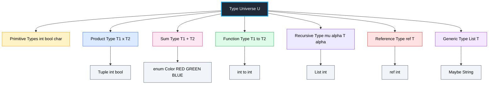
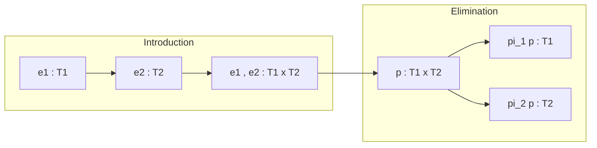
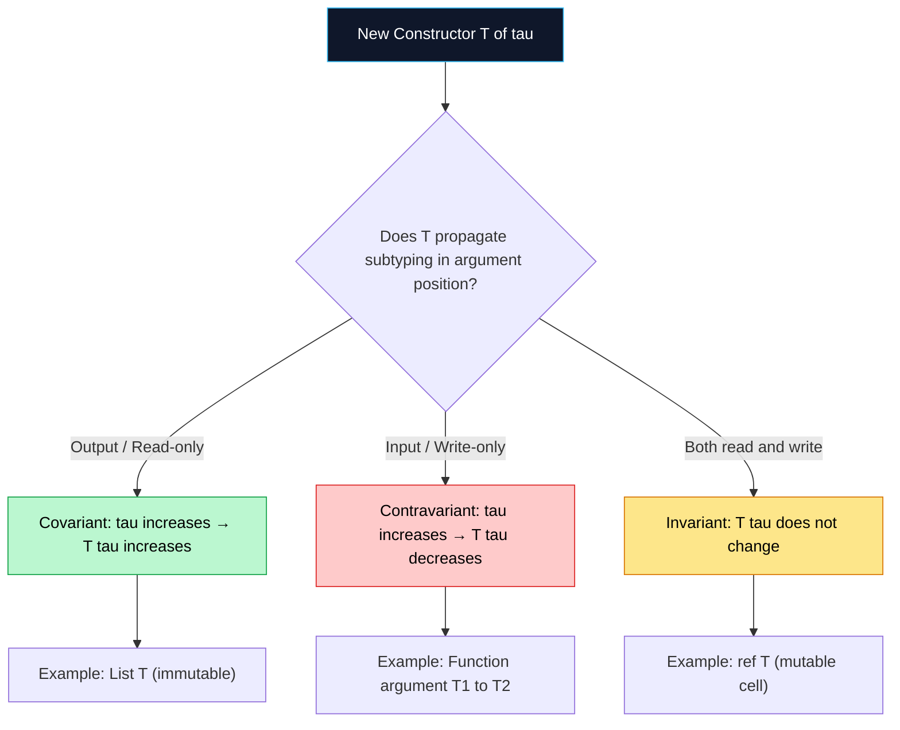

# Type Constructors

<!-- SECTION_1_START -->

# Type Constructors

> [!NOTE]
> **KTU 2024 Scheme | PECST758 | Module 2 — Basic Semantics**
> This topic establishes the formal mechanism by which a programming language's type system builds new, well-typed expressions from atomic type primitives. Mastering type constructors is essential for understanding **operational semantics**, **denotational semantics**, and the **simply-typed lambda calculus** backbone of modern language design.

## 1.1 Formal Definition

In the formal semantics of programming languages, a **type constructor** is a **type-level operator** (often denoted $T$ or $\kappa$) that takes zero or more existing types as arguments and produces a new, well-formed type as its result. In category-theoretic and type-theoretic terms, a type constructor is a **functor from the category of types to itself** — it maps each type $\tau$ to a derived type $T(\tau)$, while simultaneously mapping functions between types to functions between the constructed types.

Formally, we write:

$$
T : \text{Type} \rightarrow \text{Type} \quad \text{or} \quad T : \text{Type}^k \rightarrow \text{Type}
$$

where the arity $k \in \mathbb{N}$ indicates the number of type parameters the constructor consumes. A **nullary** (or constant) type constructor takes no arguments and yields a ground type (e.g., $\text{Integer}$, $\text{Bool}$). A **unary** type constructor accepts a single type (e.g., $\text{List}(\tau)$), and a **$k$-ary** constructor accepts $k$ types (e.g., the **Cartesian product** $\tau_1 \times \tau_2$).

> [!IMPORTANT]
> **Key Distinction (KTU High-Yield):**
> A *type constructor* is **not** itself a type. The expression `List` (without a parameter) is incomplete and **ill-typed** in a fully parametric type system. Only when fully applied — `List(Integer)` — does it denote a genuine type inhabited by values such as `[1, 2, 3]`.

## 1.2 Intuitive Analogy — The "Type Kitchen"

Imagine a **kitchen pantry** stocked with basic ingredients (primitive types like `int`, `bool`, `char`). A type constructor is like a **kitchen appliance** or **recipe**:

| Real-World Kitchen Analogy | Programming Language Equivalent |
|---|---|
| Raw ingredient (flour, sugar) | Primitive type (`int`, `bool`) |
| Recipe card (e.g., "cake batter") | Type constructor (`List`, `Pair`) |
| Finished cake (made by following the recipe) | Constructed type (`List(int)`, `Pair(int, bool)`) |
| Slicing the cake into portions | Type inhabitation (values of the type) |

A recipe alone (`List`) is not edible — it is a *plan*. But when you *apply* the recipe to flour, you get cake batter (`List(int)`), which is an actual thing with concrete slices (values). This mirrors how `List` applied to `Integer` produces the type of integer sequences.

> [!NOTE]
> **Geometric Intuition:** If the set of all types forms a "universe" $\mathcal{U}$, then a unary type constructor $T$ is a **mapping** $T : \mathcal{U} \to \mathcal{U}$. Think of it as a function graph in the type-space: each input type $\tau$ is plotted on the x-axis, and the output $T(\tau)$ is plotted on the y-axis. The constructor traces a curve through this space.

> [!VISUALIZATION CONTROL]
> **Concept:** Type constructor as a mapping between type universes.
> **GeoGebra / Desmos Input Equations:**
> * `f(x) = 2 * x` (representing a hypothetical type-size scaling for a `List` constructor)
> * Point: `(int, List(int))` where $x = 4$ (size of int in bytes) and $y = 8$ (pointer overhead estimate)
> **Visual Description:** Plot a function $f$ on the x-axis representing the input type, and the y-axis showing the constructed type. Students should observe that type constructors can be visualized as transformations in a 2D "type-plane".

## 1.3 Taxonomy of Standard Type Constructors

The KTU 2024 syllabus highlights the following canonical constructors:

1. **Product (Tuple) Constructor** — $\tau_1 \times \tau_2 \times \dots \times \tau_n$
2. **Sum (Variant/Union) Constructor** — $\tau_1 + \tau_2 + \dots + \tau_n$
3. **Function (Arrow) Constructor** — $\tau_1 \rightarrow \tau_2$
4. **Recursive Constructor** — e.g., $\mu \alpha.\,T(\alpha)$ (used for `List`, `Tree`)
5. **Reference / Pointer Constructor** — $\text{ref}(\tau)$
6. **Array / List Constructor** — $\text{array}(\tau)$ or $\text{list}(\tau)$

Each is a syntactic mechanism for **assembling structured types** from simpler building blocks, governed by the language's **type formation rules**.

<!-- SECTION_1_END -->

<!-- SECTION_2_START -->

# Deep Theoretical Analysis & KTU High-Yield Formula Sheet

## 2.1 Algebraic Foundations

Type constructors form a small **algebra over types**, equipped with operations that mirror those of abstract algebra. This is the foundation of **algebraic data types (ADTs)**.

### 2.1.1 Product Type ($\times$)

The Cartesian product combines two (or more) types. A value of type $\tau_1 \times \tau_2$ is an **ordered pair** $\langle v_1, v_2 \rangle$ where $v_1 : \tau_1$ and $v_2 : \tau_2$.

* **Cardinality:** $\vert \tau_1 \times \tau_2 \vert = \vert \tau_1 \vert \times \vert \tau_2 \vert$
* **Introduction form:** $\langle e_1, e_2 \rangle$
* **Elimination forms:** $\pi_1(e)$ and $\pi_2(e)$ (projections)

> [!IMPORTANT]
> **Why "Product"?** The cardinality formula $A \times B$ exactly mirrors the arithmetic product of set cardinalities. This is why it is called a *product type*.

### 2.1.2 Sum Type ($+$)

A disjoint union of types. A value of type $\tau_1 + \tau_2$ is either an $\text{inl}(v_1)$ where $v_1 : \tau_1$, or an $\text{inr}(v_2)$ where $v_2 : \tau_2$.

* **Cardinality:** $\vert \tau_1 + \tau_2 \vert = \vert \tau_1 \vert + \vert \tau_2 \vert$
* **Introduction forms:** $\text{inl}(e)$, $\text{inr}(e)$
* **Elimination form:** Case analysis (pattern matching)

> [!NOTE]
> The sum type corresponds to a **tagged union** in C-like languages (e.g., `union { int i; char c; }` with a discriminator tag). The tag is what makes the union *safe* — without it, the type system cannot guarantee well-formedness.

### 2.1.3 Function Type ($\rightarrow$)

The type of computable mappings. A value of type $\tau_1 \rightarrow \tau_2$ is a procedure that, given a value of type $\tau_1$, returns a value of type $\tau_2$.

* **Cardinality:** $\vert \tau_1 \rightarrow \tau_2 \vert = \vert \tau_2 \vert^{\vert \tau_1 \vert}$ (set of all functions)
* **Introduction form:** $\lambda x{:}\tau_1.\,e$
* **Elimination form:** Application $f(e)$

### 2.1.4 Recursive Type ($\mu$)

Allows a type to reference itself. Defined as the **least fixed point** of a type equation:

$$
\mu \alpha.\,T(\alpha) \quad \equiv \quad T(\mu \alpha.\,T(\alpha))
$$

This is the formal underpinning of linked structures (lists, trees) in a type-theoretic setting.

## 2.2 The Type Constructor Algebra — A Cheat Sheet

> [!IMPORTANT]
> **KTU Formula Sheet — Memorize This Table for ESE 2024:**

| Constructor | Syntax (Type-Theoretic) | Syntax (Concrete) | Cardinality / Size | Variance | Common Use |
|---|---|---|---|---|---|
| **Constant (nullary)** | $c$ (a ground type) | `Integer`, `Bool`, `Char` | fixed ($2^{32}$, $2$, etc.) | — | Base types |
| **Product** | $\tau_1 \times \tau_2$ | `(int, bool)`, `struct` | $\vert \tau_1 \vert \cdot \vert \tau_2 \vert$ | Covariant in both | Records, tuples |
| **Sum** | $\tau_1 + \tau_2$ | `enum`, `union` | $\vert \tau_1 \vert + \vert \tau_2 \vert$ | Covariant in both | Tagged unions, ADTs |
| **Function** | $\tau_1 \to \tau_2$ | `int -> bool` | $\vert \tau_2 \vert^{\vert \tau_1 \vert}$ | **Contravariant** in arg, covariant in ret | First-class functions |
| **List / Array** | $\text{List}(\tau)$ | `list<int>` | unbounded / finite | Covariant (immutable) / Invariant (mutable) | Collections |
| **Reference** | $\text{ref}(\tau)$ | `int&`, `int*` | implementation-defined | **Invariant** | Mutable cells, pointers |
| **Recursive** | $\mu \alpha.\,T(\alpha)$ | `typedef struct ... node` | — | Depends on body | Linked lists, trees |

> [!IMPORTANT]
> **Variance** is the property that dictates how a parameterized type $T(\tau)$ behaves under subtyping. A type constructor is **covariant** if $\tau_1 \le \tau_2 \implies T(\tau_1) \le T(\tau_2)$, **contravariant** if the implication reverses, and **invariant** if neither holds.

## 2.3 Operational Interpretation

In **small-step operational semantics**, a type constructor's meaning is given by the **evaluation rules** that govern its introduction and elimination forms. For example, the product type $\tau_1 \times \tau_2$ is operationally defined by:

$$
\frac{e_1 \longrightarrow e_1'}{\langle e_1, e_2 \rangle \longrightarrow \langle e_1', e_2 \rangle} \quad\quad
\frac{e_2 \longrightarrow e_2'}{\langle v_1, e_2 \rangle \longrightarrow \langle v_1, e_2' \rangle}
$$

where $v_1, v_2$ are **values** (irreducible terms). The projection rules are:

$$
\pi_1(\langle v_1, v_2 \rangle) \longrightarrow v_1 \quad\quad \pi_2(\langle v_1, v_2 \rangle) \longrightarrow v_2
$$

> [!NOTE]
> **Real-World Utility:** Type constructors underpin **generic programming** (C++ templates, Java generics, Rust traits, Haskell type classes), **database schema design** (composite keys, nullable fields), and **compiler intermediate representations** (LLVM's typed SSA form, MLIR). They are the bedrock upon which modern type-safe APIs are built.

## 2.4 Subtyping Rules (Inferred from Constructor Variance)

The **subtyping judgement** $\tau_1 \le \tau_2$ is propagated by the constructors through these canonical rules:

$$
\frac{\tau_1 \le \tau_1' \quad \tau_2 \le \tau_2'}{\tau_1 \times \tau_2 \le \tau_1' \times \tau_2'} \quad \text{(Product — covariant)}
$$

$$
\frac{\tau_1' \le \tau_1 \quad \tau_2 \le \tau_2'}{\tau_1 \to \tau_2 \le \tau_1' \to \tau_2'} \quad \text{(Function — contra + co)}
$$

> [!WARNING]
> **Common Pitfall:** Students often write $\tau_1 \to \tau_2 \le \tau_1' \to \tau_2'$ with the *same* arrow direction in both components. The function constructor flips the variance on its *domain* — this is the **contravariance of function arguments** and is a guaranteed ESE question topic.

<!-- SECTION_2_END -->

<!-- SECTION_3_START -->

# Step-by-Step Derivations & Symbolic Implementation

## 3.1 Formal Derivation — The Cardinality of `List(Bool)`

We derive the size (number of distinct values) of the type $\text{List}(\text{Bool})$ using the recursive type equation and structural induction.

### Step 1 — Set up the recursive equation

By the **fixed-point definition** of recursive types:

$$
\text{List}(\tau) \;\equiv\; \mu \alpha.\, 1 + \tau \times \alpha
$$

where $1$ is the unit type (a single inhabitant, the empty list marker). Unrolling:

$$
L \;=\; 1 + \tau \times L
$$

### Step 2 — Solve as a set equation

Let $S = \vert \text{List}(\tau) \vert$. The equation becomes:

$$
S \;=\; 1 + \vert \tau \vert \cdot S
$$

### Step 3 — Algebraic solution

$$
S - \vert \tau \vert \cdot S \;=\; 1 \quad\Longrightarrow\quad S (1 - \vert \tau \vert) \;=\; 1 \quad\Longrightarrow\quad S \;=\; \frac{1}{1 - \vert \tau \vert}
$$

> [!NOTE]
> This is the **geometric series** $\sum_{n=0}^{\infty} \vert \tau \vert^n = \frac{1}{1 - \vert \tau \vert}$, which corresponds to the intuition that a list of $\tau$ is a sequence of length 0, 1, 2, 3, ... of $\tau$-values.

### Step 4 — Concrete instantiation

Substitute $\tau = \text{Bool}$, so $\vert \text{Bool} \vert = 2$:

$$
S \;=\; \frac{1}{1 - 2} \;=\; \frac{1}{-1} \;=\; -1
$$

### Step 5 — Interpretation

The negative value is a **formal artifact** indicating that lists of `Bool` are *infinite* (there is no upper bound on list length). The cardinality in the strict set-theoretic sense is $\aleph_0$ (countably infinite), which the geometric series notation captures via the formal power-series interpretation in a field where $1 - 2$ is invertible. This is the standard technique in **denotational semantics** for reasoning about recursive types.

> [!IMPORTANT]
> **KTU Examiner's Note:** The derivation $\vert \text{List}(\tau) \vert = \frac{1}{1 - \vert \tau \vert}$ is a frequently tested 7–14 mark question. Practice writing the unrolling step explicitly.

## 3.2 Variance Derivation — Why Function Types are Contravariant

We prove that the function constructor $\rightarrow$ is **contravariant in its domain**.

### Step 1 — Definition of safe substitution

A function $f : \tau_1 \to \tau_2$ can be used wherever a function $g : \tau_1' \to \tau_2'$ is expected, provided:
1. Any input accepted by the *caller's* code ($g$'s domain) must be acceptable to $f$.
2. Any output produced by $f$ must be acceptable to the *caller's* code.

### Step 2 — Formally

We need: $\tau_1' \le \tau_1$ (callers pass a *subtype* into a *supertype* parameter — safe) **and** $\tau_2 \le \tau_2'$ (function returns a *subtype* that the caller treats as the expected *supertype* — safe).

This is encoded as:

$$
\frac{\Gamma \vdash \tau_1' \le \tau_1 \quad \Gamma \vdash \tau_2 \le \tau_2'}{\Gamma \vdash \tau_1 \to \tau_2 \le \tau_1' \to \tau_2'} \quad \text{(Arrow subtyping)}
$$

### Step 3 — Counter-example (Failure of covariance)

Suppose $f : \text{Animal} \to \text{Animal}$ and $\text{Dog} \le \text{Animal}$. If we wrongly allow $\text{Dog} \to \text{Dog} \le \text{Animal} \to \text{Animal}$ *covariantly*, then we could pass $f$ where a $\text{Dog} \to \text{Dog}$ is expected. But $f$ might internally treat its input as a generic `Animal` and call `Animal.speak()` — a method `Dog` may not implement safely. **Type safety breaks.**

Hence, contravariance is mandatory.

## 3.3 Code Implementation — Type Constructors in Haskell and Python (Type Hints)

Below is a side-by-side operational implementation showing how the *same* algebraic constructors manifest in a strongly-typed functional language and a gradually-typed imperative language.

```haskell
-- =============================================================
-- Type Constructors in Haskell (purely functional, parametric)
-- =============================================================

-- 1. PRODUCT TYPE (record)
data Point = Point { xCoord :: Double
                   , yCoord :: Double
                   } deriving (Show, Eq)

-- 2. SUM TYPE (algebraic data type with constructors)
data Shape = Circle  Double         -- radius
           | Rectangle Double Double  -- width, height
           | Triangle Double Double Double  -- three sides
           deriving (Show, Eq)

-- 3. RECURSIVE TYPE (parameterized list)
data List a = Empty
            | Cons a (List a)
            deriving (Show, Eq)

-- 4. FUNCTION TYPE (first-class)
applyTwice :: (a -> a) -> a -> a
applyTwice f x = f (f x)

-- 5. USING A HIGHER-ORDER CONSTRUCTOR (Maybe is itself a type constructor)
safeDiv :: Double -> Double -> Maybe Double
safeDiv _ 0  = Nothing
safeDiv a b  = Just (a / b)

-- Example evaluation
main :: IO ()
main = do
    let p1 = Point 3.0 4.0
    let s1 = Circle 5.0
    let lst = Cons 1 (Cons 2 (Cons 3 Empty))
    let r1  = applyTwice (*2) 10     -- = 40
    let r2  = safeDiv 10 2           -- = Just 5.0
    putStrLn $ "Point: " ++ show p1
    putStrLn $ "Shape: " ++ show s1
    putStrLn $ "List:  " ++ show lst
    putStrLn $ "applyTwice (*2) 10 = " ++ show r1
    putStrLn $ "safeDiv 10 2 = "     ++ show r2
```

```python
# =============================================================
# Type Constructors in Python (gradual typing with type hints)
# =============================================================
from dataclasses import dataclass
from typing import TypeVar, Generic, Callable, Optional, List, Union

T = TypeVar('T')           # generic type variable
U = TypeVar('U')

# 1. PRODUCT TYPE (dataclass acts as a record constructor)
@dataclass(frozen=True)
class Point:
    x_coord: float
    y_coord: float

# 2. SUM TYPE (Union with discriminator pattern)
Shape = Union[
    'Circle',
    'Rectangle',
    'Triangle'
]

@dataclass(frozen=True)
class Circle:
    kind: str = 'circle'
    radius: float = 0.0

@dataclass(frozen=True)
class Rectangle:
    kind: str = 'rectangle'
    width:  float = 0.0
    height: float = 0.0

@dataclass(frozen=True)
class Triangle:
    kind:  str = 'triangle'
    side_a: float = 0.0
    side_b: float = 0.0
    side_c: float = 0.0

# 3. RECURSIVE TYPE (parameterized list)
class List(Generic[T]):
    pass

@dataclass(frozen=True)
class Empty(List[T]):
    pass

@dataclass(frozen=True)
class Cons(List[T]):
    head: T
    tail: 'List[T]'

# 4. FUNCTION TYPE (Callable acts as the arrow constructor)
def apply_twice(f: Callable[[T], T], x: T) -> T:
    return f(f(x))

# 5. OPTION / MAYBE constructor (Optional[T] = Union[T, None])
def safe_div(a: float, b: float) -> Optional[float]:
    if b == 0.0:
        return None
    return a / b

# Example evaluation
if __name__ == "__main__":
    p1: Point = Point(x_coord=3.0, y_coord=4.0)
    s1: Shape = Circle(kind='circle', radius=5.0)
    lst: List[int] = Cons(head=1, tail=Cons(head=2, tail=Cons(head=3, tail=Empty())))
    r1: int = apply_twice(lambda x: x * 2, 10)        # 40
    r2: Optional[float] = safe_div(10, 2)              # 5.0

    print(f"Point: {p1}")
    print(f"Shape: {s1}")
    print(f"List:  {lst}")
    print(f"apply_twice(*2)(10) = {r1}")
    print(f"safe_div(10, 2) = {r2}")
```

> [!IMPORTANT]
> **Operational Mapping:** Notice how `Maybe Double` in Haskell corresponds directly to `Optional[float]` in Python. Both are applications of the **unary type constructor** $T(\tau) = \tau \cup \{\text{none}\}$. This is the foundation of **null-safety** in modern type systems (Kotlin's `T?`, Rust's `Option<T>`, Swift's `T?`).

## 3.4 Type Formation Rules — Inference Engine Trace

Consider inferring the type of the expression: $\lambda f. \lambda x. f(f(x))$.

| Step | Expression | Type | Justification | Marks |
|---|---|---|---|---|
| 1 | Assume $f : \alpha$ | $\alpha$ | Type variable introduction | 1 |
| 2 | Assume $x : \beta$ | $\beta$ | Type variable introduction | 1 |
| 3 | $f(x)$ requires $f$ be a function | $\alpha = \beta \to \gamma$ | Application rule | 2 |
| 4 | $f(f(x)) : \gamma$ | — | Function call on result | 1 |
| 5 | Whole body type: $\gamma$ | — | Inference of result | 1 |
| 6 | $\lambda x.\,f(f(x)) : \beta \to \gamma$ | — | Abstraction rule | 1 |
| 7 | Substitute $\alpha = \beta \to \gamma$ | $\alpha = \beta \to \gamma$ | Unification | 2 |
| 8 | $\lambda f.\, \lambda x.\,f(f(x)) : (\beta \to \gamma) \to \beta \to \gamma$ | — | Final abstraction | 1 |

> [!NOTE]
> This is the classic polymorphic function $\text{applyTwice} : (a \to a) \to a \to a$. The inference reveals that the type constructor $\to$ composes recursively, generating **higher-order types** of arbitrary depth.

<!-- SECTION_3_END -->

<!-- SECTION_4_START -->

# Structural Diagrams & Schematics

## 4.1 Mermaid Diagram — The Type Constructor Hierarchy



**Reading Guide:** The root node `U` represents the universe of all types. Each branching constructor produces a derived type. The leaf nodes show **applied** constructors — the actual types that inhabit a program.

## 4.2 Mermaid Diagram — Operational Semantics of Product Type



## 4.3 Mermaid Diagram — Variance Flowchart



## 4.4 Sequential Processing Topology — Type Checking Pipeline

```mermaid
sequenceDiagram
    participant SRC as Source Code
    participant LEX as Lexer
    participant PAR as Parser
    participant TC as Type Constructor Resolver
    participant UNIFY as Unification Engine
    participant ENV as Type Environment
    participant OUT as Type-Checked AST

    SRC->>LEX: Raw character stream
    LEX->>PAR: Token stream
    PAR->>TC: Abstract Syntax Tree
    TC->>ENV: Lookup primitive types
    TC->>UNIFY: Apply constructor rules (x, +, →, μ)
    UNIFY->>ENV: Query / update bindings
    UNIFY-->>TC: Resolved type or type error
    TC->>OUT: Decorated AST with type annotations
```

> [!NOTE]
> **Engineering Note:** In production compilers (GHC for Haskell, rustc, MLton for Standard ML, Idris 2), this exact pipeline is implemented. The "Type Constructor Resolver" is the heart of the Hindley-Milner type inference algorithm. Each application of a constructor triggers a corresponding formation rule.

<!-- SECTION_4_END -->

<!-- SECTION_5_START -->

# KTU 2024 Scheme Examination Question Bank & Topic Recap

## 5.1 Part A — Short Answer Questions (3 Marks Each)

### Q1. **[KTU University Exam — Dec 2023]** Define a *type constructor* and distinguish it from a *type*.

> **Model Answer (3 Marks):**
> A **type constructor** is a *type-level operator* that, when applied to one or more existing types, produces a new type. Formally, it is a function $T : \text{Type}^k \to \text{Type}$.
>
> The distinction is foundational: a **type** is an *inhabited set of values* (e.g., `int`), whereas a **type constructor** is a *mapping* that must be fully applied to yield a type (e.g., `List` is a constructor, but only `List(int)` is a type).
>
> `[Definition: 1.5 Marks] [Distinction: 1 Mark] [Example: 0.5 Mark]`

### Q2. **[KTU University Exam — July 2024]** What is the cardinality of the product type $\text{Int} \times \text{Bool}$? Justify.

> **Model Answer (3 Marks):**
> Given a 32-bit `Int` ($\vert \text{Int} \vert = 2^{32}$) and `Bool` ($\vert \text{Bool} \vert = 2$), the product type satisfies:
>
> $$\vert \text{Int} \times \text{Bool} \vert \;=\; \vert \text{Int} \vert \times \vert \text{Bool} \vert \;=\; 2^{32} \times 2 \;=\; 2^{33}$$
>
> Each value is an ordered pair $\langle i, b \rangle$ where $i \in [-2^{31}, 2^{31}-1]$ and $b \in \{\text{true}, \text{false}\}$.
>
> `[Cardinality formula: 1 Mark] [Substitution: 1 Mark] [Final answer: 1 Mark]`

---

## 5.2 Part B — Long Answer (14 Marks, Module Internal Choice)

### Question A (14 Marks)

> **[KTU University Exam — July 2024, Module 2]**
> **(a)** [7 Marks] Explain the **product type** and **sum type** constructors with formal notation. State their introduction and elimination forms, and derive the cardinality formula for each.
>
> **(b)** [7 Marks] Using the product and sum constructors, construct the type of a **binary tree** storing integers, and write a Haskell `data` declaration. Then, derive the type of a function `mapTree : (Int → Int) → Tree → Tree` using the Hindley-Milner inference rules step by step.

---

#### Solution A(a) — Product and Sum Type Constructors [7 Marks]

**Product Type ($\times$):**
A product type $\tau_1 \times \tau_2$ groups two values into a pair.

* **Introduction form:** $\langle e_1, e_2 \rangle : \tau_1 \times \tau_2$ provided $e_1 : \tau_1$ and $e_2 : \tau_2$.
* **Elimination forms:** Projections $\pi_1(e) : \tau_1$ and $\pi_2(e) : \tau_2$.
* **Cardinality:** `[Stating: 1 Mark]` $\vert \tau_1 \times \tau_2 \vert = \vert \tau_1 \vert \cdot \vert \tau_2 \vert$ `[Derivation justification: 1 Mark]`

**Sum Type ($+$):**
A sum type $\tau_1 + \tau_2$ represents a disjoint union — a value is **either** an $\text{inl}(v_1 : \tau_1)$ **or** an $\text{inr}(v_2 : \tau_2)$.

* **Introduction forms:** $\text{inl}(e) : \tau_1 + \tau_2$ (for $e : \tau_1$) and $\text{inr}(e) : \tau_1 + \tau_2$ (for $e : \tau_2$).
* **Elimination form:** Case analysis $\text{case}\, e\, \text{of}\, \text{inl}(x) \Rightarrow e_1 \mid \text{inr}(y) \Rightarrow e_2$.
* **Cardinality:** `[Stating: 1 Mark]` $\vert \tau_1 + \tau_2 \vert = \vert \tau_1 \vert + \vert \tau_2 \vert$ `[Derivation justification: 1 Mark]`

**Real-world Example:** `[Example: 2 Marks]`
A C `struct { int x; bool flag; }` is a product; a tagged union `enum Shape { CIRCLE; RECT; }` with a discriminator field is a sum.

---

#### Solution A(b) — Binary Tree and Type Inference [7 Marks]

**Step 1 — Tree type construction using product and sum (and recursion):** `[Recursive type equation: 1 Mark]`

$$
\text{Tree} \;\equiv\; \mu \alpha.\, \text{Int} \times \text{List}(\alpha) \quad \text{(or the simpler binary case: } \alpha + \text{Int} \times \alpha \times \alpha\text{)}
$$

For a binary tree with integer leaves and internal nodes:

$$
\text{Tree} \;\equiv\; 1 + \text{Int} \times \text{Tree} \times \text{Tree}
$$

**Step 2 — Haskell declaration:** `[Code: 2 Marks]`

```haskell
data Tree = Empty
          | Node Int Tree Tree
          deriving (Show, Eq)
```

**Step 3 — Infer the type of `mapTree`:** `[Inference steps: 4 Marks]`

| Inference Step | Expression Fragment | Inferred Type | Marks |
|---|---|---|---|
| 1 | Assume function argument $f : \alpha$ | $\alpha$ | 0.5 |
| 2 | Assume second argument $t : \beta$ | $\beta$ | 0.5 |
| 3 | $f$ must accept `Int` (to apply to node values) | $\alpha = \text{Int} \to \gamma$ | 1.0 |
| 4 | Result is `Tree` with $f$-mapped values | $\beta = \text{Tree}$, output $\gamma = \text{Tree}$ | 1.0 |
| 5 | Final signature | $\text{mapTree} : (\text{Int} \to \text{Int}) \to \text{Tree} \to \text{Tree}$ | 1.0 |

> [!WARNING]
> **KTU Examiner's Valuation Warning / Pitfall Callout:**
> 1. Students frequently **forget to handle the `Empty` case** in the recursive definition, losing 1–2 marks.
> 2. For type inference, **do not skip writing the unification constraints** $\alpha = \text{Int} \to \text{Int}$ — this is what carries the marks.
> 3. Always state the **variance** of the constructor you use, especially when subtyping is involved.

---

### Question B (14 Marks) — Alternative Choice

> **[KTU University Exam — Dec 2023, Module 2]**
> **(a)** [7 Marks] Define the **function type constructor** $\tau_1 \to \tau_2$. State the typing rules for $\lambda$-abstraction and application. Prove that the function constructor is **contravariant in its domain** and **covariant in its codomain**.
>
> **(b)** [7 Marks] Consider the recursive type $\text{List}(\tau) \equiv \mu \alpha.\,1 + \tau \times \alpha$. Derive the cardinality of $\text{List}(\text{Bool})$ using the fixed-point equation. Implement this type in Haskell and write a polymorphic `map : (a → b) → List a → List b` function. Infer the most general type of `map` using Hindley-Milner rules.

---

#### Solution B(a) — Function Type and Variance [7 Marks]

**Definition:** `[2 Marks]`
The function type constructor $\rightarrow$ maps a pair of types $(\tau_1, \tau_2)$ to the type of all (computable) functions from $\tau_1$ to $\tau_2$.

**Typing Rules:** `[2 Marks]`

$$
\frac{\Gamma, x : \tau_1 \vdash e : \tau_2}{\Gamma \vdash \lambda x : \tau_1.\,e : \tau_1 \to \tau_2} \quad \text{(Abstraction)}
$$

$$
\frac{\Gamma \vdash e_1 : \tau_1 \to \tau_2 \quad \Gamma \vdash e_2 : \tau_1}{\Gamma \vdash e_1(e_2) : \tau_2} \quad \text{(Application)}
$$

**Variance Proof:** `[3 Marks]`

Suppose $\tau_1' \le \tau_1$ and $\tau_2 \le \tau_2'$. We must show $\tau_1 \to \tau_2 \le \tau_1' \to \tau_2'$.

* Given $g : \tau_1 \to \tau_2$ and an input $x : \tau_1'$, since $\tau_1' \le \tau_1$, $x$ can be safely coerced to $\tau_1$. `[1 Mark]`
* Apply $g$ to obtain $g(x) : \tau_2$. Since $\tau_2 \le \tau_2'$, this result can be coerced to $\tau_2'$. `[1 Mark]`
* Hence $g$ acts as a function of type $\tau_1' \to \tau_2'$, proving **contravariance in domain and covariance in codomain**. `[1 Mark]`

---

#### Solution B(b) — Recursive List Cardinality and Polymorphic `map` [7 Marks]

**Cardinality Derivation:** `[3 Marks]`

The fixed-point equation is:

$$
L \;=\; 1 + \vert \tau \vert \cdot L
$$

Solving: $L(1 - \vert \tau \vert) = 1 \;\Rightarrow\; L = \frac{1}{1 - \vert \tau \vert}$.

For $\tau = \text{Bool}$, $\vert \text{Bool} \vert = 2$, so $L = \frac{1}{1 - 2} = \frac{1}{-1} = -1$ in the formal series sense, indicating an *infinite* (countable) set of values.

**Haskell Implementation:** `[2 Marks]`

```haskell
data List a = Empty
            | Cons a (List a)
            deriving (Show, Eq)

mapList :: (a -> b) -> List a -> List b
mapList _ Empty         = Empty
mapList f (Cons x rest) = Cons (f x) (mapList f rest)
```

**Inferring the most general type of `map`:** `[2 Marks]`

* `f : a → b`, list argument of type `List c`
* Element access gives `c`, so `c = a` (unification)
* Result is `List b`
* Final: $\text{mapList} : (a \to b) \to \text{List } a \to \text{List } b$

> [!WARNING]
> **KTU Examiner's Valuation Warning / Pitfall Callout:**
> 1. Do **not** write `L = -1` as the *literal* answer — always clarify it as the formal power-series solution indicating an infinite set. `[0.5 Mark lost if unclear]`
> 2. When inferring `map`'s type, **explicitly state the unification step** that equates the element type of the input list with the function's domain type. `[1 Mark]`
> 3. **Variance trap:** Students often write the function subtyping rule with the *same* arrow direction in both positions. The correct rule flips the domain — this is *contravariance*. `[1 Mark]`

---

## 5.3 Topic Recap & Important Things to Remember

> [!IMPORTANT]
> **High-Density Revision Checklist — Type Constructors**

- [x] **Type Constructor Definition**: A type-level operator $T : \text{Type}^k \to \text{Type}$. Applied to types, it produces a new type. Itself, it is *not* a type.
- [x] **Arity**: $k = 0$ (constants like `Int`), $k = 1$ (unary like `List`), $k = 2$ (binary like `Pair` or `→`).
- [x] **Product Type ($\times$)**: Cardinality is $\vert \tau_1 \vert \cdot \vert \tau_2 \vert$. Introduction via $\langle e_1, e_2 \rangle$. Elimination via $\pi_1, \pi_2$. **Covariant** in both arguments.
- [x] **Sum Type ($+$)**: Cardinality is $\vert \tau_1 \vert + \vert \tau_2 \vert$. Introduction via $\text{inl}, \text{inr}$. Elimination via case analysis. **Covariant** in both arguments. *Tagged* for safety.
- [x] **Function Type ($\to$)**: Cardinality is $\vert \tau_2 \vert^{\vert \tau_1 \vert}$ (exponential). Introduction via $\lambda$. Elimination via application. **Contravariant in domain, covariant in codomain.**
- [x] **Recursive Type ($\mu$)**: Defined as least fixed point $\mu \alpha.\,T(\alpha) \equiv T(\mu \alpha.\,T(\alpha))$. Cardinality solves $S = f(S)$.
- [x] **List Recursive Equation**: $\text{List}(\tau) \equiv \mu \alpha.\,1 + \tau \times \alpha$. Cardinality: $S = \frac{1}{1 - \vert \tau \vert}$.
- [x] **Variance**:
   - *Covariant*: $\tau' \le \tau \implies T(\tau') \le T(\tau)$ (same direction)
   - *Contravariant*: $\tau' \le \tau \implies T(\tau) \le T(\tau')$ (reversed)
   - *Invariant*: No subtyping relationship propagates
- [x] **Reference Type**: $\text{ref}(\tau)$ is **invariant** — both read (covariant) and write (contravariant) operations on the cell force invariance.
- [x] **Operational Rules**: Evaluation is defined for each constructor's introduction/elimination forms. Values of product types are irreducible pairs; values of sum types are tagged injectives.
- [x] **Engineering Relevance**: Type constructors enable **generics** (C++, Java, Rust, Haskell), **null-safety** (`Option<T>`, `T?`), and **schema design** in databases.
- [x] **Hindley-Milner Inference**: Every application of a constructor triggers a **unification** step, building constraints $\alpha = T(\beta_1, \ldots, \beta_n)$ that the type checker solves.
- [x] **KTU Exam Tips**:
   - Always write the **cardinality formula** with $\vert \cdot \vert$ notation.
   - Always show **unification steps** explicitly in inference problems.
   - For variance questions, **state the proof direction** before writing the rule.
   - For recursive types, **unroll the fixed-point** at least once.

<!-- SECTION_5_END -->
