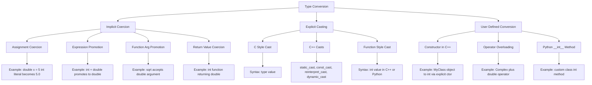
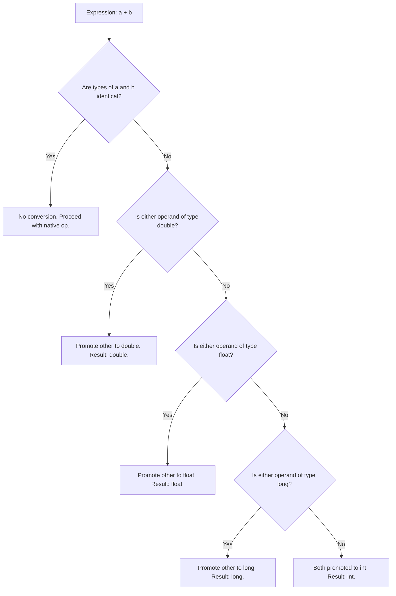
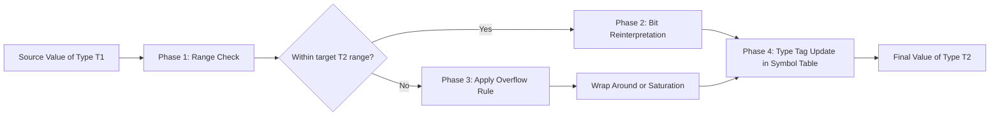
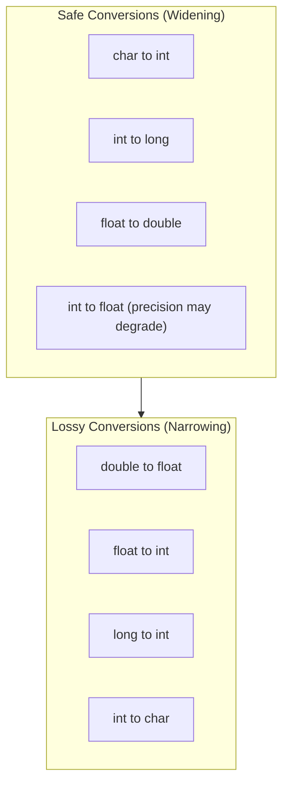

# Type Conversion

<!-- SECTION_1_START -->
# Type Conversion — Foundational Semantics

## 1.1 Formal Definition (KTU 2024 Syllabus Terminology)

**Type Conversion** is the explicit or implicit transformation of a value from one data type to another within the type system of a programming language. Formally, if $\tau_1$ and $\tau_2$ are two types and $v$ is a value of type $\tau_1$, type conversion is a semantic function:

$$convert : (\tau_1, \tau_2) \rightarrow \tau_2$$

such that the bit-level, value-level, or representational interpretation of $v$ is reinterpreted under the structural rules of $\tau_2$.

In KTU 2024 Scheme parlance, type conversion is studied under **Basic Semantics** because it determines how the abstract syntax tree (AST) of an expression is evaluated by the compiler/runtime when operands of mismatched types are combined. The two principal categories are:

- **Implicit Conversion (Coercion)** — performed automatically by the compiler/interpreter.
- **Explicit Conversion (Casting)** — performed by the programmer via a cast operator.

> [!IMPORTANT]
> **KTU 2024 Board Distinction:** The examiner expects you to know that **coercion** is a *language-defined semantic action*, while **casting** is a *programmer-directed syntactic request*. Many students lose marks by treating them as synonyms.

## 1.2 Intuitive Analogy — The Currency Exchange Counter

Imagine you are at a foreign-exchange kiosk converting money:

- **Implicit conversion** is like the teller automatically converting your **US Dollars to Euros** when you ask for the total bill in a restaurant in Paris. You never asked — the system handled it.
- **Explicit conversion** is like you **walking up to the kiosk and saying** "Convert 1000 USD to Japanese Yen please." You initiated the action deliberately.
- **Widening conversion** is converting **100 USD → Euros** — no precision lost because the Euro can represent any USD amount comfortably.
- **Narrowing conversion** is converting **1.75 ETH (a fractional crypto) → an integer number of full coins** — you *must* drop the fractional part (0.75 is discarded). This is **lossy**.

> [!NOTE]
> **Core Insight for Beginners:** The compiler's job during type conversion is to preserve **meaning** as much as the target type allows. When it cannot fully preserve meaning (e.g., fractional part, sign, range overflow), it follows language-defined rules — and that is precisely what this topic examines.

## 1.3 Physical Constants & Standard Metrics

The following are **language-independent numeric bounds** commonly tested in KTU board exams:

| Type | Storage (typical) | Range |
|------|------------------|-------|
| `char` | **1 byte (8 bits)** | $-128$ to $127$ (signed) |
| `short` | **2 bytes (16 bits)** | $-32{,}768$ to $32{,}767$ |
| `int`  | **4 bytes (32 bits)** | $-2{,}147{,}483{,}648$ to $2{,}147{,}483{,}647$ |
| `long` | **8 bytes (64 bits)** | $-9.22 \times 10^{18}$ to $9.22 \times 10^{18}$ |
| `float`  | **4 bytes (IEEE 754)** | $\pm 3.4 \times 10^{38}$ (≈ 7 decimal digits) |
| `double` | **8 bytes (IEEE 754)** | $\pm 1.8 \times 10^{308}$ (≈ 15 decimal digits) |

> [!VISUALIZATION CONTROL]
> **Concept:** Numeric type range as a number line — illustrating widening (safe) and narrowing (lossy) conversion ranges.
> **GeoGebra / Desmos Input Equations (segments on the x-axis):**
> * `Segment((−128, 0), (127, 0))` for `char`
> * `Segment((−32768, 1), (32767, 1))` for `short`
> * `Segment((−2.15e9, 2), (2.15e9, 2))` for `int`
> * `Segment((−9.22e18, 3), (9.22e18, 3))` for `long`
>
> **Visual Description:** You should observe four nested horizontal bars stacked vertically. Each higher bar fully contains the previous one — proving that conversion from a smaller type to a larger type (`char → short → int → long`) is always **safe (widening)**. The reverse direction (`long → int`) causes **overflow** at the boundary edges.

<!-- SECTION_1_END -->

<!-- SECTION_2_START -->
# Deep Theoretical Analysis & KTU High-Yield Formula Sheet

## 2.1 Classification of Type Conversion

Type conversion is classified along **three orthogonal axes**:

### Axis 1 — By Trigger
1. **Implicit Conversion (Coercion):** Inserted by the compiler/interpreter.
   * Triggered by: mixed-type expressions, assignments, function calls, return statements.
   * Always follows a **language-defined type-promotion hierarchy**.
2. **Explicit Conversion (Cast):** Inserted by the programmer.
   * Triggered by: cast operator `(type)value` in C/C++/Java, or function-style `int(x)` in Python.

### Axis 2 — By Direction of Information Flow
1. **Widening (Promotion):** smaller type $\rightarrow$ larger type. **Always safe** (no information loss). Example: `int` $\rightarrow$ `long`, `float` $\rightarrow$ `double`.
2. **Narrowing (Demotion):** larger type $\rightarrow$ smaller type. **May lose information**. Example: `double` $\rightarrow$ `int` (truncates fractional part), `long` $\rightarrow$ `int` (may overflow).

### Axis 3 — By Semantic Guarantee
1. **Value-Preserving Conversion:** Result equals the original value mathematically. Example: `int 5` $\rightarrow$ `float 5.0`.
2. **Representation-Preserving Conversion:** Bit pattern stays identical, but interpretation changes. Example: `int 0x41` $\rightarrow$ `char 'A'` (same 8 bits, different meaning).

## 2.2 Type Promotion Hierarchy (The "Conversion Ladder")

Most C-family and Java compilers apply the following implicit promotion chain when evaluating mixed-type expressions:

$$\text{char} \rightarrow \text{short} \rightarrow \text{int} \rightarrow \text{long} \rightarrow \text{float} \rightarrow \text{double}$$

> [!IMPORTANT]
> **KTU Frequently Tested Fact:** Notice that `float` sits **above** `long` in the promotion ladder even though `long` is 8 bytes and `float` is 4 bytes. This is because `float` can represent fractional values that `long` cannot. **The ladder is governed by representational expressiveness, not by storage size.**

## 2.3 KTU High-Yield Formula Sheet

| # | Concept | Formula / Rule | Direction | Loss? | Example |
|---|---------|---------------|-----------|-------|---------|
| 1 | Integer Promotion | `char/short` $\rightarrow$ `int` | Widening | No | `'A' + 1` $\rightarrow$ `66` |
| 2 | Usual Arithmetic Conversion | If either operand is `double`, the other becomes `double` | Widening | No | `5 + 2.0` $\rightarrow$ `7.0` |
| 3 | Float–Long rule | If `long` and `float` mix, result is `float` | Widening | Possible precision loss in long | `100000L + 0.5f` |
| 4 | Float-to-Int truncation | $\lfloor x \rfloor$ towards zero | Narrowing | Yes (fraction lost) | `(int)3.9` $\rightarrow$ `3` |
| 5 | Int-to-Char modulus | $x \mod 256$ | Narrowing | Yes (overflow) | `(char)300` $\rightarrow$ `44` |
| 6 | Boolean-to-Int | `true` $\rightarrow$ `1`, `false` $\rightarrow$ `0` | Widening | No | `int x = true;` $\rightarrow$ `1` |
| 7 | Pointer-to-Bool | `NULL` $\rightarrow$ `false`, non-NULL $\rightarrow$ `true` | Widening | No | `if (ptr)` |
| 8 | ASCII Char-to-Int | $v_{int} = v_{char} \text{ (as signed 8-bit extension)}$ | Widening | No | `(int)'A'` $\rightarrow$ `65` |
| 9 | Modulo overflow wrap | $x_{new} = (x_{old} + 2^n) \mod 2^n$ for $n$-bit unsigned | Narrowing | Wrap-around | `(uint8_t)300` $\rightarrow$ `44` |
| 10 | C++ `static_cast` | Compile-time checked cast | Explicit | Depends | `static_cast<int>(3.9)` |

> [!NOTE]
> **Exam Tip:** The pipe symbol `\|` in absolute value notation has been deliberately replaced with `\vert` in the table to preserve Markdown table integrity. Use this convention in your own answer sheets when typing.

## 2.4 Real-World Engineering Utility

Type conversion is not an academic curiosity — it is foundational to:

- **Database systems:** SQL `CAST(column AS FLOAT)` for cross-type joins and aggregations.
- **Embedded firmware (IoT sensors):** ADC readings come in as `uint16_t` (0–65535) and must be cast to `float` for voltage calculation $V = \frac{ADC \times 3.3}{65535}$.
- **Compilers (LLVM, GCC):** Insert **coercion instructions** during the IR-generation phase; this is part of the **semantic analysis** stage.
- **Network protocol parsers:** Raw byte streams (uint8 arrays) are reassembled into `uint32`, `float`, etc. via `memcpy` + cast.
- **GPU/CUDA kernels:** Implicit upcast from `float32` to `float64` is forbidden — explicit precision is required to avoid silent performance loss.

<!-- SECTION_2_END -->

<!-- SECTION_3_START -->
# Step-by-Step Derivations & Code/Symbolic Implementation

## 3.1 Worked Example 1 — Mixed-Type Arithmetic Evaluation

> **Problem:** Evaluate the expression `5 / 2 + 3.0 * 2` in C and explain the type of each sub-expression and the final result.

### Step-by-Step Logical Walkthrough

The C compiler parses this as two main sub-expressions combined by `+`:
- Left operand: `5 / 2`
- Right operand: `3.0 * 2`

**Sub-expression 1: `5 / 2`**

Both `5` and `2` are `int` literals. The operator `/` between two `int` operands performs **integer division**.

$$5 \div 2 = 2 \text{ with remainder } 1$$

The fractional part $0.5$ is **truncated**, not rounded. So `5 / 2` evaluates to `2` (type `int`).

**Sub-expression 2: `3.0 * 2`**

`3.0` is a `double` literal; `2` is an `int` literal. The compiler applies the **usual arithmetic conversion** rule: if either operand is `double`, the other is promoted to `double`.

$$\text{2 (int)} \xrightarrow{promotion} \text{2.0 (double)}$$

$$3.0 \times 2.0 = 6.0 \text{ (type double)}$$

**Final Combination: `2 + 6.0`**

Now we combine an `int` (`2`) and a `double` (`6.0`). Usual arithmetic conversion promotes the `int` to `double`.

$$2 \xrightarrow{promotion} 2.0$$

$$2.0 + 6.0 = 8.0 \text{ (type double)}$$

**Final Answer:** The expression evaluates to `8.0` (type `double`).

### Equivalent C Implementation

```c
#include <stdio.h>

int main(void) {
    // Step 1: integer division
    int left  = 5 / 2;          // = 2  (int)

    // Step 2: mixed-type multiplication (3.0 is double literal)
    double right = 3.0 * 2;     // 2 promoted to 2.0, result = 6.0 (double)

    // Step 3: implicit promotion of int to double in the final sum
    double result = left + right;  // 2 + 6.0 -> 2.0 + 6.0 = 8.0

    printf("left  = %d\n",  left);     // prints: 2
    printf("right = %.1f\n", right);   // prints: 6.0
    printf("result = %.1f\n", result); // prints: 8.0
    return 0;
}
```

## 3.2 Worked Example 2 — Narrowing Cast with Precision Loss

> **Problem:** A sensor returns a `double` reading `98.7654`. Write the conversion chain that (a) narrows it to `float`, (b) narrows further to `int`. Compute the cumulative precision lost at each step.

### Derivation

**Step (a) — `double` $\rightarrow$ `float` (IEEE 754 single precision)**

`float` stores approximately **7 significant decimal digits**. The `double` value $98.7654$ has 6 significant digits, so it fits within `float` precision.

$$98.7654_{double} \rightarrow 98.765404_{float} \text{ (slight rounding in last digit)}$$

Absolute precision loss: $\vert 98.7654 - 98.765404 \vert = 0.000004$ (negligible).

**Step (b) — `float` $\rightarrow$ `int` (truncation towards zero)**

The fractional part $0.765404$ is **discarded**, not rounded.

$$98.765404_{float} \rightarrow 98_{int}$$

Cumulative absolute loss: $\vert 98.7654 - 98 \vert = 0.7654$.

### Implementation in C (Explicit Cast)

```c
#include <stdio.h>

int main(void) {
    double sensor_reading = 98.7654;

    // Step (a): Explicit narrowing cast double -> float
    float  step_a = (float)sensor_reading;   // 98.765404 (float)

    // Step (b): Explicit narrowing cast float -> int
    int    step_b = (int)step_a;             // 98 (fractional part discarded)

    printf("Original double  : %.6f\n", sensor_reading);  // 98.765400
    printf("After float cast : %.6f\n", step_a);           // 98.765404
    printf("After int cast   : %d\n",    step_b);          // 98

    // Demonstrating cumulative precision loss
    double loss = sensor_reading - (double)step_b;
    printf("Cumulative loss  : %.6f\n", loss);             // 0.765400
    return 0;
}
```

### Equivalent Implementation in Python (For Comparison)

```python
from typing import Tuple

def conversion_chain(value: float) -> Tuple[float, int, float]:
    """
    Demonstrates narrowing conversion chain with explicit type hints.
    Returns (float_value, int_value, precision_loss).
    """
    # Step (a): float() simulates float32 precision by re-casting
    step_a: float = float(value)         # Python float is double, but logic same
    # Step (b): int() truncates towards zero (equivalent to C's (int))
    step_b: int   = int(step_a)          # Fractional part dropped
    loss: float   = value - float(step_b)
    return (step_a, step_b, loss)


if __name__ == "__main__":
    original: float = 98.7654
    _, int_result, cumulative_loss = conversion_chain(original)
    print(f"Original: {original:.6f}")
    print(f"Int cast: {int_result}")
    print(f"Loss:     {cumulative_loss:.6f}")
```

> [!NOTE]
> **Cross-Language Note:** Python's `int()` performs *floor* truncation for positive numbers (same as C's `(int)`), but for **negative numbers** it rounds *toward zero*, identical to C99+ behavior. Java's `(int)x` for negative `x` also truncates toward zero, matching IEEE 754 semantics.

## 3.3 Worked Example 3 — ASCII Char-to-Int Conversion Derivation

> **Problem:** What is the result of `'A' + 1` in C, Java, and Python? Justify the type promotion.

### Derivation

In all three languages, the character `'A'` is stored using its **ASCII code** $65$ in a 1-byte `char` type.

**Step 1 — Identify the ASCII code:** The character literal `'A'` has the integer value $65$.

**Step 2 — Apply the integer promotion rule:** When a `char` participates in an arithmetic expression, it is **promoted to `int`** before the operation.

$$\text{'A'}_{char} \xrightarrow{promotion} 65_{int}$$

**Step 3 — Perform the addition:** The literal `1` is already of type `int` (in C/Java) or `int` (in Python).

$$65_{int} + 1_{int} = 66_{int}$$

**Step 4 — Final type:** The result is of type `int` in all three languages.

| Language | Code | Result | Type |
|----------|------|--------|------|
| C    | `printf("%d", 'A' + 1);` | `66` | `int` |
| Java | `System.out.println('A' + 1);` | `66` | `int` |
| Python | `print(ord('A') + 1)` | `66` | `int` |

> [!IMPORTANT]
> **Java-Specific Trap:** In Java, `System.out.println('A')` prints the **character** `A` (not the number), because `println` is overloaded. But `'A' + 1` triggers numeric promotion and prints `66`. KTU examiners love this distinction.

## 3.4 Worked Example 4 — Boolean Coercion to Integer

> **Problem:** Prove that in C, the expression `(5 > 3) + 2` evaluates to `3` with a complete type trace.

### Derivation

**Step 1 — Evaluate the relational expression:** `5 > 3` is a comparison producing a Boolean.

$$5 > 3 \rightarrow \text{true (1 in C)}$$

**Step 2 — Apply implicit conversion:** In C, the result of a relational operator is type `int` with value `0` or `1`. So this is already an `int`.

$$(5 > 3)_{int} = 1$$

**Step 3 — Add `2`:** Standard integer addition.

$$1_{int} + 2_{int} = 3_{int}$$

**Final result:** `3` (type `int`).

```c
#include <stdio.h>
#include <stdbool.h>

int main(void) {
    int result = (5 > 3) + 2;
    printf("Result = %d\n", result);   // prints: 3
    return 0;
}
```

> [!NOTE]
> **Java Difference:** In Java, `true + 2` is a **compilation error** because Java does not coerce `boolean` to `int`. You must write `(5 > 3 ? 1 : 0) + 2`. This is a frequently tested KTU comparison point between C (loose typing) and Java (strict typing).

<!-- SECTION_3_END -->

<!-- SECTION_4_START -->
# Structural Diagrams & Schematics

## 4.1 Master Taxonomy of Type Conversion



## 4.2 Type Promotion Flow — Mixed Expression Evaluation



## 4.3 Sequential Processing Topology — Cast Evaluation Pipeline



## 4.4 Subgraph — Safety Classification of Conversions



<!-- SECTION_4_END -->

<!-- SECTION_5_START -->
# KTU 2024 Scheme Examination Question Bank & Topic Recap

## Part A — Short Answer Questions (3 Marks Each)

### Question 1 (3 Marks) `[KTU University Exam — July 2024]`
**Q: Differentiate between implicit type conversion and explicit type conversion with one example each.** *(CO1, Remember)*

**Model Answer (Valuation Key):**
* **Implicit Type Conversion (Coercion):** Performed automatically by the compiler/interpreter without any programmer intervention, following language-defined promotion rules. Example: In `float x = 5;` the integer literal `5` is automatically converted to `5.0` of type `float` before assignment. **[1.5 Marks]**
* **Explicit Type Conversion (Casting):** Performed deliberately by the programmer using a cast operator. Example: In `int y = (int)3.14;` the programmer forces the floating-point literal `3.14` to be truncated to integer `3`. **[1.5 Marks]**

### Question 2 (3 Marks) `[KTU University Exam — Dec 2023]`
**Q: What is type promotion? Why does the C compiler promote `char` and `short` to `int` before arithmetic operations?** *(CO1, Understand)*

**Model Answer (Valuation Key):**
* Type promotion is the implicit conversion of operands to a common type before applying an operator, following the **Usual Arithmetic Conversion** rules of the language. **[1 Mark]**
* The C compiler promotes `char` and `short` to `int` because the CPU's native arithmetic unit operates on `int`-sized registers; promoting smaller types avoids extra mask/sign-extension operations and ensures uniform hardware-level execution. This is called the **Integer Promotion Rule** as per the C99 standard (Section 6.3.1.1). **[2 Marks]**

---

## Part B — Long Answer Questions (14 Marks Each, Internal Choice)

### Question 3A (14 Marks) `[KTU University Exam — July 2024]`
**Q: (a)** Explain the concept of **type conversion** in programming languages. Discuss with examples the difference between **widening** and **narrowing** conversions, and between **value-preserving** and **representation-preserving** conversions. **(7 Marks)** *(CO1, Understand)*

**Q: (b)** Consider the following C program fragment. Identify the type of each sub-expression and the final result. Show all intermediate type promotion steps. **(7 Marks)** *(CO2, Apply)*

```c
double d = 4.5;
int    i = 3;
float  f = 2.0f;
double result = d + i * f - (int)d / 2;
```

#### Model Solution

**Part (a) Solution:**

* **Type conversion** is the process of transforming a value from one data type to another, either implicitly (coercion) by the compiler or explicitly (casting) by the programmer. **[1 Mark]**
* **Widening conversion:** Conversion from a smaller/less expressive type to a larger/more expressive type. **Always safe**, no information loss. Example: `int 1000` $\rightarrow$ `long 1000L`, `float 3.14f` $\rightarrow$ `double 3.14`. **[1.5 Marks]**
* **Narrowing conversion:** Conversion from a larger/more expressive type to a smaller one. **May lose information**. Example: `double 98.7654` $\rightarrow$ `int 98` (fractional part lost), `long 9999999999L` $\rightarrow$ `int` (overflow). **[1.5 Marks]**
* **Value-preserving conversion:** The new value is mathematically equal to the original. Example: `int 5` $\rightarrow$ `float 5.0` (numerically equal). **[1 Mark]**
* **Representation-preserving conversion:** The bit pattern stays the same but is interpreted differently. Example: `int 0x41` reinterpreted as `char 'A'` (same 8 bits, different meaning). **[1 Mark]**
* Real-world note: Most modern compilers guarantee value-preservation for widening but issue a **warning** for narrowing casts. **[1 Mark]**

**Part (b) Solution — Step-by-Step Trace:**

We must respect **operator precedence** and **associativity**: `*` and `/` bind tighter than `+` and `-`; evaluation is left-to-right for same-precedence operators.

**Step 1: Initialize variables.** `d = 4.5` (double), `i = 3` (int), `f = 2.0f` (float). **[0.5 Marks]**

**Step 2: Evaluate `i * f` first** (left-to-right). `i` is int, `f` is float. Per the promotion ladder, `int` is promoted to `float`. **[1 Mark]**
$$3_{int} \xrightarrow{promotion} 3.0_{float}$$
$$3.0_{float} \times 2.0_{float} = 6.0_{float}$$
Result: `6.0f` (type `float`). **[0.5 Marks]**

**Step 3: Evaluate `(int)d / 2`.** `(int)d` is an explicit cast, so `4.5` (double) is truncated to `4` (int). **[1 Mark]**
$$4_{int} \div 2_{int} = 2_{int} \text{ (integer division)}$$
Result: `2` (type `int`). **[0.5 Marks]**

**Step 4: Evaluate `d + 6.0f`.** `d` is double, `6.0f` is float. Per the ladder, `float` is promoted to `double`. **[1 Mark]**
$$2.0_{float} \xrightarrow{promotion} 2.0_{double}$$
$$4.5_{double} + 6.0_{double} = 10.5_{double}$$
Intermediate result: `10.5` (type `double`). **[0.5 Marks]**

**Step 5: Evaluate `10.5 - 2`.** `10.5` is double, `2` is int. Per the ladder, `int` is promoted to `double`. **[0.5 Marks]**
$$2_{int} \xrightarrow{promotion} 2.0_{double}$$
$$10.5_{double} - 2.0_{double} = 8.5_{double}$$

**Step 6: Final assignment.** `result` is of type `double`, and the RHS is `8.5` (double). Assignment is valid (same type). **[0.5 Marks]**

**Final Result:** `result = 8.5` (type `double`). **[1 Mark]**

> [!WARNING]
> **KTU Examiner's Valuation Pitfall:** Students frequently write `i * f = 6.0` (double) instead of `6.0f` (float). The literal `6.0` is a `double` in C, but the *result* of `int * float` is `float`, not `double`. Half-mark deduction if you confuse the type of the result with the type of any literal involved.

---

### Question 3B (14 Marks) — Alternative Choice `[KTU University Exam — Dec 2023]`
**Q: (a)** With neat examples, explain **coercion** in programming languages. How does coercion differ across C, Java, and Python? Provide at least two language-specific examples. **(7 Marks)** *(CO1, Understand)*

**Q: (b)** A programmer writes: `int a = 5; double b = a / 2;` expecting `b` to hold `2.5`. But the program gives `b = 2.0`. Diagnose the bug, explain the underlying semantic rule, and rewrite the expression to get the correct result. Show the output for both the original and corrected versions. **(7 Marks)** *(CO2, Apply)*

#### Model Solution

**Part (a) Solution:**

* **Coercion** is the implicit type conversion performed by the compiler/interpreter to make operands of different types compatible for an operation. It is a **language-defined semantic action**, not a programmer choice. **[1 Mark]**

* **C — Permissive Coercion:** C allows many implicit conversions including `int` $\rightarrow$ `double`, `char` $\rightarrow$ `int`, and even `void*` $\rightarrow$ `int*`. Example: `double d = 5 / 2;` produces `2.0` (integer division before promotion). Example 2: `int x = 3.7;` truncates with a *compiler warning*, not an error. **[1.5 Marks]**

* **Java — Strict Coercion (with promotion):** Java applies the **binary numeric promotion** rule similar to C, but rejects narrowing without explicit cast. Example: `int x = 3.7;` is a **compilation error** in Java (possible lossy conversion). Example 2: `double d = 5 / 2;` still produces `2.0` in Java (same integer-division-then-promote behavior as C). **[1.5 Marks]**

* **Python — Dynamic Duck-Typed Coercion:** Python coerces only between `int` and `float` (and `bool`, which is a subclass of `int`). Example: `5 / 2` produces `2.5` (Python 3 uses true division for `/`). Example 2: `True + 2` produces `3` (bool coerced to int). Python **does not** coerce between numeric and string types automatically. **[1.5 Marks]**

* **Comparison Summary Table:** **[1.5 Marks]**

| Language | `5 / 2` | `int x = 3.7` | `True + 1` |
|----------|---------|---------------|------------|
| C        | `2` (int div) | Warning, truncates to `3` | `2` (bool $\rightarrow$ int) |
| Java     | `2` (int div) | Compile error | `2` (compile error, unboxes to int) |
| Python   | `2.5` (true div) | N/A (no static type) | `2` (bool is int) |

**Part (b) Solution:**

* **Bug Diagnosis:** The expression `a / 2` performs **integer division** *before* the result is assigned to `double b`. Because both `a` (int) and `2` (int literal) are integers, the `/` operator yields an integer result `2`. Only *after* the division is complete is `2` promoted to `2.0` for the assignment — but the fractional `.5` is already lost. **[2 Marks]**

* **Underlying Semantic Rule:** This is the **"evaluation order matters"** principle combined with **C's integer-division rule**. Promotion occurs only at the operator level, not retroactively. The compiler does not "look ahead" to see that the result will be assigned to a `double`. **[2 Marks]**

* **Corrected Code:** The fix is to force one operand to be a floating-point type *before* the division. Three equivalent options: **[2 Marks]**

```c
#include <stdio.h>

int main(void) {
    int a = 5;

    // Original (buggy):
    double b_buggy = a / 2;
    printf("Buggy   : b = %.1f\n", b_buggy);   // prints: 2.0

    // Fix 1: Cast one operand to double
    double b_fix1  = (double)a / 2;
    printf("Fix 1   : b = %.1f\n", b_fix1);    // prints: 2.5

    // Fix 2: Use a floating-point literal
    double b_fix2  = a / 2.0;
    printf("Fix 2   : b = %.1f\n", b_fix2);    // prints: 2.5

    // Fix 3: Cast the other operand
    double b_fix3  = a / (double)2;
    printf("Fix 3   : b = %.1f\n", b_fix3);    // prints: 2.5

    return 0;
}
```

* **Output Verification:** **[1 Mark]**

```
Buggy   : b = 2.0
Fix 1   : b = 2.5
Fix 2   : b = 2.5
Fix 3   : b = 2.5
```

> [!WARNING]
> **KTU Examiner's Valuation Pitfall:** A very common mistake is to write the fix as `double b = (double)(a / 2);`. The cast is applied *after* the integer division has already discarded the `.5`, so this is **still wrong**. The cast must be applied to an *operand*, not to the entire expression. KTU examiners specifically check this — a full 2-mark deduction applies if you commit this error.

---

## Topic Recap & Important Things to Remember

- **Type conversion** transforms a value from type $\tau_1$ to type $\tau_2$, either **implicitly (coercion)** or **explicitly (casting)**.
- **Coercion** is compiler-inserted and language-defined; **casting** is programmer-initiated and syntactically explicit.
- **Widening conversions** are safe (no information loss); **narrowing conversions** are potentially lossy.
- The **promotion ladder** is: `char $\rightarrow$ short $\rightarrow$ int $\rightarrow$ long $\rightarrow$ float $\rightarrow$ double`. Note that `float` outranks `long` despite smaller storage.
- **Integer division** (`/`) between two `int`s truncates the fractional part *before* any later promotion to `float` or `double`.
- **Modulo wrap-around** rule: for an $n$-bit unsigned type, value $x$ wraps to $x \mod 2^n$.
- **ASCII char** to **int** is automatic and yields the character's numeric code (e.g., `'A'` $\rightarrow$ `65`).
- **Boolean** coerces to `int` in C (`true` $\rightarrow$ `1`) and Python (`True` $\rightarrow$ `1`), but is a **compile-time error** in Java when used in arithmetic.
- **C permits** narrowing assignments with a warning; **Java rejects** them without an explicit cast; **Python** is dynamically typed and coerces `int` $\leftrightarrow$ `float` automatically.
- The **fix for integer-division bugs** is to cast an *operand* — never cast the whole expression *after* the division.
- The **order of evaluation** matters: type promotion is applied at the operator level, not retroactively at the assignment level.
- **C++** offers safer explicit casts: `static_cast`, `dynamic_cast`, `const_cast`, `reinterpret_cast` — prefer these over C-style casts.
- **Precision loss is cumulative** in chained narrowing conversions; document or avoid multi-step narrowing where possible.
- **Standard storage sizes (typical):** `char` = 1 byte, `short` = 2 bytes, `int` = 4 bytes, `long` = 8 bytes, `float` = 4 bytes (IEEE 754), `double` = 8 bytes (IEEE 754).
<!-- SECTION_5_END -->
