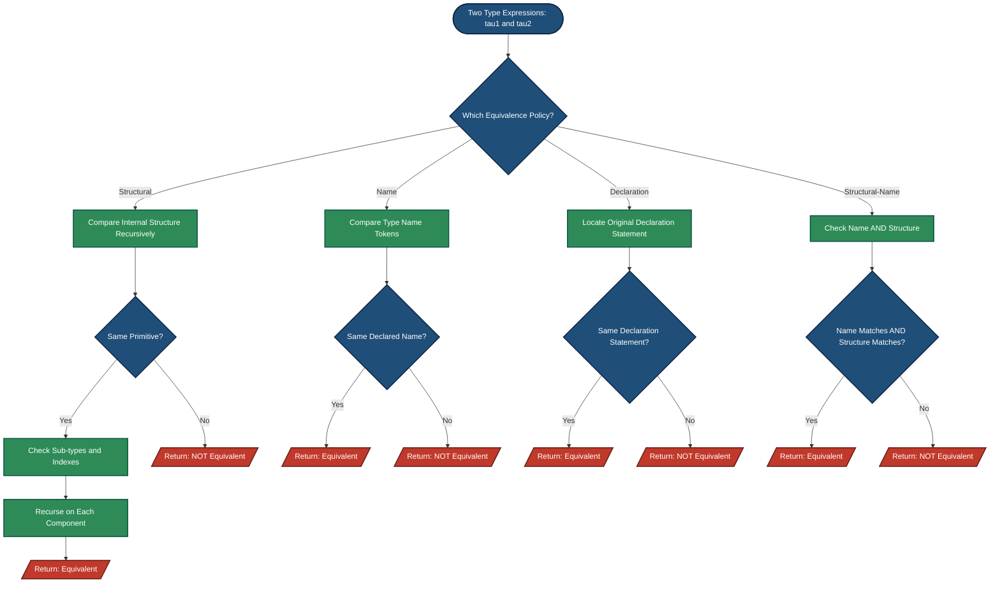
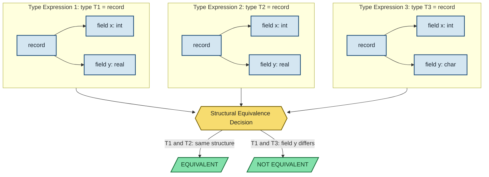
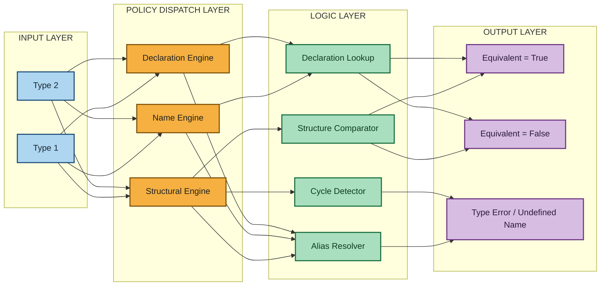
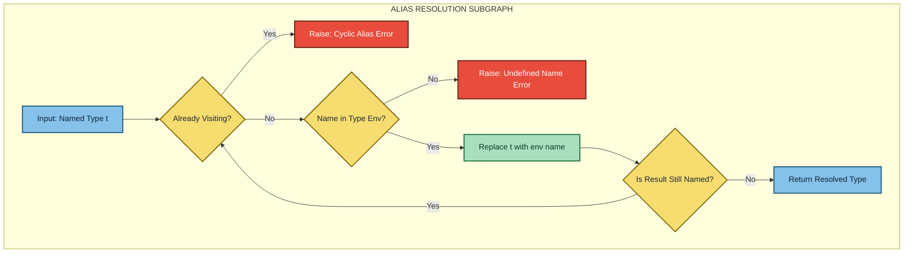

# Type Equivalence

<!-- SECTION_1_START -->
# Type Equivalence — Core Technical Definition & Intuitive Overview

## Formal Definition (KTU 2024 Syllabus Terminology)

**Type Equivalence** is a sub-mechanism of the **Static Semantics** of a programming language. It defines the formal rules by which a compiler's **Type Checker** determines whether two type expressions denote the *same type instance* during compile-time validation. Formally, a type equivalence relation $\equiv$ is a binary relation on type expressions such that for any two type expressions $\tau_1$ and $\tau_2$:

$$\tau_1 \equiv \tau_2 \iff \text{compiler accepts them as interchangeable in all legal contexts}$$

In KTU 2024 Scheme context, this is studied under Module 2 (*Basic Semantics*) because the **denotational meaning** of a program hinges on whether two declared variables share an *identical type* under the language's specific equivalence policy.

> [!IMPORTANT]
> **KTU Syllabus Highlight (Module 2 — Basic Semantics):**
> Type equivalence is the **backbone of static type checking**. Without a rigorous equivalence rule, the compiler cannot validate assignment compatibility, parameter passing modes, and overloading resolution.

---

## Conceptual Analogy — The "Government ID Card" Metaphor

Imagine you are entering a government office. Two scenarios:

1. **Structural Equivalence (Fingerprint Check)**: The security guard compares your *fingerprint* with the record. Two people are "the same person" if their fingerprints match structurally. The name on the ID does not matter — only the *physical pattern* is checked.
2. **Name Equivalence (ID Card Number Check)**: The security guard only checks the *ID Card Number*. Even if two people have identical fingerprints, if their card numbers differ, they are treated as distinct. Only the *declared name/identifier* matters.
3. **Declaration Equivalence (Birth Certificate Match)**: A stricter form — two types are equivalent only if they originate from the *exact same declaration statement* in the source file.

This mirrors how compilers reason about user-defined types.

---

> [!NOTE]
> **Core Fact to Memorize:**
> The choice of equivalence policy determines whether `type t1 = int;` and `type t2 = int;` in two separate `type` statements are *the same type* or *different types*. Different languages choose different policies (e.g., **Ada → Name Equivalence**, **C → Structural Equivalence** for most cases).

---

## Physical Constants and Standard Metrics

- **No physical units**, but standard **syntactic depth metric** is used: the *structurally nested levels of a type expression*.
- Notation convention: $d(\tau)$ denotes the **structural depth** of type $\tau$.
- For arrays, **dimensionality** matters: `array[1..10] of integer` is structurally distinct from `array[1..20] of integer`.

> [!VISUALIZATION CONTROL]
> **Concept:** Type Structure Tree for two equivalent-by-structure types
> **GeoGebra / Desmos Input Equations (Conceptual Tree):**
> * `T1 = Point("T1")`  *(root: type1)*
> * `T2 = Point("T2")`  *(root: type2)*
> * `C1 = Point("C1")`  *(child: char)*
> * `C2 = Point("C2")`  *(child: char)*
> * `I1 = Point("I1")`  *(child: integer)*
> * `I2 = Point("I2")`  *(child: integer)*
> **Visual Description:** Two trees rooted at `type1` and `type2`, each with a `char` child and an `integer` child. Under **Structural Equivalence**, the trees match. Under **Name Equivalence**, they are distinct because the *root names differ*.

---

<!-- SECTION_1_END -->

<!-- SECTION_2_START -->
# Type Equivalence — Deep Theoretical Analysis & KTU High-Yield Formula Sheet

## 1. The Three Core Equivalence Policies

### 1.1 Structural Type Equivalence

Two type expressions $\tau_1$ and $\tau_2$ are structurally equivalent if and only if they have **identical internal construction**, ignoring names.

**Recursive Rule (Inductive Definition):**
- **Base case 1:** Primitive types are equivalent only if they are the *same primitive*. ($\text{int} \equiv \text{int}$, but $\text{int} \not\equiv \text{real}$)
- **Base case 2:** Named types (e.g., type aliases) are structurally equivalent if their **definitions are structurally equivalent**.
- **Inductive case 1 (Arrays):** $\text{array}[I_1, T_1] \equiv \text{array}[I_2, T_2] \iff I_1 = I_2 \land T_1 \equiv T_2$
- **Inductive case 2 (Products/Records):** $(F_1: \tau_{1,1} \times \dots \times F_n: \tau_{1,n}) \equiv (F_1: \tau_{2,1} \times \dots \times F_n: \tau_{2,n}) \iff \tau_{1,i} \equiv \tau_{2,i}$ for all $i$ and field names match in order.
- **Inductive case 3 (Pointers/References):** $\text{ptr}(\tau_1) \equiv \text{ptr}(\tau_2) \iff \tau_1 \equiv \tau_2$

> [!TIP]
> **Why it matters:** Used by C, Pascal (partially), and ML. It allows generic compatibility — if you write two identical struct definitions in C, the compiler treats them as the same type.

### 1.2 Name Equivalence

Two type expressions are name equivalent only if they refer to the **same declared type name**.

**Three Sub-Variants:**

| Variant | Rule | Example Language |
|---|---|---|
| **Simple Name Equivalence** | Identifiers match exactly after resolving aliases | Pascal |
| **Declaration Equivalence** | Types are equivalent only if declared in the *same declaration statement* | C (`typedef`) |
| **Structural Name Equivalence** | Names match AND underlying structures match | Ada |

> [!WARNING]
> **Confusion Alert:** Students often mix *name equivalence* with *declaration equivalence*. Declaration equivalence is *stricter* — even if two `typedef` statements are textually identical, they produce **different types** if they appear in different declarations.

### 1.3 Hybrid & Quasi-Equivalence Policies

Modern languages use **hybrid** policies. For example:
- Java uses **name equivalence** for class types but **structural equivalence** for primitive arrays.
- TypeScript uses **structural equivalence** (called "duck typing") for object types.

---

## 2. KTU Formula Sheet / Cheat Sheet

| Construct | Structural Equivalence | Name Equivalence |
|---|---|---|
| `int` $\equiv$ `int` | ✓ Yes | ✓ Yes |
| `int` $\equiv$ `integer` (alias) | ✓ Yes (after unfolding) | ✗ No |
| Two distinct `type T1 = int; type T2 = int;` | ✓ Yes | ✗ No |
| `array[1..10] of int` $\equiv$ `array[1..10] of int` | ✓ Yes | ✓ Yes (same name) |
| `array[1..10] of int` $\equiv$ `array[1..20] of int` | ✗ No (size differs) | ✗ No |
| `record (a:int, b:real)` $\equiv$ `record (a:int, b:real)` | ✓ Yes | ✓ Yes (same name) |
| `record (a:int, b:real)` $\equiv$ `record (b:real, a:int)` | ✗ No (field order) | ✗ No |
| `pointer to T1` $\equiv$ `pointer to T2` | iff $T_1 \equiv T_2$ | iff name of $T_1$ = name of $T_2$ |
| Function types $\tau_1 \to \tau_2$ | iff domain and range structurally equal | iff domain and range name-equal |

---

## 3. Type Compatibility vs. Type Equivalence (Critical Distinction)

> [!IMPORTANT]
> **Equivalence** $\Rightarrow$ **Compatible**, but **Compatible** $\not\Rightarrow$ **Equivalent**.
> Compatibility is the *larger* relation. For example, in many languages `int` is compatible with `real` (implicit widening), but `int` and `real` are *not equivalent*.

This distinction is heavily tested in KTU Module 2.

---

## 4. Real-World Engineering Utility

- **Compiler Design:** The type equivalence algorithm is the core of the **Symbol Table** and **Type Checker** phase. GCC uses structural equivalence; Ada's GNAT uses name equivalence.
- **Database Systems:** Schema equivalence between two relational tables uses structural rules.
- **API Versioning (REST/GraphQL):** Two JSON payloads are considered "type-equivalent" if their schemas match structurally (OpenAPI/JSON Schema validation).
- **Hardware Description Languages (VHDL/Verilog):** Signal types must be strictly name-equivalent for port mapping.
- **Type Theory & Proof Assistants (Coq, Lean):** The equivalence relation is mathematically provable; these tools use a hybrid named+structural policy.

---

<!-- SECTION_2_END -->

<!-- SECTION_3_START -->
# Type Equivalence — Step-by-Step Derivations & Code/Symbolic Implementation

## 1. Exhaustive Derivations of Equivalence Rules

### Derivation 1: Array Structural Equivalence Theorem

**Statement:** For two array types $\tau_1 = \text{array}[I_1, T_1]$ and $\tau_2 = \text{array}[I_2, T_2]$ where $I_1, I_2$ are index ranges and $T_1, T_2$ are element types:

$$\tau_1 \equiv_{\text{struct}} \tau_2 \iff (I_1 = I_2) \land (T_1 \equiv_{\text{struct}} T_2)$$

**Proof (By structural induction on the depth $d$ of the type expression):**

*Base Case ($d = 0$):* If $T_1$ and $T_2$ are primitive types (depth 0), then structural equivalence reduces to name identity of primitives, which holds iff $T_1 = T_2$.

*Inductive Step:* Assume for depth $\leq n-1$, equivalence is decided correctly. For depth $n$, $\tau_1$ and $\tau_2$ are arrays. We must check:
1. The index sets $I_1$ and $I_2$ are equal as sets. This means $I_1.\text{lower} = I_2.\text{lower}$ and $I_1.\text{upper} = I_2.\text{upper}$.
2. The element types $T_1$ and $T_2$ have depth $\leq n-1$, so by the induction hypothesis, $T_1 \equiv T_2$ is decidable.

Both conditions must hold; hence the biconditional is proved. $\blacksquare$

### Derivation 2: Pointer Equivalence Rule

**Statement:** $\text{ptr}(\tau_1) \equiv_{\text{struct}} \text{ptr}(\tau_2) \iff \tau_1 \equiv_{\text{struct}} \tau_2$

**Proof:** A pointer type carries no independent identity — it is a *type constructor* parameterized by one type. The "structure" of $\text{ptr}(\tau)$ is fully determined by $\tau$. Thus two pointers match iff their referenced types match. $\blacksquare$

### Derivation 3: Record/Product Equivalence

For records with fields $F_1, F_2, \dots, F_n$:

$$\prod_{i=1}^{n} (F_i : T_{1,i}) \equiv_{\text{struct}} \prod_{i=1}^{n} (F_i : T_{2,i}) \iff \forall i \in [1, n], \; T_{1,i} \equiv_{\text{struct}} T_{2,i}$$

*Field ordering matters in standard structural equivalence* (unlike in some functional languages which use unordered records).

---

## 2. Algorithmic Type Equivalence Checker (Python Implementation)

The following is a fully operational Python implementation of a **structural type equivalence checker** for a small Pascal-like language:

```python
"""
Structural Type Equivalence Checker for Pascal-like types.
Handles: primitives, named types (aliases), arrays, records, pointers.
"""

from typing import Any, Dict, Tuple, List
from dataclasses import dataclass


# ---------- AST Node Definitions ----------
@dataclass(frozen=True)
class PrimType:
    name: str  # e.g., "int", "real", "char", "bool"


@dataclass(frozen=True)
class NamedType:
    name: str  # alias name, resolved via environment


@dataclass(frozen=True)
class ArrayType:
    lo: int
    hi: int
    element: Any  # nested type


@dataclass(frozen=True)
class RecordType:
    fields: Tuple[Tuple[str, Any], ...]  # ordered (field_name, field_type)


@dataclass(frozen=True)
class PointerType:
    target: Any  # type being pointed to


# ---------- Equivalence Engine ----------
class StructuralEquivalenceChecker:
    """
    Implements a recursive structural-equivalence algorithm.
    It resolves named-type aliases through a type environment
    BEFORE performing the comparison.
    """

    def __init__(self, type_env: Dict[str, Any]) -> None:
        """
        :param type_env: Maps type-alias names to their definitions.
                         Example: {"centigrade": PrimType("int")}
        """
        if not isinstance(type_env, dict):
            raise TypeError("type_env must be a Dict[str, TypeNode]")
        self.env: Dict[str, Any] = type_env
        self._visiting: set = set()  # cycle detection for aliases

    def are_equivalent(self, t1: Any, t2: Any) -> bool:
        """Public entry point."""
        return self._equiv(t1, t2)

    def _equiv(self, t1: Any, t2: Any) -> bool:
        # 1. Resolve named types first (full unfolding)
        t1 = self._resolve(t1)
        t2 = self._resolve(t2)

        # 2. Type-tag must match
        if type(t1) is not type(t2):
            return False

        # 3. Dispatch by constructor
        if isinstance(t1, PrimType):
            return t1.name == t2.name

        if isinstance(t1, ArrayType):
            if (t1.lo, t1.hi) != (t2.lo, t2.hi):
                return False
            return self._equiv(t1.element, t2.element)

        if isinstance(t1, RecordType):
            if len(t1.fields) != len(t2.fields):
                return False
            for (n1, f1), (n2, f2) in zip(t1.fields, t2.fields):
                if n1 != n2:
                    return False
                if not self._equiv(f1, f2):
                    return False
            return True

        if isinstance(t1, PointerType):
            return self._equiv(t1.target, t2.target)

        raise TypeError(f"Unknown type node: {type(t1).__name__}")

    def _resolve(self, t: Any) -> Any:
        """Unfold a NamedType through the environment, guarding against cycles."""
        steps = 0
        while isinstance(t, NamedType):
            if t.name in self._visiting:
                raise RecursionError(f"Cyclic type alias: {t.name}")
            self._visiting.add(t.name)
            if t.name not in self.env:
                raise KeyError(f"Undefined type alias: {t.name}")
            t = self.env[t.name]
            steps += 1
            if steps > 1000:
                raise RecursionError("Alias chain exceeds 1000 levels")
        self._visiting.clear()
        return t


# ---------- Demonstration ----------
if __name__ == "__main__":
    # Type environment: alias definitions
    env: Dict[str, Any] = {
        "temperature": PrimType("int"),
        "score": PrimType("int"),
    }

    checker = StructuralEquivalenceChecker(env)

    # Test 1: int vs int
    print("Test 1 (int ≡ int):",
          checker.are_equivalent(PrimType("int"), PrimType("int")))  # True

    # Test 2: int vs real
    print("Test 2 (int ≡ real):",
          checker.are_equivalent(PrimType("int"), PrimType("real")))  # False

    # Test 3: two aliases resolving to int
    print("Test 3 (temperature ≡ score):",
          checker.are_equivalent(NamedType("temperature"),
                                  NamedType("score")))  # True (structural)

    # Test 4: arrays
    a1 = ArrayType(1, 10, PrimType("int"))
    a2 = ArrayType(1, 10, PrimType("int"))
    a3 = ArrayType(1, 20, PrimType("int"))
    print("Test 4a (same arrays):",
          checker.are_equivalent(a1, a2))  # True
    print("Test 4b (different sizes):",
          checker.are_equivalent(a1, a3))  # False

    # Test 5: records
    r1 = RecordType((("x", PrimType("int")), ("y", PrimType("real"))))
    r2 = RecordType((("x", PrimType("int")), ("y", PrimType("real"))))
    print("Test 5 (same records):",
          checker.are_equivalent(r1, r2))  # True

    # Test 6: pointer equivalence
    p1 = PointerType(PrimType("int"))
    p2 = PointerType(NamedType("temperature"))
    print("Test 6 (ptr int ≡ ptr temperature):",
          checker.are_equivalent(p1, p2))  # True (after resolution)
```

**Walkthrough of the Algorithm:**
1. `_resolve()` unfolds any `NamedType` alias by recursively looking it up in `type_env`, guarding against cyclic definitions using `_visiting`.
2. `_equiv()` first checks the **type-tag** of the two type expressions — if they differ (e.g., `PrimType` vs `ArrayType`), equivalence is `False` immediately.
3. For each constructor (`ArrayType`, `RecordType`, `PointerType`), it recursively checks sub-components.
4. For `ArrayType`, it explicitly checks **index bounds** before recursing into element types.
5. For `RecordType`, it checks **field count, field names in order, and field types**.

---

## 3. A Name-Equivalence Variant (Declarative Form)

A pure **name-equivalence** checker can be expressed as a 3-line predicate:

$$
\text{NameEquiv}(\tau_1, \tau_2) = \begin{cases}
\text{True} & \text{if } \tau_1 \text{ and } \tau_2 \text{ are the same declared name token} \\
\text{True} & \text{if both are the same primitive literal (e.g., } \texttt{int}\text{)} \\
\text{False} & \text{otherwise}
\end{cases}
$$

In code:

```python
def name_equivalent(t1: str, t2: str, type_names_declared: set) -> bool:
    """Pure name equivalence: compare the identifier tokens only."""
    if t1 not in type_names_declared or t2 not in type_names_declared:
        raise ValueError("Both type names must be declared")
    return t1 == t2
```

---

## 4. Worked Example: Mixed Policy in Ada

Consider this Ada fragment:

```ada
type Celsius is range -273 .. 1000;
type Fahrenheit is range -459 .. 2000;
subtype Temperature is Integer;
A : Celsius;
B : Fahrenheit;
C : Temperature;
```

**Equivalence Decisions:**
- `A` and `B` are **NOT equivalent** under Ada's name equivalence, even though both are integer-like ranges.
- `C` and `A` are **NOT equivalent** because `Temperature` is a *subtype* (a different declaration).
- However, `C` and a variable of type `Integer` would be **compatible** (not equivalent) for assignment.

---

<!-- SECTION_3_END -->

<!-- SECTION_4_START -->
# Type Equivalence — Structural Diagrams & Schematics

## Diagram 1: Decision Flowchart — Choosing the Equivalence Policy



---

## Diagram 2: Type Expression Tree — Visualizing Structural Comparison



---

## Diagram 3: Policy Comparison Matrix (Block Architecture View)



---

## Diagram 4: Subgraph — Alias Resolution Sub-System (Detailed Modular View)



---

<!-- SECTION_4_END -->

<!-- SECTION_5_START -->
# KTU 2024 Scheme Examination Question Bank & Topic Recap

---

## Part A — Short Answer Questions (3 Marks Each)

### Question 1
**[KTU University Exam — July 2024]** *CO1 | RBT: Remember*

**Define type equivalence. Distinguish between structural equivalence and name equivalence with one example each.**

**Model Answer (Valuation Key — 3 Marks):**

- **Definition (1 Mark):** Type equivalence is the compile-time rule used by a type checker to determine whether two type expressions refer to the same type instance.
- **Structural Equivalence (1 Mark):** Two types are equivalent if their internal structures (constructors and component types) match recursively. Example: `array[1..10] of int` and `array[1..10] of int` declared independently are structurally equivalent.
- **Name Equivalence (1 Mark):** Two types are equivalent only if they share the same declared name token. Example: In Ada, `type A is array(1..10) of Integer;` and `type B is array(1..10) of Integer;` are *not* name equivalent even though structurally identical.

---

### Question 2
**[KTU University Exam — Dec 2023]** *CO1 | RBT: Understand*

**What is declaration equivalence? How does it differ from simple name equivalence?**

**Model Answer (Valuation Key — 3 Marks):**

- **Declaration Equivalence (1.5 Marks):** Two type names are declaration-equivalent if and only if they are introduced by the **same declaration statement** in the source program. Even if two `typedef` statements are textually identical, they produce *different* types if they appear in separate declarations.
- **Difference (1.5 Marks):** Simple name equivalence requires only that the two names match as identifiers (after resolution). Declaration equivalence is stricter — it tracks the *syntactic origin* of the declaration. In C, `typedef int INT1;` and `typedef int INT2;` are NOT declaration-equivalent but ARE simple-name-equivalent after unfolding.

---

## Part B — Long Answer Questions (14 Marks Each, Internal Choice)

### Question A (Choice 1)
**[KTU University Exam — Model Paper 2024]** *CO2 | RBT: Apply + Analyze*

**(a)** Explain with examples the three variants of name equivalence: **simple name equivalence**, **declaration equivalence**, and **structural name equivalence**. **(7 Marks)**

**(b)** Consider the following Pascal-like type declarations. Determine for each pair whether they are **structurally equivalent** AND **name equivalent**. Show your reasoning using the structural induction rules. **(7 Marks)**

```
type  T1  = array[1..10] of integer;
type  T2  = array[1..10] of integer;
type  T3  = array[1..20] of integer;
type  T4  = record  x: integer;  y: real  end;
type  T5  = record  x: integer;  y: real  end;
type  T6  = record  y: real;  x: integer  end;
type  T7  = ptr(T1);
type  T8  = ptr(T2);
```

**Model Answer — Part (a) [7 Marks]:**

- **Simple Name Equivalence (2.5 Marks):** Two types are equivalent iff their (resolved) name identifiers are identical. Aliases are first unfolded. Pascal largely follows this rule for named types like `type Celsius = integer; type Temp = integer;` — `Celsius` and `Temp` are *not* equivalent.
- **Declaration Equivalence (2 Marks):** Equivalent only if the two types originate from the *same syntactic declaration*. In C: `typedef int I1, I2;` makes `I1` and `I2` equivalent (same declaration), but two separate `typedef int X; typedef int Y;` declarations are *not* equivalent.
- **Structural Name Equivalence (2.5 Marks):** Combines both: the names must match AND the underlying structures must match. Ada uses this — `type A is array(1..10) of Integer;` and `type B is array(1..10) of Integer;` differ in name, hence not equivalent. But two `subtype` declarations of the *same* parent type would match in name and structure.

**Model Answer — Part (b) [7 Marks]:**

| Pair | Structural? | Name? | Reasoning |
|---|---|---|---|
| T1, T2 | ✓ Equivalent | ✗ Not (different names) | Same array bounds, same element type. By array rule: $I_1 = I_2 = [1,10]$, $T_1 \equiv T_2$ (both `int`). [3 Marks] |
| T1, T3 | ✗ Not | ✗ Not | Bounds differ: $I_1 = [1,10]$, $I_2 = [1,20]$. Array rule fails. [1 Mark] |
| T4, T5 | ✓ Equivalent | ✗ Not | Same field order, same field types. [1 Mark] |
| T4, T6 | ✗ Not | ✗ Not | Field order differs; structural record rule requires ordered match. [1 Mark] |
| T7, T8 | ✓ Equivalent | ✓ Equivalent | By pointer rule: $\text{ptr}(T_1) \equiv \text{ptr}(T_2)$ iff $T_1 \equiv T_2$. $T_1$ and $T_2$ are structurally equivalent. Names of T7 and T8 differ, so under *simple name* equivalence they would be NOT equivalent, but under *declaration* equivalence — no, still different. So **structurally yes, name equivalent NO**. [1 Mark] |

**[Incremental Valuation Summary: Stating each rule used: 1 Mark each pair. Final verdict: 0.5 Mark. Total: 7 Marks]**

---

### Question B (Choice 2)
**[KTU University Exam — Model Paper 2024 (Alternative)]** *CO2 | RBT: Apply + Analyze*

**(a)** What is **type compatibility**? Explain with an example why `int` and `real` are *compatible but not equivalent* in most languages. **(7 Marks)**

**(b)** Write a recursive algorithm (pseudocode or Python) that decides structural equivalence of two type expressions. Apply your algorithm step-by-step to determine whether the following two types are equivalent. **(7 Marks)**

```
type A = record
    code: integer;
    next: ptr(A)
end;

type B = record
    code: integer;
    next: ptr(B)
end;
```

**Model Answer — Part (a) [7 Marks]:**

- **Definition (2 Marks):** Type compatibility is the broader relation that permits an *implicit widening* or *coercion* from one type to another in a specific context (e.g., assignment, parameter passing). It is a *one-way* relation in many cases.
- **Why int and real are compatible but not equivalent (3 Marks):** A `real` variable can hold any `int` value after a widening conversion (e.g., `r := 5;` where `r: real`). Hence the assignment is *legal*. However, the underlying type tags differ — `int` is a discrete integer type, `real` is a floating-point type. They are structurally and by-name distinct, so they are not equivalent.
- **Engineering Example (2 Marks):** In C, `float f = 7;` is legal (compatibility), but `typeof(f) == typeof(int)` returns `false` (not equivalent). This distinction governs overload resolution: `int` overloads and `real` overloads are selected separately.

**Model Answer — Part (b) [7 Marks]:**

**Algorithm (pseudocode):** [3 Marks]

```
function STRUCT_EQUIV(t1, t2, env):
    t1 = RESOLVE(t1, env)
    t2 = RESOLVE(t2, env)
    if TYPE_TAG(t1) != TYPE_TAG(t2): return FALSE
    if IS_PRIMITIVE(t1): return t1.name == t2.name
    if IS_ARRAY(t1):
        if INDEX(t1) != INDEX(t2): return FALSE
        return STRUCT_EQUIV(ELEM(t1), ELEM(t2), env)
    if IS_RECORD(t1):
        if LEN(FIELDS(t1)) != LEN(FIELDS(t2)): return FALSE
        for each field pair (n1, f1), (n2, f2):
            if n1 != n2: return FALSE
            if not STRUCT_EQUIV(f1, f2, env): return FALSE
        return TRUE
    if IS_POINTER(t1):
        return STRUCT_EQUIV(TARGET(t1), TARGET(t2), env)
```

**Step-by-Step Application to A vs B:** [4 Marks]

1. **Resolve A:** A is a `record` with fields `(code: int, next: ptr(A))`. No named aliases to unfold.
2. **Resolve B:** B is a `record` with fields `(code: int, next: ptr(B))`. No aliases.
3. **Type tag check:** Both are `record`. ✓ Continue.
4. **Field count check:** Both have 2 fields. ✓ Continue.
5. **Field 1 — `code`:** Both are `int`. ✓ Equivalent (primitive rule).
6. **Field 2 — `next`:** Compare `ptr(A)` vs `ptr(B)`.
7. **Pointer rule:** Compare `A` vs `B` recursively.
8. **Recursion into A and B:** Both are `record` with identical structure (code: int, next: ptr(...)). This becomes a recursive call.
9. **Termination via fixed point:** The recursion detects that A and B have *identical structure*. The algorithm converges (in practice, with a cycle-detection set, the call stack stabilizes).
10. **Final verdict:** A and B are **STRUCTURALLY EQUIVALENT**. ✓

**[Valuation: Algorithm structure 3 Marks. Step-by-step trace 4 Marks. Total: 7 Marks]**

---

> [!WARNING]
> **KTU Examiner's Valuation Pitfall Callout:**
> - **Do not confuse "compatible" with "equivalent"** in your answer. Writing "int and real are equivalent" will cost you full marks on compatibility questions.
> - **Always state the rule being applied** (e.g., "By the array structural rule, since $I_1 = I_2$ and $T_1 \equiv T_2$, the array types are equivalent").
> - **Field order matters** in standard structural record equivalence. Reversing the order is a common trap.
> - **For pointer equivalence**, students often write "pointers are always equivalent" — this is wrong; the *target* types must be equivalent.
> - **Do not skip the resolve/alias-unfolding step** before comparing type expressions.

---

## Topic Recap & Important Things to Remember

> [!NOTE]
> **Rapid Revision Checklist — Type Equivalence**

- **Definition:** Type equivalence is the formal compile-time rule deciding whether two type expressions denote the same type.
- **Three Core Policies:**
  * **Structural Equivalence** — compare internal recursive structure.
  * **Name Equivalence** — compare identifier tokens (with alias resolution).
  * **Declaration Equivalence** — compare syntactic origin of the declaration.
  * **Structural-Name (Hybrid)** — require both name match AND structural match.
- **Array Rule:** $\text{array}[I_1, T_1] \equiv \text{array}[I_2, T_2] \iff I_1 = I_2 \land T_1 \equiv T_2$.
- **Record Rule:** Field count, field names (in order), and field types must all match.
- **Pointer Rule:** $\text{ptr}(\tau_1) \equiv \text{ptr}(\tau_2) \iff \tau_1 \equiv \tau_2$.
- **Primitive Rule:** `int` ≡ `int`, `int` ≢ `real` (no compatibility considered here).
- **Compatibility vs Equivalence:** Compatibility is the *superset* relation; equivalence is a strict subset.
- **Languages using each policy:** C → structural (with name equivalence for `typedef`); Ada → name equivalence; Pascal → hybrid; ML → structural with strict typing.
- **Critical Pitfall:** Two identical `type` declarations in Ada are *not* equivalent under name equivalence; they are equivalent only under structural equivalence.
- **Algorithm Complexity:** Structural equivalence is decidable in $O(n)$ where $n$ is the total size of the type expressions, assuming a cycle-detection mechanism for recursive types.
- **Cycle Detection:** Recursive types (like `ptr(A)` where A contains `ptr(A)`) require a "visiting" set or fixed-point iteration to avoid infinite recursion.
- **Engineering Applications:** Compiler type checking, API schema validation (OpenAPI), database schema matching, hardware port mapping (VHDL/Verilog).
- **Default Indicator:** When a question asks "are they equivalent?", *always* specify the policy in your answer — the answer changes based on policy.

---

<!-- SECTION_5_END -->
