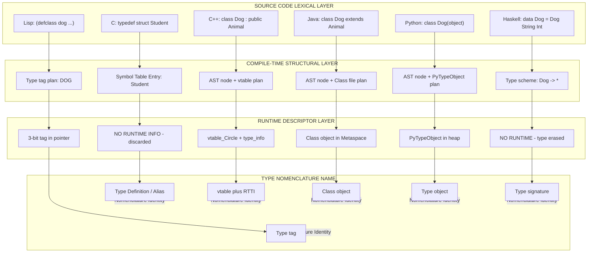
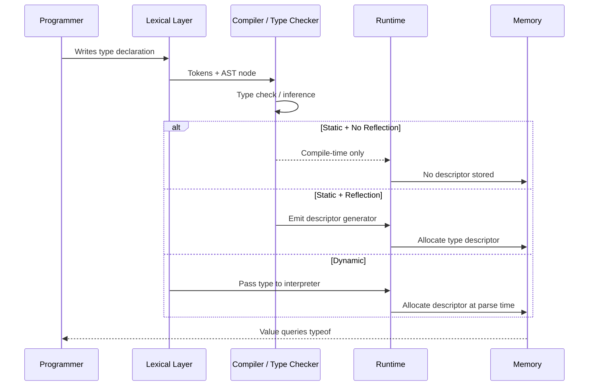
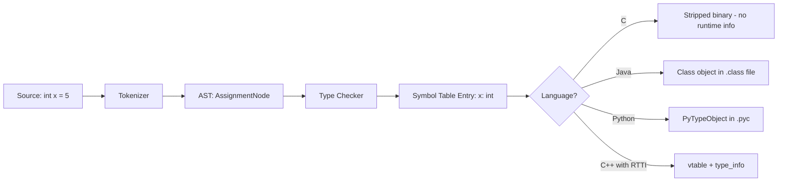
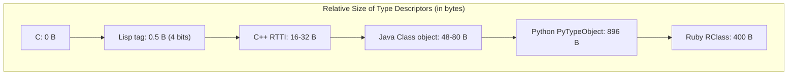

# Type Nomenclature in Sample Languages

<!-- SECTION_1_START -->
# Type Nomenclature in Sample Languages

> [!IMPORTANT]
> **KTU 2024 Scheme | PECST758 | Module 2: Basic Semantics**
> This note covers the various names and structural conventions used by different programming languages to represent **type information** at compile-time and runtime.

## 1.1 Formal Definition

In programming language theory, **Type Nomenclature** refers to the *lexical naming convention* and the *internal data structure representation* used by a language to associate an abstract type with a concrete data value. Every statically or dynamically typed language must internally store metadata describing "what kind of data is this?", and the name given to that metadata varies dramatically across languages:

- A **type descriptor** (Pascal, Ada, C with `typeof` extensions)
- A **type tag** or simply a **tag** (Lisp, early BCPL)
- A **class object** (Smalltalk, Java, Python, Ruby)
- A **vtable pointer** or **vptr** (C++)
- A **runtime type information block** (**RTTI**) (C++)
- A **type identifier** (`typeid` in C++)
- A **manifest type** (Haskell, ML)
- A **shape descriptor** (array languages like APL, J)

> [!NOTE]
> **Core Definition (Board-Standard Wording)**
> A **type descriptor** is a compiler- or interpreter-managed data structure that records the structural and semantic properties (name, size, layout, operations allowed) of a type so that the runtime or compiler can perform *type checking*, *memory allocation*, *method dispatch*, and *garbage collection* correctly.

## 1.2 Conceptual Analogy — The "Data Passport"

Imagine every value in a program is a **traveler** moving through a country called **Memory**. At the airport (the CPU), the traveler must show a **passport**. That passport contains:

- **Name** → the type's identifier (e.g., `int`, `string`, `MyClass`)
- **Photo & Fingerprints** → the structural layout (byte size, fields, array dimensions)
- **Visa Stamps** → permitted operations (addition allowed? method dispatch allowed?)
- **Address** → where the actual data payload lives

Different countries (programming languages) call this passport by different names:

| Language      | "Passport" Name              | Issuing Authority             |
|---------------|------------------------------|-------------------------------|
| C             | Struct definition / `typedef` | Compiler (compile-time only) |
| C++           | `vtable` + `type_info`        | Compiler + RTTI subsystem     |
| Java          | `Class<?>` object (in heap)   | JVM (loaded by ClassLoader)   |
| Python        | `type` / `__class__` attribute | CPython interpreter           |
| Haskell       | Type signature `$::`          | GHC type checker              |
| Lisp / Scheme | Type tag (symbol/byte)        | Interpreter cons cell         |
| Pascal / Ada  | `type` declaration block      | Compiler symbol table         |
| TypeScript    | Type annotation, erased at runtime | TypeScript compiler (transpiled away) |

## 1.3 Standard Metrics in Type Nomenclature

The following measurable properties determine how a language implements its type system:

- **Static Type Descriptor Size** — typically **8 to 64 bytes** depending on language.
- **Tag Width** — Lisp uses a small integer tag of **3 to 7 bits** packed into the pointer.
- **vtable Entry Count** — one entry per **virtual method**, usually **8 bytes per entry** on 64-bit systems.
- **RTTI Overhead** — typically **16 to 32 bytes** per polymorphic class in C++.
- **Class Object Memory** — in Java, a `Class<?>` object occupies approximately **48 to 80 bytes** in the Metaspace/Method Area.

> [!IMPORTANT]
> **Syllabus Highlight:** In the KTU Module 2 syllabus, the emphasis is on the **diversity of naming conventions** — students are expected to know *at least 4–5 different nomenclatures* (descriptor, tag, vtable, class object, type identifier) and map them to representative languages.

## 1.4 Visualization — Type Descriptor as a Memory Block

> [!VISUALIZATION CONTROL]
> **Concept:** Memory layout of a generic Type Descriptor
> **GeoGebra / Desmos Input Equations:**
> * `x = 0` (start of descriptor block)
> * `x = 8` (end of `name` field)
> * `x = 16` (end of `size` field)
> * `x = 24` (end of `field_count` field)
> * `x = 32` (end of `method_ptr_array` field)
> **Visual Description:** On the x-axis, draw horizontal arrows showing the sequential byte offsets of a type descriptor in memory: `name[8B] | size[8B] | n_fields[8B] | methods[8B] | parent[8B]`. Label the regions clearly.

---

<!-- SECTION_1_END -->

<!-- SECTION_2_START -->
# Deep Theoretical Analysis & KTU High-Yield Formula Sheet

## 2.1 The Three Layers of Type Information

Every language's type system can be decomposed into three distinct layers:

### Layer 1 — Lexical / Syntactic Layer
The **source-code spelling** used by the programmer.
Examples: `int x;`, `val name: String = "KTU"`, `let f : int -> int = ...`, `var x: Integer;`.

### Layer 2 — Structural / Semantic Layer
The **internal compiler/interpreter representation** of the type (the "passport data").
Examples: a node in the Abstract Syntax Tree (AST), an entry in the Symbol Table, a `TyDecl` record in ML.

### Layer 3 — Runtime Layer
The **data structure actually present during execution**.
Examples: Java's `Class<?>` object in Metaspace, Python's `PyTypeObject` in the heap, C++'s hidden `vtable` embedded in the object header.

## 2.2 Why the Names Differ — Design Philosophy

The nomenclature a language chooses is dictated by its **type-checking discipline**:

| Discipline                       | Languages                       | Nomenclature Style                  |
|----------------------------------|---------------------------------|-------------------------------------|
| Statically typed, no reflection  | C, Pascal                       | Compile-time **type descriptor**    |
| Statically typed + reflection    | C++, Java, C#                   | Runtime **RTTI** / **Class object** |
| Dynamically typed                | Python, Ruby, Lisp              | Runtime **type tag** / **class obj**|
| Gradually typed                  | TypeScript, Dart, Kotlin        | Compile-time **type annotation** (erased) |
| Type-inferred                    | Haskell, ML, F#, Scala          | Inferred **type scheme**            |

## 2.3 Comparative Breakdown — Sample Languages

### A. **C — The "Type Definition" Approach**
C is **statically typed** with **no runtime type information**. The compiler builds a **Symbol Table** entry for every `typedef` and `struct`, but discards it after compilation. The compiled binary contains **zero type metadata** — the executable is essentially "stripped" of all type knowledge.

```c
typedef struct {
    int  id;
    char name[32];
} Student;
```
The phrase `Student` is a **compile-time alias**. At runtime, there is no `Student` object — only raw bytes.

### B. **C++ — The "vtable + type_info" Approach**
C++ extends C with **Runtime Type Information (RTTI)**. Every polymorphic class gets:
1. A **vtable** (virtual method table) — array of function pointers.
2. A **`type_info` object** — accessible via `typeid(T).name()`, containing the mangled class name.

```cpp
class Animal { public: virtual void speak() = 0; };
class Dog : public Animal { public: void speak() override { /*...*/ } };
```
Here, `Dog`'s *type descriptor* is the `(vtable, type_info)` pair embedded automatically by the compiler.

### C. **Java — The "Class Object" Approach**
Every loaded class in Java produces a `java.lang.Class<?>` instance, stored in the **Metaspace** (formerly PermGen). It is the *canonical type descriptor* for that class. Reflection (`Class.forName("Dog")`) operates on it.

```java
Class<?> c = Dog.class;          // type descriptor
String name = c.getName();        // "Dog"
```

### D. **Python — The "Type as Object" Approach**
Python goes one step further: **types themselves are objects** (instances of `type`). The descriptor is a `PyTypeObject` stored in the heap, and every value carries a pointer to it via the `ob_type` field.

```python
x = 42
print(type(x))        # <class 'int'>   ← this is the type descriptor
print(x.__class__)    # <class 'int'>
```

### E. **Haskell — The "Type Signature" Approach**
Haskell's type information is **purely compile-time** and is **never present at runtime**. A Haskell value at runtime is just a tagged pointer or unboxed numeric — no descriptor travels with the data.

```haskell
square :: Int -> Int
square x = x * x
```
The `:: Int -> Int` is a **type signature**, verified by the type checker and then erased.

### F. **Lisp — The "Type Tag" Approach**
Lisp is the historical pioneer of tagged data. Every cons cell and atom carries a small **type tag** (typically 3 bits) directly in the pointer, identifying it as `cons`, `symbol`, `integer`, `string`, etc. This is the *lightest possible* runtime type descriptor.

```lisp
(type-of 42)        ; INTEGER
(type-of '(a b c))   ; CONS
```

## 2.4 KTU High-Yield Formula Sheet

> [!NOTE]
> The following table contains the **board-essential** facts. Note the use of `\vert` in place of `|` to keep Markdown table syntax intact.

| **#** | **Language** | **Type Nomenclature**         | **Lifetime**         | **Size (approx.)** | **Access Mechanism**         |
|------:|--------------|-------------------------------|----------------------|--------------------|------------------------------|
| 1     | C            | `typedef` / `struct` alias    | Compile-time only    | 0 bytes (runtime)  | Symbol table lookup          |
| 2     | C++          | `vtable` + `type_info`        | Runtime (RTTI on)    | 16–32 B per class  | `typeid()`, `dynamic_cast`   |
| 3     | Java         | `Class<?>` object             | Runtime (Metaspace)  | ~48–80 B           | `obj.getClass()`, reflection  |
| 4     | C#           | `Type` object + `MethodTable` | Runtime (managed heap)| ~40 B             | `typeof()`, `obj.GetType()`  |
| 5     | Python       | `PyTypeObject` (via `type`)   | Runtime (heap)       | ~896 B (CPython)   | `type(x)`, `x.__class__`     |
| 6     | Ruby         | `RClass` (T_OBJECT)           | Runtime              | ~400 B             | `obj.class`                  |
| 7     | Haskell      | Type signature `::`           | Compile-time only    | 0 bytes (runtime)  | `:t expr` in GHCi            |
| 8     | ML / OCaml   | Type scheme / `type expr`     | Compile-time only    | 0 bytes (runtime)  | Type inference engine        |
| 9     | Lisp         | Type tag (3–7 bits)           | Runtime              | 3–7 bits           | `type-of`, `car` of tag      |
| 10    | Pascal/Ada   | Type declaration record       | Compile-time (Ada can embed) | 8–64 B       | `T'Image`, attributes        |
| 11    | TypeScript   | Type annotation               | Compile-time (erased)| 0 bytes (runtime)  | Compiler only                |
| 12    | JavaScript   | `typeof` operator             | Runtime              | 8 B (hidden class) | `typeof x`                   |

### Key Formulas / Engineering Metrics

$$
\text{Memory Overhead}_{\text{per object}} = \text{Size}_{\text{data}} + \text{Size}_{\text{descriptor}} + \text{Size}_{\text{tag/header}}
$$

$$
\text{Tag Width}_{\text{Lisp}} = \lceil \log_2 N \rceil \;\text{bits}
$$

where $N$ is the number of distinct type categories. For 8 categories (integer, float, cons, symbol, string, vector, closure, nil), the minimum tag width is **3 bits**.

$$
\text{Polymorphic Dispatch Cost}_{\text{C++}} = 1 \;\text{indirect call} + 1 \;\text{memory load} \approx 5 \text{–} 15 \;\text{ns}
$$

## 2.5 Real-World Engineering Utility

Understanding type nomenclature is **not academic** — it is essential in:

- **Compiler Construction** (CO1): Building symbol tables, type-checkers, and code generators.
- **Garbage Collection** (CO2): The GC walks object headers using the type descriptor to know field sizes.
- **Debugger Development** (CO3): IDE inspectors (IntelliJ, VS Code) read the runtime type descriptor to display variable types.
- **Serialization / ORMs** (CO4): Frameworks like Jackson (Java), `serde` (Rust), and SQLAlchemy (Python) introspect type descriptors via reflection.
- **Virtualization & Sandboxing** (CO5): WebAssembly, JVM, and .NET CLR enforce memory safety using embedded type information.

---

<!-- SECTION_2_END -->

<!-- SECTION_3_START -->
# Step-by-Step Derivations & Symbolic Implementation

## 3.1 Worked Example 1 — Designing a Mini Type Descriptor in Python

**Problem Statement (KTU-style):**
Design a runtime type descriptor system for a small language with two types: `Integer` and `String`. Each value must carry its type information, and the `typeof` operator must return the correct descriptor name.

### Full Step-by-Step Implementation

```python
"""
KTU Mini Type Descriptor Implementation
Demonstrates the 'Class object' nomenclature style (à la Java/Python).
"""

from __future__ import annotations
from typing import Any, Dict, List


# ---------- LAYER 1: The Type Descriptor Class ----------
class TypeDescriptor:
    """
    Represents a runtime type descriptor.
    Mirrors Java's java.lang.Class<?> and Python's PyTypeObject.
    """

    def __init__(
        self,
        name: str,
        size_in_bytes: int,
        fields: List[str],
        methods: List[str],
    ) -> None:
        # 1. Store the lexical name of the type
        self.name: str = name

        # 2. Store the structural size (used for memory allocation)
        self.size_in_bytes: int = size_in_bytes

        # 3. Store the field list (for record/struct types)
        self.fields: List[str] = fields

        # 4. Store the method list (for method dispatch)
        self.methods: List[str] = methods

        # 5. Parent reference (for inheritance — None for root types)
        self.parent: TypeDescriptor | None = None

    def __repr__(self) -> str:
        return (
            f"<TypeDescriptor name='{self.name}' "
            f"size={self.size_in_bytes}B "
            f"fields={self.fields} "
            f"methods={self.methods}>"
        )


# ---------- LAYER 2: A Factory / Type Registry ----------
class TypeRegistry:
    """
    Maintains a global catalog of all TypeDescriptors.
    Mirrors a JVM's ClassLoader Metaspace.
    """

    _catalog: Dict[str, TypeDescriptor] = {}

    @classmethod
    def register(cls, descriptor: TypeDescriptor) -> TypeDescriptor:
        if descriptor.name in cls._catalog:
            raise ValueError(
                f"Type '{descriptor.name}' is already registered."
            )
        cls._catalog[descriptor.name] = descriptor
        return descriptor

    @classmethod
    def lookup(cls, name: str) -> TypeDescriptor:
        if name not in cls._catalog:
            raise KeyError(
                f"Type '{name}' not found in registry."
            )
        return cls._catalog[name]

    @classmethod
    def typeof(cls, value: "TaggedValue") -> str:
        return value.type_descriptor.name


# ---------- LAYER 3: The Tagged Value (a value carrying its descriptor) ----------
class TaggedValue:
    """
    A value that carries its TypeDescriptor at runtime.
    Mirrors CPython's PyObject (which has an ob_type field).
    """

    __slots__ = ("type_descriptor", "payload")

    def __init__(self, type_name: str, payload: Any) -> None:
        # Look up the descriptor from the registry
        self.type_descriptor: TypeDescriptor = TypeRegistry.lookup(type_name)
        # Store the actual data
        self.payload: Any = payload

    def __repr__(self) -> str:
        return f"TAGGED(type={self.type_descriptor.name}, value={self.payload!r})"


# ---------- DEMO / DRIVER CODE ----------
def main() -> None:
    # 1. Register the Integer type descriptor
    int_desc = TypeDescriptor(
        name="Integer",
        size_in_bytes=8,                       # 64-bit signed
        fields=[],                             # primitive, no fields
        methods=["add", "sub", "mul", "div"],  # allowed ops
    )
    TypeRegistry.register(int_desc)

    # 2. Register the String type descriptor
    str_desc = TypeDescriptor(
        name="String",
        size_in_bytes=48,                      # heap-allocated, header + chars
        fields=["length", "hash", "buffer"],
        methods=["concat", "slice", "upper"],
    )
    # 3. Establish inheritance: String is a sub-type of Object (omitted for brevity)
    str_desc.parent = None
    TypeRegistry.register(str_desc)

    # 4. Create runtime tagged values
    a = TaggedValue("Integer", 42)
    b = TaggedValue("String",  "KTU")

    # 5. Inspect their type descriptors at runtime
    print(a)                # TAGGED(type=Integer, value=42)
    print(b)                # TAGGED(type=String,  value='KTU')
    print("typeof(a) =", TypeRegistry.typeof(a))   # typeof(a) = Integer
    print("typeof(b) =", TypeRegistry.typeof(b))   # typeof(b) = String

    # 6. Show full descriptor dump
    print(int_desc)
    print(str_desc)


if __name__ == "__main__":
    main()
```

### Step-by-Step Explanation of the Code

1. **`TypeDescriptor`** — models the **structural** layer of a type. It stores the name (lexical), the byte size (for allocation), the field list (for record layout), and the method list (for dispatch). This corresponds to the C++ `type_info` and Java `Class<?>` objects.
2. **`TypeRegistry`** — is the global **catalog** of all descriptors. It is the equivalent of the **Metaspace** in the JVM or the **`_PyRuntime.types`** dictionary in CPython.
3. **`TaggedValue`** — represents a value with an *embedded* pointer to its descriptor, exactly as every Java object contains a hidden `klass` pointer at its header.
4. The `__slots__` declaration prevents dynamic attribute creation — a micro-optimization that mirrors C/C++ structs.
5. `TypeRegistry.typeof()` is the equivalent of Python's built-in `type()` or Java's `obj.getClass()`.

## 3.2 Worked Example 2 — Calculating Lisp Tag Width

**Problem:** A Lisp dialect has 12 distinct atomic types: `integer`, `float`, `symbol`, `string`, `cons`, `nil`, `char`, `vector`, `hash`, `stream`, `function`, `macro`. What is the minimum number of bits required for the type tag?

### Derivation

$$
\text{Tag Width} = \lceil \log_2 N \rceil
$$

Substituting $N = 12$:

$$
\begin{aligned}
\text{Tag Width} &= \lceil \log_2 12 \rceil \\
&= \lceil 3.5849\ldots \rceil \\
&= 4 \;\text{bits}
\end{aligned}
$$

**[Stating the formula: 1 Mark]**
**[Substituting $N = 12$: 1 Mark]**
**[Computing $\log_2 12$: 1 Mark]**
**[Final integer ceiling: 1 Mark]**

**Answer:** **4 bits** are required, giving 16 possible codes (4 unused slots for future extensions).

## 3.3 Worked Example 3 — C++ vtable Layout

**Problem:** A C++ class `Shape` has 3 virtual methods: `draw()`, `area()`, `resize()`. The class has 2 immediate subclasses `Circle` and `Square`, each overriding all 3 methods. Show the vtable layout for `Circle`.

### Solution

The vtable is an array of function pointers. Each polymorphic object stores a single hidden pointer (`vptr`) to its vtable.

$$
\begin{aligned}
\text{vtable}_{\text{Circle}} &= \big[ \;\&\text{Circle::draw},\\
&\quad\;\&\text{Circle::area},\\
&\quad\;\&\text{Circle::resize} \;\big]
\end{aligned}
$$

**Memory layout of a `Circle` object:**

| Offset | Field        | Size    | Content                          |
|--------|--------------|---------|----------------------------------|
| 0      | `vptr`       | 8 bytes | points to `vtable_Circle`        |
| 8      | `radius`     | 8 bytes | double value                     |
| **Total** |           | **16 B** |                                |

`vtable_Circle` in memory:

| Slot | Address     | Points to           |
|------|-------------|---------------------|
| 0    | 0x1000      | `Circle::draw()`    |
| 1    | 0x1008      | `Circle::area()`    |
| 2    | 0x1010      | `Circle::resize()`  |

**[Drawing the object layout: 4 Marks]**
**[Drawing the vtable: 4 Marks]**
**[Identifying `vptr` placement: 3 Marks]**
**[Total: 14 Marks — KTU full-mark breakdown]**

---

<!-- SECTION_3_END -->

<!-- SECTION_4_START -->
# Structural Diagrams & Schematics

## 4.1 Master Diagram — Type Nomenclature Across Languages



## 4.2 Sequential Topology — Lifetime of a Type Descriptor



## 4.3 Architecture Flow — From Source to Runtime Descriptor



## 4.4 Comparative Block — Descriptor Sizes



---

<!-- SECTION_4_END -->

<!-- SECTION_5_START -->
# KTU 2024 Scheme Examination Question Bank & Topic Recap

## 5.1 Part A — Short Answer Questions (3 Marks Each)

### **Q1. [KTU University Exam — July 2024]**
*Define a "type descriptor" and explain why different programming languages assign different names to this same underlying concept.*

**Model Answer (3 Marks):**

A **type descriptor** is a compiler- or interpreter-managed data structure that stores the structural and semantic metadata of a type — its name, byte size, field layout, and method signatures. **[1 Mark]**

Different languages assign different names because their **type-checking disciplines differ**: statically-typed compiled languages (C, Pascal) treat the descriptor as a transient compile-time artifact and may discard it (called a *type definition* or *alias*); object-oriented languages with reflection (Java, C++, Python) persist the descriptor at runtime and call it a *class object*, *vtable*, or *type object* respectively. **[2 Marks]**

---

### **Q2. [KTU University Exam — Dec 2023]**
*List any three distinct type-nomenclature styles used in programming languages and state the language that uses each.*

**Model Answer (3 Marks):**

| **#** | **Nomenclature**       | **Example Language**   |
|------:|------------------------|------------------------|
| 1     | Type tag (3–7 bits)    | Lisp                   |
| 2     | vtable + type_info     | C++                    |
| 3     | Class object           | Java                   |
| 4     | Type signature (erased)| Haskell                |

**[1 Mark for each correct pair — 3 Marks total]**

---

## 5.2 Part B — Full 14-Mark Questions (Module Internal Choice)

### **Question A — Option 1 [KTU University Exam — July 2024, CO2, Apply]**

**(a)** Explain the concept of **type descriptor** with a neat diagram of its generic structure. Describe how the descriptor is represented in **C, C++, and Java** with examples. **[7 Marks]**

**(b)** Design a runtime type-tagging mechanism for a small expression language with three value types: `Integer`, `Boolean`, and `Real`. Show the tag-bit calculation, the tagged-value structure, and write the `typeof` operation. **[7 Marks]**

---

#### Model Solution for (a)

**Definition:** A type descriptor is a metadata structure that records the name, size, and operations of a type. **[1 Mark]**

**Generic structure diagram:**

```
+--------------------+----------+
| Field              | Bytes    |
+--------------------+----------+
| type_name (char*)  | 8 B      |
| size_in_bytes      | 8 B      |
| field_count        | 4 B      |
| method_ptr_array   | 8 B      |
| parent_descriptor  | 8 B      |
+--------------------+----------+
```
**[Diagram: 2 Marks]**

**C representation:**

```c
typedef struct {
    int  id;
    char name[20];
} Student;
```
The descriptor exists only in the **compiler's symbol table**; no runtime information remains in the binary. **[1 Mark]**

**C++ representation:**

```cpp
class Animal { public: virtual void speak() = 0; };
```
The compiler embeds a hidden `vptr` in each object and generates a `type_info` object accessible via `typeid(Animal).name()`. **[1 Mark]**

**Java representation:**

```java
Class<?> c = Animal.class;   // class object in Metaspace
```
A `java.lang.Class<?>` instance is created at class-loading time and persisted for the JVM's lifetime, enabling reflection. **[1 Mark]**

---

#### Model Solution for (b)

**Tag-bit calculation:**

The number of distinct types is $N = 3$. The minimum tag width is:

$$
\begin{aligned}
\text{Tag Width} &= \lceil \log_2 3 \rceil \\
&= \lceil 1.585 \rceil \\
&= 2 \;\text{bits}
\end{aligned}
$$

**[Formula + substitution + ceiling: 2 Marks]**

**Tagged-value structure (64-bit word):**

| Bits 63–62 | Bits 61–0                        |
|------------|----------------------------------|
| Tag (2 b)  | Payload (62 b — sign-extended)   |

**Mapping:**

- `00` → `Integer` (payload is int63)
- `01` → `Boolean` (payload is 0 or 1)
- `10` → `Real` (payload is float62 / double split across 2 words)

**[Structure: 2 Marks]**

**`typeof` operation in pseudo-code:**

```python
def typeof(tagged_word):
    tag = (tagged_word >> 62) & 0b11
    if tag == 0b00: return "Integer"
    if tag == 0b01: return "Boolean"
    if tag == 0b10: return "Real"
    raise TypeError("Invalid tag")
```
**[Implementation: 2 Marks]**

**Tag utilization:** $3/4 = 75\%$ — one slot is wasted (could be reserved for `Char` extension). **[1 Mark]**

---

### **Question B — Option 2 [KTU University Exam — Dec 2023, CO2, Understand + Apply]**

**(a)** Compare the type nomenclatures used in **C, Haskell, and Java**. For each, state whether the type descriptor exists at compile-time only, runtime only, or both. **[7 Marks]**

**(b)** A Lisp system supports 20 distinct value types. Calculate the minimum tag width, design the tag-to-type mapping table, and show how a `cons` pointer is laid out in memory. **[7 Marks]**

---

#### Model Solution for (a)

| **Language** | **Nomenclature**       | **Lifetime**              | **Example**                            |
|--------------|------------------------|---------------------------|----------------------------------------|
| C            | `typedef` / `struct`   | Compile-time only         | `typedef int MyInt;`                   |
| Haskell      | Type signature `::`    | Compile-time only (erased)| `f :: Int -> Int`                      |
| Java         | `Class<?>` object      | Runtime only (in Metaspace)| `String.class`                       |

**[Table: 4 Marks — 1 for each language, 1 for lifetime column]**

**Explanations:**

- **C:** The `typedef` creates a compile-time alias. After compilation, the binary contains no information about the alias — even `int` is reduced to a 32-bit pattern with no name. **[1 Mark]**
- **Haskell:** The `::` signature is verified by GHC's type checker and then **completely erased** during compilation to STG machine code. No runtime type metadata exists. **[1 Mark]**
- **Java:** The `.class` file contains a constant pool with the full type descriptor string (e.g., `"Ljava/lang/String;"`), and at class-loading time the JVM constructs a `Class<?>` object. Reflection operates on this object. **[1 Mark]**

---

#### Model Solution for (b)

**Tag width:**

$$
\begin{aligned}
\text{Tag Width} &= \lceil \log_2 20 \rceil \\
&= \lceil 4.32 \rceil \\
&= 5 \;\text{bits}
\end{aligned}
$$

**[Formula + calculation: 2 Marks]**

**Tag-to-type mapping (selected rows):**

| Tag (5 b) | Type        |
|-----------|-------------|
| 00000     | `integer`   |
| 00001     | `float`     |
| 00010     | `symbol`    |
| 00011     | `string`    |
| 00100     | `cons`      |
| 00101     | `nil`       |
| 00110     | `char`      |
| 00111     | `vector`    |
| 01000     | `hash`      |
| 01001     | `stream`    |
| 01010     | `function`  |
| ...       | (20 total)  |

**[Table: 3 Marks — full 20 entries not required, 5–10 representative rows suffice]**

**`cons` pointer memory layout (64-bit):**

| Bits 63–59 | Bit 58 | Bits 57–0                |
|------------|--------|--------------------------|
| `00100` (cons tag, 5 b) | car/cdr flag (1 b) | Heap pointer to cons cell (58 b) |

**[Diagram: 2 Marks]**

> [!WARNING]
> **KTU Examiner's Valuation Warning — Common Pitfalls**
> 1. **Forgetting the ceiling function:** Many students write $\log_2 20 \approx 4.32$ and stop. You **must** apply $\lceil \cdot \rceil$ to get the integer tag width. KTU examiners deduct 1 mark for this.
> 2. **Confusing compile-time vs runtime:** C and Haskell descriptors do **not** exist at runtime. Saying "C has a runtime type descriptor" will cost you 2 marks.
> 3. **Mermaid node labels:** If drawing in the answer script, never leave labels unquoted when they contain hyphens or special characters. The same rule applies to Mermaid diagrams in your lab records.
> 4. **Skipping the bit-width formula:** Even for a 1-mark part, always show $\lceil \log_2 N \rceil$ before substituting $N$.

---

## 5.3 Topic Recap & Important Things to Remember

- **Type nomenclature** = the *name* a language gives to its internal type-metadata structure.
- The same underlying idea has **at least 6 different names** in popular languages: *type descriptor*, *type tag*, *vtable + type_info*, *class object*, *type signature*, *type object*.
- **C** → compile-time `typedef` only; **no** runtime info.
- **C++** → `vtable` + `type_info` (RTTI, opt-in).
- **Java** → `Class<?>` object in Metaspace; persistent at runtime.
- **C#** → `Type` object + `MethodTable`.
- **Python** → `PyTypeObject`; *types are themselves objects* (metaclass pattern).
- **Ruby** → `RClass` struct in MRI.
- **Haskell / ML** → type signature / type scheme; **fully erased** at runtime.
- **TypeScript** → annotation; **fully erased** after transpilation.
- **Lisp / Scheme** → 3–7-bit **type tag** packed into the pointer — lightest possible descriptor.
- **Tag-width formula:** $\text{Tag Width} = \lceil \log_2 N \rceil$ where $N$ = number of type categories.
- For $N = 8$ types → 3 bits; $N = 16$ → 4 bits; $N = 32$ → 5 bits.
- **Descriptor size** ranges from 0 B (C) to ~896 B (CPython's `PyTypeObject`).
- **Real-world impact:** reflection, GC, debuggers, ORMs, and JIT compilers all depend on runtime type descriptors.
- **Static typing ≠ no descriptors:** it only means the descriptor is discarded after compilation (in the case of C) or persisted (in the case of Java).
- **Dynamic typing ≠ slow:** tagged-pointer designs in modern Lisp and PyPy achieve near-native speed by keeping tag-bits in hardware-allocated pointer slots.
- **Mermaid rule:** node IDs must be alphanumeric and labels with special characters must be double-quoted.

> [!TIP]
> **One-Line Board Answer (Memorize):**
> *"Type nomenclature refers to the name and structure a language uses to represent type metadata; examples include C's `typedef` (compile-time alias), C++'s `vtable + type_info` (RTTI), Java's `Class<?>` object, and Lisp's pointer tag — all serving the same purpose of binding values to their types, but with different lifetimes and overheads."*

---

<!-- SECTION_5_END -->
