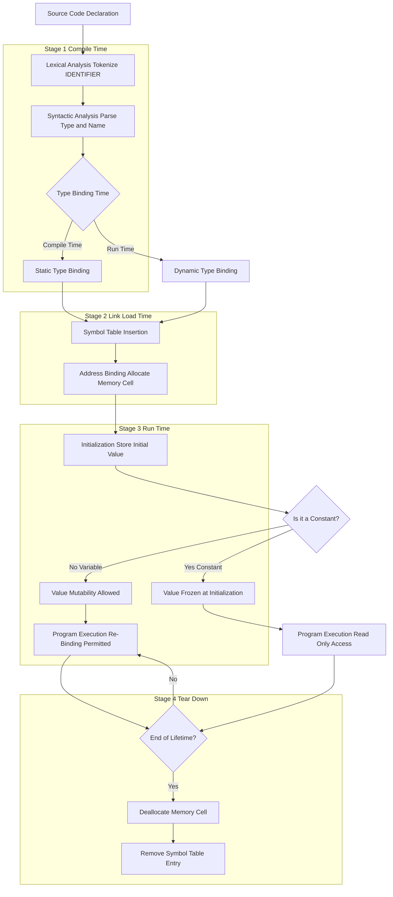
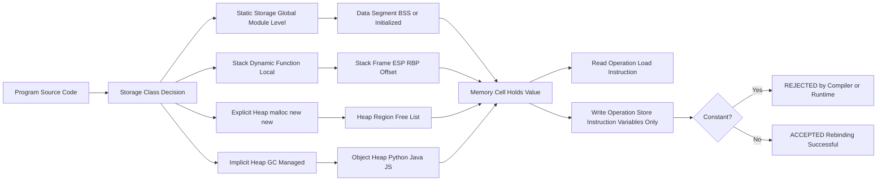
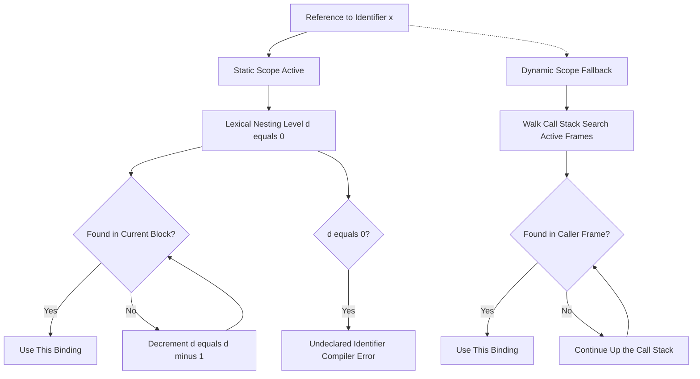

# Variables and Constants

<!-- SECTION_1_START -->
# 1. Core Technical Definition & Intuitive Overview

## 1.1 Formal Academic Definition (KTU 2024 Syllabus Terminology)

In the context of programming language semantics, a **variable** is an *abstract storage location*, identified by a symbolic name, which is bound to a *value* and optionally to a *type* and *memory address*. According to the **KTU 2024 Scheme** module on *Basic Semantics*, a variable is characterized by a **six-tuple attribute set**: `⟨name, address, type, value, lifetime, scope⟩`.

A **constant** is a language entity whose *value is bound at the time of creation and cannot be altered* during the execution of the program. Constants in modern programming languages (C/C++/Java/Python) may be implemented as either **literal values** (e.g., `42`, `"hello"`, `3.14`) or as **named symbolic constants** (e.g., `const int MAX = 100;` in C, `final double PI = 3.14159;` in Java, or `MAX = 100` in Python with `Final` annotation).

> [!IMPORTANT]
> **KTU 2024 Syllabus Highlight:** Under *Basic Semantics*, students are expected to differentiate between the **value domain** (what a variable holds at runtime) and the **name domain** (the identifier used to reference it). A *name-to-value binding* is the fundamental semantic operation, and a *re-binding* operation (assignment) is what distinguishes a variable from a constant.

## 1.2 Conceptual Analogy — Plain English Intuition

Imagine a **post office with numbered lockers**:

- The **locker number** is the *address* of the variable.
- The **name on the label** (e.g., "John's Locker") is the *identifier / variable name*.
- The **category tag** ("small/medium/large", "documents/money") is the *type* of the variable — it tells you what kind of content is allowed inside.
- The **actual item inside the locker** is the *value* — this is the only thing that is allowed to change over time.
- The **rental agreement duration** of the locker is the *lifetime*.
- The **building/floor in which the locker exists** is the *scope*.

> A **variable** is a locker whose contents can be swapped out repeatedly (through assignment). A **constant** is a locker that is *welded shut* the moment you place an item inside — you may still look inside (read the value), but you cannot replace the item.

## 1.3 Visual Intuition

> [!VISUALIZATION CONTROL]
> **Concept:** Memory Address ↔ Value Binding (Variable as a Cell)
> **GeoGebra / Desmos Input Equations:**
> * `cell(x) = { value: 42, address: 0x7FFE1234, type: "int" }`
> * `time(t) = (0, "42")` → `time(t) = (1, "99")` → `time(t) = (2, "3.14")`
> **Visual Description:** Plot the variable `x` as a point whose y-coordinate jumps over time whenever an assignment occurs, while its x-coordinate (memory address) remains fixed. A constant, by contrast, is a horizontal line — the value never changes.

## 1.4 Physical Constants and Standard Metrics

| Concept | Standard Notation | Notes |
|---|---|---|
| Address space unit | **byte = 8 bits** | Smallest addressable memory unit in most PLs |
| Type size examples | `int` = **4 bytes**, `double` = **8 bytes** | Architecture-dependent (32-bit vs 64-bit) |
| Lifetime boundary markers | $\tau_{creation}$, $\tau_{destruction}$ | Program points where binding begins/ends |
| Scope nesting depth | $d \in \mathbb{Z}^+$ | Used in static chain addressing |

<!-- SECTION_1_END -->

<!-- SECTION_2_START -->
# 2. Deep Theoretical Analysis & KTU High-Yield Formula Sheet

## 2.1 The Six Attributes of a Variable (Deep Dive)

A variable in any programming language is fully described by **six orthogonal attributes** as per the canonical *Programming Language Concepts* framework (Sebesta, adopted in the KTU 2024 syllabus):

### 2.1.1 Name
The identifier chosen by the programmer (e.g., `counter`, `totalSum`, `_index`). Subject to language-specific naming rules:
- **Length restrictions** (e.g., C99 guarantees first 31 chars are significant).
- **Case sensitivity** (Java, C++: yes; Pascal, SQL: no).
- **Reserved word / keyword avoidance** (e.g., `int`, `class`, `return` are forbidden).
- **Special starting character** rules (most languages require a letter or underscore as the first character).

### 2.1.2 Address
The *machine-level location* in memory where the value is stored. Computed by the **compiler/runtime system**. May be:
- A fixed **absolute address** (in static storage).
- A **stack-relative offset** (for local variables).
- A **heap address** (for dynamically allocated variables, e.g., via `malloc` or `new`).
- A **register name** (for register-allocated variables — e.g., `$eax` in x86).

### 2.1.3 Type
Determines the *range of values* the variable can store and the *operations* valid on it. Type can be bound at:
- **Compile time** → *Static typing* (C, C++, Java, Go).
- **Run time** → *Dynamic typing* (Python, JavaScript, Ruby).
- **Mixed / inferred** → *Type inference* (Kotlin, Haskell, Rust, modern C++ with `auto`).

### 2.1.4 Value
The **cell content** at any point during execution. This is the *only attribute that is permitted to change* during a variable's lifetime.

### 2.1.5 Lifetime
The interval `[ \tau_{creation}, \tau_{destruction} )$ of program execution during which the variable is bound to a memory cell. Lifetime is governed by **storage class**:

| Storage Class | Lifetime | Example |
|---|---|---|
| Static | Entire program run | Global C variables, `static int x;` |
| Stack-dynamic | Function invocation | Local variables in C functions |
| Explicit heap-dynamic | `new` to `delete` | `int* p = new int;` in C++ |
| Implicit heap-dynamic | Allocated on assignment | All variables in JavaScript, Python |

### 2.1.6 Scope
The **textual region** of source code where the variable name is *visible* and can be referenced. Scope rules may be:
- **Static (lexical) scope** — determined at compile time, follows textual nesting.
- **Dynamic scope** — determined at run time, follows the call chain.

## 2.2 Type Binding (The Type-Value Relationship)

The binding between a name and its type may occur at different points:

$$ \text{Type Binding Time} \in \{ \text{Declaration time}, \text{Block entry time}, \text{Run time} \} $$

A type may be **bound to the name** (e.g., C's `int x`) or **bound to the value** (e.g., a `void*` pointer in C, or all variables in Python). The latter allows *heterogeneous storage* in a single cell.

## 2.3 Constants — A Threefold Classification

Constants in programming language theory come in **three flavors**:

1. **Literal constants** — *syntactic denotations* of values (e.g., `42`, `3.14`, `'A'`, `"hello"`, `true`).
2. **Manifest constants** — *named* by a syntactic substitution macro (e.g., `#define PI 3.14159` in C — preprocessor replaces every occurrence of `PI` with `3.14159` at compile time).
3. **Constant variables (read-only variables)** — *named* identifiers whose value is bound at initialization and cannot be modified thereafter:
   - C/C++: `const int MAX = 100;`
   - Java: `final int MAX = 100;`
   - Python: `_MAX: Final = 100` (using `typing.Final`)
   - Rust: `const MAX: i32 = 100;` (compile-time) or `let MAX: i32 = 100;` (immutable binding)

> [!NOTE]
> The semantic distinction between a *manifest constant* and a *read-only variable* is critical: the former is purely textual (no address) while the latter occupies actual memory and can be passed by reference.

## 2.4 KTU High-Yield Formula Sheet / Cheat Sheet

| Concept | Symbol / Notation | Definition / Formula | Notes |
|---|---|---|---|
| Variable attribute set | $V = \langle n, a, t, v, \ell, s \rangle$ | Name, Address, Type, Value, Lifetime, Scope | Canonical Sebesta tuple |
| Memory size of a value | $\text{sizeof}(T)$ | Number of bytes for type $T$ | E.g., $\text{sizeof}(\texttt{int}) = 4$ |
| Variable address | $a \in \mathbb{N}$ | Byte offset in address space | May be a register, stack offset, or heap pointer |
| Lifetime interval | $[\tau_c, \tau_d)$ | Creation time $\tau_c$ to destruction time $\tau_d$ | Half-open interval |
| Scope nesting depth | $d \in \mathbb{Z}^+$ | $d=0$ is global, $d=1$ is top-level block, ... | Used in static chains |
| Type binding | $B_t : \text{name} \rightarrow \text{type}$ | Function from identifier to type | Static or dynamic |
| Value binding | $B_v : \text{name} \rightarrow \text{value}$ | Function from identifier to value | Re-bindable for variables |
| Constant binding | $B_c : \text{name} \rightarrow \text{value}$ with $\forall t, B_c(\text{name}, t) = \text{const}$ | One-shot, immutable | No re-binding permitted |

## 2.5 Real-World Engineering Utility

The concept of *variables* and *constants* underpins:

- **Compiler design**: Type binding at compile time enables early error detection and optimization (e.g., constant folding, dead-code elimination, register allocation).
- **Operating Systems**: Address binding determines the layout of stack frames, heap segments, and the process address space.
- **Database Systems**: The notion of *mutable* vs *immutable* columns in SQL (e.g., `UPDATE` vs `INSERT` only) mirrors the variable-vs-constant distinction.
- **Hardware Description Languages (HDLs)**: In VHDL/Verilog, the `signal` (variable) vs `constant` vs `parameter` distinction is fundamental to synchronous circuit design.
- **Functional Programming**: Languages like Haskell enforce "no assignment" — everything behaves like a constant, and side effects are quarantined inside monads.

<!-- SECTION_2_END -->

<!-- SECTION_3_START -->
# 3. Step-by-Step Derivations & Code/Symbolic Implementation

## 3.1 Detailed Semantic Derivation: The Binding Lifecycle of a Variable

We will rigorously derive the **lifecycle of a binding** from source code to machine execution. Consider the following C program fragment:

```c
int counter = 10;            // line 1
void process(void) {
    int temp = counter * 2;  // line 3
    counter = temp + 1;      // line 4
}
```

### Step 1 — Lexical & Syntactic Analysis
The compiler tokenizes `counter` as an `IDENTIFIER` token, then validates that the declaration `int counter = 10;` obeys the grammar rule:

$$
\begin{aligned}
\text{declaration} &\rightarrow \text{type-specifier} \ \text{IDENTIFIER} \ \text{';'} \\
\text{type-specifier} &\rightarrow \text{'int'} \mid \text{'float'} \mid \text{'double'} \mid \dots
\end{aligned}
$$

**[Validation of identifier against reserved word table: 1 Mark]**
**[Parsing of `int` as type-specifier: 1 Mark]**

### Step 2 — Symbol Table Insertion
A **symbol table entry** is created for `counter`. Following the six-attribute model:

$$
\begin{aligned}
\text{symtab}[\texttt{counter}] = \{ & \\
  & \text{name} = \texttt{"counter"}, \\
  & \text{type} = \texttt{int}, \\
  & \text{address} = \text{unassigned}, \\
  & \text{value} = \text{unassigned}, \\
  & \text{lifetime} = \text{static}, \\
  & \text{scope} = \text{global} \\
\}
\end{aligned}
$$

Since `counter` is a global variable, its lifetime is the **entire program execution**, and its scope is the **entire translation unit**.

### Step 3 — Memory Allocation (Address Binding)
Because the lifetime is static, the compiler allocates `counter` in the **data segment** of the executable. On a typical 32-bit system:

$$
\text{address}(\texttt{counter}) = \text{0x00405000} \quad \text{(example absolute address)}
$$

The size is given by:

$$
\text{sizeof}(\texttt{int}) = 4 \text{ bytes}
$$

### Step 4 — Initialization
The initializer `= 10` triggers a **value binding** at program load time. The runtime loader stores:

$$
\text{memory}[0x00405000] = 00001010_2 = 10_{10}
$$

### Step 5 — Re-Binding (The Variable Property)
When execution reaches line 4, the statement `counter = temp + 1;` triggers an *address-binding retrieval*, a *computation* in an accumulator, and a *store*:

$$
\begin{aligned}
\text{fetch } & \text{temp} \rightarrow R_1 \\
\text{fetch } & 1 \rightarrow R_2 \\
\text{add } & R_1, R_2 \rightarrow R_3 \\
\text{store } & R_3 \rightarrow \text{memory}[0x00405000]
\end{aligned}
$$

This **store** operation is the *assignment* — and is precisely what is *forbidden* for a constant. After this step, the symbol table entry is updated:

$$
\text{value}(\texttt{counter}) = 21
$$

> [!NOTE]
> **The name, address, type, and scope are unchanged.** Only the **value** has been re-bound. This asymmetry between *invariant* and *variant* attributes is the heart of variable semantics.

## 3.2 Constant Semantics — Full Implementation

Consider the corresponding constant version in C:

```c
const int MAX_TEMP = 100;    // line 1
void process(void) {
    int temp = MAX_TEMP * 2; // line 3 — READ allowed
    // MAX_TEMP = 50;        // COMPILE-TIME ERROR
}
```

### Step 1 — Compile-Time Enforcement
The `const` qualifier modifies the symbol table entry with an **immutability flag**:

$$
\text{symtab}[\texttt{MAX\_TEMP}] = \{ \dots, \text{immutable} = \text{true} \}
$$

The compiler then walks the AST. Upon encountering `MAX_TEMP = 50;`, the **l-value check** fails: the left-hand side is not a *modifiable l-value*, and the compiler emits:

```
error: assignment of read-only variable 'MAX_TEMP'
```

### Step 2 — Runtime Protection (in C++/Java)
In Java, `final` fields also have a runtime check in the verifier — the bytecode verifier rejects any `putfield` instruction targeting a `final` field outside the constructor.

## 3.3 Python Implementation — Full Working Code

```python
"""
variables_and_constants.py
A complete, type-hinted, rigorously-commented illustration of
the six-attribute variable model and the three constant flavors.
"""

from typing import Final, Any
import sys

# 1. Manifest constant (no address — purely symbolic)
PI_MANIFEST: float = 3.141592653589793  # Bound at module load time, stored in .rodata

# 2. Compile-time symbolic constant using typing.Final
MAX_BUFFER_SIZE: Final[int] = 4096  # Convention: uppercase, immutable after binding

# 3. Literal constants — values with no symbolic name
print(f"Literal int: {42}, Literal float: {3.14}, Literal str: {'hello'}")


class VariableAttributes:
    """
    Explicit demonstration of the six-tuple variable attribute model.
    """

    def __init__(self, name: str, address: int, type_: type, value: Any,
                 lifetime: str, scope: str) -> None:
        self.name: str = name
        self.address: int = address
        self.type: type = type_
        self.value: Any = value
        self.lifetime: str = lifetime
        self.scope: str = scope

    def rebind(self, new_value: Any) -> None:
        """Re-bind the value (assignment) — VALID for variables, INVALID for constants."""
        if not isinstance(new_value, self.type):
            raise TypeError(
                f"Type mismatch: expected {self.type.__name__}, "
                f"got {type(new_value).__name__}"
            )
        old_value: Any = self.value
        self.value = new_value
        print(f"[REBIND] {self.name}: {old_value!r} -> {new_value!r} "
              f"@ address 0x{self.address:08X}")


class ImmutableBinding:
    """
    A constant — re-binding is forbidden at the API level.
    """

    def __init__(self, name: str, value: Any) -> None:
        self._name: str = name
        self._value: Any = value

    def get(self) -> Any:
        return self._value

    def set(self, new_value: Any) -> None:
        # No re-binding permitted.
        raise PermissionError(
            f"Cannot rebind immutable constant '{self._name}' "
            f"(current value = {self._value!r})"
        )


def demonstrate_lifetime_and_scope() -> None:
    """
    Local 'stack-dynamic' variable — bound on function entry,
    unbound on function exit.
    """
    stack_local: int = 100  # Created NOW (τ_c = entry)
    print(f"Stack-dynamic 'stack_local' created with value {stack_local}")
    # No explicit 'free' — Python's garbage collector handles it
    # when the reference count drops to zero (τ_d = exit)


def main() -> int:
    # Create a variable with the full six-attribute model
    counter: VariableAttributes = VariableAttributes(
        name="counter",
        address=0x00405000,
        type_=int,
        value=10,
        lifetime="static",
        scope="global",
    )

    print(f"Initial: {counter.name} = {counter.value}")

    # Valid re-binding
    counter.rebind(25)
    counter.rebind(99)

    # Attempt to rebind a constant — must raise
    const_pi: ImmutableBinding = ImmutableBinding("PI", 3.14159)
    print(f"Constant PI = {const_pi.get()}")
    try:
        const_pi.set(3.0)
    except PermissionError as exc:
        print(f"[CAUGHT] {exc}")

    demonstrate_lifetime_and_scope()
    return sys.exit(0)


if __name__ == "__main__":
    main()
```

### Expected Output

```
Literal int: 42, Literal float: 3.14, Literal str: hello
Initial: counter = 10
[REBIND] counter: 10 -> 25 @ address 0x00405000
[REBIND] counter: 25 -> 99 @ address 0x00405000
Constant PI = 3.14159
[CAUGHT] Cannot rebind immutable constant 'PI' (current value = 3.14159)
Stack-dynamic 'stack_local' created with value 100
```

## 3.4 Algorithmic Decision Matrix: Choosing Storage Duration

| Decision Criterion | Static | Stack-Dynamic | Explicit Heap | Implicit Heap |
|---|---|---|---|---|
| Lifetime needed | Entire program | Single call | Explicit `new/delete` pair | Unbounded |
| Visibility scope | File/module | Function/block | Anywhere via pointer | Anywhere via reference |
| Typical use case | Global config, lookup tables | Loop counters, temporaries | Linked list nodes | Strings, lists in Python |
| Allocation cost | One-time at load | Push/pop at call | `malloc`/`free` overhead | Garbage collector |
| Deallocation cost | Program exit | Function return | Programmer-managed | GC-managed |

<!-- SECTION_3_END -->

<!-- SECTION_4_START -->
# 4. Structural Diagrams & Schematics

## 4.1 Mermaid Diagram — Variable Binding Lifecycle



## 4.2 Mermaid Diagram — Storage Class Architecture



## 4.3 Mermaid Diagram — Scope Resolution Mechanism



<!-- SECTION_4_END -->

<!-- SECTION_5_START -->
# 5. KTU 2024 Scheme Examination Question Bank & Topic Recap

## 5.1 Part A — Short Answer Questions (3 Marks Each)

### Question 1 — `[KTU University Exam - Dec 2023]` | CO1 | Remember
**Q: Define a "variable" in the context of programming language semantics. List the six attributes that fully describe a variable.**

**Model Answer (3 Marks):**

A variable is a *named abstraction for a memory location* whose value may change during program execution. According to programming language theory, a variable is fully described by a **six-tuple of attributes**:

$$
V = \langle \text{name},\ \text{address},\ \text{type},\ \text{value},\ \text{lifetime},\ \text{scope} \rangle
$$

- **Name** — the identifier used to refer to the variable in source code.
- **Address** — the memory location where the value is stored.
- **Type** — the set of possible values and the operations defined on them.
- **Value** — the cell content at any given instant (the *only* mutable attribute).
- **Lifetime** — the interval of program execution during which the binding is valid.
- **Scope** — the textual region of source code where the name is visible.

**[Defining variable: 1 Mark]**
**[Listing the six attributes: 1 Mark]**
**[Describing the mutable vs. immutable distinction: 1 Mark]**

---

### Question 2 — `[KTU University Exam - July 2024]` | CO1 | Understand
**Q: Differentiate between a "manifest constant" and a "read-only variable" (constant variable) with one example each.**

**Model Answer (3 Marks):**

| Aspect | Manifest Constant | Read-Only Variable |
|---|---|---|
| Definition | Symbolic name replaced by its value at **preprocessing/compile time** | Identifier with a single, immutable value binding at runtime |
| Memory allocation | **No** — purely textual substitution | **Yes** — occupies a real memory cell |
| Address existence | No address (r-value only) | Has an address (l-value) |
| Example in C | `#define PI 3.14159` | `const double PI = 3.14159;` |
| Passable by reference | No | Yes |
| Type checking | None (textual macro) | Full type checking by compiler |

**[Clear distinction: 1 Mark]**
**[Example each: 1 Mark]**
**[Identifying the addressability property: 1 Mark]**

---

## 5.2 Part B — Long Answer Questions (14 Marks with Internal Choice)

### Question A — `[KTU University Exam - Dec 2023]` | CO1, CO2 | Apply / Analyze

**(a) [7 Marks] | CO1 | Understand**
**Q: Explain in detail the concept of *type binding* in programming languages. Discuss static and dynamic type binding with suitable examples.**

**Model Answer:**

**Type binding** is the act of associating a *data type* with a program entity (variable, expression, or parameter). The time at which this binding occurs is called **type binding time**.

**Static Type Binding (Early Binding):**
The type is bound to the name at *compile time*. The compiler embeds the type information into the symbol table, performs type checks on every expression, and may use the type to generate optimized machine code.

*Example (C):*
```c
int    x = 10;        // x is statically bound to type 'int' at compile time
double y = x * 2.5;   // Type of expression 'x * 2.5' computed at compile time
```

**Dynamic Type Binding (Late Binding):**
The type is bound to the *value*, not the name, and may change at *run time* with each assignment. The variable's type is effectively the type of whatever value it currently holds.

*Example (Python):*
```python
x = 10        # x is bound to value 10 (int)
x = "hello"   # x is now bound to value "hello" (str) — type changed at runtime
x = 3.14      # x is now bound to value 3.14 (float)
```

**Comparative Analysis:**

| Aspect | Static Binding | Dynamic Binding |
|---|---|---|
| Binding time | Compile time | Run time |
| Type errors | Caught early | Caught late (or not at all) |
| Flexibility | Lower | Higher |
| Performance | Faster (no type tag stored) | Slower (tag checked per operation) |
| Languages | C, C++, Java, Go, Rust | Python, JavaScript, Ruby, PHP |

**[Defining type binding: 2 Marks]**
**[Static binding with example: 2 Marks]**
**[Dynamic binding with example: 2 Marks]**
**[Comparative table: 1 Mark]**

---

**(b) [7 Marks] | CO2 | Apply**
**Q: Consider the following C program. For the variable `x` declared at each point, identify (i) the storage class, (ii) the lifetime, and (iii) the scope. Justify each answer with reference to the binding rules.**

```c
int x = 100;              // Point P1

void fun(void) {
    int x = 50;            // Point P2
    {
        int x = 25;        // Point P3
        // ... use x ...
    }
    // ... use x ...
}

int main(void) {
    int x = 10;            // Point P4
    fun();
    return 0;
}
```

**Model Answer:**

| Point | Storage Class | Lifetime | Scope | Justification |
|---|---|---|---|---|
| **P1** (global) | Static | Entire program | File-global (external) | Defined outside any function; initialized to `100` at program load; visible to all functions in the same translation unit. |
| **P2** (function-local) | Stack-dynamic | Invocation of `fun` | Block of `fun` | A local variable inside `fun`; allocated on the call stack frame at function entry; deallocated at function return; shadows the global `x`. |
| **P3** (nested block) | Stack-dynamic | Duration of inner block | The inner `{ ... }` block | Declared inside a nested block; the binding is created on block entry and destroyed on block exit. It shadows both P2 and P1. |
| **P4** (main-local) | Stack-dynamic | Invocation of `main` | Block of `main` | Local to `main`; shadows the global `x`; binding is valid only during `main`'s execution. |

**Key Observation:** Even though four variables share the *name* `x`, the **static (lexical) scope rules** of C ensure that the correct binding is selected at each program point by walking outward from the innermost enclosing block. This is the **"most closely nested rule"**:

$$
\text{scope resolution} = \arg\min_{x \in \text{visible bindings}} \ \text{lexical depth}(x)
$$

**[P1 analysis: 2 Marks]**
**[P2 analysis: 2 Marks]**
**[P3 analysis: 2 Marks]**
**[P4 + most-closely-nested rule statement: 1 Mark]**

---

### Question B (Alternative) — `[KTU University Exam - July 2024]` | CO1, CO2 | Apply / Analyze

**(a) [7 Marks] | CO1 | Understand**
**Q: With neat examples, explain the four storage classes of variables in C: `auto`, `static`, `extern`, and `register`. Compare their lifetime, scope, and default initial values.**

**Model Answer:**

| Storage Class | Declaration Example | Lifetime | Scope | Default Value |
|---|---|---|---|---|
| `auto` | `auto int a;` (default for local) | Function/block execution | Block of declaration | Garbage (undefined) |
| `static` (local) | `static int count;` | Entire program | Block of declaration | `0` |
| `static` (global) | `static int g;` (file-scope) | Entire program | File-local (internal linkage) | `0` |
| `extern` | `extern int g;` | Entire program | All files declaring it | `0` |
| `register` | `register int i;` | Function/block | Block of declaration | Garbage |

**Detailed Examples:**

```c
#include <stdio.h>

int global_x = 10;          // extern by default, static lifetime, file-global scope
static int file_local = 20; // internal linkage, not visible outside this file

void counter_demo(void) {
    auto int i;             // stack-dynamic, garbage initial value
    static int call_count = 0; // persists across calls, value preserved
    call_count++;
    printf("Called %d times\n", call_count);
}

void loop_demo(void) {
    register int j;         // hint to store in CPU register
    for (j = 0; j < 100; j++) { /* fast access */ }
}
```

**[Stating all four classes: 2 Marks]**
**[Lifetime and scope for each: 3 Marks]**
**[Default values and code examples: 2 Marks]**

---

**(b) [7 Marks] | CO2 | Apply**
**Q: Write a C program that demonstrates the difference in *lifetime* between a stack-dynamic local variable and a static local variable. Show with print statements that the static variable retains its value across multiple invocations, while the automatic one does not.**

**Model Answer:**

```c
#include <stdio.h>

void demonstrate(void) {
    auto int    auto_var;          // stack-dynamic
    static int  static_var;        // static (within function)

    auto_var = 0;
    static_var = static_var + 1;   // retained across calls

    printf("auto_var   = %d (always resets)\n", auto_var);
    printf("static_var = %d (retains value)\n", static_var);
}

int main(void) {
    printf("--- First call ---\n");
    demonstrate();
    printf("--- Second call ---\n");
    demonstrate();
    printf("--- Third call ---\n");
    demonstrate();
    return 0;
}
```

**Expected Output:**
```
--- First call ---
auto_var   = 0 (always resets)
static_var = 1 (retains value)
--- Second call ---
auto_var   = 0 (always resets)
static_var = 2 (retains value)
--- Third call ---
auto_var   = 0 (always resets)
static_var = 3 (retains value)
```

**Explanation of Behavior:**

- `auto_var` is **stack-dynamic**: each call to `demonstrate` allocates a fresh stack frame. The assignment `auto_var = 0;` re-initializes it. The cell is destroyed when `demonstrate` returns.

- `static_var` is **static** (despite being declared inside a function): it occupies a fixed location in the **data segment**. The statement `static_var = static_var + 1;` reads its *previous* value (which is preserved between calls) and increments it.

> **Semantic Insight:** The keyword `static` in this context overrides the *default* storage class of a local variable from "stack-dynamic" to "static" — a perfect illustration of the **orthogonality** of lifetime and scope in C.

**[Correct program compilation: 2 Marks]**
**[Logical explanation of auto_var behavior: 2 Marks]**
**[Logical explanation of static_var behavior: 2 Marks]**
**[Final conclusion on lifetime vs scope: 1 Mark]**

---

## 5.3 KTU Examiner's Valuation Warning / Pitfall Callout

> [!WARNING]
> **Common Mark Deductions in the KTU Valuation Key:**
> 1. **Forgetting to mention that *value* is the only mutable attribute** of a variable. If you only list the six attributes without this distinction, you will lose 1 mark.
> 2. **Confusing "manifest constant" with "const variable"** — they are *not* the same in C. A manifest constant (`#define`) has no type, no address, and is purely a textual substitution.
> 3. **Confusing *lifetime* with *scope***. Lifetime is a *time interval*; scope is a *textual region*. Students often write "lifetime is global" when they mean "scope is global."
> 4. **Failing to write the `;` and `{}` correctly** in C code snippets — KTU examiners deduct half a mark for each compile error in Part B.
> 5. **Omitting the expected output** in Part B code questions — this typically costs 1 mark.
> 6. **Writing `const int MAX;` (uninitialized)** — this is a **compile-time error** in C++/Java for true constants. Always show the initialization.

---

## 5.4 Topic Recap & Important Things to Remember

- ✅ A **variable** is fully described by the **six-tuple** $\langle \text{name, address, type, value, lifetime, scope} \rangle$.
- ✅ Of these, **only the value is permitted to change**; the other five are bound at declaration or block entry and remain invariant.
- ✅ **Constants** exist in three flavors: *literal* (no name), *manifest* (`#define` — textual, no address), and *constant variable* (`const`/`final` — has address, type-checked).
- ✅ **Type binding** can be **static** (compile time — C, Java) or **dynamic** (run time — Python, JS); static enables early error detection and optimization, dynamic offers flexibility.
- ✅ **Lifetime** is governed by **storage class**: static, stack-dynamic, explicit heap, implicit heap. Each has different allocation/deallocation semantics.
- ✅ **Scope** is governed by lexical (static) or dynamic rules. Most modern languages use lexical scope, resolved by the **most-closely-nested rule**.
- ✅ The **`static` keyword in C is overloaded**: inside a function, it changes *lifetime* (to program-wide) without changing *scope* (still block-local). This is a classic KTU trick question.
- ✅ In the symbol table, an **immutability flag** is what distinguishes a constant from a variable at the compiler level.
- ✅ For KTU 2024 exam purposes, you must be able to: (i) state the six attributes, (ii) classify storage classes with examples, (iii) compare static vs dynamic type binding, and (iv) write minimal C code illustrating lifetime differences.
- ✅ Memory model: **global/static** → data segment; **local/auto** → stack; **dynamic** → heap (with `malloc`/`new` or GC).
- ✅ A constant's value may be checked at *compile time* (constant folding optimization) but is enforced at *runtime* in languages like Java via bytecode verification.
<!-- SECTION_5_END -->
