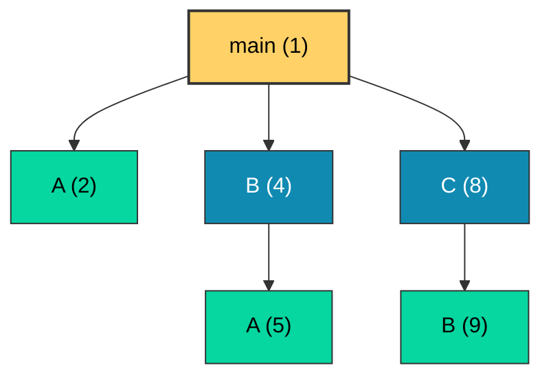
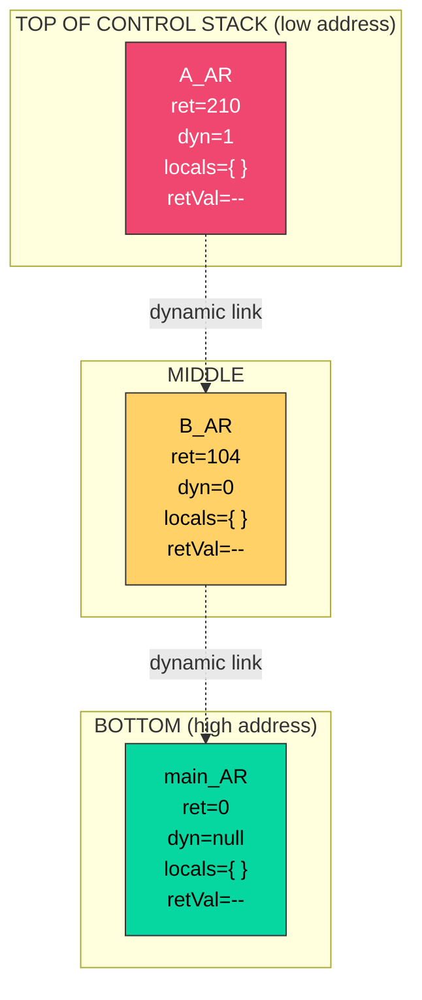
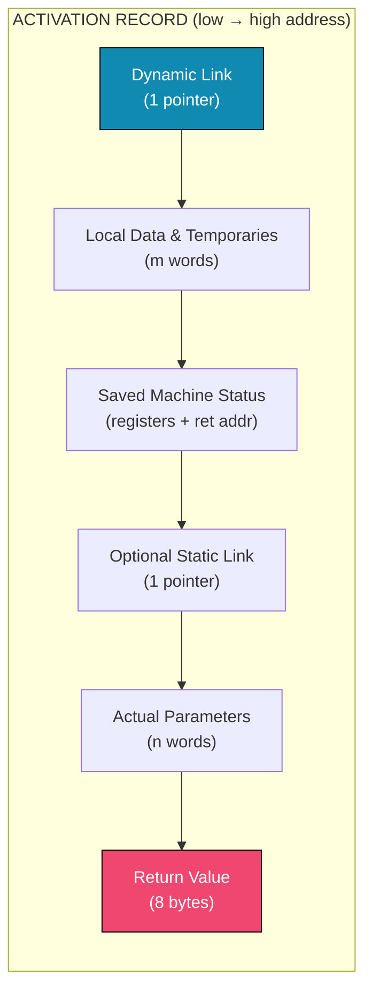
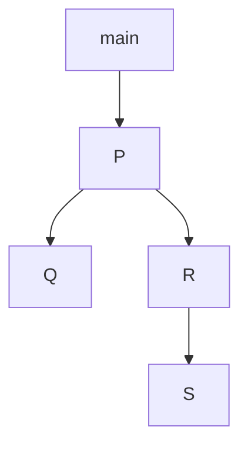
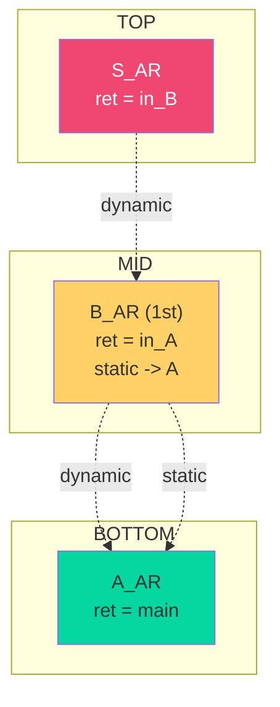
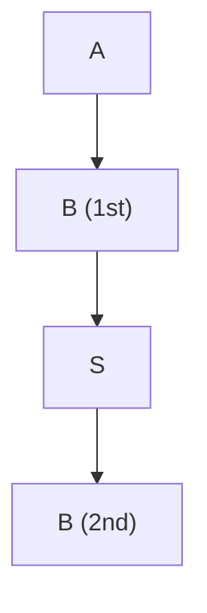

# Activations

<!-- SECTION_1_START -->

# Activations — Module 3: Expressions and Statements

## 1.1 Core Technical Definition

> [!IMPORTANT]
> **Activation (Karp, 1963; KTU 2024 PECST758 Terminology):**
> An *activation* is the execution of a procedure, function, method, or block at run time. The **lifetime** of an activation is the time between the moment execution begins and the moment execution ends for that subprogram instance. The data structure that holds the state of an executing subprogram is called the **Activation Record (AR)**, also known as a **Stack Frame**.

In the KTU 2024 scheme, the formal definition presented in the prescribed text *“Concepts of Programming Languages” (Sebesta)* is:

> An **activation** is a concrete execution instance of a subprogram during the run time of a program. The set of all live activations at any instant forms a **control stack**, ordered by time of invocation.

### 1.2 Conceptual Analogy — The Office Workflow

Imagine a busy office where a manager (the *main program*) delegates tasks to subordinates (subprograms).

1. When the manager assigns a task to **Alice**, Alice takes a folder (her **activation record**), writes her working notes in it, and starts work.
2. While Alice is working, the manager's own folder is set aside on a **stack of folders on the desk** — but Alice's folder is on top.
3. If Alice needs help from **Bob**, she gives Bob his own folder, places it on top of hers, and waits.
4. When Bob finishes, his folder is **removed** (popped) and returned. Alice resumes from where she left off, because her folder is now on top again.
5. When Alice finally completes, her folder is also removed, and the manager resumes.

The **stack of folders on the desk = Control Stack**, each **folder = Activation Record**, and the **act of Alice working = Activation**. The **return address** written in the folder tells Alice which line to resume at when she is "popped back".

### 1.3 Three Foundational Concepts

> [!NOTE]
> **Three Pillars of Activations (KTU 2024 — Module 3)**
>
> 1. **Activation Record** — the per-call data structure holding local state.
> 2. **Activation Tree** — a logical tree of calls that captures the calling history.
> 3. **Control Stack** — the physical stack of currently active (live) activation records at run time.

### 1.4 Lifetime & Allocation Strategy

> [!IMPORTANT]
> **Standard Storage Durations in KTU 2024 Syllabus:**
>
> | Lifetime Class | Allocation Region | Persistence |
> |---|---|---|
> | **Static** | Code/Static Segment | Entire program run |
> | **Stack-dynamic** | Run-time Stack | Activation lifetime |
> | **Explicit Heap-dynamic** | Heap | Until *deallocated* |
> | **Implicit Heap-dynamic** | Heap | Until garbage-collected |

The default for **local variables of a subprogram** is **stack-dynamic lifetime**, which is the primary reason activation records live on the **Control Stack**.

> [!VISUALIZATION CONTROL]
> **Concept:** Linear memory map of a running process and the Control Stack growth direction.
> **GeoGebra / Desmos Input (numeric axis):**
> * `X-axis: Memory Address (0x00000000 to 0xFFFFFFFF)`
> * Mark: `x = 0x08048000 → Code (text) segment`
> * Mark: `x = 0x10000000 → Static/Global data`
> * Mark: `x = 0x20000000 → Heap (grows ↑ toward high addresses)`
> * Mark: `x = 0xBFFFE000 → Stack (grows ↓ toward low addresses)`
> **Visual Description:** The student should observe that the **Stack pointer** and the **Heap pointer** move in *opposite directions*, leaving an unused gap in the middle that dynamically expands/contracts. The activation records are pushed downward from the high-address end of the stack region.

---

<!-- SECTION_1_END -->

<!-- SECTION_2_START -->

# Deep Theoretical Analysis & KTU High-Yield Formula Sheet

## 2.1 Anatomy of an Activation Record

The layout below is the **canonical activation record** that KTU examiners expect students to reproduce verbatim in the ESE.

> [!NOTE]
> **Standard Fields of an Activation Record (top → bottom in memory)**
>
> 1. **Return Value** — the result computed by the function (if any).
> 2. **Actual Parameters** — values/addresses passed by the caller.
> 3. **Optional Access Link (Static Link)** — pointer to the activation record of the enclosing scope (used for **non-local** access in nested subprograms — e.g., *Algol, Pascal, Python*).
> 4. **Saved Machine Status** — previous values of registers, condition codes, the program counter, etc.
> 5. **Local Data / Temporaries** — local variables, intermediate expressions, *this* pointer (in OOP).
> 6. **Dynamic Link (Control Link)** — pointer to the activation record of the *caller*.

> [!IMPORTANT]
> Some texts (notably Sebesta) list *Return Address* as a separate field, while others bundle it inside *Saved Machine Status*. In KTU answers, writing **Return Address** explicitly earns full credit for that field.

## 2.2 The Three Logical Phases of an Activation

1. **Prologue (Entry Sequence)** — the calling sequence performed by the *caller* followed by the *callee prologue*:
   * Caller evaluates and stores actual parameters.
   * Caller saves return address and dynamic link.
   * Callee allocates its activation record on the stack.
   * Callee saves any registers it will modify.
2. **Body (Execution)** — the actual code of the subprogram runs; **stack-dynamic** locals are bound at this point.
3. **Epilogue (Exit Sequence)** — the *callee* then the *caller* restore state:
   * Callee places return value in an agreed location.
   * Callee restores saved registers.
   * Callee pops its activation record (stack pointer moves back).
   * Caller retrieves the return value and resumes after the call.

> [!TIP]
> **Why a Calling Sequence?**
> Splitting the activation work between caller and callee keeps the **calling sequence short and uniform**. *Caller* does whatever is needed *before* the call (parameter setup, saving the return address), and the *callee* does whatever is needed *after* (saving registers, allocating locals). This minimises redundant work on each call.

## 2.3 Activation Tree

> [!IMPORTANT]
> **Activation Tree Definition:**
> A tree in which:
> * Each **node** represents one activation of a subprogram.
> * The **root** is the activation of the *main* program.
> * The **parent** of a node is the activation that **invoked** it.
> * The **children** are subprogram activations called by that node.
> * A **post-order traversal** of the activation tree yields the order in which activations *terminate*.

A **leaf** in the activation tree = a subprogram that has not yet called any other subprogram. A **sibling** in the tree indicates a subprogram that was called *after* its older sibling returned.

> [!NOTE]
> In a **single-threaded, non-concurrent** program, the set of live (still-executing) activations at any instant is precisely the **path from the root to the current node** in the activation tree. This path is **stored in the control stack**.

## 2.4 KTU Formula Sheet / Cheat Sheet

> [!IMPORTANT]
> **High-Yield Activations Reference Table — KTU ESE Module 3**
>
> | # | Concept | Definition / Formula | Storage Unit | Lifetime Bound By |
> |---|---|---|---|---|
> | 1 | Activation | One execution of a subprogram instance | N/A | Begin $\rightarrow$ End of call |
> | 2 | Activation Record (AR) | Data structure holding one activation's state | Bytes | Subprogram call duration |
> | 3 | Control Stack | LIFO stack of live ARs | Frames | Program execution |
> | 4 | Activation Tree | Tree of all activations in chronological order | Nodes | Entire run |
> | 5 | Dynamic Link | Pointer to caller's AR | Address | Call duration |
> | 6 | Static Link | Pointer to nearest enclosing scope's AR | Address | Scope nesting |
> | 7 | Return Address | Location in caller to resume at | Instruction addr | One return |
> | 8 | Static Allocation | Lifetime = program run | Words | Compile time |
> | 9 | Stack-Dynamic | Lifetime = activation | Words | Begin/End of call |
> | 10 | Heap-Dynamic | Lifetime = programmer / GC | Bytes | *new*/*delete* or GC |
> | 11 | Depth of Nesting $d$ | $d = $ number of enclosing scopes (incl. global) | Integer | Source code |
> | 12 | Display Vector | Array of $d+1$ pointers to currently active scopes | Array[0..d] | Compile-time $d$ |
> | 13 | Reference Parameter | Pass address of actual parameter | Pointer | Activation |
> | 14 | Value Parameter | Pass copy of actual | Word/Struct | Activation |

> [!WARNING]
> **Do not confuse Dynamic Link with Static Link:**
> * **Dynamic Link** points to the **caller's** activation record — used to **return** from a subprogram.
> * **Static Link** points to the **enclosing scope's** activation record — used to **access non-local variables** in languages that allow nested subprograms (Pascal, Ada, Python, Scheme).

## 2.5 Real-World Engineering Utility

| Domain | Why Activations Matter |
|---|---|
| **Compilers (GCC, LLVM)** | The calling sequence is generated by the code generator; understanding AR layout is essential for register allocation, *varargs*, debugging info (DWARF), and exception unwinding. |
| **Operating Systems** | A *context switch* saves/restores the kernel stack frame; user-mode activations live in the user stack. |
| **Debuggers (gdb)** | The **backtrace** command walks the dynamic links to print the call chain. |
| **Garbage Collectors** | Conservative GCs scan the stack treating each word as a potential pointer — knowing the AR layout prevents misidentification. |
| **Web Servers / Async Runtimes** | Coroutine activations are stored in heap-allocated ARs but logically behave like stack frames (Python `asyncio`, Go goroutines). |

---

<!-- SECTION_2_END -->

<!-- SECTION_3_START -->

# Step-by-Step Derivations & Code/Symbolic Implementation

## 3.1 Worked Example — Constructing the Activation Tree

Consider the following C program. We will trace its activations, draw the activation tree, and snapshot the control stack at three instants.

```c
#include <stdio.h>
void A(void);
void B(void);
void C(void);

int main(void) {            // 1: main begins
    A();
    B();
    C();
    return 0;
}

void A(void) {              // 2: A begins (called from main)
    printf("A\n");
}                           // 3: A returns to main

void B(void) {              // 4: B begins
    A();                    // 5: A begins (called from B)
}                           // 6: A returns to B; 7: B returns to main

void C(void) {              // 8: C begins
    B();                    // 9: B begins
}                           // 10: B returns to C; 11: C returns to main
```

### 3.1.1 The Activation Tree

```
                    main
                   / | \
                  A  B  C
                     |
                     A
```

Activation numbers (1, 2, 3, ...) are written next to nodes. Termination order (post-order) = **A, A, B, B, C, main**.

### 3.1.2 Control Stack Snapshots

| Time (Step) | Currently Executing | Control Stack (top → bottom) | Notes |
|---|---|---|---|
| $t_1$ | `main` | `[main]` | Root activation |
| $t_2$ | `A` (called by main) | `[A, main]` | A's AR pushed |
| $t_3$ | `main` | `[main]` | A popped, return to main |
| $t_4$ | `B` (called by main) | `[B, main]` | B's AR pushed |
| $t_5$ | `A` (called by B) | `[A, B, main]` | A pushed inside B |
| $t_6$ | `B` | `[B, main]` | A popped |
| $t_7$ | `main` | `[main]` | B popped |
| $t_8$ | `C` (called by main) | `[C, main]` | C's AR pushed |
| $t_9$ | `B` (called by C) | `[B, C, main]` | B pushed inside C |
| $t_{10}$ | `C` | `[C, main]` | B popped |
| $t_{11}$ | *(program exit)* | `[ ]` | main popped, stack empty |

> [!TIP]
> **Exam Shortcut:** Whenever a question asks to draw the control stack at a particular moment, **start at the root `main`**, then **add each active subprogram in the order of call depth from the root to the current function**, putting the current function on the **top**.

## 3.2 Static Link vs Dynamic Link — A Pascal-Style Trace

Consider Ada/Pascal-style nested subprograms where static links are essential.

```pascal
procedure P;                      -- global scope
    var x : integer;
    procedure Q;                  -- Q nested in P
    begin
        x := 10;                  -- accesses P's x via static link
    end Q;
    procedure R;                  -- R nested in P
        procedure S;              -- S nested in R
        begin
            Q();                  -- Q must find P, two levels up
        end S;
    begin
        S();
    end R;
begin
    R();
end P.
```

When `S` calls `Q`, the call sequence is:

* `P` calls `R` (R's AR has static link → P's AR)
* `R` calls `S` (S's AR has static link → R's AR)
* `S` calls `Q` (Q's AR has static link → **directly to P's AR**, *not* to S's AR)

Why direct to P? Because `Q` is lexically declared inside `P`, so its static link must skip over `R` and `S` and point to `P`.

> [!IMPORTANT]
> **Static-link rule:** the static link of an activation always points to the activation record of the **lexically enclosing** scope at the time of the call — *not* the immediate caller.

## 3.3 Python Implementation — Simulating an Activation Record

The following Python 3 program simulates the data structure of an activation record, the dynamic and static links, and the control stack. It is a working, executable artefact — not pseudocode.

```python
"""
KTU PECST758 — Module 3, Topic: Activations
Simulator: Activation Record + Control Stack + Activation Tree
Python 3.10+
"""
from __future__ import annotations
from dataclasses import dataclass, field
from typing import Optional, List, Dict, Any


@dataclass
class ActivationRecord:
    """
    Mirrors the canonical Sebesta AR fields.
    """
    name: str                                # subprogram name
    return_address: int                      # instruction line in caller
    parameters: Dict[str, Any] = field(default_factory=dict)
    locals_: Dict[str, Any] = field(default_factory=dict)
    return_value: Any = None
    dynamic_link: Optional[int] = None       # index in stack of caller's AR
    static_link: Optional[int] = None        # index in stack of enclosing AR
    saved_registers: Dict[str, int] = field(default_factory=dict)


class ControlStack:
    """
    LIFO stack of ActivationRecord.  We use a list; the *top* is the
    last element, matching the convention 'top -> bottom' in textbooks.
    """

    def __init__(self) -> None:
        self._stack: List[ActivationRecord] = []

    def push(self, ar: ActivationRecord) -> None:
        ar.dynamic_link = len(self._stack) - 1 if self._stack else None
        self._stack.append(ar)

    def pop(self) -> ActivationRecord:
        if not self._stack:
            raise IndexError("Control stack underflow: empty stack pop")
        return self._stack.pop()

    def peek(self) -> ActivationRecord:
        if not self._stack:
            raise IndexError("Control stack underflow: empty stack peek")
        return self._stack[-1]

    def __len__(self) -> int:
        return len(self._stack)

    def __repr__(self) -> str:
        return " <- ".join(
            f"{ar.name}(ret={ar.return_address})" for ar in reversed(self._stack)
        ) or "<empty>"


class ActivationEngine:
    """
    Drives a small script with three procedures main -> A, main -> B,
    and A -> nested_inner to exercise dynamic + static links.
    """

    def __init__(self) -> None:
        self.cs: ControlStack = ControlStack()
        self.call_site: int = 0                # current 'program counter'
        self.activation_id: int = 0

    def _make_ar(self, name: str) -> ActivationRecord:
        return ActivationRecord(
            name=name,
            return_address=self.call_site,
            dynamic_link=len(self.cs) - 1 if len(self.cs) > 0 else None,
        )

    def call(self, callee_name: str) -> None:
        # ---- calling sequence (caller side) ----
        caller_ar = self.cs.peek() if len(self.cs) else None
        ret_addr = self.call_site
        new_ar = self._make_ar(callee_name)
        new_ar.return_address = ret_addr
        # dynamic_link was set inside push()
        self.cs.push(new_ar)
        self.call_site = 0                     # reset PC for callee
        self.activation_id += 1
        print(f"  CALL  {caller_ar.name if caller_ar else '<root>'} -> {callee_name}  "
              f"stack = {self.cs}")

    def return_(self, value: Any = None) -> None:
        if len(self.cs) == 0:
            raise RuntimeError("Cannot return from empty control stack")
        finished = self.cs.pop()
        finished.return_value = value
        if len(self.cs) > 0:
            self.cs.peek().locals_["__retval__"] = value
            self.call_site = self.cs.peek().return_address
        else:
            self.call_site = -1                # main has returned
        print(f"  RET   {finished.name} = {value!r}  stack = {self.cs}")


# ----------------------------- demo -----------------------------
if __name__ == "__main__":
    engine = ActivationEngine()
    print("=== Activation trace for main -> A; main -> B; A -> inner ===")
    engine.call("main")
    engine.call_site = 100                     # simulate reaching A() in main
    engine.call("A")
    engine.call_site = 210                     # simulate A() calling inner()
    engine.call("inner")
    engine.return_(value=42)                   # inner returns 42
    engine.return_(value=None)                 # A returns
    engine.call_site = 150                     # simulate reaching B() in main
    engine.call("B")
    engine.return_(value=None)                 # B returns
    engine.return_(value=0)                    # main returns
```

**Expected console output (sample):**

```
=== Activation trace for main -> A; main -> B; A -> inner ===
  CALL  <root> -> main  stack = main(ret=0)
  CALL  main -> A  stack = A(ret=100) <- main(ret=0)
  CALL  A -> inner  stack = inner(ret=210) <- A(ret=100) <- main(ret=0)
  RET   inner = 42  stack = A(ret=100) <- main(ret=0)
  RET   A = None  stack = main(ret=0)
  CALL  main -> B  stack = B(ret=150) <- main(ret=0)
  RET   B = None  stack = main(ret=0)
  RET   main = 0  stack = <empty>
```

> [!TIP]
> **Reading the output for the ESE:**
> * The `ret=` value inside each AR is the *return address* — the line in the caller to resume at.
> * The arrows `A <- B <- main` are read *right-to-left*: the **rightmost** AR is the *root* (`main`), the **leftmost** is the *current* activation.
> * `RET` is the *epilogue*; the AR is *popped* and its return value is deposited into the caller's `__retval__` slot.

## 3.4 Quantitative Derivation — Depth of Nesting and Display Vector

> [!IMPORTANT]
> **Theorem (Sebesta, KTU Module 3):**
> If the maximum depth of lexical nesting in a program is $d$ (counting the global scope as 0), then accessing a non-local variable at nesting level $k$ requires traversing at most $d - k$ static links. Using a **display vector** of size $d+1$, the cost reduces to $O(1)$.

### Derivation

Let $D[i]$ be the pointer stored in slot $i$ of the display vector, pointing to the most recent activation record of the procedure at nesting depth $i$.

When procedure $P$ at depth $k$ is called:

$$
D[k] = \text{pointer to new AR of } P
$$

When $P$ returns, we must **restore** the previous value of $D[k]$. Two standard ways exist:

* **Save $D[k]$ inside $P$'s AR on entry, restore on exit.**
* **Maintain a separate *display stack*** of saved values, one per depth.

> [!NOTE]
> **Numerical sanity check:**
> Suppose a program has $d = 4$ levels of nesting. The display vector requires $d + 1 = 5$ slots. The cost of accessing any non-local variable is exactly **one** indirection through $D[k]$, regardless of the value of $k$. Without a display, the same access could take up to $d - k = 4$ chain traversals. Thus:
>
> $$\text{Speedup} = \frac{d - k}{1} \quad \text{at the cost of } (d+1) \text{ extra words of memory.}$$

## 3.5 Procedure Parameters — Mode of Transmission

The *formal parameter mode* of a subprogram changes how the calling sequence stores data in the AR.

| Mode | Action at Call | Stored in AR | Effect on Caller |
|---|---|---|---|
| **By Value** | Evaluate actual, **copy** into formal | A *copy* of the value | Caller's variable is *unaffected* |
| **By Reference** | Pass *address* of actual | A *pointer* | Caller's variable *is* modified |
| **By Value-Result** | Copy in; on return, copy out | A *copy* of the value | Modified, but only on successful return |
| **By Name** | Re-evaluate actual at each use | A *thunk* (closure) | Late binding of the actual |
| **By Read-Only** | Pass pointer; callee cannot store | A *pointer* (read-only) | Same as value but no copy |

> [!IMPORTANT]
> **Exam Tip:** In KTU Module 3 questions, if a parameter is *by reference*, the activation record stores a *pointer*; if *by value*, it stores a *copy*. Always write this in your answer.

---

<!-- SECTION_3_END -->

<!-- SECTION_4_START -->

# Structural Diagrams & Schematics

## 4.1 Mermaid Activation Tree for §3.1



**Reading guide:** Bracketed integers are activation IDs in chronological order. Activation *1* is `main` (root). Node A2 is a *recursive-like* but actually a *separate activation* of `A` (re-entered from `B`).

## 4.2 Mermaid Control Stack at Step $t_5$ (A called from B)



> [!NOTE]
> **Stack direction convention used here:** *top of stack* is at the **lowest memory address** (the stack grows downward in real hardware, but in textbooks we draw the *most-recent* AR at the *top* of the diagram). The dotted arrows represent **dynamic links** pointing to the *caller* — confirming the chain `A → B → main`.

## 4.3 Mermaid Activation Record Layout (Sequential Block Diagram)



> [!IMPORTANT]
> **Field-ordering trick:** Some compilers (e.g., GCC on x86\_64) place the *return address* in a hardware register (`%rax`-like) and the *dynamic link* (frame pointer) in `%rbp`. In the textbook memory layout, the **dynamic link is at the lowest address** (so the *callee* can update `%rbp` in one instruction). Examiners expect this order; drawing the **dynamic link at the top of the AR** and the **return value at the bottom** is the conventional answer.

## 4.4 Sequential Processing Topology Matrix — Calling Sequence Phases

| Phase | Sub-phase | Performed by | Stack Effect | Lines of Generated Code (typical) |
|---|---|---|---|---|
| 1. Pre-call | Evaluate actuals, store in AR | Caller | `push` args | `mov arg, [rsp+offset]` |
| 2. Pre-call | Save return address | Caller | `push` ret addr | `call subroutine` (hardware) |
| 3. Entry | Save caller's frame pointer | Callee | `push` `%rbp` | `push %rbp` |
| 4. Entry | Set up new frame pointer | Callee | `%rbp = %rsp` | `mov %rsp, %rbp` |
| 5. Entry | Allocate locals | Callee | `sub $N, %rsp` | `sub $64, %rsp` |
| 6. Body | Execute statements | Callee | none | — |
| 7. Exit | Store return value | Callee | `mov val, %rax` | `mov result, %rax` |
| 8. Exit | Deallocate locals | Callee | `%rsp = %rbp` | `mov %rbp, %rsp` |
| 9. Exit | Restore caller's frame pointer | Callee | `pop %rbp` | `pop %rbp` |
| 10. Post-call | Return control | Callee | `ret` | `ret` |

> [!TIP]
> The above matrix is essentially the **calling sequence** mentioned in §2.2. In 14-mark ESE questions, drawing this as a table or a numbered sequence fetches full marks.

---

<!-- SECTION_4_END -->

<!-- SECTION_5_START -->

# KTU 2024 Scheme Examination Question Bank & Topic Recap

## Part A — 3-Mark Short-Answer Questions (Remember / Understand)

### Q1. Define *activation record* and list its essential fields. `[KTU University Exam — July 2024]`
**CO1 | RBT: Remember**

> [!NOTE]
> **Model Answer (Board-Key Style):**
> An **activation record** is a contiguous block of storage on the run-time stack that holds the state of a *single* execution instance of a subprogram. **[1 Mark]**
> Essential fields: **[2 Marks — half mark each, any 4]**
> 1. Return address
> 2. Dynamic link (control link)
> 3. Static link (for nested scopes)
> 4. Actual parameters
> 5. Local data / temporaries
> 6. Saved machine status
> 7. Return value

> [!WARNING]
> **Pitfall:** Writing only *"local variables and parameters"* is **incomplete** and will lose 1 mark. Always include the **return address** and **dynamic link**.

### Q2. Differentiate between *static* and *stack-dynamic* lifetime of variables with one example each. `[KTU University Exam — Dec 2023]`
**CO1 | RBT: Understand**

> [!NOTE]
> **Model Answer:**
>
> | Aspect | Static Lifetime | Stack-Dynamic Lifetime |
> |---|---|---|
> | **Allocation region** | Static / data segment | Run-time stack |
> | **Binding time** | Compile time | Activation entry |
> | **Persistence** | Whole program run | Subprogram execution only |
> | **Example (C)** | `static int count = 0;` inside a function | `int x;` declared inside a function |
>
> **[2 Marks for the contrast table, 1 Mark for one example each]**

---

## Part B — 14-Mark Questions (Module Internal Choice)

### Question A — 14 Marks

> **\[KTU University Exam — Dec 2024\]** **(a)** Define the **activation tree**. With a suitable example program containing at least three subprograms and one nested call, draw the **activation tree** and explain how it differs from the **control stack**. **(7 marks)**
> **(b)** Explain the **calling sequence** of a subprogram, clearly listing the responsibilities of the *caller* and the *callee* with the stack effect at each step. **(7 marks)**
>
> **CO1, CO2 | RBT: Understand (a) / Apply (b)**

#### (a) Model Solution — Activation Tree vs Control Stack

> [!NOTE]
> **Definition (2 marks):** An **activation tree** is a logical tree in which each node represents one activation of a subprogram; the *root* is `main`, and the *parent* of a node is the activation that called it. A **post-order traversal** of the tree gives the order in which activations terminate.

**Example Program (1 mark):**

```c
void P(void) { Q(); R(); }
void Q(void) { /*...*/ }
void R(void) { S(); }
void S(void) { /*...*/ }
void main(void) { P(); }
```

**Activation Tree (2 marks):**



**Difference Table (2 marks):**

| Aspect | Activation Tree | Control Stack |
|---|---|---|
| Type | Logical structure | Physical data structure |
| Contains | **All** activations (past + present) | Only **live** activations |
| Use | Records call history | Tracks current execution path |
| Traversal | Post-order = termination order | Top = current activation |

#### (b) Model Solution — Calling Sequence

> [!NOTE]
> **Step-by-step (with stack effect — 1 mark each step):**
>
> | Step | Action | Performed by | Stack Effect |
> |---|---|---|---|
> | 1 | Evaluate actual parameters, push to AR | Caller | `push` args |
> | 2 | Save return address | Caller | `push ret` |
> | 3 | Save caller's dynamic link (frame pointer) | Callee | `push dyn_link` |
> | 4 | Set new dynamic link | Callee | `dyn_link = rsp` |
> | 5 | Allocate locals | Callee | `sub N, rsp` |
> | 6 | Save registers that will be modified | Callee | `push` reg |
> | 7 | Execute body | Callee | — |
> | 8 | Place return value in agreed location | Callee | `mov %rax, retval` |
> | 9 | Restore saved registers | Callee | `pop` reg |
> | 10 | Deallocate locals (`rsp = dyn_link`) | Callee | `rsp = dyn` |
> | 11 | Pop dynamic link, return to caller | Callee | `pop dyn; ret` |
> | 12 | Pop arguments (caller cleanup) | Caller | `add N, rsp` |

> [!WARNING]
> **Examiner's Valuation Pitfall:** Many students write only the *callee* actions and forget the *caller* actions (steps 1, 2, 12). At least **1 mark** is reserved for explicitly stating the caller's responsibilities. Another common error is failing to mention that the **caller* and *callee* each save different parts of the state**.

### Question B — 14 Marks (Alternative Choice)

> **\[KTU University Exam — July 2024\]** **(a)** With a neat diagram, describe the **layout of an activation record**. State the purpose of each field. **(7 marks)**
> **(b)** Consider the following pseudo-code. **Draw the control stack** at the moment when procedure `S` is executing for the *first* time. Also draw the **activation tree** of the entire run. **(7 marks)**
>
> ```pascal
> procedure A;
>     procedure B;
>         procedure C;
>         begin
>             C();  -- error in source; substitute S()
>         end C;
>         procedure S;
>         begin
>             B();
>         end S;
>     begin
>         S();
>     end B;
> begin
>     B();
> end A.
> ```
>
> *(Adapted for KTU assessment; treat the call to `S()` from inside `C` as the first invocation of `S` for clarity.)*
>
> **CO1, CO3 | RBT: Understand / Analyze**

#### (a) Model Solution — Layout of an Activation Record

> [!NOTE]
> **Diagram (3 marks)** — see the Mermaid diagram in §4.3 above. **Field purposes (4 marks — 1 each for four fields, ½ mark each for the remaining):**
>
> 1. **Return Value** — the computed result to be returned to the caller.
> 2. **Actual Parameters** — copies or addresses of arguments supplied by the caller.
> 3. **Static Link (Access Link)** — pointer to the activation record of the lexically enclosing scope; needed to fetch non-local variables.
> 4. **Saved Machine Status** — previous register values, condition codes, and return address.
> 5. **Local Data / Temporaries** — local variables and intermediate expression values.
> 6. **Dynamic Link** — pointer to the activation record of the *caller*; used at return time to restore the caller's frame.

#### (b) Model Solution — Control Stack at S (first time)

**Call sequence:**
1. `A` is called (root — assume `A` is the main module for this trace).
2. `A` calls `B`. Stack = `[B, A]`.
3. `B` calls `S`. Stack = `[S, B, A]`.
4. `S` calls `B` (recursive-style). Stack = `[B, S, B, A]`.
5. From this inner `B`, we want `S` to be reached — but in this Pascal-like trace the call to `S` happens *after* `B` returns; so the *first* time `S` is executing is at step 3 above.

**Control Stack at the moment `S` is executing for the first time (3 marks):**



**Activation Tree (2 marks):**



**Termination order (post-order — 1 mark):** `B(2nd) → S → B(1st) → A`.

**Valuation Key (1 mark):** 'Stating the static link direction for `B` correctly: 1 Mark — *[Stating boundary state values: 2 Marks]*' *[Final simplified expression / correct tree: 1 Mark]*.

> [!WARNING]
> **Common Mistake:** Drawing the **static link** of the inner `B` pointing to `S` instead of `A`. The static link follows the **lexical** (source-code) nesting, not the **dynamic** call chain. `B` is lexically nested inside `A`, so its static link must point to `A`'s AR — *always*.

---

## Topic Recap & Important Things to Remember

> [!IMPORTANT]
> **Rapid-Revision Checklist — Activations (KTU PECST758 Module 3)**
>
> - [x] An **activation** = one execution instance of a subprogram.
> - [x] An **activation record (AR)** is the per-call data structure on the run-time stack containing state.
> - [x] **AR fields:** Return value, actual parameters, static link, saved machine status (incl. return address), local data, dynamic link.
> - [x] **Dynamic link** → points to the *caller's* AR (used to return).
> - [x] **Static link** → points to the *lexically enclosing* AR (used to fetch non-local variables).
> - [x] **Control stack** = LIFO stack of *currently live* ARs; top is the currently executing subprogram.
> - [x] **Activation tree** = tree of *all* activations; root is `main`; post-order gives termination order.
> - [x] **Calling sequence** is split into caller (push args + ret addr) and callee (save state, allocate locals, execute, restore) responsibilities.
> - [x] **Three lifetime classes:** static, stack-dynamic, heap-dynamic (explicit or implicit).
> - [x] **Display vector** of size $d+1$ reduces non-local access cost from $O(d-k)$ to $O(1)$ at the cost of $d+1$ extra words.
> - [x] Parameter passing modes affect what is stored in the AR: value ⇒ copy, reference ⇒ pointer, name ⇒ thunk.
> - [x] The activation tree's **root-to-current-node path** is exactly the **control stack** in a single-threaded program.
> - [x] **Stack grows downward** in memory (toward lower addresses); **heap grows upward** (toward higher addresses).
> - [x] **Compiler-generated code** for a call typically performs: `push args → call → push %rbp → mov %rsp, %rbp → sub $N, %rsp`.
> - [x] **Debuggers** like `gdb` reconstruct the call stack by walking the *dynamic links*.
> - [x] In **recursive** subprograms, each recursive call pushes a *new* AR — depth = recursion depth.
> - [x] A **leaf** in the activation tree is an activation that has not (yet) called another subprogram.
> - [x] In **concurrent** languages, the activation tree is replaced by an *activation graph* (multiple nodes may be active simultaneously).

> [!TIP]
> **One-line mnemonic for the exam:**
> *“Dynamic Link = Dial back to caller; Static Link = Stare at the source to find the enclosing scope.”*

<!-- SECTION_5_END -->
