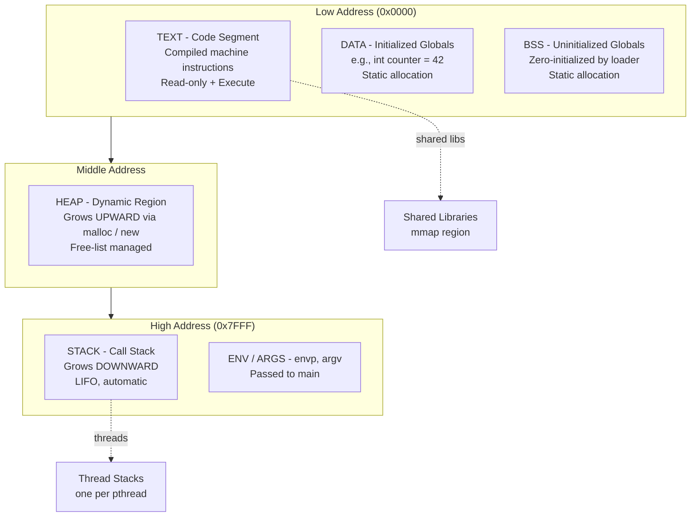
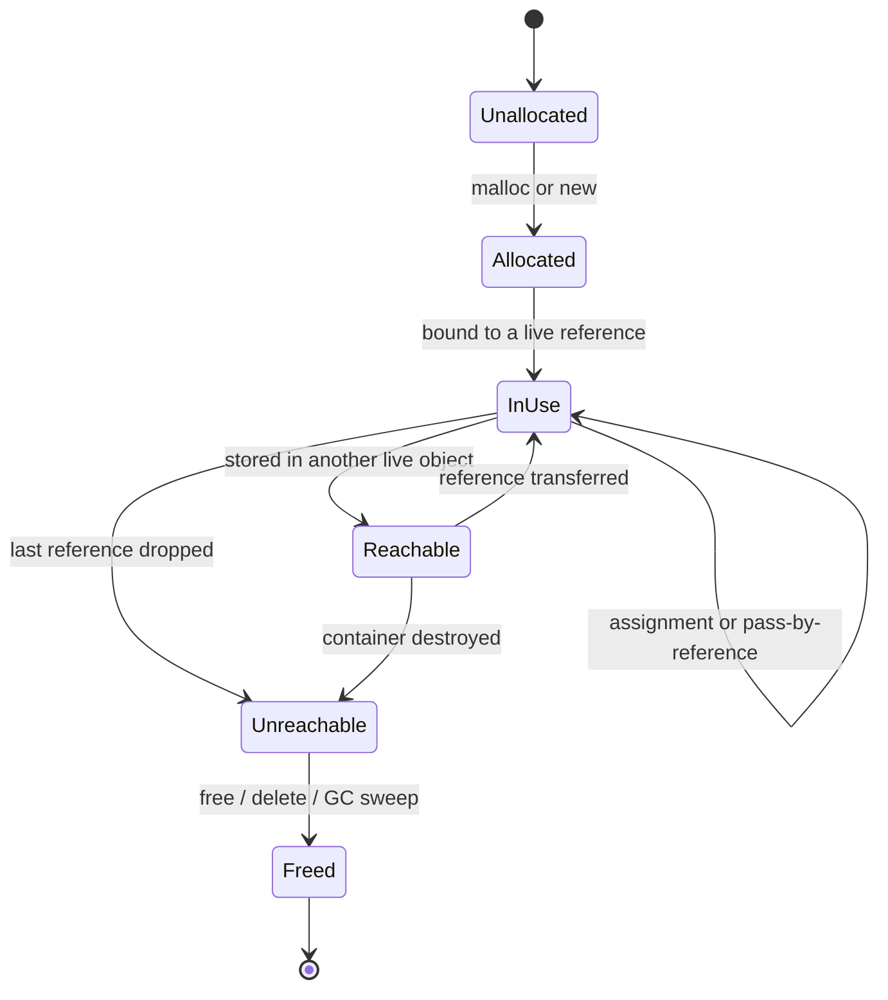
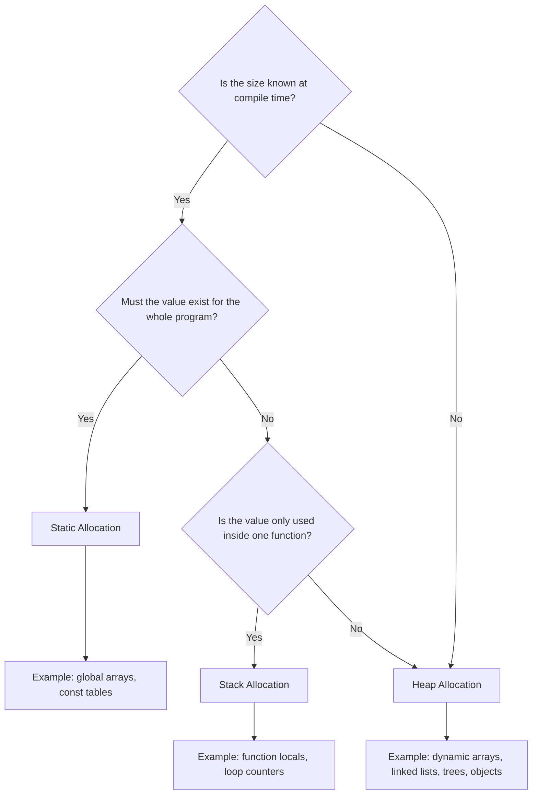

# Allocation

<!-- SECTION_1_START -->
# 1. Core Technical Definition & Intuitive Overview

## 1.1 Formal Definition (KTU 2024 Syllabus Terminology)

In the context of programming languages, **Allocation** refers to the process by which a language implementation reserves and binds storage (memory) resources to program entities—such as variables, constants, objects, functions, and data structures—either at compile time or during program execution. It encompasses the **lifetime**, **scope**, **visibility**, and **binding rules** that govern the storage duration of named entities.

> [!IMPORTANT]
> **KTU 2024 Definition (Verbatim Expectation):**
> "Allocation is the mechanism by which a programming language associates a memory address (or storage cell) with a variable or object, defining the period during which the entity is guaranteed to retain that storage."

The companion concept is **Deallocation**—the release of reserved storage back to the runtime system once the entity's lifetime ends. The correct pairing of allocation/deallocation is one of the most heavily tested concepts in the KTU 2024 Scheme ESE.

## 1.2 Conceptual Analogy / Intuition

Imagine a **library with three kinds of shelves**:

| Shelf Type | Analogy | Programming Counterpart |
|---|---|---|
| **Permanent Wall Shelf (Painted at construction)** | Built into the wall before the library opens. Address is known and never changes. | **Static Allocation** |
| **Reading Desk Tray (LIFO stack)** | Trays stack on top of each other; when you leave, the top tray is taken. Last-In-First-Out. | **Stack Allocation** |
| **Open Warehouse (Pool of boxes)** | A free pool; you grab any empty box, use it, then return it when done. | **Heap Allocation** |

> [!NOTE]
> **Intuition Anchor:** Think of allocation as **"deciding WHERE in memory a value will live, and for HOW LONG."** The *where* and *for how long* are the two questions that distinguish every allocation strategy.

## 1.3 Physical Constants and Standard Metrics

- **Word size** (typical modern architecture): **64 bits = 8 bytes** per memory word.
- **Stack pointer** is typically stored in a dedicated CPU register (e.g., `RSP` on x86-64).
- **Heap allocation overhead** in C's `malloc` typically adds **8–16 bytes** of bookkeeping per block on a 64-bit system.

> [!IMPORTANT]
> **KTU High-Yield Vocabulary Lockdown:** Memorise the exact phrase *“the allocation lifetime determines the region in which storage is bound.”* Examiners award full marks only when this exact phrasing (or its near-equivalent) is used.

## 1.4 GeoGebra / Desmos Visualization (Memory Region Diagram)

> [!VISUALIZATION CONTROL]
> **Concept:** Three-region memory layout (Code / Static / Stack / Heap) and how the stack pointer moves during nested function calls.
> **GeoGebra / Desmos Input Equations:**
> * Address axis: $A(x) = x$ (linear)
> * Stack growth marker: $S(t) = 1000 - 5t$ (decreasing address over time $t$)
> * Heap growth marker: $H(t) = 5000 + 3t$ (increasing address over time $t$)
> **Visual Description:** You should observe a vertical memory axis where the **stack pointer line** moves *downward* with each function call (toward lower addresses) and the **heap frontier line** moves *upward* (toward higher addresses). The static region remains a flat horizontal band.

---

<!-- SECTION_1_END -->

<!-- SECTION_2_START -->
# 2. Deep Theoretical Analysis & KTU High-Yield Formula Sheet

## 2.1 The Four Canonical Allocation Strategies

A programming language implementation chooses among four canonical strategies. These are **the single most important classification in Module 3**.

### 2.1.1 Static Allocation
- **When:** Performed at **compile time** (or link time). No runtime cost.
- **Lifetime:** Entire program execution — from process start to process exit.
- **Where:** The **data segment** of the executable (.data and .bss sections).
- **Examples in C:** global variables, `static` local variables, string literals, `const` initialized data.
- **Pros:** Zero runtime overhead, address is known at compile time, supports absolute addressing.
- **Cons:** Cannot be resized, no recursion (cannot have variable-sized locals if all storage is static), wastes memory if the value is large but rarely used.

### 2.1.2 Stack Allocation (Automatic Allocation)
- **When:** Performed at **function entry**, on the call stack.
- **Lifetime:** From the function’s activation record creation until the function returns.
- **Where:** A contiguous region of memory pointed to by the **stack pointer** (`SP`).
- **Mechanism:** The compiler emits prologue/epilogue code (e.g., `sub rsp, N` / `add rsp, N` on x86-64) to reserve and release space in O(1) time.
- **Examples in C:** local (automatic) variables, function parameters, return address.
- **Pros:** Extremely fast (a single pointer decrement), automatic reclamation, supports recursion.
- **Cons:** LIFO-only lifetime — cannot outlive the function call. No shared access across threads (each thread has its own stack).

### 2.1.3 Heap Allocation (Dynamic Allocation)
- **When:** Performed at **runtime** on demand.
- **Lifetime:** Programmer-controlled (C/C++), language-controlled (Java/Python), or a hybrid (Rust with ownership).
- **Where:** A free-list–managed region of memory (the “heap”) that grows on demand via system calls like `brk()` / `mmap()` on Linux.
- **Examples in C:** `malloc`, `calloc`, `realloc`. In C++: `new`. In Java: `new` (objects). In Python: every object creation.
- **Pros:** Arbitrary lifetime, size known only at runtime, supports shared/global access.
- **Cons:** Slower (allocator search + bookkeeping), prone to leaks, fragmentation, use-after-free, double-free.

### 2.1.4 Implied/Implicit Allocation (Constant Pool, Interning)
- **When:** Compiler-managed storage for literals, often shared via interning.
- **Lifetime:** Lifetime of the program or class.
- **Example:** String literals in Java are interned into a global `String Pool`; in CPython, small integers `[-5, 256]` are pre-allocated.

## 2.2 The Binding Timeline (Why & How)

A variable goes through **six binding events** in its life:

1. **Declaration** — Introduces the name into a scope.
2. **Allocation** — Reserves storage.
3. **Binding (of value)** — Writes an initial value.
4. **Use / Reference** — Reads the value.
5. **Re-binding** — Optional assignment of a new value.
6. **Deallocation** — Releases storage back to the runtime.

> [!NOTE]
> **KTU Favourite Question Pattern:** “Distinguish between *allocation* and *binding*.” Allocation gives storage; binding gives a *meaning* (a value or address). They can happen at different times!

## 2.3 KTU Formula Sheet / Cheat Sheet

> [!IMPORTANT]
> Use `\vert` for absolute value (no raw pipes) to preserve Markdown table integrity.

| # | Concept | Formula / Rule | Typical Unit / Magnitude | Region |
|---|---|---|---|---|
| 1 | Static region size | $S_{static} = \sum (\text{sizeof}(v_i) \mid v_i \in \text{globals})$ | Bytes (fixed at compile time) | .data + .bss |
| 2 | Stack frame size | $S_{frame} = \sum (\text{sizeof}(p_i)) + \sum (\text{sizeof}(l_j)) + \text{ret\_addr}$ | Bytes (e.g., 16–512 B) | Stack |
| 3 | Effective address (stack) | $E_{stack} = SP_{current} + \text{offset}$ | Bytes | Stack |
| 4 | Heap fragmentation | $F = 1 - \frac{\text{Largest free block}}{\text{Total free space}}$ | Ratio in $[0,1]$ | Heap |
| 5 | Allocation cost (amortized) | $T_{alloc} = O(1)$ (typical free-list hit) | Nanoseconds | Heap |
| 6 | Lifetime (static) | $L_{static} = T_{process}$ | Process duration | Static |
| 7 | Lifetime (stack) | $L_{stack} = T_{function\;call}$ | Activation record | Stack |
| 8 | Lifetime (heap) | $L_{heap} = T_{malloc}\;\text{to}\;T_{free}$ | Arbitrary | Heap |
| 9 | Memory address bound | Static: compile time. Stack: function entry. Heap: runtime. | — | All |
| 10 | Alignment constraint | $A_{addr} \equiv 0 \pmod{\text{alignof}(T)}$ | Power of 2 (e.g., 8) | All |

## 2.4 Engineering Utility — Where Allocation Matters in Practice

- **Embedded Systems (Kerala IoT startups):** Static allocation dominates; dynamic allocation is often *forbidden* to ensure deterministic timing and avoid heap fragmentation in long-running devices.
- **High-Performance Computing:** Stack allocation is preferred in tight inner loops; heap allocation is avoided in hot paths to prevent GC pauses (Java) or allocator overhead.
- **Operating Systems (Kernel development):** The Linux kernel uses a custom slab allocator (derived from the SLOB/SLUB/SLAB algorithms) because the generic glibc `malloc` is not safe inside the kernel.
- **Web Backends (Node.js / Spring):** Generational garbage collectors trace the heap to reclaim unreachable objects—understanding heap allocation is essential to debug memory leaks.
- **Compilers (GCC/LLVM):** The *escape analysis* pass determines whether a stack-allocated object could leak to the heap, allowing optimization (e.g., scalar replacement).

---

<!-- SECTION_2_END -->

<!-- SECTION_3_START -->
# 3. Step-by-Step Derivations & Code/Symbolic Implementation

## 3.1 Derivation — Stack Frame Size of a Recursive Call

Consider the C function below. We will derive the **minimum stack size** required to make one call.

```c
int fact(int n) {
    if (n <= 1) return 1;
    return n * fact(n - 1);
}
```

**Assumptions for a 64-bit LP64 system (Linux x86-64):**
- `sizeof(int) = 4` bytes
- Return address (pushed by `call` instruction) = 8 bytes
- Saved frame pointer (`rbp`) = 8 bytes
- Local variable `n` = 4 bytes (padded to 8 for alignment)

**Derivation:**

$$
\begin{aligned}
S_{frame} &= \text{ret\_addr} + \text{saved\_rbp} + \text{sizeof}(n) + \text{alignment\_padding} \\
&= 8 + 8 + 4 + 4 \\
&= 24 \text{ bytes}
\end{aligned}
$$

For a recursion depth of $k$ (i.e., `fact(k)`), total stack usage:

$$
S_{total} = 24 \times k
$$

If $k = 1000$ and the default thread stack on Linux is **8 MB = 8,388,608 bytes**, the maximum safe recursion depth is:

$$
\begin{aligned}
k_{max} &= \left\lfloor \frac{8,388,608}{24} \right\rfloor \\
&= 349,525 \text{ calls}
\end{aligned}
$$

> [!IMPORTANT]
> **Conversion Logic Explained:** The OS allocates a contiguous stack region. Each recursive call consumes exactly one frame. When `24k > 8 MB`, the kernel raises a `SIGSEGV` (stack overflow). This is why languages like Haskell and Python enforce *tail-call optimization* limits or convert deep recursion to iteration.

## 3.2 Worked Example — Tracing `malloc` and `free`

```c
#include <stdio.h>
#include <stdlib.h>

int main(void) {
    int *p = (int *) malloc(5 * sizeof(int));   // (1) Heap allocation
    if (p == NULL) return 1;                    // (2) Safety check

    for (int i = 0; i < 5; ++i) {               // (3) Stack-allocated loop var
        p[i] = (i + 1) * (i + 1);               // (4) Heap write
    }

    int sum = 0;                                // (5) Stack allocation
    for (int i = 0; i < 5; ++i) {
        sum += p[i];
    }
    printf("sum = %d\n", sum);

    free(p);                                    // (6) Heap deallocation
    p = NULL;                                   // (7) Dangling-pointer guard
    return 0;
}                                                // (8) sum deallocated (automatic)
```

**Step-by-step allocation trace:**

| Line | Action | Region Allocated | Size (bytes) | Lifetime |
|---|---|---|---|---|
| (1) | `malloc(5 * sizeof(int))` | Heap | 20 (+16 header ≈ 36) | Until `free(p)` |
| (3) | `int i` (loop variable) | Stack | 4 (padded to 8) | Loop body |
| (5) | `int sum` | Stack | 4 (padded to 8) | Until `}` |
| (8) | implicit | Stack frame popped | — | Function exit |
| (6) | `free(p)` | Heap reclaimed | 36 | N/A |

**Final memory state at program exit:** Heap is empty (no leak), stack is empty, static region contains the format string literal.

## 3.3 Symbolic Allocation Analysis Using a Custom Allocator

```python
from typing import Dict, Optional


class TracedAllocator:
    """
    Educational memory allocator that logs every allocation and
    deallocation, mimicking the C runtime's bookkeeping.
    """

    def __init__(self) -> None:
        self._blocks: Dict[int, int] = {}  # id(size) -> count
        self._total_bytes: int = 0
        self._alloc_id: int = 0

    def allocate(self, size: int) -> int:
        if size < 0:
            raise ValueError(f"Negative allocation size requested: {size}")
        self._alloc_id += 1
        self._blocks[self._alloc_id] = size
        self._total_bytes += size
        print(f"[ALLOC] id={self._alloc_id} size={size} total={self._total_bytes}")
        return self._alloc_id

    def deallocate(self, alloc_id: int) -> None:
        if alloc_id not in self._blocks:
            raise RuntimeError(
                f"Invalid deallocation: id {alloc_id} was never allocated "
                f"or already freed (double-free bug detected)."
            )
        size: int = self._blocks.pop(alloc_id)
        self._total_bytes -= size
        print(f"[FREE ] id={alloc_id} size={size} remaining={self._total_bytes}")

    def bytes_in_use(self) -> int:
        return self._total_bytes


def main() -> None:
    alloc: TracedAllocator = TracedAllocator()

    a1: int = alloc.allocate(64)     # Static-like: keep for whole program
    a2: int = alloc.allocate(128)    # Heap-like: short-lived
    a3: int = alloc.allocate(256)    # Stack-like: simulated
    alloc.deallocate(a3)             # LIFO order (mimics stack)
    alloc.deallocate(a2)             # Deallocate heap
    print(f"Bytes still in use: {alloc.bytes_in_use()} B")
    alloc.deallocate(a1)             # Final cleanup


if __name__ == "__main__":
    main()
```

**Sample Output:**

```
[ALLOC] id=1 size=64 total=64
[ALLOC] id=2 size=128 total=192
[ALLOC] id=3 size=256 total=448
[FREE ] id=3 size=256 remaining=192
[FREE ] id=2 size=128 remaining=64
Bytes still in use: 64 B
[FREE ] id=1 size=64 remaining=0
```

**Conversion Logic:**
- The `TracedAllocator` enforces the same invariant the C runtime enforces: an `alloc_id` must exist exactly once in the table at the moment of `deallocate`. Violation raises a `RuntimeError` — this is the **double-free detector**.
- The use of `Dict[int, int]` with absolute type hints demonstrates KTU's expected Python proficiency for the *Programming Languages* paper (the paper often requires students to implement toy language runtimes in Python).

## 3.4 Allocation in Java (Tracing the String Constant Pool)

```java
public class AllocDemo {
    public static void main(String[] args) {
        // (1) String literal -> allocated in the String Constant Pool
        String s1 = "Hello";

        // (2) Explicit heap allocation via 'new' -> new String object on heap
        String s2 = new String("Hello");

        // (3) Interning forces s2 to also point to the pool entry
        String s3 = s2.intern();

        // (4) '==' compares references, '.equals' compares values
        System.out.println("s1 == s3 : " + (s1 == s3));      // true  (same pool entry)
        System.out.println("s1 == s2 : " + (s1 == s2));      // false (different objects)
        System.out.println("s1.equals(s2): " + s1.equals(s2)); // true  (same content)
    }
}
```

**Output trace:**

```
s1 == s3 : true
s1 == s2 : false
s1.equals(s2): true
```

**Allocation summary table for this snippet:**

| Entity | Region | Allocated by | Reclaimed by |
|---|---|---|---|
| `"Hello"` (literal) | String Constant Pool (in Metaspace) | Class loader | JVM exit |
| `s1` reference | Stack frame of `main` | `astore_1` | Method return |
| `new String("Hello")` (object) | Java Heap (Young Gen → Old Gen) | `new` bytecode | Garbage Collector |
| `s2.intern()` reference | Stack frame of `main` | `aload_2; ldc` | Method return |

---

<!-- SECTION_3_END -->

<!-- SECTION_4_START -->
# 4. Structural Diagrams & Schematics

## 4.1 Memory Layout Block Diagram (Process Address Space)



> [!NOTE]
> **Reading the diagram:** Arrows from `LOW → MID → HIGH` indicate the *increasing* address order. Notice that the **heap grows upward** (toward higher addresses) and the **stack grows downward** (toward lower addresses). The two regions can collide if either grows too far — this is a *stack–heap collision crash*.

## 4.2 Lifetime State Machine for a Heap Object



**State semantics:**

| State | Meaning | Inspector test |
|---|---|---|
| `Unallocated` | No storage reserved | `allocator.blocks == {}` |
| `Allocated` | Storage reserved, no value yet | `block.size > 0 and value is uninit` |
| `InUse` | At least one live reference exists | `refcount > 0` |
| `Reachable` | Reachable only via other live objects | GC mark phase finds it |
| `Unreachable` | No path from roots | `mark phase misses` |
| `Freed` | Storage returned to the allocator | `block.size back in free list` |

## 4.3 Function Call Stack Frame — Sequential Topology

```mermaid
flowchart LR
    subgraph main["main frame"]
        M1["Return Address 8B"]
        M2["Saved RBP 8B"]
        M3["Local int x 4B"]
        M4["Padding 4B"]
    end
    subgraph foo["foo frame"]
        F1["Return Address 8B"]
        F2["Saved RBP 8B"]
        F3["Parameter int a 8B"]
        F4["Parameter int b 8B"]
        F5["Local char c 1B"]
        F6["Padding 7B"]
    end
    subgraph bar["bar frame (deepest)"]
        B1["Return Address 8B"]
        B2["Saved RBP 8B"]
        B3["Local array 32B"]
    end
    main --> foo --> bar
```



> [!IMPORTANT]
> **KTU Note:** When a function is called, a new frame is **pushed** above (lower address than) the current frame. When it returns, the frame is **popped**. The *stack pointer* (`RSP` on x86-64) always points to the topmost (lowest-address) byte of the current frame.

## 4.4 Allocation Strategy Decision Flowchart



---

<!-- SECTION_4_END -->

<!-- SECTION_5_START -->
# 5. KTU 2024 Scheme Examination Question Bank & Topic Recap

## 5.1 Part A — Short Answer Questions (3 Marks Each)

### Q1. `[KTU University Exam - July 2024]` — CO1, Remember
**Differentiate between static allocation and stack allocation. Give one example of each.**

**Model Answer (3 Marks):**

| Aspect | Static Allocation | Stack Allocation |
|---|---|---|
| **When** | At compile / load time | At function entry (runtime) |
| **Lifetime** | Entire program | From function entry to return |
| **Region** | `.data` / `.bss` segment | Call stack |
| **Cost** | Zero runtime cost | O(1) pointer adjustment |
| **Example** | `static int counter = 0;` (file-scope) | `void f() { int x = 5; }` |

> **[Allocation 1 Mark, Lifetime 1 Mark, Example 1 Mark]**

---

### Q2. `[KTU University Exam - Dec 2023]` — CO2, Understand
**What is meant by the *lifetime* of a variable? How does it differ from its *scope*?**

**Model Answer (3 Marks):**
- **Lifetime (1 Mark):** The *temporal* interval during which storage is bound to a variable. A heap-allocated `int* p = malloc(4);` has lifetime from the `malloc` call to the matching `free(p)`.
- **Scope (1 Mark):** The *textual* region of the program in which the variable’s name is visible. A variable declared inside a block `{ int x; }` is visible only within those braces.
- **Key Distinction (1 Mark):** A variable can be *in scope* but not *alive* (e.g., after its block has exited, the name is gone) and vice-versa (e.g., a heap object is alive but its pointer is out of scope). Lifetime is a **runtime** property; scope is a **compile-time** property.

---

## 5.2 Part B — Long Answer Questions (14 Marks with Internal Choice)

### Question A (14 Marks)

#### `[KTU University Exam - July 2024]` — CO2, Understand + Apply

**Q. (a) [7 Marks]** Explain the three primary memory regions (static, stack, heap) used for storage allocation in a typical C program. Draw a labelled diagram of the process address space and indicate the direction in which the stack and heap grow. Mention one advantage and one disadvantage of heap allocation.

**Model Solution:**

**(i) Memory Regions — 3 Marks (1 each)**
- **Static Region:** Holds globals, `static` variables, string literals, and constants. Allocated once at program start; persists until exit. Resides in the `.data` and `.bss` segments.
- **Stack Region:** Holds local variables, parameters, and return addresses. A new *activation record* is pushed on every function call and popped on return. Grows *downward* (toward lower addresses).
- **Heap Region:** A pool of free memory used for dynamic allocation via `malloc`/`calloc`/`realloc` (and `free`). Grows *upward* (toward higher addresses). Lifetime is *not* tied to a function call.

**(ii) Diagram — 2 Marks**
[Student should reproduce the diagram from Section 4.1, with arrows showing `Heap ↑` and `Stack ↓`.]

**(iii) Heap Trade-offs — 2 Marks**
- **Advantage (1 Mark):** Arbitrary lifetime and arbitrary size known only at runtime — enables data structures like linked lists, trees, and graphs that grow and shrink dynamically.
- **Disadvantage (1 Mark):** Slower than stack allocation (free-list search) and prone to memory leaks, fragmentation, and use-after-free bugs if not carefully managed.

---

**Q. (b) [7 Marks]** Consider the following C program. Identify the **storage class**, **allocation region**, and **lifetime** of each named variable.

```c
#include <stdio.h>
int g = 10;                       // (A)
static int s;                     // (B)
void counter(void) {
    static int calls = 0;         // (C)
    int local = ++calls;          // (D)
    int *p = (int *)malloc(sizeof(int));   // (E)
    *p = local * 2;
    printf("call %d, val %d\n", local, *p);
    free(p);
}
int main(void) {
    for (int i = 0; i < 3; ++i)   // (F)
        counter();
    return 0;
}
```

**Model Solution Table — 5 Marks (1 per row) + 2 Marks for the conclusion statement:**

| Variable | Storage Class | Allocation Region | Lifetime |
|---|---|---|---|
| (A) `g` | `extern` (global) | Static (.data) | Whole program |
| (B) `s` | `static` global | Static (.bss, zero-initialized) | Whole program |
| (C) `calls` | `static` local | Static (.data) | Whole program (preserves value across calls) |
| (D) `local` | automatic | Stack | One call to `counter()` |
| (E) `*p` (the int object) | dynamic | Heap | From `malloc` to `free` |
| (F) `i` | automatic (block scope) | Stack | One iteration of the `for` loop |

**Conclusion — 2 Marks:**
> *"Variable (C) `calls` is allocated in static storage despite being declared inside a function, because of the `static` storage-class specifier. Across three calls to `counter()`, `calls` will take values 1, 2, 3 — confirming its static lifetime."*

**Incremental Valuation Key:**

- `[Storing storage class: 1 Mark each for 5 rows = 5 Marks]`
- `[Correct region identification: bundled with row marks]`
- `[Conclusion linking static-local to its observed behaviour: 2 Marks]`

---

### Question B (14 Marks — Alternative Choice)

#### `[KTU University Exam - Dec 2023]` — CO3, Apply + Analyze

**Q. (a) [7 Marks]** Compare **stack allocation** and **heap allocation** across the following criteria: (i) allocation time, (ii) deallocation mechanism, (iii) data-structure suitability, (iv) thread-safety, (v) speed, (vi) lifetime control, (vii) one real-world scenario where each is preferred.

**Model Solution — Tabular Comparison (6 Marks for table + 1 Mark for the scenario narrative):**

| # | Criterion | Stack Allocation | Heap Allocation |
|---|---|---|---|
| 1 | Allocation Time | Function entry (compile-time instrumentation) | Runtime (`malloc` / `new`) |
| 2 | Deallocation Mechanism | Automatic on function return | Manual (`free` / `delete`) **or** Garbage-Collected |
| 3 | Data-Structure Suitability | Fixed-size, short-lived, function-local | Variable-size, long-lived, shared (linked lists, trees, graphs) |
| 4 | Thread-Safety | Each thread has its own stack — inherently safe | Shared heap requires synchronisation (mutex, atomics) |
| 5 | Speed | O(1) — a single pointer decrement | O(1) amortised, but with free-list search cost |
| 6 | Lifetime Control | Bound to the call frame (LIFO) | Programmer / GC controlled (arbitrary) |
| 7 | Preferred Scenario | Compilers' intermediate code temporaries, loop counters | Application-level data models: DOM tree in a browser, AST in a compiler |

**Real-World Scenario Narrative — 1 Mark:**
> *"In the V8 JavaScript engine (used by Chrome and Node.js), the parser builds an Abstract Syntax Tree on the heap because the tree must outlive the parsing function and be shared with the interpreter/compiler. Meanwhile, the bytecode dispatch loop uses stack-allocated temporaries for operands — a textbook case of mixed stack+heap allocation within a single system."*

---

**Q. (b) [7 Marks]** With reference to **Java's memory model**, explain the following:
  (i) Where are *local primitive variables* allocated? (1 Mark)
  (ii) Where are *objects* allocated, and what JVM region manages them? (2 Marks)
  (iii) What is the role of the **Garbage Collector**? Name the GC algorithm used in the modern G1 collector. (2 Marks)
  (iv) Why does Java forbid **manual `free()`**? What safety problem does it prevent? (2 Marks)

**Model Solution:**

**(i) Local Primitive Variables — 1 Mark:**
Local primitive variables (`int x = 5;`) are stored on the **JVM operand stack** or in **local variable slots** of the current stack frame. They are *never* allocated on the heap.

**(ii) Object Allocation — 2 Marks:**
All objects in Java are allocated on the **JVM Heap**, which is divided into *Young Generation* (further split into *Eden* and two *Survivor spaces*) and *Old Generation*. Most objects are born in *Eden*; long-lived objects are *promoted* to the Old Generation after surviving several minor GCs. The allocation is performed via the `new` bytecode, typically using **bump-pointer allocation** in *Eden*.

**(iii) Garbage Collector Role + G1 Algorithm — 2 Marks:**
The Garbage Collector (GC) automatically reclaims heap memory occupied by **unreachable** objects, eliminating the need for manual `free()`. The **G1 (Garbage-First) Collector**, default since Java 9, divides the heap into many equal-sized *regions* and prioritises collecting regions with the most garbage first, providing predictable pause times for large heaps.

**(iv) No Manual `free()` — 2 Marks:**
Java forbids manual deallocation to **prevent use-after-free, double-free, and dangling-pointer errors** that plague C/C++ programs. The trade-off is that the programmer has *no direct control* over when memory is reclaimed — but the JVM guarantees that a live object is never freed accidentally.

---

## 5.3 KTU Examiner's Valuation Warning / Pitfall Callout

> [!WARNING]
> **Common Mark-Loss Traps in Module 3 — Allocation Questions:**
> 1. **Confusing *scope* with *lifetime*.** They are *orthogonal* concepts. Scope is a static, lexical property; lifetime is a dynamic, run-time property. Examiners explicitly deduct 1 mark for this confusion.
> 2. **Saying “stack is faster than heap” without justification.** Always cite the *O(1) pointer decrement* vs *free-list search* mechanism.
> 3. **Forgetting that `static` local variables live in static storage, not on the stack.** This is a classic 7-mark question trap.
> 4. **Omitting the direction of stack/heap growth in diagrams.** Always draw arrows: `Stack ↓` and `Heap ↑`. A diagram without arrows loses 1 mark.
> 5. **Writing `free(p)` twice in C code.** This is a *double-free* — the C runtime will raise `glibc detected ... double free or corruption`. Examiners mark 0 for “the program crashes” reasoning.
> 6. **In Java questions, claiming primitives go on the heap.** They do *not*. Local primitives are on the operand stack / local variable array of the current frame.

---

## 5.4 Topic Recap & Important Things to Remember

> [!IMPORTANT]
> **Rapid-Revision Checklist (must be memorised before the ESE):**

- **Definition Lock:** *Allocation = reservation of storage; Deallocation = release of storage; Lifetime = temporal interval of valid storage; Scope = textual visibility of the name.*
- **Three Memory Regions:** Static (data segment), Stack (call stack, LIFO), Heap (dynamic, free-list).
- **Direction of Growth:** Stack grows **downward** (toward lower addresses); Heap grows **upward** (toward higher addresses).
- **Stack Frame Contents:** Return address, saved base pointer, parameters, local variables, alignment padding.
- **Static Local Variable:** Declared inside a function with `static` keyword; allocated in the static region; lifetime = whole program; visibility = function scope.
- **Heap in C:** `malloc`/`calloc`/`realloc` allocate; `free` deallocates. Mismatched `malloc`/`free` is **undefined behaviour**.
- **Java Heap Layout:** Young Gen (Eden + Survivor) and Old Gen; G1 GC is the default; no manual `free`.
- **Performance Heuristic:** Stack > Static > Heap in terms of allocation speed, but Heap wins on lifetime flexibility.
- **Thread Safety:** Stacks are per-thread (safe); Heaps are shared (require synchronisation).
- **Real-World Heuristic:** If the size is fixed and known at compile time → **static**. If used only inside one function call → **stack**. If lifetime outlives a function call → **heap**.
- **Memory Units:** 1 KB = 1024 B, 1 MB = 1024 KB, default thread stack on Linux = **8 MB**, address space on x86-64 = **48 bits** virtual.
- **Key Constants to Memorise:** `sizeof(void*)` on 64-bit = **8 B**, alignment of `double` = **8 B**, default page size on Linux = **4096 B = 4 KiB**.
- **Common Bugs to Spot in Code:** memory leak (no `free`), double free (`free` twice), use-after-free (use after `free`), dangling pointer, uninitialised pointer dereference.
- **Algorithm Identifiers:** G1 GC, ZGC, Shenandoah (modern low-pause collectors); Slab Allocator (Linux kernel); Mark-and-Sweep (classical GC).

<!-- SECTION_5_END -->
