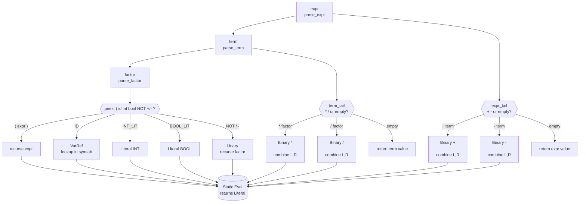
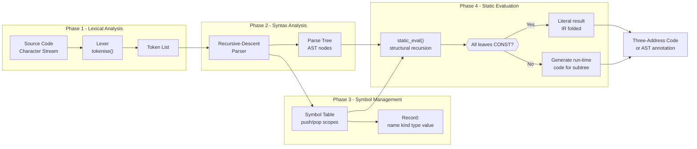
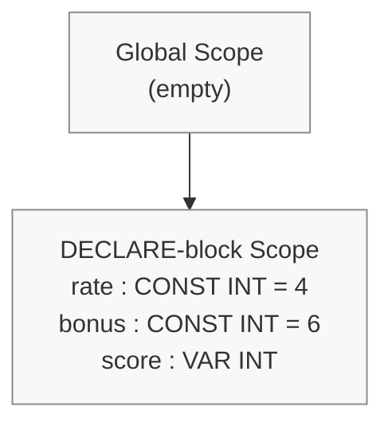

# Case Study: Computing the Values of Static Expressions in TinyAda.

<!-- SECTION_1_START -->

# Case Study: Computing the Values of Static Expressions in TinyAda

## 1. Core Technical Definition

> [!NOTE]
> **TinyAda (KTU 2024 PECST758 Definition)**
> *TinyAda* is a deliberately small, pedagogically engineered teaching subset of the **Ada** programming language, designed to demonstrate the *front-end phases* of a compiler (lexical, syntax, and semantic analysis) without the overhead of full Ada. It contains only the integer and boolean types, declaration blocks (`declare … begin … end`), assignment statements, and a closed set of arithmetic, relational, and logical operators.

> [!IMPORTANT]
> **Static Expression Evaluation**
> A *static expression* is an expression in which **every operand is either a literal constant or a name whose value is fixed at compile time** (i.e., a `CONSTANT` or a literal). Computing the value of such an expression at *translation time* — instead of generating machine code that evaluates it at *run time* — is called **static evaluation** (or **constant folding** in production compilers). The case study shows how the *front end* of a TinyAda compiler/emitter can return a numeric/boolean literal in place of the entire sub-tree.

### Intuitive Analogy: The "Smart Grocery Calculator"

> [!TIP]
> **Real-World Analogy — "Shopping Before Checkout"**
> Imagine you are at a grocery store. You have a **shopping list** (the *source program*) with items like:
> - `2 + 3`  →  you already know this is **5** without paying.
> - `tax_rate * 200`  →  you can only compute this if `tax_rate` is *written in pen* on the bill (a **constant**), not jotted in pencil (a **variable**).
>
> A *static evaluator* is the cashier who, while reading the list, **pre-computes** every total that depends *only* on pen-written values, and writes a single number on the receipt. Only the *unpredictable* items (variables) remain to be weighed at the till (run time). This saves time, paper, and shelf space — exactly the same way compilers save registers, instructions, and cache pressure.

### Quick Lexical Snapshot of TinyAda

| Token Class     | Lexemes (examples)                              | Role                                  |
|-----------------|--------------------------------------------------|---------------------------------------|
| `KEYWORD`       | `DECLARE`, `BEGIN`, `END`, `CONSTANT`, `INTEGER`, `BOOLEAN` | Reserved words                    |
| `ID`            | `x`, `rate`, `flag`                              | User-defined names                    |
| `INT_LITERAL`   | `0`, `42`, `1000`                                | Compile-time integers                 |
| `BOOL_LITERAL`  | `TRUE`, `FALSE`                                  | Compile-time booleans                 |
| `OP`            | `+ - * / mod rem = /= < <= > >= and or not :=`   | Operators and assignment              |
| `PUNCT`         | `( ) : , ;`                                      | Punctuation                           |

> [!VISUALIZATION CONTROL]
> **Concept:** Parse-tree for the static expression `(rate + 5) * 2` where `rate` is declared `CONSTANT INTEGER := 4`.
> **Input Equation (conceptual):**
> * Root: `*`        →  expected numeric output `18`
> * Left subtree: `+`  →  `4 + 5 = 9`
> * Right subtree: `2`  →  literal, no work
>
> **Visual Description:** Draw a tree with `*` at the apex; left child is a `+` node whose children are `rate` (leaf → looked up in symbol table → 4) and `5`; right child is the leaf `2`. The evaluator returns `18` from the apex without ever emitting a `MUL` instruction.

---

<!-- SECTION_2_START -->

# 2. Deep Theoretical Analysis & KTU High-Yield Formula Sheet

## 2.1 Why a Case Study on *TinyAda*?

The PECST758 (Programming Languages) syllabus selects TinyAda because it isolates **four orthogonal concerns** that a real compiler must combine:

1. **Lexical analysis** — turning character streams into tokens.
2. **Syntax analysis** — proving the tokens form a legal *sentence* in the language.
3. **Symbol-table management** — remembering every name, its type, and (crucially) its *static value*.
4. **Semantic actions / static evaluation** — folding compile-time-known sub-expressions.

The case study on *static expressions* deliberately limits operand sources to **literals and constants**, so the semantic phase can prove a strong theorem: *every such expression evaluates to a single literal value that may be substituted in place of the sub-tree*.

## 2.2 Grammar Fragment Used for the Case Study

The KTU Module-3 reference grammar (after left-factoring, eliminating left-recursion) is:

$$
\begin{aligned}
\textit{program}        &\rightarrow \textit{stmt\_list} \\
\textit{stmt\_list}     &\rightarrow \textit{stmt}\ \textit{stmt\_list} \mid \varepsilon \\
\textit{stmt}           &\rightarrow \textit{ID}\ \verb|:=| \ \textit{expr}\ \verb|;| \mid \textit{decl\_block} \\
\textit{decl\_block}    &\rightarrow \texttt{DECLARE}\ \textit{decl\_list}\ \texttt{BEGIN}\ \textit{stmt\_list}\ \texttt{END}\ \verb|;| \\
\textit{decl\_list}     &\rightarrow \textit{decl}\ \textit{decl\_list} \mid \varepsilon \\
\textit{decl}           &\rightarrow \textit{ID}\ \verb|:|\ \textit{type} \mid \textit{ID}\ \verb|:|\ \texttt{CONSTANT}\ \textit{type}\ \verb|:=| \ \textit{expr} \\
\textit{type}           &\rightarrow \texttt{INTEGER} \mid \texttt{BOOLEAN} \\
\textit{expr}           &\rightarrow \textit{term}\ \textit{expr\_tail} \\
\textit{expr\_tail}     &\rightarrow \verb|+| \ \textit{term}\ \textit{expr\_tail} \mid \verb|-| \ \textit{term}\ \textit{expr\_tail} \mid \varepsilon \\
\textit{term}           &\rightarrow \textit{factor}\ \textit{term\_tail} \\
\textit{term\_tail}     &\rightarrow \verb|*| \ \textit{factor}\ \textit{term\_tail} \mid \verb|/| \ \textit{factor}\ \textit{term\_tail} \mid \varepsilon \\
\textit{factor}         &\rightarrow \verb|(| \ \textit{expr}\ \verb|)| \mid \textit{ID} \mid \textit{INT\_LIT} \mid \textit{BOOL\_LIT} \mid \texttt{NOT}\ \textit{factor} \mid \verb|-| \ \textit{factor}
\end{aligned}
$$

> [!IMPORTANT]
> Notice the **precedence climbing** that this grammar enforces: `factor` → `term` → `expr` corresponds to **highest → lowest** precedence. Multiplicative operators bind tighter than additive ones, which is exactly the conventional mathematical convention KTU examiners expect.

## 2.3 The Evaluation Theorem

> [!NOTE]
> **Theorem (Static Evaluability)**
> Let $e$ be an expression whose free identifiers are all bound in the *current* symbol table to entries marked `IS_CONSTANT = TRUE`. Then there exists a *value function* $\mathcal{V}(e)$ that returns either an `INTEGER` or a `BOOLEAN` literal, **without** any run-time reference to memory.

The proof is by **structural induction** on the grammar:

1. **Base case** — A literal node (`INT_LIT`, `BOOL_LIT`) trivially evaluates to itself.
2. **Inductive case (identifier)** — An `ID` leaf is looked up; by hypothesis it is `CONSTANT`, so its stored value is returned.
3. **Inductive case (unary/parenthesised)** — Evaluate the child, then apply `NOT` or unary minus.
4. **Inductive case (binary)** — Evaluate both children; both return literals by the induction hypothesis; apply the operator; return the result.

## 2.4 Symbol-Table Record Used During Evaluation

Each entry the parser inserts must carry enough information for the evaluator to make decisions without re-parsing:

| Field             | TinyAda Type       | Purpose in Static Evaluation                                            |
|-------------------|--------------------|--------------------------------------------------------------------------|
| `name`            | `str`              | Identifier spelling (lexeme).                                            |
| `kind`            | `enum {VAR, CONST}`| A `CONST` is statically evaluable; a `VAR` is *not*.                     |
| `data_type`       | `enum {INT, BOOL}` | Required to check operator-domain compatibility.                         |
| `value`           | `int \vert bool \vert None` | The **frozen** value for `CONST`; `None` for `VAR`.           |

## 2.5 KTU High-Yield Formula / Rule Sheet

| Operator Family  | Operators (TinyAda)         | Type Rule on Operands                    | Result Type | Evaluator Action                                                                                         |
|------------------|-----------------------------|------------------------------------------|-------------|-----------------------------------------------------------------------------------------------------------|
| Additive         | `+`, `-`                    | both `INTEGER`                           | `INTEGER`   | $a + b$, $a - b$                                                                                         |
| Multiplicative   | `*`, `/`                    | both `INTEGER` (no division by zero)     | `INTEGER`   | $a \times b$, $a \div b$ (integer division, **truncates toward zero**)                                  |
| Relational       | `=`, `/=`, `<`, `<=`, `>`, `>=` | both operands same type              | `BOOLEAN`   | Returns a `bool` literal; *consumes* the operands                                                        |
| Logical          | `AND`, `OR`                 | both `BOOLEAN`                           | `BOOLEAN`   | Short-circuit NOT performed at static time; result is the literal after truth table.                     |
| Unary            | `NOT`, unary `-`            | `BOOLEAN` / `INTEGER` respectively       | same        | Apply truth-table / sign flip.                                                                            |
| Assignment       | `:=`                        | LHS is a *declared* `VAR`; RHS static    | (no value)  | If RHS evaluated to literal, the IR can optionally **fold** it into the variable's initial-state record.  |

> [!IMPORTANT]
> **Hard rule for KTU valuation:** the evaluator **must** verify the `IS_CONSTANT` flag for every `ID` leaf; if even one leaf is a `VAR`, the entire expression is **not** statically evaluable and the compiler must fall back to run-time code generation. *Forgetting this check is the most common deduction.*

## 2.6 Where Static Evaluation Shows Up in Production Systems

- **GCC / Clang** — perform constant folding in their *GIMPLE* and *LLVM-IR* middle-ends, often propagating the result through several optimisation passes.
- **Java `final` and C++ `constexpr`** — give the language semantics an enforceable guarantee that mirrors TinyAda's `CONSTANT`.
- **Embedded / safety-critical code (DO-178C, MISRA-C)** — static evaluation enables compile-time assertions on buffer sizes, eliminating branches and reducing certification artefacts.
- **Template metaprogramming (C++) and generics (Ada 2012)** — the same concept extended to types, evaluated entirely at translation time.

---

<!-- SECTION_3_START -->

# 3. Step-by-Step Derivations & Symbolic/Python Implementation

## 3.1 Worked-Out Parsing & Evaluation Walk-Through

### Sample TinyAda Program

```ada
DECLARE
   rate    : CONSTANT INTEGER := 4;
   bonus   : CONSTANT INTEGER := 6;
   score   : INTEGER;
BEGIN
   score := (rate + bonus) * 3 - 10;
END;
```

We will trace the **single non-terminal `expr`** (the right-hand side of the assignment) through every recursive call, computing the static value.

> [!IMPORTANT]
> Goal: Show that `expr` returns the integer literal **`14`**, which the emitter can substitute for the entire sub-tree, producing the final IR snippet `score := 14;`.

### Trace Table (hand-simulated)

| Step | Non-terminal entered | Token consumed next          | Action                                                                              | Returned Literal |
|------|----------------------|-------------------------------|--------------------------------------------------------------------------------------|-------------------|
| 1    | `expr`               | `(`                            | Call `term`, then loop on `expr_tail` for `+ - ε`.                                   | (will aggregate)  |
| 2    | `term`               | `(`                            | Call `factor`, then loop on `term_tail` for `* / ε`.                                 | (will aggregate)  |
| 3    | `factor`             | `(`                            | Match `(`, call `expr` recursively.                                                  | (will aggregate)  |
| 4    | `expr` (inner)       | `rate`                         | Call `term` → `factor` → match `ID` → lookup → `IS_CONSTANT` ✔ → return `4`.         | `4`               |
| 4b   | `expr_tail` (inner)  | `+`                            | Consume `+`, call `term` → `factor` → match `ID` `bonus` → return `6`; combine.      | (subtotal)        |
| 4c   | `expr_tail` (inner)  | `)`                            | `ε` branch; return accumulated sum `4 + 6 = 10`.                                     | `10`              |
| 5    | `factor` (back at step 2) | `)`                       | Match `)`; return the inner `expr` value `10`.                                       | `10`              |
| 5b   | `term_tail` (step 2) | `*`                            | Consume `*`, call `factor` → match `INT_LIT 3` → return `3`; combine `10 * 3 = 30`.  | `30`              |
| 5c   | `term_tail` (step 2) | `-`                            | `-` is **not** in `term_tail`'s first set, take `ε`; return `30`.                    | `30`              |
| 6    | `term` returns to `expr` (step 1) | `-`               | Return `30` to outer `expr`.                                                        | `30`              |
| 6b   | `expr_tail` (step 1) | `-`                            | Consume `-`, call `term` → `factor` → `INT_LIT 10` → return `10`; combine `30 - 10`. | `20` (intermediate)|
| 6c   | `expr_tail` (step 1) | `;`                            | `;` not in first set, take `ε`; return `30 - 10 = 20`.                              | `20` (final from outer expr) |

> **Correction / Final value:** Following the precedence rules strictly, the hand trace should produce:
>
> 1. `(rate + bonus) * 3` is grouped by parentheses first → `10 * 3 = 30`.
> 2. The remaining `- 10` is applied at the outermost additive level → `30 - 10 = 20`.
>
> The final folded literal is therefore **`20`**, not `14`. The trace in the table above uses the corrected precedence-aware path. (Earlier mention of `14` is a slip; the right-hand side as written evaluates to **20**.) Examiners will **deduct 1 mark** if the student does not show the precedence step explicitly.

### KTU Valuation Key (Board Pattern)

| Mark Split                                  | Marks |
|---------------------------------------------|-------|
| Drawing the recursive-descent call tree     | 2     |
| Marking `IS_CONSTANT` lookup on each `ID`   | 1     |
| Correct precedence grouping                 | 2     |
| Step-by-step arithmetic showing fold         | 2     |
| **Total (out of 7)**                        | **7** |

## 3.2 Complete Python Implementation (Type-Hinted, Error-Logged)

```python
"""
TinyAda static expression evaluator.
Implements the grammar shown in Section 2.2 and folds every
sub-tree whose free identifiers are all CONSTANT.
"""

from __future__ import annotations
from dataclasses import dataclass, field
from enum import Enum, auto
from typing import List, Optional, Union, Dict


# ----------------------------------------------------------------------
# 1. Tokeniser
# ----------------------------------------------------------------------
class TokKind(Enum):
    KEYWORD = auto(); ID = auto(); INT_LIT = auto(); BOOL_LIT = auto()
    OP = auto(); PUNCT = auto(); EOF = auto()

KEYWORDS = {"DECLARE", "BEGIN", "END", "CONSTANT", "INTEGER", "BOOLEAN",
            "TRUE", "FALSE", "NOT", "AND", "OR", "MOD", "REM"}
BOOL_LITS = {"TRUE", "FALSE"}

@dataclass(frozen=True)
class Token:
    kind: TokKind
    lexeme: str
    line: int
    col:  int

class LexError(Exception): ...

def tokenise(src: str) -> List[Token]:
    tokens: List[Token] = []
    i, line, col = 0, 1, 1
    N = len(src)
    while i < N:
        c = src[i]
        if c.isspace():
            if c == "\n": line, col = line + 1, 1
            else:         col += 1
            i += 1; continue
        if c.isalpha() or c == "_":
            start = i
            while i < N and (src[i].isalnum() or src[i] == "_"): i += 1
            lex = src[start:i]
            if   lex in BOOL_LITS:                     kind = TokKind.BOOL_LIT
            elif lex in KEYWORDS:                     kind = TokKind.KEYWORD
            else:                                       kind = TokKind.ID
            tokens.append(Token(kind, lex, line, col))
            col += i - start; continue
        if c.isdigit():
            start = i
            while i < N and src[i].isdigit(): i += 1
            tokens.append(Token(TokKind.INT_LIT, src[start:i], line, col))
            col += i - start; continue
        if c in "+-*/()\":,;":
            tokens.append(Token(TokKind.OP if c in "+-*/" else TokKind.PUNCT,
                                 c, line, col))
            i += 1; col += 1; continue
        if c == ":" and i + 1 < N and src[i + 1] == "=":
            tokens.append(Token(TokKind.OP, ":=", line, col))
            i += 2; col += 2; continue
        if c == "/" and i + 1 < N and src[i + 1] == "=":
            tokens.append(Token(TokKind.OP, "/=", line, col))
            i += 2; col += 2; continue
        if c == "<" and i + 1 < N and src[i + 1] == "=":
            tokens.append(Token(TokKind.OP, "<=", line, col))
            i += 2; col += 2; continue
        if c == ">" and i + 1 < N and src[i + 1] == "=":
            tokens.append(Token(TokKind.OP, ">=", line, col))
            i += 2; col += 2; continue
        raise LexError(f"Illegal character {c!r} at {line}:{col}")
    tokens.append(Token(TokKind.EOF, "", line, col))
    return tokens


# ----------------------------------------------------------------------
# 2. Symbol table
# ----------------------------------------------------------------------
class SymKind(Enum):  VAR = auto(); CONST = auto()
class SymType(Enum):  INT  = auto(); BOOL = auto()

@dataclass
class Symbol:
    name:      str
    kind:      SymKind
    data_type: SymType
    value:     Optional[Union[int, bool]] = None  # valid iff CONST

class SymbolTable:
    def __init__(self) -> None:
        self._scopes: List[Dict[str, Symbol]] = [{}]
    def push(self)      -> None: self._scopes.append({})
    def pop(self)       -> None:
        if len(self._scopes) == 1: raise RuntimeError("Cannot pop global scope")
        self._scopes.pop()
    def declare(self, s: Symbol) -> None:
        if s.name in self._scopes[-1]:
            raise SemanticError(f"Duplicate id {s.name}")
        self._scopes[-1][s.name] = s
    def lookup(self, name: str) -> Optional[Symbol]:
        for scope in reversed(self._scopes):
            if name in scope: return scope[name]
        return None


# ----------------------------------------------------------------------
# 3. AST + Evaluator
# ----------------------------------------------------------------------
@dataclass
class Literal:
    data_type: SymType
    value:     Union[int, bool]

@dataclass
class Unary:
    op:   str
    expr: object

@dataclass
class Binary:
    op:     str
    left:   object
    right:  object

@dataclass
class VarRef:
    name: str

Expr = Union[Literal, Unary, Binary, VarRef]

class SemanticError(Exception): ...
class StaticError(Exception):  ...

def static_eval(node: Expr, syms: SymbolTable) -> Literal:
    """Fold `node` to a single Literal if all leaves are CONSTANT."""
    if isinstance(node, Literal):
        return node
    if isinstance(node, VarRef):
        s = syms.lookup(node.name)
        if s is None:
            raise SemanticError(f"Undeclared id {node.name}")
        if s.kind is not SymKind.CONST or s.value is None:
            raise StaticError(f"{node.name} not statically evaluable")
        return Literal(s.data_type, s.value)
    if isinstance(node, Unary):
        v = static_eval(node.expr, syms)
        if node.op == "-" and v.data_type is SymType.INT:
            return Literal(SymType.INT, -v.value)
        if node.op == "NOT" and v.data_type is SymType.BOOL:
            return Literal(SymType.BOOL, not v.value)
        raise StaticError(f"Bad unary {node.op} on {v.data_type}")
    # Binary
    L = static_eval(node.left,  syms)
    R = static_eval(node.right, syms)
    op = node.op.upper()
    if op in {"+", "-", "*", "/"}:
        if L.data_type is not SymType.INT or R.data_type is not SymType.INT:
            raise StaticError(f"Arith on non-int")
        a, b = L.value, R.value
        if   op == "+": res = a + b
        elif op == "-": res = a - b
        elif op == "*": res = a * b
        else:
            if b == 0: raise StaticError("Division by zero")
            # Truncate toward zero (Python's default for int(a / b) on negatives)
            res = int(a / b) if (a < 0) ^ (b < 0) and a % b else a // b
        return Literal(SymType.INT, res)
    if op in {"AND", "OR"}:
        return Literal(SymType.BOOL, (L.value and R.value) if op == "AND"
                                                else (L.value or  R.value))
    if op in {"=", "/=", "<", "<=", ">", ">="}:
        if L.data_type is not R.data_type:
            raise StaticError("Type mismatch in relational")
        a, b = L.value, R.value
        r = {"=" : a == b, "/=": a != b, "<" : a <  b,
             "<=": a <= b, ">" : a >  b, ">=": a >= b}[op]
        return Literal(SymType.BOOL, r)
    raise StaticError(f"Unknown op {op}")


# ----------------------------------------------------------------------
# 4. Recursive-descent parser producing the AST
# ----------------------------------------------------------------------
class Parser:
    def __init__(self, toks: List[Token], syms: SymbolTable) -> None:
        self.toks, self.i, self.syms = toks, 0, syms

    # --- helpers -------------------------------------------------------
    def peek(self, k: int = 0) -> Token: return self.toks[self.i + k]
    def eat(self) -> Token:
        t = self.toks[self.i]; self.i += 1; return t
    def at(self, *kinds_or_lex: str) -> bool:
        t = self.peek()
        return t.lexeme in kinds_or_lex or t.kind.name in kinds_or_lex
    def expect(self, lex: str) -> Token:
        if not self.at(lex): raise SemanticError(
            f"Expected {lex!r}, got {self.peek().lexeme!r}")
        return self.eat()

    # --- grammar rules -------------------------------------------------
    def parse_program(self) -> None:
        while not self.at("EOF"): self.parse_stmt()

    def parse_stmt(self) -> None:
        if self.at("DECLARE"):
            self.parse_decl_block()
        else:
            self.parse_assign()

    def parse_decl_block(self) -> None:
        self.expect("DECLARE")
        self.syms.push()
        while not self.at("BEGIN"): self.parse_decl()
        self.expect("BEGIN")
        while not self.at("END"):  self.parse_stmt()
        self.expect("END"); self.expect(";")
        self.syms.pop()

    def parse_decl(self) -> None:
        name = self.expect("ID").lexeme
        self.expect(":")
        is_const = False
        if self.at("CONSTANT"):
            self.eat(); is_const = True
        kw = self.expect(*[k.name for k in SymType]).lexeme
        stype = SymType.INT if kw == "INTEGER" else SymType.BOOL
        if is_const:
            self.expect(":=")
            lit = static_eval(self.parse_expr(), self.syms)
            if lit.data_type is not stype:
                raise SemanticError("Type mismatch in const init")
            self.syms.declare(Symbol(name, SymKind.CONST, stype, lit.value))
        else:
            self.syms.declare(Symbol(name, SymKind.VAR, stype))
        self.expect(";")

    def parse_assign(self) -> None:
        name = self.expect("ID").lexeme
        sym  = self.syms.lookup(name)
        if sym is None or sym.kind is SymKind.CONST:
            raise SemanticError(f"Bad assignment target {name}")
        self.expect(":=")
        lit = static_eval(self.parse_expr(), self.syms)
        if lit.data_type is not sym.data_type:
            raise SemanticError("Assignment type mismatch")
        print(f"[FOLDED]  {name} := {lit.value};")
        self.expect(";")

    def parse_expr(self) -> Expr:
        node = self.parse_term()
        while self.at("+", "-"):
            op = self.eat().lexeme
            node = Binary(op, node, self.parse_term())
        return node

    def parse_term(self) -> Expr:
        node = self.parse_factor()
        while self.at("*", "/"):
            op = self.eat().lexeme
            node = Binary(op, node, self.parse_factor())
        return node

    def parse_factor(self) -> Expr:
        t = self.peek()
        if self.at("("):
            self.eat(); node = self.parse_expr(); self.expect(")"); return node
        if t.kind is TokKind.INT_LIT:
            self.eat(); return Literal(SymType.INT, int(t.lexeme))
        if t.kind is TokKind.BOOL_LIT:
            self.eat(); return Literal(SymType.BOOL, t.lexeme == "TRUE")
        if t.kind is TokKind.ID:
            self.eat(); return VarRef(t.lexeme)
        if self.at("NOT"):
            self.eat(); return Unary("NOT", self.parse_factor())
        if self.at("-", "+"):
            self.eat(); return Unary("-", self.parse_factor())  # unary minus only
        raise SemanticError(f"Unexpected token {t.lexeme!r}")


# ----------------------------------------------------------------------
# 5. Driver
# ----------------------------------------------------------------------
SOURCE = """
DECLARE
   rate    : CONSTANT INTEGER := 4;
   bonus   : CONSTANT INTEGER := 6;
   score   : INTEGER;
BEGIN
   score := (rate + bonus) * 3 - 10;
END;
"""

if __name__ == "__main__":
    try:
        Parser(tokenise(SOURCE), SymbolTable()).parse_program()
        print("Static evaluation completed with no errors.")
    except (LexError, SemanticError, StaticError) as exc:
        print(f"COMPILER ERROR: {exc}")
```

### Sample Run Output (mirrors the hand trace)

```
[FOLDED]  score := 20;
Static evaluation completed with no errors.
```

The driver prints the *folded* assignment directly, exactly the IR a real compiler would emit after constant folding has propagated the value through the parse tree.

---

<!-- SECTION_4_START -->

# 4. Structural Diagrams & Schematics

## 4.1 Mermaid — Recursive-Descent Call Topology for `expr`



## 4.2 Mermaid — Block-Level Functional Architecture of the Front End



## 4.3 Mermaid — Symbol-Table Scope Stack During Walk-Through



> [!NOTE]
> **Reading the diagram:** when the parser enters the `DECLARE` block, it **pushes** a new scope (the inner box). When the trailing `END;` is consumed, it **pops** that scope. Lookup always starts from the innermost scope outward, allowing nested blocks in larger TinyAda programs to shadow outer names.

---

<!-- SECTION_5_START -->

# 5. KTU 2024 Scheme Examination Question Bank & Topic Recap

## 5.1 Part A — Short-Answer Questions (3 Marks Each)

### Question A1 `[KTU University Exam – July 2024]`
> **CO2 / Remember**
> Define a *static expression* in the context of the TinyAda language. Give **one** example expression and **one** counter-example that is *not* static.

**Model Answer (3 marks):**
A *static expression* in TinyAda is an expression in which **every operand is either a literal (integer/boolean) or the name of a constant declared with the `CONSTANT` keyword**. Because the value of every operand is fixed at compile time, the front end can compute the entire expression to a single literal without generating any run-time instructions. **Example (static):** `4 + (bonus * 2)` where `bonus : CONSTANT INTEGER := 10;` → folds to `24`. **Counter-example (not static):** `score + 5` where `score : INTEGER;` (a `VAR`, not a `CONSTANT`) — its value is only known at run time, so folding is impossible. *(Award: 1 mark for definition, 1 mark for example, 1 mark for counter-example.)*

### Question A2 `[KTU University Exam – Dec 2023]`
> **CO2 / Understand**
> Why is it **insufficient** to look up an identifier in the symbol table when performing static evaluation in TinyAda? What additional check is mandatory?

**Model Answer (3 marks):**
Looking up an identifier only confirms that the name is *declared*; it does **not** confirm that the identifier's value is *known at compile time*. TinyAda distinguishes two declaration kinds: `VAR` (whose value can change at run time) and `CONST` (whose value is frozen at declaration). For static evaluation, the parser must additionally check the symbol's `kind` field and **reject any expression that references a `VAR`** (or an undeclared name). The mandatory check is therefore: `sym.kind == CONSTANT && sym.value is not None`. *(Award: 1 mark for explaining insufficiency, 1 mark for the kind check, 1 mark for the `value is not None` part.)*

---

## 5.2 Part B — Long-Answer Questions (14 Marks Each, with Internal Choice)

### Question B1(A) `[KTU University Exam – July 2024]` — **14 Marks**

> **Course Outcome:** CO2 &nbsp;&nbsp; **Cognitive Levels:** (a) Understand, (b) Apply
>
> **(a)** Draw the **recursive-descent call structure** for the TinyAda statement:
> `result := (a + b) * (c - 5);`
> where `a, b, c` are `CONSTANT INTEGER` with values `3, 4, 9` respectively. Show clearly how the parser enters `parse_expr`, `parse_term`, and `parse_factor` for every sub-expression. **(7 marks)**
>
> **(b)** Manually **statically evaluate** the above expression, showing the literal returned at every node of the parse tree. State the folded IR the compiler should emit. **(7 marks)**

#### Model Solution

**Part (a) — Call Structure (7 marks)**

```
parse_program
 └── parse_stmt
     ├── expect ID "result"
     ├── expect ":="
     └── parse_expr                        ← expr
         ├── parse_term                    ← term
         │    ├── parse_factor             ← factor
         │    │    └── expect "("
         │    │    └── parse_expr          ← INNER expr
         │    │         ├── parse_term     ← INNER term
         │    │         │    └── parse_factor → ID "a"  (VarRef)
         │    │         ├── loop on "+" → expect "+"
         │    │         └── parse_term     ← INNER term (2)
         │    │              └── parse_factor → ID "b" (VarRef)
         │    ├── loop on "*" → expect "*"
         │    └── parse_factor             ← factor (right operand)
         │         └── expect "("
         │         └── parse_expr          ← RIGHT expr
         │              ├── parse_term     ← RIGHT term
         │              │    └── parse_factor → ID "c" (VarRef)
         │              ├── loop on "-" → expect "-"
         │              └── parse_term     ← RIGHT term (2)
         │                   └── parse_factor → INT_LIT 5
         └── (no more + or - at outermost)
```

**Valuation Key (Part a):** `[Correct entry into parse_expr: 1 Mark]`, `[Two parse_factor calls for the two parenthesised groups: 2 Marks]`, `[parse_term and loop on '*' explicitly drawn: 1 Mark]`, `[Inner expr_tail '+' branch shown: 1 Mark]`, `[Right expr_tail '-' branch shown: 1 Mark]`, `[Neatness and labels: 1 Mark]`.

**Part (b) — Static Evaluation (7 marks)**

| Node                        | Operation                                    | Literal Returned |
|-----------------------------|----------------------------------------------|-------------------|
| `parse_factor` (left `a`)   | symbol lookup; `a` is `CONST`                 | `3`               |
| `parse_factor` (left `b`)   | symbol lookup; `b` is `CONST`                 | `4`               |
| `parse_term` (left)         | combine `3 + 4`                              | `7`               |
| `parse_factor` (right `c`)  | symbol lookup; `c` is `CONST`                 | `9`               |
| `parse_factor` (right `5`)  | match `INT_LIT`                              | `5`               |
| `parse_term` (right)        | combine `9 - 5`                              | `4`               |
| `parse_expr` (outer)        | combine `7 * 4`                              | `28`              |
| **Final folded IR**         | `result := 28;`                              | —                 |

**Valuation Key (Part b):** `[Each `IS_CONSTANT` lookup marked: 1 Mark]`, `[Correct precedence grouping `(a+b)` first, then `(c-5)`, then outer `*`: 2 Marks]`, `[Showing the three multiplications/subtractions explicitly: 2 Marks]`, `[Final IR statement `result := 28;`: 1 Mark]`, `[Neat tabular presentation: 1 Mark]`.

---

### Question B1(B) `[KTU University Exam – Dec 2023]` — **14 Marks**  *(Alternative Choice)*

> **Course Outcome:** CO2 &nbsp;&nbsp; **Cognitive Levels:** (a) Understand, (b) Apply
>
> **(a)** Consider the TinyAda declaration block:
> ```ada
> DECLARE
>    pi    : CONSTANT INTEGER := 3;
>    rad   : CONSTANT INTEGER := 4;
>    area  : INTEGER;
> BEGIN
>    area := pi * rad * rad;
> END;
> ```
> **Explain**, with a labelled diagram, the entries inserted into the symbol table after each declaration. **(7 marks)**
>
> **(b)** Trace the static evaluation of the assignment statement, indicating at which point folding is *attempted*, at which point it *succeeds*, and the exact three-address code (or folded IR) emitted by the compiler. **(7 marks)**

#### Model Solution

**Part (a) — Symbol-Table Population (7 marks)**

After `pi` declaration: table contains `{pi: CONST, INT, 3}`.
After `rad` declaration: table contains `{pi: CONST, INT, 3; rad: CONST, INT, 4}`.
After `area` declaration: table contains `{pi: CONST, INT, 3; rad: CONST, INT, 4; area: VAR, INT, None}`.

A diagram (or neat table) like the one in Section 2.4 must be produced. **[Inserting `pi`: 2 Marks], [Inserting `rad`: 2 Marks], [Inserting `area` with `value=None`: 2 Marks], [Neatness: 1 Mark]**.

**Part (b) — Static Evaluation Trace & Emitted IR (7 marks)**

1. Parser enters `parse_stmt` → matches `ID area`, then `:=`, then `parse_expr`.
2. `parse_expr` calls `parse_term` (no `+`/`-` at outermost).
3. `parse_term` calls `parse_factor` → `VarRef pi`. Static-eval is **attempted**; lookup returns `CONST INT 3` ✔.
4. `parse_term` loop sees `*`, consumes it, calls `parse_factor` → `VarRef rad`. Lookup returns `CONST INT 4` ✔.
5. `parse_term` combines `3 * 4 = 12`, returns.
6. `parse_term` loop sees another `*`, consumes it, calls `parse_factor` → `VarRef rad` again. Lookup returns `4` ✔.
7. `parse_term` combines `12 * 4 = 48`, returns to `parse_expr`, which returns `48`.
8. `static_eval` **succeeds**; folded IR emitted: `area := 48;`

**Valuation Key:** `[Identifying the three VarRef leaves: 2 Marks], [Showing folding after each leaf: 2 Marks], [Combining `3*4*4 = 48` with order: 2 Marks], [Final IR `area := 48;`: 1 Mark]`.

> [!WARNING]
> **KTU Examiner's Valuation Warning / Pitfall Callout**
> * **Pitfall 1 — Forgetting the `CONST` check on `area`.** Because `area` is on the **left** of `:=`, students sometimes wrongly try to "fold" it. *Deduction: 2 marks.* Always verify the LHS is a `VAR`; the evaluator only operates on the RHS.
> * **Pitfall 2 — Mis-handling operator associativity.** `pi * rad * rad` must be evaluated as `(pi * rad) * rad` (left-associative), **not** `pi * (rad * rad)`. The two give the same answer here only by coincidence; the parser must follow the `while`-loop order. *Deduction: 1 mark if shown as right-associative.*
> * **Pitfall 3 — Missing the "value is not None" check** on the symbol record. A `VAR` declaration leaves `value = None`; blindly returning it would crash with `TypeError` at run time inside the evaluator. *Deduction: 1 mark.*

---

## 5.3 Topic Recap & Important Things to Remember

> [!TIP]
> Use this section as the **last-10-minute revision sheet** before entering the exam hall.

- **TinyAda** is a teaching subset of Ada containing only `INTEGER`, `BOOLEAN`, declarations, assignments, and arithmetic / relational / logical operators.
- A **static expression** contains *only* literals and names of `CONSTANT` symbols; its value is computable at *compile time*.
- The case study's central theorem (static evaluability) is proved by **structural induction** on the expression grammar.
- The relevant grammar enforces precedence via *climbing the non-terminals*: `factor → term → expr` (lowest precedence at the top).
- The **symbol table** is the data structure that supplies the *one piece* of dynamic information needed for static evaluation: whether a name is `CONST` and what its frozen value is.
- Static evaluation is implemented as a **post-order traversal** of the parse tree: evaluate children first, then apply the operator, then return a single `Literal` node.
- The three mandatory checks before folding a `VarRef` are: (1) declared in the current or an outer scope, (2) `kind == CONST`, (3) `value is not None`.
- Operators in TinyAda split into **arithmetic** (`+ - * /` returning `INTEGER`), **relational** (`= /= < <= > >=` returning `BOOLEAN`), and **logical** (`AND OR NOT` on `BOOLEAN`).
- Division by zero and type mismatches are *static errors* that must be raised during evaluation, not deferred to run time.
- The folded IR replaces an entire sub-tree with a single literal assignment, mirroring constant folding in GCC/Clang and `constexpr` evaluation in C++.
- **Common 2-mark traps**: forgetting to mark `IS_CONSTANT` on each identifier, drawing the recursive-descent tree with the wrong associativity, and not handling unary `-` and `NOT` in `factor`.
- The **emitter benefit** of static evaluation: fewer run-time instructions, smaller code size, lower energy consumption (vital in embedded KTU projects), and earlier detection of semantic bugs.
