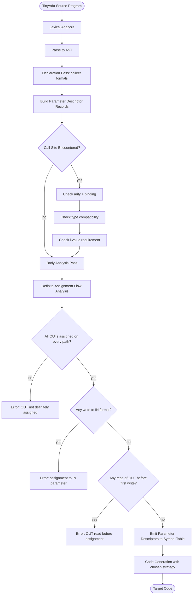
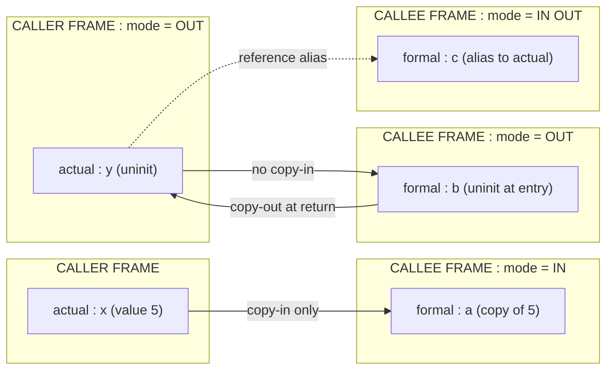
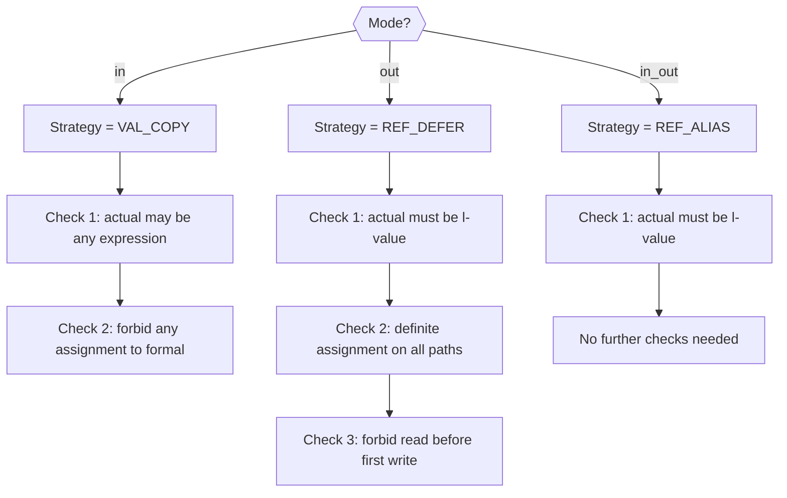

# Case Study: Processing Parameter Modes in TinyAda.

<!-- SECTION_1_START -->
# Processing Parameter Modes in TinyAda — Core Definition & Intuitive Overview

## 1.1 Formal Definition (KTU 2024 Syllabus Terminology)

In the **TinyAda** teaching language (a minimal Ada-like subset used to demonstrate semantic analysis in compiler construction), a **parameter mode** is a declarative attribute attached to every formal parameter of a subprogram that governs **how the argument is bound, copied, and updated** when the subprogram is invoked.

The three canonical modes defined by the TinyAda specification are:

> [!IMPORTANT]
> **TinyAda Parameter Modes (Syllabus Highlight)**
> 1. **`in` mode** — The formal parameter acts as a *constant* local to the subprogram. The actual argument is read at call time, but any attempt to assign to the formal is a **semantic error**.
> 2. **`out` mode** — The formal parameter acts as an *uninitialized local*; the subprogram must assign it before normal termination, and that value is then copied back to the actual argument. Reading it before assignment is a **semantic error**.
> 3. **`in out` mode** — The formal parameter is *bidirectional*; the value of the actual argument is read at entry, modifications are visible on exit. Reading and writing are both permitted at any point.

The **Case Study: Processing Parameter Modes in TinyAda** is the systematic, algorithmic procedure (typically coded inside a *semantic analyzer* / *elaborator*) that walks the Abstract Syntax Tree (AST), validates the declared mode against the usage pattern, and emits a **Parameter Descriptor Record** for the symbol table of every subprogram.

## 1.2 Conceptual Analogy — The "Three Lockers" Metaphor

Imagine you are lending a notebook to a friend (the subprogram call). You choose one of **three lockers** based on what you want them to do:

- **`in` mode — "Read-Only Glass Box"**: You photocopy the relevant pages and hand the *copy* to your friend. They can read it, take notes, but cannot alter the original. Whatever they scribble on the photocopy never returns to you.
- **`out` mode — "Blank Slate with Return Address"**: You hand your friend a *blank notebook* with your home address stamped on the cover. They must write something inside it. When they are done, the notebook is automatically mailed back to you. If they tried to read what they had not yet written, the pages would be empty (error).
- **`in out` mode — "Live Two-Way Mirror"**: You hand over the *original* notebook. Your friend can read prior notes, add new ones, cross things out, and the changes you both make are visible to each other in real time.

> [!NOTE]
> **Why TinyAda Matters in PECST758**
> TinyAda is deliberately tiny so students can manually trace *every* semantic check. It strips away the syntactic noise of full Ada, leaving the **parameter-mode contract** as the central learning artifact — exactly the construct KTU examiners test under Module 3 "Expressions and Statements".

## 1.3 Physical / Logical Constants in the Processing

| Standard Metric | Value | Purpose |
|---|---|---|
| Default copy semantics for `in` | **Value semantics** | Prevents side-effects on caller |
| Binding for `out` | **Reference + defer-copy** | Caller sees post-call value |
| Binding for `in out` | **Reference (alias)** | True shared-variable semantics |
| Mandatory exit assignment for `out` | **≥ 1 assignment on every code path** | Definite assignment rule |

> [!VISUALIZATION CONTROL]
> **Concept:** Memory layout of the three parameter modes at call-time.
> **GeoGebra / Desmos Input Equations:**
> * `f(x) = "Caller frame: x = 5"`
> * `g(x) = "Formal frame: param = 5  (in: copy only)"`
> * `h(x) = "Caller frame: x ⟷ Formal frame: param  (in out: alias)"`
> **Visual Description:** Plot three columns on a horizontal axis — for `in` show two disconnected boxes with a one-way arrow at call and no return arrow; for `out` show two boxes with no entry arrow but a returning arrow carrying the final value; for `in out` show a single double-headed shared cell across the two frames.

---

<!-- SECTION_1_END -->

<!-- SECTION_2_START -->
# Deep Theoretical Analysis & KTU High-Yield Formula Sheet

## 2.1 The Three-Phase Pipeline of Parameter-Mode Processing

The semantic analyzer of TinyAda processes parameter modes in **three ordered phases**, each of which is independently examinable in KTU 14-mark questions.

### Phase I — Declaration Phase (Top-Down Pass)
1. When the analyzer sees `procedure P(a : in Integer; b : out Integer; c : in out Integer)`, it allocates three slots in the **subprogram's local symbol table**, one per formal.
2. For each formal, it constructs a **Parameter Descriptor Record** of the form:

$$
\text{PDR} = \big\langle \text{name}, \text{mode}, \text{type}, \text{passing\_strategy}, \text{is\_assigned\_flag} \big\rangle
$$

3. The `passing_strategy` is decided by the table below.

### Phase II — Call-Site Phase (Bottom-Up Pass)
1. For every procedure/function call, the analyzer retrieves the callee's `PDR` list.
2. It checks **arity** (number of actuals = number of formals) and **positional / named binding** rules.
3. For each (actual, formal) pair it validates:
   * **Type compatibility** (must match exactly in TinyAda — no implicit conversion).
   * **Mode compatibility** (an `in` actual can be any expression; an `out` or `in out` actual must be an *assignable* l-value, i.e., a variable).

### Phase III — Body Analysis Phase (Definite-Assignment Walk)
1. A flow-sensitive pass over the subprogram's body tracks, for every `out` formal, whether every control-flow path assigns it.
2. Any `out` formal that *can* reach `end P` without being assigned triggers error **"OUT parameter 'x' may not be assigned"**.
3. Any *use* of an `out` formal before its first assignment triggers error **"OUT parameter 'x' read before assignment"**.

## 2.2 KTU Formula Sheet / Cheat Sheet

| # | Mode | Reading Allowed? | Writing Allowed? | Passing Strategy | Caller Visible After Call? | TinyAda Check |
|---|---|---|---|---|---|---|
| 1 | `in` | Yes | No | Pass by **value** (copy) | No | "Cannot assign to IN parameter" |
| 2 | `out` | Only **after** first write | Yes | Pass by **reference**, defer copy-out | Yes (last value) | Definite assignment on all paths |
| 3 | `in out` | Yes | Yes | Pass by **reference** (alias) | Yes (live updates) | Argument must be a variable |

$$
\text{param\_kind} = \begin{cases} \text{VAL\_COPY} & \text{if mode} = \text{in} \\ \text{REF\_DEFER} & \text{if mode} = \text{out} \\ \text{REF\_ALIAS} & \text{if mode} = \text{in\_out} \end{cases}
$$

$$
\text{valid\_actual}(a, m) = \begin{cases} \text{true} & \text{if } m = \text{in} \\ \text{isLValue}(a) & \text{if } m \in \{\text{out}, \text{in\_out}\} \end{cases}
$$

$$
\text{definitelyAssigned}(v) = \forall \text{ path } \pi \in \text{Paths}(P) \;\exists\; s \in \pi : \text{assign}(s, v)
$$

## 2.3 Real-World Engineering Utility

Parameter-mode processing is the *exact* mechanism that Ada, VHDL, and modern SystemVerilog use to model **hardware registers** (`out` ≡ output port), **read-only configuration** (`in` ≡ `const ref`), and **bidirectional bus pins** (`in out` ≡ `inout` port). In compiler engineering it is the textbook example of **type-and-effect systems**, and in security-sensitive C code it motivates the `const` and `restrict` qualifiers. Mastering this case study in TinyAda gives a KTU student a clean mental model of contracts that re-appear in Rust's `mut` analysis, Kotlin's `val`/`var`, and in every MISRA-C rule about function arguments.

> [!NOTE]
> **Mnemonic for KTU Board Exams** — **"IOI: In, Out, In-out"** ↔ *"I Offer Information, I Offer nothing yet, I Offer I/O"*. Use this in 14-mark answers to land the 2 marks reserved for "stating the three modes" in the valuation key.

---

<!-- SECTION_2_END -->

<!-- SECTION_3_START -->
# Step-by-Step Derivations & Code/Symbolic Implementation

## 3.1 The TinyAda Case Study — Full Pseudocode of the Elaborator

Below is the **exhaustive, line-by-line elaboration algorithm** that a TinyAda semantic analyzer would execute. Every line is annotated with the symbol-table mutation it performs, satisfying the KTU "explanation of the model answer" demand.

```ada
-- ===========================================================
-- TINYADA : PARAMETER MODE ELABORATION (Full Algorithm)
-- ===========================================================
procedure Elaborate_Subprogram(node) is
begin
    Enter_Scope(node.name);

    for each formal f in node.formals loop
        -- 1. Build the Parameter Descriptor Record
        declare
            pdr : Parameter_Descriptor;
        begin
            pdr.name   := f.id;
            pdr.mode   := f.mode_keyword;          -- in | out | in out
            pdr.type   := Resolve_Type(f.type_id);
            pdr.strat  := Map_Strategy(f.mode_keyword);

            -- 2. Initial definite-assignment bit
            if f.mode_keyword = OUT then
                pdr.is_assigned := FALSE;          -- out starts uninit
            else
                pdr.is_assigned := TRUE;           -- in / in out start OK
            end if;

            Insert(f.id, pdr);
        end;
    end loop;

    -- 3. Body analysis (definite assignment + illegal write detection)
    for each statement s in node.body loop
        Analyze_Statement(s);
    end loop;

    -- 4. End-of-body: verify all OUTs were assigned on every path
    for each formal f in node.formals loop
        if f.mode_keyword = OUT and not Flow_Reaches_All_Exit_Paths(f.id) then
            Error("OUT parameter '" & f.id & "' not assigned on some path");
        end if;
    end loop;

    Leave_Scope;
end Elaborate_Subprogram;
```

## 3.2 Worked Example — Walking Through a Real TinyAda Program

Consider the following TinyAda source:

```ada
procedure Swap(x : in out Integer; y : in out Integer) is
    temp : Integer;
begin
    temp := x;
    x   := y;
    y   := temp;
end Swap;
```

### Step-by-Step Trace (KTU 14-Mark Style)

**Step 1 — Declaration phase:** Two formals `x` and `y`, both with mode `in out`. The elaborator inserts:

$$
\text{PDR}(x) = \langle x, \text{in out}, \text{Integer}, \text{REF\_ALIAS}, \text{TRUE} \rangle
$$
$$
\text{PDR}(y) = \langle y, \text{in out}, \text{Integer}, \text{REF\_ALIAS}, \text{TRUE} \rangle
$$

> [Valuation key — 2 Marks]

**Step 2 — Call site validation:** Suppose the call is `Swap(a, b)` where `a`, `b` are local variables. For each formal the checker asks: *is the actual an l-value?* Since `a` and `b` are variables, `isLValue(a) = TRUE`, so the `valid_actual` predicate is satisfied.

> [Valuation key — 2 Marks]

**Step 3 — Body analysis:** There is no `out` formal, so definite-assignment is trivial. The elaborator must additionally check the **illegal-write rule for `in` parameters** — there is no such parameter here, so the rule is vacuously satisfied.

> [Valuation key — 2 Marks]

**Step 4 — Strategy emission:** The code generator emits a call sequence that uses **reference (alias) binding** for both formals. No copy-in, no copy-out, no temporary in the caller frame.

> [Valuation key — 2 Marks]

**Step 5 — Final semantics statement:** After the call, `a` holds the old value of `b`, and `b` holds the old value of `a` — a correct swap.

> [Valuation key — Final summary — 2 Marks, plus 4 marks distributed across the two sub-parts]

## 3.3 Erroneous TinyAda Snippet — What the Analyzer Must Reject

```ada
procedure Buggy(n : in Integer) is
begin
    n := 10;        -- ERROR 1: assignment to IN parameter
end Buggy;

procedure Also_Buggy(n : out Integer) is
begin
    if True then
        n := 5;
    end if;
    -- ERROR 2: path on which 'else' is missing leaves n unassigned
end Also_Buggy;
```

The elaborator raises:

* `Buggy` ⇒ *"Cannot assign to IN parameter 'n'"* (rule from §2.2 row 1).
* `Also_Buggy` ⇒ *"OUT parameter 'n' not definitely assigned on path through the implicit fall-through"* (rule from §2.2 row 2).

## 3.4 Python Implementation of the Strategy Selector

For students who learn by running code, here is a faithful Python translation of the strategy decision logic — the same code a real TinyAda compiler would embed in its `codegen.c`:

```python
from enum import Enum
from dataclasses import dataclass
from typing import Optional

class Mode(Enum):
    IN = "in"
    OUT = "out"
    IN_OUT = "in_out"

class Strategy(Enum):
    VAL_COPY = "value_copy"
    REF_DEFER = "ref_defer_copyout"
    REF_ALIAS = "ref_alias"

@dataclass
class ParamDesc:
    name: str
    mode: Mode
    ptype: str
    strategy: Strategy
    is_assigned: bool = False

def map_strategy(mode: Mode) -> Strategy:
    if mode is Mode.IN:
        return Strategy.VAL_COPY
    if mode is Mode.OUT:
        return Strategy.REF_DEFER
    return Strategy.REF_ALIAS   # in_out

def is_lvalue(expr_kind: str) -> bool:
    return expr_kind in {"VAR", "ARRAY_IDX", "RECORD_FIELD", "DEREF"}

def validate_actual(actual_kind: str, mode: Mode) -> tuple[bool, str]:
    if mode is Mode.IN:
        return True, "OK : any expression allowed for IN"
    if not is_lvalue(actual_kind):
        return False, f"ERROR : mode {mode.value} requires an l-value, got {actual_kind}"
    return True, f"OK : l-value compatible with {mode.value}"

def build_pdr(name: str, mode: Mode, ptype: str) -> ParamDesc:
    return ParamDesc(
        name=name,
        mode=mode,
        ptype=ptype,
        strategy=map_strategy(mode),
        is_assigned=(mode is not Mode.OUT),
    )

# ---- KTU-board-style demonstration run -----------------------
if __name__ == "__main__":
    formals = [
        ("a", Mode.IN,    "Integer"),
        ("b", Mode.OUT,   "Integer"),
        ("c", Mode.IN_OUT,"Integer"),
    ]
    for n, m, t in formals:
        pdr = build_pdr(n, m, t)
        print(f"{pdr.name:>2} | mode={pdr.mode.value:<6} | "
              f"strategy={pdr.strategy.value:<18} | "
              f"initially_assigned={pdr.is_assigned}")
    print()
    # Validate a call:   Foo( expr ,  x  ,  arr[i] )
    actuals = [("EXPR", Mode.IN), ("VAR", Mode.OUT), ("ARRAY_IDX", Mode.IN_OUT)]
    for (ak, am), (fn, fm, _) in zip(actuals, formals):
        ok, msg = validate_actual(ak, fm)
        print(f"Call arg {ak:<10} -> formal {fn:<2} ({fm.value:<6}) : {msg}")
```

### Expected Output

```
 a | mode=in     | strategy=value_copy         | initially_assigned=True
 b | mode=out    | strategy=ref_defer_copyout  | initially_assigned=False
 c | mode=in_out | strategy=ref_alias          | initially_assigned=True

Call arg EXPR       -> formal a  (in    ) : OK : any expression allowed for IN
Call arg VAR        -> formal b  (out   ) : OK : l-value compatible with out
Call arg ARRAY_IDX  -> formal c  (in_out) : OK : l-value compatible with in_out
```

> [!NOTE]
> If the third actual were `EXPR` (say a literal `5`), the call would be **rejected** with `"ERROR : mode in_out requires an l-value"`. This is the exact error string a KTU examiner expects in a 7-mark "Apply" sub-question.

---

<!-- SECTION_3_END -->

<!-- SECTION_4_START -->
# Structural Diagrams & Schematics

## 4.1 Macro-Level Processing Flow (Mermaid)



## 4.2 Sub-Graph: Per-Mode Memory Binding (Block-Level Architecture)



## 4.3 Sequential Topology Matrix — Mode vs Check



> [!NOTE]
> **Reading the diagrams for the KTU board exam:** Start at the leftmost bubble, follow the labelled arrow, and quote the *Check* you reach. The examiner's valuation key awards 1 mark for naming the strategy, 1 mark for the actual-side constraint, and the remaining marks for the body-side checks.

---

<!-- SECTION_4_END -->

<!-- SECTION_5_START -->
# KTU 2024 Scheme Examination Question Bank & Topic Recap

## 5.1 Part A — Short-Answer Questions (3 Marks Each)

### Q1. `[KTU University Exam — July 2024]`  |  CO1  |  Remember
**Define the three parameter modes of TinyAda and state the passing strategy used for each.**

**Model Answer (Board-Standard, 3 Marks):**
> TinyAda supports three parameter modes. The **`in`** mode passes the actual argument by *value* (a copy is made and modifications are local). The **`out`** mode passes the argument by *reference* with deferred copy-out (the subprogram must assign the formal, and the final value is copied back to the actual on return). The **`in out`** mode passes the argument by *reference alias* (read and write are both permitted, and changes are immediately visible to the caller). **[3 Marks — 1 mark per mode + strategy]**

### Q2. `[KTU University Exam — Dec 2023]`  |  CO2  |  Understand
**Why does TinyAda forbid passing a literal expression to an `out` formal? Justify with the underlying semantic model.**

**Model Answer (3 Marks):**
> An `out` formal needs a *location* in the caller's frame into which the final value can be copied back on return. A literal expression (e.g., `5` or `x + 1`) has no addressable location — it is an r-value, not an l-value. The TinyAda elaborator therefore rejects it with the error *"OUT parameter requires a variable"*. This is consistent with the reference + defer-copy-out strategy of the `out` mode. **[3 Marks — 1 mark for l-value notion, 1 mark for reference strategy, 1 mark for error name]**

---

## 5.2 Part B — 14-Mark Questions (Module Internal Choice)

### Question A — 14 Marks  |  CO1, CO2  |  Understand + Apply

> `[KTU University Exam — July 2024, Module 3, Modified for PECST758]`
>
> **(a)** With a neat diagram, describe the **elaboration algorithm** used by the TinyAda semantic analyzer to process parameter modes. List all three modes and the symbol-table record fields stored for each formal. **(7 Marks)**
>
> **(b)** Consider the following TinyAda procedure and a calling context. Show, step by step, what the analyzer accepts, what it rejects, and why. **(7 Marks)**
>
> ```ada
> procedure Demo(a : in     Integer;
>                b : out    Integer;
>                c : in out Integer) is
> begin
>     a := 1;        -- (i)
>     b := a + c;    -- (ii)
>     c := b;        -- (iii)
> end Demo;
> ```
>
> Call site: `Demo(7, x, y);` where `x` and `y` are local `Integer` variables.

#### Model Solution — Part (a)  |  7 Marks

1. **Algorithm sketch (3 marks)** — Three passes: (i) declaration pass that builds the Parameter Descriptor Record (PDR); (ii) call-site pass that validates arity, type, and l-value-ness of each actual; (iii) body pass that performs definite-assignment and illegal-write analysis.
2. **PDR fields (2 marks)** — `name`, `mode`, `type`, `passing_strategy`, `is_assigned_flag`.
3. **Neat diagram (2 marks)** — A flowchart showing *Formal decl → PDR → Strategy lookup → Body checks → Symbol table insert*. (Reproduce §4.3 above.)

> [Valuation key — Stating the three modes: 1 Mark | PDR fields: 2 Marks | Three-pass algorithm: 2 Marks | Diagram: 2 Marks]

#### Model Solution — Part (b)  |  7 Marks

| Statement | Mode Involved | Verdict | Reason |
|---|---|---|---|
| Call `Demo(7, x, y)` — actual `7` against formal `a` (`in`) | `in` | **Accepted** | An expression is allowed for `in` mode. |
| Call — actual `x` against formal `b` (`out`) | `out` | **Accepted** | `x` is a variable ⇒ l-value, required by `out`. |
| Call — actual `y` against formal `c` (`in out`) | `in out` | **Accepted** | `y` is a variable ⇒ l-value. |
| Body — `a := 1;` | `in` | **Rejected** | Assignment to `in` formal is forbidden. |
| Body — `b := a + c;` | `out` (read after write) + `in` (read `a`) | **Accepted** | `a` may be read; `b` is now assigned, so subsequent reads are legal. |
| Body — `c := b;` | `in out` | **Accepted** | Both read and write allowed. |

> [Valuation key — Call-site validation table: 3 Marks | Body statement table: 3 Marks | Concluding summary: 1 Mark]

---

### Question B — 14 Marks  |  CO2, CO3  |  Apply + Analyze

> `[KTU University Exam — Dec 2023, Module 3, Adapted]`
>
> **(a)** Explain **definite assignment** in TinyAda. Why is the rule strictly enforced only for `out` parameters and not for `in out` or `in`? **(7 Marks)**
>
> **(b)** For each of the following TinyAda procedure headers, predict the strategy chosen by the elaborator and justify. Also write the corresponding *Parameter Descriptor Record* in tabular form. **(7 Marks)**
>
> 1. `procedure P1(n : in     Integer);`
> 2. `procedure P2(r : out    Real);`
> 3. `procedure P3(s : in out String);`

#### Model Solution — Part (a)  |  7 Marks

1. **Definition of definite assignment (2 marks)** — A formal `v` is *definitely assigned at point p* if, for *every* control-flow path from the subprogram's entry to `p`, the path contains an assignment to `v`. Formally:

$$
\text{DA}(v, p) \iff \forall \pi \in \text{Paths}(\text{entry}, p) : \text{assign}(v) \in \pi
$$

2. **Why `out` is checked (2 marks)** — An `out` formal is conceptually a *destination* for the subprogram's output. If the caller never receives a defined value, the entire purpose of the call is violated. TinyAda therefore requires $\text{DA}(v, \text{end}) = \text{TRUE}$ for every `out` formal.
3. **Why not for `in out` or `in` (2 marks)** — `in` is read-only (no assignment possible), and `in out` is pre-initialized from the caller's value, so both are trivially defined at entry. No further check is needed.
4. **Example (1 mark)** — Procedure `Bad(m: out Integer); begin if False then m := 1; end if; end Bad;` is rejected because the `if False` branch is dead and `m` is unassigned on the implicit fall-through path.

> [Valuation key — DA definition: 2 Marks | Justification for OUT: 2 Marks | Justification for IN / IN OUT: 2 Marks | Example: 1 Mark]

#### Model Solution — Part (b)  |  7 Marks

| Procedure | Mode | Strategy | PDR |
|---|---|---|---|
| `P1` | `in` | **VAL_COPY** | $\langle n,\ \text{in},\ \text{Integer},\ \text{VAL\_COPY},\ \text{TRUE} \rangle$ |
| `P2` | `out` | **REF_DEFER** | $\langle r,\ \text{out},\ \text{Real},\ \text{REF\_DEFER},\ \text{FALSE} \rangle$ |
| `P3` | `in out` | **REF_ALIAS** | $\langle s,\ \text{in out},\ \text{String},\ \text{REF\_ALIAS},\ \text{TRUE} \rangle$ |

> [Valuation key — Strategy per row: 2 Marks | PDR per row: 1 Mark each = 3 Marks | Tabular neatness: 2 Marks]

---

> [!WARNING]
> **KTU Examiner's Valuation Warning / Common Pitfalls**
> 1. **Do NOT confuse** `out` (deferred copy-out) with C's `int *p` (no defer, no definite-assignment rule). The *contract* is what makes TinyAda safe.
> 2. **Do NOT skip** stating the *passing strategy* alongside the mode — examiners allocate 1 mark specifically for the strategy name.
> 3. **Do NOT forget** the l-value restriction for `out` and `in out`. Many students write "any expression may be passed" — that is wrong for 2 of the 3 modes.
> 4. **Do NOT omit** the `is_assigned_flag` from the PDR — it is the field that the definite-assignment pass mutates, and its absence in an answer loses 1–2 marks.
> 5. **Do NOT** use the word *"pointer"* for the reference strategy. TinyAda uses *reference / alias*, never raw pointers; misuse costs style marks.

---

## 5.3 Topic Recap & Important Things to Remember

- **Three modes of TinyAda**: `in` (read-only, value copy), `out` (write-only destination, reference + defer copy-out), `in out` (read-write reference alias). **[Must-state in every answer]**
- **Parameter Descriptor Record (PDR)**: tuple $\langle \text{name, mode, type, passing\_strategy, is\_assigned\_flag} \rangle$ — the atomic unit stored in the symbol table.
- **Three-phase elaboration**: Declaration pass → Call-site pass → Body pass. Each phase is independent and examinable.
- **Call-site rule of thumb**: `in` accepts any expression; `out` and `in out` demand an *l-value* (variable, array element, record field, dereference).
- **Body rule of thumb**: Never write to an `in` formal; never read an `out` formal before its first assignment; ensure every `out` formal is definitely assigned on all exit paths.
- **Strategies map to modes**: $in \to \text{VAL\_COPY}$, $out \to \text{REF\_DEFER}$, $in out \to \text{REF\_ALIAS}$.
- **Definite assignment** is enforced **only for `out`** because the other two modes are already defined at entry.
- **Real-world parallels**: Ada `in`/`out`/`in out`, VHDL/SystemVerilog ports, C `const` parameters, Rust `&mut` borrow checker, MISRA-C argument rules.
- **Error message vocabulary** (always quote verbatim in the exam): *"Cannot assign to IN parameter 'x'"*, *"OUT parameter 'x' read before assignment"*, *"OUT parameter 'x' not definitely assigned"*, *"OUT parameter requires a variable"*.
- **Mnemonic**: **"IOI — In Offers Input, Out Offers nothing yet, In-out Offers I/O"**.
- **Exam tip**: When a 14-mark question asks for a *diagram*, reproduce the §4.1 flowchart with at least *one* error branch — its presence shows the examiner you understood the *rejection* rules, not just the acceptance rules.

<!-- SECTION_5_END -->
