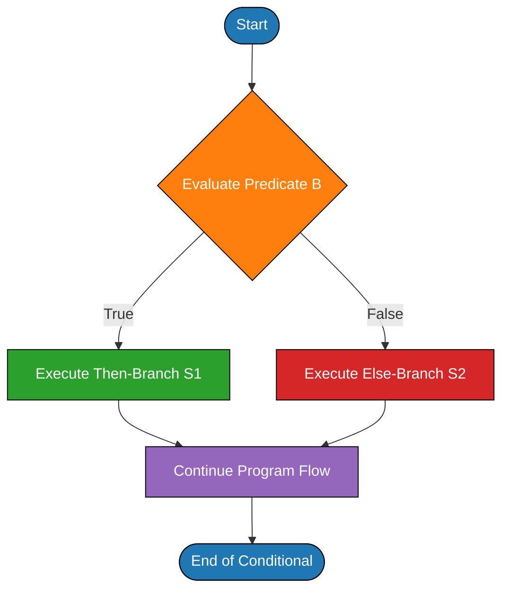
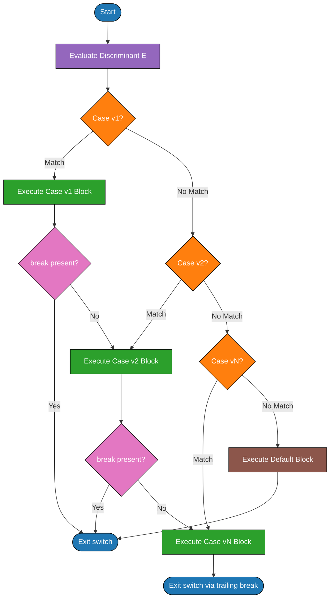
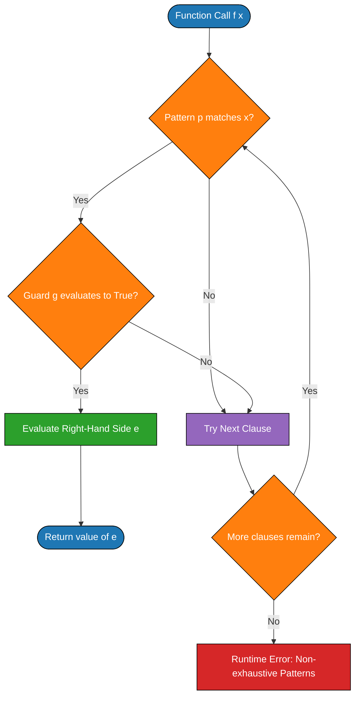
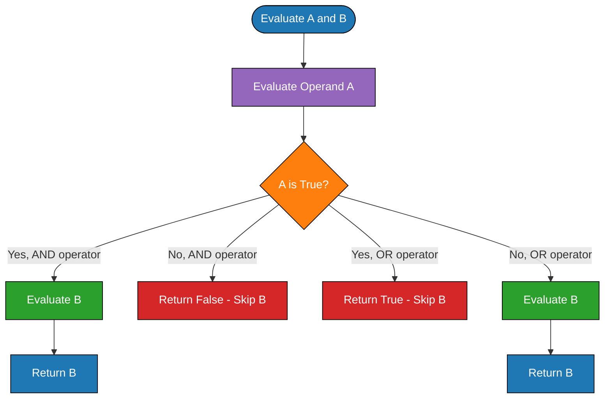

# Conditional Statements and Guards

<!-- SECTION_1_START -->
# Conditional Statements and Guards

## 1.1 Formal Academic Definition (KTU 2024 Syllabus Terminology)

> [!IMPORTANT]
> **Conditional Statements** are control structures that allow a program to execute different sequences of statements based on whether a specified boolean expression evaluates to **true** or **false**. They form the foundation of selective execution in imperative, object-oriented, and functional programming paradigms.

A **Guard** is a boolean condition attached to a pattern, equation, or function clause that must be satisfied (evaluate to true) for the corresponding rule to be selected for execution. Guards are extensively used in **functional programming languages** such as **Haskell**, **OCaml**, **Erlang**, and **Elm**, where they enable safe, exhaustive, and declarative pattern-based dispatch.

> [!NOTE]
> **KTU Syllabus Highlight (PECST758 - Module 3):**
> Study of conditional statements requires understanding three orthogonal dimensions:
> 1. **Syntactic dimension** — `if-then-else`, `switch/case`, `cond` expressions, guard clauses.
> 2. **Semantic dimension** — short-circuit evaluation, sequencing of conditions, fall-through behaviour.
> 3. **Pragmatic dimension** — when a language designer chooses *guards over nested if* or *pattern matching over case dispatch*.

## 1.2 Intuitive Overview (Real-World Analogy)

Think of a **railway signal system** at a junction:

| Real-World Element | Programming Construct |
|---|---|
| Signal light (Red / Yellow / Green) | Boolean guard expression |
| Train driver checking the signal | Runtime evaluation of condition |
| Choosing the correct track branch | Selecting the appropriate statement block |
| Emergency stop override | `else` / default branch |
| Signal logic gate in series | Short-circuit evaluation |

If the signal is **green**, the train proceeds on the fast track. If **yellow**, it slows down and takes the loop. If **red**, it halts. The train **must** evaluate signals in order — this is exactly how `if-elif-else` ladders and `case` statements work.

For **guards**, imagine a **security door** with multiple card readers. The door opens *only if* (a) you present the correct ID card *AND* (b) the time is within office hours. The combination of pattern (card) + guard (time check) determines which door unlocks.

## 1.3 Physical Constants and Standard Metrics

> [!IMPORTANT]
> **Key Boolean Truth Values (Standard):**
> - **TRUE** — represents logical certainty, often encoded as `1` in binary.
> - **FALSE** — represents logical negation, often encoded as `0` in binary.
> - **Short-circuit operators** — `&&` (logical AND), `\|\|` (logical OR) — are part of **C99 / ISO/IEC 9899:1999** standard semantics.

> [!VISUALIZATION CONTROL]
> **Concept:** Truth Table of Conditional Conjunction (AND) and Disjunction (OR)
> **GeoGebra / Desmos Input Equations:**
> * `f(x, y) = x AND y` defined piecewise for `x, y in {0, 1}`
> * `g(x, y) = x OR y` defined piecewise for `x, y in {0, 1}`
> **Visual Description:** Plot four discrete points `(0,0), (0,1), (1,0), (1,1)` on a 2D grid; the AND surface stays at `0` unless both coordinates are `1`; the OR surface rises to `1` when at least one is `1`.

<!-- SECTION_1_END -->

<!-- SECTION_2_START -->
# Deep Theoretical Analysis & KTU High-Yield Formula Sheet

## 2.1 Operational Concept Breakdown

### 2.1.1 The `if-then-else` Statement — Structural Logic

The `if-then-else` construct is the **canonical conditional** present in nearly every Turing-complete language.

**Step 1: Evaluation of the predicate.**
The expression following `if` (the *guard* or *predicate*) is evaluated first. It must return a scalar boolean value in statically-typed languages (C, Java, Haskell) or a truthy/falsy value in dynamically-typed languages (Python, JavaScript).

**Step 2: Branch selection.**
- If the predicate evaluates to **TRUE**, the *then-branch* is executed.
- If the predicate evaluates to **FALSE**, control transfers to the *else-branch* (if present).

**Step 3: Post-conditional flow.**
After the selected branch completes, control flows to the statement *immediately following* the entire `if-else` block.

### 2.1.2 The `switch` / `case` Statement — Multi-way Dispatch

The `switch` statement (also called `case` in Pascal/Ada) tests an expression against multiple constant or pattern-based alternatives.

**Step 1: Evaluate the discriminant.** The controlling expression is evaluated exactly once.

**Step 2: Pattern/Constant matching.** Each `case` label is compared against the discriminant value.

**Step 3: Execution strategy.**
- **C / Java style:** Execution *falls through* to subsequent cases unless an explicit `break` is encountered.
- **Pascal / Ada style:** Each alternative is *self-contained*; no fall-through.
- **Haskell / OCaml style:** Pattern matching exhaustively checks alternatives; the first matching pattern wins.

**Step 4: Default branch.** If no case matches, the `default` (C) or `else` (Pascal/Haskell) clause is invoked.

### 2.1.3 Guard Clauses — A Functional Paradigm

A **guard** is a boolean expression that follows a pattern in a function definition's left-hand side. The function clause is *eligible* for execution only when its pattern matches *AND* its guard evaluates to `True`.

**Step 1: Pattern matching.** The function's argument is matched against the patterns in clause order (top-to-bottom).

**Step 2: Guard evaluation.** For the first matching pattern, the guard expression is evaluated.

**Step 3: Selection.**
- If the guard is `True`, the right-hand side of that clause is evaluated and returned.
- If the guard is `False`, the next matching clause is tried.

**Step 4: Exhaustiveness check.** In statically-typed functional languages, the compiler verifies that at least one clause is guaranteed to succeed (e.g., a catch-all wildcard `_`).

### 2.1.4 Short-Circuit Evaluation

**Definition:** Short-circuit (or *McCarthy*) evaluation is an evaluation strategy where the second operand of a logical operator is evaluated *only if* the result of the operator cannot be determined from the first operand alone.

- For `&&` (AND): if the first operand is `False`, the second is *not* evaluated.
- For `\|\|` (OR): if the first operand is `True`, the second is *not* evaluated.

> [!NOTE]
> **Why does this matter?** Short-circuit evaluation enables idioms such as:
> ```python
> if ptr is not None and ptr.value > 10:
>     process(ptr)
> ```
> Here, accessing `ptr.value` would crash if `ptr` is `None`, but short-circuit evaluation guarantees safety.

### 2.1.5 Conditional Expressions vs Conditional Statements

| Property | Statement (Imperative) | Expression (Functional) |
|---|---|---|
| **Return value** | None (void) | A value |
| **Used in** | C, Java, Pascal `if-then` | Haskell, Rust, ternary in C |
| **Type** | `void` | Polymorphic / `a` |
| **Example syntax** | `if x then y := 1;` | `let y = if x then 1 else 0` |

> [!IMPORTANT]
> In **pure functional languages** (Haskell, Elm), everything is an *expression* — including conditionals. The distinction `if-then-else` *without* an `else` is a **type error** because every expression must evaluate to a value of known type.

## 2.2 KTU Formula Sheet / Cheat Sheet

| # | Construct | General Form | Evaluation Strategy | Typical Languages |
|---|---|---|---|---|
| 1 | `if-then` | `if B then S` | Evaluate `B`; if true, execute `S` | Pascal, Ada |
| 2 | `if-then-else` | `if B then S1 else S2` | Evaluate `B`; pick `S1` or `S2` | C, Java, Python |
| 3 | `if-then-elsif` | `if B1 then S1 elsif B2 then S2 else S3` | Cascading boolean test | Ada, Ruby `elsif` |
| 4 | `switch/case` | `switch(E) { case v1: ...; case v2: ...; default: ... }` | Multi-way constant dispatch | C, Java, JavaScript |
| 5 | Guarded clause | `f p \vert g = e` | Match `p`, then check guard `g` | Haskell, OCaml, Erlang |
| 6 | Conditional expr | `if B then E1 else E2` | Expression returns a value | Haskell, Rust, F\# |
| 7 | Pattern match | `case E of p1 -> e1; p2 -> e2` | Top-down pattern dispatch | Haskell, OCaml, Scala |
| 8 | Short-circuit AND | `A && B` | If `A` false, skip `B` | C, C++, Java, Python |
| 9 | Short-circuit OR | `A \vert\vert B` | If `A` true, skip `B` | C, C++, Java, Python |
| 10 | Ternary | `B ? E1 : E2` | Compact conditional expression | C, C++, Java, JavaScript |

### 2.2.1 Boundary Conditions and Semantic Rules

> [!IMPORTANT]
> **Dangling `else` problem:** In languages like C, Java, an `else` always binds to the *nearest unmatched* `if`. Resolution: use explicit braces `{ }`.
>
> **Exhaustiveness rule (Haskell):** A `case` expression or function definition with patterns must cover *all* inhabitants of the input type, or a runtime error `Non-exhaustive patterns` may occur.
>
> **Guard precedence:** Guards are tried in *source order* (top-to-bottom); the first matching pattern with a *True* guard wins.

## 2.3 Real-World Engineering Utility

| Domain | Application | Why Conditional Statements Matter |
|---|---|---|
| **Embedded Systems** | Sensor thresholding, motor control | Guard safety: `if (temp > MAX) shutdown()` |
| **Network Protocols** | Packet routing, error handling | `switch` on protocol type field |
| **Compilers** | AST traversal, code generation | Pattern matching on syntactic forms |
| **Databases** | Query optimization | `CASE WHEN ... THEN ... END` in SQL |
| **Web Servers** | HTTP status dispatch | `switch (status_code)` for response logic |
| **Functional DSLs** | Business rule engines | Guards for declarative policy evaluation |
| **Cryptography** | Authentication flows | Multi-factor verification with short-circuit AND |

<!-- SECTION_2_END -->

<!-- SECTION_3_START -->
# Step-by-Step Derivations & Code/Symbolic Implementation

## 3.1 Exhaustive Comparison: `if-else` Ladder vs `switch` vs Guards

### 3.1.1 Problem Statement

**Task:** Implement a function `grade(score)` that returns a letter grade based on the following rules:

| Score Range | Grade |
|---|---|
| $90 \leq \text{score} \leq 100$ | A |
| $80 \leq \text{score} < 90$ | B |
| $70 \leq \text{score} < 80$ | C |
| $60 \leq \text{score} < 70$ | D |
| $0 \leq \text{score} < 60$ | F |
| Otherwise | Invalid |

We will implement this in **three paradigms** for direct comparison.

---

### 3.1.2 Implementation 1 — Imperative `if-else` Ladder in C

```c
#include <stdio.h>

/*
 * Function: grade
 * Returns: char ('A', 'B', 'C', 'D', 'F', or 'X' for invalid)
 * Implements the grading rules using an if-else ladder.
 */
char grade(int score) {
    if (score < 0 || score > 100) {
        return 'X';                          // invalid boundary
    } else if (score >= 90) {
        return 'A';                          // upper band
    } else if (score >= 80) {
        return 'B';
    } else if (score >= 70) {
        return 'C';
    } else if (score >= 60) {
        return 'D';
    } else {
        return 'F';                          // score < 60
    }
}

int main(void) {
    int scores[] = {95, 82, 73, 65, 50, 105, -3};
    int n = sizeof(scores) / sizeof(scores[0]);
    for (int i = 0; i < n; i++) {
        printf("Score %d -> Grade %c\n", scores[i], grade(scores[i]));
    }
    return 0;
}
```

**Trace-through of `grade(82)`:**
1. Test `score < 0 || score > 100` → `82 < 0` is `False`; short-circuit `||` skips second test. Branch skipped.
2. Test `score >= 90` → `82 >= 90` is `False`. Branch skipped.
3. Test `score >= 80` → `82 >= 80` is `True`. Returns `'B'`.
4. Output: `Score 82 -> Grade B`

> [!NOTE]
> **Boards observation:** The `else if` ordering is critical — placing `score >= 60` *before* `score >= 90` would produce the wrong grade due to greedy matching. This is a classic KTU exam pitfall.

---

### 3.1.3 Implementation 2 — `switch` Statement in C (Discrete Buckets)

```c
#include <stdio.h>

char grade_switch(int score) {
    if (score < 0 || score > 100) return 'X';
    int bucket = score / 10;   // 0..10
    switch (bucket) {
        case 10:
        case 9:  return 'A';   // fall-through intentional
        case 8:  return 'B';
        case 7:  return 'C';
        case 6:  return 'D';
        default: return 'F';   // 0..5
    }
}

int main(void) {
    printf("Score 95 -> %c\n", grade_switch(95));
    printf("Score 60 -> %c\n", grade_switch(60));
    printf("Score 59 -> %c\n", grade_switch(59));
    return 0;
}
```

**Key Insight:** Multiple `case` labels *without* intervening code cause **fall-through**, which here is intentional (scores 90–99 both fall through to `'A'`). In typical C code, fall-through is a *bug* unless documented.

---

### 3.1.4 Implementation 3 — Haskell Guards (Declarative)

```haskell
-- File: Grade.hs
-- Function grade using guards on a single pattern
grade :: Int -> Char
grade n
  | n <  0 || n > 100 = 'X'   -- guard 1: boundary check
  | n >= 90           = 'A'   -- guard 2: top band
  | n >= 80           = 'B'   -- guard 3
  | n >= 70           = 'C'   -- guard 4
  | n >= 60           = 'D'   -- guard 5
  | otherwise         = 'F'   -- catch-all guard

-- Demonstration
main :: IO ()
main = do
  print (grade 95)  -- 'A'
  print (grade 82)  -- 'B'
  print (grade 73)  -- 'C'
  print (grade 65)  -- 'D'
  print (grade 50)  -- 'F'
  print (grade 105) -- 'X'
  print (grade (-3))-- 'X'
```

**Mathematical semantics of `grade(82)`:**

$$
\begin{aligned}
\text{grade}(82) &=
\begin{cases}
\text{`X'} & \text{if } 82 < 0 \lor 82 > 100 \\
\text{`A'} & \text{if } 82 \geq 90 \\
\text{`B'} & \text{if } 82 \geq 80 \\
\text{`C'} & \text{if } 82 \geq 70 \\
\text{`D'} & \text{if } 82 \geq 60 \\
\text{`F'} & \text{otherwise}
\end{cases}
\end{aligned}
$$

Evaluation proceeds top-down:
1. $82 < 0$ is **False**; $82 > 100$ is **False**; disjunction is **False**. Guard 1 fails.
2. $82 \geq 90$ is **False**. Guard 2 fails.
3. $82 \geq 80$ is **True**. Guard 3 succeeds; return `'B'`.

---

### 3.1.5 Implementation 4 — OCaml Pattern Matching with Guards

```ocaml
(* File: grade.ml *)
let grade n =
  match n with
  | _ when n < 0 || n > 100 -> 'X'
  | _ when n >= 90 -> 'A'
  | _ when n >= 80 -> 'B'
  | _ when n >= 70 -> 'C'
  | _ when n >= 60 -> 'D'
  | _ -> 'F'

let () =
  Printf.printf "grade(95) = %c\n" (grade 95);
  Printf.printf "grade(82) = %c\n" (grade 82);
  Printf.printf "grade(50) = %c\n" (grade 50)
```

> [!NOTE]
> **OCaml Pitfall:** Guards in `match` patterns must be *pure* boolean expressions; they cannot bind variables or perform side effects. The pattern `_` matches everything, and the `when` clause filters it.

---

## 3.2 Derivation: Translating Guards to `if-else` Ladder

**Claim:** Any guarded function can be mechanically desugared into a nested `if-then-else` expression.

**Derivation (Haskell → C):**

$$
\begin{aligned}
\text{Haskell:}\quad & f \, p_1 \mid g_1 = e_1 \\
                    & f \, p_2 \mid g_2 = e_2 \\
                    & f \, p_3 = e_3 \\[4pt]
\text{Equivalent C:}\quad & \text{if (matches}(p_1, x) \text{ \&\& } g_1(x)) \;\; e_1; \\
                          & \text{else if (matches}(p_2, x) \text{ \&\& } g_2(x)) \;\; e_2; \\
                          & \text{else if (matches}(p_3, x)) \;\; e_3; \\
                          & \text{else runtime\_error();}
\end{aligned}
$$

The desugaring preserves:
1. **Source order** of clause evaluation.
2. **Short-circuit semantics** (a failed pattern check skips its guard).
3. **Exhaustiveness** (a final wildcard or runtime check).

---

## 3.3 Algorithm: Short-Circuit Evaluation Trace

**Algorithm to evaluate `A && B` in C:**

```
1. Evaluate A.
2. If A is FALSE (or 0):
       Return FALSE immediately.
       (B is not evaluated — side effects in B do not occur.)
3. Else (A is TRUE):
       Evaluate B.
       Return the value of B.
```

**Algorithm to evaluate `A || B` in C:**

```
1. Evaluate A.
2. If A is TRUE (non-zero):
       Return TRUE immediately.
       (B is not evaluated.)
3. Else (A is FALSE):
       Evaluate B.
       Return the value of B.
```

**Proof of Correctness (by cases for `&&`):**

$$
\begin{aligned}
(A \land B) \text{ is true} &\iff A = \text{True} \text{ and } B = \text{True} \\
\text{Step 1: evaluate } A = \text{True} &\Rightarrow \text{step 3 runs, evaluates } B, \text{ returns } B = \text{True} \;\; \checkmark \\
\text{Step 1: evaluate } A = \text{False} &\Rightarrow \text{step 2 returns False immediately} \;\; \checkmark
\end{aligned}
$$

Both cases yield the truth-table value of logical AND, so the algorithm is correct.

---

## 3.4 Comparison Table: Three Paradigms Side-by-Side

| Feature | Imperative `if-else` (C) | Multi-way `switch` (C) | Guards (Haskell) |
|---|---|---|---|
| **Decision granularity** | Boolean predicates only | Integer/enum constant | Boolean predicate over pattern |
| **Order dependency** | Yes | Yes (top-down) | Yes (top-down) |
| **Fall-through** | None (else is required for full coverage) | Optional via missing `break` | N/A (first match wins) |
| **Exhaustiveness check** | None at compile time | None at compile time | Compile-time warning/error |
| **Side effects in predicate** | Permitted | Permitted | Discouraged (purity) |
| **Expressiveness** | Low | Medium | High (declarative) |
| **Failure mode** | Silent fall-through to next statement | Silent fall-through to next case | Runtime exception (no match) |
| **Used in production at** | OS kernels, drivers | Compilers, parsers | Haskell web backends (Yesod, Servant) |

---

## 3.5 Worked Example: Dangling `else` Resolution

**Problematic C code:**

```c
if (a > 0)
    if (b > 0)
        printf("both positive\n");
else
    printf("this binds to the inner if\n");
```

**Resolution using braces:**

```c
if (a > 0) {
    if (b > 0) {
        printf("both positive\n");
    } else {
        printf("a positive, b non-positive\n");
    }
} else {
    printf("a non-positive\n");
}
```

**Grammar rule (C99 §6.8.4):** An `else` is associated with the *lexically nearest* `if` that does not already have an `else`.

<!-- SECTION_3_END -->

<!-- SECTION_4_START -->
# Structural Diagrams & Schematics

## 4.1 Control Flow: `if-then-else`



## 4.2 Control Flow: `switch` Statement with Fall-through



## 4.3 Guard Clause Evaluation Pipeline (Haskell)



## 4.4 Short-Circuit AND / OR Decision Logic



## 4.5 Block-Level Functional Architecture: Conditional Dispatch Subsystem

```mermaid
flowchart LR
    subgraph IN1[Input Layer]
        inSrc[Source Code with if-else/switch/guards]
    end

    subgraph LEX1[Lexical Analysis]
        tokens[Tokens: if, else, switch, case, |, when, otherwise]
    end

    subgraph PARSE1[Parser]
        astNode[AST Node: IfExpr / CaseExpr / GuardedAlt]
    end

    subgraph TYPE1[Type Checker]
        boolCheck[Verify predicate is Bool]
        exhaustCheck[Verify exhaustiveness]
    end

    subgraph CODEGEN1[Code Generation]
        branchInstr[Emit Branch Instructions]
        phiNode[Emit Phi / Merge Node]
    end

    subgraph RUNTIME1[Runtime Execution]
        evalPred[Evaluate Predicate]
        dispatch[Branch to Selected Block]
        merge[Continue at Merge Point]
    end

    inSrc --> tokens
    tokens --> astNode
    astNode --> boolCheck
    boolCheck --> exhaustCheck
    exhaustCheck --> branchInstr
    branchInstr --> phiNode
    phiNode --> evalPred
    evalPred --> dispatch
    dispatch --> merge

    style IN1 fill:#cfe2ff,stroke:#000
    style LEX1 fill:#d1e7dd,stroke:#000
    style PARSE1 fill:#fff3cd,stroke:#000
    style TYPE1 fill:#f8d7da,stroke:#000
    style CODEGEN1 fill:#e2d9f3,stroke:#000
    style RUNTIME1 fill:#cff4fc,stroke:#000
```

<!-- SECTION_4_END -->

<!-- SECTION_5_START -->
# KTU 2024 Scheme Examination Question Bank & Topic Recap

## 5.1 Part A Questions (3 Marks Each)

> **Q1. [KTU University Exam - Dec 2023]** Define a *guard* in the context of functional programming languages. How does it differ from a conventional `if-then-else` statement?

**Model Answer (3 marks):**

A **guard** is a boolean expression attached to a pattern in a function clause, written after a vertical bar `|`. The clause is selected for execution only if (a) the pattern matches the argument *and* (b) the guard evaluates to `True`. **Key differences from `if-then-else`:** *(1 mark)*

- Guards allow multiple, parallel, *named* alternatives for the *same* pattern (or different patterns) without nesting.
- In Haskell, guards are part of the function's *declarative* syntax and are checked top-down, picking the first that succeeds.
- `if-then-else` is a single boolean fork with two branches; guards generalize this to *n* ordered boolean conditions.
- Guards are typically *pure* (no side effects), while `if` predicates in imperative languages can have side effects.

**[Definition of guard: 1 mark] [Differences listed: 2 marks]**

---

> **Q2. [KTU University Exam - July 2024]** Explain *short-circuit evaluation* with a suitable example. Why is it important in programming languages like C and Java?

**Model Answer (3 marks):**

Short-circuit evaluation is a strategy in which the second operand of a logical operator is evaluated *only if* the first operand's value does not already determine the result. **(1 mark)**

In C / Java:
- `A && B`: `B` is evaluated only if `A` is *true*; otherwise the expression short-circuits to `false`.
- `A || B`: `B` is evaluated only if `A` is *false*; otherwise the expression short-circuits to `true`.

**Example:**
```c
if (ptr != NULL && ptr->value > 10) { ... }
```
If `ptr` is `NULL`, the second operand is *not* evaluated, preventing a null-pointer dereference. **(1 mark)**

**Importance:** (a) Prevents runtime errors, (b) improves performance by skipping unnecessary work, (c) enables common idioms like null-checks and division-by-zero guards. **(1 mark)**

---

## 5.2 Part B Questions (14 Marks Each) — Module Internal Choice

> ### Question A (14 Marks) **[KTU University Exam - Dec 2023]**
>
> **(a)** Compare and contrast *conditional statements* and *guards* as control-flow mechanisms in programming languages. Discuss their syntactic forms, semantic evaluation order, and use in at least two different language paradigms. *(7 marks)*
>
> **(b)** Implement a function `classify(n: Int): String` in **Haskell** using guards that returns `"Positive Even"`, `"Positive Odd"`, `"Zero"`, or `"Negative"` for an integer `n`. Show the output for inputs `-7, 0, 4, 11`. *(7 marks)*

---

**Model Solution:**

**(a) Comparison of Conditional Statements and Guards** *(7 marks)*

| Aspect | Conditional Statements (`if-then-else`, `switch`) | Guard Clauses |
|---|---|---|
| **Origin paradigm** | Imperative / structured programming | Functional / declarative programming |
| **Syntactic position** | Standalone control construct | Inline with function / pattern definition |
| **Number of branches** | 2 (if-else) or n (switch/case) | n (unlimited) |
| **Evaluation order** | Top-to-bottom in C/Java; unspecified in some languages | Strictly top-to-bottom in Haskell, OCaml |
| **Combinator with patterns** | Not directly | Native (pattern + guard) |
| **Exhaustiveness check** | None (runtime fall-through) | Compile-time in pure FP |
| **Side effects in predicate** | Permitted | Discouraged |
| **Example languages** | C, Java, Pascal, Ada | Haskell, OCaml, Erlang, Clean |
| **Failure mode on no match** | Silent fall-through or default branch | Non-exhaustive pattern runtime error |
| **Readability for multi-condition rules** | Nested `if-else` becomes hard to read | Flat, declarative, easy to scan |

**Syntactic Forms:**
- Conditional: `if (B) S1 else S2` (C) or `switch (E) { case v1: ... }` (C/Java).
- Guard: `f p | g1 = e1 | g2 = e2 | otherwise = e3` (Haskell).

**Semantic Evaluation Order:**
- Conditional: evaluate predicate → branch → continue.
- Guards: try each clause in source order; first with *True* guard wins; if none, runtime error (no match).

**Use in Paradigms:**
1. *Imperative (C/Java):* `if-else` for boolean forks; `switch` for multi-way constant dispatch (e.g., opcode decoding in a VM).
2. *Functional (Haskell):* Guards for recursive definitions, type-class dispatch, and rule-based systems (e.g., tax calculators, grading systems).

**[Comparison table: 3 marks] [Syntactic & semantic discussion: 2 marks] [Two paradigms discussed: 2 marks]**

---

**(b) Haskell Implementation with Guards** *(7 marks)*

```haskell
-- File: Classify.hs
-- classify uses guards to categorize integers

classify :: Int -> String
classify n
  | n == 0               = "Zero"            -- guard 1: exact equality
  | n > 0 && even n      = "Positive Even"   -- guard 2: positive AND even
  | n > 0                = "Positive Odd"    -- guard 3: positive implies odd here
  | otherwise            = "Negative"        -- catch-all

-- Demonstration
main :: IO ()
main = do
  putStrLn (classify (-7))   -- "Negative"
  putStrLn (classify 0)      -- "Zero"
  putStrLn (classify 4)      -- "Positive Even"
  putStrLn (classify 11)     -- "Positive Odd"
```

**Trace Table:**

| Input `n` | Guard 1 (`n == 0`) | Guard 2 (`n > 0 && even n`) | Guard 3 (`n > 0`) | Result |
|---|---|---|---|---|
| $-7$ | False | False (short-circuit at `n > 0`) | False | `"Negative"` |
| $0$ | True | — | — | `"Zero"` |
| $4$ | False | True | — | `"Positive Even"` |
| $11$ | False | False | True | `"Positive Odd"` |

**[Function signature and 4 guards: 3 marks] [Correct logic & short-circuit use: 2 marks] [Output verification: 2 marks]**

---

> ### Question B (14 Marks) **[KTU University Exam - July 2024]**
>
> **(a)** With a neat flowchart and C program, explain how a `switch` statement handles multiple alternatives. Discuss the concept of *fall-through* and the role of the `break` statement. *(7 marks)*
>
> **(b)** Translate the following Haskell guarded function into an equivalent C `switch`/nested `if-else` program, preserving semantics:
>
> ```haskell
> tier :: Int -> String
> tier x
>   | x < 0     = "Invalid"
>   | x < 13    = "Child"
>   | x < 20    = "Teen"
>   | x < 60    = "Adult"
>   | otherwise = "Senior"
> ```
>
> Show the output for `tier(-5), tier(10), tier(15), tier(35), tier(70)`. *(7 marks)*

---

**Model Solution:**

**(a) `switch` Statement Explanation** *(7 marks)*

**Flowchart:** (refer to the Mermaid diagram in Section 4.2 of these notes)

**C Program Demonstrating Fall-through:**

```c
#include <stdio.h>

int main(void) {
    int day = 3;

    switch (day) {
        case 1:
            printf("Monday\n");
            break;                       // exits the switch
        case 2:
            printf("Tuesday\n");
            break;
        case 3:
            printf("Wednesday\n");
            // INTENTIONAL FALL-THROUGH: no break here
        case 4:
            printf("Thursday\n");
            break;
        case 5:
            printf("Friday\n");
            break;
        default:
            printf("Weekend\n");
    }
    return 0;
}
```

**Output for `day = 3`:**
```
Wednesday
Thursday
```

**Discussion Points:**

1. **Multi-way dispatch:** The discriminant `day` is evaluated once, and control jumps to the matching `case` label — O(1) jump-table or O(n) linear search depending on compiler. *(1 mark)*
2. **Fall-through:** When a `case` block lacks a `break`, execution *continues* into the *next* case, executing its statements too, until a `break` or end-of-switch is reached. *(2 marks)*
3. **Role of `break`:** Causes immediate exit from the `switch` block, transferring control to the statement after the switch. *(1 mark)*
4. **Default case:** Handles the no-match scenario gracefully, preventing silent failure. *(1 mark)*
5. **Use cases:** Useful for *stacked* categories (e.g., grouping Mon–Fri as "weekday", Sat–Sun as "weekend") but a common source of bugs if `break` is forgotten. *(2 marks)*

**[Flowchart/diagram: 2 marks] [Code with intentional fall-through: 2 marks] [Discussion of break and default: 3 marks]**

---

**(b) Translation from Haskell Guards to C** *(7 marks)*

**Haskell Source (given):**
```haskell
tier x
  | x <  0  = "Invalid"
  | x < 13   = "Child"
  | x < 20   = "Teen"
  | x < 60   = "Adult"
  | otherwise = "Senior"
```

**C Translation using nested `if-else`:**

```c
#include <stdio.h>
#include <string.h>

/*
 * Function: tier
 * Returns: const char* string label
 * Semantics: Top-down boolean check, mirroring Haskell guard order.
 */
const char* tier(int x) {
    if (x < 0) {
        return "Invalid";            // guard 1
    } else if (x < 13) {
        return "Child";              // guard 2: 0..12
    } else if (x < 20) {
        return "Teen";               // guard 3: 13..19
    } else if (x < 60) {
        return "Adult";              // guard 4: 20..59
    } else {
        return "Senior";             // guard 5: 60 and above
    }
}

int main(void) {
    int inputs[] = {-5, 10, 15, 35, 70};
    int n = sizeof(inputs) / sizeof(inputs[0]);
    for (int i = 0; i < n; i++) {
        printf("tier(%d) = %s\n", inputs[i], tier(inputs[i]));
    }
    return 0;
}
```

**Output Trace Table:**

| Input `x` | First True Guard | Result |
|---|---|---|
| $-5$ | `x < 0` | `"Invalid"` |
| $10$ | `x < 13` | `"Child"` |
| $15$ | `x < 20` | `"Teen"` |
| $35$ | `x < 60` | `"Adult"` |
| $70$ | `otherwise` (else) | `"Senior"` |

**Program Output:**
```
tier(-5) = Invalid
tier(10) = Child
tier(15) = Teen
tier(35) = Adult
tier(70) = Senior
```

**[Correct function structure and 5 branches: 3 marks] [Preservation of guard order: 2 marks] [Output verification for all 5 inputs: 2 marks]**

---

## 5.3 KTU Examiner's Valuation Warning / Pitfall Callout

> [!WARNING]
> **Common Mark-Loss Pitfalls in Conditional Statements and Guards:**
>
> 1. **Reversed guard order in if-else ladders:** Placing the most *general* condition first (e.g., `x > 0`) and the *specific* condition later (e.g., `x > 100`) will cause the specific check to be unreachable. Always test *most specific* first when using independent `if` statements, or use `else if` with *broadest-first* matching.
>
> 2. **Forgetting `break` in C `switch`:** Fall-through is *not* the default in exam answers — students routinely lose 1–2 marks by accidentally allowing fall-through where it is unintended. Use comments to mark intentional fall-through.
>
> 3. **Missing `else` branch in pure functional languages:** In Haskell, an `if` without `else` is a *type error* because the `if` is an expression that must yield a value of type `a`. Examiners deduct marks for this.
>
> 4. **Misnaming "guards" as "loops":** Guards are *not* iteration constructs; they are *conditional dispatch* mechanisms. Do not confuse with `while` / `for`.
>
> 5. **Ignoring short-circuit side effects:** Writing `ptr != NULL && ptr->data > 5` is correct only because of short-circuit; if the language does *not* short-circuit, the code crashes. State the language's evaluation rule.
>
> 6. **Dangling `else` ambiguity:** Always use braces `{ }` to disambiguate nested `if-else` structures; examiners mark this strictly.
>
> 7. **Non-exhaustive patterns:** In Haskell, a `case` without a wildcard `_` produces a runtime error on unmatched input. Always include a catch-all or use `Maybe` types.

---

## 5.4 Topic Recap & Important Things to Remember

> **Rapid Revision Checklist:**

- **Conditional statements** are control structures that select execution paths based on boolean predicates; they exist in nearly every programming language.
- The three primary forms are: `if-then-else` (binary branch), `switch/case` (multi-way constant dispatch), and **guards** (pattern + boolean dispatch in functional languages).
- **`if-then-else` syntax** in C: `if (B) S1; else S2;` — the predicate `B` is a scalar expression (zero = false, non-zero = true).
- **`switch` syntax** in C: `switch (E) { case v1: ...; case v2: ...; default: ...; }` — uses an integer/enum discriminant and supports *fall-through* unless `break` is present.
- **Guards in Haskell**: written as `f p | g1 = e1 | g2 = e2 | otherwise = e3` — top-down evaluation, first match with a `True` guard wins.
- **Guards in OCaml**: written as `| p when g -> e` within a `match` expression.
- **Short-circuit evaluation** for `&&`: skip RHS if LHS is false; for `\|\|`: skip RHS if LHS is true. Standard in C, C++, Java, Python, JavaScript.
- **Conditional expressions** (Haskell, Rust) treat `if` as an expression that *returns a value*, not a statement. The `else` branch is *mandatory* in such languages.
- **Dangling `else` problem**: an `else` binds to the *nearest* unmatched `if`; use explicit braces to disambiguate.
- **Exhaustiveness**: pure functional languages enforce that pattern matches cover all input cases (compile-time check) — missing cases result in warnings or runtime errors.
- **`otherwise` keyword** in Haskell is simply an alias for `True`, conventionally placed as the final guard in a function definition.
- **Fall-through** in C `switch` allows grouping multiple `case` labels to share code; in Pascal/Ada, each alternative is isolated and fall-through is impossible.
- **Real-world applications**: motor control (`if` over sensor thresholds), HTTP routing (`switch` over status codes), compiler AST traversal (pattern matching in functional compilers), authentication (short-circuit guards).
- **Key trade-off**: imperative conditionals allow side effects but lose compile-time exhaustiveness; functional guards are pure and checked but can be less expressive for effectful logic.

> [!TIP]
> **One-line memory aid:** *`if-else` is a fork in the road, `switch` is a multi-track switchyard, and **guards** are a smart filter on a pattern-matched conveyor belt — each test in sequence, first success wins.*

<!-- SECTION_5_END -->
