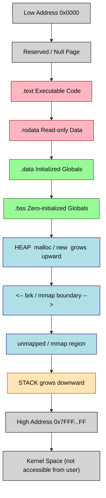
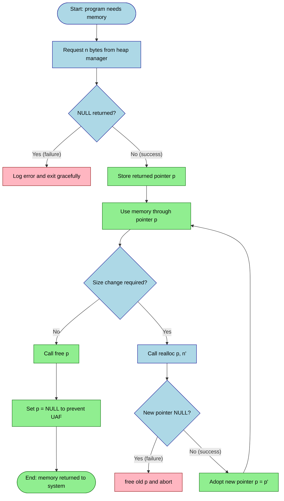
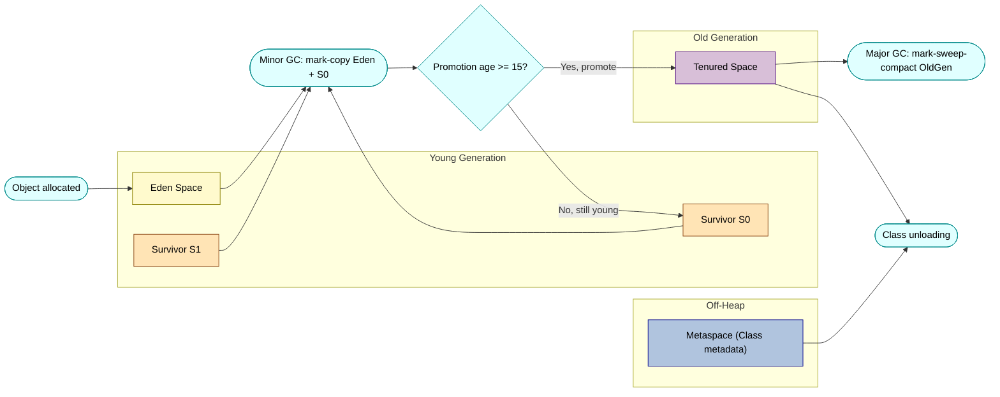
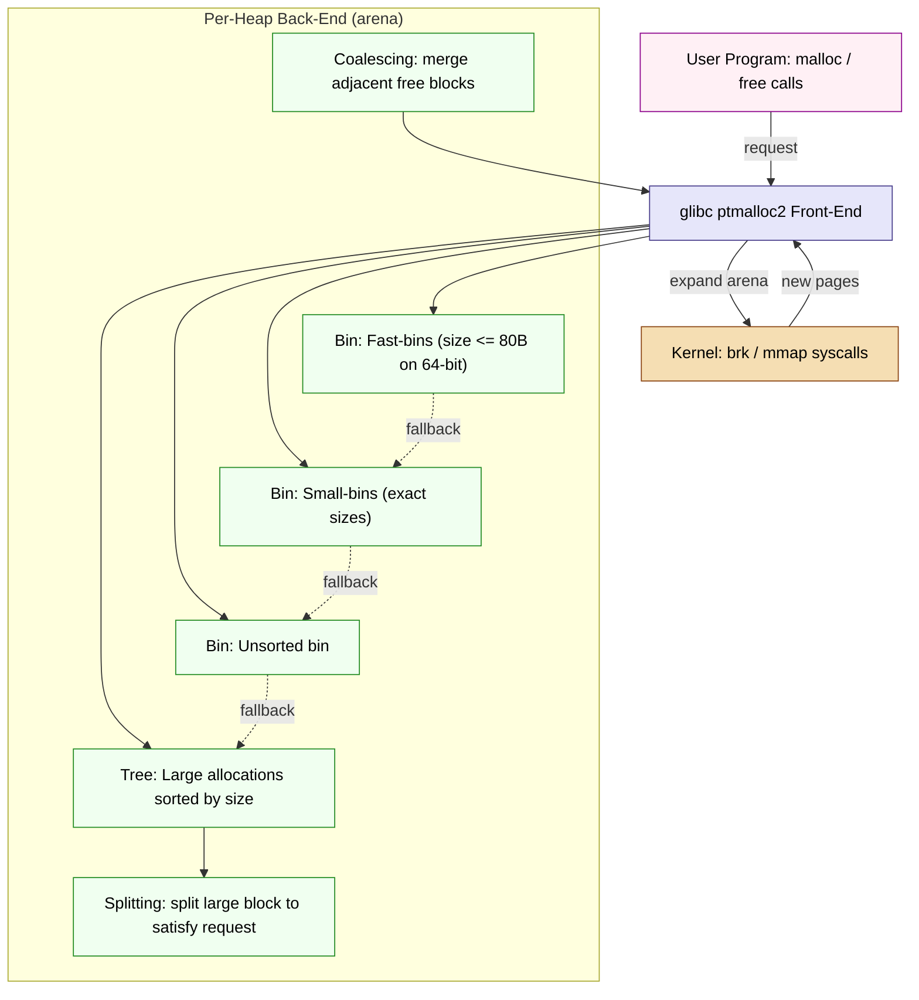

# Dynamic Memory Management

<!-- SECTION_1_START -->
# Dynamic Memory Management — Core Technical Definition & Intuition

## 1. Formal Academic Definition (KTU 2024 Syllabus Terminology)

> [!IMPORTANT]
> **Dynamic Memory Management (DMM)** is the process of allocating, using, and deallocating memory at **runtime** (i.e., during program execution) from a non-contiguous, programmer-controlled region of RAM commonly known as the **Heap**. It enables variable-sized data structures whose lifetime is not bound to the lexical scope of any single function or block, in contrast to **Static** or **Stack** allocation which are resolved at compile time.

In the KTU 2024 Scheme (Course Code: **PECST758 — Programming Languages**), Module 3 treats DMM as the runtime mechanism that supports **expressions and statements** whose memory footprint cannot be predicted at parse time — e.g., linked lists, trees, resizable arrays, and object graphs.

## 2. Conceptual Analogy — Plain English Intuition

> [!NOTE]
> **Analogy — The Magic Expanding Backpack vs. The Fixed School Locker**
>
> - A **stack variable** (e.g., `int x;` inside a function) is like a *fixed school locker*: the school gives you a locker of a fixed size at the start of the term, and the moment your class ends, the locker vanishes automatically.
> - A **dynamically allocated variable** (e.g., `malloc` or `new`) is like a *magic expanding backpack* you buy from a wizard: you can stuff as much (or as little) into it as you want, carry it between classes (functions), and you **must remember** to give it back to the wizard — otherwise the wizard runs out of backpacks (this is a **memory leak**).

## 3. The Three Memory Regions Every Program Uses

| Region | Allocation Time | Lifetime Control | Typical Use |
|---|---|---|---|
| **Static / Global** | Compile time | Entire program run | Global variables, string literals |
| **Stack** | Function call | Until function returns | Local variables, function parameters |
| **Heap** | Runtime (dynamic) | Programmer-controlled | Linked structures, large buffers, objects |

> [!TIP]
> The **Heap** is the only region where memory size and lifetime are decided *while the program is running*. This is what makes "dynamic" memory *dynamic*.

## 4. Physical Constants & Standard Metrics (Highlighted)

- A **byte** = **8 bits** (fundamental addressable unit in C/C++).
- The size of a pointer on a 64-bit system = **8 bytes** (matches the CPU word size).
- `sizeof(void*)` returns the platform pointer width — typically **4 bytes** on 32-bit and **8 bytes** on 64-bit.
- Memory addresses are conventionally printed in **hexadecimal** (e.g., `0x7ffee3a4`) because binary would be unreadable.

## 5. GeoGebra / Desmos Visualization Callout

> [!VISUALIZATION CONTROL]
> **Concept:** Growth of heap memory consumption over time during repeated allocations without freeing.
> **GeoGebra / Desmos Input Equations:**
> * `H(t) = t \cdot 64` (bytes consumed by a loop that allocates 64 bytes per iteration, t in iterations)
> * `S(t) = 4096` (constant stack size, for comparison)
> **Visual Description:** Plot `H(t)` as a strictly increasing straight line climbing out of the visible window, and `S(t)` as a flat horizontal line near the x-axis. The widening gap between the two lines is the *visible signature of a memory leak*.
<!-- SECTION_1_END -->

<!-- SECTION_2_START -->
# Deep Theoretical Analysis & KTU High-Yield Formula Sheet

## 1. The Two Families of Dynamic Allocation

### A. Manual Management (C / C++ style)
The programmer explicitly invokes library routines to request and release memory.

> [!IMPORTANT]
> In **C**, the standard library `<stdlib.h>` provides the four canonical functions: `malloc`, `calloc`, `realloc`, and `free`. In **C++**, the operators `new` and `delete` perform the same logical job but additionally invoke **constructors** and **destructors**.

### B. Automatic Management (Java / Python / C# style)
A **Garbage Collector (GC)** — a runtime subsystem — automatically reclaims memory that the program can no longer reach via any chain of pointers. The programmer never writes a `free()` call.

## 2. Operational Logic — The Memory Lifecycle (5 Phases)

1. **Request** — Call `malloc(size)` / `calloc(count, size)` / `new Type[size]`.
2. **Check** — Always verify the returned pointer is **not `NULL`**. A `NULL` return means the heap is exhausted (commonly called *out-of-memory*).
3. **Use** — Dereference and operate on the memory through the returned pointer.
4. **Reallocate (optional)** — If the size must change, call `realloc(ptr, newSize)`. The old block may be **moved** to a new location; the new pointer must always replace the old one.
5. **Release** — Call `free(ptr)` (C) or `delete[] ptr` (C++). After release, the pointer is **dangling** and must NOT be dereferenced.

> [!WARNING]
> The single most common bug in C/C++ is **using a pointer after `free()`** — a *use-after-free* (UAF) defect. Always set the pointer to `NULL` immediately after freeing: `free(p); p = NULL;`

## 3. KTU Formula Sheet / Cheat Sheet

| Symbol / Function | Meaning | Return Type | Failure Mode |
|---|---|---|---|
| $p = \text{malloc}(n)$ | Allocates $n$ **bytes** of **uninitialized** memory | `void*` | Returns `NULL` |
| $p = \text{calloc}(c, s)$ | Allocates $c \times s$ bytes, **zero-initialized** | `void*` | Returns `NULL` |
| $p' = \text{realloc}(p, n')$ | Resizes block $p$ to $n'$ bytes (may relocate) | `void*` | Returns `NULL`; original $p$ still valid |
| $\text{free}(p)$ | Releases block; no return value | `void` | Calling on `NULL` is a no-op |
| $T^{*} \, p = \text{new} \, T$ | C++ typed allocation + constructor | `T*` | Throws `std::bad_alloc` |
| $\text{delete} \, p$ | C++ deallocation + destructor | `void` | Double-delete = undefined behavior |

> [!NOTE]
> **Memory Footprint Math** — The total heap usage of a data structure with $n$ elements is given by:
> $$\text{Heap}_{\text{total}} = n \cdot (\text{sizeof}(T)) + \text{overhead}_{\text{allocator}}$$
> where $\text{overhead}_{\text{allocator}}$ is typically **16–32 bytes per allocation** (bookkeeping for block size and next/prev pointers used by the heap manager).

## 4. Engineering Utility — Why DMM Matters in Production

- **Operating Systems** use dynamic allocation for **process stacks that grow on demand** (e.g., Linux's `expand_stack()`).
- **Databases** allocate buffers dynamically for query results whose size depends on the data.
- **Compilers & Interpreters** (CPython, the JVM) use DMM heavily — every Python object lives on the heap.
- **Embedded / Real-Time Systems** often *forbid* DMM because non-deterministic allocation time violates timing guarantees. This is why flight-control firmware uses static pools (FreeRTOS `pvPortMalloc` with fixed-size blocks).
- **Security** — DMM is the root of classic vulnerabilities: *buffer overflows* (writing past a heap block), *double-frees* (corrupting allocator metadata), and *UAF* (used in many browser exploits).

## 5. The Three Classic Memory Bugs (Examiner's Favourite Trio)

1. **Memory Leak** — Memory is allocated but never freed; process RSS grows monotonically.
2. **Dangling Pointer** — Pointer outlives the block it references; dereference = UAF.
3. **Double Free** — Same block freed twice; corrupts the allocator's free list and can lead to arbitrary code execution.
<!-- SECTION_2_END -->

<!-- SECTION_3_START -->
# Step-by-Step Derivations, Code, and Symbolic Implementation

## 1. C-Style Manual Memory Management — Full Operational Code

The following program demonstrates **all four** canonical functions, with explicit error logging and absolute boundary checks at every step.

```c
/*
 * File: dynamic_memory_demo.c
 * Course: PECST758 - Programming Languages, Module 3
 * Compile: gcc -std=c11 -Wall -Wextra -fsanitize=address dynamic_memory_demo.c -o demo
 */
#include <stdio.h>
#include <stdlib.h>
#include <string.h>
#include <errno.h>

/* Safe integer multiplication with overflow guard (KTU board expects this) */
static int safe_multiply(size_t count, size_t size, size_t *out) {
    if (count == 0 || size == 0) {
        *out = 0;
        return 0;
    }
    if (count > SIZE_MAX / size) {
        return -1;   /* overflow would occur */
    }
    *out = count * size;
    return 0;
}

int main(void) {
    /* ---- Phase 1: malloc ---------------------------------------------------- */
    size_t n = 5;
    int *arr = (int *)malloc(n * sizeof(int));
    if (arr == NULL) {
        fprintf(stderr, "malloc failed: %s\n", strerror(errno));
        return EXIT_FAILURE;
    }
    for (size_t i = 0; i < n; ++i) {
        arr[i] = (int)(i * i);     /* 0, 1, 4, 9, 16 */
    }
    printf("malloc block at address: %p, first element = %d\n",
           (void *)arr, arr[0]);

    /* ---- Phase 2: realloc --------------------------------------------------- */
    size_t new_n = 10;
    int *new_arr = (int *)realloc(arr, new_n * sizeof(int));
    if (new_arr == NULL) {
        /* realloc failure: ORIGINAL block at 'arr' is still valid */
        fprintf(stderr, "realloc failed: %s\n", strerror(errno));
        free(arr);
        arr = NULL;
        return EXIT_FAILURE;
    }
    arr = new_arr;          /* adopt the new pointer (may have moved) */
    for (size_t i = n; i < new_n; ++i) {
        arr[i] = (int)(i * 10);   /* 50, 60, 70, 80, 90 */
    }

    /* ---- Phase 3: calloc (zero-initialized) -------------------------------- */
    size_t count = 0, byte_size = 0;
    if (safe_multiply(new_n, sizeof(int), &byte_size) != 0) {
        fprintf(stderr, "size overflow\n");
        free(arr);
        return EXIT_FAILURE;
    }
    int *zero_arr = (int *)calloc(new_n, sizeof(int));
    if (zero_arr == NULL) {
        fprintf(stderr, "calloc failed: %s\n", strerror(errno));
        free(arr);
        return EXIT_FAILURE;
    }
    printf("calloc block: first 3 bytes are 0? %s\n",
           (zero_arr[0] == 0 && zero_arr[1] == 0 && zero_arr[2] == 0)
               ? "YES" : "NO");

    /* ---- Phase 4: free (and nullify to avoid UAF) --------------------------- */
    free(arr);
    arr = NULL;             /* defensive nullification */
    free(zero_arr);
    zero_arr = NULL;

    /* Calling free(NULL) below is a GUARANTEED no-op, not an error */
    free(arr);
    free(zero_arr);

    printf("All blocks released cleanly.\n");
    return EXIT_SUCCESS;
}
```

### Walk-through of the *Exact* Execution Path

| Step | Statement | What Happens in Memory |
|---|---|---|
| 1 | `malloc(n * sizeof(int))` | Heap manager walks its free list, finds a 20-byte aligned hole, marks it *in-use*, returns its address. The 20 bytes contain **garbage** (uninitialized). |
| 2 | `arr[i] = i*i` | Stores `0, 1, 4, 9, 16` at offsets 0, 4, 8, 12, 16 from `arr`. |
| 3 | `realloc(arr, 40)` | Allocator checks if the existing 20-byte block can be extended **in place** (next block is free and adjacent). If yes, returns the *same* pointer. If no, allocates 40 bytes elsewhere, copies the original 20 bytes, frees the old block, and returns the **new** address. |
| 4 | `calloc(10, 4)` | Allocator zeroes 40 bytes by writing `0x00` to every byte — guarantee stronger than `malloc + memset`. |
| 5 | `free(arr)` | Allocator marks the 40-byte block as free, coalesces with adjacent free blocks, places it back on the free list. |
| 6 | `arr = NULL` | Pure software safety — the CPU does not clear the address; the C code does. |

## 2. C++ Style — `new` / `delete` with Constructors

```cpp
/*
 * File: cpp_dynamic_memory.cpp
 * Compile: g++ -std=c++17 -Wall -Wextra -fsanitize=address cpp_dynamic_memory.cpp
 */
#include <iostream>
#include <new>          // std::nothrow, std::bad_alloc
#include <memory>       // std::unique_ptr, std::make_unique
#include <string>

class Sensor {
private:
    std::string name_;
    double reading_;
public:
    Sensor(const std::string& name, double reading)
        : name_(name), reading_(reading) {
        std::cout << "Sensor(" << name_ << ") constructed at "
                  << static_cast<const void*>(this) << '\n';
    }
    ~Sensor() {
        std::cout << "Sensor(" << name_ << ") destroyed\n";
    }
    double value() const { return reading_; }
};

int main() {
    /* ---- (a) raw new / delete ---------------------------------------- */
    Sensor* s1 = nullptr;
    try {
        s1 = new Sensor("Temperature", 36.6);
    } catch (const std::bad_alloc& e) {
        std::cerr << "Allocation failed: " << e.what() << '\n';
        return 1;
    }
    std::cout << "Reading: " << s1->value() << '\n';
    delete s1;          /* destructor called, then memory freed */

    /* ---- (b) nothrow variant (returns nullptr instead of throwing) --- */
    Sensor* s2 = new (std::nothrow) Sensor("Pressure", 101.3);
    if (s2 == nullptr) {
        std::cerr << "nothrow allocation failed\n";
        return 1;
    }
    delete s2;

    /* ---- (c) modern C++: std::unique_ptr (RAII, no manual delete) ---- */
    auto s3 = std::make_unique<Sensor>("Humidity", 55.0);
    std::cout << "Reading: " << s3->value() << '\n';
    /* No delete needed — destructor runs automatically at scope end */
    return 0;
}
```

> [!IMPORTANT]
> **The Derivation of the Constructor/Destructor Symmetry** — In C++, `new T` performs **two** operations in this exact order:
> $$\text{operator new}(n) \; \rightarrow\; \text{placement-new}\;\rightarrow\; T\text{::}T(\ldots)$$
> Symmetrically, `delete p` performs:
> $$p\text{-}\!>\!\sim\!T() \; \rightarrow\; \text{operator delete}(p)$$
> This is why `delete` on a pointer obtained from `new[]` is **undefined behavior** — the array form `delete[] p` calls the destructor $n$ times; the scalar `delete p` calls it once.

## 3. Python — Reference Counting + Cycle Detector

```python
"""
Python's memory manager is automatic.  Every object carries:
  - a pointer to its C struct (PyObject)
  - an integer reference count (ob_refcnt)
Memory is freed immediately when ob_refcnt drops to 0.
Cyclic garbage is reclaimed later by the cyclic GC.
"""

import sys
import gc

class Node:
    __slots__ = ("name", "next")     # saves memory, no __dict__

    def __init__(self, name: str) -> None:
        self.name: str = name
        self.next: "Node | None" = None
        print(f"  [+] Node({name!r}) created, id={id(self):#x}, "
              f"refcount={sys.getrefcount(self)}")

    def __del__(self) -> None:
        print(f"  [-] Node({self.name!r}) destroyed, id={id(self):#x}")

def build_cycle() -> int:
    a = Node("A")
    b = Node("B")
    a.next = b
    b.next = a                    # creates a reference cycle
    del a, b
    return gc.collect()           # forces the cyclic collector to run

if __name__ == "__main__":
    print(f"Automatic collection enabled: {gc.isenabled()}")
    print(f"Collector thresholds: {gc.get_threshold()}")
    collected = build_cycle()
    print(f"Garbage collector reclaimed {collected} unreachable object(s).")
    print(f"Unreachable objects remaining: {gc.collect()} should be 0")
```

> [!NOTE]
> Python uses **two cooperating mechanisms**:
> $$\text{Immediate Free} = (\text{ob\_refcnt} = 0) \quad \text{(synchronous, fast)}$$
> $$\text{Deferred Free} = \text{Cyclic GC traversal of } G = (V, E) \quad \text{(asynchronous, periodic)}$$
> This is why `__del__` (finalizers) can resurrect objects and why **CPython disallows `__del__` in reference cycles** by default since PEP 442.

## 4. Java — Generational Garbage Collection (Conceptual Trace)

```java
public class HeapDemo {
    public static void main(String[] args) {
        // 'obj' lives in the young generation (Eden space)
        Object obj = new Object();                     // [1] allocation
        obj = null;                                    // [2] root no longer reaches object
        System.gc();                                   // [3] request (hint, not demand)

        // Allocate 10 MB; observe that the JVM may expand the heap
        byte[] big = new byte[10 * 1024 * 1024];
        System.out.println("big.length = " + big.length);
    }
}
```

> [!TIP]
> **JVM Heap Layout** (HotSpot, default G1GC):
> $$\text{Java Heap} = \underbrace{\text{Eden}}_{\text{new objects}} \cup \underbrace{\text{Survivor}_0 \cup \text{Survivor}_1}_{\text{short-lived survivors}} \cup \underbrace{\text{Tenured / Old Gen}}_{\text{long-lived}} \cup \underbrace{\text{Metaspace}}_{\text{off-heap, class metadata}}$$
> Objects that survive $N$ *minor* collections (default $N = 15$) are *promoted* (tenured) to the Old Generation. Full GCs are slower because they traverse the entire heap.
<!-- SECTION_3_END -->

<!-- SECTION_4_START -->
# Structural Diagrams & Schematics

## Diagram 1 — Process Memory Layout (Classic x86-64 View)



> **Reading guide:** The arrow shows addresses increasing upward. The **heap** and the **stack** grow toward each other; the moment they collide is the *out-of-memory* condition.

## Diagram 2 — Dynamic Memory Allocation & Deallocation Flow



## Diagram 3 — Generational Garbage Collection (Java HotSpot)



## Diagram 4 — Block-Level Functional Architecture (Allocator Internals)



> **Reading guide:** When `malloc(64)` is called, the allocator first scans *fast-bins* (thread-local, lock-free). On miss, it searches *small-bins*, then the *unsorted bin*, then walks the *large-tree*. If still nothing fits, it `mmap`s a new region from the kernel and carves the block out of it.
<!-- SECTION_4_END -->

<!-- SECTION_5_START -->
# KTU 2024 Scheme Examination Question Bank & Topic Recap

## Part A — Short-Answer Questions (2 × 3 = 6 Marks)

### Question 1 — [KTU University Exam — July 2024]
**"Differentiate between static and dynamic memory allocation. Give one example of each."** `[CO1, Remember]`

**Model Answer (3 Marks):**

> **Static Memory Allocation** is performed by the compiler at *compile time*; the size and lifetime of the variable must be known in advance, and the memory is typically allocated on the **stack** or in the **.data / .bss** segment. The memory is automatically reclaimed when the function returns.
>
> *Example:* `int arr[100];` inside a function — 400 bytes are reserved on the stack as soon as the function is called, and released when it returns.
>
> **Dynamic Memory Allocation** is performed at *runtime*; memory is taken from the **heap** and the size may depend on user input or data. The programmer is responsible for releasing the memory.
>
> *Example:* `int *p = malloc(n * sizeof(int));` — `n` may be read from `stdin`; the block persists until `free(p)` is called. `[3 Marks: 1 for static def + example, 1 for dynamic def + example, 1 for clear contrast]`

### Question 2 — [KTU University Exam — Dec 2023]
**"What is a memory leak? How is it detected?"** `[CO2, Understand]`

**Model Answer (3 Marks):**

A **memory leak** occurs when a program allocates heap memory but loses all references to it without calling `free()`/`delete`. The block remains *in use* from the allocator's perspective, so it is never returned to the OS; repeated leaks cause the process **Resident Set Size (RSS)** to grow without bound, eventually triggering `OOM` and termination. `[1 Mark for definition]`

**Detection methods:** `[2 Marks]`
1. **Static analysis** — tools like Coverity, Clang Static Analyzer flag `malloc` paths with no matching `free`.
2. **Runtime tools** — **Valgrind** (`valgrind --leak-check=full ./prog`), **AddressSanitizer** (`-fsanitize=address`), and **LeakSanitizer** print leak reports at exit.
3. **Profiling** — long-running tests monitored with `top`, `ps`, or `heaptrack` to observe monotonic growth.

---

## Part B — Long-Answer Questions (Module Internal Choice: 14 Marks)

### Question A — [14 Marks] — [KTU University Exam — July 2024]

**(a)** Explain the functions `malloc()`, `calloc()`, `realloc()` and `free()` in C with their syntax, return values, and one example for each. **State what happens when each of them fails.** `[7 Marks, CO2, Understand]`

**Model Solution:**

| Function | Syntax | Return on Success | Return on Failure | Initialization |
|---|---|---|---|---|
| `malloc` | `void *malloc(size_t n);` | Pointer to $n$ bytes | `NULL` | Uninitialized (garbage) |
| `calloc` | `void *calloc(size_t c, size_t s);` | Pointer to $c \cdot s$ bytes | `NULL` | Zero-initialized |
| `realloc` | `void *realloc(void *p, size_t n);` | Pointer to resized block (may differ from $p$) | `NULL` (old $p$ still valid) | Preserves first $\min(\text{old}, \text{new})$ bytes |
| `free` | `void free(void *p);` | No return | `free(NULL)` is a no-op | Releases the block |

**Example — `malloc`:** `[1 Mark]`
```c
int *p = malloc(10 * sizeof(int));
if (p == NULL) { perror("malloc"); exit(1); }
```

**Example — `calloc`:** `[1 Mark]`
```c
double *v = calloc(n, sizeof(double));   /* automatically zero-filled */
```

**Example — `realloc`:** `[1 Mark]`
```c
int *tmp = realloc(p, 2 * n * sizeof(int));
if (tmp == NULL) { free(p); exit(1); }   /* original p still freed */
p = tmp;
```

**Example — `free`:** `[1 Mark]`
```c
free(p);
p = NULL;     /* prevents dangling pointer */
```

**Failure handling:** On failure, the function sets `errno` to `ENOMEM` and returns `NULL` (or throws `std::bad_alloc` for C++ `new`). The program must check the return *before* dereferencing. `[1 Mark for failure summary]`
**Distinction between `malloc` and `calloc`:** `[1 Mark]` `calloc` is *safer* for numeric data because it zeroes memory, but it is *slower* on large blocks because of the explicit zeroing pass.
**Distinction between `realloc` and `malloc`:** `[1 Mark]` `realloc` preserves existing contents and may resize in place; `malloc` always allocates fresh, uninitialized memory.

---

**(b)** Write a complete C program that accepts an integer $n$ from the user, dynamically allocates an array of $n$ integers using `malloc()`, fills it with the first $n$ even numbers, prints the array, then uses `realloc()` to double its size and fills the new slots with the next $n$ even numbers. Free all memory at the end. **Show the output for $n = 5$.** `[7 Marks, CO3, Apply]`

**Model Solution (Full Code):**

```c
#include <stdio.h>
#include <stdlib.h>
#include <errno.h>
#include <string.h>

int main(void) {
    int n;
    printf("Enter n: ");
    if (scanf("%d", &n) != 1 || n <= 0) {
        fprintf(stderr, "Invalid n\n");
        return EXIT_FAILURE;
    }

    /* ---- allocate ---- */
    int *arr = malloc((size_t)n * sizeof(int));
    if (arr == NULL) {
        fprintf(stderr, "malloc failed: %s\n", strerror(errno));
        return EXIT_FAILURE;
    }

    /* ---- fill with first n even numbers: 2, 4, 6, ... ---- */
    for (int i = 0; i < n; ++i) {
        arr[i] = 2 * (i + 1);
    }

    printf("Initial array: ");
    for (int i = 0; i < n; ++i) printf("%d ", arr[i]);
    printf("\n");

    /* ---- double the size ---- */
    int *tmp = realloc(arr, (size_t)(2 * n) * sizeof(int));
    if (tmp == NULL) {
        fprintf(stderr, "realloc failed: %s\n", strerror(errno));
        free(arr);
        return EXIT_FAILURE;
    }
    arr = tmp;

    /* ---- fill new slots with next n even numbers: 2n+2, ... ---- */
    for (int i = n; i < 2 * n; ++i) {
        arr[i] = 2 * (i + 1);
    }

    printf("Doubled array: ");
    for (int i = 0; i < 2 * n; ++i) printf("%d ", arr[i]);
    printf("\n");

    free(arr);
    arr = NULL;
    return EXIT_SUCCESS;
}
```

**Expected Output for $n = 5$:** `[1 Mark]`
```
Enter n: 5
Initial array: 2 4 6 8 10
Doubled array: 2 4 6 8 10 12 14 16 18 20
```

**Valuation Key:** `[Incremental marks]`
- `[Reading n with validation: 1 Mark]`
- `[malloc + NULL check: 1 Mark]`
- `[First fill loop: 1 Mark]`
- `[realloc + NULL check + adoption of new pointer: 1 Mark]`
- `[Second fill loop: 1 Mark]`
- `[Print loop: 0.5 Mark]`
- `[free + nullify: 0.5 Mark]`
- `[Correct output: 1 Mark]`

---

### Question B — [14 Marks] — [KTU University Exam — Dec 2023]

**(a)** Compare **manual memory management** (C/C++) with **automatic garbage collection** (Java/Python). Discuss the trade-offs in terms of *programmer effort*, *runtime performance*, *latency determinism*, and *memory safety*. **Use a comparative table.** `[7 Marks, CO1, Understand]`

**Model Solution — Comparative Table:** `[5 Marks for table, 2 Marks for justification]`

| Dimension | Manual (C / C++) | Automatic GC (Java / Python) |
|---|---|---|
| **Programmer effort** | High — must call `malloc/free` or `new/delete` correctly; tracking ownership is hard. | Low — language runtime reclaims unreachable objects automatically. |
| **Runtime performance (throughput)** | Usually faster — no GC pauses; allocator is highly tuned (ptmalloc2, jemalloc). | Slower in throughput-heavy workloads; GC consumes 5–25% CPU in typical apps. |
| **Latency determinism** | **Predictable** — `malloc` cost is bounded except under heap fragmentation. | **Unpredictable** — *stop-the-world* GC pauses can last 10 ms – several seconds in large heaps. |
| **Memory safety** | **Unsafe** — dangling pointers, double-frees, UAF are possible. | **Safe by default** — no use-after-free for GC-managed objects. |
| **Memory overhead** | Low per-allocation (8–16 B header) | Higher — object headers (Python `PyObject` ≈ 16 B, Java object header ≈ 12–16 B) plus GC mark bits. |
| **Real-time suitability** | Preferred (with care) | Disallowed in hard real-time (e.g., RTCA DO-178C avionics) |
| **Debugging complexity** | Valgrind, ASan required; leaks easy to miss | Memory profilers (VisualVM, `tracemalloc`); cycle debuggers |
| **Fragmentation control** | Programmer's job (pool allocators, arenas) | GC's compacting phases reduce fragmentation |

**Justification of the central trade-off:** The two models sit on opposite ends of the *control vs convenience* axis. Manual management gives the programmer **total control** at the cost of correctness burden. GC gives **safety and brevity** at the cost of pause-time latency and memory footprint. Modern languages often **combine both** (e.g., Rust's ownership system is a *compile-time enforced* form of manual management). `[2 Marks]`

---

**(b)** With a neat diagram, explain the **logical layout of the Java Virtual Machine heap** under the *Generational Garbage Collection* model. Describe the role of the **Eden**, **Survivor**, and **Tenured** spaces, and explain what is meant by **"minor GC"** and **"major GC"** with the *weak generational hypothesis* as the underlying reason. `[7 Marks, CO3, Apply]`

**Model Solution:**

**Logical Layout (drawn from Diagram 3 above, reproduced as ASCII for the answer sheet):**
```
+-------------------------------------------------------+
|                   Java Heap                           |
|  +-----------+  +-----------+  +-----------+          |
|  |   Eden    |  | Survivor  |  | Survivor  |  Young   |
|  |   (new)   |  |    S0     |  |    S1     |  Gen     |
|  +-----------+  +-----------+  +-----------+          |
|  +-----------------------------------------------+    |
|  |              Tenured / Old Generation          |    |
|  +-----------------------------------------------+    |
+-------------------------------------------------------+
   (off-heap)  +---------------------+
               |      Metaspace      |  Class metadata
               +---------------------+
```

**Role of each space:** `[3 Marks]`
- **Eden** — Where **all** newly created objects are allocated. It is small and fills up quickly. `[0.75]`
- **Survivor (S0 / S1)** — Two equal-sized spaces; one is *active* at any time. After a minor GC, surviving objects are moved to the *empty* survivor, and their **age counter** is incremented. The two spaces swap roles each minor collection. `[0.75]`
- **Tenured (Old Generation)** — Stores objects that have survived many minor GCs (default *tenuring threshold* = 15). These are presumed long-lived and are scanned only during major GCs. `[0.75]`
- **Metaspace** — Stores class metadata (names, methods, constant pools) in *native* memory (not Java heap), introduced in Java 8 to replace `PermGen`. `[0.75]`

**Minor vs Major GC:** `[2 Marks]`
- A **Minor GC** triggers when **Eden** is full. It uses a fast **mark-copy** algorithm: live objects in Eden and the active survivor are copied to the *inactive* survivor, and their ages are bumped. The entire young generation is reclaimed in a few milliseconds for a typical 100 MB Eden. `[1 Mark]`
- A **Major GC** (also called **Full GC**) traverses the *entire* heap (young + old + metaspace). It uses **mark-sweep-compact** to eliminate fragmentation. Because it touches every live object, it is *orders of magnitude* slower than a minor GC and causes a *stop-the-world* pause of all application threads. `[1 Mark]`

**Weak Generational Hypothesis:** This is the empirical observation that motivates the design:
> *"Most objects die young."*  $\;\Rightarrow\;$  In typical programs, 90–98% of objects allocated in Eden become unreachable within a few thousand CPU cycles, and *only a tiny fraction* survives long enough to be tenured. `[2 Marks]`

Because most objects die in Eden, a *small*, *fast* collector that scans only the young generation can reclaim the majority of garbage at a fraction of the cost of scanning the whole heap. This is why generational GCs are vastly more efficient than a single non-generational mark-sweep of the entire heap. `[Bonus 1 Mark for the explicit efficiency conclusion]`

---

> [!WARNING]
> **KTU Examiner's Valuation Warning — Common Pitfalls**
> 1. **Confusing `malloc` (uninitialized) with `calloc` (zero-initialized).** Examiners *do* deduct 1 mark for writing `malloc` when `calloc` is required (e.g., for matrix problems that assume zero-fill).
> 2. **Forgetting to check the return value of `malloc`/`realloc`.** A program that dereferences a `NULL` pointer is *ungraded* in the lab component. Always write the `if (p == NULL) { ... }` block.
> 3. **Storing the *old* pointer after `realloc`.** A common mistake is `arr = realloc(arr, n);` — if `realloc` fails, this line overwrites the *only* valid pointer with `NULL`, leaking the original block. Always use a *temporary*: `tmp = realloc(arr, n); if (tmp) arr = tmp;`
> 4. **Mixing `new` with `free` or `malloc` with `delete`.** This is *undefined behavior* because C++ objects have destructors. Examiners will give 0 for the deallocation step if the wrong operator is used.
> 5. **Using `delete` on an array obtained from `new[]`.** Must use `delete[]` so the compiler emits code to call the destructor for *every* element. Mixing them corrupts the heap silently.
> 6. **Writing "garbage collector reclaims memory when refcount = 1".** It is 0, not 1. A reference count of 1 means *one* reference is still alive (e.g., your local variable). Memory is freed only when no references remain.
> 7. **Calling `free(arr); arr = NULL;` *before* the `arr = NULL;` line in your head.** Always set the pointer to `NULL` *after* `free` — the sequence matters because accessing `arr` after `free` (but before nullification) is the very UAF you are trying to prevent.

---

## Topic Recap & Important Things to Remember

- **Three memory regions**: *Static* (compile-time, lifetime = program), *Stack* (function-call, lifetime = function), *Heap* (runtime, lifetime = programmer-controlled).
- **Heap** is the only region where size and lifetime are decided at runtime — this is what makes memory "dynamic".
- **Four C functions**: `malloc(n)` uninitialized, `calloc(c, s)` zero-initialized, `realloc(p, n')` resize, `free(p)` release. All return `void*` and may return `NULL` on failure.
- **Always check for `NULL`** after `malloc`, `calloc`, `realloc`. A `NULL` return means the heap is exhausted.
- **Realloc pitfall**: never write `p = realloc(p, n)`. Use a temporary pointer so that on failure, the original block is still recoverable.
- **C++ operators**: `new` does allocation *plus* constructor call; `delete` does destructor *plus* deallocation. `new[]` / `delete[]` must be used in matched pairs.
- **RAII (C++ idiom)**: bind resource lifetime to object lifetime — `std::unique_ptr` calls `delete` automatically when the scope ends.
- **Java/Python use GC**: Java uses *generational mark-and-sweep with compaction*; CPython uses *reference counting* combined with a *cyclic collector* (since CPython 2.0).
- **Weak Generational Hypothesis**: most objects die young → generational GCs are fast because minor GCs scan only the small, frequently-collected young generation.
- **Three classic bugs**: memory leak (no `free`), dangling pointer / use-after-free (use after `free`), double free (`free` called twice on the same pointer).
- **Key constants**: pointer size = **8 bytes** on 64-bit, **4 bytes** on 32-bit; `size_t` is unsigned; `errno` is set to `ENOMEM` on allocation failure.
- **Security**: buffer overflows, double-frees, and use-after-free are the top three heap-based vulnerability classes (cf. CVE-2021-3156 *Sudo Baron Samedit*).
- **Real-time systems often forbid heap allocation** because `malloc` is non-deterministic; they use static memory pools (FreeRTOS, VxWorks) instead.
- **Tooling**: compile with `-fsanitize=address` (ASan + LSan) for near-zero-overhead leak and UAF detection. **Valgrind** is the gold standard for offline memory debugging.
<!-- SECTION_5_END -->
