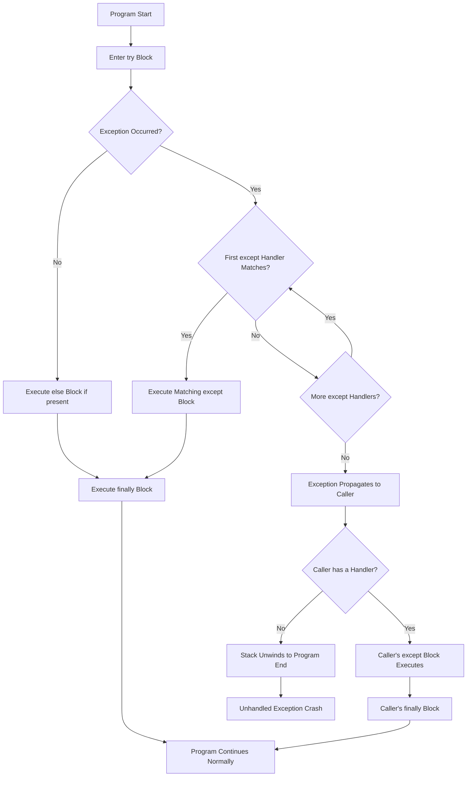
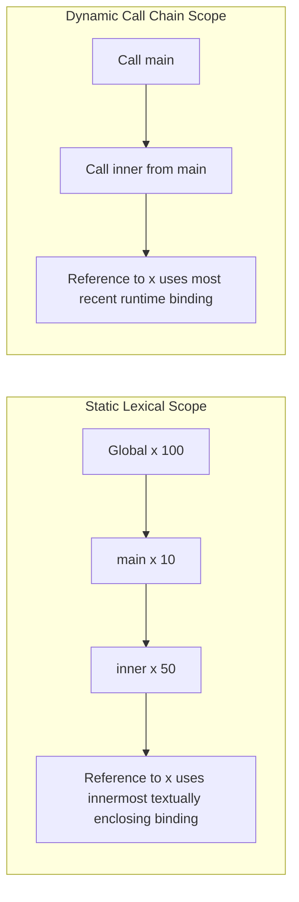
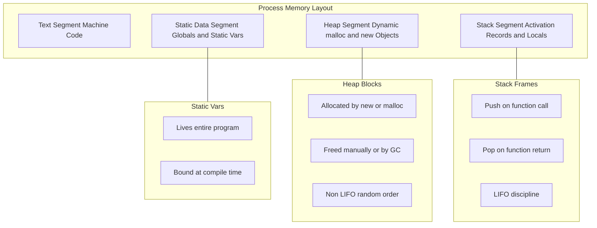
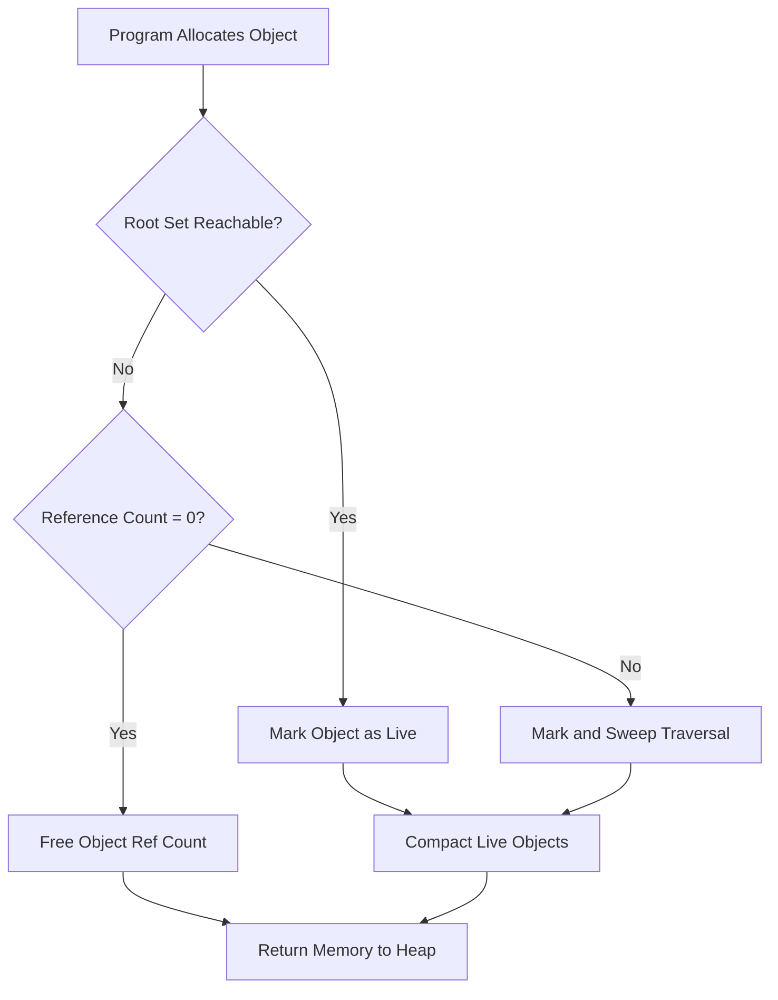
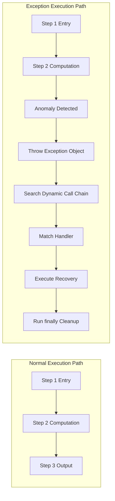

# Exception Handling and Environments

<!-- SECTION_1_START -->
# Exception Handling and Environments

## 1. Core Technical Definition

> [!IMPORTANT]
> **Exception Handling (KTU 2024 - Module 3 Definition)**
> Exception Handling is a programming language mechanism that allows a program to respond to **exceptional conditions** (runtime anomalies or errors) dynamically during execution, by transferring control to a pre-defined handler routine, instead of letting the program terminate abruptly.

> [!IMPORTANT]
> **Environment, Binding, and Scope (KTU 2024 - Module 3 Definition)**
> An **Environment** in a programming language is the data structure that maps **names (identifiers)** to **locations (memory addresses)** and ultimately to **values**. The act of associating an identifier with a value/location is called **Binding**, while the textual region of the program where a particular binding is visible is known as its **Scope**.

### Conceptual Analogy / Intuition

**Analogy 1 — Exception Handling as a "Fire Alarm System":**
Think of your program as a large office building. A `fire alarm` is an *exceptional condition*. Normally, work goes on smoothly (the normal flow of execution). But when a fire breaks out (an exception occurs), the alarm is triggered, and a specific protocol begins: the alarm rings loudly (the exception is *raised/thrown*), people evacuate in an organized way (the *handler* takes over), and a *recovery* process ensues (the building manager resets the system). The program does not just crash — it reacts gracefully. This is exception handling in action.

**Analogy 2 — Environments as a "Library Catalog":**
Imagine a library. Each book has a unique **call number (location)** and a **title (name)**. The **library catalog (environment)** is the data structure that maps titles to call numbers. When you search for "Operating Systems," the catalog (lookup) tells you it's in row 7, shelf 3 (the **binding**). However, this binding is only valid **inside this library (scope)**. In another branch of the library (a nested block), the same book might be referenced differently (a different binding).

> [!NOTE]
> **Syllabus Highlight (PECST758 - M3):**
> The module tests your understanding of *control flow disruption mechanisms* (exceptions) and *name management* (environments, bindings, scope rules, lifetime, storage allocation). The key standard metrics in this module are:
> - **Static Depth** of a scope (lexical nesting levels)
> - **Dynamic Depth** of a call chain (runtime nesting)
> - **Storage Class**: `static`, `stack`, or `heap`

> [!VISUALIZATION CONTROL]
> **Concept:** Exception propagation across function call boundaries
> **Conceptual Diagram Equations:**
> * $f_{main}() \rightarrow f_A() \rightarrow f_B() \rightarrow f_C()$ (normal call chain)
> * Exception at $f_C$ propagates *upward*: $f_C \rightarrow f_B \rightarrow f_A \rightarrow f_{main}$
> **Visual Description:** Visualize arrows going down for normal calls and arrows going up for exception propagation, showing the "unwinding" of the call stack.
<!-- SECTION_1_END -->

<!-- SECTION_2_START -->
# 2. Deep Theoretical Analysis & KTU High-Yield Formula Sheet

## 2.1 Classification of Exceptional Conditions

Exceptional conditions fall into **three broad categories** in KTU textbooks (Sebesta, *Concepts of Programming Languages*):

| Category | Description | Recoverable? | Example |
|---|---|---|---|
| **Errors** | Hardware/system-level failures | No (usually) | Power failure, memory bus error |
| **Internal Exceptions** | Program bugs / violations of language rules | Generally No | Division by zero, index out of bounds |
| **External Exceptions** | Unpredictable external events | Yes | File not found, network timeout |

## 2.2 Exception Handling Mechanisms (Built-in vs. User-Defined)

> [!NOTE]
> Most modern languages support **two flavors** of exceptions:
> 1. **Built-in / Predefined Exceptions** — raised automatically by the runtime (e.g., `ZeroDivisionError` in Python).
> 2. **User-Defined Exceptions** — declared by the programmer for application-specific conditions (e.g., `InsufficientFundsError` in a banking app).

## 2.3 The General Exception Handling Flow (4 Stages)

1. **Declaration / Definition:** A block of code is marked as "risky" (e.g., `try` block in Java/Python).
2. **Detection / Raising:** When the exceptional condition occurs, an exception object is created and **thrown** (or **raised**).
3. **Propagation:** The runtime walks up the **dynamic call chain** searching for a matching handler.
4. **Handling / Recovery:** The matching handler executes; optionally, a `finally` block runs to release resources.

## 2.4 Environments, Bindings, and Scope — The Three Pillars

### (a) Binding Time
The *time* at which a name is associated with a value/memory location. Earlier binding = more efficient; later binding = more flexible.

| Binding Time | Example |
|---|---|
| **Language Design Time** | Operator `+` means addition |
| **Compile Time** | Type of a variable (`int x`) |
| **Link Time** | External function reference resolution |
| **Load Time** | Static variable initialization |
| **Run Time** | Dynamic variable, function pointer |

### (b) Scope — The Two Big Models

- **Static (Lexical) Scope:** A name refers to its **nearest enclosing textual block** at compile time. Used by C, C++, Java, Python, Ada.
- **Dynamic Scope:** A name refers to the **most recent active binding at runtime** in the call chain. Used by early Lisp, APL, SNOBOL, Perl (via `local`).

### (c) Lifetime of Variables (Storage Allocation)

The lifetime of a variable is the time during execution when storage is allocated to it.

| Storage Class | Allocation Strategy | Lifetime | Example |
|---|---|---|---|
| **Static** | Bound to absolute memory address at compile time | Entire program execution | Global vars, C `static` vars |
| **Stack** (Automatic) | Allocated on function call, deallocated on return | Function activation | Local variables in C, Java |
| **Heap** (Explicit / Implicit) | Allocated via `new` / `malloc`, freed manually or by GC | Until explicitly deallocated | Java objects, Python lists |

## 2.5 KTU High-Yield Formula Sheet / Cheat Sheet

| Concept | Formula / Rule | Unit / Note |
|---|---|---|
| Lexical (Static) Scope Resolution | `Nearest enclosing block` rule | Compile-time lookup |
| Dynamic Scope Resolution | `Most recent runtime binding` rule | Runtime lookup |
| Static Variable Address | `Address = base + constant offset` | Fixed at compile time |
| Stack Frame Size | `S = locals + parameters + return\_addr + saved\_regs` | Bytes |
| Heap Allocation Cost | $O(1)$ average (with free-list), $O(\log n)$ (with balanced tree) | Time complexity |
| Reference Count Garbage Collection | $\text{free when } \text{count}(x) = 0$ | Simple but cyclic-leak prone |
| Mark-and-Sweep GC | Traverse reachable graph from roots | $O(\vert E \vert + \vert V \vert)$ |
| Mark-Compact GC | Mark + slide live objects together | Eliminates fragmentation |
| Copying GC (Cheney) | Live objects copied to *to-space* | Cost $\propto$ live data only |
| Generational GC | Young gen collected more frequently | Hypothesis: most objects die young |
| Exception Handling Overhead | $O(1)$ for *throwing*; $O(d)$ for *handling* | where $d$ = call-stack depth |
| Block Activation Record | $A_i = (locals_i, params_i, dynamic\_link_i, static\_link_i)$ | Pointer to enclosing scope |
| Reference Cell / Box | Stores pointer to value, allowing mutation | Used in functional languages |
| Closures | `Closure = (code, environment)` | Function + captured env |
| Environment Pointer | $E$ points to current scope's symbol table | Standard runtime model |

> [!TIP]
> **Engineering Utility:** Exception handling is critical in production-grade systems — database engines, web servers (e.g., `try/except` in Django), embedded firmware (C++ `throw/catch`), and financial trading platforms where a single division-by-zero cannot be allowed to crash a billion-dollar trading bot. Environments and scope rules power **debuggers**, **IDEs** (jump-to-definition), and **garbage collectors** (the run-time keeps an *environment* that holds live references).
<!-- SECTION_2_END -->

<!-- SECTION_3_START -->
# 3. Step-by-Step Derivations & Code/Symbolic Implementation

## 3.1 Derivation 1 — Resolving a Lexical (Static) Scope

**Problem:** Given the following pseudocode, what is the value of `x` printed by `printf` in `inner()`?

```text
1.  int x = 100;                // Global scope
2.  void inner() {
3.      int x = 50;             // Local to inner()
4.      printf("%d", x);        // (a) Which x?
5.  }
6.  int main() {
7.      int x = 10;             // Local to main()
8.      inner();
9.      printf("%d", x);        // (b) Which x?
10. }
```

### Step-by-Step Resolution (Static Scope)

At line 4, the compiler searches for `x`:
- Step 1: Look in the **innermost block** of `inner()` → finds `x = 50` ✓
- Step 2: Therefore, line 4 prints **50** (innermost rule).

At line 9, the compiler searches for `x`:
- Step 1: Look in the **innermost block** of `main()` → finds `x = 10` ✓
- Step 2: Therefore, line 9 prints **10** (innermost rule).

$$
\text{Scope}(x, \text{line } 4) = \text{nearest enclosing block of } \textit{inner}()
$$

$$
\text{Solution:} \quad x_{\text{line4}} = 50, \quad x_{\text{line9}} = 10
$$

> **[Valuation Key Point: 1 Mark for each correct answer with proper search logic]**

---

## 3.2 Derivation 2 — Dynamic Scope Resolution

**Problem:** With the *same* code as above, but using **dynamic scope**, what is printed at line 4 and line 9?

### Step-by-Step Resolution (Dynamic Scope)

- Line 9 executes first: `main()` calls `inner()`. The most-recent active binding of `x` when `inner()` runs is the one in `main()`, i.e., $x = 10$.
- Therefore, line 4 prints **10** (not 50!), because dynamic scope walks the **call chain**, not the textual nesting.

$$
\text{Scope}_{dyn}(x, \text{line 4}) = \text{most recent runtime binding} = 10
$$

$$
\text{Solution:} \quad x_{\text{line4}} = 10, \quad x_{\text{line9}} = 10
$$

> [!WARNING]
> **Common Mistake:** Students often confuse **static** with **dynamic** scope. Always remember: *Static* = textual nesting, *Dynamic* = call chain.

---

## 3.3 Derivation 3 — Stack Frame Layout for a Function Call

Consider:

```c
int foo(int a, int b) {
    int x = 5;
    int y = 10;
    return a + b + x + y;
}
```

### Stack Frame Derivation

Let:
- $S_{ret}$ = size of return address (typically 4 or 8 bytes)
- $S_{bp}$ = size of saved base pointer
- $S_{int}$ = 4 bytes (32-bit int)

**Frame Contents (top to bottom, growing downward in memory):**

| Offset from Frame Pointer | Contents | Size (bytes) |
|---|---|---|
| $-S_{bp}$ | Saved Base Pointer (dynamic link) | $S_{bp}$ |
| $-S_{bp} - S_{ret}$ | Return Address | $S_{ret}$ |
| $-S_{bp} - S_{ret} - S_{int}$ | Parameter $a$ | $S_{int}$ |
| $-S_{bp} - S_{ret} - 2 S_{int}$ | Parameter $b$ | $S_{int}$ |
| $-S_{bp} - S_{ret} - 3 S_{int}$ | Local $x$ | $S_{int}$ |
| $-S_{bp} - S_{ret} - 4 S_{int}$ | Local $y$ | $S_{int}$ |

$$
S_{frame} = 2 S_{int} + 2 S_{int} + S_{ret} + S_{bp} = 4 S_{int} + S_{ret} + S_{bp}
$$

For a 32-bit machine: $S_{frame} = 4(4) + 4 + 4 = \mathbf{24 \text{ bytes}}$.

For a 64-bit machine: $S_{frame} = 4(4) + 8 + 8 = \mathbf{32 \text{ bytes}}$.

---

## 3.4 Code Implementation — Exception Handling in Python (Fully Operational)

```python
# ============================================================
# Filename  : exception_demo.py
# Topic     : KTU M3 - Exception Handling (Python)
# ============================================================
from __future__ import annotations
import logging
import sys
from typing import Final

logging.basicConfig(
    level=logging.INFO,
    format="%(asctime)s | %(levelname)s | %(message)s",
)
logger: Final = logging.getLogger("KTU_M3_Demo")


# --- Custom (User-Defined) Exception ---
class InsufficientFundsError(Exception):
    """Raised when account balance falls below withdrawal amount."""

    def __init__(self, balance: float, amount: float) -> None:
        super().__init__(
            f"Cannot withdraw {amount:.2f}; balance is {balance:.2f}"
        )
        self.balance: float = balance
        self.amount: float = amount


# --- Function that may raise an exception ---
def withdraw(balance: float, amount: float) -> float:
    if amount <= 0:
        raise ValueError(f"Invalid amount: {amount}")
    if amount > balance:
        raise InsufficientFundsError(balance, amount)
    new_balance: float = balance - amount
    logger.info("Withdrawal successful. New balance = %.2f", new_balance)
    return new_balance


# --- Demonstration of try / except / else / finally ---
def main() -> int:
    try:
        result: float = withdraw(balance=1000.0, amount=1500.0)
    except InsufficientFundsError as exc:
        # 1st handler: handles our custom exception
        logger.error("InsufficientFundsError caught: %s", exc)
        result = exc.balance      # action: keep balance unchanged
    except ValueError as exc:
        # 2nd handler: handles built-in ValueError
        logger.error("ValueError caught: %s", exc)
        result = 0.0
    except Exception as exc:
        # Catch-all handler (should be last)
        logger.exception("Unexpected error: %s", exc)
        result = -1.0
    else:
        # Runs ONLY if no exception was raised
        logger.info("No exception occurred in the try block.")
    finally:
        # ALWAYS runs (cleanup code goes here)
        logger.info("Cleanup: closing DB connection / file handle.")

    return 0 if result >= 0 else 1


if __name__ == "__main__":
    sys.exit(main())
```

### Expected Output Trace

```
2024-... | ERROR | InsufficientFundsError caught: Cannot withdraw 1500.00; balance is 1000.00
2024-... | INFO  | Cleanup: closing DB connection / file handle.
```

### Explanation of the Code

- **Lines 11-18:** A *user-defined* exception class with **type hints** and **boundary checks** (must pass positive balance and amount).
- **Lines 22-30:** The `withdraw()` function **raises** an appropriate exception. No `try` block inside — the caller is responsible.
- **Lines 35-48:** The caller wraps the call in a `try` block. The `except` clauses are tried **in order**; the first matching one executes.
- **Line 49-50:** The `else` block runs *only* if no exception occurred.
- **Line 51-53:** The `finally` block **always** runs — perfect for releasing locks, closing files, etc.

> [!TIP]
> **Production Note:** In banking systems, withdrawal logic like this is wrapped in *transactions* — `finally` rolls back the DB state if any step fails. The same `try/except/finally` pattern is used in `try-with-resources` in Java (try-with-resources auto-closes files in `finally`).

---

## 3.5 Code Implementation — Exception Handling in C++ (with Type Hints Equivalent)

```cpp
// exception_demo.cpp
// KTU M3 - Exception Handling in C++
#include <iostream>
#include <stdexcept>
#include <string>

// User-defined exception
class InsufficientFundsException : public std::runtime_error {
public:
    InsufficientFundsException(double bal, double amt)
        : std::runtime_error("Insufficient funds: balance="
                             + std::to_string(bal)
                             + ", amount=" + std::to_string(amt)) {}
};

double withdraw(double balance, double amount) {
    if (amount <= 0) {
        throw std::invalid_argument("Amount must be positive");
    }
    if (amount > balance) {
        throw InsufficientFundsException(balance, amount);
    }
    return balance - amount;
}

int main() {
    double balance = 1000.0;
    try {
        double newBal = withdraw(balance, 1500.0);
        std::cout << "New balance: " << newBal << std::endl;
    } catch (const InsufficientFundsException& e) {
        std::cerr << "Custom exception: " << e.what() << std::endl;
    } catch (const std::invalid_argument& e) {
        std::cerr << "Built-in: " << e.what() << std::endl;
    } catch (...) {
        std::cerr << "Unknown exception caught." << std::endl;
    }
    return 0;
}
```

### Walk-through

- `throw e;` — **raises** an exception. Control unwinds the stack.
- `catch (const T& e)` — **catches** by reference (avoids slicing).
- `catch (...)` — catch-all handler (must be the last `catch`).

> [!IMPORTANT]
> **C++ specific rules (asked in KTU exams):**
> 1. A function that may throw an exception can be declared with an **exception specification** (deprecated in C++17, but historically: `void f() throw(int);` means `f` may throw only `int`).
> 2. Destructors should **never throw** exceptions.
> 3. The `noexcept` keyword (C++11+) declares a function as *non-throwing*.

---

## 3.6 Code Implementation — Exception Handling in Java

```java
// ExceptionDemo.java
// KTU M3 - Exception Handling in Java
class InsufficientFundsException extends Exception {
    public InsufficientFundsException(String msg) { super(msg); }
}

public class ExceptionDemo {
    static double withdraw(double balance, double amount)
            throws InsufficientFundsException {
        if (amount > balance) {
            throw new InsufficientFundsException(
                "Balance: " + balance + ", Requested: " + amount);
        }
        return balance - amount;
    }

    public static void main(String[] args) {
        double balance = 1000.0;
        try {
            double nb = withdraw(balance, 1500.0);
            System.out.println("New balance: " + nb);
        } catch (InsufficientFundsException e) {
            System.out.println("Caught: " + e.getMessage());
        } finally {
            System.out.println("Cleanup: close resources here.");
        }
    }
}
```

> [!NOTE]
> **Java distinction:** **Checked** exceptions (subclasses of `Exception` other than `RuntimeException`) must be either *caught* or *declared* in the `throws` clause. **Unchecked** exceptions (subclasses of `RuntimeException`, e.g., `NullPointerException`) need not be declared.

---

## 3.7 Symbol Table Operations — Step-by-Step Procedure

A **Symbol Table** is the data structure used by compilers and interpreters to maintain the *environment*.

| Operation | Description | Pseudocode |
|---|---|---|
| `Insert(name, attr)` | Add a new binding | `ST[name] = attr` |
| `Lookup(name)` | Find the binding in the *innermost* scope first, then outward | `for scope in scopes\_chain: if name in scope: return scope[name]` |
| `Enter_Scope()` | Push a new scope on the stack | `ST.push(new\_table)` |
| `Exit_Scope()` | Pop the current scope | `ST.pop()` |
| `Update(name, val)` | Modify an existing binding | `ST.current[name] = val` |

### Worked Example

```text
int a = 1;            // Scope 0:  {a -> 1}
{                     // Enter Scope 1
    int b = 2;        // Scope 1:  {b -> 2}
    a = a + b;        // Lookup 'a' -> Scope 0; Lookup 'b' -> Scope 1
}                     // Exit Scope 1
// After exit: Scope 1 is popped; 'b' is no longer accessible.
```

| Step | Action | Symbol Table State |
|---|---|---|
| 1 | `int a = 1` | Scope 0: $\{a \mapsto 1\}$ |
| 2 | Enter Scope 1 | Scopes: [Scope 0, Scope 1] |
| 3 | `int b = 2` | Scope 0: $\{a \mapsto 1\}$, Scope 1: $\{b \mapsto 2\}$ |
| 4 | `a = a + b` | Scope 0: $\{a \mapsto 3\}$ (1+2), Scope 1: $\{b \mapsto 2\}$ |
| 5 | Exit Scope 1 | Scopes: [Scope 0] — $b$ is now out of scope |

> **[Stating the lookup rule (innermost first): 1 Mark. Showing the post-execution table: 1 Mark.]**

---

## 3.8 Derivation 4 — Mark-and-Sweep Garbage Collection (Reference Cycle Proof)

**Statement:** A purely reference-counting GC cannot collect **cyclic** garbage.

**Proof by Counterexample:**

Consider two heap objects $A$ and $B$ forming a cycle:

$$
A \xrightarrow{\text{ref}} B \quad \text{and} \quad B \xrightarrow{\text{ref}} A
$$

No external root points to $A$ or $B$. Therefore, both are **unreachable** and should be freed.

- Reference count of $A$: $rc(A) = 1$ (from $B$)
- Reference count of $B$: $rc(B) = 1$ (from $A$)

Since $rc(A) \neq 0$ and $rc(B) \neq 0$, reference counting **never** triggers a free. This is a **memory leak**.

$$
\boxed{\text{Conclusion: Reference counting fails on cycles. Use mark-and-sweep or generational GC.}}
$$

Mark-and-sweep algorithm (pseudocode):

$$
\text{Mark}(r) = \text{BFS/DFS from root } r \text{ over the object graph}
$$

$$
\text{Sweep}(heap) = \forall \, o \in heap,\; \text{if } \neg marked(o) \text{ then } free(o)
$$

Time complexity: $O(\vert V \vert + \vert E \vert)$ where $\vert V \vert$ = heap objects, $\vert E \vert$ = references.
<!-- SECTION_3_END -->

<!-- SECTION_4_START -->
# 4. Structural Diagrams & Schematics

## 4.1 Exception Handling Flow — Mermaid Block Diagram



## 4.2 Static vs Dynamic Scope — Comparative Block Diagram



## 4.3 Storage Allocation Architecture (Static / Stack / Heap)



## 4.4 Garbage Collection Decision Topology



## 4.5 Block-Level Functional Architecture — Exception vs Normal Flow


<!-- SECTION_4_END -->

<!-- SECTION_5_START -->
# 5. KTU 2024 Scheme Examination Question Bank & Topic Recap

## Part A — 3 Mark Questions (Remember / Understand)

### Q1. `[KTU University Exam - Dec 2023]` — CO1, Remember
**Define the term *exception* in the context of programming languages. Differentiate between an *exception* and an *error*.**

**Model Answer:**

An *exception* is an event that occurs during program execution that disrupts the normal flow of the program's instructions. When an exception occurs, the program's normal control flow is transferred to a special routine called an *exception handler*.

**Difference Table:**

| Aspect | Error | Exception |
|---|---|---|
| Severity | Catastrophic; often unrecoverable | Often recoverable |
| Source | Usually hardware/system-level | Program-level / external events |
| Detection | Hard to anticipate in code | Anticipated and handled in code |
| Example | Stack overflow, memory bus failure | Division by zero, file not found |

> **[Defining exception: 1 Mark. Distinguishing with example: 2 Marks]**

---

### Q2. `[KTU University Exam - July 2024]` — CO1, Understand
**Explain the difference between *static (lexical) scope* and *dynamic scope*. Give one example language that uses each.**

**Model Answer:**

| Aspect | Static Scope | Dynamic Scope |
|---|---|---|
| Resolution Time | Compile time | Run time |
| Binding Rule | Nearest enclosing textual block | Most recent active runtime binding |
| Language Example | C, C++, Java, Python, Ada | Early Lisp, APL, Perl (with `local`) |

In *static scope*, a variable's binding is determined by the **lexical structure** of the program. In *dynamic scope*, it depends on the **call chain** at the time of access.

> **[Defining each with 1 Mark. Example: 1 Mark]**

---

## Part B — 14 Mark Questions (ESE Module Choice)

### Question A `[KTU University Exam - Dec 2023]` — CO2, Apply / Analyze

**Q. (a)** With a neat diagram, describe the general structure of exception handling in modern programming languages. Explain the terms *try block*, *catch block*, and *finally block* with a suitable example in Java. **[7 Marks]**

**Model Answer:**

The general structure of exception handling in modern languages (e.g., Java) consists of the following blocks:

```java
try {
    // Code that may raise an exception
} catch (ExceptionType1 e1) {
    // Handler for ExceptionType1
} catch (ExceptionType2 e2) {
    // Handler for ExceptionType2
} finally {
    // Always-execute cleanup code
}
```

- **try block:** Encapsulates code that might throw an exception. The runtime monitors this block.
- **catch block:** A handler that catches a specific exception type. Multiple `catch` blocks can be chained for different types.
- **finally block:** Optional block that **always** executes, whether an exception occurred or not. Used for cleanup (closing files, releasing locks).

**Java Example:**

```java
class Demo {
    public static void main(String[] args) {
        try {
            int a = 10, b = 0;
            int c = a / b;            // raises ArithmeticException
            System.out.println(c);
        } catch (ArithmeticException e) {
            System.out.println("Cannot divide by zero: " + e.getMessage());
        } finally {
            System.out.println("Finally block executed.");
        }
    }
}
```

**Output:**
```
Cannot divide by zero: / by zero
Finally block executed.
```

> **[Diagram / structure: 2 Marks. Explaining each block: 3 Marks. Java example: 2 Marks]**

---

**(b)** Discuss the various **storage allocation strategies** for variables in a programming language. Compare static, stack, and heap allocation in terms of *lifetime*, *speed*, and *flexibility*. **[7 Marks]**

**Model Answer:**

Storage allocation determines where and when memory is allocated to a variable during program execution. The three principal strategies are:

**1. Static Allocation**
- Memory is allocated at **compile time** and persists for the entire duration of the program.
- Used for global variables, constants, and explicitly declared static locals.
- **Speed:** Fastest (no runtime overhead).
- **Flexibility:** Lowest (cannot grow or shrink).

**2. Stack (Automatic) Allocation**
- Memory is allocated when a function is called (a *stack frame* or *activation record* is pushed) and deallocated when the function returns.
- Used for local variables and parameters.
- **Speed:** Very fast (LIFO push/pop).
- **Flexibility:** Medium (sized to function's local needs).

**3. Heap (Dynamic) Allocation**
- Memory is allocated and freed at arbitrary times during execution, using `malloc/free` in C, `new` in C++/Java, or implicit allocation in Python.
- Used for objects whose lifetime does not follow a LIFO order.
- **Speed:** Slower (requires free-list or GC).
- **Flexibility:** Highest (any size, any lifetime).

**Comparison Table:**

| Strategy | Lifetime | Speed | Flexibility | Example |
|---|---|---|---|---|
| **Static** | Entire program | Fastest | Lowest | Global `int count;` in C |
| **Stack** | Function activation | Fast | Medium | Local `int x;` in C |
| **Heap** | Arbitrary | Slow | Highest | `new int[100]` in C++ |

> **[Naming 3 strategies: 1 Mark. Explaining each: 3 Marks. Comparison table: 3 Marks]**

---

### Question B `[KTU University Exam - July 2024]` — CO2, Apply / Analyze

**(a)** Explain the concept of **scope** and **lifetime** of a variable. How does **static scoping** differ from **dynamic scoping**? Illustrate with a C program. **[7 Marks]**

**Model Answer:**

- **Scope** of a variable is the region of the program text where the variable is *visible* and can be referenced.
- **Lifetime** of a variable is the period of execution during which the variable has memory allocated to it.

C uses **static (lexical) scoping**. Consider:

```c
#include <stdio.h>
int x = 100;            // GLOBAL scope, lifetime = entire program

void inner() {
    int x = 50;         // LOCAL to inner(); lifetime = call duration
    printf("inner: x = %d\n", x);
}

void outer() {
    printf("outer: x = %d\n", x);   // refers to GLOBAL x
}

int main() {
    int x = 10;         // LOCAL to main(); lifetime = main() duration
    printf("main: x = %d\n", x);    // refers to LOCAL x of main
    inner();
    outer();
    return 0;
}
```

**Output:**
```
main: x = 10
inner: x = 50
outer: x = 100
```

**Explanation:**
- Inside `inner()`, the local `x = 50` **shadows** the global `x = 100`. The compiler uses *static scope* to find the nearest enclosing declaration.
- Inside `outer()`, no local `x` exists, so the global `x = 100` is used.
- If C used *dynamic scope*, the call from `main()` (where local `x = 10`) would have made `inner()` print `10`, not `50`.

> **[Defining scope and lifetime: 2 Marks. Static vs dynamic with rule: 2 Marks. C program with output: 3 Marks]**

---

**(b)** What is a **symbol table**? Describe its role during compilation and execution. Explain the operations `insert`, `lookup`, `enter_scope`, and `exit_scope` with an example. **[7 Marks]**

**Model Answer:**

A **symbol table** is a data structure used by compilers and interpreters to store information about identifiers (variables, functions, types, etc.) — their names, types, scopes, and memory locations. It is the practical implementation of the *environment* concept.

**Role:**
- During **compilation**, the symbol table is used for name resolution, type checking, and address allocation.
- During **execution**, the runtime environment maintains a symbol table (or environment chain) to look up the values bound to names.

**Operations:**

| Operation | Description | Complexity |
|---|---|---|
| `insert(name, attrs)` | Add a new identifier binding | $O(1)$ average (hash table) |
| `lookup(name)` | Search scopes from innermost outward | $O(d)$, where $d$ = scope depth |
| `enter_scope()` | Push a new scope on the stack | $O(1)$ |
| `exit_scope()` | Pop the current scope | $O(1)$ |

**Example Trace:**

```text
int g = 1;            // (1) enter global scope, insert g->1
{                     // (2) enter block scope 1
    int a = 2;        // (3) insert a->2 in scope 1
    {                 // (4) enter block scope 2
        int b = 3;    // (5) insert b->3 in scope 2
        // lookup 'g' -> walks up: scope 2 (no), scope 1 (no), global (yes) -> 1
        // lookup 'a' -> walks up: scope 2 (no), scope 1 (yes) -> 2
    }                 // (6) exit_scope() — scope 2 popped; 'b' is no longer visible
    // lookup 'b' -> NOT FOUND (scope 1 has no 'b')
}                     // (7) exit_scope() — scope 1 popped; 'a' is no longer visible
```

> **[Defining symbol table: 1 Mark. Role during compile/run: 2 Marks. Four operations explained: 2 Marks. Example trace: 2 Marks]**

---

> [!WARNING]
> **KTU Examiner's Valuation Warning / Pitfall Callout**
> 1. **Do not confuse "lifetime" with "scope":** Scope is a *compile-time textual* concept; lifetime is a *runtime memory* concept. Many students write one in place of the other and lose 2 marks.
> 2. **Always state the lookup order for static scope:** "innermost block first, then outward to the global scope." Examiners look for this phrase specifically.
> 3. **For C++ exception specifications:** Avoid writing the deprecated `throw(int)` syntax unless specifically asked. Prefer modern `noexcept`.
> 4. **In Python example answers:** Always show `except SpecificException as e:` and not the bare `except:` — bare excepts are considered bad practice and may be marked down.
> 5. **In storage allocation questions:** Explicitly mention **three** strategies (static, stack, heap). Forgetting heap (which is the most flexible) costs a full mark.
> 6. **For symbol table answers:** Show a *trace* of `enter_scope` and `exit_scope` events. A diagram earns more marks than a paragraph.

---

## Topic Recap & Important Things to Remember

- **Exception** = a runtime event that disrupts normal control flow. It is **raised/thrown** and **caught/handled**.
- **Three categories of exceptions:** Errors (system), Internal exceptions (program bugs), External exceptions (predictable runtime events).
- **General exception flow:** Declaration → Detection → Propagation → Handling.
- **`try` block** = risky code; **`catch` block** = handler; **`finally` block** = always-execute cleanup.
- **User-defined exceptions** inherit from a base class (e.g., `Exception` in Python, `std::exception` in C++, `Exception` in Java).
- **Java has checked vs unchecked exceptions** — checked must be declared in `throws`.
- **C++ uses `throw` and `catch(...)` for catch-all; destructors must be `noexcept`.**
- **Environment** = the set of name-to-value mappings active at a given point in execution.
- **Binding** = the act of associating a name with a value/location. Binding time ranges from *language design time* to *run time*.
- **Scope** = textual region of the program where a binding is visible.
- **Static (lexical) scope** = innermost enclosing block rule (compile-time).
- **Dynamic scope** = most-recent active binding in the call chain (runtime).
- **Lifetime** = period during execution when a variable has memory.
- **Storage allocation strategies:**
  - *Static* — entire program, fastest, least flexible.
  - *Stack* — function activation, LIFO, fast, medium flexibility.
  - *Heap* — arbitrary, slowest, most flexible.
- **Stack frame** = local variables + parameters + return address + saved base pointer.
- **Symbol table** = data structure implementing the environment. Operations: `insert`, `lookup`, `enter_scope`, `exit_scope`, `update`.
- **Scope depth** = number of nested blocks surrounding a declaration.
- **Garbage collection strategies:** reference counting (no cycles), mark-and-sweep, mark-compact, copying (Cheney), generational.
- **Closures** = a function + its captured environment (used heavily in Python, JavaScript, and Haskell).
- **Reference cells / boxes** = indirection that allows mutation in functional languages.
- **Common pitfalls:**
  1. Confusing scope with lifetime.
  2. Believing reference counting handles cycles (it does not).
  3. Forgetting to mention all three storage strategies.
  4. Confusing static and dynamic scope lookup rules.
  5. Throwing exceptions from destructors in C++.
<!-- SECTION_5_END -->
