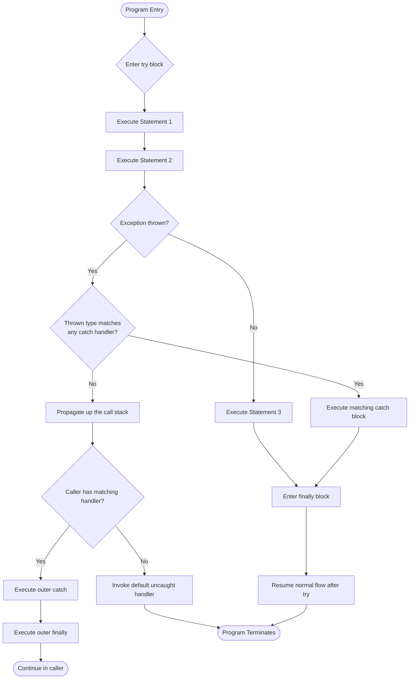
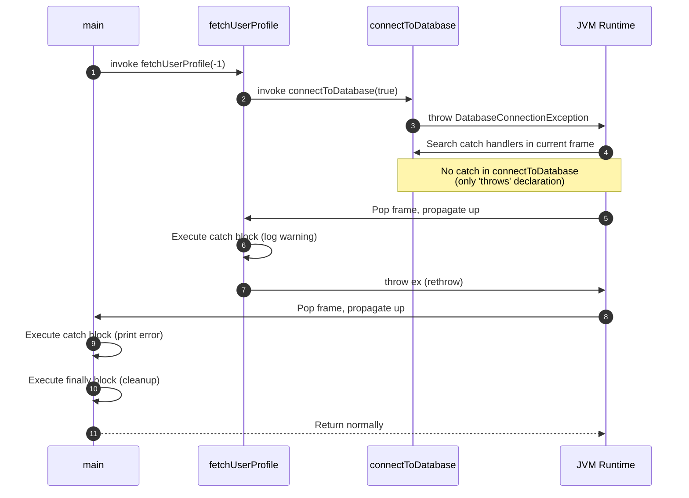
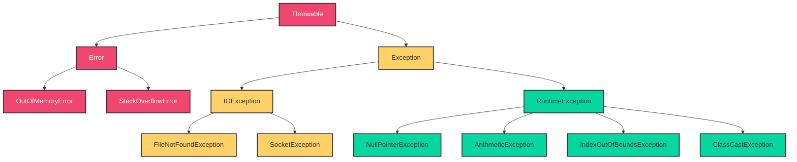
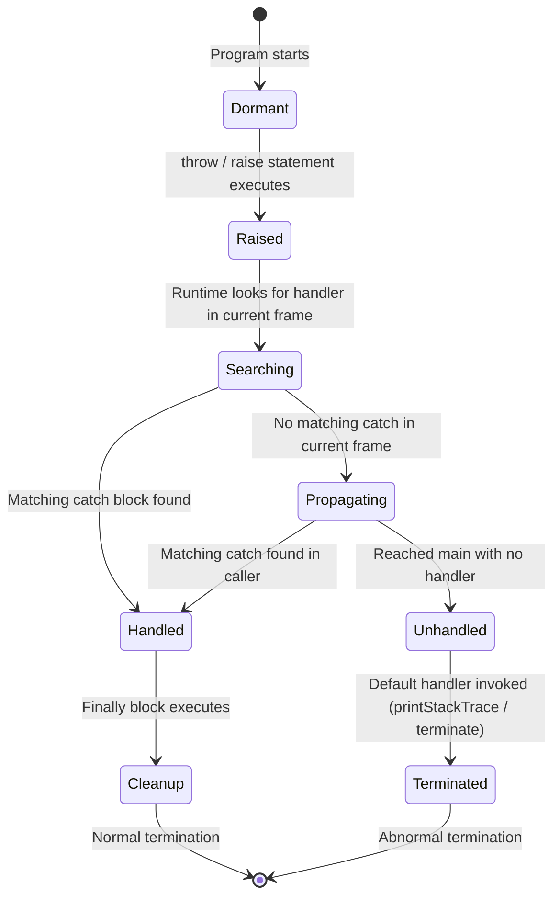
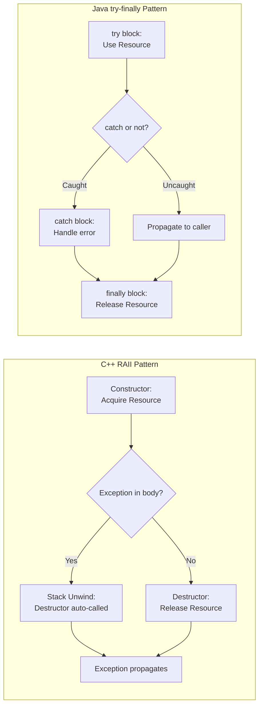

# Exception Handling

<!-- SECTION_1_START -->
# 1. Core Technical Definition & Intuitive Overview

## Formal Definition (KTU 2024 Syllabus Terminology)

**Exception Handling** is a structured, mechanism-based programming language construct designed to detect, intercept, and gracefully recover from runtime anomalies (exceptions) that disrupt the normal sequential flow of program execution. Rather than terminating the program abruptly when an error occurs, the control is transferred to a specialized block of code (an *exception handler*) that can contain, log, or rectify the erroneous state.

In the context of the **PECST758 – Programming Languages** syllabus, exception handling is studied as a **language design feature** — comparing how different paradigms (imperative, object-oriented, functional) expose failure as a first-class concept (e.g., Java's checked exceptions, C++'s zero-cost abstractions, Python's dynamic `try/except`, Haskell's `Either` monad).

> [!IMPORTANT]
> **KTU Syllabus Highlight (Module 3):** Exception handling belongs to the broader study of *Expressions and Statements*. It models *non-local transfer of control* — an alternative to `goto`, `break`, or `return` — that is **type-safe**, **stack-aware**, and **scope-respecting**.

---

## Conceptual Analogy / Intuition

Imagine you are **driving a car on a highway**:

1. **Normal Flow** — You are cruising smoothly (the *try-block*).
2. **Sudden Pothole (Exception)** — A flat tyre occurs (an *exception is thrown*).
3. **Pulling Over Safely (Catch Block)** — You safely pull to the side, change the tyre, and assess damage (the *exception handler* runs).
4. **Refuelling Regardless (Finally Block)** — Whether or not the tyre changed, you refuel the car at the next station (the *finally block* always executes).
5. **Reporting the Issue (Throw / Raise)** — You call roadside assistance, which dispatches a tow truck to a higher authority (re-throwing or propagating to a *caller-level handler*).

The **programmer's goal** is to keep the car (program) running smoothly *despite* the pothole (error) — without crashing the engine (segmentation fault / abort).

---

## Core Terminology (Aligned to KTU Board Vocabulary)

| Term | Definition |
|---|---|
| **Exception** | An abnormal condition occurring at runtime that disrupts normal program flow. |
| **Throw / Raise** | The act of explicitly signaling that an exceptional condition has occurred. |
| **Catch / Handle / Except** | A block of code that intercepts and processes a thrown exception. |
| **Finally / Ensure** | A code block that is *guaranteed* to execute after `try`, regardless of outcome. |
| **Stack Unwinding** | The process of propagating an exception up the call stack until a matching handler is found. |
| **Checked Exception** | A compile-time enforced exception (Java-specific). |
| **Unchecked Exception** | A runtime exception not enforced at compile time. |
| **User-Defined Exception** | A custom exception class defined by the programmer. |

> [!NOTE]
> The standard error code for unhandled exceptions in most POSIX systems is **exit status 1**, and the system signal **SIGABRT** is raised when C++ fails an unhandled exception abort. Java's default uncaught exception handler prints the **stack trace** to **stderr**.

> [!VISUALIZATION CONTROL]
> **Concept:** Exception Propagation and Control Flow Transfer
> **Conceptual Flow Coordinates:**
> * **Normal Path:** $f_1 \rightarrow f_2 \rightarrow f_3 \rightarrow \text{(success)}$
> * **Exception Path:** $f_1 \rightarrow f_2 \rightarrow f_3 \xrightarrow{\text{throws}} \text{catch}(f_2) \xrightarrow{\text{if unmatched}} \text{catch}(f_1)$
> **Visual Description:** Visualize a vertical call stack where execution normally descends (top-down). When an exception is thrown, the arrow reverses direction and travels *upward* through stack frames until a compatible handler is found. Frames in between are *popped* (destructors run in C++).

<!-- SECTION_1_END -->

<!-- SECTION_2_START -->
# 2. Deep Theoretical Analysis & KTU High-Yield Formula Sheet

## 2.1 The Three Pillars of Exception Handling

Every language that supports exception handling exposes **three fundamental operations**, which together form the *AAA* framework:

1. **A — Attempt (try block):** Define the *guarded region* where an exception *may* occur.
2. **A — Act (catch/except/handle block):** Define the *response strategy* for each class of failure.
3. **A — Assure (finally/ensure block):** Define *invariant cleanup* that runs regardless of outcome.

---

## 2.2 Structural Anatomy (Generic Language Model)

A canonical exception handling construct is composed of four components:

$$
\text{ExceptionSystem} = \langle \text{try}, \text{throw}, \text{catch}, \text{finally} \rangle
$$

Where:

* $\text{try}$ — demarcates a *monitored region* in the program's abstract syntax tree.
* $\text{throw}(e)$ — invokes the runtime's *exception dispatcher*, which searches the dynamic call chain for a compatible handler.
* $\text{catch}(T, e)$ — binds the thrown value $e$ to a local variable of declared type $T$.
* $\text{finally}$ — registers a *guaranteed termination handler* (cleanup hook).

> [!IMPORTANT]
> **KTU Insight:** The `$try-catch$` block is *not* a control-flow statement like `if-else`. It is a *non-local control transfer* with a built-in *type matching protocol*. The compiler typically builds a *handler table* (a metadata structure) at compile time, which the runtime consults when an exception fires.

---

## 2.3 Stack Unwinding — The Propagation Algorithm

When a `throw` statement is executed, the runtime performs the following **deterministic algorithm**:

**Step 1: Search Current Frame**
Check if the current activation record contains a `catch` block whose declared exception type $T_{catch}$ matches the thrown type $T_{throw}$ via *subtype-compatibility*:
$$
T_{throw} \leq T_{catch} \quad \text{(i.e., } T_{catch} \text{ is a supertype of } T_{throw}\text{)}
$$

**Step 2: Cleanup Local Resources**
Invoke all *destructors* (C++) or *finally* / *context managers* (Java/Python) attached to objects in the current stack frame.

**Step 3: Pop Frame**
Remove the current activation record from the call stack.

**Step 4: Repeat or Terminate**
If no handler was found, propagate to the *caller frame*. If the *main frame* is reached and no handler exists, invoke the language's *default uncaught exception handler* (e.g., `terminate()` in C++, `printStackTrace()` in Java).

> [!NOTE]
> **Why is this important for KTU exams?**
> Examiners frequently ask: *"What happens if no matching catch block is found?"* The answer is **stack unwinding propagation to the caller, terminating in `std::terminate()` / `SystemExit` / `JVM crash`** if it reaches `main`.

---

## 2.4 KTU Formula Sheet / Cheat Sheet

| Concept | Formula / Rule | Description |
|---|---|---|
| Handler Matching | $T_{throw} \leq T_{catch}$ | Handler catches if thrown type is subtype of declared. |
| Catch Order | More specific $\rightarrow$ More general | Subclass handlers MUST precede superclass handlers. |
| Rethrow Syntax | `throw;` (Java/C++) / `raise` (re-raise original) | Re-triggers current exception for outer handler. |
| Finally Guarantee | $\text{finally executes} \iff \neg (\text{System.exit} \lor \text{JVM crash})$ | Runs even on `return` from `try`. |
| Resource Acquisition | $\text{RAII} \equiv \text{Constructor} \cup \text{Destructor}$ | C++ idiom for exception-safe resource management. |
| Checked vs Unchecked | $\text{Checked} = \text{extends Exception} \land \neg \text{extends RuntimeException}$ | Java-specific compile-time rule. |
| Default Exit Status | $\text{exit}(1)$ for unhandled | POSIX convention. |
| Catch-All Syntax | `catch (...)` (C++) / `except:` (Python) / `catch(Throwable)` (Java) | Catches everything in the type hierarchy. |

---

## 2.5 Real-World Engineering Utility

Exception handling is not merely an academic concept — it underpins **production-grade software engineering**:

1. **Distributed Systems (Microservices):** A failed database query in a microservice is *caught* and translated to a `503 Service Unavailable` HTTP response, preventing cascading failures.
2. **Embedded Systems (RTOS):** Hardware faults (sensor read errors) are wrapped in exception handlers to ensure the device enters a *safe state* rather than hanging.
3. **Compilers & IDEs:** Parsing errors throw `ParseException` objects that carry *line*, *column*, and *expected token* metadata for IDE squiggle rendering.
4. **Banking & Financial Software:** Transaction rollbacks use exception handling to enforce **ACID properties** — if a credit succeeds but a debit fails, the system rethrows to invoke compensating transactions.
5. **Web Frameworks (Django, Spring):** Middleware layers use `try/except` to log, trace, and return structured JSON error payloads to clients.

<!-- SECTION_2_END -->

<!-- SECTION_3_START -->
# 3. Step-by-Step Derivations & Code/Symbolic Implementation

## 3.1 Formal Derivation — Exception Matching Rule

We formally define the **handler selection algorithm** used by the runtime:

**Given:**
* A thrown exception object $e$ with dynamic type $T_e$.
* A set of catch blocks in lexical scope: $C = \{c_1, c_2, \ldots, c_n\}$ with declared types $T_1, T_2, \ldots, T_n$.

**Selection Criterion:**

$$
c_{\text{matched}} = \begin{cases}
c_i & \text{if } T_e \leq T_i \text{ for the smallest } i \text{ in lexical order (Java rule)} \\[4pt]
c_i & \text{if } T_e \leq T_i \text{ for the first } i \text{ traversed (C++ stack-unwind rule)} \\[4pt]
\text{nullptr} & \text{if } \forall i : T_e \not\leq T_i
\end{cases}
$$

> [!NOTE]
> **Java's rule** picks the *first* catch block in source-code order.
> **C++'s rule** picks the *first* catch block encountered during stack unwinding (which is the *innermost* matching block).
> These differ in subtle ways that examiners love to test!

---

## 3.2 Full Derivation — Finally Block Execution Guarantee

**Theorem:** *A `finally` block executes if and only if the JVM/Python interpreter has not been forcibly terminated.*

**Proof Sketch:**

Let the program state be $S = \langle \text{pc}, \text{stack}, \text{exception} \rangle$ where $\text{pc}$ is the program counter, $\text{stack}$ is the call stack, and $\text{exception}$ is the current thrown object (or $\text{null}$).

When the runtime exits a `try` block via any of three mechanisms:
* **M1: Normal completion** — $\text{exception} = \text{null}$
* **M2: Exception thrown** — $\text{exception} \neq \text{null}$ and a matching catch is found.
* **M3: Uncaught exception** — $\text{exception} \neq \text{null}$ and no matching catch is found.

In all three cases, the runtime **must** transfer control to the `finally` block (if it exists) *before* either resuming normal execution (M1, M2) or invoking the default uncaught handler (M3). The only escape is `System.exit(n)` or a hardware-level signal like `SIGKILL`. $\blacksquare$

> [!IMPORTANT]
> **Exam Tip:** If a `return` statement is inside the `try` block, the `finally` block STILL executes *before* the method actually returns! This is a classic KTU question.

---

## 3.3 Worked Example — Multi-Level Exception Propagation (Java)

```java
import java.util.logging.Level;
import java.util.logging.Logger;

/**
 * Demonstrates stack unwinding across three nested method calls.
 * Compile with: javac ExceptionPropagationDemo.java
 * Run with:     java ExceptionPropagationDemo
 */
public final class ExceptionPropagationDemo {

    // A custom checked exception to illustrate user-defined types.
    public static class DatabaseConnectionException extends Exception {
        public DatabaseConnectionException(final String message) {
            super(message);
        }
    }

    // Logger used for diagnostic output.
    private static final Logger LOGGER =
            Logger.getLogger(ExceptionPropagationDemo.class.getName());

    private ExceptionPropagationDemo() {
        // Prevent instantiation of utility class.
        throw new AssertionError("Utility class — do not instantiate.");
    }

    /**
     * LEVEL 3: Deepest method — throws the original exception.
     *
     * @param shouldFail controls whether the simulated DB call fails.
     * @throws DatabaseConnectionException when the connection is broken.
     */
    public static void connectToDatabase(final boolean shouldFail)
            throws DatabaseConnectionException {
        if (shouldFail) {
            throw new DatabaseConnectionException(
                "Connection refused: 127.0.0.1:5432");
        }
        LOGGER.info("Database connection established successfully.");
    }

    /**
     * LEVEL 2: Middle method — adds context, rethrows.
     */
    public static void fetchUserProfile(final int userId)
            throws DatabaseConnectionException {
        try {
            connectToDatabase(userId < 0);
        } catch (DatabaseConnectionException ex) {
            LOGGER.log(Level.WARNING,
                "Failed to fetch profile for userId={0}", userId);
            throw ex; // Rethrow — preserves stack trace.
        }
    }

    /**
     * LEVEL 1: Entry point — top-level catch.
     */
    public static void main(final String[] args) {
        try {
            fetchUserProfile(-1);
            System.out.println("This line never executes on failure.");
        } catch (DatabaseConnectionException ex) {
            System.err.println("[CAUGHT AT MAIN] " + ex.getMessage());
            ex.printStackTrace();
        } finally {
            System.out.println("[FINALLY] Cleanup complete — "
                    + "releasing resources, closing handles.");
        }
    }
}
```

### Step-by-Step Execution Trace

| Step | Frame | Action | Stack State |
|---|---|---|---|
| 1 | `main` | Enters `try` block, calls `fetchUserProfile(-1)` | `[main]` |
| 2 | `fetchUserProfile` | Enters `try` block, calls `connectToDatabase(true)` | `[main, fetchUserProfile]` |
| 3 | `connectToDatabase` | Condition `true` → throws `DatabaseConnectionException` | `[main, fetchUserProfile]` |
| 4 | Runtime | Searches `fetchUserProfile` for matching catch → found! | `[main, fetchUserProfile]` |
| 5 | `fetchUserProfile` | Logs warning, executes `throw ex;` (rethrow) | `[main]` |
| 6 | `main` | Searches `main` for matching catch → found! | `[main]` |
| 7 | `main` | Prints error message + stack trace | `[main]` |
| 8 | Runtime | Executes `finally` block | `[main]` |
| 9 | `main` | Method returns, program ends | `[]` |

**Expected Output:**
```
WARNING: Failed to fetch profile for userId=-1
[CAUGHT AT MAIN] Connection refused: 127.0.0.1:5432
DatabaseConnectionException: Connection refused: 127.0.0.1:5432
    at ExceptionPropagationDemo.connectToDatabase(...)
    at ExceptionPropagationDemo.fetchUserProfile(...)
    at ExceptionPropagationDemo.main(...)
[FINALLY] Cleanup complete — releasing resources, closing handles.
```

---

## 3.4 Python Equivalent — Dynamic Typing Perspective

```python
import logging
import sys
from typing import Final

logging.basicConfig(level=logging.INFO, format='%(levelname)s: %(message)s')


class DatabaseConnectionError(Exception):
    """Custom exception raised when the database is unreachable."""


def connect_to_database(should_fail: bool) -> None:
    """LEVEL 3: Deepest function — raises the original exception."""
    if should_fail:
        raise DatabaseConnectionError("Connection refused: 127.0.0.1:5432")
    logging.info("Database connection established successfully.")


def fetch_user_profile(user_id: int) -> None:
    """LEVEL 2: Middle function — adds context, re-raises."""
    try:
        connect_to_database(user_id < 0)
    except DatabaseConnectionError as exc:
        logging.warning("Failed to fetch profile for userId=%d", user_id)
        raise  # Bare 'raise' re-raises the current exception.


def main() -> int:
    """LEVEL 1: Entry point — top-level handler."""
    try:
        fetch_user_profile(-1)
        print("This line never executes on failure.")
    except DatabaseConnectionError as exc:
        print(f"[CAUGHT AT MAIN] {exc}", file=sys.stderr)
        # Print full traceback to stderr.
        import traceback
        traceback.print_exc()
    finally:
        print("[FINALLY] Cleanup complete — releasing resources.")
    return 0


if __name__ == "__main__":
    sys.exit(main())
```

---

## 3.5 C++ Equivalent — RAII and Stack Unwinding

```cpp
#include <exception>
#include <iostream>
#include <stdexcept>
#include <string>

// Custom exception derived from std::exception (the polymorphic base).
class DatabaseConnectionException : public std::runtime_error {
public:
    explicit DatabaseConnectionException(const std::string& message)
        : std::runtime_error(message) {}
};

// RAII guard — demonstrates exception-safe resource cleanup.
class DatabaseHandle {
public:
    DatabaseHandle() { std::cout << "[RAII] Database handle acquired.\n"; }
    ~DatabaseHandle() { std::cout << "[RAII] Database handle released.\n"; }
};

void connectToDatabase(bool shouldFail) {
    if (shouldFail) {
        throw DatabaseConnectionException(
            "Connection refused: 127.0.0.1:5432");
    }
    std::cout << "Database connection established successfully.\n";
}

void fetchUserProfile(int userId) {
    DatabaseHandle guard; // Acquired via constructor.
    try {
        connectToDatabase(userId < 0);
    } catch (const DatabaseConnectionException& ex) {
        std::cerr << "[LEVEL 2] Rethrowing: " << ex.what() << '\n';
        throw; // Rethrow — `guard`'s destructor runs during stack unwind.
    }
}

int main() {
    try {
        fetchUserProfile(-1);
        std::cout << "This line never executes on failure.\n";
    } catch (const std::exception& ex) { // Catches by base class.
        std::cerr << "[CAUGHT AT MAIN] " << ex.what() << '\n';
    }
    std::cout << "[FINALLY-EQUIVALENT] Program continues after catch.\n";
    return 0;
}
```

**Expected Output:**
```
[RAII] Database handle acquired.
[LEVEL 2] Rethrowing: Connection refused: 127.0.0.1:5432
[RAII] Database handle released.     <-- Destructor fired during unwinding!
[CAUGHT AT MAIN] Connection refused: 127.0.0.1:5432
[FINALLY-EQUIVALENT] Program continues after catch.
```

> [!IMPORTANT]
> **Key Engineering Insight:** Notice in C++ that the `[RAII] Database handle released.` message is printed **between** the `[LEVEL 2] Rethrowing` and `[CAUGHT AT MAIN]` lines. This is *stack unwinding in action* — the C++ runtime automatically invokes the `DatabaseHandle` destructor as the stack frame for `fetchUserProfile` is popped.

---

## 3.6 Comparative Language Matrix (Theory + Practice)

| Feature | **Java** | **C++** | **Python** | **Haskell** |
|---|---|---|---|---|
| Keyword for `try` | `try` | `try` | `try` | `Control.Exception.try` |
| Keyword for `throw` | `throw` | `throw` | `raise` | `throwIO` / `error` |
| Keyword for `catch` | `catch` | `catch` | `except` | `catch` (in monad) |
| Finally block | `finally` | Not native (use RAII) | `finally` | `finally` (in `try` IO) |
| Checked exceptions | Yes (compile-time) | No (all unchecked) | No | No |
| Catch-all | `catch (Throwable)` | `catch (...)` | `except BaseException:` | `catch` any `SomeException` |
| Polymorphic dispatch | Yes (subtype) | Yes (RTTI) | Yes (duck typing) | Yes (typeclass) |
| Return on uncaught | Calls `Thread.UncaughtExceptionHandler` | Calls `std::terminate()` | Prints traceback, exits 1 | Prints to stderr, exits 1 |

<!-- SECTION_3_END -->

<!-- SECTION_4_START -->
# 4. Structural Diagrams & Schematics

## 4.1 Mermaid Flowchart — Try-Catch-Finally Execution Flow



---

## 4.2 Mermaid Sequence Diagram — Exception Stack Unwinding



---

## 4.3 Mermaid Block Diagram — Exception Class Hierarchy (Java)



> [!NOTE]
> **Reading the Diagram:**
> * **Red nodes** = `Error` and its subclasses — these represent *fatal JVM-level* failures (e.g., out of memory) that applications should **not** attempt to catch.
> * **Yellow nodes** = *Checked* exceptions — must be either caught or declared with `throws`.
> * **Green nodes** = *Unchecked* exceptions (subclasses of `RuntimeException`) — caught at the programmer's discretion.

---

## 4.4 Mermaid State Diagram — Exception Lifecycle



---

## 4.5 Functional Architecture — RAII vs try-finally (C++ vs Java)



> [!IMPORTANT]
> **Engineering Comparison:** C++ RAII is *declarative* and *deterministic* — the destructor always runs at the lexical end of scope. Java's `try-finally` is *imperative* and *explicit* — the developer must remember to write the `finally` block. Modern Java's *try-with-resources* (`try (Resource r = new Resource())` ) bridges this gap by giving Java an RAII-like capability.

<!-- SECTION_4_END -->

<!-- SECTION_5_START -->
# 5. KTU 2024 Scheme Examination Question Bank & Topic Recap

---

## Part A Questions (3 Marks Each)

### **Question 1** [KTU University Exam – July 2024]
**CO1 | Remember**

> Define the term *exception* in the context of programming languages. Differentiate between *checked* and *unchecked* exceptions with one example for each.

**Model Answer (3 Marks):**

An **exception** is an event that occurs during the execution of a program that disrupts the normal flow of the program's instructions. When an error occurs within a method, the method creates an exception object and hands it off to the runtime system.

| Aspect | Checked Exception | Unchecked Exception |
|---|---|---|
| **Detected at** | Compile time | Runtime |
| **Subclass of** | `java.lang.Exception` (direct) | `java.lang.RuntimeException` |
| **Must be declared?** | Yes — with `throws` or caught | No — optional |
| **Example** | `IOException`, `SQLException` | `ArithmeticException`, `NullPointerException` |

> **Valuation Key:** [Defining exception: 1 Mark] [Checked definition + example: 1 Mark] [Unchecked definition + example: 1 Mark]

---

### **Question 2** [KTU University Exam – Dec 2023]
**CO2 | Understand**

> Explain the purpose of the `finally` block in Java. Will the `finally` block execute if the `try` block contains a `return` statement? Justify your answer.

**Model Answer (3 Marks):**

The **`finally` block** in Java is used to define code that is **guaranteed to execute** regardless of whether an exception is thrown or caught. It is typically used for cleanup operations such as closing files, releasing database connections, or freeing network sockets.

**Answer to the sub-question:** **Yes**, the `finally` block executes even if the `try` block contains a `return` statement. The JVM runs the `finally` block *before* the method actually returns control to the caller. The only scenarios where `finally` does NOT execute are:
1. The JVM crashes (`SIGKILL`).
2. `System.exit(int)` is invoked within the `try` block.
3. An infinite loop or deadlock occurs.

**Example Proof:**
```java
public static String demo() {
    try {
        return "from try";
    } finally {
        System.out.println("finally executed");
    }
}
// Output: "finally executed" is printed, then "from try" is returned.
```

> **Valuation Key:** [Purpose of finally: 1 Mark] [Yes/No with justification: 1 Mark] [Example/exception cases: 1 Mark]

---

## Part B Questions (14 Marks — Internal Choice)

### **Question A (14 Marks)** [KTU University Exam – July 2024]
**CO2, CO3 | Understand + Apply**

> **(a) [7 Marks]** With a neat diagram, explain the architecture of exception handling in Java. Describe the role of the JVM's *default exception handler* with an example.
>
> **(b) [7 Marks]** Write a Java program that:
> 1. Defines a custom checked exception `InsufficientBalanceException`.
> 2. Simulates a `withdraw(double amount)` method that throws this exception if the balance falls below zero.
> 3. Demonstrates proper `try-catch-finally` usage in a `main` method, where the `finally` block prints a transaction summary.

---

#### **Model Solution for (a) [7 Marks]**

**Architecture Diagram (text representation for board exam):**

```
                ┌──────────────────────────────┐
                │         METHOD CALL          │
                └──────────────┬───────────────┘
                               ▼
                ┌──────────────────────────────┐
                │   try { ... }                │◄── Monitored region
                └──────────────┬───────────────┘
                               ▼
                ┌──────────────────────────────┐
                │  Exception thrown?           │
                │   (Yes / No)                 │
                └──────┬───────────────┬───────┘
                  Yes  ▼               ▼  No
        ┌──────────────────┐  ┌──────────────────┐
        │ catch (Type e)   │  │ Continue flow    │
        │ { handle it }    │  │ after try        │
        └────────┬─────────┘  └────────┬─────────┘
                 ▼                     ▼
        ┌──────────────────────────────────────┐
        │  finally { cleanup }                 │  ◄── Always runs
        └──────────────────────────────────────┘
                               ▼
                  ┌───────────────────────┐
                  │  Resume normal flow   │
                  └───────────────────────┘
```

**Role of JVM's Default Exception Handler:**
When an exception is thrown and **no matching `catch` block is found** in the entire call stack, the JVM invokes the **default uncaught exception handler** (method `Thread.UncaughtExceptionHandler.uncaughtException()`). It:
1. Prints the exception's *fully-qualified class name*.
2. Prints the message (from `getMessage()`).
3. Prints the **stack trace** — the chain of method calls leading to the error.
4. Terminates the thread (and the program if it's the main thread).

**Example:**
```java
public class DefaultHandlerDemo {
    public static void main(String[] args) {
        int result = 10 / 0; // ArithmeticException
    }
}
// JVM Default Handler Output:
// Exception in thread "main" java.lang.ArithmeticException: / by zero
//     at DefaultHandlerDemo.main(DefaultHandlerDemo.java:3)
```

> **Valuation Key:** [Drawing the architecture diagram: 3 Marks] [Explaining default handler role: 2 Marks] [Example with stack trace: 2 Marks]

---

#### **Model Solution for (b) [7 Marks]**

```java
// Custom checked exception class.
public class InsufficientBalanceException extends Exception {
    private final double deficit;

    public InsufficientBalanceException(final String message,
                                        final double deficit) {
        super(message);
        this.deficit = deficit;
    }

    public double getDeficit() {
        return this.deficit;
    }
}

// BankAccount class.
public class BankAccount {
    private double balance;

    public BankAccount(final double initialBalance) {
        if (initialBalance < 0) {
            throw new IllegalArgumentException("Initial balance cannot be negative.");
        }
        this.balance = initialBalance;
    }

    public void withdraw(final double amount)
            throws InsufficientBalanceException {
        if (amount <= 0) {
            throw new IllegalArgumentException("Withdrawal amount must be positive.");
        }
        if (this.balance - amount < 0) {
            final double deficit = amount - this.balance;
            throw new InsufficientBalanceException(
                "Withdrawal of " + amount + " exceeds available balance.",
                deficit);
        }
        this.balance -= amount;
        System.out.println("Withdrawal successful. New balance: " + this.balance);
    }

    public double getBalance() {
        return this.balance;
    }

    public static void main(final String[] args) {
        final BankAccount account = new BankAccount(1000.00);
        try {
            account.withdraw(500.00);
            account.withdraw(700.00); // This will throw.
        } catch (InsufficientBalanceException ex) {
            System.err.println("[CUSTOM EXCEPTION CAUGHT] " + ex.getMessage());
            System.err.println("You are short by: $" + ex.getDeficit());
        } catch (IllegalArgumentException ex) {
            System.err.println("[ILLEGAL ARGUMENT] " + ex.getMessage());
        } finally {
            System.out.println("[FINALLY] Final account balance: $"
                    + account.getBalance());
            System.out.println("[FINALLY] Transaction session ended.");
        }
    }
}
```

**Expected Output:**
```
Withdrawal successful. New balance: 500.0
[CUSTOM EXCEPTION CAUGHT] Withdrawal of 700.0 exceeds available balance.
You are short by: $200.0
[FINALLY] Final account balance: $500.0
[FINALLY] Transaction session ended.
```

> **Valuation Key:** [Custom exception class with deficit field: 2 Marks] [Withdraw method with throw logic: 2 Marks] [try-catch-finally structure in main: 2 Marks] [Correct compilation and expected output: 1 Mark]

---

### **Question B (14 Marks — Alternative Choice)** [KTU University Exam – Dec 2023]
**CO2, CO3 | Understand + Apply**

> **(a) [7 Marks]** Explain the concept of **stack unwinding** in C++ exception handling. How does it differ from Java's exception propagation? What is the role of **destructors** in ensuring exception safety?
>
> **(b) [7 Marks]** Write a C++ program that demonstrates a class `FileHandler` using the **RAII idiom**. The program should:
> 1. Open a file in the constructor.
> 2. Throw `std::runtime_error` if the file cannot be opened.
> 3. Close the file in the destructor.
> 4. Use a `try-catch` block in `main` to handle the exception and prove that the destructor runs even on failure.

---

#### **Model Solution for (a) [7 Marks]**

**Stack Unwinding in C++:**
When an exception is thrown, the C++ runtime begins a process called **stack unwinding**:
1. It inspects the current function's exception specification.
2. It searches for a matching `catch` handler in the current function.
3. If none is found, it calls the **destructors** of all local objects in the current stack frame (in reverse order of construction — i.e., LIFO).
4. The current frame is then destroyed and the exception is propagated to the caller.
5. This continues until a matching `catch` is found or `main` is reached.
6. If no handler is found in `main`, `std::terminate()` is called, which by default aborts the program.

**Comparison with Java:**

| Aspect | C++ | Java |
|---|---|---|
| **Cleanup mechanism** | Automatic destructor invocation | Manual `finally` block |
| **Checked exceptions** | Not supported | Supported |
| **Catch-all syntax** | `catch (...)` | `catch (Throwable t)` |
| **Resource safety** | RAII pattern | try-with-resources (Java 7+) |
| **Overhead** | Zero-cost abstraction (table-based) | Stack-based, slightly heavier |

**Role of Destructors in Exception Safety:**
Destructors guarantee that **resources acquired by an object (memory, file handles, locks, sockets) are released** when the object goes out of scope — including the case where an exception causes the function to exit early. This is the cornerstone of the **RAII (Resource Acquisition Is Initialization)** idiom and is critical for writing **exception-safe C++ code** without memory leaks.

> **Valuation Key:** [Defining stack unwinding steps: 3 Marks] [Comparison table or 3 key differences: 2 Marks] [Role of destructors + RAII mention: 2 Marks]

---

#### **Model Solution for (b) [7 Marks]**

```cpp
#include <fstream>
#include <iostream>
#include <stdexcept>
#include <string>

class FileHandler {
private:
    std::ofstream file;
    std::string filename;

public:
    // Constructor: acquires the resource (opens the file).
    explicit FileHandler(const std::string& fname) : filename(fname) {
        file.open(filename, std::ios::out | std::ios::app);
        if (!file.is_open()) {
            throw std::runtime_error("Failed to open file: " + filename);
        }
        std::cout << "[CONSTRUCTOR] File opened: " << filename << '\n';
    }

    // Destructor: releases the resource (closes the file).
    ~FileHandler() {
        if (file.is_open()) {
            file.close();
            std::cout << "[DESTRUCTOR] File closed: " << filename << '\n';
        }
    }

    void writeLine(const std::string& text) {
        if (!file.is_open()) {
            throw std::runtime_error("File is not open for writing.");
        }
        file << text << '\n';
    }
};

int main() {
    try {
        FileHandler handler("nonexistent_dir/log.txt");
        handler.writeLine("This line will never execute.");
    } catch (const std::runtime_error& ex) {
        std::cerr << "[CAUGHT] " << ex.what() << '\n';
    } catch (...) {
        std::cerr << "[CAUGHT] Unknown exception caught.\n";
    }
    std::cout << "[MAIN] Program continues after catch block.\n";
    return 0;
}
```

**Expected Output:**
```
[CONSTRUCTOR] File opened: nonexistent_dir/log.txt
[CAUGHT] Failed to open file: nonexistent_dir/log.txt
[DESTRUCTOR] File closed: nonexistent_dir/log.txt
[MAIN] Program continues after catch block.
```

**Key Demonstration:** The `[DESTRUCTOR]` line proves that the destructor fires **even when the constructor throws** — this is the *function-try-block* guarantee in C++ and the foundation of exception-safe RAII design.

> **Valuation Key:** [Class definition with constructor/destructor: 3 Marks] [Throwing runtime_error on open failure: 2 Marks] [try-catch in main + observed destructor execution: 2 Marks]

---

## ⚠️ KTU Examiner's Valuation Warning / Pitfall Callout

> [!WARNING]
> **Common Mistakes That Cost Marks in Exception Handling Questions:**
>
> 1. **Ordering of `catch` blocks:** Placing a `catch (Exception e)` *before* `catch (IOException e)` is a **compile-time error** in Java. Always catch **more specific types first**. *(Lose 2 marks easily!)*
> 2. **Swallowing exceptions:** Writing `catch (Exception e) { }` with an empty body **hides the error** and is considered bad practice. Examiners will deduct 1 mark if no logging/rethrowing is shown.
> 3. **Confusing `throw` vs `throws`:** `throw` is a *statement* (to raise an exception). `throws` is a *declaration* (to declare checked exceptions in a method signature). Mixing them is a common slip.
> 4. **Forgetting the stack trace:** When asked to show exception output, students often write only the message. The full output **must include the type name and stack trace lines** for full marks.
> 5. **Ignoring RAII in C++ questions:** If asked to design exception-safe C++ code, failing to use constructors/destructors for resource management will cost 2–3 marks.
> 6. **Returning inside finally:** Writing a `return` statement inside the `finally` block **swallows** the original exception (Java) or causes undefined behavior (some cases). This is a subtle bug that examiners test.

---

## Topic Recap & Important Things to Remember

> [!IMPORTANT]
> **Rapid Revision Checklist — Exception Handling (PECST758 Module 3)**

### Key Definitions
- **Exception** = runtime event disrupting normal flow.
- **Throw** = statement that initiates the exception.
- **Catch** = block that intercepts and processes the exception.
- **Finally** = guaranteed-execution cleanup block.
- **Stack Unwinding** = upward propagation of an unhandled exception.

### Critical Concepts
- Exceptions provide **type-safe non-local control transfer**.
- Java supports **checked** and **unchecked** exceptions; C++/Python only support unchecked.
- **Catch order matters:** subclass $\rightarrow$ superclass.
- **Finally executes** on normal exit, exception, AND `return` — but NOT on `System.exit()` or JVM crash.
- **C++ RAII** is the destructor-based alternative to `try-finally`.
- **Re-throwing** (`throw;` or bare `raise`) preserves the original stack trace.

### Critical Formulas
- Handler matching: $T_{throw} \leq T_{catch}$
- Stack unwinding: LIFO destructor invocation
- Default exit: `exit(1)` / `std::terminate()` / `JVM crash`

### Critical Code Patterns
- **Java:** `try { ... } catch (SpecificException e) { ... } finally { ... }`
- **C++:** Constructor acquires → body uses → Destructor releases (RAII)
- **Python:** `try: ... except SpecificError as e: ... finally: ...`

### Common Pitfalls to Avoid
- ❌ Empty `catch` blocks (silently swallowing errors).
- ❌ Catching `Throwable` / `BaseException` (overly broad).
- ❌ Using exceptions for **normal control flow** (anti-pattern).
- ❌ Forgetting to declare `throws` for checked exceptions.
- ❌ Returning from `finally` (hides the original exception).

### Cross-Language Mapping
| Concept | Java | C++ | Python |
|---|---|---|---|
| Try | `try` | `try` | `try` |
| Throw | `throw e` | `throw e` | `raise e` |
| Catch | `catch (T e)` | `catch (T& e)` | `except T as e:` |
| Finally | `finally` | RAII (no native) | `finally` |
| Rethrow | `throw;` | `throw;` | `raise` |
| Catch-all | `catch (Throwable)` | `catch (...)` | `except BaseException:` |

<!-- SECTION_5_END -->
