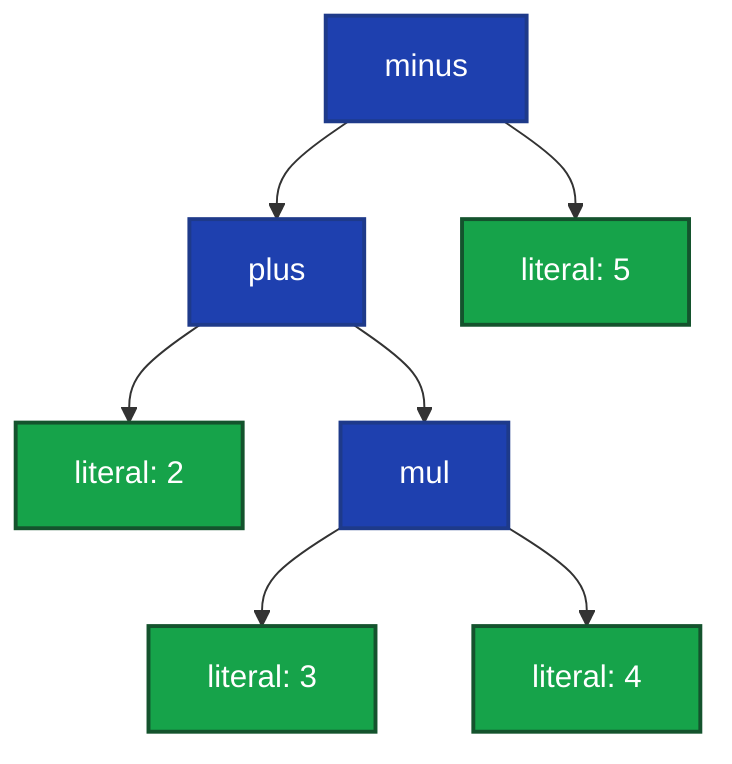
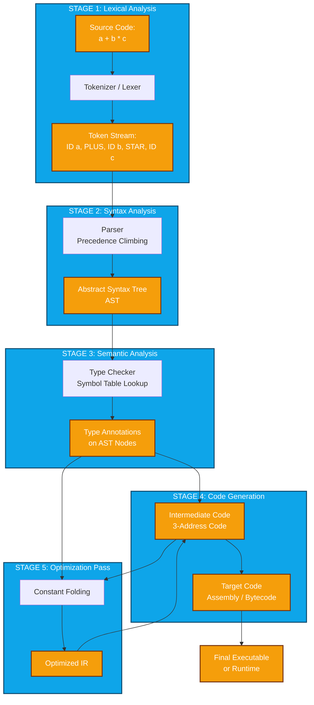
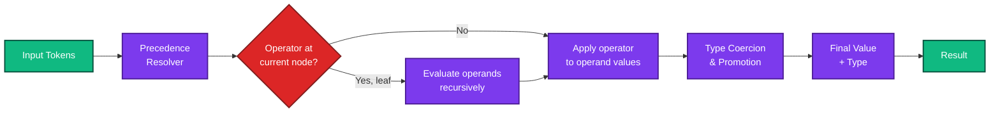
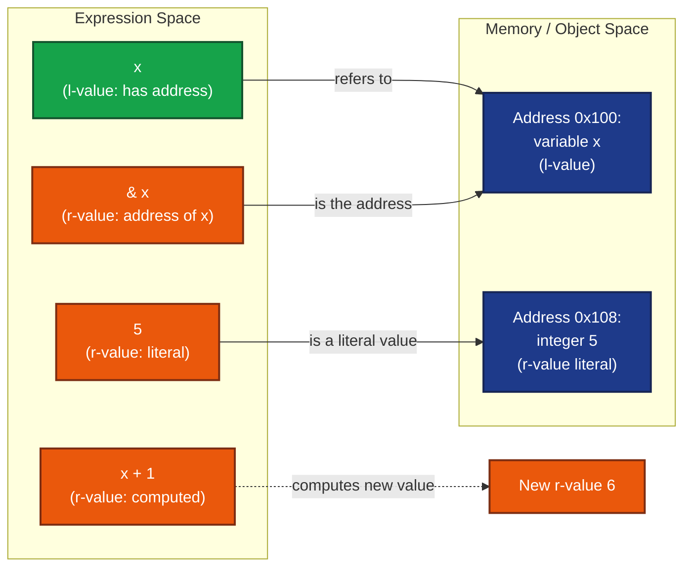

# Expressions and Statements -  Expressions

<!-- SECTION_1_START -->
# Expressions in Programming Languages

## Formal Definition

> [!IMPORTANT]
> **Expression (PL Formal Definition)**: An **expression** in a programming language is a syntactic construct composed of **operands** (variables, constants, function calls, literals) combined with **operators** (arithmetic, relational, logical, bitwise) that the language's runtime evaluates to produce a **single value** of a specific data type. Every expression in a well-typed language must have a **type** and a **value**, both of which are determined at the time of evaluation based on the language's **type system**, **operator precedence**, **associativity rules**, and **evaluation order semantics**.

In the formal grammar of programming languages, an `<expression>` is a non-terminal symbol generated by the production rules of the language. For example, a simplified BNF for arithmetic expressions is:

$$
\langle \text{expr} \rangle \to \langle \text{expr} \rangle \; \text{"+"} \; \langle \text{term} \rangle \mid \langle \text{term} \rangle
$$
$$
\langle \text{term} \rangle \to \langle \text{term} \rangle \; \text{"*"} \; \langle \text{factor} \rangle \mid \langle \text{factor} \rangle
$$
$$
\langle \text{factor} \rangle \to \text{"("} \; \langle \text{expr} \rangle \; \text{")"} \mid \text{IDENTIFIER} \mid \text{NUMBER}
$$

## Conceptual Analogy / Intuition

> [!NOTE]
> **Kitchen Recipe Analogy** for Expressions: Imagine a recipe instruction that says "take 2 cups of flour, add 1 cup of sugar, then mix in 3 eggs". The **operands** are the ingredients (flour, sugar, eggs), the **operators** are the actions (add, mix), and the final result is a well-mixed batter — a single, usable output. The order in which you perform the actions matters: if you "add sugar to eggs" before "mixing in flour", the result might be very different. Programming language expressions work exactly this way: the operands (data) are combined with operators (actions) under a specific order (precedence and associativity) to produce a final value.

The **fundamental distinction** between expressions and statements (which we will see in the next topic) is that **expressions always yield a value**, while **statements perform an action**. Every expression has a **type** (what kind of value it produces) and a **value** (the actual data produced). The *evaluation* of an expression is the process by which the runtime computes this value.

> [!NOTE]
> **Core Syllabus Highlight**: In KTU 2024 Scheme Module 3, expressions are studied as the **fundamental computational unit** of any imperative or functional programming language. The module emphasizes how different languages (C, Java, Python, Haskell) classify, type-check, and evaluate expressions, with particular focus on **precedence**, **associativity**, **order of evaluation**, **side effects**, and **short-circuit semantics**.

## Key Components of an Expression

| Component | Description | Example |
|---|---|---|
| **Operand** | The data values on which operations are performed | `x`, `5`, `3.14`, `"hello"` |
| **Operator** | A symbol that denotes an operation to be performed | `+`, `-`, `*`, `/`, `&&`, `==` |
| **Literal** | A constant value written directly in the expression | `42`, `'A'`, `true`, `3.14f` |
| **Variable Reference** | A name that refers to a memory location | `count`, `total`, `user_name` |
| **Function Call** | An expression that invokes a function and returns its result | `sqrt(16)`, `getValue()` |
| **Parenthesized Sub-expression** | A sub-expression explicitly grouped using parentheses | `(a + b) * c` |

## The Concept of Expression Evaluation

> [!VISUALIZATION CONTROL]
> **Concept:** Expression as a Tree of Operations (Abstract Syntax Tree)
> **Input Equation:** `2 + 3 * 4` evaluated as a tree structure
> **Visual Description:** Picture a rooted tree where the root node is the final operator (`+`), its left child is the literal `2`, and its right child is a subtree rooted at `*` with children `3` and `4`. The tree is evaluated bottom-up: first `3 * 4 = 12`, then `2 + 12 = 14`. This is precisely how compilers parse and evaluate expressions — they build an AST, then traverse it (post-order) to compute the result.

## Physical Constants and Standard Metrics in Expression Evaluation

> [!IMPORTANT]
> **Critical Metrics in Expression Processing:**
> - **Precedence Levels**: Modern programming languages typically define **15 to 17 distinct precedence levels**, with arithmetic operators at the lower precedence tier and assignment at the very bottom.
> - **Associativity Direction**: Operators are either **left-associative** (evaluated left-to-right, like `+`, `-`, `*`, `/`), **right-associative** (evaluated right-to-left, like `=`, `**` in Python), or **non-associative** (cannot be chained, like `==`, `<`).
> - **Standard Integer Widths**: Most languages promote smaller integer types to **at least 32 bits** (`int` is typically `4 bytes = 32 bits`) during arithmetic expression evaluation.
<!-- SECTION_1_END -->

<!-- SECTION_2_START -->
# Deep Theoretical Analysis: Expression Classification, Precedence & Associativity

## 1. Classification of Expressions

Expressions can be classified along several orthogonal dimensions, each with implications for type checking, evaluation, and code generation.

### 1.1 By the Kind of Operation Performed

$$
\textbf{Expressions} = \begin{cases}
\textbf{Arithmetic} & : \text{numeric computation (e.g., } a + b \cdot c) \\
\textbf{Relational} & : \text{comparison producing boolean (e.g., } x \geq y) \\
\textbf{Logical} & : \text{boolean logic (e.g., } p \land q \lor \neg r) \\
\textbf{Bitwise} & : \text{binary digit manipulation (e.g., } m \;\&\; n) \\
\textbf{String} & : \text{concatenation of character sequences (e.g., } s_1 + s_2) \\
\textbf{Conditional} & : \text{ternary branching (e.g., } c \;?\; x : y) \\
\textbf{Assignment} & : \text{evaluation with side-effect (e.g., } a = b) \\
\textbf{Function Call} & : \text{invocation returning a value (e.g., } f(x, y))
\end{cases}
$$

### 1.2 By Type-Checking Strictness

| Expression Type | Definition | Example Languages |
|---|---|---|
| **Typed Expression** | Operand and operator types are checked at compile time | Java, C++, C# |
| **Polymorphic Expression** | Operator works on multiple types via overloading | C++ (`+` for int, float, string) |
| **Type-Inferred Expression** | Types deduced from context without explicit declaration | Haskell, ML, Rust, Scala |
| **Dynamically-Typed Expression** | Types checked at runtime; any type can be combined | Python, JavaScript, Ruby |
| **Untyped / Lambda-Calculus Expression** | No type system; values carry their own type tags | Untyped Lambda Calculus |

### 1.3 By Order of Evaluation (Strict vs Non-Strict)

| Evaluation Strategy | Definition | Languages |
|---|---|---|
| **Strict (Eager / Applicative)** | All operands are evaluated before the operator is applied | C, Java, Python, ML |
| **Non-Strict (Lazy / Normal-Order)** | Operands are evaluated only when their value is needed | Haskell (by default), Miranda |

## 2. Operator Precedence: The Binding Power

> [!IMPORTANT]
> **Operator Precedence** is the set of rules that governs the order in which the parts of an expression are bound together when no parentheses are present. Higher precedence operators "bind tighter" and are evaluated first.

In any expression, two operators compete for an operand only when they are adjacent in the parse tree. The one with higher precedence wins the operand. This is mathematically equivalent to saying that precedence determines the **depth** of an operator in the AST: higher precedence ⇒ deeper in the tree ⇒ evaluated first (post-order traversal).

### 2.1 Standard Precedence Table (C / Java / Python — Decreasing Top-to-Bottom)

| Level | Operator Class | Operators | Associativity |
|---|---|---|---|
| 17 | Parentheses / Function Call | `()`, `[]`, `.`, `->` | Left-to-Right |
| 16 | Postfix Increment | `++`, `--` (postfix) | Right-to-Left |
| 15 | Unary Prefix | `++`, `--`, `+`, `-`, `!`, `~`, `(type)` | Right-to-Left |
| 14 | Multiplicative | `*`, `/`, `%` | Left-to-Right |
| 13 | Additive | `+`, `-` | Left-to-Right |
| 12 | Shift | `<<`, `>>`, `>>>` | Left-to-Right |
| 11 | Relational | `<`, `<=`, `>`, `>=`, `instanceof` | Left-to-Right |
| 10 | Equality | `==`, `!=` | Left-to-Right |
| 9 | Bitwise AND | `&` | Left-to-Right |
| 8 | Bitwise XOR | `^` | Left-to-Right |
| 7 | Bitwise OR | `\|` | Left-to-Right |
| 6 | Logical AND | `&&` | Left-to-Right |
| 5 | Logical OR | `\|\|` | Left-to-Right |
| 4 | Conditional Ternary | `?:` | Right-to-Left |
| 3 | Assignment | `=`, `+=`, `-=`, `*=`, `/=`, `%=`, `&=`, `^=`, `\|=`, `<<=`, `>>=` | Right-to-Left |
| 2 | Comma | `,` | Left-to-Right |

### 2.2 Worked Example of Precedence Resolution

Consider the C expression:
$$
\texttt{int result = 10 - 2 * 3 + 4 / 2;}
$$

We parse this using the precedence rules above:

**Step 1**: Identify all operators and their levels:
- `=` (level 3, right-associative)
- `-` (level 13)
- `*` (level 14)
- `+` (level 13)
- `/` (level 14)

**Step 2**: Highest precedence binds first. `*` and `/` are at level 14, so they evaluate first:
$$
10 \;-\; (2 \cdot 3) \;+\; (4 / 2) \;=\; 10 \;-\; 6 \;+\; 2
$$

**Step 3**: Next, the additive operators `-` and `+` are at level 13. Both are left-associative, so we evaluate left to right:
$$
(10 - 6) + 2 \;=\; 4 + 2 \;=\; 6
$$

**Step 4**: Finally, the assignment `=` stores the value `6` into `result`. The expression on the right evaluates to `6`, and the entire assignment expression itself has the value `6` (in C and Java, assignment is an expression).

## 3. Associativity: The Direction of Binding

> [!IMPORTANT]
> **Associativity** determines the direction in which operators of the **same precedence** are grouped when they appear in sequence. It is applied only when precedence alone cannot resolve the parse.

### 3.1 Left-Associative Example
$$
a - b - c \;\equiv\; (a - b) - c \quad (\text{not } a - (b - c))
$$

This is critical because subtraction is **not commutative**:
$$
(8 - 5) - 2 = 3 - 2 = 1 \qquad \text{vs} \qquad 8 - (5 - 2) = 8 - 3 = 5
$$

### 3.2 Right-Associative Example (Exponentiation in Python)
$$
2 \;\texttt{**}\; 3 \;\texttt{**}\; 2 \;\equiv\; 2 \;\texttt{**}\; (3 \;\texttt{**}\; 2) \;=\; 2^{9} \;=\; 512
$$
$$
\text{If it were left-associative: } (2^3)^2 = 8^2 = 64
$$

### 3.3 Assignment is Right-Associative
$$
a = b = c = 5 \;\equiv\; a = (b = (c = 5))
$$
This means `c` is assigned `5` first, then `b` receives the value of that assignment (which is `5`), then `a` receives `5`.

## 4. L-values vs R-values: The Two Faces of a Name

This is one of the most important conceptual distinctions in programming language theory.

| Term | Definition | Property | Example |
|---|---|---|---|
| **L-value** | An expression that refers to a **memory location** (an object with an address) | Has an address; can appear on the **left** of an assignment | `x`, `arr[3]`, `*ptr`, `obj.field` |
| **R-value** | An expression that refers to a **data value** (the contents of a location) | Has no persistent address; can appear only on the **right** of an assignment | `5`, `x + 1`, `f(x)`, `a > b` |

> [!NOTE]
> **Why It Matters**: In C, the expression `x = 5` is itself an expression. Its **l-value** is the variable `x` (it has an address), and its **r-value** is the value `5` (the data). This is why `5 = x` is a compile error in C: the literal `5` has no address and cannot appear on the left side of an assignment.

The prefix `&` (address-of) operator in C only works on **l-values** because it requires a memory location to take the address of:
$$
\&\;x \quad \text{valid (x is l-value)} \qquad \text{vs} \qquad \&\;(x + 1) \quad \text{invalid (x+1 is r-value)}
$$

## 5. Order of Evaluation and Side Effects

### 5.1 Unspecified vs Undefined vs Implementation-Defined Order

> [!IMPORTANT]
> **Three Critical Categories of Evaluation-Order Ambiguity:**
> - **Specified Order**: The language standard explicitly defines the order. (e.g., Python evaluates function arguments left-to-right.)
> - **Unspecified Order**: The standard allows the compiler freedom to choose, but requires the *result* to be one of the possibilities if a choice exists. (e.g., C++ order of evaluation of function arguments.)
> - **Undefined Behavior**: The standard imposes no requirement; the program may do *anything* (e.g., `i = i++ + ++i;` in C is undefined).

### 5.2 Side Effects in Expressions

A **side effect** is any change in the program's state that occurs as a result of evaluating an expression, beyond the production of the expression's value.

**Common sources of side effects**:
- Modifying a variable (`i++`, `x = 5`)
- Modifying a memory location through a pointer (`*p = 10`)
- Performing I/O (`printf("hello")` in C, `print("hello")` in Python)
- Modifying a global variable from within a function

**The famous ambiguous expression in C**:
```c
int i = 5;
int j = i++ + ++i;  // UNDEFINED BEHAVIOR in C
```
The standard says it is undefined because the order of evaluation of the operands of `+` is unspecified, and there are side effects on `i` in both operands.

### 5.3 Short-Circuit Evaluation

> [!NOTE]
> **Short-Circuit Evaluation** is a semantic rule for boolean operators `&&` and `||` where the second operand is **not evaluated** if the result of the entire expression can be determined from the first operand alone. This is essential for safety, performance, and the implementation of conditional idioms.

**In C, Java, Python**:
- `A && B`: If `A` is false, `B` is **not evaluated** (result is `false` regardless).
- `A || B`: If `A` is true, `B` is **not evaluated** (result is `true` regardless).

**Idiomatic use for safety**:
```c
if (ptr != NULL && ptr->value > 0) {  // ptr->value not accessed if ptr is NULL
    ...
}
```

**In Fortran, VB, Pascal (non-short-circuit languages)**, both operands of `.AND.` and `.OR.` are always evaluated, which can lead to null-pointer or division-by-zero errors in conditional code.

## 6. Type Coercion (Implicit Type Conversion)

When operators are applied to operands of **mixed types**, most languages perform **implicit type conversion** (coercion) to a common type. The rules follow a "type lattice" hierarchy:

$$
\textbf{char} \;\to\; \textbf{int} \;\to\; \textbf{long} \;\to\; \textbf{float} \;\to\; \textbf{double}
$$

A lower-precision operand is "promoted" to the higher-precision type before the operation. Example in C:
```c
int i = 5;
double d = 3.14;
double result = i + d;  // i is promoted to 5.0, then 5.0 + 3.14 = 8.14
```

> [!NOTE]
> **Java's Strict Coercion**: Java forbids many implicit coercions that C allows. For example, `int` to `boolean` conversion is **not** allowed; you must write `i != 0` rather than treating `i` as boolean. This is a deliberate design choice for type safety.

## 7. Real-World Utility in Engineering and CS

> [!NOTE]
> **Where Expression Evaluation Matters in Production Systems:**
> - **Compiler Design**: Compilers build an AST from expressions, perform type checking, optimize constant subexpressions (constant folding), eliminate common subexpressions (CSE), and emit code.
> - **Database Query Engines**: SQL expressions in `WHERE` clauses are evaluated with the same precedence and associativity considerations. Misunderstanding precedence has led to security vulnerabilities (e.g., `WHERE admin = 0 OR 1=1` without parentheses).
> - **Numerical Computing**: Floating-point expressions are **not associative** on real hardware due to rounding errors. Parallel reductions must be carefully ordered to maintain accuracy.
> - **Spreadsheet Engines**: Excel and Google Sheets evaluate expressions with a specific precedence (different from C in some cases — notably `&` for string concatenation has higher precedence than comparison in Excel but lower in C).

## KTU Formula Sheet & Cheat Sheet

| Concept | Rule / Formula | KTU Significance |
|---|---|---|
| Precedence Level of `*` vs `+` | `*` > `+` in all major languages | Direct exam question on expression value |
| Left-associativity of `-` | $a - b - c \equiv (a - b) - c$ | Tested with non-commutative operators |
| Right-associativity of `=` | $a = b = 5 \equiv a = (b = 5)$ | C and Java assignment is an expression |
| Short-circuit `&&` | $A \land_{\text{sc}} B \equiv A \land (\text{evaluate } B \text{ only if } A = T)$ | Tests understanding of evaluation order |
| Type promotion | $\text{char} < \text{int} < \text{long} < \text{float} < \text{double}$ | Question on mixed-type expression result |
| L-value address | $\text{addressOf}(x) = \&x \text{ is valid iff } x \text{ is an l-value}$ | Tested in C-specific questions |
<!-- SECTION_2_END -->

<!-- SECTION_3_START -->
# Step-by-Step Derivations, Evaluation Traces, and Code Implementation

## Derivation 1: Resolving a Multi-Operator Expression via Precedence & Associativity

**Expression (C syntax)**:
```c
int a = 2, b = 3, c = 4, d = 5;
int r = a + b * c - d / a + b % c;
```

**Step 1 — Identify all operators and assign precedence levels**:

| Operator | Precedence Level | Associativity |
|---|---|---|
| `=` (assignment) | 3 | Right-to-Left |
| `+` (after `b*c`) | 13 | Left-to-Right |
| `-` (between `b*c` and `d/a`) | 13 | Left-to-Right |
| `*` (between `b` and `c`) | 14 | Left-to-Right |
| `/` (between `d` and `a`) | 14 | Left-to-Right |
| `%` (between `b` and `c`) | 14 | Left-to-Right |
| `+` (final, before `b%c`) | 13 | Left-to-Right |

**Step 2 — Evaluate highest-precedence operators first (`*`, `/`, `%`)**:

The sub-expression `b * c` evaluates to:
$$
b \cdot c \;=\; 3 \cdot 4 \;=\; 12
$$

The sub-expression `d / a` evaluates to (integer division in C):
$$
d / a \;=\; 5 / 2 \;=\; 2 \quad (\text{truncates the fractional part } 0.5)
$$

The sub-expression `b % c` evaluates to (modulo of positive integers):
$$
b \bmod c \;=\; 3 \bmod 4 \;=\; 3 \quad (\text{since } 4 > 3)
$$

**Step 3 — Substitute the results back into the expression**:

$$
r \;=\; 2 \;+\; 12 \;-\; 2 \;+\; 3
$$

**Step 4 — Apply left-to-right associativity for the equal-precedence additive operators**:

$$
r \;=\; ((2 + 12) - 2) + 3
$$

**Step 5 — Evaluate left to right**:

$$
(2 + 12) \;=\; 14
$$
$$
(14 - 2) \;=\; 12
$$
$$
(12 + 3) \;=\; 15
$$

**Final result**: `r = 15`.

**Step 6 — Verify with code**:
```python
a, b, c, d = 2, 3, 4, 5
r = a + b * c - d // a + b % c  # // for integer division
print(r)  # Output: 15
```

## Derivation 2: Right-Associativity of Assignment in C

**Expression**:
```c
int a, b, c;
a = b = c = 10;
```

**Step 1 — Recognize that `=` is right-associative (precedence level 3, lowest)**.

**Step 2 — Parse the expression as a right-branching tree**:

$$
a = (b = (c = 10))
$$

**Step 3 — Evaluate the rightmost assignment first**:

The expression `c = 10`:
- The r-value `10` is assigned to the l-value `c`.
- In C, the assignment expression itself evaluates to the value `10`.
- `c` is now `10`.

**Step 4 — Evaluate the next assignment**:

The expression `b = (c = 10)`:
- The right-hand side has value `10` (from Step 3).
- `10` is assigned to `b`.
- The whole expression evaluates to `10`.
- `b` is now `10`.

**Step 5 — Evaluate the outermost assignment**:

The expression `a = (b = (c = 10))`:
- The right-hand side has value `10`.
- `10` is assigned to `a`.
- The whole expression evaluates to `10`.
- `a` is now `10`.

**Final state**: `a = b = c = 10`. All three variables hold the value `10`.

## Derivation 3: Short-Circuit Evaluation Trace

**C code**:
```c
#include <stdio.h>
int main() {
    int x = 0, y = 5;
    int z = (x != 0) && (++y > 0);
    printf("z = %d, y = %d\n", z, y);
    return 0;
}
```

**Step 1 — Evaluate the left operand of `&&`**: `x != 0`:
- `x` is `0`, so `0 != 0` evaluates to `0` (false in boolean context).

**Step 2 — Apply short-circuit rule for `&&`**: The result of the left operand is `false`. By short-circuit semantics, the right operand `++y > 0` is **not evaluated** at all.

**Step 3 — Result of `&&` is `false` (0)**: So `z = 0`.

**Step 4 — Side effect check**: Was `y` modified?
- Since `(++y > 0)` was never evaluated, `y` remains `5`.

**Final output**: `z = 0, y = 5`.

**Contrast with non-short-circuit language (e.g., Fortran)**:
```fortran
! In Fortran, the equivalent code would ALWAYS evaluate both sides
! because .AND. is non-short-circuit by default
logical :: z
integer :: y = 5
z = (.FALSE.) .AND. (y > 0)  ! y > 0 is still evaluated, y remains 5
```
In modern Fortran 2003+, the operators `.AND.` are still non-short-circuit; only the user-defined `.AND.` operators via interface blocks can be short-circuit.

## Derivation 4: Type Coercion in a Mixed-Type Expression

**C code**:
```c
#include <stdio.h>
int main() {
    int i = 7;
    float f = 2.5f;
    double d = 4.0;
    double result = i * f + d / 2;
    printf("result = %lf\n", result);
    return 0;
}
```

**Step 1 — Apply C's "usual arithmetic conversions"**:
- `i` is `int` (level: int)
- `f` is `float` (level: float)
- `d` is `double` (level: double)
- `2` is `int` (level: int)

**Step 2 — Evaluate `i * f`**:
- `i` is promoted from `int` to `float`: `i → 7.0f`
- `7.0f * 2.5f = 17.5f`
- Result type: `float`, value `17.5f`.

**Step 3 — Evaluate `d / 2`**:
- `2` is promoted from `int` to `double`: `2 → 2.0`
- `4.0 / 2.0 = 2.0`
- Result type: `double`, value `2.0`.

**Step 4 — Evaluate the addition `i * f + d / 2`**:
- The left operand is `float (17.5f)`, the right is `double (2.0)`.
- The lower type `float` is promoted to `double`: `17.5f → 17.5`.
- `17.5 + 2.0 = 19.5`.
- Result type: `double`, value `19.5`.

**Step 5 — Assignment to `result`**: `result` is `double`, no further conversion needed.

**Final output**: `result = 19.500000`.

## Python Code: Full Demonstration of Expression Concepts

```python
"""
Expression Demonstration: Precedence, Associativity, Short-Circuit, L-values, Type Coercion
Author: KTU 2024 Scheme - Programming Languages (PECST758)
Module 3: Expressions
"""

import sys
from typing import Any, List

# ============================================================
# 1. PRECEDENCE AND ASSOCIATIVITY
# ============================================================
def demo_precedence() -> None:
    """Demonstrates how operator precedence determines evaluation order."""
    print("=== 1. Precedence Demo ===")
    # In Python, ** binds tighter than * which binds tighter than +/-
    # So: 2 + 3 * 4 ** 2  =  2 + 3 * 16  =  2 + 48  =  50
    expr1: int = 2 + 3 * 4 ** 2
    print(f"2 + 3 * 4 ** 2 = {expr1}  (expected 50)")

    # With explicit parentheses, we override precedence
    expr2: int = (2 + 3) * 4 ** 2
    print(f"(2 + 3) * 4 ** 2 = {expr2}  (expected 80)")

    # Exponentiation is RIGHT-associative
    # 2 ** 3 ** 2 = 2 ** (3 ** 2) = 2 ** 9 = 512
    expr3: int = 2 ** 3 ** 2
    print(f"2 ** 3 ** 2 = {expr3}  (right-assoc, expected 512)")

    # Subtraction is LEFT-associative
    # 10 - 3 - 2 = (10 - 3) - 2 = 5
    expr4: int = 10 - 3 - 2
    print(f"10 - 3 - 2 = {expr4}  (left-assoc, expected 5)")


# ============================================================
# 2. SHORT-CIRCUIT EVALUATION
# ============================================================
def demo_short_circuit() -> None:
    """Demonstrates short-circuit behavior of 'and' / 'or'."""
    print("\n=== 2. Short-Circuit Demo ===")
    counter: List[int] = [0]

    def side_effecting() -> bool:
        """A function with a side effect (increments counter)."""
        counter[0] += 1
        return True

    # In 'A and B', B is NOT evaluated if A is False
    result1: bool = False and side_effecting()
    print(f"False and side_effect() = {result1}, counter = {counter[0]} (counter should be 0)")

    # In 'A or B', B is NOT evaluated if A is True
    counter[0] = 0  # reset
    result2: bool = True or side_effecting()
    print(f"True or side_effect() = {result2}, counter = {counter[0]} (counter should be 0)")

    # If first operand is True in 'and', then B IS evaluated
    counter[0] = 0  # reset
    result3: bool = True and side_effecting()
    print(f"True and side_effect() = {result3}, counter = {counter[0]} (counter should be 1)")


# ============================================================
# 3. L-VALUE vs R-VALUE (Simulated in Python with ctypes)
# ============================================================
def demo_lvalue_rvalue() -> None:
    """Illustrates the l-value / r-value concept."""
    print("\n=== 3. L-value vs R-value Demo ===")
    x: int = 10
    # In C:  l-value  ->  an object with a memory address (x)
    #         r-value  ->  a value (the number 10)
    # In Python, every name is a reference to an object on the heap.
    # `x` is an l-value-equivalent (it refers to a memory cell).
    # `x + 1` is an r-value-equivalent (it computes a new value; not assignable).

    # Python doesn't allow "lvalue = rvalue" because every expression
    # must be on the right of =, so we illustrate conceptually:
    print(f"x is {x}; x is an l-value (refers to a cell)")
    print(f"x + 1 = {x + 1}; this is an r-value (computed value, not assignable)")

    # In C, the expression  (x = 5)  is itself an expression with the value 5
    # In Python, assignment is a statement, not an expression:
    #    y = (x = 5)    # SYNTAX ERROR in Python
    #    y = 5           # This is the Python way


# ============================================================
# 4. TYPE COERCION (Mixed-type arithmetic)
# ============================================================
def demo_type_coercion() -> None:
    """Demonstrates implicit type promotion in expressions."""
    print("\n=== 4. Type Coercion Demo ===")
    i: int = 7
    f: float = 2.5
    # Python promotes int to float automatically before multiplication
    result: float = i * f
    print(f"int(7) * float(2.5) = {result}  (type: {type(result).__name__})")

    # When mixing int and complex, int is promoted to complex
    c: complex = 1 + 2j
    result2: complex = i * c
    print(f"int(7) * complex(1+2j) = {result2}  (type: {type(result2).__name__})")


# ============================================================
# MAIN EXECUTION
# ============================================================
if __name__ == "__main__":
    try:
        demo_precedence()
        demo_short_circuit()
        demo_lvalue_rvalue()
        demo_type_coercion()
    except Exception as e:
        print(f"[ERROR] Exception during execution: {e}", file=sys.stderr)
        sys.exit(1)
    sys.exit(0)
```

**Expected Output**:
```
=== 1. Precedence Demo ===
2 + 3 * 4 ** 2 = 50  (expected 50)
(2 + 3) * 4 ** 2 = 80  (expected 80)
2 ** 3 ** 2 = 512  (right-assoc, expected 512)
10 - 3 - 2 = 5  (left-assoc, expected 5)

=== 2. Short-Circuit Demo ===
False and side_effect() = False, counter = 0 (counter should be 0)
True or side_effect() = True, counter = 0 (counter should be 0)
True and side_effect() = True, counter = 1 (counter should be 1)

=== 3. L-value vs R-value Demo ===
x is 10; x is an l-value (refers to a cell)
x + 1 = 11; this is an r-value (computed value, not assignable)

=== 4. Type Coercion Demo ===
int(7) * float(2.5) = 17.5  (type: float)
int(7) * complex(1+2j) = (7+14j)  (type: complex)
```

## Derivation 5: Explicit AST Construction for an Expression

For the expression `a + b * c`, we manually construct the AST:

**Step 1 — Tokenize**: `a`, `+`, `b`, `*`, `c`

**Step 2 — Apply precedence**: `*` has higher precedence than `+`, so `b * c` is grouped first.

**Step 3 — Construct the AST** (root is the lowest-precedence operator, `+`):

$$
\boxed{\texttt{+}} \;\to\; \begin{cases} \text{left: } \texttt{a} \\ \text{right: } \begin{cases} \boxed{\texttt{*}} \to \begin{cases} \text{left: } \texttt{b} \\ \text{right: } \texttt{c} \end{cases} \end{cases} \end{cases}
$$

**Step 4 — Evaluate in post-order (LRN traversal)**:
- Visit `a` → return value of `a`
- Visit left subtree of `*`: visit `b` → return value of `b`
- Visit right subtree of `*`: visit `c` → return value of `c`
- Apply `*` to (b, c) → return `b * c`
- Apply `+` to (a, b*c) → return `a + b*c`

This is exactly how a compiler's **expression evaluator** works internally.
<!-- SECTION_3_END -->

<!-- SECTION_4_START -->
# Structural Diagrams and Schematics

## Diagram 1: Abstract Syntax Tree (AST) for `2 + 3 * 4 - 5`



> **Reading the diagram**: The root is the lowest-precedence operator (`-`). Its left child is a `+` subtree (higher precedence evaluated first conceptually, but appears as a child). The right child of the root is the literal `5`. Inside the `+` node, the right child is a `*` subtree (highest precedence) containing `3` and `4`. Post-order evaluation gives: $((2 + (3 \cdot 4)) - 5) = (2 + 12) - 5 = 9$.

## Diagram 2: Block-Level Functional Architecture of Expression Compilation



## Diagram 3: Sequential Processing Topology of Expression Evaluation



## Diagram 4: Precedence Resolution Algorithm (Recursive Descent)

```mermaid
flowchart TB
    subgraph Precedence["Precedence Levels (Top = Lowest)"]
        L1["Level 1: assignment ="]
        L2["Level 2: conditional ?:"]
        L3["Level 3: logical OR ||"]
        L4["Level 4: logical AND &&"]
        L5["Level 5: bitwise OR |"]
        L6["Level 6: bitwise XOR ^"]
        L7["Level 7: bitwise AND and"]
        L8["Level 8: equality =="]
        L9["Level 9: relational less-than"]
        L10["Level 10: shift left-right"]
        L11["Level 11: additive +-"]
        L12["Level 12: multiplicative */%"]
        L13["Level 13: unary prefix"]
        L14["Level 14: postfix ++"]
        L15["Level 15: primary ()"]
    end

    L1 --> L2 --> L3 --> L4 --> L5 --> L6 --> L7 --> L8 --> L9 --> L10 --> L11 --> L12 --> L13 --> L14 --> L15

    classDef levelStyle fill:#0d9488,stroke:#134e4a,stroke-width:1px,color:#ffffff,font-size:12px
    class L1,L2,L3,L4,L5,L6,L7,L8,L9,L10,L11,L12,L13,L14,L15 levelStyle
```



## Diagram 5: L-value vs R-value — Memory Model View


<!-- SECTION_4_END -->

<!-- SECTION_5_START -->
# KTU 2024 Scheme Examination Question Bank

> [!NOTE]
> All questions are mapped to **Course Outcomes (CO)** of PECST758 (Programming Languages) and the **Revised Bloom's Taxonomy (RBT)** cognitive levels as per the KTU 2024 evaluation scheme.

---

## Part A Questions (3 Marks Each)

### Question 1: Define an Expression [CO1, Remember]
`[KTU University Exam - July 2024]`

**Question:** What is an expression in a programming language? Differentiate between an expression and a statement with a suitable example.

**Model Answer:**

An **expression** is a syntactic construct in a programming language composed of **operands** (variables, literals, function calls) and **operators** that the language's runtime evaluates to produce a **single value** of a specific **data type**. Every expression has a type and a value.

A **statement**, in contrast, is a syntactic construct that **performs an action** but does not necessarily produce a value. Statements are the executable units of a program; expressions are the value-producing units.

**Key Difference:**

| Aspect | Expression | Statement |
|---|---|---|
| Produces a value? | Yes (always) | Not necessarily |
| Has a type? | Yes | Not necessarily |
| Example (C) | `a + b * c` (value: some int) | `if (x > 0) { ... }` (no value) |
| Example (Python) | `len(s) > 0` (value: True/False) | `print("hello")` (action, returns None) |

**Incremental Valuation Key Points:**
- [Defining expression with operand/operator/value: 1 Mark]
- [Defining statement and its action-nature: 1 Mark]
- [Tabular or example-based differentiation: 1 Mark]

---

### Question 2: Operator Precedence and Associativity [CO1, Understand]
`[KTU University Exam - Dec 2023]`

**Question:** Explain operator precedence and associativity. Why is the expression `a - b - c` not equivalent to `a - (b - c)` in most programming languages?

**Model Answer:**

**Operator Precedence** is the set of rules that determines the **binding strength** of operators. An operator with higher precedence binds more tightly to its operands and is evaluated first. For example, in C, Java, Python: `*` has higher precedence than `+`, so in `2 + 3 * 4`, the multiplication is performed first.

**Associativity** is the rule applied when operators of the **same precedence** appear adjacent. It defines the **direction** (left-to-right or right-to-left) in which the operators group.

In most programming languages (C, C++, Java, Python, JavaScript), the subtraction operator `-` is **left-associative**. This means `a - b - c` is parsed and evaluated as:

$$
a - b - c \;\equiv\; (a - b) - c
$$

It is **NOT** equivalent to `a - (b - c)` because subtraction is **not commutative**. A concrete numerical example with `a = 10, b = 3, c = 2`:
- Left-associative: `(10 - 3) - 2 = 7 - 2 = 5`
- Right-associative (hypothetical): `10 - (3 - 2) = 10 - 1 = 9`

The two results are different, proving that the grouping matters. Only operators that are **both commutative and associative** (e.g., `+`, `*`, `&`, `|`, `^`) give the same result regardless of grouping direction.

**Incremental Valuation Key Points:**
- [Defining precedence: 1 Mark]
- [Defining associativity: 1 Mark]
- [Explaining left-associativity of `-` and numerical proof of non-equivalence: 1 Mark]

---

## Part B Questions (14 Marks Each)

> [!NOTE]
> KTU 2024 Scheme ESE (End Semester Examination) Module-Internal Choice pattern. Each question has two sub-parts (a) and (b), each carrying 7 marks. Total: 14 marks.

### Question A: Comprehensive Expression Evaluation Problem [CO2, Apply & Analyze]
`[KTU University Exam - Dec 2024]`

**Question:**

**(a)** Consider the following C program fragment. Evaluate the value of `result` and explain each step of the evaluation, including operator precedence, associativity, and type coercion.

```c
#include <stdio.h>
int main() {
    int a = 8, b = 3, c = 2, d = 7;
    float f = 4.5f;
    double result = a * b / c + f - d % a;
    printf("result = %lf\n", result);
    return 0;
}
```

**(b)** Explain the concept of **short-circuit evaluation** in C and Java with an example. Show how short-circuiting is **essential for safe pointer dereferencing** in C with a code example. Also discuss what would happen if a language did not support short-circuit evaluation.

**Model Answer for (a) — 7 Marks:**

**Step 1: Identify operators and their precedence**:
- `*` (multiplicative, level 14, left-associative)
- `/` (multiplicative, level 14, left-associative)
- `%` (multiplicative, level 14, left-associative)
- `+` (additive, level 13, left-associative)
- `-` (additive, level 13, left-associative)
- `=` (assignment, level 3, right-associative)

**Step 2: Evaluate highest-precedence operators (`*`, `/`, `%`)**:

`a * b`:
- Both are `int`, so result is `int`.
- $8 \times 3 = 24$.

`a * b / c` (left-associative):
- Evaluate left to right: `24 / c = 24 / 2 = 12` (integer division, no fractional part).

`d % a`:
- Both are `int`, result is `int`.
- $7 \bmod 8 = 7$ (since $8 > 7$, the remainder is $7$).

**Step 3: Substitute back**:
$$
\texttt{result} = 12 + f - 7 = 12 + 4.5f - 7
$$

**Step 4: Apply additive operators left-to-right**:

`12 + f`:
- `12` is `int`, `f` is `float`. Apply usual arithmetic conversions: `int` is promoted to `float`: $12.0f$.
- $12.0f + 4.5f = 16.5f$.

`16.5f - 7`:
- `16.5f` is `float`, `7` is `int`. Promote `7` to `float`: $7.0f$.
- $16.5f - 7.0f = 9.5f$.

**Step 5: Type coercion for assignment to `double`**:
- The result `9.5f` is `float`. `result` is declared as `double`.
- Promote `float` to `double`: `9.5f → 9.5`.

**Final value**: `result = 9.500000`.

**Incremental Valuation Key Points for (a):**
- [Correct identification of precedence levels: 1 Mark]
- [Correct evaluation of `*`, `/`, `%` with integer division: 2 Marks]
- [Application of type coercion rules for mixed `int`/`float`/`double`: 2 Marks]
- [Final correct numerical result `9.5`: 2 Marks]

**Model Answer for (b) — 7 Marks:**

**Definition**: Short-circuit evaluation is a semantic rule for the boolean operators `&&` (logical AND) and `||` (logical OR) in which the **second operand is not evaluated** if the result of the entire expression can be determined from the first operand alone.

**Rules**:
- For `A && B`: If `A` evaluates to `false`, the entire expression is `false` and `B` is **not evaluated**.
- For `A || B`: If `A` evaluates to `true`, the entire expression is `true` and `B` is **not evaluated**.

**Example in C with safe pointer dereferencing**:
```c
#include <stdio.h>
int main() {
    int *ptr = NULL;
    int value = 42;

    // Safe: short-circuit prevents dereferencing NULL
    if (ptr != NULL && *ptr > 0) {
        printf("Positive value\n");
    } else {
        printf("Pointer is NULL, safely skipped\n");
    }
    return 0;
}
```

**Trace**: `ptr != NULL` evaluates to `false` (since `ptr` is `NULL`). Short-circuit rule for `&&` triggers, so `*ptr > 0` is **never evaluated**, preventing a segmentation fault.

**What if short-circuit was not supported?**
- Both `ptr != NULL` and `*ptr > 0` would always be evaluated.
- The expression `*ptr > 0` would attempt to dereference a `NULL` pointer, causing a **runtime segmentation fault** (undefined behavior) in C and Java.
- Programs that rely on defensive checks like `if (x != 0 && y/x > 1)` (avoiding division by zero) would crash.

**Languages supporting short-circuit `&&`/`||`**: C, C++, Java, Python, JavaScript, C#, Ruby, Go.
**Languages NOT supporting short-circuit by default**: Fortran (`.AND.`, `.OR.` are non-short-circuit), Pascal, Visual Basic (older versions).

**Incremental Valuation Key Points for (b):**
- [Correct definition with both `&&` and `||` rules: 2 Marks]
- [Safe pointer code with trace: 2 Marks]
- [Discussion of consequences without short-circuit: 2 Marks]
- [Mention of at least one language that does not support it: 1 Mark]

---

### Question B: Mixed Evaluation Semantics and L-values [CO2, Apply & Analyze]
`[KTU University Exam - July 2024]`

**Question:**

**(a)** What are **l-values** and **r-values** in C? Explain with examples why the expression `5 = x` is invalid in C but `x = 5` is valid, and why `&(x + 1)` is a compile error. Show the role of l-values in array indexing and pointer dereferencing.

**(b)** Consider the following Python code. Trace the evaluation step-by-step and explain the output, focusing on operator precedence, string repetition `*` operator, comparison chaining, and short-circuit behavior.

```python
a = [1, 2, 3]
b = [1, 2, 3]
x = 5
y = "Hi"
print(a == b and a is b)
print(y * 3 + "!" > "Hi" and x > 0)
print((x := 10) > 5)
print(x)
```

**Model Answer for (a) — 7 Marks:**

**Definition**:
- An **l-value** (locator value) is an expression that refers to a **memory location** (an object with a stable address). It can appear on the **left side** of an assignment operator.
- An **r-value** (read value) is an expression that refers to a **data value** (the contents of a location or a computed result). It can appear only on the **right side** of an assignment.

**Why `5 = x` is invalid**: The literal `5` is an r-value — it has no associated memory location. The assignment operator `=` requires an l-value on its left to specify *where* to store the value. Since `5` has no address, the compiler rejects this expression with the error: `lvalue required as left operand of assignment`.

**Why `x = 5` is valid**: `x` is a variable name, which refers to a memory location. Hence `x` is an l-value. The r-value `5` is stored into the memory cell identified by `x`. The expression itself evaluates to `5` in C, making assignment an expression.

**Why `&(x + 1)` is invalid**: The expression `x + 1` is an r-value — it computes a new integer value (e.g., if `x` is `5`, `x + 1` is `6`) but does not have a persistent memory address. The unary `&` (address-of) operator **requires an l-value operand** because it needs a memory object whose address to return. Applying `&` to `x + 1` is rejected with the error: `lvalue required as unary '&' operand`.

**L-values in array indexing and pointer dereferencing**:
- `arr[3]`: Array subscript `arr[3]` is an l-value. It refers to the 4th element of `arr` (a specific memory cell), so it can be assigned to: `arr[3] = 10;`.
- `*ptr`: Pointer dereference `*ptr` is an l-value. It refers to the memory cell pointed to by `ptr`, so it can be assigned to: `*ptr = 20;`.
- `ptr->field`: In C, `ptr->field` is syntactic sugar for `(*ptr).field`, which is an l-value because `*ptr` is one.

**Incremental Valuation Key Points for (a):**
- [Defining l-value and r-value: 2 Marks]
- [Why `5 = x` fails (r-value cannot be assigned to): 1 Mark]
- [Why `&(x+1)` fails (need memory address): 1 Mark]
- [L-value roles in array index and pointer deref: 2 Marks]
- [Bonus: mention `arr[3] = 10` and `*ptr = 20`: 1 Mark]

**Model Answer for (b) — 7 Marks:**

**Line 1: `print(a == b and a is b)`**

`a` and `b` are two distinct list objects with equal contents.

Step 1: Evaluate `a == b`: Python's `==` calls `__eq__`, which for lists checks element-wise equality. Both `[1,2,3]` and `[1,2,3]` are equal. Result: `True`.

Step 2: Evaluate `a is b`: The `is` operator checks **identity** (same memory address, via `id()`). Since `a` and `b` are two separate list objects created at different times, `a is b` is `False`.

Step 3: `True and False`: Both operands are evaluated (no short-circuit because the first is `True` and `and` needs to check the second). Result: `False`.

**Output: `False`**.

**Line 2: `print(y * 3 + "!" > "Hi" and x > 0)`**

`y = "Hi"`, `x = 5`.

Step 1: Evaluate `y * 3`: In Python, `*` on a string and int means **repetition**. `"Hi" * 3 = "HiHiHi"`.

Step 2: Evaluate `"HiHiHi" + "!"`: String concatenation. Result: `"HiHiHi!"`.

Step 3: Evaluate `"HiHiHi!" > "Hi"`: Lexicographic comparison. `"HiHiHi!"` starts with `"Hi"` and has more characters, so it is greater. Result: `True`.

Step 4: `True and (x > 0)`: First operand is `True`, so `and` evaluates the second. `5 > 0` is `True`. Result: `True`.

**Output: `True`**.

**Line 3: `print((x := 10) > 5)`**

The walrus operator `:=` (Python 3.8+) is an **assignment expression**. It assigns `10` to `x` and the expression itself evaluates to `10`.

Step 1: `(x := 10)` assigns `10` to `x`, expression value is `10`.

Step 2: `10 > 5` is `True`.

**Output: `True`**.

**Line 4: `print(x)`**

After the walrus assignment in Line 3, `x` is now `10` (it was `5` before).

**Output: `10`**.

**Final Output of the code**:
```
False
True
True
10
```

**Incremental Valuation Key Points for (b):**
- [Correct trace of `a == b and a is b` with `==` vs `is` distinction: 2 Marks]
- [Correct evaluation of string repetition and lexicographic comparison: 2 Marks]
- [Walrus operator assignment-expression semantics: 1 Mark]
- [Final printed output: `False, True, True, 10`: 2 Marks]

---

> [!WARNING]
> **KTU Examiner's Valuation Warning / Common Pitfalls:**
> 1. **Do not confuse `==` with `is` in Python.** `==` checks value equality (calls `__eq__`), while `is` checks object identity (same memory address via `id()`). For integers and small strings, Python may intern them so `is` accidentally works, but for lists, dicts, and custom objects, `is` will almost always be `False` even when `==` is `True`. KTU examiners **always** test this distinction.
> 2. **Forgetting type coercion in mixed-type expressions.** In C, `5 / 2` is `2` (integer division), not `2.5`. Many students write `2.5` and lose 2 marks. Always check whether all operands are of the same type before dividing.
> 3. **Confusing `=` and `==` in conditions.** A common bug: `if (x = 5)` instead of `if (x == 5)`. In C, the first is a valid assignment expression (always non-zero, so always true) — this is a frequent KTU trap.
> 4. **Missing the precedence of `&&` over `||`.** In `a || b && c`, the `&&` binds first, so it is `a || (b && c)`, not `(a || b) && c`. Always check precedence before assuming.
> 5. **Forgetting that assignment in C is right-associative.** Writing `a = b = c = 5` and not knowing how to trace it from right to left will cost you the entire question on assignment.
> 6. **Not mentioning short-circuit behavior in conditional code.** When asked "why is this safe?", always explicitly say "because `&&` short-circuits and the right operand is not evaluated when the left is false". Examiners want the keyword "short-circuit".

---

## Topic Recap & Important Things to Remember

> [!IMPORTANT]
> **Rapid Revision Checklist — Module 3: Expressions**

- **Expression Definition**: A syntactic construct of operands + operators that **always evaluates to a single value** of a specific type. Distinguished from statements by always having a value and a type.
- **Operands**: literals (`5`, `3.14`, `'A'`, `"hello"`, `true`), variables (`x`, `count`), function calls (`f(a, b)`), parenthesized sub-expressions.
- **Operator Precedence**: Higher precedence binds tighter. Standard order (high→low): postfix > unary > `*/%` > `+-` > shift > relational > equality > bitwise > logical > ternary > assignment > comma.
- **Associativity**: Determines direction for same-precedence operators. Most operators are **left-associative**. Right-associative operators: assignment `=`, conditional `?:`, exponentiation `**` (Python), unary prefix.
- **L-value vs R-value**: L-value = memory location (assignable); R-value = data value (not assignable). `&` requires l-value. Array index `a[i]` and pointer deref `*p` are l-values.
- **Order of Evaluation**: Specified (Python), unspecified (C++ before C++17), or undefined (multiple side effects on same variable in C). Avoid ambiguous expressions.
- **Side Effects**: Modifications of state during expression evaluation (`i++`, `printf`). Can cause undefined behavior when combined with other side effects on the same variable.
- **Short-Circuit Evaluation**: `&&` skips right if left is false; `||` skips right if left is true. Essential for safe pointer/null checks and division-by-zero avoidance.
- **Type Coercion**: Lower-precision types promoted to higher-precision in mixed expressions. Standard promotion lattice: `char → int → long → float → double`. Java is stricter than C.
- **Assignment as Expression**: In C, C++, Java: `x = 5` is an expression with value `5`. In Python: assignment is a **statement** (not an expression) — only the walrus `:=` is an assignment expression (Python 3.8+).
- **Comparison Chaining**: Python allows `1 < x < 10` (mathematical notation); C requires `1 < x && x < 10`.
- **Operator Overloading in Expressions**: C++ allows `+` to work on user-defined types (e.g., complex numbers, strings). C and Java do not allow overloading of built-in operators.
- **Compile-Time vs Runtime Evaluation**: Constant expressions (e.g., `3 + 4 * 5`) are evaluated at **compile time** by **constant folding**. Expressions with variables are evaluated at **runtime**.
- **Common Expression-Related Bugs**: (1) Integer division truncating fractional parts. (2) `=` vs `==` confusion. (3) Operator precedence mis-ordering without parentheses. (4) Undefined behavior from multiple side effects. (5) Assuming `==` in Python is `is`.
- **Languages to Compare for Exam**: C (low-level, full precedence, short-circuit), Java (strict typing, no integer/boolean coercion), Python (operator overloading, chained comparisons, walrus operator), Haskell (non-strict, no side effects in pure expressions).
- **AST (Abstract Syntax Tree)**: Every expression can be represented as a tree where leaves are operands and internal nodes are operators. ASTs are fundamental to compilers, optimizers, and code generators.
- **Three-Address Code (TAC)**: A common intermediate representation where each instruction has at most three operands. Example: `t1 = b * c; t2 = a + t1; result = t2;` for `a + b * c`.
- **Infix, Prefix, Postfix Notations**: Infix is standard (`a + b`); prefix is used in Lisp/lambda calculus (`(+ a b)`); postfix (RPN) is used in stack-based VMs (`a b +`).
- **Constant Folding Optimization**: `2 + 3 * x` may be optimized to `15 if x is known at compile time, else remain symbolic. Used heavily in compilers.
- **The `,` (Comma) Operator in C**: Evaluates left operand, discards its value, then evaluates right operand. Result is the value of the right operand. Used in `for` loops: `for (i=0, j=10; i<j; i++, j--)`.
<!-- SECTION_5_END -->
