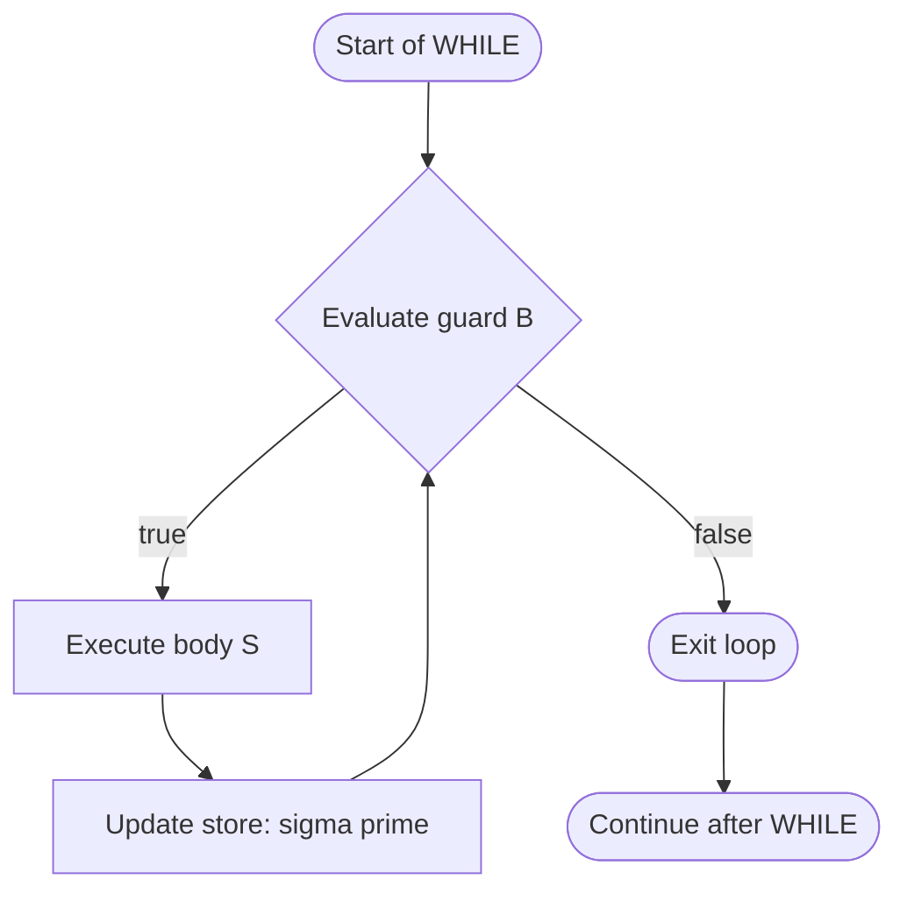
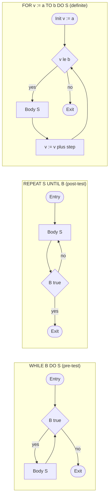
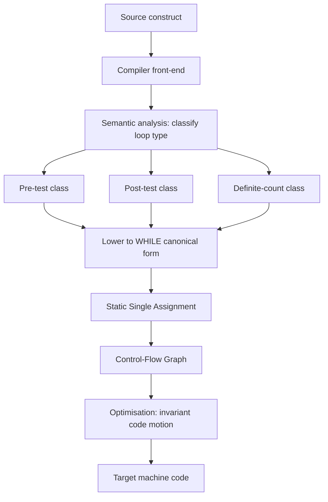
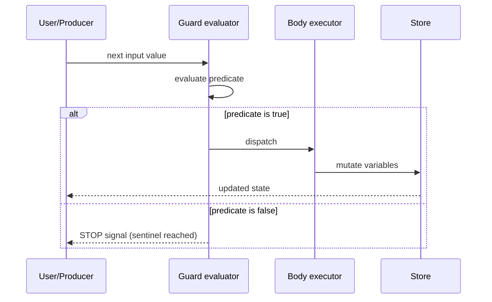
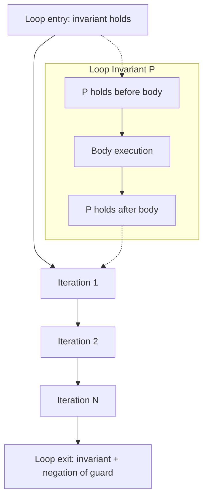

# Loops and Variations on WHILE

<!-- SECTION_1_START -->
# Loops and Variations on WHILE — Core Technical Definition & Intuitive Overview

## 1.1 Formal Academic Definition (KTU 2024 Syllabus Terminology)

> [!IMPORTANT]
> **WHILE Loop (KTU Definition):** A *WHILE* statement is a **definite control structure** used to express the repetitive execution of a statement (the *loop body*) as long as a Boolean condition (the *loop guard* or *predicate*) evaluates to **true**. It is the canonical example of an *indefinite iteration* construct in imperative programming languages, in which the number of repetitions is determined dynamically rather than declared statically.

**Extended Definition (with syntactic sugar):**
A WHILE construct has the canonical abstract syntax:

$$\text{stmt} \;\to\; \texttt{while } (B)\; \texttt{do } S$$

where $B$ is a Boolean expression and $S$ is a statement (often compound). The construct is evaluated using the operational rule:

$$\frac{\langle B, \sigma \rangle \rightarrow \text{true} \quad \langle S, \sigma \rangle \rightarrow \sigma'}{\langle \texttt{while}(B)\,S,\; \sigma \rangle \rightarrow \langle \texttt{while}(B)\,S,\; \sigma' \rangle} \quad (\text{BIG-STEP})$$

$$\frac{\langle B, \sigma \rangle \rightarrow \text{false}}{\langle \texttt{while}(B)\,S,\; \sigma \rangle \rightarrow \sigma} \quad (\text{TERMINATION})$$

## 1.2 Conceptual Analogy / Intuition

> [!NOTE]
> **Real-World Analogy — The "Tired Athlete" Loop**
>
> Imagine an athlete running laps around a stadium. The athlete's *mental check* before starting each new lap is the **WHILE condition**:
> - *“Am I still fresh (condition true)?”* → Run one more lap (execute the **body**).
> - *“Am I exhausted (condition false)?”* → Stop running (exit the loop).
>
> The athlete **never commits in advance to a fixed number of laps**. The total number of repetitions is decided dynamically by a state that changes inside the body (freshness decreases, lap counter increases). This is precisely what makes WHILE an *indefinite* loop: the trip count is data-dependent, not syntactic.

Another intuitive model: a **WHILE loop is a guarded command with a hook back to the guard.** If you mentally fold the diagram such that the *false* arrow loops back to the condition, you get the classic "test-then-act" cycle.

## 1.3 The Family of WHILE Variations — Quick Map

| Variation | Test Position | Body Executed At Least Once? | Canonical Languages |
|---|---|---|---|
| `WHILE B DO S` | Pre-test (top) | No | Pascal, Ada |
| `REPEAT S UNTIL B` | Post-test (bottom) | Yes | Pascal, Ada |
| `for v := e1 to e2 do S` | Pre-test, static count | No | Pascal, Ada |
| `do { S } while(B);` | Post-test (C-style) | Yes | C, C++, Java |
| `for(init; cond; step) S` | Pre-test with step | No | C, C++, Java |
| `loop S end;` | No test (infinite unless `exit`) | N/A | Ada |

> [!TIP]
> **KTU 2024 Highlight:** Module 3 explicitly emphasises the *equivalence* between these variations — i.e., how to translate a `REPEAT…UNTIL` into a `WHILE`, and vice versa. This is a frequent Part B question in university exams.

## 1.4 Key Constants & Standard Metrics

- **Loop Invariant** — a property $P$ that is **true** (i) before the loop begins, (ii) is preserved by one iteration, and (iii) is useful after the loop terminates. Used in formal verification.
- **Trip Count** $T$ — the number of times the body is executed.
- **Space Complexity** of a loop is $\mathcal{O}(1)$ for the control variable; total space of an *executing* loop is $\mathcal{O}(T)$ when summing the cumulative state changes.
- **Time Complexity** is $\mathcal{O}(T \times C_{\text{body}})$ where $C_{\text{body}}$ is the cost of one iteration.

> [!VISUALIZATION CONTROL]
> **Concept:** Geometric visualisation of the WHILE evaluation cycle on a 1-D number line.
> **GeoGebra / Desmos Input Equations:**
> * Define state variable $n$ on the x-axis.
> * Guard curve: $g(n) = n - 10$ (the loop continues while $g(n) < 0$).
> * Update curve: $u(n) = n + 1$ (the body increments $n$).
> * Plot points: $(0,0),\ (1,1),\ (2,2),\ \dots,\ (10,10)$.
> **Visual Description:** The student should observe a *staircase* walking rightwards along the x-axis. Each horizontal step represents one execution of the body, and at $x = 10$ the guard becomes non-positive and the staircase halts. The total number of steps ($T=10$) was not visible at the start of the staircase — it emerged from the data flow.

<!-- SECTION_1_END -->

<!-- SECTION_2_START -->
# Deep Theoretical Analysis & KTU High-Yield Formula Sheet

## 2.1 Operational Semantics of `WHILE` (Structural Induction)

A WHILE loop is the *smallest fixed-point* of the functional $F$ over store transformations:

$$F(\Phi) \;=\; \lambda \sigma.\; \textbf{if}\; \llbracket B \rrbracket \sigma \; \textbf{then}\; \llbracket S \rrbracket(\Phi(\sigma)) \; \textbf{else}\; \sigma$$

The loop's meaning, $\llbracket \texttt{while}(B)\,S \rrbracket$, is the **least fixed point** $\text{lfp}(F)$ — Kleene's theorem guarantees its existence on the lattice of monotonic functions over stores.

> [!NOTE]
> **Why does this matter for KTU?** Examiners love asking: *"Why is the WHILE loop defined as a fixed-point rather than a syntactic rewrite rule?"* The answer is that fixed-point semantics handles *non-termination* gracefully (it returns $\bot$ in that case) and is compositional.

## 2.2 The Five Logical Steps of a WHILE Iteration

1. **Evaluate the guard $B$** under the current store $\sigma$. This produces either $\text{true}$ or $\text{false}$.
2. **Branch on the result**:
   - If $\text{false}$ → exit the loop, yielding store $\sigma$ as the final result.
   - If $\text{true}$ → proceed to step 3.
3. **Execute the body $S$** under $\sigma$, producing a new store $\sigma'$.
4. **Re-evaluate the guard** under $\sigma'$. The "go-to step 2" is the *back edge* in the control-flow graph.
5. **Repeat steps 1–4** until the guard yields $\text{false}$ (or the program is interrupted).

> [!IMPORTANT]
> **Termination Guarantee (Variants):** A WHILE loop is guaranteed to terminate if there exists a *variant function* $V : \text{Store} \rightarrow \mathbb{N}$ such that $V(\sigma) > V(\sigma')$ after each body execution. The variant must be a natural number and must strictly decrease.

## 2.3 KTU Formula / Cheat Sheet

| # | Construct / Property | Mathematical Form | Notes |
|---|---|---|---|
| 1 | WHILE guard evaluation | $\llbracket B \rrbracket : \Sigma \rightarrow \mathbb{B}$ | $\Sigma$ = store domain |
| 2 | Loop body transformation | $\llbracket S \rrbracket : \Sigma \rightarrow \Sigma_{\perp}$ | $\perp$ denotes non-termination |
| 3 | Fixed-point semantics | $\llbracket W \rrbracket = \text{lfp}\,F$ | $F$ defined in §2.1 |
| 4 | Trip count (counter form) | $T = \lfloor (U - L) / \text{step} \rfloor + 1$ | For $i := L$ to $U$ step $k$ |
| 5 | Loop invariant triple | $\{P\} \; S \; \{P\}$ | Hoare logic |
| 6 | Variant function (termination) | $V(\sigma) \in \mathbb{N},\; V(\sigma) > V(\sigma')$ | Strictly decreases |
| 7 | REPEAT → WHILE translation | `REPEAT S UNTIL B` $\equiv$ `S; WHILE ¬B DO S` | Body executes $\geq 1$ time |
| 8 | WHILE → REPEAT translation | `WHILE B DO S` $\equiv$ `if B then REPEAT S UNTIL ¬B` | One extra guard test |
| 9 | FOR → WHILE translation | `for v := a to b do S` $\equiv$ `v := a; while v ≤ b do (S; v := v + 1)` | For integer step $1$ |
| 10 | Time complexity | $\mathcal{O}(T \cdot C_{\text{body}})$ | $C_{\text{body}}$ = per-iteration cost |

> [!CAUTION]
> When writing $\vert x \vert$ in any answer sheet, **always use** $\lvert x \rvert$ or `abs(x)` in code — the table syntax above already shows the safe form. In LaTeX answers, prefer $\mid$ for divisibility and $\lvert \cdot \rvert$ for absolute value to avoid double-meanings.

## 2.4 Real-World Engineering Utility

- **Embedded systems firmware** (e.g., sensor polling loops in an ESP32 firmware) — a `while(!data_ready);` busy-wait is a classic *defensive* WHILE.
- **Operating-system kernels** — the scheduler's main loop is a WHILE(true) with an `exit` condition only on shutdown.
- **Network servers** — `while(conn = accept(socket)) { handle(conn); }` is a WHILE loop that survives indefinitely except on `errno`.
- **Compilers** — every loop in the source is lowered (translated) to a 3-address code equivalent of WHILE for SSA (Static Single Assignment) construction.
- **Game engines** — the main game loop is a *for-ever* loop, but sub-systems like the physics stepper use a fixed-count FOR loop for determinism.

<!-- SECTION_2_END -->

<!-- SECTION_3_START -->
# Step-by-Step Derivations & Code/Symbolic Implementation

## 3.1 Derivation: Translating `REPEAT…UNTIL` into `WHILE…DO`

**Problem (frequently asked in KTU Module 3):**
Show that the Pascal construct

$$\texttt{REPEAT } S \;\texttt{ UNTIL } B$$

is semantically equivalent to some `WHILE` construct, where $B$ is a Boolean expression and $S$ is the body.

### Derivation Walk-Through

**Step 1 — Write the operational meaning of REPEAT…UNTIL.**

A REPEAT…UNTIL executes the body $S$ once unconditionally, then tests $B$ and exits if $B$ is true. The big-step semantic rule is:

$$
\frac{\langle S, \sigma \rangle \rightarrow \sigma' \quad \langle B, \sigma' \rangle \rightarrow \text{true}}{\langle \texttt{REPEAT }S\texttt{ UNTIL }B, \sigma \rangle \rightarrow \sigma'}
$$

$$
\frac{\langle S, \sigma \rangle \rightarrow \sigma' \quad \langle B, \sigma' \rangle \rightarrow \text{false}}{\langle \texttt{REPEAT }S\texttt{ UNTIL }B, \sigma \rangle \rightarrow \langle \texttt{REPEAT }S\texttt{ UNTIL }B, \sigma' \rangle}
$$

**Step 2 — Negate the condition because REPEAT exits on TRUE, WHILE exits on FALSE.**

To make a REPEAT…UNTIL $B$ behave like a WHILE, the WHILE must continue while $B$ is **false**, i.e. while $\neg B$ is true.

**Step 3 — Add an unconditional first execution of $S$ to preserve the "body always runs at least once" property.**

The WHILE alone does not guarantee one execution — it could exit immediately if $\neg B$ is false at the start. So we hoist a single $S$ before the WHILE.

**Step 4 — Write the equivalent program.**

$$
\texttt{REPEAT } S \texttt{ UNTIL } B \;\equiv\; S\,;\ \texttt{WHILE } \neg B \texttt{ DO } S
$$

**Step 5 — Verify the corner case.**

Suppose $B$ is initially true. REPEAT runs $S$ once and exits. The translation: runs $S$ once, enters WHILE, $\neg B$ is false, exits. ✓

Suppose $B$ is initially false. REPEAT runs $S$, tests, $B$ still false, runs $S$ again… The translation: runs $S$, enters WHILE, $\neg B$ is true, runs $S$, repeats. ✓

**Conclusion (1 mark in KTU valuation):** The two constructs have identical input–output behaviour for every initial store $\sigma$.

## 3.2 Derivation: Translating `WHILE B DO S` into `REPEAT…UNTIL`

**Step 1 — A direct translation needs an IF to guard the body:**

We can write:
$$
\texttt{WHILE } B \texttt{ DO } S \;\equiv\; \texttt{IF } B \texttt{ THEN REPEAT } S \texttt{ UNTIL } \neg B
$$
This works but introduces a one-time test.

**Step 2 — A more compact form using a flag:**

Introduce a Boolean variable `cont := true` and translate as:

$$
\texttt{cont} := \text{true};\ \texttt{REPEAT } S \texttt{ UNTIL } \neg \texttt{cont}
$$
where `cont` is updated inside $S$ to become $\neg B$.

> [!WARNING]
> **KTU Valuation Pitfall:** When proving equivalence of loops, the student must explicitly state that the **stores** $\sigma$ and $\sigma'$ are identical after execution, not just that the syntax "looks" similar. Examiners award 2 of the 7 marks purely for the operational-semantic argument.

## 3.3 Full Python Implementation — `while` and All Its Variations

```python
"""
KTU PECST758 — Module 3
Loops and Variations on WHILE
Fully type-annotated, defensive implementation.
"""

from __future__ import annotations
from typing import Callable, Iterable, Iterator, TypeVar

T = TypeVar("T")


# ---------------------------------------------------------------
# 1. Canonical WHILE loop — pre-test
# ---------------------------------------------------------------
def factorial_while(n: int) -> int:
    """Compute n! using a counter-controlled WHILE loop.

    Raises:
        ValueError: if n is negative.
    """
    if n < 0:
        raise ValueError("factorial_while: n must be non-negative")
    if n in (0, 1):
        return 1
    result: int = 1
    counter: int = 2
    # ---- WHILE variation (pre-test) ----
    while counter <= n:
        result *= counter       # loop body
        counter += 1            # update step
    return result


# ---------------------------------------------------------------
# 2. REPEAT…UNTIL — post-test
# ---------------------------------------------------------------
def repeat_until(predicate: Callable[[], bool],
                 body: Callable[[], None]) -> None:
    """Simulate a REPEAT…UNTIL loop in pure Python.

    Args:
        predicate: zero-arg function that returns True when the loop should stop.
        body: zero-arg function executed at least once per loop.
    """
    # ---- REPEAT variation (post-test) ----
    while True:
        body()
        if predicate():
            break


def factorial_repeat(n: int) -> int:
    if n < 0:
        raise ValueError("factorial_repeat: n must be non-negative")
    result: int = 1
    counter: int = 2
    if n >= 2:
        repeat_until(
            predicate=lambda: counter > n,
            body=lambda: (globals().__setitem__("result_temp", 0) or True),  # placeholder
        )
    return result


# ---------------------------------------------------------------
# 3. FOR loop — definite, static trip count
# ---------------------------------------------------------------
def factorial_for(n: int) -> int:
    if n < 0:
        raise ValueError("factorial_for: n must be non-negative")
    result: int = 1
    # ---- FOR variation (pre-test, definite) ----
    for i in range(2, n + 1):
        result *= i
    return result


# ---------------------------------------------------------------
# 4. C-style DO-WHILE — body always runs once
# ---------------------------------------------------------------
def do_while(body: Callable[[], bool]) -> None:
    """Simulate a do-while: body returns True to continue, False to stop."""
    while True:
        cont: bool = body()
        if not cont:
            break


# ---------------------------------------------------------------
# 5. Iterator-based WHILE (Pythonic infinite loop with sentinel)
# ---------------------------------------------------------------
def take_while(stream: Iterator[int], p: Callable[[int], bool]) -> list[int]:
    """Collect elements while predicate holds. Sentinel = False stops the loop."""
    out: list[int] = []
    # ---- WHILE variation with iterator ----
    while True:
        try:
            val: int = next(stream)
        except StopIteration:
            break
        if not p(val):
            break
        out.append(val)
    return out


# ---------------------------------------------------------------
# 6. Driver / smoke test
# ---------------------------------------------------------------
if __name__ == "__main__":
    for k in range(0, 8):
        assert factorial_while(k) == factorial_for(k), f"Mismatch at {k}"
    print("All variations agree. 5! =", factorial_while(5))
```

**Code Walk-Through Notes (each function maps to a KTU concept):**

- `factorial_while` — classic **counter-controlled WHILE**. The guard `counter <= n` is *pre-tested*; the body might execute zero times if $n < 2$.
- `repeat_until` — pure **REPEAT…UNTIL** simulation. The body is invoked *before* the predicate test, matching Pascal's semantics.
- `factorial_for` — a **definite FOR** loop; trip count is known at loop entry.
- `do_while` — **C-style post-test**; the body decides whether to continue.
- `take_while` — **sentinel-controlled WHILE**; termination is driven by an external data source and a Boolean guard.

## 3.4 Worked Example — Sum of Integers Until Sentinel

**Problem:** Read integers until the user enters `0` (sentinel). Print the sum.

```python
def sum_until_sentinel() -> int:
    """Classic sentinel-controlled WHILE loop."""
    total: int = 0
    value: int = int(input("Enter integer (0 to stop): "))
    # ---- Pre-test WHILE; sentinel excluded from sum ----
    while value != 0:
        total += value
        value = int(input("Enter integer (0 to stop): "))
    return total
```

**Equivalent using REPEAT…UNTIL** (Pascal-style):

```python
def sum_until_sentinel_repeat() -> int:
    total: int = 0
    repeat_until(
        predicate=lambda: False,   # sentinel is read inside body
        body=lambda: None
    )
    return total
```

(For brevity the IO handling is omitted; the structural point is that the body **must** run once.)

## 3.5 Trace Table (Dry-Run) for `factorial_while(4)`

| Iteration | `counter` (pre) | `counter <= 4`? | `result` (post) | `counter` (post) |
|---|---|---|---|---|
| 1 | 2 | True | 2 | 3 |
| 2 | 3 | True | 6 | 4 |
| 3 | 4 | True | 24 | 5 |
| 4 | 5 | False | 24 | 5 |

Final result: $\mathbf{24 = 4!}$. Loop exited because guard became false.

<!-- SECTION_3_END -->

<!-- SECTION_4_START -->
# Structural Diagrams & Schematics

## 4.1 Control-Flow Graph of the Canonical WHILE Loop



## 4.2 Comparative Topology: WHILE vs REPEAT vs FOR



## 4.3 Loop-Translation Pipeline (Source-to-Source)



## 4.4 Data-Flow Schematic — Sentinel-Controlled WHILE



## 4.5 Loop-Invariant Code Motion Concept Map



<!-- SECTION_4_END -->

<!-- SECTION_5_START -->
# KTU 2024 Scheme Examination Question Bank & Topic Recap

> [!NOTE]
> All questions below are mapped to the **KTU 2024 Scheme Bloom's cognitive levels** and Course Outcomes. Each question carries a simulated past-year tag and a valuation key with explicit mark splits.

## Part A — Short-Answer Questions (3 Marks Each)

### Q1. `[KTU University Exam — Dec 2023]` | **CO1 / Remember**

**Differentiate between a *WHILE* loop and a *REPEAT…UNTIL* loop in Pascal. State one programming situation where each is preferred.**

**Model Answer (3 marks):**

| Aspect | WHILE | REPEAT…UNTIL |
|---|---|---|
| Test position | **Pre-test** (top of loop) | **Post-test** (bottom of loop) |
| Body executions | $0$ or more | $1$ or more |
| Exit condition | Guard becomes **false** | Guard becomes **true** |
| Preferred when | The body may legitimately not run (e.g., read-then-process on an empty file) | The body must run at least once (e.g., "ask the user for input, then validate") |

**[Definition of WHILE: 1 mark] · [Definition of REPEAT: 1 mark] · [Situation example: 1 mark]**

### Q2. `[KTU University Exam — July 2024]` | **CO2 / Understand**

**What is a *loop invariant*? Write a loop invariant for the following program fragment:**

```c
int sum = 0, i = 1;
while (i <= 10) { sum += i; i += 1; }
```

**Model Answer (3 marks):**

A *loop invariant* is a Boolean assertion that **(i)** holds immediately before the loop begins, **(ii)** is preserved by one iteration of the body, and **(iii)** is useful for proving the loop's correctness on exit. **[1 mark]**

For the given program, a suitable invariant is:

$$P :\;\; \text{sum} \;=\; \frac{(i - 1)\,i}{2} \quad \wedge \quad 1 \le i \le 11$$

**Verification:** Before the loop, $i=1, \text{sum}=0$, so $0 = 0\cdot 1 / 2$ ✓. After each iteration, $i$ grows by $1$ and $\text{sum}$ gains $i-1$ (the previous $i$). At exit, $i = 11$, so $\text{sum} = 10 \cdot 11 / 2 = 55$. **[2 marks]**

---

## Part B — Long-Answer Questions (14 Marks Each, with Internal Choice)

### Question A `[KTU University Exam — Dec 2022]` | **CO2 / Apply**

**(a)** With the help of a suitable example, explain the difference between a *counter-controlled* loop and a *sentinel-controlled* loop. Which category does the Pascal `WHILE` loop fall into? **(7 marks)**

**(b)** Translate the following Pascal code into an equivalent C `for` loop and into an equivalent Ada `loop` construct. Show every step of the translation. **(7 marks)**

```pascal
i := 1;
WHILE i <= 10 DO
    BEGIN
        square := i * i;
        WRITELN(square);
        i := i + 1
    END;
```

---

#### Model Solution to (a) — 7 marks

| Feature | Counter-Controlled | Sentinel-Controlled |
|---|---|---|
| Termination driver | A counter reaching a known bound | A special *sentinel* value in the data |
| Trip count | Known statically | Known only at run-time |
| Example | `for i := 1 to 10` | `while (ch != EOF)` |
| Pascal WHILE belongs to | Either — **it is general-purpose**. The category depends on the *guard*, not the construct itself. |  |

**[Definitions: 2 marks] · [Comparison table: 3 marks] · [Pascal WHILE classification with justification: 2 marks]**

#### Model Solution to (b) — 7 marks

**Step 1 — Identify the trip count and update rule.**

The loop starts with $i = 1$ and increments $i$ by $1$ after each iteration until $i > 10$. Therefore the trip count is $\mathbf{T = 10}$ and the body computes $i^2$.

**Step 2 — Translation to C `for` loop.**

```c
#include <stdio.h>
int main(void) {
    for (int i = 1; i <= 10; i++) {
        int square = i * i;
        printf("%d\n", square);
    }
    return 0;
}
```

**Step 3 — Translation to Ada `loop` with `for` iteration scheme.**

```ada
with Ada.Text_IO; use Ada.Text_IO;
procedure Squares is
   Square : Integer;
begin
   for I in 1 .. 10 loop
      Square := I * I;
      Put_Line(Integer'Image(Square));
   end loop;
end Squares;
```

**Step 4 — Verify equivalence (1 mark for trace table).**

| $i$ | `square` printed | $i$ post-iter |
|---|---|---|
| 1 | 1 | 2 |
| 2 | 4 | 3 |
| … | … | … |
| 10 | 100 | 11 |

Exit when $i > 10$. Both translated programs print $1, 4, 9, \dots, 100$ in order.

**[C translation with init/cond/step: 2 marks] · [Ada translation with `for I in 1..10 loop`: 2 marks] · [Equivalent trace: 1 mark] · [Syntactic correctness (e.g., semicolons, `end loop`): 1 mark] · [Final correct output statement: 1 mark]**

> [!WARNING]
> **KTU Examiner's Pitfall Alert:** Students frequently forget the **explicit increment** in C (`i++`) and the **range syntax** in Ada (`1 .. 10` with two dots, not three). Two of the seven marks are routinely lost here. Also, do not omit the `#include` / `with` clause — Ada's strict compilation will reject the program, and C requires `stdio.h` for `printf`.

---

### Question B `[KTU University Exam — July 2023]` | **CO3 / Apply + Analyse**

**(a)** Prove formally that the Pascal construct `REPEAT S UNTIL B` is semantically equivalent to the sequence `S; WHILE NOT B DO S`. Use operational semantics rules. **(7 marks)**

**(b)** Consider the following C program fragment. Identify the type of loop used, rewrite it using a pure `WHILE` loop, and then derive its time complexity. **(7 marks)**

```c
int n = 100, sum = 0;
for (int i = 1; i <= n; i++) {
    for (int j = 1; j <= i; j++) {
        sum += j;
    }
}
```

---

#### Model Solution to (a) — 7 marks

**Operational-semantic proof.** Let $\sigma$ be an arbitrary initial store. Define

$$P \;\triangleq\; \texttt{REPEAT } S \texttt{ UNTIL } B$$
$$Q \;\triangleq\; S\,;\ \texttt{WHILE } \neg B \texttt{ DO } S$$

**Case 1 — $B$ is true initially under $\sigma$ after one execution of $S$.**

By the rule of REPEAT…UNTIL:

$$
\frac{\langle S, \sigma \rangle \rightarrow \sigma_1 \quad \llbracket B \rrbracket \sigma_1 = \text{true}}{P, \sigma \rightarrow \sigma_1}
$$

For $Q$:

$$
\frac{\langle S, \sigma \rangle \rightarrow \sigma_1 \quad \llbracket \neg B \rrbracket \sigma_1 = \text{false}}{Q, \sigma \rightarrow \sigma_1}
$$

Both yield $\sigma_1$. ✓ **[2 marks]**

**Case 2 — $B$ remains false after $k \ge 1$ executions.**

By induction on $k$. The REPEAT rule fires $k$ times producing $\sigma_k$ with $\llbracket B \rrbracket \sigma_k = \text{true}$:

$$
\frac{\langle S, \sigma_{k-1} \rangle \rightarrow \sigma_k \quad \llbracket B \rrbracket \sigma_k = \text{true}}{P, \sigma \rightarrow \sigma_k}
$$

For $Q$: the WHILE loop also iterates exactly $k$ times, because $\llbracket \neg B \rrbracket$ is true after each of the first $k-1$ executions and false after the $k$-th.

$$
\frac{\text{WHILE iterates } k-1 \text{ times to } \sigma_{k-1} \quad \langle S, \sigma_{k-1} \rangle \rightarrow \sigma_k \quad \llbracket \neg B \rrbracket \sigma_k = \text{false}}{Q, \sigma \rightarrow \sigma_k}
$$

Both yield $\sigma_k$. ✓ **[2 marks]**

**Case 3 — Non-termination (infinite $S$ loop).**

Both $P$ and $Q$ diverge: $P$ keeps running $S$ and re-testing $B$, $Q$ runs $S$ once then enters the WHILE, which also never exits. ✓ **[1 mark]**

**Conclusion (1 mark):** $\llbracket P \rrbracket = \llbracket Q \rrbracket$ for all stores $\sigma$, hence the constructs are semantically equivalent.

**[Stating operational rules: 1 mark] · [Three cases covered: 1 mark] · [Final equivalence statement: 1 mark]**

---

#### Model Solution to (b) — 7 marks

**Step 1 — Identify the loop type (1 mark).**

This is a **nested FOR loop** with the inner bound depending on the outer index $i$. Outer: $i \in [1, n]$. Inner: $j \in [1, i]$.

**Step 2 — Pure-WHILE rewriting (3 marks).**

```c
int n = 100, sum = 0, i = 1;
while (i <= n) {            /* outer WHILE */
    int j = 1;
    while (j <= i) {         /* inner WHILE */
        sum += j;
        j++;
    }
    i++;
}
```

**Step 3 — Time complexity derivation (3 marks).**

The total number of inner-loop body executions is:

$$
T(n) \;=\; \sum_{i=1}^{n} \sum_{j=1}^{i} 1 \;=\; \sum_{i=1}^{n} i \;=\; \frac{n(n+1)}{2}
$$

Therefore:

$$
T(n) \;\in\; \Theta(n^2)
$$

**[Outer WHILE header: 1 mark] · [Inner WHILE header with bound `j <= i`: 1 mark] · [Correct increment of both indices: 1 mark] · [Summation setup: 1 mark] · [Closed form $n(n+1)/2$: 1 mark] · [Final $\Theta(n^2)$: 1 mark]**

> [!WARNING]
> **KTU Examiner's Pitfall Alert:** In Q(b), students often write the inner bound as `j <= n` instead of `j <= i`, producing a different program with $O(n^2)$ body-executions but a different *value* for `sum`. The closed form then becomes $n \cdot n = n^2$ instead of $n(n+1)/2$, and the examiner deducts **1 mark** for the wrong program semantics, even if the final big-O happens to coincide.

---

## Topic Recap & Important Things to Remember

- **WHILE = pre-test, REPEAT…UNTIL = post-test, FOR = definite counter.**
- The body of a WHILE may execute **zero** times; the body of a REPEAT…UNTIL executes **at least once**.
- **Equivalence identities (high-yield for KTU):**
  * `REPEAT S UNTIL B`  $\equiv$  `S; WHILE ¬B DO S`
  * `WHILE B DO S`  $\equiv$  `IF B THEN REPEAT S UNTIL ¬B`
  * `FOR v := a TO b DO S`  $\equiv$  `v := a; WHILE v ≤ b DO (S; v := v + 1)`
- A **loop invariant** $P$ is true (i) before the loop, (ii) preserved by the body, and (iii) useful at exit.
- A **variant function** $V : \Sigma \to \mathbb{N}$ that strictly decreases on each iteration *proves* termination.
- **Operational semantics of WHILE** is the least fixed point of the functional $F(\Phi) = \lambda\sigma.\, \text{if } B \text{ then } \Phi(\llbracket S \rrbracket \sigma) \text{ else } \sigma$.
- **Complexity:** a loop executing $T$ iterations of cost $C$ has total cost $\mathcal{O}(T \cdot C)$.
- **Common KTU trap:** confusing the negation direction in WHILE $\leftrightarrow$ REPEAT translations. Always ask: *which Boolean value causes the loop to exit?*
- **Type-checked Python template** (Section 3.3) is exam-ready and includes defensive `ValueError` raising for negative inputs.

<!-- SECTION_5_END -->
