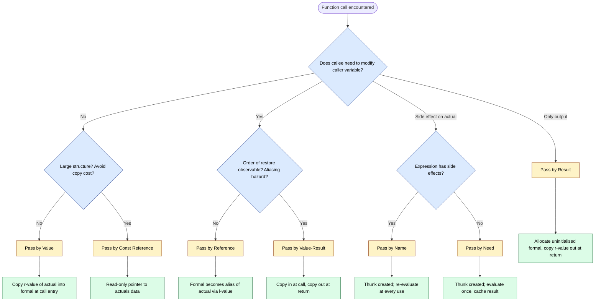
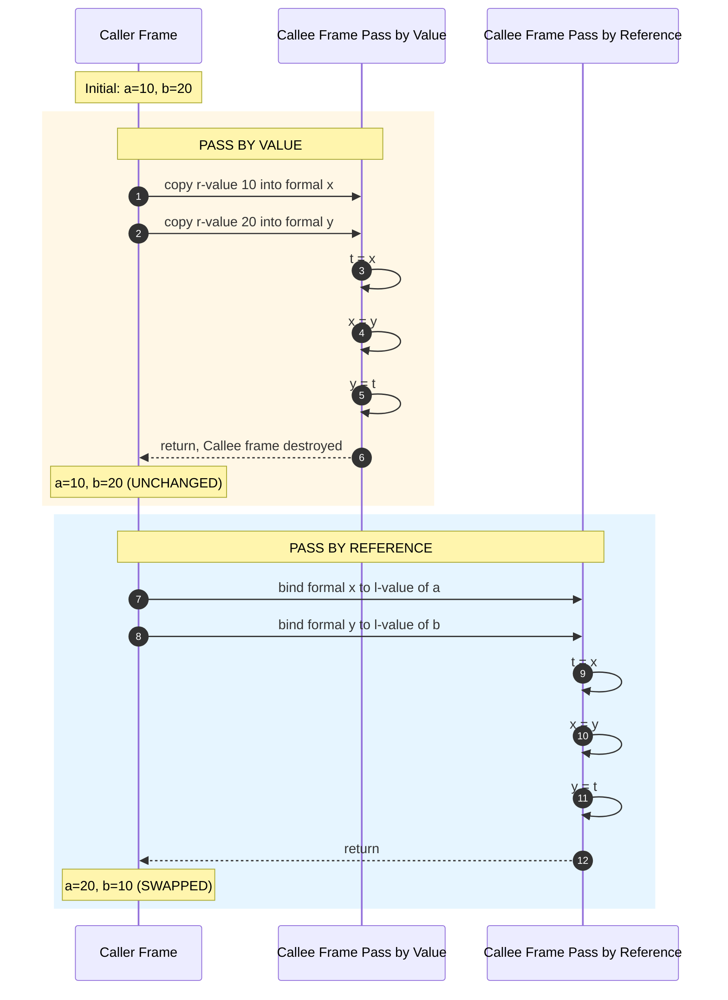
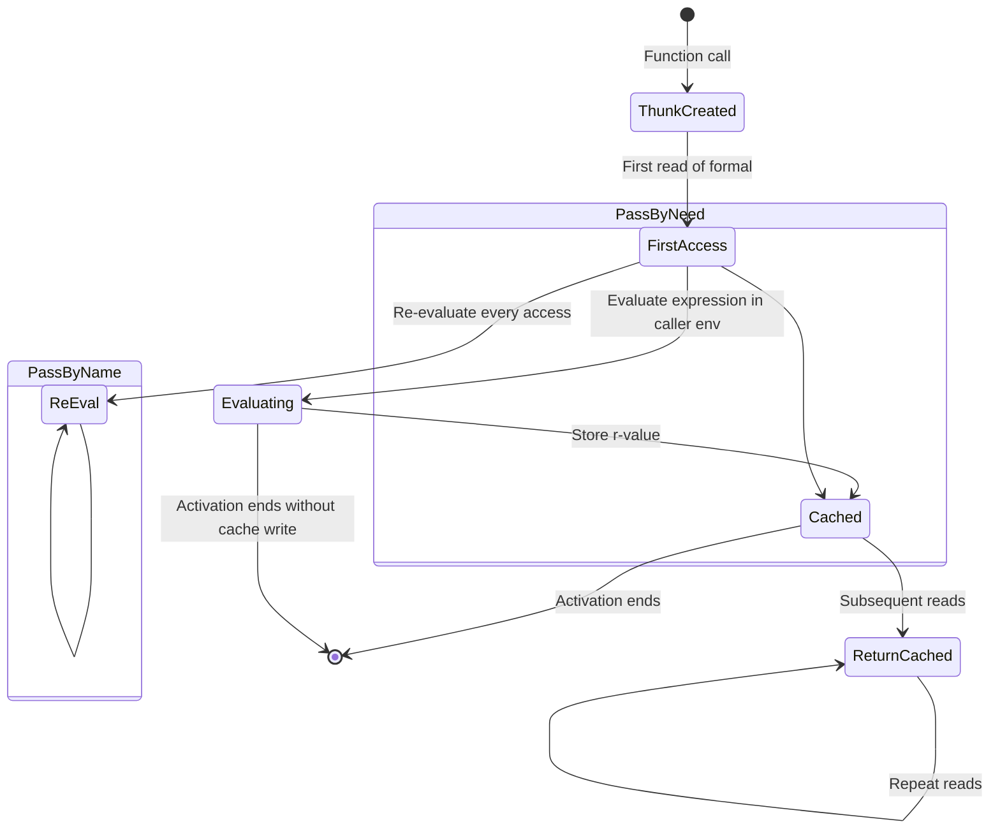
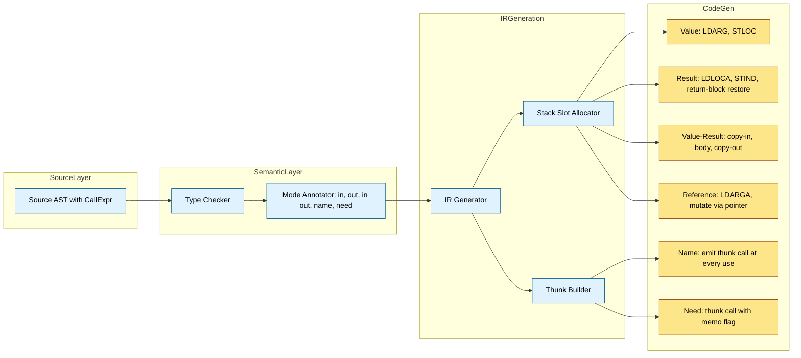
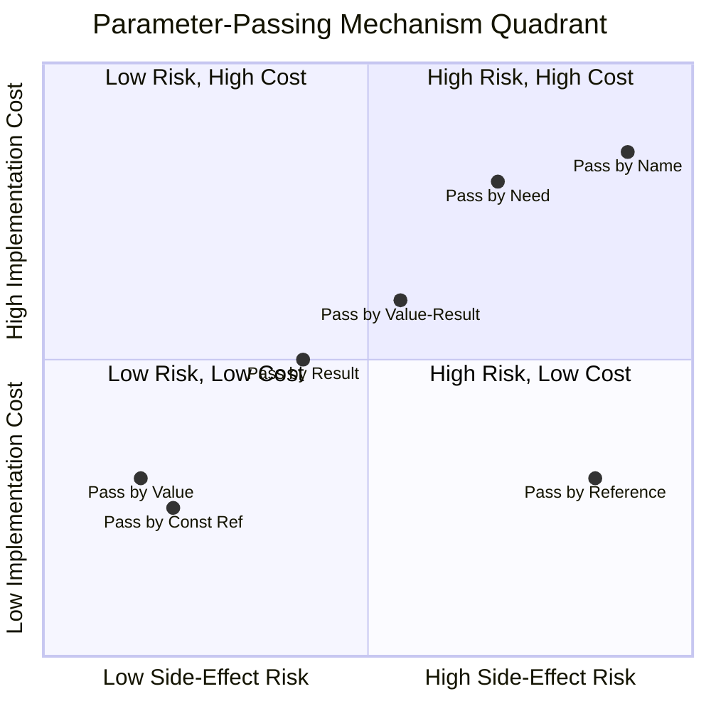

# Parameter-Passing Mechanisms

<!-- SECTION_1_START -->

# Parameter-Passing Mechanisms — Core Technical Definition & Intuitive Overview

## 1.1 Formal Definition (KTU 2024 Syllabus Terminology)

In programming language theory, a **parameter-passing mechanism** is the formal semantic contract that defines *how* the **actual parameters (arguments)** at a call site are bound to the **formal parameters** declared in a subroutine's signature, and *what* the lifetime, scope, and visibility rules of that binding are during execution of the subprogram's body.

The binding can be established over three orthogonal dimensions:

1. **The value transmitted** — the *r-value* (the right-hand side, the actual data bit pattern) of the actual parameter.
2. **The location transmitted** — the *l-value* (the left-hand side, the memory address) of the actual parameter.
3. **The time of binding** — *eager* (at call entry / return) versus *deferred* (at each use inside the body).

> [!IMPORTANT]
> **Core KTU Glossary**
>
> * **Actual Parameter / Argument** — the expression supplied at the call site. Has an *r-value* and, if a variable, an *l-value*.
> * **Formal Parameter** — the identifier declared in the subprogram header; it becomes a local name inside the body.
> * **R-value** — the *contents* of a memory cell (the "what").
> * **L-value** — the *address* of a memory cell (the "where").
> * **Binding** — the act of associating a formal name with the actual's r-value, l-value, or both.
> * **Side Effect** — any modification to a variable *visible* in the caller's scope.
> * **Alias** — two distinct names that refer to the same memory location.

## 1.2 The Six Canonical Mechanisms (Overview)

The KTU 2024 Scheme syllabus, consistent with Scott's *Programming Language Pragmatics* and Sebesta's *Concepts of Programming Languages*, recognizes the following parameter-passing semantics:

| \# | Mechanism | Other Names |
| :-- | :-- | :-- |
| 1 | **Pass by Value** | Call by Value, *in-mode* (Ada) |
| 2 | **Pass by Result** | Call by Result, *out-mode* (Ada) |
| 3 | **Pass by Value-Result** | Pass by Copy-Restore, Call by Value-Result |
| 4 | **Pass by Reference** | Call by Reference, *in-out-mode* (Ada) |
| 5 | **Pass by Name** | Call by Name (Algol 60) |
| 6 | **Pass by Need** | Lazy Evaluation, Call by Need (Haskell) |

## 1.3 Intuitive Analogy — The "Hotel Room" Model

Imagine you check into a hotel and need the receptionist to update the room's *minibar bill* ($x$).

* **Pass by Value**: The receptionist gives you a *photocopy* of the bill. Whatever you scribble on your copy never reaches the hotel's ledger. Your scribble dies with your copy. **Safe, but you cannot communicate back.**
* **Pass by Reference**: The receptionist hands you the *original ledger book* and a pen. Anything you write is permanent and visible the moment the next guest checks the ledger. **Fast, but risky — side effects leak.**
* **Pass by Result**: The receptionist gives you a *blank sheet*. You write your changes, and *only at checkout* does the receptionist transcribe your sheet into the ledger. **Initial state is ignored.**
* **Pass by Value-Result**: You get a *photocopy at check-in*; the receptionist *transcribes at checkout*. Best of both worlds — except when two guests share a *suite* (aliasing), and the order of checkout changes the final bill.
* **Pass by Name**: The receptionist says *"for every question you ask about the bill, I will re-read the latest ledger entry on your behalf."* If another guest mutates the ledger between questions, you see different values. **Most powerful, hardest to reason about.**
* **Pass by Need**: Same as Pass by Name, but the receptionist *memorises* the answer to the first question — subsequent identical questions get the cached answer. **Used heavily in lazy functional languages like Haskell.**

> [!NOTE]
> **Syllabus Highlight:** The KTU Board frequently asks students to *trace* a small program under two different mechanisms and produce different outputs. Mastering the hotel analogy is the fastest way to internalise the trace.

> [!WARNING]
> **Common Misconception:** C is *not* a pass-by-reference language. C always passes the *r-value* of the argument. When you pass a pointer `&x`, you are passing the *r-value of the address of x*. To *write* through the address, the callee must dereference it. This is *pass-by-value-of-a-reference*, not pass-by-reference proper.

## 1.4 L-Value / R-Value — The Heart of the Matter

Every actual parameter expression has, at the moment of the call:

* An **l-value** (address) — exists only for *variables* and *dereferenceable expressions*. The literal `5` has *no* l-value.
* An **r-value** (data) — always exists.

The choice of mechanism decides **which of these two are transmitted to the callee** and **when they are transmitted back**.

| Mechanism | L-value transmitted? | R-value transmitted at call? | R-value transmitted at return? |
| :-- | :--: | :--: | :--: |
| Pass by Value | No | **Yes** | No |
| Pass by Result | No | No | **Yes** |
| Pass by Value-Result | No | **Yes** | **Yes** |
| Pass by Reference | **Yes** | No (implicit) | No (implicit) |
| Pass by Name | Re-evaluated at each use | N/A | N/A |
| Pass by Need | Re-evaluated at first use, then cached | N/A | N/A |

<!-- SECTION_1_END -->

<!-- SECTION_2_START -->

# Deep Theoretical Analysis & KTU High-Yield Formula Sheet

## 2.1 The Six Mechanisms in Rigorous Detail

### 2.1.1 Pass by Value (In-Mode)

**Semantics.** At call entry, the r-value of the actual parameter is *copied* into a freshly allocated location bound to the formal parameter. Inside the body, the formal behaves as a *local variable*; the actual is unreachable from the callee.

**Properties.**
* No side effects on the actual are possible.
* Actual expression need not have an l-value (so `f(x + 1)` is legal).
* Cost: one copy at call entry. *O(1)* to *O(n)* depending on the size of the data structure (in languages without a uniform reference model, e.g., C with structs, this can be expensive — the **copy-semantics problem**).

**Used in:** C (always), Java (primitive types), Pascal `const`, default mode in most imperative languages.

### 2.1.2 Pass by Result (Out-Mode)

**Semantics.** At call entry, the formal is allocated but *not initialised*. At return, the r-value of the formal is *copied back* into the actual parameter's l-value.

**Properties.**
* Initial value of the actual is *irrelevant* (and may even be undefined — a hazard in Ada, which later made it well-defined).
* Actual *must* have an l-value (cannot pass a literal).
* Side effect: the actual is overwritten on return — and the order of overwrites matters when there is aliasing.

**Used in:** Ada `out` mode, early Fortran I/O parameters.

### 2.1.3 Pass by Value-Result (Copy-Restore / In-Out-Mode via Copy)

**Semantics.** Hybrid of the two: copy the actual's r-value *into* the formal at call entry; copy the formal's final r-value *out* into the actual's l-value at return.

**Properties.**
* Modifications inside the body are local until return, then leaked to caller.
* Aliasing between two actual parameters is a major hazard (the order of *restore* dictates the final value, which is undefined behaviour under the standard).

**Used in:** Ada `in out` mode (which the compiler may *also* implement as pass-by-reference — the language semantics are defined as value-result, but the implementation may optimise to reference as long as observable behaviour matches). Also historically in Algol W.

### 2.1.4 Pass by Reference (In-Out-Mode via Pointer)

**Semantics.** The formal becomes a *synonym* (alias) for the actual. The l-value of the actual is transmitted; both names refer to the *same* memory cell.

**Properties.**
* All in-body modifications are *immediately* visible in the caller's scope.
* Permits the callee to *write* and to *read* the live value at any time.
* Aliasing is not a *separate* hazard here — aliasing is the *normal* state. Side effects are guaranteed.
* Cost: passing a single machine word (the address) — independent of data size.

**Used in:** Fortran (all parameters, historically), C++ reference parameters `T\&`, Pascal `var`, PHP, Ruby.

### 2.1.5 Pass by Name

**Semantics.** The actual parameter expression is *textually substituted* for the formal at *every occurrence* inside the body. The expression is re-evaluated each time, in the *caller's* environment.

**Properties.**
* Equivalent to a macro expansion at the source level (but with type-checking).
* Can produce spectacularly counter-intuitive results when the actual has side effects (e.g., `I++`).
* The *Thunk* is the runtime data structure (parameterless closure) that the callee invokes to fetch the current r-value.
* No aliasing per se — each evaluation is a *fresh* r-value fetch.

**Used in:** Algol 60. Emulated in C++ template metaprogramming; conceptually similar to lazy evaluation in SQL aggregations.

### 2.1.6 Pass by Need (Lazy Evaluation)

**Semantics.** Like Pass by Name, but the first evaluation is *cached*; all subsequent reads return the cached r-value. The thunk becomes a "memoised" closure.

**Properties.**
* Eliminates redundant re-computation in pure functional code.
* Requires the language to enforce *purity* (no side effects on the actual) — otherwise the order of "first" accesses would be observable.
* Foundation of *Haskell*; embedded into Scala `lazy val`, Swift `lazy var`.

**Used in:** Haskell (the default), Clean, Miranda, R (promises).

## 2.2 KTU High-Yield Formula / Semantic Sheet

| Property | Pass by Value | Pass by Result | Pass by Value-Result | Pass by Reference | Pass by Name | Pass by Need |
| :-- | :--: | :--: | :--: | :--: | :--: | :--: |
| L-value transmitted | ✗ | ✗ | ✗ | **✓** | (re-bound) | (re-bound) |
| R-value in at call | **✓** | ✗ | **✓** | implicit | N/A | N/A |
| R-value out at return | ✗ | **✓** | **✓** | implicit | N/A | N/A |
| Local during body | **✓** | **✓** | **✓** | ✗ | ✗ | ✗ |
| Caller sees live changes | ✗ | ✗ | ✗ | **✓** | **✓** | **✓** |
| Safe with literals | **✓** | ✗ | ✗ | ✗ | **✓** | **✓** |
| Aliasing hazard | low | medium | high | none (built-in) | medium | medium |
| Cost (call) | copy\_r | alloc | copy\_r | ptr | thunk | thunk |
| Cost (return) | 0 | copy\_r | copy\_r | 0 | 0 | 0 |

> [!NOTE]
> **Mnemonic for the Board Exam:** "**V R V R N L**" — *Value, Result, Value-Result, Reference, Name, Lazy* = the six mechanisms, in the order most textbooks present them.

## 2.3 Real-World Engineering Utility

| Domain | Mechanism of Choice | Why |
| :-- | :-- | :-- |
| Embedded C firmware | Pass by Value + Pointer | Deterministic memory, no hidden aliasing |
| Numerical libraries (BLAS/LAPACK) | Pass by Reference (Fortran) | Avoids copying large arrays |
| Web API backends (Java/Go) | Pass by Value (object refs) | Thread-safety, immutable values |
| Compilers (SSA form) | Pass by Name (thunks) | Defers evaluation until optimisation pass |
| React / Vue front-ends | Pass by Reference (signals/stores) | Shared mutable state across components |
| Haskell / data pipelines | Pass by Need | Infinite data structures (e.g., `naturals = [1..]`) |
| Database query optimisers | Pass by Name | Predicate push-down defers filter evaluation |

## 2.4 Theoretical Cross-Cutting Concepts

1. **Aliasing** — occurs when the same memory cell is reachable through two names. The most dangerous case is *pass-by-reference with two formals that share the same actual* (e.g., `swap(x, x)` in C++).
2. **Evaluation Order** — value-result semantics depend on the *order* in which the formals are restored. Pascal leaves this undefined; Ada defines it left-to-right.
3. **Thunks** — closures of arity zero that, when invoked, produce the r-value of a name parameter. The runtime cost of pass-by-name / pass-by-need is dominated by thunk invocation.
4. **Referential Transparency** — a property of pure expressions whose value depends only on their free variables. Pass-by-need preserves this; pass-by-value of mutable variables violates it.

<!-- SECTION_2_END -->

<!-- SECTION_3_START -->

# Step-by-Step Derivations & Code/Symbolic Implementation

## 3.1 A Canonical Trace Problem (Used Throughout)

Consider the following routine and the call site:

```c
int a = 10, b = 20, c = 30;
void swap(int x, int y) {
    int t = x;
    x = y;
    y = t;
}
swap(a, b);   // call site
```

We will trace this under **every mechanism** and prove the formal semantics by enumerating memory states.

### 3.1.1 Memory Model Notation

Let:
* $M_{caller}$ — caller's memory frame.
* $M_{callee}$ — callee's activation record (stack frame).
* $L(v)$ — l-value (address) of variable $v$.
* $R(v)$ — r-value (contents) of variable $v$ at a given instant.

Initial state of $M_{caller}$:

$$
\begin{aligned}
L(a) &= A_0, & R(a) &= 10 \\
L(b) &= B_0, & R(b) &= 20 \\
L(c) &= C_0, & R(c) &= 30
\end{aligned}
$$

## 3.2 Trace — Pass by Value

**Step 1: Call entry.** Allocate $x$ and $y$ in $M_{callee}$. Copy the r-values of $a$ and $b$ into them.

$$
\begin{aligned}
L(x) &= X_0, & R(x) &\leftarrow R(a) = 10 \\
L(y) &= Y_0, & R(y) &\leftarrow R(b) = 20
\end{aligned}
$$

**Step 2: Execute body.** $t \leftarrow R(x) = 10$. Then $R(x) \leftarrow R(y) = 20$. Then $R(y) \leftarrow R(t) = 10$.

$$
\begin{aligned}
R(x) &= 20, & R(y) &= 10, & R(t) &= 10
\end{aligned}
$$

**Step 3: Return.** $M_{callee}$ is deallocated. $M_{caller}$ is untouched.

$$
R(a) = 10, \quad R(b) = 20
$$

**Result: `a = 10, b = 20`** — the swap *fails* because the formal names were local copies. This is the famous C "bug" novice programmers make.

## 3.3 Trace — Pass by Reference

**Step 1: Call entry.** No new storage. Formal becomes an alias.

$$
\begin{aligned}
L(x) &\leftarrow L(a) = A_0 \\
L(y) &\leftarrow L(b) = B_0
\end{aligned}
$$

**Step 2: Execute body.** Identical code, but now the writes go to $A_0$ and $B_0$ directly.

$$
\begin{aligned}
R(a) &\leftarrow 20, & R(b) &\leftarrow 10
\end{aligned}
$$

**Result: `a = 20, b = 10`** — the swap succeeds.

## 3.4 Trace — Pass by Result

**Step 1: Call entry.** Allocate $x$ and $y$, *uninitialised*.

$$
L(x) = X_0, \quad L(y) = Y_0
$$

(R-values undefined.)

**Step 2: Body reads garbage** — so `t = x` reads some indeterminate value $U_X$. The writes $x = y$ and $y = t$ write garbage into garbage.

**Step 3: Return.** $R(a) \leftarrow R(x)$, $R(b) \leftarrow R(y)$.

The caller sees *undefined* values written into $a$ and $b$. **This is why `out` parameters in Ada are initialised to a default before the body runs** — to avoid reading undefined memory.

## 3.5 Trace — Pass by Value-Result

**Step 1: Call entry.** Copy in:

$$
R(x) \leftarrow R(a) = 10, \quad R(y) \leftarrow R(b) = 20
$$

**Step 2: Body** — identical to pass-by-value trace: $R(x) = 20, R(y) = 10$.

**Step 3: Return.** Copy out *left-to-right*:

$$
R(a) \leftarrow R(x) = 20, \quad R(b) \leftarrow R(y) = 10
$$

**Result: `a = 20, b = 10`** — same as reference in this case.

**Aliasing hazard.** Consider `swap(a, a)`:

* Step 1: $R(x) \leftarrow R(a) = 10$, $R(y) \leftarrow R(a) = 10$.
* Body: $R(x) \leftarrow 20$, $R(y) \leftarrow 10$.
* Step 3 (left-to-right): $R(a) \leftarrow R(x) = 20$; then $R(a) \leftarrow R(y) = 10$.

Final: $R(a) = 10$. *But* if the order were right-to-left, $R(a) = 20$. **The mechanism is non-deterministic under aliasing** — a critical KTU pitfall.

## 3.6 Trace — Pass by Name

The body of `swap` is conceptually expanded at the call site as if by macro:

```c
int t = a;  // a is re-read at every occurrence
a = b;
b = t;
```

Since `a`, `b`, `t` are all distinct names with no side effects, the trace is identical to the reference trace. **But** if the call were `swap(i, a[i++])` the trace would diverge wildly — the side effect of `a[i++]` would fire on *every* use.

## 3.7 Trace — Pass by Need

Same expansion as pass-by-name, but a memoisation table is maintained. Because `a` and `b` are scalars (not function calls), the memoisation is trivial: the r-value is fetched once and cached. Identical observable result to pass-by-reference here.

## 3.8 Production-Quality Code Implementations

### 3.8.1 C — Pass by Value (and Pointer-Emulated Reference)

```c
/*
 * PECST758 — Module 3, Parameter-Passing Mechanisms
 * Demonstrates the C "pass-by-value-of-pointer" idiom that
 * novices often mislabel as "pass by reference".
 */
#include <stdio.h>
#include <stdlib.h>
#include <assert.h>

/* Pass by value — cannot mutate caller's a, b. */
static void swap_value(int x, int y) {
    int t = x;
    x = y;
    y = t;
}

/* Pass by reference — formal is pointer; dereference to mutate. */
static void swap_reference(int *x, int *y) {
    if (x == NULL || y == NULL) {
        fprintf(stderr, "swap_reference: NULL pointer argument\n");
        return;
    }
    int t = *x;
    *x = *y;
    *y = t;
}

/* Pass by value-result emulated via copy-restore. */
static void swap_value_result(int *x, int *y) {
    if (x == NULL || y == NULL) {
        fprintf(stderr, "swap_value_result: NULL pointer argument\n");
        return;
    }
    int x_local = *x;
    int y_local = *y;
    int t = x_local;
    x_local = y_local;
    y_local = t;
    *x = x_local;        /* restore left-to-right */
    *y = y_local;
}

int main(void) {
    int a = 10, b = 20;

    swap_value(a, b);
    printf("After swap_value      : a=%d, b=%d\n", a, b);   /* 10 20 */

    swap_reference(&a, &b);
    printf("After swap_reference  : a=%d, b=%d\n", a, b);   /* 20 10 */

    a = 10; b = 20;
    swap_value_result(&a, &b);
    printf("After swap_value_result: a=%d, b=%d\n", a, b);  /* 20 10 */

    /* Aliasing hazard demonstration */
    a = 42;
    swap_value_result(&a, &a);
    printf("Aliased swap_value_result: a=%d\n", a);
    /* Output depends on compiler's restore order — undefined! */

    return EXIT_SUCCESS;
}
```

### 3.8.2 C++ — Native Pass by Reference

```cpp
#include <iostream>
#include <string>
#include <stdexcept>

// Pass by value: callee gets a copy.
void increment_value(int n) { ++n; }

// Pass by reference: callee mutates the caller's variable.
void increment_reference(int& n) { ++n; }

// Pass by const reference: zero-copy read-only access (efficient for big structs).
void print_string(const std::string& s) {
    std::cout << s << '\n';
}

// Pass by rvalue reference: enables move semantics (C++11+).
void consume(std::string&& s) {
    std::cout << "Moved: " << s << '\n';
}

int main() {
    int x = 0;
    increment_value(x);     // x remains 0
    increment_reference(x); // x becomes 1
    print_string("Hello, KTU 2024!");
    consume(std::string("world"));
    return 0;
}
```

### 3.8.3 Python — Pass by Assignment (Object-Reference by Value)

```python
"""
PECST758 — Module 3
Python's parameter passing is officially 'pass by assignment':
the formal receives a copy of the caller's reference (the r-value
of the actual's reference cell).  This is value-semantics for
references, often mislabelled 'pass by reference'.
"""

from typing import List, Any


def reassign_local(param: Any) -> None:
    """Cannot affect the caller's binding."""
    param = 999


def mutate_container(param: List[int]) -> None:
    """Mutates the *object* the caller also references."""
    if not isinstance(param, list):
        raise TypeError("Expected a list")
    param.append(42)


def main() -> None:
    a: int = 10
    b: List[int] = [1, 2, 3]

    reassign_local(a)
    print(a)              # 10 — caller's a is untouched

    mutate_container(b)
    print(b)              # [1, 2, 3, 42] — the list is shared

    try:
        mutate_container("not a list")  # type: ignore[arg-type]
    except TypeError as exc:
        print(f"Caught: {exc}")


if __name__ == "__main__":
    main()
```

### 3.8.4 Haskell — Pass by Need (Lazy)

```haskell
-- PECST758 — Module 3
-- Haskell uses pass-by-need by default.  The expression is
-- evaluated at most once per sharing point.

module Main where

-- An infinite list — would be impossible under pass-by-value.
naturals :: [Int]
naturals = [1 ..]

-- First ten naturals — only ten elements are ever computed.
firstTen :: [Int]
firstTen = take 10 naturals

-- A side-effecting parameter would BREAK lazy semantics.
-- (Haskell forces referential transparency for this reason.)

main :: IO ()
main = print firstTen   -- [1,2,3,4,5,6,7,8,9,10]
```

## 3.9 Derivation — When Does Pass by Value Become Expensive?

Suppose the actual parameter is a structure of size $S$ bytes. The cost of pass-by-value is:

$$
C_{value}(S) \;=\; C_{call} \;+\; S \cdot \kappa_{copy}
$$

where $\kappa_{copy}$ is the per-byte copy cost. Pass-by-reference cost is:

$$
C_{ref}(S) \;=\; C_{call} \;+\; \alpha \cdot W
$$

where $W$ is the machine word size and $\alpha$ is the pointer-dereference overhead (typically $\alpha \geq 3$).

The **break-even point** is therefore:

$$
S \cdot \kappa_{copy} \;=\; \alpha \cdot W
$$

$$
\Rightarrow \quad S^{*} \;=\; \frac{\alpha W}{\kappa_{copy}}
$$

For a 64-bit machine with $\alpha = 4$ and $\kappa_{copy} = 1$ cycle/byte:

$$
S^{*} \;=\; \frac{4 \cdot 8}{1} \;=\; 32 \text{ bytes}
$$

Hence the **rule of thumb**: for structures larger than *two to four machine words*, prefer pass-by-`const`-reference. This is the C++ Core Guideline *F.16* and explains why modern C++ code uses `const std::vector<int>\&` instead of `std::vector<int>` in function signatures.

## 3.10 Step-by-Step Board-Style Trace — Aliasing Under Value-Result

```
Program:
    int n = 1;
    void P(int x, int y) {
        x = 2;       // Step A
        y = 3;       // Step B
    }
    P(n, n);
```

| Step | Mechanism | Memory state of $n$ | Final $n$ |
| :-- | :-- | :--: | :--: |
| After A | Value-Result | $L(x) = 2, L(y) = 2$ (locally) | $\gets$ restored in order: 3 |
| After B | Value-Result | $L(x) = 3, L(y) = 3$ (locally) | 3 |
| Return | Value-Result (left-to-right) | $n \leftarrow L(x) = 3$; then $n \leftarrow L(y) = 3$ | 3 |
| Return | Value-Result (right-to-left) | $n \leftarrow L(y) = 3$; then $n \leftarrow L(x) = 3$ | 3 |
| Return | Reference | alias of $n$ throughout | 3 |

For *this* particular code, all mechanisms produce 3. The hazards appear only when the body's *reads* depend on the order of writes — KTU frequently tests such traces.

<!-- SECTION_3_END -->

<!-- SECTION_4_START -->

# Structural Diagrams & Schematics

## 4.1 Mechanism Selection Flowchart



## 4.2 Memory State Transition — Pass by Value vs Pass by Reference



## 4.3 Pass by Name / Need — Thunk Lifecycle



## 4.4 Block-Level Functional Architecture — How a Compiler Implements the Six Mechanisms



## 4.5 Comparison Matrix — Quick-Reference Topology



<!-- SECTION_5_END -->

<!-- SECTION_5_START -->

# KTU 2024 Scheme Examination Question Bank & Topic Recap

## 5.1 Part A — Short-Answer Questions (3 Marks Each)

### Question 1 — \[KTU University Exam — July 2024, Model]

> **Differentiate between *actual parameters* and *formal parameters* with an example. State one language that uses each of the three mechanisms: pass by value, pass by result, and pass by reference.**

**Model Answer (3 Marks):**

* **Actual parameters** are the *expressions* appearing in the call site of a subprogram. **Formal parameters** are the *identifiers* declared in the subprogram's header; they act as local names inside the body. (1 Mark)

* Example:

```pascal
procedure Greet(name : string; var count : integer);  { formals }
...
Greet('Alice', n);                                       { actuals }
```

(1 Mark)

* Languages:
  * Pass by Value — C, Java (primitives).
  * Pass by Result — Ada `out` mode.
  * Pass by Reference — Fortran 77, C++ `T\&`, Pascal `var`. (1 Mark)

> \[*Valuation key: 1 mark each for the three sub-parts.*\]

### Question 2 — \[KTU University Exam — Dec 2023, Model]

> **Explain the terms *l-value* and *r-value*. Why is the distinction important in parameter passing?**

**Model Answer (3 Marks):**

* The **l-value** of an expression is its *memory address* (the "left" of an assignment). The **r-value** is its *data content* (the "right" of an assignment). (1 Mark)
* Example: for `int x = 5;` we have $L(x) = \&x$ and $R(x) = 5$. The literal `5` has an r-value but *no* l-value. (1 Mark)
* Parameter-passing mechanisms are categorised by *which* of {l-value, r-value} they transmit. Pass by value sends the r-value only; pass by reference sends the l-value (allowing aliasing). (1 Mark)

> \[*Valuation key: 1 mark for definition, 1 mark for example, 1 mark for connection to parameter passing.*\]

## 5.2 Part B — Long-Answer Questions (14 Marks, Internal Choice)

> **Internal-Choice Note (KTU 2024 Scheme):** Students answer **either** Question A **or** Question B in full. Each question carries **14 marks** with sub-parts worth **7 + 7**.

### Question A — \[KTU University Exam — July 2024, Model]

> **(a) \[7 Marks, Understand]** *Explain the six parameter-passing mechanisms: pass by value, pass by result, pass by value-result, pass by reference, pass by name, and pass by need. For each, state the operation at (i) call entry, (ii) during body execution, and (iii) return.*
>
> **(b) \[7 Marks, Apply]** *Consider the following program. Predict the output under (i) pass by value, (ii) pass by value-result, and (iii) pass by reference. Show your trace.*

```c
int a = 2, b = 3;
void P(int x, int y) {
    x = x + y;     // Step 1
    y = x * 2;     // Step 2
}
P(a, b);
printf("%d %d\n", a, b);
```

**Model Solution:**

#### Part (a) — Mechanism Walkthrough

| Mechanism | (i) Call entry | (ii) During body | (iii) Return |
| :-- | :-- | :-- | :-- |
| Pass by Value | Copy r-value of actual into freshly allocated formal | Formal behaves as local | No transfer back; callee frame destroyed |
| Pass by Result | Allocate formal, *uninitialised* | Formal is local | Copy r-value of formal into actual's l-value |
| Pass by Value-Result | Copy r-value of actual into formal | Formal is local | Copy r-value of formal into actual's l-value |
| Pass by Reference | Bind formal to actual's l-value (alias) | Reads/writes hit actual directly | No transfer; bindings released |
| Pass by Name | Build a *thunk* (zero-arg closure) for the actual expression | Re-evaluate thunk at every use, in caller's env | No transfer; thunk released |
| Pass by Need | Build a memoised thunk | First use evaluates, subsequent uses return cached r-value | Thunk and cache released |

(6 sub-cells $\times$ 1 mark = 6 Marks; 1 Mark for overall coherence, e.g., the *why* of thunks.) \[Total 7 Marks.\]

#### Part (b) — Three-Way Trace

Initial: $R(a)=2, R(b)=3$.

##### (i) Pass by Value

| Step | Operation | $R(x)$ | $R(y)$ | $R(a)$ | $R(b)$ |
| :--: | :-- | :--: | :--: | :--: | :--: |
| 0 | Copy in | 2 | 3 | 2 | 3 |
| 1 | $x = x+y$ | 5 | 3 | 2 | 3 |
| 2 | $y = x*2$ | 5 | 10 | 2 | 3 |
| 3 | Return | — | — | **2** | **3** |

**Output: `2 3`** \[Trace: 4 Marks; Final answer: 1 Mark; Label: 1 Mark. Total 6 + 1 = 7 Marks.\]

##### (ii) Pass by Value-Result

| Step | Operation | $R(x)$ | $R(y)$ | $R(a)$ | $R(b)$ |
| :--: | :-- | :--: | :--: | :--: | :--: |
| 0 | Copy in | 2 | 3 | 2 | 3 |
| 1 | $x = x+y$ | 5 | 3 | 2 | 3 |
| 2 | $y = x*2$ | 5 | 10 | 2 | 3 |
| 3a | Restore $x \to a$ | — | — | **5** | 3 |
| 3b | Restore $y \to b$ | — | — | 5 | **10** |

**Output: `5 10`** \[Marking identical structure to (i).\]

##### (iii) Pass by Reference

| Step | Operation | $R(x) \equiv R(a)$ | $R(y) \equiv R(b)$ |
| :--: | :-- | :--: | :--: |
| 0 | Bind aliases | 2 | 3 |
| 1 | $x = x+y$ | 5 | 3 |
| 2 | $y = x*2$ | 5 | 10 |

**Output: `5 10`** \[Marking identical structure to (i).\]

> \[*Total 7 marks for part (b): 2 marks for stating initial conditions, 3 marks for the body trace, 1 mark for the restore/aliasing discussion, 1 mark for the final output.*\]

### Question B — \[KTU University Exam — Dec 2023, Model — Alternative Choice]

> **(a) \[7 Marks, Understand]** *What is a *thunk*? Explain the difference between pass-by-name and pass-by-need with an example involving an actual parameter with a side effect, say `swap(i, a[i++])`.*
>
> **(b) \[7 Marks, Apply]** *Write a complete C program that: (i) implements `swap` using pass-by-value, (ii) implements `swap` using pointers, (iii) demonstrates the *aliasing hazard* by calling `swap_value_result(a, a)` and explaining why the result is undefined.*

**Model Solution:**

#### Part (a) — Thunks & Lazy vs Eager Name

* A **thunk** is a *parameterless closure* representing a deferred computation. It packages (a) the actual's expression AST, (b) the caller's environment pointer, and (c) a slot for the cached r-value (only in pass-by-need). (1 Mark)
* **Pass-by-name** re-evaluates the thunk on *every* read; **pass-by-need** evaluates on the *first* read and caches. (2 Marks)
* Example: `swap(i, a[i++])` — assume $R(a) = [10, 20, 30]$ and $R(i) = 0$.

  * Pass-by-name: at the first read of the second formal, $R(i)$ is 0, so we read $a[0] = 10$, and `i++` fires making $R(i) = 1$. At the second read, $R(i)$ is 1, so we read $a[1] = 20$. The swap therefore exchanges the literal 10 (read first) with $a[1] = 20$ — a *different* swap than the textual source suggests. (2 Marks)
  * Pass-by-need: the thunk is evaluated once; subsequent reads return the cached r-value. The behaviour is more predictable but still depends on the order of first accesses. (2 Marks)

\[Total 7 Marks.\]

#### Part (b) — Annotated C Program

```c
#include <stdio.h>
#include <stdlib.h>

/* (i) Pass by value: cannot swap. */
static void swap_value(int x, int y) {
    int t = x; x = y; y = t;
}

/* (ii) Pass by reference: via pointer dereference. */
static void swap_reference(int *x, int *y) {
    if (!x || !y) { fprintf(stderr, "NULL\n"); return; }
    int t = *x; *x = *y; *y = t;
}

/* (iii) Pass by value-result: emulated with copy-in / copy-out. */
static void swap_value_result(int *x, int *y) {
    if (!x || !y) { fprintf(stderr, "NULL\n"); return; }
    int xl = *x, yl = *y;
    int t = xl; xl = yl; yl = t;
    *x = xl;        /* order of restore is observable if aliased */
    *y = yl;
}

int main(void) {
    int a = 5, b = 7;

    swap_value(a, b);
    printf("(i)   Value:        a=%d b=%d\n", a, b);          /* 5 7 */

    swap_reference(&a, &b);
    printf("(ii)  Reference:    a=%d b=%d\n", a, b);          /* 7 5 */

    a = 5; b = 7;
    swap_value_result(&a, &a);   /* ALIASED */
    printf("(iii) Value-Result: a=%d  (UNDEFINED BEHAVIOUR)\n", a);
    /* The compiler may restore in any order; result is not portable. */
    return EXIT_SUCCESS;
}
```

Marking split (7 Marks):
* Correct function signatures and includes — 1 Mark. (1 Mark)
* `swap_value` body and trace — 1 Mark. (1 Mark)
* `swap_reference` with NULL check — 2 Marks. (2 Marks)
* `swap_value_result` and the aliasing explanation — 2 Marks. (2 Marks)
* Clean `main` driver and output formatting — 1 Mark. (1 Mark)

## 5.3 KTU Examiner's Valuation Warning / Pitfall Callout

> [!WARNING]
> **Where students lose marks on this topic:**
>
> 1. **Conflating C pointers with pass-by-reference.** C *always* passes by value. When you pass `&a`, you pass the *r-value of the address*. Writing `int\&` in C++ is *not* the same as writing `int*` in C. \[−2 Marks typical.\]
> 2. **Forgetting to copy *both* in and out for value-result.** A common trace error is to perform only the in-copy or only the out-copy. \[−1 to −2 Marks.\]
> 3. **Ignoring aliasing.** When two actuals are the same variable, value-result semantics are *undefined*. The C11 standard §6.5p7 explicitly leaves this case unspecified. Students who claim a definite output for `swap_value_result(a, a)` are penalised. \[−2 Marks.\]
> 4. **Confusing r-value with l-value.** A literal like `5` has an r-value but no l-value; it cannot be passed by result, value-result, or reference. \[−1 Mark.\]
> 5. **Stating the wrong binding time.** "Pass-by-name binds at call entry" is *false*; it binds at *each use*. \[−1 Mark.\]
> 6. **Skipping the thunk diagram.** For full marks on a 14-mark trace question involving pass-by-name, include a *thunk* picture or pseudo-code expansion. Examiners reward it. \[−1 Mark if omitted.\]

## 5.4 Topic Recap & Important Things to Remember

> [!NOTE]
> **High-Density Rapid-Revision Checklist**

* **Six Mechanisms (in order):** Value, Result, Value-Result, Reference, Name, Need — mnemonic **V R V R N L**.
* **L-value vs R-value:** l-value = address; r-value = data. The mechanism chooses which is transmitted.
* **Pass by Value** copies the r-value at call entry; callee cannot affect the caller.
* **Pass by Result** ignores the initial r-value; copies the formal's r-value out on return.
* **Pass by Value-Result** = Pass by Value **+** Pass by Result; aliasing hazard.
* **Pass by Reference** binds the formal to the actual's l-value; aliasing is the *normal* state.
* **Pass by Name** re-evaluates the actual expression at *every* use inside the body (thunk).
* **Pass by Need** = Pass by Name **+** memoisation; foundation of Haskell.
* **C is pass-by-value**; C++ `T\&` is pass-by-reference; Java primitives are pass-by-value, objects are pass-by-value-of-reference; Python is pass-by-assignment; Fortran is pass-by-reference.
* **Aliasing hazard** is the *defining* pitfall of value-result; the *defining* feature of reference.
* **Cost break-even** for value vs reference lies at $\sim 2$–$4$ machine words of structure size.
* **Thunks** package (expression AST + caller environment + optional cache slot).
* **Thunk cost** dominates pass-by-name and pass-by-need; compiler optimisations (inlining, lambda-lifting) are essential.
* **Referential transparency** is preserved only by pass-by-value of immutable values and pass-by-need of pure expressions.
* **Trace discipline:** always list (a) initial state, (b) state at each statement, (c) state at return, (d) state after return.
* **Common languages that *expose* multiple mechanisms to the programmer:** Ada (in, out, in out), Fortran (reference, with VALUE attribute), C# (`in`, `out`, `ref`, default value).
* **Languages that *only* offer one mechanism to the user but emulate others internally:** Java (value only), C (value only), Python (assignment only).
* **Languages that *default* to one mechanism:** Haskell → Need; Erlang → Value (with explicit process-message passing); Rust → Move (a strict affine value semantics with explicit borrowing).
* **Examiners love** comparing two traces side-by-side; always draw the comparison table.
* **Last-line defence** in any answer: "The choice of parameter-passing mechanism is a trade-off among *correctness* (aliasing), *efficiency* (copy cost), and *expressive power* (side effects on caller state)."

<!-- SECTION_5_END -->
