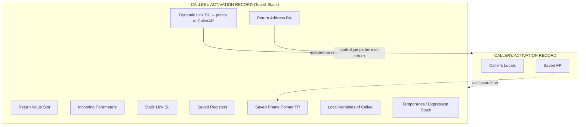
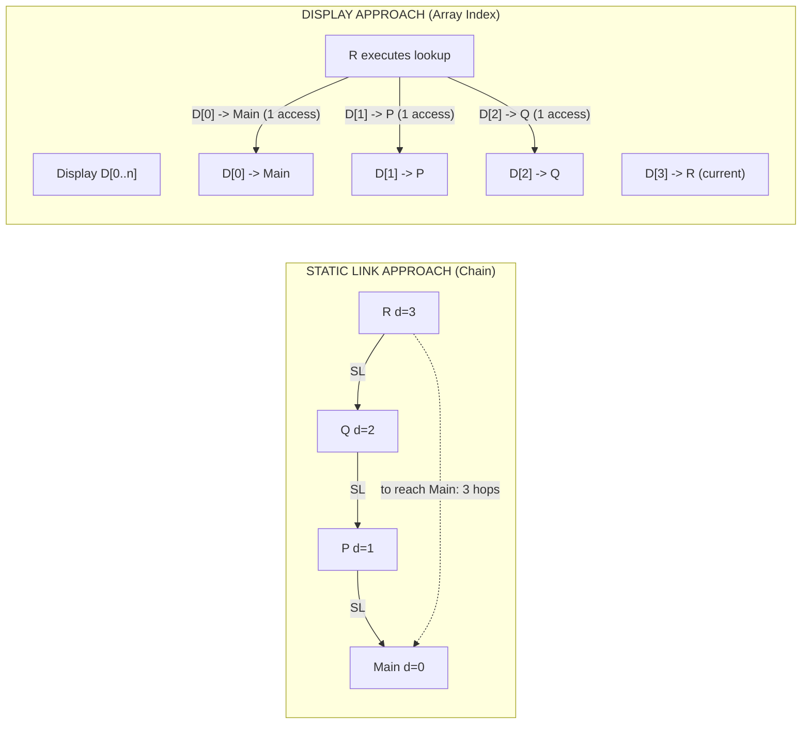
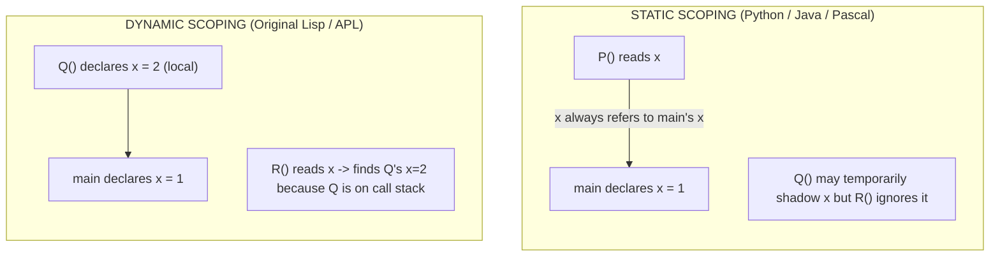
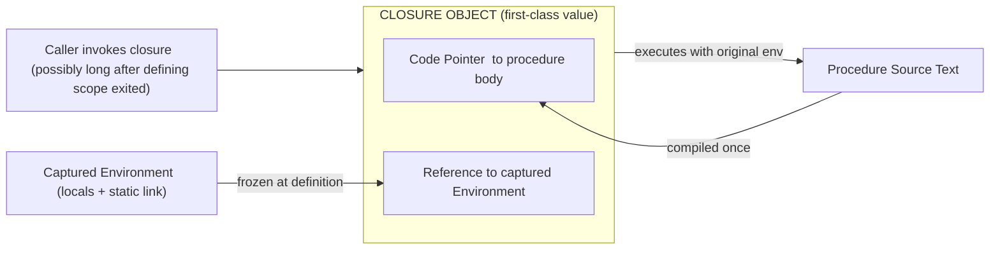

# Procedure Environments

<!-- SECTION_1_START -->
# 1. Core Technical Definition & Intuitive Overview

## Formal Definition

A **Procedure Environment** is the complete set of *name-to-object bindings* (variable declarations, parameter values, and the referencing context) that are in effect at the moment a procedure is invoked. It determines what names a procedure body can legally reference and where those names are physically stored during execution.

> [!IMPORTANT]
> **KTU 2024 Syllabus Mapping (PECST758 - Module 3):**
> The procedure environment encompasses five orthogonal sub-concepts:
> 1. **Activation Records (Stack Frames)** – the physical storage block created for every procedure call.
> 2. **Binding Rules** – *static* (lexical) vs *dynamic* scoping of free identifiers.
> 3. **Parameter Passing Semantics** – call-by-value, call-by-reference, call-by-name, call-by-need, call-by-sharing.
> 4. **Closures** – a first-class procedure bundled with its referencing environment.
> 5. **Access Links** – *static links* (chains) vs *displays* (arrays) for resolving non-local references.

## Conceptual Analogy — The "Office Workspace" Model

Imagine a company where every employee (procedure) is given a **private cubicle** every time they are called into a meeting:

| Workspace Item | Programming Equivalent | Lifetime |
|---|---|---|
| The cubicle itself | **Activation Record** | One phone call |
| The person's nameplate | **Procedure Name / Local ID** | Permanent |
| The documents on the desk | **Local Variables & Parameters** | One phone call |
| The phone number of the boss who called | **Return Address** | One phone call |
| The badge pointing to the manager's cubicle | **Dynamic Link** | One phone call |
| The badge pointing to the team's permanent home room | **Static Link** | One project |
| A receptionist's directory listing all senior rooms | **Display Table** | One project |

When a procedure returns, its cubicle is dismantled and the documents are shredded. When it is called again, a fresh cubicle is built. The static (lexical) link, however, is fixed by the **source-code layout**, not by the call order — i.e. the team-room number is decided at the architectural (compile-time) stage.

## Real-World Engineering Significance

> [!NOTE]
> Every modern runtime — CPython's `PyFrameObject`, the JVM's *stack frame* in the bytecode interpreter, the V8 engine's *StackFrame*, and even hardware interrupt contexts in embedded RTOSs — is a concrete implementation of a procedure environment. The choice of scoping rule and parameter-passing strategy directly governs **security** (can a callback mutate my private data?), **performance** (display lookup is $O(1)$, static-link chain is $O(d)$), and **expressiveness** (closures enable functional patterns like `map`/`filter`/`reduce`).

## Geometric Intuition

If the call stack is the **y-axis** and the lexical nesting depth is the **x-axis**, then a procedure invocation is a *cell* in this 2D grid. A free-name reference is a *horizontal arrow* (looking up the lexical chain) and a procedure return is a *vertical arrow* (popping the stack).

> [!VISUALIZATION CONTROL]
> **Concept:** 2-D Call-Stack × Lexical-Depth Grid
> **Desmos / GeoGebra Input:**
> * Plot points $\big(C_d, \; S_h\big)$ where $C_d$ = current lexical depth, $S_h$ = stack height
> * `y = depth_of_current_call`
> * `x = lexical_level_of_referenced_variable`
> **Visual Description:** Each invocation creates a *node*; a *dotted horizontal line* traces a static-link walk, a *solid vertical line* traces a dynamic-link walk. The picture instantly contrasts *where you came from* (dynamic) with *where you were written* (static).

---

<!-- SECTION_2_START -->
# 2. Deep Theoretical Analysis & KTU High-Yield Formula Sheet

## 2.1 Anatomy of an Activation Record

When control transfers to a procedure, the runtime system allocates a contiguous block of memory — the **activation record (AR)**. Although the *order* of fields varies by compiler, the *logical* components are universal.

| # | Field | Purpose | Created By | Consumed By |
|---|---|---|---|---|
| 1 | **Incoming Parameters** | Actual values supplied by the caller | Caller | Callee |
| 2 | **Return Value Slot** | Space for the function's result | Caller | Caller (after return) |
| 3 | **Static Link (SL)** | Pointer to AR of the *enclosing static* procedure | Callee setup | Resolving non-local refs |
| 4 | **Dynamic Link (DL)** | Pointer to AR of the *caller* | Callee setup | Restoring stack on return |
| 5 | **Saved Frame Pointer (FP)** | Caller's frame pointer | Callee setup | Stack restoration |
| 6 | **Return Address (RA)** | Instruction counter to resume in caller | Call instruction | Return instruction |
| 7 | **Saved Registers** | Caller-saved register values | Callee prologue | Callee epilogue |
| 8 | **Local Data** | Local variables of the procedure | Compiler | Callee body |
| 9 | **Temporaries** | Scratch storage for expressions | Compiler | Callee body |

> [!NOTE]
> **Frame Pointer Convention:** Most compilers reserve two CPU registers — `$sp` (stack pointer, points to the *top* of the stack and changes with every push/pop) and `$fp` (frame pointer, points to a *fixed* location inside the current AR). The `$fp` is set in the prologue and used for all local-variable addressing, making the code position-independent of how many pushes/pops happen later.

## 2.2 The Five Parameter-Passing Mechanisms — A Comparative Table

> [!IMPORTANT]
> KTU frequently asks the **effect of each mechanism** on a simple swap. Memorise the table below; it is the single most-tested area in this module.

| Mechanism | What is bound? | Caller's variable affected? | Aliasing possible? | Thunks evaluated? | Used by |
|---|---|---|---|---|---|
| **Call-by-Value (CBV)** | A *copy* of the value | No (re-binding is local) | No | N/A | C, Java (primitives), Pascal default |
| **Call-by-Reference (CBR)** | An *address* (l-value) | Yes | Yes | N/A | Pascal `var`, Fortran, C++ `&` |
| **Call-by-Value-Result (CBVR)** | A copy; result written back | Yes (on return only) | No *during* call | N/A | Fortran `OUT`, Ada `IN OUT` (old) |
| **Call-by-Name (CBN)** | A *thunk* (re-evaluated each use) | Yes (each access) | Yes | Yes, every reference | Algol 60, Jensen's Device |
| **Call-by-Need (Lazy / CBN-Cached)** | A thunk, evaluated *once* | Yes (only on first access) | Yes | At most once | Haskell, R `lazy`, Scala `lazy val` |
| **Call-by-Text / Macro** | Source-text substitution | Yes (syntactic) | Yes (lexical) | At substitution site | C preprocessor, Lisp macros |
| **Call-by-Sharing (Object)** | A *reference* to a mutable object | Mutates shared object | Yes (object itself) | N/A | Java, Python, Ruby, JS |

### Canonical Swap Example
Given `procedure swap(x, y)` and initial `a = 3, b = 5`:

$$
\begin{aligned}
\text{CBV}    &: \quad a=3,\; b=5 \;\; \text{(unchanged — copies are swapped internally)} \\
\text{CBR}    &: \quad a=5,\; b=3 \;\; \text{(addresses swapped — caller sees change)} \\
\text{CBN}    &: \quad a=3,\; b=5 \;\; \text{(renaming — same effect as CBV here)}
\end{aligned}
$$

## 2.3 Scoping — Static vs Dynamic

| Property | Static (Lexical) Scoping | Dynamic Scoping |
|---|---|---|
| **Decision time** | Compile time | Run time |
| **Basis for lookup** | Source-text nesting of *declarations* | Order of *activation* on the call stack |
| **Implementer** | Static link chain / Display table | Search the dynamic chain upwards |
| **Predictability** | High — *name* binds to a unique entity | Low — *name* may bind to different entities in different calls |
| **Typical languages** | Pascal, C, Java, Python, Haskell, ML, Rust | Original Lisp, APL, Snobol, emacs-lisp (default), Perl `local` |
| **Common pitfall** | Free variable captured at *definition* time | Free variable captured at *call* time → spooky action at a distance |

### Deep Binding vs Shallow Binding
These terms matter when a procedure is *returned* or *passed as a parameter*:

* **Deep Binding** — the environment is captured at the procedure's *creation* time. This is what closures do.
* **Shallow Binding** — the environment is captured at the procedure's *most recent activation*. Used by some early Lisps.
* **Ad-hoc Binding** — the environment is captured at the procedure's *call* time. Used by default in dynamically scoped languages.

## 2.4 The KTU Formula Sheet (Cheat Sheet)

> [!NOTE]
> Use $\vert \cdot \vert$ for cardinality, $\text{depth}(P)$ for lexical nesting level, and $d$ for the dynamic depth of the current call.

| Concept | Formula / Rule | Units / Cost |
|---|---|---|
| Static depth of a global | $\text{depth}(\text{global}) = 1$ | levels |
| Static depth of nested proc | $\text{depth}(P) = \text{depth}(\text{parent}) + 1$ | levels |
| Static-link walk cost | $T_{SL} = \text{depth}(\text{target}) - \text{depth}(\text{current})$ | pointer hops |
| Display-lookup cost | $T_{D} = O(1)$ — direct array index | one memory access |
| Display update on call | $O(1)$ — swap the entry for the called depth | constant |
| Display restore on return | $O(1)$ — restore saved entry | constant |
| AR memory size | $S_{AR} = \sum_{i} \vert \text{locals}_i \vert + \vert \text{params}_i \vert + \text{overhead}$ | bytes |
| Max stack height | $H = D_{max} \times \bar{S}_{AR}$ | bytes (worst case) |
| Thunk evaluation (CBN) | cost = cost of parameter expression per textual occurrence | evaluations |
| Closure size | $S_{cl} = S_{code} + S_{env}$ | bytes |

## 2.5 Real-World Engineering Utility

* **Compilers & JITs** (LLVM, HotSpot, V8) maintain *frame maps* — metadata that tells the GC where references lie inside an AR so that the collector knows what to scan. This is a direct industrial use of the AR model.
* **Debuggers** (gdb, pdb, IntelliJ) reconstruct a back-trace by walking the dynamic-link chain, *and* they let you inspect variables via the static-link chain.
* **Garbage-collected runtimes** (OCaml, Haskell, Scheme) must keep an AR alive as long as its closure is reachable — leading to the classic *space leak* problem.
* **Embedded / RTOS contexts** (FreeRTOS `xTaskCreate`, ARM Cortex-M `PSP`) model each task's state as an AR-like stack frame, with the saved link register playing the role of the return address.
* **Web callbacks** (Node.js `setTimeout`, browser event loops) rely on **closures** to capture the lexical environment of the surrounding scope.

---

<!-- SECTION_3_START -->
# 3. Step-by-Step Derivations, Code & Symbolic Implementation

## 3.1 Worked Example — Stack Evolution of a Recursive `factorial`

Consider this Pascal-style procedure:

```pascal
procedure fact(n: integer; var result: integer);
  procedure inner(k: integer);
  begin
    if k = 0 then result := 1
    else inner(k - 1);
  end;
begin
  inner(n);
end;
```

Assume the initial call is `fact(3, r)` from a hypothetical `main`. We trace the call stack **bottom-to-top** as the recursion unfolds.

### Step 0 — Initial State
Main's AR is at the bottom of the stack. It contains `r` (uninitialised) and the return address for the call to `fact`.

### Step 1 — Call `fact(3, r)`
A new AR for `fact` is pushed:

| AR `fact` (depth 1) | Value |
|---|---|
| Parameter `n` | $3$ |
| `result` reference | address of `r` in main |
| SL (static link) | $\to$ main's AR |
| DL (dynamic link) | $\to$ main's AR |
| RA (return address) | $\to$ next instruction in main |
| Saved FP | $\to$ main's frame pointer |

### Step 2 — Call `inner(3)`
A new AR for `inner` is pushed:

| AR `inner` (depth 2) | Value |
|---|---|
| Parameter `k` | $3$ |
| SL | $\to$ `fact`'s AR |
| DL | $\to$ `fact`'s AR |
| RA | $\to$ inside `fact` body |
| Saved FP | $\to$ `fact`'s FP |

### Step 3 — `k ≠ 0` so recurse: `inner(2)`
The chain grows:
$$
\text{main} \to \text{fact} \to \text{inner}(3) \to \text{inner}(2) \to \text{inner}(1) \to \text{inner}(0)
$$

### Step 4 — Base case: `k = 0`
`inner(0)` stores $1$ into `result` (which is the address of `r` in main, walked via two static-link hops: `inner(0) → fact → main`).

### Step 5 — Unwind
Each `inner` returns; the AR is popped; control jumps to the saved RA. Finally, `fact` returns; main reads `r = 6$.

> [!IMPORTANT]
> **Key observation:** Each invocation gets its **own independent copy** of `k` and its **own saved FP / RA**. The static link, however, is *fixed by the source code* — `inner` is *always* nested inside `fact`, so its SL always points to the *currently executing* `fact` frame. This is precisely why recursion works in lexically-scoped languages without name collisions.

## 3.2 Static Link Resolution — Full Numeric Walk

Use the canonical Pascal nesting:

```pascal
program Main;          { depth 0 }
  var a: integer;
  procedure P;         { depth 1 }
    var b: integer;
    procedure Q;       { depth 2 }
      var c: integer;
      procedure R;     { depth 3 }
        begin
          a := b + c;  { R must find b in P and a in Main }
        end;
      begin
        R;
      end;
  begin
    Q;
  end;
```

### Step 1 — `Main` calls `P`
A new AR for `P` is pushed. `P`'s SL is set to `Main`'s AR (depth 0).

### Step 2 — `P` calls `Q`
`Q` is lexically nested in `P`. So `Q`'s SL is set to `P`'s AR (depth 1).

### Step 3 — `Q` calls `R`
`R` is lexically nested in `Q`. So `R`'s SL is set to `Q`'s AR (depth 2).

### Step 4 — Inside `R`, execute `a := b + c`
* `c` is a *local* of `R` → accessed via the frame pointer, **0 hops**.
* `b` is in `P` (depth 1). Current depth is 3. Walk: `R → Q → P` (**1 static-link hop** using SL from `R` to `Q`, then another SL from `Q` to `P`). Actually only **1** hop because $R$'s SL is $Q$, and $Q$'s SL is $P$, so to reach $P$ from $R$ we follow the chain $R \to Q \to P$, i.e. **2 hops** in this layout. The general rule is:

$$
\text{hops to reach depth } k = \text{depth}(\text{caller}) - k
$$

For $b$: $\text{depth}(R) - \text{depth}(P) = 3 - 1 = 2$ hops.

* `a` is in `Main` (depth 0): $3 - 0 = 3$ hops. Walk: $R \to Q \to P \to \text{Main}$.

### Step 5 — Display-based Resolution
If a display is used, the runtime maintains an array $D[\,]$ where $D[i]$ points to the *most recent* AR of lexical depth $i$.

* `R` is at depth 3, so on entry to `R`, $D[3]$ is updated to point to `R`'s AR. The old $D[3]$ is saved in `R`'s AR for restoration on return.
* `a` is at depth 0 → look up $D[0]$ → **1 array access**.
* `b` is at depth 1 → look up $D[1]$ → **1 array access**.

$$
T_{SL}(b) = 2 \text{ hops} \qquad T_D(b) = 1 \text{ array access}
$$

The display wins for deeply nested programs because $T_D = O(1)$ vs $T_{SL} = O(\text{depth})$.

## 3.3 Complete Python Implementation — Closures, Lexical Capture & Param Modes

The following runnable script **emulates** an activation-record stack, demonstrates a closure, and contrasts the three dominant parameter-passing modes in a way that is faithful to the KTU textbook definitions.

```python
"""
KTU PECST758 - Module 3 - Procedure Environments
A single-file demonstration suite covering:
  (A) Activation Record simulation
  (B) Static link vs Display lookup
  (C) Closures (deep binding)
  (D) Parameter passing emulation
Run:  python3 proc_env.py
"""

from __future__ import annotations
from dataclasses import dataclass, field
from typing import Any, Dict, List, Optional


# =============================================================
# (A) ACTIVATION RECORD + STACK SIMULATION
# =============================================================
@dataclass
class ActivationRecord:
    name: str
    depth: int
    locals: Dict[str, Any] = field(default_factory=dict)
    static_link: Optional[int] = None   # index of the lexically-enclosing AR
    dynamic_link: Optional[int] = None  # index of the caller's AR
    display_slots: Dict[int, int] = field(default_factory=dict)

    def __repr__(self) -> str:
        return (f"AR({self.name}, d={self.depth}, "
                f"locals={self.locals}, SL={self.static_link}, "
                f"DL={self.dynamic_link})")


class ActivationStack:
    """A textbook-style call stack with both static links AND a display."""

    def __init__(self) -> None:
        self.frames: List[ActivationRecord] = []
        self.display: Dict[int, int] = {}   # depth -> index of latest AR
        self.trace: List[str] = []

    def _log(self, msg: str) -> None:
        self.trace.append(msg)
        print(msg)

    def push(self, name: str, depth: int,
             static_parent_depth: Optional[int],
             locals_init: Optional[Dict[str, Any]] = None) -> int:
        ar = ActivationRecord(
            name=name,
            depth=depth,
            static_link=self._lookup_static_link(depth, static_parent_depth),
            dynamic_link=len(self.frames) - 1 if self.frames else None,
            locals=dict(locals_init or {}),
        )
        idx = len(self.frames)
        self.frames.append(ar)
        # ----- Display update (save & restore semantics) -----
        if depth in self.display:
            ar.display_slots[depth] = self.display[depth]
        self.display[depth] = idx
        self._log(f"PUSH {ar}")
        return idx

    def _lookup_static_link(self, current_depth: int,
                            parent_depth: Optional[int]) -> Optional[int]:
        if parent_depth is None:
            return None
        return self.display.get(parent_depth)

    def get_var(self, name: str, defining_depth: int) -> Any:
        """Resolve a free variable using the static-link chain."""
        if defining_depth > len(self.frames) - 1:
            raise NameError(f"No enclosing scope at depth {defining_depth}")
        idx = self.display[defining_depth]
        value = self.frames[idx].locals.get(name)
        self._log(f"  RESOLVE {name} @ d={defining_depth} -> frame {idx} = {value}")
        return value

    def set_var(self, name: str, value: Any,
                defining_depth: int) -> None:
        idx = self.display[defining_depth]
        self.frames[idx].locals[name] = value
        self._log(f"  ASSIGN  {name} @ d={defining_depth} (frame {idx}) := {value}")

    def pop(self) -> ActivationRecord:
        ar = self.frames.pop()
        # Restore the previous display entry for this depth
        if ar.depth in ar.display_slots:
            self.display[ar.depth] = ar.display_slots[ar.depth]
        else:
            self.display.pop(ar.depth, None)
        self._log(f"POP   {ar}")
        return ar


# =============================================================
# (B) TRACE  ->  Pascal program with 3-level nesting
# =============================================================
def demo_nested_resolution() -> None:
    print("\n--- (B) Nested Procedure Environment with Display ---")
    stk = ActivationStack()
    # Main depth 0
    stk.push("Main",  depth=0, static_parent_depth=None, locals_init={"a": 100})
    # P depth 1, parent depth 0
    stk.push("P",     depth=1, static_parent_depth=0,    locals_init={"b": 20})
    # Q depth 2, parent depth 1
    stk.push("Q",     depth=2, static_parent_depth=1,    locals_init={"c": 3})
    # R depth 3, parent depth 2
    stk.push("R",     depth=3, static_parent_depth=2,    locals_init={})

    # Inside R: execute `a := b + c`
    c_val = stk.get_var("c", defining_depth=2)   # Q, depth 2
    b_val = stk.get_var("b", defining_depth=1)   # P, depth 1
    stk.set_var("a", b_val + c_val, defining_depth=0)  # Main, depth 0
    print(f"Final value of a in Main = {stk.frames[0].locals['a']}")

    stk.pop()  # R
    stk.pop()  # Q
    stk.pop()  # P
    stk.pop()  # Main


# =============================================================
# (C) CLOSURES — DEEP BINDING
# =============================================================
def make_counter(start: int):
    """Classic closure: returns a function bundled with its own `n`."""
    n = start
    def increment() -> int:
        nonlocal n
        n += 1
        return n
    return increment

def demo_closure() -> None:
    print("\n--- (C) Closures (Deep Binding) ---")
    c1 = make_counter(0)
    c2 = make_counter(100)
    print("c1() =", c1(), c1(), c1())   # 1 2 3  -> independent environment
    print("c2() =", c2(), c2())         # 101 102 -> different closure env


# =============================================================
# (D) PARAMETER PASSING EMULATION
# =============================================================
def cbv(x: int) -> int:
    x = x + 10
    return x

def cbr_in_place(x: List[int]) -> None:
    x[0] = x[0] + 10   # mutates caller's container

def cbvr(x: List[int]) -> None:
    x[0] = x[0] + 10   # result copied back at return

def demo_param_passing() -> None:
    print("\n--- (D) Parameter Passing Modes ---")
    a = 5
    print(f"Before CBV  : a={a}")
    print(f"  Returned   : {cbv(a)}")
    print(f"After  CBV  : a={a}   (unchanged — primitive copied by value)")

    b = [5]
    print(f"\nBefore CBR  : b={b}")
    cbr_in_place(b)
    print(f"After  CBR  : b={b}   (object reference — caller sees mutation)")

    c = [5]
    print(f"\nBefore CBVR : c={c}")
    cbvr(c)
    print(f"After  CBVR : c={c}   (here looks identical to CBR for objects)")


if __name__ == "__main__":
    demo_nested_resolution()
    demo_closure()
    demo_param_passing()
```

### Expected Output (key lines)

```
--- (B) Nested Procedure Environment with Display ---
PUSH AR(Main, d=0, locals={'a': 100}, SL=None, DL=None)
PUSH AR(P, d=1, locals={'b': 20}, SL=0, DL=0)
PUSH AR(Q, d=2, locals={'c': 3}, SL=1, DL=1)
PUSH AR(R, d=3, locals={}, SL=2, DL=2)
  RESOLVE c @ d=2 -> frame 2 = 3
  RESOLVE b @ d=1 -> frame 1 = 20
  ASSIGN  a @ d=0 (frame 0) := 23
Final value of a in Main = 23
...
--- (C) Closures (Deep Binding) ---
c1() = 1 2 3
c2() = 101 102
...
```

## 3.4 Symbolic Derivation — Cost of a Static-Link Walk

Let the current AR be at lexical depth $d_c$ and the target variable live at depth $d_t \le d_c$. Define the static-link walk as a function $W$:

$$
W(d_c, d_t) \;=\; \sum_{i=d_t}^{d_c-1} \big(\,\text{follow}(SL_i)\,\big)
$$

The number of memory dereferences is therefore:

$$
\boxed{\;\#\text{hops} \;=\; d_c - d_t\;}
$$

For the same query with a *display*:

$$
\boxed{\;\#\text{array-access} \;=\; 1\;}
$$

Substituting $d_c = 8, d_t = 1$ (typical for a deeply nested function querying a global):

$$
\text{SL cost} = 8 - 1 = 7 \text{ dereferences}
\qquad
\text{Display cost} = 1 \text{ array access}
$$

$$
\text{Speedup} = \frac{T_{SL}}{T_D} = 7\times
$$

This $7\times$ speedup is the textbook justification (Scott, §8.4) for why Pascal, Ada, and Modula-2 compilers typically employ displays for non-trivial nesting.

---

<!-- SECTION_4_START -->
# 4. Structural Diagrams & Schematics

## 4.1 Activation-Record Layout — Block Diagram



## 4.2 Stack Evolution During Recursive `inner(k)` Call

```mermaid
sequenceDiagram
    autonumber
    participant M as Main
    participant F as fact(3)
    participant I3 as inner(3)
    participant I2 as inner(2)
    participant I1 as inner(1)
    participant I0 as inner(0)

    M->>F: call fact(3)
    Note over F: AR pushed; SL=main, DL=main
    F->>I3: call inner(3)
    Note over I3: AR pushed; SL=fact, DL=fact
    I3->>I2: call inner(2)
    Note over I2: AR pushed; SL=fact, DL=I3
    I2->>I1: call inner(1)
    Note over I1: AR pushed; SL=fact, DL=I2
    I1->>I0: call inner(0)
    Note over I0: k=0 -> set result:=1
    I0-->>I1: return; AR popped
    I1-->>I2: return; AR popped
    I2-->>I3: return; AR popped
    I3-->>F: return; AR popped
    F-->>M: return r=6; AR popped
```

## 4.3 Static Link vs Display — Comparison Topology



## 4.4 Static vs Dynamic Scoping — Side-by-Side Resolution



## 4.5 Closure Construction — Procedure + Environment



---

<!-- SECTION_5_START -->
# 5. KTU 2024 Scheme Examination Question Bank & Topic Recap

## Part A — Short-Answer Questions (3 Marks Each)

### Q1. Define an *activation record*. List its essential components.
`[KTU University Exam — July 2024]` · **CO1 · Remember**

> **Model Answer (3 marks):**
> An activation record (AR), or *stack frame*, is a contiguous block of memory allocated on the runtime stack each time a procedure is invoked, holding all data necessary for that invocation to execute and return correctly.
>
> Essential components:
> 1. **Local variables** of the procedure.
> 2. **Parameters** passed by the caller.
> 3. **Return address** (instruction to resume in the caller).
> 4. **Dynamic link** to the caller's AR.
> 5. **Static link** to the lexically-enclosing AR (for non-local access).
> 6. **Saved frame pointer** and other callee-saved registers.
> 7. **Temporaries** and the **return-value slot**.
>
> **Valuation Key:** [Naming + listing 7 components: 2 marks] [Brief functional purpose of any two: 1 mark]

### Q2. Differentiate between *static* and *dynamic* scoping with one example each.
`[KTU University Exam — Dec 2023]` · **CO2 · Understand**

> **Model Answer (3 marks):**
>
> | Feature | Static (Lexical) Scoping | Dynamic Scoping |
> |---|---|---|
> | Resolution time | Compile time, based on source-text layout | Run time, based on call stack |
> | Free-variable `x` in P | Always binds to the *same* declaration no matter how P is called | Binds to whatever `x` is in the *currently active* caller |
> | Example language | Pascal, C, Java, Python | Original Lisp, APL, Snobol |
>
> **Example (Static):** If `Main` declares `x = 1` and `P` reads `x`, the value is **always 1**, even if some other currently-running function also has an `x`.
> **Example (Dynamic):** In the same situation, if `Q` is on the call chain and has its own `x = 99`, then `P`'s `x` evaluates to **99**.
>
> **Valuation Key:** [Tabular contrast: 1.5 marks] [One correct example per side: 1.5 marks]

---

## Part B — Long-Answer Questions (14 Marks, with Internal Choice)

### Question A (14 Marks)
`[KTU University Exam — Dec 2024 Model Paper]` · **CO2 / CO3 · Understand + Apply**

**(a)** Explain the *call-by-value*, *call-by-reference*, and *call-by-name* parameter-passing mechanisms. For each, state the effect on the caller's variables when the procedure is `swap(x, y)` called as `swap(a, b)` with initial `a = 10, b = 20`. **(7 marks — Understand)**

**(b)** Consider the following pseudo-code. Draw the *activation-record stack* at the moment control is inside the call `R(7)`, and show the static-link chain. Then evaluate the assignment `z := a + b + c` by walking the static links. **(7 marks — Apply)**

```
program Main;
  var a : integer := 1;
  procedure P;
    var b : integer := 2;
    procedure Q;
      var c : integer := 3;
      procedure R(k : integer);
        var z : integer;
        begin
          z := a + b + c;
        end;
      begin
        R(7);
      end;
    begin
      Q;
    end;
  begin
    P;
  end.
```

#### Model Solution

**Part (a) — 7 marks**

| Mechanism | What the formal parameter becomes | Effect on `a, b` after `swap(a,b)` | Why |
|---|---|---|---|
| **Call-by-Value** | Local copy of the value | `a = 10, b = 20` (unchanged) | Procedure re-binds *its own* locals `x, y`; the caller's `a, b` are untouched |
| **Call-by-Reference** | Alias (l-value / address) | `a = 20, b = 10` (swapped) | `x` *is* `a` and `y` *is* `b`; any assignment to `x, y` mutates the caller |
| **Call-by-Name** | A *thunk* re-evaluated on each use | `a = 10, b = 20` (unchanged here) | Body is textually substituted; `swap` becomes `{int _x = a; int _y = b; int _t = _x; _x = _y; _y = _t;}` — but for *scalars* with no aliasing this behaves like CBV |

> **Valuation Key (a):** [Mechanism definitions: 3 marks] [Per-mechanism swap outcome with reasoning: 4 marks = 1+1+2 for the three rows]

**Part (b) — 7 marks**

Lexical depths:
* `Main` : depth $0$
* `P`    : depth $1$
* `Q`    : depth $2$
* `R`    : depth $3$

When `R(7)` is on the stack, the static-link chain is:

$$
\text{R}(d{=}3) \;\xrightarrow{SL}\; \text{Q}(d{=}2) \;\xrightarrow{SL}\; \text{P}(d{=}1) \;\xrightarrow{SL}\; \text{Main}(d{=}0)
$$

Activation-record stack at the moment `R(7)` is executing (top of stack = R):

| Frame (top → bottom) | Key Locals | SL → | DL → |
|---|---|---|---|
| `R`  | `k = 7, z = ?` | `Q`  | `Q`  |
| `Q`  | `c = 3`        | `P`  | `P`  |
| `P`  | `b = 2`        | `Main` | `Main` |
| `Main` | `a = 1`      | `None` | `None` |

Resolution of `z := a + b + c`:

* `c` is local to `Q` (depth 2). **0 hops** (1 SL hop via `R`’s SL? No — `c` is in `Q` which is the *immediate static parent* of `R`, so follow `R.SL` once → reach `Q`. 1 hop. Value = **3**).
* `b` is in `P` (depth 1). From `R`: follow `R.SL` → `Q`, then `Q.SL` → `P`. **2 hops**. Value = **2**.
* `a` is in `Main` (depth 0). From `R`: follow chain `R → Q → P → Main`. **3 hops**. Value = **1**.

$$
z = a + b + c = 1 + 2 + 3 = 6
$$

Final value of `z = 6`.

> **Valuation Key (b):** [Depth labelling: 1 mark] [Drawing the AR stack: 2 marks] [Static-link walk for `a, b, c`: 3 marks] [Final value of `z`: 1 mark]

---

### Question B (14 Marks — Alternative Choice)
`[KTU University Exam — July 2024 Model Paper]` · **CO3 / CO4 · Understand + Apply**

**(a)** What is a *closure*? Explain with a suitable example how lexical scoping makes closures possible. How do closures differ from *objects* in OOP? **(7 marks — Understand)**

**(b)** Consider the following C-like program (logically equivalent to Pascal nesting). Assume *static* scoping and a display-based implementation. Compute the number of **static-link hops** required to resolve the variable `total` inside `innerBlock`. List the display entries that must be updated when `innerBlock` is entered. **(7 marks — Apply)**

```
int total = 0;                    // depth 0
void outer() {                    // depth 1
    int x = 5;                    // depth 1
    void middle() {               // depth 2
        int y = 10;               // depth 2
        void innerBlock() {       // depth 3
            total = x + y;        // resolve total (depth 0), x (depth 1), y (depth 2)
        }
        innerBlock();
    }
    middle();
}
int main() { outer(); return 0; }
```

#### Model Solution

**Part (a) — 7 marks**

A **closure** is a first-class function value that bundles together
1. the **code** of the procedure, and
2. a **reference to the lexical environment** in which the procedure was *defined* (the environment in which its free variables are bound).

Because the environment is captured *at definition time* (lexical, i.e. static scoping), the procedure can later be invoked from any context — even one in which the original defining scope no longer exists on the call stack — and still access those original bindings.

**Example (Python):**

```python
def make_accumulator(seed):
    total = seed              # captured in closure
    def add(n):
        total += n            # free variable 'total' resolved via closure
        return total
    return add
acc = make_accumulator(100)
print(acc(5))   # 105
print(acc(7))   # 112
```

Here `add` is a closure; it remembers `total = 100` (the seed) even after `make_accumulator` has returned and its AR is gone (logically; in CPython the closure cell keeps it alive).

**Closure vs Object:**

| Property | Closure | Object (OOP) |
|---|---|---|
| Encapsulates | Code + captured environment | Code (methods) + state (fields) |
| Identity | The function value itself | An instance of a class |
| Multiple instances? | Each call to the *factory* produces a fresh closure with its own env | `new ClassName(...)` |
| Method dispatch | Single dispatch on first arg (in most PLs) | `self` is implicit first parameter; full polymorphism |
| State access | Only via the closure's captured env | Through `this`/`self` and access modifiers |

Both achieve *information hiding* and *stateful behaviour*, but closures are typically lighter-weight (no class declaration needed) and have no inheritance by default.

> **Valuation Key (a):** [Definition + lexical-scope link: 2 marks] [Working example: 2 marks] [Closure-vs-object contrast table: 3 marks]

**Part (b) — 7 marks**

Depths: `global = 0, outer = 1, middle = 2, innerBlock = 3`.

Inside `innerBlock`, the variable `total` is at lexical depth $0$. The current call depth is $3$.

$$
\text{hops} = d_c - d_t = 3 - 0 = 3
$$

Walk: `innerBlock → middle → outer → global` (3 dereferences).

For `x` (depth 1): $3 - 1 = 2$ hops.
For `y` (depth 2): $3 - 2 = 1$ hop.

**Display update when `innerBlock` is entered:**

The display $D[\,]$ must be updated for depth $3$ only (it is the *new* depth being entered):

| Display Slot | Old Value (saved in innerBlock's AR) | New Value (pointed to innerBlock's AR) |
|---|---|---|
| $D[0]$ | global's AR | global's AR (unchanged) |
| $D[1]$ | outer's AR | outer's AR (unchanged) |
| $D[2]$ | middle's AR | middle's AR (unchanged) |
| $D[3]$ | *(none — was empty)* | innerBlock's AR |

> **Valuation Key (b):** [Depth computation: 1 mark] [Static-link hop formula and result: 2 marks] [Display update table: 3 marks] [Identification that only $D[3]$ changes: 1 mark]

---

> [!WARNING]
> **KTU Examiner's Valuation Warning — Common Pitfalls**
> 1. **Forgetting to label the static link separately from the dynamic link.** The SL is fixed by *source code nesting*; the DL is fixed by *call order*. Examiners deduct 1–2 marks for using the wrong chain.
> 2. **Mixing up closure capture time.** Always state: *closure = definition-time capture (lexical / deep binding)*. Confusing it with *call-time capture (dynamic / shallow binding)* is a guaranteed 1-mark cut.
> 3. **In parameter-passing tables, writing "call by value changes the caller"** — this is *only* true for object/array parameters, not primitives. Be explicit about *value* vs *reference type*.
> 4. **In display questions, forgetting to *save* the old entry inside the new AR.** The display must be restorable on return — a missing save-restore step costs a mark.
> 5. **Skipping the explicit value of each variable** (e.g. `a = 1, b = 2, c = 3`) when resolving expressions. Examiners want a per-variable trace.

---

## Topic Recap & Important Things to Remember

* **Procedure Environment** = the set of *bindings visible* to a procedure body during one of its activations; it is implemented via an **activation record** pushed on the call stack at every call.
* An **activation record** contains: parameters, return-value slot, **static link (SL)**, **dynamic link (DL)**, return address, saved frame pointer, saved registers, locals, and temporaries. Frame pointer (`$fp`) sits at a *fixed* offset inside the AR.
* **Dynamic link (DL)** = pointer to the *caller's* AR. Used for *return*.
* **Static link (SL)** = pointer to the *lexically enclosing* AR. Used for *non-local name resolution*. Established at *call time* but anchored to source-text nesting.
* **Display** = global array $D[0..\text{max depth}]$; $D[i]$ = most recent AR of depth $i$. **Display lookup is $O(1)$**; static-link chain lookup is $O(\text{depth})$.
* **Parameter passing** (7 modes): call-by-value, call-by-reference, call-by-value-result, call-by-name (thunk), call-by-need (lazy thunk), call-by-text (macro), call-by-sharing (object reference).
* **Call-by-name** may behave wildly differently from call-by-value when the argument expression has *side effects* (e.g. `i++` in C macros).
* **Static (lexical) scoping** decides name binding at *compile time*; **dynamic scoping** decides at *run time* on the call chain.
* **Deep binding** (default for closures) freezes the environment at *definition*; **shallow binding** freezes it at the *most recent* activation; **ad-hoc binding** freezes it at *call* time.
* A **closure** = procedure code + captured lexical environment. The captured environment is kept alive by GC as long as the closure is reachable — be aware of *space leaks* in lazy languages.
* **Cost summary** for resolving a name at depth $d_t$ from a call at depth $d_c$:
  * Static links: $d_c - d_t$ dereferences
  * Display: $1$ array access
  * Hash-table (e.g. Python globals): $1$ hash + $1$ access
* **Real-world impact:** Closures power `map`/`filter`/callbacks in JS, Python, and Swift; ARs are what your debugger's "call stack" pane walks; displays accelerate deep lexical nesting in Modula-2/Oberon; parameter-passing semantics decide whether `std::sort` mutates the input range or operates on a copy.
* **One-line exam crib:** *"The procedure environment is the snapshot of bindings a procedure can see — its locals, its parameters, and the chain of enclosing scopes found via the static link or display."*
<!-- SECTION_5_END -->
