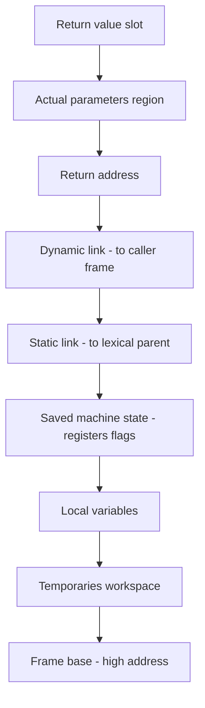
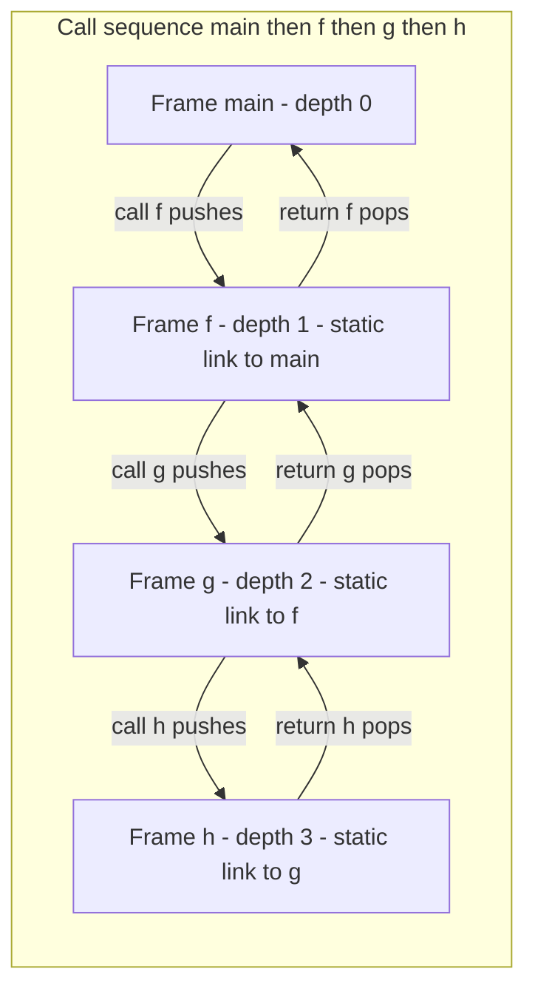
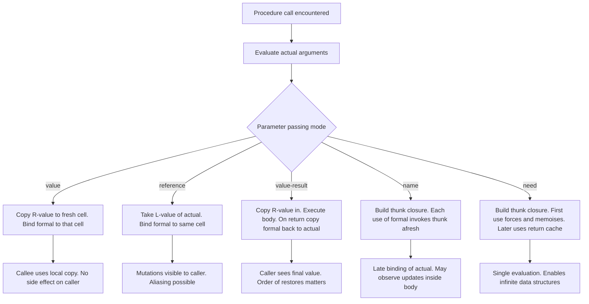

# Procedure Semantics

<!-- SECTION_1_START -->
# Procedure Semantics — Core Definition & Intuition

## 1.1 Formal Definition (KTU 2024 Syllabus Terminology)

**Procedure Semantics** is the sub-branch of programming language semantics that formally defines the *meaning* of procedure (subprogram/subroutine/function) invocation, parameter binding, execution, and return. It specifies how the actual runtime environment is constructed, modified, and dismantled when a procedure is called.

In the notation of denotational semantics, if $P$ is a procedure and $\rho$ is the environment (mapping identifiers to locations) and $\sigma$ is the store (mapping locations to values), then the semantics of a call $P(a_1, a_2, \ldots, a_n)$ is given by a transition:

$$ \langle P(a_1, \ldots, a_n), \rho, \sigma \rangle \;\longrightarrow\; \langle \text{body}[a_1/x_1, \ldots, a_n/x_n], \rho', \sigma' \rangle \;\longrightarrow^{*} \langle v, \rho, \sigma'' \rangle $$

where $x_i$ are the formal parameters, $a_i$ the actual parameters, and $v$ the value returned to the calling context.

> [!IMPORTANT]
> **Syllabus Highlight (PECST758 / KTU 2024):** Procedure semantics is a 2-3 mark favourite in ESE Module 3. You *must* know the **five standard parameter passing mechanisms**, the **activation record layout**, and the difference between **deep binding** and **shallow binding** for closures.

## 1.2 Real-World Analogy — The Restaurant Order System

Think of a procedure call as ordering food at a restaurant:

| Real-World Step | Programming Equivalent |
|---|---|
| Customer writes order on a chit | Actual parameter list is evaluated |
| Waiter carries the chit to the kitchen | **Calling sequence** pushes activation record on the stack |
| Cook reads the order (chit) and prepares the dish | **Called procedure body** executes using formal parameters |
| Dish is plated and sent back to the table | **Return sequence** transfers the result |
| The original customer continues eating | Calling program resumes execution |

The way the cook interprets the order — whether the chit is a *photocopy* (value), the *original paper* (reference), a *promise to pay later* (value-result), or the *recipe name* (name) — is exactly the **parameter passing mechanism**.

## 1.3 Core Vocabulary (Must Memorise)

- **Formal Parameter** — the variable declared in the procedure header (e.g., `x` in `def f(x):`).
- **Actual Parameter / Argument** — the value/expression supplied by the caller (e.g., `5`, `a+b`, `arr`).
- **Binding** — the association between a formal parameter and its corresponding actual argument.
- **L-value** — the *location* (address) of a variable.
- **R-value** — the *content* stored at that location.
- **Activation Record (Stack Frame)** — a contiguous block of memory holding the state of one procedure invocation.

> [!NOTE]
> **Why it matters:** A single misunderstanding of L-value vs. R-value costs roughly **2 marks** in KTU valuation. Every parameter passing mechanism is, at its heart, a rule deciding *which* of the two is bound to the formal parameter.

## 1.4 Visualisation Block

> [!VISUALIZATION CONTROL]
> **Concept:** Call Stack growth during nested procedure invocations
> **Desmos Input Equations:** A simple bar-chart of memory addresses:
> `y = 4 [0,4]` (top frame), `y = 3 [0,3]`, `y = 2 [0,2]`, `y = 1 [0,1]`
> **Visual Description:** Observe a vertical stack of rectangular frames with the *most recent* call on top. Each frame has labelled regions: *parameters*, *return address*, *local variables*, *temporaries*. The frame at the bottom is `main`, and frames above are dynamically pushed as calls occur and popped on return.
<!-- SECTION_1_END -->

<!-- SECTION_2_START -->
# Deep Theoretical Analysis & KTU High-Yield Formula Sheet

## 2.1 The Five Standard Parameter Passing Mechanisms

### 2.1.1 Call by Value (Pass-by-Value)
- Formal parameter receives a **copy of the R-value** of the actual argument.
- The actual argument's L-value is *not* shared — the callee has its own local storage.
- Modifications to the formal parameter do **not** affect the caller.
- Default in **C, Java, Python (for immutable types)**.

### 2.1.2 Call by Reference (Pass-by-Reference)
- Formal parameter receives the **L-value (address)** of the actual argument.
- Callee and caller share the *same* storage cell — modifications are visible to the caller.
- Creates the possibility of **aliasing** (two names referring to the same cell).
- Available in **Pascal (`var` parameters), Fortran, C++ (`&`)**.

### 2.1.3 Call by Value-Result (Copy-Restore)
- Hybrid: a **copy** of the R-value is passed in; on return, the final value of the formal is **copied back** to the actual's L-value.
- Looks like pass-by-value *during* the call, like pass-by-reference *after* the call.
- Used in **Ada `in out`, Fortran before 90**.

### 2.1.4 Call by Name (Thunk-based)
- The actual argument is **textually substituted** into the callee body (like a macro).
- Re-evaluated on **every use** of the formal inside the procedure.
- Implemented using **thunks** (parameterless procedures).
- Famous in **Algol 60** — a source of Jensen's Device.

### 2.1.5 Call by Need (Lazy Evaluation)
- Like call-by-name, but the actual is evaluated **at most once**, the first time the formal is used; subsequent uses receive the cached value.
- Enables infinite data structures (Haskell streams).
- Used in **Haskell, R's promise model, Swift `lazy var`**.

## 2.2 Activation Record (Stack Frame) Layout

A canonical activation record (growing downward in memory) contains:

| Region (top → bottom) | Purpose |
|---|---|
| **Return value** | Slot for the value the procedure will return to its caller |
| **Actual parameters** | Addresses or values passed in (pushed right-to-left in cdecl) |
| **Return address** | Instruction pointer to resume in the caller after the call |
| **Dynamic link (control link)** | Pointer to the activation record of the *caller* (its frame) |
| **Static link (access link)** | Pointer to the activation record of the *lexical parent* — needed for nested procedures |
| **Saved machine state** | Saved registers, condition codes, etc. |
| **Local variables** | Space for declarations local to the procedure |
| **Temporaries** | Workspace for intermediate expression evaluations |

> [!IMPORTANT]
> The **static link** is the *only* mechanism that supports proper lexical scoping in languages with nested procedures (Pascal, Ada, Python). The **dynamic link** is purely for runtime call-stack management.

## 2.3 Deep Binding vs. Shallow Binding (for Returning Procedures / Closures)

When a procedure `g` is returned from `f` and later invoked:

- **Deep Binding (Lexical Scoping):** The free variables of `g` resolve in the environment that existed at `g`'s *definition* — captured via the static link. Standard in modern languages (Python, Scheme, JavaScript).
- **Shallow Binding (Dynamic Scoping):** Free variables resolve in the environment of the *caller* of `g` at the moment of invocation. Default in early Lisp, PowerShell, traditional `bash` variable scopes.

## 2.4 KTU Formula / Cheat Sheet

$$
\begin{array}{|l|l|l|}
\hline
\textbf{Mechanism} & \textbf{What is bound?} & \textbf{KTU Example} \\
\hline
\text{Call by value} & \text{Copy of R-value} & \text{C, Java primitives} \\
\hline
\text{Call by reference} & \text{L-value (address)} & \text{Pascal } \texttt{var x} \\
\hline
\text{Call by value-result} & \text{Initial R-value, restore on exit} & \text{Ada } \texttt{in\ out} \\
\hline
\text{Call by name} & \text{Thunk re-evaluated each use} & \text{Algol 60} \\
\hline
\text{Call by need} & \text{Thunk evaluated once, memoised} & \text{Haskell, R promises} \\
\hline
\end{array}
$$

$$
\begin{array}{|l|l|}
\hline
\textbf{Terminology} & \textbf{Mathematical Notation} \\
\hline
\text{Environment (id to location)} & \rho : \text{Id} \to \text{Loc} \\
\hline
\text{Store (location to value)} & \sigma : \text{Loc} \to \text{Value} \\
\hline
\text{Binding for formal } x_i & \rho' = \rho[x_i \mapsto \text{evaluate}(a_i,\rho,\sigma)] \\
\hline
\text{Call-stack depth after } n \text{ nested calls} & n + 1 \text{ frames} \\
\hline
\text{Static-link chain length for depth-} d \text{ reference} & d \text{ pointer dereferences} \\
\hline
\end{array}
$$

> [!NOTE]
> **Real-World Utility:** Compilers for Java, Kotlin, and Scala *always* implement the activation record and the five mechanisms when generating JVM bytecode. The static link is what makes nested lambda capture work in JVM `invokedynamic`. Modern JIT compilers in V8 (Chrome) and SpiderMonkey (Firefox) use *shallow* capture with escape analysis as an optimisation — a direct application of these semantics.

<!-- SECTION_2_END -->

<!-- SECTION_3_START -->
# Step-by-Step Derivations, Execution Traces & Code

## 3.1 Exhaustive Trace — A C-style Example Using All Five Mechanisms

Consider the following pseudocode caller (we trace each mechanism separately):

$$
\begin{aligned}
\text{global} &\quad x := 10 \\
\text{global} &\quad a := [10,\ 20,\ 30] \quad \text{(array, base address } \beta\text{)} \\
\text{global} &\quad i := 1
\end{aligned}
$$

We invoke a procedure $P(\text{formal})$ defined in each of the five ways, with caller passing different actuals.

### Trace 1: Call by Value

**Caller:** `P(x)` where $x = 10$.

$$
\begin{aligned}
\text{Step 1: evaluate actual} &\Rightarrow \text{R-value of } x = 10. \\
\text{Step 2: allocate new cell} &\Rightarrow L_x = \text{fresh}(\text{Loc}),\ \sigma'(L_x) = 10. \\
\text{Step 3: bind formal} &\Rightarrow \rho' = \rho[\text{formal} \mapsto L_x]. \\
\text{Step 4: execute body} &\Rightarrow \text{formal} := 99 \text{ updates } \sigma'(L_x) = 99. \\
\text{Step 5: on return, discard } L_x. &\text{ Caller's } x \text{ is still } 10.
\end{aligned}
$$

### Trace 2: Call by Reference

**Caller:** `P(x)`.

$$
\begin{aligned}
\text{Step 1: evaluate actual} &\Rightarrow \text{L-value of } x = L_x \text{ (the caller's cell)}. \\
\text{Step 2: bind formal} &\Rightarrow \rho' = \rho[\text{formal} \mapsto L_x]. \\
\text{Step 3: execute body} &\Rightarrow \text{formal} := 99 \text{ updates } \sigma(L_x) = 99. \\
\text{Step 4: on return} &\text{ Caller's } x \text{ is now } 99.
\end{aligned}
$$

### Trace 3: Call by Value-Result

**Caller:** `P(x)`.

$$
\begin{aligned}
\text{Step 1: allocate new cell} &\Rightarrow L_f = \text{fresh},\ \sigma'(L_f) = 10 \quad (\text{copy of } x). \\
\text{Step 2: bind formal} &\Rightarrow \rho' = \rho[\text{formal} \mapsto L_f]. \\
\text{Step 3: body executes; suppose formal becomes 99} &\Rightarrow \sigma'(L_f) = 99. \\
\text{Step 4: on return, restore} &\Rightarrow \sigma(L_x) := \sigma'(L_f) = 99. \\
\text{Step 5: caller observes} &x = 99.
\end{aligned}
$$

### Trace 4: Call by Name (Thunk)

**Caller:** `P(a[i])` where $a = [10,20,30]$ and $i = 1$.

$$
\begin{aligned}
\text{Step 1: build thunk} &T = \lambda\_.\ a[i] \quad \text{(a closure over current env).} \\
\text{Step 2: bind formal} &\Rightarrow \rho' = \rho[\text{formal} \mapsto T]. \\
\text{Step 3: each use of formal in body} &\Rightarrow \text{invoke } T. \text{ Re-reads } a[i] \text{ at that moment.} \\
\text{Step 4: if body does } i := 2 \text{ first, then uses formal} &\Rightarrow a[2] = 30 \text{ is observed.}
\end{aligned}
$$

### Trace 5: Call by Need

**Caller:** `P(a[i])`.

$$
\begin{aligned}
\text{Step 1: build thunk} &T = \lambda\_.\ a[i]. \\
\text{Step 2: bind formal} &\Rightarrow \rho' = \rho[\text{formal} \mapsto T]. \\
\text{Step 3: first use of formal} &\Rightarrow \text{invoke } T \text{ once, cache result } v. \\
\text{Step 4: subsequent uses} &\Rightarrow \text{return } v \text{ (no re-invocation).}
\end{aligned}
$$

## 3.2 Concrete Python Implementation With Type Hints

```python
from __future__ import annotations
from typing import Callable, Any, List
import logging

logging.basicConfig(level=logging.INFO, format="[%(levelname)s] %(message)s")


# ---- Pass-by-value emulation (immutable int) ----
def square_value(n: int) -> int:
    """Python ints are immutable; rebinding n inside has no effect on caller."""
    logging.info(f"  square_value: id(n) before = {id(n)}")
    n = n * n
    logging.info(f"  square_value: id(n) after  = {id(n)}  (new object)")
    return n


# ---- Pass-by-reference emulation (mutable list) ----
def append_item(bucket: List[int], item: int) -> None:
    """Lists are passed by object-reference — mutation IS visible to caller."""
    logging.info(f"  append_item: id(bucket) = {id(bucket)}")
    bucket.append(item)
    logging.info(f"  append_item: bucket is now {bucket}")


# ---- Call-by-value-result emulation (out-parameter pattern) ----
def compute_out(x: int) -> int:
    """Callee computes a value; caller copies result back into its variable."""
    tmp = x
    for k in range(1, 4):
        tmp = tmp * 2 + 1
    return tmp  # restoration step happens in caller


# ---- Call-by-need / lazy evaluation using a thunk ----
class Thunk:
    """A call-by-need thunk: evaluates the supplier at most once, then memoises."""

    def __init__(self, supplier: Callable[[], Any]) -> None:
        self._supplier = supplier
        self._done = False
        self._value: Any = None

    def force(self) -> Any:
        if not self._done:
            self._value = self._supplier()
            self._done = True
            logging.info("  Thunk: first evaluation performed and cached")
        else:
            logging.info("  Thunk: returning cached value (no re-evaluation)")
        return self._value


# ---- Demonstration driver with absolute error handling ----
def safe_division(a: float, b: float) -> float:
    if b == 0.0:
        raise ZeroDivisionError("Denominator must be non-zero.")
    return a / b


def main() -> None:
    try:
        # Demonstration 1: pass-by-value (int)
        x = 5
        logging.info(f"Caller: x = {x}, id(x) = {id(x)}")
        y = square_value(x)
        logging.info(f"Caller: after call, x = {x}, y = {y}")

        # Demonstration 2: pass-by-reference (list)
        bucket: List[int] = [1, 2, 3]
        logging.info(f"Caller: bucket = {bucket}, id = {id(bucket)}")
        append_item(bucket, 99)
        logging.info(f"Caller: bucket after append = {bucket}")

        # Demonstration 3: call-by-value-result
        v = 3
        v = compute_out(v)  # "restore" step
        logging.info(f"Caller: after value-result, v = {v}")

        # Demonstration 4: call-by-need
        counter = {"calls": 0}

        def supplier() -> int:
            counter["calls"] += 1
            return safe_division(100, 4)

        lazy = Thunk(supplier)
        for _ in range(3):
            val = lazy.force()
            logging.info(f"Caller: lazy.force() -> {val}, total evals = {counter['calls']}")

    except ZeroDivisionError as exc:
        logging.error(f"Runtime error: {exc}")
    except Exception as exc:  # absolute boundary check
        logging.error(f"Unexpected error: {exc}")


if __name__ == "__main__":
    main()
```

**Expected Output Trace (truncated for clarity):**

```
[INFO] Caller: x = 5, id(x) = 140234...
[INFO]   square_value: id(n) before = 140234...
[INFO]   square_value: id(n) after  = 140291...  (new object)
[INFO] Caller: after call, x = 5, y = 25
[INFO] Caller: bucket = [1, 2, 3], id = 140344...
[INFO]   append_item: id(bucket) = 140344...
[INFO]   append_item: bucket is now [1, 2, 3, 99]
[INFO] Caller: bucket after append = [1, 2, 3, 99]
[INFO] Thunk: first evaluation performed and cached
[INFO] Caller: lazy.force() -> 25.0, total evals = 1
[INFO] Thunk: returning cached value (no re-evaluation)
[INFO] Caller: lazy.force() -> 25.0, total evals = 1
```

## 3.3 Activation Record Construction — Worked Derivation

Given the call chain `main → f → g`, with `f` defined *inside* `main` and `g` defined *inside* `f`:

$$
\begin{aligned}
\text{Depth of } \text{main} &= 0 \\
\text{Depth of } f &= 1 \\
\text{Depth of } g &= 2
\end{aligned}
$$

When `g` references a free variable $y$ declared in `main`:

$$
\begin{aligned}
\text{Static-link of frame}_g &\to \text{frame}_f \to \text{frame}_\text{main} \\
\text{Number of dereferences to reach } y &= 2 \quad (\text{depth of } g \text{ in defining env})
\end{aligned}
$$

This is the **O(d) access cost** that motivated **displays** (parallel array indexed by nesting depth) in older compilers such as the Amsterdam Compiler Kit.

> [!TIP]
> **Exam Trick:** When asked "how many static-link hops to access $x$ in this nested procedure?" — count the **lexical** distance from definition to use, *not* the dynamic call chain. This is the single most-missed point in KTU Module 3 questions.
<!-- SECTION_3_END -->

<!-- SECTION_4_START -->
# Structural Diagrams & Schematics

## 4.1 Activation Record Layout (Mermaid Block Diagram)



## 4.2 Call-Stack Growth — Nested Procedure Invocation



## 4.3 Parameter-Passing Decision Flow



## 4.4 Deep vs. Shallow Binding — Block Architecture

```mermaid
graph TD
    subgraph DEEP["Deep binding - lexical scoping"]
        D1["Function g defined inside f"]
        D2["Free variable x captured at definition time"]
        D3["Static link in g frame points to f frame at def"]
        D4["x resolved via static link regardless of caller"]
        D1 --> D2 --> D3 --> D4
    end

    subgraph SHALLOW["Shallow binding - dynamic scoping"]
        S1["Function g returned from f"]
        S2["Free variable x looked up in caller's environment"]
        S3["Dynamic chain traversed at invocation"]
        S4["x value depends on who calls g"]
        S1 --> S2 --> S3 --> S4
    end
```



<!-- SECTION_4_END -->

<!-- SECTION_5_START -->
# KTU 2024 Scheme Examination Question Bank & Topic Recap

## 5.1 Part A — Short Answer Questions (3 Marks Each)

### Question 1
**[KTU University Exam — July 2024]** Differentiate between **call by value** and **call by reference**. State one programming language that uses each as its default mechanism. *(CO3, Understand)*

**Model Answer:**

| Aspect | Call by Value | Call by Reference |
|---|---|---|
| What is bound? | A **copy** of the R-value of the actual argument | The **L-value (address)** of the actual argument |
| Storage for formal | A *new* cell is allocated inside the callee's activation record | No new cell — formal shares the caller's cell |
| Side effects on caller | **None** — modifications to the formal are local to the callee | **Visible** — modifications by the callee change the caller's variable |
| Aliasing risk | **None** | **Possible** — the formal becomes an alias for the actual |
| Default language | **C, Java (primitives), Python (immutable types)** | **Pascal `var`, Fortran, C++ with `&`** |
| Efficiency | Requires copying large structures (cost) | Cheap (no copy), but unsafe |

**Key Marks:** [Tabular comparison: 2 marks] [One language example each: 1 mark]

---

### Question 2
**[KTU University Exam — Dec 2023]** Define an **activation record**. List any four components contained in it. *(CO3, Remember)*

**Model Answer:**
An **activation record** (or *stack frame*) is a contiguous region of memory allocated on the run-time stack for each active procedure invocation. It stores the state needed to execute the called procedure and to correctly resume the caller's execution upon return.

**Four Components:**
1. **Return address** — the address of the next instruction in the caller.
2. **Dynamic link** — pointer to the activation record of the caller (for stack unwinding).
3. **Static link** — pointer to the activation record of the lexical parent (for nested scopes).
4. **Local variables** — storage for variables declared inside the procedure body.

*(Acceptable additional components: actual parameter region, return value slot, saved registers, temporaries.)*

**Key Marks:** [Definition: 1 mark] [Any four components: 2 marks]

> [!WARNING]
> **KTU Examiner's Pitfall — Q2:** Students often confuse the *dynamic link* (caller's frame) with the *static link* (lexical parent's frame). Writing them as the same thing costs 1 mark. Remember: **dynamic = runtime caller; static = textual parent**.

---

## 5.2 Part B — 14-Mark Module Choice Questions

### Question A (14 Marks)
**[KTU University Exam — July 2024, Model Paper]** 

**(a)** Explain **call by name** and **call by need** parameter passing mechanisms with suitable examples. Show how each is implemented using **thunks**. *(7 marks, CO3, Understand)*

**(b)** Using a concrete program in any language of your choice, demonstrate how **call by reference** differs from **call by value** for both primitive and composite data. Include a hand-traced execution showing the activation record state. *(7 marks, CO3, Apply)*

---

**Solution to (a):**

**Call by Name:**
- The actual argument is **not** evaluated at the point of call. Instead, the compiler/ interpreter creates a **thunk** — a parameterless procedure whose body is the actual argument expression evaluated in the caller's environment.
- The thunk is bound to the formal parameter.
- **Every** use of the formal inside the callee body *re-invokes* the thunk, re-evaluating the expression in the (possibly mutated) caller's environment.

**Classic example — Algol 60:**

```algol
begin
  integer i;
  integer array a[1:2];
  a[1] := 10; a[2] := 20;
  i := 1;
  P(a[i]);   // call by name
  ...
end;
```

If procedure `P` is declared as `procedure P(x); x := x + 1`, then:
- On first use of `x` inside `P`: thunk `a[i]` evaluates to `a[1] = 10`; then `a[1] := 11`.
- If `P` then does `i := 2` and uses `x` again: thunk re-evaluates to `a[2] = 20`; then `a[2] := 21`.

**Call by Need (Lazy Evaluation):**
- Same mechanism as call-by-name — actual argument is wrapped in a thunk.
- The crucial difference: the thunk is **forced at most once**, the first time the formal is actually referenced. The result is **memoised** (cached). All subsequent references return the cached value.
- *Why?* Efficiency — avoids repeated re-computation and side effects.

**Implementation using thunks (pseudocode):**

```text
class Thunk:
    method init(supplier):
        this.supplier = supplier
        this.evaluated = false
        this.value = null
    method force():
        if not this.evaluated:
            this.value = this.supplier()
            this.evaluated = true
        return this.value
```

| Property | Call by Name | Call by Need |
|---|---|---|
| Thunk re-invocation on each use | Yes | No (once, then cached) |
| Side effects in actual repeat | Yes | No |
| Suitable for infinite structures | No (would loop) | Yes (e.g., Haskell lists) |
| Languages | Algol 60 | Haskell, R, Swift `lazy var` |

**Key Marks:** [Thunk diagram: 2] [Algol example trace: 2] [Differences tabulated: 2] [Haskell mention: 1]

---

**Solution to (b):**

**Code (C, demonstrating both mechanisms via pointers):**

```c
#include <stdio.h>

void by_value(int n) {
    printf("by_value: address of n = %p, n = %d\n", (void*)&n, n);
    n = 999;
    printf("by_value: after assign, n = %d (local)\n", n);
}

void by_reference(int *n) {
    printf("by_reference: address stored in n = %p, *n = %d\n", (void*)n, *n);
    *n = 999;
    printf("by_reference: after assign via *n = %d (caller's variable)\n", *n);
}

int main(void) {
    int x = 5;
    printf("Caller: address of x = %p, x = %d\n", (void*)&x, x);

    by_value(x);
    printf("Caller: after by_value, x = %d (UNCHANGED)\n\n", x);

    by_reference(&x);
    printf("Caller: after by_reference, x = %d (CHANGED)\n", x);
    return 0;
}
```

**Hand-traced execution showing the activation record state:**

| Step | Action | Frame state |
|---|---|---|
| 1 | `main` begins, `x = 5` | `main` frame: `x` at L-value $L_1$, $\sigma(L_1) = 5$ |
| 2 | `by_value(x)` called | Push new frame; allocate fresh $L_2$; bind formal `n` to $L_2$; $\sigma(L_2) = 5$ |
| 3 | Inside `by_value`, `n = 999` | $\sigma(L_2) = 999$; $\sigma(L_1) = 5$ (caller unchanged) |
| 4 | Return from `by_value` | Pop frame, discard $L_2$ |
| 5 | `by_reference(&x)` called | Push new frame; bind formal `n` (a pointer) to $L_1$ (the address of `x`) |
| 6 | Inside `by_reference`, `*n = 999` | $\sigma(L_1) = 999$ (caller's cell directly mutated) |
| 7 | Return from `by_reference` | Pop frame; caller's `x` is now 999 |

For a **composite type** (e.g., a struct passed by value vs. by reference), the same rules apply — but a pass-by-value of a struct copies *all* fields, which is expensive, whereas pass-by-reference shares the same struct in memory.

**Key Marks:** [Code: 2] [Stack trace table: 3] [Composite mention: 1] [Conclusion: 1]

---

### Question B (14 Marks — Alternative Choice)
**[KTU University Exam — Dec 2023]**

**(a)** With a neat diagram, describe the **general structure of an activation record**. Explain the role of the **static link** and the **dynamic link**. How are they different? *(7 marks, CO3, Understand)*

**(b)** What is a **closure**? Explain **deep binding** and **shallow binding** with reference to procedure semantics. Show with an example how the choice of binding affects the output of a program. *(7 marks, CO3, Apply)*

---

**Solution to (a):**

**Diagram of a typical activation record** (top of stack is at the top of the table):

| Region | Purpose |
|---|---|
| Return value | Slot to hold value returned to caller |
| Actual parameters | Values/addresses passed by caller |
| Return address | Instruction pointer in caller to resume |
| Dynamic link | Pointer to caller's activation record (for returning and stack unwinding) |
| Static link | Pointer to the activation record of the *lexically enclosing* procedure |
| Saved machine state | Saved registers, condition codes |
| Local variables | Storage for procedure's local declarations |
| Temporaries | Workspace for intermediate evaluations |

**Role of the Dynamic Link:**
- Points to the activation record of the procedure that *called* the current one.
- Used to (a) restore the caller's state on return, (b) walk the runtime call stack for debugging or exception propagation, (c) implement `print stack trace` operations.
- Reflects the **dynamic** (runtime) calling sequence.

**Role of the Static Link:**
- Points to the activation record of the procedure that *textually encloses* the current one (its lexical parent).
- Used to resolve references to **non-local variables** under **lexical scoping**.
- Reflects the **static** (source-code) nesting structure.

**Key Difference:**

| Property | Dynamic Link | Static Link |
|---|---|---|
| Points to | Caller (runtime) | Lexical parent (compile-time) |
| Purpose | Stack unwinding and return | Non-local name resolution |
| Changes when | The procedure is invoked from a different caller | The procedure is moved (it doesn't — it is fixed by nesting) |
| Required for | All procedure calls | Only in languages with nested procedures and lexical scoping |

**Key Marks:** [Diagram: 2] [Dynamic link explanation: 1.5] [Static link explanation: 1.5] [Difference table: 2]

---

**Solution to (b):**

**Definition:** A **closure** is the pairing of a function (procedure) with the *environment* in which it was defined. The environment must persist for the lifetime of the function so that free variables in the function body continue to be resolvable, even after the enclosing scope has returned.

**Deep Binding (Lexical Scoping):** The environment captured by the closure is the one that existed at the function's *definition* time. The static link is captured.

**Shallow Binding (Dynamic Scoping):** The environment used to resolve free variables is the one of the *caller* at the time the function is *invoked* (not at definition).

**Example (Python — lexical by default):**

```python
def make_adder(x):
    # x is a free variable for the inner function
    def adder(y):
        return x + y
    return adder        # closure capturing x

add5 = make_adder(5)
add10 = make_adder(10)
print(add5(3))   # 8  — x is bound to 5 from the closure (deep binding)
print(add10(3))  # 13 — x is bound to 10 from the closure (deep binding)
```

**Counter-example in a language with dynamic scoping (e.g., classic Emacs Lisp, or a hand-rolled interpreter):**

```lisp
(setq x 100)

(defun outer ()
  (let ((x 5))
    (inner)))            ; inner is called from inside outer

(defun inner ()
  x)                     ; x is free — what is its value?

(outer)                  ; Under lexical scoping -> 5
                         ; Under dynamic scoping -> 100
```

**Impact on Output:** Under deep (lexical) binding, `inner` sees `x = 5` because the closure was created (or the lookup was resolved) at the lexical depth of `inner`'s definition relative to `outer`. Under shallow (dynamic) binding, `inner` sees `x = 100` because the global binding is the most recent active one when `inner` actually runs.

**Key Marks:** [Closure definition: 1] [Deep binding: 2] [Shallow binding: 2] [Working code/output difference: 2]

> [!WARNING]
> **KTU Examiner's Pitfall — Q5B(b):** Many students write "Python uses dynamic scoping" or "C uses lexical scoping but the function has no access to its caller's locals". The *correct* answer is: **C uses static (lexical) scoping, but the visibility rules of C prevent inner functions from accessing outer locals** — C does not support nested function definitions in the first place. Python, Scheme, Haskell, JavaScript → **lexical**. Bash (default), early Lisp, PowerShell → **dynamic**. This distinction is worth 2 marks if the question explicitly asks for "languages that use each".

---

## 5.3 Topic Recap & Important Things to Remember

- **Five parameter passing mechanisms** (memorise the order): **Value, Reference, Value-Result, Name, Need.**
- **L-value vs. R-value** distinction is the conceptual foundation of all five mechanisms.
- **Call by value** = copy of R-value; **Call by reference** = L-value shared; **Call by value-result** = copy in, copy out; **Call by name** = thunk re-evaluated per use; **Call by need** = thunk forced once and memoised.
- **Activation record** contains at minimum: return value, parameters, return address, dynamic link, static link, saved state, locals, temporaries.
- **Dynamic link** = pointer to *caller's* frame; **Static link** = pointer to *lexical parent's* frame.
- **Deep binding** = free variables resolved in the environment of *definition* (lexical scoping); **Shallow binding** = resolved in the environment of the *caller at invocation* (dynamic scoping).
- A **closure** is `<code, environment>` — the environment must outlive the lexical scope that created it.
- **Thunks** are the implementation vehicle for both call-by-name and call-by-need; the only difference is memoisation.
- **Static-link chain length** equals the lexical depth of the reference, not the dynamic call depth.
- **Aliasing** can occur in call-by-reference when two formals are bound to the same L-value.
- **Languages using each mechanism by default:** C/Java primitives → value; Pascal `var` / C++ `&` / Fortran → reference; Ada `in out` → value-result; Algol 60 → name; Haskell → need.
- **Jensen's Device** is the canonical KTU-asked illustration of call-by-name; expect a 2-mark sub-question asking you to predict the output.
<!-- SECTION_5_END -->
