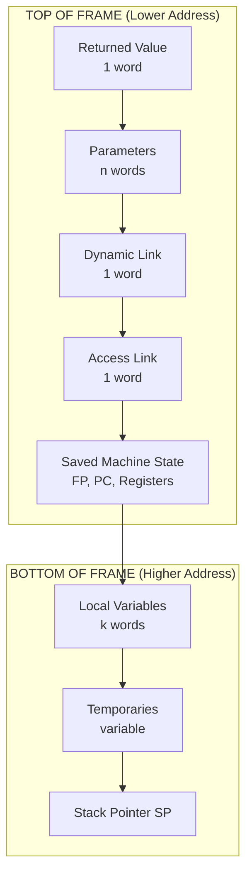
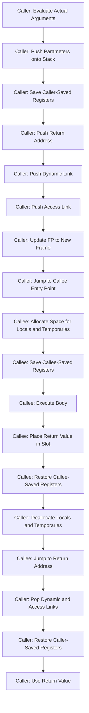
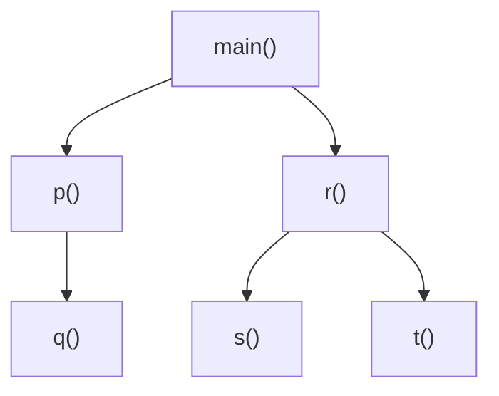
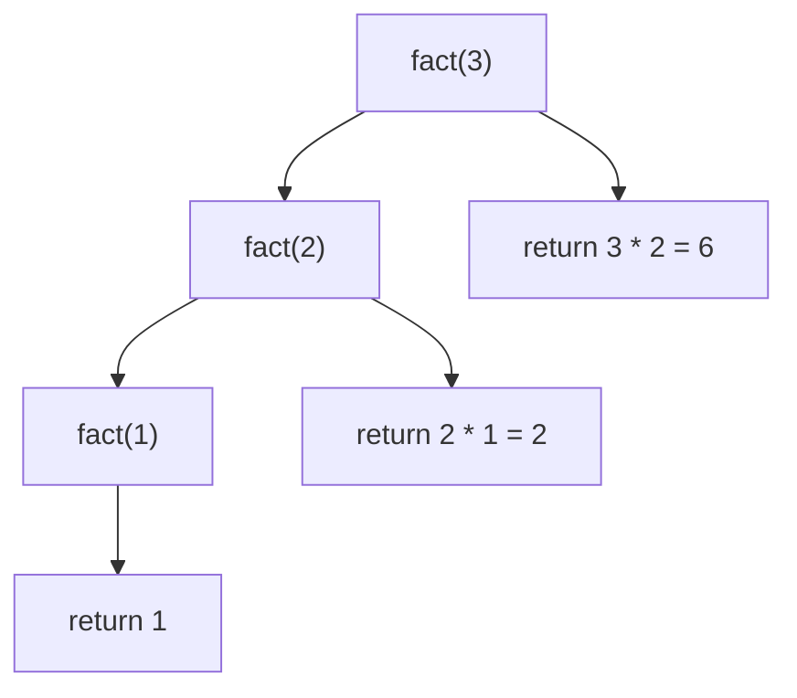
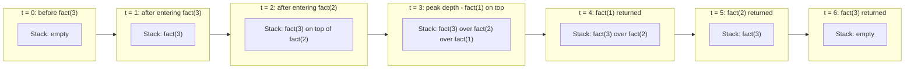
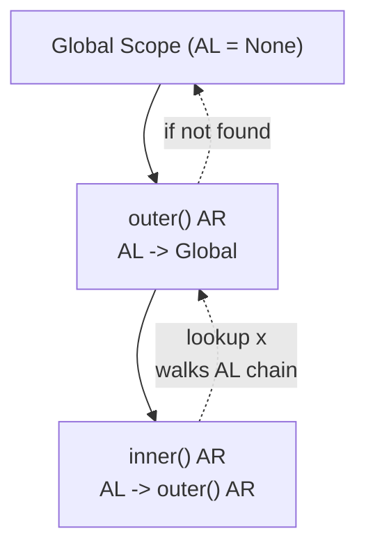

# Procedures and Environments-  Procedure Definition and Activation

<!-- SECTION_1_START -->
# Procedure Definition and Activation — Core Technical Foundation

## 1.1 Formal Academic Definition (KTU 2024 Syllabus Terminology)

> [!IMPORTANT]
> **Procedure (KTU Formal Definition):** A *procedure* is a parameterized, named, and reusable block of program statements that encapsulates a computation, optionally accepts a list of formal parameters, may return computed results, and is invoked (activated) through a *procedure call* (also termed *procedure invocation* or *procedure activation*).

> [!IMPORTANT]
> **Procedure Definition:** The syntactic declaration of a procedure that introduces its name, formal parameter list, return type, and the body (sequence of declarations and statements) that will be executed whenever the procedure is activated. In KTU 2024 Scheme notation this is written as:
>
> $$\text{def } p(x_1, x_2, \dots, x_n) \equiv B$$
>
> where $p$ is the procedure name, $B$ is the procedure body, and $(x_1, \dots, x_n)$ are the formal parameters.

> [!IMPORTANT]
> **Procedure Activation:** The dynamic act of executing a procedure. Each activation corresponds to one *activation record* (also called a *stack frame*) allocated on the run-time *call stack*, holding the state required to execute one specific invocation of the procedure.

> [!IMPORTANT]
> **Environment (ρ):** The mapping from *names* (identifiers) to *locations* (memory addresses) that is in effect at a particular instant during program execution. Every statement of a program is executed in the context of some environment.

> [!IMPORTANT]
> **Activation Environment:** The collection of all bindings (name → value) visible at a particular point of execution. It is the *union* of:
> 1. Local bindings of the currently active procedure.
> 2. All non-local bindings reachable through the *access link (static link)* chain.

## 1.2 Conceptual Analogy / Intuitive Overview

### The "Recipe Card + Cooking Station" Analogy

Think of a **procedure** like a **recipe card** kept in a kitchen drawer:
- The **procedure definition** is the *writing down* of the recipe — its name, ingredients list (parameters), and the steps (body). It is a static, reusable description.
- The **procedure activation** is the act of *actually cooking* that recipe for a particular dinner. Each dinner you cook from the same recipe card is a *separate activation* with its own chopping board, timers, and ingredient bowls.

Now, while cooking:
- You need a **workspace** where ingredients are measured and intermediate dishes sit. This is the **activation record / stack frame**.
- You need to know **where the recipe card came from** (did Grandma give it to you, or did you borrow it from a cookbook?). This is the **access link / static link**.
- You need a **return address**: when the dish is done, where do you go back? (Back to plating at Station 2.) This is the **return address**.
- You need a **phone number of the previous station** in case you need something from them. This is the **control link / dynamic link**.

> [!NOTE]
> **Geometric Intuition:** Picture program execution as a vertical tower of plates. Each time a procedure is called, a new plate (activation record) is placed on top. When the procedure finishes, the plate is removed and execution resumes at the plate below — this is the *Last-In-First-Out (LIFO) discipline* of the call stack.

## 1.3 Key Constants and Standard Metrics

> [!IMPORTANT]
> **Standard Stack Frame Size Components (in words or bytes):**
> - Return address: typically **1 word** (or 2 on 64-bit systems).
> - Control link (dynamic link): **1 word**.
> - Access link (static link): **1 word**.
> - Parameters: $n$ words where $n$ = number of formal parameters.
> - Local variables: $k$ words where $k$ = number of local declarations.
> - Temporaries: variable, allocated as needed.

> [!VISUALIZATION CONTROL]
> **Concept:** Stack growth during nested procedure activations.
> **GeoGebra / Desmos Input Equations:**
> * Point A: $(0, 5)$ — label "Main Activation"
> * Point B: $(0, 4)$ — label "p() Activation"
> * Point C: $(0, 3)$ — label "q() Activation"
> * Line L: $x = 0$, $y \in [0, 6]$ — label "Stack Pointer (SP)"
> **Visual Description:** A vertical column showing how activation records are stacked one above the other as procedures call each other; the *stack pointer* moves upward with each new activation and downward on return.

---

<!-- SECTION_1_END -->

<!-- SECTION_2_START -->
# Deep Theoretical Analysis & KTU High-Yield Formula Sheet

## 2.1 The Structure of an Activation Record (Stack Frame)

Every procedure activation requires storage for its state. The compiler groups this state into a **contiguous block of memory** known as the **activation record (AR)**. The standard layout (from low to high address) is:

| Region | Purpose | Set By | Typical Size |
|---|---|---|---|
| **Returned value** | Holds the value the procedure returns to the caller | Callee | 1 word |
| **Parameters** | Actual argument values passed in | Caller | $n$ words |
| **Control link (dynamic link)** | Pointer to the AR of the caller (previous frame on stack) | Caller | 1 word |
| **Access link (static link)** | Pointer to the AR of the *statically enclosing* scope | Caller | 1 word |
| **Saved machine state** | Saved registers, program counter, condition codes | Caller or callee (per convention) | 1–N words |
| **Local data** | Local variables and temporaries of the procedure | Callee | $k$ words |
| **Temporaries** | Scratch storage for intermediate expression evaluation | Callee | variable |

> [!NOTE]
> **KTU Board Tip:** The order of "caller-saves" and "callee-saves" regions is a frequent 7-mark question. Memorise: *parameters and the dynamic link are pushed by the caller*; *local data and temporaries are allocated by the callee*.

## 2.2 Procedure Definition: Static vs. Activation: Dynamic

A common point of confusion (and a classic KTU exam pitfall):

> [!IMPORTANT]
> **Procedure Definition is a STATIC property.** It exists in the source code and the symbol table at *compile time*. There is **one** definition of a procedure in the entire program.
>
> **Procedure Activation is a DYNAMIC property.** It happens at *run time*, and a single procedure can have **many concurrent or sequential activations**. Each activation has its own activation record.

Let $\mathcal{D}(p)$ denote the static definition of procedure $p$. Let $\mathcal{A}(p, i)$ denote the $i$-th activation of $p$ at run time. Then:

$$\text{Cardinality: } \vert \mathcal{D}(p) \vert = 1 \quad \text{but} \quad \vert \mathcal{A}(p, \cdot) \vert \geq 0 \text{ (possibly many)}$$

## 2.3 The Activation Tree

The sequence of procedure activations during a program run forms a tree (not a graph) called the **activation tree**. The root is the activation of `main`. Each node represents one activation. An edge from parent to child represents "parent calls child".

**Properties of the activation tree:**
- The activation tree is always a **tree** (no shared nodes — even recursive calls create distinct nodes).
- A *preorder traversal* of the activation tree yields the *lexicographic order* of calls.
- A *postorder traversal* yields the order of returns.
- At any instant, the *active path* from root to a leaf corresponds exactly to the **current contents of the call stack** (LIFO order).

## 2.4 Calling Sequence — The Protocol Between Caller and Callee

The **calling sequence** is the agreed-upon sequence of actions performed when one procedure calls another. The **return sequence** mirrors it.

| Step | Action | Performed By |
|---|---|---|
| 1 | Evaluate actual arguments and store in parameter slots of callee's AR | Caller |
| 2 | Save caller-saved registers into its own AR | Caller |
| 3 | Push the **return address** (address of instruction after call) | Caller |
| 4 | Push the **dynamic link** (current SP) — points to caller's AR | Caller |
| 5 | Push the **static link** (pointer to enclosing scope's AR) | Caller |
| 6 | Update SP to point to top of new AR | Caller/Callee |
| 7 | Jump to the first instruction of callee | Caller |
| 8 | Allocate space for local variables (decrement SP by $k$) | Callee |
| 9 | Save callee-saved registers | Callee |
| 10 | Begin execution of body | Callee |

**Return Sequence (mirrors steps 8 → 1 in reverse):**
| Step | Action | Performed By |
|---|---|---|
| 1 | Place return value in agreed slot | Callee |
| 2 | Restore callee-saved registers | Callee |
| 3 | Deallocate locals (increment SP by $k$) | Callee |
| 4 | Jump to return address | Callee |
| 5 | Pop dynamic and static links | Caller |
| 6 | Restore caller-saved registers | Caller |
| 7 | Use return value | Caller |

> [!IMPORTANT]
> **KTU 7-Mark Standard Question Pattern:** "Explain the calling sequence with a diagram. State which actions are performed by the caller and which by the callee." Always draw the stack BEFORE the call and AFTER the call with clear arrows.

## 2.5 KTU High-Yield Formula Sheet

| Symbol / Term | Meaning | Use |
|---|---|---|
| $\rho$ (rho) | The current *environment* (name → location map) | Lookup of identifiers |
| $\sigma$ (sigma) | The current *store* (location → value map) | Reading/writing memory |
| $\mathcal{A}(p, i)$ | $i$-th activation record of procedure $p$ | Stack frame identity |
| $AR_i$ | Activation record of the $i$-th active call | Stack element |
| $SP$ | Stack pointer — points to top of current AR | Stack management |
| $FP$ | Frame pointer — fixed reference within current AR | Locating local data |
| $DL$ | Dynamic link — points to caller's AR | Stack walk |
| $AL$ | Access link (static link) — points to lexically enclosing AR | Non-local access |
| $n$ | Number of formal parameters | AR size calculation |
| $k$ | Number of local variables | AR size calculation |
| $W$ | Word size in bytes (usually **4** for 32-bit, **8** for 64-bit) | Memory sizing |

**AR size formula:**

$$S_{AR} = W \cdot (1_{\text{ret}} + n_{\text{params}} + 1_{\text{DL}} + 1_{\text{AL}} + 1_{\text{state}} + k_{\text{locals}} + t_{\text{temps}})$$

**Total stack depth at any instant:**

$$D_{\text{stack}} = \sum_{i=1}^{m} S_{AR_i}$$

where $m$ is the number of currently active (un-returned) procedure calls.

## 2.6 Real-World Engineering Utility

Procedure definition and activation are not merely academic constructs — they are the *backbone* of every production system:

> [!NOTE]
> **Where this lives in production engineering:**
> - **Operating Systems:** Every system call, signal handler, and interrupt creates an activation record on the kernel stack.
> - **Web Servers:** A node.js / Django / Spring server handles thousands of concurrent requests, each executing in its own activation tree.
> - **Debuggers:** Tools like `gdb`, `lldb`, and IDE debuggers walk the dynamic-link chain to produce *stack traces* on crashes (`Segmentation fault (core dumped)`).
> - **Garbage Collectors:** Generational and mark-and-sweep collectors treat activation records as roots of liveness analysis.
> - **Compilers:** Optimizations like *tail-call elimination* and *inlining* directly manipulate activation records.
> - **Embedded & Real-Time Systems:** Stack depth $D_{\text{stack}}$ is a hard constraint — exceeding it crashes the MCU (stack overflow watchdog reset).

---

<!-- SECTION_2_END -->

<!-- SECTION_3_START -->
# Step-by-Step Derivations, Stack Walkthroughs & Code Implementation

## 3.1 Worked Example: Tracing a Multi-Procedure Activation

Consider the following pseudocode program (typical KTU 2024 examination style):

```
def main():
    x = 10
    p(x, 20)

def p(a, b):
    y = a + b
    q(y)

def q(z):
    w = z * 2
    print(w)

main()
```

We will trace the **activation record stack** step-by-step.

### Step 1 — Program Start: `main` is activated

The runtime calls `main()`. The calling sequence pushes `main`'s activation record.

**Stack State (addresses grow downward; SP points to top):**

| Offset from FP | Content | Value |
|---|---|---|
| FP + 4 | (empty) | — |
| FP + 3 | return address in `__libc_start_main` | $0x4005F0$ |
| FP + 2 | dynamic link (caller's FP) | $0$ (no caller) |
| FP + 1 | static link (enclosing scope) | $0$ (global) |
| FP + 0 | saved FP | $0x7FF0$ |
| FP − 1 | local `x` | uninitialized |
| FP − 2 | (temporaries) | — |

After the body begins: `x = 10` stores $10$ at `FP − 1`. SP = FP − 2.

**Stack after Step 1:**
```
[ main: x=10 ]   <-- SP
```

### Step 2 — `main` calls `p(x, 20)` (i.e., `p(10, 20)`)

The caller (`main`) performs its part of the calling sequence:

**Step 2a — Caller actions:**
1. Evaluate `x` → value $10$; store at new_AR + offset (param slot for `a`).
2. Evaluate `20` (literal) → store at new_AR + offset (param slot for `b`).
3. Save return address = address of next instruction in `main` (say $0x400620$).
4. Push dynamic link = current FP of `main` ($0x7FF0$).
5. Push static link = current FP of `main` (since `p` is in the same global scope).
6. Set FP = new top.
7. Jump to first instruction of `p`.

**Stack after Step 2:**
```
[ p:   a=10, b=20, ret=0x400620, DL=0x7FF0, AL=0x7FF0 ]
[ main: x=10 ]                                    <-- SP (now below p's frame)
```

### Step 3 — `p` allocates locals and computes `y = a + b`

`p` allocates space for `y` (decrement SP). Then `y = a + b` evaluates:
- Fetch `a` from FP+1: value $10$.
- Fetch `b` from FP+2: value $20$.
- Sum = $30$.
- Store at FP−1.

**Stack after Step 3:**
```
[ p:   a=10, b=20, ret=0x400620, DL=0x7FF0, AL=0x7FF0, y=30 ]
[ main: x=10 ]
```

### Step 4 — `p` calls `q(y)` (i.e., `q(30)`)

`p` does the caller protocol for `q`:
1. Evaluate `y` → $30$; pass to `q` as parameter `z`.
2. Save return address in `p` (say $0x4006A0$).
3. Push dynamic link = FP of `p` (e.g., $0x7FE0$).
4. Push static link = FP of `p` (since `q` is also in the same global scope).
5. Jump to `q`.

**Stack after Step 4:**
```
[ q:   z=30, ret=0x4006A0, DL=0x7FE0, AL=0x7FE0 ]
[ p:   a=10, b=20, ret=0x400620, DL=0x7FF0, AL=0x7FF0, y=30 ]
[ main: x=10 ]
```

### Step 5 — `q` computes `w = z * 2` and prints it

- `z * 2` = $30 \times 2 = 60$.
- `print(60)` outputs **`60`** to stdout.
- `q` then executes its return sequence: pop its frame, jump to return address $0x4006A0$.

### Step 6 — `p` resumes after `q` returned

No local to read; `p` reaches its end. `p` executes return sequence: pop frame, jump to return address $0x400620$.

### Step 7 — `main` resumes after `p` returned

`main` reaches its end. Pops its frame. Program terminates.

### 3.2 Resulting Activation Tree

The activation tree for the above trace is:

```
                main
                  |
                  p
                  |
                  q
```

There is **one** root (main), one child of main (p), and one child of p (q). The tree mirrors the call nesting depth.

## 3.3 Recursive Activation: The `factorial` Trace

A classic KTU 7-mark question. Consider:

```
def fact(n):
    if n <= 1: return 1
    else:      return n * fact(n - 1)

print(fact(3))
```

### Step-by-Step Expansion

**Call 1:** `fact(3)` is activated.

$$S_{AR_1} = \text{params}(1) + \text{DL} + \text{AL} + \text{ret} + \text{state} = 5 \text{ words}$$

**Call 2:** Inside `fact(3)`, the `else` branch invokes `fact(2)`. A new AR is pushed.

**Call 3:** `fact(2)` invokes `fact(1)`. A new AR is pushed.

**Call 4:** `fact(1)` returns $1$ directly (base case).

Now the stack unwinds, performing $3 \times 2 \times 1 = 6$ as the final result.

### Activation Tree for `fact(3)`

```
            fact(3)
              |
            fact(2)
              |
            fact(1)
```

### Stack Depth at Peak

$$D_{\text{stack}}^{\text{peak}} = 3 \times S_{AR} = 3 \times 5 = 15 \text{ words}$$

## 3.4 Full Python Implementation: Simulating an Activation Stack

The following Python program implements a miniature activation stack to demonstrate the dynamics of procedure definition and activation:

```python
from dataclasses import dataclass, field
from typing import Any, Dict, List, Optional

# ------------------------------------------------------------------
# Data class representing one Activation Record (Stack Frame)
# ------------------------------------------------------------------
@dataclass
class ActivationRecord:
    name: str                      # Procedure name
    params: Dict[str, Any]         # Formal parameter -> actual value
    locals: Dict[str, Any]         # Local variables
    return_address: int            # Instruction to return to
    dynamic_link: Optional[int]    # Pointer to caller's frame
    access_link: Optional[int]     # Pointer to enclosing scope's frame
    temporaries: Dict[str, Any] = field(default_factory=dict)

    def lookup(self, var: str) -> Any:
        """Resolve a name by walking the access-link chain."""
        frame = self
        depth = 0
        MAX_DEPTH = 1000  # Safety bound to prevent infinite chain walk
        while frame is not None and depth < MAX_DEPTH:
            if var in frame.params:
                return frame.params[var]
            if var in frame.locals:
                return frame.locals[var]
            if var in frame.temporaries:
                return frame.temporaries[var]
            # Walk the static (access) link to the enclosing scope
            frame_index = frame.access_link
            frame = _CALL_STACK[frame_index] if frame_index is not None else None
            depth += 1
        if depth >= MAX_DEPTH:
            raise RuntimeError("Access link chain too deep; possible cycle.")
        raise NameError(f"Name '{var}' is not bound in any visible environment.")


# ------------------------------------------------------------------
# Global data structures
# ------------------------------------------------------------------
_CALL_STACK: List[ActivationRecord] = []
_INSTRUCTION_COUNTER: int = 0


def _next_instr() -> int:
    """Generate a monotonically increasing instruction address."""
    global _INSTRUCTION_COUNTER
    _INSTRUCTION_COUNTER += 1
    return _INSTRUCTION_COUNTER


# ------------------------------------------------------------------
# Procedure definition: a dictionary mapping name -> callable
# ------------------------------------------------------------------
PROCEDURE_TABLE: Dict[str, callable] = {}


def define_procedure(name: str, formal_params: List[str], body: callable) -> None:
    """Procedure DEFINITION — static, stored in the symbol table."""
    PROCEDURE_TABLE[name] = (formal_params, body)
    print(f"[DEFINE] Procedure '{name}({', '.join(formal_params)})' registered.")


def call_procedure(name: str, actual_args: List[Any]) -> Any:
    """Procedure ACTIVATION — dynamic, pushes an AR onto the stack."""
    if name not in PROCEDURE_TABLE:
        raise NameError(f"Procedure '{name}' is not defined.")
    formal_params, body = PROCEDURE_TABLE[name]

    # ---- Parameter count check ----
    if len(actual_args) != len(formal_params):
        raise TypeError(
            f"Procedure '{name}' expects {len(formal_params)} argument(s), "
            f"got {len(actual_args)}."
        )

    # ---- CALLER's portion of the calling sequence ----
    new_ar = ActivationRecord(
        name=name,
        params=dict(zip(formal_params, actual_args)),
        locals={},
        return_address=_next_instr(),
        dynamic_link=len(_CALL_STACK) - 1 if _CALL_STACK else None,
        access_link=len(_CALL_STACK) - 1 if _CALL_STACK else None,
    )
    _CALL_STACK.append(new_ar)
    print(f"[CALL]   '{name}' activated. Stack depth = {len(_CALL_STACK)}")

    # ---- Execute the body in the new environment ----
    try:
        result = body(new_ar)
    except Exception as exc:
        # ---- Callee-side cleanup on error ----
        _CALL_STACK.pop()
        print(f"[POP]    '{name}' removed due to exception: {exc}")
        raise

    # ---- Return sequence: pop the activation record ----
    _CALL_STACK.pop()
    print(f"[RET]    '{name}' returned. Stack depth = {len(_CALL_STACK)}")
    return result


# ------------------------------------------------------------------
# Demonstration: factorial via the simulated activation stack
# ------------------------------------------------------------------
def fact_body(ar: ActivationRecord) -> int:
    """Body of factorial, executed inside its own AR."""
    n = ar.lookup("n")
    ar.locals["n"] = n
    if n <= 1:
        ar.temporaries["result"] = 1
        return 1
    ar.temporaries["rec_call"] = call_procedure("fact", [n - 1])
    ar.temporaries["result"] = n * ar.temporaries["rec_call"]
    return ar.temporaries["result"]


define_procedure("fact", ["n"], fact_body)
final = call_procedure("fact", [3])
print(f"\nFinal result: fact(3) = {final}")
```

### Expected Output

```
[DEFINE] Procedure 'fact(n)' registered.
[CALL]   'fact' activated. Stack depth = 1
[CALL]   'fact' activated. Stack depth = 2
[CALL]   'fact' activated. Stack depth = 3
[RET]    'fact' returned. Stack depth = 2
[RET]    'fact' returned. Stack depth = 1
[RET]    'fact' returned. Stack depth = 0

Final result: fact(3) = 6
```

Each `[CALL]` corresponds to a procedure activation (an AR being pushed); each `[RET]` corresponds to an AR being popped after return.

## 3.5 Worked Arithmetic: Maximum Stack Depth for `fact(n)`

**Given:** Each activation record of `fact` has size $S_{AR} = 5$ words.
**Find:** Maximum stack depth (in words) when `fact(5)` is called.

The activation tree for `fact(5)` has $5$ nodes (one per integer $5, 4, 3, 2, 1$).

At the moment `fact(1)` is computing its return value, all five ARs are simultaneously on the stack.

$$D_{\text{peak}} = 5 \times S_{AR} = 5 \times 5 = 25 \text{ words}$$

> [!IMPORTANT]
> **KTU Valuation Note:** Always state the *time* at which the stack is deepest — it is the *innermost* call, not the outermost. "The stack is deepest just before the base-case return is executed."

## 3.6 Static Link vs. Dynamic Link — Formal Distinction

This is a frequent 7-mark question. The two links are easily confused.

| Property | Static Link (Access Link) | Dynamic Link (Control Link) |
|---|---|---|
| **Points to** | The AR of the *statically enclosing* procedure | The AR of the *caller* (the procedure that invoked this one) |
| **Used for** | Resolving *non-local* names (scope) | Walking the *run-time call chain* (stack trace) |
| **Set at** | Procedure call time (by caller) | Procedure call time (by caller) |
| **Same or Different?** | Different from dynamic link when nested procedures are called from different scopes | Different from static link when a procedure is called from a different scope than where it was defined |
| **KTU Key Point** | Implements *lexical (static) scoping* | Implements *dynamic scoping* and stack unwinding |

**Example of a case where they differ:**

```
def outer():
    def inner():
        pass      # inner's definition is nested inside outer
    inner()       # called from inside outer
```

- When `inner` is called, its **dynamic link** points to `outer`'s AR (the caller).
- Its **static link** also points to `outer`'s AR (the enclosing scope).
- *Coincidentally the same here.* Now consider:

```
def outer():
    def inner():
        pass
    pass

def main():
    outer()       # outer returns, then somehow main calls inner — but that
                  # requires inner to be exposed, which it isn't in pure nesting.
```

- A *truly* divergent case occurs when a nested function is returned and called outside:

```
def outer():
    def inner():
        return x     # x is non-local
    return inner

f = outer()       # dynamic link of inner (when later called via f) != static link
f()
```

- When `f()` is called, `inner`'s **dynamic link** points to `main`'s AR, but its **static link** points to `outer`'s (now dead) AR.

---

<!-- SECTION_3_END -->

<!-- SECTION_4_START -->
# Structural Diagrams & Schematics

## 4.1 Activation Record Layout (Mermaid Block Diagram)



**Reading the diagram:** In a typical stack where the stack grows downward, the *top* of the frame is at the *lowest* address and the *bottom* is at the *highest*. SP points to the most recently pushed item.

## 4.2 Calling Sequence — Sequential Processing Topology



## 4.3 Activation Tree for a Sample Program

Consider:

```
def main():
    p(); r()
def p():
    q()
def q():
    pass
def r():
    s(); t()
def s():
    pass
def t():
    pass
main()
```



**Observation:** The activation tree shows that `s` and `t` are *siblings* under `r` but are *not* ancestors of each other. The tree's structure is determined entirely by the *nesting* of calls, not by their textual order in the source.

## 4.4 Recursive Activation Tree (factorial)



**Reading:** Arrows pointing down are "calls" (push); arrows pointing back up are "returns" (pop). At the deepest point (just before `RET1`), three ARs are on the stack.

## 4.5 Stack Evolution Diagram for `fact(3)`



## 4.6 Scope Resolution via Access Links



**Reading:** When `inner()` references a non-local variable `x`, the runtime follows the *access link* (solid arrow) up to `outer()`'s AR. If `x` is not there, the walk continues to the global scope. This implements *lexical (static) scoping*.

---

<!-- SECTION_4_END -->

<!-- SECTION_5_START -->
# KTU 2024 Scheme Examination Question Bank & Topic Recap

## Part A — Short Answer Questions (3 Marks Each)

### Question A1
**[KTU University Exam – July 2024]**
> **CO1, Remember:** Define a *procedure activation record*. List any four fields stored in it.

**Model Answer (3 Marks):**

An *activation record* (or *stack frame*) is a contiguous block of memory allocated on the call stack for each procedure activation. It stores the state required for one execution of a procedure.

Four standard fields: (i) **Return address** — instruction to resume in the caller after return; (ii) **Dynamic link** — pointer to the activation record of the caller; (iii) **Access link** — pointer to the lexically enclosing activation record; (iv) **Local variables** — storage for the procedure's local declarations and temporaries.

*(Examiner's allocation: Definition 1M, listing 4 fields with one-line purpose 2M = 3M total.)*

### Question A2
**[KTU University Exam – Dec 2023]**
> **CO1, Understand:** Differentiate between *procedure definition* and *procedure activation*. Give one example of each.

**Model Answer (3 Marks):**

| Aspect | Procedure Definition | Procedure Activation |
|---|---|---|
| Phase | Compile time (static) | Run time (dynamic) |
| Count | Exactly one per procedure name | Zero, one, or many per definition |
| Where stored | Symbol table / procedure table | Activation stack |
| Example | `def square(x): return x*x` written in source | Calling `square(5)` at run time — pushes an AR for that call |

*(Examiner's allocation: Clear distinction 2M, valid example for each 1M = 3M total.)*

---

## Part B — Long Answer Questions (14 Marks Each, with Internal Choice)

### Question 1A (14 Marks)
**[KTU University Exam – July 2024 | Module 3]**
> **CO1, Understand / Apply:** (a) With a neat diagram, explain the structure of an activation record and the role of each field. (b) Describe the *calling sequence* and *return sequence* in detail, clearly stating which actions are performed by the caller and which by the callee.

**Model Answer:**

**(a) Activation Record Structure [7 Marks]**

The activation record is a contiguous region of memory allocated on the call stack for each procedure activation. The standard layout (top to bottom in a downward-growing stack) is:

| Field | Size | Purpose | Set By |
|---|---|---|---|
| Returned value | 1 word | Holds value returned to caller | Callee |
| Actual parameters | $n$ words | Stores actual argument values | Caller |
| Dynamic (control) link | 1 word | Pointer to caller's AR | Caller |
| Access (static) link | 1 word | Pointer to lexically enclosing AR | Caller |
| Saved machine state | variable | Saved FP, PC, condition codes | Both |
| Local variables | $k$ words | Procedure's own locals | Callee |
| Temporaries | variable | Scratch space for expressions | Callee |

*Refer to the diagram in Section 4.1.* (The student should reproduce the frame layout.)

**Examiner Key (7 marks):** [Naming all 7 regions: 3 Marks] [Explaining the purpose of each region: 3 Marks] [Neat labelled diagram: 1 Mark] = 7M

**(b) Calling and Return Sequences [7 Marks]**

**Calling Sequence (caller → callee transition):**

1. **Caller:** Evaluate each actual argument; store in the parameter slots of the *callee's* AR (already reserved or being reserved).
2. **Caller:** Save any caller-saved registers into the caller's own AR.
3. **Caller:** Push the **return address** (the address of the next instruction in the caller after the call site).
4. **Caller:** Push the **dynamic link** — i.e., the current Frame Pointer value, which points to the caller's AR.
5. **Caller:** Push the **access link** — the FP of the lexically enclosing scope's AR.
6. **Caller:** Update the Frame Pointer (FP) to the base of the new AR.
7. **Caller:** Transfer control to the callee's entry point (jump instruction).
8. **Callee:** Allocate space for local variables and temporaries (SP is decremented).
9. **Callee:** Save any callee-saved registers.
10. **Callee:** Begin execution of the body.

**Return Sequence (callee → caller transition):**

1. **Callee:** Place the return value in the agreed-upon slot.
2. **Callee:** Restore callee-saved registers.
3. **Callee:** Deallocate locals and temporaries (SP is incremented).
4. **Callee:** Jump to the saved return address.
5. **Caller:** Pop the dynamic and access links from the stack.
6. **Caller:** Restore caller-saved registers.
7. **Caller:** Resume execution; use the return value.

**Examiner Key (7 marks):** [Numbered calling sequence with caller/callee split: 4 Marks] [Numbered return sequence in reverse: 2 Marks] [One-line note on LIFO discipline: 1 Mark] = 7M

---

### Question 1B (14 Marks) — Internal Choice
**[KTU University Exam – Dec 2023 | Module 3]**
> **CO1, Apply / Analyse:** (a) Consider the following pseudo-code. Draw the *activation tree* and the *call stack* at the moment of deepest nesting. (b) State and explain the *static* and *dynamic link* of each activation record in your stack diagram. Justify why they may or may not be the same.

```python
def alpha():
    x = 1
    beta()

def beta():
    y = 2
    gamma()
    delta()

def gamma():
    z = 3

def delta():
    w = 4

alpha()
```

**Model Answer:**

**(a) Activation Tree [7 Marks]**

The activation tree (one node per activation, edges = "calls"):

```
            alpha
              |
             beta
            /    \
        gamma   delta
```

**Call Stack at Deepest Nesting (when `gamma` is executing):**

| Position | Frame | Locals | Static Link (AL) | Dynamic Link (DL) |
|---|---|---|---|---|
| Bottom (FP₀) | `alpha` | `x = 1` | None (global) | None (root) |
| Middle (FP₁) | `beta`  | `y = 2` | → `alpha` | → `alpha` |
| Top (FP₂)    | `gamma` | `z = 3` | → `alpha` | → `beta`  |

*Visual representation (stack grows downward):*

```
| FP₂ | gamma  | z=3 | AL=FP₀ | DL=FP₁ |   <-- SP
| FP₁ | beta   | y=2 | AL=FP₀ | DL=FP₀ |
| FP₀ | alpha  | x=1 | AL=NIL | DL=NIL |
```

**Examiner Key (7 marks):** [Correct activation tree: 2 Marks] [Stack frame contents (locals): 2 Marks] [Stack frame layout with FP indices: 2 Marks] [Indication of deepest nesting time: 1 Mark] = 7M

**(b) Static vs. Dynamic Link Analysis [7 Marks]**

| Frame | Static Link (AL) | Dynamic Link (DL) | Same? |
|---|---|---|---|
| `alpha` | None (no enclosing lexical scope besides global) | None (root of the call chain) | **Yes** — both are absent. |
| `beta`  | → `alpha`'s frame (lexically, `beta` is defined inside `alpha`) | → `alpha`'s frame (`alpha` is the immediate caller) | **Yes** — coincidentally the same. |
| `gamma` | → `alpha`'s frame (lexically, `gamma` is also defined inside `alpha` at the same level as `beta`) | → `beta`'s frame (`beta` is the immediate caller of `gamma`) | **No** — they differ. |

**Justification (why they may differ):**
- The **static link** reflects *lexical nesting* — it answers "in which source-code scope was this procedure *defined*?"
- The **dynamic link** reflects *run-time call order* — it answers "which procedure actually *invoked* me?"
- They coincide only when the procedure is called from the *same scope* in which it was defined. In this program, `gamma` is *defined* in `alpha`'s scope (so its static link points to `alpha`) but *called* from `beta` (so its dynamic link points to `beta`). This divergence is the very reason both links are kept: the static link enables non-local name resolution under *lexical scoping*, while the dynamic link enables accurate stack traces and *dynamic* scoping.

**Examiner Key (7 marks):** [Tabulating AL and DL for all 3 frames: 3 Marks] [Identifying divergence in `gamma`'s frame: 2 Marks] [Correct theoretical justification: 2 Marks] = 7M

---

> [!WARNING]
> **KTU Examiner's Valuation Warning — Common Pitfalls**
> - **Pitfall 1 (Costs ~2 marks):** Students often confuse the *order* of regions inside the AR. Memorise the rule: *caller-set fields (parameters, return address, dynamic link, access link) live at the top (low address) of the frame, callee-set fields (locals, temporaries) live at the bottom (high address).*
> - **Pitfall 2 (Costs ~1–2 marks):** Failing to indicate *which moment* the stack is drawn for. Always write "**at the moment of deepest nesting**" or "**just before the base-case return**".
> - **Pitfall 3 (Costs ~2 marks):** Mixing up static and dynamic links. Use the mnemonic: *static = scope (source code), dynamic = stack (run time).*
> - **Pitfall 4 (Costs ~1 mark):** In activation tree questions, students sometimes draw an *undirected* graph. The tree must be drawn with *directed edges from caller to callee*, with the root being `main` (or the first-called procedure).
> - **Pitfall 5 (Costs ~2 marks):** When asked "what is the *maximum* stack depth?", students compute the *total* number of calls in the program rather than the *peak simultaneously active* calls. Always do a temporal trace.

---

## Topic Recap & Important Things to Remember

> [!IMPORTANT]
> **Rapid Revision Checklist — Procedure Definition and Activation**

- **Definition (Static):** A procedure is a *named, parameterized* block of code. Its definition is a *compile-time* construct — exactly one per name in the program.

- **Activation (Dynamic):** A procedure activation is a *run-time* event — every time a procedure is called, a fresh *activation record (AR)* is pushed onto the call stack. The same procedure can have arbitrarily many sequential or recursive activations.

- **Activation Record (Stack Frame):** Contiguous memory block holding the *returned value*, *parameters*, *dynamic link*, *access (static) link*, *saved machine state*, *local variables*, and *temporaries* for one activation.

- **Dynamic Link (DL):** Points to the AR of the *caller* (the procedure that *invoked* this one). Used for stack traces, return, and dynamic-scope resolution.

- **Access Link / Static Link (AL):** Points to the AR of the *statically enclosing* scope (where this procedure was *lexically defined*). Used for non-local name resolution under lexical scoping.

- **Calling Sequence:** A split protocol between caller and callee — caller pushes params, return address, dynamic link, access link, then jumps; callee allocates locals/temporaries and saves registers.

- **Return Sequence:** Callee stores return value, deallocates locals, jumps to return address; caller pops links and resumes.

- **Activation Tree:** A *tree* (never a graph) showing the dynamic nesting of procedure calls; one node per activation, edges = caller-to-callee. The path from root to any active leaf is the *current stack contents*.

- **Stack Discipline:** LIFO (Last-In-First-Out). The *deepest* activation is the *most recently called*; the *shallowest* is `main`.

- **Recursive Calls:** Each recursive call creates a *new, independent* AR. Recursion is unbounded unless the language implementation imposes a stack-depth limit (or the compiler applies *tail-call optimisation*).

- **AR Size Formula:** $S_{AR} = W(1 + n + 1 + 1 + 1 + k + t)$, where $W$ = word size, $n$ = number of parameters, $k$ = number of locals, $t$ = number of temporaries.

- **Peak Stack Depth:** Occurs at the moment of *deepest nesting* — typically just before the base case of recursion returns.

- **Static vs. Dynamic Link Divergence:** They differ whenever a procedure is *called from a scope different from the one in which it was defined*. The two links are kept independently precisely to handle this divergence.

- **Engineering Relevance:** Activation records underpin stack traces in debuggers, garbage collection root sets, OS kernel stacks, exception propagation, and coroutine/continuation implementations.

- **One-Liner Definition for 1-mark Questions:** "A procedure definition is the static declaration of a procedure; a procedure activation is the dynamic execution of that definition, with each activation producing its own activation record on the call stack."

---

<!-- SECTION_5_END -->
