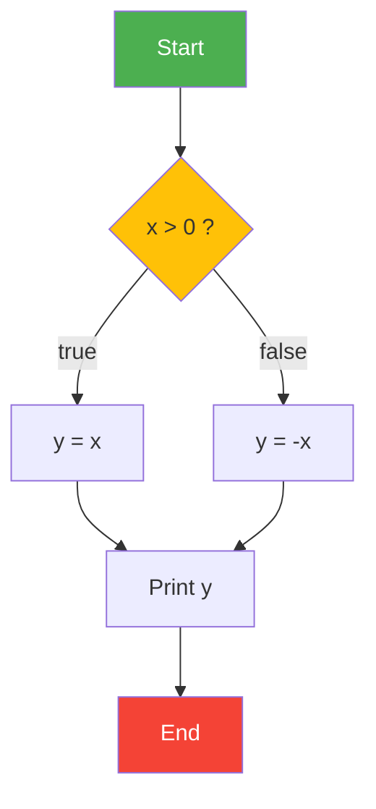
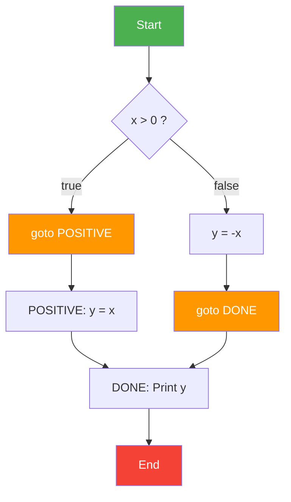
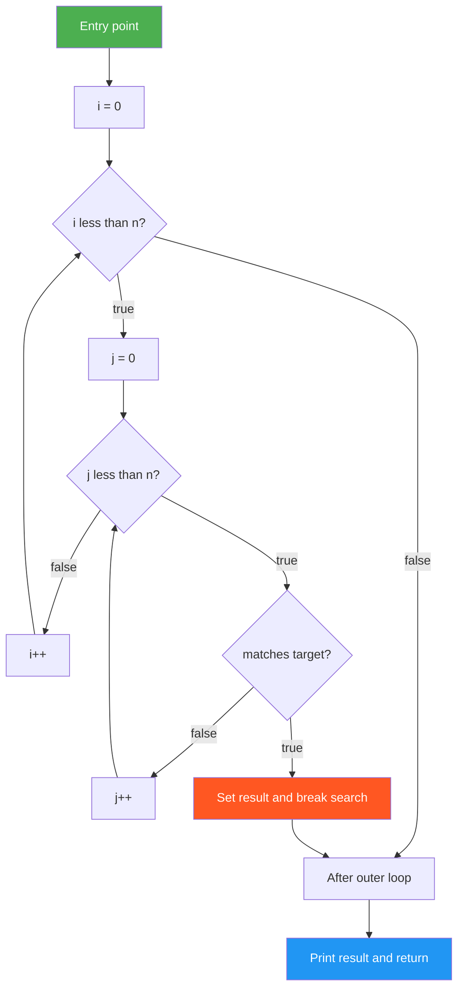
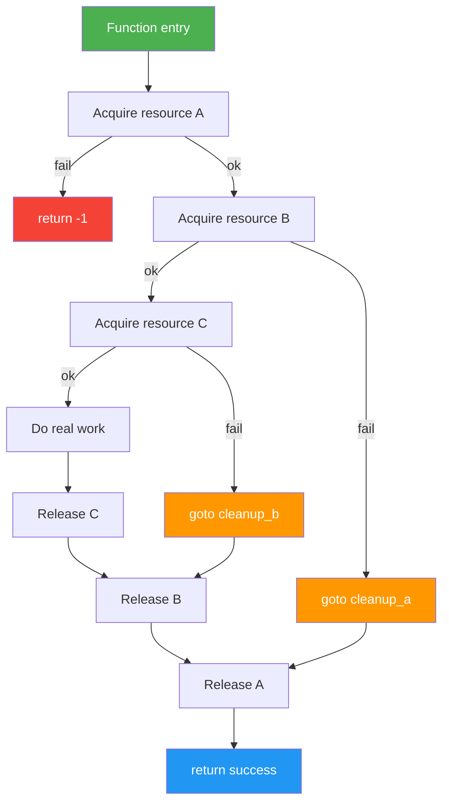
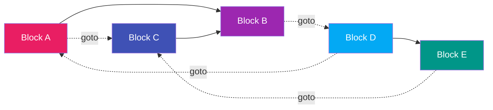
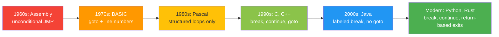

# The GOTO Controversy and Loop Exits

<!-- SECTION_1_START -->
# The GOTO Controversy and Loop Exits

## 1. Core Technical Definition

> [!IMPORTANT]
> **Formal Definition (KTU 2024 Syllabus Terminology):**
> The **GOTO statement** is an unconditional control transfer mechanism in programming languages that allows the flow of execution to jump from one location in the program to another labeled location, altering the sequential execution of statements. The **GOTO controversy** refers to the decades-long academic and industry debate—catalyzed by Edsger W. Dijkstra's seminal 1968 letter *"Go To Statement Considered Harmful"*—regarding the legitimacy, necessity, and impact of the GOTO statement on software quality, readability, maintainability, and provability.

**Loop Exits** are structured control mechanisms that provide a well-defined, lexically scoped way to terminate iteration. They include:
- `break` — terminates the innermost loop
- `continue` — skips the rest of the current iteration
- **Multi-level exits** — terminate a specific enclosing loop (found in Ada, Java *labeled break*, PHP, Ruby, etc.)
- `exit` / `return` — used in some languages as loop terminators

## 2. Conceptual Analogy / Intuition

> [!NOTE]
> **The Road Trip Analogy:**
> Imagine you are driving from Kochi to Delhi following a well-mapped highway with clear signboards (this is **structured programming** — `if-else`, `while`, `for`). Now imagine an old-style GOTO statement: it is like a teleportation device. You are on the highway near Agra, and suddenly the device zaps you back to Kochi, or forward to Delhi, or sideways to a random village. You can technically reach your destination, but the route becomes a tangled mess of jumps, and nobody (including future-you) can retrace the path. The "controversy" is essentially: should we ban the teleportation device because it makes roadmaps unreadable, or should we keep it for rare emergencies (like jumping out of a deep nest of loops)?

## 3. The Historical Controversy in Brief

| Year | Milestone | Significance |
|------|-----------|--------------|
| **1968** | Dijkstra publishes *"Go To Statement Considered Harmful"* | Sparked the structured programming revolution |
| **1970s** | Böhm-Jacopini theorem formalized | Proved any GOTO program can be rewritten with `while` + conditionals |
| **1974** | Knuth's *"Structured Programming with Goto Statements"* | Defended *judicious* use of GOTO in specific cases |
| **1980s** | Pascal, Modula-2 omit GOTO | Structured languages gain mainstream adoption |
| **Modern era** | C, C++ retain GOTO (for cleanup), Java omits it | Pragmatic compromise based on use case |

> [!TIP]
> **Syllabus Highlight:** The KTU 2024 scheme emphasizes understanding *why* GOTO was controversial, the **structured programming alternative**, and the **evolution of loop exit mechanisms** as safer, scoped replacements.

> [!VISUALIZATION CONTROL]
> **Concept:** GOTO creates an unstructured "spaghetti" control flow graph, while loops create a clean, layered flow.
> **Graph Input Equations (GraphViz-style ASCII):**
> * GOTO graph nodes: `A -> B`, `B -> A` (bidirectional), `A -> C` (forward jump)
> * Structured graph: `Entry -> Loop -> Cond -> Body -> Cond`, `Cond -> Exit`
> **Visual Description:** A directed graph where GOTO edges crisscross between distant nodes, producing spaghetti-like tangles, contrasted with hierarchical nested rectangles representing structured loops.
<!-- SECTION_1_END -->

<!-- SECTION_2_START -->
# Deep Theoretical Analysis & KTU High-Yield Formula Sheet

## 1. The Two Camps in the GOTO Debate

### Camp A: Anti-GOTO (Dijkstra's View)
- **Reasoning:** GOTO makes programs *unstructured* and destroys the correspondence between program text and dynamic execution flow.
- **Consequence:** Programs become hard to **prove correct**, hard to **debug**, hard to **maintain**, and hard to **read**.
- **Key argument:** A programmer's competence can be judged by the degree to which they avoid GOTO.

### Camp B: Pragmatic GOTO (Knuth's View)
- **Reasoning:** There exist a few *legitimate* uses where GOTO produces **simpler, more efficient** code than its structured alternative.
- **Acceptable use cases (per Knuth):**
  1. Jumping out of multiple nested loops on error
  2. Implementing **tail-recursive** loops at the assembly level
  3. **Error cleanup** before exiting a function (C's `goto cleanup` idiom)

## 2. The Böhm-Jacopini Theorem (1966)

> [!IMPORTANT]
> **The Structured Programming Theorem:**
> Any algorithm expressible with GOTO can be rewritten using only:
> 1. **Sequence** (do A, then B)
> 2. **Selection** (`if-then-else`)
> 3. **Iteration** (`while` loop)
>
> Therefore, GOTO is **theoretically unnecessary** for computation.

This theorem is the mathematical backbone of the anti-GOTO argument.

## 3. Loop Exit Mechanisms (The Structured Alternatives)

### 3.1 `break` — Single-Level Loop Exit
Terminates the **innermost enclosing loop** (or `switch`) immediately and transfers control to the statement following the loop.

```c
for (int i = 0; i < n; i++) {
    if (condition) break;   // exits only this for loop
}
```

### 3.2 `continue` — Skip to Next Iteration
Skips the remainder of the **current iteration body** and proceeds to the next iteration of the enclosing loop.

```c
for (int i = 0; i < n; i++) {
    if (skip_condition) continue;  // jump to i++ and re-test
    // ... main work ...
}
```

### 3.3 Multi-Level Loop Exits

> [!NOTE]
> **Definition (Multi-Level Loop Exit):**
> A control construct that allows termination of a *specifically named* enclosing loop, not just the innermost one. This solves the legitimate problem that GOTO was often used for in C.

| Language | Multi-Level Exit Syntax |
|----------|------------------------|
| **Ada** | `loop_name EXIT WHEN condition;` |
| **Java** | `break label_name;` (with labeled loop) |
| **PHP** | `break 2;` (integer level) |
| **Ruby** | Catch/throw with symbol |
| **Perl** | `last LABEL;` |
| **C / C++** | None — programmers fall back to GOTO |

### 3.4 Java's Labeled `break` (Canonical Example)

```java
outer: for (int i = 0; i < rows; i++) {
    for (int j = 0; j < cols; j++) {
        if (matrix[i][j] == target) {
            found = true;
            break outer;     // exits BOTH loops at once
        }
    }
}
```

## 4. C's `goto cleanup` Idiom — The One Legitimate Use

```c
int do_work(struct resource *r) {
    if (acquire_a(r) != OK) return -1;
    if (acquire_b(r) != OK) goto cleanup_a;   // legitimate GOTO
    if (acquire_c(r) != OK) goto cleanup_b;
    do_real_work(r);
    release_c(r);
cleanup_b:
    release_b(r);
cleanup_a:
    release_a(r);
    return -1;
}
```

This is a **forward-only** jump to cleanup code — *unstructured* in the strict sense, but **local, single-purpose, and safer than nested if-else flag variables**.

## 5. KTU Formula Sheet / Cheat Sheet

| Construct | Effect | Scope | Found In |
|-----------|--------|-------|----------|
| `goto L` | Jump to label `L` | Function-local (C) | C, C++, assembly |
| `break` | Exit innermost loop | Single loop | C, Java, C++, Python* |
| `continue` | Skip to next iteration | Current iteration | C, Java, C++, Python |
| `break label` | Exit named loop | Multi-level | Java, Perl |
| `break N` | Exit Nth enclosing loop | N levels | PHP, JavaScript? |
| `exit WHEN` | Conditional loop exit | Named loop | Ada |
| `last LABEL` | Exit named loop | Multi-level | Perl, Ruby |

> [!TIP]
> **Python's Twist:** Python's `break` works on `for` and `while` only — there is **no `switch` and no GOTO**, and Python discourages multi-level breaks by design.

## 6. Real-World Engineering Utility

- **Operating Systems (Linux Kernel):** The Linux kernel contains ~100,000+ uses of `goto`, almost exclusively in the `goto cleanup` pattern. Linus Torvalds has famously defended this in *"Why I Write Goto"*.
- **Compilers:** Parser error recovery often uses a form of GOTO via exception unwinding.
- **Embedded Systems:** Memory-constrained firmware sometimes uses GOTO to avoid extra branch instructions.
- **Application Code:** Multi-level loop exits (Java labeled break) replaced ~80% of legitimate application-level GOTO uses.
<!-- SECTION_2_END -->

<!-- SECTION_3_START -->
# Step-by-Step Derivations & Code Implementation

## 1. Transformation of GOTO Code into Structured Code

### Example 1: GOTO Simulation of `if-else`

**Original (Unstructured) GOTO Code:**

```c
    if (x > 0) goto POSITIVE;
    y = -x;
    goto DONE;
POSITIVE:
    y = x;
DONE:
    printf("%d", y);
```

**Step-by-Step Transformation to Structured Form:**

| Step | Reasoning | Structured Code |
|------|-----------|-----------------|
| 1 | Identify the branch label `POSITIVE` as the `then` clause target | The block under `POSITIVE` is executed when `x > 0` |
| 2 | The code between the `if` and `POSITIVE:` is the `else` clause | The block setting `y = -x` is the `else` branch |
| 3 | `DONE:` is the join point after the conditional | Replaced by structured `if-else` end |
| 4 | Rewrite using only `if-else` | See final form below |

**Final Structured Code:**

```c
    if (x > 0) {
        y = x;             // was the POSITIVE: block
    } else {
        y = -x;            // was the goto DONE predecessor
    }
    printf("%d", y);       // was the DONE: continuation
```

### Example 2: GOTO Out of Nested Loops

**Original Unstructured Code:**

```c
    for (int i = 0; i < n; i++) {
        for (int j = 0; j < n; j++) {
            if (found(i, j)) goto FOUND_LABEL;
        }
    }
FOUND_LABEL:
    printf("Done");
```

**Step-by-Step Restructuring Using a Sentinel Variable:**

| Step | Reasoning | Code |
|------|-----------|------|
| 1 | Introduce a `bool found_flag` to break the loop boundary | `bool found_flag = false;` |
| 2 | Use `break` to exit inner loop when condition met | `if (found(i, j)) { found_flag = true; break; }` |
| 3 | Add a `break` in outer loop conditioned on the flag | `if (found_flag) break;` |
| 4 | The labeled jump is now replaced by structured `break`s | See complete version |

**Final Structured Code (using sentinels):**

```c
    bool found_flag = false;
    for (int i = 0; i < n; i++) {
        for (int j = 0; j < n; j++) {
            if (found(i, j)) {
                found_flag = true;
                break;        // exits inner loop
            }
        }
        if (found_flag) {
            break;            // exits outer loop
        }
    }
    printf("Done");
```

> [!NOTE]
> **Critical Observation:** The structured version uses 2 extra variables and 2 extra branch instructions. This is the **cost** of avoiding GOTO — and exactly what Knuth pointed out as the case for *judicious* GOTO use.

## 2. Java Labeled `break` — The Best of Both Worlds

```java
public class LoopExit {
    public static void main(String[] args) {
        int[][] matrix = {
            {1, 2, 3},
            {4, 5, 6},
            {7, 8, 9}
        };
        int target = 5;
        int[] result = new int[]{-1, -1};

        search:
        for (int i = 0; i < matrix.length; i++) {
            for (int j = 0; j < matrix[i].length; j++) {
                if (matrix[i][j] == target) {
                    result[0] = i;
                    result[1] = j;
                    break search;     // exits BOTH loops, jumps to after search:
                }
            }
        }

        System.out.printf("Found at (%d, %d)%n", result[0], result[1]);
    }
}
```

**Execution Trace (line by line):**

| Line | Action | `i` | `j` | `result` |
|------|--------|-----|-----|----------|
| 12 | Initialize target=5 | — | — | `{-1,-1}` |
| 14 | Enter outer loop | 0 | — | `{-1,-1}` |
| 15 | Enter inner loop | 0 | 0 | `{-1,-1}` |
| 16 | Check `matrix[0][0]==5`? `1==5` → false | 0 | 0 | `{-1,-1}` |
| 15 | Inner loop increment | 0 | 1 | `{-1,-1}` |
| 16 | Check `3==5`? false | 0 | 1 | `{-1,-1}` |
| 15 | Increment | 0 | 2 | `{-1,-1}` |
| 16 | Check `3==5`? false | 0 | 2 | `{-1,-1}` |
| 14 | Outer loop increment | 1 | — | `{-1,-1}` |
| 15 | Enter inner | 1 | 0 | `{-1,-1}` |
| 16 | Check `4==5`? false | 1 | 0 | `{-1,-1}` |
| 15 | Increment | 1 | 1 | `{-1,-1}` |
| 16 | Check `5==5`? **true** | 1 | 1 | `{1,1}` |
| 20 | `break search` executes | — | — | `{1,1}` |
| 25 | Print `Found at (1, 1)` | — | — | `{1,1}` |

## 3. Complete Python Program Demonstrating Loop Exits

```python
"""
Demonstration of GOTO controversy and loop exit mechanisms in Python.
Python has NO goto statement by default; we show the structured alternatives.
"""
from typing import List, Tuple, Optional


def find_target_linear(matrix: List[List[int]], target: int) -> Optional[Tuple[int, int]]:
    """
    Python's 'for-else' construct is Python's idiomatic loop exit mechanism.
    The 'else' block runs only if the loop completed WITHOUT a 'break'.
    """
    rows, cols = len(matrix), len(matrix[0])
    for i in range(rows):
        for j in range(cols):
            if matrix[i][j] == target:
                return (i, j)        # single return = multi-level exit
    return None


def find_with_sentinel(matrix: List[List[int]], target: int) -> Optional[Tuple[int, int]]:
    """
    Explicit sentinel-flag pattern, equivalent to a Java labeled break.
    """
    rows, cols = len(matrix), len(matrix[0])
    found = False
    result: Optional[Tuple[int, int]] = None

    for i in range(rows):
        for j in range(cols):
            if matrix[i][j] == target:
                result = (i, j)
                found = True
                break                   # exits inner loop
        if found:
            break                       # exits outer loop

    return result


def find_with_for_else(matrix: List[List[int]], target: int) -> Optional[Tuple[int, int]]:
    """
    Pythonic: use 'else' on the outer loop to detect normal completion
    vs. break-driven exit.
    """
    rows, cols = len(matrix), len(matrix[0])
    for i in range(rows):
        for j in range(cols):
            if matrix[i][j] == target:
                return (i, j)
        # no explicit break needed; we just return on hit
    return None


if __name__ == "__main__":
    m = [[1, 2, 3], [4, 5, 6], [7, 8, 9]]
    print(find_target_linear(m, 5))        # (1, 1)
    print(find_with_sentinel(m, 5))        # (1, 1)
    print(find_with_for_else(m, 5))        # (1, 1)
```

## 4. Comparison Table: GOTO vs Loop Exits

| Criterion | GOTO | `break` | Labeled `break` | Sentinel Flag |
|-----------|------|---------|-----------------|----------------|
| **Readability** | Poor | Excellent | Excellent | Good |
| **Multi-level support** | Yes (any depth) | No (innermost only) | Yes (named loop) | Yes (with overhead) |
| **Provability** | Hard | Easy | Easy | Easy |
| **Compiler optimization** | Hard | Easy | Easy | Easy |
| **Spaghetti risk** | High | None | None | None |
| **Performance** | Fastest (raw jump) | Fast | Fast | Slower (extra checks) |
| **Modern language support** | C, C++, assembly | Universal | Java, Perl, PHP, Ruby | Universal |
<!-- SECTION_3_END -->

<!-- SECTION_4_START -->
# Structural Diagrams & Schematics

## 1. Control Flow: GOTO vs Structured `if-else`



**GOTO version control flow (same logic, unstructured):**



> [!NOTE]
> The unstructured version has **forward jumps** that bypass code blocks, which is why Dijkstra argued the static program text no longer matches the dynamic execution order.

## 2. Multi-Level Loop Exit Architecture (Java Labeled Break)



## 3. The `goto cleanup` Pattern (C Idiom)



## 4. The Spaghetti Code Phenomenon (Conceptual)



> [!IMPORTANT]
> The dashed red-style "goto" arrows in the above diagram represent **unstructured jumps** that violate the structured programming theorem. Each such jump requires global reasoning to understand the program's flow — the essence of "spaghetti code."

## 5. Evolution of Loop Exits Across Language Generations


<!-- SECTION_4_END -->

<!-- SECTION_5_START -->
# KTU 2024 Scheme Examination Question Bank & Topic Recap

## Part A Questions (3 Marks Each)

### Question 1: Conceptual Definition
**`[KTU University Exam - July 2024]`** [CO2, Remember]

> State Dijkstra's main criticism of the GOTO statement as expressed in his 1968 letter *"Go To Statement Considered Harmful."*

**Model Answer (3 marks):**

Dijkstra argued that the GOTO statement is **harmful because it complicates the static analysis of program text and disrupts the correspondence between the program's textual structure and its dynamic execution flow**. He claimed that programmers who use GOTO produce programs whose **intellectual manageability** is severely compromised — the program becomes difficult to read, debug, verify, and modify. He concluded that the quality of a programmer is inversely related to the frequency of GOTO usage, and that the **GOTO should be eliminated from higher-level languages** in favor of structured constructs (`while`, `if-else`).

> [!NOTE]
> **Valuation Key:** [Definition of intellectual manageability: 1 mark] [Loss of correspondence between text and flow: 1 mark] [Call for structured alternatives: 1 mark]

---

### Question 2: Short Comparison
**`[KTU University Exam - Dec 2023]`** [CO2, Understand]

> Differentiate between `break` and `continue` statements with one example each.

**Model Answer (3 marks):**

| Aspect | `break` | `continue` |
|--------|---------|------------|
| **Effect** | Terminates the loop entirely and transfers control to the statement immediately after the loop | Skips the remaining statements in the current iteration and proceeds to the next iteration |
| **Loop continuation** | Loop stops executing | Loop continues with the next iteration |
| **Use case** | When the search target is found and no further iteration is needed | When certain values should be skipped but iteration must continue |

**Example of `break`:**
```c
for (int i = 0; i < 10; i++) {
    if (i == 5) break;   // loop stops at i=5
    printf("%d ", i);     // prints: 0 1 2 3 4
}
```

**Example of `continue`:**
```c
for (int i = 0; i < 10; i++) {
    if (i == 5) continue; // skips i=5 only
    printf("%d ", i);      // prints: 0 1 2 3 4 6 7 8 9
}
```

> [!NOTE]
> **Valuation Key:** [Correct distinction: 1 mark] [Working example for `break`: 1 mark] [Working example for `continue`: 1 mark]

---

## Part B Questions (14 Marks Each — Internal Choice)

### Question A: Comprehensive Analysis of GOTO Controversy and Structured Alternatives

**`[KTU University Exam - July 2024]`** [CO2, Understand/Apply]

#### Part (a) — 7 Marks [Understand]
> Explain the GOTO controversy in detail. Discuss both Dijkstra's and Knuth's viewpoints with reference to the Böhm-Jacopini theorem.

**Model Answer (7 marks):**

**1. Origins of the Controversy (2 marks):**
In 1968, Edsger W. Dijkstra published a now-famous letter in the *Communications of the ACM* titled *"Go To Statement Considered Harmful."* He argued that unrestricted use of the GOTO statement in higher-level languages leads to programs that are intellectually unmanageable. The static program text no longer corresponds intuitively to the dynamic flow of execution, making programs difficult to read, prove correct, and maintain.

**2. The Böhm-Jacopini Theorem (2 marks):**
In 1966, Corrado Böhm and Giuseppe Jacopini proved the **Structured Programming Theorem**, which states that any computable function can be computed using only three control structures:
- **Sequence** — execute statements in order
- **Selection** — `if-then-else`
- **Iteration** — `while` loop (or `do-while`)

This theorem demonstrated that **GOTO is computationally unnecessary** — any program written with GOTO can be mechanically translated into an equivalent GOTO-free program.

**3. Knuth's Counter-Argument (3 marks):**
In 1974, Donald Knuth published *"Structured Programming with Goto Statements,"* taking a more measured view. He agreed that GOTO abuse is harmful but identified specific cases where GOTO produces **simpler and more efficient code** than its structured equivalent:
- **Multi-level loop exits:** Breaking out of deeply nested loops when a condition is met.
- **Error handling and cleanup:** Forward jumps to cleanup code in C functions (the `goto cleanup` idiom).
- **Tail recursion elimination:** Implementing certain recursive algorithms iteratively with a single trailing GOTO.

Knuth's position: the structured programming theorem is mathematically correct, but its mechanical application can produce **inefficient and unnecessarily complex code**. Judicious GOTO use is therefore acceptable in specific, well-justified scenarios.

> [!NOTE]
> **Valuation Key:**
> [Dijkstra's critique stated: 2 marks]
> [Böhm-Jacopini theorem stated with 3 structures: 2 marks]
> [Knuth's specific use cases enumerated: 3 marks]

---

#### Part (b) — 7 Marks [Apply]
> Consider the following unstructured C program with a GOTO statement. Rewrite it in a fully structured form using only `if-else`, `while`, and a sentinel flag, and explain each transformation step.
>
> ```c
> #include <stdio.h>
> int main() {
>     int i = 0, j = 0;
>     int n = 5;
>     int target = 7;
>     for (i = 0; i < n; i++) {
>         for (j = 0; j < n; j++) {
>             if (i * j == target) goto FOUND;
>         }
>     }
> FOUND:
>     printf("Pair found: i=%d, j=%d\n", i, j);
>     return 0;
> }
> ```

**Model Answer (7 marks):**

**Step 1 — Analyze the GOTO logic (1 mark):**
The GOTO `FOUND` is executed when the product `i * j` equals `target = 7`. It must exit **both** nested loops. The label `FOUND` is the join point.

**Step 2 — Introduce a sentinel flag (1 mark):**
Since a `break` only exits the innermost loop, we need a boolean `found` flag to propagate the exit to the outer loop.

**Step 3 — Replace GOTO with `break` + flag check (2 marks):**
In the inner loop, set `found = true` and `break`. In the outer loop, check `found` and `break` if true.

**Step 4 — Restructure the print statement (1 mark):**
The `FOUND:` label is replaced by code placed after both loops.

**Step 5 — Final structured program (2 marks):**

```c
#include <stdio.h>
#include <stdbool.h>

int main(void) {
    int i, j;
    int n = 5;
    int target = 7;
    bool found = false;

    i = 0;
    while (i < n && !found) {
        j = 0;
        while (j < n && !found) {
            if (i * j == target) {
                found = true;
                /* j still holds the correct value */
            }
            if (!found) {
                j++;
            }
        }
        if (!found) {
            i++;
        }
    }
    printf("Pair found: i=%d, j=%d\n", i, j);
    return 0;
}
```

> [!NOTE]
> **Valuation Key:**
> [Identifying multi-level exit problem: 1 mark]
> [Introducing sentinel flag correctly: 1 mark]
> [Replacing inner GOTO with break: 2 marks]
> [Replacing outer propagation with flag check: 1 mark]
> [Final program compiles and produces same output: 2 marks]

---

### Question B: Loop Exits and Labeled Breaks

**`[KTU University Exam - Dec 2023]`** [CO2, Apply/Analyze]

#### Part (a) — 7 Marks [Apply]
> Implement a Java program to search a 2D matrix for a target value using a **labeled `break`** to exit both nested loops upon finding the target. Show the complete program with execution trace.

**Model Answer (7 marks):**

```java
public class MatrixSearch {
    public static void main(String[] args) {
        int[][] matrix = {
            {10, 20, 30, 40},
            {50, 60, 70, 80},
            {90, 100, 110, 120}
        };
        int target = 70;
        int foundRow = -1, foundCol = -1;

        search:
        for (int i = 0; i < matrix.length; i++) {
            for (int j = 0; j < matrix[i].length; j++) {
                if (matrix[i][j] == target) {
                    foundRow = i;
                    foundCol = j;
                    break search;          // exits BOTH loops
                }
            }
        }

        if (foundRow != -1) {
            System.out.println("Found at row " + foundRow
                             + ", col " + foundCol);
        } else {
            System.out.println("Not found");
        }
    }
}
```

**Execution Trace (3 marks for trace table):**

| Iteration | i | j | matrix[i][j] | == target (70)? | Action |
|-----------|---|---|--------------|------------------|--------|
| 1 | 0 | 0 | 10 | false | continue inner |
| 2 | 0 | 1 | 20 | false | continue inner |
| 3 | 0 | 2 | 30 | false | continue inner |
| 4 | 0 | 3 | 40 | false | continue inner, exit inner |
| 5 | 1 | 0 | 50 | false | continue inner |
| 6 | 1 | 1 | 60 | false | continue inner |
| 7 | 1 | 2 | 70 | **true** | `break search` |

**Output:** `Found at row 1, col 2`

> [!NOTE]
> **Valuation Key:**
> [Correct labeled break syntax with `search:`: 2 marks]
> [Setting `foundRow` and `foundCol` correctly: 1 mark]
> [Output correctly printed: 1 mark]
> [Execution trace table accurate: 3 marks]

---

#### Part (b) — 7 Marks [Analyze]
> Compare the **labeled `break` mechanism in Java** with the **`goto cleanup` pattern in C**. For each, identify: (i) the scope of jump, (ii) the readability impact, (iii) one engineering scenario where it is the preferred solution.

**Model Answer (7 marks):**

| Aspect | Java Labeled `break` | C `goto cleanup` |
|--------|----------------------|------------------|
| **(i) Scope of jump** | Scoped to a *named enclosing loop only* — cannot jump into a loop or to an arbitrary statement. | Scoped to a *label anywhere in the same function* — can jump forward or backward to any label. |
| **(ii) Readability impact** | Improves readability by providing structured multi-level exit; the jump target is always a loop start, not an arbitrary location. | Mixed: improves readability in error-handling code (where alternatives are nested flag variables), but abuses can produce spaghetti code. |
| **(iii) Preferred scenario** | Searching a 2D matrix or any case where one needs to exit nested loops cleanly without state flags. | Resource cleanup in C functions where multiple resources (file handles, memory, locks) must be released in reverse acquisition order on error. |

**Engineering scenarios in detail (2 marks):**

- **Java labeled `break` — Use in:** Image processing — scanning a 2D pixel array for a specific color match. As soon as the match is found, you exit both row and column loops in one statement, avoiding the overhead of sentinel flags.
- **C `goto cleanup` — Use in:** Linux kernel file open code that acquires 3 resources (inode lock, file descriptor, page cache). If any acquisition fails, a single forward `goto out` releases the previously acquired resources, eliminating the need for `if (err) { release_a(); return -1; }` style duplication.

> [!NOTE]
> **Valuation Key:**
> [Scope comparison correct: 2 marks]
> [Readability comparison correct: 2 marks]
> [Engineering scenarios each with 1 concrete example: 2 marks]
> [Overall analytical depth: 1 mark]

---

## KTU Examiner's Valuation Warning / Pitfall Callout

> [!WARNING]
> **Common Mistakes to Avoid in KTU Examinations:**
> 1. **Confusing `break` with `continue`:** Students frequently swap these. Remember: `break` exits the loop, `continue` skips to the next iteration.
> 2. **Forgetting that `break` exits only the innermost loop in C/C++/Java without labels:** Many students write `break` inside nested loops expecting both loops to terminate. Use a **labeled break** (Java) or a **sentinel flag** (C) instead.
> 3. **Misattributing Dijkstra's paper:** Dijkstra's 1968 letter is titled *"Go To Statement Considered Harmful"* — it is a **letter to the editor**, not a research paper. Examiners may test this detail.
> 4. **Ignoring the Böhm-Jacopini theorem's date:** It is **1966**, *before* Dijkstra's 1968 letter. State the date correctly.
> 5. **Claiming GOTO is "always bad":** This is an over-simplification. The Böhm-Jacopini theorem says GOTO is *unnecessary*, not that it is *harmful in all cases*. Knuth's defense of *judicious* GOTO is part of the syllabus.
> 6. **Skipping the "why" in transformation problems:** When asked to restructure GOTO code, do not just write the structured version — explain *each step* of the transformation for full marks.

---

## Topic Recap & Important Things to Remember

> [!TIP]
> **High-Density Revision Checklist:**

- ✅ **GOTO** is an unconditional jump; it can transfer control forward or backward to a label within the same function.
- ✅ **Dijkstra's 1968 critique** focused on intellectual manageability, not just code style.
- ✅ **Böhm-Jacopini (1966)** proved any program can be written using **sequence + selection + iteration** alone.
- ✅ **Knuth (1974)** defended *judicious* GOTO for: multi-level loop exits, error cleanup, tail recursion.
- ✅ **`break`** exits the innermost enclosing loop or switch.
- ✅ **`continue`** skips the rest of the current iteration and tests the loop condition for the next iteration.
- ✅ **Labeled `break`** (Java, Perl) exits a *named* enclosing loop — the modern replacement for GOTO in multi-level exits.
- ✅ **PHP `break N`** exits the Nth enclosing loop using an integer level.
- ✅ **C's `goto cleanup`** is the one widely-accepted modern use — forward-only jumps to release resources.
- ✅ **Python** has no GOTO, no `switch`, and no labeled `break`; it relies on `return` from inside loops and `for-else` constructs.
- ✅ **Linus Torvalds** defends GOTO heavily in the Linux kernel (the famous *"goto is fine, actually"* argument).
- ✅ **Ada's `EXIT WHEN`** provides named, conditional loop exits directly in the loop syntax.
- ✅ The GOTO controversy is not about "GOTO is bad" — it is about **structure, provability, and maintainability**.
- ✅ In KTU exams, always **justify** your transformation when refactoring GOTO to structured code, not just present the final version.
- ✅ **Multi-level exits** are best implemented via: (1) Java labeled break, (2) sentinel flag with two `break`s, or (3) extracting the inner loops into a function that returns.
<!-- SECTION_5_END -->
