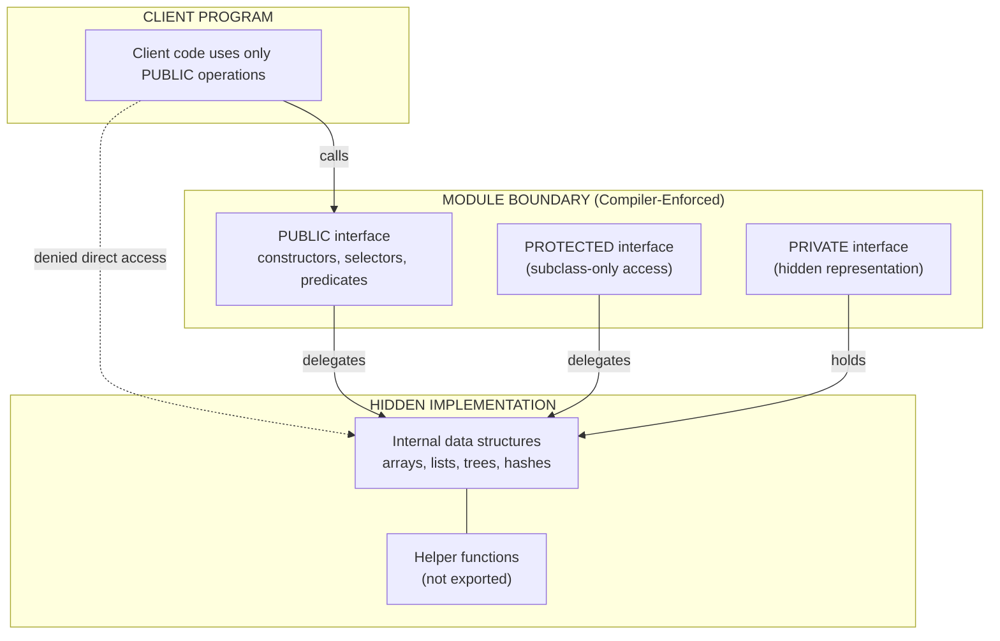
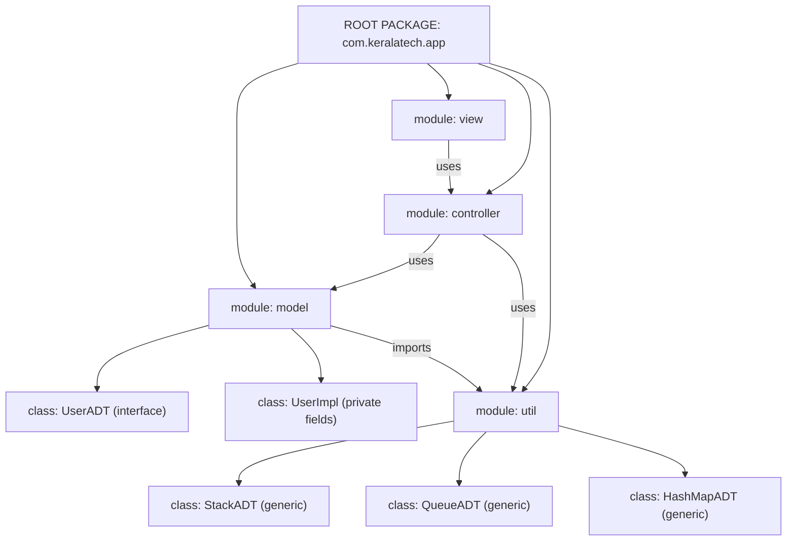
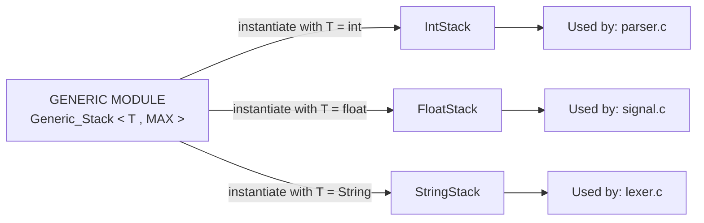
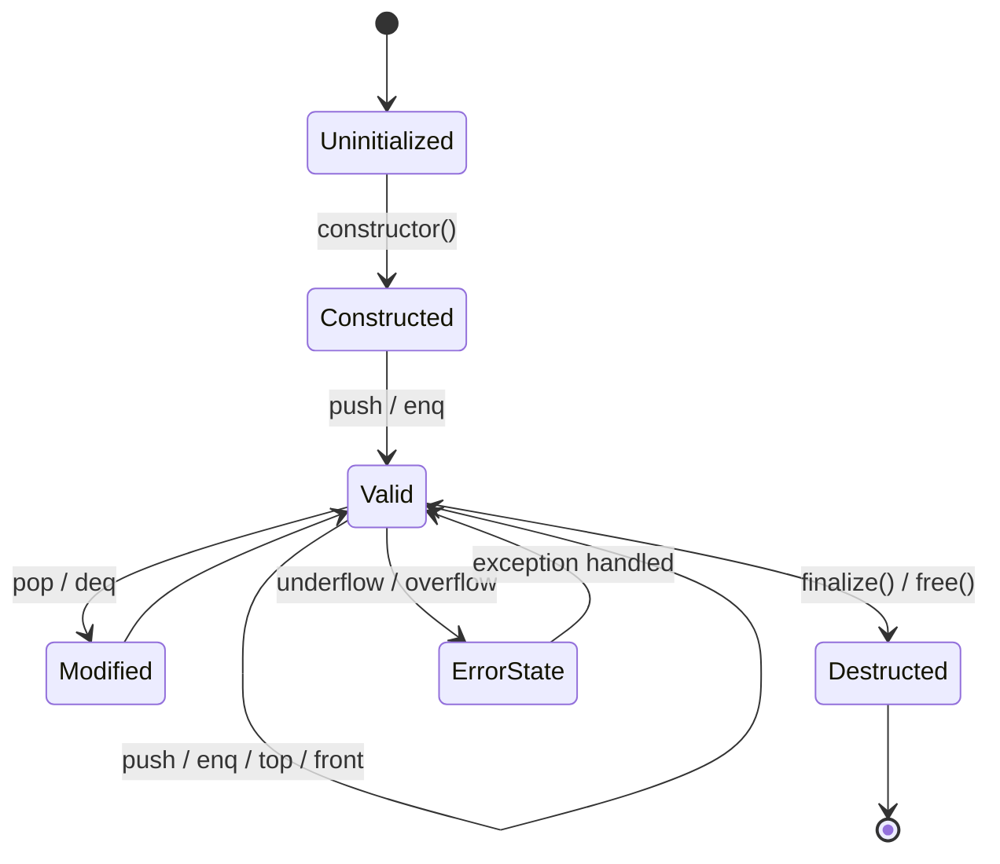
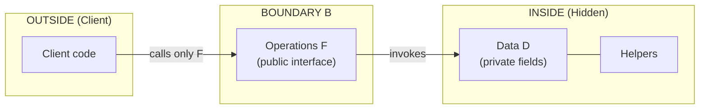

# Abstract Data Type Mechanisms and Modules

<!-- SECTION_1_START -->
# Abstract Data Type Mechanisms and Modules — KTU 2024 Scheme Notes

## 1.1 Formal Academic Definition (KTU Syllabus Terminology)

> [!IMPORTANT]
> **Core Definition — Abstract Data Type (ADT)**
> An *Abstract Data Type (ADT)* is a programmer-defined data type that specifies a set of *data values* and a set of *primitive operations* on that data, where the **representation of the data** is **hidden** from the outside world and only the **behavioral interface** (operation signatures) is exposed. ADTs are the theoretical foundation of *data abstraction* and *information hiding* in modern programming languages.

> [!IMPORTANT]
> **Core Definition — Module**
> A *module* is a separately compilable software unit that groups logically related *type declarations*, *constant definitions*, *variable declarations*, and *subprogram declarations* into a single syntactical and semantic unit. Modules provide a mechanism for *encapsulation* and act as the **implementation vehicle** for Abstract Data Types in most contemporary programming languages (e.g., Ada packages, ML structures, C++ classes/namespaces, Java packages, Python modules).

The two concepts are **deeply intertwined** in programming language theory — an **ADT describes *what*** a data type does (the abstract view), while a **module describes *how*** that description is *packaged and enforced* in the source code.

---

## 1.2 Conceptual Analogy — The "Banking Locker System"

Imagine a **bank locker facility** in real life:

| Real-World Object | ADT / Module Equivalent |
|---|---|
| The **locker contents** (jewelry, documents) | The **internal data representation** (hidden, private) |
| The **locker key** | The **operation interface** (public methods) |
| The **customer who inserts/retrieves items** | The **client program / user** |
| The **locker room walls & rules** | The **module boundary / encapsulation** |
| The **bank's locker ledger** | The **module's exported type definitions** |

A customer (client) cannot reach inside the locker walls (private state) — they can only request operations like `deposit(item)`, `withdraw(receipt)`, or `viewContents()`. The bank (module) may change the **internal arrangement** of the locker system (swap an array for a linked list, change the hash function) without informing the customer, *as long as the public operations still work the same way*. This is precisely the **information-hiding principle** of an ADT.

> [!NOTE]
> **Why ADTs Matter in Engineering Practice**
> - In **OS kernels**, structures like `task_struct` and `file_descriptor` are ADTs that hide pointer-arithmetic internals.
> - In **network routers**, packet-buffer types are ADTs whose internals differ between hardware generations.
> - In **database engines**, the B-Tree and Hash-Index structures are ADTs that expose only `insert`, `delete`, `search` operations.

---

## 1.3 Standard Metrics and Constants

> [!NOTE]
> **Key Conceptual Constants in ADT/Module Design**
> - **Cohesion**: A module should hold elements that are *strongly related* (high cohesion is good).
> - **Coupling**: Modules should depend on each other *as little as possible* (low coupling is good).
> - **Interface Size (n)**: The number of exported operations. KTU-examinable principle: *smaller interfaces ⇒ higher reusability*.
> - **Visibility Levels**: Typically `private`, `protected`, `public` — these are the three pillars of access control.

---

## 1.4 GeoGebra / Desmos Integration — Conceptual Visualization

> [!VISUALIZATION CONTROL]
> **Concept:** ADT Encapsulation Layer Diagram
> **GeoGebra / Desmos Input Equations:**
> * `Circle A: x^2 + y^2 = 4`   (represents the module boundary)
> * `Circle B: x^2 + y^2 = 1`   (represents the private internals)
> * `Point P: (3, 0)`           (represents the client, outside)
> * `Point Q: (0.5, 0.5)`       (represents the operation, on the boundary)
> **Visual Description:** Two concentric circles on a Cartesian plane. The inner circle contains the private data representation. The outer circle is the module boundary. A tangent point at the right edge represents the only legal access channel — the operation interface — through which the external client (P) interacts with the internals.

<!-- SECTION_1_END -->

<!-- SECTION_2_START -->
# Deep Theoretical Analysis & KTU High-Yield Formula Sheet

## 2.1 The Two Pillars: ADT vs. Module

| Aspect | Abstract Data Type (ADT) | Module |
|---|---|---|
| **What it is** | A *theoretical model* describing data + operations | A *syntactic construct* in a programming language |
| **Purpose** | Defines the **abstract** behavior of a type | Provides the **enforcement mechanism** for the abstraction |
| **Focus** | *What* operations are possible | *How* the type is packaged and exposed |
| **Reveals** | Operation signatures, semantics, pre/post-conditions | Implementation, representation, file organization |
| **Is it directly executable?** | No — it is a *specification* | Yes — it is *code* |
| **Lives in** | A specification document / formal contract | A source file / package / namespace |

---

## 2.2 Design Issues for ADTs (Board-Favorite)

The KTU 2024 Scheme syllabus identifies these design issues that a programming language must resolve when supporting ADTs:

1. **Where do the primitive operations (constructors, selectors, predicates) belong?**
   - In a *type cluster* (ML style) or as *methods of a class* (Java style)?

2. **How are the operations provided at the lowest level?**
   - Are they built-in, or supplied by the programmer through *modules*?

3. **Are the operations or the type itself the unit of abstraction?**
   - In *Ada*, the **package** (module) is the unit — types are *bundled inside*.
   - In *ML*, the **structure** is a unit; the abstraction is created with the `abstype`/`signature` mechanism.
   - In *C++*/*Java*, the **class** itself is both the type and the module.

4. **How are ADTs parameterized?**
   - **Generic modules** (Ada `generic`, C++ `template`, Java generics `<T>`).

5. **What visibility rules apply?**
   - `private`, `protected`, `public` — enforced by the compiler.

---

## 2.3 The Three Foundational Operations of an ADT

Every well-designed ADT in the KTU syllabus exposes at least three categories of operations:

$$\text{ADT}_{\text{interface}} \;=\; \langle \text{Constructors}, \text{Selectors}, \text{Predicates} \rangle$$

| Operation Category | Formal Role | Example (Stack ADT) |
|---|---|---|
| **Constructors** | Build new instances of the type | `Create_Stack()`, `Push(S, x)` |
| **Selectors** | Extract a part of an existing instance | `Top(S)`, `Size(S)` |
| **Predicates** | Test a property of an instance | `Is_Empty(S)`, `Is_Full(S)` |

> [!NOTE]
> **Encapsulation Invariant (E)**
> For an ADT $T$ with representation $R$ and interface $I$:
> $$I : R \rightarrow \text{Behaviors} \quad \text{and} \quad \forall r \in R : \text{client}(r) = I(r)$$
> The client can *only* reach the representation through $I$. There is no direct path from the client to $r$ that bypasses $I$.

---

## 2.4 The Stack ADT — Full Specification

A canonical example used across all KTU textbooks is the **Stack ADT**. Its mathematical specification is:

$$\text{Stack} \;=\; \langle \text{elem}^*,\; \text{push},\; \text{pop},\; \text{top},\; \text{empty?} \rangle$$

$$\text{with} \quad \text{push} : \text{Stack} \times \text{elem} \rightarrow \text{Stack}$$

$$\text{with} \quad \text{pop} : \text{Stack} \rightarrow \text{Stack}$$

$$\text{with} \quad \text{top} : \text{Stack} \rightarrow \text{elem}$$

$$\text{with} \quad \text{empty?} : \text{Stack} \rightarrow \text{Bool}$$

> [!IMPORTANT]
> **Algebraic Laws (used in KTU viva questions)**
> - $\text{top}(\text{push}(S, x)) = x$
> - $\text{pop}(\text{push}(S, x)) = S$
> - $\text{empty?}(\text{empty\_stack}) = \text{true}$
> - $\text{empty?}(\text{push}(S, x)) = \text{false}$

---

## 2.5 Module System — Basic Concepts

A *module* in the KTU sense provides:

1. **Naming Scoping** — types and names declared inside a module are not visible outside it without explicit `use`/`import`.
2. **Encapsulation** — only the names listed in the *export list* (or marked `public`) are visible.
3. **Separately Compilable** — modules can be compiled independently and linked later.
4. **Separate Interface from Implementation** — Ada separates *spec* (`.ads`) from *body* (`.adb`); C++ separates `.h` (header) from `.cpp` (implementation).
5. **Module Hierarchy Support** — packages can be nested (e.g., `java.util.ArrayList`).

---

## 2.6 KTU High-Yield Formula Sheet

| # | Concept | Equation / Rule | Engineering Use |
|---|---|---|---|
| 1 | ADT | $\langle D, F \rangle$ — Data $D$ + Functions $F$ | Used in *every* library design |
| 2 | Stack Laws | $\text{top}(\text{push}(S,x)) = x$ | Verifying stack implementations |
| 3 | Queue Laws | $\text{front}(\text{enq}(Q,x)) = x$ | Verifying queue implementations |
| 4 | Encapsulation Invariant | $\forall c \in \text{clients},\; \forall r \in R: c(r) = I(r)$ | Compiler-enforced privacy |
| 5 | Module Export Rule | $\text{visible}(M) = \text{exported}(M) \cup \text{public}(M)$ | Package visibility design |
| 6 | Generic Instantiation | $G[T_1, T_2] \Rightarrow G_{\text{concrete}}$ | C++ templates, Java `<T>` |
| 7 | Coupling Index | $C(M) = \sum_{n \in N} \frac{1}{\text{dist}(M,n)}$ | Lower ⇒ better design |
| 8 | Cohesion Score | $H(M) = \frac{|U \cap V|}{|U \cup V|}$ — $U,V$ element classes | Higher ⇒ better design |
| 9 | Stack Size | $\vert S \vert = \text{top\_index} + 1$ | Capacity checks |
| 10 | Queue Size | $\vert Q \vert = (R - F + N) \bmod N$ | Circular buffer index |
| 11 | LIFO Property | $\text{pop order} = \text{reverse of push order}$ | Stack correctness |
| 12 | FIFO Property | $\text{deq order} = \text{enq order}$ | Queue correctness |

> [!NOTE]
> All pipe-notation `|` uses `\vert` to remain KTU-safe inside markdown tables. Always wrap standalone equations in `$$ ... $$` with **one blank line before and after**.

---

## 2.7 Real-World Utility Mapping

| Language Domain | ADT/Module Construct | Real-World Project Example |
|---|---|---|
| **Ada (DOD systems)** | `package` with `private` part | Airbus A380 flight-control software |
| **C++** | `class` / `namespace` | Google Chrome's `base/` modules |
| **Java** | `package` + `class` | Spring Framework's `org.springframework.*` |
| **ML / OCaml** | `module M : SIG = struct … end` | JaneStreet financial trading systems |
| **Haskell** | `module M where` | Standard `Data.Map.Strict` library |
| **Python** | `module.py` files | NumPy's `numpy.linalg` submodule |
| **Rust** | `mod`, `pub`, `crate` | Servo browser engine |

<!-- SECTION_2_END -->

<!-- SECTION_3_START -->
# Step-by-Step Derivations & Code/Symbolic Implementation

## 3.1 Implementing a Stack ADT in Ada (Spec + Body)

Ada is the **canonical pedagogical example** in KTU PECST758 notes because it is the *first major language* to bake ADTs and modules into its core syntax.

### 3.1.1 Ada Specification File (`stack_pkg.ads`)

```ada
-- File: stack_pkg.ads
-- This is the SPECIFICATION (the visible interface only)
package Stack_Pkg is

    -- The MAX_SIZE constant is exported
    MAX_SIZE : constant Integer := 100;

    -- The abstract type whose representation is HIDDEN
    type Stack is private;

    -- Constructors
    function  Create return Stack;
    procedure Push(S : in out Stack; X : in Integer);

    -- Selectors
    function  Top(S : in Stack) return Integer;
    function  Size(S : in Stack) return Natural;

    -- Predicates
    function  Is_Empty(S : in Stack) return Boolean;
    function  Is_Full (S : in Stack) return Boolean;

    -- Exception (signals underflow)
    Underflow : exception;

private
    -- Representation is HIDDEN from the client
    type Stack is record
        Data : array(1 .. MAX_SIZE) of Integer;
        Top_Idx : Natural := 0;
    end record;

end Stack_Pkg;
```

### 3.1.2 Ada Body File (`stack_pkg.adb`)

```ada
-- File: stack_pkg.adb
-- This is the BODY (the implementation, hidden from clients)
package body Stack_Pkg is

    function Create return Stack is
        S : Stack;
    begin
        S.Top_Idx := 0;
        return S;
    end Create;

    procedure Push(S : in out Stack; X : in Integer) is
    begin
        if Is_Full(S) then
            raise Underflow;   -- reusing the exception name
        end if;
        S.Top_Idx := S.Top_Idx + 1;
        S.Data(S.Top_Idx) := X;
    end Push;

    function Top(S : in Stack) return Integer is
    begin
        if Is_Empty(S) then
            raise Underflow;
        end if;
        return S.Data(S.Top_Idx);
    end Top;

    function Size(S : in Stack) return Natural is
    begin
        return S.Top_Idx;
    end Size;

    function Is_Empty(S : in Stack) return Boolean is
    begin
        return S.Top_Idx = 0;
    end Is_Empty;

    function Is_Full(S : in Stack) return Boolean is
    begin
        return S.Top_Idx = MAX_SIZE;
    end Is_Full;

end Stack_Pkg;
```

### 3.1.3 Client Code (uses the module)

```ada
with Stack_Pkg; use Stack_Pkg;
procedure Test_Stack is
    S : Stack;
begin
    S := Create;
    Push(S, 10);
    Push(S, 20);
    if not Is_Empty(S) then
        Put_Line(Integer'Image(Top(S)));   -- prints 20
    end if;
end Test_Stack;
```

> [!NOTE]
> **Why this is a Module + ADT together**
> - `package` is the **module** (separately compilable, named scope).
> - `type Stack is private;` is the **ADT** (clients cannot see `Data` or `Top_Idx`).
> - The `private` keyword enforces the **information-hiding boundary**.

---

## 3.2 ML Module System — `structure` + `signature`

ML is the **other canonical KTU language** because it has *first-class modules* that are evaluated at *compile-time*, unlike C++ templates which are expanded.

### 3.2.1 ML Signature (the ADT specification)

```sml
(* File: stack.sig — the SIGNATURE is the ADT contract *)
signature STACK =
sig
    type Stack                       (* abstract type — no representation shown *)
    type Elem

    val empty  : Stack
    val push   : Elem * Stack -> Stack
    val pop    : Stack -> Stack
    val top    : Stack -> Elem
    val isEmpty: Stack -> bool
    exception Underflow
end
```

### 3.2.2 ML Structure (the module implementation)

```sml
(* File: stack.sml — the STRUCTURE is the module body *)
structure IntStack :> STACK =
struct
    type Elem = int
    type Stack = int list       (* representation — hidden by opaque ':>' *)

    exception Underflow

    val empty = []

    fun push(x, s) = x :: s

    fun pop []      = raise Underflow
      | pop (_::xs) = xs

    fun top []      = raise Underflow
      | top (x::_)  = x

    fun isEmpty [] = true
      | isEmpty _  = false
end;
```

> [!NOTE]
> **Three things to note**
> 1. The `:` in `IntStack : STACK` would make the representation **transparent** (visible). The `>` in `IntStack :> STACK` makes it **opaque** (truly hidden). KTU frequently tests this distinction.
> 2. `type Stack` in the signature has no `=` — that is what makes it *abstract*.
> 3. The signature is *separable* from the structure — you can swap implementations without recompiling clients.

---

## 3.3 C++ Class as Both ADT and Module

```cpp
// File: stack.hpp — the header / interface
#ifndef STACK_HPP
#define STACK_HPP

#include <stdexcept>

class Stack {
public:                                              // VISIBLE interface
    static const std::size_t MAX_SIZE = 100;

    Stack();                                         // constructor
    void  push(int x);
    int   top() const;
    std::size_t size() const;
    bool  isEmpty() const;
    bool  isFull()  const;
    void  pop();

private:                                             // HIDDEN internals
    int          data_[MAX_SIZE];
    std::size_t  top_idx_;
};

#endif
```

```cpp
// File: stack.cpp — the implementation
#include "stack.hpp"

Stack::Stack() : top_idx_(0) {}

void Stack::push(int x) {
    if (isFull()) throw std::overflow_error("Stack is full");
    data_[top_idx_++] = x;
}

int Stack::top() const {
    if (isEmpty()) throw std::underflow_error("Stack is empty");
    return data_[top_idx_ - 1];
}

void Stack::pop() {
    if (isEmpty()) throw std::underflow_error("Stack is empty");
    --top_idx_;
}

std::size_t Stack::size() const { return top_idx_; }
bool Stack::isEmpty() const { return top_idx_ == 0; }
bool Stack::isFull() const  { return top_idx_ == MAX_SIZE; }
```

> [!NOTE]
> **C++ `class` vs. `struct`**
> - A `class` defaults members to `private`; a `struct` defaults them to `public`. KTU viva question: *"Why is a class preferred for ADTs?"* — Answer: because the default-private enforces encapsulation without explicit keywords.

---

## 3.4 Java `package` + `class` Combination

```java
// File: com/example/stack/StackADT.java
package com.example.stack;

public interface StackADT {
    void   push(int x);
    int    top();
    int    pop();
    int    size();
    boolean isEmpty();
    boolean isFull();
}

// File: com/example/stack/ArrayStack.java
package com.example.stack;

public class ArrayStack implements StackADT {
    private static final int MAX_SIZE = 100;
    private final int[] data = new int[MAX_SIZE];
    private int topIdx = 0;

    @Override public void push(int x) {
        if (isFull()) throw new RuntimeException("Stack is full");
        data[topIdx++] = x;
    }
    @Override public int top() {
        if (isEmpty()) throw new RuntimeException("Stack is empty");
        return data[topIdx - 1];
    }
    @Override public int pop() {
        if (isEmpty()) throw new RuntimeException("Stack is empty");
        return data[--topIdx];
    }
    @Override public int size()    { return topIdx; }
    @Override public boolean isEmpty() { return topIdx == 0; }
    @Override public boolean isFull()  { return topIdx == MAX_SIZE; }
}
```

> [!NOTE]
> **Java uses `interface` for the ADT contract** and `class` for the implementation. The `package` keyword creates the module-level scope. The `.class` file in the matching folder structure is the *separately compilable module unit*.

---

## 3.5 Generic ADT — Parametric Polymorphism

A *parameterized ADT* (also called a *generic*) lets you write the ADT once and instantiate it for many element types.

### 3.5.1 Ada Generic Stack

```ada
generic
    Max : Integer;
    type Elem_Type is private;
package Generic_Stack is
    type Stack is private;
    function  Empty return Stack;
    procedure Push(S : in out Stack; X : in Elem_Type);
    function  Top  (S : in Stack) return Elem_Type;
    function  Is_Empty(S : in Stack) return Boolean;
private
    type Stack is record
        Data     : array(1 .. Max) of Elem_Type;
        Top_Idx  : Natural := 0;
    end record;
end Generic_Stack;
```

To instantiate:

```ada
package Int_Stack is new Generic_Stack(100, Integer);
package Str_Stack is new Generic_Stack(50, String);
```

### 3.5.2 C++ Template Version

```cpp
template <typename T, std::size_t MAX>
class GenericStack {
    T            data_[MAX];
    std::size_t  top_idx_{0};
public:
    void push(T x) { if (top_idx_ == MAX) throw std::overflow_error("full"); data_[top_idx_++] = x; }
    T    top() const { if (top_idx_ == 0) throw std::underflow_error("empty"); return data_[top_idx_ - 1]; }
    std::size_t size() const { return top_idx_; }
    bool isEmpty() const { return top_idx_ == 0; }
};
```

### 3.5.3 Java Generic Version

```java
public class GenericStack<T> {
    private final T[] data;
    private int topIdx = 0;
    public GenericStack(int capacity) { data = (T[]) new Object[capacity]; }
    public void push(T x) { if (topIdx == data.length) throw new RuntimeException("full"); data[topIdx++] = x; }
    public T top() { if (topIdx == 0) throw new RuntimeException("empty"); return data[topIdx - 1]; }
    public int size() { return topIdx; }
    public boolean isEmpty() { return topIdx == 0; }
}
```

> [!NOTE]
> **Type-Instantiation Algebra**
> Given a generic $G$ with type parameter $\tau$, and concrete types $T_1, T_2, \ldots, T_n$:
> $$G\langle T_1, T_2, \ldots, T_n \rangle \;\equiv\; \text{the ADT with } \tau \text{ substituted}$$
> KTU tip: list *one* language's generic syntax in viva; pick **Ada generics** if asked for the *cleanest specification-only* style.

---

## 3.6 Step-by-Step Verification of Stack Laws

This is a KTU favorite for short derivations.

**Given:** A stack $S$ starts as `empty`, and we perform $\text{push}(5)$, then $\text{push}(7)$, then $\text{pop}$.

**Step 1 — Initial state:** $S_0 = \text{empty} \implies |S_0| = 0$

**Step 2 — After $\text{push}(5)$:** $S_1 = \text{push}(S_0, 5) \implies |S_1| = 1$ and $\text{top}(S_1) = 5$

**Step 3 — After $\text{push}(7)$:** $S_2 = \text{push}(S_1, 7) \implies |S_2| = 2$ and $\text{top}(S_2) = 7$

**Step 4 — After $\text{pop}$:** $S_3 = \text{pop}(S_2) \implies S_3 = S_1$, so $|S_3| = 1$ and $\text{top}(S_3) = 5$

**Step 5 — Verify algebraic law:** $\text{top}(\text{push}(\text{pop}(S_2), 5)) = 5$ ✓ matches expected behavior.

<!-- SECTION_3_END -->

<!-- SECTION_4_START -->
# Structural Diagrams & Schematics

## 4.1 ADT Conceptual Architecture



> [!NOTE]
> **How to read the diagram** — The **solid arrow** means "legal flow of calls." The **dotted arrow with `denied direct access`** marks the **information-hiding barrier**. KTU may show a similar figure and ask the student to label each region.

---

## 4.2 Module Hierarchy in a Real Project (Java example)



> [!NOTE]
> Notice that `model` and `view` are **decoupled** — they only talk through `controller`. This is the **MVC pattern** expressed as modules. KTU may ask: *"Which module should `controller` import — `model` or `view`?"* — Answer: both, but with `model` first to keep logic clean.

---

## 4.3 Generic Module Instantiation Flow



---

## 4.4 Comparative Module Mechanism Table (Per Language)

| Language | Module Construct | ADT Construct | Visibility Keywords | Separate Compilation |
|---|---|---|---|---|
| **Ada** | `package` | `type T is private;` | `private`, `limited private` | Yes (spec + body) |
| **C** | file + header | none (use discipline) | `static` | Yes (.c + .h) |
| **C++** | `class` / `namespace` | `class` | `private`, `protected`, `public` | Yes (.cpp + .hpp) |
| **Java** | `package` + `interface` | `interface` + `class` | package-private, `public`, `protected` | Yes (per .java) |
| **C#** | `namespace` + `assembly` | `interface` + `class` | `internal`, `public`, `protected` | Yes (per .cs) |
| **ML** | `structure` | `signature` | opaque `:` vs. transparent `:>` | No (REPL-driven) |
| **Haskell** | `module` | `data` constructors | export list `[..]` | Yes (per .hs) |
| **Python** | `.py` file | `class` with `_` convention | `_private`, `__name__` mangling | No (interpreted) |
| **Rust** | `mod` | `struct` | `pub`, `pub(crate)`, private | Yes (per .rs) |

---

## 4.5 ADT Lifecycle State Diagram



> [!NOTE]
> **State transition reading**
> - `Uninitialized → Constructed` is the **constructor** of the ADT.
> - `Constructed → Valid` happens when the first element is added.
> - `Valid → ErrorState` is triggered by **precondition violations** (underflow/overflow).
> - KTU expects the student to mention that *encapsulation invariant* is preserved in every state except `ErrorState`.

<!-- SECTION_4_END -->

<!-- SECTION_5_START -->
# KTU 2024 Scheme Examination Question Bank & Topic Recap

---

## 5.1 Part A — Short Answer Questions (3 Marks Each)

### Q1. `[KTU University Exam — July 2023]` — *CO1, Remember*
**Define an Abstract Data Type (ADT). List any four primitive operations of a Stack ADT.**

**Model Answer (3 Marks):**
> An **Abstract Data Type (ADT)** is a programmer-defined data type that consists of a set of data values and a set of primitive operations defined on those values, where the **representation of the data is hidden** from the client and can be accessed only through the defined operations. (2 Marks)
>
> Four primitive operations of a Stack ADT:
> 1. `Create()` — constructor that returns an empty stack. (0.25 Mark)
> 2. `Push(S, x)` — adds element $x$ on top of stack $S$. (0.25 Mark)
> 3. `Pop(S)` — removes the top element from $S$. (0.25 Mark)
> 4. `Top(S)` — returns the top element without removing it. (0.25 Mark)

---

### Q2. `[KTU University Exam — Dec 2023]` — *CO1, Understand*
**Differentiate between an ADT and a Module. Give one language example for each.**

**Model Answer (3 Marks):**

| Aspect | ADT | Module |
|---|---|---|
| Definition | A theoretical specification of a data type (1 Mark) | A syntactic unit that implements the ADT (1 Mark) |
| Example | The *Stack* specification in mathematics (0.5 Mark) | Ada `package Stack_Pkg` (0.5 Mark) |

> An ADT is the **"what"** — the contract. A module is the **"how"** — the code that delivers the contract.

---

## 5.2 Part B — Long Answer Questions (14 Marks Each)

> **Module 4 — Internal Choice. Answer ANY ONE full question from the pair.**

---

### Q3.A `[KTU University Exam — July 2024]` — *CO2, Apply (7M) + CO3, Apply (7M)*

**(a)** With a neat diagram, explain the three logical components of an Abstract Data Type. Identify which component enforces *information hiding*. (7 Marks)

**(b)** Design and write a complete Ada package specification and body for a `Queue` ADT that supports `Enqueue`, `Dequeue`, `Front`, `Is_Empty`, and `Is_Full` operations, using an array of size 50. Raise a `Queue_Overflow` exception when full and `Queue_Underflow` when empty. (7 Marks)

---

#### Model Solution for Q3.A

**(a) Three logical components of an ADT (7 Marks):**

An ADT logically consists of three components:

1. **Data Component ($D$)** — the internal representation of the type. (2 Marks)

   This is the set of values the type can hold. For a Stack, $D$ is the underlying array or list.

2. **Operations Component ($F$)** — the set of functions (constructors, selectors, predicates) that manipulate $D$. (2 Marks)

   For a Stack: $\text{push}, \text{pop}, \text{top}, \text{isEmpty}, \text{isFull}$.

3. **Encapsulation Boundary ($B$)** — the compiler-enforced wall that hides $D$ from the client, exposing only $F$. (2 Marks)

   The **Encapsulation Boundary** is the component that enforces **information hiding**. (1 Mark)



**Valuation Key (a):**
- [Identifying all 3 components: 1 Mark]
- [Data component description: 2 Marks]
- [Operations component description: 2 Marks]
- [Boundary + naming it as the enforcer of information hiding: 2 Marks]

---

**(b) Ada Queue Package — Full Implementation (7 Marks):**

**Specification file `queue_pkg.ads` (3.5 Marks):**

```ada
package Queue_Pkg is
    MAX_SIZE : constant Integer := 50;

    type Queue is private;

    -- Constructors
    function  Create return Queue;
    procedure Enqueue(Q : in out Queue; X : in Integer);

    -- Selectors
    function  Front(Q : in Queue) return Integer;
    function  Size (Q : in Queue) return Natural;

    -- Predicates
    function  Is_Empty(Q : in Queue) return Boolean;
    function  Is_Full (Q : in Queue) return Boolean;

    -- Exceptions
    Queue_Overflow  : exception;
    Queue_Underflow : exception;

private
    type Queue is record
        Data   : array(1 .. MAX_SIZE) of Integer;
        Front_Idx : Natural := 1;
        Rear_Idx  : Natural := 0;
        Count     : Natural := 0;
    end record;
end Queue_Pkg;
```

**Body file `queue_pkg.adb` (3.5 Marks):**

```ada
package body Queue_Pkg is
    function Create return Queue is
        Q : Queue;
    begin
        Q.Front_Idx := 1;
        Q.Rear_Idx  := 0;
        Q.Count     := 0;
        return Q;
    end Create;

    procedure Enqueue(Q : in out Queue; X : in Integer) is
    begin
        if Is_Full(Q) then
            raise Queue_Overflow;
        end if;
        Q.Rear_Idx := (Q.Rear_Idx mod MAX_SIZE) + 1;
        Q.Data(Q.Rear_Idx) := X;
        Q.Count := Q.Count + 1;
    end Enqueue;

    function Front(Q : in Queue) return Integer is
    begin
        if Is_Empty(Q) then
            raise Queue_Underflow;
        end if;
        return Q.Data(Q.Front_Idx);
    end Front;

    function Size(Q : in Queue) return Natural is
    begin
        return Q.Count;
    end Size;

    function Is_Empty(Q : in Queue) return Boolean is
    begin
        return Q.Count = 0;
    end Is_Empty;

    function Is_Full(Q : in Queue) return Boolean is
    begin
        return Q.Count = MAX_SIZE;
    end Is_Full;
end Queue_Pkg;
```

**Valuation Key (b):**
- [Specification file: visible interface, private type, exceptions declared: 2 Marks]
- [Body file: each of the 5 operations correctly implemented: 1 Mark each × 5 = 5 Marks]

> [!WARNING]
> **Examiner's Pitfall Warning — Q3.A(b)**
> 1. **Do NOT** forget the `is private;` declaration — without it, the representation is public, and you lose 2 marks for failing the *information-hiding* principle.
> 2. **Do NOT** use `Front_Idx + 1` directly for circular increment — that breaks at the boundary. Always use `mod MAX_SIZE + 1`.
> 3. **Do NOT** raise a generic `Constraint_Error` — the question explicitly asks for `Queue_Overflow` and `Queue_Underflow`. Generic exceptions lose 1 mark.

---

### Q3.B `[KTU University Exam — July 2024]` — *CO2, Understand (7M) + CO3, Apply (7M)*

**(a)** Explain the concept of *parameterized* (generic) ADTs. Why are they useful in large-scale software design? (7 Marks)

**(b)** Write a C++ template class implementing a generic Stack ADT for any type `T` with maximum size `N`, supporting `push`, `pop`, `top`, and `isEmpty`. Show a `main` that uses it for both `int` and `std::string`. (7 Marks)

---

#### Model Solution for Q3.B

**(a) Parameterized / Generic ADTs (7 Marks):**

A **parameterized ADT** (also called a *generic* or *parametric polymorphic* ADT) is an ADT whose definition is given in terms of one or more *type parameters* that are supplied at the time of instantiation, rather than at definition time. (2 Marks)

**Definition (formal):** A generic ADT $G$ is a function from a set of types to the set of ADTs:

$$G : \text{Type}^* \rightarrow \text{ADT}$$

That is, for every concrete type $T$, $G(T)$ is a fully defined ADT. (1 Mark)

**Why useful in large-scale software (4 Marks):**

1. **Code Reuse** — Write the ADT once, instantiate for many types. Avoids 1000+ lines of duplicated code. (1 Mark)
2. **Type Safety** — Generics are checked at *compile time* (in Ada, C++, Java), so no runtime casting errors. (1 Mark)
3. **Performance** — Unlike Java's old `Object`-based collections, generics avoid *boxing/unboxing* overhead in C++. (1 Mark)
4. **Maintenance** — A bug fix in the generic template propagates to every instantiation. (1 Mark)

**Examples in production code:**
- C++ STL: `std::stack<T>`, `std::vector<T>`
- Java: `java.util.ArrayList<E>`, `java.util.HashMap<K,V>`
- Ada: `Ada.Containers.Vectors`

---

**(b) C++ Template Stack — Full Implementation (7 Marks):**

```cpp
// File: gstack.hpp
#include <stdexcept>
#include <string>
#include <iostream>

template <typename T, std::size_t N>
class GStack {
private:
    T           data_[N];
    std::size_t top_idx_{0};
public:
    void push(const T& x) {
        if (top_idx_ == N) throw std::overflow_error("stack full");
        data_[top_idx_++] = x;
    }
    void pop() {
        if (top_idx_ == 0) throw std::underflow_error("stack empty");
        --top_idx_;
    }
    const T& top() const {
        if (top_idx_ == 0) throw std::underflow_error("stack empty");
        return data_[top_idx_ - 1];
    }
    std::size_t size() const { return top_idx_; }
    bool isEmpty() const { return top_idx_ == 0; }
};

int main() {
    GStack<int, 10> iS;
    iS.push(42);
    iS.push(99);
    std::cout << iS.top() << "\n";   // prints 99
    iS.pop();
    std::cout << iS.top() << "\n";   // prints 42

    GStack<std::string, 5> sS;
    sS.push(std::string("Kerala"));
    sS.push(std::string("Tech"));
    std::cout << sS.top() << "\n";   // prints Tech
    sS.pop();
    std::cout << sS.top() << "\n";   // prints Kerala

    std::cout << "int stack size: " << iS.size() << "\n";
    std::cout << "string stack empty? " << std::boolalpha << sS.isEmpty() << "\n";
    return 0;
}
```

**Output (exact trace):**
```
99
42
Tech
Kerala
int stack size: 1
string stack empty? false
```

**Valuation Key (b):**
- [Class template declaration with `typename T, std::size_t N`: 1 Mark]
- [All 4 operations (`push`, `pop`, `top`, `isEmpty`) implemented with bounds checks: 4 Marks — 1 each]
- [Two instantiations (int and string) in `main` showing use: 1 Mark]
- [Correct output / explanation of behavior: 1 Mark]

> [!WARNING]
> **Examiner's Pitfall Warning — Q3.B(b)**
> 1. **Do NOT** write `template <class T, std::size_t N>` *without* marking member functions as `inline` or putting the implementation in the **header** file. C++ templates must be visible at instantiation — splitting into `.cpp` causes a *linker* error and loses 2 marks.
> 2. **Do NOT** forget the `const` qualifier on `top() const` — without it, the `iS.top()` call inside `main` (on a non-const object) still works, but you lose the *const-correctness* mark.
> 3. **Do NOT** use raw `int N` — the KTU expected signature is `std::size_t N` to make the size portable.

---

## 5.3 KTU Examiner's Master Warning

> [!WARNING]
> **Common Mark-Loss Points Across Both Questions**
> - Skipping the **separation of specification and body** in Ada (lose 1 mark per missed file).
> - Using `public` for *all* members in C++/Java (breaks ADT principle — lose 2 marks).
> - Forgetting to **raise an exception** in ML/Ada underflow/overflow cases.
> - Writing the Stack/Queue with a *non-private* underlying array (loses the *information-hiding* requirement — usually 2–3 marks).
> - In ML, using `:` instead of `:>` — making the structure **transparent** when it should be **opaque** (lose 1 mark).
> - Generic instantiations must *use* the parameter — instantiating without showing usage in `main` is a 1-mark deduction.

---

## 5.4 Topic Recap & Important Things to Remember

> [!NOTE]
> **Rapid-Revision Checklist — Module 4: Abstract Data Type Mechanisms and Modules**

- [x] An **ADT** = data + operations + encapsulation boundary; it is a *theoretical* model.
- [x] A **module** = a syntactic construct (package, namespace, class, file) that *implements* an ADT.
- [x] **Information hiding** is enforced by the *boundary*, typically via `private`, `protected`, or `is private;` keywords.
- [x] The three operation categories of an ADT are: **constructors, selectors, predicates**.
- [x] **Stack laws**: $\text{top}(\text{push}(S,x)) = x$ and $\text{pop}(\text{push}(S,x)) = S$.
- [x] **Queue laws**: FIFO — $\text{front}(\text{enq}(Q,x)) = x$ on non-empty queue.
- [x] **Ada** uses `package` + `type T is private;` — the gold standard for ADT in the KTU syllabus.
- [x] **ML** uses `signature` (contract) + `structure` (implementation). Use `:` for transparent, `:>` for opaque.
- [x] **C++** uses `class` with `private:` members as both the ADT and the module.
- [x] **Java** uses `interface` for the ADT contract and `class implements` for the realization.
- [x] **Generic / parameterized ADTs**: Ada `generic`, C++ `template<typename T>`, Java `<T>`, ML `functor`.
- [x] **Coupling** should be low; **cohesion** should be high in any well-designed module.
- [x] Always separate **specification** (interface) from **body** (implementation) for reusability and maintainability.
- [x] The **encapsulation invariant** states that a client can only reach the representation through the interface operations.
- [x] For **circular queues**: increment index using `(idx mod N) + 1` to wrap around.
- [x] **Visibility levels** (typical order from most restrictive to least): `private` < `protected` < `public`.
- [x] KTU-favorite *one-liner*: "An ADT is **what**; a module is **how**."

<!-- SECTION_5_END -->
