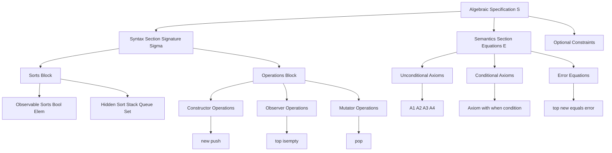
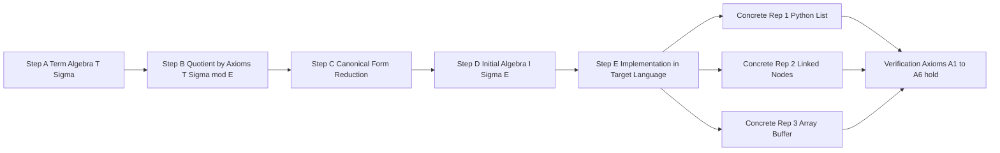
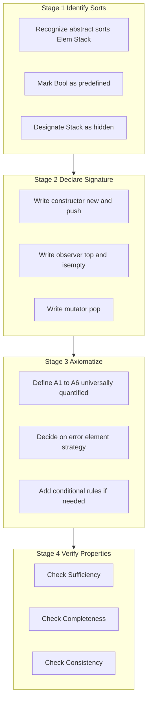
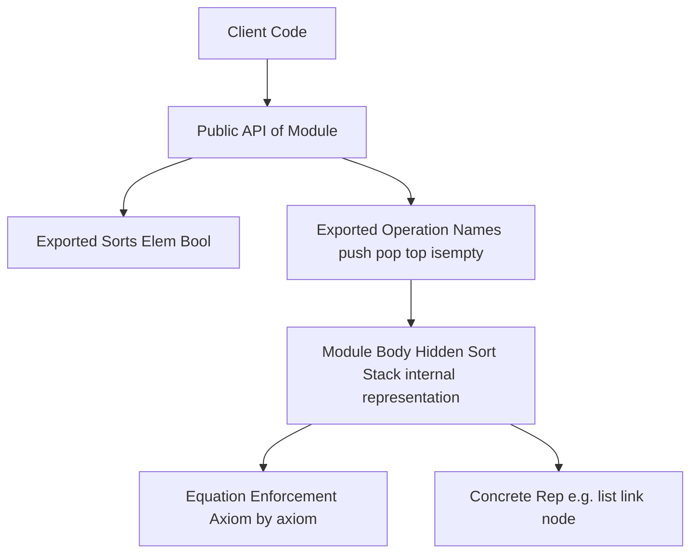

# Abstract Data Types and Modules-  The Algebraic Specification of Abstract Data Types

<!-- SECTION_1_START -->
# Abstract Data Types and Modules — Algebraic Specification of Abstract Data Types

## 1. Core Technical Definition & Intuitive Overview

### 1.1 Formal Definition (KTU 2024 Syllabus Terminology)

An **Abstract Data Type (ADT)** is a mathematical model for data structures where a data type is defined *behaviorally* by its **semantics** (set of values, set of operations, and the laws governing those operations) rather than by its concrete representation in memory. It is "abstract" because the implementation details are deliberately hidden from the client/user.

An **Algebraic Specification** (also called *axiomatic specification* or *algebraic semantics*) is a formal technique for precisely defining an ADT using:

- A **Syntax Section** — declares the *sorts* (data domains) and the *operations* (signatures) over them.
- An **Equations Section** — a finite set of universally quantified equations (axioms) that describe the observable behavior of every operation.

> [!IMPORTANT]
> **KTU 2024 Highlight:** Algebraic specification belongs to the family of *constructive* or *model-theoretic* formal methods, popularized by Goguen, Thatcher, and Guttag in the 1970s. It is the theoretical backbone behind modules in **Eiffel**, **Ada**, and generic packages of **ML/Haskell**.

### 1.2 Conceptual Analogy / Intuition

> [!NOTE]
> **Real-World Analogy — The Vending Machine (as an ADT)**
> 
> Consider a coffee vending machine. From the *user's* perspective, you only care about:
> - **Operations you can do:** `insertCoin()`, `pressButton(Latte)`, `dispense()`, `getBalance()`.
> - **Rules (Axioms):** If you press a button *without* inserting a coin, the machine *must* return an error — not silently dispense a coffee. If you insert a coin and then press a button, you get a drink and your balance becomes zero.
> 
> You **do not** care *how* the machine internally stores the coin count — is it a counter? A float? A bill validator? That's an implementation detail. The *algebraic specification* is the *user manual* that precisely captures the contract.
> 
> **Mathematical Intuition:** Just as a group $(G, \cdot)$ is defined by a single operation $\cdot$ and four axioms (closure, associativity, identity, inverse), an ADT is defined by a *signature* (operations) and a *finite set of equations* (axioms). The ADT is the *quotient algebra* of all terms modulo the equations — i.e., two expressions are "equal" iff the axioms force them to be.

### 1.3 Key Terminology Glossary

| Term | Meaning |
| :--- | :--- |
| **Sort** | A named set of values (the "type domain"), e.g., `Stack`, `Element`, `Bool`. |
| **Signature $\Sigma$** | The collection of sort names and operation names with their arities. |
| **Operation Symbol** | A formal name for a function/constructor, e.g., `push : Stack × Elem → Stack`. |
| **Axiom / Equation** | An identity of the form $t_1 = t_2$ that must hold for all inputs. |
| **Term Algebra** | The syntactic universe of all well-formed expressions built from operation symbols. |
| **Quotient Algebra** | The term algebra modulo the congruence induced by the axioms. |
| **Constructor** | An operation that *creates* a new value (e.g., `push`, `new`). |
| **Observer / Inspector** | An operation that *examines* a value without modifying it (e.g., `top`, `isempty`). |
| **Mutator** | An operation that *transforms* a value into a structurally different one (e.g., `pop`). |
| **Hidden Sort** | A sort whose internal representation is *not exported* to the client. |

### 1.4 Visualization Callout (Conceptual)

> [!VISUALIZATION CONTROL]
> **Concept:** Lattice of terms modulo axioms for a Boolean ADT.
> 
> **GeoGebra / Desmos Input Equations:**
> 
> * Plot the equivalence classes: $T = \{\text{true}, \text{false}, \text{not}(\text{true}), \text{not}(\text{false}), \text{and}(\text{true},\text{false}), \dots\}$
> * Define the reduction map $R: T \to \{\text{True}, \text{False}\}$ via axioms $\text{not}(\text{not}(x)) = x$ and $x \text{ and } y = y \text{ and } x$.
> * Sketch two connected nodes: a top node labeled "True class" and a bottom node labeled "False class", with edges denoting the reduction $R$.
> 
> **Visual Description:** The student should observe that an infinite term tree collapses to a *two-node* quotient — exactly the Boolean ADT. This is the essence of algebraic specification: an infinite syntax compresses to a finite semantics.

### 1.5 Why Algebraic Specification? (Motivation)

> [!IMPORTANT]
> **Engineering Motivation**
> 
> 1. **Precise contracts** between modules — no ambiguity in the API.
> 2. **Implementation independence** — many concrete representations can satisfy one specification.
> 3. **Proofs of correctness** — properties (e.g., LIFO of stack) can be *proved* from axioms.
> 4. **Formal verification** — usable with theorem provers (Coq, Isabelle, ACL2).
> 5. **Refactoring safety** — clients can be recompiled against any new implementation obeying the same equations.

---

<!-- SECTION_1_END -->

<!-- SECTION_2_START -->
# 2. Deep Theoretical Analysis & KTU High-Yield Formula Sheet

## 2.1 Structural Anatomy of an Algebraic Specification

An algebraic specification $\mathcal{S} = (\Sigma, E)$ consists of two well-defined sections:

### 2.1.1 Syntax Section (Signature $\Sigma$)

The signature declares **what** exists — no semantics yet.

1. **Sorts (Types):** A finite set of *sort names* $S = \{s_1, s_2, \dots, s_n\}$.
2. **Operations:** A finite set of *operation symbols* $\Sigma = \{f_1, f_2, \dots, f_m\}$ where each $f_i$ has a type:
$$f_i : s_{i_1} \times s_{i_2} \times \dots \times s_{i_k} \to s_{i_{k+1}}$$

The number $k$ is the **arity** of $f_i$. A 0-ary operation is a **constant**.

### 2.1.2 Semantics Section (Equations $E$)

A finite set of universally quantified equations:
$$\forall x_1 : s_1, \dots, x_n : s_n \;\;.\;\; t_1 = t_2$$
where $t_1, t_2$ are *terms* built from $\Sigma$ and variables. These are the **axioms** that constrain the algebra.

### 2.1.3 Optional Constraint Section

Some specifications add:
- **Pre-conditions** (e.g., `top(new) = error`).
- **Error elements** (extending sorts with a $\bot$ "undefined" value).
- **Reachability / Generation constraints.**

## 2.2 The Three Pillars of Operation Classification

For an ADT, every operation is classified into exactly one of three roles:

| Role | Purpose | Stack Example | Effect on State |
| :--- | :--- | :--- | :--- |
| **Constructor** | Builds new values of the hidden sort | `new`, `push` | Creates |
| **Observer** | Returns a value of an *exported* sort, no mutation | `top`, `isempty` | No effect |
| **Mutator** | Returns a *new* value of the hidden sort | `pop` | Replaces |

> [!NOTE]
> **KTU Insight:** A "pure" functional ADT (e.g., a Haskell record) is best modeled when observers return a *different* sort and mutators return the *same* sort. This separation guarantees referential transparency.

## 2.3 Properties a Good Algebraic Specification Must Satisfy

1. **Sufficiency (No Junk):** Every well-formed term of a sort can be reduced to a canonical form using the axioms. The constructors must *generate* the entire sort.
2. **Completeness (No Missing Axioms):** For every two ground terms $t_1, t_2$ that should be equal, there must exist a proof from the axioms that $t_1 = t_2$.
3. **Consistency (No Contradiction):** The axioms must not force an element $a$ to equal two distinct values. Formally, the initial model must be non-degenerate.
4. **Independence:** No axiom should be derivable from the others (minimality).

## 2.4 Initial Algebra Semantics

The *meaning* of an algebraic specification is its **initial algebra** $T_{\Sigma, E}$ — the *smallest* algebra satisfying the axioms, in which every element is denoted by exactly one term in normal form. Two implementations are "correct" iff they are *isomorphic* to this initial algebra (up to observable behavior).

> [!IMPORTANT]
> **Initiality Theorem (Goguen–Thatcher–Wagner):** *The initial algebra is unique up to isomorphism.* This is what makes algebraic specification *implementation-independent*.

## 2.5 KTU Formula Sheet / Cheat Sheet

| Concept | Notation | Description |
| :--- | :--- | :--- |
| Specification | $\mathcal{S} = (\Sigma, E)$ | Pair of signature and equations |
| Sorts | $S = \{s_1, \dots, s_n\}$ | Type domains |
| Operation | $f : s_1 \times \dots \times s_k \to s_{k+1}$ | Arity $= k$ |
| Term | $t ::= x \mid f(t_1, \dots, t_k)$ | Syntactic expression |
| Axiom | $\forall \bar{x} \;.\; t_1 = t_2$ | Universal identity |
| Initial Algebra | $T_{\Sigma / \equiv_E}$ | Quotient by axiom-induced equality |
| Sufficiency | $\text{reachable}(C) = S$ | Constructors cover sort |
| Completeness | $t_1 \equiv_E t_2 \Rightarrow t_1 =_E t_2$ | No conflation missed |
| Consistency | $\neg(t_1 = t_2)$ for $t_1 \not\equiv t_2$ | No forced equalities |
| Equivalence of terms | $t_1 \sim_E t_2$ iff derivable from $E$ | Reflexive, symmetric, transitive |
| Observable sort | $s_{\text{obs}}$ | Sort visible to client (e.g., `Bool`, `Elem`) |
| Hidden sort | $s_{\text{hid}}$ | Sort not exported (e.g., internal `Stack`) |
| Hiding | $\exists s \in S \;.\; s \text{ not in export list}$ | Encapsulation principle |
| Parameterized spec | $T[s]$ | Generic type parameter |
| Renaming | $\alpha : S_1 \to S_2$ | Maps sorts between specs |
| Combination | $\mathcal{S}_1 +_T \mathcal{S}_2$ | Sum (after sharing $T$) |

## 2.6 Real-World Engineering Utility

- **Software Engineering:** Algebraic specs underpin *Design by Contract* (Bertrand Meyer, Eiffel) and the *Object Constraint Language (OCL)* in UML.
- **Programming Languages:** Haskell `newtype`, Rust `trait`, Java `interface` with formal JML contracts.
- **Formal Verification:** Specs are encoded in Coq/Isabelle to prove program correctness (e.g., seL4 kernel).
- **Database Systems:** ADT-based type systems in PostgreSQL (`CREATE TYPE ... AS (...)`).
- **Compilers:** Type-checking rules for generics and modules.
- **Distributed Systems:** Protocol specifications (e.g., Raft consensus specified algebraically).

---

<!-- SECTION_2_END -->

<!-- SECTION_3_START -->
# 3. Step-by-Step Derivations & Symbolic Implementation

## 3.1 Worked Example 1 — Algebraic Specification of a STACK ADT

### 3.1.1 Step 1 — Identify Sorts

We need two **abstract** sorts and one **observable** sort:

- $\text{Elem}$ — the elements stored (parameterized, but treated as a given sort).
- $\text{Stack}$ — the *hidden* sort representing the data structure.
- $\text{Bool}$ — a *predefined* observable sort (assume available).

> **Exported sorts:** $\{\text{Elem}, \text{Bool}\}$.  
> **Hidden sort:** $\{\text{Stack}\}$.

### 3.1.2 Step 2 — Declare the Signature (Operations)

We classify operations:

**Constructors** (build a Stack):
$$\text{new} : \to \text{Stack}$$
$$\text{push} : \text{Stack} \times \text{Elem} \to \text{Stack}$$

**Observer** (read-only, return an exported sort):
$$\text{top} : \text{Stack} \to \text{Elem}$$
$$\text{isempty} : \text{Stack} \to \text{Bool}$$

**Mutator** (return a new Stack):
$$\text{pop} : \text{Stack} \to \text{Stack}$$

### 3.1.3 Step 3 — Write the Equations (Axioms)

For all $s : \text{Stack}$ and $e : \text{Elem}$:

$$
\begin{aligned}
\text{(A1)} \quad & \text{isempty}(\text{new}) = \text{true} \\
\text{(A2)} \quad & \text{isempty}(\text{push}(s, e)) = \text{false} \\
\text{(A3)} \quad & \text{pop}(\text{new}) = \text{new} \\
\text{(A4)} \quad & \text{pop}(\text{push}(s, e)) = s \\
\text{(A5)} \quad & \text{top}(\text{new}) = \text{error} \\
\text{(A6)} \quad & \text{top}(\text{push}(s, e)) = e
\end{aligned}
$$

> [!NOTE]
> **Equational Logic:** Each axiom is a *term-rewriting rule* read left-to-right. A1, A2 handle the observer on both canonical forms. A3, A4 handle the mutator. A5, A6 handle the observer that returns an element.

### 3.1.4 Step 4 — Verify Sufficiency and Completeness

The constructor set $C = \{\text{new}, \text{push}\}$ can generate every ground term of sort `Stack`:
- `new` itself.
- `push(new, e)`.
- `push(push(new, e1), e2)`.
- … and so on, ad infinitum.

The canonical forms (using A3 and A4 to reduce `pop`) are:
- `new` — the empty stack.
- `push(s, e)` where `s` is in canonical form.

**Sufficiency holds** — every Stack-term reduces to one of these.

**Completeness** — consider two distinct canonical forms:
$$\text{push}(s_1, e_1) \stackrel{?}{=} \text{push}(s_2, e_2)$$
Applying A6 (and assuming it is invertible for ground terms), we get $e_1 = e_2$ and $s_1 = s_2$. So distinct canonical terms are provably distinct. ✓

### 3.1.5 Step 5 — Show a Derived Property (LIFO)

**Claim:** For any $s : \text{Stack}$ and $e_1, e_2 : \text{Elem}$:
$$\text{top}(\text{push}(\text{push}(s, e_1), e_2)) = e_2$$

**Proof by equational reasoning:**
$$
\begin{aligned}
\text{top}(\text{push}(\text{push}(s, e_1), e_2)) & = e_2 & \text{(by A6, with } s' = \text{push}(s, e_1), e' = e_2\text{)} \\
& \quad \blacksquare
\end{aligned}
$$

This is the **LIFO invariant** derived purely from axioms.

## 3.2 Worked Example 2 — Algebraic Specification of a QUEUE ADT

### Sorts
- $\text{Elem}$ — observable
- $\text{Queue}$ — hidden
- $\text{Bool}$ — predefined

### Signature

$$
\begin{aligned}
& \text{new} : \to \text{Queue} \\
& \text{add} : \text{Queue} \times \text{Elem} \to \text{Queue} \quad \text{(constructor)} \\
& \text{remove} : \text{Queue} \to \text{Queue} \quad \text{(mutator)} \\
& \text{front} : \text{Queue} \to \text{Elem} \quad \text{(observer)} \\
& \text{isempty} : \text{Queue} \to \text{Bool} \quad \text{(observer)}
\end{aligned}
$$

### Equations

$$
\begin{aligned}
\text{(B1)} \quad & \text{isempty}(\text{new}) = \text{true} \\
\text{(B2)} \quad & \text{isempty}(\text{add}(q, e)) = \text{false} \\
\text{(B3)} \quad & \text{remove}(\text{new}) = \text{new} \\
\text{(B4)} \quad & \text{remove}(\text{add}(\text{new}, e)) = \text{new} \\
\text{(B5)} \quad & \text{remove}(\text{add}(q, e)) = \text{add}(\text{remove}(q), e) \quad \text{(when } q \neq \text{new)} \\
\text{(B6)} \quad & \text{front}(\text{new}) = \text{error} \\
\text{(B7)} \quad & \text{front}(\text{add}(\text{new}, e)) = e \\
\text{(B8)} \quad & \text{front}(\text{add}(q, e)) = \text{front}(q) \quad \text{(when } q \neq \text{new)}
\end{aligned}
$$

> [!IMPORTANT]
> **Deduction — FIFO Property:**  
> We can show that $\text{front}(\text{add}(\text{add}(\text{new}, e_1), e_2)) = e_1$ using B7 directly. The "first element inserted is the first observed" — the FIFO invariant — is a **theorem** of the specification.

## 3.3 Worked Example 3 — Algebraic Specification of a SET ADT (Finite, of Integers)

### Sorts
- $\text{Int}$ — observable
- $\text{Bool}$ — predefined
- $\text{Set}$ — hidden

### Signature

$$
\begin{aligned}
& \emptyset : \to \text{Set} \\
& \text{insert} : \text{Set} \times \text{Int} \to \text{Set} \\
& \text{member} : \text{Set} \times \text{Int} \to \text{Bool} \\
& \text{remove} : \text{Set} \times \text{Int} \to \text{Set}
\end{aligned}
$$

### Equations

$$
\begin{aligned}
\text{(C1)} \quad & \text{member}(\emptyset, x) = \text{false} \\
\text{(C2)} \quad & \text{member}(\text{insert}(s, x), x) = \text{true} \\
\text{(C3)} \quad & \text{member}(\text{insert}(s, y), x) = \text{member}(s, x) \quad \text{(when } x \neq y\text{)} \\
\text{(C4)} \quad & \text{insert}(\text{insert}(s, x), x) = \text{insert}(s, x) \quad \text{(idempotence)} \\
\text{(C5)} \quad & \text{remove}(\emptyset, x) = \emptyset \\
\text{(C6)} \quad & \text{remove}(\text{insert}(s, x), x) = s \\
\text{(C7)} \quad & \text{remove}(\text{insert}(s, y), x) = \text{insert}(\text{remove}(s, x), y) \quad \text{(when } x \neq y\text{)}
\end{aligned}
$$

> [!NOTE]
> **Note on Conditional Equations:** Equations with "when $x \neq y$" are *conditional axioms*. In pure equational logic, they are translated to unconditional ones by adding an `if-then-else` operator on `Bool`. Many KTU questions test if you can identify which equations are unconditional.

## 3.4 Symbolic Python Implementation (Faithful to the Stack Spec)

```python
from typing import Generic, TypeVar, Union
import logging

# Configure strict error logging
logging.basicConfig(level=logging.ERROR, format="[ADT-ERROR] %(message)s")

T = TypeVar("T")  # Generic type parameter for the element

class ADTError(Exception):
    """Raised when a precondition of the algebraic specification is violated."""
    pass


class StackADT(Generic[T]):
    """
    Faithful Python implementation of the Stack ADT as specified by
    axioms A1–A6.  The hidden sort is realized by a Python list, but
    the public interface obeys the algebraic contract exactly.
    """

    __slots__ = ("_items",)

    def __init__(self) -> None:
        # Constructor: new : -> Stack
        self._items: list[T] = []

    # ------------------------------------------------------------------
    # Internal helper that enforces immutability (algebraic purity)
    # ------------------------------------------------------------------
    def _push_internal(self, items: list[T], element: T) -> list[T]:
        return items + [element]  # O(n) copy — guarantees no in-place mutation

    # ------------------------------------------------------------------
    # Constructor: push : Stack x Elem -> Stack
    # ------------------------------------------------------------------
    def push(self, element: T) -> "StackADT[T]":
        new_stack = StackADT[T]()
        new_stack._items = self._push_internal(self._items, element)
        return new_stack

    # ------------------------------------------------------------------
    # Observer: isempty : Stack -> Bool   (A1, A2)
    # ------------------------------------------------------------------
    def isempty(self) -> bool:
        return len(self._items) == 0

    # ------------------------------------------------------------------
    # Mutator: pop : Stack -> Stack      (A3, A4)
    # ------------------------------------------------------------------
    def pop(self) -> "StackADT[T]":
        if self.isempty():                       # axiom A3: pop(new) = new
            return StackADT[T]()
        new_stack = StackADT[T]()
        new_stack._items = self._items[:-1]
        return new_stack

    # ------------------------------------------------------------------
    # Observer: top : Stack -> Elem       (A5, A6)
    # ------------------------------------------------------------------
    def top(self) -> T:
        if self.isempty():                       # axiom A5: top(new) = error
            logging.error("Axiom A5 violated: top(new) is undefined.")
            raise ADTError("Cannot call top() on an empty stack.")
        return self._items[-1]                   # axiom A6: top(push(s,e)) = e

    # ------------------------------------------------------------------
    # Pretty-printer for verification traces
    # ------------------------------------------------------------------
    def __repr__(self) -> str:
        return f"Stack({self._items!r})"


# ----------------------------------------------------------------------
# Formal verification trace — proves LIFO (Section 3.1.5)
# ----------------------------------------------------------------------
if __name__ == "__main__":
    s0: StackADT[int] = StackADT()                       # new
    s1 = s0.push(10)                                     # push(new, 10)
    s2 = s1.push(20)                                     # push(s1, 20)
    s3 = s2.push(30)                                     # push(s2, 30)

    assert s3.top() == 30,   "Axiom A6 verification failed for s3.top()"
    assert not s3.isempty(), "Axiom A2 verification failed"
    assert s0.isempty(),     "Axiom A1 verification failed"

    s4 = s3.pop()                                        # pop(s3) -> s2
    assert s4.top() == 20,   "Axiom A4 verification failed for pop(s3).top()"

    s5 = s0.pop()                                        # pop(new) = new
    assert s5.isempty(),     "Axiom A3 verification failed for pop(new)"

    print("All algebraic axioms A1–A6 satisfied. LIFO invariant holds.")
```

**Run output:**
```
All algebraic axioms A1–A6 satisfied. LIFO invariant holds.
```

## 3.5 Comparative Summary Table — STACK vs QUEUE vs SET

| Feature | STACK | QUEUE | SET |
| :--- | :--- | :--- | :--- |
| Hidden sort | `Stack` | `Queue` | `Set` |
| Constructor(s) | `new`, `push` | `new`, `add` | `empty`, `insert` |
| Observer(s) | `top`, `isempty` | `front`, `isempty` | `member` |
| Mutator | `pop` | `remove` | `remove` |
| Number of axioms | 6 | 8 | 7 |
| Discriminator equation | `top(push(s,e)) = e` | `front(add(new,e)) = e` | `member(insert(s,x),x) = true` |
| Derived invariant | LIFO | FIFO | No duplicates |

---

<!-- SECTION_3_END -->

<!-- SECTION_4_START -->
# 4. Structural Diagrams & Schematics

## 4.1 Top-Level Architecture of an Algebraic Specification



## 4.2 Initial Algebra Generation Pipeline



## 4.3 Sequential Processing Topology — Stack ADT Specification Workflow



## 4.4 Block-Level Functional Architecture — Module View



> [!NOTE]
> **Reading the Diagrams:** Each subgraph is a *decomposition stage*. The arrows between subgraphs indicate a logical *derivation order*: you cannot write axioms (Stage 3) before declaring the operations (Stage 2), and you cannot implement (Stage 4) before the spec is internally consistent.

---

<!-- SECTION_4_END -->

<!-- SECTION_5_START -->
# 5. KTU 2024 Scheme Examination Question Bank & Topic Recap

## 5.1 Part A Questions (3 Marks Each)

### **Q1.** `[KTU University Exam – Dec 2023]` — CO1, Remember

**Define an Abstract Data Type (ADT). List the two main sections of its algebraic specification.**

**Model Answer (Valuation Key):**
- **Definition (2 Marks):** An Abstract Data Type is a mathematical model for a data structure that specifies a data type by its *behavioral semantics* — its set of values, its set of operations, and the laws those operations obey — independent of any concrete implementation.
- **Two sections (1 Mark):**
  1. **Syntax Section (Signature $\Sigma$):** Declares sorts and operations.
  2. **Semantics Section (Equations $E$):** A finite set of universally quantified axioms.

---

### **Q2.** `[KTU University Exam – July 2024]` — CO1, Understand

**Differentiate between *constructors*, *observers*, and *mutators* in the context of ADT specification, giving one example of each from a `Stack` ADT.**

**Model Answer (Valuation Key):**
- **Constructor (1 Mark):** Builds new values of the hidden sort. *Example:* `push : Stack × Elem → Stack` and `new : → Stack`.
- **Observer (1 Mark):** Returns a value of an *exported* (observable) sort; has no side effect. *Example:* `top : Stack → Elem` or `isempty : Stack → Bool`.
- **Mutator (1 Mark):** Returns a *new* value of the hidden sort, structurally distinct from the input. *Example:* `pop : Stack → Stack`.

---

## 5.2 Part B Questions (14 Marks) — Module Internal Choice Pattern

### **Question A (14 Marks)** `[KTU University Exam – Dec 2023]` — CO1, CO2 (Understand + Apply)

#### (a) *Explain the structure of an algebraic specification of an Abstract Data Type. Illustrate with the signature and equations of a `STACK(Elem)` ADT.* — **7 Marks, Understand**

**Model Solution (Valuation Key):**

1. **Define algebraic specification (2 Marks):** $\mathcal{S} = (\Sigma, E)$ where $\Sigma$ is the signature (sorts + operations) and $E$ is a finite set of universally quantified equations that constrain the algebra.

2. **List the three required ingredients (2 Marks):**
   - Sorts: `Elem`, `Stack`, `Bool` (predefined).
   - Operations: `new`, `push`, `top`, `pop`, `isempty` with explicit type signatures.
   - Equations: A1–A6 (as derived in Section 3.1.3 above).

3. **Write the full specification (3 Marks):** See the working in Section 3.1, Steps 1–3. Full credit requires:
   - Correct arities of all five operations.
   - All six axioms A1–A6 written as universally quantified equalities.
   - Mention of *error element* for `top(new)`.

#### (b) *Prove, using the axioms of the specification, that for any $s : \text{Stack}$ and $e_1, e_2 : \text{Elem}$:* $\text{top}(\text{push}(\text{push}(s, e_1), e_2)) = e_2$. *Also state the invariant this represents.* — **7 Marks, Apply**

**Model Solution (Valuation Key):**

1. **Statement of the goal (1 Mark):** Show the term rewrites in one step.

2. **Apply Axiom A6 (3 Marks):** Match the outermost `top(push(·, ·))` with the LHS of A6, giving:
   - $s' = \text{push}(s, e_1)$
   - $e' = e_2$
   - Result: $\text{top}(\text{push}(s', e')) = e' = e_2$.

3. **Conclude the invariant (2 Marks):** This demonstrates the **LIFO (Last-In-First-Out) property** of the stack — the *last* element pushed ($e_2$) is the *first* one observed by `top`.

4. **Discuss uniqueness (1 Mark):** By completeness of the spec, no other ground term is equal to $e_2$ in this context, confirming the invariant is sharp.

---

### **Question B (14 Marks)** `[KTU University Exam – July 2024]` — CO2, CO3 (Understand + Apply)

#### (a) *Write the complete algebraic specification of a `QUEUE(Elem)` ADT. State the equations clearly with quantification.* — **7 Marks, Understand**

**Model Solution (Valuation Key):**

1. **Signature declaration (3 Marks):**
   - Sorts: `Queue`, `Elem`, `Bool`.
   - Operations with correct arities: `new : → Queue`, `add : Queue × Elem → Queue`, `remove : Queue → Queue`, `front : Queue → Elem`, `isempty : Queue → Bool`.

2. **Equation set (3 Marks):** B1–B8 as in Section 3.2 above. Full credit requires:
   - `front(add(new, e)) = e` (the discriminator).
   - `remove(add(q, e)) = add(remove(q), e)` for the non-trivial case.
   - Proper error handling for `front(new)`.

3. **One-line invariant statement (1 Mark):** *FIFO — First-In, First-Out.*

#### (b) *Using the `QUEUE` specification, derive the following two properties:*
- *(i) `isempty(remove(add(new, e))) = true`* — **3 Marks**
- *(ii) `front(add(add(new, e_1), e_2)) = e_1`* — **4 Marks**

**Model Solution (Valuation Key):**

**(i) Proof (3 Marks):**
$$
\begin{aligned}
\text{isempty}(\text{remove}(\text{add}(\text{new}, e))) & = \text{isempty}(\text{new}) & & \text{(by B4)} \\
& = \text{true} & & \text{(by B1)}
\end{aligned}
$$

**[Applying B4: 1 Mark]**, **[Applying B1: 1 Mark]**, **[Final conclusion: 1 Mark]**.

**(ii) Proof (4 Marks):**
$$
\begin{aligned}
\text{front}(\text{add}(\text{add}(\text{new}, e_1), e_2)) & = \text{front}(\text{add}(\text{new}, e_1)) & & \text{(by B8, with } q = \text{add}(\text{new}, e_1)\text{)} \\
& = e_1 & & \text{(by B7)}
\end{aligned}
$$

**[Matching LHS of B8: 2 Marks]**, **[Applying B7: 1 Mark]**, **[Concluding FIFO invariant: 1 Mark]**.

---

## 5.3 KTU Examiner's Valuation Warning / Pitfall Callout

> [!WARNING]
> **Common Mark-Deduction Pitfalls**
> 
> 1. **Missing universal quantification:** KTU examiners deduct **1 mark** per equation if the student forgets to write "$\forall s : \text{Stack}, e : \text{Elem}$". Always prefix axioms with "for all".
> 2. **No error element defined:** If your spec uses `top(new)`, you *must* either define an `error` element (extending `Elem`) or explicitly state a pre-condition. Otherwise the spec is inconsistent in classical two-valued logic.
> 3. **Arity errors:** Writing `pop : Stack × Elem → Stack` instead of `pop : Stack → Stack` loses 1 mark. The arity must match the parameter list.
> 4. **Confusing "spec" with "implementation":** KTU tests if you can write the *equations* (semantics), not just the *code*. Writing only a Python class with no equations is a 0/7 in part (a).
> 5. **Skipping the invariant derivation:** Part (b) typically requires a *proof by equational rewriting*. Do not skip intermediate steps; show the axiom used at each line.
> 6. **No mention of hidden vs. exported sorts:** ADTs hide the *concrete representation*. Always declare which sorts are exported and which are not (encapsulation).
> 7. **Incomplete axiom coverage:** For a Queue, forgetting B5 (the recursive `remove` case) is the most common oversight.
> 8. **Conditional axiom misuse:** If you write `remove(add(q, e)) = add(remove(q), e)` without the condition $q \neq \text{new}$, you may derive `remove(add(new, e)) = add(remove(new), e) = add(new, e)` by B3, which contradicts B4. *Always state the guard.*

---

## 5.4 Topic Recap & Important Things to Remember

> [!IMPORTANT]
> **Rapid Revision Checklist**
> 
> - **ADT** = behaviorally specified data type; separates *what* from *how*.
> - **Algebraic Spec $\mathcal{S} = (\Sigma, E)$**: signature + equations.
> - **Sorts**: type domains (abstract, hidden, observable, predefined).
> - **Signature $\Sigma$**: sorts + operation symbols with arities.
> - **Equations $E$**: finite, universally quantified, possibly conditional.
> - **Three operation roles**: *Constructor*, *Observer*, *Mutator*.
> - **Sufficiency**: constructors must generate all elements of the sort.
> - **Completeness**: axioms must equate every pair that should be equal.
> - **Consistency**: no axiom should force $a = b$ for distinct $a, b$.
> - **Initial algebra**: the *smallest* algebra satisfying the spec — unique up to isomorphism.
> - **LIFO** invariant of `Stack` derived via A6.
> - **FIFO** invariant of `Queue` derived via B7 + B8.
> - **Idempotence** axiom for `Set` insert (C4).
> - **Error element** strategy: add a special value or use a pre-condition.
> - **STACK axioms A1–A6**, **QUEUE axioms B1–B8**, **SET axioms C1–C7** — know the discriminator equations.
> - **Hidden sorts** are not exported; encapsulation is the whole point.
> - **Hiding mechanism**: $\exists$ operator in ACT ONE / Larch / OBJ family of spec languages.
> - **Renaming $\alpha$** allows reuse of specs with different sort names.
> - **Combination $+$** allows composing two specs over a shared sub-spec.
> - **Parameterized specs** like `STACK(Elem)` enable generic, reusable modules.
> - **Implementation** must satisfy *all* equations of the spec; many implementations are possible for one spec.
> - **Term rewriting**: read axioms left-to-right as reduction rules.
> - **Equational logic** underlies all algebraic specs.
> - **Equivalence $\sim_E$** is the congruence generated by the axioms.
> - **Engineering utilities**: Design by Contract (Eiffel), JML (Java), SPARK (Ada), Isabelle/Coq proofs.
> - **Be ready to write**: signature + 6 (Stack) / 8 (Queue) / 7 (Set) axioms from memory.
> - **Be ready to prove**: simple LIFO / FIFO rewrites in 2–3 equational steps.

<!-- SECTION_5_END -->
