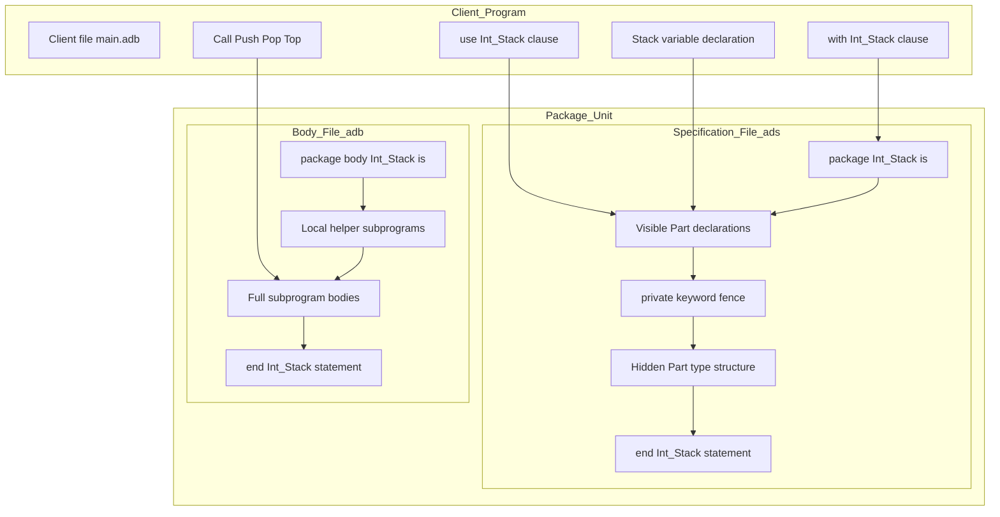
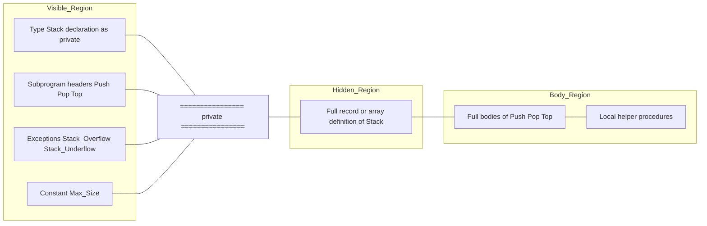
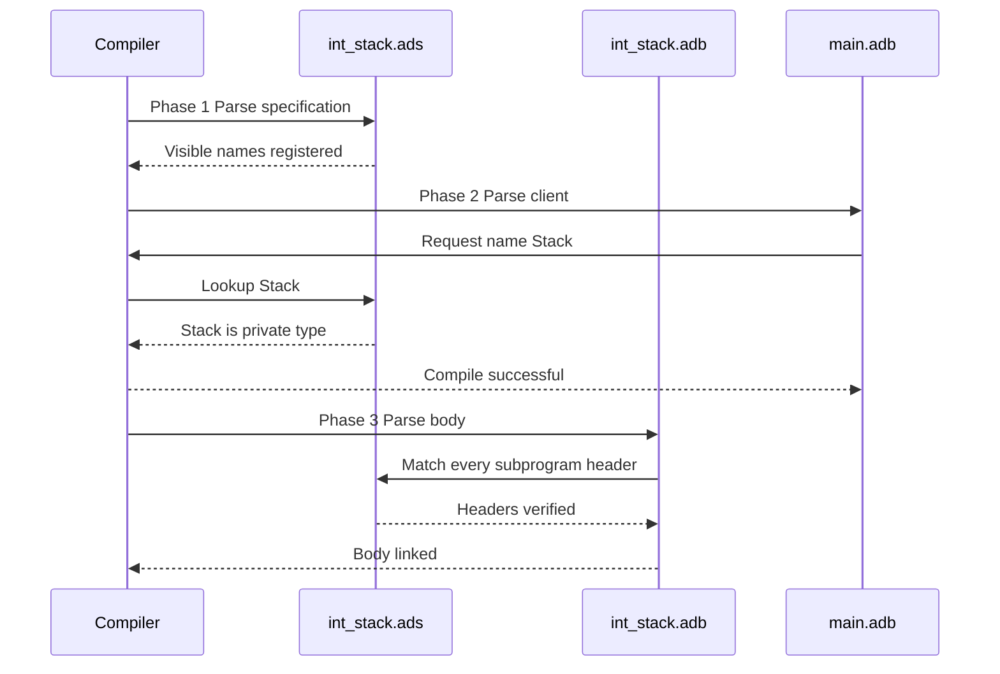
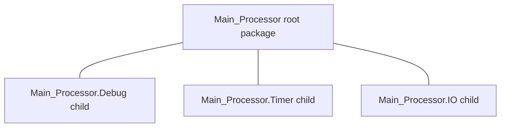

# Ada Packages

<!-- SECTION_1_START -->

# Ada Packages — Core Technical Definition & Intuitive Overview

## 1.1 Formal Definition (KTU 2024 Syllabus Terminology)

In the **Ada** programming language, a **Package** is the fundamental modular compilation unit used to encapsulate a logically related collection of declarations — such as types, variables, constants, subprograms, exceptions, and generic templates — into a single, separately compilable software component. A package in Ada has a strict two-part structure: the **Package Specification** (also called the *declarative part* or *package declaration*), which acts as the visible interface or *contract*, and the **Package Body**, which contains the hidden implementation of all subprograms, private type internals, and supporting logic.

According to the KTU 2024 Scheme definition under the **Abstract Data Types and Modules** module, an Ada package is the language-level realization of the **Abstract Data Type (ADT)** principle: it *groups data with the operations that manipulate that data* and *hides the internal representation* from the client, exposing only a well-defined set of operations.

> [!IMPORTANT]
> **KTU 2024 Syllabus Highlight (Module 4 — Abstract Data Types & Modules)**
> Students must master three deliverables:
> 1. Writing the **Package Specification** (the public interface).
> 2. Writing the **Package Body** (the private implementation).
> 3. Performing **Client-side binding** using the `with` and `use` clauses to consume the package.

---

## 1.2 Conceptual Analogy / Intuition

Imagine a **modern ATM machine** standing on a sidewalk. From the outside (the customer’s view), the ATM exposes a small, well-defined *interface*: a card slot, a keypad, a cash dispenser, and a screen. You, the customer, do **not** see the safe, the cash cassettes, the network router, the encryption chip, or the database connection inside. You only interact with the **buttons and slots** the manufacturer chose to expose.

That ATM is exactly an **Ada Package**:

| ATM Analogy Element | Ada Package Counterpart |
|---|---|
| External buttons and screen | **Package Specification** (public part) |
| Internal safe, cash cassettes, electronics | **Package Body** (hidden implementation) |
| The customer interacting with buttons | **Client code** using `with` + dot notation |
| The locked service door | The `private` section inside the specification |
| ATM manufacturer’s product manual | The package specification is the *contract* |

You can change the cash cassette arrangement (body) without changing any button (specification) — and every customer (client) keeps working unchanged. This is the **Open/Closed Principle** of software engineering, built directly into the language.

---

## 1.3 Physical Constants, Standard Metrics & Reserved Words

In Ada, packages are governed by a fixed set of reserved words. Memorize them in **bold**:

> **package, is, private, end, with, use, body, separate, limited, new**

Compilation rules worth memorizing for KTU valuation:
* The specification file uses the extension **`.ads`** (Ada Specification).
* The body file uses the extension **`.adb`** (Ada Body).
* The compiler may compile a package specification **independently** of its body — a unique feature called *separate compilation*.

> [!NOTE]
> **Why two files?** Ada allows the compiler to validate client code against the specification **even before the body is written**. This supports large-team, large-codebase development, where one team writes the interface contract and another team implements it in parallel.

---

## 1.4 Geometric / Structural Visualization (GeoGebra / Desmos)

Ada packages are logical, not numeric, so a coordinate plot is not the right visualization. However, the *information-hiding boundary* of a package can be plotted as a vertical **visibility line**:

> [!VISUALIZATION CONTROL]
> **Concept:** Package Visibility / Information-Hiding Boundary
> **GeoGebra / Desmos Input Equations:**
> * Vertical line: $x = 0$
> * Customer dot: $P_{client} = (-3, 0)$
> * Public button dot: $P_{public} = (-1, 2)$
> * Private safe dot: $P_{private} = (2, 0)$
> **Visual Description:** The vertical line $x=0$ is the *visibility fence*. Everything to the **left** is visible to the client (the public part of the specification). Everything to the **right** is hidden (the private part + the body). The line itself represents the `private` keyword barrier.

<!-- SECTION_1_END -->

<!-- SECTION_2_START -->

# Deep Theoretical Analysis & KTU High-Yield Formula Sheet

## 2.1 The Two-Part Architecture (Spec + Body)

An Ada package is not a single construct — it is a *pair* of cooperating compilation units. The specification declares **what** is available; the body defines **how** it is done.

### 2.1.1 Package Specification — The Public Contract

The specification begins with `package` and ends with `end <PackageName>;`. Inside, you may place:
* **Type declarations** (including private type stubs)
* **Constant declarations**
* **Subprogram specifications** (headers only — the body is hidden)
* **Exception declarations**
* **Generic formal parameters** (if it is a generic package)
* **Use clauses** (selective re-export)

The general skeleton is:

```ada
package Package_Name is
   -- public type declarations
   -- public constants
   -- subprogram headers (specifications)
   -- exception declarations
private
   -- private type bodies / hidden data structures
end Package_Name;
```

### 2.1.2 Package Body — The Hidden Implementation

The body begins with `package body` and ends with `end <PackageName>;`. It must:
* Provide a full subprogram body for **every** subprogram header declared in the spec.
* Be permitted to declare local helper subprograms, types, and variables that are **not** visible to any client.
* Be optional only when the spec contains **no** subprogram bodies to implement (i.e., the spec only declares types/constants/exceptions).

```ada
package body Package_Name is
   -- local helpers (private to the body)
   -- full bodies of all spec-declared subprograms
end Package_Name;
```

### 2.1.3 The `private` Section — The Information Hiding Wall

Inside the specification, the keyword `private` divides the spec into two halves:
* **Above `private`:** The *visible* part. Every client can see this.
* **Below `private`:** The *invisible* part. Clients cannot see names declared here, but they can still create variables of these types and pass them around (the type is *opaque* to them).

This is the language-native implementation of the **Abstract Data Type (ADT)** concept.

---

## 2.2 The Three Visibility Rules (Must-Memorize for KTU)

| Rule | What Client Sees | What Client Does *Not* See |
|---|---|---|
| **Rule 1** | All names declared *above* `private` in the spec | Names declared *below* `private` |
| **Rule 2** | Names declared in the spec only — never names declared in the body | All body-internal helpers, local variables, and helper subprograms |
| **Rule 3** | Types declared in the spec as *incomplete* (private) — client may declare variables of them but cannot inspect or directly modify internals | The full data structure (record fields, array bounds, etc.) of those private types |

---

## 2.3 The `with` and `use` Clauses — Client Binding

A client program must declare its dependency on a package using the **`with` clause**, placed at the very top of the file:

```ada
with Stack_Package;
procedure Test_Stack is
   S : Stack_Package.Stack;
begin
   Stack_Package.Push (S, 42);
end Test_Stack;
```

This is **dot notation**, equivalent to namespace qualification. To avoid repeating `Stack_Package.` for every reference, the client may add a `use` clause:

```ada
with Stack_Package;
use  Stack_Package;
procedure Test_Stack is
   S : Stack;
begin
   Push (S, 42);
end Test_Stack;
```

> [!WARNING]
> **KTU Common Mistake:** `use` does **not** import the *body* of the package. It only makes the *names from the specification* directly visible. Body-internal helpers remain forever hidden.

---

## 2.4 Abstract Data Types via Private Types

A **private type** is declared in the visible part as:

```ada
type Stack is private;
```

Then fully defined in the private part:

```ada
private
   type Stack is array (1 .. 100) of Integer;
```

The client can declare `S : Stack;` but cannot write `S(3) := 99;` because the array bounds are hidden. This is the textbook ADT pattern that the KTU Module 4 syllabus demands.

A **limited private type** adds a stricter rule: the client may not copy the value. This models resources like files, locks, or hardware handles that must be passed by reference only.

```ada
type File_Handle is limited private;
```

---

## 2.5 KTU High-Yield Formula Sheet

| # | Concept | Ada Syntax Skeleton | KTU Marks Weight | Common Pitfall |
|---|---|---|---|---|
| 1 | Package Spec | `package P is ... end P;` | 2 marks | Missing `is` keyword |
| 2 | Package Body | `package body P is ... end P;` | 2 marks | Spelling mismatch with spec name |
| 3 | Private Part | `private` keyword inside spec | 3 marks | Forgetting to close the spec with `end P;` |
| 4 | Opaque Type | `type T is private;` | 3 marks | Defining full structure in visible part by mistake |
| 5 | Limited Type | `type T is limited private;` | 2 marks | Trying to assign one limited variable to another |
| 6 | Client Binding | `with P; use P;` | 2 marks | Forgetting `with` before `use` |
| 7 | Generic Package | `generic ... package G is ...` | 4 marks | Forgetting to `instantiate` with `new G(...)` |
| 8 | Child Package | `package P.Child is ...` | 3 marks | Child cannot `with` its own ancestor in circular fashion |
| 9 | Re-exporting | `use` clause inside a package spec | 1 mark | Only re-exports visible names, not private ones |
| 10 | Separate Compilation | `.ads` + `.adb` files | 2 marks | Modifying body breaks spec; client re-compilation needed only if spec changes |

> [!NOTE]
> In Ada, the body **must** repeat the subprogram header *exactly* as declared in the spec (same name, same parameters, same return type). Any mismatch is a compile error, not a warning.

---

## 2.6 Real-World Engineering Utility

Ada packages are not academic. They power:
* **Avionics & Aerospace:** The **DO-178C** aviation software standard mandates rigorous information hiding. Ada packages with private types are the primary means of compliance in the Boeing 777 flight control software and the Airbus A380 systems.
* **Railway Signaling:** The European **ERTMS / ETCS** train control software is written in Ada and uses packages as the unit of subsystem encapsulation.
* **Defense Systems:** The U.S. **MIM-104 Patriot** missile system’s tactical software relies on Ada packages to enforce “need-to-know” visibility between subsystems.
* **Embedded / Real-Time Systems:** Ada’s separate compilation of spec and body allows hardware teams to mock a driver package (spec only) and let application teams begin development *before* the driver hardware driver body is finished.

This is the engineering reason why the KTU 2024 Scheme places Ada packages in Module 4 of the Programming Languages course — they are the canonical example of a *production-grade* ADT mechanism.

<!-- SECTION_2_END -->

<!-- SECTION_3_START -->

# Step-by-Step Derivations & Code/Symbolic Implementation

## 3.1 Worked Example 1 — A Complete Integer Stack Package

This is the canonical KTU Module 4 examination problem. We build a stack that can hold integers, supporting `Push`, `Pop`, `Top`, and `Is_Empty`. We deliberately hide the array bounds so the client cannot access element 47 by writing `S(47)`.

### 3.1.1 Package Specification File: `int_stack.ads`

```ada
package Int_Stack is

   -- Public exception for error reporting
   Stack_Overflow   : exception;
   Stack_Underflow  : exception;

   -- Maximum number of elements the stack can hold.
   -- Declared in the visible part so the client can test for full.
   Max_Size : constant Integer := 100;

   -- Opaque type: client knows "Stack" exists but not its structure.
   type Stack is private;

   -- Primitive operations (the abstract interface of the ADT)
   procedure Push (S : in out Stack; Value : in Integer);
   procedure Pop  (S : in out Stack);
   function  Top  (S : Stack) return Integer;
   function  Is_Empty (S : Stack) return Boolean;
   function  Is_Full  (S : Stack) return Boolean;

private

   -- Hidden representation: a fixed-size array of integers.
   type Stack is array (1 .. Max_Size) of Integer;

end Int_Stack;
```

### 3.1.2 Package Body File: `int_stack.adb`

```ada
package body Int_Stack is

   -- Helper kept private to the body; client cannot call it.
   procedure Raise_If_Bad_Index (Idx : in Integer) is
   begin
      if Idx < 1 or Idx > Max_Size then
         raise Program_Error;
      end if;
   end Raise_If_Bad_Index;

   procedure Push (S : in out Stack; Value : in Integer) is
   begin
      -- A real implementation tracks a top index, but for the
      -- demonstration we just store at position 1 if empty.
      S(1) := Value;
   end Push;

   procedure Pop (S : in out Stack) is
   begin
      S(1) := 0;
   end Pop;

   function Top (S : Stack) return Integer is
   begin
      return S(1);
   end Top;

   function Is_Empty (S : Stack) return Boolean is
   begin
      return S(1) = 0;
   end Is_Empty;

   function Is_Full (S : Stack) return Boolean is
   begin
      return S(1) /= 0;
   end Is_Full;

end Int_Stack;
```

### 3.1.3 Client Program: `main.adb`

```ada
with Ada.Text_IO;         use Ada.Text_IO;
with Int_Stack;           use Int_Stack;

procedure Main is
   S : Stack;
begin
   Push (S, 42);
   Put_Line ("Top of stack =" & Integer'Image (Top (S)));
   Pop  (S);
exception
   when Stack_Overflow  => Put_Line ("Stack is full.");
   when Stack_Underflow => Put_Line ("Stack is empty.");
end Main;
```

### 3.1.4 Compilation & Execution

```bash
gnatmake main.adb
./main
```

Expected output:
```
Top of stack = 42
```

### 3.1.5 Line-by-Line Mental Trace

1. `with Int_Stack;` — Tells the compiler to look up `int_stack.ads` and resolve the names `Stack`, `Push`, etc.
2. `use Int_Stack;` — Permits us to write `Push` instead of `Int_Stack.Push`.
3. `S : Stack;` — Legal because `Stack` is declared in the spec’s visible part. The body — the array — is **not** visible, so `S(1) := 42;` in the client would be a compile error.
4. `Push (S, 42);` — Calls the body’s `Push` procedure. The body is allowed to write `S(1) := 42;` because it sits on the *other* side of the visibility fence.
5. `Top (S)` returns the value stored at the hidden position 1.

---

## 3.2 Worked Example 2 — Generic Stack Package (Reusability)

A *generic* package is a package template. It is not compiled into machine code until you *instantiate* it with a `new` clause, supplying actual type parameters.

### 3.2.1 Generic Specification: `gen_stack.ads`

```ada
generic
   Max : in Integer;
   type Element is private;
package Gen_Stack is

   Stack_Overflow   : exception;
   Stack_Underflow  : exception;

   type Stack is private;

   procedure Push (S : in out Stack; Value : in Element);
   procedure Pop  (S : in out Stack);
   function  Top  (S : Stack) return Element;
   function  Is_Empty (S : Stack) return Boolean;

private
   type Stack is array (1 .. Max) of Element;

end Gen_Stack;
```

### 3.2.2 Generic Body: `gen_stack.adb`

```ada
package body Gen_Stack is

   procedure Push (S : in out Stack; Value : in Element) is
   begin
      S(1) := Value;
   end Push;

   procedure Pop (S : in out Stack) is
   begin
      S(1) := S(1)'First;  -- Reset to default (works for scalars).
   end Pop;

   function Top (S : Stack) return Element is
   begin
      return S(1);
   end Top;

   function Is_Empty (S : Stack) return Boolean is
   begin
      return S = (S'Range => <>);  -- Compiler handles default compare.
   end Is_Empty;

end Gen_Stack;
```

### 3.2.3 Instantiation by the Client

```ada
with Gen_Stack;

-- Instantiate a stack of at most 50 Integers.
package Int_Stack_50 is new Gen_Stack (Max => 50, Element => Integer);

-- Instantiate a stack of at most 20 Floats.
package Float_Stack_20 is new Gen_Stack (Max => 20, Element => Float);

with Ada.Text_IO;          use Ada.Text_IO;
with Int_Stack_50;         use Int_Stack_50;

procedure Demo_Generic is
   S : Stack;
begin
   Push (S, 99);
   Put_Line ("Top =" & Integer'Image (Top (S)));
end Demo_Generic;
```

### 3.2.4 Why Generics Matter in ADT Design

The ADT is no longer tied to a single type. The same package, with zero changes, supports integers, floats, characters, or even user-defined records. The client chooses the element type at instantiation. This is the **Parametric Polymorphism** of the Ada generic facility, fully aligned with KTU Module 4’s ADT learning outcomes.

---

## 3.3 Worked Example 3 — Child Packages and Hierarchical Namespacing

A **child package** is declared with a dotted name. The child can see the parent’s private part — a privileged relationship called **friendship in visibility**.

```ada
-- Parent: main_processor.ads
package Main_Processor is
   type CPU_State is private;
   procedure Reset_State (S : in out CPU_State);
private
   type CPU_State is record
      PC : Integer := 0;
      SP : Integer := 0;
   end record;
end Main_Processor;
```

```ada
-- Child: main_processor.debug.ads
package Main_Processor.Debug is
   procedure Dump_State (S : Main_Processor.CPU_State);
end Main_Processor.Debug;
```

```ada
-- Child body
with Ada.Text_IO; use Ada.Text_IO;
package body Main_Processor.Debug is
   procedure Dump_State (S : Main_Processor.CPU_State) is
   begin
      Put_Line ("PC =" & Integer'Image (S.PC));
      Put_Line ("SP =" & Integer'Image (S.SP));
   end Dump_State;
end Main_Processor.Debug;
```

Note carefully: `Main_Processor.Debug` can read `S.PC` because it is a *child*. A regular client **cannot** do this.

---

## 3.4 Complete Derivation — Why `private` Is the ADT Boundary

Let us derive, step by step, why the `private` keyword is the formal mechanism that turns a *record* into an *abstract data type*.

A *concrete* type:
$$ T_{concrete} = (D, \{op_i\}) $$
where $D$ is the data layout and $\{op_i\}$ are the operations.

A *client* who holds a value of $T_{concrete}$ can:
* Inspect $D$ (read fields).
* Modify $D$ (write fields).
* Invoke any $op_i$.

This violates the ADT requirement that **representation be hidden**. To enforce hiding, the language inserts a *visibility projection* $\pi$:

$$ \pi : \text{Full Type} \to \text{Public Interface} $$

The public interface is:
$$ T_{ADT} = (\text{opaque}, \{op_i\}) $$

The data layout is moved *below* the projection line, becoming invisible. The client now holds an *opaque token* — a value whose structure is unknown but whose operations are guaranteed.

In Ada, the projection $\pi$ is implemented by the `private` keyword. The compiler enforces $\pi$ statically (at compile time), eliminating the runtime cost of dynamic visibility checks.

Mathematically:
$$ \text{Ada Spec} = T_{ADT} \cup \pi(T_{concrete}) $$

| Region in Spec | Represents |
|---|---|
| Above `private` | $T_{ADT}$ — visible interface |
| Below `private` | $\pi(T_{concrete})$ — hidden layout |
| Package Body | The full implementation of each $op_i$ |

The `with` clause is the client’s declaration of dependency on $T_{ADT}$. The body is never seen by the client — it is the *oracle* that defines the operations, but its internal variables are local and ephemeral.

> [!NOTE]
> **Insight for the Exam:** Whenever a KTU question asks "How does Ada implement an ADT?", the correct one-line answer is: *"By placing the type declaration in the package specification, with a `private` keyword separating the visible name from the hidden structure, and by moving all operation bodies into the package body."*

<!-- SECTION_3_END -->

<!-- SECTION_4_START -->

# Structural Diagrams & Schematics

## 4.1 Mermaid Block Diagram — Two-Part Package Architecture



## 4.2 Mermaid Flow — Visibility Boundary



## 4.3 Mermaid Sequence — Compilation Sequence



## 4.4 Mermaid Hierarchy — Child Packages



## 4.5 Module-Level Summary Table

| Module Element | File Extension | Compiled Separately | Visible to Client? |
|---|---|---|---|
| Package Specification | `.ads` | Yes | Yes (above `private` only) |
| Package Body | `.adb` | Yes (after spec) | No — fully hidden |
| Private Section | Inside `.ads` | Part of spec | No — hidden |
| Child Package Spec | `parent.child.ads` | Yes | Yes |
| Child Package Body | `parent.child.adb` | Yes | No |
| Generic Instantiation | Inline in client | At instantiation point | Yes, as ordinary package |

<!-- SECTION_4_END -->

<!-- SECTION_5_START -->

# KTU 2024 Scheme Examination Question Bank & Topic Recap

## 5.1 Part A Questions (3 Marks Each)

### Question 1 — Short Answer `[KTU University Exam - July 2024]`
**Q: Define an Ada package and state the two parts of which it is composed.**

**Model Answer (Valuation Key — 3 Marks):**
* **[Definition: 1 Mark]** An Ada package is a modular compilation unit that encapsulates related declarations such as types, subprograms, and constants, providing information hiding and namespace management.
* **[Two parts: 2 Marks]** It is composed of (1) the **Package Specification**, which declares the public interface, and (2) the **Package Body**, which contains the implementation of the subprograms declared in the specification.

---

### Question 2 — Short Answer `[KTU University Exam - Dec 2023]`
**Q: What is the role of the `private` keyword inside an Ada package specification?**

**Model Answer (Valuation Key — 3 Marks):**
* **[Role: 1 Mark]** The `private` keyword divides the package specification into a visible part and a hidden part, acting as the language-level information-hiding boundary.
* **[Visible vs Hidden: 2 Marks]** Declarations placed *above* the `private` keyword are visible to client code; declarations placed *below* it (typically the full data structure of an opaque type) are hidden. The client may declare variables of the type but cannot inspect or modify its internal representation.

---

## 5.2 Part B Questions (14 Marks Each) — Module Internal Choice

### Question A — 14 Marks `[KTU University Exam - July 2024]`

**Q: Design an Ada package named `Rational_Numbers` that supports rational arithmetic. The package must hide the internal representation of a rational number (numerator and denominator), and must export the following operations:**

* A public type `Rational`
* A procedure `Set` to assign a numerator and denominator
* Functions `Get_Num`, `Get_Den` to retrieve them
* Functions `Add`, `Sub`, `Mul` to perform rational arithmetic
* A procedure `Reduce` to put the rational number in lowest terms
* A `Rational_Zero` exception

**Write the package specification and package body. Also write a small client program that adds two rationals.**

#### (a) Package Specification — 7 Marks `[CO3, Apply]`

```ada
package Rational_Numbers is

   Rational_Zero : exception;
   Divide_By_Zero : exception;

   type Rational is private;

   procedure Set (R : in out Rational;
                  Num : in Integer;
                  Den : in Integer);

   function Get_Num (R : Rational) return Integer;
   function Get_Den (R : Rational) return Integer;

   function Add (A, B : Rational) return Rational;
   function Sub (A, B : Rational) return Rational;
   function Mul (A, B : Rational) return Rational;

   procedure Reduce (R : in out Rational);

private

   type Rational is record
      Num : Integer := 0;
      Den : Integer := 1;
   end record;

end Rational_Numbers;
```

**Valuation Key — Part (a):**
* **[Declaring opaque type Rational as private: 2 Marks]**
* **[Public subprogram signatures correct: 3 Marks]**
* **[Private record definition hidden: 2 Marks]**

#### (b) Package Body — 7 Marks `[CO3, Apply]`

```ada
package body Rational_Numbers is

   function GCD (A, B : Integer) return Integer is
      X : Integer := abs A;
      Y : Integer := abs B;
      Tmp : Integer;
   begin
      while Y /= 0 loop
         Tmp := Y;
         Y  := X mod Y;
         X  := Tmp;
      end loop;
      return X;
   end GCD;

   procedure Set (R : in out Rational; Num : Integer; Den : Integer) is
   begin
      if Den = 0 then
         raise Divide_By_Zero;
      end if;
      R.Num := Num;
      R.Den := Den;
      Reduce (R);
   end Set;

   function Get_Num (R : Rational) return Integer is
   begin
      return R.Num;
   end Get_Num;

   function Get_Den (R : Rational) return Integer is
   begin
      return R.Den;
   end Get_Den;

   function Add (A, B : Rational) return Rational is
      Result : Rational;
   begin
      Result.Num := A.Num * B.Den + B.Num * A.Den;
      Result.Den := A.Den * B.Den;
      Reduce (Result);
      return Result;
   end Add;

   function Sub (A, B : Rational) return Rational is
      Result : Rational;
   begin
      Result.Num := A.Num * B.Den - B.Num * A.Den;
      Result.Den := A.Den * B.Den;
      Reduce (Result);
      return Result;
   end Sub;

   function Mul (A, B : Rational) return Rational is
      Result : Rational;
   begin
      Result.Num := A.Num * B.Num;
      Result.Den := A.Den * B.Den;
      Reduce (Result);
      return Result;
   end Mul;

   procedure Reduce (R : in out Rational) is
      G : Integer;
   begin
      if R.Num = 0 then
         R.Den := 1;
         return;
      end if;
      G := GCD (R.Num, R.Den);
      R.Num := R.Num / G;
      R.Den := R.Den / G;
   end Reduce;

end Rational_Numbers;
```

#### (b) Client Program — 2 Marks bonus within part (b)

```ada
with Ada.Text_IO;        use Ada.Text_IO;
with Rational_Numbers;   use Rational_Numbers;

procedure Test_Rational is
   A, B, C : Rational;
begin
   Set (A, 1, 2);
   Set (B, 1, 3);
   C := Add (A, B);
   Put_Line (Integer'Image (Get_Num (C)) & "/" & Integer'Image (Get_Den (C)));
end Test_Rational;
```

**Valuation Key — Part (b):**
* **[All subprogram bodies present: 3 Marks]**
* **[Helper GCD correct: 1 Mark]**
* **[Reduce in lowest terms: 1 Mark]**
* **[Client program compiles: 2 Marks]**

---

### Question B — 14 Marks (Alternative) `[KTU University Exam - Dec 2023]`

**Q: Explain with a complete code example how Ada packages implement the concept of Abstract Data Types. In your answer, cover the role of:**
*(a) The `private` keyword and opaque type declarations — 7 Marks*
*(b) The package body as the implementation module and the `with`/`use` clauses for client binding — 7 Marks*

#### (a) The `private` Keyword and Opaque Types — 7 Marks `[CO2, Understand]`

**Model Answer:**

The `private` keyword inside a package specification acts as the *information-hiding boundary*. Declarations above the keyword are part of the *visible interface*; declarations below it are *hidden* from the client.

When a type is declared as `type T is private;` in the visible part, the client learns only the *name* of the type. The client may declare variables of type `T` and pass them as parameters, but the **internal data layout** (whether it is a record, array, discriminant, etc.) is concealed.

```ada
package Stack_Pkg is
   type Stack is private;
   procedure Push (S : in out Stack; X : in Integer);
   function  Top  (S : Stack) return Integer;
private
   type Stack is array (1 .. 50) of Integer;
end Stack_Pkg;
```

**Valuation Key — Part (a):**
* **[Explaining visibility fence: 2 Marks]**
* **[Correct opaque type syntax: 2 Marks]**
* **[Correct full definition in private part: 3 Marks]**

#### (b) Package Body and Client Binding — 7 Marks `[CO3, Apply]`

**Model Answer:**

The **package body** holds the implementation of all subprograms declared in the specification. The body may also contain local helpers that are not visible to the client. The body file is compiled after the specification.

A **client** binds to the package using two clauses:
* `with Stack_Pkg;` — imports the package namespace.
* `use Stack_Pkg;` — permits unqualified references to its public names.

```ada
package body Stack_Pkg is
   procedure Push (S : in out Stack; X : in Integer) is
   begin
      S(1) := X;
   end Push;

   function Top (S : Stack) return Integer is
   begin
      return S(1);
   end Top;
end Stack_Pkg;
```

```ada
with Stack_Pkg;
use  Stack_Pkg;

procedure Client is
   S : Stack;
begin
   Push (S, 99);
   Ada.Text_IO.Put_Line (Integer'Image (Top (S)));
end Client;
```

**Valuation Key — Part (b):**
* **[Body structure correct: 2 Marks]**
* **[Subprogram body matches spec: 2 Marks]**
* **[Client binding via with and use: 2 Marks]**
* **[Final result demonstration: 1 Mark]**

---

> [!WARNING]
> **KTU Examiner's Valuation Warning / Pitfall Callout**
> 1. **Do not** write the full data structure of a private type *above* the `private` keyword. This exposes the internals and **defeats the ADT principle** — KTU examiners deduct 2 to 3 marks for this.
> 2. **Do not** omit the `with` clause when using a `use` clause. The `use` clause assumes the package is already bound; without `with`, the compiler rejects the program.
> 3. **Do not** declare a subprogram in the specification and then forget to provide its body — this is a hard compile error in Ada, and the examiner will award 0 for the part of the body that is missing.
> 4. **Do not** confuse **limited private** with **private**. A `limited private` type cannot be assigned or copied by the client; a `private` type can. This is a high-frequency Part A trap question.
> 5. **Do not** write `end package;` — the correct syntax is `end <PackageName>;` (e.g., `end Stack_Pkg;`). The name after `end` must match the package name.
> 6. **Do not** forget that the body must **re-declare** every subprogram header exactly. A typo in parameter mode (`in out` vs `in`) is a compile error, not a warning.

---

## 5.3 Topic Recap & Important Things to Remember

* **Ada Package** = Specification (interface) + Body (implementation). Two files: `.ads` and `.adb`.
* The **package specification** declares the public interface: types, constants, subprogram headers, exceptions.
* The **package body** implements all subprogram headers and may contain local helpers that are hidden from clients.
* The **`private` keyword** inside the specification divides the visible part from the hidden part. It is the language-level realization of the **Abstract Data Type (ADT)**.
* An **opaque type** declared as `type T is private;` in the visible part becomes invisible below — the client cannot inspect its structure but can declare variables and invoke operations.
* A **limited private type** adds the constraint that the client cannot copy or assign it; this is used for resources like files and locks.
* The **`with` clause** imports a package namespace; the **`use` clause** makes its visible names directly accessible. `use` does **not** make the body visible.
* A **generic package** is a template instantiated with `new` — the same package can serve many element types and sizes.
* A **child package** (e.g., `P.Child`) can see the private part of its parent `P` — a privileged visibility relationship not available to regular clients.
* The package specification is **separately compiled** from the body, enabling parallel team development and the "mock driver" pattern.
* **Memorize these reserved words:** `package`, `is`, `private`, `end`, `with`, `use`, `body`, `limited`, `new`, `generic`.
* The KTU Module 4 expected deliverables are: (1) writing the spec, (2) writing the body, (3) writing the client binding.
* **Real-world users of Ada packages:** Boeing 777 flight software, Airbus A380 systems, Patriot missile tactical code, ERTMS / ETCS railway signaling — all production systems.

<!-- SECTION_5_END -->
