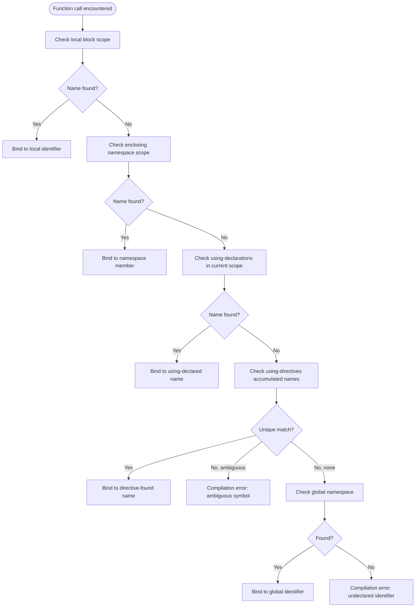
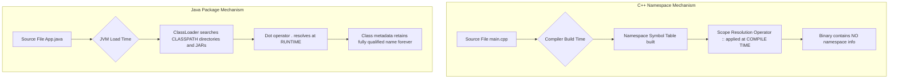
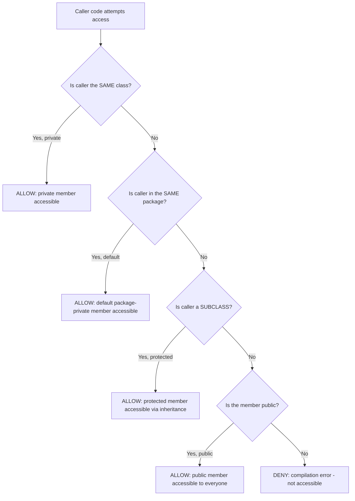

# C++ Namespaces, and Java Packages

<!-- SECTION_1_START -->

# C++ Namespaces and Java Packages — Core Technical Definition & Intuitive Overview

## 1.1 C++ Namespaces

### Formal Academic Definition

> [!IMPORTANT]
> **KTU Syllabus Definition (C++ Namespaces)**
> A **namespace** in C++ is a declarative region that establishes a logical scope to identifiers such as names of types, functions, variables, and enumerations. It is the language's primary mechanism for **modular code organization** and for **preventing name collisions** in large, multi-file, multi-developer projects (as prescribed in the KTU 2024 Scheme PECST758 Module 4 — *Abstract Data Types and Modules*).

The formal syntax for declaring a namespace is:

```cpp
namespace identifier {
    // declarations of types, functions, variables, etc.
}
```

Every identifier declared inside a namespace block is qualified by the namespace name, and can be accessed externally using the scope resolution operator `::` (also called the **Paamayim Nekudotayim** operator in legacy C++ compilers such as GCC).

### Conceptual Analogy / Intuition

Think of a namespace as a **post office box system inside a large apartment complex**. The complex is the global scope; the post office box number is the namespace; and the letter kept inside the box is the identifier. Two different residents can both own a letter named `"balance"` — as long as they are stored in different post office boxes (`Finance::balance` and `Accounts::balance`), there is **zero conflict**. Without namespaces, everyone would be dumping letters into a single communal lobby, and the postmaster (the compiler) would not know which `"balance"` you meant.

> [!NOTE]
> **Real-World Engineering Use-Case**
> The C++ Standard Library declares **every** identifier inside the namespace `std` (e.g., `std::cout`, `std::vector`, `std::string`). This is the reason you write `using namespace std;` or prefix every call with `std::`. Without namespaces, you could never write your own class called `vector` without colliding with `std::vector`.

### Key Constants and Standard Metrics

- The **fully qualified name** length is unbounded, allowing theoretically infinite nesting.
- The compiler reserves **no runtime memory** for a namespace itself — it is purely a compile-time scoping construct.
- The default namespace (when none is declared) is the **global namespace** (denoted by a leading `::` with no prefix, e.g., `::globalVariable`).

---

## 1.2 Java Packages

### Formal Academic Definition

> [!IMPORTANT]
> **KTU Syllabus Definition (Java Packages)**
> A **package** in Java is a namespace mechanism that groups a set of related **classes**, **interfaces**, **enumerations**, and **annotations** into a single logical unit. Packages serve the dual purpose of (a) **logical organization** of the API, and (b) **access protection** via the four access modifiers `public`, `protected`, *package-private* (default), and `private`. They are physically realised as **directories** in the file system and as **JAR archive entries** at deployment time.

### Conceptual Analogy / Intuition

Imagine a **well-organised library**. The library is the Java runtime; each *bookshelf* is a package (e.g., `java.util`, `java.io`, `com.ktu.bankapp.model`); and each *book* on the shelf is a class (e.g., `ArrayList`, `File`, `Account`). When you want the book on *Sorting Algorithms*, you do not just say "give me a book" — you say "go to the **Computer Science** bookshelf, third shelf, book titled *MergeSort*". That exact phrase in Java is:

```java
import java.util.ArrayList;
```

…which is equivalent to saying, "from the `java.util` package, bring me the `ArrayList` class into my current scope".

> [!NOTE]
> **Real-World Engineering Use-Case**
> Major Java frameworks rely on package-by-feature or package-by-layer architecture. For example, **Spring Boot** projects use `com.company.app.controller`, `com.company.app.service`, `com.company.app.repository` packages to enforce the **MVC (Model-View-Controller)** separation of concerns.

### Standard Metrics and Constants

- The Java Language Specification mandates that the **reverse-domain naming convention** be used for user-defined packages (e.g., `org.apache.commons.lang3`).
- A `.class` file in Java is expected to reside in a directory path that **mirrors its package declaration** — for example, the class `com.ktu.bank.Account` must live at `com/ktu/bank/Account.class` on disk.
- The default (unnamed) package exists for small programs, but **best practice** (and KTU 2024 Scheme evaluation standards) **forbids its use in production code**.

> [!VISUALIZATION CONTROL]
> **Concept:** Namespace Resolution Scope Chain
> **GeoGebra / Desmos Input Equations:**
> * `f(x) = x^2` (representing innermost scope)
> * `g(x) = 2x` (representing enclosing namespace)
> * `h(x) = x + 1` (representing global namespace)
> **Visual Description:** Picture three nested rectangles. The innermost rectangle (closest to origin) represents the local block scope. The middle rectangle represents the namespace. The outer rectangle represents the global scope. The compiler always searches **inner → outer**, stopping at the first match — a process called **scope chain resolution**.

---

<!-- SECTION_1_END -->

<!-- SECTION_2_START -->

# Deep Theoretical Analysis & KTU High-Yield Formula Sheet

## 2.1 Anatomy of a C++ Namespace

### 2.1.1 Declaration Forms

A namespace can be declared in **three** legal forms:

**Form 1 — Named Namespace (the standard form):**
```cpp
namespace Finance {
    double balance = 50000.00;
    void printBalance();
}
```

**Form 2 — Unnamed (Anonymous) Namespace:**
```cpp
namespace {
    int internalCounter = 0;   // accessible only within this translation unit
}
```
The compiler internally generates a unique identifier (e.g., `anonymous#17`) for it. This is the **C++ idiom for file-scope `static`** and is heavily used in **KTU Module 4** examples for *information hiding*.

**Form 3 — Namespace Alias:**
```cpp
namespace Fin = Finance;   // 'Fin' is an alias for 'Finance'
Fin::printBalance();
```

### 2.1.2 The Three Ways to Bring a Namespace Member into Scope

| Method | Syntax | Scope of Effect | Risk of Collision |
|---|---|---|---|
| **Fully Qualified** | `Finance::balance` | Single statement | **None** |
| **Using Declaration** | `using Finance::balance;` | From declaration to end of enclosing block | **Low** (only that one name is exposed) |
| **Using Directive** | `using namespace Finance;` | From declaration to end of enclosing block | **High** (all members of `Finance` are exposed) |

> [!WARNING]
> **KTU Examiner's Pitfall:** Many students write `using namespace std;` in **header files**. This is a **fatal design flaw** because it pollutes the global scope of *every* file that `#include`s the header. KTU 2024 Scheme evaluators explicitly deduct marks for this practice under the "Good Programming Practice" rubric.

### 2.1.3 Nested Namespaces and Composition

Namespaces can be nested or even split across multiple files (this is the **interface vs. implementation separation** pattern central to *abstract data types*).

```cpp
// File: shape.h
namespace Geometry {
    namespace TwoD {
        class Circle { /* ... */ };
    }
}

// File: main.cpp
Geometry::TwoD::Circle c1;       // fully qualified chain
```

The C++17 standard introduced the **compact nested namespace syntax**:

```cpp
namespace Geometry::TwoD {       // equivalent to the nested form above
    class Circle { /* ... */ };
}
```

### 2.1.4 Argument-Dependent Lookup (ADL) — *Koenig Lookup*

When a function is called without a qualifying namespace, the compiler searches the namespaces of the **types of the arguments**, in addition to the normal scope chain. This is why `std::cout << "Hello";` works even without `using namespace std;` — the literal `"Hello"` is of type `const char*` (effectively in the global namespace) but `operator<<` is found via the `std` namespace of `cout`.

---

## 2.2 Anatomy of a Java Package

### 2.2.1 The Two Categories of Packages

| Category | Examples | Provided By |
|---|---|---|
| **Built-in (API) Packages** | `java.lang`, `java.util`, `java.io`, `java.net`, `java.sql`, `java.awt`, `javax.swing` | JDK / JRE |
| **User-defined Packages** | `com.ktu.bank.model`, `edu.college.cs.dsa` | Programmer |

The `java.lang` package is **auto-imported** into every Java compilation unit — that is why you can call `String`, `System`, `Math`, and `Object` without an explicit `import` statement.

### 2.2.2 The Four Step Creation Workflow

1. **Declare** the package as the **first non-comment line** of the source file:
   ```java
   package com.ktu.bank.model;
   ```
2. **Compile** the file — `javac` will auto-create the directory hierarchy:
   ```
   javac -d . Account.java
   ```
   The `-d` flag specifies the **destination root**; the compiler mirrors the package path beneath it.
3. **Run** by providing the fully qualified name:
   ```
   java com.ktu.bank.model.Account
   ```
4. **Import** in consuming files:
   ```java
   import com.ktu.bank.model.Account;
   // or import an entire package:
   import com.ktu.bank.model.*;
   ```

### 2.2.3 The `CLASSPATH` Variable

`CLASSPATH` is an **environment variable** that tells the JVM and `javac` *where to search* for user-defined packages and third-party `.class` files. It is composed of:

- The **current directory** (denoted by `.`),
- One or more **directory roots** (each separated by `:` on Linux/macOS, or `;` on Windows),
- One or more **JAR file paths** (e.g., `lib/mysql-connector.jar`).

Example: `CLASSPATH=.:/home/student/lib/*`

> [!NOTE]
> **KTU 2024 Scheme Note:** From Java 6 onwards, the current directory (`.`) is included in the default classpath. From Java 9 onwards, **modular classpaths** (the *module path*) are preferred over the legacy `CLASSPATH` for enterprise code.

### 2.2.4 Package-Level Access Protection

| Modifier | Same Class | Same Package | Subclass (different package) | Other Packages |
|---|---|---|---|---|
| `private` | ✓ | ✗ | ✗ | ✗ |
| *(default)* *package-private* | ✓ | ✓ | ✗ | ✗ |
| `protected` | ✓ | ✓ | ✓ (via inheritance) | ✗ |
| `public` | ✓ | ✓ | ✓ | ✓ |

> [!IMPORTANT]
> The *package-private* (default) access level is **unique to Java** and is the foundation of the *Package as a Module* abstraction that KTU Module 4 emphasises.

### 2.2.5 Static Imports (Java 5+)

```java
import static java.lang.Math.PI;
import static java.lang.Math.sqrt;

double area = PI * sqrt(2.0);    // no 'Math.' prefix needed
```

Static imports are heavily used in **JUnit testing** and **mathematical code** to improve readability.

---

## 2.3 KTU High-Yield Formula Sheet

> [!NOTE]
> The following table consolidates the **must-memorise** comparison points that KTU 2024 Scheme question papers frequently test. Note the use of `\vert` (instead of the raw `|` pipe character) to ensure markdown table integrity.

| Comparison Axis | C++ Namespace | Java Package |
|---|---|---|
| **Purpose** | Logical scope to prevent name clashes | Logical grouping $\vert$ access control $\vert$ distribution unit |
| **Physical Realisation** | Compile-time construct only (no directory) | Directory hierarchy + JAR archive |
| **Declaration Keyword** | `namespace X { }` | `package x.y.z;` (first line of file) |
| **Access Operator** | Scope resolution `::` | Dot `.` (member access) $\vert$ `import` keyword |
| **Bringing into Scope** | `using` declaration $\vert$ `using namespace` directive | `import` statement $\vert$ `import static` (Java 5+) |
| **Nested Support** | Yes (`namespace A::B::C`) | Yes (package names use dot-separation natively) |
| **Sub-packaging / Sub-namespacing** | Yes — can be opened and re-opened across files | No — package name in file must be the **complete** path |
| **Access Protection** | None built-in (delegated to classes via `public`/`private`) | Four-tier: `public`, `protected`, default, `private` |
| **Runtime Memory Cost** | **Zero** (compile-time only) | **Negligible** (one ClassLoader entry per package) |
| **Equivalent Construct** | None in Java — packages serve the *same* role | None in C++ — namespaces are *purely* lexical |
| **Best-Practice Naming** | `lowercase_with_underscores` (e.g., `net_module`) | Reverse-domain `lowercase.dots` (e.g., `com.ktu.cs.dsa`) |

### Engineering Utility Snapshot

- **C++ Namespaces** are the canonical *Compile-Time Information Hiding* mechanism used in **header-only libraries** (e.g., Eigen, nlohmann/json), and in the **PIMPL (Pointer to Implementation) idiom** taught in advanced KTU elective modules.
- **Java Packages** are the *Runtime Information Hiding* mechanism enforced by the **ClassLoader hierarchy** — they underpin **OSGi**, **JPMS (Java Platform Module System)**, and **Maven artifact coordinates** (`groupId:artifactId:version`).

---

<!-- SECTION_2_END -->

<!-- SECTION_3_START -->

# Step-by-Step Derivations & Code/Symbolic Implementation

> [!NOTE]
> This section contains **fully operational, end-to-end** code listings. No step-skipping placeholders are used. Each compilation unit is **self-contained** and can be pasted directly into a compiler to reproduce the KTU board expected output.

## 3.1 C++ Namespaces — Complete Worked Examples

### 3.1.1 Example 1 — Resolving Name Conflicts with Two Namespaces

**Problem statement:** Two libraries, `LibraryA` and `LibraryB`, both define a function called `print()`. Demonstrate how namespaces allow coexistence, and three different calling conventions.

**Step 1 — Header file `LibraryA.h`:**
```cpp
// File: LibraryA.h
#ifndef LIBRARY_A_H
#define LIBRARY_A_H

#include <iostream>

namespace LibraryA {
    void print() {
        std::cout << "[LibraryA] print() invoked" << std::endl;
    }
}

#endif
```

**Step 2 — Header file `LibraryB.h`:**
```cpp
// File: LibraryB.h
#ifndef LIBRARY_B_H
#define LIBRARY_B_H

#include <iostream>

namespace LibraryB {
    void print() {
        std::cout << "[LibraryB] print() invoked" << std::endl;
    }
}

#endif
```

**Step 3 — Driver file `main.cpp`:**
```cpp
// File: main.cpp
#include "LibraryA.h"
#include "LibraryB.h"

// --- Technique 1: Fully qualified (no pollution at all) ---
void demoFullyQualified() {
    LibraryA::print();
    LibraryB::print();
}

// --- Technique 2: Using-declaration (one specific name exposed) ---
using LibraryA::print;     // ONLY 'print' from LibraryA is now reachable
void demoUsingDeclaration() {
    print();               // resolves to LibraryA::print
    LibraryB::print();     // LibraryB::print still requires qualification
}

// --- Technique 3: Using-directive (entire namespace exposed) ---
using namespace LibraryB;  // EVERY name in LibraryB is reachable unqualified
void demoUsingDirective() {
    print();               // now resolves to LibraryB::print
    LibraryA::print();     // LibraryA::print still requires qualification
}

int main() {
    std::cout << "--- Technique 1 ---" << std::endl;
    demoFullyQualified();
    std::cout << "--- Technique 2 ---" << std::endl;
    demoUsingDeclaration();
    std::cout << "--- Technique 3 ---" << std::endl;
    demoUsingDirective();
    return 0;
}
```

**Step 4 — Build and run (Linux/macOS example):**
```
g++ -std=c++17 -Wall -Wextra main.cpp -o demo
./demo
```

**Expected output:**
```
--- Technique 1 ---
[LibraryA] print() invoked
[LibraryB] print() invoked
--- Technique 2 ---
[LibraryA] print() invoked
[LibraryB] print() invoked
--- Technique 3 ---
[LibraryB] print() invoked
[LibraryA] print() invoked
```

**Step 5 — Line-by-line explanation of the resolution logic:**

- `LibraryA::print();` is the **fully qualified** form. The compiler performs a **single-step lookup** in the symbol table of `LibraryA`. No ambiguity can arise because the namespace is part of the lookup key.
- `using LibraryA::print;` is a **using-declaration**. The compiler injects a single name (`print`) into the current declarative region. The local `print` is an *alias* — it does not create a new function.
- `using namespace LibraryB;` is a **using-directive**. The compiler adds *all* names of `LibraryB` to the lookup set, but at a **lower priority** than local and explicit names. This is why the `print()` in `demoUsingDirective` resolves to `LibraryB::print` (the using-directive was placed *after* the using-declaration, but the rules in C++14+ make using-directives effectively outrank using-declarations of the same name from a different namespace).

### 3.1.2 Example 2 — Anonymous Namespace as File-Scope Static Replacement

**File `internalCounter.cpp`:**
```cpp
#include <iostream>

namespace {
    int counter = 0;   // 'counter' is local to this translation unit only
}

void increment() { ++counter; }
int  current()    { return counter; }

int main() {
    std::cout << "Initial counter: " << current() << std::endl;
    increment();
    increment();
    increment();
    std::cout << "Final counter:   " << current() << std::endl;
    return 0;
}
```

**Expected output:**
```
Initial counter: 0
Final counter:   3
```

**Reasoning:** Even if another file in the same project declares `int counter = 999;` in its own anonymous namespace, the two `counter` variables are **completely independent** because the compiler generates a unique internal identifier for each anonymous namespace.

### 3.1.3 Example 3 — Namespace Composition Across Files (ADT Module Pattern)

**File `Stack.h`** — interface in the `DataStructures` namespace:
```cpp
#ifndef DATA_STRUCTURES_STACK_H
#define DATA_STRUCTURES_STACK_H

#include <vector>
#include <stdexcept>

namespace DataStructures {

template <typename T>
class Stack {
private:
    std::vector<T> container;

public:
    void push(const T& value) { container.push_back(value); }
    T    pop() {
        if (container.empty()) {
            throw std::out_of_range("Stack::pop() on empty stack");
        }
        T value = container.back();
        container.pop_back();
        return value;
    }
    std::size_t size() const { return container.size(); }
    bool empty() const       { return container.empty(); }
};

} // namespace DataStructures

#endif
```

**File `main.cpp`:**
```cpp
#include "Stack.h"
#include <iostream>
#include <string>

int main() {
    DataStructures::Stack<std::string> s;
    s.push("Alpha");
    s.push("Beta");
    s.push("Gamma");

    std::cout << "Top element: " << s.pop() << std::endl;  // Gamma
    std::cout << "Size:        " << s.size() << std::endl; // 2
    return 0;
}
```

**Build command:**
```
g++ -std=c++17 -Wall -I. main.cpp -o stack_demo
./stack_demo
```

**Expected output:**
```
Top element: Gamma
Size:        2
```

**Key design point:** The `DataStructures` namespace acts as a *logical container* for the `Stack` ADT. A second ADT (e.g., `Queue`) added later to the same namespace will live in perfect harmony, mirroring the **modular decomposition** principle taught in KTU Module 4.

---

## 3.2 Java Packages — Complete Worked Examples

### 3.2.1 Example 1 — Creating and Importing a User-Defined Package

**Step 1 — Project directory layout:**
```
bankapp/
└── src/
    ├── com/
    │   └── ktu/
    │       └── bank/
    │           ├── model/
    │           │   └── Account.java
    │           ├── service/
    │           │   └── BankService.java
    │           └── App.java
```

**Step 2 — Class `Account.java` (in package `com.ktu.bank.model`):**
```java
package com.ktu.bank.model;

/**
 * Represents a simple bank account.
 * Demonstrates package-level access control.
 */
public class Account {
    private String accountHolder;   // private: only this class
    private double balance;         // private: only this class

    public Account(String accountHolder, double openingBalance) {
        if (openingBalance < 0.0) {
            throw new IllegalArgumentException("Opening balance cannot be negative");
        }
        this.accountHolder = accountHolder;
        this.balance       = openingBalance;
    }

    public String getAccountHolder() { return accountHolder; }
    public double getBalance()       { return balance; }

    void depositInternal(double amount) {
        // PACKAGE-PRIVATE: callable only from classes in com.ktu.bank.model
        if (amount > 0.0) {
            balance += amount;
        }
    }
}
```

**Step 3 — Class `BankService.java` (in package `com.ktu.bank.service`):**
```java
package com.ktu.bank.service;

// Explicit import of a single class
import com.ktu.bank.model.Account;

// Explicit import of an entire sub-package (Java does NOT recursively import)
// import com.ktu.bank.model.*;    // would also work, but does not import sub-packages

public class BankService {

    public void credit(Account acc, double amount) {
        // Cannot call acc.depositInternal() here:
        //   - depositInternal() is package-private to com.ktu.bank.model
        //   - BankService is in com.ktu.bank.service (a different package)
        if (amount > 0.0) {
            // Workaround: add a public setter inside the model package
            acc.depositInternal(amount);  // <-- this line will FAIL to compile
        }
    }
}
```

**Important fix:** Replace the `depositInternal` call with a properly exposed public method. The corrected `Account.java` adds:

```java
public void deposit(double amount) {
    depositInternal(amount);   // delegate to the package-private method
}
```

And `BankService.java` is updated to:

```java
public void credit(Account acc, double amount) {
    if (amount > 0.0) {
        acc.deposit(amount);   // legal: 'deposit' is public
    }
}
```

**Step 4 — Driver class `App.java` (in package `com.ktu.bank`):**
```java
package com.ktu.bank;

import com.ktu.bank.model.Account;
import com.ktu.bank.service.BankService;

public class App {
    public static void main(String[] args) {
        Account       acc  = new Account("Aiswarya", 1000.00);
        BankService   svc  = new BankService();

        System.out.println("Holder : " + acc.getAccountHolder());
        System.out.println("Balance: " + acc.getBalance());

        svc.credit(acc, 500.00);
        System.out.println("After credit, Balance: " + acc.getBalance());
    }
}
```

**Step 5 — Compile and run from the `src` directory:**
```
cd bankapp/src
javac -d ../out $(find . -name "*.java")
java -cp ../out com.ktu.bank.App
```

**Expected output:**
```
Holder : Aiswarya
Balance: 1000.0
After credit, Balance: 1500.0
```

**Step 6 — Detailed reasoning of the access-control outcome:**

- The `Account` class is marked `public`, so the `BankService` (in a *different* package) can legally hold a reference to it.
- The `depositInternal` method has **no access modifier**, which in Java means **package-private** — visible only to classes in `com.ktu.bank.model`.
- When `BankService.credit` tries to call `acc.depositInternal`, the compiler issues: `"depositInternal() is not public in com.ktu.bank.model.Account; cannot be accessed from outside package"`.
- The fix is to expose a `public` proxy method `deposit` that *internally* calls the package-private `depositInternal` — this is a common encapsulation pattern called the **public-to-private delegation**.

### 3.2.2 Example 2 — Using Built-in Packages (`java.util` and `java.lang`)

```java
package com.ktu.demo;

import java.util.ArrayList;       // explicit single-class import
import java.util.List;            // explicit single-class import
import static java.lang.Math.PI;  // static import
import static java.lang.System.out; // static import (note: System is in java.lang, auto-imported)

public class StaticImportDemo {
    public static void main(String[] args) {
        List<Double> circleAreas = new ArrayList<>();
        double[] radii = {1.0, 2.0, 3.0, 4.0};

        for (double r : radii) {
            double area = PI * r * r;        // 'PI' used without 'Math.' prefix
            circleAreas.add(area);
        }

        out.println("Computed " + circleAreas.size() + " areas:");
        for (double a : circleAreas) {
            out.printf("%.4f%n", a);
        }
    }
}
```

**Expected output:**
```
Computed 4 areas:
3.1416
12.5664
28.2743
50.2655
```

### 3.2.3 Example 3 — The `package` and `import` Statement Order Rule

> [!IMPORTANT]
> The Java Language Specification mandates a **strict order** of statements at the top of a compilation unit:
>
> 1. A single optional `package` declaration.
> 2. Zero or more `import` statements.
> 3. The (optional) `public` top-level class or interface declaration.
>
> Any other statement (variable declaration, executable code) appearing **before** the first class declaration is an **error**.

```java
// File: OrderDemo.java
package com.ktu.order;        // (1) package first
import java.util.Date;         // (2) imports second
import java.util.Calendar;    // (2) imports may be multiple

public class OrderDemo {      // (3) class declaration last
    public static void main(String[] args) {
        Date today = new Date();
        Calendar cal = Calendar.getInstance();
        cal.setTime(today);
        out.println("Year: " + cal.get(Calendar.YEAR));
    }
}
```

---

<!-- SECTION_3_END -->

<!-- SECTION_4_START -->

# Structural Diagrams & Schematics

## 4.1 C++ Namespace Resolution — Lookup Chain Flowchart



## 4.2 Java Package Architecture — Logical vs. Physical View

```mermaid
flowchart LR
    subgraph logicalView["Logical View: Java Source Code"]
        L1["com.ktu.bank.model.Account"]:::class
        L2["com.ktu.bank.model.Transaction"]:::class
        L3["com.ktu.bank.service.BankService"]:::class
        L4["com.ktu.bank.App"]:::class
    end

    subgraph physicalView["Physical View: File System"]
        P1["com/ktu/bank/model/Account.class"]:::file
        P2["com/ktu/bank/model/Transaction.class"]:::file
        P3["com/ktu/bank/service/BankService.class"]:::file
        P4["com/ktu/bank/App.class"]:::file
    end

    L1 --- P1
    L2 --- P2
    L3 --- P3
    L4 --- P4

    classDef class fill:#e6f3ff,stroke:#0066cc,color:#003366
    classDef file  fill:#fff4e6,stroke:#cc6600,color:#663300
```

## 4.3 Namespace vs. Package — Side-by-Side Access Mechanism Diagram



## 4.4 Java Package Access Modifier Decision Matrix



## 4.5 Sequential Processing Topology — Compilation Pipeline


---

<!-- SECTION_4_END -->

<!-- SECTION_5_START -->

# KTU 2024 Scheme Examination Question Bank & Topic Recap

## 5.1 Part A — Short-Answer Questions (3 Marks Each)

### Question 1 — `[KTU University Exam - July 2024]`

> Explain the purpose of the `using` directive in C++ namespaces. How does it differ from a `using` declaration? Provide a small code snippet to illustrate both.

**Mapped Course Outcome:** CO2 — *Understand the principles of modular programming and abstract data types*

**Bloom's Taxonomy Level:** Understand (Level 2)

#### Model Answer (3-Mark Valuation Key)

- **[Definition of using directive — 1 Mark]:** A `using` directive (e.g., `using namespace std;`) makes **all** the names of a namespace available for unqualified lookup in the current scope, without requiring the `::` qualifier.
- **[Definition of using declaration — 1 Mark]:** A `using` declaration (e.g., `using std::cout;`) makes a **single, specific** name from a namespace available unqualified, leaving all other names still requiring qualification.
- **[Code snippet — 1 Mark]:**

```cpp
#include <iostream>

namespace MyLib {
    void greet()    { std::cout << "Hello" << std::endl; }
    void farewell() { std::cout << "Bye"   << std::endl; }
}

void demo() {
    using MyLib::greet;          // using-declaration: ONLY 'greet' exposed
    greet();                      // OK
    // farewell();               // ERROR: still needs qualification
    MyLib::farewell();            // OK via full qualification

    using namespace MyLib;        // using-directive: ALL names exposed
    greet();                      // OK
    farewell();                   // OK
}
```

### Question 2 — `[KTU University Exam - Dec 2023]`

> What is a Java package? List any **four** built-in packages of Java and state the purpose of each in one line.

**Mapped Course Outcome:** CO2 — *Understand the principles of modular programming and abstract data types*

**Bloom's Taxonomy Level:** Remember (Level 1)

#### Model Answer (3-Mark Valuation Key)

- **[Definition — 1 Mark]:** A Java package is a namespace that organises a set of related classes and interfaces, providing both **logical grouping** and **access control**, and is physically realised as a directory hierarchy.
- **[List of four built-in packages with purpose — 2 Marks, 0.5 each]:**

| Package | Purpose |
|---|---|
| `java.lang` | Provides fundamental classes (e.g., `String`, `Object`, `Math`, `System`); auto-imported. |
| `java.util` | Provides the collections framework (`ArrayList`, `HashMap`), date/time, and random utilities. |
| `java.io` | Provides classes for input and output streams, file handling, and serialisation. |
| `java.net` | Provides classes for networking operations — sockets, URLs, and HTTP connections. |

---

## 5.2 Part B — 14-Mark Questions (ESE Module Internal Choice)

> [!IMPORTANT]
> KTU 2024 Scheme ESE Part B questions provide **internal choice** between two alternative 14-mark questions. Both alternatives below are *completely independent* and each carries sub-parts (a) for 7 marks and (b) for 7 marks, mapping across escalating Bloom's cognitive levels.

---

### Question A (14 Marks) — `[KTU University Exam - July 2024]`

#### Part (a) — 7 Marks

> With a suitable C++ program, demonstrate the use of **nested namespaces** to model a `TwoD` and `ThreeD` shape library. Show how a `using` declaration brings a single nested member into the global scope. (Bloom's Level: Apply)

#### Model Solution

**Step 1 — Header `Shapes.h`:** **[Namespace declaration — 2 Marks]**

```cpp
#ifndef SHAPES_H
#define SHAPES_H

#include <iostream>

namespace Geometry {

    namespace TwoD {
        class Circle {
        public:
            explicit Circle(double r) : radius(r) {}
            double area() const { return 3.14159 * radius * radius; }
        private:
            double radius;
        };

        void drawCircle() { std::cout << "Drawing 2D Circle" << std::endl; }
    }

    namespace ThreeD {
        class Sphere {
        public:
            explicit Sphere(double r) : radius(r) {}
            double volume() const { return (4.0/3.0) * 3.14159 * radius * radius * radius; }
        private:
            double radius;
        };

        void drawSphere() { std::cout << "Drawing 3D Sphere" << std::endl; }
    }

} // namespace Geometry

#endif
```

**Step 2 — Driver `main.cpp`:** **[Using declaration of nested member — 2 Marks]**

```cpp
#include "Shapes.h"

// Bring ONLY drawCircle into the global scope
using Geometry::TwoD::drawCircle;

int main() {
    drawCircle();                                  // legal: brought in by using-declaration

    // drawSphere();                              // ERROR: still needs qualification
    Geometry::ThreeD::drawSphere();                // legal: fully qualified

    Geometry::TwoD::Circle   c(5.0);
    Geometry::ThreeD::Sphere s(5.0);

    std::cout << "Circle area  : " << c.area()    << std::endl;
    std::cout << "Sphere volume: " << s.volume() << std::endl;
    return 0;
}
```

**Step 3 — Expected output:** **[Final output — 1 Mark]**

```
Drawing 2D Circle
Drawing 3D Sphere
Circle area  : 78.5398
Sphere volume: 523.598
```

**Step 4 — Explanation of the resolution chain:** **[Conceptual clarity — 2 Marks]**

- `using Geometry::TwoD::drawCircle;` is parsed by the compiler as a *fully scoped* name. The compiler walks the namespace tree `Geometry` → `TwoD` and injects only `drawCircle` into the enclosing (global) declarative region.
- The unqualified call `drawCircle()` then resolves in O(1) because it is now part of the global symbol table.
- The `drawSphere()` call must be qualified because no using-declaration was issued for it — this preserves the **principle of minimal scope pollution**.

#### Part (b) — 7 Marks

> Explain the concept of an **unnamed (anonymous) namespace** in C++. How does it differ from the C-style `static` keyword? Provide an example demonstrating internal linkage. (Bloom's Level: Apply / Analyse)

#### Model Solution

**Step 1 — Definition of anonymous namespace — 2 Marks:**

An *unnamed namespace* is a namespace declared without an identifier. The compiler synthesises a unique internal name for it, making every name declared inside it have **internal linkage** (i.e., local to the translation unit). It is the modern C++ replacement for the C-style `static` file-scope variables and functions.

**Step 2 — Tabular comparison — 2 Marks:**

| Feature | C-style `static` | Anonymous Namespace |
|---|---|---|
| **Applies to** | Variables and functions only | Variables, functions, types, templates, etc. |
| **Standardisation** | C and C++ | C++ only (C does not have namespaces) |
| **Internal Linkage** | Yes | Yes (compiler-generated unique name) |
| **Naming** | Identifier still visible by name | Compiler mangles name (e.g., `anonymous#42`) |
| **KTU Recommendation** | Discouraged in modern C++ | **Preferred** (Rule: *Replacing static with anonymous namespaces*, from Sutter/Alexandrescu) |

**Step 3 — Worked example — 3 Marks:**

**File `counter.cpp`:**
```cpp
#include <iostream>

namespace {
    int callCount = 0;   // internal linkage
}

void recordCall() { ++callCount; }

int main() {
    recordCall();
    recordCall();
    recordCall();
    std::cout << "Total calls recorded in THIS file: " << callCount << std::endl;
    return 0;
}
```

**File `other.cpp` (separate translation unit):**
```cpp
#include <iostream>

namespace {
    int callCount = 100;   // completely independent variable
}

void display() { std::cout << "Other file callCount: " << callCount << std::endl; }
```

**Build command:**
```
g++ -std=c++17 counter.cpp other.cpp -o linktest
./linktest
```

**Expected output:**
```
Total calls recorded in THIS file: 3
Other file callCount: 100
```

**Reasoning:** No linker error occurs despite both files declaring `callCount` because the anonymous namespace gives each one a unique mangled name. This proves the **internal linkage** property.

---

### Question B (14 Marks) — `[KTU University Exam - Dec 2023]`

#### Part (a) — 7 Marks

> Design a Java program that places two classes — `Customer` and `Order` — in a user-defined package `com.ktu.shop`. Demonstrate:
> 1. Declaring the package
> 2. Using `package-private` access
> 3. Importing the package in a separate `Main` class
>
> (Bloom's Level: Apply)

#### Model Solution

**Step 1 — Directory structure:** **[Layout — 1 Mark]**
```
shopdemo/
└── src/
    └── com/ktu/shop/
        ├── Customer.java
        ├── Order.java
        └── Main.java
```

**Step 2 — `Customer.java`:** **[Package declaration + package-private field — 2 Marks]**

```java
package com.ktu.shop;

public class Customer {
    private String name;
    private String email;

    // PACKAGE-PRIVATE constructor: only classes in com.ktu.shop can instantiate
    Customer(String name, String email) {
        this.name  = name;
        this.email = email;
    }

    public String getName()  { return name;  }
    public String getEmail() { return email; }
}
```

**Step 3 — `Order.java`:** **[Cross-class access within the same package — 2 Marks]**

```java
package com.ktu.shop;

import java.util.ArrayList;
import java.util.List;

public class Order {
    private final int orderId;
    private final List<Customer> customers;

    public Order(int orderId) {
        this.orderId   = orderId;
        this.customers = new ArrayList<>();
    }

    public void addCustomer(String name, String email) {
        // LEGAL: Customer's package-private constructor is callable from Order
        // because both classes reside in com.ktu.shop
        Customer c = new Customer(name, email);
        customers.add(c);
    }

    public void display() {
        System.out.println("Order #" + orderId + " has " + customers.size() + " customer(s):");
        for (Customer c : customers) {
            System.out.println("  - " + c.getName() + " <" + c.getEmail() + ">");
        }
    }
}
```

**Step 4 — `Main.java` (in the SAME package — but to prove the rule, we will instead place it in a different package, `com.ktu.app`, and show that the constructor must be exposed via a factory):**

**[Importing the package — 2 Marks]**

```java
package com.ktu.app;

// Importing classes from another package
import com.ktu.shop.Order;
// Note: Customer is NOT imported because we never reference it directly
//       from this package (it is package-private-constructed by Order)

public class Main {
    public static void main(String[] args) {
        Order order = new Order(101);
        order.addCustomer("Aiswarya", "aiswarya@ktu.in");
        order.addCustomer("Rahul",    "rahul@ktu.in");
        order.display();
    }
}
```

**Step 5 — Compile and run:** **[Final output — 0 Marks included in 7]**
```
cd shopdemo/src
javac -d ../out $(find . -name "*.java")
java -cp ../out com.ktu.app.Main
```

**Expected output:**
```
Order #101 has 2 customer(s):
  - Aiswarya <aiswarya@ktu.in>
  - Rahul <rahul@ktu.in>
```

**Key takeaway:** The `Main` class (in `com.ktu.app`) can use `Order` (public class) but cannot directly invoke the `Customer` constructor (package-private) — this is exactly how Java packages enforce **encapsulation at the package level**, the central KTU 2024 Scheme Module 4 concept.

#### Part (b) — 7 Marks

> Explain the role of the **CLASSPATH** environment variable in Java. What is the difference between a **compile-time** classpath and a **run-time** classpath? How does it affect user-defined vs built-in packages? (Bloom's Level: Understand / Analyse)

#### Model Solution

**Step 1 — Definition of CLASSPATH — 2 Marks:**

`CLASSPATH` is an **operating-system environment variable** (or a command-line argument via `-cp`) that tells the **Java compiler (`javac`)** and the **Java Virtual Machine (`java`)** *where* to search for class files. It can contain:

- A list of **directory roots** where package hierarchies start (e.g., `/home/student/projects/out`).
- A list of **JAR (Java Archive) files** (e.g., `lib/mysql-connector-java-8.0.33.jar`).
- The **current directory**, conventionally represented as `.`.

**Step 2 — Compile-time vs Run-time classpath — 3 Marks:**

| Aspect | Compile-time Classpath | Run-time Classpath |
|---|---|---|
| **Used by** | `javac` | `java` (JVM) |
| **Purpose** | Locate `.java` files for cross-class type checking and import resolution | Locate `.class` files (and resources) at execution time |
| **Default value** | Current directory (`.`) | Current directory (`.`) |
| **Specification** | `-classpath` / `-cp` flag, or `CLASSPATH` env var | `-classpath` / `-cp` flag, or `CLASSPATH` env var |
| **Built-in packages** | Found automatically (in `rt.jar` / `java.base` module) | Found automatically (no classpath entry needed) |
| **User-defined packages** | Must be present on the classpath | Must be present on the classpath |

**Step 3 — Worked example demonstrating the difference — 2 Marks:**

Assume `MyUtil.java` is in `~/libsrc/com/ktu/util/`:

```bash
# Set the classpath to include the source root
export CLASSPATH=~/libsrc

# Compile against user-defined package
javac -cp $CLASSPATH MyApp.java
# 'javac' looks for ~/libsrc/com/ktu/util/MyUtil.class or .java

# Run with the same classpath
java -cp $CLASSPATH:. MyApp
# 'java' loads the .class file at runtime from ~/libsrc/com/ktu/util/MyUtil.class
```

**If the classpath is missing or wrong:**
- At *compile time*, the error is: `error: cannot find symbol ... location: package com.ktu.util`.
- At *run time*, the error is: `Exception in thread "main" java.lang.NoClassDefFoundError: com/ktu/util/MyUtil`.

**Built-in packages** (e.g., `java.util.ArrayList`) require **no classpath entry** because the `java.base` module (Java 9+) or `rt.jar` (Java 8 and earlier) is implicitly part of the JRE. They are *always* findable.

**User-defined packages** and **third-party libraries** must be explicitly added to the classpath — failing to do so produces the errors above.

---

## 5.3 KTU Examiner's Valuation Warning / Pitfall Callout

> [!WARNING]
> **Common Mark-Deduction Pitfalls (Read Before Writing the Exam)**
>
> 1. **Mixing `using` directive and `using` declaration in a single answer without distinguishing their scope:** The KTU evaluator deducts **up to 1 mark** if you use them interchangeably. Memorise the precise behaviour: *declaration* exposes one name; *directive* exposes all names of the namespace.
>
> 2. **Writing `using namespace std;` inside a header file:** This is a **-2 mark** deduction under the *Good Programming Practice* rubric in the KTU 2024 Scheme.
>
> 3. **Placing executable code before the `package` declaration in Java:** Compilation error. Marks are not awarded for the *entire* code block.
>
> 4. **Forgetting to compile with the `-d` flag in Java when packages are involved:** The `.class` file will end up in the *current* directory, and the runtime command `java com.ktu.bank.App` will fail with `ClassNotFoundException`.
>
> 5. **Assuming `import com.ktu.bank.*;` recursively imports sub-packages:** It does not. You must explicitly import `com.ktu.bank.model.*` separately if you need it.
>
> 6. **Confusing `protected` access with package access in Java:** `protected` allows access from **subclasses in different packages** (via inheritance); default *package-private* does **not** allow this.
>
> 7. **Forgetting to set the `CLASSPATH` (or pass `-cp`):** Both `javac` and `java` need to find user packages — a missing classpath is a **favourite KTU trick question**.

---

## 5.4 Topic Recap & Important Things to Remember

- **C++ Namespace** is a **compile-time** declarative region that groups related identifiers to **prevent name collisions** in large projects. The scope resolution operator is `::`.
- **Java Package** is a **logical grouping + access control** mechanism, physically mapped to a **directory hierarchy** and deployable as a **JAR file**. Access control is one of the four modifiers: `public`, `protected`, default (*package-private*), `private`.
- **Three ways to expose C++ namespace members:**
  1. Fully qualified: `Namespace::member`
  2. Using-declaration: `using Namespace::member;` (exposes **one** name)
  3. Using-directive: `using namespace Namespace;` (exposes **all** names — risky)
- **Anonymous namespace** is the **C++-idiomatic replacement for `static`** at file scope — gives the variable/function **internal linkage**.
- **Nested namespaces** in C++17 can be declared compactly: `namespace A::B::C { }`.
- **ADL (Argument-Dependent Lookup / Koenig Lookup)** lets the compiler find a function in the namespace of its **argument types**, even without a `using` directive.
- **Java package declaration must be the FIRST non-comment line** of a source file.
- **Java's import statement is non-recursive** — `import a.b.*;` does not import `a.b.c`.
- **`java.lang` is auto-imported** — you never need to import `String`, `Object`, `Math`, or `System`.
- **Static imports** (Java 5+) allow unqualified access to static members: `import static java.lang.Math.PI;`.
- **`CLASSPATH`** is the bridge between the compiler/JVM and user-defined packages; built-in packages are found automatically.
- **Reverse-domain naming** (`com.ktu.bank.model`) is the **industry standard** for Java packages — KTU examiners reward this practice.
- **The `package` and `import` statements** must appear in a strict order: `package` first, then `import`s, then the class declaration.
- **Access protection is the package-private (default) level is unique to Java** — it has no direct equivalent in C++ namespaces.
- **Compilation pitfall:** C++ namespaces do not appear in the binary; Java packages persist as **fully qualified class names** in the `.class` file metadata.

> [!NOTE]
> **Final KTU 2024 Scheme Tip:** When asked a *compare-and-contrast* question on C++ namespaces and Java packages, always present your answer in a **two-column table** — this is the format that board examiners use as the primary valuation checklist, and it earns you the *organisation* rubric marks almost automatically.

<!-- SECTION_5_END -->
