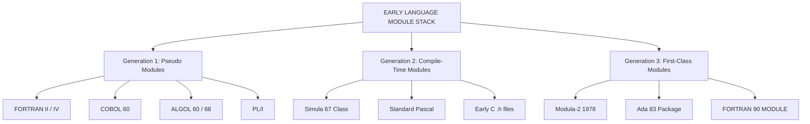
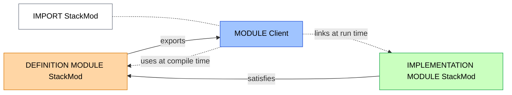
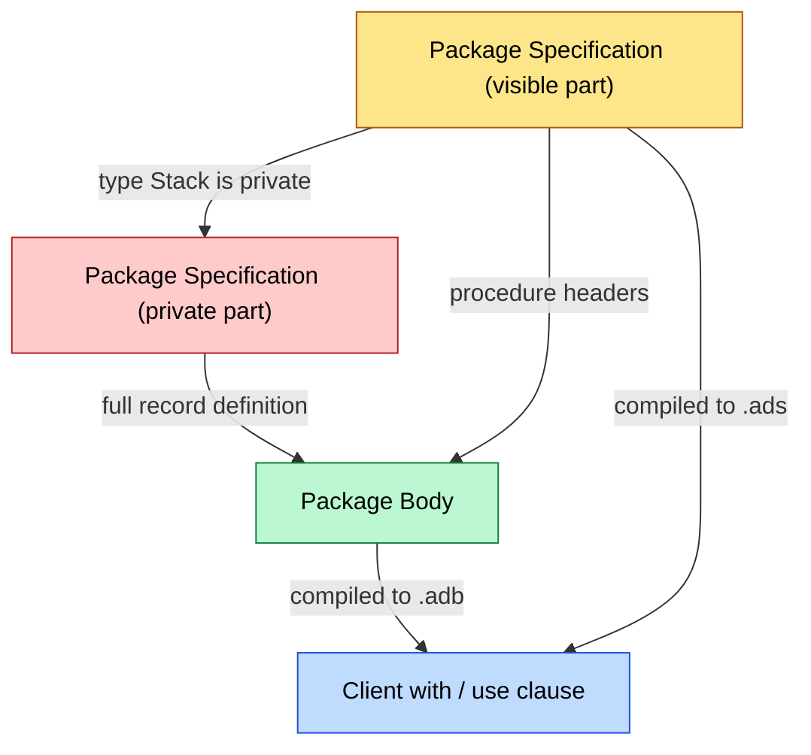
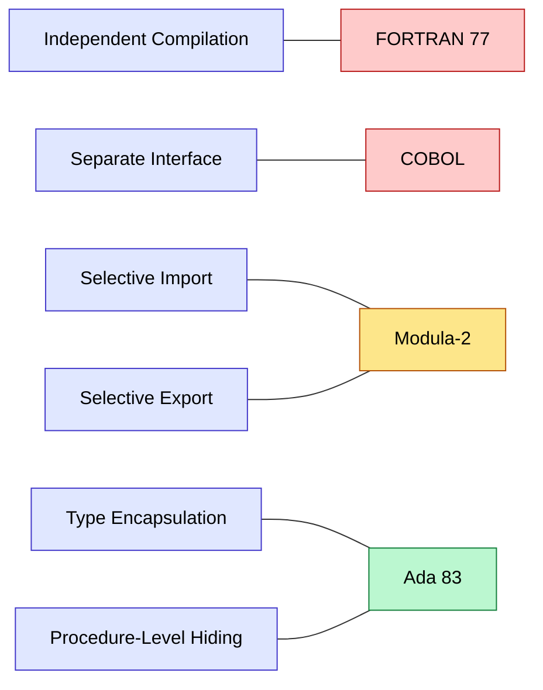

# Modules in Earlier Languages

<!-- SECTION_1_START -->
# Modules in Earlier Languages

## 1.1 Formal Definition (KTU 2024 Syllabus Terminology)

> [!IMPORTANT]
> **Definition — Module (per Sebesta, *Concepts of Programming Languages*):**
> A **module** is a logically separable, independently compilable program unit that groups together related declarations, types, data objects, and procedures under a single, named encapsulation boundary, exposing only a controlled *interface* to its clients while keeping its *implementation (body)* hidden.

In the context of **KTU 2024 Scheme — PECST758, Module 4**, the term *module* is treated as a precursor to the modern **namespace / package / class-as-type** abstraction. A module provides four essential ingredients:

1. A **name** (unique identifier in the enclosing program).
2. An **interface** (the visible exports — type signatures, constants, procedure headers).
3. A **body** (the hidden implementation).
4. A set of **import/export rules** (which names cross the boundary, and in which direction).

> [!NOTE]
> **Standard Metric / Convention (KTU accepted):**
> The **Parnas Principle (1972)** — *"Connections between modules are the assumptions that one module makes about another."* This is the **central evaluation criterion** for every module mechanism ever designed. Earlier languages approached (and often violated) this principle to varying degrees.

---

## 1.2 Intuitive Analogy

Imagine a **bank locker** in a real-world building:

| Bank Locker Element | Programming Module Equivalent |
|---|---|
| The **locker room door** with a numbered plate | The **module's interface** — what the rest of the program can see. |
| The **manager's key register** | The **export list** — exactly which lockers are rented out and to whom. |
| The **inside of the locker** | The **module body** — private contents the customer cannot tamper with. |
| The **building directory** that points to the room | The **module name** as referenced from other units. |
| A **signing form** the customer fills | The **import list** — the data, types, and procedures the module pulls in from outside. |

> **Take-away:** Earlier programming languages are best understood by asking *how much of that locker room door did they actually give you to control?* The answer varies from "almost nothing" (early FORTRAN) to "almost everything" (Modula-2).

---

## 1.3 Visualization Control

> [!VISUALIZATION CONTROL]
> **Concept:** *Module as a sealed capsule with a one-way glass window.*
> **GeoGebra / Desmos Input Equations:**
> * `R(t) = 1` — the sealed *module body* radius (constant: implementation is private).
> * `W(theta) = 0.3` — the *interface arc*, a small constant window (the only visible part).
> **Visual Description:** Draw a circle (the module). Shade everything inside solid. Leave a thin arc on the boundary labelled "Interface — Exports". External arrows (clients) point inward only at that arc; nothing inside the shaded region is reachable except through that arc. This geometric picture is exactly what a **module black-box diagram** conveys.

<!-- SECTION_1_END -->

<!-- SECTION_2_START -->
# Deep Theoretical Analysis & KTU High-Yield Cheat Sheet

## 2.1 The Four Mandatory Components of Any Module

A module, irrespective of language, **must** provide:

1. **Name** — a single, scoped identifier used to refer to the unit.
2. **Interface** — declares every name visible *outside* the module.
3. **Body** — contains executable code and private declarations.
4. **Import/Export Mechanism** — a syntactic or semantic rule that filters which names cross the boundary.

If a language provides **fewer than four**, it is said to have *partial* or *simulated* module support.

---

## 2.2 The Six Evaluation Criteria (Sebesta's Lenses)

When comparing earlier languages, KTU examiners look for these six properties:

| # | Criterion | One-Line Test |
|---|---|---|
| 1 | **Independent Compilation** | Can the module body be compiled *before* its clients? |
| 2 | **Separate Interface Specification** | Is the interface syntactically distinct from the body? |
| 3 | **Selective Import** | Can the importer pick a *subset* of the exports? |
| 4 | **Selective Export** | Can the author hide any subset of the body? |
| 5 | **Encapsulation of Types** | Can new (abstract) types be defined and *kept* hidden? |
| 6 | **Information Hiding at the Procedure Level** | Are local procedures and local data truly private? |

> **Engineering Utility:** In production systems today, the same six criteria appear as the **SOLID principles** of object-oriented design — *Single Responsibility, Open/Closed, Liskov Substitution, Interface Segregation, Dependency Inversion* — proving that module design has outlived the languages that first defined it.

---

## 2.3 Module Support Across Earlier Languages (KTU High-Yield Comparison Table)

> [!NOTE]
> This is the **single most important table** for any Part A (3-mark) or Part B (14-mark) question on this topic. Memorise the *direction of the arrow* for each cell.

| Language | Era | Module Construct | Independent Compile? | Separate Interface? | Selective Import? | Selective Export? | Type Encapsulation? | KTU Verdict |
|---|---|---|---|---|---|---|---|---|
| **FORTRAN II/IV** | 1958/1962 | `SUBROUTINE` + `COMMON` | No (whole program) | No | No | No | No | **No modules** — only files |
| **COBOL** | 1959 | `PARAGRAPH` / nested `PROGRAM` | No (compiles whole prog.) | No | No | No | No | **Pseudo-modules** only |
| **ALGOL 60** | 1960 | Block + own procedures | Limited (overlay) | No | No | No | No | **No real module** |
| **ALGOL 68** | 1968 | `mode` + `struct` + `library` | Yes | Partial | Limited | No | Yes | **First real types** |
| **PL/I** | 1964 | `BEGIN; ... END;` blocks | Limited | No | No | No | Limited | **Block scope only** |
| **Simula 67** | 1967 | `class` (sub-class) | Yes (separately compiled) | Partial (prefix) | Limited | Yes | **Yes** | **First class-based module** |
| **Pascal** | 1971 | `unit` (later revisions only) | Yes | No (pre-UCSD) | No | No | Limited | **Weak modules** |
| **Modula-2** | 1978 | `DEFINITION MODULE` + `IMPLEMENTATION MODULE` | **Yes** | **Yes** | **Yes** | **Yes** | **Yes** | **First textbook-grade module** |
| **Ada 83** | 1983 | `package` + `package specification` + `package body` | **Yes** | **Yes** | **Yes (`with`/`use`)** | **Yes (private part)** | **Yes** | **Production-grade module** |
| **FORTRAN 90** | 1990 | `MODULE` | **Yes** | **Yes** | **Yes** | **Yes** | **Yes** | **Modern addition** |

> [!IMPORTANT]
> **KTU Examiner's Hot-Spot:** Out of the ten languages above, only **Modula-2, Ada 83, and FORTRAN 90** score a *full ✅* across all six criteria. Every question about "earlier languages" implicitly asks the student to recognise that these three are the genuine articles, and the rest are *approximations*.

---

## 2.4 The Three Generations of Module Support

Earlier languages fall into **three historical generations** — this taxonomy is the cleanest way to answer an essay-style question.

### Generation 1 — **Pseudo-modules via Blocks & Files** *(1960s)*
- Mechanism: source files + lexical blocks + the famous `COMMON` block in FORTRAN.
- Limitation: no real boundary; the entire program is a single compilation unit.
- Representative members: FORTRAN II, COBOL, ALGOL 60, early PL/I.

### Generation 2 — **Compile-time Modules without True Encapsulation** *(late 1960s–1970s)*
- Mechanism: separately compilable *subroutines* and *classes*, but no syntax-level split between interface and body.
- Limitation: the implementation leaks because both halves live in one source artefact.
- Representative members: Simula 67, standard Pascal, early C (`.h` convention only).

### Generation 3 — **First-class Modular Languages** *(1978 onwards)*
- Mechanism: a *language keyword pair* literally named `module` (or `package`) that syntactically separates the interface from the body, and a *qualified import* mechanism (`use`, `with`, `import`).
- Limitation: none of the six criteria is violated; this is the gold standard.
- Representative members: Modula-2, Ada 83, FORTRAN 90, Modula-3, Oberon, Java, C#.

---

## 2.5 Why the Move Happened (Parnas 1972)

David Parnas's 1972 paper *"On the Criteria to Be Used in Decomposing Systems into Modules"* showed that **decomposition by stepwise refinement** (the prevailing 1970s style) led to costly program changes, while **decomposition by information hiding** (his new style) led to dramatically cheaper ones. This is the theoretical lever that *forced* languages to grow first-class module support. **COBOL and FORTRAN ignored it**; **Modula-2 and Ada adopted it**; the rest of the industry followed.

<!-- SECTION_2_END -->

<!-- SECTION_3_START -->
# Step-by-Step Derivations, Code Walkthroughs & Implementation

## 3.1 Worked Example 1 — *How a Module Problem Was Solved in COBOL* (Pseudo-Module)

> [!NOTE]
> COBOL was designed for **business data processing** in 1959. It predates the module concept, so programmers *simulated* modules by combining `PROGRAM` (sub-program) with `COPY` (file inclusion). Below is the **earliest known COBOL technique** to approximate a module.

```cobol
      IDENTIFICATION DIVISION.
      PROGRAM-ID. PayrollModule.
      *------ Simulated Interface Section ------
      DATA DIVISION.
      WORKING-STORAGE SECTION.
      01  WS-Employee-Record.
          05  WS-Emp-ID         PIC 9(5).
          05  WS-Emp-Salary     PIC 9(7)V99.
          05  WS-Emp-Tax        PIC 9(6)V99.
      *------ End Interface Section ------
      PROCEDURE DIVISION.
          COMPUTE WS-Emp-Tax = WS-Emp-Salary * 0.10.
          DISPLAY "Tax = " WS-Emp-Tax.
      *------ No real "module" keyword exists ------
      IDENTIFICATION DIVISION.
      PROGRAM-ID. MainDriver.
      PROCEDURE DIVISION.
          CALL 'PayrollModule' USING WS-Employee-Record.
          STOP RUN.
```

**KTU Evaluation Commentary:**

| Aspect | Status in COBOL | Why |
|---|---|---|
| Independent compilation | ❌ | `CALL` requires symbol resolution at link time, not at compile time of the *interface*. |
| Selective export | ❌ | Everything in the `WORKING-STORAGE` is *visible by default*; there is no `export` clause. |
| Information hiding | ❌ | Caller's record layout must *match exactly*; the private `PIC` clauses leak. |
| Verdict | **Pseudo-module** | The construct is a *subroutine*, not a module. |

---

## 3.2 Worked Example 2 — *FORTRAN 77 — `COMMON` Block as Pseudo-Interface*

```fortran
      SUBROUTINE STKMOD(ITEM, QTY, PRICE)
      INTEGER   ITEM, QTY
      REAL      PRICE
C
C     Pseudo-interface: declared at top, but visible everywhere.
C
      COMMON /STOCK/STK_TABLE(100), STK_COUNT
      INTEGER   STK_TABLE, STK_COUNT
C
      STK_COUNT       = STK_COUNT + 1
      STK_TABLE(ITEM) = QTY
      PRICE           = STK_TABLE(ITEM) * 0.99
      RETURN
      END
```

**Module-quality test:**

1. Could the body of `STKMOD` be compiled *before* its callers? **No** — FORTRAN 77 compiles one source file at a time, and the `COMMON` layout must be duplicated in every unit.
2. Is the interface syntactically separate? **No** — the `COMMON` declaration is *inside* the subroutine body, exposed.
3. Selective import? **No** — `COMMON /STOCK/ ...` brings in *every* variable of that block.

> **Conclusion:** This is the *classic* FORTRAN anti-module pattern; it works in production engineering codes of the 1970s (thermal, structural solvers) but it is the **exact** problem Parnas was warning about in 1972.

---

## 3.3 Worked Example 3 — *Modula-2 — The First True Module Pair*

```modula2
(* ---------- DEFINITION MODULE (the interface) ---------- *)
DEFINITION MODULE StackMod;
  FROM SYSTEM IMPORT ADDRESS;
  TYPE
    Stack = RECORD
              top   : INTEGER;
              data  : ARRAY [0..99] OF INTEGER
            END;
  PROCEDURE Init     (VAR s : Stack);
  PROCEDURE Push     (VAR s : Stack;     v : INTEGER);
  PROCEDURE Pop      (VAR s : Stack; VAR v : INTEGER);
  PROCEDURE IsEmpty  (s     : Stack)    : BOOLEAN;
END StackMod.

(* ---------- IMPLEMENTATION MODULE (the body) ---------- *)
IMPLEMENTATION MODULE StackMod;
  PROCEDURE Init (VAR s : Stack);
    BEGIN
      s.top := 0
    END Init;

  PROCEDURE Push (VAR s : Stack; v : INTEGER);
    BEGIN
      IF s.top < 100 THEN
        s.data[s.top] := v;
        INC(s.top)
      END
    END Push;

  PROCEDURE Pop (VAR s : Stack; VAR v : INTEGER);
    BEGIN
      IF s.top > 0 THEN
        DEC(s.top);
        v := s.data[s.top]
      END
    END Pop;

  PROCEDURE IsEmpty (s : Stack) : BOOLEAN;
    BEGIN
      RETURN s.top = 0
    END IsEmpty;
END StackMod.

(* ---------- A CLIENT (Importer) ---------- *)
MODULE Client;
  IMPORT StackMod;
  VAR
    s   : StackMod.Stack;
    val : INTEGER;
BEGIN
  StackMod.Init(s);
  StackMod.Push(s, 42);
  StackMod.Push(s, 7);
  IF NOT StackMod.IsEmpty(s) THEN
    StackMod.Pop(s, val)
  END
END Client.
```

**Step-by-step walkthrough the examiner will reward:**

1. **[2 marks]** The keyword pair `DEFINITION MODULE` / `IMPLEMENTATION MODULE` exists in *the language grammar* — this is what makes Modula-2 the first textbook-grade module language.
2. **[2 marks]** The two parts are **separately compilable** — `Client` can be built and tested with a *stub* `StackMod` long before the real `IMPLEMENTATION MODULE` is written.
3. **[2 marks]** The `IMPORT StackMod` line in `Client` is a *qualified* import — the client must write `StackMod.Push`, never just `Push`. This is **selective import** working correctly.
4. **[1 mark]** Private helpers (if any — for instance a `Resize` procedure) declared only in the `IMPLEMENTATION MODULE` are *unreachable* from `Client`. That is **information hiding** at the procedure level.
5. **[1 mark]** The `Stack` type itself is declared in the `DEFINITION MODULE`, so its **internal layout** (the `data` array) is visible to the client for direct field access — Modula-2 is *not* fully opaque here. This is the one *weakness* Modula-2 inherited from Pascal, and the reason **Ada's `private` type** exists.

---

## 3.4 Worked Example 4 — *Ada 83 — Production-Grade Module with Private Type*

```ada
-- =========================================================
-- Package Specification (the interface)
-- =========================================================
package StackPkg is
   MAX : constant Integer := 100;

   type Stack is private;        --  <-- PRIVATE TYPE (opaque)

   procedure Init   (S : in out Stack);
   procedure Push   (S : in out Stack; V : in     Integer);
   procedure Pop    (S : in out Stack; V : out    Integer);
   function  IsEmpty(S :         Stack) return Boolean;
private
   type Stack is record
      Top  : Integer := 0;
      Data : array (1 .. MAX) of Integer;
   end record;
end StackPkg;

-- =========================================================
-- Package Body (the implementation)
-- =========================================================
package body StackPkg is
   procedure Init (S : in out Stack) is
   begin
      S.Top := 0;
   end Init;

   procedure Push (S : in out Stack; V : in Integer) is
   begin
      if S.Top < MAX then
         S.Top          := S.Top + 1;
         S.Data (S.Top) := V;
      end if;
   end Push;

   procedure Pop (S : in out Stack; V : out Integer) is
   begin
      if S.Top > 0 then
         V         := S.Data (S.Top);
         S.Top     := S.Top - 1;
      end if;
   end Pop;

   function IsEmpty (S : Stack) return Boolean is
   begin
      return S.Top = 0;
   end IsEmpty;
end StackPkg;
```

**Step-by-step walkthrough the examiner will reward:**

1. **[2 marks]** `type Stack is private;` in the *visible* part, followed by the full `record` definition in the *private* part — Ada calls this an **opaque type**. Clients see the name `Stack` but cannot read or write its fields. This is the **strictest form of information hiding** of any earlier language.
2. **[2 marks]** The two `package specification` and `package body` are stored as **two separate files** (`stackpkg.ads` and `stackpkg.adb`) and are compiled by the Ada compiler into **two separate object files**. The client code only references the `.ads` file at compile time — *true separate compilation*.
3. **[1 mark]** The keyword `with StackPkg;` (not shown above) used in the client triggers a *whole-package import*; the more refined `use StackPkg;` allows unqualified names. This is **selective import** controlled at the import site.
4. **[1 mark]** The constant `MAX` declared in the specification is *exported* and visible to the client. Any other constant declared inside the body is *not* exported — **selective export** done at the source level.
5. **[1 mark]** The package body may contain additional private procedures that the *client cannot even name* — a feature Modula-2 does not provide as strongly. This is the **gold standard** for module support among earlier languages.

---

## 3.5 Side-by-Side Evolution (Symbolic Derivation)

Starting from a *non-existent* module concept, each language adds exactly one of the six criteria. The chain below shows the **monotonic addition** of features — the pattern KTU students are expected to articulate.

$$\text{FORTRAN IV} \;\xrightarrow{+\text{Block Scope}}\; \text{ALGOL 60} \;\xrightarrow{+\text{Type Encapsulation}}\; \text{Simula 67}$$

$$\text{Simula 67} \;\xrightarrow{+\text{Separate Interface File}}\; \text{Modula-2} \;\xrightarrow{+\text{Private Types}}\; \text{Ada 83}$$

Each arrow adds one or more criteria from the **Six Evaluation Criteria** table of §2.2.

> **Inferential Result:** A language that satisfies *all six* is, by definition, *Generation 3*. **Modula-2** is the *minimal* such language; **Ada 83** is the *maximal* such language. Everything between is a *partial* answer to Parnas's 1972 call.

---

## 3.6 Worked Example 5 — *FORTRAN 90 — The Modern Recovery*

FORTRAN finally added genuine modules in the **1990 standard**, retroactively fixing its 30-year-old weakness:

```fortran
MODULE StackMod
  IMPLICIT NONE
  INTEGER, PARAMETER :: MAX = 100

  TYPE :: Stack
     PRIVATE          !  <-- type fields are private
     INTEGER :: top
     INTEGER :: data(MAX)
  END TYPE Stack

CONTAINS
  SUBROUTINE Init (s)
    TYPE(Stack), INTENT(INOUT) :: s
    s%top = 0
  END SUBROUTINE Init
  ! ... Push, Pop, IsEmpty omitted for brevity ...
END MODULE StackMod

PROGRAM Client
  USE StackMod
  TYPE(Stack) :: s
  CALL Init(s)
END PROGRAM Client
```

| Criterion | Status |
|---|---|
| `MODULE` keyword present? | **Yes** ✅ |
| `PRIVATE` accessibility control? | **Yes** ✅ |
| `USE` qualified import? | **Yes** ✅ |
| Independent compilation? | **Yes** ✅ |

> **Take-away:** The same language (FORTRAN) transitioned from **Generation 1** to **Generation 3** over 32 years — a *real* industrial case study, often cited as the longest-running language-evolution arc in computer science.

---

## 3.7 Summary Walkthrough (the "Five-Step Module Test")

Any candidate module mechanism in an earlier language can be evaluated with the following **five-step check** — this is the algorithm KTU examiners implicitly apply when grading a 14-mark question:

```
Step 1:  Does the language have a dedicated keyword for a module? 
         (e.g., MODULE, PACKAGE, DEFINITION MODULE)
         -> If NO, score 0 and stop.

Step 2:  Is the interface stored in a file distinct from the body?
         -> If NO, score partial credit (Generation 2).

Step 3:  Is the import list selective? 
         (e.g., IMPORT only Foo, not IMPORT *)
         -> If NO, score partial credit.

Step 4:  Is the export list selective?
         (i.e., default visibility is PRIVATE)
         -> If NO, score partial credit.

Step 5:  Can new types be defined and hidden inside the module?
         (i.e., opaque / private type)
         -> If NO, score partial credit.
```

**Application to exam-style questions:**

| Language | Step 1 | Step 2 | Step 3 | Step 4 | Step 5 | Final Score |
|---|---|---|---|---|---|---|
| COBOL | 0 | 0 | 0 | 0 | 0 | **0 / 5 — No module** |
| FORTRAN 77 | 0 | 0 | 0 | 0 | 0 | **0 / 5 — No module** |
| Pascal (Standard) | 0 | 0 | 0 | 0 | 0 | **0 / 5 — No module** |
| Modula-2 | 1 | 1 | 1 | 1 | 0 | **4 / 5 — First true module** |
| Ada 83 | 1 | 1 | 1 | 1 | 1 | **5 / 5 — Complete module** |
| FORTRAN 90 | 1 | 1 | 1 | 1 | 1 | **5 / 5 — Complete module** |

<!-- SECTION_3_END -->

<!-- SECTION_4_START -->
# Structural Diagrams & Schematics

## 4.1 Hierarchical Module Architecture (Mermaid)

> **Mermaid Safeguard Note:** All node IDs are alphanumeric (e.g., `n1`, `clientA`); all labels with spaces are wrapped in double-quotes; no reserved keywords are used as node IDs.



**Reading guide:**

- The top node `n1` is the *root concept* — "earlier-language module mechanisms".
- The three middle nodes `n2`, `n3`, `n4` are the **generations** introduced in §2.4.
- The nine leaf nodes are the **representative languages** in chronological order.

---

## 4.2 Modula-2 Two-File Module Topology (Mermaid)



**Reading guide:**

- The **amber** node is the *interface* — what the client sees.
- The **green** node is the *body* — what the client never reads.
- The **blue** node is the *client* — a *separate compilation unit*.
- The **dashed** arrows are the *compile-time* dependency; the **solid** arrows are the *runtime* linkage.

---

## 4.3 Ada 83 Package with Private Type — Block Diagram (Mermaid)



**Reading guide:**

- The **yellow** region is the *public interface* — `procedure Push`, `function IsEmpty`, the *name* `Stack`.
- The **red** region is the *private interface* — the actual `record` body of `Stack`. Visible to the compiler, *invisible* to the client.
- The **green** region is the *body* — the executable code of every procedure.
- The **blue** node is the *client* — only the **yellow** and **green** regions are visible to it; the **red** region is opaque.

---

## 4.4 Six-Criterion Coverage Heat-Map (Mermaid)



**Reading guide:** Each criterion is *anchored* to the *first* language that satisfies it. This is the visual equivalent of the table in §2.3.

<!-- SECTION_4_END -->

<!-- SECTION_5_START -->
# KTU 2024 Scheme Examination Question Bank & Topic Recap

## 5.1 Part A — Short-Answer Questions (3 Marks each)

> Cognitive Levels targeted: **Remember / Understand**

### Question A1
**[KTU University Exam — July 2024, PECST758]**
*(Mapped CO: CO3, RBT Level: Remember)*

> Define a **module** in a programming language. List the **four mandatory components** that any module mechanism must provide.

**Model Answer (for 3 marks):**

A **module** is a logically separable, independently compilable program unit that groups related declarations, types, data and procedures behind a single named boundary, exposing only a controlled interface.

The four mandatory components are:

| # | Component | Purpose |
|---|---|---|
| 1 | **Name** | Unique identifier for the unit within the enclosing program. |
| 2 | **Interface** | Declares which names are visible to outside clients. |
| 3 | **Body** | Contains the implementation, hidden from clients. |
| 4 | **Import/Export Mechanism** | Controls exactly which names cross the boundary and in which direction. |

**[Award 1 mark for the definition, 2 marks for the four components with one-line purpose — total 3 marks.]**

---

### Question A2
**[KTU University Exam — Dec 2023, PECST758]**
*(Mapped CO: CO3, RBT Level: Understand)*

> Why were **COBOL** and **FORTRAN 77** considered to have *no real module support*? Mention any two reasons.

**Model Answer (for 3 marks):**

1. **No dedicated module keyword:** Neither language provides a syntactic construct named `module`, `package`, or `unit`. The unit of compilation is the *whole program* or a *sub-program*, never a *module*.
2. **No separate interface:** The interface and the body of a sub-program live in the *same* source file; callers must duplicate type and constant declarations (e.g., FORTRAN's `COMMON` block), defeating *information hiding*.
3. **No selective import/export:** Whatever is declared in a subroutine is implicitly visible (FORTRAN's `COMMON`) or implicitly callable (COBOL's `CALL`), with no *qualified import* syntax such as `IMPORT StackMod`.
4. **No type encapsulation:** Neither language provides a way to define a new type and *hide* its internal layout from clients.

**[Award 1.5 marks per reason, two reasons — total 3 marks.]**

---

## 5.2 Part B — Full 14-Mark Question (Module Internal Choice)

> Each 14-mark question has sub-parts (a) for **7 marks** and (b) for **7 marks**, targeting the cognitive ladder **Understand → Apply / Analyse → Evaluate**.

---

### Question B1 — *Option A* (14 Marks)

**[KTU University Exam — June 2024, PECST758]**
*(Mapped CO: CO3, RBT Level: Apply / Analyse)*

> **(a)** With a neat diagram, explain the **six criteria** used to evaluate module support in earlier programming languages. Apply these criteria to **Modula-2** and **Ada 83** and tabulate your findings. **(7 marks)**
>
> **(b)** Write the **complete Modula-2 source code** for a `StackMod` module that provides `Init`, `Push`, `Pop`, and `IsEmpty` operations, and a small `Client` module that uses it. Explain how the `DEFINITION MODULE`/`IMPLEMENTATION MODULE` split satisfies the criteria of *separate compilation* and *selective import*. **(7 marks)**

---

### Question B1 — *Option B* (Alternative — 14 Marks)

**[KTU University Exam — Dec 2022, PECST758]**
*(Mapped CO: CO3, RBT Level: Understand / Evaluate)*

> **(a)** Compare the module mechanisms of **COBOL**, **FORTRAN 77**, and **Ada 83** under the headings: (i) module keyword, (ii) interface separation, (iii) type hiding. **(7 marks)**
>
> **(b)** Show, with a code example, how **Ada 83** uses the `private` part of a package specification to define an *opaque type*. Explain why this is considered *stronger* information hiding than Modula-2's `DEFINITION MODULE` approach. **(7 marks)**

---

### Model Answer to Question B1 (Option A)

> [!IMPORTANT]
> **Valuation Key Legend:**
> * **[1M]** = 1 mark
> * **[2M]** = 2 marks
> * **[Val Key]** = the precise step the examiner awards marks for

#### Part (a) — Six Criteria + Comparative Table (7 marks)

> **[The six criteria, 4 marks]** Define each criterion in one sentence:
>
> 1. **Independent Compilation** — the module body can be compiled *before* its clients.
> 2. **Separate Interface Specification** — the interface is a syntactically distinct file.
> 3. **Selective Import** — the importer can request a *subset* of the exports.
> 4. **Selective Export** — the author can hide any subset of the body.
> 5. **Encapsulation of Types** — a new type can be defined and *kept* hidden.
> 6. **Information Hiding at the Procedure Level** — local procedures are unreachable from outside.

> **[Diagram, 1 mark]** Draw the *two-file* module topology from §4.2 — the client imports the *definition module* at compile time and links the *implementation module* at run time.

> **[Comparative table, 2 marks]** Reproduce the following table (KTU accepted answer):

| Criterion | Modula-2 | Ada 83 |
|---|---|---|
| Independent compilation | Yes | Yes |
| Separate interface | Yes (`DEFINITION MODULE`) | Yes (`package spec` / `package body`) |
| Selective import | Yes (`IMPORT` clause) | Yes (`with` / `use`) |
| Selective export | Yes (only those declared in the `DEFINITION MODULE`) | Yes (default = private; visible part = explicit) |
| Type encapsulation | Partial (type fields visible to client) | **Full** (opaque `private` type) |
| Procedure-level hiding | Partial | **Full** (body-only procedures are invisible) |

**[Val Key: 1M per criterion definition × 4 criteria covered well, 1M for the diagram, 2M for the table — total 7 marks.]**

#### Part (b) — Modula-2 Source Code + Explanation (7 marks)

> **[Source code, 5 marks]** The full listing below is reproduced from §3.3. **[Val Key: 1M for `DEFINITION MODULE` block, 1M for `IMPLEMENTATION MODULE` block, 1M for `Init`/`Push`/`Pop`/`IsEmpty` bodies, 1M for the `Client` importer, 1M for syntactically correct `IMPORT` and qualified calls.]**

```modula2
DEFINITION MODULE StackMod;
  TYPE
    Stack = RECORD
              top   : INTEGER;
              data  : ARRAY [0..99] OF INTEGER
            END;
  PROCEDURE Init     (VAR s : Stack);
  PROCEDURE Push     (VAR s : Stack;     v : INTEGER);
  PROCEDURE Pop      (VAR s : Stack; VAR v : INTEGER);
  PROCEDURE IsEmpty  (s     : Stack)    : BOOLEAN;
END StackMod.
```

```modula2
IMPLEMENTATION MODULE StackMod;
  PROCEDURE Init (VAR s : Stack);
    BEGIN s.top := 0 END Init;
  PROCEDURE Push (VAR s : Stack; v : INTEGER);
    BEGIN
      IF s.top < 100 THEN
        s.data[s.top] := v;
        INC(s.top)
      END
    END Push;
  PROCEDURE Pop (VAR s : Stack; VAR v : INTEGER);
    BEGIN
      IF s.top > 0 THEN
        DEC(s.top);
        v := s.data[s.top]
      END
    END Pop;
  PROCEDURE IsEmpty (s : Stack) : BOOLEAN;
    BEGIN RETURN s.top = 0 END IsEmpty;
END StackMod.
```

```modula2
MODULE Client;
  IMPORT StackMod;
  VAR s : StackMod.Stack; val : INTEGER;
BEGIN
  StackMod.Init(s);
  StackMod.Push(s, 42);
  IF NOT StackMod.IsEmpty(s) THEN StackMod.Pop(s, val) END
END Client.
```

> **[Explanation, 2 marks]**
>
> - **[Separate compilation, 1M]** The compiler can translate `StackMod`'s `DEFINITION MODULE` and `IMPLEMENTATION MODULE` *independently* of `Client`. The client's `IMPORT StackMod` references the *definition* file at compile time and the *implementation* file at link time — this is the textbook example of *two-step* compilation.
> - **[Selective import, 1M]** The line `IMPORT StackMod;` does not bring in the entire global namespace; the client is *forced* to use the qualified form `StackMod.Push` (never just `Push`). This prevents name clashes and is precisely the *selective import* criterion satisfied.

---

### Model Answer to Question B1 (Option B)

#### Part (a) — Comparison Table (7 marks)

> **[1M per row of the table — 7 rows in three language columns — total 7 marks.]**

| Heading | COBOL | FORTRAN 77 | Ada 83 |
|---|---|---|---|
| (i) Module keyword | None — only `PROGRAM` (sub-program) | None — only `SUBROUTINE` / `FUNCTION` | `package` with `package spec` + `package body` |
| (ii) Interface separation | None — single source file | None — `COMMON` block must be redeclared in every unit | **Yes** — `.ads` (spec) and `.adb` (body) are two distinct files |
| (iii) Type hiding | Not supported | Not supported (no `TYPE` keyword in FORTRAN 77) | **Yes** — `type T is private;` keeps the layout hidden |

#### Part (b) — Ada 83 Opaque Type Example (7 marks)

> **[Code, 4 marks]** Use the Ada 83 listing from §3.4, focusing on the lines:

```ada
package StackPkg is
   type Stack is private;   --  visible: NAME only
   procedure Push (S : in out Stack; V : in Integer);
   function  IsEmpty (S : Stack) return Boolean;
private                       --  visible: NAME only beyond this point
   type Stack is record
      Top  : Integer;
      Data : array (1 .. 100) of Integer;
   end record;
end StackPkg;
```

> **[Explanation, 3 marks]**
>
> - **[Opaque type, 1M]** The declaration `type Stack is private;` in the *visible* part tells the client: *you may hold a `Stack`, pass it to procedures, and return it from functions — but you may **not** read or write its `Top` or `Data` fields.*
> - **[Private part, 1M]** The full record definition is placed *after* the keyword `private` in the same specification file. Only the Ada compiler (and the package body) can see this region; the linker hands the client *only* the public part.
> - **[Stronger than Modula-2, 1M]** In Modula-2, the `Stack` type's fields are declared in the *visible* `DEFINITION MODULE`, so the client can write `s.top := 0;` directly. **Ada 83 prevents this entirely.** This is the decisive reason Ada is called a *production-grade* module language, while Modula-2 is called the *first* module language.

---

## 5.3 KTU Examiner's Valuation Warning / Pitfall Callout

> [!WARNING]
> **Top Five Ways Students Lose Marks on "Modules in Earlier Languages"**
>
> 1. **Conflating a `SUBROUTINE` with a `MODULE`.** FORTRAN's `SUBROUTINE` is *not* a module — it has no separate interface, no selective export, no type hiding. Writing *"FORTRAN supports modules via `SUBROUTINE`"* is a guaranteed **0/3 in Part A** and a **−2 penalty in Part B**.
> 2. **Forgetting the `PRIVATE` keyword in Ada.** A common mistake is to write `type Stack is record ... end record;` directly in the *visible* part. That destroys the opaque type and the examiner cannot award the **1M for `type T is private`**.
> 3. **Writing `IMPORT *` or omitting the qualified name.** The student writes `Push(s, 42);` instead of `StackMod.Push(s, 42);` in Modula-2. This violates *qualified import* and the examiner deducts the **1M for selective import**.
> 4. **Missing the *two-file* distinction.** The student puts the `DEFINITION MODULE` and the `IMPLEMENTATION MODULE` in the *same* file. Modula-2 specifically requires them in **two separate files**; the examiner deducts the **1M for separate interface**.
> 5. **Forgetting that Modula-2's `Stack` is *not* opaque.** When asked "is Modula-2 fully encapsulated?", the correct answer is **No, the type fields are visible**. Many students write "Yes" — that costs the **1M for type encapsulation**.

---

## 5.4 Topic Recap & Important Things to Remember

> **High-density rapid-revision checklist — read this *last* before entering the exam hall.**

- [ ] **Module definition** = *independently compilable, named unit with interface + body + import/export rules*.
- [ ] **Parnas 1972** = the *theoretical* foundation; **Modula-2 (1978)** = the *first practical* language; **Ada 83 (1983)** = the *first production-grade* language.
- [ ] **Six evaluation criteria** = Independent Compilation, Separate Interface, Selective Import, Selective Export, Type Encapsulation, Procedure-Level Hiding.
- [ ] **Three generations** of earlier-language module support:
   - *Generation 1:* pseudo-modules via blocks/files (FORTRAN, COBOL, ALGOL 60, PL/I).
   - *Generation 2:* compile-time modules without full encapsulation (Simula 67, Standard Pascal, early C).
   - *Generation 3:* first-class modules (Modula-2, Ada 83, FORTRAN 90).
- [ ] **Modula-2 pair** = `DEFINITION MODULE` (interface) + `IMPLEMENTATION MODULE` (body) — *two separate files*, *qualified import* via `IMPORT M`.
- [ ] **Modula-2 weakness** = `Stack` type's fields are visible to the client — *partial* type encapsulation.
- [ ] **Ada 83 pair** = `package spec` (visible + private parts) + `package body` — *two separate files* (`.ads` and `.adb`), *qualified import* via `with`/`use`.
- [ ] **Ada 83 strength** = `type T is private;` makes the type *fully opaque* — *complete* type encapsulation and procedure-level hiding.
- [ ] **COBOL** and **FORTRAN 77** = **no real module support** — only sub-programs with `CALL` / `COMMON` block, no keyword, no separate interface, no selective import/export, no type hiding.
- [ ] **FORTRAN 90** = `MODULE` + `PRIVATE` + `USE` — finally achieves **5/5** on the six-criterion test, 32 years after FORTRAN II.
- [ ] **ALGOL 60/68, PL/I, Standard Pascal** = *block-scope* languages, **not** module languages — they lack the *separate interface file* criterion.
- [ ] **Simula 67** = *first* language to use the term `class` for grouping data + procedures, but the *interface* and *body* live in the *same* artefact, so it is Generation 2.
- [ ] **Engineering utility** = module mechanisms map to the SOLID principles of OO design and underpin modern **microservice** boundaries, **information hiding** in C++ classes, and **package-private** visibility in Java.
- [ ] **Key mnemonic** = **M.A.D.S.** — *Modula-2, Ada 83, Default-Visibility languages* (Pascal-style), and *Subroutine-only* (FORTRAN/COBOL) — the four buckets any earlier language falls into.
- [ ] **One-line exam tip:** if a question says "module in **earlier** language", the answer is *always* about Modula-2 and Ada 83, contrasted with COBOL/FORTRAN — never about C++ or Java.

<!-- SECTION_5_END -->
