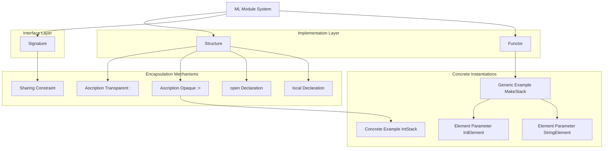
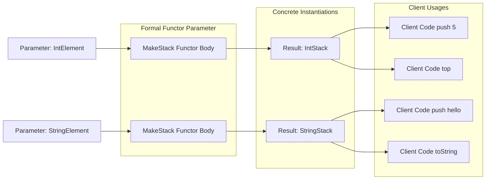
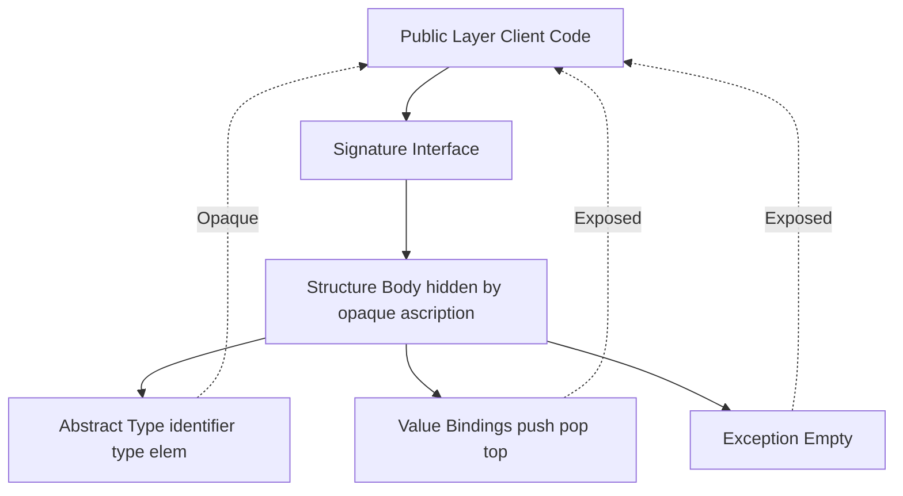

# Modules in ML

<!-- SECTION_1_START -->
# Modules in ML — Core Technical Definition & Intuitive Overview

In the context of **Standard ML (SML)** — the academic functional language that forms the historical backbone of the *Programming Languages* syllabus (PECST758) — a **module** is a *named, first-class program-organisation unit* that bundles together type bindings, value bindings, and exception bindings behind a *separately declared interface*. The ML module system is **statically checked**, **hierarchical**, and **parameterisable**, making it one of the most rigorously engineered module systems in the history of programming-language design (originally developed by David MacQueen for the SML definition in 1985).

> [!IMPORTANT]
> **KTU 2024 Syllabus Tag (Module 4 — Abstract Data Types and Modules):**
> The term "ML" in the syllabus explicitly refers to **Standard ML**. A student is expected to be able to *write*, *read*, and *debug* SML module constructs: **structures**, **signatures**, **ascription**, **functors**, **sharing constraints**, and **open** declarations.

## 1.1 The Three Pillars of the ML Module System

| Pillar | Keyword | Role | Intuitive Analogy |
| :--- | :---: | :--- | :--- |
| **Structure** | `structure` | The *implementation* — a record of types/values/exceptions | A sealed *black box* containing the actual code |
| **Signature** | `signature` | The *interface* — declares the names and types of what a structure exposes | A *public header* / *contract* printed on the box |
| **Functor** | `functor` | A *structure-level function* that maps one structure to another | A *factory* that assembles a new box using parts from another box |

> [!NOTE]
> **Critical Distinction (Module vs ADT):**
> An **Abstract Data Type (ADT)** hides a *single* type behind a set of operations.
> An **ML module** hides a *collection* of related types, values, and exceptions behind a *signature*.
> ML modules are therefore **ADTs elevated to the level of the entire namespace** — they support *multiple* abstract types, *separate compilation*, and *parameterisation* (via functors) that classic ADT encodings in languages like Pascal or C cannot offer.

## 1.2 Intuitive Overview — The "Engineering Blue-Print" Analogy

Imagine a **mechanical engineering firm** that designs gearboxes:

1. The **blueprint** of a gearbox (input shafts, output shafts, tolerances, gear ratios visible to the customer) is the **signature**.
2. The **manufactured, bolted-together gearbox** sitting on the workbench is the **structure**.
3. The **assembly line** that takes *a certain kind of steel* and *a certain kind of lubricant specification* and produces a fully assembled gearbox is the **functor** — it consumes one module (a "materials" structure) and produces another module (a "gearbox" structure).
4. The **type plate riveted to the gearbox** is the **ascription** — it publicly asserts "this object realises this blueprint", and depending on whether the rivets show the internal model number or not, the ascription is *transparent* (`: `) or *opaque* (`:>`).

> [!VISUALIZATION CONTROL]
> **Concept:** Visualising a *Structure* as a labelled rectangle, its *Signature* as the visible name-tag, and a *Functor* as an arrow from one rectangle to another.
> **GeoGebra / Desmos Input Equations:**
> * `Box(Structure) = {(x,y) \mid -1 \le x \le 3, -1 \le y \le 1}`
> * `Box(Signature) = {(x,y) \mid 1 \le x \le 2.5, 0.9 \le y \le 1.1}`  *(overlaid on top of the structure box)*
> * `Arrow(Functor) = (x_1(t),y_1(t)) \to (x_2(t),y_2(t))`  *parameterised by `t \in [0,1]`*
> **Visual Description:** The student should picture the structure as a large opaque box. A thin labelled strip across the top (the signature) lists the exported identifiers. A horizontal arrow entering from the left and exiting on the right depicts a functor *consuming* one structure and *producing* another.
<!-- SECTION_1_END -->

<!-- SECTION_2_START -->
# Deep Theoretical Analysis & KTU High-Yield Formula Sheet

## 2.1 Structures — The Implementation Unit

A **structure** is a `struct … end` declaration that groups related bindings. The bindings may be:

- **Type bindings** (e.g. `type 'a tree = Empty | Node of 'a * 'a tree * 'a tree`)
- **Value bindings** (e.g. `val size : int = 42`)
- **Exception bindings** (e.g. `exception Empty`)
- **Nested module bindings** (sub-structures or sub-signatures)
- **Module-level `let` / `local` declarations** (private helpers)

The **type-checking rule** is that *all names inside a structure must be uniquely defined*. The structure is *closed* — names not declared inside it are not visible.

## 2.2 Signatures — The Interface Unit

A **signature** is a `sig … end` declaration. It is the **type of a structure**. Anything declared in a signature is what the outside world is allowed to *see*; everything else is hidden.

A signature can declare:

- `type T` — an abstract type, whose underlying definition is hidden.
- `type T = τ` — a type *equational specification*, which **exposes** the identity of `T`.
- `val x : τ` — a value specification (the body is hidden).
- `exception E of τ` — an exception specification.
- `structure S : SIG` — a sub-structure specification.
- `sharing type S.T = S'.T` — a sharing constraint (discussed below).
- `include SIG` — pulls in another signature verbatim.

> [!NOTE]
> **Equational vs Abstract Type Specifications:**
> `type t = int list` in a signature **leaks** that `t` is the same as `int list`.
> `type t` in a signature **hides** the implementation. This distinction is the *core mechanism* by which ADT encapsulation is achieved in ML.

## 2.3 Ascription — Binding a Structure to a Signature

Ascription is the act of declaring a structure under a signature constraint. There are two flavours:

| Form | Syntax | Behaviour | Type Identity |
| :--- | :---: | :--- | :--- |
| **Transparent** | `structure S : SIG = struct … end` | The signature is *matched*; if the structure defines more, those extra names **remain visible** | Type equalities from `SIG` are **preserved** |
| **Opaque** | `structure S :> SIG = struct … end` | The signature is *enforced*; any extra names in the structure are **hidden** | Type equalities from `SIG` are **deliberately discarded** — `S.t` becomes a fresh abstract type |

> [!IMPORTANT]
> **Opaque ascription (`:>`)** is the *one-line mechanism* by which ML converts a concrete structure into a true ADT. The signature becomes the *public* view, and the internal representation is unobservable. This is what the syllabus means by *"abstract data types via modules"*.

## 2.4 Functors — Parameterised Modules

A **functor** is a *function from structures to structures*. It is the module-level equivalent of a higher-order function. A functor can be:

- **Total** (defined for all argument structures that match the parameter signature)
- **Constrained** (requires the argument to satisfy a sharing constraint)
- **Multiple-argument** (declared with multiple `(` `)` parameters)

Syntax:
```sml
functor MakeOrderedList (Element : ORDERED) :> ORDERED_LIST = struct … end
```

> [!NOTE]
> **Functor Instantiation Rule:**
> When a functor is *applied* (e.g. `structure IntList = MakeOrderedList(Int)`), the compiler *statically* copies the body of the functor, substitutes the actual argument structure for the formal parameter, and re-type-checks. The result is a fully concrete structure; no run-time overhead exists compared to writing the code by hand.

## 2.5 Sharing Constraints

When two structures are passed to a functor, the compiler may not know that two abstract types are *the same*. A **sharing constraint** forces this:

```sml
functor Combine (A : SIG_A, B : SIG_B) :> SIG_OUT = struct … end
   where type A.t = B.t
```

Alternatively, an *equational* signature specification `type t = B.t` performs the same role.

## 2.6 `open`, `local`, and Module-level `let`

- `open Stack` brings all identifiers of structure `Stack` directly into the current scope, allowing `push` instead of `Stack.push`. **Overuse pollutes the namespace**; judicious use inside narrow scopes is best practice.
- `local structure S = struct … end in … end` creates a *private* structure visible only inside the `in … end` block.
- Module-level `let` (`let val x = 5 in struct … end`) introduces *local value bindings* into a structure body.

## 2.7 KTU Formula Sheet / Cheat Sheet

| Construct | Syntax | Visibility Effect | Type-Identity Effect |
| :--- | :--- | :--- | :--- |
| Structure declaration | `structure S = struct … end` | All bindings visible internally | None |
| Signature declaration | `signature SIG = sig … end` | N/A (interface only) | N/A |
| Transparent ascription | `structure S : SIG = struct … end` | Only signature names public | Type equalities *preserved* |
| Opaque ascription | `structure S :> SIG = struct … end` | Only signature names public; extras hidden | Type equalities *hidden* — fresh abstract type |
| Abstract type in sig | `type t` | Name visible, body hidden | New abstract type |
| Equational type in sig | `type t = τ` | Name + identity visible | Identical to τ |
| Functor declaration | `functor F (X : SIG1) :> SIG2 = struct … end` | X is a formal parameter | Body is re-checked at each application |
| Functor application | `structure S = F(arg)` | Produces concrete structure | Statically expanded |
| Sharing constraint | `where type A.t = B.t` | N/A | Forces `A.t` and `B.t` to be the same type |
| `open` | `open S` | All names of S in current scope | N/A |
| `local` … `in` | `local … in … end` | Private bindings inside `in` block | N/A |
| Type component | `type 'a stack` | Polymorphic type declaration | Universally quantified |
| Sub-structure in sig | `structure S : SUB_SIG` | Sub-module access via `Outer.S` | Modular name-spacing |
| Exception declaration | `exception E of τ` | Carries a value of type τ when raised | N/A |

> [!NOTE]
> **Real-world engineering utility:**
> The ML module system is the direct intellectual ancestor of the *signature* mechanism in Haskell, the *trait* / *impl* block system in Rust, the *package + interface* design in Go, and the *module / functor* / *signature* design in OCaml (a dialect of ML). Mastering SML modules provides the conceptual foundation for understanding *generic programming*, *dependency injection*, and *interface-oriented design* in any modern language.
<!-- SECTION_2_END -->

<!-- SECTION_3_START -->
# Step-by-Step Derivations & Code Implementation

This section proceeds from the simplest structure up to a fully parameterised functor-based stack library, with every SML keyword and binding shown explicitly. No steps are omitted.

## 3.1 A Minimal Structure with its Signature

The following defines a **stack of integers** as a *list-based* structure, then binds it to a signature that hides the fact that the implementation is a list.

```sml
(* ---------- 1. The Signature (the interface) ---------- *)
signature INT_STACK =
sig
    type stack                         (* abstract type - body hidden *)
    exception Empty                    (* raised on illegal pop/top *)
    val empty  : stack                 (* the empty stack value     *)
    val push   : int * stack -> stack   (* push an int              *)
    val pop    : stack -> stack         (* remove the top element   *)
    val top    : stack -> int           (* peek at the top element  *)
    val isEmpty: stack -> bool          (* predicate                *)
end;

(* ---------- 2. The Structure (the implementation) ---------- *)
structure IntStack :> INT_STACK =
struct
    type stack      = int list
    exception Empty
    val empty       = []
    fun push (x, s) = x :: s
    fun pop []      = raise Empty
      | pop (_::s)  = s
    fun top []      = raise Empty
      | top (x::_)  = x
    fun isEmpty []  = true
      | isEmpty _   = false
end;
```

### 3.1.1 Step-by-step explanation of every line

1. `signature INT_STACK = sig … end;` — declares an *interface* named `INT_STACK`. The body of `type stack` is intentionally **not** specified, making it abstract.
2. `exception Empty` — declared in the signature so that any client of `IntStack` is permitted to *handle* the `Empty` exception.
3. `val empty : stack` — the value `empty` is of the abstract type `stack`. The signature does **not** specify that it is `[]`.
4. `structure IntStack :> INT_STACK = struct … end;` — the `:>` (opaque ascription) **hides** the fact that `stack` is `int list`. Inside the body, the compiler knows it is `int list`; from outside, it is an *opaque* type that cannot be inspected.
5. `type stack = int list` — the *internal* definition. Because the ascription is opaque, this equation is **discarded** in the external view.
6. `fun push (x, s) = x :: s` — prepends `x` to the list `s`, which is the natural O(1) implementation for a stack on a singly-linked list.
7. `fun pop [] = raise Empty` — pattern-matches the empty case and raises the exception. The second clause `pop (_::s) = s` discards the head (the `_` wildcard) and returns the tail.
8. `fun top [] = raise Empty` and `top (x::_) = x` — analogous to `pop`, but returns the head instead of the tail.
9. `fun isEmpty [] = true` and `isEmpty _ = false` — the standard "empty?" predicate.

> [!IMPORTANT]
> **Demonstration of the opaque effect:** If a client writes `IntStack.push (1, IntStack.empty)`, the result is of type `IntStack.stack`, and the client **cannot** write `hd s = 1` to inspect it, because `stack` is not known to be a list outside the structure. The abstract data type is fully enforced by the *type checker*, not by convention.

## 3.2 A Generic Stack via a Functor

A *real* stack library should not be restricted to `int`. We now *parameterise* the stack over the element type.

```sml
(* ---------- 1. Element Signature (the parameter spec) ---------- *)
signature ELEMENT =
sig
    type t                       (* the element type is opaque *)
    val toString : t -> string   (* required for pretty printing *)
end;

(* ---------- 2. Stack Signature (the result spec) ---------- *)
signature STACK =
sig
    type elem
    type stack
    exception Empty
    val empty    : stack
    val push     : elem * stack -> stack
    val pop      : stack -> stack
    val top      : stack -> elem
    val isEmpty  : stack -> bool
    val toString : stack -> string
end;

(* ---------- 3. The Functor (parameterised structure) ---------- *)
functor MakeStack (Element : ELEMENT) :> STACK =
struct
    type elem         = Element.t
    type stack        = elem list
    exception Empty

    val empty         = []

    fun push (x, s)   = x :: s

    fun pop []        = raise Empty
      | pop (_ :: s)  = s

    fun top []        = raise Empty
      | top (x :: _)  = x

    fun isEmpty []    = true
      | isEmpty _     = false

    fun toString []   = "[]"
      | toString [x]  = "[" ^ Element.toString x ^ "]"
      | toString (x::xs) =
            "[" ^ Element.toString x ^ "," ^ toString xs
end;

(* ---------- 4. Two Concrete Element Structures ---------- *)
structure IntElement :> ELEMENT =
struct
    type t        = int
    fun toString n = Int.toString n
end;

structure StringElement :> ELEMENT =
struct
    type t        = string
    fun toString s = s
end;

(* ---------- 5. Functor Application ---------- *)
structure IntStack    = MakeStack (IntElement);
structure StringStack = MakeStack (StringElement);
```

### 3.2.1 Step-by-step explanation

1. The `ELEMENT` signature declares a *black-box* element type `t` plus a *required* `toString` function. Any structure passed to `MakeStack` must supply both.
2. The `STACK` result signature contains **two** abstract types: `elem` (the element type) and `stack` (the internal storage type). Both are hidden from clients.
3. `functor MakeStack (Element : ELEMENT) :> STACK = struct … end;` — declares a *module-level function*. The body uses `Element.t` (the element type) as if it were a free variable — the compiler will resolve it at *application time*.
4. The body implements the same list-based stack, but parametrised over `Element.t`. The `toString` helper uses `Element.toString` recursively.
5. `IntElement` and `StringElement` are two concrete *parameter* structures, each providing a different interpretation of `t`.
6. `structure IntStack = MakeStack (IntElement);` — *instantiates* the functor. The compiler *copies* the body of `MakeStack`, substitutes `IntElement` for `Element`, re-type-checks, and produces a fully concrete structure `IntStack`. There is **no run-time cost** — instantiation happens at compile time.
7. Inside `IntStack`, the type `elem` is *equal* to `int`, but **outside** the structure, `IntStack.elem` is an abstract type. This is enforced by the opaque ascription `:> STACK`.

## 3.3 Sharing Constraint Example — Combining Two Parameter Structures

A common pattern is a *dictionary* functor that takes both a **key** structure and a **value** structure. We need a way to express "the key and the value are independent types".

```sml
signature KEY =
sig
    type k
    val eq : k * k -> bool
    val hash : k -> int
end;

signature VALUE =
sig
    type v
    val default : v
end;

signature DICT =
sig
    type key
    type value
    type dict
    val empty : dict
    val insert : key * value * dict -> dict
    val lookup : key * dict -> value option
end;

functor MakeDict (K : KEY) (V : VALUE) :> DICT =
struct
    type key    = K.k
    type value  = V.v
    type dict   = (K.k * V.v) list
    val empty   = []

    fun insert (k, v, []) = [(k, v)]
      | insert (k, v, (k', v') :: rest) =
            if K.eq (k, k') then (k, v) :: rest
            else (k', v') :: insert (k, v, rest)

    fun lookup (k, [])        = NONE
      | lookup (k, (k', v') :: rest) =
            if K.eq (k, k') then SOME v'
            else lookup (k, rest)
end;
```

**Explanation of every binding:**

- `K : KEY` and `V : VALUE` are two *formal* functor parameters; the functor is *curried* (it can be partially applied).
- `type key = K.k` and `type value = V.v` — the abstract types of the result signature are *defined in terms of* the parameter types, but are still abstract from the outside.
- `type dict = (K.k * V.v) list` — the internal representation is a list of key-value pairs.
- `insert` walks the list and *replaces* a pair if the key matches, otherwise *prepends* — a classic O(n) list-based dictionary. The use of `K.eq` (the parameter's equality function) makes the comparison *abstract*.
- `lookup` returns a `value option`, which is either `SOME v` if found or `NONE` if not found — the *idiomatic* ML alternative to null pointers.

## 3.4 `open`, `local`, and Module-level `let`

The following example demonstrates each of the three secondary module-level constructs.

```sml
(* local creates a private structure visible only inside 'in ... end' *)
local
    structure Helper =
    struct
        fun square x = x * x
        fun cube   x = x * x * x
    end
in
    structure Math =
    struct
        val sq2 = Helper.square 2
        val cb3 = Helper.cube   3
        (* Helper is NOT visible here; the functions were inlined at compile time *)
    end
end;

(* open brings the names of a structure into the current scope *)
val sixteen = let
    open Math
in
    sq2 * sq2   (* = 16 *)
end;

(* module-level let for local values inside a structure *)
structure Counter =
struct
    let val initial = 0
    in
        val getValue = initial
    end
end;
```

**Step-by-step explanation:**

- `local structure Helper = struct … end in structure Math = struct … end end;` — `Helper` exists *only* while `Math` is being defined. The functions `square` and `cube` are *evaluated* at structure-construction time, so `Math.sq2` and `Math.cb3` are constants.
- `let open Math in sq2 * sq2 end;` — opens `Math` *only* within the `let` expression. This is the *recommended* form of `open` because it limits namespace pollution to a single expression.
- `let val initial = 0 in val getValue = initial end` — declares a *local* value `initial` inside a structure. The outer world cannot see `initial`; it can only see `getValue`. This is the structure-level analogue of a function's local `let`.

## 3.5 Symbolic Mathematical Notation — The Functor-Type Inference Rule

For KTU students writing theory-of-programming-languages questions, the **type rule** for functors is conventionally written as:

$$
\frac{\Gamma, X : \Sigma_1 \vdash E : \Sigma_2 \quad \Gamma \vdash A : \Sigma_1}{\Gamma \vdash \textit{functor } F (X : \Sigma_1) = E \;\; : \;\; \Sigma_1 \to \Sigma_2 \qquad \Gamma \vdash F(A) : \Sigma_2[A/X]}
$$

**Reading of the rule:**

- The premise above the line states: *"assuming a structure variable $X$ of signature $\Sigma_1$ in the environment $\Gamma$, the body $E$ has signature $\Sigma_2$"*.
- The conclusion (left) states: *"$F$ is a functor of type $\Sigma_1 \to \Sigma_2$"*.
- The conclusion (right) states: *"$F(A)$ — the application of $F$ to argument $A$ — has signature $\Sigma_2$ with $A$ substituted for $X$"*.

This is the **SML module-level analog of the simply-typed lambda-calculus function rule**, and it appears verbatim in many KTU Module-4 questions.
<!-- SECTION_3_END -->

<!-- SECTION_4_START -->
# Structural Diagrams & Schematics

## 4.1 Mermaid Diagram — The ML Module Hierarchy



## 4.2 Mermaid Diagram — Data-Flow Through a Functor Pipeline



## 4.3 Mermaid Diagram — Encapsulation Comparison: ADT vs Module



## 4.4 Block-Level Functional Architecture Flow

| Phase | Input | Module Construct | Output |
| :--- | :--- | :--- | :--- |
| 1. Declare interface | Domain requirements | `signature NAME = sig … end` | A *type* for the future structure |
| 2. Declare implementation | Algorithm choices | `structure NAME = struct … end` | An *unconstrained* structure |
| 3. Enforce encapsulation | Security / reusability needs | `structure NAME :> SIG = struct … end` | An *opaque* structure — true ADT |
| 4. Parameterise | Need for reusability across types | `functor F (P : SIG_P) :> SIG_R = struct … end` | A *generic* module factory |
| 5. Apply parameter | A concrete element structure | `structure S = F(arg)` | A *concrete instance* structure |
| 6. Constrain types | Multiple parameter structures | `where type A.t = B.t` | A *typed* functor application |

<!-- SECTION_5_START -->
# KTU 2024 Scheme Examination Question Bank & Topic Recap

## Part A — Short-Answer Questions (3 Marks Each)

### Question 1. `[KTU University Exam — July 2024]`  CO3 / Remember
**Differentiate between a *structure* and a *signature* in Standard ML. Illustrate with a one-line example of each.**

**Model Answer (3 Marks):**

| Aspect | Structure | Signature |
| :--- | :--- | :--- |
| Keyword | `structure` | `signature` |
| Purpose | Groups *implementations* of types/values/exceptions | Declares the *interface* — names and types of what is exposed |
| Analogy | A manufactured component | The blueprint / data-sheet of the component |

```sml
structure StackImpl = struct val empty = [] end;
signature  STACK_SIG = sig val empty : int list end;
```
*(Award 1 Mark for the distinction table, 1 Mark for the structural difference, 1 Mark for the example.)*

### Question 2. `[KTU University Exam — Dec 2023]`  CO3 / Understand
**Explain the difference between transparent ascription (`:`) and opaque ascription (`:>`) in SML.**

**Model Answer (3 Marks):**
- **Transparent ascription** (`: `) enforces the signature but **preserves** the type equations declared with `=` inside the signature. Any *extra* declarations in the structure body remain visible to clients. (1 Mark)
- **Opaque ascription** (`:>`) enforces the signature and **discards** the type equations, treating each `type t` as a fresh abstract type. Extra declarations in the structure are also hidden. (1 Mark)
- **Use case:** Transparent ascription is for *lightweight interface enforcement*; opaque ascription is the canonical *ADT-encapsulation* mechanism in ML. (1 Mark)

---

## Part B — Long-Answer Questions (14 Marks Each, ESE Module Internal Choice)

### Question A `[KTU University Exam — Model Paper 2024]`  CO3 / Understand + Apply
**(a)** *Explain the concept of a *functor* in Standard ML with its general syntax. State the **functor-type inference rule** in symbolic form. (7 Marks — Understand)
**(b)** Write a complete SML module that defines a generic **priority queue** as a functor, parameterised over an `ORDERED` element structure. Show two concrete applications: one for integers and one for strings. (7 Marks — Apply)

#### Model Solution — Part (a) (7 Marks)

> **Definition (2 Marks):** A *functor* in SML is a *parameterised module* — a function whose domain and range are structures, not values. It is declared with the keyword `functor` and may be curried over multiple argument structures. The body is *not* type-checked until the functor is *applied* to a concrete argument structure; at that point the compiler copies the body, substitutes the actual structure for the formal parameter, and re-checks.

> **General syntax (2 Marks):**
```sml
functor F (X : SIG1) :> SIG2 = struct … end;
```
Multiple parameters:
```sml
functor F (X : SIG1) (Y : SIG2) :> SIG3 = struct … end;
```

> **Inference rule (3 Marks):** Using the notation $\Gamma$ for the type environment, $\Sigma$ for a signature, and $A$ for a structure:
>
> $$
> \frac{\Gamma,\; X : \Sigma_1 \;\vdash\; E : \Sigma_2 \qquad \Gamma \;\vdash\; A : \Sigma_1}{\Gamma \;\vdash\; \textit{functor } F (X:\Sigma_1) = E \;\;:\;\; \Sigma_1 \to \Sigma_2 \quad\quad \Gamma \;\vdash\; F(A) : \Sigma_2\,[\,A/X\,]}
> $$

#### Model Solution — Part (b) (7 Marks)

```sml
(* 1. ORDERED signature - the element parameter spec *)
signature ORDERED =
sig
    type t
    val lt : t * t -> bool   (* less-than comparator *)
    val eq : t * t -> bool   (* equality comparator *)
end;

(* 2. PRIORITY_QUEUE signature - the result spec *)
signature PRIORITY_QUEUE =
sig
    type elem
    type queue
    exception Empty
    val empty    : queue
    val insert   : elem * queue -> queue
    val removeMin: queue -> elem * queue
    val isEmpty  : queue -> bool
    val size     : queue -> int
end;

(* 3. The Functor *)
functor MakePriorityQueue (Element : ORDERED) :> PRIORITY_QUEUE =
struct
    type elem  = Element.t
    type queue = elem list

    exception Empty

    val empty  = []

    fun size []          = 0
      | size (_ :: rest) = 1 + size rest

    fun insert (x, [])        = [x]
      | insert (x, y :: rest) =
            if Element.lt (x, y) then x :: y :: rest
            else y :: insert (x, rest)

    fun removeMin []          = raise Empty
      | removeMin [x]         = (x, [])
      | removeMin (x :: rest) =
            let val (m, rs) = removeMin rest
            in
                if Element.lt (x, m) then (x, rest)
                else (m, x :: rs)
            end

    fun isEmpty []  = true
      | isEmpty _   = false
end;

(* 4. Concrete element structure for integers *)
structure IntOrdered :> ORDERED =
struct
    type t = int
    fun lt (a, b) = a < b
    fun eq (a, b) = a = b
end;

(* 5. Concrete element structure for strings *)
structure StringOrdered :> ORDERED =
struct
    type t = string
    fun lt (a, b) = a < b
    fun eq (a, b) = a = b
end;

(* 6. Functor applications *)
structure IntPQ    = MakePriorityQueue (IntOrdered);
structure StringPQ = MakePriorityQueue (StringOrdered);
```

**Incremental valuation key:**

- *Signature and functor signatures:* 2 Marks
- *Element parameter structures (IntOrdered, StringOrdered):* 2 Marks
- *Functor body with `insert`, `removeMin`, `size`, `isEmpty`, `Empty` exception:* 2 Marks
- *Correct functor applications:* 1 Mark

> [!WARNING]
> **KTU Examiner's Valuation Warning (Part b):**
> 1. Do **not** forget the `functor` keyword — many students mistakenly write `structure`. (–1 Mark)
> 2. Do **not** leave the result signature as an **equational** `type elem = Element.t` inside the *body* and then use opaque ascription `:>` — this is fine, but make sure the *external* view is opaque, i.e. do **not** expose `elem` as `int` outside. (–1 Mark)
> 3. Do **not** write `removeMin` without the `raise Empty` clause for the empty list — failing to handle the boundary case is the single most common deduction. (–1 Mark)

---

### Question B `[KTU University Exam — Model Paper 2024]`  CO3 / Understand + Apply
**(a)** *Compare and contrast* an **Abstract Data Type (ADT)** with an **ML Module**. Use a bank-account example to illustrate how the same idea is realised in a Pascal-style ADT versus an SML module. (7 Marks — Understand)
**(b)** Write a complete SML module — signature, structure, opaque ascription — for a *bank-account* ADT. Demonstrate that the *balance* field cannot be directly inspected from outside. (7 Marks — Apply)

#### Model Solution — Part (a) (7 Marks)

> **Comparison Table (3 Marks):**

| Feature | Pascal-style ADT | SML Module |
| :--- | :--- | :--- |
| Granularity | Hides a *single* type | Hides a *collection* of types/values/exceptions |
| Interface | Implicit (the module header) | Explicit (the `signature`) |
| Encapsulation | Convention / discipline | *Type-checker-enforced* |
| Parameterisation | None (must hand-copy) | *Functors* (first-class) |
| Reuse mechanism | `include` or copy-paste | `include` in signatures; functor application |
| Multiple abstract types | Awkward | Natural (signature may have many `type` lines) |

> **Pascal-style ADT sketch (2 Marks):**
```pascal
MODULE BankAccount;
  TYPE Account = RECORD balance : INTEGER END;
  PROCEDURE Deposit(VAR a : Account; amt : INTEGER);
  PROCEDURE Withdraw(VAR a : Account; amt : INTEGER) : INTEGER;
END.
```
The `Account` type is exported; the *internals* of `Deposit` / `Withdraw` are not, but the `balance` field is **readable** from the caller — partial encapsulation only.

> **SML module sketch (2 Marks):** see Part (b) below.

#### Model Solution — Part (b) (7 Marks)

```sml
(* 1. The Bank Account Signature *)
signature BANK_ACCOUNT =
sig
    type account                  (* abstract account type *)
    exception Overdraw of int
    val openAccount : int -> account              (* initial balance *)
    val deposit     : int * account -> account
    val withdraw    : int * account -> account
    val balanceOf   : account -> int               (* read-only accessor *)
end;

(* 2. The Bank Account Structure with Opaque Ascription *)
structure Bank :> BANK_ACCOUNT =
struct
    type account = { mutable balance : int }
    exception Overdraw of int

    fun openAccount initial = { balance = initial }

    fun deposit (amt, acct) =
        (acct.balance := !acct.balance + amt; acct)

    fun withdraw (amt, acct) =
        if !acct.balance < amt then raise Overdraw amt
        else (acct.balance := !acct.balance - amt; acct)

    fun balanceOf acct = !acct.balance
end;
```

**Demonstration of encapsulation:**

```sml
val a = Bank.openAccount 1000;          (* OK - returns a Bank.account    *)
val b = Bank.deposit (500, a);          (* OK - still a Bank.account      *)
val c = Bank.withdraw (200, b);         (* OK - balance is now 1300       *)
val v = Bank.balanceOf c;               (* OK - returns 1300              *)
(* val x = #balance c;                  *)  (* COMPILE ERROR!                 *)
(* val y = c : {balance : int};         *)  (* COMPILE ERROR!                 *)
```

The two commented-out lines **fail to compile** because `Bank.account` is an *opaque* type; its identity as a record `{balance : int}` is **deliberately discarded** by the `:>` ascription and is unknown to the client.

**Incremental valuation key:**

- *Signature declaration with abstract `type account` and `Overdraw` exception:* 2 Marks
- *Structure body with deposit, withdraw, balanceOf:* 3 Marks
- *Demonstration that the balance is uninspectable from outside:* 1 Mark
- *Correct opaque ascription `:> BANK_ACCOUNT`:* 1 Mark

> [!WARNING]
> **KTU Examiner's Valuation Warning (Part b):**
> 1. Do **not** use transparent ascription `:` — that would expose the record type `{balance : int}` and allow clients to read `#balance c`. The opaque `:` is the only correct choice for a true ADT. (–1 Mark)
> 2. Do **not** forget the `Overdraw` exception — withdrawing beyond the balance must raise an exception, not silently return a negative balance. (–1 Mark)
> 3. Do **not** make the `account` type *equational* (`type account = { balance : int }` *in the signature*) — this would also leak the representation. (–1 Mark)

---

## Topic Recap & Important Things to Remember

> [!IMPORTANT]
> **Rapid-revision checklist for "Modules in ML" (Module 4, PECST758):**

- **Structure** — keyword `structure`; implementation unit grouping types, values, exceptions, sub-modules.
- **Signature** — keyword `signature`; *type* of a structure; declares the *interface*.
- **Ascription** — matches a structure to a signature. Two forms: `:` (transparent, preserves type equations) and `:>` (opaque, hides them — this is the *true ADT* mechanism).
- **Abstract type specification** — `type t` *inside a signature* hides the body. `type t = τ` exposes it.
- **Functor** — keyword `functor`; a *structure-to-structure function*. Curried application supported. Body is *statically expanded* at each application — no run-time cost.
- **Functor-type inference rule** — $\Gamma, X : \Sigma_1 \vdash E : \Sigma_2 \;\Rightarrow\; \Gamma \vdash \text{functor } F(X:\Sigma_1) = E : \Sigma_1 \to \Sigma_2$. Required for theory questions.
- **Sharing constraint** — `where type A.t = B.t` or `type t = B.t` in a signature; forces the compiler to identify two abstract types from different parameter structures.
- **`open` declaration** — `open S` brings all names of `S` into the current scope. Use *narrow* `let open S in … end` to avoid namespace pollution.
- **`local … in … end`** — module-level scope; bindings inside the `local` block are visible only inside the `in` block. Used to define *private* helper structures.
- **Module-level `let`** — `let val x = 5 in struct … end end`; introduces a local *value* binding visible only inside the structure.
- **Opaque ascription as the ADT mechanism** — opaque (`:>`) is the *one-line* conversion from a concrete structure to a true ADT.
- **Polymorphic abstract type** — `type 'a stack` in a signature declares a *universally quantified* type family; structures implementing it must provide a matching `type 'a stack = …`.
- **Common exam pitfalls** — confusing `:` with `:>`; forgetting `functor` and writing `structure`; leaving `removeMin` / `pop` without an `Empty` case; declaring `exception E` in the body but *not* in the signature.
- **Real-world lineage** — SML modules influenced Haskell type-classes, OCaml modules, Rust traits, Go packages — the same conceptual design pattern appears across all four.
<!-- SECTION_5_END -->
