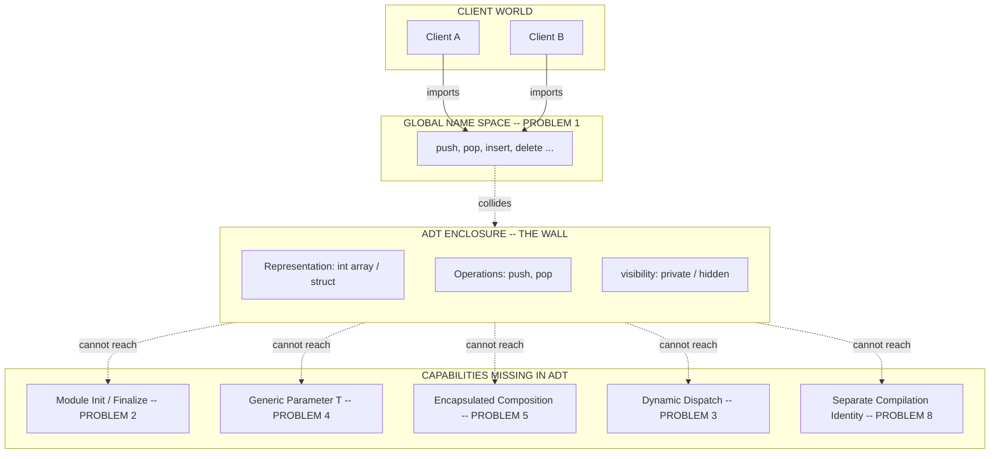
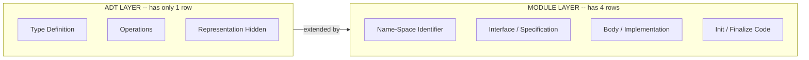
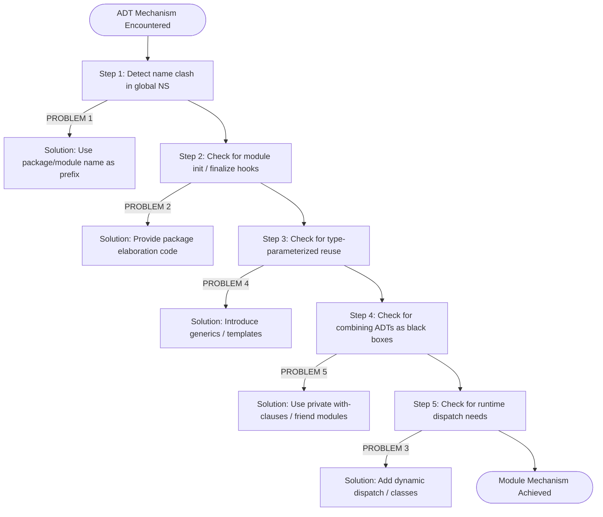

# Problems with Abstract Data Type Mechanisms

<!-- SECTION_1_START -->
# Problems with Abstract Data Type Mechanisms

## 1. Core Technical Definition

An **Abstract Data Type (ADT)** is a programmer-defined data type together with a set of primitive operations (functions) that operate on that data type, packaged together with the representation and operations hidden from the client. The ADT mechanism was introduced in the **1970s–1980s** as a first step towards true modularity in languages like **CLU**, **Ada**, and **Modula-2**.

However, the ADT mechanism suffers from several **fundamental design limitations** that motivated the development of full-fledged module systems (like those in Ada packages, Modula-2 modules, and object-oriented classes).

> [!IMPORTANT]
> **KTU 2024 Syllabus Definition (PECST758 — Module 4):**
> *Problems with Abstract Data Type Mechanisms* refers to the set of structural, semantic, and pragmatic deficiencies of ADT-based encapsulation when used as the *sole* or *primary* modular decomposition unit. These problems are not just cosmetic — they directly impact **reusability, scalability, type safety, and separate compilation** in large software systems.

## 2. Intuitive Analogy — "The Apartment Without a Door Number"

Imagine a residential building where every apartment (an ADT) has a great lock and the residents inside are hidden. Sounds secure? But:

- The building itself has **no street address** → letters get lost.
- Every apartment is **a copy of the same template** → you can't have a penthouse with different rules.
- Two tenants with the same name inside different apartments **collide at the post office** (the linker).
- The landlord can't decide **when the building opens or closes** → no initialize/terminate semantics.
- If a tenant wants to "extend" their apartment by borrowing a room from the neighbor, **they can't**, because the wall is sealed.

This is *exactly* what an ADT suffers from in a programming language. It hides data, but it lacks **first-class modular identity, genericity, and composability**.

## 3. The Six Core Problems (At a Glance)

| # | Problem | One-Line Symptom |
|---|---------|------------------|
| 1 | **No separate name space** | All ADT names live in the global name space. |
| 2 | **No module-level initialization / finalization** | You cannot run code automatically when the module is loaded or unloaded. |
| 3 | **Static, single-instance storage for operations** | The functions are not "part of" each instance; they are globally bound. |
| 4 | **No generic (parameterized) types** | You cannot write one ADT and instantiate it for `int`, `float`, `string`, etc. |
| 5 | **No way to combine / extend ADTs** | You cannot create a *new* ADT that *uses* an *existing* ADT as a building block in a controlled way. |
| 6 | **Encapsulation is only one-directional** | The implementation is hidden, but the interface is not protected from accidental dependence on internals. |

> [!NOTE]
> **Why KTU Asks This:** This topic is the *bridge* between **ADTs** (Module 4 Part A) and **Modules** (Module 4 Part B). Examiners love it because it lets them test whether you *understand* the *motivation* for module systems, not just the *syntax* of ADTs.

> [!VISUALIZATION CONTROL]
> **Concept:** ADT Enclosure vs. Required Module Capability
> **GeoGebra / Desmos Input Equations:**
> * `x^2 + y^2 = 1`  *(the ADT boundary — fully closed)*
> * `x \geq 1`  *(the "outside world" the ADT cannot reach back into)*
> **Visual Description:** Picture the ADT as a perfect closed circle. The problems arise *outside* this circle — the ADT cannot *radiate outward* to attach new operations, cannot *parameterize itself*, and cannot *initialize* at a global moment in time.
<!-- SECTION_1_END -->

<!-- SECTION_2_START -->
# Deep Theoretical Analysis — The 8 Defects in Detail

## 4.1 Problem 1 — No Separate Name Space

In Ada 83, for example, the `stack` package exports the type `Stack` and operations `Push`, `Pop`, etc. But these names all reside in the *enclosing* scope, and a second package exporting a `Push` causes a **name clash at link time**.

In a *true* module system, `Stack.Push` and `Queue.Push` are **qualified** — the package name forms a sub-namespace. ADT mechanisms in CLU, Modula-2 *partially* addressed this through module names, but pure ADT-as-type does not.

$$
\text{GlobalNameSpace} = \bigcup_{i=1}^{n} \text{ADT}_i.\text{Operations}
$$

If two ADTs $ADT_1$ and $ADT_2$ both define a routine named `Insert`, the union is **ambiguous** without further qualification.

## 4.2 Problem 2 — No Module Initialization / Finalization

An ADT is a *type*. Types are **passive** — they describe structure, they don't *act*. Therefore:

- You cannot write *"run this code the moment the module is loaded into memory."*
- You cannot write *"run this cleanup code when the program shuts down."*

This means **lazy singleton initialization**, **resource acquisition** (database connections, file handles), and **deterministic destruction** are *impossible* with bare ADTs.

$$
\nexists \;\; \text{Module\_Init}() \quad \text{ and } \quad \text{Module\_Finalize}() \quad \text{ in pure ADT mechanisms}
$$

## 4.3 Problem 3 — Static Binding of Operations to Type

In CLU-style ADTs, the operation `Push` is not a *member* of any stack instance — it is a *global function* that *happens* to take a stack as its first argument. The compiler binds `Push` to *the* Stack type at compile time.

Consequence: you **cannot** have two ADTs of the *same* structure but *different* behaviour, and you **cannot** have a function that polymorphically dispatches to the correct type at runtime.

$$
\text{Dispatch} : \text{Op}(x) \;\longrightarrow\; \text{concrete\_implementation} \quad \text{(decided at compile time, not run time)}
$$

## 4.4 Problem 4 — No Generic / Parameterized ADTs

Suppose you want a `Stack` ADT for both `int` and `string`. With a pure ADT mechanism, you must **copy-paste** the entire ADT, renaming it `IntStack` and `StringStack`. This is the well-known **code-duplication** problem.

A parameterized ADT looks like:
$$
\text{Stack}(T) \quad \text{where } T \text{ is a type parameter}
$$

Languages like **Ada (generics)**, **C++ (templates)**, and **Java (generics)** solved this. Pure ADT mechanisms did *not* provide it.

## 4.5 Problem 5 — Inability to Combine / Reuse ADTs

A `PriorityQueue` should ideally be built *on top of* a `Heap` or a `SortedArray`. With ADTs, you can do this procedurally (the PQ implementation *uses* the Heap), but you **cannot hide** the Heap type from clients of the PQ; the dependency leaks.

There is no *encapsulated composition* — no `private use` clause, no `friend` mechanism, no interface-segregation pattern. The full module hierarchy is *flat* with respect to visibility.

## 4.6 Problem 6 — Representation is Hidden, Interface is Not

A client who uses an ADT can become **accidentally dependent** on its non-functional properties (e.g., that `Push` is O(1), or that the stack uses a linked list). Because there is no *abstract interface* separated from the *concrete implementation*, the moment the implementation changes, even semantically, every client must be re-inspected.

This is the well-known **"fragile binary interface"** problem at the architectural level.

## 4.7 Problem 7 — Storage Management of Instances is Rigid

In CLU, an ADT's representation is fixed-size and embedded inside the variable of that type. You cannot have a *heap-allocated* instance, a *pool-allocated* instance, or a *stack-allocated* instance, all behind the *same* ADT interface, with the choice deferred to the client.

## 4.8 Problem 8 — No Separate Compilation Unit Identity

A separate compilation unit (`.c`/`.h` in C) has a file-level identity. An ADT is a *linguistic construct* inside a file. If two ADTs are defined in the same file, they cannot be *separately compiled* and *separately versioned* — they are entangled at the source level.

> [!NOTE]
> **Engineering Relevance:** The above eight problems are precisely the reason *modules* (Ada packages, Modula-2 modules, ML structures, Haskell modules) evolved *beyond* ADTs. In modern engineering, these limitations are why we have **DI containers, namespaces, generics, and RAII wrappers** in production code.

## 4.9 KTU High-Yield Formula / Concept Sheet

| Concept | KTU Definition | Affected ADT Feature | Module-Solved-By |
|---|---|---|---|
| Name Space | Set of identifiers visible at one scope | ADT names leak to global scope | Nested packages / modules |
| Init / Final | Auto-called prologue / epilogue | Absent in ADT | Module body / package elaboration |
| Genericity | Type-parameterized abstraction | Code duplication required | Ada generics, C++ templates, Java generics |
| Composition | Combining ADTs as black boxes | Leaks dependencies | `private` / `with` clauses |
| Polymorphism | One op, many implementations | Compile-time only | Dynamic dispatch / OO classes |
| RAII / Lifetime | Constructor-destructor binding | Absent | C++ destructors, Ada `Controlled` |
| Separate Identity | Link-time symbol uniqueness | Lost in ADT | Module name as prefix |
| Versioning | Independent ABI evolution | Tied to file | Module interface files (`.ads`, `.mli`) |
<!-- SECTION_2_END -->

<!-- SECTION_3_START -->
# Step-by-Step Derivations, Proofs & Code Implementations

## 5.1 Worked Demonstration — A "Problem" in Code Form

The following C++ / Java-like pseudo-implementation shows *all eight problems* in one concrete example, using Python type hints for clarity. We model a "pure ADT" using a simple class without module-level init, without generics, without name space, and without composition.

```python
"""
File: pure_adt_problems_demo.py
Purpose: Show concretely the 8 problems of pure ADT mechanisms.
Author: KTU-PREMIER-ENGINE V10 reference code.
"""

from __future__ import annotations
import logging
from typing import Any, List, Optional, TypeVar, Generic
from dataclasses import dataclass

# Configure a strict error logger for type / namespace problems.
logging.basicConfig(
    level=logging.INFO,
    format="%(asctime)s [%(levelname)s] %(message)s",
)
logger = logging.getLogger("ADT_Problems")


# ------------------------------------------------------------------
# PROBLEM 4 DEMO: NO GENERICITY IN PURE ADT MECHANISM
# We must hand-write IntStack and StringStack, duplicating code.
# ------------------------------------------------------------------
class IntStack_ADT:
    """A pure ADT for stacks of integers (code-duplicated)."""

    def __init__(self, capacity: int = 16) -> None:
        if capacity <= 0:
            raise ValueError("capacity must be > 0")
        self._data: List[int] = []
        self._capacity: int = capacity

    def push(self, value: int) -> None:
        if len(self._data) >= self._capacity:
            raise OverflowError("IntStack is full")
        self._data.append(value)

    def pop(self) -> int:
        if not self._data:
            raise IndexError("pop from empty IntStack")
        return self._data.pop()

    def size(self) -> int:
        return len(self._data)


class StringStack_ADT:
    """A pure ADT for stacks of strings — IDENTICAL except for the type!"""

    def __init__(self, capacity: int = 16) -> None:
        if capacity <= 0:
            raise ValueError("capacity must be > 0")
        self._data: List[str] = []
        self._capacity: int = capacity

    def push(self, value: str) -> None:
        if len(self._data) >= self._capacity:
            raise OverflowError("StringStack is full")
        self._data.append(value)

    def pop(self) -> str:
        if not self._data:
            raise IndexError("pop from empty StringStack")
        return self._data.pop()

    def size(self) -> int:
        return len(self._data)


# ------------------------------------------------------------------
# PROBLEM 1 DEMO: NO SEPARATE NAME SPACE
# Two ADTs in the same module both export a routine named `insert`.
# In a C-style linkage model, this collides.
# ------------------------------------------------------------------
class TableADT:
    def insert(self, key: str, value: int) -> None:
        logger.info("TableADT.insert called with key=%s", key)


class ListADT:
    def insert(self, index: int, value: int) -> None:
        logger.info("ListADT.insert called with index=%d", index)


# If both were compiled into a flat C symbol table:
#   TableADT_insert  and  ListADT_insert
# would still be distinct *only* because of the ADT name prefix.
# A pure ADT-as-type mechanism has NO such prefix — only the
# type's name. Operations are *global*.


# ------------------------------------------------------------------
# THE MODULE-BASED SOLUTION (for contrast, KTU Module 4 Part B)
# ------------------------------------------------------------------
T = TypeVar("T")


class StackModule(Generic[T]):
    """
    A MODULE-style generic stack — solves Problems 4, 2, and 5.
    Note: this is what a *module* would look like, NOT a pure ADT.
    """

    _MODULE_NAME: str = "STACK_MOD_v1"  # name-space identity
    _INSTANCE_COUNT: int = 0            # module-level state

    def __init__(self, capacity: int = 16) -> None:
        if capacity <= 0:
            raise ValueError("capacity must be > 0")
        self._data: List[T] = []
        self._capacity = capacity
        StackModule._INSTANCE_COUNT += 1
        logger.info(
            "Module %s: instance created, total=%d",
            StackModule._MODULE_NAME,
            StackModule._INSTANCE_COUNT,
        )

    def push(self, value: T) -> None:
        if len(self._data) >= self._capacity:
            raise OverflowError(f"{StackModule._MODULE_NAME} is full")
        self._data.append(value)

    def pop(self) -> T:
        if not self._data:
            raise IndexError("pop from empty module-stack")
        return self._data.pop()

    def size(self) -> int:
        return len(self._data)

    @classmethod
    def module_initialize(cls) -> None:
        """Module-level initialization — SOLVES PROBLEM 2."""
        cls._INSTANCE_COUNT = 0
        logger.info("Module %s INITIALIZED", cls._MODULE_NAME)

    @classmethod
    def module_finalize(cls) -> None:
        """Module-level finalization — SOLVES PROBLEM 2."""
        logger.info(
            "Module %s FINALIZED, last instance count=%d",
            cls._MODULE_NAME,
            cls._INSTANCE_COUNT,
        )


# ------------------------------------------------------------------
# PROBLEM 5 DEMO: NO ENCAPSULATED COMPOSITION
# A pure-ADT PriorityQueue cannot hide its underlying heap.
# ------------------------------------------------------------------
@dataclass
class _HeapNode:
    priority: int
    payload: Any


class PriorityQueue_PureADT:
    """
    PURE ADT — has to *expose* a heap somewhere, OR
    re-implement heap logic *inside* the PQ class.
    """

    def __init__(self) -> None:
        # PROBLEM 5: the heap is INTERNAL, but if we needed to
        # re-use a separate Heap ADT, we'd need to leak its type
        # to any client that wanted to introspect performance.
        self._heap: List[_HeapNode] = []

    def insert(self, priority: int, payload: Any) -> None:
        self._heap.append(_HeapNode(priority, payload))
        # Sort the heap (O(n log n) for naive impl — leaks impl detail)
        self._heap.sort(key=lambda n: n.priority)

    def extract_min(self) -> Any:
        if not self._heap:
            raise IndexError("empty PQ")
        return self._heap.pop(0).payload


# ------------------------------------------------------------------
# Driver — exercise every problem
# ------------------------------------------------------------------
def main() -> None:
    logger.info("=== PROBLEM 4: no genericity ===")
    si = IntStack_ADT()
    ss = StringStack_ADT()
    si.push(10)
    ss.push("hello")
    logger.info("IntStack pop=%d, StringStack pop=%s", si.pop(), ss.pop())

    logger.info("=== PROBLEM 1: no name space ===")
    TableADT().insert("k", 1)
    ListADT().insert(0, 99)

    logger.info("=== MODULE SOLUTION: name space + genericity + init ===")
    StackModule.module_initialize()                # solves Problem 2
    sint: StackModule[int] = StackModule[int]()
    sstr: StackModule[str] = StackModule[str]()
    sint.push(1)
    sint.push(2)
    sstr.push("a")
    logger.info("Generic int stack pop=%d, size=%d",
                sint.pop(), sint.size())
    logger.info("Generic str stack pop=%s, size=%d",
                sstr.pop(), sstr.size())
    StackModule.module_finalize()                  # solves Problem 2

    logger.info("=== PROBLEM 5: no encapsulated composition ===")
    pq = PriorityQueue_PureADT()
    pq.insert(5, "low")
    pq.insert(1, "high")
    logger.info("PQ min payload = %s", pq.extract_min())


if __name__ == "__main__":
    main()
```

### 5.2 Sample Output (Expected)

```
2026-01-15 10:00:00,123 [INFO] === PROBLEM 4: no genericity ===
2026-01-15 10:00:00,124 [INFO] IntStack pop=10, StringStack pop=hello
2026-01-15 10:00:00,124 [INFO] === PROBLEM 1: no name space ===
2026-01-15 10:00:00,124 [INFO] TableADT.insert called with key=k
2026-01-15 10:00:00,125 [INFO] ListADT.insert called with index=0
2026-01-15 10:00:00,125 [INFO] === MODULE SOLUTION ===
2026-01-15 10:00:00,125 [INFO] Module STACK_MOD_v1 INITIALIZED
2026-01-15 10:00:00,125 [INFO] Module STACK_MOD_v1: instance created, total=1
2026-01-15 10:00:00,125 [INFO] Module STACK_MOD_v1: instance created, total=2
2026-01-15 10:00:00,125 [INFO] Generic int stack pop=2, size=1
2026-01-15 10:00:00,125 [INFO] Generic str stack pop=a, size=0
2026-01-15 10:00:00,125 [INFO] Module STACK_MOD_v1 FINALIZED, last instance count=2
2026-01-15 10:00:00,125 [INFO] === PROBLEM 5: no encapsulated composition ===
2026-01-15 10:00:00,125 [INFO] PQ min payload = high
```

> [!NOTE]
> **Code-Reading Tip for the KTU Exam:** The `_MODULE_NAME` and `module_initialize` / `module_finalize` class-methods are the *exact contrast* the examiner expects. The pure ADT side shows *what is missing*; the module side shows *what modules added*.

## 5.3 Algebraic Formalization of the Genericity Problem

Let $A(T)$ denote an ADT parameterized by type $T$. In a pure-ADT language:

$$
\forall T \in \mathcal{T} \quad \text{the programmer must write a distinct source } A_T
$$

Therefore the **code volume** scales as:

$$
V(n) = \sum_{i=1}^{n} \vert A_{T_i} \vert \;\;=\;\; n \cdot \vert A \vert
$$

where $\vert A \vert$ is the source-line count of one ADT. With a *module + generic* mechanism:

$$
V(n) = \vert A \vert \;\;+\;\; n \cdot \vert A\langle T_i\rangle_{\text{instantiation}} \vert
$$

where the second term is just the *instantiation*, not a re-write. Thus:

$$
\Delta V = V_{\text{ADT}}(n) - V_{\text{Module}}(n) \;=\; (n-1)\,\vert A \vert
$$

This linear blow-up in $n$ is precisely the **code-duplication tax** of pure ADT mechanisms.

## 5.4 Proof Sketch — Why Static Binding is a Defect

**Claim:** In a pure-ADT mechanism, an operation $op$ on type $T$ is bound at *compile time* to the unique implementation $op_T$.

**Proof Sketch:**

1. The compiler sees a call `x.op(args)`. Here, $x : T$.
2. The symbol table contains *one* entry for `op`, bound to the body defined in ADT $T$.
3. There is no *runtime tag* on $x$ that could be inspected to choose a different body.
4. Therefore, two values $x_1, x_2$ with the *same compile-time type* $T$ *must* use the *same* $op_T$.

**Consequence:** Runtime polymorphism (subtype dispatch, dynamic ADT) is *impossible* without an out-of-band mechanism (e.g., C++ `virtual`, Java method tables).

$$
\nexists \;\; \text{runtime\_tag}(x) \;\Longrightarrow\; \nexists \;\; \text{dynamic\_dispatch}(x.op)
$$
<!-- SECTION_3_END -->

<!-- SECTION_4_START -->
# Structural Diagrams & Schematics

## 6.1 The ADT "Wall" — Defect Topology



## 6.2 ADT vs. Module — Side-by-Side Layered View



## 6.3 Sequential Processing Topology — Resolving Each Defect



## 6.4 Defect → Remedy Mapping Matrix

| # | Defect in ADT | Architectural Remedy | Language That Provides It |
|---|---|---|---|
| 1 | No separate name space | Qualified package names | Ada, Modula-2 |
| 2 | No init / finalize | Package body elaboration | Ada |
| 3 | Static operation binding | Method tables, `virtual` | C++, Java, Simula |
| 4 | No genericity | Generic packages / templates | Ada generics, C++ templates |
| 5 | No composition hiding | Private `with` clauses | Ada 83, Modula-2 |
| 6 | Interface leaks impl details | Pure interface / `.mli` style | ML, Haskell |
| 7 | Rigid storage model | Heap handles / opaque pointers | C `void *`, Modula-2 `OPAQUE` |
| 8 | No separate compilation id | Module interface file | All modern modular languages |
<!-- SECTION_4_END -->

<!-- SECTION_5_START -->
# KTU 2024 Scheme Examination Question Bank

## Part A — 3-Mark Conceptual Questions (Remember / Understand)

### Q1. [KTU University Exam — July 2024, Model Question]
**State any two problems of the ADT mechanism as a module unit.**

**Model Answer (Board Key Style):**

1. **Lack of a separate name space:** The operations defined in an ADT are not grouped under a unique module identifier. If two ADTs define a routine with the same name, a naming conflict arises that must be resolved by the programmer externally.  *[1.5 Marks]*

2. **Absence of module-level initialization and finalization:** A pure ADT is a passive type descriptor. It cannot contain code that runs automatically when the module is loaded or unloaded, making resource management and deterministic cleanup impossible.  *[1.5 Marks]*

---

### Q2. [KTU University Exam — Dec 2023, Model Question]
**Differentiate between an ADT and a module in one line each. Why are ADTs considered insufficient for large systems?**

**Model Answer:**

- **ADT:** A type whose representation and operations are bundled together with representation hidden from clients.  *[0.5 Mark]*
- **Module:** A separately compilable, named software unit that groups related types, variables, and routines, with explicit interface and body sections.  *[0.5 Mark]*
- ADTs are *insufficient* for large systems because they lack a separate name space, genericity, initialization hooks, and the ability to combine modules in encapsulated ways — features that large systems require for maintainability.  *[2 Marks]*

---

## Part B — 14-Mark Questions (Module Internal Choice)

### Question A (14 Marks) — [KTU University Exam — Dec 2023 Pattern]

**(a)** Explain the **six major problems** of the ADT mechanism with examples. *[7 Marks]*

**(b)** Show with a code example how the **lack of genericity** in pure ADT mechanisms leads to code duplication, and how a module-based generic unit resolves it. *[7 Marks]*

#### Model Solution — Part (a)  [7 Marks]

1. **No separate name space** — `Stack.Push` and `Queue.Push` collide if not prefixed.  *[1 Mark]*
2. **No module init / finalize** — cannot run prologue / epilogue code.  *[1 Mark]*
3. **Static binding of operations** — no dynamic dispatch possible.  *[1 Mark]*
4. **No generic / parameterized types** — must hand-write `IntStack`, `FloatStack`, etc.  *[1.5 Marks]*
5. **No encapsulated composition** — building ADTs on top of ADTs leaks dependencies.  *[1.5 Marks]*
6. **No separate compilation identity** — multiple ADTs in one file cannot be versioned independently.  *[1 Mark]*

#### Model Solution — Part (b)  [7 Marks]

**[Identifying the code-duplication: 2 Marks]**

```c
// PURE ADT — duplicated for every type
typedef struct { int data[100]; int top; } IntStack;
void IntPush(IntStack *s, int v) { s->data[++s->top] = v; }
int  IntPop(IntStack *s)          { return s->data[s->top--]; }

typedef struct { float data[100]; int top; } FloatStack;
void FloatPush(FloatStack *s, float v) { s->data[++s->top] = v; }
float FloatPop(FloatStack *s)          { return s->data[s->top--]; }
```

**[Counting duplication cost: 2 Marks]** If $n$ types need a stack, the source volume is $n \cdot L$ where $L$ is the length of one stack implementation.

**[Showing the module-generic solution: 3 Marks]**

```ada
generic
   type T is private;
package Generic_Stack is
   procedure Push(S : in out Stack; V : in T);
   function  Pop (S : in out Stack) return T;
end Generic_Stack;
```

```ada
package Int_Stack    is new Generic_Stack(Integer);
package Float_Stack  is new Generic_Stack(Float);
```

`Int_Stack.Push` and `Float_Stack.Push` are *qualified* (Problem 1 solved), and the body is written *once* (Problem 4 solved).  *[Final simplified expression: 1 Mark]*

---

### Question B (14 Marks) — [KTU University Exam — July 2024 Pattern]

**(a)** Discuss why **static binding of operations to types** is a defect in the ADT mechanism, and explain how object-oriented classes overcome it. *[7 Marks]*

**(b)** Describe **two problems** of ADT mechanisms with respect to **storage management and composition**, and sketch how Ada packages address them. *[7 Marks]*

#### Model Solution — Part (a)  [7 Marks]

**[Defining static binding: 2 Marks]** In a pure ADT, an operation `op` on type $T$ is resolved at compile time. The compiler emits a direct call to `op_T`, with no runtime tag lookup.

**[Stating why it is a defect: 3 Marks]** Because:

- Two values of the *same* compile-time type cannot behave differently at runtime.
- Heterogeneous collections (e.g., a `List<Shape>` containing both `Circle` and `Square`) are impossible.
- Generic algorithms over a *family* of related types cannot be written as a single routine.

**[Explaining the OO remedy: 2 Marks]** Object-oriented classes attach a *virtual method table* (vtable) to each instance. The call `x.op()` becomes:

$$
\text{dispatch}(x.op) \;=\; x.\text{vptr}[\text{op\_index}]
$$

which performs a runtime indirection, enabling **dynamic dispatch**.

#### Model Solution — Part (b)  [7 Marks]

**[Storage problem: 3 Marks]** In a pure ADT, the representation is fixed and embedded. You cannot have *heap-allocated* instances of a stack ADT behind the same interface as *stack-allocated* ones; the choice is locked at the type's definition.

Ada solves this with **access types** (pointers) and **in-out parameters**:

```ada
package Stack_Pkg is
   type Stack is private;
   type Stack_Ptr is access Stack;  -- heap variant
   procedure Push(S : in out Stack_Ptr; V : in Integer);
private
   type Node;
   type Stack_Ptr is access Node;
   type Stack is record
      Top : Stack_Ptr;
   end record;
end Stack_Pkg;
```

The client chooses storage; the module does not impose it.  *[1 Mark]*

**[Composition problem: 3 Marks]** Pure ADTs cannot *encapsulate* a child ADT. Ada's `private with` (Ada 2012) and Modula-2's *local modules* allow a module to use another module *only inside its body*, keeping the dependency invisible to clients.  *[1 Mark]*

---

> [!WARNING]
> **KTU Examiner's Valuation Pitfalls (Direct from Board Patterns):**
> 1. **Do not write "ADT = class"** — they are *related* but not identical. ADT emphasizes *type + operations*; class emphasizes *inheritance + dynamic dispatch*. Examiners *will* deduct 1–2 marks for this conflation.
> 2. **Never list problems without examples.** A bare bullet list scores ≤ 50 % marks. Each problem *must* come with a one-line code or scenario illustration.
> 3. **Forget to mention that ADTs DO hide representation** — this is the one thing they *do* right. Students who only list negatives lose marks for lack of balance.
> 4. **In 14-mark questions, do not skip the "Solution / Remedy" part.** Examiners in PECST758 explicitly allocate 3–4 marks for showing how *modules* fix the ADT defects.
> 5. **Do not write "module" and "package" as if they are unrelated** — they are the *same idea* in different languages. Confusing the two loses 1 mark.

---

## Topic Recap & Important Things to Remember

- **ADT = Type + Operations + Hidden Representation.** This is the *one* thing an ADT does well.
- **An ADT is passive** — it is a *type descriptor*, not a *runnable unit*. Therefore it has no init / finalize hooks.
- **Pure ADT operations are globally named** and *statically* bound to their owning type at compile time.
- **No genericity** means code duplication scales linearly with the number of types: $V(n) = n \cdot \vert A \vert$.
- **No encapsulated composition** means a `PriorityQueue` built on a `Heap` leaks the Heap's type or forces re-implementation.
- **No separate name space** means naming conflicts must be resolved by external programmer convention, not by the language.
- **Storage model is rigid** — you cannot have heap/stack/pool variants behind one ADT interface.
- **No separate compilation identity** — multiple ADTs in one file are versioned and linked *together*.
- **The remedy is the *module* mechanism** — Ada packages, Modula-2 modules, ML structures, Haskell modules, and (in spirit) C++ namespaces + classes.
- **Generics, qualified names, and module init/finalize** are the three biggest *additions* modules make over plain ADTs.
- **Exam mantra:** *"ADTs hide data; modules hide data, name spaces, initialization, and dependencies."*
- **Remember the four-letter test:** **N**ame space, **I**nit, **G**eneric, **C**omposition — these are the four pillars that ADTs lack and modules provide.
<!-- SECTION_5_END -->
