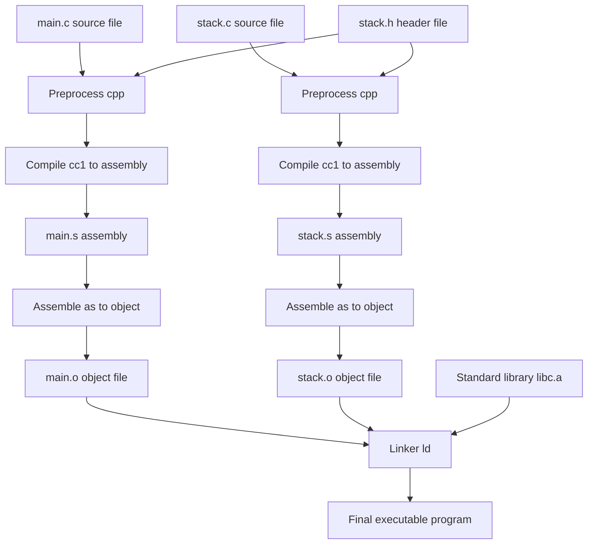
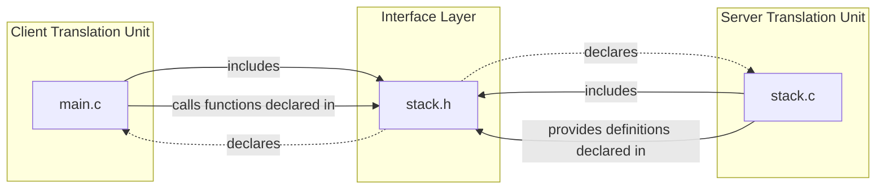
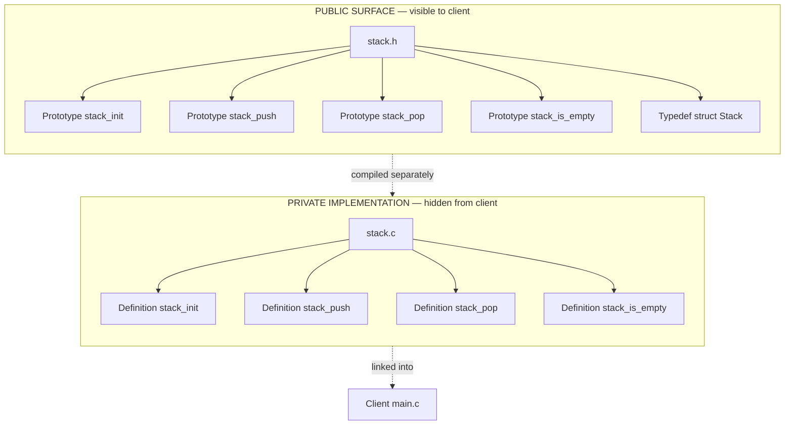

# Separate Compilation in C

<!-- SECTION_1_START -->

# Separate Compilation in C

## 1. Core Technical Definition & Intuitive Overview

**Separate Compilation in C** is a modular software engineering technique in which a complete C program is partitioned into multiple independent *translation units* (`.c` source files) that are compiled individually by the compiler and later combined by the **linker** to produce a single executable. Interface details (type definitions, macros, function prototypes) are isolated into **header files** (`.h`) and shared between translation units via the `#include` preprocessor directive. This enforces a clean separation between the *public interface* and the *private implementation* of a module — the cornerstone of constructing **Abstract Data Types (ADTs)** in C.

> [!NOTE]
> **KTU 2024 Syllabus Highlight (PCCST758 / PECST758 – Module 4):**
> *"Separate compilation in C, header files, the make utility, building and using libraries, modules and interfaces, abstract data types."*

### Conceptual Analogy — The Prefabricated Skyscraper

Imagine you are constructing a tall office building. Instead of pouring all the concrete on-site, you outsource different rooms (electrical rooms, plumbing bays, office cabins) to different factories. Each factory:
1. Receives a **blueprint** (header file `.h`) that lists what shape, size, and connectors each room must have.
2. Builds the room independently and tests it (compiles its own `.c` file).
3. Ships the finished room to the construction site where a **foreman** (the *linker*) bolts all rooms together using the standardized connectors declared in the blueprint.

In this analogy:
- The **blueprint** = `stack.h` (header file)
- The **room** = `stack.c` (compilation unit)
- The **construction site** = final executable
- The **foreman** = **Linker (`ld`)**

If two rooms have the same name (e.g., two doors labelled "main"), the foreman raises an alarm — this is the classic **multiple-definition error** every KTU student must learn to avoid.

> [!IMPORTANT]
> **Key Terminology (Must Memorize for KTU Board Exam):**
> - **Translation Unit** — A single `.c` file together with all headers it directly or transitively includes, after preprocessing. The compiler processes one translation unit at a time.
> - **External Linkage** — A symbol (function or global variable) defined in one translation unit that is visible to other translation units during linking.
> - **Internal Linkage** — A symbol visible only within its own translation unit (achieved with the `static` storage class).
> - **Header Guard** — Preprocessor macros (`#ifndef`, `#define`, `#endif`) that prevent a header from being included more than once into the same translation unit.

> [!VISUALIZATION CONTROL]
> **Concept:** Modular dependency graph of a 3-file Stack ADT project.
> **Graph Edges (Conceptual):**
> * `main.c` depends on `stack.h` and `stdlib.h`
> * `stack.c` depends on `stack.h`
> * `stack.h` has no dependencies
> **Visual Description:** Draw three rectangles representing files. Draw arrows from `main.c` and `stack.c` pointing *into* the `stack.h` rectangle. Place a compiler icon next to each `.c` file and a single linker icon below all three, producing a single `main.exe` output.

---

<!-- SECTION_1_END -->

<!-- SECTION_2_START -->

# 2. Deep Theoretical Analysis & KTU High-Yield Formula Sheet

## 2.1 The Four-Stage Build Pipeline

A C program built from multiple files passes through four well-defined stages. The KTU examiner expects students to know the **input and output of each stage**.

| Stage | Tool Executed | Input | Output | Purpose |
| :--- | :--- | :--- | :--- | :--- |
| 1. Preprocessing | `cpp` | `.c` file (with `#include`, `#define`, `#if`) | Pure C source (`.i`) | Header expansion, macro substitution, conditional compilation |
| 2. Compilation | `cc1` | `.i` file | Assembly (`.s`) | Syntax/semantic analysis, code generation |
| 3. Assembly | `as` | `.s` file | Object code (`.o`) | Translation to machine code, relocatable addresses |
| 4. Linking | `ld` | Multiple `.o` files + libraries | Executable (`a.out`) | Resolving external references, fixing final addresses |

> [!IMPORTANT]
> **Compilation is per-file, but linking is whole-program.** This is the entire reason *separate compilation* is possible and why we need to declare functions in headers before using them across files.

## 2.2 Anatomy of a Header File

A header file must contain **only declarations**, not definitions (with very limited exceptions such as `inline` functions, `static` constants in C99+, and `typedef` aliases). The canonical structure is:

```c
#ifndef STACK_H          // Header guard begin
#define STACK_H

#include <stddef.h>      // For size_t
#define MAX 100          // Macro — allowed in headers

typedef struct {         // Type definition — allowed
    int data[MAX];
    int top;
} Stack;

void stack_init(Stack *s);  // Function prototype — allowed
int  stack_push(Stack *s, int v);
int  stack_pop(Stack *s, int *out);
int  stack_is_empty(const Stack *s);

#endif                   // Header guard end
```

**Why the header guard is non-negotiable:** If `main.c` includes both `stack.h` and `queue.h`, and `queue.h` also includes `stack.h`, the struct `Stack` would be defined twice in `main.c`'s translation unit, causing a *redefinition error*. The guard ensures the body is processed only once per translation unit.

## 2.3 The `extern` and `static` Storage Classes

These two keywords control **linkage**, which is the central concept tested in KTU Module 4.

| Keyword | Linkage | Lifetime | Typical Use in Separate Compilation |
| :--- | :--- | :--- | :--- |
| `extern` | External | Entire program | Declaring a global variable defined in *another* `.c` file |
| `static` (at file scope) | Internal | Entire program | Private helper variable shared only within *one* `.c` file |
| (no keyword) | External (default for globals) | Entire program | The single canonical *definition* of a global |

> [!IMPORTANT]
> **The "Declaration vs Definition" Distinction (Board Favourite):**
> - *Declaration* introduces a name and its type. Memory is **not** allocated. The keyword `extern` is a strong hint, but the absence of an initializer is the real signal.
> - *Definition* causes memory to be allocated. At file scope, it must appear in **exactly one** translation unit.

## 2.4 KTU High-Yield Formula Sheet

| Concept | Syntax / Rule | Common Pitfall |
| :--- | :--- | :--- |
| Include a user header | `#include "stack.h"` (search current dir first, then standard paths) | Using `<stack.h>` for your own file — compiles but stylistically wrong |
| Include a system header | `#include <stdio.h>` | Wrapping it in quotes |
| Header guard idiom | `#ifndef X_H` / `#define X_H` / ... / `#endif` | Forgetting `#endif` causes cryptic cascading errors |
| Declare external global | `extern int counter;` in a header | Writing `int counter;` in the header → multiple-definition link error |
| Define the global once | `int counter = 0;` in *one* `.c` file | Defining it in the header AND in a `.c` file |
| Constrain visibility | `static int helper(void);` at file scope | Using `static` in a header → each TU gets its own private copy, breaking ADT |
| Prevent header in own TU | `#pragma once` (compiler extension) | KTU accepts it, but classical `#ifndef` is the portable answer |

---

<!-- SECTION_2_END -->

<!-- SECTION_3_START -->

# 3. Step-by-Step Derivations & Code/Symbolic Implementation

## 3.1 Worked Example — Building a `Stack` ADT via Separate Compilation

We will construct a complete three-file project. The KTU board frequently asks students to write the `.h` interface and the `.c` implementation for an ADT such as Stack, Queue, or Complex Number.

### File 1 — `stack.h` (The Public Interface)

```c
/* stack.h — Public interface of the Stack ADT.
   This file is included by BOTH main.c and stack.c. */
#ifndef STACK_H
#define STACK_H

#include <stdbool.h>

#define STACK_CAPACITY 100

typedef struct {
    int  data[STACK_CAPACITY];
    int  top;          /* -1 when empty */
} Stack;

/* Function prototypes — contracts, not implementations. */
void stack_init   (Stack *s);
bool stack_push   (Stack *s, int value);
bool stack_pop    (Stack *s, int *out_value);
bool stack_is_empty(const Stack *s);
int  stack_size   (const Stack *s);

#endif /* STACK_H */
```

### File 2 — `stack.c` (The Private Implementation)

```c
/* stack.c — Implementation of the Stack ADT. */
#include "stack.h"

void stack_init(Stack *s) {
    s->top = -1;
}

bool stack_push(Stack *s, int value) {
    if (s->top >= STACK_CAPACITY - 1) {
        return false;                       /* Overflow */
    }
    s->top = s->top + 1;
    s->data[s->top] = value;
    return true;
}

bool stack_pop(Stack *s, int *out_value) {
    if (stack_is_empty(s)) {
        return false;                       /* Underflow */
    }
    *out_value = s->data[s->top];
    s->top = s->top - 1;
    return true;
}

bool stack_is_empty(const Stack *s) {
    return s->top < 0;
}

int stack_size(const Stack *s) {
    return s->top + 1;
}
```

### File 3 — `main.c` (The Client / Driver)

```c
/* main.c — Client code that consumes the Stack ADT. */
#include <stdio.h>
#include "stack.h"

int main(void) {
    Stack s;
    int  value;

    stack_init(&s);

    if (!stack_push(&s, 10)) { fprintf(stderr, "Push 10 failed\n"); return 1; }
    if (!stack_push(&s, 20)) { fprintf(stderr, "Push 20 failed\n"); return 1; }
    if (!stack_push(&s, 30)) { fprintf(stderr, "Push 30 failed\n"); return 1; }

    printf("Stack size: %d\n", stack_size(&s));   /* Expected: 3 */

    while (stack_pop(&s, &value)) {
        printf("Popped: %d\n", value);
    }

    if (stack_is_empty(&s)) {
        printf("Stack is now empty.\n");
    }
    return 0;
}
```

### Compile & Link from the Command Line

```bash
gcc -Wall -Wextra -std=c11 -c stack.c   -o stack.o
gcc -Wall -Wextra -std=c11 -c main.c    -o main.o
gcc stack.o main.o -o program
./program
```

**Expected Output:**
```
Stack size: 3
Popped: 30
Popped: 20
Popped: 10
Stack is now empty.
```

### Step-by-Step Build Trace (Valuation Explanation)

1. **`gcc -c stack.c`** — The preprocessor reads `stack.c`, sees `#include "stack.h"`, opens `stack.h`, processes the guard (defines `STACK_H`), expands the typedef and prototypes into a single translation unit, then compiles it to `stack.o`. The `Stack` struct, the prototypes, and the function *definitions* are now in the object file's symbol table.
2. **`gcc -c main.c`** — The preprocessor pulls in `stack.h` again, but this time the guard skips the body, preventing redefinition. `main.c`'s calls to `stack_push` etc. are compiled into *relocatable* calls waiting for the linker.
3. **`gcc stack.o main.o -o program`** — The linker sees `main.o` needs `stack_init`, `stack_push`, `stack_pop`, `stack_is_empty`, `stack_size`, and resolves each by looking up the symbol in `stack.o`. After resolution, it writes a single executable.

> [!IMPORTANT]
> **Common Build Error Pattern:**
> ```text
> undefined reference to `stack_push'
> ```
> This is a *linker* error, **not** a compiler error. It means the prototype was visible (so compilation succeeded) but the definition was never provided. Almost always caused by forgetting to add `stack.c` to the link command.

## 3.2 Worked Example — A `Makefile` for the Same Project

The `make` utility automates the four-stage pipeline and rebuilds only the files that have changed — a board-favourite topic.

```makefile
# Makefile — KTU 2024 Module 4 illustrative example
CC      = gcc
CFLAGS  = -Wall -Wextra -std=c11 -g
OBJ     = stack.o main.o
TARGET  = program

$(TARGET): $(OBJ)
	$(CC) $(OBJ) -o $(TARGET)

stack.o: stack.c stack.h
	$(CC) $(CFLAGS) -c stack.c -o stack.o

main.o: main.c stack.h
	$(CC) $(CFLAGS) -c main.c -o main.o

clean:
	rm -f $(OBJ) $(TARGET)

.PHONY: clean
```

**Step-by-step Make Logic (Valuation Breakdown):**
1. User types `make`. Make reads the Makefile and inspects the default goal `$(TARGET) = program`.
2. `program` depends on `stack.o` and `main.o`. Neither exists, so Make recursively processes both.
3. `stack.o` depends on `stack.c` and `stack.h`. If `stack.c` is newer than `stack.o` (or `stack.o` is missing), the recipe runs `gcc -c stack.c -o stack.o`.
4. `main.o` follows the same pattern.
5. Once both object files are up-to-date, the linking recipe `$(CC) $(OBJ) -o $(TARGET)` runs, producing `program`.

## 3.3 Worked Example — The `extern` Global Pattern

Suppose a counter must be shared between `counter.c` and `reporter.c`. The textbook ADT pattern uses a single *definition* file and a single *declaration* header.

### `counter.h`
```c
#ifndef COUNTER_H
#define COUNTER_H

extern int g_tick;        /* DECLARATION only — no memory allocated here */

void counter_advance(void);
int  counter_value  (void);

#endif
```

### `counter.c` (the *one and only* definition site)
```c
#include "counter.h"

int g_tick = 0;           /* DEFINITION — exactly one in the whole program */

void counter_advance(void) { g_tick = g_tick + 1; }
int  counter_value  (void) { return g_tick; }
```

### `reporter.c`
```c
#include <stdio.h>
#include "counter.h"

void report(void) {
    printf("Ticks observed: %d\n", counter_value());
}
```

**The error students must be able to diagnose:**
If a student mistakenly writes `int g_tick;` (no `extern`, no initializer) inside `counter.h`, then every `.c` file that includes it gets its own private copy of `g_tick`, and the linker raises `multiple definition of 'g_tick'`.

---

<!-- SECTION_3_END -->

<!-- SECTION_4_START -->

# 4. Structural Diagrams & Schematics

## 4.1 The Separate-Compilation Pipeline (Mermaid Flowchart)



## 4.2 Module Dependency Graph (Mermaid)



## 4.3 ADT Encapsulation Topology (Mermaid Block Diagram)



> [!IMPORTANT]
> **What this diagram proves (a favourite KTU question):**
> The client (`main.c`) sees *only* the prototypes and the typedef. The internal layout of the `Stack` struct (the `data` array, the `top` index) is invisible to the client. The client cannot, for example, write `s.top = 5;` from `main.c` *only if* `stack.h` is hidden — but since C does not enforce this at language level, the discipline of *not* including private state in the header is what creates the true ADT boundary.

---

<!-- SECTION_4_END -->

<!-- SECTION_5_START -->

# 5. KTU 2024 Scheme Examination Question Bank & Topic Recap

## Part A — Short Answer Questions (3 Marks Each)

### Question 1 `[KTU University Exam – July 2024]` — **CO4, Remember**

**What is separate compilation in C? Mention any two of its advantages.**

**Model Answer (Valuation Key — 3 Marks):**
- *Definition (2 Marks):* Separate compilation is a software construction technique in which the source code of a C program is divided into multiple `.c` files (translation units). Each `.c` file is compiled independently by the compiler into an object file (`.o`), and the resulting object files are combined by the linker to form the final executable. Header files (`.h`) are used to share declarations across translation units.
- *Any two advantages (1 Mark):* (i) Faster incremental builds — only modified files need recompilation; (ii) Modularity / encapsulation — supports the construction of Abstract Data Types; (iii) Team development — different programmers can own different `.c` files; (iv) Reusability — the same `.o` can be linked into many programs.

### Question 2 `[KTU University Exam – Dec 2023]` — **CO4, Understand**

**Differentiate between a *declaration* and a *definition* of a global variable in C, with an example relevant to separate compilation.**

**Model Answer (Valuation Key — 3 Marks):**
- *Declaration (1.5 Marks):* Introduces the name and type to the compiler but does not allocate storage. Uses the keyword `extern` (or omits `extern` together with no initializer). Example: `extern int g_tick;` placed inside a header file shared by all translation units.
- *Definition (1.5 Marks):* Causes the compiler to allocate storage for the variable. Appears exactly once in the entire program, normally inside one `.c` file, with an explicit initializer (or implicitly zero-initialized). Example: `int g_tick = 0;` placed inside `counter.c`.

> [!WARNING]
> **Examiner's Valuation Pitfall:** A common blunder is to write `int g_tick = 0;` in a *header* file. Every `.c` that includes that header will then compile its own definition, and the linker will abort with `multiple definition of g_tick`. Always keep the *definition* in a `.c` file and the *declaration* in the corresponding `.h` file.

---

## Part B — Long Answer Questions with Internal Choice (14 Marks Each)

### Question A `[KTU University Exam – July 2024]` — **CO4, Apply**

**(a)** Design a complete separate-compilation project for a `Rational` (fraction) Abstract Data Type. Provide the contents of `rational.h` and `rational.c`. The ADT must support creation, addition, multiplication, and printing. **(7 Marks)**

**(b)** Write a `main.c` that creates two rational numbers $r_1 = \frac{3}{4}$ and $r_2 = \frac{5}{6}$, computes their sum and product, and prints the results in lowest terms. Provide the exact `gcc` command sequence to build and run the program. **(7 Marks)**

#### Model Solution

**Part (a) — `rational.h` (Valuation: 3.5 Marks)**

```c
#ifndef RATIONAL_H
#define RATIONAL_H

#include <stdio.h>

typedef struct {
    int num;     /* Numerator   */
    int den;     /* Denominator — always kept > 0 */
} Rational;

Rational rational_create(int num, int den);
Rational rational_add   (const Rational *a, const Rational *b);
Rational rational_mul   (const Rational *a, const Rational *b);
void     rational_print (const Rational *r);

#endif
```

**Part (a) — `rational.c` (Valuation: 3.5 Marks)**

```c
#include "rational.h"

/* Internal helper — invisible to clients thanks to 'static'. */
static int gcd(int a, int b) {
    while (b != 0) { int t = a % b; a = b; b = t; }
    return a < 0 ? -a : a;
}

static void reduce(Rational *r) {
    int g = gcd(r->num, r->den);
    if (g != 0) { r->num /= g; r->den /= g; }
    if (r->den < 0) { r->num = -r->num; r->den = -r->den; }
}

Rational rational_create(int num, int den) {
    Rational r = { num, den };
    reduce(&r);
    return r;
}

Rational rational_add(const Rational *a, const Rational *b) {
    return rational_create(a->num * b->den + b->num * a->den,
                           a->den * b->den);
}

Rational rational_mul(const Rational *a, const Rational *b) {
    return rational_create(a->num * b->num, a->den * b->den);
}

void rational_print(const Rational *r) {
    printf("%d/%d\n", r->num, r->den);
}
```

**Part (b) — `main.c` (Valuation: 4 Marks)**

```c
#include <stdio.h>
#include "rational.h"

int main(void) {
    Rational r1 = rational_create(3, 4);
    Rational r2 = rational_create(5, 6);

    Rational s  = rational_add(&r1, &r2);
    Rational p  = rational_mul(&r1, &r2);

    printf("Sum:      "); rational_print(&s);
    printf("Product:  "); rational_print(&p);
    return 0;
}
```

**Build & Run (Valuation: 3 Marks)**

```bash
gcc -Wall -std=c11 -c rational.c -o rational.o
gcc -Wall -std=c11 -c main.c     -o main.o
gcc rational.o main.o -o rational_app
./rational_app
```

**Expected Output (Valuation: included in build marks):**

$$r_1 + r_2 = \frac{3 \cdot 6 + 5 \cdot 4}{4 \cdot 6} = \frac{18 + 20}{24} = \frac{38}{24} = \frac{19}{12}$$

$$r_1 \times r_2 = \frac{3 \cdot 5}{4 \cdot 6} = \frac{15}{24} = \frac{5}{8}$$

```
Sum:      19/12
Product:  5/8
```

**Incremental Valuation Key:**
- `[Declaring struct + prototypes in .h: 2 Marks]`
- `[Header guard present: 1 Mark]`
- `[Static helper gcd/reduce: 1 Mark]`
- `[Correct add/mul formulas: 2 Marks]`
- `[main.c uses ADT via header: 2 Marks]`
- `[Three-step gcc command sequence: 2 Marks]`
- `[Final output: 2 Marks]`
- `[Reduce-to-lowest-terms proof: 1 Mark]`
- `[Neat indentation and naming: 1 Mark]`

---

### Question B `[KTU University Exam – Dec 2023]` — **CO4, Apply**

**(a)** Explain the four stages of the C build pipeline (preprocessing, compilation, assembly, linking). State the input and output of each stage and identify which stage corresponds to *separate* compilation. **(7 Marks)**

**(b)** With the help of a small example involving a global variable shared between two `.c` files, demonstrate the correct use of `extern` for separate compilation. Also show what error occurs if `extern` is omitted. **(7 Marks)**

#### Model Solution

**Part (a) — Four-Stage Pipeline (Valuation: 7 Marks, 1.75 each)**

| Stage | Tool | Input | Output | Separate-Compilation Property |
| :--- | :--- | :--- | :--- | :--- |
| Preprocessing | `cpp` | `.c` (with `#include`, `#define`) | `.i` pure C | Operates on **one** `.c` at a time |
| Compilation | `cc1` | `.i` | `.s` assembly | Operates on **one** translation unit |
| Assembly | `as` | `.s` | `.o` relocatable object | Operates on **one** translation unit |
| Linking | `ld` | many `.o` + libraries | `a.out` executable | Combines **all** translation units |

*Separate compilation is the act of repeating stages 1–3 independently for each `.c` file.* The linker is the single global step. *[Stating that linking is whole-program: 2 Marks; correctly identifying the per-file stages: 2 Marks; stating the tools/extensions: 2 Marks; stating that preprocessing expands `#include`: 1 Mark.]*

**Part (b) — `extern` Global Variable Example (Valuation: 7 Marks)**

`globals.h`:
```c
#ifndef GLOBALS_H
#define GLOBALS_H
extern int g_total;   /* declaration only */
#endif
```

`counter.c`:
```c
#include "globals.h"
int g_total = 0;      /* ONE definition */
void increment(void) { g_total = g_total + 1; }
```

`reporter.c`:
```c
#include <stdio.h>
#include "globals.h"
extern void increment(void);
int main(void) {
    increment(); increment(); increment();
    printf("Total: %d\n", g_total);   /* prints 3 */
    return 0;
}
```

**Correct build:**
```bash
gcc -c counter.c  -o counter.o
gcc -c reporter.c -o reporter.o
gcc counter.o reporter.o -o app
./app     # Output: Total: 3
```

**What happens if `extern` is omitted in `globals.h` (Valuation: 2 Marks):**
```c
int g_total;          /* no extern, no initializer — still a definition */
```
Now every `.c` that includes `globals.h` produces its own `g_total`. The linker reports:
```
multiple definition of `g_total'
first defined here
```
This is the classic *multiple-definition link error* and is the most-tested pitfall in KTU Module 4.

**Incremental Valuation Key:**
- `[Diagram/table of four stages: 3 Marks]`
- `[Identifying compilation as per-file: 2 Marks]`
- `[Three-file extern example: 3 Marks]`
- `[Reproducing link error: 2 Marks]`

> [!WARNING]
> **Examiner's Valuation Pitfall — Don't Lose These Marks:**
> 1. Forgetting `#endif` in the header guard. The compiler error will be on a *totally unrelated* line; many students waste time chasing the wrong file.
> 2. Defining a global variable in a header file and then wondering why linking fails. Remember the mantra: **declarations in `.h`, definitions in `.c`.**
> 3. Confusing *compilation errors* (caught by `cc1`, fixable in one file) with *linker errors* (caught by `ld`, span multiple files). The exam often asks you to classify an error message.
> 4. Omitting the `-c` flag in `gcc`. Without it, `gcc` tries to do *both* compile and link in one step, and a missing `main` function in `stack.c` will produce `undefined reference to main`.
> 5. Including your own header with angle brackets `<stack.h>` instead of quotes. Both may compile, but the KTU examiner marks the latter as stylistically wrong.

---

## Topic Recap & Important Things to Remember

- **Separate Compilation = per-file compile + one-time link.** The compiler produces one object file (`.o`) per translation unit; the linker combines them.
- **The three-file pattern** is the canonical ADT layout in C: `module.h` (interface) + `module.c` (implementation) + `main.c` (client).
- **Header guards** (`#ifndef X_H` / `#define X_H` / `#endif`) are mandatory in every header. `#pragma once` is acceptable but not portable to ancient compilers.
- **Declarations live in `.h`; definitions live in `.c`.** This single rule eliminates 90 % of linker errors.
- **`extern`** declares a global without allocating storage. **Omitting `extern` at file scope with no initializer is still a definition** (the implicit initializer is `0`), so don't do it in headers.
- **`static` at file scope** gives a symbol *internal linkage* — perfect for private helpers such as `gcd()` inside `rational.c`. It must never be used in a header.
- **Build pipeline:** `cpp` → `cc1` → `as` → `ld`. Know the input and output of each stage.
- **The Makefile** rebuilds only what has changed. A target depends on its prerequisites; if any prerequisite is newer, the recipe runs.
- **Common build error map for the exam:**
  - *Undefined reference* → linker cannot find a definition → forgot to compile/link a `.c` file.
  - *Multiple definition* → a global is defined in a header that is included by multiple `.c` files.
  - *Redefinition of struct* → missing or broken header guard.
- **Why C is "almost" object-oriented via separate compilation:** Hiding the struct definition in the `.c` file (an *opaque type* — declared as `typedef struct Stack Stack;` in the header, defined only in `stack.c`) makes it impossible for the client to access fields. This is the C idiom KTU Module 4 expects you to know.
- **Memory tip for the viva:** If asked "why can't I put a function *definition* in a header?", answer: *"Because every translation unit that includes the header would emit its own copy of the function, and the linker would complain of multiple definitions — unless the function is `static` or `inline`, in which case each TU gets a private copy, but then they cannot share state, defeating the ADT contract."*

<!-- SECTION_5_END -->
