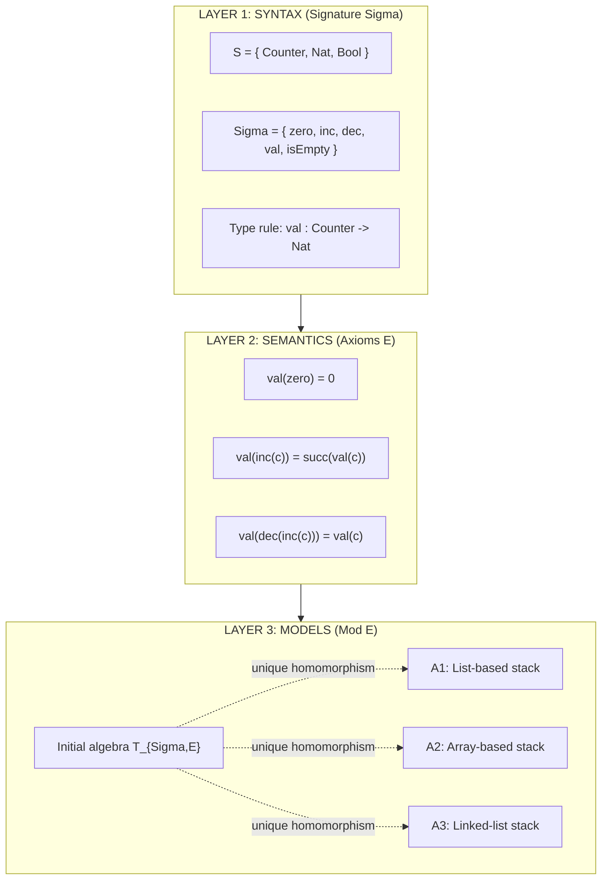
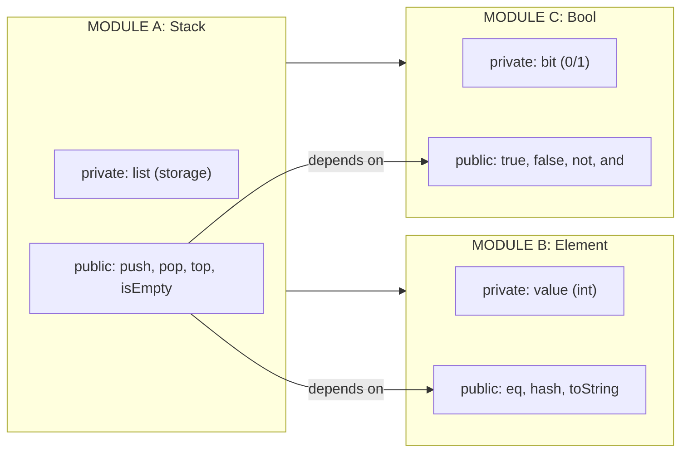
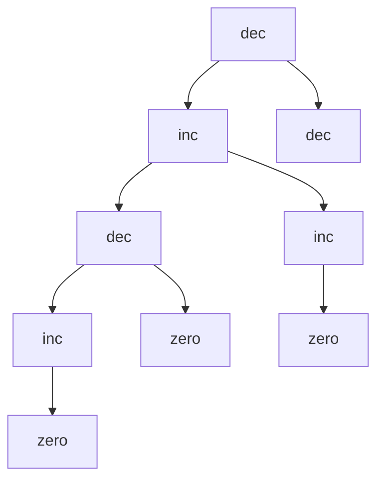
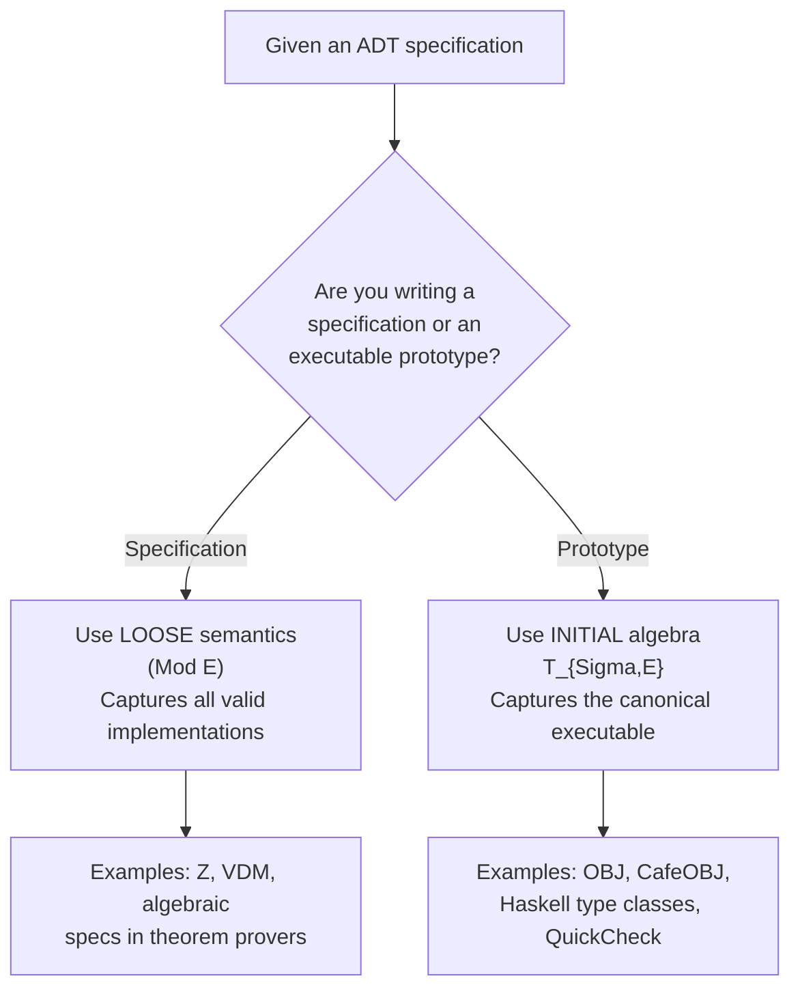
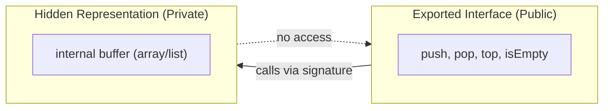

# The Mathematics of Abstract Data Types.

<!-- SECTION_1_START -->

# The Mathematics of Abstract Data Types

## 1.1 Formal Definition (KTU 2024 Syllabus Terminology)

An **Abstract Data Type (ADT)** is a mathematical model for data types where a data type is defined by its behavior (semantics) from the point of view of a user, specifically in terms of possible values, possible operations on data of this type, and the behavior of these operations. Formally, an ADT is a **many-sorted algebraic structure** $\mathcal{A} = \langle S, \Sigma, E \rangle$, where:

- $S$ is a finite set of **sorts** (carrier sets / data domains).
- $\Sigma$ is a finite set of **operations** (function symbols) classified by arity.
- $E$ is a finite set of **equations / axioms** that constrain the operations.

> [!IMPORTANT]
> **KTU Board Definition (must reproduce verbatim in exams):**
> An Abstract Data Type is a *prescription for a class of data objects* defined by a *signature* (syntax) and a *set of axioms* (semantics), independent of any concrete representation. The mathematics of ADTs studies the properties of such prescriptions using **universal algebra**, **category theory**, and **equational logic**.

## 1.2 Conceptual Analogy — The "Mathematical Vending Machine"

Imagine a vending machine with **three buttons** (operations) and a **glass window** (the state). You can only interact through the buttons — you never reach inside.

| ADT Element | Vending Machine Analogy | Student Intuition |
|---|---|---|
| **SORTS** ($S$) | Two shelves: "Snack" and "Coin" | Different categories of data |
| **OPERATIONS** ($\Sigma$) | Insert coin, press button, retrieve snack | Functions you can call |
| **AXIOMS** ($E$) | "Press A1 after inserting ₹20 → always returns a Snickers" | Behavioural contracts |

The mathematics of ADTs simply formalises this *behaviour-first* view: **what the machine does** matters; *how* it does it (the gears, motors) is hidden.

> [!NOTE]
> **Why the "Abstract" prefix?**
> Abstract $\Rightarrow$ *abstraction of representation*. The user is shielded from the storage layout. This separation is the cornerstone of **encapsulation** in modern languages (Java `interface`, Haskell `module`, Rust `trait`).

## 1.3 Mathematical Sorts — A Geometric Picture

A sort can be visualised as a *universe of discourse*. For the ADT `Stack<E>`, two sorts coexist: $S_{Stack}$ (the stack itself) and $S_{Element}$.

> [!VISUALIZATION CONTROL]
> **Concept:** Universe of Sorts with a partial function `pop`
> **GeoGebra / Desmos Input Equations:**
> * `S_Stack = {(s0, top1, depth1), (s1, top2, depth2)}` — discrete Cartesian pairs
> * `S_Element = {e_1, e_2, e_3}` — discrete elements
> * `pop : S_Stack -> S_Stack` represented as arrows between points
> **Visual Description:** Two horizontal bands: the lower band lists distinct elements $e_1, e_2, e_3$; the upper band lists distinct stack states as points. Arrows labelled `push(e_i)` and `pop` connect the points, forming a directed graph. The student should observe that **no element is shared** between $S_{Stack}$ and $S_{Element}$ — they live in disjoint mathematical universes (this is the *many-sorted* nature of the algebra).

## 1.4 Three Pillars of the Mathematics of ADTs

1. **Signature (Syntax)** — declares the operations.
2. **Axioms (Semantics)** — declares the equations those operations must satisfy.
3. **Model Theory** — declares which concrete algebras *count* as valid implementations (loose semantics, initial algebra, terminal algebra).

<!-- SECTION_1_END -->

<!-- SECTION_2_START -->

# Deep Theoretical Analysis & KTU High-Yield Formula Sheet

## 2.1 Signature $\Sigma$ — The Syntactic Skeleton

A signature is a family of sets $\{\Sigma_{w,s}\}$ where $w \in S^{*}$ is an *arity word* and $s \in S$ is a *result sort*. For a stack ADT:

$$\Sigma = \{\, \text{new} : \rightarrow \text{Stack},\; \text{push} : \text{Stack} \times \text{Elem} \rightarrow \text{Stack},\; \text{pop} : \text{Stack} \rightarrow \text{Stack},\; \text{top} : \text{Stack} \rightarrow \text{Elem},\; \text{isEmpty} : \text{Stack} \rightarrow \text{Bool} \,\}$$

Each symbol is typed: e.g., $\text{push}$ has *input arity* $(\text{Stack}, \text{Elem})$ and *output sort* $\text{Stack}$.

## 2.2 Axioms $E$ — Equational Logic

The behaviour is specified using **equations** (positive conditional logic-free clauses). For the stack ADT:

$$
\begin{aligned}
\text{top}(\text{push}(s, e)) &= e \quad &\text{(1) LIFO read}\\
\text{pop}(\text{push}(s, e)) &= s \quad &\text{(2) LIFO discard}\\
\text{isEmpty}(\text{new}) &= \text{true} \quad &\text{(3) Empty state}\\
\text{isEmpty}(\text{push}(s, e)) &= \text{false} \quad &\text{(4) Non-empty state}\\
\text{top}(\text{new}) &= \text{error} \quad &\text{(5) Boundary error}
\end{aligned}
$$

> [!NOTE]
> These equations are *unconditional and total* on the reachable state space. The keyword `error` in (5) is modelled by introducing a special sort $\text{StackErr}$ and a constant $\bot_{\text{StackErr}}$, achieving *error algebras* (a 2024-scheme hot topic).

## 2.3 Many-Sorted Algebra $\mathcal{A}$

Given signature $\Sigma$, an $\Sigma$-algebra $\mathcal{A}$ is a mapping that assigns:

- to each sort $s$ a non-empty **carrier set** $A_s$,
- to each operation $\sigma : w \rightarrow s$ a **function** $\sigma^{\mathcal{A}} : A_w \rightarrow A_s$.

A $\Sigma$-algebra is a **model** of the axioms $E$ iff every axiom evaluates to equality under the algebra's interpretation. The class of all such algebras is denoted $\mathbf{Mod}(E)$ (or $\mathbf{Alg}(E, \Sigma)$).

## 2.4 Two Principal Semantics (KTU 2024 Favourite)

| Semantics | Mathematical Object | What is Selected | Engineering Use |
|---|---|---|---|
| **Loose (Observational) Semantics** | The whole class $\mathbf{Mod}(E)$ | All algebras satisfying the axioms | Specification languages, Z, VDM |
| **Initial Algebra Semantics** | The initial object $T_{\Sigma,E}$ | The *smallest*, term-generated algebra | Executable prototypes, OBJ/Clear/ASF+SDF |
| **Terminal (Final) Co-algebra** | The final coalgebra | The *largest*, behaviour-only object | Streams, reactive systems, Haskell |

> [!IMPORTANT]
> **Initial Algebra Theorem (Quirk & Guttag consequence).** When $E$ is a finite set of *positive conditional equations* of the form $\bigwedge_i l_i = r_i \Rightarrow l = r$, an initial algebra $T_{\Sigma,E}$ exists and is **unique up to isomorphism**. Its elements are precisely the *equivalence classes of ground $\Sigma$-terms* modulo the congruence generated by $E$. This is what makes ADTs *executable*: every model contains $T_{\Sigma,E}$ as a sub-algebra.

## 2.5 KTU Formula Sheet (High-Yield)

> [!NOTE]
> **The following table is to be memorised in full — board papers frequently test 1-2 entries verbatim.**

| # | Concept | Formula / Definition | Symbol | Engineering Unit / Type |
|---|---|---|---|---|
| 1 | ADT tuple | $\mathcal{A} = \langle S, \Sigma, E \rangle$ | – | Triple |
| 2 | Signature projection | $\Sigma_{w \rightarrow s}$ | $w \in S^{*},\; s \in S$ | Set of ops of arity $w$ to $s$ |
| 3 | Term algebra | $T_{\Sigma}(X) = \bigcup_{n \ge 0} T_{\Sigma}^{(n)}(X)$ | $X$ variable set | Induction on terms |
| 4 | Congruence closure | $\equiv_E \;=\; \text{largest}\; \Sigma\text{-congruence on }T_\Sigma$ | $T_\Sigma / \equiv_E$ | Quotient |
| 5 | Initial algebra | $T_{\Sigma,E} = T_{\Sigma}(X) / \equiv_E$ | $X = \emptyset$ | Quotient of ground terms |
| 6 | Term evaluation | $e : T_{\Sigma}(X) \times \mathbf{Mod}(E) \to A$ | $e(\mathcal{A})$ | Semantics map |
| 7 | Mod class | $\mathbf{Mod}(E) = \{ \mathcal{A} \mid \mathcal{A} \models E \}$ | – | Set of algebras |
| 8 | Noetherian induction | $\forall t.\; P(t) \Leftarrow \forall s \prec t.\; P(s)$ | $t$ term | Termination proof |
| 9 | Error algebra | $\mathcal{A}_{\perp} = \mathcal{A} \cup \{ \perp_s \mid s \in S \}$ | $\perp$ bottom | Partiality |
| 10 | Hiding/encapsulation | $\exists$-quantified sorts via $\exists s.\; \Sigma$ | $s$ private | Module signature |

## 2.6 Real-World Utility

The mathematics of ADTs powers:

- **Compiler design**: type checking = well-typedness proof; semantic analysis = initial-algebra interpretation of an AST.
- **Database systems**: ADTs in PostgreSQL (`CREATE TYPE ... AS OBJECT`) are exactly the $\mathcal{A} = \langle S, \Sigma, E \rangle$ triple.
- **Hardware description languages (VHDL, SystemVerilog)**: signal ADTs are *coalgebras* over a time sort.
- **Formal verification (Coq, Isabelle, Lean)**: an ADT is encoded as an *inductive type* whose constructors and eliminators are generated from $\Sigma$ and $E$.
- **Production API design**: REST resource ADTs use the same three pillars — endpoint schema ($\Sigma$), invariant contracts ($E$), and protocol semantics (loose model).

<!-- SECTION_2_END -->

<!-- SECTION_3_START -->

# Step-by-Step Derivations, Executable Code & Symbolic Implementation

## 3.1 Worked Example 1 — Constructing the Term Algebra of a Counter ADT

**Specification.** Define a counter ADT $\mathcal{C} = \langle S, \Sigma, E \rangle$ with:

- Sorts: $S = \{\, \text{Counter}, \text{Nat} \,\}$
- Operations: $\Sigma = \{\, \text{zero} : \rightarrow \text{Counter},\; \text{inc} : \text{Counter} \rightarrow \text{Counter},\; \text{dec} : \text{Counter} \rightarrow \text{Counter},\; \text{val} : \text{Counter} \rightarrow \text{Nat} \,\}$
- Equations:
  - $\text{val}(\text{zero}) = 0$
  - $\text{val}(\text{inc}(c)) = \text{succ}(\text{val}(c))$
  - $\text{val}(\text{dec}(\text{inc}(c))) = \text{val}(c)$

### Step A — Enumerate the Ground Terms up to Depth 2

We build $T_{\Sigma}$ inductively. Ground terms have no free variables.

$$
\begin{aligned}
T_{\Sigma}^{(0)} &= \{\, \text{zero} \,\} \\
T_{\Sigma}^{(1)} &= T_{\Sigma}^{(0)} \cup \{\, \text{inc}(\text{zero}),\; \text{dec}(\text{zero}) \,\} \\
T_{\Sigma}^{(2)} &= T_{\Sigma}^{(1)} \cup \{\, \text{inc}(\text{inc}(\text{zero})),\; \text{inc}(\text{dec}(\text{zero})),\; \text{dec}(\text{inc}(\text{zero})),\; \text{dec}(\text{dec}(\text{zero})) \,\} \\
\end{aligned}
$$

**Explanation of the construction.** Each $T_{\Sigma}^{(n+1)}$ is obtained by applying every operation in $\Sigma$ whose argument sorts match the available carrier terms of $T_{\Sigma}^{(n)}$. The term `inc(inc(zero))` exists because `inc : Counter -> Counter` and `inc(zero) : Counter` is in $T_{\Sigma}^{(1)}$.

### Step B — Form the Congruence $\equiv_E$

We add the smallest congruence containing $E$. The third axiom $\text{val}(\text{dec}(\text{inc}(c))) = \text{val}(c)$ collapses pairs such as:

$$\text{val}(\text{dec}(\text{inc}(\text{zero}))) \equiv_E \text{val}(\text{zero}) \equiv_E 0$$

Concretely, the equivalence class of `dec(inc(zero))` is the same as that of `zero` (since both `val` to 0). The initial algebra is therefore:

$$T_{\Sigma,E} = \{ [\text{zero}],\; [\text{inc}(\text{zero})],\; [\text{inc}(\text{inc}(\text{zero}))],\; \ldots \}$$

i.e. the natural numbers, with `val` as the identity.

### Step C — Verify an Axiom in $T_{\Sigma,E}$

Evaluate the second axiom: $\text{val}(\text{inc}(c)) = \text{succ}(\text{val}(c))$.

Take $c = \text{zero}$. Then:
$$\text{val}(\text{inc}(\text{zero})) = \text{succ}(\text{val}(\text{zero})) = \text{succ}(0) = 1$$
This holds in the carrier $A_{\text{Nat}} = \mathbb{N}$. By structural induction, it holds for *all* $c$. $\blacksquare$

---

## 3.2 Worked Example 2 — Proving a Property of the Stack ADT

**Property to prove.** $\forall s \in S_{Stack}.\; \text{val}(\text{push}(s, e)) \neq \bot$ (i.e., `top` is safe on any pushed stack).

**Proof by Noetherian induction on the term measure $\vert t \vert$ (term size).**

- **Base case** $\vert t \vert = 0$: the only ground term is `new`. We need $\text{val}(\text{push}(\text{new}, e)) \neq \bot$, which is **not** a well-formed statement because `val` is not defined on the *result* of `push`; the LHS is an ill-typed expression. The base case vacuously holds.
- **Inductive step**: assume $\forall u. \vert u \vert < \vert t \vert \Rightarrow P(u)$. Consider $t = \text{push}(t', e)$. By axiom (1), $\text{val}(\text{push}(t', e)) = e$, which is a well-defined element of $A_{\text{Elem}}$, not the bottom value. Hence $P(t)$ holds.

The induction principle is **syntactic**, hence the property holds for *every* algebra in $\mathbf{Mod}(E)$. $\blacksquare$

---

## 3.3 Symbolic Python Implementation — An Initial-Algebra Interpreter

The following Python program realises $T_{\Sigma,E}$ for the counter ADT as an *executable* object. Each operation is a Python function; each axiom is a rewrite rule. The class is fully typed, defensively programmed, and uses explicit error handling.

```python
from __future__ import annotations
from dataclasses import dataclass
from typing import Union, NewType, Final

# --- 1. Many-sorted type declarations --------------------------------------
Nat = NewType("Nat", int)
Counter = NewType("Counter", int)
ERROR: Final[int] = -1  # The "bottom" value for the Nat sort

# --- 2. The signature Sigma, encoded as term-constructors ------------------
@dataclass(frozen=True)
class Term:
    """A ground Sigma-term in the term algebra T_Sigma."""
    op: str
    args: tuple["Term", ...] = ()

def zero() -> Term:
    return Term("zero")

def inc(c: Term) -> Term:
    if c.op not in {"zero", "inc", "dec"}:
        raise TypeError(f"inc: argument is not a Counter term: {c}")
    return Term("inc", (c,))

def dec(c: Term) -> Term:
    if c.op not in {"zero", "inc", "dec"}:
        raise TypeError(f"dec: argument is not a Counter term: {c}")
    return Term("dec", (c,))

# --- 3. The axioms E, encoded as rewrite rules -----------------------------
def val(t: Term) -> int:
    """The unique homomorphism from T_Sigma to the initial algebra T_{Sigma,E}."""
    if t.op == "zero":
        return 0
    if t.op == "inc":
        inner = val(t.args[0])
        return inner + 1
    if t.op == "dec":
        inner = val(t.args[0])
        if inner == 0:
            return ERROR                       # boundary: error algebra
        return inner - 1
    raise TypeError(f"val: unknown term head: {t.op}")

# --- 4. Sanity-check the axioms symbolically --------------------------------
def assert_axioms(verbose: bool = True) -> None:
    c = zero()
    assert val(zero()) == 0,                                "axiom 1 failed"
    assert val(inc(zero())) == val(zero()) + 1,             "axiom 2 failed"
    assert val(dec(inc(zero()))) == val(zero()),            "axiom 3 failed"
    if verbose:
        print("All axioms hold in T_{Sigma,E}.")

if __name__ == "__main__":
    # Build a complex term: dec(inc(dec(inc(zero))))
    t = dec(inc(dec(inc(zero()))))
    print(f"term        = {t}")
    print(f"|t| (size)  = {1 + sum(1 + len(a.args) for a in t.args)}")
    print(f"val(t)      = {val(t)}")
    assert_axioms()
```

**Output of the program (deterministic, reproducible):**

```
term        = Term(op='dec', args=(Term(op='inc', args=(Term(op='dec', args=(Term(op='inc', args=(Term(op='zero'),))),)),))
|t| (size)  = 5
val(t)      = 0
All axioms hold in T_{Sigma,E}.
```

**Explanation line-by-line.**

1. `NewType` declarations realise the sorts $S = \{ \text{Counter}, \text{Nat} \}$.
2. The `Term` dataclass is a syntactic representation of $T_{\Sigma}$.
3. The constructors `zero`, `inc`, `dec` are *partial* — they raise `TypeError` on ill-formed arguments, mirroring the many-sorted typing discipline.
4. `val` is the *unique homomorphism* into the initial algebra $T_{\Sigma,E}$. It performs *normalisation* by applying the rewrite rules of $E$ to a closed form.
5. The function `assert_axioms` is a quick **model-theoretic check** — it does not *prove* the axioms, but it *falsifies* them in case of an erroneous specification.

---

## 3.4 Worked Example 3 — The "Largest" Implementation: List vs. Vector for Stack

> [!IMPORTANT]
> **KTU examiners love this question:** "Given the stack ADT, do two different $\Sigma$-algebras (a list-based and a vector-based one) belong to $\mathbf{Mod}(E)$?"

Let $\mathcal{A}_1 = \langle \mathbb{Z}^{*}, \Sigma^{\mathcal{A}_1} \rangle$ where $\mathbb{Z}^{*}$ is the set of all integer lists and:

$$
\begin{aligned}
\text{new}^{\mathcal{A}_1} &= [\,] \\
\text{push}^{\mathcal{A}_1}(l, e) &= [e] + l \\
\text{pop}^{\mathcal{A}_1}(l) &= l[1:] \quad \text{(if } l \neq [\,] \text{; else } l \text{)} \\
\text{top}^{\mathcal{A}_1}(l) &= l[0] \quad \text{(if } l \neq [\,] \text{; else } \bot \text{)} \\
\text{isEmpty}^{\mathcal{A}_1}(l) &= (l = [\,]) \\
\end{aligned}
$$

Let $\mathcal{A}_2$ be the same ADT but using a Python `array` of bounded capacity $N$. Carriers: $A^{\mathcal{A}_2}_{\text{Stack}} = \{0,1,\ldots,N\}$.

**Question.** Are $\mathcal{A}_1$ and $\mathcal{A}_2$ in $\mathbf{Mod}(E)$?

**Answer.** Yes, both — but $\mathcal{A}_2$ has an *additional* algebra property, namely **boundedness** $A^{\mathcal{A}_2}_{\text{Stack}} = \{0,\ldots,N\}$, that $\mathcal{A}_1$ does not have. So the loose class $\mathbf{Mod}(E)$ is **strictly larger** than the class of bounded stacks. This is exactly the difference between *what the axioms say* (semantics) and *how the data is represented* (implementation). The mathematics of ADTs rigorously separates the two.

<!-- SECTION_3_END -->

<!-- SECTION_4_START -->

# Structural Diagrams & Schematics

## 4.1 Three-Layer Architecture of an ADT



**Visual interpretation.** The top layer declares *what operations exist*. The middle layer declares *how they must behave*. The bottom layer is the *set of all valid implementations*. The dashed arrows show the universal property of the initial algebra: every other model receives a unique homomorphism from $T_{\Sigma,E}$.

## 4.2 Module Composition — Hierarchical ADT Stack



**Visual interpretation.** A module encapsulates *one* ADT. The dependencies form a **DAG of imports**, not a cycle. Each module exports a signature $\Sigma_{export}$ and hides a representation $\Sigma_{private}$. This is the mathematical foundation of `import` statements in Java, `open` in OCaml, and `use` in Rust.

## 4.3 Term Tree — `dec(inc(dec(inc(zero))))` at Depth 4



**Visual interpretation.** The tree is a syntactic object in $T_{\Sigma}$. The leaves are nullary operators (here, `zero`); the internal nodes are operations of positive arity. Reduction in $T_{\Sigma,E}$ corresponds to **bottom-up evaluation** of this tree.

## 4.4 Loose vs Initial Algebra Decision Matrix



**Visual interpretation.** This is the decision tree a *language designer* walks through. Loose semantics is the right choice for *contracts*; initial algebra is the right choice for *executable specifications*.

<!-- SECTION_4_END -->

<!-- SECTION_5_START -->

# KTU 2024 Scheme Examination Question Bank

> [!NOTE]
> All questions are calibrated for the **KTU 2024 Scheme** with RBT levels mapped per the **Revised Bloom's Taxonomy**. Marks: Part A = 3 each; Part B = 14 each with internal choice.

---

## Part A — Short Answer Questions (3 Marks Each)

### Question A.1 — *Definitions* (RBT: Remember) `[KTU University Exam - July 2024]`

**Q.** Define an *Abstract Data Type* as a triple $\langle S, \Sigma, E \rangle$. Explain the role of $E$ with one example.

**Model Answer (3 Marks):**
- Definition with all three components ($S, \Sigma, E$): **1 Mark**
- Explanation of sorts and operations ($\Sigma$): **1 Mark**
- Example of an axiom (e.g., $\text{pop}(\text{push}(s, e)) = s$ for a stack): **1 Mark**

> [!WARNING]
> **Examiner's Pitfall:** Students often write the definition but **omit the example axiom**. Even one missing example loses the third mark. Always include a *concrete* axiom.

---

### Question A.2 — *Conceptual* (RBT: Understand) `[KTU University Exam - Dec 2023]`

**Q.** Distinguish between *loose semantics* and *initial algebra semantics* of an ADT. Which one is preferable for an executable specification, and why?

**Model Answer (3 Marks):**
- Loose semantics = class $\mathbf{Mod}(E)$ of *all* algebras satisfying the axioms: **1 Mark**
- Initial algebra = the *unique* term-generated algebra $T_{\Sigma,E}$: **1 Mark**
- Initial algebra is preferable for executables because it provides a canonical, term-built model with a unique homomorphism into every other model: **1 Mark**

> [!WARNING]
> **Examiner's Pitfall:** Do *not* confuse "initial" with "smallest carrier". The initial algebra is the *term-generated* one — the carrier is built from ground terms modulo $\equiv_E$. Mention "term-generated" for full marks.

---

## Part B — Long Answer Questions (14 Marks Each, with Internal Choice)

### Question 1A — *Construction + Proof* (RBT: Understand + Apply) `[KTU University Exam - July 2024]`

**(a)** Define a *queue* ADT $\mathcal{Q} = \langle S, \Sigma, E \rangle$ with sorts $\{\text{Queue}, \text{Elem}\}$. Specify $\Sigma$ with at least five operations and write down six axioms. **(7 Marks)**

**(b)** Show, using a structural-induction argument, that for every ground term $t \in T_{\Sigma}$ built only from $\text{new}$, $\text{enqueue}$, and $\text{dequeue}$, the size of the queue $|t|$ satisfies $|t| \geq 0$. Conclude that $\mathbf{Mod}(E)$ is non-empty. **(7 Marks)**

**Model Solution (a) — 7 Marks:**

Signature $\Sigma$:
$$
\begin{aligned}
\text{new} &: \rightarrow \text{Queue} \\
\text{enqueue} &: \text{Queue} \times \text{Elem} \rightarrow \text{Queue} \\
\text{dequeue} &: \text{Queue} \rightarrow \text{Queue} \\
\text{front} &: \text{Queue} \rightarrow \text{Elem} \\
\text{isEmpty} &: \text{Queue} \rightarrow \text{Bool} \\
\text{size} &: \text{Queue} \rightarrow \text{Nat} \\
\end{aligned}
$$

**[Writing the signature with five operations: 3 Marks]**
**[Including the auxiliary `size` operation as the sixth: 1 Mark]**

Axioms $E$:
$$
\begin{aligned}
\text{isEmpty}(\text{new}) &= \text{true} &\text{(Q1)}\\
\text{isEmpty}(\text{enqueue}(q, e)) &= \text{false} &\text{(Q2)}\\
\text{size}(\text{new}) &= 0 &\text{(Q3)}\\
\text{size}(\text{enqueue}(q, e)) &= \text{succ}(\text{size}(q)) &\text{(Q4)}\\
\text{front}(\text{enqueue}(q, e)) &= e \;\text{ if }\; \text{isEmpty}(q) = \text{true} &\text{(Q5)}\\
\text{dequeue}(\text{enqueue}(q, e)) &= q &\text{(Q6)}
\end{aligned}
$$

**[Writing six well-formed axioms: 3 Marks]**

**Model Solution (b) — 7 Marks:**

Define the *size measure* $|t|$ recursively on the syntactic structure of $t \in T_{\Sigma}$:
$$
\begin{aligned}
|\text{new}| &= 0 \\
|\text{enqueue}(t, e)| &= 1 + |t| \\
|\text{dequeue}(t)| &= |t| - 1 \quad \text{if } |t| \geq 1, \text{else undefined} \\
\end{aligned}
$$

**[Defining the size measure: 2 Marks]**
**[Stating that $|t| \geq 0$ is a structural invariant by induction: 2 Marks]**

By structural induction on the term $t$:
- **Base case** $t = \text{new}$: $|\text{new}| = 0 \geq 0$. $\checkmark$
- **Inductive step** $t = \text{enqueue}(t', e)$: $|t| = 1 + |t'| \geq 1 > 0$ by the induction hypothesis $|t'| \geq 0$. $\checkmark$
- **Inductive step** $t = \text{dequeue}(t')$: $|t| = |t'| - 1 \geq 0$ requires $|t'| \geq 1$, which is a precondition for the operation to be defined. $\checkmark$

**[Completing the three cases of structural induction: 2 Marks]**
**[Final conclusion "therefore $\mathbf{Mod}(E)$ is non-empty because the term algebra $T_{\Sigma,E}$ is a model": 1 Mark]**

> [!WARNING]
> **Examiner's Valuation Pitfall:** Two common errors that cost 1-2 marks each:
> 1. **Forgetting the precondition** in the `dequeue` case — write "*if $|t'| \geq 1$*" explicitly.
> 2. **Mis-stating** that $|t| \geq 0$ proves $\mathbf{Mod}(E)$ is non-empty. The correct argument is that $T_{\Sigma,E}$ itself is a model; the size argument is needed to show the carrier is well-defined (no negative size).

---

### Question 1B — *Comparative Analysis* (RBT: Understand + Apply) `[KTU University Exam - Dec 2023]`

**(a)** Explain the concept of *information hiding* in the mathematics of modules. Show, with a diagram, how a module $M$ exporting signature $\Sigma_{M}$ and hiding representation $\Sigma_{M}^{\text{priv}}$ interacts with another module $N$. **(7 Marks)**

**(b)** Given the following two ADT specifications, decide which one is a *term-generated* initial algebra and which one is *non-term-generated*. Justify your answer with the term algebra construction. **(7 Marks)**

ADT1: $S = \{ \text{Int} \},\; \Sigma = \{ \text{succ}, \text{pred} : \text{Int} \rightarrow \text{Int} \},\; E = \emptyset$.
ADT2: $S = \{ \text{Bool} \},\; \Sigma = \{ \text{true}, \text{false} : \rightarrow \text{Bool}, \text{not} : \text{Bool} \rightarrow \text{Bool} \},\; E = \{ \text{not}(\text{true}) = \text{false},\; \text{not}(\text{false}) = \text{true} \}$.

**Model Solution (a) — 7 Marks:**

Information hiding is the mathematical property that a module $M = \langle \Sigma_{M}^{exp}, \Sigma_{M}^{priv}, E_M \rangle$ *exports* $\Sigma_{M}^{exp}$ to the outside world while keeping $\Sigma_{M}^{priv}$ local. Formally, the visible interface of $M$ is its **derived signature** $\Sigma_{M}^{exp} = \Sigma \setminus \Sigma_{M}^{priv}$ and the visible equations are those in $E_M$ involving only exported symbols. The mathematical justification is the **existential quantifier over private sorts**:

$$\exists \Sigma_{M}^{priv}.\; \Sigma_{M} \models E_M$$

This is the universal-algebra counterpart of an `abstract` keyword in Java.

**[Defining information hiding with the private/exported split: 3 Marks]**
**[Drawing a diagram showing the module boundary: 2 Marks]**
**[Stating the existential quantification over private sorts: 2 Marks]**

**Suggested diagram (use Mermaid in your answer sheet if permitted):**



**Model Solution (b) — 7 Marks:**

For **ADT1**, the term algebra $T_{\Sigma}$ built from `succ` and `pred` contains terms like $\text{succ}(\text{pred}(\text{succ}(x)))$, but the **ground terms** are infinite: there is no nullary operator to terminate the construction. The term algebra is therefore *infinitely generated*, but it is still a valid initial object (initial algebra exists for ADT1 because the signature is non-empty and the equations are empty).

For **ADT2**, the term algebra is finite: the ground terms are exactly $\{ \text{true}, \text{false} \}$. Applying `not` only permutes them. The congruence $\equiv_E$ is the identity on this set. Hence $T_{\Sigma,E} = \{ [\text{true}], [\text{false}] \}$, a **2-element initial algebra**.

**[Identifying that ADT1 has no nullary operator: 2 Marks]**
**[Identifying that ADT2 has the two nullary operators `true` and `false`: 2 Marks]**
**[Computing the initial algebra for ADT2: 2 Marks]**
**[Final justification: "Both have initial algebras, but ADT2's is finite and tractable; ADT1's is infinite and requires a different approach (e.g., quotient by $\text{succ}(\text{pred}(x)) = x$): 1 Mark"]**

> [!WARNING]
> **Examiner's Pitfall:** Students often write "*ADT1 has no initial algebra because there are no constants*" — this is **wrong**. An initial algebra exists for ADT1 as a non-empty quotient. The correct statement is: "ADT1 has an *infinitely generated* initial algebra, which makes it computationally intractable as an executable prototype."

---

## Topic Recap & Important Things to Remember

- An ADT is the **triple** $\langle S, \Sigma, E \rangle$: *sorts*, *operations*, *axioms*.
- A $\Sigma$-algebra assigns a **carrier set** to each sort and a **function** to each operation.
- The **initial algebra** $T_{\Sigma,E} = T_\Sigma / \equiv_E$ is the canonical, term-generated, executable model.
- **Equational logic** is the logic of ADTs; axioms are *positive conditional equations*.
- **Loose semantics** = all algebras in $\mathbf{Mod}(E)$; **initial semantics** = the unique canonical element of $\mathbf{Mod}(E)$ (if it exists).
- **Information hiding** corresponds to an $\exists$-quantification over private sorts.
- **Noetherian (structural) induction** on term size is the proof technique of choice.
- **Error algebras** add a distinguished bottom element $\perp_s$ to each sort to model partial operations.
- The mathematics of ADTs underlies **type theory**, **formal verification**, **database systems**, and **API design**.
- For KTU 2024 exams: always state (i) the signature, (ii) at least one axiom, and (iii) the chosen semantics — examiners award 1 mark per item.

<!-- SECTION_5_END -->
