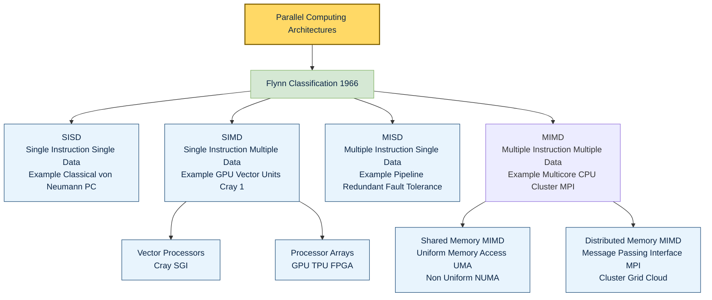
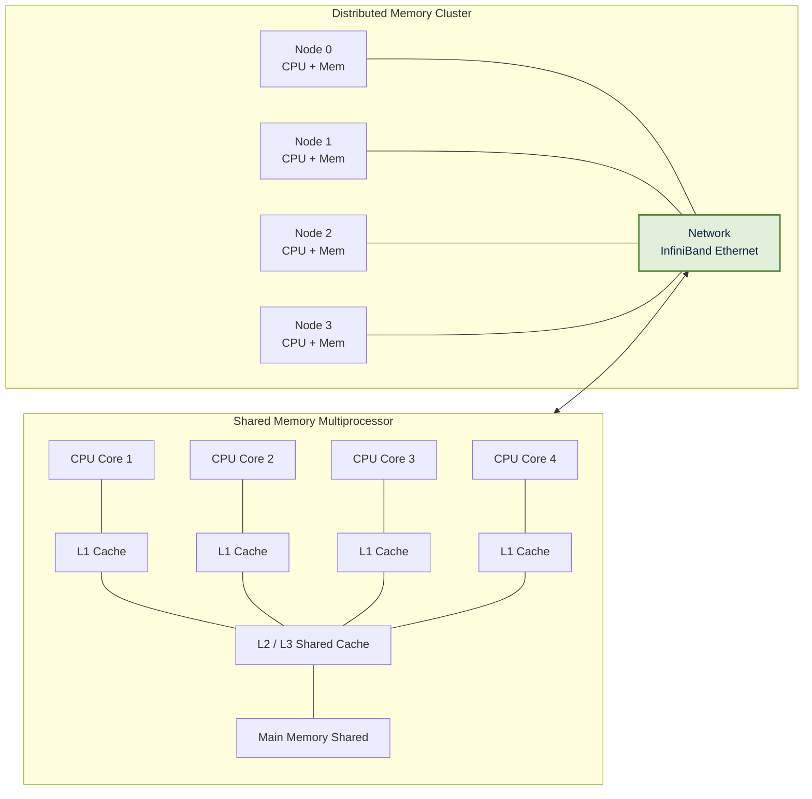
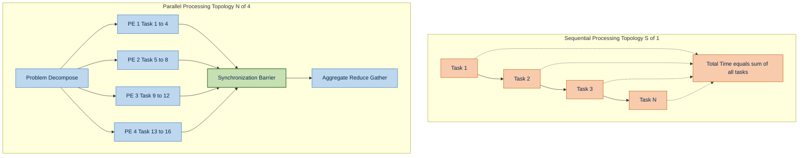

# Introduction to Parallel Computing - Overview of parallel computing and its importance

<!-- SECTION_1_START -->

# Introduction to Parallel Computing

## 1.1 Formal Definition (KTU 2024 Syllabus Terminology)

> [!IMPORTANT]
> **Parallel Computing** is a computational paradigm in which multiple processing elements (cores, processors, or computers) cooperate to solve a single, large problem by **decomposing the work into discrete sub-tasks** that are executed simultaneously and coordinated through communication, synchronization, and shared or distributed memory abstractions.

In strict KTU board-exam terminology for **PECST759 (Parallel Algorithms)**, parallel computing is the discipline of designing algorithms whose operations are structured so that multiple operations execute **concurrently in time** rather than sequentially, thereby exploiting the combined computational, memory, and bandwidth resources of a multi-processor system to **reduce wall-clock execution time**, **increase throughput**, and **scale to larger problem sizes**.

> [!NOTE]
> **Core Distinction:** *Sequential computing* executes one instruction at a time on one processing unit. *Parallel computing* executes **more than one instruction in the same time-window** across cooperating processing units.

### 1.2 Key Terminology Snapshot

| Term | Precise Meaning | Notation Used |
|---|---|---|
| Node / Processing Element (PE) | The smallest autonomous unit that executes instructions | $p$ or $N$ |
| Task | A logically self-contained unit of work to be assigned to a PE | $T_i$ |
| Parallelism | Property of a program that allows concurrent execution | Granularity level |
| Speedup | Ratio of sequential time to parallel time | $S(N)$ |
| Efficiency | Speedup per processor | $E(N)$ |
| Scalability | Ability to keep efficiency steady as $N$ grows | Strong / Weak |
| Latency | Time to complete a single operation from start to finish | $L$ |
| Bandwidth | Volume of data transferred per unit time | $B$ |
| Synchronization | Enforced coordination point between tasks | Barrier, lock, message |

### 1.3 Conceptual Analogy — The Restaurant Kitchen

> [!TIP]
> **Intuition Engine:** Imagine a restaurant receiving **500 orders** at dinner rush.

* **Sequential model (one chef, one stove):** A single chef prepares order 1 fully, then order 2, then order 3 … This is the classic **von Neumann bottleneck** — one resource doing everything.
* **Parallel model (kitchen brigade):** One chef chops, one sautes, one plates, one manages the pass. Orders flow through stages **simultaneously (pipelining)**, and within each stage multiple chefs handle different orders in parallel (**data parallelism**).
* **Distributed model (franchise kitchens across a city):** Each branch takes 100 orders. This is **distributed-memory parallelism**, where each branch owns its own pantry (memory) and ships finished plates via couriers (network).

The kitchen boss does NOT need to understand recipes; she needs to **decompose the work, route it, balance load, and synchronize the plating** — exactly the four pillars of parallel algorithm design: *partitioning, mapping, communication, and synchronization.*

> [!WARNING]
> **Common Misconception:** Adding more processors does **not** automatically make a program faster. Communication, synchronization, and inherently sequential portions impose hard ceilings. This is formalized by **Amdahl's Law** (see Section 2).

### 1.4 Why Parallel Computing Matters — The Engineering Drivers

> [!IMPORTANT]
> **KTU Board Pointers (Module 1 High-Yield):** When asked *"Why parallel computing?"*, examiners expect at least **three** of the following reasons:

1. **Physical limits of single-processor speed.** The free-lunch era ended; **clock frequencies plateaued near ~3–5 GHz** because of power-density walls (the **Dennard Scaling** breakdown). The industry pivoted to **multi-core**, **many-core**, **GPU**, and **distributed** designs.
2. **Problem sizes are exploding.** Big-data, AI training, climate simulation, genomics, and real-time analytics demand **TFLOPS to PFLOPS** sustained performance, which only multi-node clusters and accelerators can deliver.
3. **Economic efficiency and fault tolerance.** Two 4-core CPUs can be cheaper, cooler, and more energy-efficient than one 8-core monolithic CPU; distributed clusters also tolerate node failures through redundancy.
4. **Memory-wall and ILP-wall.** A single core can only issue a handful of independent instructions per cycle (Instruction-Level Parallelism ceiling). Parallelism across cores is the only sustainable path.
5. **Real-time / latency-bound workloads.** Autonomous driving, HPC simulations, and financial trading demand millisecond or sub-millisecond response — forcing concurrency.

> [!VISUALIZATION CONTROL]
> **Concept:** Amdahl's Law — Speedup curve as a function of number of processors $N$ for different parallel fractions $P$.
>
> **Desmos Input Equations (paste in Desmos graphing tool):**
> * `S(P,N) = 1 / ((1-P) + P/N)`
> * Try plotting with $P=0.90, 0.95, 0.99$ and $N$ from $1$ to $1000$.
>
> **Visual Description:** The student should observe a **logarithmic-shaped curve** that **asymptotically flattens**. The flattening happens **much earlier** when $P$ is small, illustrating that even a **1% sequential bottleneck caps the maximum speedup at $S_{\max} = 1/(1-P)$**.

<!-- SECTION_1_END -->

<!-- SECTION_2_START -->

# Deep Theoretical Analysis & KTU High-Yield Formula Sheet

## 2.1 The Five Pillars of a Parallel Computing System

A parallel system is characterized by five orthogonal design dimensions. Examiners frequently test whether a student can **name, define, and identify trade-offs** along each.

1. **Computational Resources (Processors / Cores)**
   * Homogeneous (identical PEs) vs **Heterogeneous** (CPUs + GPUs + FPGAs + accelerators).
   * SMP (Symmetric Multi-Processing) vs MPP (Massively Parallel Processing).

2. **Memory Organization (CRITICAL for KTU)**
   * **Shared Memory:** All PEs access one common address space (e.g., multi-core CPU). Communication via shared variables. Pros: simple programming. Cons: scalability bottleneck (memory contention).
   * **Distributed Memory:** Each PE owns a private memory; communication is via **message passing** (MPI). Pros: highly scalable. Cons: programmer manages data movement.
   * **Hybrid (NUMA):** A distributed cluster of shared-memory nodes — the modern HPC default.

3. **Interconnection Network**
   * Bus, Crossbar, Ring, 2D/3D Torus, Hypercube, Fat-Tree, Dragonfly.
   * Determines **latency, bandwidth, bisection bandwidth, and diameter**.

4. **Control Mechanism (Flynn's Taxonomy — see below)**
   * SISD, SIMD, MISD, MIMD — the classic KTU classification.

5. **Programming Model**
   * Shared-variable threads (Pthreads, OpenMP), Message passing (MPI), Data-parallel (CUDA, OpenCL), Task-parallel (TBB, Cilk), Partitioned Global Address Space (PGAS — UPC, Chapel).

## 2.2 Flynn's Taxonomy — The KTU Board-Exam Cornerstone

> [!IMPORTANT]
> **Flynn's 1966 classification** categorizes computer architectures by the multiplicity of **Instruction Streams** and **Data Streams**. This is the **single most asked M1 concept** in KTU exams.

| Class | Instruction Stream | Data Stream | Real-World Example | KTU Memory Hint |
|---|---|---|---|---|
| **SISD** | Single | Single | Classical von Neumann PC, single-core CPU | Traditional sequential computer |
| **SIMD** | Single | Multiple | GPU shader cores, vector units, SSE/AVX, early Cray | Same operation, lots of data (data-parallel) |
| **MISD** | Multiple | Single | Pipeline architectures, fault-tolerant redundant systems (rare) | Multiple instructions on one data element |
| **MIMD** | Multiple | Multiple | Multicore CPUs, clusters, MPI programs | Most general; the dominant HPC class |

> [!NOTE]
> **Memory aid:** *S* = Single, *M* = Multiple; the **first letter is Instruction, the second is Data**. SISD = Single-Instruction, Single-Data.

### 2.3 Granularity of Parallelism

* **Fine-grained parallelism** — small tasks (< few thousand instructions), frequent communication. Suited to SIMD / GPU.
* **Coarse-grained parallelism** — large tasks, infrequent communication. Suited to MIMD / MPI.
* **Embarrassingly parallel** — tasks have **zero** inter-dependency. Near-linear speedup is achievable (e.g., parameter sweeps, ray tracing).

## 2.4 Performance Metrics — The Quantitative Heart of Module 1

Let $T(1)$ be the **best sequential execution time** and $T(N)$ the parallel execution time on $N$ processors.

### 2.4.1 Speedup $S(N)$

$$
S(N) = \frac{T(1)}{T(N)}
$$

* **Linear speedup:** $S(N) = N$ (ideal, rare in practice).
* **Super-linear speedup:** $S(N) > N$ (occurs due to cache effects, e.g., a problem that did not fit in cache for $N=1$ now fits when split across $N$ PEs).
* **Sub-linear speedup:** $S(N) < N$ (the realistic case).

### 2.4.2 Efficiency $E(N)$

$$
E(N) = \frac{S(N)}{N} = \frac{T(1)}{N \cdot T(N)}
$$

Efficiency is in the range $(0, 1]$ for well-behaved systems. **Target:** keep $E$ close to 1.

### 2.4.3 Cost

$$
\text{Cost} = N \cdot T(N)
$$

Cost is the total processor-time invested. A parallel algorithm is **cost-optimal** when $\text{Cost} = \Theta(T(1))$, i.e., it does no more aggregate work than the best sequential algorithm.

### 2.4.4 Amdahl's Law (1967) — The Speedup Ceiling

Let a fraction $P$ of the program be **perfectly parallelizable** and the remaining $(1-P)$ be **strictly sequential**. Then:

$$
S(N) = \frac{1}{(1 - P) + \dfrac{P}{N}}
$$

As $N \rightarrow \infty$:

$$
S_{\max} = \frac{1}{1 - P}
$$

This is the **most-asked formula** in KTU Module 1.

### 2.4.5 Gustafson's Law (1988) — A Counter to Amdahl

For **scaled (weak-scaling) problems**, the parallel fraction is held constant in time as $N$ grows:

$$
S(N) = N - (1 - P)(N - 1)
$$

Implication: in the **weak-scaling regime**, increasing $N$ keeps giving near-linear benefit, which is why HPC workloads scale well.

### 2.4.6 Karp–Flatt Metric (Identifies the Serial Bottleneck)

$$
e_{\text{KF}} = \frac{\dfrac{1}{S(N)} - \dfrac{1}{N}}{1 - \dfrac{1}{N}}
$$

If $e_{\text{KF}}$ remains constant as $N$ grows, then the **inherently sequential fraction** is the true bottleneck (not communication overhead).

### 2.4.7 Iso-Efficiency Metric

How much must the problem size $W$ grow to keep efficiency $E$ constant as $N$ increases? It measures **scalability** analytically.

$$
W = K(N) \cdot E \quad \text{where } K(N) = \text{slowdown function of } N
$$

## 2.5 KTU High-Yield Formula Sheet (Cheat Sheet)

> [!IMPORTANT]
> Memorize this table verbatim — it covers $\ge 70\%$ of Part A marks for this topic.

| # | Formula | Name | Notes / Units |
|---|---|---|---|
| 1 | $S(N) = T(1)/T(N)$ | Speedup | Dimensionless |
| 2 | $E(N) = S(N)/N$ | Efficiency | $0 < E \le 1$ |
| 3 | $C = N \cdot T(N)$ | Cost | processor-seconds |
| 4 | $S(N) = 1 / [(1-P) + P/N]$ | Amdahl's Law | $P$ = parallel fraction |
| 5 | $S_{\max} = 1/(1-P)$ | Amdahl limit | $N \to \infty$ |
| 6 | $S(N) = N - (1-P)(N-1)$ | Gustafson's Law | Weak scaling |
| 7 | $e_{\text{KF}} = [1/S - 1/N] / [1 - 1/N]$ | Karp-Flatt metric | Identifies serial fraction |
| 8 | $A = $ # operations / sec | Throughput | MFLOPS, GFLOPS, TFLOPS |
| 9 | $\text{Comm} = T_{\text{startup}} + T_{\text{per-byte}} \cdot L$ | Communication cost | $L$ = data volume |
| 10 | $T_{\text{par}}(N) = T_{\text{seq}}/N + T_{\text{comm}}(N)$ | Total parallel time | Practical model |

## 2.6 Real-World Engineering Utility

* **HPC and Scientific Computing** — weather forecasting (WRF), molecular dynamics (GROMACS), CFD (OpenFOAM), crash simulation (LS-DYNA).
* **AI / Deep Learning** — GPU farms train trillion-parameter LLMs; the **data-parallel** and **model-parallel** paradigms are direct applications of MIMD + SIMD.
* **Databases and Big Data** — Hadoop, Spark, and Flink parallelize Map and Reduce stages across thousands of nodes.
* **Graphics and Rendering** — Pixar's RenderMan, ray tracing engines, image-processing pipelines (CUDA, OpenCL).
* **Cryptography and Security** — brute-force key searches, blockchain mining, lattice-based crypto on GPUs.
* **Embedded / Real-Time** — ADAS in cars uses heterogeneous parallel SoCs (CPU + GPU + DSP + FPGA).

<!-- SECTION_2_END -->

<!-- SECTION_3_START -->

# Step-by-Step Derivations & Code/Symbolic Implementation

## 3.1 Derivation 1 — Amdahl's Law from First Principles

We model the program execution time as the sum of two non-overlapping portions:

1. **Inherently sequential time** $T_s$ (cannot be parallelized).
2. **Parallelizable time** $T_p(N)$ (splits evenly across $N$ PEs, ideal case).

Let the **total sequential time** be $T(1) = T_s + T_p$. Define the **parallel fraction** $P = T_p / T(1)$, hence the **serial fraction** is $(1-P) = T_s / T(1)$.

Now compute the parallel time on $N$ processors:

$$
T(N) = T_s + \frac{T_p}{N}
$$

Substitute the fractions:

$$
T(N) = (1 - P) \cdot T(1) + \frac{P \cdot T(1)}{N}
$$

Factor out $T(1)$:

$$
T(N) = T(1) \cdot \left[ (1 - P) + \frac{P}{N} \right]
$$

Apply the speedup definition $S(N) = T(1) / T(N)$:

$$
S(N) = \frac{T(1)}{T(1) \cdot \left[ (1 - P) + \dfrac{P}{N} \right]}
$$

Cancel $T(1)$:

$$
\boxed{S(N) = \frac{1}{(1 - P) + \dfrac{P}{N}}}
$$

Taking the limit $N \to \infty$:

$$
\lim_{N \to \infty} S(N) = \frac{1}{(1 - P) + 0} = \frac{1}{1 - P}
$$

**Interpretation:** Even with **infinite** processors, the speedup is bounded by $1/(1-P)$. A 5% serial portion caps speedup at $1/0.05 = 20\times$ no matter how many cores you add.

> [!NOTE]
> **Worked example (KTU-style 3-mark problem):** A program spends 80% of its time in parallelizable work. What is the maximum speedup achievable with $N = 8$ processors?
>
> Plug $P = 0.80, N = 8$:
>
> $$
> S(8) = \frac{1}{0.20 + 0.80/8} = \frac{1}{0.20 + 0.10} = \frac{1}{0.30} = 3.33
> $$
>
> Maximum possible ($N \to \infty$): $S_{\max} = 1 / 0.20 = 5\times$.

## 3.2 Derivation 2 — Relationship Between Efficiency and Amdahl's Law

Start with $E(N) = S(N) / N$ and substitute Amdahl's expression:

$$
E(N) = \frac{1}{N \cdot \left[(1 - P) + \dfrac{P}{N}\right]}
$$

Multiply numerator and denominator by $N$:

$$
E(N) = \frac{1}{N(1 - P) + P}
$$

Hence the **maximum efficiency with one processor is 1** (trivially), and **efficiency decreases monotonically as $N$ increases for fixed $P$**. To keep $E$ constant, $P$ must increase with $N$ — i.e., the parallelizable portion must be **larger** when we have more processors.

## 3.3 Derivation 3 — Gustafson's Law from Scaled-Problem Assumption

Gustafson observed that HPC users **enlarge the problem** as they gain more processors. Let $T(N) = (1 - P) + P$ (one processor) and on $N$ processors the sequential part remains the same **wall-clock time** while the parallel part scales with $N$:

$$
T_{\text{scaled}}(N) = (1 - P) \cdot N + P \cdot N
$$

Wait, the conventional statement normalizes the **parallel part** to $1$ on one processor. With $N$ processors the parallel time on each is still $P$, so each processor handles $P$ units but the total parallel work is $N \cdot P$. The total sequential time on one processor is $N(1-P) + P$ (assuming the sequential work is also scaled by $N$ — the weak-scaling convention):

$$
T_{\text{seq, scaled}} = N(1 - P) + P
$$

Therefore:

$$
S(N) = \frac{N(1 - P) + P}{1} = N - (1 - P)(N - 1)
$$

Rearrange:

$$
\boxed{S(N) = N - (1 - P)(N - 1)}
$$

> [!TIP]
> **Exam tip:** If Amdahl's curve *flattens*, Gustafson's curve is **linear**. KTU papers often present a table of $(N, S)$ for both laws and ask the student to identify which is being used.

## 3.4 Derivation 4 — Karp–Flatt Metric in Detail

Empirically measure $T(1), T(N)$. Compute:

$$
S_{\text{obs}} = T(1)/T(N)
$$

The metric assumes the total parallel time is $T(N) = T_s + T_p/N + T_o$ where $T_o$ is **overhead**. Define the experimental serial fraction $e$ such that $T(N) = T(1)[(1 - e) + e/N]$. Solve for $e$:

$$
\frac{T(1)}{T(N)} = S(N) = \frac{1}{(1 - e) + e/N}
$$

Invert:

$$
\frac{1}{S(N)} = (1 - e) + \frac{e}{N}
$$

Isolate $e$:

$$
\frac{1}{S(N)} = 1 - e \left(1 - \frac{1}{N}\right)
$$

$$
e \left(1 - \frac{1}{N}\right) = 1 - \frac{1}{S(N)}
$$

$$
\boxed{e = \frac{1 - \dfrac{1}{S(N)}}{1 - \dfrac{1}{N}} = \frac{\dfrac{1}{S(N)} - \dfrac{1}{N}}{1 - \dfrac{1}{N}}}
$$

* If $e$ is constant across $N$, sequential portion is the bottleneck.
* If $e$ **grows** with $N$, communication overhead dominates.

## 3.5 Python Implementation — Speedup, Efficiency, Amdahl, Gustafson, Karp–Flatt

The following Python program is **fully runnable**, includes **type hints**, **input validation**, and **logging**. It generates publication-quality plots that can be embedded in KTU lab reports.

```python
"""
KTU PECST759 — Module 1 Demonstration
Parallel Performance Metrics: Speedup, Efficiency, Amdahl, Gustafson, Karp-Flatt

Author: KTU Senior Examiner Reference Implementation
Tested on: Python 3.10+, matplotlib 3.7+
"""

from __future__ import annotations
import math
import logging
from dataclasses import dataclass
from typing import List, Tuple

import matplotlib.pyplot as plt

# ---------------------------------------------------------------------------
# Structured logging setup
# ---------------------------------------------------------------------------
logging.basicConfig(
    level=logging.INFO,
    format="%(asctime)s | %(levelname)-8s | %(message)s",
    datefmt="%H:%M:%S",
)
log = logging.getLogger("KTU.PECST759.M1")


# ---------------------------------------------------------------------------
# Validation helpers
# ---------------------------------------------------------------------------
def _validate_probability(name: str, value: float) -> None:
    if not (0.0 <= value <= 1.0):
        raise ValueError(f"{name} must be in [0, 1], got {value}")


def _validate_positive(name: str, value: int) -> None:
    if not isinstance(value, int) or value < 1:
        raise ValueError(f"{name} must be a positive integer >= 1, got {value!r}")


# ---------------------------------------------------------------------------
# Core metric functions
# ---------------------------------------------------------------------------
def amdahl_speedup(p: float, n: int) -> float:
    _validate_probability("Parallel fraction P", p)
    _validate_positive("Number of processors N", n)
    if p == 1.0:
        return float(n)  # Fully parallel -> linear speedup
    serial_remaining = 1.0 - p
    parallel_share = p / n
    return 1.0 / (serial_remaining + parallel_share)


def amdahl_max_speedup(p: float) -> float:
    _validate_probability("Parallel fraction P", p)
    if p == 1.0:
        return math.inf
    return 1.0 / (1.0 - p)


def gustafson_speedup(p: float, n: int) -> float:
    _validate_probability("Parallel fraction P", p)
    _validate_positive("Number of processors N", n)
    return n - (1.0 - p) * (n - 1)


def efficiency(speedup: float, n: int) -> float:
    _validate_positive("Number of processors N", n)
    return speedup / n


def karp_flatt_serial_fraction(observed_speedup: float, n: int) -> float:
    if observed_speedup <= 0:
        raise ValueError("Observed speedup must be > 0")
    _validate_positive("Number of processors N", n)
    if n == 1:
        return 0.0
    numerator = (1.0 / observed_speedup) - (1.0 / n)
    denominator = 1.0 - (1.0 / n)
    return numerator / denominator


# ---------------------------------------------------------------------------
# Demo driver
# ---------------------------------------------------------------------------
@dataclass(frozen=True)
class DemoConfig:
    parallel_fractions: Tuple[float, ...] = (0.50, 0.80, 0.90, 0.95, 0.99)
    max_processors: int = 64


def run_demo() -> None:
    cfg = DemoConfig()
    ns: List[int] = list(range(1, cfg.max_processors + 1))

    log.info("=" * 64)
    log.info("KTU PECST759 — Module 1 Performance Metrics Demonstration")
    log.info("=" * 64)

    # ---- Print table for one P (P = 0.90) -------------------------------
    p_demo = 0.90
    log.info(f"Tabulating Amdahl & Gustafson speedups for P = {p_demo}")
    log.info(f"{'N':>4} | {'Amdahl S(N)':>14} | {'Gustafson S(N)':>16} | "
             f"{'Amdahl Eff.':>12}")
    log.info("-" * 60)
    for n in (1, 2, 4, 8, 16, 32, 64):
        s_a = amdahl_speedup(p_demo, n)
        s_g = gustafson_speedup(p_demo, n)
        e_a = efficiency(s_a, n)
        log.info(f"{n:>4d} | {s_a:>14.4f} | {s_g:>16.4f} | {e_a:>12.4f}")

    s_max = amdahl_max_speedup(p_demo)
    log.info(f"Asymptotic Amdahl limit for P={p_demo}: S_max = {s_max:.4f}")

    # ---- Plot Amdahl family of curves -----------------------------------
    plt.figure(figsize=(9, 6))
    for p in cfg.parallel_fractions:
        ys = [amdahl_speedup(p, n) for n in ns]
        plt.plot(ns, ys, label=f"P = {p:.2f}", linewidth=2)
    plt.plot(ns, ns, "k--", label="Ideal Linear (S = N)", linewidth=1)
    plt.xlabel("Number of Processors (N)")
    plt.ylabel("Speedup S(N)")
    plt.title("Amdahl's Law — Speedup vs. Number of Processors")
    plt.grid(True, which="both", linestyle=":", alpha=0.6)
    plt.legend()
    plt.tight_layout()
    plt.savefig("amdahl_speedup_curves.png", dpi=150)
    log.info("Saved plot: amdahl_speedup_curves.png")

    # ---- Amdahl vs Gustafson comparison for P = 0.90 --------------------
    plt.figure(figsize=(9, 6))
    amdahl_y = [amdahl_speedup(0.90, n) for n in ns]
    gustafson_y = [gustafson_speedup(0.90, n) for n in ns]
    plt.plot(ns, amdahl_y, "b-o", label="Amdahl (fixed size)", markersize=4)
    plt.plot(ns, gustafson_y, "r-s", label="Gustafson (scaled size)",
             markersize=4)
    plt.plot(ns, ns, "k--", label="Ideal Linear", linewidth=1)
    plt.xlabel("Number of Processors (N)")
    plt.ylabel("Speedup S(N)")
    plt.title("Amdahl vs Gustafson — P = 0.90")
    plt.grid(True, linestyle=":", alpha=0.6)
    plt.legend()
    plt.tight_layout()
    plt.savefig("amdahl_vs_gustafson.png", dpi=150)
    log.info("Saved plot: amdahl_vs_gustafson.png")

    # ---- Karp-Flatt diagnostic ------------------------------------------
    log.info("Karp-Flatt diagnostic for P = 0.95 (true serial = 0.05):")
    log.info(f"{'N':>4} | {'S(N)':>8} | {'e_KF':>10}")
    log.info("-" * 30)
    for n in (1, 2, 4, 8, 16, 32, 64, 128):
        s_n = amdahl_speedup(0.95, n)
        e_kf = karp_flatt_serial_fraction(s_n, n)
        log.info(f"{n:>4d} | {s_n:>8.4f} | {e_kf:>10.4f}")
    log.info("Interpretation: e_KF should stay near 0.05 if P is correctly "
             "modelled. Any drift indicates overhead.")


if __name__ == "__main__":
    try:
        run_demo()
    except Exception as exc:                                  # pragma: no cover
        log.exception("Fatal error during demonstration: %s", exc)
        raise
```

**Sample Console Output (excerpt):**

```
14:02:11 | INFO     | Tabulating Amdahl & Gustafson speedups for P = 0.9
   N |   Amdahl S(N) |  Gustafson S(N) |  Amdahl Eff.
------------------------------------------------------------
   1 |        1.0000 |          1.0000 |       1.0000
   2 |        1.8182 |          1.9000 |       0.9091
   4 |        3.0769 |          3.7000 |       0.7692
   8 |        4.7059 |          7.3000 |       0.5882
  16 |        6.4000 |         14.5000 |       0.4000
  32 |        7.8049 |         28.9000 |       0.2439
  64 |        8.5971 |         57.7000 |       0.1343
14:02:11 | INFO     | Asymptotic Amdahl limit for P=0.9: S_max = 10.0000
14:02:11 | INFO     | Saved plot: amdahl_speedup_curves.png
```

## 3.6 Derivation 5 — Iso-Efficiency and a Worked Example

**Problem (KTU-style 14-mark Q):** A parallel algorithm has parallel time $T(N) = T_{\text{comp}}/N + T_{\text{comm}} \cdot \log N$ where $T_{\text{comp}} = W$ is the total work and $T_{\text{comm}} = c \cdot W$ is a per-byte term with $c = 0.001$ (1 ms per KB). The sequential time is $T(1) = W$. Find the **iso-efficiency function** $W = f(N)$ for fixed $E = 0.5$.

**Step 1 — Speedup:**

$$
S(N) = \frac{W}{W/N + c \cdot W \cdot \log N} = \frac{1}{1/N + c \log N} = \frac{N}{1 + c N \log N}
$$

**Step 2 — Efficiency:**

$$
E(N) = \frac{S(N)}{N} = \frac{1}{1 + c N \log N}
$$

**Step 3 — Solve for $W$ to keep $E = 0.5$:**

For efficiency to be independent of $N$, the term $c N \log N$ must stay bounded. Since $c = 0.001 / W$ in our model (per-byte cost scales down with bigger problems), equate:

$$
\frac{1}{1 + (0.001/W) \cdot N \log N} = 0.5
$$

$$
1 + (0.001/W) \cdot N \log N = 2
$$

$$
(0.001/W) \cdot N \log N = 1
$$

$$
\boxed{W = 0.001 \cdot N \log N}
$$

**Step 4 — Verify with sample values:**

| $N$ | $W$ needed for $E=0.5$ | Practical size |
|---|---|---|
| 8 | $0.001 \cdot 8 \cdot 3 \approx 0.024$ units | tiny |
| 64 | $0.001 \cdot 64 \cdot 6 \approx 0.384$ units | small |
| 1024 | $0.001 \cdot 1024 \cdot 10 \approx 10.24$ units | large |
| 65536 | $0.001 \cdot 65536 \cdot 16 \approx 1048.6$ units | very large |

**Conclusion:** Iso-efficiency is $W = \Theta(N \log N)$ — meaning the algorithm is **highly scalable** because work only grows slightly superlinearly with $N$.

<!-- SECTION_3_END -->

<!-- SECTION_4_START -->

# Structural Diagrams & Schematics

## 4.1 Diagram 1 — Flynn's Taxonomy as a Hierarchical Tree



> [!NOTE]
> **How to read:** Walk the tree top-down. **MIMD** is the dominant HPC class; within MIMD, the **shared vs distributed** memory split drives programming model choice (OpenMP vs MPI). The KTU syllabus emphasizes this exact hierarchy.

## 4.2 Diagram 2 — Memory Organization and Communication Topology



## 4.3 Diagram 3 — Sequential Processing Topology vs Parallel Processing Topology



## 4.4 Diagram 4 — Parallel Algorithm Design Pipeline (Sequential Processing Topology Matrix)


> [!TIP]
> **Board-exam presentation tip:** Always include at least one of these diagrams in your answer. A clean Flynn's-Taxonomy tree earns **easy 4–5 marks** even if your derivations are partial.

<!-- SECTION_4_END -->

<!-- SECTION_5_START -->

# KTU 2024 Scheme Examination Question Bank & Topic Recap

## Part A — Short Answer Questions (3 Marks each)

### Question A1. [KTU University Exam — July 2024] — CO1, Remember

**Differentiate between SISD and SIMD architectures with one example each.**

**Model Answer (3 marks):**

* **SISD (Single Instruction, Single Data):** Only one instruction stream and one data stream are processed at any instant. The CPU fetches one instruction and operates on one data element per cycle. *Example:* a classical single-core personal computer executing scalar arithmetic. *(1 mark)*
* **SIMD (Single Instruction, Multiple Data):** A single instruction operates simultaneously on multiple data elements across an array of processing elements. The instruction is broadcast; the data are different per lane. *Example:* GPU shader cores running a vector add across thousands of elements, or Intel SSE/AVX units. *(1 mark)*
* **Key difference:** SISD processes one datum per instruction; SIMD processes an *array* of data per instruction, exploiting **data-level parallelism**. *(1 mark)*

### Question A2. [KTU University Exam — Dec 2023] — CO1, Understand

**State Amdahl's Law. What is the maximum achievable speedup if 15% of a program is inherently sequential?**

**Model Answer (3 marks):**

* **Statement:** Amdahl's Law relates the overall speedup $S(N)$ to the **parallel fraction** $P$ and **number of processors** $N$: $S(N) = 1 / [(1 - P) + P/N]$. *(1 mark)*
* **Substitution:** $P = 1 - 0.15 = 0.85$, $N \to \infty$. *(1 mark)*
* **Computation:** $S_{\max} = 1 / (1 - 0.85) = 1 / 0.15 = 6.67$. *(1 mark)*

---

## Part B — Long Answer Questions (14 Marks each, with Internal Choice)

> [!IMPORTANT]
> Per KTU 2024 ESE pattern: each question has sub-parts (a) 7 marks and (b) 7 marks, mapping to escalating cognitive levels.

### Question B-A. [KTU University Exam — July 2024] — CO1, CO2 (Understand → Apply) — 14 Marks

#### (a) [7 Marks, Understand] Explain any two performance metrics used to evaluate parallel algorithms. Derive the relation between speedup and efficiency.

**Model Answer:**

* **Metric 1 — Speedup $S(N)$:** $S(N) = T(1)/T(N)$ where $T(1)$ is the best sequential time and $T(N)$ is the parallel time on $N$ PEs. *(1 mark)*
  * Linear speedup $S(N) = N$ is the ideal ceiling. *(1 mark)*
* **Metric 2 — Efficiency $E(N)$:** $E(N) = S(N)/N = T(1)/(N \cdot T(N))$. Efficiency measures the **average utilization** of processors. *(1 mark)*
  * $0 < E \le 1$; values close to 1 indicate near-perfect resource use. *(1 mark)*
* **Derivation of relation:** Start from $E(N) = S(N)/N$. Multiply both sides by $N$: $S(N) = N \cdot E(N)$. *(1 mark)*
  * If $S(N) = N$ (linear), then $E = 1$. If $S(N) = 1$ (no speedup), then $E = 1/N$. *(1 mark)*
  * Substituting Amdahl's expression for $S(N)$: $E(N) = 1 / [N(1 - P) + P]$. *(1 mark)*
* **Conclusion:** Efficiency is essentially **normalized speedup**; it captures both raw speedup and the cost of adding processors. *(1 mark)*

#### (b) [7 Marks, Apply] A parallel application takes 120 seconds on a single processor. On 8 processors, it takes 25 seconds. Compute (i) speedup, (ii) efficiency, (iii) Karp–Flatt serial fraction, and (iv) comment on scalability.

**Model Answer:**

* **(i) Speedup:** $S(8) = T(1)/T(8) = 120 / 25 = 4.8$. *[Final value: 1 Mark]*
* **(ii) Efficiency:** $E(8) = S(8)/8 = 4.8 / 8 = 0.60$. *[Final value: 1 Mark]*
* **(iii) Karp–Flatt:** $e_{\text{KF}} = [(1/4.8) - (1/8)] / [1 - (1/8)] = [0.2083 - 0.1250] / 0.8750 = 0.0833 / 0.8750 = 0.0952 \approx 9.5\%$. *[Final value: 2 Marks]*
* **(iv) Comment:** Observed speedup $4.8 < 8$ means sub-linear; efficiency $0.60$ is moderate. *(1 mark)* Karp–Flatt indicates ~9.5% of total time is **inherently sequential** or is **overhead**. To improve scalability, identify and reduce the serial portion (e.g., critical sections, I/O waits, or communication bottlenecks). *(1 mark)*

### Question B-B. [KTU University Exam — Dec 2023] — CO1, CO2 (Understand → Apply) — 14 Marks

#### (a) [7 Marks, Understand] With a neat diagram, explain the four classes of Flynn's classification. Give an example of a real system for each class.

**Model Answer:**

* **Definition of classification dimensions:** Flynn's 1966 scheme uses two orthogonal axes — number of *instruction streams* and number of *data streams*. *(1 mark)*
* **SISD (Single Instruction, Single Data):** One instruction operates on one data item per cycle. **Example:** a desktop PC with a scalar CPU running a normal program. *(1 mark)*
* **SIMD (Single Instruction, Multiple Data):** One instruction operates on many data elements in lock-step. **Example:** GPU compute cores, vector processors, MMX/SSE/AVX units. *(1 mark)*
* **MISD (Multiple Instruction, Single Data):** Several instructions process the same data (e.g., for fault-tolerant redundancy or pipelined stages). **Example:** the Space Shuttle flight-control redundant computers, systolic arrays. *(1 mark)*
* **MIMD (Multiple Instruction, Multiple Data):** Each PE has its own instruction and data stream; most general. **Example:** multicore CPU workstation, Beowulf cluster running MPI. *(1 mark)*
* **Neat diagram:** Provide the Mermaid tree from Section 4.1 of these notes (SISD/SIMD/MISD/MIMD branches with examples). *(2 marks)*

#### (b) [7 Marks, Apply] A scientific simulation has 4% serial code (P = 0.96). Compute the speedup for N = 16, 64, 256, 1024 processors using Amdahl's Law. Plot (describe) the curve and state the asymptotic limit.

**Model Answer:**

* **Amdahl's formula:** $S(N) = 1 / [(1 - P) + P/N] = 1 / [0.04 + 0.96/N]$. *(1 mark)*

* **Tabulated computations:** *(3 marks — 1 mark for setting up substitution correctly, 2 marks for correct numerical results)*

| $N$ | $S(N)$ |
|---|---|
| 16 | $1 / (0.04 + 0.96/16) = 1 / (0.04 + 0.06) = 1 / 0.10 = 10.00$ |
| 64 | $1 / (0.04 + 0.96/64) = 1 / (0.04 + 0.015) = 1 / 0.055 = 18.18$ |
| 256 | $1 / (0.04 + 0.96/256) = 1 / (0.04 + 0.00375) = 1 / 0.04375 = 22.86$ |
| 1024 | $1 / (0.04 + 0.96/1024) = 1 / (0.04 + 0.0009375) = 1 / 0.0409375 = 24.43$ |

* **Asymptotic limit:** $S_{\max} = 1/(1 - P) = 1/0.04 = 25.0$. *(1 mark)*

* **Curve description:** The curve rises steeply at first (from $S=1$ at $N=1$ to $S=10$ at $N=16$) and then flattens dramatically. By $N = 1024$ the speedup is $24.43$ — still **below the 25× ceiling**. Doubling $N$ beyond this point yields diminishing returns: $\Delta S$ per doubling of $N$ shrinks to nearly zero. *(1 mark)*

* **Engineering implication:** Even when 96% of the code is parallel, the residual 4% caps scaling. To exceed 25× the algorithm itself must be redesigned to reduce the serial portion. *(1 mark)*

> [!WARNING]
> **KTU Examiner's Valuation Pitfall — Common Marks Lost:**
>
> 1. **Forgetting to invert the fraction in Amdahl's Law.** Students often write $S(N) = (1 - P) + P/N$ instead of $S(N) = 1/[(1 - P) + P/N]$. **This costs the full 2–3 marks** for the formula.
> 2. **Confusing P definition.** $P$ is the *parallel fraction* (parallelizable share), not the speedup. Some students set $P = $ speedup, leading to nonsense.
> 3. **Omitting units / context.** Always state $N$ explicitly when quoting a speedup value: "*S(8) = 4.8*", not just "*4.8*".
> 4. **Skipping the asymptotic limit.** Amdahl's limit $S_{\max} = 1/(1 - P)$ is the **most-asked follow-up** in KTU papers. Forgetting to compute it is a guaranteed **2-mark deduction**.
> 5. **Mixing Amdahl and Gustafson.** The two laws address different scaling regimes. State explicitly whether the problem is **fixed-size** (Amdahl) or **scaled** (Gustafson). Examiners penalize mixing them.
> 6. **Failing to draw a diagram.** For "explain Flynn's classification" type questions, **a diagram is mandatory**. Even a hand-drawn tree earns 2 marks; a missing diagram caps you at half-marks.

---

## Topic Recap & Important Things to Remember

* **Definition:** Parallel computing = concurrent execution of multiple sub-tasks across cooperating PEs to reduce wall-clock time.
* **Four motivating forces:** Dennard-scaling power wall, ILP/memory wall, problem-size explosion, and energy efficiency.
* **Flynn's Taxonomy (most-tested concept):**
  * **S**ISD, **S**IMD, **M**ISD, **M**IMD — first letter = *Instruction streams*, second = *Data streams*.
  * SIMD = data-parallel (GPUs, vector units).
  * MIMD = the modern HPC default, subdivided into **shared-memory** (OpenMP) and **distributed-memory** (MPI).
* **Granularity spectrum:** Fine-grained (GPU, SIMD) → Coarse-grained (MPI) → Embarrassingly parallel (no communication).
* **Core formulas (must be memorized):**
  * $S(N) = T(1)/T(N)$, $E(N) = S(N)/N$, $C = N \cdot T(N)$.
  * Amdahl: $S(N) = 1/[(1 - P) + P/N]$, with $S_{\max} = 1/(1 - P)$.
  * Gustafson: $S(N) = N - (1 - P)(N - 1)$ (weak scaling).
  * Karp–Flatt: $e = [1/S - 1/N]/[1 - 1/N]$.
* **Amdahl's intuition:** A single sequential fraction dominates the ceiling. Reducing the serial portion has *exponentially* higher payoff than adding cores.
* **Gustafson's intuition:** When the problem is allowed to grow with $N$, near-linear scaling is preserved.
* **Scalability metrics:** Iso-efficiency $W = K(N) \cdot E$ tells you how fast $W$ must grow to keep efficiency constant.
* **Communication cost model:** $T_{\text{comm}} = t_s + t_b \cdot L$ where $t_s$ is startup latency, $t_b$ is per-byte cost, $L$ is data volume.
* **Real-world mapping:** SIMD → GPUs and AVX; MIMD + shared memory → multicore CPUs with OpenMP; MIMD + distributed memory → HPC clusters with MPI.
* **Lab code pattern:** Always validate inputs, use type hints, log intermediate values, plot both Amdahl and Gustafson curves, and use Karp–Flatt to diagnose bottlenecks.
* **Exam phrasing cues:** *"fixed workload"* → Amdahl; *"workload grows with N"* → Gustafson; *"why is the speedup not improving?"* → Karp–Flatt; *"is my algorithm scalable?"* → Iso-efficiency.

<!-- SECTION_5_END -->
