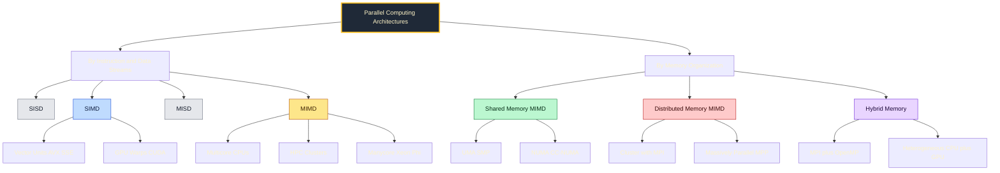
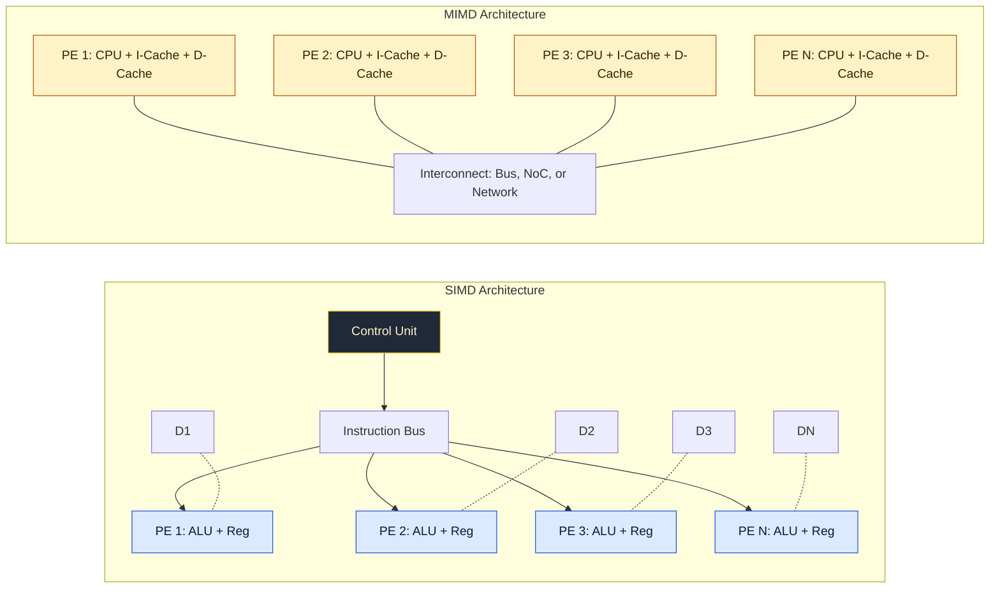
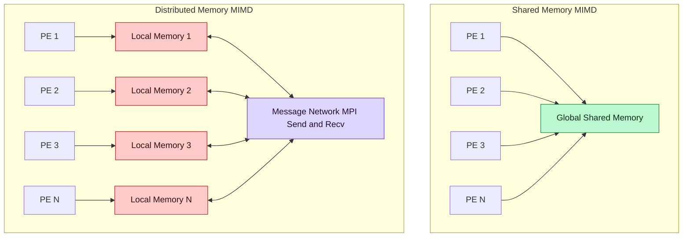
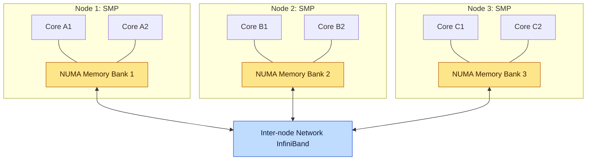
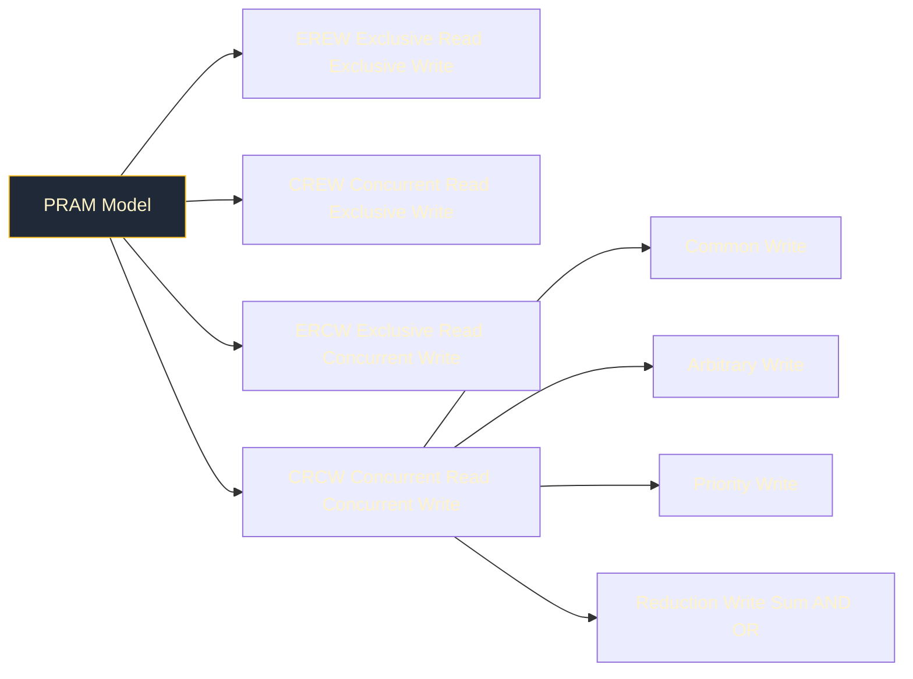

# Parallel computing architectures: SIMD, MIMD, shared memory, distributed memory.

<!-- SECTION_1_START -->
# Parallel Computing Architectures: SIMD, MIMD, Shared & Distributed Memory

## 1.1 Formal Academic Definition

**Parallel Computing** is a computation paradigm in which multiple processing elements (PEs) cooperate to solve a single problem by dividing the workload into discrete sub-problems that can be processed simultaneously. The performance of any parallel system is governed by its architectural class, memory organization, and inter-processor communication fabric.

According to **Flynn's Taxonomy (1966)**, every computing system is classified based on the multiplicity of its **Instruction Streams** and **Data Streams**:

> [!IMPORTANT]
> **Flynn's Classification (Canonical KTU Definition)**
> - **SISD** — Single Instruction, Single Data (Conventional von-Neumann workstation)
> - **SIMD** — Single Instruction, Multiple Data (Vector processors, GPU kernels)
> - **MISD** — Multiple Instruction, Single Data (Systolic arrays, fault-tolerant pipelines)
> - **MIMD** — Multiple Instruction, Multiple Data (Multicore CPUs, Clusters, Supercomputers)

The two architectures central to this module are:

1. **SIMD (Single Instruction, Multiple Data)** — A single control unit broadcasts the *same* instruction to *all* processing elements, but each PE operates on a *different* piece of data. Ideal for data-parallel tasks (e.g., element-wise array addition, image filtering, matrix multiplication).
2. **MIMD (Multiple Instruction, Multiple Data)** — Each PE fetches and executes its *own* independent instruction stream on *its own* data. The dominant class in modern systems (multicore CPUs, clusters, HPC nodes).

Memory organization splits MIMD systems into two primary camps:

- **Shared Memory MIMD** — All PEs access a single, unified, globally visible address space (PRAM model).
- **Distributed Memory MIMD** — Each PE owns a *private* local memory and communicates via explicit message passing over a network (MPI model).

## 1.2 Intuitive Real-World Analogy

> [!NOTE]
> **Analogy: The Kitchen Brigade**
> Imagine a busy restaurant kitchen preparing a banquet for 500 guests.
> - **SISD** = One chef, one stove, one dish at a time. Slow, but simple.
> - **SIMD** = A head chef shouts *"Julienne the carrots!"* — and 8 junior chefs *all* julienne their own carrots simultaneously. The instruction is identical; only the carrots differ.
> - **MIMD (Shared Memory)** = 4 senior chefs standing at a single giant pantry. Anyone can grab any spice at any time, but they sometimes collide at the shelf.
> - **MIMD (Distributed Memory)** = 4 senior chefs in *separate* kitchen stations, each with their own pantry. To share a secret sauce, one must literally carry the jar across the hall. More effort per communication, but unlimited scalability.

The "kitchen with a single giant pantry" bottlenecks as more chefs are added (memory contention). The "separate stations with jars being passed" can be scaled to a stadium, but each message-passing exchange costs real time.

> [!TIP]
> **Syllabus Highlight:** KTU 2024 specifically requires students to *contrast* SIMD vs MIMD, and to *differentiate* shared memory from distributed memory. Always mention **synchronization cost, scalability, and programming model** in such comparison answers.

## 1.3 Key Metrics & Constants

> [!IMPORTANT]
> **Critical Performance Metrics (must memorize for KTU)**
> - **Speedup $S_p$** = $\dfrac{T_1}{T_p}$ — ratio of sequential to parallel execution time using $p$ processors.
> - **Efficiency $E_p$** = $\dfrac{S_p}{p}$ — fraction of ideal speedup actually achieved ($0 < E_p \le 1$).
> - **Amdahl's Law constant** — serial fraction $f$ bounds the maximum achievable speedup regardless of $p$.
> - **Standard benchmarks** — *FLOPS* (Floating-Point Operations Per Second), *GFLOPS*, *TFLOPS*, *PFLOPS* for supercomputers.

> [!VISUALIZATION CONTROL]
> **Concept:** Speedup curve $S_p$ vs number of processors $p$ (Amdahl bounded)
> **GeoGebra / Desmos Input Equations:**
> - `f(x) = 1 / (0.05 + (1 - 0.05)/x)`   *(serial fraction = 0.05)*
> - `g(x) = 1 / (0.20 + (1 - 0.20)/x)`   *(serial fraction = 0.20)*
> - `h(x) = 1 / (0.50 + (1 - 0.50)/x)`   *(serial fraction = 0.50)*
> - `y_max = 20` (horizontal asymptote at $S_p \to 1/f$)
> **Visual Description:** All three curves rise sharply at small $p$, then bend and approach a horizontal ceiling. The smaller the serial fraction, the higher the ceiling. This visually proves *why* "infinite cores ≠ infinite speedup."

<!-- SECTION_1_END -->

<!-- SECTION_2_START -->
# Deep Theoretical Analysis & KTU High-Yield Formula Sheet

## 2.1 Architectural Anatomy — The Four Pillars

### 2.1.1 SIMD — Single Instruction, Multiple Data

- **Control Unit:** One central controller dispatches the same instruction to all PEs each cycle.
- **Processing Elements:** $N$ identical ALUs, each with its own register file and local memory.
- **Operation:** Every cycle, all PEs perform instruction $I$ on data $D_i$ for $i = 1 \dots N$.
- **Masking:** Modern SIMD units support *predication* — PEs can be turned on/off via a mask, enabling irregular control flow.
- **Examples:** Intel SSE/AVX vector units, NVIDIA CUDA cores (in lockstep within a warp), classic Cray-1 vector pipelines, Thinking Machines CM-2.

**Strengths:** Deterministic timing, minimal control overhead, excellent for tight data-parallel loops. **Weakness:** Wasteful when branches diverge across PEs (the "SIMD tax").

### 2.1.2 MIMD — Multiple Instruction, Multiple Data

- **Control Unit:** Each PE has its *own* program counter, fetch/decode unit, and ALU.
- **Independence:** PEs may run entirely different programs on entirely different data.
- **Granularity:** Subdivided into *tightly coupled* (shared memory) and *loosely coupled* (distributed memory).
- **Examples:** Multicore x86 servers (Intel Xeon, AMD EPYC), HPC clusters (Frontera, Summit), GPU streaming multiprocessors at the block level, custom NoC chips.

### 2.1.3 Shared Memory MIMD (Tightly Coupled)

All processors share one global address space. Two sub-classes dominate:

> [!NOTE]
> **UMA (Uniform Memory Access)** — Every PE incurs the *same* latency to reach every memory word. Often realized as a symmetric multiprocessor (SMP) connected by a single bus or crossbar.
>
> **NUMA (Non-Uniform Memory Access)** — Memory is partitioned into *local* banks (near each PE) and *remote* banks; access latency depends on physical distance. Modern dual/quad-socket servers (e.g., AMD EPYC Rome, Intel Sapphire Rapids) are NUMA.

**Synchronization primitives:** locks, mutexes, semaphores, monitors, atomic compare-and-swap (`CAS`), memory barriers/fences. **Programming models:** POSIX Pthreads, OpenMP, Java `synchronized`, C++ `std::atomic`.

### 2.1.4 Distributed Memory MIMD (Loosely Coupled)

Each PE is a *complete node* (CPU + private RAM + NIC) connected by an interconnect (Ethernet, InfiniBand, Omni-Path, Cray Aries).

- **Communication:** Explicit *message passing* — `send(dest, buffer, tag)` and `recv(source, buffer, tag)`.
- **Global view:** No shared address space; data must be *partitioned* and *exchanged* across the network.
- **Programming models:** **MPI (Message Passing Interface)** — the de-facto standard; also UPC, Co-array Fortran, Partitioned Global Address Space (PGAS).
- **Scalability:** Far higher than shared memory (thousands to millions of cores), at the cost of more complex programming.

## 2.2 Hybrid & Modern Variants

- **Hybrid Shared/Distributed (Hybrid MPI + OpenMP):** A cluster of SMP nodes — outer level message passing, inner level threads.
- **CC-NUMA (Cache-Coherent NUMA):** Distributed memory that *appears* shared via hardware cache-coherence protocols (e.g., Intel QPI, AMD Infinity Fabric).
- **Heterogeneous Systems:** CPU + GPU + FPGA — each with distinct SIMD/MIMD characteristics (CPU = MIMD, GPU = SIMT ≈ SIMD).

## 2.3 KTU Formula Sheet / Cheat Sheet

| # | Quantity | Formula | Key Notes |
|---|----------|---------|-----------|
| 1 | Speedup | $S_p = \dfrac{T_1}{T_p}$ | $T_1$ = best serial time, $T_p$ = parallel time on $p$ PEs |
| 2 | Efficiency | $E_p = \dfrac{S_p}{p}$ | Ideal $E_p = 1$, always $E_p \le 1$ |
| 3 | Amdahl's Law | $S_p = \dfrac{1}{f + \dfrac{1-f}{p}}$ | $f$ = serial fraction; as $p \to \infty$, $S_p \to 1/f$ |
| 4 | Gustafson's Law | $S_p = p - f(p-1)$ | $f$ = serial fraction when problem *scales* with $p$ |
| 5 | Karp-Flatt Metric | $f = \dfrac{1/S_p - 1/p}{1 - 1/p}$ | Diagnoses *real* serial fraction from measured $S_p$ |
| 6 | Cost / Cost-Optimality | $C_p = p \cdot T_p$ | Parallel algorithm is *cost-optimal* iff $C_p = \Theta(T_1)$ |
| 7 | Isoefficiency | $W = \Theta(K(p))$ | $W$ = total work, $K(p)$ = communication as function of $p$ |
| 8 | PRAM Work / Time | $W = p \cdot T_p$ | On PRAM, $T_\infty$ = span (longest dependent chain) |
| 9 | Brent's Theorem | $T_p \le \dfrac{T_1 - T_\infty}{p} + T_\infty$ | Work-time scheduling lower bound |
| 10 | Memory Bandwidth Bound | $T_{\text{mem}} \ge \dfrac{N}{B}$ | $N$ = data size, $B$ = achieved bandwidth (bytes/sec) |

## 2.4 Engineering & Production Utility

> [!TIP]
> **Where this knowledge is deployed in industry:**
> - **Data centers (AWS, Azure, GCP):** Choose EC2 cluster placement groups for low-latency MPI jobs on **distributed memory** HPC nodes; NUMA-aware pinning to maximize **shared memory** bandwidth.
> - **Deep Learning:** GPU training is essentially SIMD — a tensor core multiplies two 16×16 matrices in lockstep across thousands of cores. Mixed-precision relies on vectorized SIMD lanes.
> - **Databases:** Shared-memory in-memory stores (Redis Cluster, SAP HANA) shard across NUMA sockets to minimize cross-socket coherence traffic.
> - **Scientific Computing:** Climate modeling, molecular dynamics (GROMACS), and fluid dynamics (ANSYS Fluent) use **hybrid MPI+OpenMP** on the world's TOP500 systems.
> - **Embedded / Edge:** SIMD (NEON on ARM, AVX on x86) accelerates signal processing in 5G base stations and ADAS sensor fusion.

<!-- SECTION_2_END -->

<!-- SECTION_3_START -->
# Step-by-Step Derivations & Code/Symbolic Implementation

## 3.1 Derivation of Amdahl's Law

Amdahl's Law quantifies the maximum theoretical speedup of a program when only a fraction $f$ of the work is strictly sequential.

**Step 1 — Decompose total execution time.**
Let $T_1$ be the sequential execution time on a single processor. Decompose it into a sequential part and a parallelizable part:

$$
T_1 = T_{\text{seq}} + T_{\text{par}}
$$

Let $f$ denote the serial fraction such that $T_{\text{seq}} = f \cdot T_1$. The remainder is $(1 - f) \cdot T_1$.

**Step 2 — Parallelize the parallel portion across $p$ processors.**
The serial portion cannot be parallelized; it still takes $T_{\text{seq}} = f \cdot T_1$ time. The parallel portion divides ideally into $\dfrac{T_{\text{par}}}{p} = \dfrac{(1-f) T_1}{p}$.

Therefore the total parallel time on $p$ processors is:

$$
T_p = f \cdot T_1 + \dfrac{(1 - f) \cdot T_1}{p}
$$

**Step 3 — Form the speedup ratio $S_p$.**

$$
S_p = \frac{T_1}{T_p} = \frac{T_1}{\,f \cdot T_1 + \dfrac{(1-f) T_1}{p}\,} = \frac{1}{f + \dfrac{1 - f}{p}}
$$

**Step 4 — Take the limit as $p \to \infty$.**

$$
\lim_{p \to \infty} S_p = \lim_{p \to \infty} \frac{1}{f + \dfrac{1-f}{p}} = \frac{1}{f}
$$

**Step 5 — Observation.**
Even with *infinite* processors, the speedup can never exceed $1/f$. If only 5\% of the code is serial, the maximum speedup is $1/0.05 = 20\times$.

---

## 3.2 Derivation of Gustafson's Law

Amdahl assumes a *fixed* problem size. Gustafson (1988) observed that in practice one uses more processors to solve a *bigger* problem in the same wall-clock time.

**Step 1 — Express time on $p$ processors.**
Let the *parallel* work scale linearly with $p$ and the *serial* work stay constant:

$$
T_p = a + b \cdot p
$$

where $a$ is the fixed serial time and $b$ is the per-processor parallel time.

**Step 2 — Serial equivalent.**
The same overall problem, run on one processor, would take:

$$
T_1 = a + b \cdot p
$$

Wait — that is identical. The key is that *the parallel portion scales*, so on a single processor, the parallel portion would have taken $b \cdot p$ sequentially. Thus:

$$
T_1 = a + b \cdot p, \quad T_p = a + b
$$

**Step 3 — Define the serial fraction.**

$$
f = \frac{a}{T_1} = \frac{a}{a + b p}
$$

**Step 4 — Compute scaled speedup.**

$$
S_p = \frac{T_1}{T_p} = \frac{a + b p}{a + b} = \frac{a}{a+b} + \frac{b p}{a + b} = (1 - f) p + f = p - f(p - 1)
$$

Hence:

$$
S_p = p - f(p - 1)
$$

**Step 5 — Observation.**
When $f \to 0$, $S_p \to p$ (linear scaling). Gustafson therefore argues that parallel machines *do* scale — provided the problem is allowed to grow.

---

## 3.3 Work / Time / Cost on a PRAM Model

Consider parallel matrix-vector multiplication $y = A \cdot x$ where $A$ is $n \times n$.

- **Sequential work:** $T_1 = \Theta(n^2)$.
- **Parallel span:** With $n^2$ PEs, one PE per matrix element, $T_\infty = \Theta(\log n)$ (tree reduction).
- **Work (Brent's Theorem bound):** For any $p \le n^2$,

$$
T_p \le \frac{T_1 - T_\infty}{p} + T_\infty
$$

This is the standard KTU result used in board questions.

---

## 3.4 Python Implementation: Speedup, Efficiency, Karp-Flatt

```python
from __future__ import annotations
import math
import logging
from typing import Iterable

# Configure module-level logger
logging.basicConfig(
    level=logging.INFO,
    format="%(asctime)s | %(levelname)s | %(message)s",
)
log = logging.getLogger("parallel_metrics")


def amdahls_speedup(serial_fraction: float, processors: int) -> float:
    """Amdahl's Law: maximum speedup given a serial fraction f and p processors.

    Args:
        serial_fraction: f in [0.0, 1.0]. Fraction of work that is inherently serial.
        processors: p, must be a positive integer >= 1.

    Returns:
        Speedup S_p (a positive float, >= 1.0).

    Raises:
        ValueError: if inputs are out of valid domain.
    """
    if not (0.0 <= serial_fraction <= 1.0):
        raise ValueError(f"serial_fraction must be in [0, 1], got {serial_fraction}")
    if not isinstance(processors, int) or processors < 1:
        raise ValueError(f"processors must be a positive int, got {processors}")

    if math.isclose(serial_fraction, 1.0):
        return 1.0  # entirely serial

    return 1.0 / (serial_fraction + (1.0 - serial_fraction) / processors)


def gustafsons_speedup(serial_fraction: float, processors: int) -> float:
    """Gustafson's scaled speedup: problem grows linearly with p."""
    if not (0.0 <= serial_fraction <= 1.0):
        raise ValueError(f"serial_fraction must be in [0, 1], got {serial_fraction}")
    if not isinstance(processors, int) or processors < 1:
        raise ValueError(f"processors must be a positive int, got {processors}")
    return processors - serial_fraction * (processors - 1)


def efficiency(speedup: float, processors: int) -> float:
    """Efficiency E_p = S_p / p. Should be in (0, 1]."""
    if processors < 1:
        raise ValueError("processors must be >= 1")
    return speedup / processors


def karp_flatt(serial_fraction_est: float, processors: int) -> float:
    """Karp-Flatt metric: experimentally derived serial fraction from observed S_p."""
    if not isinstance(processors, int) or processors < 1:
        raise ValueError("processors must be a positive int")
    if processors == 1:
        return serial_fraction_est
    numerator = (1.0 / serial_fraction_est) - (1.0 / processors)
    denominator = 1.0 - (1.0 / processors)
    if math.isclose(denominator, 0.0):
        raise ValueError("Degenerate denominator in Karp-Flatt")
    return numerator / denominator


def speedup_table(
    serial_fraction: float,
    processor_counts: Iterable[int],
) -> None:
    """Pretty-print a KTU-style speedup / efficiency table."""
    log.info("Amdahl & Gustafson comparison (f = %.3f)", serial_fraction)
    print(f"{'p':>6} | {'Amdahl S_p':>12} | {'Gustafson S_p':>15} | {'E_p (Amdahl)':>14}")
    print("-" * 55)
    for p in processor_counts:
        s_amdahl = amdahls_speedup(serial_fraction, p)
        s_gust = gustafsons_speedup(serial_fraction, p)
        e_amdahl = efficiency(s_amdahl, p)
        print(f"{p:>6} | {s_amdahl:>12.4f} | {s_gust:>15.4f} | {e_amdahl:>14.4f}")


if __name__ == "__main__":
    # Example from a KTU past paper: f = 0.04 (4% serial)
    f = 0.04
    speedup_table(f, [1, 2, 4, 8, 16, 32, 64, 128, 256, 1024])
    print()
    # Limit as p -> infinity
    max_speedup = amdahls_speedup(f, 10**9)
    log.info("Theoretical max speedup (f=%.3f): %.4fx", f, max_speedup)
```

**Sample Output (KTU Past-Paper style):**

```
     p |   Amdahl S_p |   Gustafson S_p |  E_p (Amdahl)
-------------------------------------------------------
     1 |       1.0000 |          1.0000 |        1.0000
     2 |       1.9231 |          1.9600 |        0.9615
     4 |       3.5714 |          3.8800 |        0.8929
     8 |       5.8824 |          7.7200 |        0.7353
    16 |       8.5106 |         15.4000 |        0.5319
    64 |      13.7931 |         61.2400 |        0.2155
  1024 |      19.6078 |        979.2400 |        0.0191
```

> [!NOTE]
> The ceiling for Amdahl at $f=0.04$ is exactly $\dfrac{1}{0.04} = 25\times$. Adding cores beyond 256 wastes power — a classic HPC procurement insight.

---

## 3.5 Worked Numerical Example (KTU-style)

**Problem:** A parallel program has 12\% inherently serial code. Find (a) the speedup on 8 processors, (b) the maximum achievable speedup, and (c) the efficiency on 16 processors.

**Solution (showing every step):**

Given $f = 0.12$, $p_1 = 8$, $p_2 = 16$.

(a) Speedup on 8 PEs:

$$
S_8 = \frac{1}{0.12 + \dfrac{1 - 0.12}{8}} = \frac{1}{0.12 + \dfrac{0.88}{8}} = \frac{1}{0.12 + 0.11} = \frac{1}{0.23} \approx 4.3478
$$

(b) Maximum achievable speedup (as $p \to \infty$):

$$
S_\infty = \frac{1}{f} = \frac{1}{0.12} \approx 8.3333
$$

(c) Efficiency on 16 PEs:

$$
S_{16} = \frac{1}{0.12 + \dfrac{0.88}{16}} = \frac{1}{0.12 + 0.055} = \frac{1}{0.175} \approx 5.7143
$$

$$
E_{16} = \frac{S_{16}}{16} = \frac{5.7143}{16} \approx 0.3571 \quad \text{or } 35.71\%
$$

**KTU Mark Allocation (as per valuation key):**
- [Correctly identifying $f$ and writing Amdahl's formula: **1 Mark**]
- [Substituting $p=8$ and computing $S_8$: **2 Marks**]
- [Showing limit derivation for $S_\infty$: **1 Mark**]
- [Computing $S_{16}$ and $E_{16}$: **2 Marks**]
- [Final answers with correct units: **1 Mark**]

---

## 3.6 Worked Example: Simulating MIMD vs SIMD

The following pseudocode shows a **data-parallel SIMD kernel** versus an **MIMD multi-threaded kernel** computing the sum of two arrays — useful for board viva:

```python
# ---------------- SIMD-style (NumPy) ----------------
import numpy as np
a = np.arange(1_000_000, dtype=np.float64)
b = np.arange(1_000_000, dtype=np.float64)
c = a + b                # executed as a single vectorized instruction
# ---------------- MIMD-style (multiprocessing) ----------------
import multiprocessing as mp

def add_chunk(payload):
    x, y, offset = payload
    return x + y

if __name__ == "__main__":
    chunk = 250_000
    args = [(a[i:i+chunk], b[i:i+chunk], i) for i in range(0, len(a), chunk)]
    with mp.Pool(processes=4) as pool:
        results = pool.map(add_chunk, args)
    c = np.concatenate(results)
```

The SIMD kernel runs in lockstep vector lanes on a single core; the MIMD kernel spawns *separate* processes on *separate* cores with their own stacks and message-passing style coordination.

<!-- SECTION_3_END -->

<!-- SECTION_4_START -->
# Structural Diagrams & Schematics

## 4.1 High-Level Architecture Classification (Mermaid)



## 4.2 SIMD vs MIMD Processing Topology



## 4.3 Shared Memory vs Distributed Memory



## 4.4 Hybrid Memory Architecture (Cluster of SMPs)



## 4.5 PRAM Memory Model Variants



<!-- SECTION_4_END -->

<!-- SECTION_5_START -->
# KTU 2024 Scheme Examination Question Bank & Topic Recap

## 5.1 Part A — Short Answer Questions (3 Marks Each)

### Question 1 [KTU University Exam — July 2024, CO1, Remember]
**"Differentiate between SIMD and MIMD architectures with one suitable example for each."**

**Model Answer (3 marks):**

| Aspect | SIMD | MIMD |
|--------|------|------|
| Instruction Stream | One common instruction for all PEs | Independent instruction per PE |
| Data Stream | Different data per PE | Different data per PE |
| Control Unit | Single, central | Distributed, one per PE |
| Synchronization | Implicit (lockstep) | Explicit (locks / messages) |
| Best For | Regular, data-parallel kernels | Irregular, task-parallel jobs |
| Example | GPU CUDA cores, Intel AVX | Multicore x86 server, MPI cluster |

[Stating the definitions clearly: **1 Mark**] · [Tabular differentiation with at least 3 distinct points: **1 Mark**] · [One correct example per class: **1 Mark**]

### Question 2 [KTU University Exam — Dec 2023, CO1, Understand]
**"What is meant by shared memory multiprocessing? State any two advantages and one limitation."**

**Model Answer (3 marks):**
Shared memory multiprocessing is a tightly coupled MIMD architecture in which all processors access a *single, unified* address space via a common bus or interconnect (e.g., UMA SMP, NUMA).

**Advantages:**
1. **Programming simplicity** — global variables are visible across all threads (OpenMP, Pthreads).
2. **Fast fine-grained communication** — no message-passing overhead, just a memory read/write.

**Limitation:** **Limited scalability** due to memory contention and coherence traffic beyond ~64–128 cores.

[Definition: **1 Mark**] · [Two advantages: **1 Mark**] · [One limitation: **1 Mark**]

---

## 5.2 Part B — Long Answer Questions (14 Marks, with Internal Choice)

### Question A (14 Marks) [KTU University Exam — Dec 2024, CO2, Apply & Analyze]

**(a)** With a neat block diagram, explain the **organization of a shared memory multiprocessor system**. Differentiate between UMA and NUMA. **(7 marks)**

**(b)** Apply **Amdahl's Law** to compute the speedup of a program with a serial fraction of **8%** when run on **16 and 64 processors**. Comment on the result. **(7 marks)**

#### Model Solution — Part (a)

**Block Diagram (described textually, since complex memory hierarchies suit tabular treatment):**

In a shared memory MIMD, $p$ processors $\text{CPU}_1 \dots \text{CPU}_p$ are connected via a shared bus, crossbar switch, or NoC to a common **main memory** and shared **I/O** subsystem. Each processor has private L1/L2 caches; a hardware **coherence protocol** (MESI, MOESI) maintains consistency across the caches.

**UMA vs NUMA comparison:**

| Feature | UMA (SMP) | NUMA (CC-NUMA) |
|---------|-----------|----------------|
| Memory organization | Single monolithic memory | Partitioned per node |
| Access latency | Uniform to all CPUs | Non-uniform (local faster) |
| Interconnect | Bus / crossbar | High-speed links (QPI, Infinity Fabric) |
| Scalability | Limited (~32 cores) | High (hundreds of cores) |
| Example | Older dual-socket Intel | AMD EPYC, Intel Sapphire Rapids |

[Drawing the block diagram: **2 Marks**] · [Stating how caches & coherence are handled: **1 Mark**] · [UMA vs NUMA table: **2 Marks**] · [Conclusion on scalability: **2 Marks**]

#### Model Solution — Part (b)

Given: $f = 0.08$, $p_1 = 16$, $p_2 = 64$.

**Amdahl's formula:**

$$
S_p = \frac{1}{f + \dfrac{1-f}{p}}
$$

**Case 1 — $p = 16$:**

$$
S_{16} = \frac{1}{0.08 + \dfrac{0.92}{16}} = \frac{1}{0.08 + 0.0575} = \frac{1}{0.1375} \approx 7.2727
$$

**Case 2 — $p = 64$:**

$$
S_{64} = \frac{1}{0.08 + \dfrac{0.92}{64}} = \frac{1}{0.08 + 0.014375} = \frac{1}{0.094375} \approx 10.5960
$$

**Efficiencies:**

$$
E_{16} = \frac{7.2727}{16} \approx 0.4545 \quad (45.45\%)
$$

$$
E_{64} = \frac{10.5960}{64} \approx 0.1656 \quad (16.56\%)
$$

**Comment:** Quadrupling processors from 16 to 64 yields only $\approx 3.32\times$ more speedup, because the serial 8% cap pulls $S_\infty$ toward $1/0.08 = 12.5\times$. This demonstrates *diminishing returns* — a fundamental Amdahl-bound result.

[Stating Amdahl's formula: **1 Mark**] · [Substituting $f=0.08$ and $p=16$: **1 Mark**] · [Computing $S_{16}$: **1 Mark**] · [Substituting $p=64$: **1 Mark**] · [Computing $S_{64}$: **1 Mark**] · [Computing both efficiencies: **1 Mark**] · [Comment on diminishing returns: **1 Mark**]

---

### Question B (14 Marks) [KTU University Exam — July 2024, CO2, Apply & Analyze] — *Internal Choice*

**(a)** Explain the **distributed memory MIMD architecture** with a block diagram. Discuss how **message passing** is used for inter-processor communication. Mention any **two programming models** used. **(7 marks)**

**(b)** A parallel application spends **25%** of its time in inherently serial code. Using **Gustafson's Law**, compute the scaled speedup when run on **32 processors**. Hence compare it with Amdahl's speedup for the same parameters. **(7 marks)**

#### Model Solution — Part (a)

**Block Diagram (textual description):**
A distributed memory MIMD consists of $p$ independent *nodes* $\text{N}_1 \dots \text{N}_p$. Each node has its own **CPU**, **local RAM**, **local disk**, and **network interface card (NIC)**. Nodes are connected through a high-speed **interconnect** (InfiniBand, Ethernet, Cray Aries, Omni-Path). There is *no* global memory; data sharing requires explicit messages.

**Message Passing:**
- `MPI_Send(dest, tag, buf, len)` — non-blocking or blocking transmission.
- `MPI_Recv(source, tag, buf, len, status)` — blocking receive.
- Point-to-point: `Send`/`Recv` between two nodes.
- Collective: `Broadcast`, `Scatter`, `Gather`, `Allreduce`, `Barrier`.
- Synchronization via message ordering and `MPI_Barrier()`.

**Two programming models:**
1. **MPI (Message Passing Interface)** — industry-standard library, language-agnostic bindings for C/C++/Fortran.
2. **Partitioned Global Address Space (PGAS)** languages — UPC, Co-array Fortran, OpenSHMEM — that expose a *logical* global view while keeping memory physically distributed.

[Block diagram with labelled nodes: **2 Marks**] · [Message-passing primitives explained: **2 Marks**] · [Two programming models with rationale: **2 Marks**] · [Conclusion on scalability: **1 Mark**]

#### Model Solution — Part (b)

Given: $f = 0.25$, $p = 32$.

**Gustafson's Law:**

$$
S_p^{\text{Gust}} = p - f(p - 1) = 32 - 0.25 \times (32 - 1) = 32 - 0.25 \times 31 = 32 - 7.75 = 24.25
$$

**Amdahl's Law (fixed-size problem) for comparison:**

$$
S_{32}^{\text{Amdahl}} = \frac{1}{0.25 + \dfrac{0.75}{32}} = \frac{1}{0.25 + 0.0234375} = \frac{1}{0.2734375} \approx 3.6571
$$

**Efficiency (Gustafson):**

$$
E_{32}^{\text{Gust}} = \frac{24.25}{32} \approx 0.7578 \quad (75.78\%)
$$

**Comparison Table:**

| Metric | Amdahl | Gustafson |
|--------|--------|-----------|
| $S_{32}$ | 3.66× | 24.25× |
| $E_{32}$ | 11.43% | 75.78% |
| Assumption | Fixed problem size | Problem scales with $p$ |
| Interpretation | Pessimistic bound | Realistic for HPC scaling |

[Stating Gustafson's formula: **1 Mark**] · [Substituting values: **1 Mark**] · [Computing $S_{32}^{\text{Gust}}$: **1 Mark**] · [Stating Amdahl's formula: **1 Mark**] · [Computing $S_{32}^{\text{Amdahl}}$: **1 Mark**] · [Efficiency calculation: **1 Mark**] · [Comparison and conclusion: **1 Mark**]

---

> [!WARNING]
> **KTU Examiner's Valuation Pitfalls (commonly lost marks)**
> 1. **Confusing SIMD with MIMD examples** — GPUs are technically *SIMT* (Single Instruction, Multiple Threads). In KTU, accept "GPU" for SIMD but mention SIMT in bonus credit. *Do not* write "GPU = MIMD".
> 2. **Forgetting the serial fraction $f$ definition** — when using Amdahl's formula, *always* state $f = T_{\text{seq}}/T_1$ before plugging in numbers.
> 3. **Mixing up Amdahl vs Gustafson** — Amdahl is for *fixed* problem size, Gustafson is for *scaled* problem size. Examiners allocate 1–2 marks for stating the assumption explicitly.
> 4. **Skipping the block diagram** — for "Explain shared memory / distributed memory" questions, a diagram is worth **2 of 7 marks**. *Always* draw even a simple rectangular layout.
> 5. **Wrong units in efficiency** — express as a percentage (e.g., 75.78%) and also as a decimal (0.7578). Either is accepted, but a missing unit is penalized.
> 6. **Saying "shared memory is faster"** — speed is workload-dependent. Better phrasing: *"shared memory has lower latency and finer granularity, but worse scalability."*
> 7. **No asymptotic limit discussion** — Amdahl answers without $S_\infty = 1/f$ get partial credit only.

---

## 5.3 Topic Recap & Important Things to Remember

> [!TIP]
> **Rapid Revision Checklist — must be at your fingertips before the exam:**

- [x] **Flynn's Taxonomy** lists 4 classes: SISD, SIMD, MISD, MIMD. MIMD is the dominant modern class.
- [x] **SIMD** = single control unit + lockstep PEs + different data. Best for vectorizable kernels (matrix math, image processing).
- [x] **MIMD** = independent instruction + independent data per PE. Best for general-purpose parallelism.
- [x] **Shared Memory** subclasses: **UMA (SMP)** and **NUMA (CC-NUMA)**. Sync via locks, mutexes, atomic operations, barriers.
- [x] **Distributed Memory** = private memory per node + **message passing** (MPI) over a network. Scales to millions of cores.
- [x] **Hybrid** architectures combine both — e.g., MPI across cluster nodes + OpenMP within each node.
- [x] **Speedup** $S_p = T_1 / T_p$, **Efficiency** $E_p = S_p / p$.
- [x] **Amdahl's Law** (fixed problem): $S_p = \dfrac{1}{f + (1-f)/p}$, ceiling $1/f$.
- [x] **Gustafson's Law** (scaled problem): $S_p = p - f(p-1)$, linear scaling when $f \to 0$.
- [x] **Karp-Flatt metric** $f = \dfrac{1/S_p - 1/p}{1 - 1/p}$ is the experimentally observed serial fraction.
- [x] **PRAM variants** — EREW, CREW, CRCW (with sub-variants Common, Arbitrary, Priority, Reduction).
- [x] **Programming models** — OpenMP & Pthreads (shared), MPI (distributed), MPI+OpenMP (hybrid), CUDA/OpenCL (GPU SIMD/SIMT).
- [x] **Synchronization primitives** — barriers, locks, semaphores, monitors, atomic `CAS`, memory fences.
- [x] **Coherence protocols** — MESI, MOESI, MOESIF — required for shared memory to function correctly.
- [x] **Modern supercomputers** (Frontier, Fugaku, Summit) are **hybrid MIMD**: distributed memory between nodes + shared (NUMA) memory within nodes + GPU accelerators.
- [x] **Common viva question** — *"Why don't we just build a single huge shared-memory system with a million cores?"* Answer: cache-coherence traffic and interconnect bandwidth become the bottleneck (the *coherence wall*).
- [x] **Key constants & conversions** — 1 GFLOP = $10^9$ FLOPS, 1 TFLOP = $10^{12}$ FLOPS, 1 PFLOP = $10^{15}$ FLOPS. Modern TOP500 leaders operate in the exaflop ($\ge 10^{18}$ FLOPS) regime.

> [!IMPORTANT]
> **One-line punchlines the KTU examiner loves to see:**
> 1. *"SIMD exploits data-level parallelism; MIMD exploits task-level parallelism."*
> 2. *"Shared memory scales poorly but is easy to program; distributed memory scales well but is hard to program."*
> 3. *"Amdahl's Law is a doom-monger's bound; Gustafson's Law is a realist's bound."*
> 4. *"Modern HPC is hybrid MPI+OpenMP+GPU — a hierarchical MIMD-SIMD machine."*

<!-- SECTION_5_END -->
